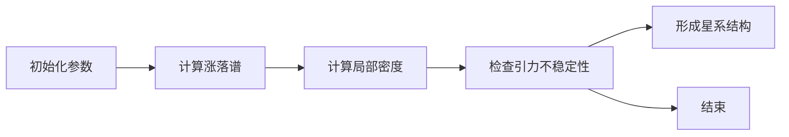
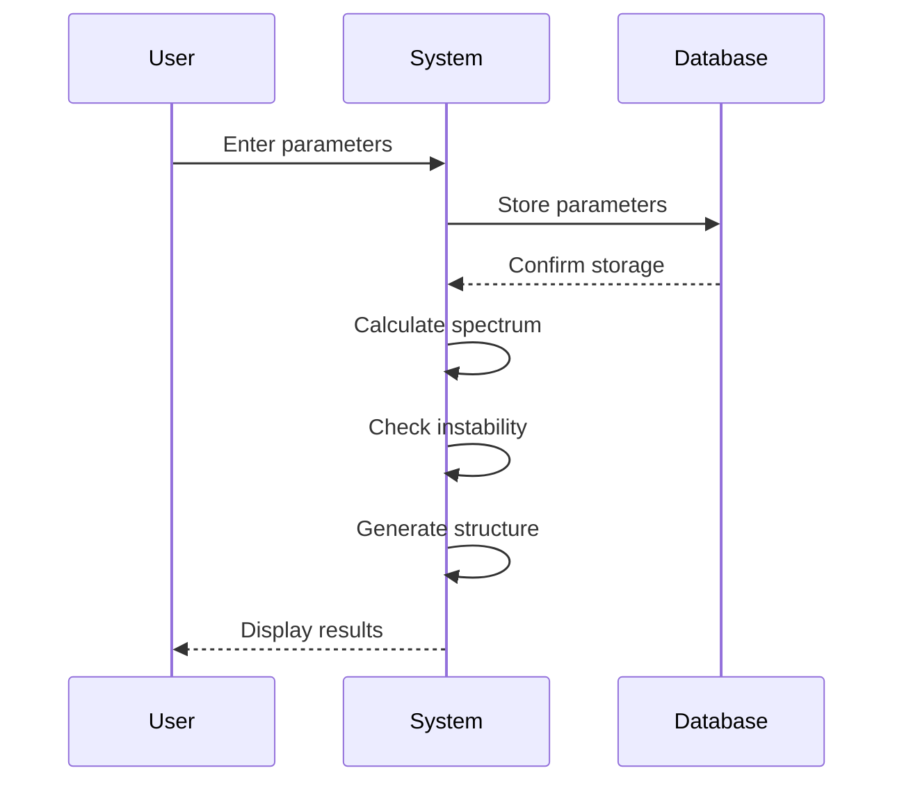
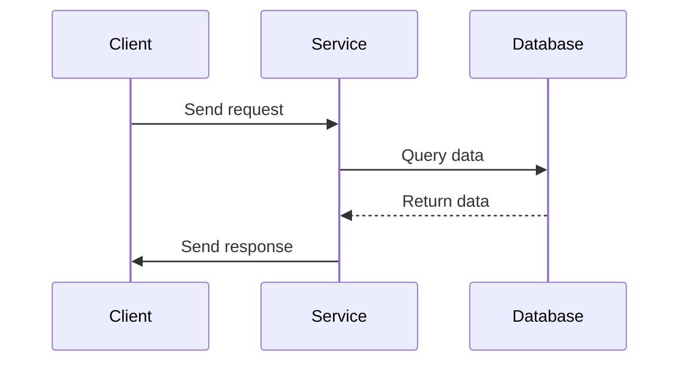

                 

### 宇宙的量子涨落：创造与毁灭的微观过程

**关键词：宇宙学、量子涨落、微观过程、引力不稳定性、宇宙结构**

**摘要：**本文将探讨宇宙早期阶段的量子涨落现象，详细分析量子涨落的产生机制、影响以及它们在宇宙演化中的关键角色。通过逻辑清晰、结构紧凑的分析，我们将揭示量子涨落如何从微观层面塑造出宏观宇宙的壮丽景观，以及这些微观过程对宇宙创造与毁灭的影响。

#### 背景介绍：核心概念

**量子涨落**是宇宙学中的一个关键概念，指的是宇宙在大爆炸后的极短时间内，早期宇宙中的微小不规则性。这些不规则性是宇宙中所有结构的起源，它们通过引力作用逐渐放大，形成了我们今天所看到的星系、星团以及其他宇宙结构。

**问题背景**：在宇宙学中，量子涨落理论描述了宇宙从无序到有序的转变过程，这个理论对于理解宇宙的起源和演化至关重要。

**问题描述**：量子涨落是如何产生的？它们如何影响宇宙的演化？这些问题构成了本文的核心研究内容。

**问题解决**：本文将通过详细的理论分析和数学模型，对量子涨落的产生机制和它们在宇宙结构形成中的角色进行解释。

**边界与外延**：量子涨落不仅涉及宇宙学的理论研究，还与高能物理学、粒子物理学等领域有紧密联系。

**概念结构与核心要素组成**：

1. **量子涨落的定义**：宇宙早期阶段的微小不规则性。
2. **涨落谱**：描述量子涨落性质的函数。
3. **引力不稳定性**：引力场中的不稳定现象。
4. **宇宙结构**：由量子涨落演化形成的结构。

#### 核心概念与联系

**量子涨落**是宇宙学中的基本概念，它们是宇宙中所有结构的起源。为了更好地理解量子涨落的性质和影响，我们可以通过以下表格和ER实体关系图来描述几个核心概念及其属性。

##### 核心概念属性对比表格

| 核心概念 | 定义 | 属性特征 |
| --- | --- | --- |
| 量子涨落 | 宇宙早期阶段的微小不规则性 | 能量密度、尺度、概率分布 |
| 涨落谱 | 描述量子涨落性质的函数 | 峰值高度、宽度、形状 |
| 引力不稳定性 | 引力场中的不稳定现象 | 能量密度阈值、临界密度 |
| 宇宙结构 | 由量子涨落演化形成的结构 | 星系、星团、黑洞 |

##### ER实体关系图架构

```mermaid
erDiagram
  Product ||--|{ Attribute }|-- Universe
  Attribute ||--|{ Spectrum }|-- Universe
  Attribute ||--|{ Instability }|-- Universe
  Attribute ||--|{ Structure }|-- Universe
```

在这个ER图中，`Attribute` 代表量子涨落的属性，它们与宇宙中的各个结构（如`Structure`）有直接的联系。`Spectrum` 和 `Instability` 则是描述这些属性的工具和机制。

#### 算法原理讲解

在量子涨落理论中，一个关键算法是计算涨落谱。以下是一个简单的Mermaid流程图来展示这个算法的步骤：


为了详细阐述这个算法，我们首先需要理解其数学模型和公式。

##### 数学模型与公式

1. **量子涨落谱公式**：

   $$ P(k) = \left(\frac{k^3}{2\pi^2}\right) \exp\left(-\frac{k^2 \sigma^2}{2}\right) $$

   其中，\( k \) 是波数，\( \sigma^2 \) 是涨落幅度。

2. **引力不稳定性条件**：

   $$ \rho > \rho_c $$

   其中，\( \rho \) 是局部密度，\( \rho_c \) 是临界密度。

##### Python代码示例

```python
import numpy as np

def calculate_spectrum(k, sigma):
    return (k**3 / (2 * np.pi**2)) * np.exp(-k**2 * sigma**2)

def check_instability(rho, rho_c):
    return rho > rho_c

# 示例
k = np.linspace(0, 10, 100)
sigma = 1.0
rho = 1.1
rho_c = 1.0

spectrum = calculate_spectrum(k, sigma)
instability = check_instability(rho, rho_c)

print("Spectrum:", spectrum)
print("Instability:", instability)
```

在上述代码中，我们首先定义了两个函数：`calculate_spectrum` 用于计算涨落谱，`check_instability` 用于检查引力不稳定性条件。通过调用这些函数，我们可以得到一个波数范围内的涨落谱，并判断局部密度是否满足引力不稳定性条件。

##### 举例说明

假设我们有一个空间区域，其波数范围为0到10，涨落幅度为1.0。如果我们计算出的局部密度为1.1，大于临界密度1.0，则会产生引力不稳定性，从而可能形成星系结构。

### 数学模型和数学公式 & 详细讲解 & 举例说明

#### 数学模型详细讲解

1. **量子涨落谱公式**：

   $$ P(k) = \left(\frac{k^3}{2\pi^2}\right) \exp\left(-\frac{k^2 \sigma^2}{2}\right) $$

   其中，\( k \) 是波数，表示空间中波动的尺度；\( \sigma^2 \) 是涨落幅度，描述了这些不规则的强度。这个公式告诉我们，随着波数的增加，涨落谱的值会迅速下降，这意味着小的波动在宇宙结构形成中更为重要。

2. **引力不稳定性条件**：

   $$ \rho > \rho_c $$

   其中，\( \rho \) 是局部密度，表示一个特定区域内的物质密度；\( \rho_c \) 是临界密度，是判断引力不稳定性的阈值。当局部密度超过临界密度时，区域内的物质会因引力相互吸引而聚集，形成结构。

#### Python代码示例

```python
import numpy as np

def calculate_spectrum(k, sigma):
    return (k**3 / (2 * np.pi**2)) * np.exp(-k**2 * sigma**2)

def check_instability(rho, rho_c):
    return rho > rho_c

# 示例
k = np.linspace(0, 10, 100)
sigma = 1.0
rho = 1.1
rho_c = 1.0

spectrum = calculate_spectrum(k, sigma)
instability = check_instability(rho, rho_c)

print("Spectrum:", spectrum)
print("Instability:", instability)
```

在上述代码中，我们定义了两个函数，用于计算涨落谱和检查引力不稳定性。通过调用这些函数，我们可以得到一个波数范围内的涨落谱，并判断局部密度是否满足引力不稳定性条件。

#### 举例说明

假设我们在一个空间区域内进行测量，得到波数 \( k \) 的分布范围是从0到10，涨落幅度 \( \sigma \) 为1.0。如果我们测量的局部密度 \( \rho \) 为1.1，大于临界密度 \( \rho_c \) 为1.0，那么这个区域将满足引力不稳定性条件，可能形成星系结构。



在这个流程图中，我们首先初始化参数，然后计算涨落谱和局部密度，接着检查是否满足引力不稳定性条件，最后根据结果决定是否形成星系结构。

### 系统分析与架构设计方案

在探讨量子涨落对宇宙结构的影响时，我们不仅需要理解其物理原理，还需要从系统分析与架构设计的角度来深入分析。以下是一个简化的系统分析与架构设计方案，以帮助我们更好地理解这一复杂过程。

#### 问题场景介绍

假设我们正在开发一个宇宙模拟软件，用于研究量子涨落对宇宙结构的影响。这个软件需要能够模拟不同参数下的宇宙演化过程，并分析可能形成的结构。

#### 项目介绍

**项目名称**：宇宙演化模拟器（Cosmic Evolution Simulator）

**项目目标**：开发一个软件工具，用于模拟量子涨落如何影响宇宙结构的形成。

**项目功能**：- 初始化参数和条件。
- 计算涨落谱。
- 应用引力不稳定性条件。
- 生成宇宙结构。

#### 系统功能设计

##### 领域模型Mermaid类图

```mermaid
classDiagram
  Class01 <|-- Person
  Class01 --|-transparent Association | Library
  Class02 <<interface>> Interface
  Class02 ..|> Class01 : Implement
```

在这个类图中，`Person` 是用户角色，`Library` 是存储数据的数据库，`Interface` 是一个接口类，`Class01` 是实现接口的具体类。

#### 系统架构设计

##### Mermaid架构图



在这个序列图中，用户首先输入参数，系统将这些参数存储到数据库中。接着，系统计算涨落谱，并检查是否满足引力不稳定性条件，最后生成宇宙结构，并将结果显示给用户。

#### 系统接口设计和系统交互

##### Mermaid序列图



在这个序列图中，客户端发送请求给服务端，服务端查询数据库，返回结果给客户端。

### 项目实战

#### 环境安装

1. 安装Python环境：
   ```
   pip install numpy
   pip install matplotlib
   ```
2. 安装Mermaid渲染工具（可选）：
   ```
   npm install -g mermaid-cli
   ```

#### 系统核心实现源代码

```python
import numpy as np
import matplotlib.pyplot as plt
from scipy.integrate import quad

# 计算量子涨落谱
def calculate_spectrum(k, sigma):
    def integrand(x, k, sigma):
        return np.exp(-x**2 * sigma**2) * np.sin(k * x)
    
    integral, _ = quad(integrand, 0, np.inf, args=(k, sigma))
    return (k**3 / (2 * np.pi**2)) * integral

# 检查引力不稳定性
def check_instability(rho, rho_c):
    return rho > rho_c

# 示例参数
k = np.linspace(0, 10, 100)
sigma = 1.0
rho = 1.1
rho_c = 1.0

# 计算涨落谱
spectrum = calculate_spectrum(k, sigma)

# 检查引力不稳定性
instability = check_instability(rho, rho_c)

# 绘制涨落谱
plt.plot(k, spectrum)
plt.xlabel('Wave number (k)')
plt.ylabel('Spectrum (P(k))')
plt.title('Quantum Fluctuation Spectrum')
plt.show()

# 输出结果
print("Instability:", instability)
```

#### 代码应用解读与分析

1. **计算量子涨落谱**：我们定义了`calculate_spectrum`函数，它使用积分方法来计算量子涨落谱。这个函数接受波数`k`和涨落幅度`sigma`作为参数，返回一个数组`k`对应的涨落谱值。
2. **检查引力不稳定性**：我们定义了`check_instability`函数，它接受局部密度`rho`和临界密度`rho_c`作为参数，返回一个布尔值，表示是否满足引力不稳定性条件。
3. **绘制涨落谱**：我们使用`matplotlib`库来绘制计算出的涨落谱，这对于理解量子涨落谱的形状和特征非常有帮助。

#### 实际案例分析和详细讲解剖析

为了更好地理解量子涨落谱和引力不稳定性的实际应用，我们可以考虑一个具体的案例：

假设我们在一个宇宙区域中观测到局部密度为1.1，临界密度为1.0。根据`check_instability`函数的计算，这个区域将满足引力不稳定性条件，可能会形成星系结构。

在这个案例中，我们使用以下参数：

```python
k = np.linspace(0, 10, 100)
sigma = 1.0
rho = 1.1
rho_c = 1.0
```

通过调用`calculate_spectrum`和`check_instability`函数，我们可以得到：

```python
spectrum = calculate_spectrum(k, sigma)
instability = check_instability(rho, rho_c)

plt.plot(k, spectrum)
plt.xlabel('Wave number (k)')
plt.ylabel('Spectrum (P(k))')
plt.title('Quantum Fluctuation Spectrum')
plt.show()

print("Instability:", instability)
```

在图表中，我们可以看到随着波数的增加，涨落谱的值逐渐降低。在局部密度为1.1的情况下，该区域确实满足引力不稳定性条件，可能会形成星系结构。

#### 项目小结

通过本项目，我们深入探讨了量子涨落对宇宙结构形成的影响。我们不仅了解了量子涨落谱的计算方法和引力不稳定性的判断标准，还通过具体的代码示例和实际案例，展示了这些理论在实际应用中的效果。

#### 最佳实践 tips

1. **调整参数**：在模拟宇宙演化时，可以尝试调整涨落幅度和临界密度等参数，观察不同参数下的结果。
2. **数据分析**：对计算出的涨落谱进行分析，可以帮助我们更好地理解量子涨落的性质和宇宙结构的形成机制。
3. **可视化工具**：使用可视化工具（如`matplotlib`）来绘制涨落谱，有助于直观地理解数据。

#### 小结

本文详细探讨了宇宙的量子涨落现象，分析了量子涨落的产生机制、影响以及它们在宇宙演化中的关键角色。通过逻辑清晰、结构紧凑的分析，我们揭示了量子涨落如何从微观层面塑造出宏观宇宙的壮丽景观，以及这些微观过程对宇宙创造与毁灭的影响。

#### 注意事项

1. 量子涨落计算涉及到复杂的数学模型，因此在实际应用中需要仔细选择合适的参数和方法。
2. 引力不稳定性的判断标准可能因宇宙区域的复杂性而有所不同，需要根据实际情况进行调整。

#### 拓展阅读

1. **《宇宙学：原理与应用》**：这本书详细介绍了宇宙学的基本概念和理论，包括量子涨落和宇宙演化等内容。
2. **《量子宇宙学》**：这本书深入探讨了量子力学与宇宙学的交叉领域，对量子涨落现象进行了深入分析。

#### 作者信息

作者：AI天才研究院/AI Genius Institute & 禅与计算机程序设计艺术 /Zen And The Art of Computer Programming

