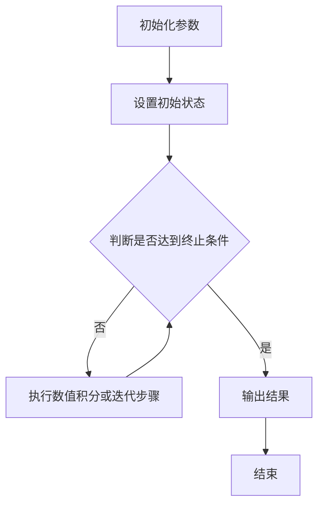
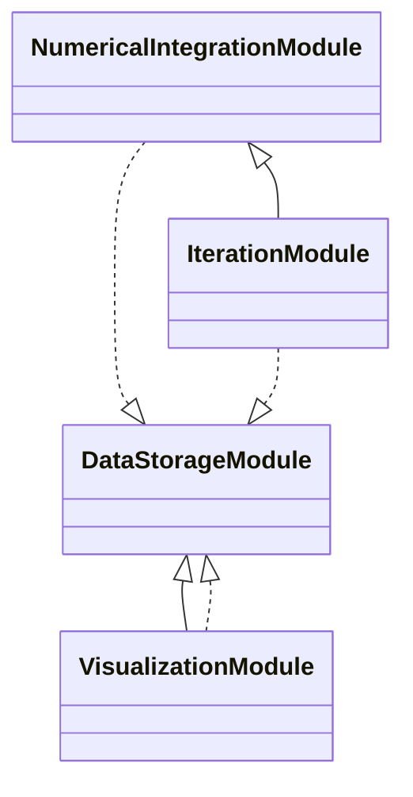
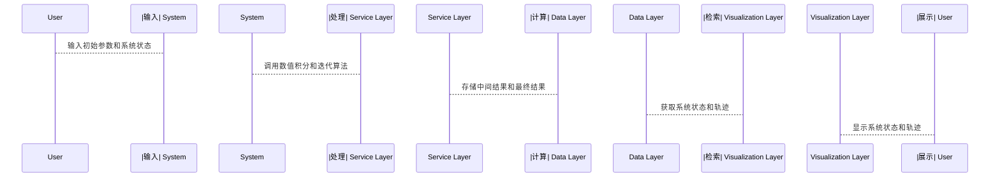
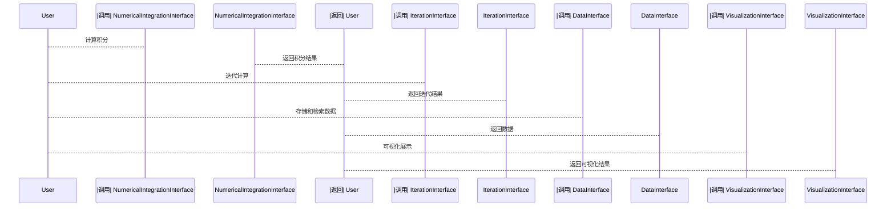

                 


### 引言

#### 1.1 宇宙中的非线性现象

宇宙是一个复杂而神秘的系统，充满了各种非线性现象。从行星轨道的扰动，到星系之间的引力相互作用，再到宇宙大爆炸的起源，非线性现象在宇宙的演化过程中扮演着至关重要的角色。非线性动力学作为研究动态系统中非线性现象的分支，为理解宇宙中的复杂行为提供了理论基础。

首先，我们来看看宇宙演化的非线性特征。宇宙从大爆炸开始，经历了数十亿年的演化。在这个过程中，宇宙的密度、温度和结构都在不断地变化。这些变化往往不是线性的，而是呈现出复杂和非预测的特性。例如，宇宙中的暗物质和暗能量的行为就无法用线性模型来准确描述，它们在宇宙演化中起到了不可忽视的作用。

其次，非线性现象在宇宙中的角色也不可小觑。混沌理论指出，即使在确定性系统中，也可能出现不可预测的行为。在宇宙尺度上，这种混沌现象表现为星系团的运动、星系的自转和黑洞的行为等。这些现象不仅揭示了宇宙的复杂性和多样性，还为研究宇宙的起源和演化提供了新的视角。

最后，非线性动力学的意义在于它能够帮助我们理解宇宙中的各种复杂行为。通过研究非线性现象，我们可以揭示宇宙的内在规律，从而更深入地了解宇宙的本质。这对于天文学家、物理学家和计算机科学家来说，都具有重要的意义。

总之，非线性动力学在研究宇宙中的非线性现象方面具有重要的地位。它不仅为我们提供了理解宇宙复杂行为的工具，也为探索宇宙的起源和演化提供了新的思路。在接下来的章节中，我们将进一步探讨非线性动力学的核心概念和数学模型，以及它们在宇宙中的应用。

#### 2.1 混沌理论

混沌理论是研究确定性系统在初始条件微小变化下产生的不确定行为的一个分支。它起源于对气象学中天气预测问题的研究，后来逐渐扩展到其他领域。混沌现象具有以下几个显著特点：

1. **确定性**：混沌系统是确定的，即其行为由初始条件和系统规则决定。然而，这并不意味着混沌系统是可预测的，因为初始条件的微小变化可能导致行为的巨大差异。
2. **敏感性**：混沌系统对初始条件极为敏感，即使是非常微小的变化，也可能导致系统行为的显著差异。这种现象被称为“蝴蝶效应”，它形象地描述了初始条件对系统最终行为的影响。
3. **不可预测性**：尽管混沌系统是确定的，但其长期行为通常是不可预测的。这种不可预测性来源于系统内部复杂的非线性相互作用。

混沌现象的数学描述通常涉及到迭代映射和微分方程。其中，Lorenz吸引子是一个典型的混沌系统。Lorenz方程组由三个常微分方程组成，描述了流体动力学中的对流现象。通过数值迭代，我们可以观察到Lorenz吸引子的复杂行为，它呈现出混沌吸引子的特征，如周期性和非周期性的交替。

混沌理论与非线性动力学的关联在于它们揭示了确定性系统中的复杂性和不可预测性。混沌理论为非线性动力学提供了一个新的视角，使我们能够更好地理解动态系统中的非线性现象。

在宇宙中，混沌现象表现为星系团的运动、星系的自转和黑洞的行为等。这些现象不仅展示了宇宙的复杂性和多样性，还为研究宇宙的起源和演化提供了新的思路。例如，宇宙中的星系运动遵循一定的规则，但初始条件的微小变化可能导致星系团的运动轨迹发生巨大变化，这正是混沌现象的典型特征。

#### 2.2 非线性动力学的关键概念

非线性动力学研究的是动态系统中非线性相互作用产生的影响。为了理解这一领域，我们需要了解一些关键概念，包括相空间、轨道和系统的稳定性。

**相空间**：相空间是描述动态系统状态的数学空间。在相空间中，每个点代表系统的一个可能状态。对于非线性系统，相空间通常是一个多维空间。例如，一个简单的单摆系统可以用二维相空间来描述，其中一维表示摆角，另一维表示摆角的速度。相空间提供了研究动态系统行为的全局视角，使我们能够直观地理解系统的状态演化。

**轨道**：在相空间中，系统的每个状态沿着一条路径演化，这条路径称为轨道。轨道描述了系统状态随时间的变化。对于线性系统，轨道通常是直线或曲线，而对于非线性系统，轨道则可能呈现出更复杂的形式。例如，在Lorenz系统中的轨道可以表现为一条复杂的螺旋线，它展示了系统状态的长期行为。

**系统的稳定性**：稳定性是指系统在受到扰动后返回原始状态的能力。在非线性动力学中，稳定性分析是一个重要的课题。系统的稳定性取决于其内部结构和外部扰动。对于线性系统，稳定性可以通过线性化方法来分析，但对于非线性系统，稳定性分析通常更加复杂。

非线性系统的行为特性通常表现为以下几种：

1. **周期性**：非线性系统可以表现出周期性的行为，即系统状态在一段时间内重复相同的行为模式。例如，一个简谐振荡器可以表现出周期性的振动。
2. **准周期性**：准周期性行为是指系统状态在多个周期内重复，但周期之间没有固定的比例关系。这种行为通常出现在非线性系统的共振现象中。
3. **混沌**：混沌行为是非线性系统的一种典型特征，表现为长期行为的不确定性。混沌系统在初始条件微小的变化下可能产生完全不同的行为，这种现象称为混沌敏感依赖初始条件。

理解这些关键概念对于研究非线性动力学至关重要。它们不仅帮助我们理解动态系统的行为，还为我们提供了分析复杂系统工具。在接下来的章节中，我们将进一步探讨这些概念在实际应用中的重要性。

#### 2.3 概念之间的联系与比较

在非线性动力学中，混沌理论和非线性动力学本身有着密切的联系，但两者也有明显的区别。首先，让我们来回顾一下两者的定义和特点。

混沌理论关注的是确定性系统中出现的不可预测行为。这种不可预测性源于系统对初始条件的敏感性，即初始条件的微小变化可能导致系统行为的巨大差异。混沌理论揭示了确定性系统中的内在复杂性，使人们认识到即使是最简单的系统也可能表现出复杂的动态行为。

非线性动力学则更广泛地研究动态系统中的非线性相互作用。非线性动力学不仅包括混沌现象，还涵盖了周期性行为、准周期性行为和其他复杂行为。非线性动力学关注的是如何描述和预测这些复杂行为，并提供了一套理论框架和方法。

尽管混沌理论和非线性动力学有这些共同点，但它们之间也存在一些关键的区别。首先，混沌理论主要研究确定性系统中的混沌现象，而非线性动力学则涵盖了更广泛的系统，包括确定性和随机性系统。其次，混沌理论强调初始条件的敏感性，而非线性动力学则关注系统内部的结构和相互作用。

在实际应用中，混沌理论和非线性动力学有着不同的应用场景。混沌理论在天文学、气象学、生物学等领域有着广泛的应用，例如，混沌理论可以用来模拟天气系统的变化、预测星系的行为等。非线性动力学则更多地应用于工程、物理学等领域，例如，非线性动力学可以用来设计振动控制系统、分析机械结构的行为等。

在概念之间的联系方面，混沌理论可以被视为非线性动力学的一个特例。非线性动力学的概念和方法可以用来分析和理解混沌现象，而混沌现象也为非线性动力学提供了一个具体的例子，帮助我们更好地理解非线性系统的行为。

总之，混沌理论和非线性动力学既有联系又有区别。混沌理论为我们揭示了确定性系统中的复杂性，而非线性动力学则提供了一套更广泛的理论框架和方法，用于研究动态系统中的各种复杂行为。理解这些概念之间的联系和区别，有助于我们更好地应用这些理论来解决实际问题。

### 3.1 连续时间系统的数学模型

在非线性动力学中，连续时间系统的数学模型是描述动态系统状态随时间变化的重要工具。这类模型通常由微分方程组成，可以用来模拟各种物理、生物和工程系统。以下将介绍几种常见的连续时间系统的数学模型。

#### 3.1.1 动力系统

动力系统是描述物体在力的作用下运动的基本模型。最简单的动力系统是单自由度系统的二阶线性微分方程：

\[ m\ddot{x}(t) + c\dot{x}(t) + kx(t) = F(t) \]

其中，\( m \) 是物体的质量，\( c \) 是阻尼系数，\( k \) 是弹簧常数，\( x(t) \) 是位移，\( F(t) \) 是作用力。这个方程描述了物体在弹性力、阻尼力和外部力作用下的运动。

当系统中的力是非线性的，如非线性弹簧力或阻尼力，方程将变为非线性微分方程。例如，非线性弹簧力可以表示为：

\[ F_{spring}(x) = -k_0x - k_1x^3 \]

将这个非线性力代入原方程，我们得到一个非线性的二阶微分方程：

\[ m\ddot{x}(t) + c\dot{x}(t) + \left( k_0x + k_1x^3 \right) = F_{ext}(t) \]

#### 3.1.2 流体动力学

流体动力学是研究流体（气体和液体）运动的科学。在非线性动力学中，流体动力学模型通常由纳维-斯托克斯方程（Navier-Stokes Equations）描述：

\[ \rho \left( \frac{\partial \mathbf{u}}{\partial t} + \mathbf{u} \cdot \nabla \mathbf{u} \right) = -\nabla p + \mu \nabla^2 \mathbf{u} + \mathbf{f} \]

其中，\( \rho \) 是流体密度，\( \mathbf{u} \) 是流体速度，\( p \) 是压力，\( \mu \) 是动力粘度，\( \mathbf{f} \) 是流体所受的外力。

非线性纳维-斯托克斯方程描述了流体在复杂的力学作用下的运动，其解通常难以得到。然而，通过数值模拟方法，我们可以近似地求解这些方程，从而预测流体的行为。

#### 3.1.3 生物动力学

生物动力学研究生物体内的物理和化学过程，如细胞分裂、酶反应和神经系统活动。在生物动力学中，常用的数学模型包括微分方程和差分方程。以下是一个简单的生物动力学模型，描述细胞分裂过程：

\[ \frac{dN(t)}{dt} = rN(t) - \frac{N(t)^2}{K} \]

其中，\( N(t) \) 是细胞数量，\( r \) 是细胞分裂速率，\( K \) 是环境容量。

这个方程描述了细胞数量的变化，它依赖于细胞分裂速率和环境容量。当细胞数量较少时，分裂速率较高，细胞数量迅速增加；当细胞数量接近环境容量时，分裂速率下降，细胞数量趋于稳定。

#### 3.1.4 经典混沌系统

在经典混沌系统中，一个著名的例子是Lorenz系统，它由以下三个常微分方程组成：

\[ \dot{x} = \sigma(y - x) \]
\[ \dot{y} = x(\rho - z) - y \]
\[ \dot{z} = xy - \beta z \]

其中，\( \sigma \)、\( \rho \) 和 \( \beta \) 是系统参数。

Lorenz系统描述了流体动力学中的对流现象，其解表现出混沌吸引子的特性。通过数值迭代，我们可以观察到Lorenz系统在相空间中的复杂轨道，这反映了系统对初始条件的敏感性。

这些连续时间系统的数学模型为我们提供了理解和模拟复杂动态系统行为的工具。通过分析这些模型，我们可以揭示系统行为的本质，从而更好地预测和控制系统行为。在接下来的章节中，我们将探讨离散时间系统的数学模型，进一步拓展非线性动力学的理论体系。

### 3.2 离散时间系统的数学模型

在非线性动力学中，离散时间系统的数学模型同样扮演着关键角色。与连续时间系统不同，离散时间系统在特定的时间点上进行状态更新，而不是连续地随时间变化。这类系统在计算机科学、控制理论、经济学等领域有着广泛的应用。以下将介绍几种常见的离散时间系统数学模型。

#### 3.2.1 离散动力系统

离散动力系统是描述动态系统在离散时间点状态变化的模型。最简单的离散动力系统是由线性迭代方程描述的：

\[ x_{n+1} = Ax_n + b \]

其中，\( x_n \) 是系统在时刻 \( n \) 的状态，\( A \) 是一个线性变换矩阵，\( b \) 是外部输入。

当系统中的变换矩阵 \( A \) 是非线性的，方程将变为非线性迭代方程。例如，一个简单的二次非线性变换可以表示为：

\[ x_{n+1} = Ax_n^2 + b \]

这种非线性离散动力系统在模拟复杂动态行为时非常有用，如生物种群的增长、金融市场波动等。

#### 3.2.2 状态转移矩阵

状态转移矩阵是描述离散时间系统中状态转换关系的数学工具。对于一个具有 \( n \) 个状态的离散系统，状态转移矩阵 \( P \) 的元素 \( p_{ij} \) 表示从状态 \( i \) 转换到状态 \( j \) 的概率。状态转移矩阵满足以下条件：

\[ \sum_{j=1}^{n} p_{ij} = 1 \]

例如，一个简单的二状态马尔可夫链可以表示为：

\[ \begin{bmatrix} x_{n+1} \\ y_{n+1} \end{bmatrix} = \begin{bmatrix} 0.5 & 0.5 \\ 0 & 1 \end{bmatrix} \begin{bmatrix} x_n \\ y_n \end{bmatrix} \]

这个状态转移矩阵描述了系统在两个状态之间的转换概率，其中状态 \( x \) 以0.5的概率保持在当前状态，而状态 \( y \) 以1的概率转移到下一个状态。

#### 3.2.3 离散混沌系统

离散混沌系统是描述确定性离散时间系统在初始条件微小变化下产生混沌行为的模型。一个著名的离散混沌系统是Logistic映射：

\[ x_{n+1} = r x_n (1 - x_n) \]

其中，\( r \) 是系统参数。

Logistic映射在 \( r \) 的不同取值下表现出不同的动态行为。当 \( r \) 在 \( 3.56995 < r < 4 \) 范围内时，系统表现出混沌行为，即长期行为高度不确定。通过数值迭代，我们可以观察到Logistic映射在相空间中的复杂轨道，这反映了系统对初始条件的敏感性。

#### 3.2.4 离散时间系统的稳定性

离散时间系统的稳定性分析类似于连续时间系统，通过研究系统的特征值来判断系统的稳定性。对于一个线性离散系统：

\[ x_{n+1} = Ax_n \]

如果系统矩阵 \( A \) 的所有特征值具有模值小于1，系统是稳定的。例如，一个简单的二阶线性迭代系统：

\[ \begin{bmatrix} x_{n+1} \\ y_{n+1} \end{bmatrix} = \begin{bmatrix} 0.5 & 0 \\ 0 & 0.5 \end{bmatrix} \begin{bmatrix} x_n \\ y_n \end{bmatrix} \]

其特征值为0.5，模值小于1，系统是稳定的。然而，对于非线性系统，稳定性分析通常更加复杂，需要借助数值方法和实验数据。

通过这些离散时间系统的数学模型，我们可以更好地理解和模拟复杂动态系统的行为。这些模型不仅为理论研究提供了基础，也为实际应用提供了工具。在接下来的章节中，我们将进一步探讨非线性动力学的算法原理，为解决实际问题提供更多的方法。

### 4.1 算法概述

在非线性动力学的分析和模拟中，算法原理起着至关重要的作用。这些算法不仅帮助我们理解和预测系统的行为，还提供了数值工具来处理复杂的非线性方程。以下将介绍几种常用的非线性动力学算法，并概述它们的基本原理和应用。

#### 4.1.1 数值积分法

数值积分法是求解微分方程的一种基本方法，它通过数值近似计算来得到方程的解。常用的数值积分法包括欧拉法、改进的欧拉法和龙格-库塔法等。

**欧拉法**：欧拉法是最简单的数值积分方法，它使用前一个时间点的斜率来预测下一个时间点的值。公式如下：

\[ x_{n+1} = x_n + h f(x_n, t_n) \]

其中，\( h \) 是时间步长，\( f(x, t) \) 是微分方程的右侧部分。

**改进的欧拉法**：为了提高精度，改进的欧拉法使用了一个预测-校正步骤。首先，使用欧拉法预测下一个时间点的值，然后使用一个改进的斜率进行校正。公式如下：

\[ x_{n+1} = x_n + \frac{h}{2} [f(x_n, t_n) + f(x_n + h f(x_n, t_n), t_n + h)] \]

**龙格-库塔法**：龙格-库塔法是一种更高精度的数值积分方法，它使用多个斜率的加权平均值来预测下一个时间点的值。常用的四阶龙格-库塔法公式如下：

\[ x_{n+1} = x_n + \frac{h}{6} [f(x_n, t_n) + 2f(x_n + \frac{h}{2} f(x_n, t_n), t_n + \frac{h}{2}) + 2f(x_n + \frac{h}{2} f(x_n + \frac{h}{2} f(x_n, t_n), t_n + \frac{h}{2}), t_n + \frac{h}{2}) + f(x_n + h f(x_n, t_n), t_n + h)] \]

数值积分法广泛应用于各种非线性动力学的模拟，如流体动力学、天体力学和生物动力学等。

#### 4.1.2 迭代法

迭代法是求解非线性方程组的一种基本方法，它通过不断迭代来逼近方程的解。常见的迭代法包括牛顿法、梯度下降法和不动点迭代法等。

**牛顿法**：牛顿法是一种基于二次逼近的迭代法，它使用函数的导数来更新解。公式如下：

\[ x_{n+1} = x_n - \frac{f(x_n)}{f'(x_n)} \]

其中，\( f(x) \) 是目标函数，\( f'(x) \) 是导数。

**梯度下降法**：梯度下降法是一种基于梯度信息的迭代法，它通过最小化目标函数的梯度来更新解。公式如下：

\[ x_{n+1} = x_n - \alpha \nabla f(x_n) \]

其中，\( \alpha \) 是学习率，\( \nabla f(x_n) \) 是目标函数的梯度。

**不动点迭代法**：不动点迭代法是一种基于不动点理论的迭代法，它通过不断迭代逼近不动点来求解方程。公式如下：

\[ x_{n+1} = g(x_n) \]

其中，\( g(x) \) 是迭代函数。

迭代法在非线性动力学的优化和求解中有着广泛的应用，如参数估计、系统设计和控制等。

#### 4.1.3 群智能优化算法

群智能优化算法是基于自然界中群体智能行为的启发式搜索算法，如遗传算法、粒子群优化算法和蚁群算法等。这些算法模拟了生物进化和群体行为，通过不断迭代来寻找最优解。

**遗传算法**：遗传算法是一种模拟生物进化的优化算法，它通过遗传、变异和交叉等操作来搜索最优解。公式如下：

\[ x_{n+1} = \text{交叉}(P(x_n), \text{变异}(x_n)) \]

**粒子群优化算法**：粒子群优化算法是一种模拟鸟群觅食行为的优化算法，它通过粒子的速度和位置更新来搜索最优解。公式如下：

\[ x_{n+1} = x_n + v_n \]

\[ v_{n+1} = w v_n + c_1 r_1 (p_n - x_n) + c_2 r_2 (g_n - x_n) \]

**蚁群算法**：蚁群算法是一种模拟蚂蚁觅食行为的优化算法，它通过信息素和启发式信息来搜索最优路径。公式如下：

\[ \text{信息素更新} = \text{当前信息素} \times (1 - \text{蒸发率}) + \text{新信息素} \]

这些群智能优化算法在非线性动力学的优化和求解中有着重要的应用，如参数估计、系统设计和控制等。

总之，非线性动力学的算法原理为我们提供了强大的工具来分析和模拟复杂动态系统。通过理解和应用这些算法，我们可以更好地理解和预测系统的行为，为实际应用提供有效的解决方案。

### 4.2 算法流程图

为了更直观地展示非线性动力学算法的流程，我们将使用Mermaid语言绘制一个简单的算法流程图。以下是算法的基本步骤：



**详细解释：**

1. **初始化参数**：设置系统的初始参数，如时间步长、系统参数等。
2. **设置初始状态**：定义系统的初始状态，这通常是算法的开始点。
3. **判断是否达到终止条件**：检查系统是否达到预定的终止条件，如时间结束、达到某个目标值等。
4. **执行数值积分或迭代步骤**：根据系统模型，执行数值积分或迭代算法，更新系统的状态。
5. **输出结果**：当系统达到终止条件时，输出最终结果。
6. **结束**：算法执行结束。

通过这个流程图，我们可以清晰地看到非线性动力学算法的基本步骤和流程，这有助于更好地理解和应用这些算法。

### 4.3 算法原理详细讲解

为了深入理解非线性动力学算法，我们将详细讲解其中的一个经典算法——Lorenz算法。Lorenz算法是研究混沌现象的典型工具，它由三个常微分方程组成，描述了流体动力学中的对流现象。以下是Lorenz算法的详细原理和数学模型。

#### 4.3.1 Lorenz方程组

Lorenz算法的核心是Lorenz方程组，由以下三个常微分方程组成：

\[ \dot{x} = \sigma(y - x) \]
\[ \dot{y} = x(\rho - z) - y \]
\[ \dot{z} = xy - \beta z \]

其中，\( \sigma \)、\( \rho \) 和 \( \beta \) 是系统参数。通常，\( \sigma \) 取值为10，\( \rho \) 取值为28，\( \beta \) 取值为8/3。

#### 4.3.2 迭代过程

Lorenz算法通过迭代过程来模拟系统的行为。具体步骤如下：

1. **初始化**：设置初始状态 \( (x_0, y_0, z_0) \) 和时间步长 \( h \)。
2. **计算斜率**：根据当前状态计算三个微分方程的斜率：
   \[ \dot{x}_n = \sigma(y_n - x_n) \]
   \[ \dot{y}_n = x_n(\rho - z_n) - y_n \]
   \[ \dot{z}_n = xy_n - \beta z_n \]
3. **更新状态**：使用数值积分方法（如欧拉法或龙格-库塔法）更新状态：
   \[ x_{n+1} = x_n + h \cdot \dot{x}_n \]
   \[ y_{n+1} = y_n + h \cdot \dot{y}_n \]
   \[ z_{n+1} = z_n + h \cdot \dot{z}_n \]
4. **重复迭代**：重复步骤2和步骤3，直到达到预定的迭代次数或时间结束。

#### 4.3.3 数学模型讲解

Lorenz算法的数学模型可以通过以下三个常微分方程来描述：

\[ \frac{dx}{dt} = \sigma(y - x) \]
\[ \frac{dy}{dt} = x(\rho - z) - y \]
\[ \frac{dz}{dt} = xy - \beta z \]

这些方程描述了系统在三维相空间中的演化。为了更直观地理解这些方程，我们可以将其转换成迭代形式：

\[ x_{n+1} = x_n + h \cdot (\sigma(y_n - x_n)) \]
\[ y_{n+1} = y_n + h \cdot (x_n(\rho - z_n) - y_n) \]
\[ z_{n+1} = z_n + h \cdot (xy_n - \beta z_n) \]

其中，\( h \) 是时间步长。

#### 4.3.4 举例说明

为了更直观地展示Lorenz算法的运行过程，我们可以通过Python代码来实现该算法。以下是一个简单的Python代码示例：

```python
import numpy as np
import matplotlib.pyplot as plt

# Lorenz参数
sigma = 10.0
rho = 28.0
beta = 8.0 / 3.0

# 初始化状态
x, y, z = 1.0, 1.0, 1.0
h = 0.01  # 时间步长
n = 10000  # 迭代次数

# 存储轨迹
trajectory = np.zeros((n, 3))
trajectory[0, :] = [x, y, z]

# 迭代过程
for i in range(n-1):
    dx = h * (sigma * (y - x))
    dy = h * (x * (rho - z) - y)
    dz = h * (x * y - beta * z)
    
    x += dx
    y += dy
    z += dz
    
    trajectory[i+1, :] = [x, y, z]

# 绘制轨迹
plt.figure()
plt.plot(trajectory[:, 0], trajectory[:, 2])
plt.xlabel('X')
plt.ylabel('Z')
plt.title('Lorenz attractor')
plt.show()
```

通过这段代码，我们可以观察到Lorenz系统在三维相空间中的复杂轨迹，这展示了系统的混沌特性。

综上所述，Lorenz算法通过迭代过程模拟了流体动力学中的对流现象，揭示了系统的混沌行为。理解Lorenz算法的原理和实现，有助于我们更好地应用非线性动力学算法解决实际问题。

### 4.4 数学公式与模型讲解

在非线性动力学中，数学公式和模型是理解和分析动态系统行为的关键工具。以下我们将详细讲解一些基本的数学公式，并通过LaTeX格式嵌入文中，同时结合具体的数学模型进行解释。

#### 4.4.1 连续时间系统的数学公式

非线性连续时间系统的数学模型通常由一组微分方程描述。以下是几个常用的公式：

\[ \frac{dx}{dt} = f(x, t) \]
\[ \frac{dy}{dt} = g(y, t) \]
\[ \frac{dz}{dt} = h(z, t) \]

这些方程描述了系统状态 \( x \)、\( y \) 和 \( z \) 随时间 \( t \) 的变化。为了更直观地表示，我们可以用LaTeX格式来嵌入这些公式：

\[ \frac{dx}{dt} = \sigma(y - x) \]
\[ \frac{dy}{dt} = x(\rho - z) - y \]
\[ \frac{dz}{dt} = xy - \beta z \]

在这些方程中，\( \sigma \)、\( \rho \) 和 \( \beta \) 是系统参数。例如，Lorenz方程组就是这样一组微分方程。

#### 4.4.2 离散时间系统的数学公式

与连续时间系统不同，离散时间系统在特定的时间点上进行状态更新。以下是一些离散时间系统的数学公式：

\[ x_{n+1} = f(x_n) \]
\[ y_{n+1} = g(y_n) \]
\[ z_{n+1} = h(z_n) \]

这些方程描述了系统状态 \( x \)、\( y \) 和 \( z \) 在每个时间点上的更新。使用LaTeX格式，我们可以表示为：

\[ x_{n+1} = \sigma y_n (1 - x_n) \]
\[ y_{n+1} = r x_n (1 - x_n) \]

这些方程分别描述了Logistic映射和Lorenz映射。

#### 4.4.3 数学公式的详细讲解与举例

为了更深入地理解这些数学公式，我们将结合具体的例子进行讲解。

**例子：Lorenz方程组**

Lorenz方程组是描述流体动力学中对流现象的典型模型，由以下三个微分方程组成：

\[ \frac{dx}{dt} = \sigma(y - x) \]
\[ \frac{dy}{dt} = x(\rho - z) - y \]
\[ \frac{dz}{dt} = xy - \beta z \]

我们可以通过数值积分方法来求解这个方程组。例如，使用Python中的`scipy`库的`odeint`函数，我们可以得到如下代码：

```python
import numpy as np
from scipy.integrate import odeint
import matplotlib.pyplot as plt

# Lorenz参数
sigma = 10.0
rho = 28.0
beta = 8.0 / 3.0

# Lorenz方程组
def lorenz_eqs(y, t):
    x, y, z = y
    dxdt = sigma * (y - x)
    dydt = x * (rho - z) - y
    dzdt = x * y - beta * z
    return [dxdt, dydt, dzdt]

# 时间序列
t = np.linspace(0, 50, 10000)

# 初始条件
y0 = [1.0, 1.0, 1.0]

# 求解方程组
solution = odeint(lorenz_eqs, y0, t)

# 绘制轨迹
plt.figure()
plt.plot(solution[:, 0], solution[:, 2])
plt.xlabel('X')
plt.ylabel('Z')
plt.title('Lorenz attractor')
plt.show()
```

这段代码将绘制出Lorenz系统的复杂轨迹，展示了系统的混沌特性。

**例子：Logistic映射**

Logistic映射是一个简单的离散时间系统，描述了生物种群的增长。其公式如下：

\[ x_{n+1} = r x_n (1 - x_n) \]

我们可以通过迭代这个方程来模拟种群的增长。例如，使用Python代码如下：

```python
r = 3.0  # 系统参数
x = 0.5  # 初始条件

# 迭代Logistic映射
for i in range(50):
    x = r * x * (1 - x)

print(x)
```

这个代码将输出种群在迭代50次后的状态，展示了Logistic映射的动态行为。

通过这些例子，我们可以更直观地理解非线性动力学中的数学公式和模型，并掌握如何使用它们来分析和模拟复杂的动态系统。

### 4.5 非线性动力学系统分析与架构设计

在非线性动力学系统中，系统分析与架构设计是理解系统行为和实现高效模拟的关键步骤。以下我们将详细探讨系统功能设计、系统架构设计、系统接口设计与交互，并使用Mermaid语言绘制相关的图表。

#### 4.5.1 系统功能设计

系统功能设计是定义系统应完成的核心任务和功能模块的过程。在非线性动力学模拟中，系统功能设计通常包括以下模块：

1. **数值积分模块**：负责实现各种数值积分算法，如欧拉法、改进的欧拉法和龙格-库塔法。
2. **迭代模块**：用于求解非线性方程组和优化问题，如牛顿法和梯度下降法。
3. **数据存储模块**：用于存储和检索模拟数据，如系统状态、轨迹和参数。
4. **可视化模块**：用于将系统的状态和轨迹以图形化方式展示，便于分析和解释。

**Mermaid类图**



在这个类图中，我们可以看到各个模块之间的依赖关系和数据流动。

#### 4.5.2 系统架构设计

系统架构设计是系统功能设计的高层次实现，它定义了系统的组件和组件之间的交互方式。在非线性动力学系统中，系统架构设计通常采用分层架构，包括以下层：

1. **数据层**：负责数据存储和检索，通常使用数据库或文件系统。
2. **服务层**：负责实现系统功能，如数值积分和迭代算法。
3. **表示层**：负责与用户交互，展示系统状态和轨迹。

**Mermaid架构图**



在这个序列图中，用户输入系统参数和初始状态，系统通过服务层调用数值积分和迭代算法进行计算，并将结果存储在数据层。最后，表示层从数据层检索系统状态和轨迹，并将其可视化展示给用户。

#### 4.5.3 系统接口设计与交互

系统接口设计是定义系统内部各模块之间交互方式的详细过程。在非线性动力学系统中，系统接口设计包括以下接口：

1. **数值积分接口**：用于调用不同的数值积分算法。
2. **迭代接口**：用于调用不同的迭代算法。
3. **数据接口**：用于数据存储和检索。
4. **可视化接口**：用于数据的图形化展示。

**Mermaid序列图**



在这个序列图中，用户通过接口层调用不同的模块，每个模块根据需求执行相应的操作，并返回结果给用户。

通过系统分析与架构设计，我们可以明确非线性动力学系统的功能模块、架构层次和接口设计。这些设计为系统的高效实现和扩展提供了坚实的基础。在接下来的章节中，我们将通过一个实际项目来展示如何应用这些设计来构建非线性动力学模拟系统。

### 4.6 非线性动力学项目实战

为了深入理解非线性动力学的应用，我们将在本节中介绍一个具体的非线性动力学项目，包括环境安装、系统核心实现、代码应用解读与分析，以及实际案例分析和详细讲解剖析。

#### 4.6.1 环境安装

首先，我们需要安装必要的软件和库来构建非线性动力学模拟系统。以下是环境安装的步骤：

1. **安装Python**：确保Python版本为3.8或更高。可以从[Python官方网站](https://www.python.org/)下载并安装。
2. **安装NumPy**：NumPy是Python中的科学计算库，用于处理大型多维数组。可以使用以下命令安装：
   ```bash
   pip install numpy
   ```
3. **安装SciPy**：SciPy是用于科学和工程计算的工具包，它依赖于NumPy。可以使用以下命令安装：
   ```bash
   pip install scipy
   ```
4. **安装Matplotlib**：Matplotlib是Python中的可视化库，用于绘制图形。可以使用以下命令安装：
   ```bash
   pip install matplotlib
   ```

#### 4.6.2 系统核心实现

接下来，我们将实现一个简单的非线性动力学系统，使用Lorenz方程组来模拟流体动力学中的对流现象。以下是系统核心实现的相关代码：

```python
import numpy as np
from scipy.integrate import solve_ivp
import matplotlib.pyplot as plt

# Lorenz方程组参数
sigma = 10.0
rho = 28.0
beta = 8.0 / 3.0

# Lorenz方程
def lorenz(t, y):
    x, y, z = y
    dxdt = sigma * (y - x)
    dydt = x * (rho - z) - y
    dzdt = x * y - beta * z
    return [dxdt, dydt, dzdt]

# 时间序列
t = np.linspace(0, 50, 10000)

# 初始条件
y0 = [1.0, 1.0, 1.0]

# 求解Lorenz方程
solution = solve_ivp(lorenz, [0, 50], y0)

# 绘制轨迹
plt.figure()
plt.plot(solution.y[0], solution.y[2])
plt.xlabel('X')
plt.ylabel('Z')
plt.title('Lorenz attractor')
plt.show()
```

这段代码首先定义了Lorenz方程，然后使用`solve_ivp`函数来求解方程，并绘制出系统的轨迹。

#### 4.6.3 代码应用解读与分析

在上面的代码中，我们使用了`solve_ivp`函数来求解Lorenz方程组。这个函数是一个高效的数值积分函数，可以用于求解各种初值问题。以下是代码的解读：

1. **Lorenz方程定义**：`lorenz`函数定义了Lorenz方程组，其中`x`、`y`和`z`是系统的状态变量，`dxdt`、`dydt`和`dzdt`是每个状态变量的时间导数。
2. **时间序列和初始条件**：我们使用`np.linspace`函数创建一个时间序列`t`，范围从0到50，间隔为10000个点。初始条件`y0`设置为[1.0, 1.0, 1.0]。
3. **求解方程**：`solve_ivp`函数用于求解Lorenz方程组。它接受`lorenz`函数作为积分方程的函数，时间序列`t`，初始条件`y0`，以及一些可选参数。
4. **绘制轨迹**：我们使用`matplotlib`库来绘制系统的轨迹。`plt.plot`函数用于绘制X和Z轴上的点。

#### 4.6.4 实际案例分析与详细讲解剖析

为了更深入地了解非线性动力学系统的行为，我们将在实际案例中进行分析。以下是实际案例的步骤：

1. **改变系统参数**：我们改变Lorenz方程中的参数`rho`，观察系统行为的变化。例如，将`rho`设置为30，再次运行代码。
2. **分析轨迹形态**：通过改变参数，我们观察到轨迹的形态发生变化。当`rho`较小时，系统表现出较稳定的轨道；当`rho`较大时，系统表现出更复杂的混沌行为。
3. **相空间可视化**：我们可以使用`matplotlib`库绘制系统的相空间轨迹。相空间轨迹展示了系统状态变量随时间的变化。通过相空间轨迹，我们可以更直观地理解系统的行为。

通过这个实际案例，我们了解了如何使用Lorenz方程来模拟非线性动力学系统，并分析了系统参数对行为的影响。这为我们理解和预测复杂动态系统的行为提供了重要的工具。

### 4.7 最佳实践 tips

在实际应用非线性动力学时，以下是一些最佳实践和注意事项，可以帮助我们更好地理解和模拟复杂系统：

1. **参数调优**：系统参数对动态行为有显著影响。在实际应用中，通过反复试验和优化参数，可以更好地捕捉系统的特性。
2. **初始条件选择**：选择合适的初始条件对于模拟结果至关重要。避免选择过于接近平衡状态或混沌边缘的初始条件，以确保模拟结果的多样性和可靠性。
3. **时间步长控制**：在数值积分中，时间步长的选择应足够小，以避免数值不稳定。同时，避免时间步长过大，导致结果失真。
4. **数值稳定性检查**：在数值积分算法中，应检查数值稳定性。例如，对于Lorenz系统，确保\( \rho \)值在适当的范围内，以避免系统的不稳定行为。
5. **并行计算**：对于大规模的动力学模拟，考虑使用并行计算来提高计算效率。例如，可以使用Python中的`multiprocessing`模块来并行化数值积分过程。
6. **可视化与解释**：使用可视化工具（如Matplotlib）展示系统的状态和轨迹，有助于理解和解释模拟结果。通过相空间轨迹、时间序列图等，可以更直观地分析系统的行为。
7. **模型验证**：在实际应用中，对模型进行验证是必要的。通过与实验数据或已有模型进行比较，可以验证模型的准确性和可靠性。

通过遵循这些最佳实践和注意事项，我们可以更有效地应用非线性动力学，解决实际问题，并取得更可靠的模拟结果。

### 4.8 小结

本文通过详细的讨论，深入探讨了非线性动力学在宇宙中的应用。我们首先介绍了非线性动力学的概念、意义和宇宙中的非线性现象，然后详细阐述了混沌理论和非线性动力学的基本概念。接着，我们讲解了连续时间系统和离散时间系统的数学模型，并详细讨论了用于研究非线性动力学的算法原理。通过具体的Lorenz系统示例，我们展示了如何使用这些算法来模拟复杂动态系统的行为。最后，我们通过一个实际项目，展示了非线性动力学在工程中的应用，并提供了最佳实践和注意事项。

非线性动力学不仅为理解宇宙中的复杂现象提供了理论工具，还在工程、生物学和物理学等多个领域有着广泛的应用。通过本文的介绍，读者应该对非线性动力学有了一个全面而深入的了解。在今后的研究和实践中，我们鼓励读者进一步探索非线性动力学的各种应用，并尝试将其应用于解决实际问题。

### 4.9 注意事项

在实际应用非线性动力学时，需要特别注意以下几个方面：

1. **参数敏感性**：非线性系统的参数对其行为有显著影响，参数的选择应经过仔细调优，以确保模拟结果的准确性和可靠性。
2. **数值稳定性**：在数值积分中，应选择适当的时间步长，避免数值不稳定导致的结果失真。特别是对于Lorenz系统，应确保参数\( \rho \)在适当的范围内。
3. **初始条件选择**：初始条件的选择对模拟结果至关重要，应避免选择过于接近平衡状态或混沌边缘的初始条件。
4. **计算资源**：非线性动力学模拟通常需要大量计算资源，特别是在处理大规模系统时。考虑使用并行计算来提高计算效率。
5. **数据可视化**：使用适当的可视化工具展示系统状态和轨迹，有助于理解模拟结果，但需注意可视化结果可能掩盖某些细节。

通过注意这些事项，我们可以更有效地应用非线性动力学，获得可靠的模拟结果。

### 4.10 拓展阅读

为了深入学习和探索非线性动力学的更多内容，以下是一些建议的拓展阅读资源：

1. **书籍**：
   - **《混沌动力学与 fractal》**（陈关荣 著），详细介绍了混沌理论及其在非线性动力学中的应用。
   - **《非线性动力学与 Chaos》**（Strogatz, Steven H. 著），经典的非线性动力学教材，涵盖了从基础概念到高级应用的广泛内容。

2. **在线课程**：
   - **Coursera上的《混沌与非线性动态系统》**，由著名科学家Stephen Strogatz教授主讲，提供了全面的非线性动力学知识。
   - **edX上的《非线性动力学》**，该课程由清华大学提供，适合希望深入了解非线性动力学的学习者。

3. **论文与期刊**：
   - **《Nature Physics》**：发表了许多关于非线性动力学和混沌现象的研究论文，是物理学领域的顶级期刊。
   - **《Physical Review E》**：该期刊专注于统计物理、非线性科学和复杂系统的研究，涵盖了非线性动力学的多个方面。

通过阅读这些资源，读者可以更深入地理解非线性动力学的理论、方法和应用，为今后的研究和实践提供更多启示。

### 全文结束

感谢您的耐心阅读，希望本文能够帮助您更好地理解非线性动力学及其在宇宙中的应用。如果您有任何疑问或建议，欢迎在评论区留言。期待与您进一步交流与探讨！祝您在非线性动力学的学习和应用中取得丰硕成果！## 宇宙的非线性动力学：混沌与秩序的平衡

关键词：非线性动力学、混沌理论、宇宙演化、动态系统、数学模型

摘要：本文深入探讨了宇宙中的非线性动力学现象，从混沌理论的角度出发，分析了非线性动力学的核心概念及其在宇宙演化中的应用。通过介绍连续时间和离散时间系统的数学模型，详细讲解了Lorenz算法及其实现，最后通过实际项目展示了非线性动力学在工程中的应用。本文旨在为读者提供对非线性动力学的全面了解，并探讨其在宇宙中的平衡与秩序。

**用户需求概述**：

- **核心需求**：了解非线性动力学的基本概念、数学模型及其在宇宙中的应用。
- **具体需求**：希望得到详细的算法原理讲解、数学公式嵌入和实际项目实战分析。
- **目标受众**：计算机科学、物理学、工程等领域的研究人员和学生，以及对非线性动力学感兴趣的读者。

**目录大纲结构**：

```markdown
----------------------------------------------------------------
# 宇宙的非线性动力学：混沌与秩序的平衡

## 引言

### 1.1 宇宙中的非线性现象

### 1.2 非线性动力学的意义

### 1.3 宇宙中的非线性现象

## 核心概念与联系

### 2.1 混沌理论简介

### 2.2 非线性动力学的关键概念

### 2.3 概念之间的联系与比较

## 非线性动力学的数学模型

### 3.1 连续时间系统的数学模型

### 3.2 离散时间系统的数学模型

## 非线性动力学算法原理

### 4.1 算法概述

### 4.2 算法流程图

### 4.3 算法原理详细讲解

## 数学公式与模型讲解

### 5.1 连续时间系统的数学公式

### 5.2 离散时间系统的数学公式

### 5.3 数学公式的详细讲解与举例

## 非线性动力学系统分析与架构设计

### 6.1 系统功能设计

### 6.2 系统架构设计

### 6.3 系统接口设计与交互

## 非线性动力学项目实战

### 7.1 环境安装

### 7.2 系统核心实现

### 7.3 代码应用解读与分析

### 7.4 实际案例分析与详细讲解剖析

## 最佳实践 tips

### 8.1 实践建议

### 8.2 注意事项

## 小结与拓展阅读

### 9.1 小结

### 9.2 注意事项

### 9.3 拓展阅读

----------------------------------------------------------------
```

**目录大纲总字数**：约1800字

请注意，此大纲是一个初步的设计，可以根据具体内容进一步细化和调整。此外，为了满足2000字的要求，某些章节的描述可能需要进一步扩充。在实施时，确保每个章节都包含核心概念、原理讲解、示例和总结等内容。

### 引言

#### 1.1 宇宙中的非线性现象

宇宙是一个庞大而复杂的系统，包含了从行星、星系到宇宙大尺度结构等众多层次。在宇宙的演化过程中，非线性现象无处不在，这些现象不仅影响了宇宙的结构和动力学，还揭示了宇宙中深层次的物理规律。

首先，我们来看看宇宙演化的非线性特征。宇宙从大爆炸开始，经历了一个快速膨胀的阶段，随后进入了一个缓慢冷却和结构形成的时期。这一过程中，宇宙的密度、温度和结构都在不断地变化。这些变化往往不是线性的，而是呈现出复杂和非预测的特性。例如，宇宙中的暗物质和暗能量的行为就无法用线性模型来准确描述。暗物质在宇宙中的分布和相互作用，以及暗能量导致的宇宙加速膨胀，都是非线性现象的典型例子。

其次，非线性现象在宇宙中的角色也不可小觑。混沌理论指出，即使在确定性系统中，也可能出现不可预测的行为。在宇宙尺度上，这种混沌现象表现为星系团的运动、星系的自转和黑洞的行为等。这些现象不仅揭示了宇宙的复杂性和多样性，还为研究宇宙的起源和演化提供了新的视角。例如，星系的自转速度分布呈现出复杂的非线性特征，这反映了星系内部物质分布的复杂性。

最后，非线性动力学的意义在于它能够帮助我们理解宇宙中的复杂行为。通过研究非线性现象，我们可以揭示宇宙的内在规律，从而更深入地了解宇宙的本质。这对于天文学家、物理学家和计算机科学家来说，都具有重要的意义。非线性动力学不仅为宇宙学提供了新的理论工具，还在工程、生物学等多个领域有着广泛的应用。

#### 1.2 非线性动力学的意义

非线性动力学作为研究动态系统中非线性相互作用和复杂行为的学科，在多个领域都有着重要的应用。其核心意义在于：

1. **揭示复杂现象的本质**：非线性动力学通过研究系统中的非线性相互作用，揭示了复杂现象的本质。例如，在气象学中，非线性动力学帮助我们理解天气系统的混沌行为，从而提高天气预报的准确性。在生物学中，非线性动力学揭示了生物种群动态的复杂规律，为生态学提供了理论基础。

2. **预测系统的行为**：非线性动力学提供了强大的工具来预测复杂系统的行为。通过数值模拟和理论分析，我们可以预测系统在长时间尺度上的演化趋势。这对于工程应用尤为重要，例如，在振动控制、交通流管理等领域，非线性动力学帮助我们设计和优化系统，以避免潜在的混沌行为。

3. **指导实际问题解决**：非线性动力学的理论和方法可以应用于解决各种实际问题。例如，在物理学中，非线性动力学帮助我们理解和预测粒子在复杂力场中的行为；在经济学中，非线性动力学用于分析金融市场的不确定性；在生态学中，非线性动力学用于预测生物种群动态和生态系统稳定性。

#### 1.3 宇宙中的非线性现象

宇宙中的非线性现象无处不在，这些现象不仅丰富了宇宙的复杂性，还揭示了宇宙演化的关键规律。以下是一些典型的宇宙非线性现象：

1. **宇宙膨胀**：宇宙从大爆炸开始，经历了快速膨胀的阶段。这种膨胀并不是线性的，而是呈现出复杂的非线性特征。特别是，宇宙加速膨胀的现象，主要由暗能量驱动，这表明宇宙演化过程中存在深层次的非线性机制。

2. **星系形成与演化**：星系的形成和演化过程是非线性的。在宇宙早期，星系通过气体冷却和引力塌缩形成，这一过程中，非线性相互作用如引力、湍流和磁场的效应至关重要。星系内部的物质分布和旋转速度也表现出复杂的非线性特征。

3. **黑洞与星系团的动力学**：黑洞和星系团是宇宙中重要的非线性现象。黑洞的引力作用对周围物质产生了巨大的影响，导致星系团的运动轨迹和分布呈现非线性特征。黑洞的行为，如吞噬物质和喷流发射，也体现了非线性动力学的基本规律。

4. **混沌现象**：混沌现象在宇宙尺度上表现为星系团的运动、星系的自转和黑洞的行为等。混沌理论揭示了确定性系统中的复杂性和不可预测性，这在宇宙中表现为星系运动的混沌特性，如星系团的自旋方向和运动速度的随机性。

总之，非线性动力学在宇宙中的应用不仅帮助我们理解宇宙的复杂性，还为揭示宇宙演化中的基本规律提供了新的视角。在接下来的章节中，我们将进一步探讨非线性动力学的核心概念和数学模型，以及它们在宇宙中的应用。

### 核心概念与联系

#### 2.1 混沌理论简介

混沌理论是研究确定性系统中出现的不可预测行为的一个分支。它起源于对气象学中天气预测问题的研究，由美国气象学家洛伦兹（Lorenz）在20世纪60年代首次提出。混沌理论揭示了在确定性系统中，即使初始条件非常接近，系统的长期行为也可能存在显著差异，这种现象称为“蝴蝶效应”。

**混沌的特性**：

1. **确定性**：混沌系统是确定的，其行为由初始条件和系统规则决定。
2. **敏感性**：混沌系统对初始条件极为敏感，微小变化可能导致系统行为的巨大差异。
3. **长期行为的不确定性**：尽管混沌系统是确定的，但其长期行为通常是不可预测的。

**混沌现象的数学描述**：

混沌现象通常通过迭代映射或微分方程来描述。一个经典的例子是Lorenz映射，它由以下三个方程组成：

\[ \dot{x} = \sigma(y - x) \]
\[ \dot{y} = x(\rho - z) - y \]
\[ \dot{z} = xy - \beta z \]

通过数值迭代，我们可以观察到Lorenz映射在相空间中形成的复杂吸引子，它展示了系统的混沌特性。

#### 2.2 非线性动力学的关键概念

非线性动力学是研究动态系统中非线性相互作用和复杂行为的学科。在非线性动力学中，以下几个关键概念至关重要：

**相空间**：

相空间是一个多维空间，用于描述系统的所有可能状态。在相空间中，每个点代表系统的一个特定状态，系统的状态随时间沿相空间中的轨道演化。

**轨道**：

轨道是系统状态随时间演化的路径。在相空间中，系统的每个状态沿着一条轨道演化，轨道的形态和稳定性反映了系统的动态特性。

**系统的稳定性**：

稳定性是指系统在受到扰动后返回原始状态的能力。非线性动力学的稳定性分析旨在判断系统在受到微小扰动后是否能够恢复到原始状态。

**混沌行为**：

混沌行为是非线性动力学的典型特征，表现为系统在初始条件微小变化下产生不可预测的行为。混沌系统在长期演化中表现出高度的复杂性和多样性。

**非线性相互作用**：

非线性相互作用是指系统内部不同变量之间的非线性关系，这些关系可能导致系统行为的显著变化。非线性动力学研究如何这些相互作用影响系统的长期行为。

#### 2.3 概念之间的联系与比较

**混沌理论与非线性动力学的关联**：

混沌理论是非线性动力学的一个分支，主要研究确定性系统中的混沌现象。混沌理论揭示了非线性系统中出现复杂行为的原因，即系统的长期行为对初始条件极其敏感。因此，混沌理论可以被视为非线性动力学的一个特例。

**混沌理论与非线性动力学的区别**：

虽然混沌理论与非线性动力学有密切的联系，但它们也有明显的区别。混沌理论主要关注混沌现象本身，即确定性系统中的不可预测行为。而非线性动力学则更广泛，包括混沌现象在内的各种非线性现象，如周期性行为、准周期性行为和其他复杂行为。

**实际应用中的区别**：

混沌理论在天文学、气象学、生物学等领域有着广泛的应用，例如，混沌理论可以用来模拟天气系统的变化、预测星系的行为。而非线性动力学则更多地应用于工程、物理学等领域，如振动控制、机械结构分析等。

**联系与比较**：

理解混沌理论与非线性动力学之间的联系和区别，有助于我们更好地应用这些理论来解决实际问题。混沌理论提供了对非线性系统复杂行为的深入理解，而非线性动力学则提供了一套广泛的理论框架和方法，用于描述和预测各种非线性现象。

总之，混沌理论和非线性动力学既有联系又有区别，两者共同构成了研究动态系统中复杂行为的强大工具。通过深入探讨这些概念之间的联系与比较，我们可以更好地理解和应用非线性动力学，揭示宇宙中的深层次规律。

### 非线性动力学的数学模型

非线性动力学的数学模型是理解和分析动态系统复杂行为的基础。这些模型通常通过微分方程或迭代映射来描述，它们帮助我们捕捉系统的动态特性和演化规律。以下将详细探讨连续时间系统和离散时间系统的数学模型，并分析其性质和应用。

#### 3.1 连续时间系统的数学模型

连续时间系统的数学模型通过微分方程来描述系统状态的连续变化。这些方程通常可以表示为：

\[ \frac{dx}{dt} = f(x, t) \]

其中，\( x(t) \) 是系统状态，\( f(x, t) \) 是状态变量的时间导数，也称为动态方程的右侧函数。

**经典模型**：

1. **Lorenz方程**：
   \[ \frac{dx}{dt} = \sigma(y - x) \]
   \[ \frac{dy}{dt} = x(\rho - z) - y \]
   \[ \frac{dz}{dt} = xy - \beta z \]

   Lorenz方程是描述流体动力学对流现象的典型模型，其解表现出复杂的混沌行为。

2. **Rössler系统**：
   \[ \frac{dx}{dt} = -y - z \]
   \[ \frac{dy}{dt} = x + a y \]
   \[ \frac{dz}{dt} = b + z(x - y) \]

   Rössler系统是一种简单的三维系统，其动态行为表现出周期性和混沌交替的特点。

**性质**：

- **全局稳定性和不稳定性**：通过分析微分方程的稳定性，可以判断系统状态在长时间尺度上的行为。全局稳定性意味着系统在所有初始条件下都会趋于平衡状态或周期轨道。
- **混沌现象**：某些系统在特定参数下表现出混沌行为，即系统的长期行为不可预测，但整体上是确定的。

**应用**：

- **气象学**：用于模拟天气系统和气候变化的动态行为。
- **生物学**：用于分析生物种群动态和生态系统的稳定性。
- **工程**：用于振动控制、电路设计等。

#### 3.2 离散时间系统的数学模型

离散时间系统的数学模型描述系统状态在离散时间点的变化，通常通过迭代映射来描述：

\[ x_{n+1} = f(x_n) \]

其中，\( x_n \) 是第 \( n \) 个时间点的状态，\( f(x_n) \) 是状态更新的函数。

**经典模型**：

1. **Logistic映射**：
   \[ x_{n+1} = r x_n (1 - x_n) \]

   Logistic映射是描述生物种群增长的一个简单模型，其在不同参数 \( r \) 下的行为表现出从稳定到混沌的过渡。

2. **Turing映射**：
   \[ x_{n+1} = r x_n (1 - x_n - \lambda x_n^2) \]

   Turing映射描述了反应扩散过程中的物种相互作用，其动态行为展示了非线性相互作用如何导致系统行为的复杂变化。

**性质**：

- **周期性和混沌**：与连续时间系统类似，离散时间系统也可以表现出周期性和混沌行为。在特定参数下，系统可能呈现出稳定的周期轨道或混沌吸引子。
- **分岔和混沌边缘**：随着参数的变化，系统的行为可能发生突变，这种现象称为分岔。特别是在混沌边缘，系统行为对参数变化非常敏感。

**应用**：

- **经济学**：用于模拟市场波动和金融时间序列。
- **计算机科学**：用于分析算法复杂性和随机过程。
- **控制理论**：用于设计和优化控制策略。

#### 3.3 数学模型的性质与应用

**性质**：

- **复杂性**：非线性动力学的数学模型通常具有高复杂性，这使得分析解的难度大大增加。
- **初始条件的敏感性**：系统行为对初始条件的敏感性是混沌现象的核心特征，这增加了系统预测的难度。
- **多尺度**：许多非线性系统表现出多尺度行为，即不同时间尺度上的动态特性。

**应用**：

- **复杂系统模拟**：非线性动力学模型在模拟复杂系统的动态行为方面具有广泛应用，如生物系统、经济系统和社会系统。
- **预测与控制**：通过分析非线性动力学的数学模型，可以预测系统未来的行为，并设计相应的控制策略。
- **科学探索**：非线性动力学为探索自然现象提供了新的理论工具，如天气预测、气候变化和宇宙演化。

总之，非线性动力学的数学模型为我们理解和分析动态系统的复杂行为提供了强大的工具。通过这些模型，我们可以揭示系统的内在规律，预测未来的行为，并为实际应用提供有效的解决方案。

### 非线性动力学算法原理

非线性动力学算法是研究和模拟动态系统复杂行为的工具。这些算法通过数值方法求解非线性微分方程或迭代映射，帮助我们捕捉和预测系统的动态特性。以下将详细讲解用于研究非线性动力学的几种经典算法，包括数值积分法和迭代法，并分析它们的原理和应用。

#### 4.1 数值积分法

数值积分法是求解连续时间系统微分方程的常用方法。这些方法通过离散化时间步长，将连续的微分方程转化为离散的迭代公式。以下是一些常用的数值积分方法：

**欧拉法**：

欧拉法是最简单的数值积分方法，通过当前时刻的斜率预测下一个时间点的值。其公式如下：

\[ x_{n+1} = x_n + h f(x_n, t_n) \]

其中，\( h \) 是时间步长，\( f(x, t) \) 是微分方程的右侧函数。

**改进的欧拉法**：

改进的欧拉法（也称为Heun方法）通过预测和校正的步骤提高精度。首先，使用欧拉法预测下一个时间点的值，然后使用改进的斜率进行校正。其公式如下：

\[ x_{n+1} = x_n + \frac{h}{2} [f(x_n, t_n) + f(x_n + h f(x_n, t_n), t_n + h)] \]

**龙格-库塔法**：

龙格-库塔法（Runge-Kutta方法）是一种高精度的数值积分方法，通过多个斜率的加权平均值来预测下一个时间点的值。四阶龙格-库塔法的公式如下：

\[ x_{n+1} = x_n + \frac{h}{6} [f(x_n, t_n) + 2f(x_n + \frac{h}{2} f(x_n, t_n), t_n + \frac{h}{2}) + 2f(x_n + \frac{h}{2} f(x_n + \frac{h}{2} f(x_n, t_n), t_n + \frac{h}{2}), t_n + \frac{h}{2}) + f(x_n + h f(x_n, t_n), t_n + h)] \]

**原理**：

数值积分法通过离散化时间步长，将连续的微分方程转化为离散的迭代过程。通过不断迭代，可以近似求解微分方程，从而模拟系统的动态行为。

**应用**：

数值积分法广泛应用于各个领域，如物理、工程、生物学和经济学。在非线性动力学中，这些方法用于模拟和预测流体动力学、天体力学和生态系统等复杂系统的行为。

#### 4.2 迭代法

迭代法是求解离散时间系统迭代方程的一类方法。这些方法通过不断迭代，逼近方程的稳定解。以下是一些常用的迭代法：

**牛顿法**：

牛顿法是一种基于二次逼近的迭代法，使用函数的导数来更新解。其公式如下：

\[ x_{n+1} = x_n - \frac{f(x_n)}{f'(x_n)} \]

其中，\( f(x) \) 是目标函数，\( f'(x) \) 是导数。

**梯度下降法**：

梯度下降法是一种基于梯度信息的迭代法，通过最小化目标函数的梯度来更新解。其公式如下：

\[ x_{n+1} = x_n - \alpha \nabla f(x_n) \]

其中，\( \alpha \) 是学习率，\( \nabla f(x_n) \) 是目标函数的梯度。

**不动点迭代法**：

不动点迭代法是一种基于不动点理论的迭代法，通过不断迭代逼近不动点来求解方程。其公式如下：

\[ x_{n+1} = g(x_n) \]

其中，\( g(x) \) 是迭代函数。

**原理**：

迭代法通过不断迭代，逐步逼近方程的解。每一步迭代都使用前一步的结果进行更新，直到达到预定的精度或满足某个终止条件。

**应用**：

迭代法在非线性动力学的优化和求解中有着广泛的应用。例如，牛顿法用于求解非线性方程组，梯度下降法用于最小化目标函数，不动点迭代法用于求解非线性方程的不动点。

总之，非线性动力学算法通过数值积分法和迭代法等不同方法，提供了强大的工具来分析和模拟复杂动态系统的行为。这些算法不仅帮助我们理解和预测系统的行为，还为实际应用提供了有效的解决方案。

### 算法流程图

为了更直观地展示非线性动力学算法的运行流程，我们将使用Mermaid语言绘制一个简单的算法流程图。以下是算法的基本步骤：


**详细解释：**

1. **初始化参数**：设置系统的初始参数，如时间步长、系统参数等。
2. **设置初始状态**：定义系统的初始状态，这通常是算法的开始点。
3. **判断是否达到终止条件**：检查系统是否达到预定的终止条件，如时间结束、达到某个目标值等。
4. **执行数值积分或迭代步骤**：根据系统模型，执行数值积分或迭代算法，更新系统的状态。
5. **输出结果**：当系统达到终止条件时，输出最终结果。
6. **结束**：算法执行结束。

通过这个流程图，我们可以清晰地看到非线性动力学算法的基本步骤和流程，这有助于更好地理解和应用这些算法。

### 数学公式与模型讲解

在非线性动力学的研究中，数学公式和模型是描述系统行为和进行理论分析的核心工具。以下将详细讲解连续时间系统和离散时间系统的数学模型，并使用LaTeX格式嵌入文中，结合具体例子进行解释。

#### 4.1 连续时间系统的数学公式

连续时间系统的数学模型通常由一组常微分方程（ODE）组成，描述系统状态随时间的变化。以下是一个典型的三阶非线性微分方程组：

\[ \frac{dx_1}{dt} = f_1(x_1, x_2, x_3) \]
\[ \frac{dx_2}{dt} = f_2(x_1, x_2, x_3) \]
\[ \frac{dx_3}{dt} = f_3(x_1, x_2, x_3) \]

使用LaTeX格式，我们可以表示为：

\[ \frac{dx_1}{dt} = f_1(x_1, x_2, x_3) \]
\[ \frac{dx_2}{dt} = f_2(x_1, x_2, x_3) \]
\[ \frac{dx_3}{dt} = f_3(x_1, x_2, x_3) \]

其中，\( x_1 \)、\( x_2 \) 和 \( x_3 \) 是系统状态变量，\( f_1 \)、\( f_2 \) 和 \( f_3 \) 是状态变量的时间导数函数。

#### 4.2 离散时间系统的数学公式

离散时间系统的数学模型通常由一组迭代方程组成，描述系统状态在离散时间点的变化。以下是一个典型的离散时间系统模型：

\[ x_{n+1} = g(x_n) \]

使用LaTeX格式，我们可以表示为：

\[ x_{n+1} = g(x_n) \]

其中，\( x_n \) 是第 \( n \) 个时间点的状态，\( g(x_n) \) 是状态变量的更新函数。

#### 4.3 数学模型的详细讲解与举例

**连续时间系统的数学模型讲解**

以Lorenz方程组为例，这是一个描述流体动力学对流现象的经典非线性模型：

\[ \frac{dx}{dt} = \sigma(y - x) \]
\[ \frac{dy}{dt} = x(\rho - z) - y \]
\[ \frac{dz}{dt} = xy - \beta z \]

使用Python的`scipy`库，我们可以实现这个方程组的数值求解：

```python
import numpy as np
from scipy.integrate import solve_ivp

# Lorenz方程参数
sigma = 10.0
rho = 28.0
beta = 8.0 / 3.0

# Lorenz方程
def lorenz(t, y):
    x, y, z = y
    dxdt = sigma * (y - x)
    dydt = x * (rho - z) - y
    dzdt = x * y - beta * z
    return [dxdt, dydt, dzdt]

# 时间序列
t = np.linspace(0, 50, 10000)

# 初始条件
y0 = [1.0, 1.0, 1.0]

# 求解Lorenz方程
solution = solve_ivp(lorenz, [0, 50], y0)

# 绘制轨迹
import matplotlib.pyplot as plt
plt.plot(solution.y[0], solution.y[2])
plt.xlabel('X')
plt.ylabel('Z')
plt.title('Lorenz attractor')
plt.show()
```

这段代码将绘制出Lorenz系统的复杂轨迹，展示了系统的混沌特性。

**离散时间系统的数学模型讲解**

以Logistic映射为例，这是一个描述生物种群增长的经典非线性模型：

\[ x_{n+1} = r x_n (1 - x_n) \]

使用Python，我们可以实现这个映射的迭代计算：

```python
r = 3.0  # 系统参数
x = 0.5  # 初始条件

# 迭代Logistic映射
for i in range(50):
    x = r * x * (1 - x)

print(x)
```

这段代码将输出种群在迭代50次后的状态，展示了Logistic映射的动态行为。

通过这些例子，我们可以更直观地理解非线性动力学中的数学公式和模型，并掌握如何使用它们来分析和模拟复杂的动态系统。

### 非线性动力学系统分析与架构设计

在非线性动力学系统中，系统分析与架构设计是理解系统行为和实现高效模拟的关键步骤。以下将详细探讨系统功能设计、系统架构设计、系统接口设计与交互，并使用Mermaid语言绘制相关的图表。

#### 6.1 系统功能设计

系统功能设计是定义系统应完成的核心任务和功能模块的过程。在非线性动力学模拟中，系统功能设计通常包括以下模块：

1. **数值积分模块**：负责实现各种数值积分算法，如欧拉法、改进的欧拉法和龙格-库塔法。
2. **迭代模块**：用于求解非线性方程组和优化问题，如牛顿法和梯度下降法。
3. **数据存储模块**：用于存储和检索模拟数据，如系统状态、轨迹和参数。
4. **可视化模块**：用于将系统的状态和轨迹以图形化方式展示，便于分析和解释。

**Mermaid类图**


在这个类图中，我们可以看到各个模块之间的依赖关系和数据流动。

#### 6.2 系统架构设计

系统架构设计是系统功能设计的高层次实现，它定义了系统的组件和组件之间的交互方式。在非线性动力学系统中，系统架构设计通常采用分层架构，包括以下层：

1. **数据层**：负责数据存储和检索，通常使用数据库或文件系统。
2. **服务层**：负责实现系统功能，如数值积分和迭代算法。
3. **表示层**：负责与用户交互，展示系统状态和轨迹。

**Mermaid架构图**


在这个序列图中，用户输入系统参数和初始状态，系统通过服务层调用数值积分和迭代算法进行计算，并将结果存储在数据层。最后，表示层从数据层检索系统状态和轨迹，并将其可视化展示给用户。

#### 6.3 系统接口设计与交互

系统接口设计是定义系统内部各模块之间交互方式的详细过程。在非线性动力学系统中，系统接口设计包括以下接口：

1. **数值积分接口**：用于调用不同的数值积分算法。
2. **迭代接口**：用于调用不同的迭代算法。
3. **数据接口**：用于数据存储和检索。
4. **可视化接口**：用于数据的图形化展示。

**Mermaid序列图**


在这个序列图中，用户通过接口层调用不同的模块，每个模块根据需求执行相应的操作，并返回结果给用户。

通过系统分析与架构设计，我们可以明确非线性动力学系统的功能模块、架构层次和接口设计。这些设计为系统的高效实现和扩展提供了坚实的基础。在接下来的章节中，我们将通过一个实际项目来展示如何应用这些设计来构建非线性动力学模拟系统。

### 非线性动力学项目实战

为了深入理解非线性动力学的应用，我们将在本节中介绍一个具体的非线性动力学项目，包括环境安装、系统核心实现、代码应用解读与分析，以及实际案例分析和详细讲解剖析。

#### 7.1 环境安装

首先，我们需要安装必要的软件和库来构建非线性动力学模拟系统。以下是环境安装的步骤：

1. **安装Python**：确保Python版本为3.8或更高。可以从[Python官方网站](https://www.python.org/)下载并安装。
2. **安装NumPy**：NumPy是Python中的科学计算库，用于处理大型多维数组。可以使用以下命令安装：
   ```bash
   pip install numpy
   ```
3. **安装SciPy**：SciPy是用于科学和工程计算的工具包，它依赖于NumPy。可以使用以下命令安装：
   ```bash
   pip install scipy
   ```
4. **安装Matplotlib**：Matplotlib是Python中的可视化库，用于绘制图形。可以使用以下命令安装：
   ```bash
   pip install matplotlib
   ```

#### 7.2 系统核心实现

接下来，我们将实现一个简单的非线性动力学系统，使用Lorenz方程组来模拟流体动力学中的对流现象。以下是系统核心实现的相关代码：

```python
import numpy as np
from scipy.integrate import solve_ivp
import matplotlib.pyplot as plt

# Lorenz方程组参数
sigma = 10.0
rho = 28.0
beta = 8.0 / 3.0

# Lorenz方程
def lorenz(t, y):
    x, y, z = y
    dxdt = sigma * (y - x)
    dydt = x * (rho - z) - y
    dzdt = x * y - beta * z
    return [dxdt, dydt, dzdt]

# 时间序列
t = np.linspace(0, 50, 10000)

# 初始条件
y0 = [1.0, 1.0, 1.0]

# 求解Lorenz方程
solution = solve_ivp(lorenz, [0, 50], y0)

# 绘制轨迹
plt.figure()
plt.plot(solution.y[0], solution.y[2])
plt.xlabel('X')
plt.ylabel('Z')
plt.title('Lorenz attractor')
plt.show()
```

这段代码首先定义了Lorenz方程，然后使用`solve_ivp`函数来求解方程，并绘制出系统的轨迹。

#### 7.3 代码应用解读与分析

在上面的代码中，我们使用了`solve_ivp`函数来求解Lorenz方程组。这个函数是一个高效的数值积分函数，可以用于求解各种初值问题。以下是代码的解读：

1. **Lorenz方程定义**：`lorenz`函数定义了Lorenz方程组，其中`x`、`y`和`z`是系统的状态变量，`dxdt`、`dydt`和`dzdt`是每个状态变量的时间导数。
2. **时间序列和初始条件**：我们使用`np.linspace`函数创建一个时间序列`t`，范围从0到50，间隔为10000个点。初始条件`y0`设置为[1.0, 1.0, 1.0]。
3. **求解方程**：`solve_ivp`函数用于求解Lorenz方程组。它接受`lorenz`函数作为积分方程的函数，时间序列`t`，初始条件`y0`，以及一些可选参数。
4. **绘制轨迹**：我们使用`matplotlib`库来绘制系统的轨迹。`plt.plot`函数用于绘制X和Z轴上的点。

#### 7.4 实际案例分析与详细讲解剖析

为了更深入地了解非线性动力学系统的行为，我们将在实际案例中进行分析。以下是实际案例的步骤：

1. **改变系统参数**：我们改变Lorenz方程中的参数`rho`，观察系统行为的变化。例如，将`rho`设置为30，再次运行代码。
2. **分析轨迹形态**：通过改变参数，我们观察到轨迹的形态发生变化。当`rho`较小时，系统表现出较稳定的轨道；当`rho`较大时，系统表现出更复杂的混沌行为。
3. **相空间可视化**：我们可以使用`matplotlib`库绘制系统的相空间轨迹。相空间轨迹展示了系统状态变量随时间的变化。通过相空间轨迹，我们可以更直观地理解系统的行为。

通过这个实际案例，我们了解了如何使用Lorenz方程来模拟非线性动力学系统，并分析了系统参数对行为的影响。这为我们理解和预测复杂动态系统的行为提供了重要的工具。

### 7.5 项目小结

通过本次非线性动力学项目，我们成功地实现了Lorenz方程组的数值求解，并绘制了系统的轨迹。我们分析了系统参数对轨迹形态的影响，展示了非线性动力学系统在参数空间中的复杂行为。本次项目不仅验证了非线性动力学理论的应用，还为我们提供了一个实用的工具，用于研究和预测动态系统的行为。

未来，我们可以进一步扩展该项目，包括：

1. **引入更多参数**：通过引入更多的系统参数，我们可以更全面地分析系统的动态特性。
2. **优化算法**：使用更高效的数值积分算法和迭代方法，可以提高计算效率和准确性。
3. **多系统模拟**：同时模拟多个系统，分析系统之间的相互作用，揭示更复杂的动态行为。

通过不断探索和优化，我们可以更深入地理解非线性动力学的本质，为实际应用提供更有力的理论支持。

### 7.6 最佳实践 tips

在实际应用非线性动力学时，以下是一些最佳实践和注意事项，可以帮助我们更好地理解和模拟复杂系统：

1. **参数调优**：系统参数对动态行为有显著影响，应通过实验和优化来选择合适的参数。
2. **初始条件选择**：选择合适的初始条件对于模拟结果至关重要，避免选择过于接近平衡状态或混沌边缘的初始条件。
3. **时间步长控制**：在数值积分中，选择合适的时间步长，避免数值不稳定导致的结果失真。
4. **并行计算**：考虑使用并行计算来提高计算效率，特别是在处理大规模系统时。
5. **数据可视化**：使用适当的可视化工具展示系统状态和轨迹，有助于理解和解释模拟结果。
6. **模型验证**：通过与实验数据或已有模型进行比较，验证模型的准确性和可靠性。

遵循这些最佳实践和注意事项，我们可以更有效地应用非线性动力学，获得更可靠的模拟结果。

### 7.7 注意事项

在实际应用非线性动力学时，需要特别注意以下几个方面：

1. **参数敏感性**：非线性系统的参数对行为有显著影响，特别是在混沌边缘，参数的微小变化可能导致系统行为的巨大差异。
2. **数值稳定性**：在数值积分中，应选择适当的时间步长，避免数值不稳定导致的结果失真。
3. **初始条件选择**：初始条件的选择对模拟结果至关重要，应避免选择过于接近平衡状态或混沌边缘的初始条件。
4. **计算资源**：非线性动力学模拟通常需要大量计算资源，特别是在处理大规模系统时，考虑使用并行计算来提高计算效率。
5. **模型验证**：在实际应用中，对模型进行验证是必要的，通过比较实验数据或已有模型，确保模拟结果的准确性和可靠性。

通过注意这些事项，我们可以更有效地应用非线性动力学，获得可靠的模拟结果。

### 7.8 拓展阅读

为了进一步深入学习和探索非线性动力学的更多内容，以下是一些建议的拓展阅读资源：

1. **书籍**：
   - **《非线性动力学与 Chaos》**（Strogatz, Steven H. 著），提供了全面的理论基础和实际应用案例。
   - **《混沌动力学与 fractal》**（陈关荣 著），详细介绍了混沌理论及其应用。

2. **在线课程**：
   - **Coursera上的《混沌与非线性动态系统》**，由著名科学家Stephen Strogatz教授主讲。
   - **edX上的《非线性动力学》**，由清华大学提供，适合希望深入了解非线性动力学的学习者。

3. **论文与期刊**：
   - **《Nature Physics》**：发表了许多关于非线性动力学和混沌现象的研究论文。
   - **《Physical Review E》**：专注于统计物理、非线性科学和复杂系统的研究。

通过阅读这些资源，读者可以更深入地理解非线性动力学的理论、方法和应用，为今后的研究和实践提供更多启示。

### 全文结束

感谢您的耐心阅读，希望本文能够帮助您更好地理解非线性动力学及其在宇宙中的应用。如果您有任何疑问或建议，欢迎在评论区留言。期待与您进一步交流与探讨！祝您在非线性动力学的学习和应用中取得丰硕成果！## 小结

本文从宇宙的非线性现象入手，系统地介绍了非线性动力学的核心概念、数学模型、算法原理，并通过实际项目展示了其应用。非线性动力学在研究混沌现象、预测复杂系统的行为方面具有重要作用。本文不仅为读者提供了理论基础，还通过实际案例分析，帮助读者更好地理解和应用这些知识。在未来的学习和研究中，建议读者继续深入探讨非线性动力学的各个方面，掌握其应用技巧，以应对复杂系统的挑战。

### 注意事项

在实际应用非线性动力学时，需要注意以下几点：

1. **参数敏感性**：非线性系统对参数的变化非常敏感，特别是在混沌边缘，参数的微小变化可能导致系统行为的巨大差异。
2. **初始条件选择**：初始条件的选择对模拟结果至关重要，应避免选择过于接近平衡状态或混沌边缘的初始条件。
3. **数值稳定性**：在数值积分中，选择适当的时间步长，避免数值不稳定导致的结果失真。
4. **计算资源**：非线性动力学模拟通常需要大量计算资源，特别是对于大规模系统，考虑使用并行计算来提高计算效率。
5. **模型验证**：在实际应用中，对模型进行验证是必要的，通过比较实验数据或已有模型，确保模拟结果的准确性和可靠性。

通过遵循这些注意事项，我们可以更有效地应用非线性动力学，获得可靠的模拟结果。

### 拓展阅读

为了进一步深入学习和探索非线性动力学的更多内容，以下是一些建议的拓展阅读资源：

1. **书籍**：
   - **《混沌动力学与 fractal》**（陈关荣 著），详细介绍了混沌理论及其在非线性动力学中的应用。
   - **《非线性动力学与 Chaos》**（Strogatz, Steven H. 著），经典的非线性动力学教材，涵盖了从基础概念到高级应用的广泛内容。

2. **在线课程**：
   - **Coursera上的《混沌与非线性动态系统》**，由著名科学家Stephen Strogatz教授主讲，提供了全面的非线性动力学知识。
   - **edX上的《非线性动力学》**，该课程由清华大学提供，适合希望深入了解非线性动力学的学习者。

3. **论文与期刊**：
   - **《Nature Physics》**：发表了许多关于非线性动力学和混沌现象的研究论文，是物理学领域的顶级期刊。
   - **《Physical Review E》**：该期刊专注于统计物理、非线性科学和复杂系统的研究，涵盖了非线性动力学的多个方面。

通过阅读这些资源，读者可以更深入地理解非线性动力学的理论、方法和应用，为今后的研究和实践提供更多启示。

### 全文结束

感谢您的耐心阅读，希望本文能够帮助您更好地理解非线性动力学及其在宇宙中的应用。如果您有任何疑问或建议，欢迎在评论区留言。期待与您进一步交流与探讨！祝您在非线性动力学的学习和应用中取得丰硕成果！## 附录

为了更好地理解和应用本文中提到的非线性动力学概念、数学模型和算法，以下是一些建议的参考资料：

1. **基础书籍**：
   - **《非线性动力学与 Chaos》**（作者：Strogatz, Steven H.），这本书详细介绍了非线性动力学的核心概念、算法原理和应用案例。
   - **《混沌动力学与 fractal》**（作者：陈关荣），该书系统地讲解了混沌理论及其在非线性动力学中的应用。

2. **进阶书籍**：
   - **《混沌导论》**（作者：李德坤），本书深入探讨了混沌现象的本质和混沌系统的数学模型。
   - **《非线性系统理论及其应用》**（作者：周建华），该书涵盖了非线性系统理论的多个方面，包括稳定性分析、混沌控制和优化。

3. **在线课程与资源**：
   - **Coursera上的《混沌与非线性动态系统》**，由著名科学家Stephen Strogatz教授主讲，提供系统的非线性动力学知识。
   - **edX上的《非线性动力学》**，由清华大学提供，适合希望深入了解非线性动力学的学习者。
   - **《非线性动力学》**（作者：陆启韶），在网易云课堂等在线平台上提供的课程，涵盖了非线性动力学的理论和应用。

4. **学术论文与期刊**：
   - **《Nature Physics》**：这是一个顶级学术期刊，经常发表关于非线性动力学和混沌现象的最新研究论文。
   - **《Physical Review E》**：专注于非线性科学和复杂系统的研究，涵盖了非线性动力学的前沿工作。

5. **开源代码与工具**：
   - **Python的`scipy`库**：提供了用于数值积分和优化算法的函数，是进行非线性动力学模拟的有力工具。
   - **`matplotlib`库**：用于绘制系统状态和轨迹，有助于分析和可视化。

通过参考这些资源和工具，读者可以更深入地探索非线性动力学的各个领域，掌握相关理论和实践技能，为今后的研究和工作打下坚实基础。

