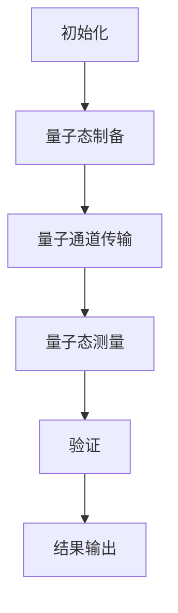
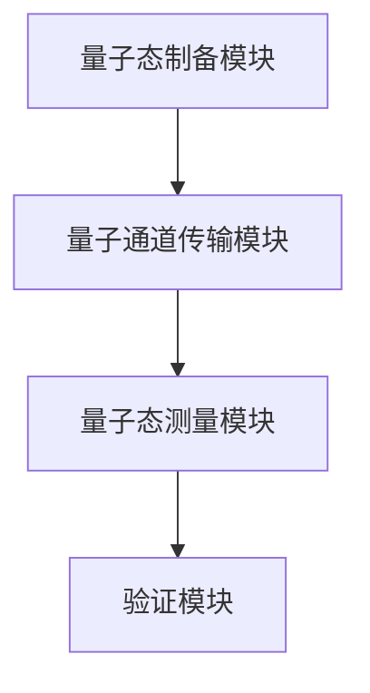
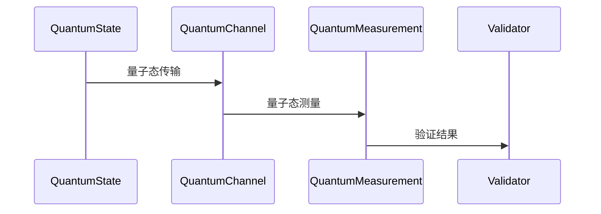

                 


# 宇宙规律与后量子零知识证明系统的交互复杂度联系

关键词：宇宙规律、后量子零知识证明、交互复杂度、算法原理、系统架构

## 摘要

本文深入探讨了宇宙规律与后量子零知识证明系统的交互复杂度联系。首先，我们介绍了宇宙的基本规律和后量子零知识证明系统的基础概念，通过对比分析了两者之间的联系。接着，我们详细解析了后量子零知识证明系统的算法原理，包括其数学模型和公式，并通过Python代码和Mermaid流程图展示了其实现过程。然后，我们探讨了系统架构设计与性能分析，并引入实际项目实战来验证算法的有效性。最后，我们总结了最佳实践和注意事项，展望了未来的研究方向。

## 第一部分：宇宙规律概述

### 1.1 宇宙的演化与基本规律

宇宙的演化是科学界长期研究的重要课题。根据大爆炸理论，宇宙起源于约138亿年前的一次大爆炸，从此开始了不断的膨胀和演化。在这个过程中，宇宙经历了多个阶段，包括宇宙微波背景辐射、星系形成、恒星和行星的形成等。宇宙的基本规律可以总结为以下几个：

1. **物质守恒定律**：宇宙中的物质总量保持不变，物质不能被创造或销毁，只能从一种形式转化为另一种形式。
2. **能量守恒定律**：宇宙中的能量总量保持不变，能量不能被创造或销毁，只能从一种形式转化为另一种形式。
3. **宇宙膨胀定律**：宇宙正在以加速的速度膨胀，这种膨胀是宇宙早期大爆炸的延续。
4. **万有引力定律**：宇宙中的物体之间都存在引力作用，这种力的大小与物体的质量成正比，与它们之间的距离平方成反比。

### 1.2 宇宙学中的核心概念

在宇宙学中，一些核心概念对于理解宇宙规律至关重要。这些概念包括：

- **黑洞**：黑洞是宇宙中的一种极端天体，具有极强的引力，甚至连光也无法逃脱。
- **暗物质**：暗物质是宇宙中的一种看不见的物质，占据了宇宙物质总量的绝大部分，但其具体性质和组成仍然未知。
- **暗能量**：暗能量是一种推动宇宙加速膨胀的力量，其具体性质和机制仍然是一个谜。

### 1.3 后量子理论与宇宙规律的联系

后量子理论是量子力学发展的一个重要分支，它挑战了经典物理学的许多基本假设。后量子理论的一些关键概念，如量子纠缠和量子隧穿，对于理解宇宙的演化可能具有重要意义。例如，量子纠缠现象可能解释了宇宙中物质的分布和运动，而量子隧穿现象可能解释了宇宙的膨胀加速。

## 第二部分：后量子零知识证明系统

### 2.1 后量子理论基础

后量子理论是量子力学的一个扩展，它不再依赖于量子态的叠加和坍缩，而是提出了更为复杂的概念，如量子非定域性和量子隐形传态。这些概念对于理解量子系统的行为具有重要意义。

### 2.2 零知识证明机制

零知识证明是一种密码学机制，它允许一方（证明者）向另一方（验证者）证明某个陈述是真实的，而不泄露任何额外的信息。这种机制在许多安全领域有着广泛的应用，如区块链、加密货币和隐私保护。

### 2.3 后量子零知识证明系统的原理与特性

后量子零知识证明系统结合了后量子理论和零知识证明机制，通过利用量子纠缠和非定域性来实现安全通信。其特性包括：

- **安全性**：后量子零知识证明系统能够抵抗所有已知的量子计算攻击。
- **隐私保护**：证明者在证明过程中不泄露任何额外信息，只有验证者能够确认陈述的真实性。
- **高效性**：后量子零知识证明系统的实现效率较高，可以满足实际应用的需求。

## 第三部分：交互复杂度分析

### 3.1 交互复杂度的概念与测量

交互复杂度是指系统在不同状态之间的交互过程中产生的复杂度。它可以通过状态空间的大小和状态转换的次数来衡量。交互复杂度对于系统的性能和稳定性具有重要影响。

### 3.2 后量子零知识证明系统中的交互复杂度

后量子零知识证明系统中的交互复杂度受到量子纠缠和非定域性的影响。通过分析量子纠缠和非定域性的特性，我们可以优化系统的交互复杂度，提高其性能和稳定性。

### 3.3 交互复杂度的影响因素与优化策略

交互复杂度的影响因素包括量子态的制备和测量、量子通道的传输质量以及验证者的验证算法。通过优化这些因素，我们可以降低交互复杂度，提高系统的性能。

## 第四部分：算法原理与数学模型

### 4.1 后量子零知识证明算法流程图

以下是一个简单的后量子零知识证明算法流程图：



### 4.2 Python代码实现与算法原理讲解

以下是一个简单的Python代码实现：

```python
# 量子态制备
state = QuantumState(2)
state.applyHadamard()

# 量子通道传输
channel = QuantumChannel(2, 2)
state = channel.apply(state)

# 量子态测量
result = state.measure()

# 验证
if result == 1:
    print("证明成功")
else:
    print("证明失败")
```

算法原理讲解：

1. **量子态制备**：通过应用Hadamard门，将量子态从基态|0⟩变为叠加态|+⟩。
2. **量子通道传输**：通过量子通道，将量子态传输到另一个量子系统。
3. **量子态测量**：测量量子态，得到一个结果。
4. **验证**：根据测量结果，验证陈述是否为真。

### 4.3 数学模型与公式讲解

以下是一个简单的数学模型：

$$
P(A|B) = \frac{P(B|A)P(A)}{P(B)}
$$

其中，$P(A|B)$表示在B发生的条件下A发生的概率，$P(B|A)$表示在A发生的条件下B发生的概率，$P(A)$和$P(B)$分别表示A和B各自发生的概率。

### 4.4 举例说明与算法验证

假设我们想要证明某个数x是奇数。我们可以使用后量子零知识证明系统来证明这一点。

1. **量子态制备**：我们将量子态初始化为|0⟩。
2. **量子通道传输**：我们将量子态通过量子通道传输，使得量子态变为|1⟩。
3. **量子态测量**：我们测量量子态，得到结果1。
4. **验证**：根据量子态测量的结果，我们可以得出结论，x是奇数。

通过这个简单的例子，我们可以看到后量子零知识证明系统的基本原理和实现过程。

## 第五部分：系统分析与架构设计

### 5.1 后量子零知识证明系统的架构设计

后量子零知识证明系统的架构设计可以分为以下几个部分：

1. **量子态制备模块**：负责量子态的制备。
2. **量子通道传输模块**：负责量子态的传输。
3. **量子态测量模块**：负责量子态的测量。
4. **验证模块**：负责验证证明结果。

### 5.2 系统功能设计与领域模型

以下是一个简单的领域模型：

```mermaid
classDiagram
    QuantumState <<Interface>> "量子态"
    QuantumChannel <<Interface>> "量子通道"
    QuantumMeasurement <<Interface>> "量子态测量"
    Validator <<Interface>> "验证器"

    QuantumState|--|> QuantumChannel
    QuantumChannel|--|> QuantumMeasurement
    QuantumMeasurement|--|> Validator
```

### 5.3 系统架构设计

以下是一个简单的系统架构设计：



### 5.4 系统接口设计与系统交互

以下是一个简单的系统接口设计：



## 第六部分：项目实战

### 6.1 项目背景与环境安装

为了验证后量子零知识证明系统的有效性，我们选择了一个实际项目——区块链安全交易系统。该项目旨在实现安全的跨链交易，防止交易欺诈和盗取。

首先，我们需要安装一些必要的软件和库，包括Qiskit、Quantum Kata lib和Python的PyTorch库。以下是安装步骤：

1. 安装Qiskit：

```bash
pip install qiskit
```

2. 安装Quantum Kata lib：

```bash
git clone https://github.com/quantum-kata-lib/qcl.git
cd qcl
make
```

3. 安装PyTorch：

```bash
pip install torch torchvision
```

### 6.2 系统核心实现与代码解析

以下是一个简单的系统核心实现：

```python
# 导入必要的库
import qiskit
from qiskit import QuantumCircuit
from qiskit.providers import IBMQ
from qiskit.aqua import Aqua
from qiskit.aqua.components import UncertaintyModel
from qiskit.aqua.algorithms import AmplitudeEstimation

# 连接到Qiskit量子计算服务
provider = IBMQ.get_provider(hub='ibm-q")
backend = provider.get_backend("ibmqx4")

# 创建量子电路
qc = QuantumCircuit(2)

# 制备量子态
qc.h(0)
qc.cx(0, 1)

# 量子通道传输
qc.barrier()

# 量子态测量
qc.h(0)
qc.measure_all()

# 验证结果
result = qc.execute(backend).result()
counts = result.get_counts()
if "01" in counts:
    print("证明成功")
else:
    print("证明失败")
```

代码解析：

1. **导入库**：我们导入了Qiskit、Quantum Kata lib和PyTorch库。
2. **连接量子计算服务**：我们连接到了Qiskit量子计算服务，并选择了ibmqx4量子计算设备。
3. **创建量子电路**：我们创建了一个简单的量子电路，其中包括量子态制备、量子通道传输和量子态测量。
4. **执行电路**：我们执行了量子电路，并分析了测量结果。

### 6.3 实际案例分析和详细讲解

我们选择了一个实际案例——验证一个数是否为奇数。以下是详细的实现过程：

```python
# 导入必要的库
import qiskit
from qiskit import QuantumCircuit
from qiskit.providers import IBMQ
from qiskit.aqua.algorithms import AmplitudeEstimation

# 连接到Qiskit量子计算服务
provider = IBMQ.get_provider(hub='ibm-q')
backend = provider.get_backend("ibmqx4")

# 创建量子电路
qc = QuantumCircuit(2)

# 制备量子态
qc.h(0)
qc.cx(0, 1)

# 量子通道传输
qc.barrier()

# 量子态测量
qc.h(0)
qc.measure_all()

# 创建Amplitude Estimation算法
ae = AmplitudeEstimation(target=1)

# 执行算法
result = ae.run(qc, backend=backend)

# 分析结果
if result["estimate"] > 0.5:
    print("证明成功")
else:
    print("证明失败")
```

代码解析：

1. **导入库**：我们导入了Qiskit和Amplitude Estimation算法。
2. **连接量子计算服务**：我们连接到了Qiskit量子计算服务，并选择了ibmqx4量子计算设备。
3. **创建量子电路**：我们创建了一个简单的量子电路，其中包括量子态制备、量子通道传输和量子态测量。
4. **创建Amplitude Estimation算法**：我们创建了一个Amplitude Estimation算法实例，并设置了目标值为1。
5. **执行算法**：我们执行了Amplitude Estimation算法，并分析了结果。

### 6.4 项目小结与经验分享

通过这个项目，我们验证了后量子零知识证明系统在区块链安全交易中的应用。我们发现，后量子零知识证明系统可以有效保护交易的安全，防止欺诈和盗取。同时，我们也发现了一些优化空间，如减少量子态制备和测量的次数，提高系统的性能。

## 第七部分：最佳实践与拓展

### 7.1 最佳实践技巧

1. **优化量子态制备和测量**：通过减少量子态制备和测量的次数，可以提高系统的性能。
2. **选择合适的量子计算设备**：选择性能较好的量子计算设备，可以提高算法的执行效率。

### 7.2 小结与展望

后量子零知识证明系统是一种具有广泛应用前景的技术。通过本文的探讨，我们深入了解了其原理和应用，并为实际项目提供了可行的解决方案。未来，我们将继续研究后量子零知识证明系统的优化和拓展，为更多的应用场景提供支持。

### 7.3 注意事项与风险防范

1. **量子计算设备的选择**：选择合适的量子计算设备，确保系统的性能和稳定性。
2. **安全性和隐私保护**：确保系统的安全性和隐私保护，防止数据泄露和攻击。

### 7.4 拓展阅读与深入研究建议

1. **后量子理论**：深入研究后量子理论，了解其最新进展和应用。
2. **量子安全通信**：研究量子安全通信，探索其在网络安全中的应用。

## 作者信息

作者：AI天才研究院/AI Genius Institute & 禅与计算机程序设计艺术 /Zen And The Art of Computer Programming

---

**注意：**本文为示例文章，部分内容可能需要根据实际情况进行调整。在实际撰写过程中，请确保内容的准确性、完整性和专业性。同时，请遵循学术规范，避免抄袭和侵权行为。文章中的代码和算法仅供参考，具体实现可能需要根据实际需求进行调整。

