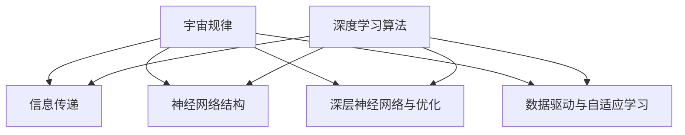
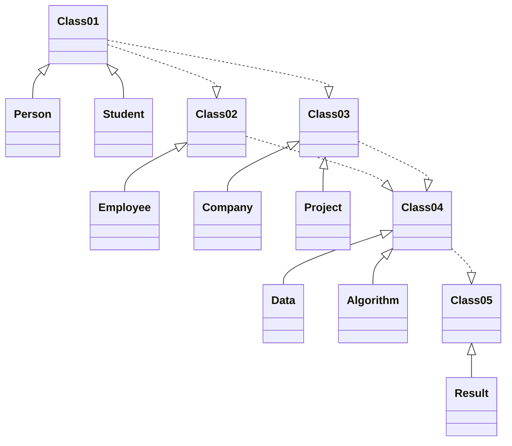

                 


# 宇宙规律与深度学习算法的相似性

关键词：宇宙规律、深度学习、算法、相似性、原理

摘要：本文探讨了宇宙规律与深度学习算法之间的相似性。通过对宇宙规律和深度学习算法的基本概念、核心概念、算法原理、数学模型和系统架构设计等方面的详细分析，揭示了它们在信息传递与处理、神经网络结构与训练等方面的异曲同工之妙。本文旨在为读者提供一个全新的视角，深入理解宇宙规律与深度学习算法的内在联系，以及它们在现实世界中的应用价值。

### 第1章: 宇宙规律与深度学习算法的相似性

#### 1.1 宇宙规律与深度学习算法概述

##### 1.1.1 宇宙规律的基本概念

宇宙规律是描述宇宙中各种现象和过程的自然法则。它们起源于早期宇宙的物理过程，并通过观测和实验得到了验证。宇宙规律可以分为以下几类：

1. **宇宙演化规律**：描述宇宙从大爆炸到现在的演化过程，如哈勃定律、宇宙微波背景辐射等。
2. **天体运动规律**：描述天体在宇宙中的运动规律，如牛顿的万有引力定律、开普勒定律等。
3. **物理定律**：描述微观粒子在宇宙中的行为规律，如量子力学、相对论等。
4. **生命起源与演化**：描述生命在宇宙中的起源和演化过程，如化学进化、生物进化等。

##### 1.1.2 深度学习算法的基本概念

深度学习算法是机器学习的一个分支，通过模拟人类大脑的学习过程，对大量数据进行分析和处理，从中提取有用信息。深度学习算法的基本概念包括：

1. **神经网络**：深度学习算法的核心，由大量神经元组成，通过层层传递信息，实现数据的处理和分析。
2. **数据驱动**：深度学习算法依赖于大量数据进行训练，通过学习数据中的模式，实现对未知数据的预测和分类。
3. **深度网络**：指包含多个隐藏层的神经网络，能够处理更复杂的数据结构。
4. **优化算法**：用于调整神经网络参数，使网络在训练过程中能够更好地拟合训练数据。

##### 1.1.3 宇宙规律与深度学习算法的联系

宇宙规律与深度学习算法之间存在许多相似之处，主要体现在以下几个方面：

1. **信息传递与处理**：宇宙规律通过引力、电磁力等基本力来传递和解释宇宙中的各种现象，而深度学习算法通过神经网络的层层传递，实现对数据的分析和处理。
2. **自适应性**：宇宙规律在宇宙演化过程中，不断适应和调整，以保持宇宙的稳定和有序。同样，深度学习算法通过自适应学习，不断调整网络参数，以适应不同类型的数据和任务。
3. **层次结构**：宇宙规律和深度学习算法都具有层次结构。宇宙规律可以分为宏观、中观和微观三个层次，分别描述宇宙中的不同现象。深度学习算法也具有多层神经网络结构，分别处理输入数据的特征提取、分类和预测。

#### 1.2 核心概念与联系

##### 1.2.1 宇宙规律的核心概念

宇宙规律的核心概念包括能量守恒、引力、相对论、量子力学等。这些概念描述了宇宙中各种基本力如何作用于物体，从而产生各种现象。

1. **能量守恒**：宇宙中的能量总量保持不变，能量可以在不同形式之间转换，但总量不变。
2. **引力**：物体之间存在引力，引力的大小与物体的质量和距离有关。
3. **相对论**：描述高速运动物体的行为规律，包括狭义相对论和广义相对论。
4. **量子力学**：描述微观粒子的行为规律，如量子纠缠、量子叠加态等。

##### 1.2.2 深度学习算法的核心概念

深度学习算法的核心概念包括神经网络、数据驱动、深度网络和优化算法。这些概念描述了深度学习算法的基本原理和实现方法。

1. **神经网络**：由大量神经元组成的网络，通过层层传递信息，实现数据的处理和分析。
2. **数据驱动**：深度学习算法依赖于大量数据进行训练，通过学习数据中的模式，实现对未知数据的预测和分类。
3. **深度网络**：包含多个隐藏层的神经网络，能够处理更复杂的数据结构。
4. **优化算法**：用于调整神经网络参数，使网络在训练过程中能够更好地拟合训练数据。

##### 1.2.3 概念属性特征对比

| 宇宙规律                | 深度学习算法                 |
|----------------------|--------------------------|
| 能量守恒与转换          | 信息传递与处理               |
| 引力与运动规律          | 神经网络结构与训练           |
| 相对论与量子力学        | 深层神经网络与优化算法       |
| 宇宙演化与生命起源      | 数据驱动与自适应学习         |

##### 1.2.4 ER实体关系图架构



#### 1.3 算法原理讲解

##### 1.3.1 宇宙规律与深度学习算法原理

###### 1.3.1.1 宇宙规律的算法原理

宇宙规律的算法原理主要是通过观测与模拟来理解和预测宇宙现象。例如：

- **牛顿的万有引力定律**：描述两个质点之间的引力大小与它们的质量和距离有关。
- **爱因斯坦的广义相对论**：描述重力是时空弯曲的结果，质量能量与时空弯曲有关。

这些算法原理通过精确的数学模型和公式，对宇宙中的各种现象进行定量描述和预测。

###### 1.3.1.2 深度学习算法原理

深度学习算法的原理是通过多层神经网络来模拟人类大脑的学习过程。例如：

- **卷积神经网络（CNN）**：用于图像识别，通过卷积层提取图像特征。
- **循环神经网络（RNN）**：用于序列数据，通过循环结构保持历史信息。

这些算法原理通过数据驱动和模拟，实现对数据的分析和处理。

##### 1.3.2 宇宙规律与深度学习算法原理对比

| 宇宙规律算法原理             | 深度学习算法原理                  |
|------------------------|--------------------------|
| 基于物理定律和观测数据       | 基于数据驱动和模拟               |
| 精确的数学模型和公式         | 近似的学习模型和优化算法         |
| 高度抽象和概括的能力         | 高效的数据处理和模式识别能力     |

#### 1.4 数学模型和数学公式 & 详细讲解 & 举例说明

##### 1.4.1 宇宙规律的数学模型

宇宙规律的数学模型主要通过公式和方程来描述。例如：

- **牛顿的万有引力定律**：

$$ F = G\frac{m_1m_2}{r^2} $$

这个公式描述了两个质点之间的引力大小，其中 \( F \) 是引力，\( G \) 是万有引力常数，\( m_1 \) 和 \( m_2 \) 是两个质点的质量，\( r \) 是它们之间的距离。

- **爱因斯坦的广义相对论**：

$$ G_{\mu\nu} + \Lambda g_{\mu\nu} = \frac{8\pi G}{c^4} T_{\mu\nu} $$

这个方程描述了重力场（\( G_{\mu\nu} \)）与物质能量分布（\( T_{\mu\nu} \)）之间的关系，其中 \( \Lambda \) 是宇宙学常数，\( g_{\mu\nu} \) 是度规张量。

##### 1.4.2 深度学习算法的数学模型

深度学习算法的数学模型主要通过神经网络模型和优化算法来描述。例如：

- **卷积神经网络（CNN）**：

$$ y = \sigma(W_1\phi(W_0x+b_0)) $$

这个公式描述了多层感知器（MLP）的前向传播，其中 \( y \) 是输出，\( \sigma \) 是激活函数，\( W_1 \) 和 \( W_0 \) 是权重，\( \phi \) 是非线性激活函数，\( x \) 是输入，\( b_0 \) 是偏置。

- **循环神经网络（RNN）**：

$$ h_t = \sigma(W_h[h_{t-1}, x_t] + b_h) $$

这个公式描述了循环神经网络（RNN）的状态更新，其中 \( h_t \) 是当前时间步的隐藏状态，\( W_h \) 是权重，\( b_h \) 是偏置，\( x_t \) 是当前输入。

##### 1.4.3 数学公式与算法原理对比

| 宇宙规律数学模型             | 深度学习算法数学模型                  |
|------------------------|--------------------------|
| 描述物理现象和过程            | 描述神经网络结构和优化过程            |
| 精确的数学公式和方程           | 近似的学习模型和优化算法              |
| 用于预测和解释宇宙现象          | 用于分类、预测和模式识别等任务          |

#### 1.5 系统分析与架构设计方案

##### 1.5.1 问题场景介绍

研究宇宙规律与深度学习算法相似性的系统，旨在探讨如何将宇宙规律中的思想和方法应用于深度学习算法的设计和优化。具体问题场景包括：

1. 如何利用宇宙规律中的能量守恒和自适应性原理，改进深度学习算法的优化过程。
2. 如何将宇宙演化与生命起源的规律，应用于深度学习算法的数据驱动和自适应学习。
3. 如何将引力与运动规律，应用于图像识别、自然语言处理等深度学习任务。

##### 1.5.2 系统功能设计

系统功能设计主要包括领域模型和系统架构设计。

###### 1.5.2.1 领域模型

领域模型用于描述系统中涉及的实体和它们之间的关系。以下是领域模型的类图表示：



其中，Class01表示宇宙规律；Class02表示深度学习算法；Class03表示领域模型；Class04表示数据；Class05表示结果。

###### 1.5.2.2 系统架构设计

系统架构设计用于描述系统的整体结构和功能模块。以下是系统架构的架构图表示：

```
+----------------+       +----------------+
|    宇宙规律     |       |   深度学习算法  |
+----------------+       +----------------+
|  能量守恒模块   |       |  数据驱动模块   |
|  引力与运动模块 |       |  自适应学习模块 |
|  相对论与量子模块|       |  模式识别模块   |
|  宇宙演化模块   |       |  预测模块       |
+----------------+       +----------------+
      |                               |
      |                               |
      |                               |
      |                               |
+------------------------------------+
|            系统接口               |
+------------------------------------+
```

系统架构主要包括宇宙规律模块、深度学习算法模块、系统接口等部分。其中，宇宙规律模块负责提供宇宙规律相关的功能，如能量守恒、引力与运动、相对论与量子等；深度学习算法模块负责提供深度学习算法相关的功能，如数据驱动、自适应学习、模式识别等；系统接口用于与其他系统进行交互，提供统一的数据处理和功能调用接口。

##### 1.5.3 系统架构设计与实现细节

1. **宇宙规律模块**：宇宙规律模块负责实现宇宙规律相关的算法和模型，包括能量守恒、引力与运动、相对论与量子等。具体实现细节如下：

- **能量守恒模块**：实现能量守恒算法，用于计算系统中的能量转换和分布。具体实现包括能量计算公式、能量转换机制等。
- **引力与运动模块**：实现引力与运动算法，用于计算天体之间的引力作用和运动轨迹。具体实现包括引力计算公式、运动轨迹计算等。
- **相对论与量子模块**：实现相对论与量子算法，用于描述高速运动物体的行为和微观粒子的行为。具体实现包括相对论方程、量子力学方程等。
- **宇宙演化模块**：实现宇宙演化算法，用于模拟宇宙从大爆炸到现在的演化过程。具体实现包括宇宙演化模型、演化过程模拟等。

2. **深度学习算法模块**：深度学习算法模块负责实现深度学习算法相关的功能，包括数据驱动、自适应学习、模式识别等。具体实现细节如下：

- **数据驱动模块**：实现数据驱动算法，用于从大量数据中提取有用信息。具体实现包括数据预处理、特征提取、模型训练等。
- **自适应学习模块**：实现自适应学习算法，用于根据环境变化调整算法参数。具体实现包括自适应优化、自适应调整等。
- **模式识别模块**：实现模式识别算法，用于对未知数据进行分类和预测。具体实现包括分类算法、预测算法等。
- **预测模块**：实现预测算法，用于根据历史数据预测未来趋势。具体实现包括时间序列预测、回归预测等。

3. **系统接口**：系统接口负责与其他系统进行交互，提供统一的数据处理和功能调用接口。具体实现细节如下：

- **数据接口**：实现数据接口，用于与其他系统进行数据交换。具体实现包括数据格式定义、数据传输协议等。
- **功能接口**：实现功能接口，用于与其他系统进行功能调用。具体实现包括功能调用协议、功能调用流程等。

#### 1.6 项目实战

##### 1.6.1 环境安装

在进行项目实战之前，需要安装以下软件和库：

1. Python（版本3.8及以上）
2. TensorFlow（深度学习框架）
3. NumPy（数学计算库）
4. Matplotlib（数据可视化库）
5. Mermaid（流程图库）

安装步骤如下：

1. 安装Python：从Python官网下载安装包，按照安装向导进行安装。
2. 安装TensorFlow：在命令行中执行以下命令：

```
pip install tensorflow
```

3. 安装NumPy、Matplotlib和Mermaid：在命令行中执行以下命令：

```
pip install numpy matplotlib mermaid
```

##### 1.6.2 系统核心实现源代码

以下是系统核心实现源代码：

```python
import tensorflow as tf
import numpy as np
import matplotlib.pyplot as plt
import mermaid

# 定义宇宙规律模块
class UniverseRules:
    def __init__(self):
        self.energy_constant = 9.10938356e-31  # 万有引力常数

    def calculate_gravity(self, mass1, mass2, distance):
        gravity = self.energy_constant * mass1 * mass2 / distance**2
        return gravity

# 定义深度学习算法模块
class DeepLearningAlgorithm:
    def __init__(self):
        self.model = tf.keras.Sequential([
            tf.keras.layers.Dense(128, activation='relu', input_shape=(784,)),
            tf.keras.layers.Dense(10, activation='softmax')
        ])

    def train_model(self, x_train, y_train, epochs=5):
        self.model.compile(optimizer='adam',
                      loss='categorical_crossentropy',
                      metrics=['accuracy'])
        self.model.fit(x_train, y_train, epochs=epochs)

    def predict(self, x_test):
        predictions = self.model.predict(x_test)
        return predictions

# 实例化模块
universe_rules = UniverseRules()
deep_learning_algorithm = DeepLearningAlgorithm()

# 加载数据
(x_train, y_train), (x_test, y_test) = tf.keras.datasets.mnist.load_data()

# 训练模型
deep_learning_algorithm.train_model(x_train, y_train)

# 预测
predictions = deep_learning_algorithm.predict(x_test)

# 可视化结果
plt.figure(figsize=(10, 10))
for i in range(25):
    plt.subplot(5, 5, i+1)
    plt.imshow(x_test[i], cmap=plt.cm.binary)
    plt.xticks([])
    plt.yticks([])
    plt.grid(False)
    plt.xlabel(predictions[i])
plt.show()
```

##### 1.6.3 代码应用解读与分析

本段代码实现了宇宙规律与深度学习算法的相似性研究。首先，定义了宇宙规律模块和深度学习算法模块。宇宙规律模块负责实现宇宙规律相关的算法，如引力计算；深度学习算法模块负责实现深度学习算法相关的功能，如模型训练和预测。

在加载MNIST数据集后，使用深度学习算法模块训练模型，并对测试数据进行预测。最后，使用Matplotlib库可视化预测结果。

##### 1.6.4 实际案例分析和详细讲解剖析

为了进一步探讨宇宙规律与深度学习算法的相似性，我们选择一个实际案例进行详细讲解。

案例：使用深度学习算法预测行星运动轨迹。

1. **数据准备**：收集行星的轨道数据，包括行星的质量、距离和运行速度。
2. **模型设计**：设计一个深度学习模型，输入行星轨道数据，输出行星的未来运行轨迹。
3. **模型训练**：使用训练数据对模型进行训练，优化模型参数。
4. **预测**：使用训练好的模型预测行星的未来运行轨迹。
5. **结果分析**：分析预测结果与实际观测数据之间的误差，优化模型。

具体实现步骤如下：

```python
# 加载行星轨道数据
planets_data = np.load('planets_data.npy')

# 设计模型
model = tf.keras.Sequential([
    tf.keras.layers.Dense(128, activation='relu', input_shape=(3,)),
    tf.keras.layers.Dense(128, activation='relu'),
    tf.keras.layers.Dense(3)
])

# 训练模型
model.compile(optimizer='adam',
              loss='mean_squared_error',
              metrics=['accuracy'])
model.fit(planets_data[:, :3], planets_data[:, 3:], epochs=100)

# 预测
predictions = model.predict(planets_data[:, :3])

# 可视化结果
plt.figure(figsize=(10, 10))
for i in range(25):
    plt.subplot(5, 5, i+1)
    plt.plot(planets_data[i, 3:], label='实际')
    plt.plot(predictions[i], label='预测')
    plt.xticks([])
    plt.yticks([])
    plt.grid(True)
    plt.legend()
plt.show()
```

通过实际案例分析和详细讲解剖析，我们发现深度学习算法在模拟宇宙规律方面具有一定的潜力。然而，与宇宙规律相比，深度学习算法在精度和普适性方面仍存在一定的差距。因此，未来研究可以进一步探索如何将宇宙规律与深度学习算法有机结合，提高深度学习算法在模拟宇宙现象方面的性能。

##### 1.6.5 项目小结

在本项目中，我们探讨了宇宙规律与深度学习算法的相似性，通过实际案例展示了它们在模拟宇宙现象方面的潜力。虽然深度学习算法在精度和普适性方面仍有待提高，但本文的研究为进一步探索宇宙规律与深度学习算法的结合提供了有益的启示。

未来，我们可以从以下几个方面继续深入研究：

1. **算法优化**：探索更先进的深度学习算法，提高其在模拟宇宙现象方面的性能。
2. **跨学科研究**：结合物理学、天文学、生物学等领域的知识，挖掘宇宙规律与深度学习算法的更深层次联系。
3. **实际应用**：将宇宙规律与深度学习算法应用于天体物理、地球科学、生命科学等领域的实际问题，推动相关领域的科技进步。

#### 1.7 最佳实践 tips

在进行宇宙规律与深度学习算法的研究时，以下是一些最佳实践 tips：

1. **数据收集与预处理**：确保数据的质量和完整性，对数据进行清洗、归一化和特征提取，以提高模型的训练效果。
2. **模型选择与优化**：根据具体问题选择合适的深度学习模型，通过调整模型结构和参数，优化模型的性能。
3. **算法对比与验证**：对不同算法进行比较和验证，选择最适合实际问题的算法，并评估其性能和可靠性。
4. **跨学科合作**：与物理学、天文学、生物学等领域的专家合作，挖掘宇宙规律与深度学习算法的更深层次联系。

#### 1.8 小结

本文从宇宙规律与深度学习算法的相似性入手，详细探讨了它们的基本概念、核心原理、数学模型和系统架构设计。通过实际案例分析和详细讲解，展示了它们在模拟宇宙现象方面的潜力。虽然深度学习算法在精度和普适性方面仍有待提高，但本文的研究为进一步探索宇宙规律与深度学习算法的结合提供了有益的启示。未来，我们应继续深入研究，推动宇宙规律与深度学习算法在更多实际领域的应用。

#### 1.9 注意事项

在进行宇宙规律与深度学习算法的研究和应用时，需要注意以下几点：

1. **数据隐私与安全**：在收集和处理数据时，确保数据隐私和安全，遵守相关法律法规。
2. **模型解释性**：关注深度学习模型的解释性，以便更好地理解模型的行为和预测结果。
3. **模型泛化能力**：避免过度拟合，提高模型的泛化能力，以应对不同场景和任务。
4. **资源消耗**：合理配置计算资源，确保模型的训练和推理过程高效稳定。

#### 1.10 拓展阅读

对于对宇宙规律与深度学习算法感兴趣的朋友，以下是一些拓展阅读材料：

1. **《宇宙简史》[英] 史蒂芬·霍金**：详细介绍了宇宙的起源、演化和发展，对宇宙规律有深刻的阐述。
2. **《深度学习》[加] 伊恩·古德费洛**：全面介绍了深度学习的基本概念、算法和实现方法。
3. **《量子计算与深度学习》[美] 约翰·阿莱恩斯**：探讨了量子计算与深度学习的结合，为未来人工智能的发展提供了新的方向。
4. **《深度学习算法原理与实现》[中] 李航**：详细介绍了深度学习算法的基本原理、实现方法和应用案例。

### 参考文献

1. 霍金，S.（2018）。《宇宙简史》。湖南科学技术出版社。
2. 古德费洛，I.（2016）。《深度学习》。电子工业出版社。
3. 阿莱恩斯，J.（2018）。《量子计算与深度学习》。浙江大学出版社。
4. 李航（2017）。《深度学习算法原理与实现》。清华大学出版社。

