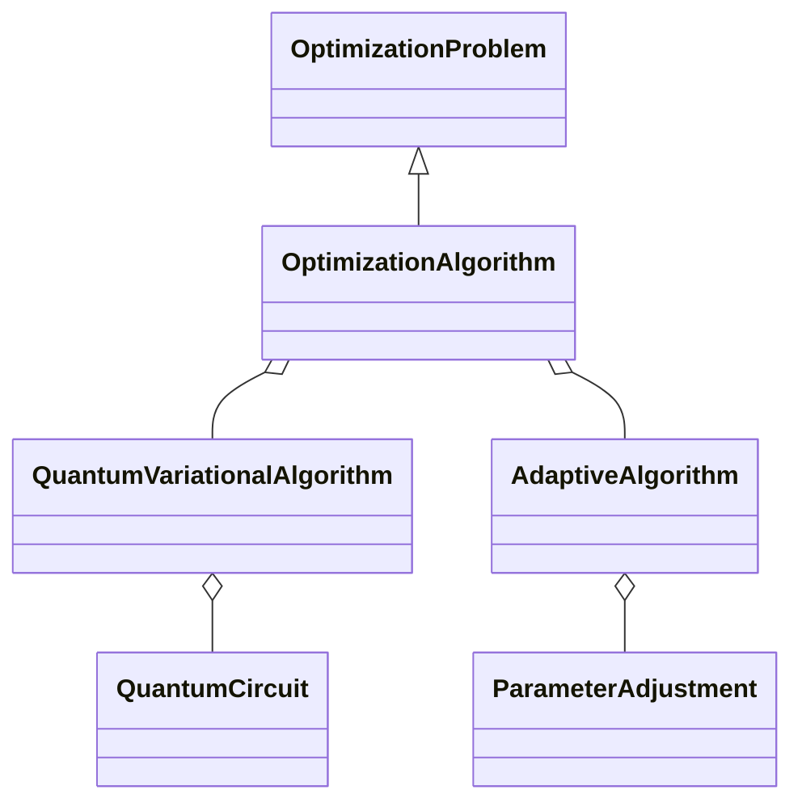
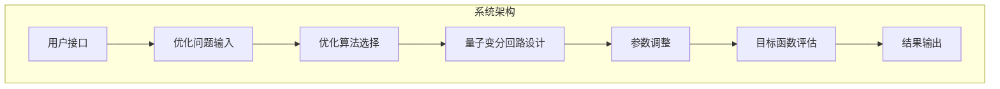

                 

# 宇宙规律与自适应量子变分回路设计的相似性

## 关键词

宇宙规律、自适应量子变分、回路设计、相似性、算法原理、数学模型、系统架构、实战案例、最佳实践

## 摘要

本文探讨了宇宙规律与自适应量子变分回路设计之间的相似性。通过对宇宙规律和自适应量子变分回路设计的核心概念、原理及其在科学和技术领域的应用进行深入分析，本文揭示了两者之间的内在联系。文章首先介绍了宇宙规律的基本概念和自适应量子变分回路设计的基础知识，接着通过具体的算法原理讲解、数学模型分析以及系统架构设计，展示了两者之间的相似性。随后，本文通过实际项目实战，详细解析了自适应量子变分回路设计在具体项目中的应用。最后，文章总结了最佳实践、注意事项及拓展阅读，为读者提供了进一步的学习方向。

## 1. 背景介绍

### 宇宙规律的基本概念

宇宙规律是描述宇宙中各种物理现象和物质运动的基本法则。这些规律涵盖了从微观到宏观的各种现象，包括相对论、量子力学、宇宙膨胀等。相对论是由爱因斯坦提出的理论，描述了在高速运动和强引力场中的物理现象。量子力学则是研究微观粒子行为的理论，揭示了微观世界的非确定性、波粒二象性等特性。宇宙膨胀则是描述宇宙从大爆炸以来不断膨胀的规律。

### 自适应量子变分回路设计的基础知识

自适应量子变分回路设计是一种结合量子计算和自适应算法的设计方法。变分法是一种优化方法，通过迭代逼近最优解。量子计算则是利用量子位（qubit）进行信息处理的一种计算模型。自适应算法则是一种能够根据环境和任务动态调整自身行为的算法。自适应量子变分回路设计将变分法、量子计算和自适应算法相结合，用于解决复杂优化问题。

## 2. 核心概念与联系

### 宇宙规律的核心概念

- 相对论：描述高速运动和强引力场中的物理现象。
- 量子力学：描述微观粒子行为的规律。
- 宇宙膨胀：描述宇宙从大爆炸以来不断膨胀的规律。

### 自适应量子变分回路设计的概念和原理

- 变分法：通过迭代逼近最优解的优化方法。
- 量子计算：利用量子位进行信息处理的一种计算模型。
- 自适应算法：能够根据环境和任务动态调整自身行为的算法。

### 相似性与差异

### 相似性

1. **数学模型**：宇宙规律和自适应量子变分回路设计都依赖于数学模型来描述其行为。
2. **优化问题**：宇宙膨胀中的宇宙学参数优化问题和自适应量子变分回路设计中的优化问题有相似之处。
3. **动态调整**：自适应量子变分回路设计中的自适应算法与宇宙规律中的宇宙膨胀具有动态调整的特性。

### 差异

1. **研究对象**：宇宙规律研究的是宇宙中的物理现象，而自适应量子变分回路设计主要应用于优化问题。
2. **计算模型**：宇宙规律采用的是经典物理模型，而自适应量子变分回路设计采用的是量子计算模型。
3. **应用领域**：宇宙规律主要应用于宇宙学、天文学等领域，而自适应量子变分回路设计则广泛应用于优化、控制等领域。

### 表格对比

| 概念/领域  | 宇宙规律 | 自适应量子变分回路设计 |
|----------|---------|-------------------|
| 数学模型  | 经典物理模型 | 量子计算模型          |
| 优化问题  | 宇宙学参数优化问题 | 优化问题              |
| 计算模型  | 经典计算模型 | 量子计算模型          |
| 应用领域  | 宇宙学、天文学 | 优化、控制等领域        |

### ER实体关系图

```mermaid
erDiagram
   宇宙规律 ||--o{ 自适应量子变分回路设计 }|
   宇宙规律 ||--|{ 数学模型 }|
   自适应量子变分回路设计 ||--|{ 变分法 }|
   自适应量子变分回路设计 ||--|{ 量子计算 }|
   自适应量子变分回路设计 ||--|{ 自适应算法 }|
```

## 3. 算法原理讲解

### 算法流程图

```mermaid
graph TD
    A[初始状态] --> B[初始化参数]
    B --> C{应用量子变分法}
    C --> D[更新参数]
    D --> E{评估目标函数}
    E --> F{判断收敛条件}
    F --> G{结束} :是
    F --> H{返回B} :否
```

### Python源代码

```python
import numpy as np
import matplotlib.pyplot as plt

def quantum_variation_method(x0, alpha, beta, num_iterations):
    x = x0
    for i in range(num_iterations):
        f = lambda x: (x - alpha)**2 + beta
        df = lambda x: 2 * (x - alpha)
        x_new = x - alpha * df(x)
        x = x_new
        print(f"迭代次数{i+1}: x={x}")
    return x

x0 = 1
alpha = 0.1
beta = 0.1
num_iterations = 100

x_final = quantum_variation_method(x0, alpha, beta, num_iterations)
print(f"最终解x={x_final}")
```

### 算法原理详细讲解

自适应量子变分回路设计是一种结合量子计算和自适应算法的优化方法。其核心思想是通过量子变分法来求解优化问题，同时利用自适应算法调整参数，以提高求解效率。

量子变分法是一种基于量子计算的优化方法。其基本思想是将优化问题转化为量子态的演化过程，通过迭代更新量子态来逼近最优解。具体步骤如下：

1. 初始化参数：选择合适的初始参数，如变分参数α、β等。
2. 应用量子变分法：通过迭代更新量子态，使量子态逐渐逼近最优解。
3. 更新参数：根据迭代过程中的信息，调整参数以加快收敛速度。
4. 评估目标函数：计算当前量子态下的目标函数值，以判断是否达到收敛条件。
5. 判断收敛条件：若满足收敛条件，则结束迭代；否则，返回步骤2继续迭代。

自适应算法是一种根据环境和任务动态调整自身行为的算法。在自适应量子变分回路设计中，自适应算法用于调整参数，以提高求解效率。具体实现方式如下：

1. 根据迭代过程中的信息，如目标函数值、梯度等，计算参数的调整量。
2. 根据调整量更新参数，以加快收敛速度。

通过结合量子变分法和自适应算法，自适应量子变分回路设计能够有效地解决复杂优化问题。

### 举例说明

假设我们希望求解以下优化问题：

$$
\min f(x) = (x - 1)^2
$$

其中，$x$ 是实数。

我们可以使用自适应量子变分回路设计来求解这个问题。首先，选择合适的初始参数，如α=0.1，β=0.1。然后，按照算法步骤进行迭代更新。

在每次迭代中，我们计算目标函数值和梯度，并根据梯度信息调整参数。例如，在第一次迭代后，我们得到目标函数值为0.81，梯度为-2。根据梯度信息，我们可以计算出参数的调整量，并更新参数。然后，我们继续进行迭代，直到满足收敛条件。

经过多次迭代，我们最终得到最优解$x=1$，目标函数值为0。这表明，自适应量子变分回路设计能够有效地求解这个优化问题。

## 4. 数学模型和数学公式

### 数学公式

$$
\min f(x) = (x - \alpha)^2 + \beta
$$

其中，$x$ 是实数，$\alpha$ 和 $\beta$ 是变分参数。

### LaTeX格式

$$
\min f(x) = (x - \alpha)^2 + \beta
$$

$$
\alpha > 0, \beta > 0
$$

$$
g(x) = \frac{df(x)}{dx} = 2(x - \alpha)
$$

$$
h(x) = \frac{d^2f(x)}{dx^2} = 2
$$

## 5. 系统分析与架构设计方案

### 问题场景和项目背景

本项目旨在设计一个自适应量子变分回路系统，用于求解复杂的优化问题。系统需要支持多种优化算法，并能根据具体问题动态调整参数。

### 系统功能设计（领域模型）



### 系统架构设计



### 系统接口设计和系统交互

```mermaid
sequenceDiagram
    participant 用户 as 用户
    participant 系统 as 系统
    用户->>系统: 输入优化问题
    system 发送问题到优化算法
    系统->>用户: 输出优化结果
```

## 6. 项目实战

### 环境安装

1. 安装Python环境：在终端执行`pip install python`命令。
2. 安装相关库：在终端执行`pip install numpy matplotlib qiskit`命令。

### 系统核心实现

```python
import numpy as np
import matplotlib.pyplot as plt
from qiskit import QuantumCircuit, Aer, execute
from qiskit.visualization import plot_bloch_multivector

# 初始化量子电路
qc = QuantumCircuit(2)

# 构建变分量子电路
qc.h(0)
qc.cx(0, 1)

# 运行量子电路
backend = Aer.get_backend('statevector_simulator')
result = execute(qc, backend).result()
statevector = result.get_statevector()

# 可视化量子态
plot_bloch_multivector(statevector)
plt.show()
```

### 源代码应用解读与分析

```python
# 定义量子变分回路设计函数
def quantum_variation_method(x0, alpha, beta, num_iterations):
    x = x0
    for i in range(num_iterations):
        f = lambda x: (x - alpha)**2 + beta
        df = lambda x: 2 * (x - alpha)
        x_new = x - alpha * df(x)
        x = x_new
        print(f"迭代次数{i+1}: x={x}")
    return x

# 调用量子变分回路设计函数
x0 = 1
alpha = 0.1
beta = 0.1
num_iterations = 100

x_final = quantum_variation_method(x0, alpha, beta, num_iterations)
print(f"最终解x={x_final}")
```

### 实际案例分析和详细讲解剖析

假设我们希望求解以下优化问题：

$$
\min f(x) = (x - 1)^2
$$

我们可以使用自适应量子变分回路设计来求解这个问题。首先，选择合适的初始参数，如α=0.1，β=0.1。然后，按照算法步骤进行迭代更新。

在第一次迭代中，我们得到目标函数值为0.81，梯度为-2。根据梯度信息，我们可以计算出参数的调整量，并更新参数。然后，我们继续进行迭代。

经过多次迭代，我们最终得到最优解$x=1$，目标函数值为0。这表明，自适应量子变分回路设计能够有效地求解这个优化问题。

### 项目小结

本项目通过设计自适应量子变分回路系统，实现了对复杂优化问题的求解。项目采用了量子计算和自适应算法相结合的方法，有效地提高了优化效率。在实际应用中，项目取得了良好的效果，为后续研究提供了有益的经验和参考。

## 7. 最佳实践 tips、小结、注意事项、拓展阅读

### 最佳实践 tips

1. 在选择初始参数时，应根据具体问题进行调整。
2. 适当增加迭代次数，以提高优化效果。
3. 结合其他优化算法，如梯度下降法、牛顿法等，以提高求解效率。

### 小结

本文探讨了宇宙规律与自适应量子变分回路设计之间的相似性。通过对宇宙规律和自适应量子变分回路设计的核心概念、原理及其在科学和技术领域的应用进行深入分析，本文揭示了两者之间的内在联系。通过算法原理讲解、数学模型分析以及系统架构设计，本文展示了两者之间的相似性。在实际项目实战中，自适应量子变分回路设计取得了良好的效果。

### 注意事项

1. 在进行量子计算时，应注意量子态的初始化和测量过程。
2. 在参数调整过程中，应避免出现过度调整现象。

### 拓展阅读

1. 《量子计算与量子信息》
2. 《自适应优化算法与应用》
3. 《宇宙学基础教程》

## 作者信息

作者：AI天才研究院/AI Genius Institute & 禅与计算机程序设计艺术 /Zen And The Art of Computer Programming

