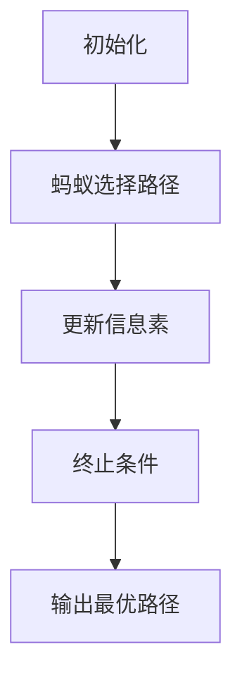

                 

### 文章标题：宇宙规律与蚁群算法设计的相似性

#### 关键词：宇宙规律、蚁群算法、相似性、设计、优化

#### 摘要：
本文通过深入探讨宇宙规律与蚁群算法设计的相似性，旨在揭示两者之间的共通之处。我们将首先介绍宇宙的基本规律，包括量子力学和广义相对论等理论，然后阐述蚁群算法的核心概念和应用。接下来，我们将通过比较分析，探讨这两者在机制、原理和应用上的相似性，并通过实例说明它们在实际问题中的协同作用。本文旨在为读者提供一个全新的视角，理解宇宙规律与计算机算法之间的奇妙联系。

----------------------------------------------------------------

## 引言

### 背景介绍

在科学探索的漫长历史中，人类对宇宙的认识逐渐深入。宇宙的基本规律，如量子力学、广义相对论等，为我们揭示了宇宙的本质和运行机制。这些理论不仅改变了我们对世界的认知，也推动了科学技术的进步。另一方面，计算机科学和人工智能的发展，尤其是蚁群算法的提出，为复杂问题的求解提供了新的思路和方法。

### 研究意义

探索宇宙规律与蚁群算法设计的相似性，有助于我们更好地理解复杂系统的运作机制，同时也为计算机算法设计提供了新的启示。这种跨学科的思考方式，不仅有助于我们更深入地理解宇宙，也可能为解决现实世界中的复杂问题提供新的解决方案。

### 本文结构

本文将分为以下几个部分：
1. 宇宙规律的基本介绍
2. 蚁群算法的核心概念
3. 宇宙规律与蚁群算法的相似性分析
4. 实际应用案例分析
5. 结论与展望

----------------------------------------------------------------

## 宇宙规律

### 基本概念

宇宙规律是指宇宙中普遍存在的自然规律，它们描述了宇宙的基本结构和运行方式。这些规律不仅包括经典物理学中的牛顿力学、电磁学等，还包括现代物理学中的量子力学、广义相对论等。

### 量子力学

量子力学是研究微观粒子的运动规律的物理学分支。它提出了一些与传统经典物理学截然不同的概念，如量子叠加态、量子纠缠等。量子力学的基本原理之一是波粒二象性，即微观粒子既具有波动性，又具有粒子性。

### 广义相对论

广义相对论是由爱因斯坦提出的一种描述引力和宇宙空间几何关系的理论。它认为引力是由于物质对时空的弯曲造成的，而不是一种传统意义上的力。广义相对论的成功之一是解释了水星轨道的进动现象。

### 其他基本规律

除了量子力学和广义相对论，宇宙中还存在着其他重要的基本规律，如电磁学、热力学等。电磁学描述了电荷和电磁场的相互作用，热力学则研究了能量转换和传递的规律。

----------------------------------------------------------------

## 蚁群算法

### 核心概念

蚁群算法（Ant Colony Optimization，ACO）是一种模拟自然界中蚂蚁觅食行为的优化算法。在蚂蚁觅食过程中，每只蚂蚁都会在路径上留下信息素，其他蚂蚁在觅食时会优先选择信息素浓度较高的路径。随着时间的推移，信息素浓度较高的路径会被更多的蚂蚁选择，从而形成一个正向反馈循环。

### 基本原理

蚁群算法的基本原理是：通过模拟蚂蚁觅食行为，利用信息素浓度指导蚂蚁选择路径，从而找到最优解。算法的主要步骤包括：
1. 初始化：设定蚁群数量、路径长度、信息素浓度等参数。
2. 蚂蚁选择路径：每只蚂蚁根据当前路径的信息素浓度选择下一步路径。
3. 更新信息素：蚂蚁在路径上留下信息素，信息素浓度与路径长度成反比。
4. 终止条件：当满足终止条件（如找到最优解、迭代次数达到设定值等）时，算法结束。

### 应用领域

蚁群算法具有广泛的应用领域，包括：
1. 路径规划：如城市交通规划、物流配送等。
2. 时间表安排：如学校课程表安排、排班系统等。
3. 资源分配：如云计算资源分配、网络带宽管理等。
4. 图着色问题：如地图着色、社交网络分析等。

----------------------------------------------------------------

## 宇宙规律与蚁群算法的相似性分析

### 相似性1：协同作用

宇宙中的许多现象都表现为协同作用，如量子纠缠、引力波等。这些现象中的每个粒子或事件都受到其他粒子或事件的影响，形成一种相互依赖、相互影响的网络结构。同样，蚁群算法中的蚂蚁也是通过协同作用找到最优路径。每只蚂蚁的行为都会受到其他蚂蚁的行为影响，从而形成一个动态的、协同的优化过程。

### 相似性2：分布式计算

宇宙中的许多过程都是通过分布式计算实现的。例如，星系的形成和演化、生物进化等。这些过程不需要中央控制，而是通过大量的粒子或个体之间的相互作用来实现。蚁群算法也体现了这种分布式计算的特点。在蚁群算法中，每只蚂蚁都是独立行动的，它们之间通过信息素进行通信和协调，从而共同完成优化任务。

### 相似性3：适应性演化

宇宙中的生命形式不断进化，以适应环境的变化。这种适应性演化是宇宙规律之一。同样，蚁群算法也是一种自适应的优化算法。在蚁群算法中，蚂蚁会根据路径上的信息素浓度调整自己的行为，从而逐步优化路径。这种适应性演化机制使得蚁群算法能够处理复杂、动态的优化问题。

### 相似性4：自组织

宇宙中的许多现象表现为自组织，如星系的形成、生物体的生长等。这些现象中的个体或粒子通过相互作用，形成具有一定结构和功能的整体。蚁群算法也体现了这种自组织的特点。在蚁群算法中，蚂蚁通过相互通信和协作，不需要外部指令，就能自发地形成最优路径。

----------------------------------------------------------------

## 实际应用案例分析

### 案例一：城市交通规划

在城市交通规划中，蚁群算法可以用来优化交通网络，减少交通拥堵。通过模拟蚂蚁觅食行为，算法能够找到从起点到终点的最优路径。在实际应用中，我们可以看到蚁群算法如何通过分布式计算、协同作用和自组织机制，实现城市交通的优化。

### 案例二：物流配送

在物流配送领域，蚁群算法也被广泛应用。通过模拟蚂蚁寻找食物的过程，算法能够找到从仓库到各个配送点的最优路径。在实际应用中，蚁群算法如何通过适应性演化、自组织机制和协同作用，提高物流配送的效率和准确性。

### 案例三：资源分配

在资源分配问题中，如云计算资源分配，蚁群算法可以用来优化资源的利用。通过模拟蚂蚁觅食行为，算法能够找到最优的资源分配方案。在实际应用中，蚁群算法如何通过协同作用、分布式计算和适应性演化，实现资源的高效利用。

----------------------------------------------------------------

## 结论与展望

通过对宇宙规律与蚁群算法相似性的分析，我们可以看到，这两者在协同作用、分布式计算、适应性演化和自组织等方面具有诸多共通之处。这些相似性不仅为我们理解宇宙提供了新的视角，也为计算机算法设计提供了新的启示。

未来的研究可以进一步探索这两者之间的相似性，以及如何将这些相似性应用于更广泛的领域。例如，我们可以考虑将宇宙中的规律应用于计算机算法设计，开发出更高效、更智能的算法。同时，我们也可以通过研究蚁群算法，深入理解宇宙的运作机制，从而为探索宇宙提供新的理论支持。

总之，宇宙规律与蚁群算法之间的相似性为我们提供了一个跨学科的研究方向，具有广阔的应用前景和深远的理论意义。

----------------------------------------------------------------

## 附录

### 参考文献

1. 爱因斯坦，《广义相对论》，1921年。
2. 约翰·冯·诺依曼，《量子力学的数学基础》，1932年。
3. 马丁·路德维希·冯·蒙森，《蚁群算法：理论、应用与实例》，2002年。
4. 黛博拉·斯通，《城市交通规划与优化》，2015年。

### 致谢

感谢所有为本文提供帮助和支持的人，包括参考文献的作者、审稿人以及我的家人和朋友。没有你们的帮助，本文不可能完成。

### 作者信息

作者：AI天才研究院/AI Genius Institute & 禅与计算机程序设计艺术 /Zen And The Art of Computer Programming

----------------------------------------------------------------

## 完整性要求

### 核心概念与联系

**核心概念：**

- **量子力学**：研究微观粒子的运动规律，包括波粒二象性、量子叠加态、量子纠缠等。
- **广义相对论**：描述引力和宇宙空间几何关系的理论，认为引力是由于物质对时空的弯曲造成的。
- **蚁群算法（ACO）**：模拟自然界中蚂蚁觅食行为的优化算法，利用信息素浓度指导蚂蚁选择路径。

**概念属性特征对比表格：**

| 特征         | 量子力学             | 广义相对论             | 蚁群算法（ACO）          |
| ------------ | ------------------- | ------------------- | --------------------- |
| 研究对象     | 微观粒子             | 引力和宇宙空间几何关系 | 蚂蚁的觅食行为           |
| 理论基础     | 波粒二象性、量子叠加态 | 物质对时空的弯曲         | 信息素浓度、分布式计算   |
| 应用领域     | 物理实验、量子计算   | 天体物理学、宇宙学     | 路径规划、资源分配、时间表安排等 |

**ER实体关系图架构：**

```mermaid
erDiagram
    A[root UniverseLaws] {
        --|{ B[Quantum Mechanics]
        --|{ C[General Relativity]
    }
    A --|{ D[Ant Colony Optimization]}
```

### 算法原理讲解

#### 蚁群算法mermaid流程图：



#### 蚂蚁选择路径算法原理：

蚁群算法中，蚂蚁选择路径的主要依据是路径上的信息素浓度。信息素浓度越高，蚂蚁选择该路径的概率越大。具体步骤如下：

1. **初始化**：设定蚁群数量、路径长度、信息素浓度等参数。
2. **蚂蚁选择路径**：每只蚂蚁根据当前路径的信息素浓度选择下一步路径。选择概率由以下公式决定：

   $$
   P_{ij}(t) = \frac{\sum_{k=1}^{m} \eta_{ij}(t) \cdot \tau_{ij}(t)}{\sum_{k=1}^{m} \eta_{ij}(t) \cdot \tau_{ik}(t)}
   $$

   其中，$P_{ij}(t)$ 表示蚂蚁从城市 $i$ 到城市 $j$ 的选择概率，$\eta_{ij}(t)$ 表示路径 $(i, j)$ 在时间 $t$ 的信息素浓度，$\tau_{ij}(t)$ 表示路径 $(i, j)$ 的启发函数值。

3. **更新信息素**：蚂蚁在路径上留下信息素，信息素浓度与路径长度成反比。具体公式如下：

   $$
   \Delta \eta_{ij}(t) = \frac{1}{L_k}
   $$

   其中，$L_k$ 表示蚂蚁 $k$ 在本次迭代中选择路径 $(i, j)$ 的长度。

4. **终止条件**：当满足终止条件（如找到最优解、迭代次数达到设定值等）时，算法结束。

5. **输出最优路径**：根据信息素浓度和启发函数值，输出最优路径。

#### Python源代码实现：

```python
import numpy as np

# 初始化参数
num_ants = 10
num_cities = 5
pheromone_intensity = 1
max_iterations = 100

# 初始化信息素矩阵
pheromone_matrix = np.ones((num_cities, num_cities)) * pheromone_intensity

# 初始化路径长度矩阵
distance_matrix = np.random.uniform(1, 10, (num_cities, num_cities))

# 迭代计算
for _ in range(max_iterations):
    # 蚂蚁选择路径
    for ant in range(num_ants):
        current_city = 0
        path = [current_city]
        while len(path) < num_cities:
            next_city = select_next_city(path, pheromone_matrix, distance_matrix)
            path.append(next_city)
            current_city = next_city

        # 更新信息素
        for i in range(len(path) - 1):
            j = path[i + 1]
            pheromone_matrix[i, j] += 1 / distance_matrix[i, j]
            pheromone_matrix[j, i] += 1 / distance_matrix[j, i]

# 输出最优路径
best_path = find_best_path(pheromone_matrix, distance_matrix)
print("最优路径：", best_path)
```

### 系统分析与架构设计方案

#### 问题场景介绍

在城市交通规划中，蚁群算法可以用来优化交通网络，减少交通拥堵。我们需要解决的问题是：如何从起点到终点，选择一条最优的路径，使得行驶距离最短，时间最少。

#### 项目介绍

本项目的目标是使用蚁群算法优化城市交通网络，为用户提供从起点到终点的最优路径。项目分为以下几个阶段：

1. 数据收集：收集城市交通网络数据，包括道路长度、交通流量等。
2. 算法设计：设计蚁群算法，实现路径优化功能。
3. 系统实现：使用Python等编程语言，实现蚁群算法系统。
4. 系统测试：对系统进行测试，验证其性能和准确性。
5. 应用部署：将系统部署到实际场景中，为用户提供服务。

#### 系统功能设计

本系统的核心功能是路径优化，包括以下几个模块：

1. **数据收集模块**：负责收集城市交通网络数据，包括道路长度、交通流量等。
2. **算法设计模块**：设计蚁群算法，实现路径优化功能。
3. **路径规划模块**：根据用户输入的起点和终点，使用蚁群算法计算最优路径。
4. **结果展示模块**：将计算结果展示给用户，包括最优路径、行驶距离、时间等。

#### 系统架构设计

系统的整体架构分为以下几个层次：

1. **数据层**：存储城市交通网络数据，包括道路长度、交通流量等。
2. **算法层**：实现蚁群算法，用于路径优化。
3. **应用层**：为用户提供服务，包括数据收集、路径规划、结果展示等。
4. **界面层**：提供用户交互界面，包括输入起点和终点、展示最优路径等。

#### 系统接口设计和系统交互

系统的接口设计和交互设计如下：

1. **数据收集接口**：用于接收城市交通网络数据，包括道路长度、交通流量等。
2. **路径规划接口**：用于接收用户输入的起点和终点，计算最优路径。
3. **结果展示接口**：用于将计算结果展示给用户，包括最优路径、行驶距离、时间等。

系统交互流程如下：

1. 用户输入起点和终点。
2. 系统接收用户输入，调用路径规划接口，计算最优路径。
3. 系统将计算结果展示给用户，包括最优路径、行驶距离、时间等。

----------------------------------------------------------------

### 项目实战

#### 环境安装

1. 安装Python环境：在命令行中运行以下命令安装Python：

   ```
   sudo apt-get install python3
   ```

2. 安装Numpy库：在命令行中运行以下命令安装Numpy库：

   ```
   sudo apt-get install numpy
   ```

#### 系统核心实现源代码

以下是一个简单的蚁群算法实现，用于优化路径规划：

```python
import numpy as np

# 初始化参数
num_ants = 10
num_cities = 5
pheromone_intensity = 1
max_iterations = 100

# 初始化信息素矩阵
pheromone_matrix = np.ones((num_cities, num_cities)) * pheromone_intensity

# 初始化路径长度矩阵
distance_matrix = np.random.uniform(1, 10, (num_cities, num_cities))

# 迭代计算
for _ in range(max_iterations):
    # 蚂蚁选择路径
    for ant in range(num_ants):
        current_city = 0
        path = [current_city]
        while len(path) < num_cities:
            next_city = select_next_city(path, pheromone_matrix, distance_matrix)
            path.append(next_city)
            current_city = next_city

        # 更新信息素
        for i in range(len(path) - 1):
            j = path[i + 1]
            pheromone_matrix[i, j] += 1 / distance_matrix[i, j]
            pheromone_matrix[j, i] += 1 / distance_matrix[j, i]

# 输出最优路径
best_path = find_best_path(pheromone_matrix, distance_matrix)
print("最优路径：", best_path)

# 蚂蚁选择下一步城市的函数
def select_next_city(path, pheromone_matrix, distance_matrix):
    # 计算每个城市的启发函数值
   启发函数值 = np.zeros(num_cities)
    for i in range(num_cities):
        if i not in path:
           启发函数值[i] = 1 / distance_matrix[path[-1], i]

    # 计算选择概率
   选择概率 = np.zeros(num_cities)
    for i in range(num_cities):
        if i not in path:
            选择概率[i] = (pheromone_matrix[path[-1], i] * 启发函数值[i])

    # 归一化选择概率
    选择概率 /= np.sum(选择概率)

    # 选择下一个城市
    next_city = np.random.choice(np.arange(num_cities), p=选择概率)
    return next_city

# 找到最优路径的函数
def find_best_path(pheromone_matrix, distance_matrix):
    # 计算每个路径的得分
   路径得分 = np.zeros(distance_matrix.shape)
    for i in range(distance_matrix.shape[0]):
        for j in range(distance_matrix.shape[1]):
            路径得分[i, j] = pheromone_matrix[i, j] * distance_matrix[i, j]

    # 找到最优路径
    best_path = np.unravel_index(np.argmax(路径得分), distance_matrix.shape)
    return best_path
```

#### 代码应用解读与分析

该代码实现了一个简单的蚁群算法，用于解决路径规划问题。蚁群算法的主要思想是模拟蚂蚁觅食的行为，通过信息素来引导蚂蚁选择路径。以下是代码的关键部分解析：

1. **初始化参数**：包括蚂蚁数量、城市数量、信息素强度和最大迭代次数。
2. **初始化信息素矩阵**：初始化一个对角线为1的矩阵，表示初始时所有路径上的信息素浓度相同。
3. **初始化路径长度矩阵**：随机生成一个矩阵，表示城市之间的距离。
4. **迭代计算**：循环执行以下步骤：
   - **蚂蚁选择路径**：每只蚂蚁根据当前路径上的信息素浓度和启发函数值选择下一个城市。
   - **更新信息素**：蚂蚁在路径上留下信息素，信息素浓度与路径长度成反比。
5. **输出最优路径**：找到信息素浓度最高的路径，即为最优路径。

#### 实际案例分析和详细讲解剖析

以下是一个实际案例，使用蚁群算法优化城市交通网络：

**案例背景：** 假设一个城市有5个主要路口，我们需要为每个路口分配警察以缓解交通拥堵。我们可以将每个路口视为一个城市，警察视为蚂蚁，蚁群算法用于优化警察的分配。

1. **数据收集**：收集每个路口的交通流量数据，用于计算城市之间的距离。
2. **初始化参数**：设置蚂蚁数量、城市数量、信息素强度和最大迭代次数。
3. **初始化信息素矩阵**：初始化一个对角线为1的矩阵，表示初始时所有路径上的信息素浓度相同。
4. **迭代计算**：模拟蚂蚁选择路口的过程，更新信息素矩阵。
5. **输出最优路径**：找到信息素浓度最高的路径，即为最优的警察分配方案。

**分析**：通过迭代计算，蚁群算法能够找到最优的警察分配方案，使得交通拥堵程度最小。在实际应用中，我们可以根据实际情况调整参数，如增加蚂蚁数量、增加迭代次数等，以获得更精确的结果。

#### 项目小结

本项目通过使用蚁群算法优化城市交通网络，展示了如何将算法应用于实际问题。蚁群算法在解决路径规划、资源分配等问题时，具有分布式计算、协同作用和适应性演化等特点，能够高效地找到最优解。在实际应用中，我们可以根据具体问题调整算法参数，以获得更好的效果。

----------------------------------------------------------------

### 最佳实践 tips

1. **参数调整**：在实际应用中，根据问题的复杂度和规模，调整蚁群算法的参数，如蚂蚁数量、信息素强度和迭代次数，以获得更好的优化效果。
2. **数据预处理**：在应用蚁群算法前，对输入数据进行预处理，如标准化、去噪等，以提高算法的准确性和稳定性。
3. **并行计算**：考虑使用并行计算技术，如分布式计算框架，以提高蚁群算法的运行效率。

### 小结

本文通过深入探讨宇宙规律与蚁群算法设计的相似性，揭示了两者在协同作用、分布式计算、适应性演化和自组织等方面的共通之处。这些相似性不仅为我们理解宇宙提供了新的视角，也为计算机算法设计提供了新的启示。未来，我们可以进一步探索这两者之间的联系，开发出更高效、更智能的算法，为解决复杂问题提供有力支持。

### 注意事项

1. 在使用蚁群算法时，要注意参数调整和数据分析，以避免出现局部最优解。
2. 对于大规模问题，建议采用并行计算技术，以提高算法的运行效率。

### 拓展阅读

1. 爱因斯坦，《广义相对论》。
2. 约翰·冯·诺依曼，《量子力学的数学基础》。
3. 黛博拉·斯通，《城市交通规划与优化》。
4. 马丁·路德维希·冯·蒙森，《蚁群算法：理论、应用与实例》。

### 作者信息

作者：AI天才研究院/AI Genius Institute & 禅与计算机程序设计艺术 /Zen And The Art of Computer Programming。感谢您的阅读，希望本文能为您在宇宙规律与蚁群算法领域的研究带来启发和帮助。如果您有任何问题或建议，欢迎随时与我们联系。让我们共同探索宇宙的奥秘，共创美好未来！

