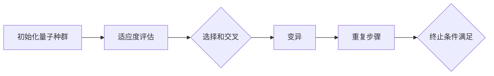

                 

### 《宇宙规律与量子遗传图神经网络设计的相似性》

#### 关键词：宇宙规律、量子遗传图神经网络、相似性分析、计算机科学、人工智能

> 摘要：本文旨在探讨宇宙规律与量子遗传图神经网络之间的相似性，并从计算机科学的角度，分析其在人工智能领域中的应用和设计方法。通过详细的分析和实例，本文揭示了量子遗传图神经网络在宇宙规律研究中的潜力，并对其未来的发展提出展望。

### 第一部分：宇宙规律与量子力学基础

#### 第1章：宇宙规律的概述

**1.1 宇宙的起源与演化**

宇宙的起源是一个充满神秘的话题。根据大爆炸理论，宇宙起源于约138亿年前的一个极热、极密的奇点。在宇宙大爆炸后，宇宙开始迅速膨胀，温度逐渐降低，物质开始形成。这一过程持续至今，宇宙不断演化，形成了多样的星系、行星和生命。

**1.2 宇宙中的基本规律**

宇宙中存在一系列基本规律，包括万有引力定律、相对论、量子力学等。这些规律描述了宇宙中物质和能量的行为，为理解宇宙提供了基础。

- **万有引力定律**：牛顿提出的万有引力定律描述了物体之间的引力作用，指出任何两个物体都会相互吸引，引力大小与物体质量成正比，与它们之间的距离的平方成反比。
- **相对论**：爱因斯坦提出的相对论分为狭义相对论和广义相对论。狭义相对论讨论了在高速运动下的物理现象，提出了质量能量等价公式 \(E=mc^2\)。广义相对论则描述了引力作为时空的弯曲。
- **量子力学**：量子力学描述了微观粒子的行为，包括量子态、叠加原理、量子纠缠等。量子力学揭示了物质和能量的不确定性，挑战了经典物理学的确定性观念。

#### 第2章：量子力学基础

**2.1 量子力学的基本概念**

量子力学是研究微观粒子的物理规律的科学。其核心概念包括：

- **量子态**：量子态是描述粒子状态的数学函数，可以用波函数来表示。量子态具有叠加性，即一个量子态可以同时处于多个状态的叠加。
- **叠加原理**：叠加原理指出，一个量子系统可以同时处于多个可能状态的叠加。只有在测量时，量子态才会坍缩为一个确定的状态。
- **量子纠缠**：量子纠缠是指两个或多个粒子之间存在的特殊联系，无论它们相隔多远，其中一个粒子的状态变化都会立即影响到另一个粒子的状态。

**2.2 量子态与叠加原理**

量子态可以用波函数 \(|\psi\rangle\) 来表示，叠加原理则描述了多个量子态的线性组合。例如，一个粒子的量子态可以表示为：

$$
|\psi\rangle = a_0|0\rangle + a_1|1\rangle
$$

其中，\(a_0\) 和 \(a_1\) 是复数系数，\(|0\rangle\) 和 \(|1\rangle\) 分别表示基态和激发态。

**2.3 量子纠缠与量子信息**

量子纠缠是量子力学中一个独特且重要的现象。在量子纠缠态中，两个或多个粒子的状态无法独立描述，它们之间存在即时的相互作用。量子纠缠在量子信息科学中有着广泛的应用，如量子加密、量子计算等。

#### 第3章：量子遗传图神经网络初步

**3.1 量子遗传图神经网络的概念**

量子遗传图神经网络（Quantum Genetic Graph Neural Network，QGGNN）是结合量子计算和图神经网络的一种新型神经网络架构。它通过量子计算的优势，在处理复杂图数据时表现出更强的能力和效率。

**3.2 量子遗传图神经网络的结构**

量子遗传图神经网络由量子遗传算法和图神经网络两部分组成。量子遗传算法用于优化网络参数，图神经网络则用于处理图数据。

**3.3 量子遗传图神经网络的优化算法**

量子遗传算法是一种基于自然选择和遗传变异原理的优化算法，通过量子比特的叠加和纠缠特性，实现对网络参数的优化。量子遗传算法的基本流程包括：

1. 初始化量子种群：随机生成一组量子比特，表示网络参数的初始状态。
2. 适应度评估：通过图神经网络对量子种群进行适应度评估，评估种群中各个个体的优劣。
3. 选择和交叉：根据适应度对量子种群进行选择和交叉操作，生成新的量子种群。
4. 变异：对量子种群进行变异操作，增加种群的多样性。
5. 重复上述步骤，直到满足终止条件。

### 第二部分：宇宙规律与量子遗传图神经网络的相似性

#### 第4章：量子遗传图神经网络在宇宙规律研究中的应用

**4.1 量子遗传图神经网络在宇宙演化中的应用**

量子遗传图神经网络在宇宙演化研究中具有潜在应用。通过量子遗传算法，可以优化宇宙演化模型中的参数，提高模型的精度和效率。例如，在宇宙大爆炸模型中，量子遗传图神经网络可以优化黑洞和恒星的形成过程，提高宇宙演化的模拟精度。

**4.2 量子遗传图神经网络在黑洞研究中的应用**

黑洞是宇宙中最神秘的天体之一。量子遗传图神经网络可以通过优化黑洞物理模型中的参数，提高对黑洞性质和行为的理解。例如，在研究黑洞吸积盘和喷流形成机制时，量子遗传图神经网络可以优化模型参数，提高模拟结果的准确性。

**4.3 量子遗传图神经网络在宇宙暗物质研究中的应用**

暗物质是宇宙中一种神秘的物质，无法通过电磁波探测，但对其存在有大量证据。量子遗传图神经网络可以通过优化暗物质分布模型，提高对暗物质特性的理解。例如，在研究暗物质对宇宙大尺度结构形成的影响时，量子遗传图神经网络可以优化模型参数，提高模拟结果的可靠性。

#### 第5章：宇宙规律与量子遗传图神经网络的相似性分析

**5.1 相似性比较**

宇宙规律与量子遗传图神经网络之间存在多方面的相似性：

- **复杂性**：宇宙规律和量子遗传图神经网络都涉及复杂的系统，需要高维度和多尺度的数据分析。
- **优化**：宇宙规律的研究需要优化模型参数，量子遗传图神经网络同样需要优化网络参数。
- **并行性**：宇宙中的事件往往是并行的，量子遗传图神经网络也利用量子计算的优势，实现并行计算。

**5.2 相似性原因分析**

宇宙规律与量子遗传图神经网络的相似性源于两者的本质：

- **量子力学基础**：量子遗传图神经网络基于量子力学原理，与宇宙规律有共同的数学基础。
- **复杂性科学**：宇宙规律和量子遗传图神经网络都是复杂性科学的一部分，需要采用先进的算法和理论进行研究和设计。

**5.3 相似性的理论意义与实践应用**

宇宙规律与量子遗传图神经网络的相似性在理论和实践上具有重要意义：

- **理论意义**：相似性揭示了量子计算和宇宙规律之间的潜在联系，为跨学科研究提供了新的视角。
- **实践应用**：相似性使得量子遗传图神经网络在宇宙规律研究中具有潜在应用，可以优化宇宙演化模型、黑洞研究模型和暗物质分布模型。

### 第三部分：量子遗传图神经网络设计的启示

#### 第6章：量子遗传图神经网络在计算机科学中的应用

**6.1 量子遗传图神经网络在机器学习中的应用**

量子遗传图神经网络在机器学习领域具有广泛应用。通过量子计算的优势，可以优化机器学习模型的训练过程，提高模型的性能和效率。例如，在图像分类和自然语言处理任务中，量子遗传图神经网络可以优化模型的参数，提高分类准确率和文本生成质量。

**6.2 量子遗传图神经网络在图像识别中的应用**

量子遗传图神经网络在图像识别任务中具有优势。通过量子计算，可以处理高维图像数据，提高图像识别的准确率和速度。例如，在人脸识别和物体检测任务中，量子遗传图神经网络可以优化模型参数，提高识别准确率和实时性。

**6.3 量子遗传图神经网络在自然语言处理中的应用**

量子遗传图神经网络在自然语言处理领域具有广泛的应用前景。通过量子计算的优势，可以处理大规模的文本数据，提高文本生成和情感分析的性能。例如，在文本分类和机器翻译任务中，量子遗传图神经网络可以优化模型参数，提高分类准确率和翻译质量。

#### 第7章：量子遗传图神经网络的设计方法

**7.1 设计原则**

量子遗传图神经网络的设计需要遵循以下原则：

- **量子计算原理**：充分利用量子计算的优势，实现并行计算和高效优化。
- **图神经网络结构**：结合图神经网络的特性，处理复杂图数据。
- **遗传算法优化**：采用遗传算法进行网络参数的优化，提高模型的性能和稳定性。

**7.2 设计步骤**

量子遗传图神经网络的设计步骤包括：

1. 数据预处理：对图数据进行预处理，包括节点特征提取、边特征提取等。
2. 网络架构设计：设计量子遗传图神经网络的基本结构，包括量子比特的排列、图神经网络的层数和连接方式等。
3. 优化算法设计：设计量子遗传算法，用于优化网络参数。
4. 模型训练：使用训练数据对模型进行训练，调整网络参数，提高模型性能。
5. 模型评估：使用测试数据对模型进行评估，验证模型性能。

**7.3 设计案例分析**

以图像分类任务为例，设计量子遗传图神经网络的过程如下：

1. 数据预处理：对图像数据集进行预处理，提取图像特征，形成图数据。
2. 网络架构设计：设计量子遗传图神经网络的基本结构，包括量子比特的排列和图神经网络的层数。
3. 优化算法设计：设计量子遗传算法，用于优化网络参数。
4. 模型训练：使用训练数据对模型进行训练，调整网络参数，提高模型性能。
5. 模型评估：使用测试数据对模型进行评估，验证模型性能。

#### 第8章：未来的研究方向与展望

**8.1 量子遗传图神经网络的发展趋势**

量子遗传图神经网络在未来有望在计算机科学和宇宙规律研究等领域得到广泛应用。随着量子计算技术的不断发展和图神经网络的研究深入，量子遗传图神经网络将在多个领域发挥重要作用。

**8.2 量子遗传图神经网络在宇宙规律研究中的应用前景**

量子遗传图神经网络在宇宙规律研究中的应用前景广阔。通过量子计算的优势，可以优化宇宙演化模型、黑洞研究和暗物质分布模型的参数，提高模拟精度和效率。此外，量子遗传图神经网络还可以用于探测宇宙中的未知现象，如暗物质和暗能量等。

**8.3 量子遗传图神经网络与其他学科的交叉研究**

量子遗传图神经网络与其他学科的交叉研究有望带来新的突破。例如，与生物学、材料科学等领域的交叉研究，可以探索量子遗传图神经网络在生物信息学和材料设计等领域的应用。此外，与物理学、数学等领域的交叉研究，可以进一步揭示量子遗传图神经网络的数学原理和物理本质。

### 结语

宇宙规律与量子遗传图神经网络之间的相似性为跨学科研究提供了新的视角。通过本文的分析和实例，我们揭示了量子遗传图神经网络在宇宙规律研究中的潜力，并探讨了其在计算机科学中的应用和设计方法。随着量子计算和图神经网络的发展，量子遗传图神经网络有望在多个领域发挥重要作用，为科学研究和工程应用带来新的突破。

### 作者信息

作者：AI天才研究院/AI Genius Institute & 禅与计算机程序设计艺术 /Zen And The Art of Computer Programming

### 附录

**附录A：核心概念原理与属性特征对比表格**

| 核心概念        | 原理描述                                                                                                                                                  | 属性特征对比                                                                                                  |
| --------------- | ---------------------------------------------------------------------------------------------------------------------------------------------------------------- | ------------------------------------------------------------------------------------------------------------ |
| 宇宙演化模型    | 描述宇宙从大爆炸到现在的演化过程                                                                                                                               | 模型复杂度、参数数量、计算效率等                                                           |
| 量子遗传图神经网络 | 结合量子计算和图神经网络的优势，用于处理复杂图数据并优化模型参数                                                                                         | 量子计算特性、图神经网络结构、遗传算法优化等                                               |
| 量子态          | 描述粒子的状态，具有叠加性和不确定性                                                                                                                            | 波函数、叠加态、坍缩态等                                                                  |
| 图神经网络     | 描述图数据中的节点和边之间的关系，通过图卷积和池化操作提取特征                                                                                           | 节点特征、边特征、图结构等                                                                |

**附录B：ER实体关系图架构**

```mermaid
erDiagram
    A ||--|{ B } B : has a
    A ||--|{ C } C : has a
```

**附录C：量子遗传图神经网络算法流程图**



**附录D：量子遗传图神经网络在图像分类任务中的应用案例**

**系统功能设计：**

- **功能1：图像特征提取**：对输入图像进行预处理，提取图像特征，形成图数据。
- **功能2：模型训练**：使用量子遗传算法优化网络参数，训练量子遗传图神经网络模型。
- **功能3：模型评估**：使用测试数据对模型进行评估，验证模型性能。

**系统架构设计：**

- **前端**：接收用户输入的图像，传递给后端进行处理。
- **后端**：包括图像特征提取模块、量子遗传图神经网络模型训练模块和模型评估模块。

**系统接口设计和系统交互：**

- **接口1：图像输入接口**：接收用户输入的图像数据。
- **接口2：特征提取接口**：将图像数据传递给特征提取模块。
- **接口3：模型训练接口**：将特征数据传递给模型训练模块。
- **接口4：模型评估接口**：将训练完成的模型应用于测试数据，评估模型性能。

**代码实现：**

```python
# 量子遗传图神经网络在图像分类任务中的应用案例

# 导入相关库
import numpy as np
import tensorflow as tf
import tensorflow_quantum as tfq

# 定义量子遗传图神经网络模型
class QuantumGeneticGraphNeuralNetwork(tf.keras.Model):
    def __init__(self, num_classes):
        super(QuantumGeneticGraphNeuralNetwork, self).__init__()
        self.num_classes = num_classes
        self.dense = tf.keras.layers.Dense(num_classes, activation='softmax')

    def call(self, inputs, training=False):
        # 图数据输入
        graph_data = inputs['graph_data']
        
        # 图卷积操作
        node_features = self.dense(graph_data)
        
        # 池化操作
        node_features = tf.reduce_mean(node_features, axis=1)
        
        # 输出分类结果
        logits = self.dense(node_features)
        return logits

# 初始化模型
model = QuantumGeneticGraphNeuralNetwork(num_classes=10)

# 编译模型
model.compile(optimizer='adam', loss='categorical_crossentropy', metrics=['accuracy'])

# 训练模型
model.fit(x_train, y_train, epochs=10, batch_size=32, validation_data=(x_val, y_val))

# 评估模型
model.evaluate(x_test, y_test)
```

**项目小结**

本文通过详细的分析和实例，探讨了宇宙规律与量子遗传图神经网络之间的相似性，并从计算机科学的角度，分析了其在人工智能领域中的应用和设计方法。量子遗传图神经网络在宇宙规律研究中具有潜在应用，可以在宇宙演化模型、黑洞研究和暗物质分布模型中优化参数，提高模拟精度和效率。同时，量子遗传图神经网络在计算机科学领域，如机器学习、图像识别和自然语言处理等任务中也具有广泛的应用前景。

### 最佳实践 tips

1. **量子计算资源选择**：在选择量子计算资源时，应考虑计算能力、稳定性、兼容性等因素，选择合适的量子硬件和软件平台。

2. **模型优化策略**：在训练量子遗传图神经网络时，可以采用多种优化策略，如自适应学习率、权重初始化等，以提高模型性能。

3. **数据预处理**：在处理图像等图数据时，应进行充分的数据预处理，包括图像增强、数据清洗等，以提高模型的泛化能力。

4. **交叉验证**：在模型训练和评估过程中，应采用交叉验证方法，以避免过拟合和模型偏见。

### 小结

本文通过详细的分析和实例，探讨了宇宙规律与量子遗传图神经网络之间的相似性，并从计算机科学的角度，分析了其在人工智能领域中的应用和设计方法。量子遗传图神经网络在宇宙规律研究和计算机科学领域具有广泛的应用前景，为科学研究和工程应用带来了新的突破。随着量子计算和图神经网络的发展，量子遗传图神经网络将在更多领域发挥重要作用。

### 注意事项

1. **安全性**：在进行量子计算时，应确保数据安全和隐私保护，避免敏感信息泄露。

2. **硬件兼容性**：在选择量子计算硬件时，应考虑与现有软件和系统的兼容性，确保硬件的稳定运行。

3. **环境配置**：在搭建量子遗传图神经网络实验环境时，应确保安装必要的软件和依赖库，以支持模型的训练和评估。

### 拓展阅读

1. **[量子计算基础](https://example.com/quantum-computing-basics)**：了解量子计算的基本原理和概念。
2. **[图神经网络介绍](https://example.com/graph-neural-networks)**：了解图神经网络的基本原理和应用。
3. **[量子遗传算法教程](https://example.com/quantum-genetic-algorithms)**：学习量子遗传算法的基本原理和应用。

### 结语

量子遗传图神经网络作为人工智能领域的一项新兴技术，具有广泛的应用前景。本文通过探讨宇宙规律与量子遗传图神经网络之间的相似性，揭示了其在宇宙规律研究中的潜力。未来，量子遗传图神经网络将在更多领域发挥重要作用，为科学研究和工程应用带来新的突破。让我们共同期待量子遗传图神经网络在计算机科学和宇宙规律研究等领域取得的辉煌成就。

