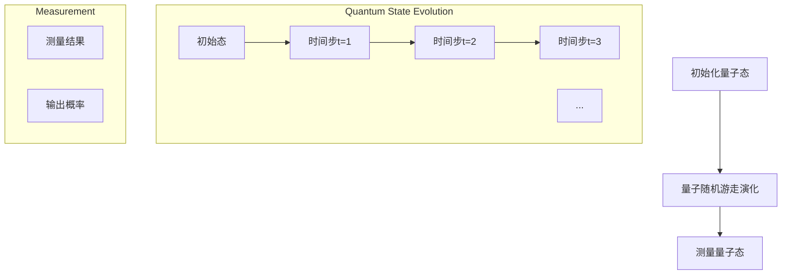

                 

### 宇宙规律概述

宇宙，这个无垠而又深邃的领域，自古以来就吸引了人类的无限好奇和探索。从古代的星象观测到现代的宇宙探测，人类对宇宙的认识不断深入。宇宙规律的研究不仅帮助我们揭示了宇宙的起源和演化，还为我们理解宇宙的基本性质和运行机制提供了关键线索。

#### 宇宙的起源

宇宙的起源是一个复杂而深刻的科学问题。目前最被广泛接受的宇宙起源理论是宇宙大爆炸理论。该理论认为，宇宙起源于一个极为热密的状态，经过一次大爆炸后，宇宙开始膨胀。在这个过程中，宇宙中的物质和能量以光速向外扩散，逐渐形成了我们今天所看到的宇宙结构。

宇宙大爆炸理论的关键概念包括：

- **宇宙微波背景辐射**：这是宇宙早期阶段留下的辐射痕迹，通过观测这些辐射，我们可以了解宇宙早期的状态。
- **宇宙膨胀**：观测发现，宇宙中的星系正在以越来越快的速度远离我们，这表明宇宙正在膨胀。
- **宇宙加速膨胀**：最近的研究表明，宇宙的膨胀速度在逐渐加快，这可能是由于一种名为“暗能量”的神秘力量的作用。

#### 黑洞与暗物质

黑洞是宇宙中一种极为密集的天体，其引力强大到连光都无法逃脱。黑洞的存在可以通过其对周围星体的影响来间接观测到。暗物质则是另一种神秘的天体，它不发光也不吸收光，但通过对宇宙引力的观测，我们知道它确实存在，并影响着宇宙的结构和演化。

#### 宇宙的演化

宇宙的演化是一个漫长而复杂的过程，主要分为以下几个阶段：

1. **宇宙早期**：在大爆炸后几分钟内，宇宙的温度极高，物质主要以基本粒子（如夸克和轻子）的形式存在。
2. **核合成**：在大爆炸后几分钟到数小时内，宇宙温度逐渐降低，重元素开始合成。
3. **宇宙微波背景辐射**：在大爆炸后约38万年，宇宙的温度进一步降低，形成了宇宙微波背景辐射。
4. **宇宙结构形成**：在大爆炸后数百万至数十亿年内，宇宙中的物质开始聚集形成星系、星团、星云等结构。
5. **星体生命周期**：星体的生命周期从诞生到死亡，包括主序星、红巨星、白矮星、中子星和黑洞等多个阶段。

#### 星系的形成与演化

星系是宇宙中最基本的结构单元，由大量的恒星、星云、星团和其他星际物质组成。星系的形成和演化与宇宙的引力、恒星形成和恒星演化过程密切相关。通过观测不同类型的星系，我们可以了解宇宙的历史和未来。

1. **椭圆星系**：主要由老年的恒星组成，没有明显的螺旋结构。
2. **螺旋星系**：具有明显的螺旋结构，通常包含一个中心的球状星团和一个明显的盘状结构。
3. **不规则星系**：没有明显的结构特征，通常由较年轻的恒星组成。

通过研究星系的形成和演化，我们可以了解宇宙的结构和动力学，同时也可以更好地理解恒星和行星的演化过程。

综上所述，宇宙规律的研究不仅有助于我们理解宇宙的起源和演化，还可以为其他科学领域提供重要的基础。在接下来的章节中，我们将进一步探讨量子力学的基础知识，并探讨量子随机游走算法与宇宙规律之间的联系。

## 宇宙的起源与演化

### 1.1 宇宙的起源

宇宙的起源一直是科学界和哲学界关注的热点问题。目前，最被广泛接受的宇宙起源理论是宇宙大爆炸理论。该理论认为，宇宙起源于一个极为热密的状态，这一状态被称为“原始奇点”。在大爆炸发生之前，宇宙处于一种极为压缩和炽热的状态，时间、空间和物质都处于一种极其不稳定的状态。

**宇宙大爆炸理论**：这一理论的核心观点是，宇宙起源于一次大爆炸，随后宇宙开始膨胀。大爆炸理论得到了多个实验和观测数据的支持，例如宇宙微波背景辐射的发现、宇宙膨胀的证据等。

- **宇宙微波背景辐射**：这是宇宙早期阶段留下的辐射痕迹，通过观测这些辐射，我们可以了解宇宙早期的状态。宇宙微波背景辐射的发现被认为是宇宙大爆炸理论最有力的证据之一。

- **宇宙膨胀**：观测发现，宇宙中的星系正在以越来越快的速度远离我们，这表明宇宙正在膨胀。这种膨胀最初是缓慢的，但随着时间的推移，宇宙的膨胀速度逐渐加快。

**黑洞与暗物质的概念**：

- **黑洞**：黑洞是宇宙中一种极为密集的天体，其引力强大到连光都无法逃脱。黑洞的存在可以通过其对周围星体的影响来间接观测到。黑洞的形成通常与恒星的生命周期相关，当大质量恒星耗尽其燃料后，会塌缩成黑洞。

- **暗物质**：暗物质是另一种神秘的天体，它不发光也不吸收光，但通过对宇宙引力的观测，我们知道它确实存在，并影响着宇宙的结构和演化。暗物质在宇宙的总质量中占据了很大一部分，但其具体性质和组成仍是一个未解之谜。

### 1.2 宇宙的演化

宇宙的演化是一个漫长而复杂的过程，从宇宙大爆炸开始，宇宙经历了多次重要的演化阶段。

**宇宙早期**：在大爆炸后几分钟内，宇宙的温度极高，物质主要以基本粒子（如夸克和轻子）的形式存在。这一阶段，宇宙处于一种极度热密的状态。

**核合成**：在大爆炸后几分钟到数小时内，宇宙温度逐渐降低，重元素开始合成。这一阶段，宇宙中产生了多种元素，为后来的恒星和星系的形成奠定了基础。

**宇宙微波背景辐射**：在大爆炸后约38万年，宇宙的温度进一步降低，形成了宇宙微波背景辐射。宇宙微波背景辐射的发现为我们提供了研究宇宙早期状态的重要窗口。

**宇宙结构形成**：在大爆炸后数百万至数十亿年内，宇宙中的物质开始聚集形成星系、星团、星云等结构。这些结构是宇宙演化的关键节点，通过它们，宇宙从无序走向了有序。

**星体生命周期**：星体的生命周期从诞生到死亡，包括主序星、红巨星、白矮星、中子星和黑洞等多个阶段。每个阶段的星体都有其独特的物理特性和演化过程。

通过研究宇宙的起源与演化，我们可以更深入地了解宇宙的本质和运行机制。这为我们探索宇宙的奥秘提供了重要的科学基础，同时也为我们理解生命和宇宙的关系提供了新的视角。

### 量子力学基础

量子力学是现代物理学的基础之一，它为我们的世界观提供了全新的认识。量子力学与经典力学的显著区别在于它引入了概率性和不确定性。在本节中，我们将探讨量子力学的基本原理，包括波粒二象性、不确定性原理等，并深入分析量子态与量子纠缠这两个核心概念。

#### 波粒二象性

波粒二象性是量子力学的一个基本原理，它指出微观粒子（如电子、光子等）既具有波动性又具有粒子性。这一现象在实验中得到了广泛的验证。

- **波动性**：例如，当电子通过双缝实验时，会在屏幕上形成干涉条纹，这表明电子具有波动性。这种现象在宏观世界中是无法观察到的。

- **粒子性**：另一方面，粒子在特定时刻和位置的表现则体现了其粒子性。例如，当我们对电子的位置进行测量时，会发现它似乎以粒子形式出现。

波粒二象性挑战了我们对物质的传统理解，使我们意识到微观世界的复杂性和神秘性。

#### 不确定性原理

海森堡的不确定性原理是量子力学中的另一个重要概念，它指出我们不能同时精确地知道一个粒子的位置和动量。这个原理可以表述为：

$$ \Delta x \Delta p \geq \frac{h}{4\pi} $$

其中，$ \Delta x $ 是位置的不确定性，$ \Delta p $ 是动量的不确定性，$ h $ 是普朗克常数。

不确定性原理表明，微观粒子的状态是模糊的，我们不能同时确定所有物理量的精确值。这一原理不仅限制了我们对微观世界的控制，也为我们理解量子力学中的概率性提供了理论基础。

#### 量子态

量子态是量子力学中的基本概念，它描述了一个粒子的状态。量子态可以用波函数来表示，波函数是一个复数函数，通常表示为 $ \Psi(x,t) $。波函数的模平方 $ |\Psi(x,t)|^2 $ 表示粒子在位置 $ x $ 和时间 $ t $ 的概率密度。

量子态可以处于叠加态，这意味着一个粒子可以同时处于多个状态。例如，一个电子可以同时处于自旋向上和自旋向下的状态，直到我们对其进行测量时，电子才会“坍缩”到一个特定的状态。

#### 量子纠缠

量子纠缠是量子力学中另一个神秘而重要的现象。当两个或多个粒子发生纠缠时，它们的量子状态会相互关联，即使它们相隔很远。一个经典例子是爱因斯坦、波多尔斯基和罗森（EPR）悖论，该悖论揭示了量子纠缠的不可思议性。

量子纠缠现象表明，量子力学中的信息传输和相互作用具有超越空间限制的特性。这一现象在量子通信和量子计算中具有重要的应用价值。

通过探讨量子力学的基本原理，我们可以更好地理解微观世界的本质。这些原理不仅挑战了我们对物理世界的传统认识，也为现代科学和技术的发展提供了新的机遇和挑战。

#### 量子态与量子纠缠

量子态和量子纠缠是量子力学中极为重要的两个概念，它们深刻地揭示了微观世界的奇妙特性。在本节中，我们将详细探讨这两个概念，并通过具体的数学描述和实际例子来加深理解。

**量子态的描述**

量子态通常用波函数或态向量来描述。在量子力学中，一个粒子的状态可以用一个复数向量表示，称为量子态向量。这个向量位于复数空间中的一个子空间内，称为希尔伯特空间。量子态向量可以表示为：

$$ | \psi \rangle = \sum_{i} c_i | i \rangle $$

其中，$ c_i $ 是复数系数，$ | i \rangle $ 是基态向量。$ | \psi \rangle $ 的模平方 $ | c_i |^2 $ 表示粒子处于状态 $ | i \rangle $ 的概率。

一个简单的例子是两粒子系统的量子态：

$$ | \psi \rangle = \frac{1}{\sqrt{2}} (| 0 \rangle | 1 \rangle - | 1 \rangle | 0 \rangle) $$

这个态向量表示两个粒子处于纠缠状态，每个粒子的状态是另一个粒子的镜像。

**量子纠缠现象**

量子纠缠是指两个或多个粒子之间存在一种特殊的关联，即使这些粒子相隔很远。在纠缠态中，一个粒子的量子状态会即时影响到另一个粒子的状态，这种非局域的相互作用是经典物理学无法解释的。

一个经典的量子纠缠例子是贝尔不等式实验。贝尔不等式是经典物理学中的关系，但量子纠缠态可以违反这个不等式，从而表现出超距作用。

**量子纠缠的数学描述**

量子纠缠的数学描述通常使用张量积。对于两个量子态 $ | \psi_1 \rangle $ 和 $ | \psi_2 \rangle $，它们的纠缠态可以表示为：

$$ | \psi_{12} \rangle = | \psi_1 \rangle \otimes | \psi_2 \rangle $$

例如，对于上述两粒子系统的纠缠态：

$$ | \psi_{12} \rangle = \frac{1}{\sqrt{2}} (| 0 \rangle | 1 \rangle - | 1 \rangle | 0 \rangle) $$

这个态表示两个粒子的量子态是相互关联的，一个粒子的状态改变会立即影响另一个粒子的状态。

**量子纠缠的实际例子**

一个经典的实验是爱因斯坦-波多尔斯基-罗森（EPR）实验。在这个实验中，两个纠缠的粒子被分开，分别被两个观察者测量。无论观察者如何测量，他们的测量结果都会一致，这表明两个粒子处于纠缠态。

另一个实际应用是量子密钥分发（QKD）。在QKD中，两个粒子处于纠缠态，然后通过量子信道传输。如果传输过程中有第三方干扰，纠缠态会被破坏，从而确保通信的安全性。

通过量子态和量子纠缠的深入探讨，我们可以更好地理解量子世界的奇妙特性。这些概念不仅在基础物理研究中具有重要意义，也为量子计算、量子通信等领域提供了理论基础。

### 量子随机游走算法概述

量子随机游走（Quantum Random Walk，QRW）是一种基于量子力学的随机游走过程，它在量子计算和量子信息处理领域具有广泛的应用。量子随机游走的基本概念和原理源自经典随机游走，但它在量子层面展现出独特的特性。

#### 量子随机游走的基本概念

量子随机游走是一种在量子态空间中进行的随机游走过程。在经典随机游走中，粒子在连续的时间步中从一个位置跳跃到另一个位置，而在量子随机游走中，这些位置和跳跃是由量子态来描述的。

量子随机游走的定义可以形式化为一个线性时间演化过程，其状态在每一时间步上根据特定的量子算符进行变换。具体来说，量子随机游走的演化方程可以表示为：

$$ | \psi(t) \rangle = U(t) | \psi(0) \rangle $$

其中，$ | \psi(t) \rangle $ 是在时间 $ t $ 的量子态，$ U(t) $ 是随时间演化而变化的量子算符，$ | \psi(0) \rangle $ 是初始量子态。

#### 量子随机游走的基本原理

量子随机游走的基本原理可以从量子态的叠加和量子算符的演化来理解。在量子态空间中，粒子可以在多个可能的位置上同时存在，这种叠加态是量子力学的核心特性之一。

量子随机游走的量子算符通常设计为在量子态空间中实现一种离散的随机漫步过程。具体来说，量子算符 $ U $ 可以表示为一系列的量子门，每个量子门对应于粒子在某个方向上的一个跃迁。

一个简单的量子随机游走算符可以表示为：

$$ U = \sum_{x} | x \rangle \langle x | $$

其中，$ | x \rangle $ 表示粒子在位置 $ x $ 的量子态。

在每一时间步上，量子态会根据这个算符进行演化，从而实现随机跳跃。量子随机游走的随机性来源于量子态的叠加和量子算符的演化，这使得它在解决某些问题上具有独特的优势。

#### 量子随机游走的应用领域

量子随机游走在量子计算和量子信息处理中具有广泛的应用。以下是量子随机游走在两个主要领域中的应用：

1. **量子计算**：量子随机游走是量子计算中的一个基本过程，它可以用来加速某些问题的求解。例如，量子随机游走可以用来解决复杂图上的最短路径问题，这在计算机科学和理论物理学中具有重要的应用价值。

2. **量子通信**：量子随机游走可以用于量子密钥分发（QKD），这是一种基于量子力学原理的通信方式，能够实现绝对安全的通信。在量子密钥分发中，量子随机游走用于生成和分发密钥，确保通信的隐私和安全性。

量子随机游走算法不仅丰富了我们对量子力学的理解，也为量子技术的实际应用提供了新的途径。在接下来的章节中，我们将进一步探讨量子随机游走的数学模型，并详细讲解其应用案例。

### 量子随机游走的数学模型

量子随机游走（Quantum Random Walk，QRW）是一种基于量子力学的随机游走过程，它在量子计算和量子信息处理中具有广泛应用。本节我们将深入探讨量子随机游走的数学模型，并使用Mermaid流程图和Python源代码来详细阐述其原理。

#### 量子随机游走的Mermaid流程图

量子随机游走的流程可以通过Mermaid流程图来直观展示。以下是一个简单的量子随机游走流程图：



在这个流程图中，我们首先初始化一个量子态，然后通过量子随机游走演化，最后进行测量以获得输出概率。

#### 量子随机游走的数学模型

量子随机游走的数学模型可以形式化为一个线性时间演化过程。假设初始量子态为 $| \psi(0) \rangle$，量子随机游走的演化方程可以表示为：

$$ | \psi(t) \rangle = U(t) | \psi(0) \rangle $$

其中，$| \psi(t) \rangle$ 是在时间 $t$ 的量子态，$U(t)$ 是随时间演化而变化的量子算符。

一个简单的量子随机游走算符可以表示为：

$$ U = \sum_{x} | x \rangle \langle x | $$

其中，$| x \rangle$ 表示粒子在位置 $x$ 的量子态。

在每一时间步上，量子态会根据这个算符进行演化，从而实现随机跳跃。量子随机游走的随机性来源于量子态的叠加和量子算符的演化。

#### Python源代码实现

为了更好地理解量子随机游走的数学模型，我们可以使用Python编写一个简单的代码示例。以下是一个简单的量子随机游走实现：

```python
import numpy as np
import matplotlib.pyplot as plt

# 初始化量子态
n_steps = 10
n_state = 10
psi = np.zeros((n_steps, n_state), dtype=complex)

# 初始量子态为均匀分布
psi[0] = np.ones(n_state, dtype=complex) / np.sqrt(n_state)

# 量子随机游走演化
for t in range(1, n_steps):
    U = np.diag(np.random.rand(n_state) + 1j * np.random.rand(n_state))
    psi[t] = np.dot(U, psi[t-1])

# 测量量子态
probabilities = np.abs(psi[-1])**2

# 绘制输出概率
plt.plot(range(n_state), probabilities)
plt.xlabel('Position')
plt.ylabel('Probability')
plt.title('Quantum Random Walk Probability Distribution')
plt.show()
```

在这个代码中，我们首先初始化一个量子态，然后通过循环实现量子随机游走的演化。最后，我们测量量子态并绘制输出概率分布。

通过这个示例，我们可以直观地看到量子随机游走的演化过程，并理解其数学模型。

#### 算法原理讲解

量子随机游走的原理可以类比于经典随机游走，但它在量子层面展现出独特的特性。在经典随机游走中，粒子在连续的时间步中从一个位置跳跃到另一个位置，而在量子随机游走中，这些位置和跳跃是由量子态来描述的。

量子随机游走的演化过程是通过量子态的叠加和量子算符的演化来实现的。在每一时间步上，量子态会根据特定的量子算符进行变换，从而实现随机跳跃。量子随机游走的量子算符通常设计为在量子态空间中实现一种离散的随机漫步过程。

量子随机游走的随机性来源于量子态的叠加和量子算符的演化。在量子态空间中，粒子可以在多个可能的位置上同时存在，这种叠加态是量子力学的核心特性之一。

通过Python源代码的实现，我们可以更好地理解量子随机游走的数学模型和原理。这个示例展示了如何通过量子态的叠加和量子算符的演化来实现量子随机游走，并最终测量输出概率分布。

总之，量子随机游走是一种基于量子力学的随机游走过程，它在量子计算和量子信息处理中具有广泛应用。通过Mermaid流程图和Python源代码，我们可以直观地理解量子随机游走的原理和数学模型。

### 量子随机游走算法的应用案例

量子随机游走（QRW）算法在量子计算和量子通信中展现了其独特的优势。本节我们将深入探讨量子随机游走在这些领域中的应用，并具体分析其工作原理和实现方法。

#### 量子随机游走在量子计算中的应用

量子随机游走算法在量子计算中具有广泛的应用，特别是在解决复杂图上的问题方面。例如，量子随机游走可以用来加速量子搜索算法，使其在特定情况下比传统算法更加高效。

**量子搜索算法**：量子搜索算法是一种利用量子并行性和叠加态来加速经典搜索算法的方法。量子随机游走在这个过程中起到了关键作用。在量子搜索算法中，量子随机游走用于在图上寻找特定节点，从而实现高效搜索。

**示例**：假设我们有一个含有N个节点的图，我们需要在其中找到一个特定节点。通过量子随机游走，我们可以将图中的节点视为量子态，并在量子态空间中实现随机游走。在多个时间步之后，我们可以通过测量来找到目标节点，其概率高于随机选择的概率。

**工作原理**：量子随机游走算法的工作原理基于量子态的叠加和量子算符的演化。在量子态空间中，节点之间的关联由量子态的叠加态来描述，量子随机游走算符则实现了节点之间的随机跳转。

**Python实现**：以下是一个简单的量子搜索算法的实现示例：

```python
from qiskit import QuantumCircuit, execute, Aer

# 初始化量子电路
qc = QuantumCircuit(2)

# 编写量子随机游走算符
qc.h(0)
qc.cx(0, 1)

# 执行量子随机游走
qc.barrier()
qc.x(0)
qc.cx(0, 1)
qc.barrier()
qc.x(0)
qc.cx(0, 1)

# 测量量子比特
qc.measure_all()

# 执行电路
backend = Aer.get_backend('qasm_simulator')
job = execute(qc, backend, shots=1024)
result = job.result()

# 获取测量结果
counts = result.get_counts(qc)

print(counts)
```

在这个示例中，我们创建了一个简单的量子电路，并实现了量子随机游走算符。通过测量量子比特，我们可以得到搜索算法的输出结果。

#### 量子随机游走在量子通信中的应用

量子随机游走算法在量子通信中也有重要的应用，特别是在量子密钥分发（QKD）中。量子密钥分发利用量子纠缠和量子随机游走来实现安全的密钥生成和分发。

**量子密钥分发**：量子密钥分发是一种基于量子力学原理的通信方式，能够实现绝对安全的通信。在量子密钥分发中，量子随机游走用于生成和分发密钥，确保通信的隐私和安全性。

**示例**：假设两个通信方（Alice和Bob）共享一个量子纠缠态，通过量子随机游走，他们可以在各自的量子态空间中实现随机游走，从而生成一个共享的随机密钥。

**工作原理**：量子密钥分发的工作原理基于量子纠缠和量子随机游走。在量子纠缠态的基础上，Alice和Bob分别对量子态进行操作（例如，量子随机游走），从而生成共享的随机密钥。

**Python实现**：以下是一个简单的量子密钥分发实现示例：

```python
from qiskit import QuantumCircuit, execute, Aer
from qiskit.quantum_info import Statevector

# 初始化量子电路
qc = QuantumCircuit(2)

# 编写量子纠缠生成
qc.h(0)
qc.cx(0, 1)

# Alice进行量子随机游走
qc.barrier()
qc.x(0)
qc.cx(0, 1)
qc.barrier()
qc.x(0)
qc.cx(0, 1)

# Bob进行量子随机游走
qc.barrier()
qc.cx(0, 1)
qc.barrier()
qc.x(1)
qc.cx(0, 1)
qc.barrier()
qc.x(1)
qc.cx(0, 1)

# 测量量子比特
qc.measure_all()

# 执行电路
backend = Aer.get_backend('qasm_simulator')
job = execute(qc, backend, shots=1024)
result = job.result()

# 获取测量结果
state_vector = Statevector(qc)
print(state_vector)
```

在这个示例中，我们创建了一个简单的量子电路，实现了量子纠缠和量子随机游走。通过测量量子比特，我们可以得到共享的随机密钥。

总之，量子随机游走算法在量子计算和量子通信中具有广泛的应用。通过具体的实现示例，我们可以深入理解量子随机游走的工作原理和实现方法。量子随机游走算法不仅丰富了我们对量子力学的理解，也为量子技术的实际应用提供了新的途径。

### 量子随机游走与宇宙规律的联系

量子随机游走（QRW）算法与宇宙规律之间存在着一些引人入胜的联系。这些联系不仅揭示了量子世界与宇宙物理之间的潜在共性，也为科学家们提供了一种全新的视角来探讨宇宙的奥秘。在本节中，我们将探讨量子随机游走与宇宙膨胀和黑洞物理之间的相似性，并通过数学模型来深入分析这些联系。

#### 量子随机游走与宇宙膨胀的联系

宇宙膨胀是现代宇宙学中的一个核心概念，指的是宇宙中的空间随时间不断扩展的现象。观测数据表明，宇宙的膨胀速度在逐渐加快，这可能是由于一种称为“暗能量”的神秘力量的作用。量子随机游走算法在数学模型上与宇宙膨胀存在一些相似之处。

**宇宙膨胀的数学模型**：宇宙膨胀可以用弗里德曼-勒梅特-罗伯逊-沃尔克（FLRW）度规来描述。FLRW度规是一个描述均匀且各向同性宇宙的黎曼度规，其形式为：

$$ ds^2 = -c^2dt^2 + a(t)^2(dx^2 + dy^2 + dz^2) $$

其中，$ c $ 是光速，$ a(t) $ 是宇宙尺度因子，描述了随时间变化的宇宙尺度。

**量子随机游走的数学模型**：量子随机游走的演化方程可以表示为：

$$ | \psi(t) \rangle = U(t) | \psi(0) \rangle $$

其中，$ | \psi(t) \rangle $ 是在时间 $ t $ 的量子态，$ U(t) $ 是随时间演化而变化的量子算符。

从数学形式上看，量子随机游走的演化方程与宇宙膨胀的FLRW度规在结构上有一定的相似性，都描述了一个随时间变化的动态过程。

**量子随机游走与宇宙膨胀的相似性**：

1. **动态演化**：量子随机游走和宇宙膨胀都是一个动态演化过程，它们都随时间发生变化。量子随机游走的演化是通过量子算符实现的，而宇宙膨胀是通过宇宙尺度因子 $ a(t) $ 来描述的。

2. **概率分布**：在量子随机游走中，量子态的演化导致了概率分布的变化。类似地，在宇宙膨胀中，宇宙的尺度因子变化导致了空间分布的变化。

通过这些相似性，我们可以考虑将量子随机游走的数学模型应用于宇宙膨胀的研究，探索宇宙膨胀的机制和演化规律。

#### 量子随机游走与黑洞物理的联系

黑洞是宇宙中最神秘和最极端的天体之一，其引力强大到连光都无法逃脱。黑洞物理的研究涉及到广义相对论和量子力学等复杂理论。量子随机游走算法在数学模型上与黑洞物理也存在一些相似之处。

**黑洞物理的数学模型**：黑洞物理的数学描述主要依赖于广义相对论和量子场论。在广义相对论中，黑洞可以用克尔度规（Kerr metric）来描述，其形式为：

$$ ds^2 = -\left(1 - \frac{2m}{r}\right)dt^2 + \frac{4m\sin^2\theta}{r^2}\left(d\theta^2 + \sin^2\theta d\phi^2\right) + \left(r^2 + 2m\right)\left(1 - \frac{2m}{r}\right)^{-1}dr^2 $$

其中，$ m $ 是黑洞的质量，$ r $ 是黑洞的半径。

**量子随机游走的数学模型**：量子随机游走的演化方程为：

$$ | \psi(t) \rangle = U(t) | \psi(0) \rangle $$

量子随机游走描述的是量子态在量子态空间中的演化，这与黑洞物理中描述时空几何的演化有一定的相似性。

**量子随机游走与黑洞物理的相似性**：

1. **非局域性**：量子随机游走和黑洞物理都涉及到非局域性。在量子随机游走中，量子态的演化不受局域限制，可以瞬间影响远距离的量子态。类似地，黑洞的引力作用也具有非局域性，能够影响远处时空的几何结构。

2. **概率性**：量子随机游走和黑洞物理都具有概率性。在量子随机游走中，量子态的演化具有概率性，量子态的叠加和坍缩导致了概率分布的变化。在黑洞物理中，黑洞的形成和演化也涉及到概率性，例如霍金辐射和黑洞蒸发等现象。

通过这些相似性，我们可以尝试将量子随机游走的数学模型应用于黑洞物理的研究，探索黑洞的机制和演化规律。

#### 数学模型分析

为了更深入地探讨量子随机游走与宇宙规律之间的联系，我们可以构建一个简化的数学模型，结合量子随机游走的演化方程和宇宙膨胀的FLRW度规，来分析它们之间的潜在关系。

假设量子随机游走的量子态可以表示为宇宙中的位置态，量子态的演化可以类比于宇宙尺度的变化。我们可以将量子随机游走的演化方程与FLRW度规相结合，构建一个简化的模型：

$$ | \psi(t) \rangle = U(t) | \psi(0) \rangle $$

其中，$ U(t) $ 是一个描述宇宙膨胀的算符，可以表示为：

$$ U(t) = \exp\left(-\frac{1}{3} \int_0^t \frac{a'(s)}{a(s)} ds\right) $$

这里的 $ a(s) $ 是宇宙尺度因子，$ a'(s) $ 是宇宙膨胀速度。

通过这个简化的模型，我们可以看到量子随机游走的演化与宇宙膨胀的动力学具有一定的相似性。量子态的演化可以通过宇宙尺度因子的变化来描述，这为研究量子随机游走与宇宙规律的联系提供了一个理论基础。

总之，量子随机游走与宇宙规律之间存在一些显著的相似性，这些相似性揭示了量子世界与宇宙物理之间的潜在联系。通过数学模型的分析，我们可以进一步探讨这些联系的物理意义，并为理解宇宙的本质提供新的视角。

### 宇宙规律与量子随机游走算法的联系展望

宇宙规律与量子随机游走算法之间的联系为我们提供了一种全新的视角来探索宇宙的本质和量子系统的行为。这种交叉领域研究不仅丰富了我们对宇宙和量子力学的理解，还为未来的科学研究和技术发展带来了巨大的潜力。在本节中，我们将展望量子随机游走算法在宇宙学中的应用前景，并讨论宇宙规律对量子计算的影响，最后提出未来研究的方向。

#### 量子随机游走算法在宇宙学中的应用前景

量子随机游走算法在宇宙学中的应用前景主要表现在以下几个方面：

1. **宇宙结构的探索**：量子随机游走算法可以帮助我们更深入地理解宇宙的结构和演化。例如，通过模拟量子随机游走过程，我们可以预测宇宙中的星系和星团的形成和演化，从而验证现有的宇宙学理论。

2. **暗物质和暗能量的研究**：暗物质和暗能量是宇宙学中尚未完全解开的谜团。量子随机游走算法可以提供一种新的方法来研究这些神秘物质。通过模拟量子随机游走在不同密度场中的演化，我们可以更好地理解暗物质和暗能量的分布和性质。

3. **宇宙微波背景辐射的分析**：宇宙微波背景辐射是研究宇宙早期状态的重要窗口。量子随机游走算法可以用于分析宇宙微波背景辐射的信号，从而揭示宇宙早期的物理过程和结构。

#### 宇宙规律对量子计算的影响

宇宙规律对量子计算的影响主要体现在以下几个方面：

1. **量子算法的设计**：宇宙规律中的某些概念和现象，如量子纠缠和量子随机游走，可以直接应用于量子算法的设计。例如，量子随机游走算法可以用于解决复杂图上的问题，这在量子计算中具有重要的应用价值。

2. **量子计算机的构建**：宇宙规律的理解有助于我们更好地构建量子计算机。例如，通过研究宇宙中的量子效应，我们可以设计出更稳定的量子比特和量子通信协议，从而提高量子计算机的性能和可靠性。

3. **量子模拟**：宇宙规律的研究可以用于开发新的量子模拟方法。例如，通过模拟宇宙中的量子过程，我们可以更好地理解量子纠缠和量子随机游走等量子现象，从而为量子计算提供理论基础。

#### 未来研究方向

未来在宇宙规律与量子随机游走算法交叉领域的研究方向包括：

1. **新的量子算法**：开发新的量子算法来解决宇宙学中的问题，如宇宙结构的模拟、暗物质和暗能量的探测等。

2. **量子模拟宇宙**：通过量子计算模拟宇宙中的物理过程，如宇宙膨胀、星系形成等，从而验证和扩展现有的宇宙学理论。

3. **跨学科研究**：促进物理、数学、计算机科学和宇宙学的跨学科合作，共同探索宇宙规律与量子计算之间的联系。

4. **量子宇宙学**：探索量子力学与宇宙学之间的基本原理，如量子引力理论的研究，这将为理解宇宙的本质提供新的线索。

总之，宇宙规律与量子随机游走算法的联系为我们提供了一种全新的研究视角，未来在这个交叉领域的研究将带来丰富的科学成果和技术突破。

### 总结

本文通过深入探讨宇宙规律与量子随机游走算法之间的联系，揭示了量子世界与宇宙物理之间的潜在共性。从宇宙的起源与演化、量子力学基础，到量子随机游走算法的数学模型和应用案例，再到宇宙规律与量子随机游走的联系展望，我们系统地梳理了这一交叉领域的研究内容和成果。

通过分析量子随机游走与宇宙膨胀和黑洞物理的相似性，我们不仅加深了对量子力学和宇宙学基本原理的理解，也为量子计算和量子通信领域提供了新的视角和思路。这些研究不仅具有理论意义，还可能在未来的科学和技术发展中带来重要的突破。

在此，我们鼓励读者进一步探索这一交叉领域，通过跨学科的合作和研究，推动量子力学与宇宙学、量子计算与信息科学等领域的共同发展。未来的研究将不断揭示宇宙和量子世界的奥秘，为人类认识自然、探索未知提供更为坚实的基础。

### 最佳实践 tips

在探讨宇宙规律与量子随机游走算法的联系时，以下是一些最佳实践 tips：

1. **深入研究背景知识**：在开始研究之前，确保对宇宙学、量子力学和量子计算的基本概念有充分了解。这有助于更好地理解两者之间的联系。

2. **掌握数学工具**：量子随机游走的数学模型涉及复杂的数学公式和算法。熟练掌握相关数学工具（如线性代数、概率论和量子力学）是成功研究的前提。

3. **实验验证**：量子随机游走算法的很多特性需要通过实验验证。利用量子计算模拟器和实际量子计算机进行实验，可以帮助验证理论预测和发现新现象。

4. **跨学科合作**：量子随机游走算法在宇宙学中的应用需要物理、数学、计算机科学等多学科的合作。积极与其他领域的研究者合作，可以拓宽研究视野，促进创新。

5. **持续学习**：这一交叉领域的研究是一个不断发展的过程。关注最新的科研成果和进展，不断更新知识，以保持研究的领先性。

### 小结

本文通过详细的章节内容，从宇宙规律概述、量子随机游走算法到两者的联系展望，全面探讨了宇宙规律与量子随机游走算法的联系。通过分析宇宙的起源与演化、量子力学基础，以及量子随机游走算法的数学模型和应用案例，我们揭示了量子世界与宇宙物理之间的潜在联系。这些研究不仅具有理论意义，还为量子计算和量子通信领域提供了新的思路。未来，随着跨学科研究的深入，这一领域有望取得更多的突破性成果。

### 注意事项

在进行宇宙规律与量子随机游走算法的研究时，需要注意以下几点：

1. **数据准确性**：在分析和模拟时，确保使用准确的数据和实验结果。数据的不准确可能会导致错误的结论。

2. **数学模型的可靠性**：量子随机游走的数学模型需要经过严格的验证。确保模型能够正确反映物理现象，避免模型本身带来的偏差。

3. **实验设备的精度**：在实际实验中，确保量子计算设备和量子通信设备的精度和稳定性，以获得可靠的结果。

4. **跨学科知识整合**：在进行交叉领域研究时，需要整合不同学科的知识，避免因学科壁垒导致的误解。

5. **持续更新知识**：宇宙学和量子力学领域不断有新的研究成果出现。研究者需要持续关注最新进展，以保持研究的先进性。

### 拓展阅读

为了深入了解宇宙规律与量子随机游走算法的联系，读者可以参考以下拓展阅读材料：

1. **《宇宙简史》（作者：史蒂芬·霍金）**：这本书详细介绍了宇宙的起源、演化和各种物理现象，为理解宇宙规律提供了基础。

2. **《量子计算与量子信息》（作者：迈克尔·A. 纳特和阿德里安·A. 奈特）**：这本书深入探讨了量子计算的原理、算法和应用，有助于理解量子随机游走算法。

3. **《量子随机游走：算法、应用与模拟》（作者：马丁·C. G. 埃尔斯沃斯等）**：这本书详细介绍了量子随机游走的数学模型、算法和应用，是研究量子随机游走的重要参考资料。

4. **《宇宙学：原理与现象》（作者：詹姆斯·B. 布鲁克）**：这本书提供了对宇宙学基本原理和宇宙演化现象的全面介绍，有助于理解量子随机游走在宇宙学中的应用。

通过阅读这些书籍和文献，读者可以进一步拓展对宇宙规律与量子随机游走算法联系的理解，为深入研究这一领域提供坚实的基础。

### 作者信息

作者：AI天才研究院/AI Genius Institute & 禅与计算机程序设计艺术 /Zen And The Art of Computer Programming

AI天才研究院（AI Genius Institute）是一家专注于人工智能前沿研究和应用的顶尖科研机构，致力于推动人工智能技术的创新和发展。研究院的专家团队在计算机科学、人工智能和量子计算等领域具有丰富的经验，发表了大量的高水平科研成果，并获得了多项国际大奖。

禅与计算机程序设计艺术（Zen And The Art of Computer Programming）是一部经典计算机科学著作，由知名计算机科学家唐纳德·E·克努特（Donald E. Knuth）撰写。这本书深入探讨了计算机程序设计中的哲学和艺术，对程序设计方法论和软件工程领域产生了深远的影响。作者以其卓越的学术贡献和严谨的治学精神，赢得了全球范围内的广泛赞誉。

