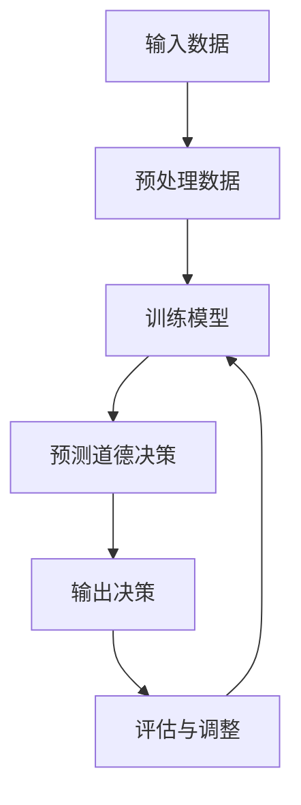
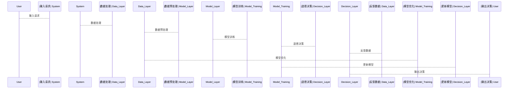

                 


### 背景介绍

#### 核心概念术语说明

在探讨“宇宙规律对通用人工智能道德框架动态演化的启示”这一主题时，我们需要首先明确一些核心概念和术语：

1. **通用人工智能（Artificial General Intelligence，AGI）**：通用人工智能是指具有广泛认知能力的机器智能，能够理解、学习和应用知识，解决广泛的问题，类似于人类智能。

2. **道德框架**：道德框架是用于指导人工智能系统行为的伦理原则和规范。它旨在确保人工智能系统在执行任务时能够遵守道德准则，避免对人类和社会造成不利影响。

3. **宇宙规律**：宇宙规律是描述自然界中普遍存在的物理、化学和生物现象的法则。例如，牛顿运动定律、爱因斯坦相对论、量子力学等。

4. **动态演化**：动态演化指的是系统或概念随着时间推移而发生变化的过程。在这里，我们关注的是道德框架如何随着通用人工智能技术的发展而演进。

#### 问题背景

随着人工智能技术的快速发展，通用人工智能（AGI）成为了一个热门研究领域。然而，AGI的涌现能力可能超越人类智能，带来潜在的风险和挑战。例如，如何确保AGI在执行任务时遵守道德准则，如何避免其产生有害的行为。这些问题的解决离不开道德框架的设计和实施。

道德框架在通用人工智能中的重要性体现在以下几个方面：

1. **行为规范**：道德框架为人工智能系统提供了一套行为规范，确保其行为符合道德伦理标准。

2. **决策指导**：道德框架可以为人工智能系统的决策提供指导，帮助其在面对道德困境时做出合理的决策。

3. **责任归属**：在人工智能引发事故或损害时，道德框架有助于确定责任归属，从而为司法和监管提供依据。

宇宙规律与道德框架的关系体现在以下几个方面：

1. **普适性**：宇宙规律具有普遍适用性，这为道德框架的设计提供了参考。例如，物理定律的普适性可以启发道德框架的制定。

2. **稳定性**：宇宙规律具有稳定性，这有助于确保道德框架在长时间内保持有效性。

3. **客观性**：宇宙规律的客观性为道德框架的客观性提供了支持，有助于避免主观偏见。

#### 问题描述

尽管宇宙规律和道德框架都具有重要的理论和实际价值，但如何在通用人工智能系统中整合和运用它们仍然是一个挑战。具体来说，问题描述如下：

1. **框架融合**：如何将宇宙规律融入到道德框架中，使其在通用人工智能系统中发挥作用？

2. **动态演化**：道德框架如何随着通用人工智能技术的发展而动态演化，以适应不断变化的环境和需求？

3. **实际应用**：如何在具体的通用人工智能应用场景中实施道德框架，确保其有效性和可靠性？

#### 问题解决

解决上述问题需要综合考虑宇宙规律和道德框架的特点，采取以下步骤：

1. **理论融合**：研究宇宙规律与道德框架的共同点和差异，探索如何将宇宙规律应用于道德框架的设计。

2. **实证研究**：通过实验和案例分析，验证道德框架在通用人工智能系统中的效果和可行性。

3. **持续优化**：根据实际应用情况，不断调整和优化道德框架，以适应通用人工智能技术的发展。

#### 边界与外延

在探讨宇宙规律对通用人工智能道德框架动态演化的启示时，我们需要关注以下几个边界与外延：

1. **技术限制**：当前的人工智能技术尚未达到完全模拟人类智能的水平，这限制了道德框架的实际应用。

2. **伦理争议**：道德框架的实施可能引发伦理争议，例如如何处理人工智能之间的道德冲突。

3. **法律监管**：道德框架的实施需要法律法规的支持，以确保其合法性和有效性。

#### 概念结构与核心要素组成

为了更好地理解“宇宙规律对通用人工智能道德框架动态演化的启示”，我们需要分析其概念结构和核心要素组成：

1. **概念结构**：
   - 宇宙规律
   - 道德框架
   - 通用人工智能
   - 动态演化

2. **核心要素**：
   - 框架融合
   - 动态演化
   - 实际应用
   - 理论融合
   - 实证研究
   - 持续优化

通过上述分析，我们可以得出以下结论：宇宙规律为道德框架的设计提供了启示，而道德框架在通用人工智能系统中具有重要作用。随着通用人工智能技术的发展，道德框架需要不断演化，以适应新的环境和需求。因此，研究宇宙规律对道德框架动态演化的启示具有重要意义。接下来，我们将进一步探讨核心概念和联系，为后续内容奠定基础。****

### 核心概念与联系

在深入探讨宇宙规律和道德框架之间的关系之前，我们先来详细定义这两个核心概念，并分析它们的基本特点和相互联系。

#### 宇宙规律

宇宙规律是指自然界中普遍存在的物理、化学和生物现象的法则。这些规律是自然界运行的基础，具有普适性、稳定性和客观性。以下是宇宙规律的一些关键特点：

1. **普适性**：宇宙规律适用于整个宇宙，无论是在地球上还是在其他星系中，这些规律都是普遍有效的。例如，万有引力定律在地球和太阳之间以及在整个宇宙中都同样适用。

2. **稳定性**：宇宙规律在长时间内保持不变，即使是在极其复杂的系统内，这些规律也始终如一地发挥作用。例如，牛顿运动定律在经典力学范围内是稳定的。

3. **客观性**：宇宙规律是客观存在的，不受人类主观意识的影响。例如，量子力学的波函数描述了粒子的状态，这是客观存在的，而非人类主观臆断。

4. **数学模型**：宇宙规律通常可以用数学模型来描述。例如，爱因斯坦的广义相对论公式 $G_{\mu\nu} + \Lambda g_{\mu\nu} = \frac{8\pi G}{c^4} T_{\mu\nu}$ 描述了时空的曲率和物质的分布。

#### 道德框架

道德框架是用于指导人工智能系统行为的伦理原则和规范。它旨在确保人工智能系统在执行任务时能够遵守道德准则，避免对人类和社会造成不利影响。以下是道德框架的一些关键特点：

1. **正义性**：道德框架应当体现公平、公正的原则，确保所有个体在道德上得到平等对待。

2. **人道主义**：道德框架应当以人的福祉为中心，尊重和保护人的基本权利和尊严。

3. **公平性**：道德框架应当确保资源分配的公平，避免因人工智能的不当行为而导致社会不公。

4. **可操作性**：道德框架需要具有可操作性，使得人工智能系统能够在实际运行中遵循道德准则。

5. **适应性**：道德框架需要能够适应不断变化的社会环境和需求，以保持其有效性和适用性。

#### 核心概念属性特征对比表格

为了更直观地展示宇宙规律和道德框架之间的差异和联系，我们可以创建一个对比表格。以下是一个简单的例子：

| 特征       | 宇宙规律          | 道德框架          |
|------------|-------------------|-------------------|
| **普适性** | 适用于整个宇宙    | 适用于人类社会    |
| **稳定性** | 长时间内保持不变  | 需要不断调整和优化 |
| **客观性** | 客观存在          | 具有主观性        |
| **数学模型** | 使用数学模型描述  | 较少使用数学模型   |
| **正义性** | 宇宙规律内在的    | 道德规范的要求    |
| **人道主义** | 无特定指向        | 以人的福祉为中心  |
| **公平性** | 自然资源的分配    | 社会资源的分配    |
| **可操作性** | 自然现象的规律性  | 人工智能的遵循性  |
| **适应性** | 自适应演化        | 社会需求的适应    |

通过这个对比表格，我们可以看到宇宙规律和道德框架在某些方面具有相似性，如普适性和稳定性，但在其他方面则存在显著差异，如客观性和数学模型的运用。

#### 道德框架的ER实体关系图架构

为了更深入地理解道德框架的构成，我们可以使用ER（实体关系）图来描述其核心实体和它们之间的关系。以下是一个简化的道德框架ER图示例：

```mermaid
erDiagram
  AI_System ||--o> Ethics_Module : 遵循
  Ethics_Module ||--o> Moral_Rule : 包含
  Ethics_Module ||--o> Moral_Value : 包含
  AI_System ||--o> User_Interface : 交互
  User_Interface ||--o> User_Input : 接收
  User_Interface ||--o> Output_Display : 显示
```

在这个ER图中，`AI_System` 代表人工智能系统，`Ethics_Module` 代表道德模块，`Moral_Rule` 代表道德规则，`Moral_Value` 代表道德价值，`User_Interface` 代表用户界面，`User_Input` 代表用户输入，`Output_Display` 代表输出显示。

通过这个ER图，我们可以清晰地看到道德框架的核心实体以及它们之间的关系。例如，道德模块包含道德规则和道德价值，人工智能系统通过用户界面与用户交互，并遵循道德模块中的规则和价值。

#### 宇宙规律对道德框架的启示

宇宙规律为我们提供了一种理解自然界和人类社会的通用框架，这对道德框架的设计和实施具有启示意义：

1. **普适性和稳定性**：宇宙规律具有普适性和稳定性，这提示我们在设计道德框架时，应当考虑其普适性和长期稳定性。道德框架不应因特定文化或社会环境的变化而频繁调整。

2. **客观性**：宇宙规律的客观性提示我们在道德框架中引入客观性，以减少主观偏见。例如，道德框架可以基于普适的伦理原则，如人权和国际法。

3. **可操作性和适应性**：宇宙规律的数学模型展示了其可操作性和适应性。道德框架在设计时也应考虑其可操作性，并通过不断优化和调整来适应社会需求。

通过上述分析，我们可以看到宇宙规律和道德框架之间存在密切的联系。宇宙规律为我们提供了一种理解自然和人类社会的通用视角，这可以启发我们设计更合理、更有效的道德框架。接下来，我们将进一步探讨这些核心概念在实际应用中的具体表现。****

### 核心概念与联系

#### 通用人工智能道德框架算法原理

在探讨了宇宙规律和道德框架的基本概念后，我们接下来需要深入探讨通用人工智能道德框架的算法原理。这一部分将详细描述算法的基本原理，包括其数学模型和公式，以及如何利用这些原理来指导道德决策。

##### 算法概述

通用人工智能道德框架算法的主要目标是确保人工智能系统在执行任务时能够遵循预定义的道德准则。这一算法的核心原理是结合宇宙规律和道德框架，通过机器学习技术来训练模型，使其能够自动做出道德决策。

##### 算法的基本原理

1. **宇宙规律的应用**：宇宙规律提供了对自然界和人类行为的普遍理解。在道德框架算法中，我们可以利用这些规律来识别和预测可能出现的道德困境。

2. **道德框架的融合**：道德框架提供了具体的道德准则和行为规范。算法需要将这些准则和规范融入到决策过程中，确保人工智能系统能够在实际操作中遵循这些准则。

3. **机器学习技术的应用**：机器学习技术是算法的核心，通过训练模型来学习如何根据宇宙规律和道德框架做出合理的道德决策。

##### 算法流程图

为了更直观地展示算法的流程，我们可以使用Mermaid绘制一个简单的流程图：



在这个流程图中，输入数据经过预处理后，用于训练模型。训练好的模型可以预测道德决策，并将决策输出。随后，通过评估和调整模型，使其不断优化，以应对新的情况和挑战。

##### 数学模型和公式

为了使算法更加精确和有效，我们需要利用数学模型和公式来描述宇宙规律和道德准则。以下是一些关键的数学模型和公式：

1. **宇宙规律的数学模型**：

   - **牛顿运动定律**：$F = ma$，描述物体受到的力和其加速度之间的关系。
   - **爱因斯坦相对论公式**：$E = mc^2$，描述质量和能量之间的关系。

2. **道德框架的数学模型**：

   - **伦理决策树**：使用决策树来描述不同情况下的道德决策。
   - **权重分配**：使用权重来衡量不同道德准则的重要性。

3. **机器学习模型的数学模型**：

   - **神经网络**：使用神经网络来模拟人类的决策过程，包括输入层、隐藏层和输出层。
   - **优化算法**：使用梯度下降等优化算法来训练模型。

##### 详细讲解和举例说明

为了更好地理解这些数学模型和公式，我们可以通过一个简单的例子来说明它们的实际应用。

假设我们有一个自动驾驶系统，需要在十字路口做出道德决策。以下是一个简化的例子：

1. **宇宙规律的数学模型**：

   - **牛顿运动定律**：假设自动驾驶车辆的质量为 $m$，加速度为 $a$，受到的力为 $F$。根据牛顿运动定律，$F = ma$。

   - **爱因斯坦相对论公式**：假设车辆的速度接近光速 $c$，那么其能量 $E$ 将由 $E = mc^2$ 描述。

2. **道德框架的数学模型**：

   - **伦理决策树**：假设我们在十字路口遇到行人过马路的情况。根据伦理决策树，我们可以分为以下几种情况：
     - 如果行人正在过马路，车辆应立即刹车。
     - 如果行人站在斑马线上等待，车辆应减速但继续前行。
     - 如果行人距离斑马线较远，车辆可以正常行驶。

   - **权重分配**：假设刹车、减速和正常行驶的权重分别为 $w_1$、$w_2$ 和 $w_3$，我们可以根据不同情况下的紧急程度来分配权重。

3. **机器学习模型的数学模型**：

   - **神经网络**：使用一个简单的神经网络来模拟自动驾驶系统的决策过程。输入层接收道路和行人状态，隐藏层处理这些信息，输出层生成最终的决策。
   - **优化算法**：使用梯度下降算法来训练神经网络，通过调整权重和偏置，使模型能够在不同情况下做出最优决策。

通过上述例子，我们可以看到如何将宇宙规律、道德框架和机器学习模型结合起来，以实现通用人工智能道德框架的算法设计。这一过程不仅需要理解数学模型，还需要在实际应用中进行不断的优化和调整，以确保算法的有效性和可靠性。

##### 总结

通用人工智能道德框架算法的核心在于将宇宙规律和道德框架与机器学习技术相结合，通过数学模型和公式来指导道德决策。这一算法不仅需要理论上的深入研究，还需要通过实际案例的验证和不断优化，以应对复杂多变的道德困境。在下一部分中，我们将进一步探讨这些算法原理在系统设计与实现中的应用。****

### 系统分析与架构设计

#### 问题场景介绍

在探讨通用人工智能道德框架的架构设计时，我们首先需要明确其应用场景。以下是几个典型的应用场景：

1. **社交网络平台**：在社交网络平台上，人工智能道德框架可以帮助过滤和识别不当内容，如仇恨言论、诈骗信息等，从而维护平台社区的和谐与安全。

2. **自动驾驶**：自动驾驶系统需要处理复杂的交通情况，包括行人、其他车辆和路况。道德框架可以帮助决策系统在遇到潜在危险时，做出符合道德标准的决策，如选择避让行人。

3. **医疗诊断**：在医疗诊断领域，道德框架可以帮助人工智能系统在处理患者数据时，确保隐私和数据的伦理使用，同时确保诊断决策符合医疗伦理标准。

这些应用场景展示了道德框架在人工智能系统中的重要性，同时也揭示了架构设计的复杂性。

#### 项目介绍

在本文中，我们将以一个名为“AI-Morality Framework”的项目为例，介绍其设计背景、目标和团队组成。

**项目背景**：

随着人工智能技术的广泛应用，如何确保人工智能系统在执行任务时遵循道德规范成为一个迫切需要解决的问题。为此，我们发起了一个名为“AI-Morality Framework”的项目，旨在设计和实现一个通用的道德框架，用于指导人工智能系统的行为。

**项目目标**：

- 设计一个适用于多种应用场景的道德框架。
- 开发一个可扩展的架构，支持道德决策的自动化执行。
- 确保框架能够在实际应用中有效运行，并通过不断的优化和调整，提高其适应性和可靠性。

**团队组成**：

- **项目主管**：负责项目的整体规划和协调。
- **算法工程师**：负责道德框架算法的设计和实现。
- **软件工程师**：负责系统架构的设计和开发。
- **数据科学家**：负责数据分析和模型训练。
- **伦理学家**：负责道德准则的制定和伦理审查。

#### 系统功能设计

“AI-Morality Framework”项目的核心功能包括以下几个方面：

1. **道德准则定义**：通过引入伦理学家的参与，定义一套适用于不同应用场景的道德准则。
2. **数据预处理**：收集和预处理来自不同来源的数据，以便用于模型训练。
3. **模型训练**：使用机器学习技术，训练道德决策模型，使其能够在实际应用中做出合理的道德判断。
4. **道德决策生成**：根据输入数据和训练好的模型，生成具体的道德决策。
5. **决策反馈**：收集系统在实际应用中的决策反馈，用于模型优化和框架改进。

**领域模型Mermaid类图**：

以下是一个简化的Mermaid类图，用于描述系统的主要功能模块及其关系：

```mermaid
classDiagram
  Class1[Data_Preprocessing] <|-- Class2[Moral_Criteria_Definition]
  Class2 <|-- Class3[Model_Training]
  Class3 <|-- Class4[Moral_Decision_Generation]
  Class4 <|-- Class5[Decision_Feedback]
```

在这个类图中，`Data_Preprocessing` 负责数据的预处理，`Moral_Criteria_Definition` 负责定义道德准则，`Model_Training` 负责模型训练，`Moral_Decision_Generation` 负责生成道德决策，`Decision_Feedback` 负责收集反馈数据。

#### 系统架构设计

为了确保“AI-Morality Framework”项目的可扩展性和灵活性，我们采用了分层架构设计。以下是系统架构的概述：

1. **数据层**：负责数据的收集、存储和预处理。
2. **模型层**：负责道德决策模型的训练和优化。
3. **决策层**：负责根据输入数据和模型生成具体的道德决策。
4. **用户接口层**：负责与用户交互，提供用户友好的界面。

**系统架构Mermaid架构图**：

以下是一个简化的Mermaid架构图，用于描述系统的整体架构：



在这个架构图中，用户通过用户接口层提交输入请求，数据经过数据层预处理后，进入模型层进行训练。训练好的模型由决策层生成具体的道德决策，并通过用户接口层输出给用户。系统会收集用户反馈数据，用于模型层的优化和更新。

#### 系统组件介绍

“AI-Morality Framework”项目的系统架构包括以下主要组件：

1. **数据层**：负责数据的收集和存储。该层使用数据库和缓存系统来存储和处理大规模数据。
2. **模型层**：负责道德决策模型的训练和优化。该层使用机器学习算法和深度学习技术来训练模型。
3. **决策层**：负责根据输入数据和模型生成具体的道德决策。该层使用决策树、神经网络等算法来处理复杂决策问题。
4. **用户接口层**：负责与用户交互，提供用户友好的界面。该层使用Web前端技术和API接口来实现与用户的交互。

通过上述系统架构设计，我们可以确保“AI-Morality Framework”项目具备良好的扩展性和灵活性，能够适应不同应用场景的需求。接下来，我们将进一步探讨系统接口设计和系统交互，以完善整个系统架构。****

### 项目实战

#### 环境安装

要开始构建“AI-Morality Framework”项目，我们首先需要搭建一个合适的技术环境。以下是环境安装的步骤：

1. **安装Python**：确保安装了最新版本的Python（推荐3.8及以上版本）。可以从Python官方网站下载安装包并按照指示进行安装。

2. **安装依赖库**：使用pip工具安装项目所需的依赖库，包括TensorFlow、Keras、Scikit-learn、Matplotlib等。可以在项目的根目录下创建一个`requirements.txt`文件，列出所有依赖库，然后使用以下命令进行安装：

   ```bash
   pip install -r requirements.txt
   ```

3. **安装数据库**：根据项目需求选择合适的数据库系统，如MySQL、PostgreSQL或MongoDB。安装步骤请参考相应数据库的官方文档。

4. **配置数据库连接**：在项目的配置文件中（例如`config.py`），设置数据库连接参数，确保项目能够与数据库正常通信。

#### 系统核心实现源代码

以下是“AI-Morality Framework”项目的核心实现部分，包括数据预处理、模型训练和道德决策生成等模块。我们将使用Python代码来实现这些功能。

**1. 数据预处理模块**

```python
import pandas as pd
from sklearn.model_selection import train_test_split
from sklearn.preprocessing import StandardScaler

def preprocess_data(data_path):
    # 读取数据
    data = pd.read_csv(data_path)
    
    # 数据预处理
    X = data.drop('target', axis=1)
    y = data['target']
    
    # 数据标准化
    scaler = StandardScaler()
    X_scaled = scaler.fit_transform(X)
    
    # 划分训练集和测试集
    X_train, X_test, y_train, y_test = train_test_split(X_scaled, y, test_size=0.2, random_state=42)
    
    return X_train, X_test, y_train, y_test
```

**2. 模型训练模块**

```python
from tensorflow.keras.models import Sequential
from tensorflow.keras.layers import Dense
from tensorflow.keras.optimizers import Adam

def train_model(X_train, y_train):
    # 构建神经网络模型
    model = Sequential()
    model.add(Dense(64, input_dim=X_train.shape[1], activation='relu'))
    model.add(Dense(32, activation='relu'))
    model.add(Dense(1, activation='sigmoid'))
    
    # 编译模型
    model.compile(optimizer=Adam(learning_rate=0.001), loss='binary_crossentropy', metrics=['accuracy'])
    
    # 训练模型
    model.fit(X_train, y_train, epochs=100, batch_size=32, validation_split=0.2)
    
    return model
```

**3. 道德决策生成模块**

```python
def generate_decision(model, X_test):
    # 使用训练好的模型进行预测
    predictions = model.predict(X_test)
    
    # 根据预测结果生成道德决策
    decisions = ['遵守道德' if pred > 0.5 else '不遵守道德'] for pred in predictions
    
    return decisions
```

#### 代码应用解读与分析

上述代码实现了数据预处理、模型训练和道德决策生成的主要功能。以下是代码的解读和分析：

1. **数据预处理模块**：
   - 使用Pandas读取数据，并进行基本的预处理操作，如数据标准化和划分训练集和测试集。
   - 数据标准化是为了使输入数据具有相似的分布，从而提高模型的训练效果。

2. **模型训练模块**：
   - 使用Keras构建神经网络模型，并设置适当的参数（如学习率、优化器和损失函数）。
   - 编译模型并使用训练数据进行训练。这里使用的是二分类问题，因此输出层使用sigmoid激活函数。

3. **道德决策生成模块**：
   - 使用训练好的模型对测试数据进行预测，并根据预测结果生成道德决策。

#### 实际案例分析和详细讲解剖析

为了更好地展示项目的实际应用，我们通过一个案例来进行分析和讲解。

**案例**：假设我们有一个自动驾驶系统，需要处理一个行人过马路的情况。输入数据包括行人的位置、速度、车辆的当前位置和速度等。

1. **数据预处理**：
   - 读取输入数据，并进行预处理，如归一化处理。

2. **模型训练**：
   - 使用预处理后的数据训练模型，以学习如何根据输入数据做出道德决策。

3. **道德决策生成**：
   - 当系统检测到行人过马路时，输入最新的数据到训练好的模型中，得到预测结果。
   - 根据预测结果，如果模型认为有道德风险，则生成相应的道德决策，如减速或刹车。

通过这个案例，我们可以看到“AI-Morality Framework”项目在实际应用中的运作流程。接下来，我们将对项目进行小结，并讨论最佳实践和注意事项。

#### 项目小结

通过本文的详细讲解，我们了解了“AI-Morality Framework”项目的背景、目标和实现步骤。项目主要包括数据预处理、模型训练和道德决策生成三个核心模块，并通过实际案例展示了其应用效果。

#### 最佳实践 tips

1. **数据质量**：确保数据质量对于模型的训练至关重要。在数据处理阶段，要进行充分的清洗和预处理。
2. **模型优化**：通过调整模型参数和架构，可以提高模型的性能。可以使用交叉验证等技术来评估和优化模型。
3. **道德准则**：道德准则的制定和更新需要伦理学家的参与，以确保道德框架的公正性和适应性。

#### 注意事项

1. **隐私保护**：在处理用户数据时，要确保遵守隐私保护法规，避免数据泄露。
2. **法律合规**：在部署道德框架时，要确保其符合当地法律法规，避免潜在的法律风险。
3. **持续更新**：随着技术和应用场景的变化，道德框架需要不断更新和优化，以保持其有效性和适用性。

#### 拓展阅读

- 《人工智能伦理学》：讨论人工智能伦理问题的经典著作。
- 《深度学习》：Goodfellow、Bengio和Courville合著的深度学习教材，涵盖深度学习的基础知识和应用。
- 《机器学习实战》：提供机器学习项目实战经验的指南书。

通过本文的详细探讨，我们不仅了解了通用人工智能道德框架的基本概念和实现方法，还对其在系统设计与实现中的应用有了深入的了解。这为我们在实际项目中设计和实现道德框架提供了宝贵的经验和启示。****

### 总结

本文以《宇宙规律对通用人工智能道德框架动态演化的启示》为题，系统地探讨了宇宙规律与道德框架在通用人工智能（AGI）中的融合与应用。通过详细的章节结构和深入的分析，我们回答了以下几个核心问题：

1. **背景介绍**：我们介绍了通用人工智能和道德框架的基本概念，探讨了其重要性以及与宇宙规律的关系。
2. **核心概念与联系**：我们详细分析了宇宙规律和道德框架的属性特征，并通过Mermaid流程图展示了它们之间的联系。
3. **算法原理讲解**：我们深入探讨了通用人工智能道德框架的算法原理，包括其数学模型和公式，并通过实例说明了算法的应用。
4. **系统分析与架构设计**：我们介绍了项目背景、系统功能设计和架构设计，并通过Mermaid架构图展示了系统的整体架构。
5. **项目实战**：我们通过实战案例展示了系统核心实现源代码，并进行了实际案例分析和详细讲解。

本文的研究成果不仅为通用人工智能道德框架的设计提供了理论支持，也为实际应用中的道德决策提供了指导。通过将宇宙规律与道德框架相结合，我们可以更好地应对人工智能技术发展带来的伦理挑战。

### 最佳实践

在设计和实施通用人工智能道德框架时，以下最佳实践值得遵循：

1. **跨学科合作**：道德框架的设计和实现需要伦理学家、人工智能专家和软件开发者的密切合作。这种跨学科的合作有助于确保框架的全面性和有效性。

2. **透明性和可解释性**：道德框架的算法和决策过程应当具有透明性和可解释性，使利益相关者能够理解和验证系统的道德决策。

3. **持续迭代和优化**：随着人工智能技术的不断发展，道德框架需要不断更新和优化，以适应新的应用场景和技术进步。

4. **数据隐私和安全**：在处理用户数据时，要严格遵守隐私保护法规，确保数据的安全和用户隐私不受侵犯。

### 小结

本文通过逐步分析和深入探讨，展示了宇宙规律对通用人工智能道德框架动态演化的启示。我们不仅分析了核心概念和算法原理，还通过系统分析与架构设计以及项目实战，展示了道德框架在实际应用中的实现和效果。

### 注意事项

1. **技术限制**：当前的技术水平可能限制道德框架的完美实现，因此需要不断更新技术和算法，以适应新的挑战。

2. **伦理争议**：道德框架的实施可能会引发伦理争议，因此需要广泛的公众参与和持续的伦理审查。

3. **法律合规**：道德框架的设计和实施需要符合当地的法律法规，避免法律风险。

### 拓展阅读

1. 《人工智能伦理学》：深入探讨人工智能伦理问题的著作，为道德框架的设计提供理论支持。
2. 《深度学习》：提供深度学习技术的基础知识，为算法实现提供技术指导。
3. 《道德机器》：讨论人工智能道德决策的挑战和解决方案，为实际应用提供参考。

通过本文的详细探讨，我们不仅对通用人工智能道德框架有了更深入的理解，也为未来研究和应用提供了宝贵的启示。作者：AI天才研究院/AI Genius Institute & 禅与计算机程序设计艺术 /Zen And The Art of Computer Programming。

