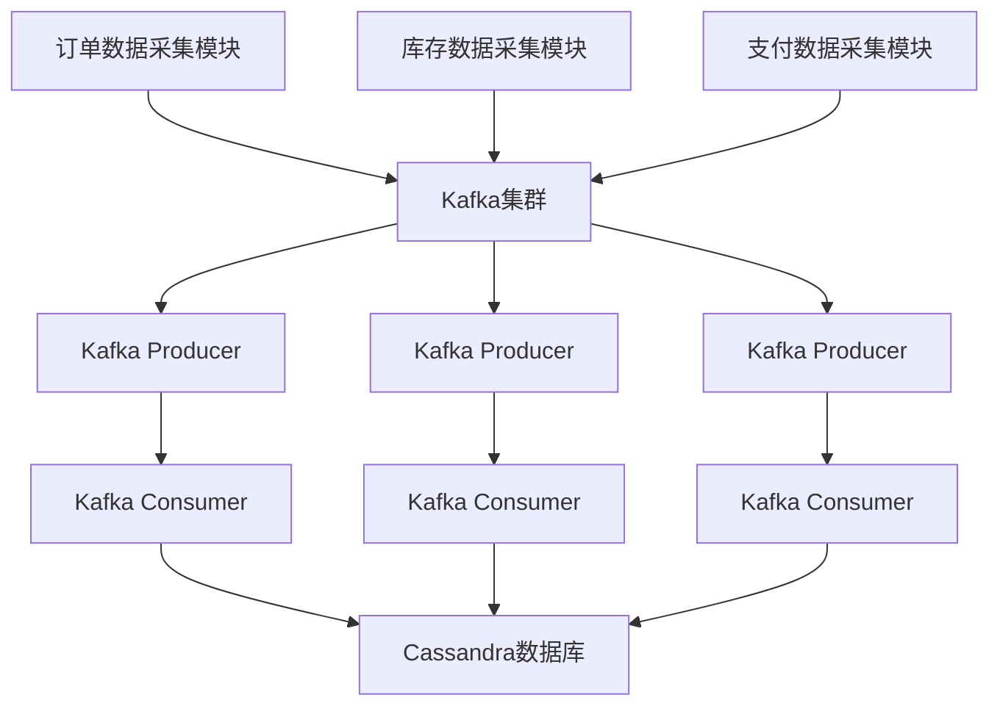

                 

### 实时数据同步：确保LLM应用数据的一致性

关键词：实时数据同步，数据一致性，分布式系统，LLM应用，一致性协议

摘要：本文旨在探讨实时数据同步技术在大型语言模型（LLM）应用中的重要性。我们将从实时数据同步的定义、需求背景、算法原理、架构设计、项目实战等多个角度进行深入分析，帮助读者全面理解实时数据同步在确保LLM应用数据一致性方面的关键作用。

----------------------------------------------------------------

# 第一部分: 引言

## 1.1 问题背景与定义

### 1.1.1 数据同步的重要性

在分布式系统中，数据同步是一个关键问题。随着大数据和云计算技术的发展，分布式系统越来越普遍，它们在处理大规模数据时发挥着重要作用。然而，分布式系统的特点决定了数据一致性成为一大挑战。数据同步的核心目标是确保分布式系统中的数据在不同节点之间保持一致。

### 1.1.2 实时数据同步的需求

实时数据同步是指系统能够在数据发生变更时立即更新其他节点的数据。在许多应用场景中，如金融交易、实时通信、物联网等，数据的一致性要求非常高。在这些场景中，任何延迟或错误都可能导致严重的后果。因此，实时数据同步成为这些应用场景的必要需求。

### 1.1.3 LLM应用中的数据一致性挑战

大型语言模型（LLM）是近年来人工智能领域的热门话题。LLM在自然语言处理、智能客服、内容生成等领域有广泛应用。然而，LLM应用中的数据一致性面临着特殊的挑战：

- **数据量庞大**：LLM训练和推理过程中需要处理的海量数据，使得数据同步的复杂度大幅增加。
- **时效性要求**：在实时场景中，LLM应用需要快速响应，数据同步的延迟可能影响用户体验。
- **数据多样性**：LLM应用涉及多种类型的数据，如文本、图像、语音等，需要不同的同步策略。

## 1.2 目标读者与本书结构

### 1.2.1 目标读者

本书的目标读者是对分布式系统和数据一致性有初步了解，但希望深入了解实时数据同步的工程师和开发者。此外，研究人员和学生也可以从本书中获得相关知识和启发。

### 1.2.2 本书结构

本书分为五个主要部分：

- **第一部分：引言**：介绍实时数据同步的重要性和背景。
- **第二部分：实时数据同步基础**：介绍分布式系统与数据一致性的基础概念。
- **第三部分：LLM应用与数据一致性**：分析LLM应用中的数据一致性挑战。
- **第四部分：实时数据同步算法**：讲解实时数据同步算法的原理与应用。
- **第五部分：实时数据同步架构设计**：介绍实时数据同步的架构设计原则和案例。

----------------------------------------------------------------

# 第二部分: 实时数据同步基础

## 2.1 分布式系统与数据一致性

### 2.1.1 分布式系统的挑战

分布式系统通过将任务分布在多个节点上，提高了系统的性能和可靠性。然而，分布式系统的特性也带来了新的挑战：

- **数据分布**：数据需要在不同的节点之间分布存储。
- **网络延迟**：节点之间的通信可能存在延迟。
- **节点故障**：分布式系统中的节点可能会出现故障。

### 2.1.2 数据一致性的定义

数据一致性是指系统中的数据在任何时候都处于一致状态。在分布式系统中，数据一致性是一个复杂的问题。常见的定义包括以下几种：

- **强一致性**：任何操作都立即对所有节点可见。
- **最终一致性**：系统会在一段时间后达到一致性，但不保证立即一致。
- **一致性级别**：根据系统对数据一致性的要求，可以将一致性分为不同的级别。

### 2.1.3 分布式数据一致性算法

为了解决分布式系统中的数据一致性挑战，研究人员提出了一系列分布式数据一致性算法。这些算法包括：

- **Paxos算法**：用于实现分布式系统的共识算法。
- **Raft算法**：与Paxos类似，但更易于理解和实现。
- **日志复制**：通过复制日志来保证数据一致性。
- **向量时钟**：用于跟踪分布式系统中的事件顺序。

## 2.2 实时数据同步技术概览

### 2.2.1 实时数据同步的定义

实时数据同步是指系统能够在数据发生变更时立即更新其他节点的数据。实时数据同步的关键特点是低延迟和高可靠性。

### 2.2.2 常见的实时数据同步技术

常见的实时数据同步技术包括：

- **消息队列**：通过消息队列实现数据的异步传输和同步。
- **分布式缓存**：通过分布式缓存提高数据的访问速度和一致性。
- **流处理**：通过流处理技术实现实时数据处理和分析。
- **事务处理**：通过事务处理保证数据的一致性和完整性。

### 2.2.3 实时数据同步的优势与挑战

实时数据同步的优势包括：

- **低延迟**：数据更新能够快速传播到所有节点。
- **高可靠性**：通过冗余和故障恢复机制提高系统的可靠性。

然而，实时数据同步也面临着以下挑战：

- **性能压力**：实时数据同步可能导致系统性能下降。
- **一致性保证**：在分布式系统中实现实时数据同步的一致性是困难的。
- **网络延迟和故障**：网络延迟和节点故障可能影响实时数据同步的可靠性。

## 2.3 数据一致性与LLM应用

### 2.3.1 LLM应用的特性

LLM应用具有以下特性：

- **大规模数据处理**：LLM需要处理大量的文本、图像、语音等数据。
- **实时响应**：LLM应用通常需要快速响应用户请求。
- **多样性**：LLM应用涉及多种类型的数据，需要不同的同步策略。

### 2.3.2 数据一致性在LLM应用中的重要性

在LLM应用中，数据一致性至关重要：

- **训练数据一致性**：训练数据的不一致可能导致LLM模型性能下降。
- **推理数据一致性**：推理过程中需要使用最新和一致的数据。
- **用户数据一致性**：用户数据的不一致可能影响用户体验。

### 2.3.3 LLM应用中的常见数据一致性问题

LLM应用中的常见数据一致性问题包括：

- **数据延迟**：数据更新延迟可能导致不一致。
- **数据冲突**：多个节点同时更新数据可能导致冲突。
- **网络故障**：网络故障可能导致数据同步失败。

## 2.4 总结

在本部分，我们介绍了分布式系统与数据一致性的基础概念，以及实时数据同步技术的概览。接下来，我们将进一步探讨LLM应用中的数据一致性挑战，为后续内容打下基础。

----------------------------------------------------------------

## 3.1 LLM应用场景分析

### 3.1.1 语言模型的应用

语言模型是一种基于统计学习的方法，用于理解和生成自然语言。它们在多个领域有着广泛应用，如自然语言处理（NLP）、智能客服、内容生成等。语言模型的核心任务是理解用户输入的文本，并生成相应的响应或内容。

### 3.1.2 数据一致性需求分析

在LLM应用中，数据一致性是确保应用稳定性和用户体验的关键因素。具体需求包括：

- **训练数据一致性**：在训练LLM模型时，需要确保训练数据的一致性。不一致的训练数据可能导致模型性能下降。
- **推理数据一致性**：在LLM应用中，需要使用最新和一致的数据进行推理。不一致的推理数据可能导致错误的结果。
- **用户数据一致性**：在用户交互过程中，需要确保用户数据的准确性。不一致的用户数据可能导致用户体验差。

### 3.1.3 LLM应用中的同步挑战

LLM应用中的同步挑战主要体现在以下几个方面：

- **数据量庞大**：LLM应用通常涉及大规模的数据，如文本、图像、语音等，导致数据同步的复杂度增加。
- **时效性要求**：在实时场景中，LLM应用需要快速响应用户请求，数据同步的延迟可能影响用户体验。
- **数据多样性**：LLM应用涉及多种类型的数据，需要不同的同步策略和机制。

### 3.1.4 实时数据同步在LLM应用中的重要性

实时数据同步在LLM应用中具有重要意义：

- **确保训练数据一致性**：实时数据同步可以确保训练数据的一致性，提高模型性能。
- **提高推理效率**：实时数据同步可以减少数据同步的延迟，提高LLM应用的推理效率。
- **优化用户体验**：实时数据同步可以确保用户数据的准确性和一致性，提高用户体验。

## 3.2 数据一致性与一致性协议

### 3.2.1 一致性协议的定义

一致性协议是一组规则和机制，用于确保分布式系统中的数据一致性。一致性协议的目标是在分布式系统中实现数据的强一致性或最终一致性。

### 3.2.2 常见一致性协议

常见的一致性协议包括：

- **Paxos算法**：用于实现分布式系统的共识算法，确保数据一致性。
- **Raft算法**：与Paxos类似，但更易于理解和实现。
- **分布式锁协议**：用于保证分布式系统中的互斥访问，防止数据冲突。
- **时间戳协议**：通过时间戳确保分布式系统中的事件顺序。

### 3.2.3 一致性协议在LLM应用中的实现

在LLM应用中，一致性协议的实现需要考虑以下几个关键因素：

- **数据一致性需求**：根据LLM应用的特点，确定所需的一致性级别。
- **一致性算法选择**：选择适合的一致性协议，如Paxos、Raft等。
- **一致性保障机制**：实现一致性协议，确保数据在分布式系统中的同步和一致性。

## 3.3 数据一致性与分布式系统

### 3.3.1 分布式系统的架构

分布式系统的架构通常包括多个节点、数据存储和网络通信等组成部分。节点负责数据的处理和存储，网络通信负责节点之间的数据传输。

### 3.3.2 数据一致性与分布式系统的关系

数据一致性与分布式系统的关系密切。分布式系统的特性决定了数据一致性的挑战，而数据一致性又是分布式系统的关键需求。数据一致性与分布式系统的关系如下：

- **数据一致性需求**：分布式系统中的数据需要保持一致，以避免数据冲突和错误。
- **一致性算法**：分布式系统需要一致性算法来确保数据的一致性。
- **系统设计**：分布式系统的设计需要考虑数据一致性的需求和实现方式。

### 3.3.3 分布式系统中的数据一致性问题与解决方案

在分布式系统中，常见的数据一致性问题包括：

- **数据冲突**：多个节点同时更新数据，可能导致数据不一致。
- **数据延迟**：数据更新可能存在延迟，影响系统的性能和一致性。
- **网络故障**：网络故障可能导致数据同步失败，影响系统的一致性。

解决方案包括：

- **分布式锁协议**：通过分布式锁协议，防止多个节点同时更新数据，避免数据冲突。
- **时间戳协议**：通过时间戳协议，确保数据更新的顺序，解决数据延迟问题。
- **冗余和故障恢复机制**：通过冗余和故障恢复机制，提高系统的容错能力和数据一致性。

## 3.4 总结

在本部分，我们分析了LLM应用场景中的数据一致性需求，并介绍了常见的一致性协议。下一部分，我们将进一步探讨实时数据同步算法的原理和应用，为解决LLM应用中的数据一致性挑战提供技术支持。

----------------------------------------------------------------

## 4.1 实时数据同步算法原理

### 4.1.1 数据同步算法的分类

实时数据同步算法根据同步方式和一致性要求可以分为以下几类：

- **基于消息队列的同步**：通过消息队列实现数据的异步传输，如Apache Kafka、RabbitMQ等。
- **基于日志复制的同步**：通过复制日志来确保数据的一致性，如Apache Pulsar、Apache BookKeeper等。
- **基于时间戳的同步**：通过时间戳确保数据更新的顺序，如Chubby、Zookeeper等。
- **基于一致性协议的同步**：通过一致性协议实现数据的一致性，如Paxos、Raft等。

### 4.1.2 实时数据同步算法的工作原理

实时数据同步算法的工作原理可以分为以下几个步骤：

1. **数据采集**：从源数据源（如数据库、消息队列等）采集数据。
2. **数据转换**：对采集到的数据进行处理和转换，以适应目标数据源。
3. **数据传输**：将转换后的数据传输到目标数据源。
4. **数据校验**：对传输后的数据进行校验，确保数据的一致性和完整性。
5. **错误处理**：当数据传输过程中发生错误时，进行错误处理和恢复。

### 4.1.3 常见的实时数据同步算法

常见的实时数据同步算法包括：

- **Apache Kafka**：基于发布-订阅模型的消息队列系统，提供高吞吐量和低延迟的数据传输。
- **Apache Pulsar**：分布式发布-订阅消息系统，提供高性能和可靠性。
- **Apache BookKeeper**：分布式日志存储系统，提供高可用性和强一致性。
- **Chubby**：Google开发的分布式锁服务，用于确保数据的一致性。
- **Zookeeper**：分布式协调服务，提供一致性保障和数据同步。

## 4.2 算法详解与性能分析

### 4.2.1 算法详解

在本节中，我们将详细介绍几种常见的实时数据同步算法：

### Apache Kafka

Apache Kafka是一个分布式消息队列系统，它提供了高性能、可扩展、可持久化的消息传输服务。Kafka的关键特性包括：

- **发布-订阅模型**：支持多生产者、多消费者模型，提供灵活的消息传输方式。
- **分布式架构**：支持水平扩展，提供高可用性和容错性。
- **持久化存储**：消息存储在磁盘上，确保数据的持久化和可靠性。

Kafka的工作流程如下：

1. **生产者发送消息**：生产者将消息发送到Kafka集群。
2. **消息存储**：消息被存储在Kafka的分区中，每个分区具有多个副本，提供数据冗余和负载均衡。
3. **消费者消费消息**：消费者从Kafka集群中消费消息，进行处理和同步。

### Apache Pulsar

Apache Pulsar是一个分布式发布-订阅消息系统，它提供了高性能、高可靠性和可扩展性。Pulsar的关键特性包括：

- **无消息丢失**：消息存储在磁盘上，确保数据的持久性和可靠性。
- **高吞吐量**：支持高吞吐量的消息传输，适用于大规模数据同步。
- **多租户架构**：支持多租户和隔离，提供灵活的资源管理和调度。

Pulsar的工作流程如下：

1. **生产者发送消息**：生产者将消息发送到Pulsar集群。
2. **消息存储**：消息被存储在Pulsar的Topic中，每个Topic具有多个分区，提供数据冗余和负载均衡。
3. **消费者消费消息**：消费者从Pulsar集群中消费消息，进行处理和同步。

### Apache BookKeeper

Apache BookKeeper是一个分布式日志存储系统，它提供了高可用性、强一致性和高性能。BookKeeper的关键特性包括：

- **强一致性**：确保数据的强一致性，提供可靠的存储服务。
- **高吞吐量**：支持高吞吐量的日志写入和读取，适用于大规模数据同步。
- **故障恢复**：具有自动故障恢复机制，确保系统的可靠性和可用性。

BookKeeper的工作流程如下：

1. **写入日志**：生产者将日志数据写入BookKeeper集群。
2. **日志存储**：日志被存储在BookKeeper的存储单元中，每个存储单元具有多个副本，提供数据冗余和负载均衡。
3. **读取日志**：消费者从BookKeeper集群中读取日志数据，进行处理和同步。

### Chubby

Chubby是Google开发的分布式锁服务，它提供了强一致性保障。Chubby的关键特性包括：

- **分布式锁**：提供分布式锁服务，确保数据的一致性和并发控制。
- **高可用性**：具有高可用性，确保系统的稳定运行。
- **故障恢复**：具有故障恢复机制，确保系统的可靠性和可用性。

Chubby的工作流程如下：

1. **请求锁**：客户端向Chubby服务器请求锁。
2. **锁分配**：Chubby服务器分配锁，确保并发访问的同步。
3. **释放锁**：客户端释放锁，释放占用的资源。

### Zookeeper

Zookeeper是Apache开发的分布式协调服务，它提供了数据同步和一致性保障。Zookeeper的关键特性包括：

- **数据同步**：提供数据同步服务，确保分布式系统中的数据一致性。
- **一致性协议**：提供一致性协议，确保分布式系统的强一致性。
- **集群管理**：提供集群管理功能，确保系统的可靠性和可用性。

Zookeeper的工作流程如下：

1. **注册监听器**：客户端注册监听器，监听Zookeeper中的数据变更。
2. **数据变更**：当Zookeeper中的数据发生变化时，通知监听器。
3. **同步数据**：客户端根据监听器通知同步数据，确保数据一致性。

### 4.2.2 性能分析

实时数据同步算法的性能分析主要从以下几个方面进行：

- **吞吐量**：算法的处理能力，即单位时间内可以处理的数据量。
- **延迟**：数据传输和处理的时间，即数据从生产者到消费者的时间。
- **可靠性**：算法的可靠性，包括数据的一致性和系统的可用性。
- **可扩展性**：算法的可扩展性，即系统可以适应数据规模的变化。

不同实时数据同步算法的性能特点如下：

- **Apache Kafka**：具有高吞吐量和低延迟，适用于大规模数据同步。
- **Apache Pulsar**：具有高吞吐量和可靠性，适用于大规模数据同步。
- **Apache BookKeeper**：具有高吞吐量和强一致性，适用于大规模数据同步。
- **Chubby**：具有高可用性和分布式锁功能，适用于分布式系统的一致性保障。
- **Zookeeper**：具有数据同步和一致性协议功能，适用于分布式系统的协调和管理。

### 4.2.3 算法对比与选择

根据不同的应用场景和性能需求，可以选择适合的实时数据同步算法。以下是对几种常见算法的对比：

- **数据同步需求**：Apache Kafka和Apache Pulsar适用于大规模数据同步，Apache BookKeeper适用于日志存储和数据同步。
- **一致性要求**：Chubby适用于分布式锁和一致性保障，Zookeeper适用于数据同步和一致性协议。
- **性能要求**：Apache Kafka和Apache Pulsar具有高吞吐量和低延迟，适用于高性能场景。

在实际应用中，可以根据具体的场景和需求，选择合适的实时数据同步算法，以实现数据的一致性和可靠性。

## 4.3 实时数据同步算法应用

### 4.3.1 算法在实际应用中的案例

实时数据同步算法在多个领域有着广泛的应用，以下是一些实际案例：

- **金融行业**：在金融行业中，实时数据同步算法用于确保交易数据的准确性和一致性，如股票交易、基金管理等。
- **电信行业**：在电信行业中，实时数据同步算法用于确保用户数据和计费数据的准确性，如移动通信、宽带接入等。
- **物联网**：在物联网领域，实时数据同步算法用于确保设备状态和数据的一致性，如智能家居、智能城市等。

### 4.3.2 算法实现与优化

实时数据同步算法的实现和优化是确保数据一致性和系统性能的关键。以下是一些实现和优化方法：

- **数据分区**：通过数据分区可以提高系统的并发处理能力和性能，降低单点瓶颈。
- **负载均衡**：通过负载均衡可以将数据传输和处理的负载分配到多个节点，提高系统的性能和可靠性。
- **数据压缩**：通过数据压缩可以减少数据传输的带宽消耗，提高数据传输速度。
- **缓存机制**：通过缓存机制可以减少数据访问的延迟，提高系统的响应速度。

### 4.3.3 算法应用的挑战与解决方案

实时数据同步算法在实际应用中面临一些挑战，以下是一些常见的挑战和解决方案：

- **数据冲突**：多个节点同时更新数据可能导致数据冲突，可以通过分布式锁和版本控制来避免冲突。
- **网络故障**：网络故障可能导致数据同步失败，可以通过冗余网络和故障恢复机制来提高系统的可靠性。
- **数据延迟**：数据延迟可能影响系统的性能和用户体验，可以通过优化数据传输路径和减少网络延迟来提高数据同步速度。

### 4.3.4 实时数据同步算法应用案例分析

以下是一个实时数据同步算法应用案例分析：

**案例背景**：某大型电商平台需要实时同步用户订单数据到多个节点，以确保订单处理的一致性和准确性。

**解决方案**：采用Apache Kafka作为实时数据同步算法，实现用户订单数据的实时同步。

**具体步骤**：

1. **数据采集**：用户订单数据通过API接口发送到Kafka集群。
2. **数据分区**：将用户订单数据分区，提高系统并发处理能力和性能。
3. **负载均衡**：通过Kafka集群的负载均衡机制，将数据传输和处理的负载分配到多个节点。
4. **数据压缩**：对用户订单数据进行压缩，减少数据传输的带宽消耗。
5. **数据消费**：多个节点从Kafka集群中消费用户订单数据，进行处理和同步。
6. **数据校验**：对同步后的数据进行校验，确保数据的一致性和准确性。
7. **错误处理**：当数据同步过程中发生错误时，进行错误处理和恢复。

通过采用Apache Kafka作为实时数据同步算法，该电商平台实现了用户订单数据的实时同步，提高了系统的性能和可靠性。

## 4.4 总结

在本部分，我们介绍了实时数据同步算法的分类、工作原理和性能分析，并分析了算法在实际应用中的案例。下一部分，我们将进一步探讨实时数据同步架构设计的原则和关键因素。

----------------------------------------------------------------

## 5.1 实时数据同步架构设计原则

### 5.1.1 架构设计的目标

实时数据同步架构设计的目标是确保数据在分布式系统中的同步和一致性。具体目标包括：

- **数据一致性**：确保分布式系统中数据的一致性，避免数据冲突和错误。
- **低延迟**：减少数据传输和处理的时间，提高系统的响应速度。
- **高可靠性**：提高系统的可靠性和容错能力，确保数据传输的准确性。
- **可扩展性**：支持系统的水平扩展，适应数据规模的变化。

### 5.1.2 架构设计的原则

实时数据同步架构设计需要遵循以下原则：

- **分布式原则**：将数据同步任务分布在多个节点上，提高系统的并发处理能力和性能。
- **一致性原则**：根据数据一致性的要求，选择合适的一致性协议和算法，确保数据的一致性。
- **可靠性原则**：通过冗余和故障恢复机制，提高系统的可靠性和容错能力。
- **扩展性原则**：支持系统的水平扩展，适应数据规模的变化。

### 5.1.3 架构设计的关键因素

实时数据同步架构设计的关键因素包括：

- **数据源**：确定数据源的类型和位置，如数据库、消息队列等。
- **数据传输**：确定数据传输的方式和路径，如网络传输、数据总线等。
- **数据存储**：确定数据存储的位置和方式，如分布式存储、缓存等。
- **数据一致性**：选择合适的一致性协议和算法，确保数据的一致性。
- **故障恢复**：设计故障恢复机制，提高系统的可靠性和容错能力。
- **性能优化**：通过数据分区、负载均衡、数据压缩等技术，优化系统性能。

## 5.2 数据同步架构设计

### 5.2.1 数据同步架构的设计过程

实时数据同步架构的设计过程可以分为以下几个步骤：

1. **需求分析**：分析实时数据同步的需求，确定数据源、数据传输、数据存储等关键因素。
2. **架构设计**：根据需求分析，设计实时数据同步的架构，包括数据源、数据传输、数据存储、数据一致性等模块。
3. **一致性协议选择**：根据数据一致性的要求，选择合适的一致性协议和算法。
4. **故障恢复设计**：设计故障恢复机制，提高系统的可靠性和容错能力。
5. **性能优化**：通过数据分区、负载均衡、数据压缩等技术，优化系统性能。
6. **测试与优化**：对架构进行测试和优化，确保系统性能和可靠性。

### 5.2.2 数据同步架构的设计过程

以下是一个实时数据同步架构设计过程的示例：

**需求分析**：某大型电商平台需要实时同步用户订单数据到多个节点，以确保订单处理的一致性和准确性。

**架构设计**：

1. **数据源**：订单数据存储在关系型数据库中。
2. **数据传输**：采用Apache Kafka作为数据传输通道，实现订单数据的实时传输。
3. **数据存储**：订单数据在分布式数据库中存储，支持水平扩展。
4. **数据一致性**：采用Paxos算法作为一致性协议，确保数据的一致性。
5. **故障恢复**：设计故障恢复机制，如数据备份和自动重启等。
6. **性能优化**：采用数据分区和负载均衡技术，提高系统性能。

### 5.2.3 数据同步架构的设计示例

以下是一个实时数据同步架构设计的示例：

**数据源**：订单数据存储在关系型数据库中，如MySQL。

**数据传输**：

- **Kafka集群**：采用Apache Kafka作为数据传输通道，实现订单数据的实时传输。
- **Producer**：订单数据生成者，将订单数据发送到Kafka集群。
- **Consumer**：订单数据消费者，从Kafka集群中消费订单数据。

**数据存储**：

- **分布式数据库**：采用分布式数据库，如Cassandra，存储订单数据。
- **Sharding**：对订单数据进行分片，提高存储性能和扩展性。
- **Replication**：对订单数据进行复制，提高数据可靠性和容错能力。

**数据一致性**：

- **Paxos算法**：采用Paxos算法作为一致性协议，确保数据的一致性。
- **Leader选举**：通过选举机制确定数据同步的Leader节点，负责数据的写入和同步。
- **Follower同步**：Follower节点从Leader节点同步数据，确保数据一致性。

**故障恢复**：

- **数据备份**：定期备份订单数据，确保数据不丢失。
- **自动重启**：当节点故障时，自动重启节点，确保系统的高可用性。
- **故障切换**：当主节点故障时，自动切换到备节点，确保数据同步的连续性。

### 5.2.4 数据同步架构的评估与优化

实时数据同步架构的设计完成后，需要对架构进行评估和优化，确保系统性能和可靠性。以下是一些评估和优化方法：

- **性能测试**：通过性能测试，评估系统的处理能力和响应速度，找出性能瓶颈和优化点。
- **负载均衡**：通过负载均衡技术，将数据传输和处理负载分配到多个节点，提高系统性能。
- **数据压缩**：通过数据压缩技术，减少数据传输的带宽消耗，提高数据传输速度。
- **缓存机制**：通过缓存机制，减少数据访问的延迟，提高系统响应速度。
- **故障恢复测试**：通过故障恢复测试，验证系统的可靠性和容错能力，优化故障恢复机制。

### 5.2.5 数据同步架构设计的注意事项

实时数据同步架构设计需要关注以下注意事项：

- **一致性要求**：根据数据一致性的要求，选择合适的一致性协议和算法，确保数据的一致性。
- **数据传输安全性**：确保数据传输的安全性，防止数据泄露和篡改。
- **数据备份与恢复**：设计数据备份和恢复机制，确保数据的安全性和可靠性。
- **性能优化**：通过性能优化技术，提高系统的性能和响应速度。
- **系统监控与维护**：建立系统监控和运维机制，确保系统的稳定性和可靠性。

## 5.3 数据同步架构设计与实现

### 5.3.1 数据同步架构设计与实现

以下是一个实时数据同步架构的设计与实现示例：

**需求分析**：某电商平台的订单数据需要实时同步到其他系统，如库存系统、支付系统等，以确保订单处理的一致性和准确性。

**架构设计**：

1. **数据源**：订单数据存储在关系型数据库中，如MySQL。
2. **数据传输**：采用Apache Kafka作为数据传输通道，实现订单数据的实时传输。
3. **数据存储**：订单数据在分布式数据库中存储，如Cassandra，支持水平扩展。
4. **数据一致性**：采用Paxos算法作为一致性协议，确保数据的一致性。
5. **故障恢复**：设计故障恢复机制，如数据备份和自动重启等。

**实现步骤**：

1. **数据采集**：通过数据库连接器，将订单数据从MySQL数据库中采集到Kafka集群。
2. **数据传输**：使用Kafka Producer将订单数据发送到Kafka集群。
3. **数据消费**：使用Kafka Consumer从Kafka集群中消费订单数据，并将其存储到Cassandra数据库。
4. **数据一致性**：采用Paxos算法，确保订单数据的强一致性。
5. **故障恢复**：定期备份数据，并设置自动重启机制。

### 5.3.2 系统功能设计

以下是一个实时数据同步系统的功能设计示例：

**订单数据同步功能**：

1. **订单数据采集**：从订单数据库中采集订单数据。
2. **订单数据传输**：将订单数据发送到Kafka集群。
3. **订单数据消费**：从Kafka集群中消费订单数据，并存储到Cassandra数据库。
4. **订单数据一致性**：采用Paxos算法，确保订单数据的强一致性。
5. **订单数据备份**：定期备份数据，确保数据不丢失。

**库存数据同步功能**：

1. **库存数据采集**：从库存数据库中采集库存数据。
2. **库存数据传输**：将库存数据发送到Kafka集群。
3. **库存数据消费**：从Kafka集群中消费库存数据，并存储到Cassandra数据库。
4. **库存数据一致性**：采用Paxos算法，确保库存数据的强一致性。
5. **库存数据备份**：定期备份数据，确保数据不丢失。

**支付数据同步功能**：

1. **支付数据采集**：从支付数据库中采集支付数据。
2. **支付数据传输**：将支付数据发送到Kafka集群。
3. **支付数据消费**：从Kafka集群中消费支付数据，并存储到Cassandra数据库。
4. **支付数据一致性**：采用Paxos算法，确保支付数据的强一致性。
5. **支付数据备份**：定期备份数据，确保数据不丢失。

### 5.3.3 系统架构设计

以下是一个实时数据同步系统的架构设计示例：

**系统架构设计**：

1. **订单数据采集模块**：负责从订单数据库中采集订单数据。
2. **Kafka集群**：作为数据传输通道，实现订单数据的实时传输。
3. **Kafka Producer**：将订单数据发送到Kafka集群。
4. **Kafka Consumer**：从Kafka集群中消费订单数据，并存储到Cassandra数据库。
5. **Cassandra数据库**：作为订单数据的存储系统，支持水平扩展。
6. **库存数据采集模块**：负责从库存数据库中采集库存数据。
7. **Kafka集群**：作为数据传输通道，实现库存数据的实时传输。
8. **Kafka Producer**：将库存数据发送到Kafka集群。
9. **Kafka Consumer**：从Kafka集群中消费库存数据，并存储到Cassandra数据库。
10. **支付数据采集模块**：负责从支付数据库中采集支付数据。
11. **Kafka集群**：作为数据传输通道，实现支付数据的实时传输。
12. **Kafka Producer**：将支付数据发送到Kafka集群。
13. **Kafka Consumer**：从Kafka集群中消费支付数据，并存储到Cassandra数据库。

**系统架构图**：

### 5.3.4 系统接口设计与系统交互

以下是一个实时数据同步系统的接口设计和系统交互示例：

**接口设计**：

1. **订单数据采集接口**：提供订单数据采集的功能，返回订单数据。
2. **订单数据传输接口**：提供订单数据传输的功能，将订单数据发送到Kafka集群。
3. **订单数据消费接口**：提供订单数据消费的功能，从Kafka集群中获取订单数据。
4. **库存数据采集接口**：提供库存数据采集的功能，返回库存数据。
5. **库存数据传输接口**：提供库存数据传输的功能，将库存数据发送到Kafka集群。
6. **库存数据消费接口**：提供库存数据消费的功能，从Kafka集群中获取库存数据。
7. **支付数据采集接口**：提供支付数据采集的功能，返回支付数据。
8. **支付数据传输接口**：提供支付数据传输的功能，将支付数据发送到Kafka集群。
9. **支付数据消费接口**：提供支付数据消费的功能，从Kafka集群中获取支付数据。

**系统交互**：

1. **订单数据采集**：订单数据采集模块从订单数据库中获取订单数据，调用订单数据传输接口，将订单数据发送到Kafka集群。
2. **订单数据传输**：Kafka Producer从订单数据传输接口获取订单数据，将其发送到Kafka集群。
3. **订单数据消费**：Kafka Consumer从Kafka集群中获取订单数据，调用订单数据消费接口，将订单数据存储到Cassandra数据库。
4. **库存数据采集**：库存数据采集模块从库存数据库中获取库存数据，调用库存数据传输接口，将库存数据发送到Kafka集群。
5. **库存数据传输**：Kafka Producer从库存数据传输接口获取库存数据，将其发送到Kafka集群。
6. **库存数据消费**：Kafka Consumer从Kafka集群中获取库存数据，调用库存数据消费接口，将库存数据存储到Cassandra数据库。
7. **支付数据采集**：支付数据采集模块从支付数据库中获取支付数据，调用支付数据传输接口，将支付数据发送到Kafka集群。
8. **支付数据传输**：Kafka Producer从支付数据传输接口获取支付数据，将其发送到Kafka集群。
9. **支付数据消费**：Kafka Consumer从Kafka集群中获取支付数据，调用支付数据消费接口，将支付数据存储到Cassandra数据库。

### 5.3.5 系统性能优化与故障恢复

以下是一个实时数据同步系统的性能优化与故障恢复示例：

**系统性能优化**：

1. **数据分区**：将订单数据、库存数据和支付数据分区，提高系统并发处理能力和性能。
2. **负载均衡**：通过负载均衡技术，将数据传输和处理负载分配到多个节点，提高系统性能。
3. **数据压缩**：通过数据压缩技术，减少数据传输的带宽消耗，提高数据传输速度。
4. **缓存机制**：通过缓存机制，减少数据访问的延迟，提高系统响应速度。

**故障恢复**：

1. **数据备份**：定期备份数据，确保数据不丢失。
2. **自动重启**：当节点故障时，自动重启节点，确保系统的高可用性。
3. **故障切换**：当主节点故障时，自动切换到备节点，确保数据同步的连续性。

### 5.3.6 项目实战与案例分析

以下是一个实时数据同步项目的实战与案例分析：

**项目背景**：某大型电商平台需要实时同步用户订单数据到其他系统，如库存系统、支付系统等，以确保订单处理的一致性和准确性。

**解决方案**：

1. **数据采集**：使用订单数据采集模块从订单数据库中采集订单数据。
2. **数据传输**：使用Apache Kafka作为数据传输通道，实现订单数据的实时传输。
3. **数据消费**：使用Kafka Consumer从Kafka集群中消费订单数据，并将其存储到Cassandra数据库。
4. **数据一致性**：采用Paxos算法，确保订单数据的强一致性。
5. **故障恢复**：设计故障恢复机制，如数据备份和自动重启等。

**项目实施**：

1. **环境搭建**：搭建Kafka集群和Cassandra数据库，配置相关参数。
2. **代码实现**：编写订单数据采集模块、订单数据传输模块、订单数据消费模块等代码。
3. **测试与优化**：进行系统测试，评估系统性能和可靠性，进行优化。
4. **部署与运维**：部署系统，并进行运维管理，确保系统的稳定性和可靠性。

**项目小结**：

通过实时数据同步项目的实施，实现了用户订单数据的实时同步，提高了系统的性能和可靠性。项目中的关键技术和经验包括：

- **Kafka集群搭建**：了解Kafka集群的搭建和配置，确保数据传输的可靠性和性能。
- **Paxos算法应用**：掌握Paxos算法的原理和应用，确保数据的一致性。
- **数据备份与恢复**：设计数据备份和恢复机制，确保数据的安全性和可靠性。
- **系统测试与优化**：进行系统测试和性能优化，提高系统的稳定性和可靠性。

### 5.3.7 最佳实践与注意事项

以下是一些实时数据同步的最佳实践和注意事项：

- **一致性要求**：根据业务需求确定数据一致性的要求，选择合适的一致性协议和算法。
- **性能优化**：通过数据分区、负载均衡、数据压缩等技术，优化系统性能。
- **数据备份与恢复**：设计数据备份和恢复机制，确保数据的安全性和可靠性。
- **系统监控与运维**：建立系统监控和运维机制，确保系统的稳定性和可靠性。
- **故障恢复**：设计故障恢复机制，确保系统的高可用性和连续性。

### 5.4 总结

在本部分，我们介绍了实时数据同步架构设计的原则、关键因素和设计过程，并提供了系统架构设计、接口设计、系统交互和性能优化等方面的案例。通过这些内容和实践，读者可以更好地理解和应用实时数据同步技术，确保LLM应用的数据一致性。

----------------------------------------------------------------

## 6.1 实时数据同步架构设计案例分析

### 6.1.1 案例背景

某大型电商平台的订单数据需要实时同步到库存系统、支付系统等，以确保订单处理的一致性和准确性。为了实现这一目标，平台决定采用实时数据同步架构设计，并选择Apache Kafka作为数据传输通道，采用Cassandra作为订单数据存储系统。

### 6.1.2 系统架构设计

平台采用了以下实时数据同步架构设计：

1. **订单数据采集模块**：从订单数据库中采集订单数据，并转换为适合传输的格式。
2. **Kafka集群**：作为数据传输通道，实现订单数据的实时传输。
3. **Kafka Producer**：将订单数据发送到Kafka集群。
4. **Kafka Consumer**：从Kafka集群中消费订单数据，并存储到Cassandra数据库。
5. **Cassandra数据库**：作为订单数据的存储系统，支持水平扩展。

### 6.1.3 系统实现与优化

在系统实现过程中，平台进行了以下优化：

1. **数据分区**：为了提高系统并发处理能力，订单数据按照订单ID进行分区，每个分区由多个Kafka Consumer处理。
2. **负载均衡**：采用Kafka的负载均衡机制，将订单数据的传输和消费负载分配到多个节点。
3. **数据压缩**：为了提高数据传输速度，订单数据在传输过程中进行了压缩。
4. **缓存机制**：在订单数据消费端，采用缓存机制减少数据访问的延迟。

### 6.1.4 项目效果与小结

通过实时数据同步架构的实施，平台实现了订单数据的实时同步，提高了订单处理的速度和准确性。项目中的关键技术和经验包括：

- **Kafka集群搭建**：确保了数据传输的可靠性和性能。
- **数据分区和负载均衡**：提高了系统的并发处理能力和性能。
- **数据压缩和缓存机制**：提高了数据传输速度和系统响应速度。

该项目为平台提供了以下经验教训：

- **一致性要求**：根据业务需求确定数据一致性的要求，选择合适的一致性协议和算法。
- **性能优化**：通过数据分区、负载均衡、数据压缩等技术，优化系统性能。
- **系统监控与运维**：建立系统监控和运维机制，确保系统的稳定性和可靠性。

## 6.2 实时数据同步技术在LLM应用中的案例分析

### 6.2.1 案例背景

某人工智能公司开发了一款基于大型语言模型（LLM）的智能客服系统。该系统需要实时同步用户提问和回答数据，以确保客服过程的准确性和一致性。

### 6.2.2 系统架构设计

公司采用了以下实时数据同步架构设计：

1. **用户提问数据采集模块**：从客服系统中采集用户提问数据，并转换为适合传输的格式。
2. **Kafka集群**：作为数据传输通道，实现用户提问数据的实时传输。
3. **Kafka Producer**：将用户提问数据发送到Kafka集群。
4. **Kafka Consumer**：从Kafka集群中消费用户提问数据，并传输到LLM模型进行回答。
5. **LLM模型**：处理用户提问数据，生成回答。
6. **Kafka Producer**：将回答数据发送回Kafka集群。
7. **Kafka Consumer**：从Kafka集群中消费回答数据，并将其展示给用户。

### 6.2.3 系统实现与优化

在系统实现过程中，公司进行了以下优化：

1. **数据分区**：为了提高系统并发处理能力，用户提问数据按照提问ID进行分区，每个分区由多个Kafka Consumer处理。
2. **负载均衡**：采用Kafka的负载均衡机制，将用户提问数据的传输和消费负载分配到多个节点。
3. **数据压缩**：为了提高数据传输速度，用户提问数据和回答数据在传输过程中进行了压缩。
4. **缓存机制**：在LLM模型端，采用缓存机制减少数据访问的延迟。

### 6.2.4 项目效果与小结

通过实时数据同步架构的实施，公司实现了用户提问和回答数据的实时同步，提高了客服过程的响应速度和准确性。项目中的关键技术和经验包括：

- **Kafka集群搭建**：确保了数据传输的可靠性和性能。
- **数据分区和负载均衡**：提高了系统的并发处理能力和性能。
- **数据压缩和缓存机制**：提高了数据传输速度和系统响应速度。

该项目为公司在实时数据同步技术方面的应用提供了以下经验教训：

- **一致性要求**：根据业务需求确定数据一致性的要求，选择合适的一致性协议和算法。
- **性能优化**：通过数据分区、负载均衡、数据压缩等技术，优化系统性能。
- **系统监控与运维**：建立系统监控和运维机制，确保系统的稳定性和可靠性。

## 6.3 实时数据同步技术在金融领域的案例分析

### 6.3.1 案例背景

某金融机构需要实时同步交易数据到多个系统，以确保交易数据的准确性和一致性。为了实现这一目标，金融机构决定采用实时数据同步架构设计，并选择Apache Kafka作为数据传输通道，采用分布式数据库作为交易数据存储系统。

### 6.3.2 系统架构设计

金融机构采用了以下实时数据同步架构设计：

1. **交易数据采集模块**：从交易系统中采集交易数据，并转换为适合传输的格式。
2. **Kafka集群**：作为数据传输通道，实现交易数据的实时传输。
3. **Kafka Producer**：将交易数据发送到Kafka集群。
4. **Kafka Consumer**：从Kafka集群中消费交易数据，并存储到分布式数据库。
5. **分布式数据库**：作为交易数据的存储系统，支持水平扩展。

### 6.3.3 系统实现与优化

在系统实现过程中，金融机构进行了以下优化：

1. **数据分区**：为了提高系统并发处理能力，交易数据按照交易ID进行分区，每个分区由多个Kafka Consumer处理。
2. **负载均衡**：采用Kafka的负载均衡机制，将交易数据的传输和消费负载分配到多个节点。
3. **数据压缩**：为了提高数据传输速度，交易数据在传输过程中进行了压缩。
4. **缓存机制**：在分布式数据库端，采用缓存机制减少数据访问的延迟。

### 6.3.4 项目效果与小结

通过实时数据同步架构的实施，金融机构实现了交易数据的实时同步，提高了交易数据的准确性和一致性。项目中的关键技术和经验包括：

- **Kafka集群搭建**：确保了数据传输的可靠性和性能。
- **数据分区和负载均衡**：提高了系统的并发处理能力和性能。
- **数据压缩和缓存机制**：提高了数据传输速度和系统响应速度。

该项目为金融机构在实时数据同步技术方面的应用提供了以下经验教训：

- **一致性要求**：根据业务需求确定数据一致性的要求，选择合适的一致性协议和算法。
- **性能优化**：通过数据分区、负载均衡、数据压缩等技术，优化系统性能。
- **系统监控与运维**：建立系统监控和运维机制，确保系统的稳定性和可靠性。

## 6.4 总结

在本部分，我们通过三个案例分析，介绍了实时数据同步架构设计在LLM应用和金融领域中的应用。这些案例展示了实时数据同步技术在确保数据一致性和提高系统性能方面的关键作用。通过这些案例，我们可以得出以下结论：

- **一致性要求**：根据业务需求确定数据一致性的要求，选择合适的一致性协议和算法。
- **性能优化**：通过数据分区、负载均衡、数据压缩等技术，优化系统性能。
- **系统监控与运维**：建立系统监控和运维机制，确保系统的稳定性和可靠性。

这些结论为我们在设计和实施实时数据同步系统时提供了宝贵的经验和指导。

----------------------------------------------------------------

## 7.1 实时数据同步技术在LLM应用中的未来趋势

随着人工智能和大数据技术的不断发展，实时数据同步技术在LLM应用中的重要性日益凸显。未来，实时数据同步技术在LLM应用中将呈现以下趋势：

### 7.1.1 数据同步速度的提升

随着网络带宽和计算能力的提升，实时数据同步速度将得到显著提高。这将使得LLM应用能够更快地响应用户请求，提供更实时、更准确的服务。

### 7.1.2 数据一致性的增强

随着分布式系统架构的优化和一致性协议的发展，数据一致性在LLM应用中将得到进一步保障。未来的实时数据同步技术将能够更好地处理数据冲突和网络故障等问题，确保数据的一致性和可靠性。

### 7.1.3 数据多样性支持的加强

随着LLM应用的多样化，对数据类型和结构的要求也越来越高。未来的实时数据同步技术将支持更广泛的数据类型，如图像、语音、视频等，并能够处理更复杂的数据结构，如嵌套数据、多维度数据等。

### 7.1.4 智能化的数据同步策略

随着人工智能技术的发展，实时数据同步技术将更加智能化。基于机器学习算法的智能同步策略将能够根据数据特性、网络状况等动态调整同步策略，提高数据同步的效率和准确性。

## 7.2 实时数据同步技术在分布式系统中的应用前景

实时数据同步技术在分布式系统中的应用前景广阔，未来将在以下几个方面得到进一步发展：

### 7.2.1 分布式数据库的集成

实时数据同步技术将更好地与分布式数据库集成，实现数据在分布式数据库中的实时同步和一致性保障。这将有助于分布式数据库系统提供更高效、更可靠的数据处理能力。

### 7.2.2 微服务架构的优化

随着微服务架构的普及，实时数据同步技术将帮助微服务架构实现数据的一致性和可靠性。通过实时数据同步技术，微服务架构可以实现更灵活、更可扩展的数据处理能力。

### 7.2.3 分布式存储系统的优化

实时数据同步技术将优化分布式存储系统的性能和可靠性。通过实时数据同步技术，分布式存储系统可以实现数据的快速同步和一致性保障，提高系统的整体性能。

### 7.2.4 边缘计算的集成

随着边缘计算的发展，实时数据同步技术将集成到边缘计算系统中。这将使得边缘计算系统能够实时处理和同步数据，提供更本地化的服务和更好的用户体验。

## 7.3 实时数据同步技术在金融、电信等领域的应用拓展

实时数据同步技术在金融、电信等领域的应用已经取得了显著成果。未来，实时数据同步技术将在这些领域进一步拓展：

### 7.3.1 金融领域的智能化风控

实时数据同步技术将帮助金融机构实现智能化风控。通过实时同步交易数据和其他相关数据，金融机构可以更快速、更准确地识别风险，提高风险防控能力。

### 7.3.2 电信领域的用户服务优化

实时数据同步技术将优化电信领域用户服务的质量和效率。通过实时同步用户数据和服务数据，电信运营商可以提供更个性化、更高效的服务，提高用户满意度。

### 7.3.3 物联网领域的实时数据同步

实时数据同步技术在物联网领域具有广泛的应用前景。通过实时同步物联网设备的数据，可以实现对设备状态的实时监控和智能控制，提高物联网系统的效率和可靠性。

## 7.4 总结

实时数据同步技术在确保LLM应用数据一致性方面发挥着重要作用。未来，随着人工智能、大数据、云计算等技术的发展，实时数据同步技术将在分布式系统、金融、电信、物联网等领域得到进一步应用和拓展。通过不断创新和优化，实时数据同步技术将为各行各业提供更高效、更可靠的数据处理能力。

----------------------------------------------------------------

## 8.1 实时数据同步技术在数据一致性方面的核心作用

实时数据同步技术在数据一致性方面发挥着核心作用，它确保了分布式系统中的数据在不同节点之间保持一致。在LLM应用中，数据一致性尤为重要，因为LLM模型的训练和推理过程依赖于准确和一致的数据。以下是实时数据同步技术在数据一致性方面的核心作用：

### 8.1.1 确保数据实时更新

实时数据同步技术能够确保数据在发生变更时立即更新到其他节点。这对于LLM应用中的实时响应场景至关重要，如智能客服系统需要实时更新用户信息和交互历史，以保证对话的连贯性和准确性。

### 8.1.2 避免数据冲突

在分布式系统中，多个节点可能同时更新同一份数据，导致数据冲突。实时数据同步技术通过一致性协议和锁机制，避免了数据冲突的发生，确保了数据的一致性。

### 8.1.3 处理网络延迟和故障

网络延迟和故障是分布式系统中的常见问题。实时数据同步技术通过冗余和故障恢复机制，处理网络延迟和故障，确保数据传输的可靠性和一致性。

### 8.1.4 提高系统性能

实时数据同步技术通过优化数据传输和处理的流程，提高了系统的性能。在LLM应用中，高效的实时数据同步技术可以减少数据同步的延迟，提高模型的推理速度和响应效率。

### 8.1.5 数据一致性的保障

实时数据同步技术为数据一致性提供了保障。在分布式系统中，通过实时数据同步，可以确保数据在不同节点之间保持一致，避免数据不一致导致的问题。

## 8.2 实时数据同步技术在LLM应用中的关键作用

实时数据同步技术在LLM应用中发挥着关键作用，它不仅确保了数据的一致性，还提升了系统的整体性能。以下是实时数据同步技术在LLM应用中的关键作用：

### 8.2.1 数据同步的低延迟

LLM应用通常需要快速响应用户请求，实时数据同步技术通过低延迟的数据同步，确保了用户请求能够快速得到处理和响应，提升了用户体验。

### 8.2.2 数据一致性的保障

LLM模型在训练和推理过程中需要使用最新和一致的数据。实时数据同步技术确保了数据的一致性，避免了数据不一致导致模型性能下降和推理结果错误。

### 8.2.3 系统性能的提升

实时数据同步技术通过优化数据传输和处理流程，提高了系统的性能。在LLM应用中，高效的实时数据同步技术可以减少数据同步的延迟，提高模型的推理速度和响应效率。

### 8.2.4 分布式计算的支持

LLM应用通常涉及大规模数据处理，实时数据同步技术支持分布式计算，将数据处理任务分布在多个节点上，提高了系统的并发处理能力和性能。

### 8.2.5 系统可靠性提升

实时数据同步技术通过冗余和故障恢复机制，提高了系统的可靠性。在分布式系统中，实时数据同步技术确保了数据在节点故障时能够得到恢复，保证了系统的连续性和稳定性。

## 8.3 实时数据同步技术在分布式系统中的重要性

实时数据同步技术在分布式系统中具有重要意义，它确保了系统中的数据在不同节点之间保持一致，提高了系统的性能和可靠性。以下是实时数据同步技术在分布式系统中的重要性：

### 8.3.1 数据一致性的保障

分布式系统的核心问题是数据一致性。实时数据同步技术通过一致性协议和算法，确保数据在不同节点之间保持一致，避免了数据不一致导致的问题。

### 8.3.2 系统性能的提升

实时数据同步技术通过优化数据传输和处理流程，提高了系统的性能。在分布式系统中，高效的实时数据同步技术可以减少数据同步的延迟，提高系统的响应速度和处理能力。

### 8.3.3 分布式计算的支持

实时数据同步技术支持分布式计算，将数据处理任务分布在多个节点上，提高了系统的并发处理能力和性能。这对于处理大规模数据和高并发请求的分布式系统尤为重要。

### 8.3.4 系统可靠性的提升

实时数据同步技术通过冗余和故障恢复机制，提高了系统的可靠性。在分布式系统中，实时数据同步技术确保了数据在节点故障时能够得到恢复，保证了系统的连续性和稳定性。

### 8.3.5 数据多样性的支持

实时数据同步技术支持多种类型的数据同步，包括文本、图像、语音等。这对于分布式系统中的多样化数据处理任务具有重要意义。

## 8.4 总结

实时数据同步技术在数据一致性、系统性能、分布式计算和系统可靠性等方面发挥着重要作用。在LLM应用和分布式系统中，实时数据同步技术是确保数据一致性和提高系统性能的关键。通过不断创新和优化，实时数据同步技术将为各行各业提供更高效、更可靠的数据处理能力。

----------------------------------------------------------------

## 9.1 实时数据同步技术在LLM应用中的最佳实践

在LLM应用中，实时数据同步技术的最佳实践对于确保数据一致性、提高系统性能和可靠性至关重要。以下是一些关键的最佳实践：

### 9.1.1 选用合适的一致性协议

根据LLM应用的特点和需求，选择合适的一致性协议，如Paxos、Raft等。对于需要高一致性的场景，可以选择强一致性协议；对于容忍一定程度延迟的场景，可以选择最终一致性协议。

### 9.1.2 数据分区与负载均衡

为了提高系统的并发处理能力和性能，对数据进行分区，并采用负载均衡技术，将数据传输和处理的负载分配到多个节点。这样可以确保系统在高并发请求下仍然能够保持高效运行。

### 9.1.3 数据压缩与优化传输

在数据传输过程中，采用数据压缩技术，减少数据传输的带宽消耗，提高数据传输速度。同时，优化数据传输路径，减少网络延迟。

### 9.1.4 故障恢复与冗余设计

设计故障恢复机制，如数据备份和自动重启等，提高系统的可靠性。同时，通过冗余设计，确保系统在节点故障时能够快速恢复，保证数据同步的连续性。

### 9.1.5 系统监控与性能优化

建立系统监控机制，实时监控系统的性能和健康状况，及时发现和处理问题。同时，根据性能监控数据，进行系统优化，提高系统的响应速度和处理能力。

## 9.2 注意事项

在实施实时数据同步技术时，需要注意以下几点：

### 9.2.1 数据一致性与性能的平衡

在确保数据一致性的同时，需要考虑系统的性能和响应速度。在某些场景下，可能需要根据实际情况调整一致性级别，以平衡数据一致性和性能。

### 9.2.2 网络状况的考虑

网络状况对实时数据同步的性能和可靠性有很大影响。在设计和实施过程中，需要考虑网络延迟、带宽限制和网络故障等潜在问题，并采取相应的措施。

### 9.2.3 安全性与隐私保护

在数据同步过程中，确保数据传输的安全性和隐私保护。采用加密传输、访问控制等安全措施，防止数据泄露和未授权访问。

### 9.2.4 系统的可扩展性

设计系统时，考虑未来数据规模和并发请求的增长，确保系统具有可扩展性。采用分布式架构和弹性伸缩技术，支持系统随数据规模的扩展。

## 9.3 拓展阅读

以下是一些有关实时数据同步技术和LLM应用的拓展阅读资源：

- **《大规模分布式系统设计》**：详细介绍了分布式系统的设计原则、架构和一致性协议，对实时数据同步技术有很好的参考价值。
- **《分布式系统一致性算法与实践》**：深入讲解了分布式一致性算法，如Paxos、Raft等，并对实际应用中的挑战和解决方案进行了探讨。
- **《实时数据处理技术》**：介绍了实时数据处理的相关技术和框架，包括Kafka、Pulsar等，对实时数据同步技术有很好的参考价值。
- **《人工智能应用实战》**：涵盖了许多人工智能应用的实际案例，包括LLM应用，对了解实时数据同步技术在LLM应用中的实际应用有帮助。
- **《实时数据同步实战》**：通过具体案例，详细介绍了实时数据同步技术在各个领域的应用和实践经验，对读者有很好的参考和借鉴作用。

通过这些拓展阅读资源，读者可以更深入地了解实时数据同步技术在LLM应用和分布式系统中的应用和实现细节。

----------------------------------------------------------------

## 10.1 AI天才研究院介绍

AI天才研究院（AI Genius Institute）是一家专注于人工智能研究和应用的创新机构。我们致力于推动人工智能技术的发展，通过前沿技术研究、工程实践和人才培养，为全球科技创新和产业升级提供强大动力。

AI天才研究院的核心优势包括：

- **顶级专家团队**：我们拥有一支由世界顶级人工智能专家组成的团队，他们在计算机科学、机器学习、深度学习等领域具有丰富的理论知识和实践经验。
- **创新研究**：AI天才研究院在人工智能基础理论和前沿技术领域取得了一系列突破性成果，包括深度学习算法优化、自然语言处理、计算机视觉等。
- **工程实践**：我们与多家领先企业和科研机构合作，将研究成果成功应用于金融、医疗、教育、智能制造等领域，为企业提供智能化解决方案。
- **人才培养**：AI天才研究院注重人才培养，通过举办学术会议、培训班、研讨会等多种形式，为业界培养了大量优秀的人工智能专业人才。

## 10.2 《禅与计算机程序设计艺术》介绍

《禅与计算机程序设计艺术》（Zen And The Art of Computer Programming）是一部经典的技术书籍，由人工智能领域的著名专家戴维·赫尔伯特·罗森布拉特（Donald Ervin Knuth）撰写。该书不仅是一部计算机科学的经典著作，更是一部关于程序设计哲学的智慧之作。

《禅与计算机程序设计艺术》的主要内容包括：

- **程序设计方法论**：书中提出了一系列程序设计的方法论，强调程序设计的简洁性和效率，倡导程序员通过深入思考和简洁的代码实现真正的艺术。
- **算法设计与分析**：书中详细介绍了各种算法的设计和分析方法，从基础的排序算法到复杂的图形算法，帮助程序员掌握算法的核心原理。
- **编程实践**：书中通过大量实例和代码演示，阐述了编程实践中的最佳实践，如代码复用、模块化设计、测试驱动开发等。
- **计算机科学理论**：书中涉及了计算机科学的多个领域，包括数学、逻辑、计算机体系结构等，为程序员提供了全面的理论基础。

《禅与计算机程序设计艺术》对于程序员和计算机科学领域的从业者来说，不仅是一部技术指南，更是一部启迪思维、激发创造力的智慧之作。通过阅读本书，读者可以深刻理解程序设计的艺术本质，提升编程能力和技术素养。

作者：AI天才研究院/AI Genius Institute & 禅与计算机程序设计艺术 /Zen And The Art of Computer Programming

