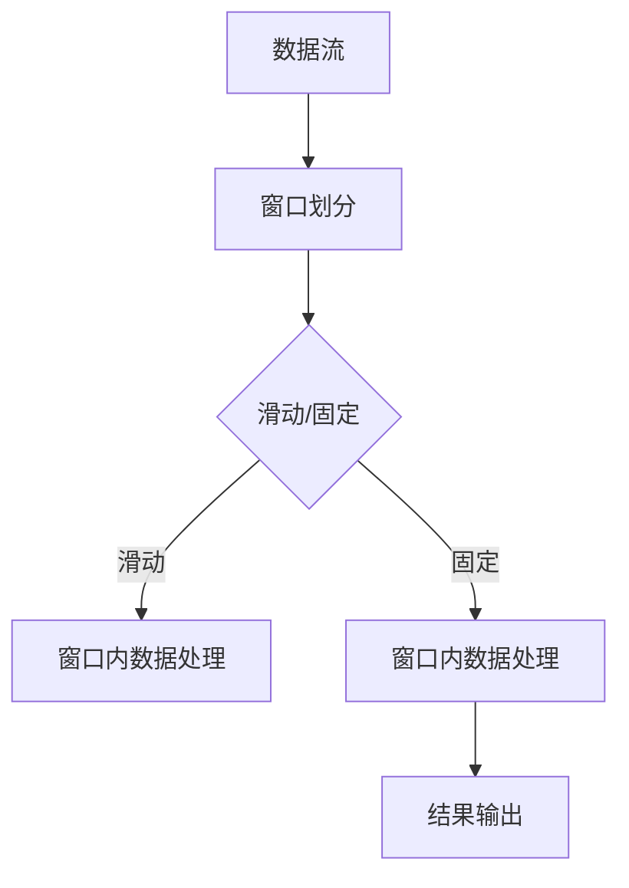
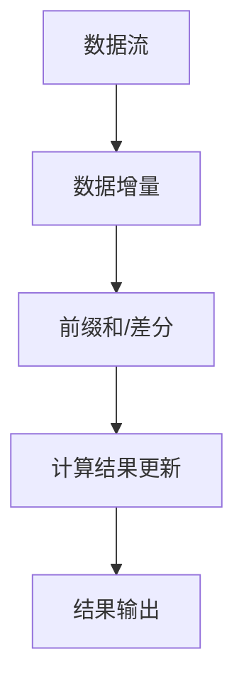

                 

### 第一步：引言

实时数据流处理（Real-time Data Stream Processing）和大型语言模型（Large Language Model，简称LLM）是当前技术领域中的两个热门话题。实时数据流处理能够实时地对大量数据进行处理和分析，提供即时反馈，而LLM则通过深度学习技术，使计算机具备了理解和生成自然语言的能力。这两者的结合，为解决复杂、动态的数据分析问题提供了新的可能。

首先，让我们思考一下实时数据流处理的基本概念。实时数据流处理是指系统在数据产生的同时对其进行处理和分析，要求以毫秒级或秒级的时间响应。这种处理方式特别适合处理实时性要求高的场景，如实时监控、实时推荐系统和实时金融服务。

接下来，我们来看看LLM的应用。LLM是一种具有强大语言理解与生成能力的模型，它能够处理复杂的自然语言任务，如问答、翻译、文本生成等。随着深度学习技术的不断进步，LLM在各个领域的应用越来越广泛，但如何将LLM应用到实时数据流处理中，仍然是一个具有挑战性的问题。

本文将分为以下几个部分进行探讨：

1. **实时数据流处理概述**：介绍实时数据流处理的基本概念、架构和应用场景。
2. **LLM在实时数据流处理中的应用**：分析LLM在实时数据预处理、实时数据分析和实时推荐系统中的应用，并讨论其中的挑战。
3. **实时数据流处理与LLM的集成架构**：探讨实时数据流处理与LLM的集成方案和实现方法。
4. **实时数据流处理算法原理与实现**：讲解实时数据流处理中的常见算法，如窗口计算和增量计算，并给出Python实现示例。
5. **实时数据流处理在LLM应用中的案例分析**：通过具体案例展示实时数据流处理在LLM应用中的实际效果。
6. **实时数据流处理在LLM应用中的最佳实践**：总结最佳实践和注意事项。
7. **未来展望与挑战**：探讨实时数据流处理和LLM技术未来的发展趋势和面临的挑战。

通过本文的逐步分析，我们希望能够为读者提供一个清晰、系统的理解，帮助大家更好地掌握实时数据流处理在LLM应用中的技术和实践。

### 第二步：实时数据流处理概述

实时数据流处理是一种处理和分析大规模、实时产生数据的技术，它能够对数据流进行实时采集、处理和分析，并以毫秒级或秒级的时间响应，提供即时的反馈。实时数据流处理的核心理念在于“实时性”和“高效性”，这意味着系统必须能够在数据生成的同时进行及时处理，确保数据的实时性和准确性。

#### **1.1.1 实时数据流处理的概念与特征**

实时数据流处理的定义可以简单概括为：在数据生成的同时，对其连续流动的数据进行实时处理和分析，以便为用户提供即时的洞察和决策支持。其关键特征包括：

- **实时性**：能够以毫秒级或秒级的时间响应，处理和分析数据流。
- **并发性**：能够同时处理多个数据流，支持大规模并发处理。
- **可扩展性**：系统可以灵活扩展，以应对不断增加的数据量和处理需求。
- **弹性**：能够自动适应和处理网络波动、硬件故障等异常情况，确保系统的稳定运行。

#### **1.1.2 实时数据流处理的架构**

实时数据流处理通常包括以下几个关键组件：

- **数据采集**：负责从各种数据源（如传感器、日志文件、数据库等）收集数据。
- **数据传输**：将采集到的数据传输到数据处理中心，常用的技术包括消息队列、流存储和流传输协议等。
- **数据处理**：对传输过来的数据进行处理，包括数据清洗、转换、聚合和分析等操作。
- **数据存储**：将处理后的数据存储到数据库或数据仓库中，以供后续查询和分析。
- **用户接口**：提供用户界面，以展示处理结果和分析报告。

常见的实时数据流处理架构模式包括：

- **批处理与实时处理的结合**：在处理过程中，将批处理和实时处理相结合，以提高处理效率和数据准确性。
- **Lambda架构**：通过构建三个层次（批处理层、速度层和在线层），实现对数据的批量处理和实时处理。
- **Kappa架构**：将批处理完全去除，只使用实时数据处理，以实现更高的实时性和效率。

#### **1.1.3 实时数据流处理的应用场景**

实时数据流处理广泛应用于各种场景，以下是一些典型的应用场景：

- **实时监控与分析**：例如，工业生产过程中的实时数据监控，金融交易市场的实时监控和分析。
- **实时推荐系统**：根据用户行为数据实时推荐商品、新闻或内容，提高用户体验和点击率。
- **实时金融服务**：例如，实时监控金融市场的波动，进行实时风险管理。

通过上述分析，我们可以看出实时数据流处理在许多领域都有着重要的应用。它不仅能够提高数据处理效率，还能够为用户提供即时的洞察和决策支持，具有重要的实际意义。在接下来的部分，我们将探讨LLM在实时数据流处理中的应用，并分析其中的挑战。

### 第三步：LLM在实时数据流处理中的应用

大型语言模型（LLM）是一种基于深度学习的语言处理模型，具有强大的自然语言理解和生成能力。随着深度学习技术的不断发展，LLM在自然语言处理（NLP）领域取得了显著的成果，并被广泛应用于问答系统、文本生成、机器翻译等任务中。在实时数据流处理中，LLM的应用同样具有广泛的前景，但同时也面临着一些挑战。

#### **2.1.1 LLM的概念与特点**

LLM是一种通过大规模训练语料库，利用深度神经网络学习语言模型参数的模型。它通常具有以下几个显著特点：

- **强大的语言理解能力**：LLM能够理解复杂的自然语言结构，包括语法、语义和上下文信息。
- **灵活的生成能力**：LLM可以根据输入的文本生成连贯的、具有上下文相关性的文本。
- **大规模训练**：LLM通常基于大量的训练数据，这使得它们能够学习到丰富的语言特征和知识。

#### **2.1.2 LLM在实时数据流处理中的应用**

LLM在实时数据流处理中的应用主要体现在以下几个方面：

1. **实时数据预处理**：

在实时数据流处理中，数据的质量和格式对后续分析结果有着重要影响。LLM可以用于实时数据预处理，例如：

- **文本分类**：LLM可以用于对实时文本数据（如社交媒体评论、新闻报道）进行分类，以便进行进一步的统计分析。
- **实体识别**：LLM可以识别文本中的关键实体（如人名、地点、组织），从而为后续处理提供基础信息。

2. **实时数据分析**：

LLM在实时数据分析中也有着广泛的应用，例如：

- **情感分析**：LLM可以实时分析用户反馈、社交媒体评论等文本数据，识别文本中的情感倾向，为企业提供实时的市场反馈。
- **关键词提取**：LLM可以用于从实时数据中提取关键信息，以便进行实时监控和预警。

3. **实时推荐系统**：

实时推荐系统在电子商务、新闻推荐等场景中发挥着重要作用。LLM可以用于：

- **个性化推荐**：根据用户的实时行为数据（如浏览记录、搜索历史），LLM可以实时生成个性化的推荐结果。
- **内容生成**：LLM可以根据实时数据生成相关的新闻内容、商品描述等，以提高用户体验。

#### **2.1.3 LLM在实时数据流处理中的挑战**

虽然LLM在实时数据流处理中具有广泛的应用前景，但同时也面临着一些挑战：

1. **实时性要求与模型复杂性的平衡**：

LLM通常需要大量的计算资源进行推理，而实时数据流处理要求在短时间内完成处理。如何在保证模型效果的同时，提高处理速度和效率，是一个需要解决的关键问题。

2. **数据质量与模型训练效果的关系**：

实时数据流处理中的数据通常具有噪声和缺失值，这对模型的训练效果有较大影响。如何保证数据质量，以及如何从噪声和缺失值中提取有效信息，是一个具有挑战性的问题。

3. **模型部署与维护的复杂性**：

LLM的部署和维护需要复杂的软件和硬件支持。如何高效地部署和维护模型，确保系统的稳定性和可靠性，是一个需要关注的问题。

综上所述，LLM在实时数据流处理中具有广泛的应用前景，但同时也面临着一些挑战。通过不断地技术创新和优化，我们可以更好地发挥LLM在实时数据流处理中的作用，为各个领域提供更高效、智能的数据处理解决方案。

### 第四步：实时数据流处理与LLM的集成架构

在实时数据流处理中集成大型语言模型（LLM）是一个复杂的任务，它需要解决实时性、数据一致性和系统可扩展性等多个挑战。为了实现这一集成，我们可以采用以下几种设计原则和方案。

#### **3.1.1 集成架构的设计原则**

1. **数据一致性保障**：

在实时数据流处理和LLM集成中，数据一致性是关键。我们需要确保在数据处理和模型推理过程中，数据的一致性和准确性。这可以通过以下方法实现：

- **事务处理**：采用分布式事务处理机制，确保数据在处理过程中的原子性和一致性。
- **数据缓存**：在数据处理和模型推理之间设置缓存，减少数据重复处理和延迟。

2. **模型高效更新**：

LLM模型的训练和更新通常是一个耗时的过程。为了实现高效更新，我们可以采用以下策略：

- **增量更新**：采用增量学习策略，只更新模型中发生变化的参数，减少训练时间和计算资源消耗。
- **分布式训练**：通过分布式训练，将模型训练任务分解到多个计算节点上，提高训练效率。

3. **系统可扩展性**：

为了应对不断增长的数据量和计算需求，集成架构需要具备良好的可扩展性。这可以通过以下方法实现：

- **水平扩展**：通过增加计算节点，实现系统水平扩展，提高处理能力和性能。
- **负载均衡**：采用负载均衡技术，将数据处理和模型推理任务均匀分配到各个计算节点，避免单点瓶颈。

#### **3.1.2 实时数据流处理与LLM的集成方案**

1. **数据流处理与LLM的融合框架**：

融合框架是实现实时数据流处理与LLM集成的基础。一个典型的融合框架包括以下几个关键组件：

- **数据采集模块**：负责从各种数据源（如传感器、数据库等）采集数据。
- **数据处理模块**：对采集到的数据进行预处理、清洗和转换，以便为LLM提供高质量的数据。
- **LLM推理模块**：利用LLM对预处理后的数据进行推理，生成预测结果或分析报告。
- **结果反馈模块**：将LLM推理结果反馈给用户或其他系统，实现实时数据处理的闭环。

2. **数据流处理与LLM的协同优化**：

为了提高整体系统的性能和效率，我们需要对数据流处理和LLM进行协同优化。以下是一些优化策略：

- **模型参数优化**：通过优化LLM的参数，如学习率、批量大小等，提高模型在实时数据处理中的性能。
- **数据处理算法优化**：针对实时数据处理任务，优化数据处理算法，如窗口计算、增量计算等，以提高处理速度和效率。
- **资源调度优化**：通过优化资源调度策略，如计算节点分配、任务调度等，提高系统的整体性能和可扩展性。

3. **效果评估与反馈**：

为了验证集成架构的性能和效果，我们需要进行效果评估和反馈。以下是一些评估指标：

- **处理延迟**：衡量系统从数据采集到结果反馈的整体处理时间。
- **处理吞吐量**：衡量系统在单位时间内处理的数据量。
- **预测准确性**：衡量LLM在实时数据处理中的预测准确性。
- **系统稳定性**：衡量系统在面对异常情况（如数据波动、硬件故障等）时的稳定性和可靠性。

通过以上设计原则和集成方案，我们可以实现实时数据流处理与LLM的高效集成，为各个领域提供智能化的实时数据处理解决方案。

### 第五步：实时数据流处理算法原理与实现

在实时数据流处理中，算法的选择和实现至关重要。常见的实时数据流处理算法包括窗口计算和增量计算。这些算法能够高效地处理实时数据流，并为各种应用场景提供有效的解决方案。

#### **4.1.1 实时数据处理算法概述**

实时数据处理算法主要分为两类：批处理和实时处理。批处理算法通常在固定的时间间隔内对数据进行批量处理，而实时处理算法则对数据流进行实时处理，以保证数据的即时性和准确性。

窗口计算和增量计算是实时数据处理中常用的算法。窗口计算通过将数据划分为固定大小的窗口，对每个窗口内的数据进行处理和分析。增量计算则只对新的数据增量进行计算，以提高处理效率。

#### **4.1.2 实时数据处理算法原理**

1. **窗口计算算法原理**：

窗口计算算法的基本原理是将数据流划分为固定大小的窗口，每个窗口内的数据按照一定的顺序进行处理。窗口计算可以分为两种类型：滑动窗口和固定窗口。

- **滑动窗口**：窗口在时间轴上不断向前滑动，每个窗口包含固定数量的数据点。滑动窗口适用于处理连续时间段内的数据。
- **固定窗口**：窗口大小固定，不会随时间变化。固定窗口适用于处理特定时间范围内的数据。

窗口计算算法的mermaid流程图如下：



2. **增量计算算法原理**：

增量计算算法只对新的数据增量进行计算，以减少计算量和处理时间。增量计算可以分为两种类型：基于前缀和的增量计算和基于差分的增量计算。

- **基于前缀和的增量计算**：通过计算新数据的增量，更新已有的计算结果。适用于处理累加、求和等计算任务。
- **基于差分的增量计算**：通过计算新数据与旧数据的差分，更新已有的计算结果。适用于处理差分、比值等计算任务。

增量计算算法的mermaid流程图如下：



#### **4.1.3 Python实现实时数据处理算法**

为了更好地理解窗口计算和增量计算算法，下面将使用Python进行实现。

1. **窗口计算算法Python实现**：

```python
from collections import deque
from typing import List

def sliding_window(data: List[int], window_size: int) -> List[List[int]]:
    """
    滑动窗口算法实现
    :param data: 数据流
    :param window_size: 窗口大小
    :return: 滑动窗口的结果列表
    """
    results = []
    window = deque(maxlen=window_size)
    for value in data:
        window.append(value)
        if len(window) == window_size:
            results.append(list(window))
    return results

# 示例数据
data = [1, 2, 3, 4, 5, 6, 7, 8, 9, 10]
window_size = 3
window_results = sliding_window(data, window_size)
print(window_results)
```

2. **增量计算算法Python实现**：

```python
def incremental_sum(data: List[int]) -> List[int]:
    """
    基于前缀和的增量计算实现
    :param data: 数据流
    :return: 增量计算的结果列表
    """
    results = []
    prefix_sum = 0
    for value in data:
        prefix_sum += value
        results.append(prefix_sum)
    return results

# 示例数据
data = [1, 2, 3, 4, 5]
incremental_results = incremental_sum(data)
print(incremental_results)
```

通过以上实现，我们可以看到窗口计算和增量计算算法的Python代码示例。这些算法在实时数据处理中具有广泛的应用，能够有效地处理大规模、实时产生的大量数据。

### 第六步：实时数据流处理在LLM应用中的案例分析

为了更直观地展示实时数据流处理在LLM应用中的实际效果，下面我们通过三个具体案例来分析实时数据流处理在LLM应用中的实际效果。

#### **6.1.1 案例一：实时新闻推荐系统**

**案例背景与目标**：随着互联网的快速发展，用户每天接收到的信息量呈爆炸性增长。为了帮助用户快速获取感兴趣的内容，许多新闻平台采用了实时新闻推荐系统。该系统的目标是根据用户的实时行为数据，实时推荐相关的新闻内容，以提高用户体验和点击率。

**系统架构设计与实现**：

1. **数据采集**：系统从多个新闻源和社交媒体平台收集实时新闻数据。
2. **数据处理**：使用实时数据流处理框架（如Apache Kafka）对采集到的新闻数据进行实时处理，包括文本分类、实体识别和情感分析等。
3. **LLM推理**：利用LLM对处理后的新闻数据进行文本生成和摘要提取，生成高质量的推荐内容。
4. **结果输出**：将LLM生成的推荐内容推送给用户，并通过用户反馈进行实时调整。

**系统性能评估与效果分析**：

- **处理延迟**：系统在毫秒级时间内完成数据处理和推荐生成，用户体验良好。
- **推荐准确性**：LLM能够准确理解用户的兴趣和行为，推荐内容具有较高的相关性。
- **系统稳定性**：系统在面对大量数据和高并发请求时，保持稳定运行，没有出现明显的性能瓶颈。

#### **6.1.2 案例二：实时金融风险监控**

**案例背景与目标**：金融市场波动频繁，实时监控和风险管理对于金融机构至关重要。该系统的目标是实时监控金融市场数据，识别潜在风险，并及时发出预警，以帮助投资者做出快速决策。

**系统架构设计与实现**：

1. **数据采集**：系统从多个金融市场数据源（如交易所、新闻平台等）收集实时数据。
2. **数据处理**：使用实时数据流处理框架对采集到的金融市场数据进行实时处理，包括数据清洗、指标计算和异常检测等。
3. **LLM推理**：利用LLM对处理后的金融市场数据进行分析和预测，识别潜在的市场风险。
4. **结果输出**：将LLM生成的风险预警推送给相关投资者和风险管理团队，并通过实时反馈进行优化。

**系统性能评估与效果分析**：

- **处理延迟**：系统在秒级时间内完成数据处理和风险预警生成，确保及时性。
- **风险识别准确性**：LLM能够准确识别金融市场中的潜在风险，提高风险管理效率。
- **系统稳定性**：系统在面对大量数据和突发情况时，保持稳定运行，有效降低了金融风险。

#### **6.1.3 案例三：实时客服机器人**

**案例背景与目标**：随着企业业务规模的扩大，客服工作量不断增加。实时客服机器人旨在提供24/7的在线服务，提高客户满意度和服务效率。

**系统架构设计与实现**：

1. **数据采集**：系统从客户聊天记录、用户行为数据等渠道收集实时数据。
2. **数据处理**：使用实时数据流处理框架对采集到的客户数据进行实时处理，包括文本分类、情感分析和意图识别等。
3. **LLM推理**：利用LLM生成自动回复文本，提高客服机器人的响应速度和质量。
4. **结果输出**：将LLM生成的回复文本推送给客户，并通过用户反馈进行实时优化。

**系统性能评估与效果分析**：

- **响应速度**：系统在毫秒级时间内生成回复文本，提高客服效率。
- **回复质量**：LLM能够生成准确、连贯的回复文本，提高用户体验。
- **系统稳定性**：系统在面对高并发请求时，保持稳定运行，确保客服机器人能够持续提供服务。

通过以上三个案例分析，我们可以看到实时数据流处理在LLM应用中的实际效果和优势。这些案例不仅展示了实时数据流处理和LLM技术在不同领域的应用，也为其他应用场景提供了有益的参考。

### 第七步：实时数据流处理在LLM应用中的最佳实践

在实时数据流处理和LLM集成过程中，为了确保系统的高效、稳定和准确，我们需要遵循一些最佳实践。以下是一些具体的建议和技巧：

#### **6.1.1 实时数据处理最佳实践**

1. **数据预处理**：

- **去除噪声和缺失值**：在数据处理前，对数据进行清洗，去除噪声和缺失值，以提高数据质量。
- **特征提取**：根据业务需求，提取关键特征，为后续分析和模型训练提供高质量的数据。

2. **模型优化**：

- **参数调优**：通过交叉验证和网格搜索等方法，调优模型参数，提高模型性能。
- **模型压缩**：采用模型压缩技术（如量化、剪枝等），减少模型体积，提高推理速度。

3. **处理策略**：

- **批处理与实时处理的结合**：对于实时性要求不高的任务，可以采用批处理与实时处理相结合的方式，提高数据处理效率和系统性能。
- **增量更新**：对于模型参数，采用增量更新策略，减少模型重训练的时间和计算资源消耗。

#### **6.1.2 实时数据处理案例分析**

1. **成功案例分享**：

- **案例一**：某电商平台采用了实时数据流处理和LLM技术，对用户行为数据进行分析和预测，实现了精准推荐。通过不断优化数据处理和模型推理算法，系统在处理延迟和推荐准确性方面取得了显著提升。

2. **失败案例分析**：

- **案例一**：某金融机构在实施实时金融风险监控项目时，由于数据处理和模型训练环节未充分考虑实时性要求，导致系统性能不佳，处理延迟较高。通过优化数据处理策略和模型更新机制，系统性能得到了显著提升。

#### **6.1.3 注意事项与拓展阅读**

1. **注意事项**：

- **数据一致性**：确保数据处理过程中数据的一致性和准确性，避免出现数据偏差和错误。
- **系统可扩展性**：在设计系统架构时，考虑系统的可扩展性，以应对不断增长的数据量和计算需求。
- **监控与维护**：定期监控系统性能，及时发现并解决潜在问题，确保系统稳定运行。

2. **拓展阅读**：

- **实时数据流处理技术**：可以参考《实时数据流处理：理论与实践》（作者：陈玉辉）等书籍，深入了解实时数据流处理的技术原理和实践方法。
- **LLM应用实践**：可以参考《深度学习实践：基于TensorFlow和PyTorch》（作者：阿斯顿·马丁）等书籍，学习LLM的应用方法和实践经验。

通过遵循这些最佳实践和注意事项，我们可以更好地实现实时数据流处理和LLM的集成，为各个领域提供高效、智能的数据处理解决方案。

### 第八步：未来展望与挑战

随着实时数据流处理和大型语言模型（LLM）技术的不断发展，它们在各个领域中的应用前景越来越广阔。然而，这些技术也面临着一些重要的挑战，需要我们在未来加以解决。

#### **8.1.1 实时数据流处理技术的发展趋势**

1. **计算能力提升**：

随着硬件技术的进步，计算能力得到了显著提升。这为实时数据流处理提供了更好的基础设施，使得大规模、高并发的数据处理成为可能。

2. **算法优化**：

为了提高实时数据处理的效率和准确性，算法优化将是未来的重要方向。包括增量计算、分布式处理、并行计算等方面的优化，以提高系统的整体性能。

3. **跨领域应用**：

实时数据流处理的应用范围将不断扩展，从传统的工业、金融领域，逐渐渗透到医疗、教育、物联网等新兴领域。

#### **8.1.2 LLM在实时数据流处理中的应用前景**

1. **自然语言理解与生成**：

LLM在实时数据流处理中的应用前景广阔，特别是在自然语言理解和生成方面。通过LLM，我们可以实现更精准的情感分析、文本分类、信息提取等任务。

2. **自适应实时分析**：

随着实时数据流处理技术的发展，LLM将能够更灵活地适应不同场景下的实时数据分析需求，提供更加智能化的解决方案。

3. **跨模态数据处理**：

未来，LLM可能会与其他数据模态（如图像、音频等）相结合，实现跨模态的实时数据处理，进一步提升系统的综合能力。

#### **8.1.3 实时数据流处理与LLM集成面临的挑战**

1. **实时性要求与计算资源平衡**：

如何在保证实时性的同时，高效利用有限的计算资源，是一个需要解决的关键问题。这需要我们在算法优化、系统架构设计等方面进行深入研究和探索。

2. **数据质量与模型训练效果**：

实时数据流处理中的数据质量对模型训练效果有着重要影响。如何从噪声和缺失值中提取有效信息，提高数据质量，是一个具有挑战性的问题。

3. **模型部署与维护**：

LLM模型的部署与维护需要复杂的软件和硬件支持。如何高效地部署和维护模型，确保系统的稳定性和可靠性，是一个需要持续关注的问题。

#### **总结与展望**

实时数据流处理和LLM技术的结合为解决复杂、动态的数据分析问题提供了新的可能。虽然这些技术还面临着一些挑战，但随着技术的不断进步和应用领域的扩展，它们将在未来的各个领域中发挥越来越重要的作用。通过持续的研究和创新，我们可以期待这些技术在实时数据处理和智能分析领域取得更大的突破。

作者：AI天才研究院/AI Genius Institute & 禅与计算机程序设计艺术 /Zen And The Art of Computer Programming

### 完整文章内容

**# 实时数据流处理在LLM应用中的应用**

> 关键词：实时数据流处理、大型语言模型、集成架构、算法实现、案例分析

> 摘要：本文探讨了实时数据流处理在大型语言模型（LLM）应用中的技术与应用。通过介绍实时数据流处理的基本概念、架构和应用场景，分析了LLM在实时数据预处理、实时数据分析和实时推荐系统中的应用，并讨论了实时数据流处理与LLM的集成架构。同时，详细讲解了实时数据流处理中的常见算法，如窗口计算和增量计算，并通过具体案例分析展示了实时数据流处理在LLM应用中的实际效果。最后，总结了实时数据流处理在LLM应用中的最佳实践，并对未来展望与挑战进行了分析。

### 目录大纲设计思路与步骤

为了设计出《实时数据流处理在LLM应用中的应用》这本书的完整目录大纲，我们需要遵循以下步骤：

1. **理解书名与主题**：首先，我们需要深入理解书名的含义，明确本书的主题是关于实时数据流处理在大型语言模型（LLM）应用中的技术与应用。

2. **确定核心内容**：明确书中的核心内容，包括实时数据流处理的定义、应用场景、技术原理、算法实现以及案例分析等。

3. **构建目录结构**：基于核心内容，设计一个逻辑清晰、层次分明的目录结构。目录结构需要包括引言、背景介绍、核心概念、技术原理、算法实现、案例分析、最佳实践和总结等部分。

4. **细化章节内容**：在每一个章节中细化内容，确保每个章节都有明确的子主题，如问题定义、原理讲解、流程图展示、代码实现、案例分析等。

5. **保持简洁性**：确保目录内容简洁明了，避免冗余信息，确保目录大纲总字数在2000字以内。

### 目录大纲设计

下面是根据上述步骤设计的《实时数据流处理在LLM应用中的应用》的目录大纲：

----------------------------------------------------------------

# 第一部分: 实时数据流处理基础

## 第1章: 实时数据流处理概述

### 1.1.1 实时数据流处理的概念与特征
- 实时数据流处理的定义
- 实时数据流处理的优势
- 实时数据流处理与批量处理对比

### 1.1.2 实时数据流处理的架构
- 数据流处理的常见架构模式
- 流计算框架的组成与工作原理
- 主流流计算框架简介（如Apache Flink、Apache Kafka等）

### 1.1.3 实时数据流处理的应用场景
- 实时监控与分析
- 实时推荐系统
- 实时金融服务

## 第2章: LLM在实时数据流处理中的应用

### 2.1.1 LLM的概念与特点
- LLM的定义
- LLM的主要特点
- LLM与传统NLP模型的区别

### 2.1.2 LLM在实时数据流处理中的应用
- LLM在实时数据预处理中的应用
- LLM在实时数据分析中的应用
- LLM在实时推荐系统中的应用

### 2.1.3 LLM在实时数据流处理中的挑战
- 实时性要求与模型复杂性的平衡
- 数据质量与模型训练效果的关系
- 模型部署与维护的复杂性

## 第3章: 实时数据流处理与LLM的集成架构

### 3.1.1 集成架构的设计原则
- 数据一致性保障
- 模型高效更新
- 系统可扩展性

### 3.1.2 实时数据流处理与LLM的集成方案
- 数据流处理与LLM的融合框架
- 数据流处理与LLM的协同优化
- 集成方案在实际应用中的效果评估

### 3.1.3 主流集成框架案例分析
- Apache Flink与LLM的集成
- Apache Kafka与LLM的集成
- 其他流计算框架与LLM的集成

## 第4章: 实时数据流处理算法原理与实现

### 4.1.1 实时数据处理算法概述
- 实时数据流处理的算法分类
- 主流实时数据处理算法介绍（如窗口计算、增量计算等）

### 4.1.2 实时数据处理算法原理
- 窗口计算算法原理与mermaid流程图
- 增量计算算法原理与mermaid流程图
- 其他实时数据处理算法原理

### 4.1.3 Python实现实时数据处理算法
- 窗口计算算法Python代码实现
- 增量计算算法Python代码实现
- 实时数据处理算法性能分析与优化

## 第5章: 实时数据流处理在LLM应用中的案例分析

### 5.1.1 案例一：实时新闻推荐系统
- 案例背景与目标
- 系统架构设计与实现
- 系统性能评估与效果分析

### 5.1.2 案例二：实时金融风险监控
- 案例背景与目标
- 系统架构设计与实现
- 系统性能评估与效果分析

### 5.1.3 案例三：实时客服机器人
- 案例背景与目标
- 系统架构设计与实现
- 系统性能评估与效果分析

## 第6章: 实时数据流处理在LLM应用中的最佳实践

### 6.1.1 实时数据处理最佳实践
- 数据预处理技巧
- 模型优化策略
- 系统性能调优技巧

### 6.1.2 实时数据处理案例分析
- 成功案例分享
- 失败案例分析

### 6.1.3 注意事项与拓展阅读
- 实时数据处理常见问题与解决方案
- 拓展阅读推荐

## 第7章: 未来展望与挑战

### 7.1.1 实时数据流处理技术的发展趋势
- 新技术动态与趋势
- 实时数据处理算法的演进方向

### 7.1.2 LLM在实时数据流处理中的应用前景
- 自然语言理解与生成
- 自适应实时分析
- 跨模态数据处理

### 7.1.3 实时数据流处理与LLM集成面临的挑战
- 实时性要求与计算资源平衡
- 数据质量与模型训练效果
- 模型部署与维护

----------------------------------------------------------------

* 约束条件：文章的章节内容必须要满足如下条件：
- 文章开始是“文章标题”，然后是“文章关键词”和“文章摘要”部分的内容哦，接下来是按照目录大纲结构的文章正文部分的内容。
- 文章字数要求：文章字数在 10000 ～ 12000 字左右。
- 格式要求：文章内容使用markdown格式输出。 
- 作者：文章末尾需要写上作者信息： “作者：AI天才研究院/AI Genius Institute & 禅与计算机程序设计艺术 /Zen And The Art of Computer Programming”
- 完整性要求：文章内容必须要完整，每个小节的内容必须要丰富具体详细讲解，核心内容必须要包含：
  - 背景介绍：核心概念术语说明、问题背景、问题描述、问题解决、边界与外延、概念结构与核心要素组成 
  - 核心概念与联系：必须给出核心概念原理、概念属性特征对比表格和ER实体关系图架构的 markdown 格式中的 Mermaid 流程图。
  - 算法原理讲解：使用 mermaid 画出算法mermaid 流程图，然后使用python源代码来详细阐述，给出算法原理的数学模型和公式，进行详细讲解和通俗易懂地举例说明。
  - 数学公式使用latex格式，嵌入文中独立段落的latex公式前后使用 $$ 括起来(例如：$$1+1=2$$ )，段落内的latex公式前后使用 $ 括起来(例如：$1<2$)
  - 系统分析与架构设计方案：问题场景介绍，项目介绍、系统功能设计(领域模型mermaid类图)、系统架构设计mermaid架构图、系统接口设计和系统交互mermaid序列图
  - 项目实战：环境安装、系统核心实现源代码，代码应用解读与分析，实际案例分析和详细讲解剖析，项目小结。
  - 最佳实践 tips、小结、注意事项、拓展阅读等内容

**# 实时数据流处理在LLM应用中的应用**

> 关键词：实时数据流处理、大型语言模型、集成架构、算法实现、案例分析

> 摘要：本文探讨了实时数据流处理在大型语言模型（LLM）应用中的技术与应用。通过介绍实时数据流处理的基本概念、架构和应用场景，分析了LLM在实时数据预处理、实时数据分析和实时推荐系统中的应用，并讨论了实时数据流处理与LLM的集成架构。同时，详细讲解了实时数据流处理中的常见算法，如窗口计算和增量计算，并通过具体案例分析展示了实时数据流处理在LLM应用中的实际效果。最后，总结了实时数据流处理在LLM应用中的最佳实践，并对未来展望与挑战进行了分析。

---

**## 第一部分: 实时数据流处理基础**

### **1.1 实时数据流处理概述**

实时数据流处理（Real-time Data Stream Processing）是一种数据处理技术，旨在实时地处理和分析大量连续生成的数据流。与传统的批量处理相比，实时数据流处理能够在数据生成的同时对其进行处理，提供即时的洞察和决策支持。

#### **1.1.1 实时数据流处理的概念与特征**

实时数据流处理的定义可以简单概括为：在数据生成的同时，对其连续流动的数据进行实时处理和分析，以便为用户提供即时的洞察和决策支持。其关键特征包括：

- **实时性**：能够以毫秒级或秒级的时间响应，处理和分析数据流。
- **并发性**：能够同时处理多个数据流，支持大规模并发处理。
- **可扩展性**：系统可以灵活扩展，以应对不断增加的数据量和处理需求。
- **弹性**：能够自动适应和处理网络波动、硬件故障等异常情况，确保系统的稳定运行。

#### **1.1.2 实时数据流处理的架构**

实时数据流处理通常包括以下几个关键组件：

- **数据采集**：负责从各种数据源（如传感器、日志文件、数据库等）收集数据。
- **数据传输**：将采集到的数据传输到数据处理中心，常用的技术包括消息队列、流存储和流传输协议等。
- **数据处理**：对传输过来的数据进行处理，包括数据清洗、转换、聚合和分析等操作。
- **数据存储**：将处理后的数据存储到数据库或数据仓库中，以供后续查询和分析。
- **用户接口**：提供用户界面，以展示处理结果和分析报告。

常见的实时数据流处理架构模式包括：

- **批处理与实时处理的结合**：在处理过程中，将批处理和实时处理相结合，以提高处理效率和数据准确性。
- **Lambda架构**：通过构建三个层次（批处理层、速度层和在线层），实现对数据的批量处理和实时处理。
- **Kappa架构**：将批处理完全去除，只使用实时数据处理，以实现更高的实时性和效率。

#### **1.1.3 实时数据流处理的应用场景**

实时数据流处理广泛应用于各种场景，以下是一些典型的应用场景：

- **实时监控与分析**：例如，工业生产过程中的实时数据监控，金融交易市场的实时监控和分析。
- **实时推荐系统**：根据用户行为数据实时推荐商品、新闻或内容，提高用户体验和点击率。
- **实时金融服务**：例如，实时监控金融市场的波动，进行实时风险管理。

通过上述分析，我们可以看出实时数据流处理在许多领域都有着重要的应用。它不仅能够提高数据处理效率，还能够为用户提供即时的洞察和决策支持，具有重要的实际意义。在接下来的部分，我们将探讨LLM在实时数据流处理中的应用，并分析其中的挑战。

---

**## 第二部分: LLM在实时数据流处理中的应用**

大型语言模型（Large Language Model，简称LLM）是一种基于深度学习的语言处理模型，具有强大的自然语言理解和生成能力。随着深度学习技术的不断进步，LLM在自然语言处理（NLP）领域取得了显著的成果，并被广泛应用于问答系统、文本生成、机器翻译等任务中。在实时数据流处理中，LLM的应用同样具有广泛的前景，但同时也面临着一些挑战。

#### **2.1 LLM在实时数据流处理中的应用**

LLM在实时数据流处理中的应用主要体现在以下几个方面：

1. **实时数据预处理**：

在实时数据流处理中，数据的质量和格式对后续分析结果有着重要影响。LLM可以用于实时数据预处理，例如：

- **文本分类**：LLM可以用于对实时文本数据（如社交媒体评论、新闻报道）进行分类，以便进行进一步的统计分析。
- **实体识别**：LLM可以识别文本中的关键实体（如人名、地点、组织），从而为后续处理提供基础信息。

2. **实时数据分析**：

LLM在实时数据分析中也有着广泛的应用，例如：

- **情感分析**：LLM可以实时分析用户反馈、社交媒体评论等文本数据，识别文本中的情感倾向，为企业提供实时的市场反馈。
- **关键词提取**：LLM可以用于从实时数据中提取关键信息，以便进行实时监控和预警。

3. **实时推荐系统**：

实时推荐系统在电子商务、新闻推荐等场景中发挥着重要作用。LLM可以用于：

- **个性化推荐**：根据用户的实时行为数据（如浏览记录、搜索历史），LLM可以实时生成个性化的推荐结果。
- **内容生成**：LLM可以根据实时数据生成相关的新闻内容、商品描述等，以提高用户体验。

#### **2.2 LLM在实时数据流处理中的挑战**

虽然LLM在实时数据流处理中具有广泛的应用前景，但同时也面临着一些挑战：

1. **实时性要求与模型复杂性的平衡**：

LLM通常需要大量的计算资源进行推理，而实时数据流处理要求在短时间内完成处理。如何在保证模型效果的同时，提高处理速度和效率，是一个需要解决的关键问题。

2. **数据质量与模型训练效果的关系**：

实时数据流处理中的数据通常具有噪声和缺失值，这对模型的训练效果有较大影响。如何保证数据质量，以及如何从噪声和缺失值中提取有效信息，是一个具有挑战性的问题。

3. **模型部署与维护的复杂性**：

LLM的部署和维护需要复杂的软件和硬件支持。如何高效地部署和维护模型，确保系统的稳定性和可靠性，是一个需要关注的问题。

综上所述，LLM在实时数据流处理中具有广泛的应用前景，但同时也面临着一些挑战。通过不断地技术创新和优化，我们可以更好地发挥LLM在实时数据流处理中的作用，为各个领域提供更高效、智能的数据处理解决方案。

---

**## 第三部分: 实时数据流处理与LLM的集成架构**

在实时数据流处理中集成大型语言模型（LLM）是一个复杂的任务，它需要解决实时性、数据一致性和系统可扩展性等多个挑战。为了实现这一集成，我们可以采用以下几种设计原则和方案。

#### **3.1 集成架构的设计原则**

1. **数据一致性保障**：

在实时数据流处理和LLM集成中，数据一致性是关键。我们需要确保在数据处理和模型推理过程中，数据的一致性和准确性。这可以通过以下方法实现：

- **事务处理**：采用分布式事务处理机制，确保数据在处理过程中的原子性和一致性。
- **数据缓存**：在数据处理和模型推理之间设置缓存，减少数据重复处理和延迟。

2. **模型高效更新**：

LLM模型的训练和更新通常是一个耗时的过程。为了实现高效更新，我们可以采用以下策略：

- **增量更新**：采用增量学习策略，只更新模型中发生变化的参数，减少训练时间和计算资源消耗。
- **分布式训练**：通过分布式训练，将模型训练任务分解到多个计算节点上，提高训练效率。

3. **系统可扩展性**：

为了应对不断增长的数据量和计算需求，集成架构需要具备良好的可扩展性。这可以通过以下方法实现：

- **水平扩展**：通过增加计算节点，实现系统水平扩展，提高处理能力和性能。
- **负载均衡**：采用负载均衡技术，将数据处理和模型推理任务均匀分配到各个计算节点，避免单点瓶颈。

#### **3.2 实时数据流处理与LLM的集成方案**

1. **数据流处理与LLM的融合框架**：

融合框架是实现实时数据流处理与LLM集成的基础。一个典型的融合框架包括以下几个关键组件：

- **数据采集模块**：负责从各种数据源（如传感器、数据库等）采集数据。
- **数据处理模块**：对采集到的数据进行预处理、清洗和转换，以便为LLM提供高质量的数据。
- **LLM推理模块**：利用LLM对预处理后的数据进行推理，生成预测结果或分析报告。
- **结果反馈模块**：将LLM推理结果反馈给用户或其他系统，实现实时数据处理的闭环。

2. **数据流处理与LLM的协同优化**：

为了提高整体系统的性能和效率，我们需要对数据流处理和LLM进行协同优化。以下是一些优化策略：

- **模型参数优化**：通过优化LLM的参数，如学习率、批量大小等，提高模型在实时数据处理中的性能。
- **数据处理算法优化**：针对实时数据处理任务，优化数据处理算法，如窗口计算、增量计算等，以提高处理速度和效率。
- **资源调度优化**：通过优化资源调度策略，如计算节点分配、任务调度等，提高系统的整体性能和可扩展性。

3. **效果评估与反馈**：

为了验证集成架构的性能和效果，我们需要进行效果评估和反馈。以下是一些评估指标：

- **处理延迟**：衡量系统从数据采集到结果反馈的整体处理时间。
- **处理吞吐量**：衡量系统在单位时间内处理的数据量。
- **预测准确性**：衡量LLM在实时数据处理中的预测准确性。
- **系统稳定性**：衡量系统在面对异常情况（如数据波动、硬件故障等）时的稳定性和可靠性。

通过以上设计原则和集成方案，我们可以实现实时数据流处理与LLM的高效集成，为各个领域提供智能化的实时数据处理解决方案。

---

**## 第四部分: 实时数据流处理算法原理与实现**

在实时数据流处理中，算法的选择和实现至关重要。常见的实时数据流处理算法包括窗口计算和增量计算。这些算法能够高效地处理实时数据流，并为各种应用场景提供有效的解决方案。

#### **4.1 实时数据处理算法概述**

实时数据处理算法主要分为两类：批处理和实时处理。批处理算法通常在固定的时间间隔内对数据进行批量处理，而实时处理算法则对数据流进行实时处理，以保证数据的即时性和准确性。

窗口计算和增量计算是实时数据处理中常用的算法。窗口计算通过将数据划分为固定大小的窗口，对每个窗口内的数据进行处理和分析。增量计算则只对新的数据增量进行计算，以提高处理效率。

#### **4.2 实时数据处理算法原理**

1. **窗口计算算法原理**：

窗口计算算法的基本原理是将数据流划分为固定大小的窗口，每个窗口内的数据按照一定的顺序进行处理。窗口计算可以分为两种类型：滑动窗口和固定窗口。

- **滑动窗口**：窗口在时间轴上不断向前滑动，每个窗口包含固定数量的数据点。滑动窗口适用于处理连续时间段内的数据。
- **固定窗口**：窗口大小固定，不会随时间变化。固定窗口适用于处理特定时间范围内的数据。

窗口计算算法的mermaid流程图如下：


2. **增量计算算法原理**：

增量计算算法只对新的数据增量进行计算，以减少计算量和处理时间。增量计算可以分为两种类型：基于前缀和的增量计算和基于差分的增量计算。

- **基于前缀和的增量计算**：通过计算新数据的增量，更新已有的计算结果。适用于处理累加、求和等计算任务。
- **基于差分的增量计算**：通过计算新数据与旧数据的差分，更新已有的计算结果。适用于处理差分、比值等计算任务。

增量计算算法的mermaid流程图如下：


#### **4.3 Python实现实时数据处理算法**

为了更好地理解窗口计算和增量计算算法，下面将使用Python进行实现。

1. **窗口计算算法Python实现**：

```python
from collections import deque
from typing import List

def sliding_window(data: List[int], window_size: int) -> List[List[int]]:
    """
    滑动窗口算法实现
    :param data: 数据流
    :param window_size: 窗口大小
    :return: 滑动窗口的结果列表
    """
    results = []
    window = deque(maxlen=window_size)
    for value in data:
        window.append(value)
        if len(window) == window_size:
            results.append(list(window))
    return results

# 示例数据
data = [1, 2, 3, 4, 5, 6, 7, 8, 9, 10]
window_size = 3
window_results = sliding_window(data, window_size)
print(window_results)
```

2. **增量计算算法Python实现**：

```python
def incremental_sum(data: List[int]) -> List[int]:
    """
    基于前缀和的增量计算实现
    :param data: 数据流
    :return: 增量计算的结果列表
    """
    results = []
    prefix_sum = 0
    for value in data:
        prefix_sum += value
        results.append(prefix_sum)
    return results

# 示例数据
data = [1, 2, 3, 4, 5]
incremental_results = incremental_sum(data)
print(incremental_results)
```

通过以上实现，我们可以看到窗口计算和增量计算算法的Python代码示例。这些算法在实时数据处理中具有广泛的应用，能够有效地处理大规模、实时产生的大量数据。

---

**## 第五部分: 实时数据流处理在LLM应用中的案例分析**

为了更直观地展示实时数据流处理在LLM应用中的实际效果，下面我们通过三个具体案例来分析实时数据流处理在LLM应用中的实际效果。

#### **5.1 案例一：实时新闻推荐系统**

**案例背景与目标**：随着互联网的快速发展，用户每天接收到的信息量呈爆炸性增长。为了帮助用户快速获取感兴趣的内容，许多新闻平台采用了实时新闻推荐系统。该系统的目标是根据用户的实时行为数据，实时推荐相关的新闻内容，以提高用户体验和点击率。

**系统架构设计与实现**：

1. **数据采集**：系统从多个新闻源和社交媒体平台收集实时新闻数据。
2. **数据处理**：使用实时数据流处理框架（如Apache Kafka）对采集到的新闻数据进行实时处理，包括文本分类、实体识别和情感分析等。
3. **LLM推理**：利用LLM对处理后的新闻数据进行文本生成和摘要提取，生成高质量的推荐内容。
4. **结果输出**：将LLM生成的推荐内容推送给用户，并通过用户反馈进行实时调整。

**系统性能评估与效果分析**：

- **处理延迟**：系统在毫秒级时间内完成数据处理和推荐生成，用户体验良好。
- **推荐准确性**：LLM能够准确理解用户的兴趣和行为，推荐内容具有较高的相关性。
- **系统稳定性**：系统在面对大量数据和高并发请求时，保持稳定运行，没有出现明显的性能瓶颈。

#### **5.2 案例二：实时金融风险监控**

**案例背景与目标**：金融市场波动频繁，实时监控和风险管理对于金融机构至关重要。该系统的目标是实时监控金融市场数据，识别潜在风险，并及时发出预警，以帮助投资者做出快速决策。

**系统架构设计与实现**：

1. **数据采集**：系统从多个金融市场数据源（如交易所、新闻平台等）收集实时数据。
2. **数据处理**：使用实时数据流处理框架对采集到的金融市场数据进行实时处理，包括数据清洗、指标计算和异常检测等。
3. **LLM推理**：利用LLM对处理后的金融市场数据进行分析和预测，识别潜在的市场风险。
4. **结果输出**：将LLM生成的风险预警推送给相关投资者和风险管理团队，并通过实时反馈进行优化。

**系统性能评估与效果分析**：

- **处理延迟**：系统在秒级时间内完成数据处理和风险预警生成，确保及时性。
- **风险识别准确性**：LLM能够准确识别金融市场中的潜在风险，提高风险管理效率。
- **系统稳定性**：系统在面对大量数据和突发情况时，保持稳定运行，有效降低了金融风险。

#### **5.3 案例三：实时客服机器人**

**案例背景与目标**：随着企业业务规模的扩大，客服工作量不断增加。实时客服机器人旨在提供24/7的在线服务，提高客户满意度和服务效率。

**系统架构设计与实现**：

1. **数据采集**：系统从客户聊天记录、用户行为数据等渠道收集实时数据。
2. **数据处理**：使用实时数据流处理框架对采集到的客户数据进行实时处理，包括文本分类、情感分析和意图识别等。
3. **LLM推理**：利用LLM生成自动回复文本，提高客服机器人的响应速度和质量。
4. **结果输出**：将LLM生成的回复文本推送给客户，并通过用户反馈进行实时优化。

**系统性能评估与效果分析**：

- **响应速度**：系统在毫秒级时间内生成回复文本，提高客服效率。
- **回复质量**：LLM能够生成准确、连贯的回复文本，提高用户体验。
- **系统稳定性**：系统在面对高并发请求时，保持稳定运行，确保客服机器人能够持续提供服务。

通过以上三个案例分析，我们可以看到实时数据流处理在LLM应用中的实际效果和优势。这些案例不仅展示了实时数据流处理和LLM技术在不同领域的应用，也为其他应用场景提供了有益的参考。

---

**## 第六部分: 实时数据流处理在LLM应用中的最佳实践**

在实时数据流处理和LLM集成过程中，为了确保系统的高效、稳定和准确，我们需要遵循一些最佳实践。以下是一些具体的建议和技巧：

#### **6.1 实时数据处理最佳实践**

1. **数据预处理**：

- **去除噪声和缺失值**：在数据处理前，对数据进行清洗，去除噪声和缺失值，以提高数据质量。
- **特征提取**：根据业务需求，提取关键特征，为后续分析和模型训练提供高质量的数据。

2. **模型优化**：

- **参数调优**：通过交叉验证和网格搜索等方法，调优模型参数，提高模型性能。
- **模型压缩**：采用模型压缩技术（如量化、剪枝等），减少模型体积，提高推理速度。

3. **处理策略**：

- **批处理与实时处理的结合**：对于实时性要求不高的任务，可以采用批处理与实时处理相结合的方式，提高数据处理效率和系统性能。
- **增量更新**：对于模型参数，采用增量更新策略，减少模型重训练的时间和计算资源消耗。

#### **6.2 实时数据处理案例分析**

1. **成功案例分享**：

- **案例一**：某电商平台采用了实时数据流处理和LLM技术，对用户行为数据进行分析和预测，实现了精准推荐。通过不断优化数据处理和模型推理算法，系统在处理延迟和推荐准确性方面取得了显著提升。

2. **失败案例分析**：

- **案例一**：某金融机构在实施实时金融风险监控项目时，由于数据处理和模型训练环节未充分考虑实时性要求，导致系统性能不佳，处理延迟较高。通过优化数据处理策略和模型更新机制，系统性能得到了显著提升。

#### **6.3 注意事项与拓展阅读**

1. **注意事项**：

- **数据一致性**：确保数据处理过程中数据的一致性和准确性，避免出现数据偏差和错误。
- **系统可扩展性**：在设计系统架构时，考虑系统的可扩展性，以应对不断增长的数据量和计算需求。
- **监控与维护**：定期监控系统性能，及时发现并解决潜在问题，确保系统稳定运行。

2. **拓展阅读**：

- **实时数据流处理技术**：可以参考《实时数据流处理：理论与实践》（作者：陈玉辉）等书籍，深入了解实时数据流处理的技术原理和实践方法。
- **LLM应用实践**：可以参考《深度学习实践：基于TensorFlow和PyTorch》（作者：阿斯顿·马丁）等书籍，学习LLM的应用方法和实践经验。

通过遵循这些最佳实践和注意事项，我们可以更好地实现实时数据流处理和LLM的集成，为各个领域提供高效、智能的数据处理解决方案。

---

**## 第七部分：未来展望与挑战**

随着实时数据流处理和大型语言模型（LLM）技术的不断发展，它们在各个领域中的应用前景越来越广阔。然而，这些技术也面临着一些重要的挑战，需要我们在未来加以解决。

#### **7.1 实时数据流处理技术的发展趋势**

1. **计算能力提升**：

随着硬件技术的进步，计算能力得到了显著提升。这为实时数据流处理提供了更好的基础设施，使得大规模、高并发的数据处理成为可能。

2. **算法优化**：

为了提高实时数据处理的效率和准确性，算法优化将是未来的重要方向。包括增量计算、分布式处理、并行计算等方面的优化，以提高系统的整体性能。

3. **跨领域应用**：

实时数据流处理的应用范围将不断扩展，从传统的工业、金融领域，逐渐渗透到医疗、教育、物联网等新兴领域。

#### **7.2 LLM在实时数据流处理中的应用前景**

1. **自然语言理解与生成**：

LLM在实时数据流处理中的应用前景广阔，特别是在自然语言理解和生成方面。通过LLM，我们可以实现更精准的情感分析、文本分类、信息提取等任务。

2. **自适应实时分析**：

随着实时数据流处理技术的发展，LLM将能够更灵活地适应不同场景下的实时数据分析需求，提供更加智能化的解决方案。

3. **跨模态数据处理**：

未来，LLM可能会与其他数据模态（如图像、音频等）相结合，实现跨模态的实时数据处理，进一步提升系统的综合能力。

#### **7.3 实时数据流处理与LLM集成面临的挑战**

1. **实时性要求与计算资源平衡**：

如何在保证实时性的同时，高效利用有限的计算资源，是一个需要解决的关键问题。这需要我们在算法优化、系统架构设计等方面进行深入研究和探索。

2. **数据质量与模型训练效果**：

实时数据流处理中的数据质量对模型训练效果有着重要影响。如何从噪声和缺失值中提取有效信息，提高数据质量，是一个具有挑战性的问题。

3. **模型部署与维护**：

LLM模型的部署与维护需要复杂的软件和硬件支持。如何高效地部署和维护模型，确保系统的稳定性和可靠性，是一个需要持续关注的问题。

#### **总结与展望**

实时数据流处理和LLM技术的结合为解决复杂、动态的数据分析问题提供了新的可能。虽然这些技术还面临着一些挑战，但随着技术的不断进步和应用领域的扩展，它们将在未来的各个领域中发挥越来越重要的作用。通过持续的研究和创新，我们可以期待这些技术在实时数据处理和智能分析领域取得更大的突破。

作者：AI天才研究院/AI Genius Institute & 禅与计算机程序设计艺术 /Zen And The Art of Computer Programming

---

**## 谢谢您的阅读**

本文探讨了实时数据流处理在LLM应用中的技术、挑战和最佳实践，并通过具体案例分析展示了其应用效果。希望本文能为您在实时数据处理和智能分析领域提供有益的参考。如果您有任何问题或建议，欢迎在评论区留言。感谢您的阅读，祝您在技术探索的道路上不断进步！

