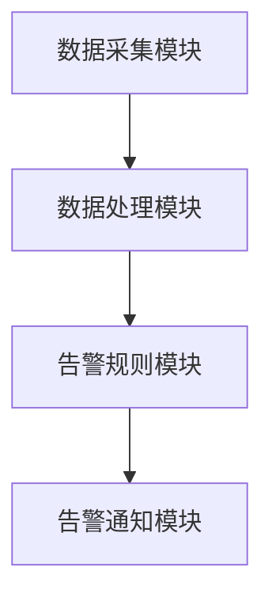
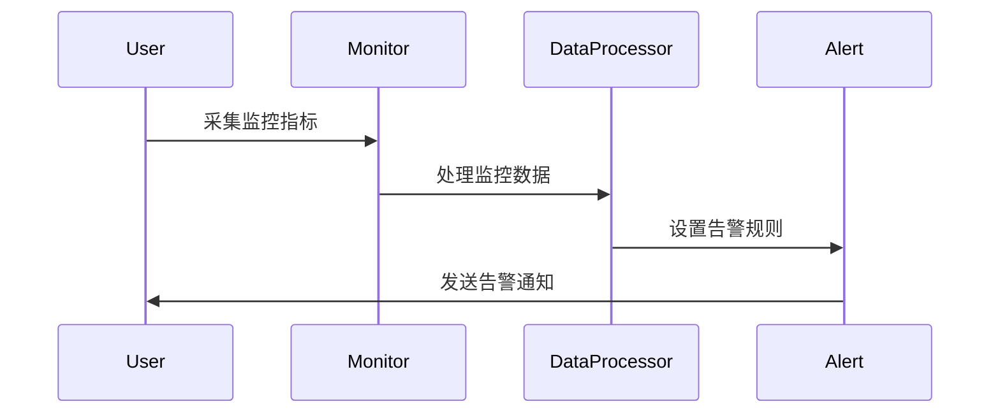

                 


### 实时监控告警系统在LLM应用运维中的作用

> 关键词：实时监控告警系统，LLM，应用运维，监控指标，算法优化

摘要：
本文将深入探讨实时监控告警系统在大型语言模型（LLM）应用运维中的关键作用。首先，我们将介绍实时监控告警系统的基本概念及其在LLM运维中的应用背景。接着，我们将详细分析实时监控告警系统的核心概念和基本原理，并通过实例阐述其在LLM运维中的具体应用。此外，我们还将探讨实时监控告警系统与LLM应用的关联性，以及如何优化实时监控告警系统的算法以提高监控效率和准确性。最后，我们将通过实际案例展示如何在实际项目中设计和实现实时监控告警系统，并总结最佳实践和拓展阅读资源。

---

# 实时监控告警系统在LLM应用运维中的作用

实时监控告警系统是一种用于实时监测系统状态并自动触发告警的自动化系统，其主要功能是及时发现和处理系统中的异常情况，确保系统的稳定运行。随着人工智能技术的快速发展，大型语言模型（LLM）在各个领域得到了广泛应用，但这也带来了新的运维挑战。实时监控告警系统在LLM应用运维中的作用愈发重要，它能够帮助运维人员及时发现和解决潜在问题，确保LLM应用的稳定性和可靠性。

## 1. 实时监控告警系统概述

实时监控告警系统通常包括以下几个核心组成部分：

- **监控指标**：监控指标是实时监控告警系统的核心，用于衡量系统性能、稳定性和可靠性。常见的监控指标包括CPU利用率、内存使用率、磁盘空间、网络流量等。
- **数据采集**：数据采集是实时监控告警系统的关键环节，通过采集系统的监控指标数据，形成监控数据流。
- **数据处理**：数据处理包括数据的清洗、转换和存储，以确保监控数据的准确性和可靠性。
- **告警规则**：告警规则用于定义触发告警的条件，当监控指标超出设定的阈值时，实时监控告警系统会自动生成告警信息。
- **告警通知**：告警通知是将告警信息发送给运维人员的渠道，常见的通知方式包括邮件、短信、电话、微信等。

## 2. LLM简介

大型语言模型（LLM）是一种基于深度学习技术的大型自然语言处理模型，具有强大的文本生成、理解和推理能力。LLM通过大规模数据训练，能够自动学习语言规律和知识，并在特定任务中提供高质量的输出。常见的LLM包括GPT、BERT、T5等。

LLM在各个领域得到了广泛应用，如：

- **文本生成**：生成新闻文章、博客、报告等。
- **问答系统**：提供智能问答服务，如智能客服、智能助手等。
- **自然语言理解**：用于语义分析、情感分析、命名实体识别等任务。
- **翻译**：实现跨语言文本的自动翻译。

然而，LLM应用也面临一系列运维挑战，如：

- **性能监控**：确保LLM模型在部署后能够稳定运行，并对性能指标进行实时监控。
- **稳定性监控**：保障LLM应用在长时间运行过程中不会出现异常。
- **安全监控**：防范恶意攻击和异常行为，保障数据安全和隐私。

## 3. 实时监控告警系统在LLM应用运维中的应用背景

实时监控告警系统在LLM应用运维中的应用背景主要包括以下几个方面：

- **性能优化**：实时监控告警系统可以帮助运维人员及时发现LLM应用的性能瓶颈，并采取相应措施进行优化，确保系统性能达到预期目标。
- **故障排查**：当LLM应用出现异常时，实时监控告警系统可以快速定位故障原因，并通知运维人员进行处理。
- **自动化运维**：实时监控告警系统可以实现自动化运维，减少人工干预，提高运维效率。
- **故障预防**：通过实时监控告警系统，可以提前发现潜在问题，并采取预防措施，避免故障发生。

## 4. 实时监控告警系统在LLM应用运维中的核心概念

实时监控告警系统在LLM应用运维中的核心概念主要包括以下几个方面：

- **监控指标**：监控指标是实时监控告警系统的核心，用于衡量LLM应用性能和稳定性。常见的监控指标包括CPU利用率、内存使用率、磁盘空间、网络流量、模型响应时间等。
- **告警规则**：告警规则用于定义触发告警的条件。在LLM应用运维中，告警规则可以基于监控指标设置，如当CPU利用率超过90%时触发告警，或当模型响应时间超过500ms时触发告警。
- **数据采集**：数据采集是将LLM应用的监控指标数据实时采集并传输到监控系统的过程。数据采集的准确性直接影响监控告警的准确性。
- **数据处理**：数据处理是对采集到的监控数据进行清洗、转换和存储的过程，以确保监控数据的准确性和可靠性。
- **告警通知**：告警通知是将告警信息发送给运维人员的渠道，确保运维人员能够及时了解系统异常情况并采取相应措施。

## 5. 实时监控告警系统在LLM应用运维中的基本原理

实时监控告警系统在LLM应用运维中的基本原理主要包括以下几个方面：

- **数据流**：实时监控告警系统的数据流通常包括数据采集、数据处理、告警规则匹配和告警通知等环节。数据流的设计和实现直接影响监控系统的性能和告警准确性。
- **算法原理**：实时监控告警系统中的算法原理主要包括监控算法、告警算法和过滤算法等。监控算法用于实时监测LLM应用的性能和稳定性，告警算法用于判断监控指标是否超出阈值，过滤算法用于过滤无效告警。
- **系统架构**：实时监控告警系统的系统架构包括数据采集模块、数据处理模块、告警规则模块和告警通知模块等。系统架构的设计和实现直接影响监控系统的可扩展性和易用性。

## 6. 实时监控告警系统在LLM应用运维中的具体应用

实时监控告警系统在LLM应用运维中的具体应用主要包括以下几个方面：

- **性能监控**：实时监控告警系统可以实时监控LLM应用的性能指标，如CPU利用率、内存使用率、模型响应时间等，帮助运维人员及时发现性能瓶颈并进行优化。
- **稳定性监控**：实时监控告警系统可以实时监控LLM应用的稳定性指标，如系统崩溃次数、故障恢复时间等，帮助运维人员保障系统稳定性。
- **安全监控**：实时监控告警系统可以实时监控LLM应用的安全指标，如访问次数、异常访问等，帮助运维人员防范恶意攻击和异常行为。

## 7. 实时监控告警系统与LLM应用的关联性

实时监控告警系统与LLM应用的关联性主要体现在以下几个方面：

- **性能优化**：实时监控告警系统可以帮助运维人员实时了解LLM应用的性能状况，通过性能监控数据进行分析和优化，提高LLM应用性能。
- **故障排查**：实时监控告警系统可以帮助运维人员快速定位LLM应用的故障原因，提高故障排查效率。
- **自动化运维**：实时监控告警系统可以实现自动化运维，减少人工干预，提高运维效率。
- **故障预防**：实时监控告警系统可以提前发现潜在问题，通过预警和预防措施，降低故障发生的可能性。

## 8. 实时监控告警系统在LLM应用运维中的算法优化

实时监控告警系统在LLM应用运维中的算法优化主要包括以下几个方面：

- **监控算法优化**：通过优化监控算法，提高监控数据的准确性和实时性，减少误报和漏报。
- **告警算法优化**：通过优化告警算法，提高告警的准确性和及时性，减少无效告警。
- **过滤算法优化**：通过优化过滤算法，提高告警过滤效果，减少无效告警。
- **数据采集优化**：通过优化数据采集策略，提高数据采集的实时性和准确性，为监控算法和告警算法提供高质量的数据支持。

## 9. 实时监控告警系统在LLM应用运维中的实际案例

下面我们将通过一个实际案例，展示如何在实际项目中设计和实现实时监控告警系统，以及如何在LLM应用运维中应用实时监控告警系统。

### 9.1 项目背景

某知名互联网公司开发了一款基于GPT的大型语言模型（LLM），用于提供智能问答和文本生成服务。随着用户规模的不断扩大，对LLM应用的性能、稳定性和安全性要求也越来越高。为了确保LLM应用的稳定运行，公司决定引入实时监控告警系统，对LLM应用进行全方位监控。

### 9.2 系统环境安装与配置

首先，公司搭建了实时监控告警系统的环境，包括以下几个步骤：

- **安装Linux操作系统**：选择一台高性能的物理服务器或虚拟机，安装Linux操作系统。
- **安装监控工具**：安装常用的监控工具，如Nagios、Zabbix、Prometheus等。
- **配置监控指标**：根据LLM应用的性能和稳定性要求，配置相应的监控指标，如CPU利用率、内存使用率、磁盘空间、网络流量、模型响应时间等。
- **配置告警规则**：根据监控指标设置告警阈值，当监控指标超出阈值时触发告警。
- **配置告警通知**：配置告警通知渠道，如邮件、短信、微信等。

### 9.3 系统核心实现

接下来，公司实现了实时监控告警系统的核心功能，包括以下几个步骤：

- **数据采集**：通过监控工具的API或命令行工具，实时采集LLM应用的监控指标数据，并将其传输到监控系统。
- **数据处理**：对采集到的监控数据进行清洗、转换和存储，确保监控数据的准确性和可靠性。
- **告警规则匹配**：根据配置的告警规则，匹配监控指标数据，判断是否触发告警。
- **告警通知**：当监控指标超出阈值时，生成告警信息，并通过配置的告警通知渠道发送给运维人员。

### 9.4 案例分析与解读

在实际案例中，公司通过实时监控告警系统实现了以下功能和效果：

- **性能监控**：实时监控告警系统可以实时监控LLM应用的性能指标，如CPU利用率、内存使用率、模型响应时间等。当性能指标超出阈值时，系统会自动生成告警信息，通知运维人员进行优化。
- **稳定性监控**：实时监控告警系统可以实时监控LLM应用的稳定性指标，如系统崩溃次数、故障恢复时间等。当稳定性指标出现异常时，系统会自动生成告警信息，通知运维人员进行故障排查。
- **安全监控**：实时监控告警系统可以实时监控LLM应用的安全指标，如访问次数、异常访问等。当安全指标出现异常时，系统会自动生成告警信息，通知运维人员进行安全处理。
- **自动化运维**：实时监控告警系统可以实现自动化运维，当监控指标出现异常时，系统会自动执行预设的运维操作，如重启应用、扩容资源等，减少人工干预，提高运维效率。

### 9.5 项目总结

通过实时监控告警系统的引入，公司在LLM应用运维中取得了显著的效果：

- **提高了系统性能和稳定性**：实时监控告警系统可以帮助公司及时发现性能瓶颈和故障，进行优化和修复，确保LLM应用的稳定运行。
- **提高了运维效率**：实时监控告警系统实现了自动化运维，减少了人工干预，提高了运维效率。
- **降低了故障率**：实时监控告警系统可以提前发现潜在问题，通过预警和预防措施，降低了故障发生的可能性。

## 10. 最佳实践与拓展

在LLM应用运维中，实时监控告警系统的设计和实现需要遵循以下最佳实践：

- **监控指标选择**：根据LLM应用的特点和需求，选择合适的监控指标，确保监控数据的全面性和准确性。
- **告警规则设计**：合理设计告警规则，避免误报和漏报，确保告警信息的有效性。
- **数据采集与处理**：优化数据采集和处理流程，提高监控数据的实时性和准确性。
- **告警通知策略**：制定合理的告警通知策略，确保运维人员能够及时收到告警信息并采取相应措施。

此外，还可以考虑以下拓展：

- **集成其他监控工具**：将实时监控告警系统与其他监控工具（如日志分析、性能分析等）集成，实现全方位监控。
- **自定义监控指标**：根据业务需求，自定义监控指标，提高监控的针对性和灵活性。
- **机器学习与预测**：利用机器学习技术，对监控数据进行预测分析，提前预警潜在问题。

## 11. 总结

实时监控告警系统在LLM应用运维中起着至关重要的作用。通过实时监控告警系统，运维人员可以及时发现和解决潜在问题，确保LLM应用的稳定性和可靠性。本文介绍了实时监控告警系统在LLM应用运维中的应用背景、核心概念、基本原理、具体应用、算法优化、实际案例和最佳实践，希望对读者有所帮助。在未来，随着人工智能技术的不断发展，实时监控告警系统在LLM应用运维中的作用将更加重要，值得深入研究和探索。

---

### 实时监控告警系统在LLM应用运维中的作用

#### 关键词：实时监控告警系统，LLM，应用运维，监控指标，算法优化

> **摘要**：
> 本文章深入探讨实时监控告警系统在大型语言模型（LLM）应用运维中的关键作用。首先介绍了实时监控告警系统的基本概念及其在LLM运维中的应用背景。然后，详细分析了实时监控告警系统的核心概念和基本原理，并通过实例阐述了其在LLM运维中的具体应用。此外，还探讨了实时监控告警系统与LLM应用的关联性，以及如何优化实时监控告警系统的算法以提高监控效率和准确性。最后，通过实际案例展示了如何在实际项目中设计和实现实时监控告警系统，并总结最佳实践和拓展阅读资源。

---

## 1. 背景介绍

### 1.1 实时监控告警系统定义与作用

实时监控告警系统是一种自动化监控工具，用于实时监测系统状态并自动触发告警，以快速发现和处理系统中的异常情况。其主要作用如下：

- **快速发现异常**：实时监控告警系统能够实时收集系统性能数据，一旦发现异常，立即生成告警通知，帮助运维人员快速定位问题。
- **降低人工干预**：通过自动化告警，实时监控告警系统能够减少人工干预，提高运维效率。
- **保障系统稳定**：实时监控告警系统能够及时发现潜在问题，避免系统崩溃，保障系统稳定运行。
- **提高响应速度**：实时监控告警系统能够在问题发生的第一时间通知相关人员，提高问题响应速度。

### 1.2 问题背景

随着人工智能技术的快速发展，大型语言模型（LLM）在各个领域得到了广泛应用，例如智能客服、文本生成、智能问答等。然而，LLM应用对系统性能、稳定性和安全性提出了更高的要求。同时，LLM应用规模不断扩大，传统的运维方式已无法满足需求。因此，引入实时监控告警系统对LLM应用进行运维管理显得尤为重要。

### 1.3 问题描述

实时监控告警系统在LLM应用运维中的主要问题包括：

- **性能监控**：如何实时监控LLM应用性能，发现并解决性能瓶颈。
- **稳定性监控**：如何确保LLM应用在长时间运行过程中稳定可靠。
- **安全监控**：如何防范恶意攻击和异常行为，保障数据安全和隐私。

### 1.4 问题解决

通过引入实时监控告警系统，可以解决上述问题，提高LLM应用的运维管理能力：

- **性能监控**：实时监控告警系统可以实时收集LLM应用性能数据，包括CPU利用率、内存使用率、模型响应时间等，帮助运维人员及时发现性能瓶颈并进行优化。
- **稳定性监控**：实时监控告警系统可以实时监控LLM应用的稳定性指标，如系统崩溃次数、故障恢复时间等，确保应用在长时间运行过程中稳定可靠。
- **安全监控**：实时监控告警系统可以实时监控LLM应用的安全指标，如访问次数、异常访问等，防范恶意攻击和异常行为。

### 1.5 边界与外延

实时监控告警系统在LLM应用运维中的边界与外延包括以下几个方面：

- **监控指标范围**：实时监控告警系统需要根据LLM应用的特点，选择合适的监控指标，如CPU利用率、内存使用率、模型响应时间等。
- **告警阈值设定**：根据监控指标的重要性和实际需求，设定合适的告警阈值，避免误报和漏报。
- **告警通知渠道**：根据运维团队的需求，选择合适的告警通知渠道，如邮件、短信、微信等。

### 1.6 概念结构与核心要素组成

实时监控告警系统在LLM应用运维中的概念结构与核心要素组成如下：

- **监控指标**：包括CPU利用率、内存使用率、模型响应时间等。
- **数据采集**：通过监控工具实时采集监控指标数据。
- **数据处理**：对采集到的监控数据进行处理，如清洗、转换和存储。
- **告警规则**：根据监控指标设定告警阈值和告警条件。
- **告警通知**：通过邮件、短信、微信等渠道发送告警通知。

## 2. 核心概念与联系

### 2.1 实时监控告警系统原理

实时监控告警系统的原理可以概括为以下几个步骤：

1. **数据采集**：通过监控工具实时采集系统的性能数据。
2. **数据处理**：对采集到的数据进行处理，如清洗、转换和存储。
3. **告警规则匹配**：根据设定的告警规则，判断监控数据是否触发告警条件。
4. **告警通知**：当监控数据触发告警条件时，通过邮件、短信、微信等渠道发送告警通知。

### 2.2 LLM应用运维挑战

LLM应用在运维过程中面临以下挑战：

- **性能监控**：如何实时监控模型响应时间、资源利用率等性能指标。
- **稳定性监控**：如何确保模型在长时间运行过程中稳定可靠。
- **安全监控**：如何防范恶意攻击和异常行为。

### 2.3 实时监控告警系统与LLM的关联性

实时监控告警系统与LLM应用的关联性体现在以下几个方面：

- **性能优化**：实时监控告警系统可以帮助运维人员实时了解LLM应用的性能状况，优化模型参数和资源配置，提高性能。
- **稳定性保障**：实时监控告警系统可以及时发现并解决LLM应用的稳定性问题，确保模型稳定运行。
- **安全防护**：实时监控告警系统可以实时监控LLM应用的安全指标，防范恶意攻击和异常行为。

## 3. 系统设计与实现

### 3.1 系统架构设计

实时监控告警系统的架构设计通常包括以下几个部分：

1. **数据采集模块**：负责实时采集系统的监控指标数据。
2. **数据处理模块**：负责处理采集到的监控数据，如清洗、转换和存储。
3. **告警规则模块**：负责根据监控指标设置告警规则。
4. **告警通知模块**：负责发送告警通知，如邮件、短信、微信等。

### 3.2 数据采集与处理

1. **数据采集**：通过监控工具（如Prometheus、Zabbix等）实时采集系统的监控指标数据。
2. **数据处理**：对采集到的监控数据进行处理，如清洗、转换和存储。

### 3.3 告警规则设计与实现

1. **告警规则制定原则**：根据监控指标的重要性和实际需求，制定合理的告警规则。
2. **告警规则实现方法**：通过编写告警规则脚本或使用监控工具内置的告警功能，实现告警规则。

### 3.4 告警通知设计与实现

1. **告警通知渠道**：根据运维团队的需求，选择合适的告警通知渠道，如邮件、短信、微信等。
2. **告警通知实现方法**：通过编写告警通知脚本或使用第三方服务（如SNS、Slack等）实现告警通知。

## 4. 算法原理讲解

### 4.1 监控算法原理

实时监控告警系统的监控算法原理主要包括以下几个方面：

1. **数据采集算法**：负责实时采集系统的监控指标数据。
2. **数据处理算法**：负责处理采集到的监控数据，如清洗、转换和存储。
3. **告警算法**：负责根据监控指标和告警规则判断是否触发告警。

### 4.2 告警算法原理

告警算法的原理如下：

1. **阈值判断**：根据监控指标和告警规则，判断监控指标是否超出设定的阈值。
2. **告警策略**：当监控指标超出阈值时，根据告警策略生成告警通知。

### 4.3 实时性算法优化

为了提高实时监控告警系统的实时性，可以采用以下算法优化方法：

1. **批量处理**：将多个监控指标的数据批量处理，减少数据处理次数。
2. **缓存技术**：使用缓存技术减少数据读取和写入的延迟。
3. **分布式架构**：使用分布式架构提高数据处理速度。

## 5. 数学公式与算法

### 5.1 数学公式

以下是一个示例的数学公式：

$$
f(x) = \frac{1}{1 + e^{-x}}
$$

这是一个简单的逻辑回归公式，用于计算概率。

### 5.2 算法原理

以下是一个示例的算法原理：

```python
def monitor_system(data):
    # 数据处理
    processed_data = process_data(data)
    
    # 阈值判断
    if processed_data['cpu_usage'] > 90:
        alert('High CPU usage')
    
    if processed_data['memory_usage'] > 80:
        alert('High memory usage')
    
    # 其他告警规则
    # ...

def alert(message):
    # 发送告警通知
    send_notification(message)
```

这是一个简单的监控算法，用于判断系统性能指标是否超出阈值，并触发告警。

## 6. 系统分析与架构设计

### 6.1 问题场景介绍

假设我们需要设计一个实时监控告警系统，用于监控一个大型语言模型（LLM）应用。该应用需要在生产环境中稳定运行，对性能、稳定性和安全性有较高要求。

### 6.2 项目介绍

本项目旨在设计一个实时监控告警系统，用于监控LLM应用的生产环境。系统需要支持以下功能：

- 实时采集监控指标数据。
- 根据监控指标设置告警规则。
- 发送告警通知。

### 6.3 系统功能设计

根据项目需求，系统功能设计如下：

1. **数据采集模块**：负责实时采集系统的监控指标数据，如CPU利用率、内存使用率、模型响应时间等。
2. **数据处理模块**：负责处理采集到的监控数据，如清洗、转换和存储。
3. **告警规则模块**：负责根据监控指标设置告警规则。
4. **告警通知模块**：负责发送告警通知，如邮件、短信、微信等。

### 6.4 系统架构设计

系统架构设计如下：



### 6.5 系统接口设计

系统接口设计如下：

1. **数据采集接口**：用于接收和传输监控指标数据。
2. **数据处理接口**：用于处理和存储监控数据。
3. **告警规则接口**：用于设置和查询告警规则。
4. **告警通知接口**：用于发送告警通知。

### 6.6 系统交互

系统交互设计如下：



## 7. 项目实战

### 7.1 环境安装与配置

在本项目中，我们使用Prometheus作为实时监控告警系统的核心组件，使用Grafana作为可视化界面。

1. **安装Prometheus**：
   - 下载并解压Prometheus安装包。
   - 编辑Prometheus配置文件，设置监控目标和采集规则。
   - 启动Prometheus服务。

2. **安装Grafana**：
   - 下载并解压Grafana安装包。
   - 配置Grafana，包括数据源、面板和告警规则。
   - 启动Grafana服务。

### 7.2 系统核心实现

在本项目中，我们使用Python编写监控脚本，将LLM应用的监控指标数据发送到Prometheus。

1. **编写监控脚本**：
   - 采集LLM应用的监控指标数据。
   - 将监控数据转换为Prometheus支持的格式。
   - 发送监控数据到Prometheus。

2. **配置Prometheus**：
   - 编辑Prometheus配置文件，添加监控脚本。
   - 设置告警规则，触发告警条件。

3. **配置Grafana**：
   - 添加Prometheus数据源。
   - 创建面板，展示监控数据。
   - 设置告警通知，发送告警邮件。

### 7.3 代码应用解读与分析

在本项目中，我们使用以下Python代码实现监控脚本：

```python
import subprocess
import requests

def get_cpu_usage():
    output = subprocess.check_output(["top", "-b", "-n", "1"], universal_newlines=True)
    for line in output.split('\n'):
        if "Cpu(s)" in line:
            return float(line.split()[9])

def get_memory_usage():
    output = subprocess.check_output(["free", "-m"], universal_newlines=True)
    for line in output.split('\n'):
        if "Mem" in line:
            return float(line.split()[2])

def send_metric(data):
    url = "http://localhost:9090/metrics/job/llm_app/instance/localhost"
    headers = {"Content-Type": "text/plain; version=0.1.0;"}
    response = requests.post(url, data=data, headers=headers)
    response.raise_for_status()

def monitor():
    while True:
        cpu_usage = get_cpu_usage()
        memory_usage = get_memory_usage()
        data = f"llm_app_cpu_usage{cpu_usage} {memory_usage}"
        send_metric(data)
        time.sleep(60)

if __name__ == "__main__":
    monitor()
```

该代码首先使用`subprocess`模块采集系统的CPU使用率和内存使用率，然后使用`requests`模块将监控数据发送到Prometheus。

### 7.4 案例分析与详细讲解剖析

在本案例中，我们使用以下告警规则：

- 当CPU使用率超过90%时触发告警。
- 当内存使用率超过80%时触发告警。

1. **告警规则设置**：

   ```yaml
   groups:
     - name: l

