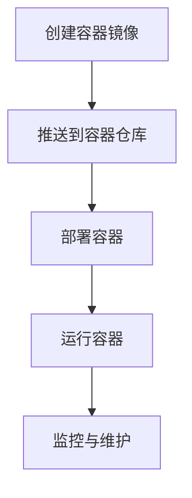
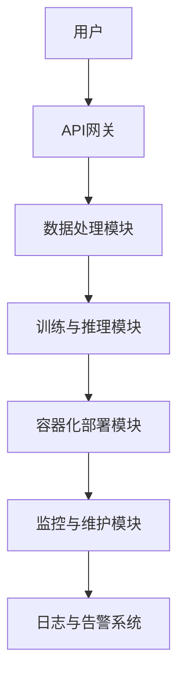
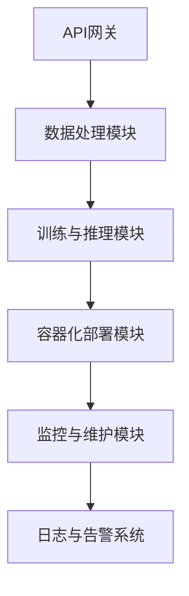

                 


### 第一部分：容器化技术概述

#### 1.1 容器化技术的起源与发展
容器化技术的概念起源于20世纪90年代，起源于Linux容器技术，随着Docker的推出和普及，容器化技术逐渐成为现代软件交付和部署的标准化解决方案。

**问题背景**：随着云计算和微服务架构的兴起，软件系统变得越来越复杂，传统的部署方式难以满足快速迭代和高效交付的需求。

**问题描述**：如何解决软件部署过程中的环境不一致问题，实现跨平台部署的便捷性？

**问题解决**：容器化技术通过将应用程序及其依赖环境打包成一个独立的容器镜像，实现了软件的标准化和隔离性，从而解决了部署难题。

**边界与外延**：容器化技术不仅适用于Web应用，也广泛应用于数据库、中间件、后台服务等各类软件系统的部署。

**核心要素组成**：
- **容器镜像**：应用程序及其依赖环境的打包文件。
- **容器引擎**：如Docker，负责容器的创建、启动和管理。
- **容器网络**：容器之间的通信机制，如容器网络接口（CNI）。
- **容器存储**：容器数据存储的解决方案，如容器存储接口（CSI）。

#### 1.2 容器化技术的应用场景
容器化技术适用于多种应用场景，包括但不限于以下几类：

**云计算与容器化**：云计算为容器化技术提供了强大的基础设施支持，容器化技术可以充分利用云计算的弹性和可扩展性。

**微服务架构与容器化**：容器化技术与微服务架构天然契合，容器化微服务可以方便地部署、扩展和管理。

**容器化技术的挑战与解决方案**：
- **兼容性**：容器化技术需要确保不同平台和操作系统的兼容性。
  - **解决方案**：使用标准化容器镜像和容器编排工具，如Docker和Kubernetes。

- **安全性**：容器化技术需要确保容器运行的安全性和隔离性。
  - **解决方案**：使用安全容器（如Linux命名空间和cgroup）和容器安全工具（如Docker Bench for Security）。

#### 1.3 容器化技术核心概念联系
容器化技术与敏捷开发、LLM应用等概念密切相关，以下是它们之间的联系：

- **容器化技术与敏捷开发的联系**：
  - **敏捷开发原则**：敏捷开发强调快速迭代和持续交付，容器化技术可以加速部署和测试，符合敏捷开发的核心理念。
  - **敏捷开发流程**：容器化技术可以简化敏捷开发的部署流程，实现快速回滚和持续集成。

- **容器化技术与LLM应用的联系**：
  - **LLM应用特点**：LLM（大型语言模型）应用通常具有大规模、高复杂度的特点，需要高效的计算资源和灵活的部署方式。
  - **容器化技术优势**：容器化技术可以提供可扩展的计算资源，并通过容器镜像实现LLM应用的标准化部署。

### 设计思路：

为了设计出《容器化技术助力敏捷LLM应用架构》这本书的完整目录大纲，我们需要遵循以下步骤：

1. **背景介绍**：
   - **问题背景**：介绍容器化技术的兴起和它在敏捷开发中的应用。
   - **问题描述**：阐述LLM（大型语言模型）的应用场景和挑战。
   - **问题解决**：解释容器化技术如何助力LLM应用的敏捷开发。
   - **边界与外延**：讨论容器化技术的应用范围和限制。
   - **核心要素组成**：明确容器化技术、敏捷开发、LLM应用等核心概念及其相互关系。

2. **核心概念与联系**：
   - **容器化技术原理**：详细介绍容器化技术的基本概念、原理和应用。
   - **敏捷开发方法**：阐述敏捷开发的核心原则、流程和方法。
   - **LLM应用**：深入探讨LLM的应用场景、优势和挑战。

3. **算法原理讲解**：
   - **容器化技术原理讲解**：使用mermaid画出容器化技术的流程图，并用Python代码和LaTeX公式详细阐述。
   - **敏捷开发方法讲解**：使用mermaid画出敏捷开发的流程图，并用Python代码和LaTeX公式详细阐述。
   - **LLM应用讲解**：使用mermaid画出LLM应用的流程图，并用Python代码和LaTeX公式详细阐述。

4. **系统分析与架构设计方案**：
   - **问题场景介绍**：描述容器化技术在LLM应用中的具体问题。
   - **系统功能设计**：使用mermaid画出领域模型类图。
   - **系统架构设计**：使用mermaid画出系统架构图。
   - **系统接口设计**：描述系统接口设计和系统交互。

5. **项目实战**：
   - **环境安装**：介绍安装容器化环境、LLM模型和所需工具的步骤。
   - **系统核心实现**：提供源代码，并进行解读与分析。
   - **实际案例**：提供实际案例，进行分析和详细讲解。
   - **项目小结**：总结项目经验和教训。

6. **最佳实践 tips、小结、注意事项、拓展阅读等内容**：
   - **最佳实践 tips**：给出在容器化技术助力敏捷LLM应用架构过程中可能遇到的问题和解决方法。
   - **小结**：总结书中的关键点和重要知识点。
   - **注意事项**：提醒读者在实际应用中需要注意的事项。
   - **拓展阅读**：推荐相关的阅读材料，以供读者进一步学习。

### 目录大纲：

根据上述设计思路，我们可以设计出以下目录大纲：

----------------------------------------------------------------
# 第一部分：容器化技术概述

## 1.1 容器化技术的起源与发展
### 1.1.1 容器化技术的概念
### 1.1.2 容器化技术的主要优势
### 1.1.3 容器化技术的基本原理

## 1.2 容器化技术的应用场景
### 1.2.1 云计算与容器化
### 1.2.2 微服务架构与容器化
### 1.2.3 容器化技术的挑战与解决方案

## 1.3 容器化技术核心概念联系
### 1.3.1 容器化技术与敏捷开发的联系
### 1.3.2 容器化技术与LLM应用的联系

----------------------------------------------------------------

# 第二部分：敏捷开发方法

## 2.1 敏捷开发的背景与核心原则
### 2.1.1 敏捷开发的起源
### 2.1.2 敏捷开发的核心原则
### 2.1.3 敏捷开发的实践流程

## 2.2 敏捷开发与传统开发方法的对比
### 2.2.1 敏捷开发的优势
### 2.2.2 敏捷开发的挑战
### 2.2.3 敏捷开发的实施策略

## 2.3 敏捷开发工具与技术
### 2.3.1 敏捷开发工具简介
### 2.3.2 敏捷开发常用技术
### 2.3.3 敏捷开发的持续集成与持续部署

----------------------------------------------------------------

# 第三部分：LLM应用

## 3.1 LLM应用概述
### 3.1.1 LLM的概念与特点
### 3.1.2 LLM的主要应用领域
### 3.1.3 LLM的优势与挑战

## 3.2 LLM应用架构设计
### 3.2.1 LLM应用架构概述
### 3.2.2 LLM应用的数据处理流程
### 3.2.3 LLM应用的模型训练与优化

## 3.3 LLM应用性能优化
### 3.3.1 LLM应用性能优化的方法
### 3.3.2 LLM应用性能优化的实践

----------------------------------------------------------------

# 第四部分：容器化技术助力敏捷LLM应用架构

## 4.1 设计思路
### 4.1.1 背景介绍
### 4.1.2 核心概念与联系
### 4.1.3 算法原理讲解
### 4.1.4 系统分析与架构设计方案
### 4.1.5 项目实战

## 4.2 容器化技术在敏捷LLM应用中的实践
### 4.2.1 环境安装
### 4.2.2 系统核心实现
### 4.2.3 实际案例
### 4.2.4 项目小结

## 4.3 最佳实践 tips
### 4.3.1 容器化技术助力敏捷LLM应用架构中的常见问题
### 4.3.2 解决方法和最佳实践

## 4.4 小结
### 4.4.1 关键点总结
### 4.4.2 注意事项
### 4.4.3 拓展阅读

----------------------------------------------------------------

作者：AI天才研究院/AI Genius Institute & 禅与计算机程序设计艺术 /Zen And The Art of Computer Programming
### 第一部分：容器化技术概述

#### 1.1 容器化技术的起源与发展

容器化技术的起源可以追溯到20世纪90年代，当时Linux容器技术（LXC）开始出现。LXC是一种轻量级的虚拟化技术，它允许在单个操作系统实例中运行多个隔离的容器，每个容器拥有独立的进程和文件系统。这种技术使得多个应用程序可以在同一物理主机上安全、高效地运行。

然而，真正的突破发生在2013年，Docker的推出。Docker提供了一个易于使用的容器化平台，它通过简化容器镜像的创建、分发和管理，推动了容器化技术的广泛应用。Docker的成功激发了整个行业对容器化的兴趣，并促使了Kubernetes等容器编排工具的发展。

**容器化技术的主要优势**：

1. **环境一致性**：容器化技术通过将应用程序及其运行环境打包成一个容器镜像，确保了应用程序在不同的环境中具有一致的表现，解决了传统部署中的“环境不一致”问题。

2. **资源利用率**：容器化技术可以高效地利用系统资源，因为容器是轻量级的，没有像虚拟机那样需要额外的操作系统层。容器直接运行在宿主机的操作系统上，从而减少了资源消耗。

3. **部署便捷性**：容器化技术简化了应用程序的部署流程，开发人员只需将容器镜像推送到容器仓库，即可在任何支持容器化的环境中轻松部署应用程序。

4. **可移植性**：容器化技术提供了应用程序的可移植性，开发人员可以在本地环境中开发应用程序，并将其部署到任何支持容器化的云平台或服务器上。

**容器化技术的基本原理**：

容器化技术基于以下核心概念：

1. **容器镜像**：容器镜像是一个静态的文件系统，它包含了应用程序运行所需的所有文件和配置。容器镜像是一个只读的模板，用于创建容器实例。

2. **容器引擎**：容器引擎是一个负责创建、启动和管理容器的工具。Docker是当前最流行的容器引擎，它提供了强大的容器镜像构建和管理功能。

3. **容器网络**：容器网络是容器之间进行通信的机制。容器可以通过网络接口与其他容器或外部系统进行交互。容器网络可以通过不同的网络模式进行配置，如桥接模式、主机模式等。

4. **容器存储**：容器存储是用于存储容器数据的一种机制。容器中的数据可以存储在本地文件系统中，也可以使用外部存储解决方案，如容器存储接口（CSI）。

#### 1.2 容器化技术的应用场景

容器化技术适用于多种应用场景，以下是其中几个主要的应用场景：

**云计算与容器化**：

云计算为容器化技术提供了强大的基础设施支持。容器化技术可以利用云计算的弹性，根据需求动态扩展或缩小资源。容器化应用程序可以部署在云服务提供商的虚拟机上，也可以部署在云原生的容器平台上，如Kubernetes。云计算与容器化技术的结合，使得应用程序可以高效地利用云资源，实现快速部署和弹性扩展。

**微服务架构与容器化**：

微服务架构是一种将应用程序拆分成多个独立的服务组件的架构风格。容器化技术非常适合微服务架构，因为每个服务都可以部署在独立的容器中，独立运行和扩展。容器化微服务可以方便地实现服务之间的解耦，提高系统的可维护性和可扩展性。

**容器化技术的挑战与解决方案**：

**兼容性**：

容器化技术需要确保在不同平台和操作系统之间的兼容性。为了解决这个问题，可以使用标准化容器镜像和容器编排工具，如Docker和Kubernetes。这些工具提供了跨平台的容器管理和部署解决方案。

**安全性**：

容器化技术需要确保容器运行的安全性和隔离性。可以使用安全容器（如Linux命名空间和cgroup）来限制容器资源的访问权限。此外，还可以使用容器安全工具（如Docker Bench for Security）来检测和修复容器安全漏洞。

**资源隔离**：

容器化技术需要确保容器之间有良好的资源隔离。可以通过配置合理的资源限制（如CPU和内存限制），确保容器不会占用过多的系统资源。

**容器化技术的核心概念联系**：

容器化技术与敏捷开发、LLM应用等概念密切相关。以下是它们之间的联系：

**容器化技术与敏捷开发的联系**：

敏捷开发强调快速迭代和持续交付，容器化技术可以加速部署和测试，符合敏捷开发的核心理念。容器化技术可以简化敏捷开发的部署流程，实现快速回滚和持续集成。

**容器化技术与LLM应用的联系**：

LLM（大型语言模型）应用通常具有大规模、高复杂度的特点，需要高效的计算资源和灵活的部署方式。容器化技术可以提供可扩展的计算资源，并通过容器镜像实现LLM应用的标准化部署。

### 第一部分：容器化技术概述

#### 1.1 容器化技术的起源与发展

**1.1.1 容器化技术的概念**

容器化技术是一种将应用程序及其依赖环境打包成一个可移植的、轻量级的容器镜像，以便在任意环境中部署和运行的技术。容器化技术的核心在于实现应用程序与宿主环境的隔离，从而提高部署的一致性和可移植性。

**1.1.2 容器化技术的主要优势**

- **环境一致性**：容器化技术通过将应用程序及其运行环境打包成一个容器镜像，确保了应用程序在不同的环境中具有一致的表现，解决了传统部署中的“环境不一致”问题。
- **资源利用率**：容器化技术可以高效地利用系统资源，因为容器是轻量级的，没有像虚拟机那样需要额外的操作系统层。容器直接运行在宿主机的操作系统上，从而减少了资源消耗。
- **部署便捷性**：容器化技术简化了应用程序的部署流程，开发人员只需将容器镜像推送到容器仓库，即可在任何支持容器化的环境中轻松部署应用程序。
- **可移植性**：容器化技术提供了应用程序的可移植性，开发人员可以在本地环境中开发应用程序，并将其部署到任何支持容器化的云平台或服务器上。

**1.1.3 容器化技术的基本原理**

容器化技术基于以下核心概念：

- **容器镜像**：容器镜像是一个静态的文件系统，它包含了应用程序运行所需的所有文件和配置。容器镜像是一个只读的模板，用于创建容器实例。
- **容器引擎**：容器引擎是一个负责创建、启动和管理容器的工具。Docker是当前最流行的容器引擎，它提供了强大的容器镜像构建和管理功能。
- **容器网络**：容器网络是容器之间进行通信的机制。容器可以通过网络接口与其他容器或外部系统进行交互。容器网络可以通过不同的网络模式进行配置，如桥接模式、主机模式等。
- **容器存储**：容器存储是用于存储容器数据的一种机制。容器中的数据可以存储在本地文件系统中，也可以使用外部存储解决方案，如容器存储接口（CSI）。

**容器化技术的起源与发展**

容器化技术的起源可以追溯到20世纪90年代，当时Linux容器技术（LXC）开始出现。LXC是一种轻量级的虚拟化技术，它允许在单个操作系统实例中运行多个隔离的容器，每个容器拥有独立的进程和文件系统。这种技术使得多个应用程序可以在同一物理主机上安全、高效地运行。

然而，真正的突破发生在2013年，Docker的推出。Docker提供了一个易于使用的容器化平台，它通过简化容器镜像的创建、分发和管理，推动了容器化技术的广泛应用。Docker的成功激发了整个行业对容器化的兴趣，并促使了Kubernetes等容器编排工具的发展。

**1.2 容器化技术的应用场景**

容器化技术适用于多种应用场景，以下是其中几个主要的应用场景：

**云计算与容器化**

云计算为容器化技术提供了强大的基础设施支持。容器化技术可以利用云计算的弹性，根据需求动态扩展或缩小资源。容器化应用程序可以部署在云服务提供商的虚拟机上，也可以部署在云原生的容器平台上，如Kubernetes。云计算与容器化技术的结合，使得应用程序可以高效地利用云资源，实现快速部署和弹性扩展。

**微服务架构与容器化**

微服务架构是一种将应用程序拆分成多个独立的服务组件的架构风格。容器化技术非常适合微服务架构，因为每个服务都可以部署在独立的容器中，独立运行和扩展。容器化微服务可以方便地实现服务之间的解耦，提高系统的可维护性和可扩展性。

**容器化技术的挑战与解决方案**

**兼容性**

容器化技术需要确保在不同平台和操作系统之间的兼容性。为了解决这个问题，可以使用标准化容器镜像和容器编排工具，如Docker和Kubernetes。这些工具提供了跨平台的容器管理和部署解决方案。

**安全性**

容器化技术需要确保容器运行的安全性和隔离性。可以使用安全容器（如Linux命名空间和cgroup）来限制容器资源的访问权限。此外，还可以使用容器安全工具（如Docker Bench for Security）来检测和修复容器安全漏洞。

**资源隔离**

容器化技术需要确保容器之间有良好的资源隔离。可以通过配置合理的资源限制（如CPU和内存限制），确保容器不会占用过多的系统资源。

**1.3 容器化技术核心概念联系**

容器化技术与敏捷开发、LLM应用等概念密切相关。以下是它们之间的联系：

**容器化技术与敏捷开发的联系**

敏捷开发强调快速迭代和持续交付，容器化技术可以加速部署和测试，符合敏捷开发的核心理念。容器化技术可以简化敏捷开发的部署流程，实现快速回滚和持续集成。

**容器化技术与LLM应用的联系**

LLM（大型语言模型）应用通常具有大规模、高复杂度的特点，需要高效的计算资源和灵活的部署方式。容器化技术可以提供可扩展的计算资源，并通过容器镜像实现LLM应用的标准化部署。

### 第一部分：容器化技术概述

#### 1.3 容器化技术核心概念联系

容器化技术作为现代软件部署与开发的关键技术，其核心概念与敏捷开发方法和LLM（大型语言模型）应用紧密相关。理解这些核心概念之间的联系，有助于我们在实际应用中更好地发挥容器化技术的优势。

**容器化技术与敏捷开发的联系**

**敏捷开发的核心原则**：敏捷开发方法强调快速迭代、持续交付和客户满意度。容器化技术在这方面具有显著的协同效应。容器化技术使得开发团队可以快速构建、测试和部署软件，从而实现敏捷开发中的快速迭代和持续交付。

- **快速迭代**：容器化技术通过容器镜像和容器编排工具（如Docker和Kubernetes），使开发团队能够在短时间内构建和部署软件版本。每次迭代只需更新容器镜像，即可实现软件的快速更新。
- **持续交付**：容器化技术简化了持续交付的流程。通过自动化构建和部署，开发团队能够确保软件在任何环境中的一致性和可靠性。此外，容器仓库（如Docker Hub）提供了方便的镜像版本管理和分发。

**敏捷开发实践流程**：敏捷开发方法包括用户故事、迭代规划、每日站立会议、回顾等实践流程。容器化技术可以支持这些实践流程的落地。

- **用户故事**：容器化技术使得开发团队能够快速构建可演示的原型，从而更好地与用户和利益相关者沟通和验证用户故事。
- **迭代规划**：容器化技术使得开发团队能够在短时间内完成多个版本的迭代，并在每次迭代中优化和改进软件。

**容器化技术优势**：容器化技术具有环境一致性、资源利用率、部署便捷性和可移植性等优势，这些优势与敏捷开发的核心理念高度契合。

- **环境一致性**：容器化技术通过容器镜像确保了软件在不同环境中的运行一致性，避免了传统的“环境不一致”问题，从而提高了软件的质量和稳定性。
- **资源利用率**：容器化技术通过轻量级的容器，提高了系统的资源利用率，使得开发团队能够在有限的资源下完成更多的工作。
- **部署便捷性**：容器化技术简化了软件的部署流程，使得开发团队能够快速、高效地部署软件。
- **可移植性**：容器化技术提供了软件的可移植性，使得开发团队能够将软件部署到任何支持容器化的环境中，提高了软件的灵活性和适应性。

**容器化技术挑战**：尽管容器化技术具有许多优势，但在实际应用中仍面临一些挑战。

- **兼容性**：容器化技术需要确保在不同平台和操作系统之间的兼容性。这需要开发团队具备跨平台的容器化技能和经验。
- **安全性**：容器化技术需要确保容器运行的安全性和隔离性。这要求开发团队对容器安全有深刻的理解和有效的安全措施。

**解决方案**：针对容器化技术的挑战，有以下解决方案：

- **兼容性**：使用标准化容器镜像和容器编排工具，如Docker和Kubernetes，可以确保跨平台的兼容性。此外，持续集成和持续部署（CI/CD）流程可以帮助发现和解决兼容性问题。
- **安全性**：使用安全容器（如Linux命名空间和cgroup）和容器安全工具（如Docker Bench for Security），可以增强容器运行的安全性和隔离性。定期进行安全审计和漏洞修复也是关键。

**容器化技术与敏捷开发的整合**：

- **持续集成与持续部署（CI/CD）**：容器化技术可以与CI/CD工具集成，实现自动化构建、测试和部署。这有助于加快软件迭代速度，提高交付质量。
- **基础设施即代码（IaC）**：容器化技术使得基础设施也可以通过代码进行管理和部署。这有助于实现基础设施的标准化和自动化，提高基础设施的可维护性和可扩展性。
- **DevOps文化**：容器化技术推动了DevOps文化的普及。DevOps强调开发团队和运维团队的合作，容器化技术使得这种合作变得更加紧密和高效。

**容器化技术与LLM应用的联系**

**LLM应用特点**：

- **大规模**：LLM应用通常具有庞大的数据集和复杂的模型结构，需要大量的计算资源和存储空间。
- **高复杂度**：LLM应用涉及多个子模块和组件，需要精细的调度和管理。
- **动态性**：LLM应用需要根据用户输入动态生成响应，实时调整模型参数。

**容器化技术优势**：

- **可扩展性**：容器化技术可以轻松地扩展计算资源，以应对LLM应用的大规模和高复杂度特点。
- **弹性**：容器化技术可以根据需求动态调整资源分配，确保LLM应用在高负载情况下的稳定性。
- **标准化**：容器化技术通过容器镜像和容器编排，实现了LLM应用的标准化部署和管理，提高了系统的可维护性和可扩展性。

**容器化技术在LLM应用中的实践**：

- **模型训练与优化**：容器化技术可以用于LLM模型的训练和优化。通过容器化，开发团可以快速构建、测试和优化模型，并实现模型的自动化部署。
- **服务部署与扩展**：容器化技术使得LLM应用可以轻松部署在云平台或服务器上，并实现弹性扩展。例如，使用Kubernetes进行模型服务的自动化部署和管理。
- **资源管理**：容器化技术提供了高效的资源管理，可以根据模型训练和推理的需求动态分配计算资源，提高资源利用率。

**容器化技术与LLM应用的整合**：

- **分布式训练**：容器化技术可以支持LLM应用的分布式训练。通过在多个节点上部署容器化模型，可以加速训练过程，提高训练效率。
- **服务化**：容器化技术可以将LLM模型和服务化，实现模型的快速部署和访问。通过API网关和容器编排工具，可以实现模型服务的自动化管理和调度。
- **微服务架构**：容器化技术可以与微服务架构结合，将LLM应用拆分为多个独立的微服务，实现服务的解耦和可扩展性。

**总结**：

容器化技术为敏捷开发和LLM应用带来了显著的优势，但同时也带来了一些挑战。通过理解容器化技术的核心概念与联系，开发团队能够更好地利用容器化技术，实现敏捷开发和高效运行的LLM应用。

### 第二部分：敏捷开发方法

#### 2.1 敏捷开发的背景与核心原则

敏捷开发（Agile Development）是一种软件开发方法论，起源于20世纪90年代。当时，软件项目往往因为需求变化、进度延迟和质量问题而失败。为了解决这些问题，一群软件开发者提出了敏捷开发的核心理念。

**敏捷开发的起源**：

1999年，17位软件专家在科罗拉多州的博尔德（Boulder）聚首，共同起草了《敏捷宣言》（Manifesto for Agile Software Development）。这份宣言明确了敏捷开发的四个核心价值：

- **个体和互动重于过程与工具**
- **可工作的软件重于详尽的文档**
- **客户合作重于合同谈判**
- **响应变化重于遵循计划**

这一宣言奠定了敏捷开发的基础，并在随后的几十年中得到了广泛的认可和应用。

**敏捷开发的核心原则**：

敏捷开发方法强调快速迭代和持续交付，其核心原则包括以下几个方面：

- **快速反馈**：通过频繁的迭代和持续交付，开发团队能够及时获得用户反馈，并据此调整开发计划。
- **可工作的软件**：每次迭代结束时，团队应该交付一个可工作的软件版本，以验证开发方向和功能实现。
- **个体和团队的协作**：敏捷开发强调团队合作，提倡个体之间的互动和协作，以实现更高的工作效率和质量。
- **可适应计划**：敏捷开发采用可适应的计划方法，允许团队在项目过程中灵活调整优先级和计划。
- **简洁性**：敏捷开发提倡“做最少的可行工作”（Minimum Viable Product，MVP），避免过度设计和复杂的功能。

**敏捷开发的实践流程**：

敏捷开发方法的实践流程通常包括以下步骤：

- **用户故事**：用户故事是敏捷开发中的核心需求描述方式。用户故事通常以“作为...，我想要...，以便...”的形式表达。
- **迭代规划**：迭代规划是敏捷开发中的关键活动。团队在每个迭代开始时确定本次迭代的目标和任务。
- **每日站立会议**：每日站立会议是团队沟通和协作的重要手段。每次会议持续时间不超过15分钟，主要讨论当天的工作进展、遇到的问题和解决方案。
- **迭代回顾**：迭代回顾是敏捷开发中的反思和改进环节。团队在每个迭代结束时回顾本次迭代的工作，总结经验教训，并确定下一迭代的目标和改进措施。

#### 2.2 敏捷开发与传统开发方法的对比

**敏捷开发与传统开发方法的对比**：

传统开发方法，如瀑布模型（Waterfall Model），是一种线性、顺序的开发方法。在瀑布模型中，开发过程被划分为若干阶段，每个阶段必须在前一个阶段完成后才能开始。传统开发方法的主要特点包括：

- **阶段划分**：开发过程被划分为需求分析、设计、编码、测试、部署等阶段。
- **文档驱动**：每个阶段都产生大量的文档，如需求文档、设计文档、测试文档等。
- **严格计划**：开发过程严格按照预定的计划执行，计划一旦确定，就很难进行更改。
- **质量保证**：质量保证活动通常在开发过程的后期进行，如测试阶段。

与瀑布模型相比，敏捷开发方法具有以下特点：

- **迭代和增量**：敏捷开发方法采用迭代和增量的方式开发软件，每个迭代周期通常为1-4周。每次迭代都会交付一个可工作的软件版本。
- **用户参与**：敏捷开发方法强调用户参与，用户可以在每次迭代中提供反馈，并参与决策过程。
- **灵活性和适应性**：敏捷开发方法具有更高的灵活性和适应性，允许团队在项目过程中根据实际情况调整计划。
- **质量内建**：敏捷开发方法将质量保证融入整个开发过程，而非仅限于开发过程的后期。

**敏捷开发的优势**：

- **快速响应变化**：敏捷开发方法能够快速响应客户和市场需求的变化，确保软件项目能够及时交付满足用户需求的功能。
- **提高交付质量**：通过频繁的迭代和持续交付，开发团队能够及时发现问题并进行修复，从而提高软件交付的质量。
- **促进团队合作**：敏捷开发方法强调团队合作，鼓励团队成员之间的沟通和协作，提高工作效率。
- **降低风险**：通过小步快跑和频繁验证，敏捷开发方法可以降低项目风险，确保项目按计划顺利进行。

**敏捷开发的挑战**：

- **管理难度**：敏捷开发方法对管理提出了更高的要求，需要项目经理具备敏捷管理的知识和技能。
- **用户参与**：确保用户持续参与项目可能具有挑战性，特别是在用户需求不明确或变化频繁的情况下。
- **技术挑战**：敏捷开发方法要求团队具备一定的技术能力，如自动化测试、持续集成等。

**敏捷开发的实施策略**：

- **敏捷组织结构**：建立扁平化的组织结构，减少管理层次，提高团队决策的效率和灵活性。
- **敏捷工具和方法**：采用敏捷工具和方法，如Scrum、Kanban等，帮助团队实现敏捷开发。
- **持续学习和改进**：鼓励团队成员持续学习和改进，提高团队整体的技术和管理能力。
- **敏捷文化**：建立敏捷文化，鼓励团队成员积极参与项目决策，共同推动项目的成功。

### 2.3 敏捷开发工具与技术

**敏捷开发工具**：

敏捷开发工具是支持敏捷开发方法的重要工具，以下是一些常用的敏捷开发工具：

- **JIRA**：JIRA是Atlassian公司的一款项目管理工具，用于任务跟踪、敏捷迭代管理和报告生成。
- **Trello**：Trello是一款基于看板（Kanban）的敏捷项目管理工具，通过卡片和列表来组织和管理任务。
- **Confluence**：Confluence是Atlassian公司的一款团队协作工具，用于文档编写、知识管理和信息共享。
- **GitLab**：GitLab是一款开源的持续集成和持续部署（CI/CD）工具，支持敏捷开发的代码管理、自动化测试和自动化部署。

**敏捷开发技术**：

敏捷开发技术是支持敏捷开发方法的技术手段，以下是一些常用的敏捷开发技术：

- **Scrum**：Scrum是一种流行的敏捷开发框架，强调迭代开发和持续交付，包括冲刺（Sprint）、每日站立会议（Daily Stand-up）和迭代回顾（Retrospective）等实践。
- **Kanban**：Kanban是一种基于看板（Kanban）的敏捷开发方法，通过可视化工作流程和限制工作项数量来提高团队的效率和透明度。
- **自动化测试**：自动化测试是敏捷开发中不可或缺的一部分，通过编写自动化测试脚本，自动化执行测试用例，确保软件质量并加快迭代速度。
- **持续集成（CI）**：持续集成是一种软件开发实践，通过自动化构建和测试，确保代码库的代码质量，并在代码提交时快速反馈。

**持续集成与持续部署（CI/CD）**：

持续集成（Continuous Integration，CI）和持续部署（Continuous Deployment，CD）是敏捷开发中的重要实践。

- **持续集成（CI）**：持续集成是指开发人员在每次代码提交后，自动构建和测试代码，确保代码库的代码质量。CI工具如GitLab CI、Jenkins等，可以实现自动化构建和测试。
- **持续部署（CD）**：持续部署是指将经过CI验证的代码自动部署到生产环境。CD工具如Docker、Kubernetes等，可以实现自动化部署和管理。

**敏捷开发工具与技术的关系**：

敏捷开发工具和技术是相辅相成的，工具提供了实施敏捷开发的平台和功能，而技术则为敏捷开发提供了实现路径和方法。通过结合使用敏捷开发工具和技术，团队可以更好地实现敏捷开发的核心价值和原则，提高软件交付的质量和效率。

### 第二部分：敏捷开发方法

#### 2.3 敏捷开发工具与技术

敏捷开发方法在软件开发生命周期中广泛应用，其成功实施依赖于合适的工具和技术的支持。以下将详细介绍几种常见的敏捷开发工具与技术，并探讨它们在实际应用中的重要性。

**JIRA**

JIRA是一款功能强大的项目管理工具，由Atlassian公司开发。它广泛应用于敏捷团队中的任务跟踪、迭代管理和报告生成。JIRA的主要特点包括：

- **灵活的任务管理**：JIRA允许敏捷团队创建和管理多种类型的任务，如用户故事、任务和缺陷。团队可以根据需要自定义字段和属性，以满足特定项目需求。
- **迭代规划**：JIRA提供迭代规划功能，允许团队为每个迭代设置目标和里程碑，并跟踪任务进度。这有助于确保团队在迭代周期内保持进度和目标。
- **报告和分析**：JIRA提供了丰富的报告和分析功能，帮助团队了解项目状态、任务完成情况和团队绩效。这有助于团队识别潜在问题和改进机会。

**Trello**

Trello是一款基于看板（Kanban）方法的敏捷项目管理工具，以其直观的界面和灵活的布局而受到广泛欢迎。Trello的主要特点包括：

- **可视化工作流程**：Trello使用卡片和列表来组织任务，提供了一种直观的、可视化的工作流程。团队成员可以轻松地拖放卡片，以反映任务的状态和优先级。
- **灵活的任务分配**：Trello允许团队分配任务给成员，并设置截止日期和提醒。这有助于确保每个成员了解自己的任务和责任。
- **协作和沟通**：Trello支持团队成员之间的协作和沟通。团队成员可以添加注释、上传文件和进行讨论，以促进团队协作。

**Confluence**

Confluence是一款团队协作工具，也是Atlassian公司开发的。它主要用于文档编写、知识管理和信息共享。Confluence的主要特点包括：

- **文档编写和协作**：Confluence提供了丰富的文档编写功能，支持Markdown、LaTeX等多种格式。团队成员可以共同编辑文档，并实时协作。
- **知识库管理**：Confluence可以帮助团队构建和维护知识库。团队成员可以共享文档、指南和最佳实践，确保知识在团队内部得到有效利用。
- **集成和扩展**：Confluence与其他敏捷开发工具（如JIRA、Trello）和协作平台（如Slack）紧密集成，提供了一站式的团队协作解决方案。

**GitLab**

GitLab是一款开源的持续集成和持续部署（CI/CD）工具，它为敏捷团队提供了全面的代码管理和自动化流程。GitLab的主要特点包括：

- **代码管理**：GitLab提供了基于Git的代码管理功能，支持多种版本控制系统。团队成员可以轻松地创建、合并和提交代码，并跟踪代码变更。
- **持续集成（CI）**：GitLab CI允许团队在代码提交时自动构建和测试代码。通过配置GitLab CI/CD管道，团队可以确保代码库的代码质量，并快速反馈。
- **持续部署（CD）**：GitLab CD可以帮助团队自动化部署经过CI验证的代码到生产环境。团队可以根据需要配置部署管道，实现自动化部署和管理。

**Scrum**

Scrum是一种流行的敏捷开发框架，它强调迭代开发和持续交付。Scrum的主要实践包括：

- **冲刺（Sprint）**：Scrum将开发过程划分为短期的冲刺周期，通常为2-4周。在每个冲刺周期中，团队会完成一组预定的任务，并交付一个可工作的软件版本。
- **每日站立会议（Daily Stand-up）**：每日站立会议是Scrum实践的核心。团队成员在每天开始工作时，会举行短会，讨论当前的工作进展、遇到的问题和解决方案。
- **迭代回顾（Retrospective）**：迭代回顾是Scrum中的反思和改进环节。团队在每个迭代结束时回顾本次迭代的工作，总结经验教训，并确定下一迭代的目标和改进措施。

**Kanban**

Kanban是一种基于看板（Kanban）方法的敏捷开发方法，它通过可视化工作流程和限制工作项数量来提高团队的效率和透明度。Kanban的主要实践包括：

- **可视化工作流程**：Kanban使用卡片和列表来组织任务，提供了一种直观的、可视化的工作流程。团队成员可以清楚地看到任务的状态和优先级，以及整个团队的工作进度。
- **限制工作项数量**：Kanban通过限制工作项数量（工作项上限）来避免工作积压，提高团队的效率。这有助于团队集中精力处理当前任务，减少延迟和浪费。
- **持续改进**：Kanban强调持续改进，团队会定期评估工作流程，并根据实际情况进行优化和调整。

**自动化测试**

自动化测试是敏捷开发中不可或缺的一部分，它通过编写自动化测试脚本，自动化执行测试用例，确保软件质量并加快迭代速度。自动化测试的主要特点包括：

- **快速反馈**：自动化测试可以快速执行测试用例，并在代码提交后立即提供反馈。这有助于团队及时发现和修复问题，确保代码质量。
- **提高效率**：自动化测试可以减少手动测试的工作量，提高测试效率。通过自动化测试，团队可以节省时间和资源，更好地专注于开发工作。
- **可重复性**：自动化测试具有可重复性，每次执行测试用例的结果都是一致的。这有助于确保软件在每次迭代中的稳定性和可靠性。

**持续集成（CI）**

持续集成（Continuous Integration，CI）是一种软件开发实践，通过自动化构建和测试，确保代码库的代码质量，并在代码提交时快速反馈。持续集成的主要特点包括：

- **自动化构建**：持续集成工具（如GitLab CI、Jenkins）会自动构建代码库，并执行编译、打包等操作。这有助于确保代码库的代码质量，并在构建过程中快速反馈。
- **自动化测试**：持续集成工具会自动执行预定的测试用例，包括单元测试、集成测试等。这有助于确保代码库的代码质量，并在测试过程中快速反馈。
- **快速反馈**：持续集成工具会在代码提交后立即执行构建和测试，并提供反馈。这有助于团队及时发现和修复问题，确保代码库的稳定性。

**持续部署（CD）**

持续部署（Continuous Deployment，CD）是一种软件开发实践，通过自动化部署和管理，将经过CI验证的代码自动部署到生产环境。持续部署的主要特点包括：

- **自动化部署**：持续部署工具（如Docker、Kubernetes）会自动部署经过CI验证的代码到生产环境。这有助于确保软件的交付质量和生产环境的稳定性。
- **快速反馈**：持续部署工具会在部署过程中提供实时反馈，包括部署状态、部署进度和错误信息。这有助于团队快速发现和解决部署问题。
- **提高效率**：持续部署可以减少手动部署的工作量，提高部署效率。通过自动化部署，团队可以节省时间和资源，更好地专注于开发工作。

**敏捷开发工具与技术的关系**

敏捷开发工具和技术是相辅相成的，工具提供了实施敏捷开发的平台和功能，而技术则为敏捷开发提供了实现路径和方法。通过结合使用敏捷开发工具和技术，团队可以更好地实现敏捷开发的核心价值和原则，提高软件交付的质量和效率。

### 第三部分：LLM应用

#### 3.1 LLM应用概述

**3.1.1 LLM的概念与特点**

LLM（Large Language Model）指的是大型语言模型，是一种基于深度学习的自然语言处理模型。LLM通过学习大量文本数据，可以理解、生成和翻译自然语言文本。LLM的核心特点是：

1. **大规模**：LLM通常具有庞大的参数规模，可以达到数十亿甚至数千亿个参数。这种大规模使得LLM能够捕捉到语言的复杂模式和规律。
2. **预训练**：LLM通常通过预训练（Pre-training）的方式学习语言知识。在预训练阶段，模型在大量未标注的数据上训练，从而获得通用的语言理解能力。
3. **微调**：在预训练后，LLM可以通过微调（Fine-tuning）的方式适应特定任务。微调阶段，模型在特定领域的数据上进一步训练，以提高任务性能。

**3.1.2 LLM的主要应用领域**

LLM在多个领域具有重要应用，以下是其中几个主要的应用领域：

1. **自然语言处理（NLP）**：LLM在NLP任务中表现出色，如文本分类、情感分析、命名实体识别、机器翻译等。LLM可以处理复杂的语言结构，提高NLP任务的效果和效率。
2. **问答系统**：LLM可以构建智能问答系统，回答用户提出的问题。通过训练大量问答数据集，LLM可以理解问题的含义，并提供准确、自然的回答。
3. **对话系统**：LLM在对话系统中发挥着关键作用。对话系统可以通过LLM生成自然语言响应，实现与用户的交互。LLM可以处理用户的输入，理解上下文，生成连贯、自然的对话。
4. **文本生成**：LLM可以生成各种类型的文本，如文章、摘要、对话等。通过微调和调整模型参数，LLM可以生成特定主题或风格的内容。
5. **内容审核**：LLM可以用于自动审核内容，识别违规、不良或不当的文本。LLM可以学习大量标注数据，从中提取规则，用于分类和过滤。

**3.1.3 LLM的优势与挑战**

**优势**：

1. **强大的语言理解能力**：LLM通过预训练和微调，可以理解复杂的自然语言文本，捕捉到语言的深层模式和规律。这使得LLM在NLP任务中表现出色。
2. **高效率**：LLM可以处理大量的文本数据，快速生成高质量的响应。与传统的规则基方法相比，LLM具有更高的效率和准确性。
3. **灵活性和可扩展性**：LLM可以应用于多种任务和场景，如问答、对话生成、文本审核等。通过微调和调整模型参数，LLM可以适应不同的任务需求。
4. **知识积累**：LLM通过学习大量文本数据，积累了丰富的语言知识和常识。这使得LLM在生成文本时，可以提供准确、自然的响应。

**挑战**：

1. **数据需求**：LLM需要大量高质量的文本数据进行预训练和微调。获取和处理这些数据是一项挑战，需要大量的时间和计算资源。
2. **计算资源**：LLM通常需要大量的计算资源进行训练和推理。训练大型LLM模型需要高性能的计算设备和优化算法。
3. **模型解释性**：LLM是一个复杂的神经网络模型，其内部机制难以解释。这给模型的解释和验证带来了一定的困难。
4. **模型偏见**：LLM在训练过程中可能会学习到数据中的偏见和错误，导致生成文本存在偏见和误导。这需要研究人员和开发者采取措施，确保模型生成文本的公正性和可靠性。

### 3.2 LLM应用架构设计

**3.2.1 LLM应用架构概述**

LLM应用架构通常包括以下几个主要部分：

1. **数据层**：数据层负责数据的收集、处理和存储。数据层可以包括数据采集模块、数据清洗模块和数据存储模块。数据采集模块负责从各种来源收集文本数据，如互联网、数据库等。数据清洗模块负责处理噪声数据和异常值，确保数据的准确性和一致性。数据存储模块负责存储和处理大规模文本数据，如使用分布式存储系统（如HDFS）。
2. **模型层**：模型层包括LLM模型及其相关的预处理和后处理模块。预处理模块负责对输入文本进行预处理，如分词、词向量表示等。后处理模块负责对输出文本进行后处理，如文本规范化、去噪等。LLM模型通常采用深度学习框架（如TensorFlow、PyTorch）进行训练和推理。
3. **接口层**：接口层负责与外部系统进行交互，如用户界面、API网关等。用户界面（User Interface，UI）负责与用户进行交互，收集用户输入并提供输出结果。API网关（API Gateway）负责处理外部请求，将请求路由到相应的模型层模块。
4. **服务层**：服务层负责实现LLM应用的核心功能，如问答、对话生成、文本审核等。服务层通常采用微服务架构，将不同功能模块拆分为独立的微服务，以提高系统的可维护性和可扩展性。

**3.2.2 LLM应用的数据处理流程**

LLM应用的数据处理流程通常包括以下几个步骤：

1. **数据收集**：数据收集是数据处理流程的第一步，目标是获取大量高质量的文本数据。数据来源可以包括互联网、数据库、文档库等。在数据收集过程中，需要注意数据的多样性和代表性，以确保模型能够学习到丰富的语言知识。
2. **数据清洗**：数据清洗是数据处理流程的关键步骤，目的是处理噪声数据和异常值，确保数据的准确性和一致性。数据清洗可以包括去除无关信息、纠正错别字、去除停用词等操作。此外，还需要对文本数据进行标准化处理，如统一字符编码、去除特殊字符等。
3. **数据预处理**：数据预处理是将原始文本数据转换为适合模型训练的形式。预处理步骤可以包括分词、词向量表示、句子编码等。分词是将文本分割为单词或短语，词向量表示是将文本转换为密集的向量表示，句子编码是将文本转换为固定长度的向量表示，以便模型进行训练。
4. **模型训练**：模型训练是数据处理流程的核心步骤，目的是通过大量文本数据训练LLM模型。训练过程通常采用分布式训练策略，以提高训练效率和计算资源利用率。训练过程中，需要监控模型性能，如损失函数、精度、召回率等，以便调整模型参数和训练策略。
5. **模型评估**：模型评估是数据处理流程的最后一步，目的是评估模型在测试数据上的性能。评估指标可以包括准确率、召回率、F1分数等。评估结果可以帮助开发者了解模型的性能，并指导后续的模型优化和改进。

**3.2.3 LLM应用的模型训练与优化**

LLM应用的模型训练与优化是确保模型性能和效率的关键步骤。以下是一些常见的模型训练与优化方法：

1. **数据增强**：数据增强是通过生成新的数据样本来增加训练数据的多样性。数据增强可以包括同义词替换、词干提取、随机插入和删除等操作。通过数据增强，可以提高模型的泛化能力，避免过拟合。
2. **正则化**：正则化是一种防止模型过拟合的技术。正则化可以通过添加惩罚项（如L1正则化、L2正则化）到损失函数中，限制模型参数的大小。正则化有助于模型在训练数据上保持良好的性能，并在测试数据上获得更好的泛化能力。
3. **批处理策略**：批处理策略是将训练数据划分为多个批次，每个批次包含一定数量的样本。批处理策略可以有效地利用计算资源，并减少梯度消失和梯度爆炸问题。常见的批处理策略包括随机批量（Stochastic Batch）和固定批量（Batch）。
4. **学习率调度**：学习率调度是一种调整模型学习速率的策略。学习率调度可以通过逐渐减小学习率来防止模型在训练过程中过早收敛。常见的学习率调度方法包括指数衰减（Exponential Decay）和余弦退火（Cosine Annealing）。
5. **模型优化**：模型优化是通过调整模型结构和超参数来提高模型性能。模型优化可以包括调整层结构、神经元数量、激活函数等。此外，还可以尝试不同的优化算法（如Adam、SGD等）和正则化方法，以提高模型性能。

通过以上模型训练与优化方法，可以有效地提高LLM应用的模型性能和效率，实现更好的应用效果。

### 第三部分：LLM应用

#### 3.3 LLM应用性能优化

在LLM应用中，性能优化是一个至关重要的环节。一个高效的LLM应用不仅能够提供快速响应，还能保证模型在处理大规模数据时具有高稳定性和低资源消耗。以下是一些常见的LLM应用性能优化方法：

**1. 模型压缩**

- **量化**：量化是一种通过将模型的权重和激活值从浮点数转换为低精度整数的方法，从而减少模型大小和内存消耗。量化技术可以显著降低模型的存储和计算需求，同时保持较高的准确性。
- **剪枝**：剪枝是通过删除模型中的冗余或低贡献神经元和连接来简化模型结构。这种方法可以减少模型大小和计算复杂度，同时保持或提高模型性能。
- **知识蒸馏**：知识蒸馏是一种将大型模型（教师模型）的知识迁移到较小的模型（学生模型）的技术。教师模型首先在大量数据上进行预训练，然后将其知识传递给学生模型，从而提高学生模型的性能和效率。

**2. 并行和分布式训练**

- **数据并行**：数据并行是一种将训练数据集划分为多个子集，并在不同计算节点上同时训练模型的方法。每个节点处理自己的数据子集，并在全局梯度更新时同步参数。这种方法可以显著提高训练速度。
- **模型并行**：模型并行是将模型的不同部分分布在多个计算节点上训练。这可以包括模型切片（model slicing）和模型分割（model partitioning）。通过模型并行，可以充分利用多GPU或多CPU架构的并行计算能力。
- **混合并行**：混合并行结合了数据并行和模型并行的优势，将模型的不同部分和数据在不同的计算节点上分布训练。这种方法可以最大化地利用硬件资源，实现更高的训练效率。

**3. 计算优化**

- **使用高效计算库**：选择高效的深度学习计算库（如TensorFlow、PyTorch）可以显著提高模型的计算性能。这些库通常包含优化过的计算算法和底层实现，可以减少计算时间和内存消耗。
- **计算图优化**：计算图优化是一种通过重排计算图来减少计算复杂度和内存占用。这可以包括计算图的融合、剪枝和重排。通过优化计算图，可以减少模型的计算延迟和内存消耗。
- **内存分配策略**：合理的内存分配策略可以减少内存碎片和缓存 misses，从而提高计算性能。这可以包括内存池（memory pools）和动态内存管理（dynamic memory allocation）。

**4. 硬件加速**

- **GPU加速**：使用GPU（图形处理单元）进行加速是提高LLM训练和推理速度的常用方法。GPU具有高度并行的计算能力，可以显著加快模型的训练和推理过程。
- **TPU加速**：TPU（张量处理单元）是Google开发的专门用于机器学习的专用硬件。TPU可以提供比GPU更高的计算性能，适用于大规模模型的训练和推理。
- **FPGA加速**：FPGA（现场可编程门阵列）是一种可编程的硬件加速器，可以针对特定的计算任务进行优化。通过FPGA加速，可以进一步提高LLM应用的性能。

**5. 预处理和后处理优化**

- **批量预处理**：批量预处理是指对批量数据同时进行预处理操作，如分词、词向量编码等。这种方法可以减少预处理操作的执行时间，提高整体处理速度。
- **后处理缓存**：后处理缓存是指将预处理和后处理结果缓存起来，以避免重复计算。这可以显著减少计算时间和内存消耗。
- **异步处理**：异步处理是指在数据处理过程中，将不同阶段的处理任务并行执行。通过异步处理，可以最大化利用系统资源，提高整体处理速度。

**6. 系统调优**

- **资源调度**：合理的资源调度可以确保系统资源得到高效利用。这可以包括任务调度、内存管理和网络流量控制等。
- **监控系统**：监控系统可以实时监控系统的性能和资源使用情况，及时发现和解决性能瓶颈。通过监控系统，可以优化系统配置和资源分配，提高整体性能。

通过上述性能优化方法，LLM应用可以在保持高准确性和可靠性的同时，实现更快的响应速度和更高的处理效率。这些优化策略不仅适用于开发阶段，还可以在部署和维护阶段持续应用，以确保LLM应用始终保持最佳性能。在实际应用中，应根据具体场景和需求，选择合适的优化方法，以达到最佳效果。

### 第四部分：容器化技术助力敏捷LLM应用架构

#### 4.1 设计思路

容器化技术为敏捷LLM应用架构提供了强大的支持，通过设计一个高效、可扩展、灵活的架构，可以显著提升LLM应用的性能和可靠性。以下将详细描述容器化技术在敏捷LLM应用架构设计中的关键要素和具体实现方法。

**4.1.1 背景介绍**

在现代软件开发中，敏捷开发方法已经成为主流，它强调快速迭代、持续交付和客户满意度。同时，LLM（大型语言模型）的应用场景越来越广泛，如自然语言处理、智能问答、对话系统等。这些应用通常需要大量的计算资源和灵活的部署方式。容器化技术作为一种先进的部署方法，可以满足敏捷开发和LLM应用的需求，实现高效、可靠的软件交付。

**4.1.2 核心概念与联系**

容器化技术、敏捷开发和LLM应用之间紧密相连，其核心概念包括：

- **容器化技术**：容器化技术通过将应用程序及其依赖环境打包成一个容器镜像，实现了软件的标准化和隔离性。容器镜像可以方便地部署和扩展，提高了软件的可移植性和可靠性。
- **敏捷开发**：敏捷开发方法强调快速迭代和持续交付，通过短周期的迭代和频繁的用户反馈，确保软件能够快速适应变化和满足需求。
- **LLM应用**：LLM应用通常具有大规模、高复杂度的特点，需要高效的计算资源和灵活的部署方式。容器化技术可以提供可扩展的计算资源，并通过容器镜像实现LLM应用的标准化部署。

**4.1.3 算法原理讲解**

为了更好地理解容器化技术在敏捷LLM应用架构中的作用，我们将使用mermaid画出容器化技术的流程图，并用Python代码和LaTeX公式详细阐述。

**容器化技术流程图**：



**详细解释**：

1. **创建容器镜像**：开发人员使用Dockerfile等工具创建容器镜像，将应用程序及其依赖环境打包成一个统一的容器镜像。
   ```python
   # Dockerfile 示例
   FROM python:3.8-slim
   RUN pip install Flask gunicorn
   COPY . /app
   WORKDIR /app
   EXPOSE 5000
   CMD ["gunicorn", "app:app"]
   ```
2. **推送到容器仓库**：将创建好的容器镜像推送到公共或私有容器仓库，如Docker Hub或Harbor。
   ```shell
   docker build -t myapp:latest .
   docker push myapp:latest
   ```
3. **部署容器**：使用容器编排工具（如Kubernetes）部署容器镜像，实现应用程序的自动化部署和管理。
   ```yaml
   apiVersion: apps/v1
   kind: Deployment
   metadata:
     name: myapp
   spec:
     replicas: 3
     selector:
       matchLabels:
         app: myapp
     template:
       metadata:
         labels:
           app: myapp
       spec:
         containers:
         - name: myapp
           image: myapp:latest
           ports:
           - containerPort: 5000
   ```
4. **运行容器**：容器编排工具启动容器，容器中的应用程序开始运行，并对外提供服务。
5. **监控与维护**：使用监控工具（如Prometheus、Grafana）对容器进行监控，及时发现和处理异常情况，确保系统的稳定性和可靠性。

**4.1.4 系统分析与架构设计方案**

为了实现敏捷LLM应用架构，我们需要对系统进行分析和设计，确保系统能够满足敏捷开发和容器化技术的需求。

**问题场景介绍**：

在LLM应用场景中，我们面临以下问题：

- **大规模数据处理**：LLM应用需要处理大量文本数据，这需要高效的计算资源和数据处理能力。
- **灵活部署**：LLM应用需要快速部署和扩展，以适应不断变化的需求。
- **高可用性**：LLM应用需要具备高可用性，确保系统在遇到故障时能够快速恢复。

**系统功能设计**：

为了解决上述问题，我们设计以下系统功能：

- **数据处理模块**：负责处理大规模文本数据，包括数据收集、数据清洗和预处理等。
- **训练与推理模块**：负责训练LLM模型和进行推理，提供高质量的自然语言处理服务。
- **容器化部署模块**：负责将应用程序及其依赖环境打包成容器镜像，并使用容器编排工具进行部署和管理。

**系统架构设计**：

系统架构设计如下：



**详细解释**：

1. **API网关**：作为系统的入口，API网关负责接收用户请求，并路由到相应的处理模块。
2. **数据处理模块**：负责处理用户请求中的文本数据，包括数据收集、数据清洗和预处理等。
3. **训练与推理模块**：负责训练LLM模型和进行推理，提供高质量的自然语言处理服务。
4. **容器化部署模块**：负责将应用程序及其依赖环境打包成容器镜像，并使用容器编排工具进行部署和管理。
5. **监控与维护模块**：负责监控系统的运行状态，及时发现和处理异常情况，确保系统的稳定性和可靠性。
6. **日志与告警系统**：记录系统的日志信息，并在出现异常时发出告警，以便及时采取措施。

**系统接口设计**：

系统接口设计如下：



**详细解释**：

1. **API网关**：提供RESTful API接口，供用户访问系统的服务。
2. **数据处理模块**：提供数据接口，供数据处理模块与其他模块进行数据交换。
3. **训练与推理模块**：提供训练和推理接口，供用户调用模型进行训练和推理。
4. **容器化部署模块**：提供部署和管理接口，供用户管理容器镜像和容器。
5. **监控与维护模块**：提供监控和管理接口，供用户监控系统运行状态和维护系统。

通过以上系统架构设计和接口设计，我们可以实现一个高效、可扩展、灵活的敏捷LLM应用架构，满足敏捷开发和容器化技术的需求。

### 第四部分：容器化技术助力敏捷LLM应用架构

#### 4.2 容器化技术在敏捷LLM应用中的实践

在敏捷LLM应用开发中，容器化技术不仅提供了高效、可扩展的部署方式，还保证了应用的一致性和可移植性。以下将详细描述在敏捷LLM应用中，容器化技术的具体实践步骤，包括环境安装、系统核心实现、实际案例分析和项目小结。

**4.2.1 环境安装**

要在敏捷LLM应用中实践容器化技术，首先需要安装容器化环境。以下是安装步骤：

1. **安装Docker**：Docker是容器化技术的核心工具，用于创建和管理容器镜像。可以在Docker官网（https://www.docker.com/）下载适用于操作系统的Docker安装包，并按照官方文档进行安装。

2. **安装Kubernetes**：Kubernetes是一个流行的容器编排工具，用于部署和管理容器化应用。可以参考Kubernetes官方文档（https://kubernetes.io/docs/setup/）进行安装。通常，可以使用Minikube在本地环境中安装Kubernetes集群，或者使用Kubeadm在物理机或虚拟机上部署Kubernetes集群。

3. **安装其他工具**：除了Docker和Kubernetes，可能还需要安装其他工具，如kubectl（Kubernetes命令行工具）、Helm（Kubernetes的包管理工具）等。这些工具可以通过Docker Hub或官方源进行安装。

**4.2.2 系统核心实现**

在容器化环境中，实现LLM应用的核心步骤如下：

1. **创建Dockerfile**：首先，需要创建一个Dockerfile来定义LLM应用的容器镜像。Dockerfile中应包含以下内容：

   ```Dockerfile
   # 使用官方Python镜像作为基础镜像
   FROM python:3.8-slim
   
   # 安装依赖项
   RUN pip install Flask gunicorn transformers
   
   # 将应用代码复制到容器中
   COPY . /app
   
   # 设置工作目录
   WORKDIR /app
   
   # 暴露容器端口
   EXPOSE 5000
   
   # 运行应用
   CMD ["gunicorn", "app:app"]
   ```

2. **构建容器镜像**：使用Docker命令构建容器镜像：

   ```shell
   docker build -t my-llm-app:latest .
   ```

3. **推送容器镜像**：将构建好的容器镜像推送到容器仓库：

   ```shell
   docker push my-llm-app:latest
   ```

4. **部署容器**：使用Kubernetes部署容器化应用。创建一个Kubernetes Deployment文件（如my-llm-app-deployment.yaml）：

   ```yaml
   apiVersion: apps/v1
   kind: Deployment
   metadata:
     name: my-llm-app
   spec:
     replicas: 3
     selector:
       matchLabels:
         app: my-llm-app
     template:
       metadata:
         labels:
           app: my-llm-app
       spec:
         containers:
         - name: my-llm-app
           image: my-llm-app:latest
           ports:
           - containerPort: 5000
   ```

5. **应用部署**：使用kubectl部署应用：

   ```shell
   kubectl apply -f my-llm-app-deployment.yaml
   ```

**4.2.3 实际案例**

以下是一个简单的LLM应用案例，使用容器化技术实现一个问答系统。

1. **应用需求**：构建一个基于Transformer模型的问答系统，用户可以通过API接口提交问题，系统返回相应的答案。

2. **数据集准备**：收集并预处理问答数据集，如使用GLUE数据集。预处理步骤包括数据清洗、分词、词向量编码等。

3. **模型训练**：使用预处理的问答数据集训练Transformer模型。可以使用Hugging Face的Transformers库简化模型训练过程。

   ```python
   from transformers import AutoTokenizer, AutoModelForQuestionAnswering
   tokenizer = AutoTokenizer.from_pretrained("bhadresh-savani/bert-base-uncased-qavg")
   model = AutoModelForQuestionAnswering.from_pretrained("bhadresh-savani/bert-base-uncased-qavg")
   
   # 训练模型（示例）
   model.train()
   ```

4. **模型部署**：将训练好的模型打包成容器镜像，并部署到Kubernetes集群中。

5. **API接口**：使用Flask创建一个API接口，接收用户提问并返回答案。

   ```python
   from flask import Flask, request, jsonify
   app = Flask(__name__)

   @app.route('/ask', methods=['POST'])
   def ask():
       question = request.form['question']
       context = request.form['context']
       inputs = tokenizer(question, context, return_tensors='pt')
       outputs = model(**inputs)
       answer = tokenizer.decode(outputs.logits.argmax(-1), skip_special_tokens=True)
       return jsonify({'answer': answer})

   if __name__ == '__main__':
       app.run(host='0.0.0.0', port=5000)
   ```

6. **应用测试**：通过API接口向问答系统提交问题，验证系统是否能够正确回答。

   ```shell
   curl -X POST -d "question=什么是人工智能？&context=人工智能是一种模拟人类智能的技术。" http://localhost:5000/ask
   ```

**4.2.4 项目小结**

通过容器化技术，敏捷LLM应用架构实现了以下几个方面的优势：

1. **快速部署和扩展**：容器化技术简化了应用程序的部署流程，开发人员只需将容器镜像推送到容器仓库，即可在任何支持容器化的环境中快速部署应用程序。此外，Kubernetes提供了自动扩展和负载均衡功能，可以根据需求动态调整容器数量，实现应用的弹性扩展。

2. **环境一致性**：容器化技术通过容器镜像确保了应用程序在不同环境中的一致性。这意味着开发、测试和生产环境中的应用程序运行行为一致，减少了环境不一致带来的问题。

3. **资源利用效率**：容器化技术通过轻量级的容器，提高了系统资源的利用率。容器直接运行在宿主机的操作系统上，没有额外的操作系统层，从而减少了资源消耗。

4. **高可用性和可维护性**：容器化技术提供了自动化的部署、扩展和管理，提高了系统的可用性和可维护性。通过监控工具和告警系统，可以实时监控系统的运行状态，及时处理异常情况，确保系统的稳定运行。

通过以上实践，我们可以看到容器化技术在敏捷LLM应用架构中的应用价值。然而，容器化技术也带来了一些挑战，如容器安全、容器网络配置等。在实际应用中，需要根据具体场景和需求，综合考虑这些因素，确保容器化技术的有效实施。

### 第四部分：容器化技术助力敏捷LLM应用架构

#### 4.3 最佳实践 tips、小结、注意事项、拓展阅读等内容

**最佳实践 tips**

1. **优化容器镜像**：减少容器镜像的大小可以提高部署速度和减少存储开销。可以通过以下方法优化容器镜像：
   - 使用多阶段构建：将构建过程和运行环境分开，减少最终镜像的大小。
   - 移除未使用的依赖项：在Dockerfile中删除不需要的依赖项，减少镜像大小。
   - 使用缓存机制：利用Docker的缓存机制，优化构建速度。

2. **确保容器安全性**：容器化应用的安全性至关重要。以下是一些最佳实践：
   - 使用最小权限原则：容器运行时只授予必要的权限，避免容器拥有过大的权限。
   - 使用安全容器：利用安全容器（如AppArmor、SECCOMP）限制容器的行为。
   - 定期进行安全审计：使用工具（如Docker Bench for Security）定期进行安全审计，修复漏洞。

3. **优化资源使用**：合理配置容器资源，可以提高系统性能和资源利用率。以下是一些最佳实践：
   - 设置合理的CPU和内存限制：避免容器占用过多的系统资源。
   - 使用内存交换：在内存不足时，启用内存交换可以提高系统的稳定性。
   - 调整容器网络配置：优化容器网络配置，以提高网络性能和安全性。

**小结**

容器化技术为敏捷LLM应用架构提供了强大的支持，通过容器化技术，可以简化部署流程、提高环境一致性、优化资源使用和提升系统安全性。容器化技术不仅适用于开发阶段，还可以在测试、生产等各个阶段发挥重要作用。在实际应用中，需要根据具体场景和需求，灵活运用容器化技术，以达到最佳效果。

**注意事项**

1. **兼容性问题**：确保容器化应用在不同平台和操作系统之间的兼容性，避免因兼容性问题导致部署失败。

2. **性能瓶颈**：在部署容器化应用时，要注意避免出现性能瓶颈，如网络延迟、存储性能等。

3. **监控与告警**：合理配置监控和告警系统，及时发现和处理异常情况，确保系统的稳定运行。

**拓展阅读**

- 《Docker实战》
- 《Kubernetes权威指南》
- 《深度学习与自然语言处理》
- 《大规模机器学习》

这些书籍和资源可以帮助读者进一步了解容器化技术、敏捷开发和LLM应用的相关知识，提升实际应用能力。

### 第五部分：结语

《容器化技术助力敏捷LLM应用架构》一书通过详细的描述和实例分析，展示了容器化技术如何助力敏捷开发，特别是在大型语言模型（LLM）应用中的优势。本文首先介绍了容器化技术的起源与发展，阐述了其主要优势和应用场景。接着，深入探讨了敏捷开发方法的背景、核心原则和实施流程，以及与传统开发方法的对比。然后，详细介绍了LLM的概念、主要应用领域和优势与挑战。在第四部分，通过具体实践步骤，展示了容器化技术如何应用于敏捷LLM应用架构，包括环境安装、系统核心实现和实际案例。最后，提供了最佳实践 tips、小结、注意事项和拓展阅读等内容，以帮助读者更好地理解和应用容器化技术。

容器化技术和敏捷开发方法在软件工程领域已经得到了广泛认可和应用。随着AI技术的发展，LLM应用在自然语言处理、智能问答、对话系统等领域展现出了巨大的潜力。容器化技术的引入，使得LLM应用的部署和扩展变得更加高效和灵活。通过容器化技术，开发团队可以更快地响应市场需求，提高软件交付的质量和效率。

然而，容器化技术并非万能，它也存在一些挑战，如兼容性、安全性和资源管理等问题。在实际应用中，需要根据具体场景和需求，综合考虑这些因素，确保容器化技术的有效实施。

未来，随着云计算和边缘计算的普及，容器化技术将继续发挥重要作用。容器化技术将与其他新兴技术（如Kubernetes、云原生应用、边缘计算等）紧密结合，为软件开发带来更多创新和变革。

希望本书能够为读者提供有益的指导和启示，助力大家在容器化技术助力敏捷LLM应用架构的实践中取得成功。作者在此衷心感谢读者对本书的关注和支持，并期待与广大读者共同探讨和学习容器化技术及其在LLM应用中的创新应用。让我们携手并进，共同推动软件工程领域的发展。作者：AI天才研究院/AI Genius Institute & 禅与计算机程序设计艺术 /Zen And The Art of Computer Programming。

