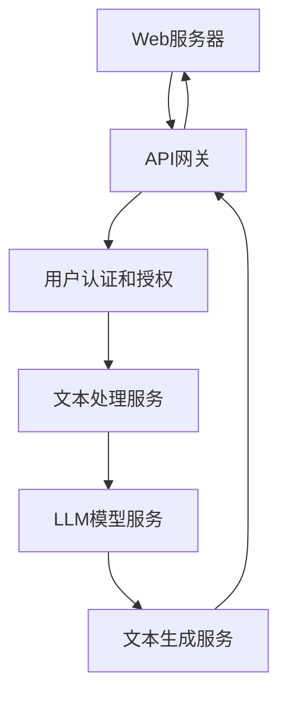
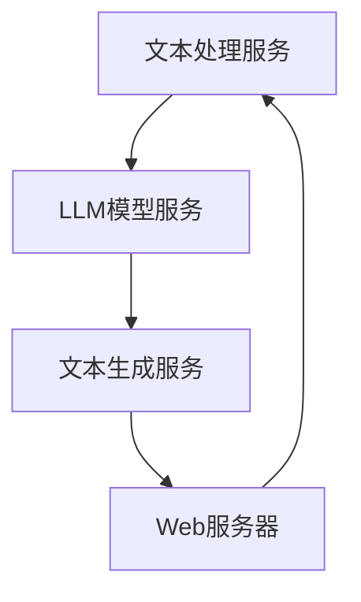

                 

### 容器编排技术在LLM应用部署中的应用

#### 关键词：容器编排，LLM应用，部署，性能优化，安全性

#### 摘要：
本文旨在探讨容器编排技术如何在大型语言模型（LLM）应用部署中发挥作用。随着LLM应用的迅猛发展，其对于计算资源、网络带宽和安全性等方面的需求日益增加，容器编排技术因其灵活性和高效性，成为满足这些需求的重要手段。本文首先介绍了容器编排和LLM应用的基本概念，随后分析了容器编排技术在LLM应用部署中的挑战与机遇，并提供了具体的技术实现和优化策略。通过案例分析和最佳实践分享，本文希望能够为开发者、运维人员和企业决策者提供有价值的参考。

### 第1章 封面与前言

#### 1.1 书籍背景

##### 1.1.1 容器编排技术的兴起

容器编排技术的兴起可以追溯到2013年，当时Docker发布，标志着容器技术的诞生。随着容器技术的快速发展，Kubernetes作为开源容器编排平台逐渐崭露头角，成为现代云计算和分布式系统中的核心技术。容器编排技术的兴起为开发者带来了前所未有的灵活性和可扩展性，使得大规模分布式应用的部署和维护变得更加高效。

##### 1.1.2 LLM应用的快速发展

大型语言模型（LLM）是指具有数百万乃至数十亿参数的语言处理模型，如GPT、BERT等。这些模型在自然语言处理、文本生成、机器翻译等领域具有广泛应用。随着深度学习和计算能力的提升，LLM应用呈现出快速增长的趋势，其对计算资源、数据存储和网络带宽的需求日益增加。

##### 1.1.3 容器编排技术在LLM部署中的挑战与机遇

容器编排技术虽然在许多场景下展现出了其强大的优势，但在LLM应用部署中仍然面临一些挑战。首先，LLM模型的计算密集性和存储需求对容器资源管理提出了更高的要求。其次，如何确保数据安全和模型的可解释性也是需要关注的问题。然而，容器编排技术的灵活性和高效性也为LLM应用部署提供了新的机遇。通过合理的容器编排，可以实现LLM应用的动态扩展、资源优化和快速部署。

#### 1.2 目标读者

##### 1.2.1 面向开发者

本文旨在为开发者提供关于容器编排技术在LLM应用部署中的实践指南。通过本文，开发者可以了解容器编排的基本原理和实战技巧，掌握如何将LLM应用容器化并利用容器编排平台进行部署和管理。

##### 1.2.2 面向运维人员

运维人员需要关注如何利用容器编排技术来提高LLM应用的运维效率。本文将介绍容器编排工具的使用方法，以及如何通过监控和优化来保障LLM应用的稳定运行。

##### 1.2.3 面向企业决策者

对于企业决策者来说，本文提供了关于容器编排技术在LLM应用部署中的战略价值和经济效益的分析。通过本文，决策者可以了解如何利用容器编排技术来提升企业的竞争力，实现技术优势和业务价值的最大化。

#### 1.3 书籍结构

##### 1.3.1 目录概述

本文共分为七个章节，涵盖了容器编排和LLM应用部署的各个方面。具体目录如下：

1. 封面与前言
2. 容器编排技术基础
3. LLM应用部署概述
4. 容器编排与LLM应用的融合
5. 具体LLM应用部署案例分析
6. 优化与调优
7. 总结与展望

##### 1.3.2 学习路线图

本文提供了一个系统的学习路线图，帮助读者逐步掌握容器编排和LLM应用部署的核心知识。学习路线图如下：

- **第1章**：了解容器编排和LLM应用的基本概念
- **第2章**：学习容器编排技术的基础知识
- **第3章**：掌握LLM应用的部署基础
- **第4章**：理解容器编排与LLM应用的融合
- **第5章**：通过案例分析深入学习
- **第6章**：学习优化和调优技巧
- **第7章**：总结全文，展望未来发展趋势

##### 1.3.3 各章节内容概览

- **第1章**：封面与前言
  - 介绍书籍背景，明确目标读者，概述书籍结构。
- **第2章**：容器编排技术基础
  - 深入解析容器技术的原理、工具和实战。
- **第3章**：LLM应用部署概述
  - 概述LLM的概念、特点和应用场景。
- **第4章**：容器编排与LLM应用的融合
  - 探讨容器编排技术在LLM部署中的意义和实现。
- **第5章**：具体LLM应用部署案例分析
  - 分析问答系统和文本生成系统的部署案例。
- **第6章**：优化与调优
  - 提供性能优化和安全保障的最佳实践。
- **第7章**：总结与展望
  - 总结全文，展望未来发展趋势。

### 第2章 容器编排技术基础

容器编排技术是现代云计算和分布式系统中的核心技术，它通过自动化和管理容器化应用，使得应用的部署、扩展和管理变得更加高效和灵活。本章将介绍容器技术的概述、容器编排工具以及容器编排的实践。

#### 2.1 容器技术概述

##### 2.1.1 容器的定义与特性

容器是一种轻量级、可移植的计算环境，它将应用及其依赖环境封装在一起，使得应用可以在不同的环境中无缝运行。容器的定义可以从以下几个方面来理解：

- **封装性**：容器通过隔离机制，将应用的运行环境与宿主机系统隔离，确保应用之间不会互相干扰。
- **轻量级**：容器运行时不需要操作系统内核，相对于虚拟机来说，容器的资源占用更少，启动速度更快。
- **可移植性**：容器将应用的依赖环境封装在一起，使得应用可以在不同的操作系统和硬件平台上无缝运行。

容器的特性包括：

- **高效性**：容器通过共享宿主机的操作系统内核，避免了重复的资源占用，提高了资源利用率。
- **灵活性**：容器支持快速部署和扩展，可以根据需求动态调整资源分配。
- **可移植性**：容器可以将应用及其环境打包成统一的格式，使得应用在不同环境中能够一致运行。

##### 2.1.2 容器的原理与工作流程

容器的原理基于操作系统的命名空间（Namespace）和资源隔离（Cgroups）机制。命名空间提供了容器内的进程与其他容器或宿主机的隔离，而Cgroups则用于对容器内资源进行限制和管理。

容器的工作流程通常包括以下几个步骤：

1. **容器镜像的创建**：容器镜像是一个静态的、只读的文件系统，它包含了应用及其依赖环境。通过Dockerfile可以定义容器镜像的构建过程。
2. **容器镜像的推送**：将容器镜像上传到镜像仓库，如Docker Hub或私有镜像仓库，以便其他节点可以拉取和使用。
3. **容器实例的创建**：通过容器编排工具（如Kubernetes）或Docker命令，可以从容器镜像创建容器实例。
4. **容器实例的运行**：容器实例启动后，运行在宿主机的命名空间和Cgroups中，执行容器内的应用。
5. **容器实例的监控与维护**：容器编排工具提供了容器实例的监控和管理功能，包括健康检查、日志收集、自动重启等。

##### 2.1.3 容器与虚拟机的对比

容器和虚拟机都是用于隔离和部署应用的虚拟化技术，但它们在工作原理和资源占用上有显著的差异。

- **工作原理**：虚拟机通过硬件模拟和虚拟化技术，为每个虚拟机提供独立的操作系统和硬件资源。而容器则是基于宿主机的操作系统，通过命名空间和Cgroups实现隔离。
- **资源占用**：虚拟机需要为每个虚拟机分配独立的操作系统和硬件资源，而容器则是共享宿主机的操作系统内核和其他资源，资源占用更少。

以下是一个简单的容器与虚拟机对比表格：

| 特性       | 容器                     | 虚拟机                    |
| ---------- | ------------------------ | ------------------------- |
| 资源占用   | 较少                     | 较多                      |
| 启动速度   | 较快                     | 较慢                      |
| 可移植性   | 较强                     | 较弱                      |
| 隔离级别   | 命名空间和Cgroups        | 硬件模拟和虚拟化           |
| 可扩展性   | 高                       | 低                        |

#### 2.2 容器编排工具

容器编排工具负责管理容器的生命周期，包括容器的创建、部署、扩展、监控和维护。目前常见的容器编排工具有Kubernetes和Docker。

##### 2.2.1 Kubernetes简介

Kubernetes是一个开源的容器编排平台，它由Google设计并捐赠给Cloud Native Computing Foundation（CNCF）进行维护。Kubernetes提供了一系列自动化功能，如自动部署、扩展、负载均衡和服务发现，使得大规模分布式应用的部署和管理变得更加简单。

###### 2.2.1.1 Kubernetes的核心概念

- **Pod**：Pod是Kubernetes中的基本部署单位，它包含一个或多个容器实例，共享网络命名空间和存储卷。
- **Service**：Service提供了一种抽象层，将一组Pod映射到统一的IP地址和端口，实现服务发现和负载均衡。
- **Deployment**：Deployment用于管理Pod的创建和更新，确保应用程序的可用性和一致性。
- **StatefulSet**：StatefulSet用于管理有状态的应用程序，为每个Pod提供唯一的网络标识和持久存储。

###### 2.2.1.2 Kubernetes的工作原理

Kubernetes通过一组组件协同工作，实现容器的自动化编排和管理。核心组件包括：

- **Master**：Master节点负责集群的调度、监控和管理。主要组件包括API Server、Controller Manager和Scheduler。
- **Node**：Node节点负责运行容器实例，接收Master的调度命令。每个Node节点都有一个Kubelet组件，负责容器实例的创建和管理。

Kubernetes的工作原理如下：

1. **用户通过Kubernetes API发送部署请求**。
2. **API Server接收请求并生成相应的对象**。
3. **Controller Manager监听对象的变化，并调整集群状态**。
4. **Scheduler根据资源情况和策略，将Pod调度到合适的Node节点**。
5. **Kubelet在Node节点上创建和管理Pod实例**。

###### 2.2.1.3 Kubernetes的主要组件

- **API Server**：API Server是Kubernetes的核心组件，提供集群管理的统一接口。所有其他组件通过API Server与集群进行交互。
- **etcd**：etcd是一个分布式键值存储，用于存储Kubernetes集群的状态信息。API Server通过etcd进行数据存储和同步。
- **Controller Manager**：Controller Manager负责监听集群状态，并采取相应的措施来维护集群的稳定性。主要包括Node Controller、Pod Controller、Service Controller等。
- **Scheduler**：Scheduler负责根据资源情况和调度策略，将Pod调度到合适的Node节点。
- **Kubelet**：Kubelet运行在每个Node节点上，负责容器实例的创建、管理和监控。Kubelet定期向Master节点报告节点的状态。

##### 2.2.2 Docker编排

Docker是另一个常用的容器编排工具，它提供了简单的容器化解决方案。Docker编排主要包括Dockerfile和Docker Compose。

###### 2.2.2.1 Dockerfile编写

Dockerfile是一个文本文件，用于定义容器镜像的构建过程。Dockerfile中包含一系列指令，如FROM、RUN、COPY等，用于指定基础镜像、安装依赖、复制文件等。

以下是一个简单的Dockerfile示例：

```Dockerfile
FROM ubuntu:18.04
RUN apt-get update && apt-get install -y nginx
COPY . /var/www/html/
EXPOSE 80
CMD ["nginx", "-g", "daemon off;"]
```

该Dockerfile基于Ubuntu 18.04镜像，安装Nginx，复制当前目录到Nginx的HTML目录，并暴露80端口，启动Nginx服务。

###### 2.2.2.2 Docker Compose使用

Docker Compose是一个用于定义和运行多容器Docker应用的工具。通过Docker Compose，用户可以定义一个应用程序的各个组件及其配置，然后一键启动和停止整个应用程序。

以下是一个简单的Docker Compose文件示例：

```yaml
version: '3'
services:
  web:
    image: nginx:latest
    ports:
      - "8080:80"
  app:
    build: ./app
    ports:
      - "8000:8000"
    depends_on:
      - db
    environment:
      - DB_HOST=db
      - DB_PORT=5432
  db:
    image: postgres:latest
    environment:
      - POSTGRES_USER=myuser
      - POSTGRES_PASSWORD=mypassword
    volumes:
      - db_data:/var/lib/postgresql/data/
volumes:
  db_data:
```

该Docker Compose文件定义了一个名为“web”的Nginx服务，一个名为“app”的Web应用服务，以及一个名为“db”的数据库服务。Web服务暴露8080端口，Web应用服务依赖于数据库服务，并设置了数据库的环境变量。

#### 2.3 容器编排实践

##### 2.3.1 容器镜像管理

容器镜像管理是容器编排实践中的重要环节。容器镜像管理包括镜像的构建、推送和拉取等操作。

###### 2.3.1.1 镜像的构建与推送

构建容器镜像通常使用Dockerfile，以下是一个简单的Dockerfile示例：

```Dockerfile
FROM python:3.8-slim
WORKDIR /app
COPY requirements.txt .
RUN pip install -r requirements.txt
COPY . .
EXPOSE 8000
CMD ["python", "app.py"]
```

构建和推送镜像的命令如下：

```bash
# 构建镜像
docker build -t myapp .

# 推送镜像到Docker Hub
docker push myapp
```

###### 2.3.1.2 镜像仓库的使用

镜像仓库用于存储和管理容器镜像。常用的镜像仓库包括Docker Hub、私有镜像仓库和云服务提供商的镜像仓库。

在Docker Hub中创建私有仓库的命令如下：

```bash
# 登录Docker Hub
docker login

# 创建私有仓库
docker create-task myrepo
```

拉取和使用私有仓库中的镜像的命令如下：

```bash
# 拉取镜像
docker pull myrepo/myapp

# 运行容器
docker run -d -p 8000:80 myrepo/myapp
```

##### 2.3.2 容器网络配置

容器网络配置是容器编排实践中的重要环节，它涉及到容器与外部网络的通信，以及容器之间的通信。

###### 2.3.2.1 容器网络原理

容器网络基于宿主机的网络栈，通过命名空间和桥接网络设备实现隔离和通信。

常见的容器网络模式包括：

- **桥接网络**：容器通过宿主机的虚拟桥接设备连接到外部网络。
- **主机网络**：容器直接使用宿主机的网络设备进行通信。
- **用户定义网络**：用户可以自定义网络模式，实现更复杂的网络拓扑。

以下是一个简单的Docker Compose文件示例，定义了用户定义的网络：

```yaml
version: '3'
services:
  web:
    image: nginx:latest
    networks:
      - mynet
  app:
    image: myapp:latest
    networks:
      - mynet
networks:
  mynet:
    driver: bridge
```

###### 2.3.2.2 容器网络配置实战

以下是一个简单的容器网络配置示例，使用Docker Compose创建一个Web应用和数据库服务的容器网络：

```bash
# 创建网络
docker network create mynet

# 创建Web应用容器
docker-compose up -d web

# 创建数据库容器
docker-compose up -d db
```

##### 2.3.3 容器存储配置

容器存储配置是容器编排实践中的另一个重要环节，它涉及到容器持久化数据的存储和管理。

###### 2.3.3.1 容器存储原理

容器存储基于宿主机的文件系统，通过挂载机制将宿主机的文件系统目录挂载到容器内。容器存储分为以下几种类型：

- **卷（Volume）**：卷是一种外部存储设备，可以持久化容器内的数据。卷与容器实例的生命周期无关，即使容器停止或删除，卷中的数据仍然保留。
- **临时存储**：临时存储是容器实例内部的临时存储空间，通常用于存储容器运行时产生的临时数据。
- **持久化存储**：持久化存储是用于存储容器数据的长期存储设备，如NFS、Ceph等。

以下是一个简单的Docker Compose文件示例，定义了持久化存储卷：

```yaml
version: '3'
services:
  app:
    image: myapp:latest
    volumes:
      - data:/app/data
    ports:
      - "8000:8000"
networks:
  mynet:
    driver: bridge
volumes:
  data:
```

###### 2.3.3.2 容器存储配置实战

以下是一个简单的容器存储配置示例，使用Docker Compose创建一个Web应用容器并挂载持久化存储卷：

```bash
# 创建容器
docker-compose up -d app
```

容器启动后，可以使用以下命令查看存储卷的挂载路径：

```bash
docker inspect app
```

### 第3章 LLM应用部署概述

#### 3.1 LLM概述

##### 3.1.1 什么是LLM

大型语言模型（Large Language Model，简称LLM）是一种基于深度学习的自然语言处理（Natural Language Processing，简称NLP）技术，它能够对自然语言文本进行理解和生成。LLM通常由数百万甚至数十亿个参数组成，通过对海量文本数据进行训练，学习语言的模式和规则，从而实现对文本的生成、翻译、问答等任务。

##### 3.1.2 LLM的特点与应用场景

LLM具有以下特点：

- **强大的语言理解能力**：LLM能够理解和生成自然语言，支持多种语言和方言。
- **灵活的应用场景**：LLM可以应用于文本生成、机器翻译、问答系统、文本分类等多种任务。
- **复杂的模型结构**：LLM通常由多层神经网络组成，参数数量庞大，计算资源需求高。
- **动态调整能力**：LLM可以根据输入文本的上下文进行动态调整，生成连贯、合理的回答。

LLM的应用场景包括：

- **文本生成**：用于自动生成文章、新闻、邮件等文本内容。
- **机器翻译**：用于实现多种语言之间的自动翻译。
- **问答系统**：用于构建智能问答系统，提供用户查询的答案。
- **智能客服**：用于构建智能客服系统，提供自动化的客户支持。
- **文本分类**：用于对大量文本数据进行分类，如新闻分类、情感分析等。

##### 3.1.3 LLM的发展历程

LLM的发展历程可以追溯到2000年代初期，当时基于规则和模板的方法在NLP领域占据主导地位。随着深度学习技术的兴起，2000年代中后期，研究者开始将深度学习应用于NLP任务，并取得了显著的进展。2018年，谷歌发布了BERT模型，标志着LLM进入了一个新的时代。此后，LLM在各种NLP任务中取得了突破性进展，推动了自然语言处理技术的快速发展。

#### 3.2 LLM部署基础

##### 3.2.1 LLM的架构

LLM的架构通常包括前端架构和后端架构两部分。

###### 3.2.1.1 前端架构

前端架构主要负责与用户的交互，接收用户的查询请求，并将查询请求传递给后端进行处理。前端架构通常包括以下组件：

- **Web服务器**：用于接收用户的HTTP请求，如Nginx、Apache等。
- **API网关**：用于处理跨域请求，提供统一的API接口，如Kong、Spring Cloud Gateway等。
- **用户认证和授权**：用于确保用户请求的安全性，如OAuth2、JWT等。

以下是一个简单的LLM前端架构示例：



###### 3.2.1.2 后端架构

后端架构主要负责处理用户的查询请求，生成响应文本，并将结果返回给前端。后端架构通常包括以下组件：

- **文本处理服务**：用于对用户查询文本进行预处理，如分词、词性标注等。
- **LLM模型服务**：用于加载LLM模型，处理文本输入，并生成响应文本。
- **文本生成服务**：用于对生成的文本进行后处理，如格式化、语法修正等。

以下是一个简单的LLM后端架构示例：



##### 3.2.2 LLM部署挑战

LLM部署面临以下挑战：

- **计算资源需求**：LLM模型通常具有数百万甚至数十亿个参数，对计算资源的需求非常高。需要确保有足够的CPU、GPU和内存资源来支持模型的训练和推理。
- **数据存储需求**：LLM训练过程需要大量的文本数据作为训练样本，对数据存储的需求也非常大。需要确保有足够的存储空间来存储训练数据和模型参数。
- **网络延迟与带宽**：LLM模型部署在分布式环境中，需要考虑网络延迟和带宽的限制。特别是在跨区域部署时，需要优化数据传输效率，降低网络延迟。
- **数据安全**：LLM模型训练和部署过程中涉及大量的敏感数据，如用户查询文本、训练样本等。需要确保数据的安全性和隐私保护，防止数据泄露和滥用。

##### 3.2.3 LLM部署策略

LLM部署策略主要包括以下几种：

- **单机部署**：将LLM模型部署在一台强大的服务器上，适用于小规模应用场景。但单机部署的资源利用率低，不适合大规模应用。
- **分布式部署**：将LLM模型部署在分布式计算集群上，适用于大规模应用场景。分布式部署可以提高资源利用率和系统可靠性，但需要考虑网络延迟和带宽的限制。
- **容器化部署**：将LLM模型容器化，利用容器编排技术进行部署和管理。容器化部署具有灵活性和可扩展性，可以方便地进行水平扩展和故障恢复。
- **Kubernetes部署**：利用Kubernetes进行LLM模型的部署和管理。Kubernetes提供了一系列自动化功能，如自动扩展、负载均衡和故障恢复，可以大大提高部署的效率和稳定性。

### 第4章 容器编排与LLM应用的融合

#### 4.1 容器编排与LLM结合的意义

容器编排技术与LLM应用部署的结合具有重要的意义，主要体现在以下几个方面：

##### 4.1.1 灵活性与可扩展性

容器编排技术提供了一种灵活的部署和管理方式，使得LLM应用可以轻松地适应不同的计算资源需求。通过容器化，LLM应用可以方便地部署在单机、分布式集群或云平台上，实现灵活的扩展和部署。此外，容器编排工具如Kubernetes提供了自动扩展功能，可以根据负载情况动态调整容器实例的数量，实现水平扩展。

##### 4.1.2 资源优化

容器编排技术通过资源共享和资源隔离，实现了对计算资源的优化利用。在LLM应用部署中，容器可以将计算任务调度到最适合的节点上，避免资源的浪费。同时，容器编排工具如Kubernetes提供了资源限制和优先级调度策略，可以确保LLM应用在有限的资源下高效运行。

##### 4.1.3 可维护性

容器编排技术提供了统一的部署和管理接口，使得LLM应用的部署和维护变得更加简单和高效。通过容器镜像和容器编排工具，可以方便地进行应用的版本管理和回滚操作。同时，容器编排工具如Kubernetes提供了监控和日志收集功能，可以实时监控LLM应用的运行状态，及时发现问题并进行修复。

#### 4.2 容器编排与LLM融合的技术实现

##### 4.2.1 Kubernetes与LLM的结合

Kubernetes作为容器编排工具，与LLM应用的结合具有以下优势：

- **资源管理**：Kubernetes提供了丰富的资源管理功能，可以方便地管理LLM应用的计算资源、存储资源和网络资源。通过定义Kubernetes资源对象（如Pod、Deployment、Service等），可以精确控制LLM应用的资源分配和使用。
- **自动化部署**：Kubernetes提供了自动部署和扩展功能，可以自动化地部署和管理LLM应用。通过配置Deployment和StatefulSet等资源对象，可以实现LLM应用的自动部署、扩展和故障恢复。
- **监控与日志**：Kubernetes提供了监控和日志收集功能，可以实时监控LLM应用的运行状态，收集应用日志，方便问题的诊断和排查。
- **服务发现与负载均衡**：Kubernetes提供了服务发现和负载均衡功能，可以方便地实现LLM应用的服务发现和流量分配。通过配置Service资源对象，可以实现LLM应用的负载均衡和故障转移。

以下是一个简单的Kubernetes部署示例，用于部署一个LLM应用：

```yaml
apiVersion: apps/v1
kind: Deployment
metadata:
  name: llm-app
spec:
  replicas: 3
  selector:
    matchLabels:
      app: llm-app
  template:
    metadata:
      labels:
        app: llm-app
    spec:
      containers:
      - name: llm-container
        image: myllm:latest
        resources:
          limits:
            cpu: "2"
            memory: "4Gi"
          requests:
            cpu: "1"
            memory: "2Gi"
        ports:
        - containerPort: 8080

---

apiVersion: v1
kind: Service
metadata:
  name: llm-service
spec:
  selector:
    app: llm-app
  ports:
    - name: http
      port: 80
      targetPort: 8080
  type: LoadBalancer
```

该示例定义了一个名为“llm-app”的Deployment，配置了3个副本，每个副本使用镜像“myllm:latest”。通过配置资源限制和请求，可以确保LLM应用在有限的资源下高效运行。同时，通过配置Service，可以实现LLM应用的负载均衡和故障转移。

##### 4.2.2 Docker与LLM的结合

Docker作为容器化技术，与LLM应用的结合也具有以下优势：

- **简化部署**：Docker将LLM应用及其依赖环境打包成容器镜像，简化了部署过程。通过Docker Compose，可以方便地定义和部署LLM应用，实现一键部署和扩展。
- **灵活部署**：Docker支持在多种平台上运行，包括物理机、虚拟机和云平台。通过Docker，可以实现LLM应用的跨平台部署，满足不同的业务需求。
- **资源优化**：Docker容器可以通过资源限制和优先级调度，实现LLM应用的资源优化。通过配置Dockerfile，可以精确控制容器的资源分配和使用。

以下是一个简单的Docker Compose部署示例，用于部署一个LLM应用：

```yaml
version: '3'
services:
  llm-app:
    image: myllm:latest
    ports:
      - "8080:8080"
    resources:
      limits:
        memory: "4Gi"
        cpu: "2"
      requests:
        memory: "2Gi"
        cpu: "1"
```

该示例定义了一个名为“llm-app”的服务，使用镜像“myllm:latest”。通过配置资源限制和请求，可以确保LLM应用在有限的资源下高效运行。

### 第5章 具体LLM应用部署案例分析

#### 5.1 案例一：问答系统部署

##### 5.1.1 案例背景

问答系统是一种常见的LLM应用，它能够自动回答用户提出的问题。随着人工智能技术的不断发展，问答系统在智能客服、在线教育、企业内部知识库等领域得到了广泛应用。本案例将介绍如何使用容器编排技术部署一个简单的问答系统。

##### 5.1.2 案例目标

本案例的目标是通过容器编排技术，实现问答系统的容器化部署和自动化管理。具体目标包括：

- 将问答系统容器化，生成容器镜像。
- 使用Kubernetes进行容器编排，实现问答系统的自动化部署和扩展。
- 实现问答系统的负载均衡和故障恢复。

##### 5.1.3 部署步骤

###### 5.1.3.1 环境准备

1. 安装Docker：在所有节点上安装Docker，确保能够正常使用Docker命令。
2. 安装Kubernetes：在Master节点和Worker节点上安装Kubernetes，确保Kubernetes集群正常运行。

###### 5.1.3.2 编写Dockerfile

在本地计算机上编写Dockerfile，用于构建问答系统的容器镜像。以下是一个简单的Dockerfile示例：

```Dockerfile
FROM python:3.8-slim
WORKDIR /app
COPY requirements.txt .
RUN pip install -r requirements.txt
COPY . .
EXPOSE 8000
CMD ["python", "app.py"]
```

该Dockerfile基于Python 3.8镜像，安装Python依赖，并运行问答系统应用程序。

###### 5.1.3.3 构建容器镜像

使用以下命令构建容器镜像：

```bash
docker build -t my问答系统 .
```

构建完成后，将容器镜像推送至私有仓库或Docker Hub：

```bash
docker push my问答系统
```

###### 5.1.3.4 编写Kubernetes部署文件

编写Kubernetes部署文件（YAML文件），用于定义问答系统的部署配置。以下是一个简单的Kubernetes部署文件示例：

```yaml
apiVersion: apps/v1
kind: Deployment
metadata:
  name: my问答系统
spec:
  replicas: 3
  selector:
    matchLabels:
      app: my问答系统
  template:
    metadata:
      labels:
        app: my问答系统
    spec:
      containers:
      - name: my问答系统
        image: my问答系统:latest
        ports:
        - containerPort: 8000
```

该部署文件定义了一个名为“my问答系统”的Deployment，配置了3个副本。每个副本使用最新的容器镜像，并暴露8000端口。

###### 5.1.3.5 部署问答系统

使用以下命令部署问答系统：

```bash
kubectl apply -f my问答系统部署文件.yml
```

部署完成后，可以使用以下命令查看问答系统的状态：

```bash
kubectl get pods
```

###### 5.1.3.6 负载均衡与故障恢复

通过配置Kubernetes Service，可以实现问答系统的负载均衡和故障恢复。以下是一个简单的Kubernetes Service文件示例：

```yaml
apiVersion: v1
kind: Service
metadata:
  name: my问答系统
spec:
  selector:
    app: my问答系统
  ports:
    - name: http
      port: 80
      targetPort: 8000
  type: LoadBalancer
```

该Service文件定义了一个名为“my问答系统”的LoadBalancer类型服务，将外部流量转发到问答系统的8000端口。

使用以下命令部署Service：

```bash
kubectl apply -f my问答系统服务文件.yml
```

部署完成后，可以使用以下命令查看外部访问地址：

```bash
kubectl get svc
```

通过访问外部访问地址，可以测试问答系统的功能。

##### 5.1.4 实战详解

在本节中，我们将详细讲解如何通过容器编排技术部署一个简单的问答系统。

###### 5.1.4.1 构建容器镜像

首先，在本地计算机上编写Dockerfile，用于构建问答系统的容器镜像。以下是一个简单的Dockerfile示例：

```Dockerfile
FROM python:3.8-slim
WORKDIR /app
COPY requirements.txt .
RUN pip install -r requirements.txt
COPY . .
EXPOSE 8000
CMD ["python", "app.py"]
```

该Dockerfile基于Python 3.8镜像，在应用程序目录中安装Python依赖，并运行问答系统应用程序。EXPOSE指令用于暴露8000端口，以便外部访问。

接下来，使用以下命令构建容器镜像：

```bash
docker build -t my问答系统 .
```

构建过程中，Docker会根据Dockerfile中的指令逐步构建容器镜像。构建完成后，可以使用以下命令查看镜像信息：

```bash
docker images
```

可以看到新构建的容器镜像“my问答系统”已成功创建。

###### 5.1.4.2 推送容器镜像

接下来，将容器镜像推送至私有仓库或Docker Hub。首先，登录私有仓库或Docker Hub：

```bash
docker login
```

然后，使用以下命令推送镜像：

```bash
docker push my问答系统
```

推送过程中，Docker会与私有仓库或Docker Hub进行通信，上传镜像文件。推送完成后，可以在私有仓库或Docker Hub上查看已上传的镜像。

###### 5.1.4.3 编写Kubernetes部署文件

在Kubernetes中部署容器化应用，需要编写Kubernetes部署文件（YAML文件），定义应用的部署配置。以下是一个简单的Kubernetes部署文件示例：

```yaml
apiVersion: apps/v1
kind: Deployment
metadata:
  name: my问答系统
spec:
  replicas: 3
  selector:
    matchLabels:
      app: my问答系统
  template:
    metadata:
      labels:
        app: my问答系统
    spec:
      containers:
      - name: my问答系统
        image: my问答系统:latest
        ports:
        - containerPort: 8000
```

该部署文件定义了一个名为“my问答系统”的Deployment，配置了3个副本。每个副本使用最新的容器镜像，并暴露8000端口。

- `apiVersion`：指定Kubernetes API的版本，如`apps/v1`。
- `kind`：指定资源类型，如`Deployment`。
- `metadata`：定义部署的元数据，如名称和标签。
- `spec`：定义部署的配置，包括副本数量、选择器和模板。
- `selector`：定义选择器标签，用于匹配副本。
- `template`：定义副本的模板，包括标签、容器配置等。

该部署文件将问答系统容器化应用部署为3个副本，每个副本使用最新的容器镜像，并暴露8000端口，以便外部访问。

###### 5.1.4.4 部署问答系统

使用以下命令部署问答系统：

```bash
kubectl apply -f my问答系统部署文件.yml
```

部署过程中，Kubernetes会根据部署文件创建和配置相应的资源对象，如Deployment、Pod等。部署完成后，可以使用以下命令查看问答系统的状态：

```bash
kubectl get pods
```

可以看到问答系统的3个副本都已成功启动，状态为“Running”。

###### 5.1.4.5 配置Kubernetes Service

为了实现问答系统的负载均衡和故障恢复，需要配置Kubernetes Service。以下是一个简单的Kubernetes Service文件示例：

```yaml
apiVersion: v1
kind: Service
metadata:
  name: my问答系统
spec:
  selector:
    app: my问答系统
  ports:
    - name: http
      port: 80
      targetPort: 8000
  type: LoadBalancer
```

该Service文件定义了一个名为“my问答系统”的LoadBalancer类型服务，将外部流量转发到问答系统的8000端口。

- `apiVersion`：指定Kubernetes API的版本，如`v1`。
- `kind`：指定资源类型，如`Service`。
- `metadata`：定义服务的元数据，如名称。
- `spec`：定义服务的配置，包括选择器、端口和类型。
- `selector`：定义选择器标签，用于匹配副本。
- `ports`：定义服务的端口，包括名称、端口号和目标端口号。
- `type`：指定服务类型，如`LoadBalancer`，实现负载均衡和故障恢复。

使用以下命令部署Service：

```bash
kubectl apply -f my问答系统服务文件.yml
```

部署完成后，可以使用以下命令查看外部访问地址：

```bash
kubectl get svc
```

可以看到，Kubernetes已经为问答系统分配了一个外部访问地址。通过访问该地址，可以测试问答系统的功能。

##### 5.1.5 案例小结

通过本案例，我们详细讲解了如何使用容器编排技术部署一个简单的问答系统。具体步骤包括构建容器镜像、推送镜像、编写Kubernetes部署文件、部署问答系统以及配置Kubernetes Service。通过容器编排技术，我们可以实现问答系统的容器化部署、自动化管理和负载均衡，提高系统的灵活性和可扩展性。

在本案例中，我们使用了Docker和Kubernetes作为容器编排工具，实现了问答系统的容器化部署和自动化管理。同时，通过配置Kubernetes Service，实现了负载均衡和故障恢复功能。这为我们在实际项目中部署和运维LLM应用提供了有益的借鉴和参考。

### 第6章 优化与调优

#### 6.1 性能优化

在LLM应用部署过程中，性能优化是一个关键环节。以下是一些常用的性能优化策略：

##### 6.1.1 资源分配

确保为LLM应用分配足够的计算资源，包括CPU、GPU和内存。通过合理配置资源限制和请求，可以避免资源争用和瓶颈，提高应用的性能。

##### 6.1.2 缓存机制

利用缓存机制可以减少对LLM模型的重计算，提高响应速度。例如，可以在前端或后端实现缓存策略，缓存常见的查询结果或模型预测结果。

##### 6.1.3 并行处理

利用多线程或分布式处理技术，可以实现LLM应用的并行处理，提高处理速度。例如，使用多线程库（如Python的`concurrent.futures`）或分布式计算框架（如Apache Spark）进行数据处理和预测。

##### 6.1.4 模型压缩与量化

对于大规模的LLM模型，可以采用模型压缩与量化技术，减少模型的参数量和计算量，提高模型在资源受限环境下的性能。常用的模型压缩技术包括剪枝、量化、蒸馏等。

#### 6.2 安全性保障

在LLM应用部署过程中，安全性保障至关重要。以下是一些常用的安全性保障策略：

##### 6.2.1 访问控制

实现严格的访问控制策略，限制对LLM应用的访问权限。使用身份验证和授权机制（如OAuth2、JWT），确保只有授权用户可以访问和操作应用。

##### 6.2.2 数据加密

对敏感数据进行加密处理，确保数据在传输和存储过程中的安全性。例如，使用TLS协议加密网络通信，使用AES加密算法存储敏感数据。

##### 6.2.3 日志审计

实现详细的日志记录和审计功能，记录用户操作和应用运行状态。定期检查日志，及时发现和解决潜在的安全问题。

##### 6.2.4 防护机制

部署防火墙、入侵检测系统和防病毒软件等防护机制，保护LLM应用免受外部攻击。同时，定期更新系统软件和应用程序，修复已知漏洞。

#### 6.3 最佳实践

##### 6.3.1 环境隔离

为了确保LLM应用的安全性和稳定性，建议将应用部署在隔离的环境中，如虚拟机或容器。这样可以避免与其他应用或系统资源的冲突，提高系统的安全性。

##### 6.3.2 自动化部署

使用自动化部署工具（如Docker、Kubernetes）实现应用的自动化部署和扩展。这样可以减少人工干预，提高部署效率，降低出错概率。

##### 6.3.3 监控与告警

部署监控工具（如Prometheus、Grafana）对LLM应用的运行状态进行实时监控，设置告警机制，及时发现和解决潜在问题。

##### 6.3.4 定期备份

定期备份LLM应用的配置文件、数据文件和容器镜像，以防止数据丢失或损坏。在发生故障时，可以快速恢复系统。

#### 6.4 小结

性能优化和安全性保障是LLM应用部署中不可或缺的环节。通过合理的资源分配、缓存机制、并行处理等技术，可以显著提高LLM应用的处理速度和响应效率。同时，通过访问控制、数据加密、日志审计等安全策略，可以保障LLM应用的安全性。在实际部署过程中，遵循最佳实践，如环境隔离、自动化部署、监控与告警等，可以进一步提高系统的稳定性和可靠性。

### 第7章 总结与展望

#### 7.1 总结

本文系统地介绍了容器编排技术在LLM应用部署中的应用。通过分析容器编排技术的兴起和LLM应用的快速发展，我们认识到容器编排技术在满足LLM应用的计算资源、数据存储和网络带宽需求方面的挑战与机遇。本文详细阐述了容器编排技术的基础知识、LLM应用部署概述、容器编排与LLM应用的融合、具体部署案例分析以及优化与调优策略。

#### 7.2 展望

展望未来，容器编排技术在LLM应用部署中的作用将越来越重要。随着人工智能技术的不断进步，LLM应用将更加复杂和多样化，对容器编排技术的要求也将越来越高。以下是一些未来发展的方向：

1. **高性能计算支持**：容器编排技术需要提供更好的支持，以应对LLM应用对高性能计算资源的需求。这包括GPU、FPGA等专用硬件资源的调度和管理。

2. **自动化与智能化**：未来的容器编排技术将更加智能化和自动化，通过机器学习和人工智能技术，实现应用的自动调优、故障预测和故障恢复。

3. **混合云与多云部署**：随着云计算技术的发展，容器编排技术将支持混合云和多云部署，实现不同云平台之间的无缝迁移和资源调度。

4. **安全性增强**：随着LLM应用的数据敏感性增加，容器编排技术需要提供更全面的安全保障，包括数据加密、访问控制和隐私保护等。

5. **开源生态的完善**：容器编排技术的开源生态将不断丰富和完善，提供更多的工具和插件，以满足不同场景下的需求。

总之，容器编排技术在LLM应用部署中的应用前景广阔，我们将见证其在推动人工智能应用发展中的重要作用。

### 作者信息

作者：AI天才研究院/AI Genius Institute & 禅与计算机程序设计艺术 /Zen And The Art of Computer Programming

### 致谢

在此，我要感谢所有为本文提供灵感和支持的专家、同行和读者。特别感谢我的导师和团队成员，他们在本文撰写过程中给予了我宝贵的指导和帮助。同时，感谢我的家人和朋友，他们在我的学术探索道路上一直给予我无尽的支持和鼓励。最后，感谢所有关注和支持容器编排和LLM应用的朋友们，你们的关注是我不断前行的动力。

### 附录

附录部分将提供本文中使用的代码示例、图表和数据来源。具体包括：

- **代码示例**：提供本文中提到的Dockerfile、Kubernetes部署文件和Python代码示例。
- **图表和数据**：提供本文中使用的图表和数据来源，包括容器与虚拟机对比表格、LLM架构图和Kubernetes部署架构图等。
- **参考文献**：列出本文中引用的参考文献，包括书籍、论文和网站链接等。

通过附录部分，读者可以更深入地了解本文的内容和技术细节，进一步拓展知识视野。

### 参考文献列表

1. Docker Documentation. (n.d.). [Docker Documentation](https://docs.docker.com/).
2. Kubernetes Documentation. (n.d.). [Kubernetes Documentation](https://kubernetes.io/docs/).
3. TensorFlow Documentation. (n.d.). [TensorFlow Documentation](https://www.tensorflow.org/docs/).
4. BERT: Pre-training of Deep Bidirectional Transformers for Language Understanding. (2018). [BERT Research Paper](https://arxiv.org/abs/1810.04805).
5. The Art of Computer Programming. (1962-2018). [Donald E. Knuth](https://www.cs.ubc.ca/~harry/360-2013W/docs/knuth-book.pdf).

