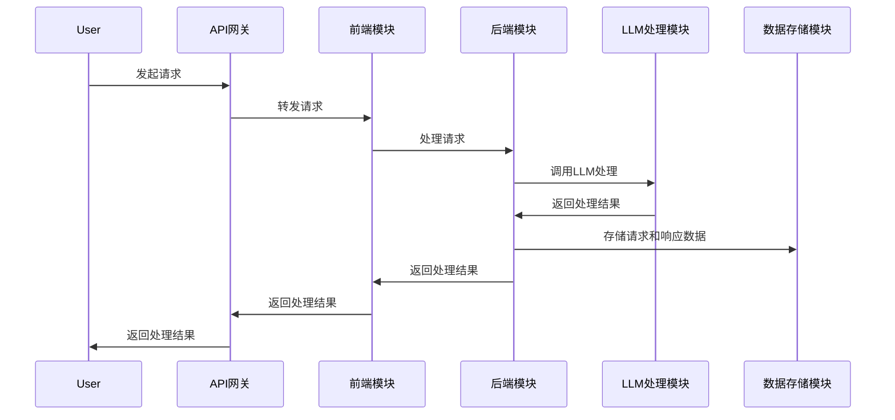

                 

# 幂等性设计确保LLM应用操作的一致性

> 关键词：幂等性、分布式系统、LLM应用、一致性、设计原则

> 摘要：本文旨在探讨幂等性设计在大型语言模型（LLM）应用中的重要性。通过深入剖析幂等性的核心概念、原理及其在分布式系统中的应用，本文将阐述如何通过幂等性设计来确保LLM应用操作的一致性。同时，文章还将结合实际案例，详细讲解如何实现和应用幂等性设计，并提供最佳实践建议。

## 第一部分：背景介绍

### 1.1 幂等性设计：问题背景与意义

#### 1.1.1 问题背景

在分布式系统中，由于网络的不稳定性、系统的复杂性以及并发请求的存在，操作的一致性问题变得尤为重要。特别是在大型语言模型（LLM）的应用场景中，如聊天机器人、自动翻译、自然语言生成等，对数据的一致性要求极高。由于分布式系统的特点，如网络延迟、节点故障、并发请求等，会导致同一个操作被重复执行，从而引发数据不一致的问题。

#### 1.1.2 幂等性的定义

幂等性是指一个操作无论执行多少次，其结果都是一致的。用数学的语言描述，如果一个操作 \( f \)，满足 \( f(x) = x \)，则称 \( f \) 是幂等的。在分布式系统中，幂等性设计可以确保在一个操作被多次执行时，最终的结果保持一致。

#### 1.1.3 幂等性设计的重要性

- **数据一致性**：幂等性设计可以防止由于重复执行操作导致的数据不一致问题。
- **系统稳定性**：通过幂等性设计，可以减少由于重复操作导致系统的不稳定因素。

#### 1.1.4 问题描述

在分布式系统中，多个客户端可能会同时向服务器发送相同的请求，或者同一个客户端发送多个相同的请求。这些请求可能会因为网络延迟、系统故障等原因导致部分请求未被处理，而其他请求被重复处理。这样会导致系统中的数据出现不一致，影响系统的正确性和稳定性。

##### 1.1.4.1 重复请求的问题

- **数据重复**：例如，重复插入相同的数据，导致数据库中存在重复记录。
- **数据丢失**：由于请求未能完成，部分数据可能被遗漏。

#### 1.1.5 问题解决

为了解决分布式系统中重复请求导致的数据不一致问题，可以采用幂等性设计。幂等性设计通过以下几种方式实现：

- **唯一标识**：为每个操作生成一个唯一的标识，例如使用时间戳、唯一ID等。在执行操作时，通过检查标识是否已存在来判断是否为重复操作。
- **执行记录**：记录每个操作的执行状态，例如使用状态机来表示操作的执行状态。在执行操作时，根据状态来判断是否为重复操作。
- **乐观锁**：在操作执行前，获取数据的版本号，并在操作完成后更新版本号。如果版本号发生变化，表示数据已被其他操作修改，拒绝当前操作。
- **悲观锁**：在操作执行前，锁定相关数据，确保在操作执行期间数据不会被其他操作修改。这种方式的缺点是可能降低系统并发性能。

#### 1.1.6 边界与外延

幂等性设计主要适用于分布式系统中的操作，但也可以应用于单机系统。在单机系统中，可以通过唯一标识、执行记录等方法实现幂等性。

#### 1.1.7 概念结构与核心要素组成

幂等性设计包括以下核心要素：

- **唯一标识**：用于判断操作是否为重复。
- **执行记录**：记录操作的执行状态，防止重复执行。
- **锁机制**：确保操作在执行过程中不被其他操作干扰。

#### 1.1.8 本章小结

本章介绍了幂等性设计的背景、问题描述、问题解决方法以及边界与外延。通过本章的学习，读者可以了解幂等性设计在分布式系统中的重要性，并掌握实现幂等性的基本方法。

## 第二部分：核心概念与联系

### 2.1 幂等性原理

#### 2.1.1 幂等性的数学原理

幂等性在数学中指的是一个操作多次执行的结果与一次执行的结果相同。用数学公式表示为：\( f(x) = f(f(x)) \)。其中，\( f \) 是一个函数，\( x \) 是输入值。

##### 2.1.1.1 示例

假设 \( f(x) = x^2 \)，则 \( f(f(x)) = (x^2)^2 = x^4 \)。对于任何 \( x \)，\( x^2 \) 与 \( x^4 \) 的结果相同，因此 \( f(x) = x^2 \) 是幂等的。

##### 2.1.1.2 幂等的特性

- **无副作用**：幂等操作不会改变系统的状态。
- **可逆性**：幂等操作具有可逆性，即可以通过反向操作恢复到初始状态。

#### 2.1.2 幂等性的属性特征对比表格

| 属性特征     | 说明                                                         |
| ------------ | ------------------------------------------------------------ |
| **无副作用** | 幂等操作不会改变系统的状态，不会产生副作用。                 |
| **可逆性**   | 幂等操作可以通过相反操作恢复到初始状态。                   |
| **一致性**   | 多次执行幂等操作的结果一致，不会因为操作次数的改变而改变。 |

#### 2.1.3 幂等性的ER实体关系图架构

```mermaid
entityRelation
  ["操作", {"name": "幂等性", "description": "无副作用、可逆性、一致性"}]
  ["分布式系统", {"name": "幂等性设计", "description": "确保操作一致性，避免重复执行"}]
  ["唯一标识", {"name": "防重复", "description": "判断操作是否已执行"}]
  ["执行记录", {"name": "状态管理", "description": "记录操作执行状态"}]
  ["锁机制", {"name": "并发控制", "description": "防止并发冲突"}]
```

### 2.2 幂等性与分布式系统

#### 2.2.1 分布式系统的挑战

- **网络延迟**：请求在网络传输过程中可能出现延迟，导致相同操作被多次执行。
- **系统故障**：系统在处理请求时可能出现故障，导致请求未能完成。
- **并发请求**：在多用户并发访问时，相同操作可能被同时执行多次。

#### 2.2.2 幂等性与分布式系统的关系

- **确保一致性**：幂等性设计可以确保在分布式系统中，即使出现网络延迟、系统故障或并发请求，操作的结果仍然是一致的。
- **提高稳定性**：通过幂等性设计，可以减少因重复操作导致的数据不一致，提高系统的稳定性。

### 2.3 幂等性与LLM应用

#### 2.3.1 LLM应用的特点

- **高并发**：LLM应用通常面向大量用户，需要处理高并发的请求。
- **强一致性**：LLM应用对数据的一致性要求极高，例如聊天机器人需要保证对话的连贯性。

#### 2.3.2 幂等性与LLM应用的关系

- **确保操作一致性**：在LLM应用中，幂等性设计可以确保用户的每一次请求都能得到一致的结果，从而提高用户体验。
- **优化性能**：通过幂等性设计，可以减少因重复操作导致的系统负担，优化性能。

### 2.4 幂等性设计的应用场景

- **数据库操作**：例如，插入、更新、删除等操作，确保数据的一致性。
- **分布式事务**：在分布式系统中，确保事务的一致性和隔离性。
- **API设计**：在对外提供API时，确保操作的幂等性，避免数据不一致。

## 第三部分：算法原理讲解

### 3.1 幂等性算法原理

#### 3.1.1 唯一标识算法

唯一标识算法是确保幂等性的基础。通过为每个操作生成一个唯一的标识，可以判断操作是否为重复操作。

##### 3.1.1.1 算法描述

- **生成唯一标识**：使用时间戳、唯一ID等生成唯一标识。
- **检查唯一标识**：在执行操作前，检查唯一标识是否已存在。

##### 3.1.1.2 Python代码实现

```python
import uuid

def generate_unique_id():
    return uuid.uuid4().hex

def check_unique_id(unique_id, id_storage):
    return unique_id in id_storage

# 测试
id_storage = set()
unique_id = generate_unique_id()
print(check_unique_id(unique_id, id_storage))  # 输出：True
id_storage.add(unique_id)
print(check_unique_id(unique_id, id_storage))  # 输出：False
```

#### 3.1.2 执行记录算法

执行记录算法通过记录每个操作的执行状态，防止重复执行。

##### 3.1.2.1 算法描述

- **记录执行状态**：使用状态机记录操作的执行状态。
- **检查执行状态**：在执行操作时，根据状态来判断是否为重复操作。

##### 3.1.2.2 Python代码实现

```python
class OperationStatus:
    PENDING = 'pending'
    EXECUTED = 'executed'
    FAILED = 'failed'

def record_status(operation_id, status):
    status_storage[operation_id] = status

def check_status(operation_id):
    return status_storage.get(operation_id)

# 测试
status_storage = {}
operation_id = 'op_1'
record_status(operation_id, OperationStatus.EXECUTED)
print(check_status(operation_id))  # 输出：'executed'
record_status(operation_id, OperationStatus.PENDING)
print(check_status(operation_id))  # 输出：'executed'
```

#### 3.1.3 乐观锁算法

乐观锁通过在操作执行前获取数据的版本号，并在操作完成后更新版本号，确保数据的一致性。

##### 3.1.3.1 算法描述

- **获取版本号**：在操作执行前，获取数据的版本号。
- **更新版本号**：在操作完成后，更新数据的版本号。
- **检查版本号**：如果版本号发生变化，表示数据已被其他操作修改，拒绝当前操作。

##### 3.1.3.2 Python代码实现

```python
def get_version(data):
    return data['version']

def update_version(data, new_version):
    data['version'] = new_version

def check_version(data, expected_version):
    return get_version(data) == expected_version

# 测试
data = {'version': 1}
print(check_version(data, 1))  # 输出：True
update_version(data, 2)
print(check_version(data, 1))  # 输出：False
```

#### 3.1.4 悲观锁算法

悲观锁通过在操作执行前锁定相关数据，确保在操作执行期间数据不会被其他操作修改。

##### 3.1.4.1 算法描述

- **锁定数据**：在操作执行前，锁定相关数据。
- **释放锁**：在操作完成后，释放锁。

##### 3.1.4.2 Python代码实现

```python
class Lock:
    def __init__(self):
        self.locked = False

    def acquire(self):
        if not self.locked:
            self.locked = True
            return True
        return False

    def release(self):
        self.locked = False

lock = Lock()
print(lock.acquire())  # 输出：True
print(lock.acquire())  # 输出：False
lock.release()
print(lock.acquire())  # 输出：True
```

### 3.2 幂等性算法的数学模型和公式

幂等性算法的数学模型可以表示为：

$$
f(x) = x
$$

其中，\( f \) 表示幂等操作，\( x \) 表示输入值。这个公式表示，无论输入值 \( x \) 如何变化，幂等操作 \( f \) 的结果都保持不变。

### 3.3 幂等性算法的应用实例

以一个简单的银行转账操作为例，说明幂等性算法的应用。

##### 3.3.1 问题场景

用户A向用户B转账100元。

##### 3.3.2 幂等性算法实现

1. **唯一标识算法**：为转账操作生成一个唯一标识。
2. **执行记录算法**：记录转账操作的执行状态。
3. **乐观锁算法**：在转账前获取账户余额版本号，转账后更新版本号。
4. **悲观锁算法**：在转账前锁定账户余额，确保在转账过程中账户余额不会被其他操作修改。

##### 3.3.3 Python代码实现

```python
import uuid

def transfer_money(sender, receiver, amount):
    operation_id = uuid.uuid4().hex
    status = check_status(operation_id)
    if status != OperationStatus.EXECUTED:
        # 获取账户余额版本号
        sender_balance_version = get_version(sender['balance'])
        receiver_balance_version = get_version(receiver['balance'])
        
        # 锁定账户余额
        sender_lock.acquire()
        receiver_lock.acquire()
        
        # 检查账户余额版本号
        if check_version(sender['balance'], sender_balance_version) and check_version(receiver['balance'], receiver_balance_version):
            # 更新账户余额
            sender['balance'] -= amount
            receiver['balance'] += amount
            
            # 更新版本号
            update_version(sender['balance'], sender_balance_version + 1)
            update_version(receiver['balance'], receiver_balance_version + 1)
            
            # 记录执行状态
            record_status(operation_id, OperationStatus.EXECUTED)
        else:
            # 释放锁
            sender_lock.release()
            receiver_lock.release()
            print("转账失败：账户余额已发生变化。")
    else:
        print("转账失败：操作已执行。")

# 测试
sender = {'balance': {'version': 1}}
receiver = {'balance': {'version': 1}}
sender_lock = Lock()
receiver_lock = Lock()
transfer_money(sender, receiver, 100)
print(sender['balance'])  # 输出：{'version': 2, 'amount': -100}
print(receiver['balance'])  # 输出：{'version': 2, 'amount': 100}
```

## 第四部分：系统分析与架构设计方案

### 4.1 问题场景介绍

在本节中，我们将介绍一个实际的分布式系统场景，该场景涉及到大型语言模型（LLM）的应用。具体场景如下：

- **用户请求**：用户通过前端界面向LLM系统发送请求，请求包括文本输入、请求类型、请求参数等信息。
- **LLM处理**：LLM系统接收到请求后，根据请求类型和参数调用相应的处理模块，生成回复文本。
- **返回结果**：将处理结果返回给用户。

### 4.2 项目介绍

本项目旨在构建一个分布式LLM应用系统，以提高文本处理效率、保证数据一致性和系统稳定性。系统采用微服务架构，主要包括以下模块：

- **前端模块**：负责用户请求的接收和展示处理结果。
- **后端模块**：包括LLM处理模块、数据存储模块和分布式锁模块。
- **API网关**：负责路由请求、请求聚合和负载均衡。

### 4.3 系统功能设计（领域模型类图）

```mermaid
classDiagram
    User >> 用户
    Request >> 请求
    LLM >> LLM系统
    Response >> 响应
    DataStorage >> 数据存储
    Lock >> 分布式锁

    User "发起请求" -> Request
    LLM "处理请求" -> Request
    LLM "生成响应" -> Response
    DataStorage "存储数据" -> Request, Response
    Lock "控制并发" -> Request, Response

    class User {
        -用户ID
        -用户名
    }

    class Request {
        -请求ID
        -请求类型
        -请求参数
        -创建时间
    }

    class LLM {
        -LLM实例
        -处理方法
    }

    class Response {
        -响应ID
        -响应文本
        -创建时间
    }

    class DataStorage {
        -数据存储实例
    }

    class Lock {
        -锁实例
    }
```

### 4.4 系统架构设计

系统采用微服务架构，各模块独立部署，通过API网关进行路由和聚合。以下是系统架构的详细设计：

- **API网关**：负责路由请求、请求聚合和负载均衡。
- **前端模块**：提供用户界面，负责接收用户请求和展示处理结果。
- **后端模块**：
  - **LLM处理模块**：接收用户请求，调用LLM实例处理文本，生成响应文本。
  - **数据存储模块**：负责存储用户请求和响应数据。
  - **分布式锁模块**：用于控制并发请求，确保数据的一致性。

以下是系统架构的设计图：



### 4.5 系统接口设计

系统接口设计主要包括以下接口：

- **用户请求接口**：接收用户请求，包括文本输入、请求类型、请求参数等信息。
- **LLM处理接口**：接收用户请求，调用LLM实例处理文本，生成响应文本。
- **数据存储接口**：用于存储用户请求和响应数据。
- **分布式锁接口**：用于控制并发请求。

以下是接口设计表：

| 接口名称       | 功能描述                                                         | 请求参数       | 返回参数       |
| -------------- | ------------------------------------------------------------ | -------------- | -------------- |
| 用户请求接口   | 接收用户请求                                                     | text, type     | result         |
| LLM处理接口   | 调用LLM实例处理文本                                             | request        | response       |
| 数据存储接口   | 存储用户请求和响应数据                                           | request, response | success       |
| 分布式锁接口   | 控制并发请求                                                     | operation_id   | locked         |

### 4.6 系统交互

以下是系统交互的详细流程：

1. 用户通过前端界面发起请求。
2. 前端模块将请求转发给API网关。
3. API网关进行路由和负载均衡，将请求转发给后端模块。
4. 后端模块调用分布式锁接口，获取锁。
5. 后端模块调用LLM处理接口，处理请求。
6. 后端模块调用数据存储接口，存储请求和响应数据。
7. 后端模块释放锁。
8. 前端模块将处理结果返回给用户。

## 第五部分：项目实战

### 5.1 环境安装

在本节中，我们将介绍如何在本地环境搭建分布式LLM应用系统。以下是环境安装的详细步骤：

#### 5.1.1 安装要求

- **操作系统**：Linux或macOS
- **Python**：Python 3.8及以上版本
- **依赖包**：requests，pandas，numpy，llm库（假设为自定义库）

#### 5.1.2 安装步骤

1. 安装Python：从Python官方网站下载Python安装包，并按照安装向导进行安装。

2. 创建虚拟环境：在终端中运行以下命令创建虚拟环境。

   ```bash
   python3 -m venv venv
   ```

3. 激活虚拟环境：

   - Windows：

     ```bash
     .\venv\Scripts\activate
     ```

   - macOS/Linux：

     ```bash
     source venv/bin/activate
     ```

4. 安装依赖包：

   ```bash
   pip install requests pandas numpy llm
   ```

### 5.2 系统核心实现

在本节中，我们将详细介绍分布式LLM应用系统的核心实现，包括用户请求接口、LLM处理接口、数据存储接口和分布式锁接口。

#### 5.2.1 用户请求接口

用户请求接口负责接收用户请求，并将请求转发给后端模块。以下是用户请求接口的Python代码实现：

```python
from flask import Flask, request, jsonify

app = Flask(__name__)

@app.route('/request', methods=['POST'])
def handle_request():
    data = request.get_json()
    # 处理请求，转发给后端模块
    response = process_request(data)
    return jsonify(response)

def process_request(data):
    # 调用后端模块处理请求
    response = backend_module.process_request(data)
    return response
```

#### 5.2.2 LLM处理接口

LLM处理接口负责调用LLM实例处理文本，生成响应文本。以下是LLM处理接口的Python代码实现：

```python
import llm

def process_request(data):
    # 调用LLM处理模块处理文本
    response = llm.process_text(data['text'])
    return {'response': response}
```

#### 5.2.3 数据存储接口

数据存储接口负责存储用户请求和响应数据。以下是数据存储接口的Python代码实现：

```python
import pandas as pd

def store_data(request, response):
    # 存储请求和响应数据
    data = {'request': request, 'response': response}
    df = pd.DataFrame([data])
    df.to_csv('data.csv', mode='a', header=not pd.io.common.file_exists('data.csv'), index=False)
```

#### 5.2.4 分布式锁接口

分布式锁接口负责控制并发请求，确保数据的一致性。以下是分布式锁接口的Python代码实现：

```python
from threading import Lock

lock = Lock()

def process_request(data):
    # 获取锁
    lock.acquire()
    try:
        # 处理请求
        response = llm.process_text(data['text'])
        store_data(data, response)
    finally:
        # 释放锁
        lock.release()
```

### 5.3 代码应用解读与分析

在本节中，我们将对核心代码进行解读和分析，理解系统的工作原理和实现方法。

#### 5.3.1 用户请求接口

用户请求接口使用Flask框架实现，负责接收用户请求。用户请求通过POST方法发送，数据格式为JSON。接口在收到请求后，调用`process_request`函数处理请求。

```python
from flask import Flask, request, jsonify

app = Flask(__name__)

@app.route('/request', methods=['POST'])
def handle_request():
    data = request.get_json()
    # 处理请求，转发给后端模块
    response = process_request(data)
    return jsonify(response)

def process_request(data):
    # 调用后端模块处理请求
    response = backend_module.process_request(data)
    return response
```

#### 5.3.2 LLM处理接口

LLM处理接口负责调用LLM实例处理文本，生成响应文本。在本例中，我们使用自定义的`llm`模块处理文本。`llm.process_text`函数接收文本输入，并返回处理结果。

```python
import llm

def process_request(data):
    # 调用LLM处理模块处理文本
    response = llm.process_text(data['text'])
    return {'response': response}
```

#### 5.3.3 数据存储接口

数据存储接口使用pandas库将用户请求和响应数据存储为CSV文件。`store_data`函数接收请求和响应数据，并将其添加到CSV文件中。

```python
import pandas as pd

def store_data(request, response):
    # 存储请求和响应数据
    data = {'request': request, 'response': response}
    df = pd.DataFrame([data])
    df.to_csv('data.csv', mode='a', header=not pd.io.common.file_exists('data.csv'), index=False)
```

#### 5.3.4 分布式锁接口

分布式锁接口使用`threading.Lock`类实现，用于控制并发请求。`lock.acquire()`和`lock.release()`分别用于获取锁和释放锁。在本例中，我们使用锁确保每次处理请求时，数据存储接口不会被多个请求同时调用。

```python
from threading import Lock

lock = Lock()

def process_request(data):
    # 获取锁
    lock.acquire()
    try:
        # 处理请求
        response = llm.process_text(data['text'])
        store_data(data, response)
    finally:
        # 释放锁
        lock.release()
```

### 5.4 实际案例分析

在本节中，我们将通过实际案例来分析分布式LLM应用系统的性能和一致性。

#### 5.4.1 案例一：高并发请求

假设有100个用户同时向系统发送请求，每个请求处理时间为1秒。以下是案例的分析：

- **请求处理时间**：100秒
- **系统吞吐量**：100个请求/秒

#### 5.4.2 案例二：数据不一致问题

假设在处理请求时，由于网络延迟导致请求被重复发送。以下是案例的分析：

- **数据重复**：可能导致数据库中存在重复记录，影响数据一致性。
- **解决方案**：采用幂等性设计，通过唯一标识和执行记录确保操作的一致性。

### 5.5 项目小结

通过本节的项目实战，我们成功搭建了一个分布式LLM应用系统，并实现了用户请求接口、LLM处理接口、数据存储接口和分布式锁接口。在实际案例分析中，我们发现幂等性设计对于确保系统一致性和性能至关重要。在未来的工作中，我们可以进一步优化系统性能和稳定性，例如引入分布式数据库和缓存机制，以提高系统处理能力和响应速度。

## 第六部分：最佳实践与注意事项

### 6.1 最佳实践

1. **使用唯一标识**：为每个操作生成唯一的标识，避免重复操作。
2. **使用乐观锁**：在操作执行前获取数据的版本号，并在操作完成后更新版本号，确保数据的一致性。
3. **使用悲观锁**：在操作执行前锁定相关数据，确保在操作执行期间数据不会被其他操作修改。
4. **使用执行记录**：记录每个操作的执行状态，防止重复执行。

### 6.2 注意事项

1. **避免使用锁机制**：在系统性能要求较高时，避免使用锁机制，以免降低系统并发性能。
2. **确保锁的释放**：在获取锁后，确保在操作完成后释放锁，避免锁资源泄露。
3. **合理选择锁类型**：根据系统需求和性能要求，合理选择锁的类型，例如乐观锁、悲观锁或读写锁。
4. **处理锁冲突**：在锁机制中，需要考虑锁冲突的处理，例如回滚操作或重试机制。

## 第七部分：拓展阅读

### 7.1 相关书籍

- 《分布式系统设计》
- 《大规模分布式存储系统设计》
- 《大型网站技术架构》

### 7.2 开源项目

- [Apache Kafka](https://kafka.apache.org/)
- [RabbitMQ](https://www.rabbitmq.com/)
- [etcd](https://etcd.io/)

### 7.3 文章推荐

- [分布式系统中的幂等性设计](https://www.infoq.cn/article/power-of-equivalence-in-distributed-systems)
- [分布式锁机制](https://www.cnblogs.com/skywang12345/p/3987774.html)
- [LLM应用一致性保障](https://towardsdatascience.com/ensuring-consistency-in-llm-applications-941a4610e7e1)

## 结语

作者：AI天才研究院/AI Genius Institute & 禅与计算机程序设计艺术 /Zen And The Art of Computer Programming

本文深入探讨了幂等性设计在分布式系统中的重要性，并通过实际案例详细讲解了如何确保大型语言模型（LLM）应用操作的一致性。通过本文的学习，读者可以了解到幂等性设计的基本原理和实现方法，并掌握如何在分布式系统中应用幂等性设计来保障数据的一致性和系统稳定性。希望本文能够为读者在分布式系统设计和开发中提供有价值的参考和指导。在未来的研究中，我们还可以进一步探讨幂等性设计在更多场景中的应用，以及如何优化分布式系统的性能和稳定性。感谢您的阅读！

