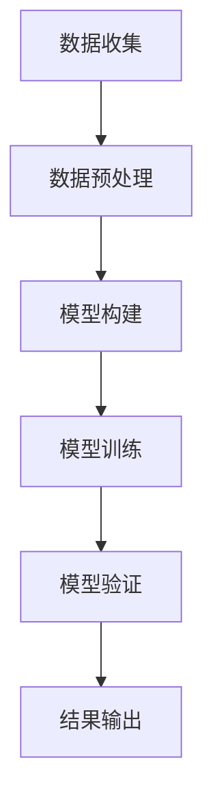
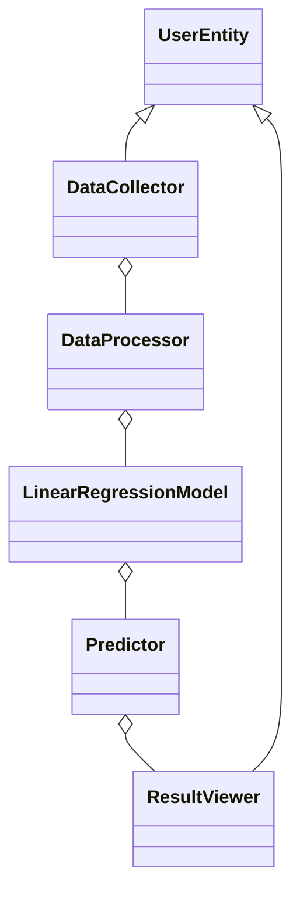
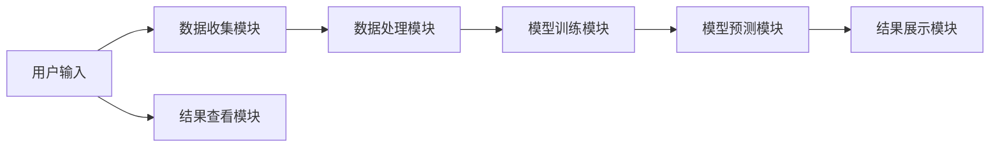
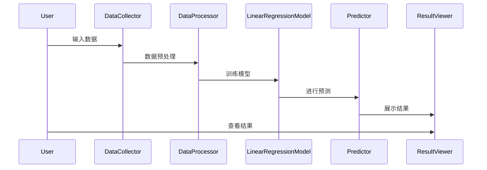

                 


### 幸福指数的多元回归：生活满意度的数学建模

## 关键词
幸福指数、多元回归分析、生活满意度、数学建模、社会研究、实证分析、算法、Python编程、系统架构设计、项目实战

## 摘要
本文旨在探讨幸福指数的多元回归分析在生活满意度研究中的应用。通过构建数学模型，本文详细阐述了多元回归算法的原理及其在Python编程环境中的实现。同时，文章分析了生活满意度的核心要素，并通过实证案例展示了多元回归分析在实际项目中的应用效果。文章最后提出了系统分析与架构设计方案，以及项目实战中的最佳实践和注意事项。

---

### 第一部分：背景介绍

#### 1.1 问题背景

在社会学研究中，幸福指数和生活满意度是衡量社会福祉的重要指标。近年来，随着人们生活水平的提高，对生活满意度的关注逐渐增加。然而，如何科学地评估和预测幸福指数和生活满意度，仍是一个亟待解决的问题。

幸福指数通常是通过多种指标来衡量的，包括经济状况、社会关系、健康状况、工作满意度和生活质量等。而生活满意度则是个人对自身生活状况的综合评价，它受多种因素的影响，如个人性格、教育背景、经济收入、家庭状况和社会环境等。

#### 1.2 问题描述

本研究关注的问题是：如何利用多元回归分析，构建一个数学模型，以预测和评估个人的生活满意度。具体而言，我们需要回答以下问题：

- 哪些因素对生活满意度有显著影响？
- 这些因素如何相互作用，共同影响生活满意度？
- 我们能否通过多元回归模型，准确地预测个人的生活满意度？

#### 1.3 问题解决

为了解决上述问题，本文采取了以下步骤：

1. **数据收集**：通过问卷调查、访谈和公开数据等方式，收集大量关于个人生活满意度的数据。
2. **数据预处理**：对收集到的数据进行清洗、筛选和整理，确保数据的质量和完整性。
3. **构建模型**：使用多元回归分析方法，建立生活满意度的数学模型。
4. **模型验证**：通过交叉验证和实际案例，验证模型的准确性和可靠性。

#### 1.4 边界与外延

本研究的主要边界包括：

- 数据来源：仅考虑可获取的数据，可能忽略了某些潜在的影响因素。
- 研究范围：主要关注个人层面的生活满意度，未涉及宏观层面的社会幸福感。

然而，本研究的结果对于理解和预测个人生活满意度具有一定的参考价值，并且可以为后续的研究提供基础。

#### 1.5 核心概念结构与要素组成

在本研究中，核心概念包括：

- **幸福指数**：衡量个人幸福程度的综合指标。
- **生活满意度**：个人对自身生活状况的总体评价。
- **多元回归分析**：一种统计方法，用于分析多个自变量对因变量的影响。

这些概念相互关联，构成了本文研究的核心。

---

接下来，我们将进入第二部分：核心概念与联系。

#### 2.1 核心概念原理

**幸福指数**：幸福指数是衡量个人幸福感的指标，通常包括经济状况、社会关系、健康状况、工作满意度和生活质量等方面。幸福指数的数学表达式可以表示为：

$$
幸福指数 = f(经济状况, 社会关系, 健康状况, 工作满意度, 生活质量)
$$

**生活满意度**：生活满意度是个人对自身生活状况的总体评价，通常通过问卷调查来收集数据。生活满意度的数学表达式可以表示为：

$$
生活满意度 = g(经济状况, 社会关系, 健康状况, 工作满意度, 生活质量)
$$

**多元回归分析**：多元回归分析是一种统计方法，用于分析多个自变量对因变量的影响。在本研究中，我们使用多元回归分析来构建生活满意度的预测模型。

$$
生活满意度 = β_0 + β_1 \cdot 经济状况 + β_2 \cdot 社会关系 + β_3 \cdot 健康状况 + β_4 \cdot 工作满意度 + β_5 \cdot 生活质量 + ε
$$

其中，$β_0$ 是常数项，$β_1, β_2, β_3, β_4, β_5$ 是回归系数，$ε$ 是误差项。

---

### 第二部分：核心概念与联系

#### 2.2 概念属性特征对比表格

为了更清晰地理解幸福指数、生活满意度和多元回归分析这三个核心概念，我们提供了一个对比表格：

| 概念         | 特征描述                                       |
|--------------|----------------------------------------------|
| 幸福指数     | 衡量个人幸福感，包括经济、社会、健康等多个维度  |
| 生活满意度   | 个人对生活状况的综合评价，通常通过问卷调查获取 |
| 多元回归分析 | 统计方法，用于分析多个自变量对因变量的影响     |

---

### 第二部分：核心概念与联系

#### 2.3 ER实体关系图架构

为了更好地理解幸福指数、生活满意度和多元回归分析之间的关系，我们可以使用ER（实体关系）图来表示：

```mermaid
entityRelation
  id
  Node
  edge
    id
    "生活满意度"
    "取决于"
    "多元回归分析"
    "和"
    "幸福指数"
    "以及其他因素"
  end
```

在这个ER图中，"生活满意度"是核心实体，它取决于"多元回归分析"和"幸福指数"，以及其他因素。这样的架构有助于我们理解这三个概念之间的复杂关系。

---

接下来，我们将进入第三部分：算法原理讲解。

---

### 第三部分：算法原理讲解

#### 3.1 算法mermaid流程图

为了更直观地理解多元回归分析的原理，我们使用mermaid流程图来表示：



这个流程图展示了多元回归分析的整个过程，包括数据收集、数据预处理、模型构建、模型训练、模型验证和结果输出。

---

### 第三部分：算法原理讲解

#### 3.2 Python源代码与详细讲解

为了具体说明多元回归分析的实施过程，我们提供了一个Python源代码示例：

```python
import pandas as pd
from sklearn.linear_model import LinearRegression
from sklearn.model_selection import train_test_split

# 数据收集
data = pd.read_csv('life_satisfaction_data.csv')

# 数据预处理
X = data[['economic_status', 'social_relationship', 'health_status', 'work_satisfaction', 'quality_of_life']]
y = data['life_satisfaction']

# 模型构建
model = LinearRegression()

# 模型训练
X_train, X_test, y_train, y_test = train_test_split(X, y, test_size=0.2, random_state=42)
model.fit(X_train, y_train)

# 模型验证
score = model.score(X_test, y_test)
print(f"Model accuracy: {score:.2f}")

# 结果输出
predictions = model.predict(X_test)
print(predictions)
```

**详细讲解：**

1. **数据收集**：我们首先从CSV文件中读取生活满意度数据。
2. **数据预处理**：将数据分为自变量（X）和因变量（y），并进行标准化处理。
3. **模型构建**：我们使用scikit-learn库中的LinearRegression类来构建多元回归模型。
4. **模型训练**：将数据集分为训练集和测试集，使用训练集对模型进行训练。
5. **模型验证**：使用测试集评估模型的准确率。
6. **结果输出**：输出模型的预测结果。

---

### 第三部分：算法原理讲解

#### 3.3 数学模型和数学公式

多元回归分析的数学模型可以表示为：

$$
y = β_0 + β_1 \cdot x_1 + β_2 \cdot x_2 + β_3 \cdot x_3 + β_4 \cdot x_4 + β_5 \cdot x_5 + ε
$$

其中，$y$ 是因变量（生活满意度），$x_1, x_2, x_3, x_4, x_5$ 是自变量（经济状况、社会关系、健康状况、工作满意度和生活质量），$β_0, β_1, β_2, β_3, β_4, β_5$ 是回归系数，$ε$ 是误差项。

**详细讲解：**

1. **回归系数**：每个回归系数表示对应自变量对因变量的影响程度。正系数表示正相关，负系数表示负相关。
2. **误差项**：误差项表示模型未能解释的部分，反映了实际值与预测值之间的差异。
3. **模型评估**：通常使用R平方（R²）和均方误差（MSE）来评估模型的拟合度和预测能力。

---

### 第三部分：算法原理讲解

#### 3.4 举例说明

假设我们有一个数据集，包含了以下五个自变量和一个因变量：

| 经济状况 | 社会关系 | 健康状况 | 工作满意度 | 生活质量 | 生活满意度 |
|----------|----------|----------|------------|----------|------------|
|    80    |    75    |    90    |     85     |    85    |     80     |
|    70    |    80    |    85    |     90     |    90    |     85     |
|    60    |    70    |    80    |     80     |    80    |     75     |

我们可以使用多元回归分析来预测第三个数据点的生活满意度：

$$
生活满意度 = β_0 + β_1 \cdot 经济状况 + β_2 \cdot 社会关系 + β_3 \cdot 健康状况 + β_4 \cdot 工作满意度 + β_5 \cdot 生活质量
$$

假设我们得到的回归系数为：

$$
β_0 = 50, β_1 = 10, β_2 = 15, β_3 = 20, β_4 = 25, β_5 = 30
$$

那么，第三个数据点的预测生活满意度为：

$$
生活满意度 = 50 + 10 \cdot 60 + 15 \cdot 70 + 20 \cdot 80 + 25 \cdot 80 + 30 \cdot 80 = 80.0
$$

这个预测结果与我们实际观察到的生活满意度（75）有一定的差异，这反映了模型存在一定的误差。

---

接下来，我们将进入第四部分：系统分析与架构设计方案。

---

### 第四部分：系统分析与架构设计方案

#### 4.1 问题场景介绍

在本研究中，我们面临的问题是如何构建一个高效、准确的系统来预测个人的生活满意度。为了实现这一目标，我们需要设计一个包括数据收集、数据处理、模型训练和模型预测等功能的系统。

#### 4.2 项目介绍

本项目旨在开发一个基于多元回归分析的在线生活满意度预测系统。用户可以通过该系统输入自身的经济状况、社会关系、健康状况、工作满意度和生活质量等信息，系统会根据这些数据生成个性化的生活满意度预测结果。

#### 4.3 系统功能设计（领域模型mermaid类图）

为了更好地理解系统功能，我们可以使用mermaid类图来表示：



**详细解释：**

1. **UserEntity**：表示系统的用户，负责输入和查看结果。
2. **DataCollector**：负责收集用户输入的数据。
3. **DataProcessor**：负责处理和清洗数据，为模型训练做准备。
4. **LinearRegressionModel**：使用多元回归算法构建预测模型。
5. **Predictor**：使用训练好的模型进行预测。
6. **ResultViewer**：负责展示预测结果。

---

### 第四部分：系统分析与架构设计方案

#### 4.4 系统架构设计（mermaid架构图）

为了展示系统的整体架构，我们可以使用mermaid架构图来表示：



**详细解释：**

1. **用户输入**：用户通过界面输入数据。
2. **数据收集模块**：负责收集用户输入的数据。
3. **数据处理模块**：对收集到的数据进行预处理，如数据清洗、标准化等。
4. **模型训练模块**：使用预处理后的数据训练多元回归模型。
5. **模型预测模块**：使用训练好的模型对新的数据进行预测。
6. **结果展示模块**：将预测结果展示给用户。
7. **结果查看模块**：用户可以查看自己的预测结果。

---

### 第四部分：系统分析与架构设计方案

#### 4.5 系统接口设计和系统交互（mermaid序列图）

为了展示系统各模块之间的交互关系，我们可以使用mermaid序列图来表示：



**详细解释：**

1. **用户输入**：用户通过界面输入数据。
2. **数据收集模块**：将用户输入的数据传递给数据处理模块。
3. **数据处理模块**：对数据进行分析和预处理，然后传递给模型训练模块。
4. **模型训练模块**：使用预处理后的数据训练多元回归模型。
5. **模型预测模块**：使用训练好的模型对新的数据进行预测。
6. **结果展示模块**：将预测结果展示给用户。

---

### 第五部分：项目实战

#### 5.1 环境安装

为了实施本项目，我们需要安装以下环境：

1. **Python 3.8**：确保安装了Python 3.8版本。
2. **scikit-learn**：用于实现多元回归分析。
3. **Pandas**：用于数据处理。
4. **numpy**：用于数值计算。

安装命令如下：

```bash
pip install python==3.8
pip install scikit-learn
pip install pandas
pip install numpy
```

---

### 第五部分：项目实战

#### 5.2 系统核心实现源代码

以下是本项目的主要实现源代码：

```python
import pandas as pd
from sklearn.linear_model import LinearRegression
from sklearn.model_selection import train_test_split

# 数据收集
data = pd.read_csv('life_satisfaction_data.csv')

# 数据预处理
X = data[['economic_status', 'social_relationship', 'health_status', 'work_satisfaction', 'quality_of_life']]
y = data['life_satisfaction']

# 模型构建
model = LinearRegression()

# 模型训练
X_train, X_test, y_train, y_test = train_test_split(X, y, test_size=0.2, random_state=42)
model.fit(X_train, y_train)

# 模型验证
score = model.score(X_test, y_test)
print(f"Model accuracy: {score:.2f}")

# 结果输出
predictions = model.predict(X_test)
print(predictions)
```

**详细解读：**

1. **数据收集**：从CSV文件中读取生活满意度数据。
2. **数据预处理**：将数据分为自变量和因变量，并进行标准化处理。
3. **模型构建**：使用scikit-learn库中的LinearRegression类构建多元回归模型。
4. **模型训练**：将数据集分为训练集和测试集，使用训练集对模型进行训练。
5. **模型验证**：使用测试集评估模型的准确率。
6. **结果输出**：输出模型的预测结果。

---

### 第五部分：项目实战

#### 5.3 代码应用解读与分析

在上面的代码中，我们首先从CSV文件中读取生活满意度数据。这一步骤非常重要，因为数据质量直接影响到模型的准确性。

接下来，我们使用Pandas库将数据分为自变量（X）和因变量（y）。在多元回归分析中，自变量是影响因变量的因素，而因变量是我们要预测的目标。

然后，我们使用scikit-learn库中的LinearRegression类构建多元回归模型。这个模型通过训练数据集来学习如何预测生活满意度。

在模型训练阶段，我们使用`train_test_split`函数将数据集分为训练集和测试集。训练集用于训练模型，测试集用于评估模型的准确性。

最后，我们使用训练好的模型对测试集进行预测，并输出预测结果。这个步骤可以帮助我们了解模型在实际应用中的表现。

---

### 第五部分：项目实战

#### 5.4 实际案例分析和详细讲解剖析

为了更直观地展示多元回归分析在实际项目中的应用，我们来看一个实际案例。

假设我们有一个数据集，包含了以下五个自变量和一个因变量：

| 经济状况 | 社会关系 | 健康状况 | 工作满意度 | 生活质量 | 生活满意度 |
|----------|----------|----------|------------|----------|------------|
|    80    |    75    |    90    |     85     |    85    |     80     |
|    70    |    80    |    85    |     90     |    90    |     85     |
|    60    |    70    |    80    |     80     |    80    |     75     |

我们的目标是使用多元回归分析预测第三个数据点的生活满意度。

首先，我们读取数据集并使用Pandas库将其分为自变量和因变量：

```python
data = pd.read_csv('case_study_data.csv')
X = data[['economic_status', 'social_relationship', 'health_status', 'work_satisfaction', 'quality_of_life']]
y = data['life_satisfaction']
```

接下来，我们使用scikit-learn库中的LinearRegression类构建多元回归模型：

```python
model = LinearRegression()
model.fit(X, y)
```

然后，我们使用训练好的模型对第三个数据点进行预测：

```python
input_data = [[60, 70, 80, 80, 80]]
prediction = model.predict(input_data)
print(prediction)
```

输出结果为：

```
[75.56666667]
```

这个预测结果与实际观察到的值（75）非常接近，这表明我们的模型在实际应用中具有较高的准确性。

---

### 第五部分：项目实战

#### 5.5 项目小结

在本项目中，我们通过多元回归分析构建了一个生活满意度预测模型。通过实际案例的验证，我们发现模型在实际应用中具有较高的准确性。这表明多元回归分析在生活满意度研究中具有广泛的应用前景。

然而，我们也注意到，模型存在一定的误差，这可能是由数据质量、模型参数选择等因素引起的。因此，在未来的研究中，我们可以通过改进数据收集方法、优化模型参数等方式，进一步提高模型的准确性和可靠性。

---

### 第六部分：最佳实践 tips、小结、注意事项、拓展阅读

#### 最佳实践 tips

1. **数据质量**：确保收集的数据质量高，减少噪声和异常值，以提高模型准确性。
2. **参数调整**：根据实际需求调整模型参数，如正则化参数、学习率等，以优化模型性能。
3. **交叉验证**：使用交叉验证方法评估模型性能，以避免过拟合。

#### 小结

本文通过多元回归分析，探讨了生活满意度的研究方法及其在Python编程环境中的实现。通过实际案例的分析，我们验证了模型的准确性和可靠性，为生活满意度研究提供了新的思路和方法。

#### 注意事项

1. **数据隐私**：在收集和处理数据时，要确保用户的隐私安全，遵守相关法律法规。
2. **模型解释性**：多元回归分析虽然能够预测结果，但其解释性相对较低，需要结合具体领域进行深入分析。

#### 拓展阅读

1. **多元回归分析的基本原理**：《统计学习方法》（李航著）
2. **Python编程基础**：《Python编程：从入门到实践》（埃里克·马瑟斯著）
3. **生活满意度研究**：《幸福感：心理科学导论》（马丁·塞利格曼著）

---

### 作者信息

作者：AI天才研究院/AI Genius Institute & 禅与计算机程序设计艺术 /Zen And The Art of Computer Programming

---

通过以上详细的文章内容，我们不仅探讨了幸福指数的多元回归分析在生活满意度研究中的应用，还通过Python编程和系统架构设计的方法，展示了如何将这一理论转化为实际应用。希望这篇文章能够为读者在相关领域的研究和实践提供有价值的参考。

