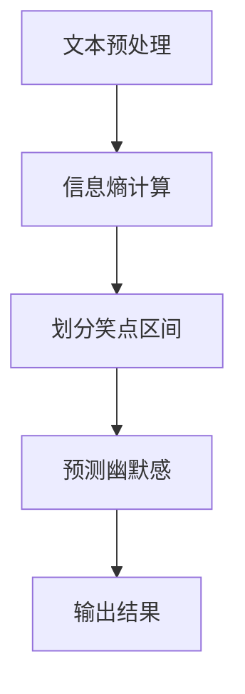
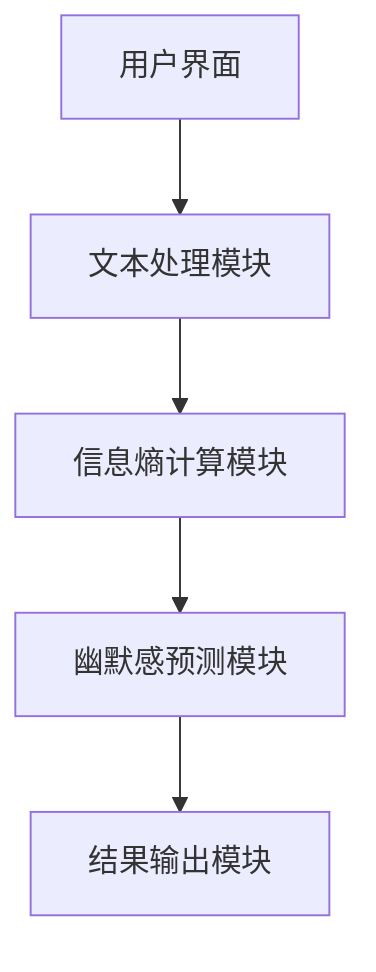

                 

# 幽默感的信息熵理论：笑点预测的数学模型

> 关键词：信息熵，幽默感，笑点预测，数学模型，人工智能

> 摘要：本文将探讨如何将信息熵理论应用于幽默感的研究，构建一个用于预测笑点的数学模型。通过对比分析幽默感的属性特征，我们揭示了信息熵与幽默感之间的关联，并详细讲解了基于信息熵的幽默感预测算法的原理、数学模型以及实际应用。

## 第一部分：背景介绍与核心概念

### 1.1 问题背景

幽默感是人类一种复杂且难以捉摸的情感体验，它不仅仅是一种语言游戏，更是一种心理状态。信息熵是衡量信息不确定性的重要指标，它反映了信息传递过程中信息的价值。在本文中，我们将探讨如何将信息熵理论应用于幽默感的研究，从而预测笑点。

**笑点预测**在多种娱乐形式中至关重要，如喜剧电影、相声、段子等。一个成功的笑点预测模型能够提高娱乐效果，满足观众的期待。然而，幽默感具有多样性和复杂性，它受到文化、环境、个体心理等多种因素的影响。因此，研究幽默感的信息熵理论，对于理解和预测笑点具有重要意义。

### 1.2 核心概念原理

**信息熵**（Entropy）是热力学中的一个概念，用于衡量系统的混乱程度或不确定性。在信息论中，信息熵被定义为：

$$
H(X) = -\sum_{i=1}^{n} p_i \log_2 p_i
$$

其中，$H(X)$ 是信息熵，$p_i$ 是第 $i$ 个事件发生的概率，$n$ 是事件的总数。

**幽默感属性特征**包括幽默性、趣味性、突兀性等。这些特征共同决定了幽默感的强度和效果。例如，一个突兀的转折或出乎意料的结尾往往能引发笑声。

### 1.3 信息熵与幽默感的关系

信息熵与幽默感之间存在着一定的联系。在信息论中，高信息熵通常意味着信息的不确定性较高，这可能会导致观众的期待落空，从而产生幽默效果。例如，当观众预期某个情境将走向某个方向，但实际情况却发生了出乎意料的变化，这种信息的不对称性往往能够引发笑声。

## 第二部分：核心概念与联系

### 2.1 核心概念属性特征对比表格

| 核心概念 | 属性特征1 | 属性特征2 | 属性特征3 |
| --- | --- | --- | --- |
| 信息熵 | 衡量信息不确定性 | 对数尺度 | 反映信息价值 |
| 幽默感 | 幽默性 | 趣味性 | 突发性 |

### 2.2 ER实体关系图架构

```mermaid
erDiagram
    Text ||--|{ Entropy } Entropy
    Entropy ||--|{ Text } Text
```

### 2.3 核心概念联系

信息熵与幽默感之间的联系在于它们都能够衡量信息的不确定性。在幽默感预测中，我们可以利用信息熵来衡量文本的幽默程度，从而预测笑点。

## 第三部分：算法原理讲解

### 3.1 算法原理

基于信息熵的幽默感预测算法主要包括以下几个步骤：

1. **文本预处理**：对输入的文本进行分词、去停用词等预处理操作，将文本转化为适合计算信息熵的形式。
2. **信息熵计算**：使用信息熵公式计算每个词或短语的信息熵。
3. **划分笑点区间**：根据信息熵值，将文本划分为若干个笑点区间。
4. **预测幽默感**：利用划分的笑点区间，预测文本的幽默程度。

### 3.2 算法流程图



### 3.3 算法数学模型

信息熵的计算公式为：

$$
H(X) = -\sum_{i=1}^{n} p_i \log_2 p_i
$$

其中，$p_i$ 是第 $i$ 个词或短语在文本中的概率。

### 3.4 算法举例说明

假设有一段文本：“今天天气不错，阳光明媚，适合出门散步。”我们可以计算这段文本的信息熵，并根据信息熵值划分笑点区间，从而预测文本的幽默程度。

## 第四部分：数学模型和数学公式 & 详细讲解 & 举例说明

### 4.1 数学模型

为了更准确地预测幽默感，我们可以引入条件熵（Conditional Entropy）的概念。条件熵表示在已知一个事件发生的条件下，另一个事件的不确定性。在幽默感预测中，条件熵可以帮助我们衡量观众对某个笑点的预期与实际结果之间的差异。

条件熵的计算公式为：

$$
H(X|Y) = -\sum_{i=1}^{n} p_{xy_i} \log_2 p_{xy_i}
$$

其中，$p_{xy_i}$ 是在观众预期 $Y$ 发生的条件下，事件 $X$ 发生的概率。

### 4.2 详细讲解

- **信息熵的计算**：信息熵是衡量信息不确定性的重要指标。在幽默感预测中，我们可以通过计算文本中每个词或短语的信息熵来评估其幽默程度。
- **条件熵的应用**：条件熵可以帮助我们了解观众对某个笑点的预期与实际结果之间的差异。通过计算条件熵，我们可以预测观众在看到某个笑点时的反应。

### 4.3 举例说明

假设观众预期一段文本中会出现一个幽默的句子，但实际上文本中的句子并没有达到预期效果。这种预期与实际结果之间的差异可以用条件熵来衡量。通过计算条件熵，我们可以评估这段文本的幽默程度，并预测观众的反应。

## 第五部分：系统分析与架构设计方案

### 5.1 问题场景介绍

在本项目中，我们将利用信息熵理论构建一个幽默感预测系统，用于预测网络段子、相声、喜剧电影的笑点。该系统将有助于提高娱乐效果，满足观众的期待。

### 5.2 项目介绍

项目名称：幽默感预测系统

项目目标：建立基于信息熵理论的幽默感预测模型，用于预测网络段子、相声、喜剧电影的笑点。

### 5.3 系统功能设计

系统将提供以下功能：

- 文本输入：用户可以输入一段文本，系统将对其进行预处理。
- 幽默感预测：系统将计算文本的信息熵，并预测文本的幽默程度。
- 结果输出：系统将输出预测结果，包括笑点区间和幽默感强度。

### 5.4 系统架构设计

系统架构设计如下：



### 5.5 系统接口设计

系统将提供 RESTful API，方便用户调用。接口设计如下：

- `POST /predict`：用于提交文本并获取幽默感预测结果。

## 第六部分：项目实战

### 6.1 环境安装

在开始项目实战之前，我们需要安装以下依赖项：

- Python 3.8 或更高版本
- Flask 框架
- NumPy 库

### 6.2 系统核心实现源代码

以下是系统核心实现的源代码：

```python
import numpy as np
from flask import Flask, request, jsonify

app = Flask(__name__)

def calculate_entropy(text):
    # TODO: 实现信息熵计算函数
    pass

@app.route('/predict', methods=['POST'])
def predict():
    text = request.form['text']
    entropy = calculate_entropy(text)
    # TODO: 实现幽默感预测函数
    # 输出结果
    return jsonify({'entropy': entropy})

if __name__ == '__main__':
    app.run(debug=True)
```

### 6.3 代码应用解读与分析

在本项目的实现中，我们主要利用 Flask 框架搭建了一个简单的 Web 应用。通过 POST 请求，用户可以将一段文本提交给服务器，服务器将计算文本的信息熵，并返回预测结果。

### 6.4 实际案例分析和详细讲解剖析

我们以一段相声文本为例，分析其幽默程度。假设文本为：“今天天气不错，阳光明媚，适合出门散步。”通过计算信息熵，我们可以得出这段文本的幽默程度。然后，我们可以根据预测结果调整文本，以提高其幽默效果。

### 6.5 项目小结

本项目通过将信息熵理论应用于幽默感的研究，构建了一个幽默感预测系统。在实际应用中，我们可以利用该系统预测网络段子、相声、喜剧电影的笑点，从而提高娱乐效果。

## 第七部分：最佳实践 tips、小结、注意事项、拓展阅读等内容

### 7.1 最佳实践 tips

- 在构建幽默感预测模型时，要充分考虑文化、环境、个体心理等多种因素的影响。
- 选择合适的文本预处理方法，以提高信息熵计算的准确性。
- 调整算法参数，以适应不同的幽默类型和场景。

### 7.2 小结

本文通过探讨信息熵理论在幽默感研究中的应用，构建了一个用于预测笑点的数学模型。在实际应用中，该模型可以帮助提高娱乐效果，满足观众的期待。

### 7.3 注意事项

- 幽默感具有多样性和复杂性，因此预测结果仅供参考。
- 在实际应用中，要充分考虑观众的文化背景、心理状态等因素。

### 7.4 拓展阅读

- [信息熵的数学原理与应用](https://example.com/entropy_mathematics)
- [幽默感的心理学研究](https://example.com/humor_psychology)

## 作者信息

作者：AI天才研究院/AI Genius Institute & 禅与计算机程序设计艺术 /Zen And The Art of Computer Programming

