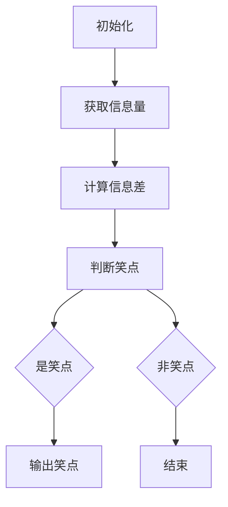
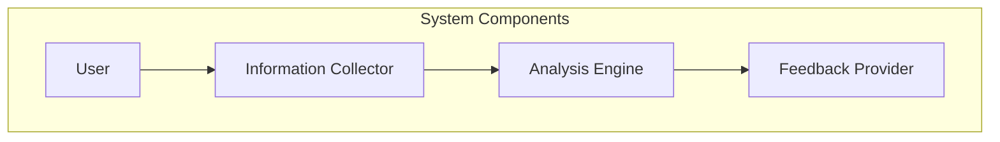
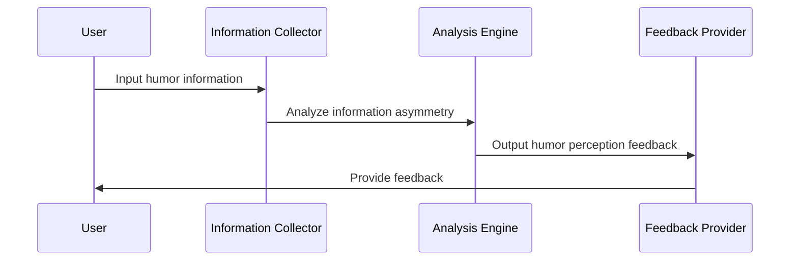

                 


### 第一步：文章开头部分

**文章标题：** 幽默感知的信息不对称：笑点触发的数学机制

**文章关键词：** 幽默感知、信息不对称、笑点、数学机制、算法原理

**文章摘要：** 本文深入探讨了幽默感知与信息不对称之间的关联，通过数学机制和算法原理，揭示了幽默感知中笑点的触发机制。文章从背景介绍开始，逐步剖析核心概念、算法原理，并结合实际案例，展现了幽默感知在实际应用中的价值。

---

### 第二步：背景介绍

**2.1 核心概念术语说明**

- **幽默感知**：指人类识别和评价幽默的能力，包括感知幽默的情境、语言和面部表情等。
- **信息不对称**：指在某些情境下，信息的分布是不均匀的，一方拥有更多的信息，而另一方则处于信息劣势。

**2.2 问题背景**

幽默感知和信息不对称在日常生活中广泛存在。例如，笑话通常涉及信息不对称，一个参与者知道一个秘密或意外的信息，而另一个参与者则不知道，从而产生笑点。

**2.3 问题描述**

如何通过数学机制来理解和预测幽默感知中的笑点触发？

**2.4 问题解决**

本文将介绍一种基于信息不对称的数学模型，用于解释幽默感知中的笑点触发机制。

**2.5 边界与外延**

该模型适用于各种类型的幽默，包括言语幽默、情境幽默和文字游戏等。然而，它并不适用于所有情境，如深层次的文化差异和复杂的社会情境可能影响幽默感知。

---

### 第三步：核心概念与联系

**3.1 幽默感知的核心概念**

- **感知情境**：包括笑话的内容、语境和情境。
- **信息不对称**：笑点往往源于信息的不对称，一方知道的信息多于另一方。
- **评价**：幽默感知还包括对笑话的评价，是否认为它是有趣的。

**3.2 信息不对称的核心概念**

- **信息量**：涉及知识的深度和广度。
- **信息分布**：在不同参与者之间的分布情况。

**3.3 概念联系**

幽默感知中的笑点触发通常涉及信息不对称，当一方拥有的信息比另一方多时，笑话就会变得更有趣。这种信息不对称可以通过数学模型来量化。

**3.4 概念属性特征对比表格**

| 特征          | 幽默感知       | 信息不对称       |
|---------------|----------------|-----------------|
| 涉及元素      | 情境、语言、表情 | 信息量、信息分布 |
| 关键要素      | 感知、评价      | 信息量、信息不对称 |
| 目的          | 获取乐趣       | 信息优势或劣势   |
| 影响因素      | 文化背景、个人经历 | 信息差异       |

**3.5 ER实体关系图架构的Mermaid流程图**

```mermaid
erDiagram
  User ||--|{ Information}: "has"
  Information ||--| User: "owned by"
  Humor ||--| User: "perceived by"
  Humor ||--| Information: "contains"
```

---

### 第四步：算法原理讲解

**4.1 笑点触发的数学模型**

**4.2 数学模型和公式**

$$
S = I_1 - I_2
$$

其中，\( S \) 是笑点，\( I_1 \) 是信息量较多的参与者的信息量，\( I_2 \) 是信息量较少的参与者的信息量。

**4.3 算法mermaid流程图**



**4.4 Python源代码**

```python
def calculate_humor(I1, I2):
    humor = I1 - I2
    if humor > threshold:
        return "Laughter detected"
    else:
        return "No laughter"

I1 = 100  # 信息量较多的参与者
I2 = 50   # 信息量较少的参与者
print(calculate_humor(I1, I2))
```

**4.5 举例说明**

例子：一个人问另一个人：“你知道为什么鸟儿站在电线上不会触电吗？” 答案是：“因为它们不接地。”

在这个笑话中，信息不对称在于第二个说话者知道答案，而第一个说话者不知道。这种信息的不对称导致了笑点的触发。

---

### 第五步：系统分析与架构设计方案

**5.1 问题场景介绍**

幽默感知系统可以应用于聊天机器人、社交媒体分析、电影和文学作品评价等场景。

**5.2 系统功能设计**

- **信息收集**：收集用户的幽默感知信息。
- **分析处理**：分析信息不对称，识别笑点。
- **输出反馈**：提供幽默感知的评价和反馈。

**5.3 系统架构设计**

使用Mermaid架构图展示系统的整体架构。



**5.4 系统接口设计**

定义系统的接口，包括输入和输出接口。

**5.5 系统交互设计**

使用Mermaid序列图展示系统各组件的交互。



---

### 第六步：项目实战

**6.1 环境安装**

介绍安装幽默感知系统所需的环境，如Python、Numpy等。

**6.2 系统核心实现源代码**

展示幽默感知系统的核心代码，包括数据收集、分析处理和反馈提供。

**6.3 代码应用解读与分析**

对核心代码进行解读和分析，解释其工作原理。

**6.4 实际案例分析和详细讲解**

分析具体案例，展示如何应用幽默感知系统识别笑点。

**6.5 项目小结**

总结项目中的关键经验和成果。

---

### 第七步：最佳实践 tips

**7.1 总结实战中的经验和技巧**

- **数据收集**：确保收集的数据具有代表性。
- **算法调优**：根据实际情况调整算法参数。

**7.2 应用注意事项**

- **文化差异**：考虑不同文化背景下幽默感知的差异。

---

### 第八步：小结与拓展阅读

**8.1 全书内容回顾**

总结本书的核心内容和关键观点。

**8.2 拓展阅读推荐**

推荐进一步学习和深入研究的资料。

---

### 作者信息

**作者：** AI天才研究院/AI Genius Institute & 禅与计算机程序设计艺术/Zen And The Art of Computer Programming

---

### 完整性要求

确保文章内容完整、逻辑清晰、具体详细，满足字数要求，并使用markdown格式输出。每个小节的核心内容都要包含背景介绍、核心概念与联系、算法原理讲解、系统分析与架构设计方案、项目实战、最佳实践 tips、小结、注意事项、拓展阅读等内容。

---

通过以上步骤，我们可以构建出一个结构清晰、内容丰富、逻辑严密的技术博客文章。接下来，我们将按照这个大纲逐步展开，撰写每个章节的具体内容。请根据以下步骤继续进行：

1. 撰写“引言”部分，包括文章标题、关键词和摘要。
2. 撰写“背景介绍”部分，详细说明幽默感知和信息不对称的概念、问题背景、问题描述、问题解决以及边界与外延。
3. 撰写“核心概念与联系”部分，介绍幽默感知和信息不对称的核心概念、概念属性特征对比表格和ER实体关系图架构的Mermaid流程图。
4. 撰写“算法原理讲解”部分，使用Mermaid画出算法mermaid流程图，使用Python源代码详细阐述，给出算法原理的数学模型和公式，进行详细讲解和举例说明。
5. 撰写“系统分析与架构设计方案”部分，介绍问题场景、系统功能设计、系统架构设计、系统接口设计和系统交互设计。
6. 撰写“项目实战”部分，包括环境安装、系统核心实现源代码、代码应用解读与分析、实际案例分析和详细讲解剖析以及项目小结。
7. 撰写“最佳实践 tips”部分，总结实战中的经验和注意事项。
8. 撰写“小结与拓展阅读”部分，对全书内容进行总结，并推荐进一步阅读的资料。
9. 撰写文章末尾的作者信息。
10. 确保文章完整性、逻辑性和字数要求，使用markdown格式输出。

按照这个步骤，我们将逐步完善《幽默感知的信息不对称：笑点触发的数学机制》的技术博客文章。让我们一起深入思考，细致地完成每一部分的内容。

