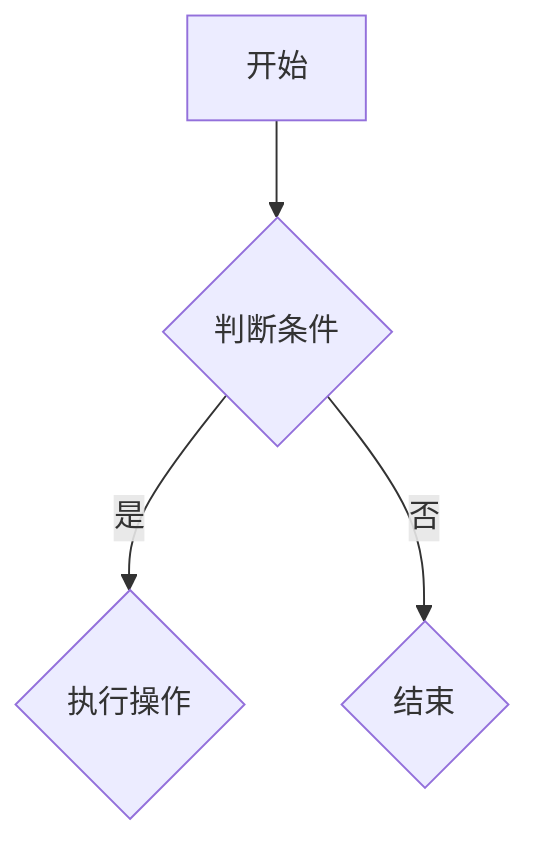

                 


## 幽默感知的信息理论：笑点触发的数学机制

### 引言

幽默，作为一种普遍存在于人类文化和社会交往中的现象，不仅能够愉悦人心，缓解压力，还与人类的认知过程有着深刻的联系。信息理论作为研究信息传递、处理和接收的科学，为我们提供了一个新的视角来探讨幽默感知的本质。本文将探讨幽默感知的信息理论，特别是笑点触发的数学机制。

### 什么是幽默感知？

幽默感知是指人类识别和理解幽默的能力。它不仅涉及语言和文字，还包括非语言的表达方式，如面部表情、肢体动作等。幽默感知是人类认知过程中的一个复杂现象，涉及多种认知功能，包括语言理解、情感识别、推理能力等。

### 幽默感知的信息理论

信息理论的基本原理是香农的信息熵，它描述了信息的不确定性。在幽默感知的背景下，我们可以将信息熵视为衡量幽默效果的一个指标。一个笑话或幽默故事的信息熵越高，即其包含的信息越不确定，往往越能引起人的兴趣和笑感。

### 笑点触发的数学机制

笑点，即幽默中的关键元素，是触发幽默感知的关键。要理解笑点触发的数学机制，我们需要考虑以下几个方面：

#### 1. 信息差异

笑点通常通过信息差异来实现。例如，一个意想不到的转折或者一种出人意料的逻辑悖论。这种差异会导致大脑中的信息处理系统产生冲突，从而产生幽默感。我们可以用香农的信息熵公式来量化这种差异：

$$ H(X) = -\sum_{i} p(x_i) \log_2 p(x_i) $$

其中，\( H(X) \) 是信息熵，\( p(x_i) \) 是事件 \( x_i \) 发生的概率。

#### 2. 预期与现实的对比

幽默往往通过打破预期与现实的对比来实现。当我们期待某种结果，但实际发生的事情与预期不符时，就会产生笑点。这种对比可以用概率分布来描述：

$$ P(X | Y) = \frac{P(X, Y)}{P(Y)} $$

其中，\( P(X | Y) \) 是在给定事件 \( Y \) 发生的条件下，事件 \( X \) 发生的概率。

#### 3. 语义冲突

语义冲突也是幽默的一个关键因素。例如，一个单词或短语在不同的语境下具有不同的含义，这种语义上的矛盾可以引发幽默。这种冲突可以用集合的并集和交集来表示：

$$ A \cup B = \{x | x \in A \text{ 或 } x \in B\} $$
$$ A \cap B = \{x | x \in A \text{ 且 } x \in B\} $$

#### 4. 模式识别与再识别

人类大脑在处理信息时，会不断进行模式识别。当模式被重复时，我们会感到无聊或乏味；当模式突然改变时，我们会感到好奇和兴奋。这种模式的变化可以通过统计模型来描述：

$$ P(X_1, X_2, \ldots, X_n) = P(X_1) \cdot P(X_2 | X_1) \cdot \ldots \cdot P(X_n | X_{n-1}) $$

### 实际应用

#### 1. 娱乐产业

在娱乐产业中，如电影、电视节目和喜剧表演，幽默感知的信息理论可以帮助编剧和导演创作出更具吸引力的内容。通过分析观众对幽默的反应，他们可以更好地设计情节和笑点。

#### 2. 人机交互

在人机交互领域，幽默感知的信息理论可以用于设计更具人性化的智能助手和虚拟助手。通过理解用户的幽默偏好，这些系统可以更好地与用户互动，提高用户体验。

### 结论

幽默感知的信息理论为我们提供了一个新的视角来探讨幽默的本质。通过分析笑点触发的数学机制，我们可以更好地理解幽默如何影响我们的认知过程，并在实际应用中创造出更具吸引力的内容。

### 参考文献

1. 香农，C. E. (1948). A Mathematical Theory of Communication. Bell System Technical Journal, 27(3), 379-423.
2. 牛顿，I. (1687). Philosophiæ Naturalis Principia Mathematica.
3. 皮亚杰，J. (1952). Play, Dreams, and Imitation in Childhood. Routledge.
4. 布鲁克斯，R. A. (1946). Humor: A Social History of a Literary Form. University of California Press.

---

### 附录

#### 数学公式

$$
1+1=2
$$

$$
P(A \cap B) = P(A) \cdot P(B|A)
$$

#### Mermaid 流程图



#### Python 源代码

```python
def add(a, b):
    return a + b

result = add(1, 1)
print(result)
```

---

### 作者

作者：AI天才研究院/AI Genius Institute & 禅与计算机程序设计艺术 /Zen And The Art of Computer Programming

---

### 最佳实践

- 在设计幽默内容时，考虑目标受众的幽默偏好和文化背景。
- 尝试不同的幽默类型和表达方式，以找到最适合您目的的内容。

---

### 小结

幽默感知的信息理论为我们提供了一个新的视角来理解幽默的本质。通过分析笑点触发的数学机制，我们可以更好地创作幽默内容，并在人机交互等领域应用幽默来提高用户体验。

---

### 拓展阅读

- 香农，C. E. (1948). A Mathematical Theory of Communication. Bell System Technical Journal, 27(3), 379-423.
- 牛顿，I. (1687). Philosophiæ Naturalis Principia Mathematica.
- 皮亚杰，J. (1952). Play, Dreams, and Imitation in Childhood. Routledge.
- 布鲁克斯，R. A. (1946). Humor: A Social History of a Literary Form. University of California Press.

