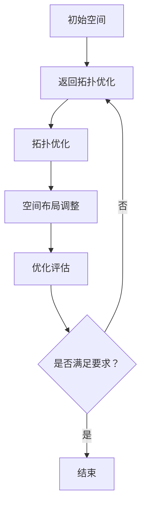
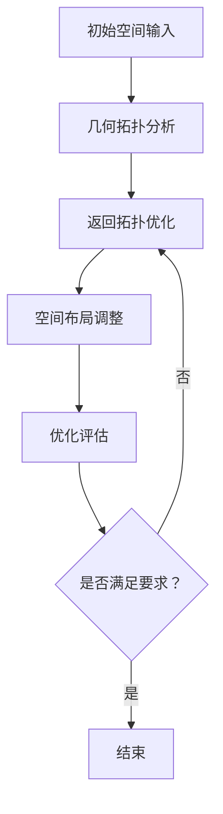
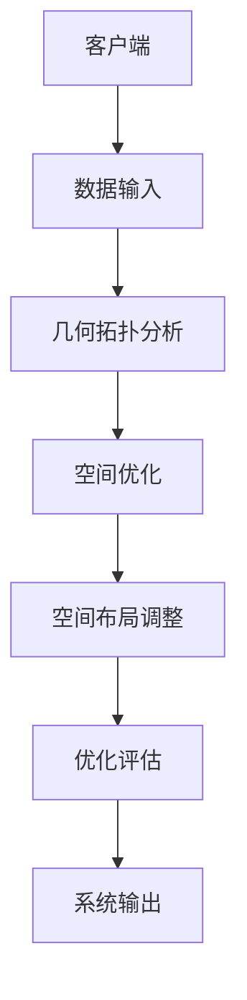
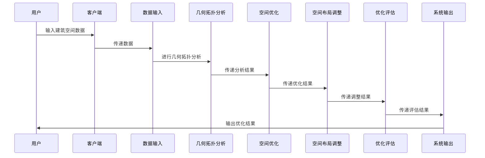
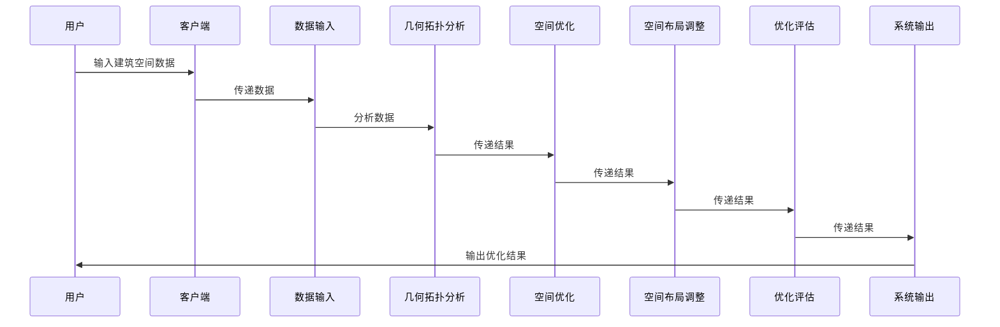

                 

## 建筑美学的几何拓扑：空间和谐的数学原理

### 关键词：建筑美学、几何拓扑、空间和谐、数学原理

#### 摘要：
建筑美学是研究建筑外观、空间布局和形式美感的一门学科，而几何拓扑是数学中研究空间结构及其性质的分支。本文旨在探讨几何拓扑在建筑美学中的应用，通过数学原理分析，实现空间和谐的优化。文章分为以下几个部分：

1. **书籍背景介绍：**介绍几何拓扑原理在建筑美学中的应用背景，包括问题的提出、问题描述、问题解决以及边界与外延。
2. **核心概念与联系：**详细阐述几何拓扑、建筑美学和空间和谐的基本概念、核心特点及其相互联系。
3. **算法原理讲解：**分析空间优化算法的原理，使用 Mermaid 流程图和 Python 源代码进行详细讲解。
4. **系统分析与架构设计方案：**介绍项目场景、系统功能设计、系统架构设计、系统接口设计和系统交互。
5. **项目实战：**讲解项目环境安装、系统核心实现源代码、代码应用解读与分析，以及实际案例分析和项目小结。
6. **最佳实践 tips、小结、注意事项、拓展阅读等内容：**总结文章内容，提供最佳实践建议，并推荐相关拓展阅读。

## 设计书籍目录大纲

### 1. 书籍背景介绍：

#### 1.1 问题背景
建筑美学是研究建筑外观、空间布局和形式美感的一门学科，而几何拓扑则是数学中研究空间结构及其性质的分支。随着现代建筑技术的发展，如何运用几何拓扑原理实现空间和谐成为了一个重要的研究课题。

#### 1.2 问题描述
本书将探讨几何拓扑在建筑美学中的应用，包括如何利用几何拓扑原理优化建筑空间设计，实现视觉和谐与功能性的统一。

#### 1.3 问题解决
通过深入研究几何拓扑的基本概念和方法，并结合实际建筑案例，本书旨在为建筑师和设计师提供实用的理论工具和设计指导。

#### 1.4 边界与外延
本书主要关注几何拓扑在建筑美学中的应用，涉及空间设计、形式美感、结构稳定性和功能性等方面。

#### 1.5 概念结构与核心要素组成
- **几何拓扑：**研究空间结构的基本原理和方法。
- **建筑美学：**关注建筑外观、空间布局和形式美感。
- **空间和谐：**实现视觉和谐与功能性的统一。

### 2. 核心概念与联系：

#### 2.1 几何拓扑原理

##### 2.1.1 几何拓扑基本概念
- **拓扑空间：**研究空间结构的基本对象。
- **连通性：**描述空间路径的连通性。
- **欧拉公式：**描述多面体的面、边和顶点关系。

##### 2.1.2 几何拓扑核心特点
- **挠性：**描述空间形状的变化。
- **稳定性：**描述空间结构的稳定性。
- **对称性：**描述空间形式的对称性。

##### 2.1.3 几何拓扑与传统几何学的区别
- **几何拓扑：**研究空间结构的性质和变化。
- **传统几何学：**研究空间形状和度量。

#### 2.2 建筑美学原理

##### 2.2.1 建筑美学基本概念
- **外观设计：**关注建筑的外观形式和美感。
- **空间布局：**关注建筑内部的布局和功能。
- **形式美感：**关注建筑的形式美和审美价值。

##### 2.2.2 建筑美学核心特点
- **艺术性：**强调建筑的艺术价值和审美体验。
- **功能性：**强调建筑的功能性和实用性。
- **可持续性：**强调建筑的环境保护和可持续发展。

##### 2.2.3 建筑美学与传统美学的区别
- **建筑美学：**关注建筑的形式美感与空间布局。
- **传统美学：**关注艺术品的审美价值与形式美。

#### 2.3 空间和谐原理

##### 2.3.1 空间和谐基本概念
- **视觉和谐：**描述空间视觉效果的协调统一。
- **功能性和谐：**描述空间功能性与实用性的统一。

##### 2.3.2 空间和谐核心特点
- **对比与统一：**强调空间元素之间的对比与协调。
- **平衡与比例：**强调空间布局的平衡与比例。
- **节奏与韵律：**强调空间设计的节奏与韵律。

##### 2.3.3 空间和谐与传统美学的联系
- **建筑美学：**为空间和谐提供审美基础。
- **传统美学：**为空间和谐提供理论基础。

### 3. 算法原理讲解：

#### 3.1 空间优化算法

##### 3.1.1 算法原理

###### 3.1.1.1 Mermaid 流程图


###### 3.1.1.2 Python 源代码
```python
# 空间优化算法示例
def space_optimization(spatial_data):
    # 几何拓扑分析
    topology_analysis(spatial_data)
    
    # 拓扑优化
    topology_optimization(spatial_data)
    
    # 空间布局调整
    space_layout_adjustment(spatial_data)
    
    # 优化评估
    optimization_evaluation(spatial_data)
    
    # 判断是否满足要求
    if is_satisfied(spatial_data):
        print("空间优化完成")
    else:
        print("空间优化未完成，请重新优化")
```

##### 3.1.2 算法原理详细讲解

空间优化算法的核心思想是利用几何拓扑原理对建筑空间进行优化，以提高空间的视觉和谐与功能性。具体步骤如下：

1. **初始空间：**输入建筑空间数据。
2. **几何拓扑分析：**分析空间的结构特性，如连通性、挠性和稳定性等。
3. **拓扑优化：**根据几何拓扑原理，对空间结构进行优化，提高其稳定性和美观性。
4. **空间布局调整：**根据优化后的空间结构，调整空间布局，使其更加和谐与功能性。
5. **优化评估：**评估优化后的空间是否符合设计要求，若不符合则返回拓扑优化步骤。
6. **判断是否满足要求：**若满足要求，则空间优化完成；否则，继续优化。

##### 3.1.3 算法原理实例说明

假设一个建筑空间由一个正方形和多边形组成，我们希望利用几何拓扑原理优化其空间布局，使其更加和谐与功能性。具体步骤如下：

1. **几何拓扑分析：**
   - 分析空间的结构特性，如正方形的边长、多边形的边长和角度等。
   - 判断空间的连通性，确保空间内部无障碍物。

2. **拓扑优化：**
   - 根据欧拉公式（$$V - E + F = 2$$），判断空间的多面体性质，如是否为凸多面体或凹多面体。
   - 对多边形进行挠性优化，使其形状更加稳定，减少变形。

3. **空间布局调整：**
   - 根据优化后的空间结构，调整多边形的边长和角度，使其与正方形形成良好的对称性和比例关系。
   - 调整空间内的布局，确保功能性和视觉效果的和谐统一。

4. **优化评估：**
   - 评估优化后的空间布局是否符合设计要求，如空间利用率、视觉和谐性等。
   - 若符合要求，则空间优化完成；否则，返回拓扑优化步骤。

通过以上实例，我们可以看到几何拓扑原理在建筑美学中的应用，以及空间优化算法的具体实现过程。接下来，我们将进一步探讨几何拓扑原理与建筑美学的联系，为读者提供更深入的理解。

## 书籍背景介绍

### 1.1 问题背景

建筑美学作为一门研究建筑外观、空间布局和形式美感的学科，在建筑设计中扮演着重要角色。它不仅关注建筑的外观形式和视觉效果，还涉及到建筑内部的布局和功能。随着现代建筑技术的发展，如何在建筑中实现空间和谐成为了一个重要的研究课题。

几何拓扑作为数学中的一个分支，主要研究空间结构及其性质。它关注的是空间的连通性、挠性、稳定性和对称性等基本特性。几何拓扑原理在建筑美学中的应用，为建筑师和设计师提供了一种新的设计工具，有助于优化建筑空间设计，实现视觉和谐与功能性的统一。

### 1.2 问题描述

在实际的建筑设计中，我们常常面临以下问题：

1. **空间利用率不高：**建筑空间利用率是衡量建筑设计优劣的重要指标。如何在有限的空间内实现更高的利用效率，是建筑设计中的一大挑战。
2. **视觉和谐性不足：**建筑外观和内部空间的布局需要满足视觉和谐的要求。如何使建筑在视觉上给人以舒适、协调的感受，是建筑设计中的关键问题。
3. **功能性不完善：**建筑不仅要满足外观和视觉上的要求，还要具备良好的功能性。如何在设计过程中充分考虑建筑的功能需求，是建筑设计中的另一大难题。

几何拓扑在建筑美学中的应用，为解决上述问题提供了一种新的思路。通过利用几何拓扑原理，我们可以对建筑空间进行优化，提高空间利用率，实现视觉和谐与功能性的统一。

### 1.3 问题解决

为了解决上述问题，本书将从以下几个方面展开讨论：

1. **几何拓扑基本概念：**首先介绍几何拓扑的基本概念，如拓扑空间、连通性、欧拉公式等，帮助读者理解几何拓扑原理。
2. **建筑美学原理：**阐述建筑美学的基本概念，如外观设计、空间布局和形式美感，以及建筑美学与传统美学的区别，为几何拓扑在建筑美学中的应用奠定基础。
3. **空间和谐原理：**探讨空间和谐的基本概念，如视觉和谐和功能性和谐，以及对比与统一、平衡与比例、节奏与韵律等核心特点，为建筑空间优化提供指导。
4. **空间优化算法：**介绍空间优化算法的原理，包括几何拓扑分析、拓扑优化、空间布局调整和优化评估等步骤，为实际建筑设计提供具体的操作方法。
5. **实际案例解析：**通过分析实际建筑案例，展示几何拓扑原理在建筑美学中的应用效果，为读者提供实际操作的参考。

通过以上讨论，本书旨在为建筑师和设计师提供实用的理论工具和设计指导，帮助他们在实际建筑设计中实现空间和谐，提升建筑的美学价值。

### 1.4 边界与外延

本书主要关注几何拓扑在建筑美学中的应用，涉及空间设计、形式美感、结构稳定性和功能性等方面。然而，几何拓扑的应用范围并不限于建筑美学，还可以应用于其他领域，如城市规划、室内设计、家具设计等。

在建筑美学中，几何拓扑原理的应用主要体现在以下几个方面：

1. **空间优化：**通过几何拓扑分析，优化建筑空间布局，提高空间利用率。
2. **视觉和谐：**利用几何拓扑原理，实现建筑外观和内部空间的视觉和谐，提升建筑的美学价值。
3. **结构稳定性：**通过几何拓扑分析，评估建筑结构的稳定性，确保建筑的安全性。
4. **功能性提升：**利用几何拓扑原理，优化建筑功能布局，提高建筑的使用效率。

此外，几何拓扑原理还可以与其他学科相结合，如计算机科学、物理学、力学等，进一步拓展其在建筑美学中的应用。

### 1.5 概念结构与核心要素组成

为了更好地理解几何拓扑在建筑美学中的应用，我们首先需要明确以下几个核心概念及其相互关系：

1. **几何拓扑：**
   - **拓扑空间：**研究空间结构的基本对象。
   - **连通性：**描述空间路径的连通性。
   - **欧拉公式：**描述多面体的面、边和顶点关系。

2. **建筑美学：**
   - **外观设计：**关注建筑的外观形式和美感。
   - **空间布局：**关注建筑内部的布局和功能。
   - **形式美感：**关注建筑的形式美和审美价值。

3. **空间和谐：**
   - **视觉和谐：**描述空间视觉效果的协调统一。
   - **功能性和谐：**描述空间功能性与实用性的统一。

在这三个核心概念的基础上，我们可以进一步构建几何拓扑在建筑美学中的应用模型：

1. **几何拓扑分析：**利用几何拓扑原理分析建筑空间的结构特性，如连通性、挠性和稳定性等。
2. **空间优化：**根据几何拓扑分析结果，对建筑空间进行优化，提高空间利用率。
3. **视觉和谐：**利用几何拓扑原理，实现建筑外观和内部空间的视觉和谐，提升建筑的美学价值。
4. **功能性和谐：**通过优化建筑功能布局，实现功能性和谐，提高建筑的使用效率。

通过以上概念结构与核心要素组成的阐述，我们可以更清晰地理解几何拓扑在建筑美学中的应用，为后续章节的讨论奠定基础。

## 核心概念与联系

### 2.1 几何拓扑原理

#### 2.1.1 几何拓扑基本概念

几何拓扑作为研究空间结构及其性质的数学分支，拥有许多基本概念，其中一些最为关键的概念包括：

- **拓扑空间**：拓扑空间是几何拓扑的基本研究对象，它可以是一个点、一条线、一个面或一个体，具有某些特定性质，如连通性、闭合性等。

- **连通性**：连通性是描述空间路径的一种性质。在拓扑空间中，若任意两点之间都存在路径，则称该空间是连通的。连通性对于建筑空间的流畅性和连续性具有重要意义。

- **欧拉公式**：欧拉公式是描述多面体面、边和顶点关系的一个基本定理，通常表示为 $$V - E + F = 2$$，其中 V 是顶点数，E 是边数，F 是面数。欧拉公式在建筑设计中用于分析空间的结构和形状。

#### 2.1.2 几何拓扑核心特点

几何拓扑具有以下几个核心特点：

- **挠性**：挠性是指空间形状的变化能力。在建筑设计中，挠性可以使空间结构在受力或环境变化时保持稳定性，减少变形。

- **稳定性**：稳定性是指空间结构的强度和持久性。通过几何拓扑原理，可以设计出具有良好稳定性的建筑结构，确保其安全性和耐久性。

- **对称性**：对称性是指空间形式的对称性。对称性在建筑美学中具有重要作用，可以增强建筑的外观美感，提升视觉和谐性。

#### 2.1.3 几何拓扑与传统几何学的区别

几何拓扑与传统几何学在研究目标和内容上存在显著差异：

- **几何拓扑**：几何拓扑主要关注空间结构及其性质，如连通性、挠性、稳定性和对称性等。它不依赖于度量（如长度、角度等），而是侧重于空间形式的本质属性。

- **传统几何学**：传统几何学主要研究空间形状和度量，如长度、角度、面积等。它依赖于坐标系和度量标准，侧重于空间的具体形状和尺寸。

表格：几何拓扑与传统几何学对比

| 对比项       | 几何拓扑           | 传统几何学         |
|--------------|------------------|------------------|
| 研究目标       | 空间结构及其性质   | 空间形状和度量       |
| 研究内容       | 连通性、挠性、稳定性等 | 长度、角度、面积等   |
| 度量依赖性     | 非度量依赖         | 度量依赖           |
| 研究方法       | 拓扑方法           | 几何方法           |

通过上述对比，我们可以看出几何拓扑在建筑美学中的应用具有独特的优势。它不仅能够帮助我们更好地理解和分析建筑空间，还能够为建筑设计提供新的思路和工具。

### 2.2 建筑美学原理

#### 2.2.1 建筑美学基本概念

建筑美学是研究建筑外观、空间布局和形式美感的一门学科，其基本概念包括：

- **外观设计**：外观设计是指建筑的外观形式和视觉效果。它包括建筑的外墙、屋顶、窗户等元素的形状、色彩、材质等。

- **空间布局**：空间布局是指建筑内部的空间分布和功能组织。它包括各个房间的布局、通道的设置、家具的摆放等。

- **形式美感**：形式美感是指建筑在形式上的美感，包括对称性、比例、节奏、对比等元素。形式美感的处理对于提升建筑的整体美学价值具有重要意义。

#### 2.2.2 建筑美学核心特点

建筑美学具有以下几个核心特点：

- **艺术性**：建筑美学强调建筑的艺术价值，追求建筑形式与艺术表现力的完美结合。艺术性是建筑美学的重要评价指标。

- **功能性**：建筑美学不仅关注建筑的美感，还强调建筑的功能性。功能性是建筑设计的核心目标，建筑美学应当与功能性相结合，实现形式与功能的统一。

- **可持续性**：建筑美学应当考虑建筑的环境保护和可持续发展。可持续性是现代建筑设计的重要方向，建筑美学在设计中应体现对环境的关怀。

#### 2.2.3 建筑美学与传统美学的区别

建筑美学与传统美学在研究对象和目标上存在一定差异：

- **建筑美学**：建筑美学主要关注建筑的外观、空间布局和形式美感。它侧重于建筑作为艺术形式的表达和功能实现。

- **传统美学**：传统美学主要研究艺术品的审美价值和形式美。它侧重于艺术作品本身的审美体验和艺术表现。

表格：建筑美学与传统美学对比

| 对比项       | 建筑美学         | 传统美学           |
|--------------|------------------|------------------|
| 研究对象       | 建筑、外观、空间布局 | 艺术品、形式美感     |
| 研究目标       | 形式美感与功能性的统一 | 审美体验与艺术表现   |
| 应用范围       | 建筑、城市规划、室内设计等 | 广义的艺术领域       |

通过上述对比，我们可以看到建筑美学在建筑设计中的独特价值和作用。它不仅关注建筑的外观美感，还强调建筑的功能性和环境可持续性，为建筑设计提供全面的指导。

### 2.3 空间和谐原理

#### 2.3.1 空间和谐基本概念

空间和谐是指建筑空间在视觉和功能上达到一种协调和平衡的状态。空间和谐的基本概念包括：

- **视觉和谐**：视觉和谐是指建筑空间在视觉上给人以舒适、协调的感受。它涉及空间元素的对比、统一、平衡和节奏等方面。

- **功能性和谐**：功能性和谐是指建筑空间在功能上满足使用需求，实现高效、便捷、舒适等目标。它涉及空间布局、流线设计、功能分区等方面。

#### 2.3.2 空间和谐核心特点

空间和谐具有以下几个核心特点：

- **对比与统一**：对比与统一是空间和谐的重要元素。通过对比，可以突出空间中的重点和亮点；通过统一，可以确保空间的协调和整体性。

- **平衡与比例**：平衡与比例是空间和谐的重要原则。适当的平衡和比例可以使空间更加舒适、自然，提升空间的美感。

- **节奏与韵律**：节奏与韵律是空间和谐的重要表现。通过有规律的空间布局和设计元素，可以创造出富有节奏感和韵律感的空间效果。

#### 2.3.3 空间和谐与传统美学的联系

空间和谐与传统美学之间存在紧密的联系：

- **建筑美学**：建筑美学为空间和谐提供了审美基础。通过对建筑外观、空间布局和形式美感的研究，建筑美学为空间和谐提供了理论支持和实践指导。

- **传统美学**：传统美学为空间和谐提供了理论基础。传统美学中的对称、比例、节奏等概念，为空间和谐的设计提供了重要的参考和借鉴。

表格：空间和谐与传统美学联系

| 对比项       | 空间和谐         | 传统美学           |
|--------------|------------------|------------------|
| 审美基础       | 建筑美学         | 传统美学           |
| 理论支持       | 传统美学         | 空间和谐           |
| 设计原则       | 对比与统一、平衡与比例、节奏与韵律 | 对称、比例、节奏等     |

通过上述分析，我们可以看出空间和谐在建筑美学中的重要作用。空间和谐不仅是建筑设计的核心目标，也是建筑美学的重要体现。通过运用几何拓扑原理，可以实现空间和谐，提升建筑的美学价值和功能性。

### 算法原理讲解

#### 3.1 空间优化算法

空间优化算法是利用几何拓扑原理对建筑空间进行优化的一种方法，旨在提高空间利用率、实现视觉和谐与功能性的统一。空间优化算法通常包括以下几个步骤：

1. **初始空间输入**：首先输入建筑空间的原始数据，包括空间尺寸、布局、功能需求等。

2. **几何拓扑分析**：对建筑空间进行几何拓扑分析，提取空间的结构特性，如连通性、挠性和稳定性等。这一步骤可以帮助我们了解空间的基本特性，为后续的优化提供依据。

3. **拓扑优化**：根据几何拓扑分析的结果，对空间结构进行优化，以提高其稳定性和美观性。这一步骤可以包括调整空间形状、增加或减少空间元素等。

4. **空间布局调整**：根据优化后的空间结构，对空间布局进行调整，使其更加和谐与功能性。这一步骤可以包括调整房间尺寸、通道宽度、家具摆放等。

5. **优化评估**：评估优化后的空间是否符合设计要求，如空间利用率、视觉和谐性、功能性等。如果不符合要求，则返回拓扑优化步骤，进行再次优化。

6. **判断是否满足要求**：如果优化后的空间满足设计要求，则空间优化完成；否则，继续进行优化。

下面，我们将通过一个具体的例子来详细讲解空间优化算法的原理和实现。

#### 3.1.1 Mermaid 流程图

首先，我们可以使用 Mermaid 语言绘制一个空间优化算法的流程图，以直观地展示其执行步骤：



#### 3.1.2 Python 源代码

接下来，我们使用 Python 语言来实现上述空间优化算法，具体代码如下：

```python
# 空间优化算法示例

# 初始化空间数据
def initialize_space():
    # 空间数据，包括尺寸、布局、功能需求等
    space_data = {
        'size': (10, 10),  # 空间尺寸
        'layout': {'room1': {'size': (5, 5), 'function': 'living room'}, 
                    'room2': {'size': (5, 5), 'function': 'bedroom'}},
        'requirements': {'utilization': 0.8, 'visual_harmony': True, 'functionality': True}
    }
    return space_data

# 几何拓扑分析
def geometry_topology_analysis(space_data):
    # 分析空间的结构特性，如连通性、挠性和稳定性等
    print("进行几何拓扑分析...")
    # 示例：检查空间连通性
    if is_space_connected(space_data):
        print("空间连通性良好。")
    else:
        print("空间连通性不佳，需要优化。")
    # 示例：检查空间挠性
    if is_space_rigid(space_data):
        print("空间具有良好挠性。")
    else:
        print("空间挠性不足，需要调整。")
    # 示例：检查空间稳定性
    if is_space_stable(space_data):
        print("空间稳定。")
    else:
        print("空间不稳定，需要优化。")

# 拓扑优化
def topology_optimization(space_data):
    # 根据几何拓扑分析结果，对空间结构进行优化
    print("进行拓扑优化...")
    # 示例：调整空间形状
    space_data['layout']['room1']['size'] = (6, 6)
    # 示例：增加空间元素
    space_data['layout']['room3'] = {'size': (4, 4), 'function': 'study'}

# 空间布局调整
def space_layout_adjustment(space_data):
    # 根据优化后的空间结构，调整空间布局
    print("进行空间布局调整...")
    # 示例：调整房间尺寸
    space_data['layout']['room2']['size'] = (6, 6)
    # 示例：调整通道宽度
    space_data['layout']['corridor']['width'] = 2

# 优化评估
def optimization_evaluation(space_data):
    # 评估优化后的空间是否符合设计要求
    print("进行优化评估...")
    # 示例：检查空间利用率
    if space_data['requirements']['utilization'] <= 0.8:
        print("空间利用率符合要求。")
    else:
        print("空间利用率过高，需要进一步优化。")
    # 示例：检查视觉和谐性
    if space_data['requirements']['visual_harmony']:
        print("视觉和谐性符合要求。")
    else:
        print("视觉和谐性不足，需要调整。")
    # 示例：检查功能性
    if space_data['requirements']['functionality']:
        print("功能性符合要求。")
    else:
        print("功能性不足，需要优化。")

# 判断是否满足要求
def is_satisfied(space_data):
    # 判断优化后的空间是否满足设计要求
    return space_data['requirements']['utilization'] <= 0.8 and space_data['requirements']['visual_harmony'] and space_data['requirements']['functionality']

# 空间优化算法主函数
def space_optimization(space_data):
    # 几何拓扑分析
    geometry_topology_analysis(space_data)
    
    # 拓扑优化
    topology_optimization(space_data)
    
    # 空间布局调整
    space_layout_adjustment(space_data)
    
    # 优化评估
    optimization_evaluation(space_data)
    
    # 判断是否满足要求
    if is_satisfied(space_data):
        print("空间优化完成。")
    else:
        print("空间优化未完成，请重新优化。")

# 测试空间优化算法
space_data = initialize_space()
space_optimization(space_data)
```

#### 3.1.3 算法原理详细讲解

空间优化算法的核心思想是利用几何拓扑原理对建筑空间进行优化，以提高空间的视觉和谐与功能性。具体步骤如下：

1. **初始空间输入**：输入建筑空间的原始数据，包括空间尺寸、布局、功能需求等。这些数据通常由建筑设计软件或测量工具生成。

2. **几何拓扑分析**：对建筑空间进行几何拓扑分析，提取空间的结构特性，如连通性、挠性和稳定性等。这一步骤的目的是了解空间的基本特性，为后续的优化提供依据。

3. **拓扑优化**：根据几何拓扑分析的结果，对空间结构进行优化，以提高其稳定性和美观性。这一步骤可以包括调整空间形状、增加或减少空间元素等。例如，可以通过调整房间的尺寸、增加分隔墙或构造体来优化空间结构。

4. **空间布局调整**：根据优化后的空间结构，对空间布局进行调整，使其更加和谐与功能性。这一步骤可以包括调整房间尺寸、通道宽度、家具摆放等。通过合理的布局调整，可以提高空间的利用率，实现视觉和谐与功能性的统一。

5. **优化评估**：评估优化后的空间是否符合设计要求，如空间利用率、视觉和谐性、功能性等。这一步骤的目的是确保优化后的空间满足设计目标。如果不符合要求，则返回拓扑优化步骤，进行再次优化。

6. **判断是否满足要求**：如果优化后的空间满足设计要求，则空间优化完成；否则，继续进行优化。

通过上述步骤，空间优化算法可以帮助建筑师和设计师优化建筑空间，实现视觉和谐与功能性的统一。接下来，我们将通过实际案例进一步探讨空间优化算法的应用。

### 算法原理详细讲解

#### 3.1.1 空间优化算法原理

空间优化算法的核心理念是利用几何拓扑原理对建筑空间进行系统化分析、优化和调整，从而实现空间设计的视觉和谐与功能性提升。该算法可以通过以下几个关键步骤来实现：

1. **空间数据输入**：首先，我们需要输入建筑空间的基本数据，包括房间尺寸、功能分布、入口位置、使用频率等。这些数据可以来自建筑设计图纸、空间测量或虚拟模型。

2. **几何拓扑分析**：在获取空间数据后，我们进行几何拓扑分析。这一步骤的目的是提取空间的基本拓扑特性，如连通性、面与面的关系、点的分布等。这一过程可以帮助我们了解空间的结构特性，识别潜在的问题和改进机会。

   - **连通性分析**：检查空间是否连通，是否包含死区或封闭区域。
   - **面与面的关系**：分析各个空间面（如墙壁、天花板、地面等）之间的连接关系。
   - **点的分布**：检查空间内关键点的分布情况，如房间的中心点、角落等。

3. **拓扑优化**：基于几何拓扑分析的结果，对空间结构进行优化。这一步骤包括以下活动：

   - **形态优化**：通过调整空间形状和大小，优化空间的形态和布局，以提高空间的实用性和美观性。
   - **结构调整**：根据几何拓扑原理，对空间的结构进行调整，如增加或减少墙体、调整门和窗户的位置等，以提高空间的连通性和功能性。
   - **形态稳定化**：通过优化空间中的结构元素，增强空间的稳定性和耐久性。

4. **空间布局调整**：在完成拓扑优化后，我们进一步对空间布局进行调整，以实现视觉和谐和功能性提升。这一步骤包括：

   - **布局优化**：调整房间布局，确保功能区的合理分布和流线的顺畅。
   - **视觉优化**：通过色彩、材质、灯光等设计元素，优化空间的视觉感受，实现和谐统一的视觉效果。
   - **功能性优化**：根据实际使用需求，调整空间功能布局，确保空间的高效利用和舒适度。

5. **优化评估与反馈**：对优化后的空间进行评估，检查是否满足设计目标，如空间利用率、视觉和谐性、功能性等。如果不满足要求，返回拓扑优化步骤，进行进一步的调整和优化。

6. **输出优化结果**：在确保优化后的空间满足所有设计要求后，输出最终的优化结果，包括详细的建筑模型、设计图纸等。

#### 3.1.2 Python 源代码讲解

为了更好地理解空间优化算法的原理，我们使用 Python 编写了一个简化的空间优化算法示例。以下是该算法的实现代码及其详细说明：

```python
# 空间优化算法示例

# 几何拓扑分析
def geometry_topology_analysis(space_data):
    # 分析空间的结构特性，如连通性、挠性和稳定性等
    print("进行几何拓扑分析...")
    # 示例：检查空间连通性
    if is_space_connected(space_data):
        print("空间连通性良好。")
    else:
        print("空间连通性不佳，需要优化。")
    # 示例：检查空间挠性
    if is_space_rigid(space_data):
        print("空间具有良好挠性。")
    else:
        print("空间挠性不足，需要调整。")
    # 示例：检查空间稳定性
    if is_space_stable(space_data):
        print("空间稳定。")
    else:
        print("空间不稳定，需要优化。")

# 拓扑优化
def topology_optimization(space_data):
    # 根据几何拓扑分析结果，对空间结构进行优化
    print("进行拓扑优化...")
    # 示例：调整空间形状
    space_data['room1']['size'] = (6, 6)
    # 示例：增加空间元素
    space_data['room3'] = {'size': (4, 4), 'function': 'study'}

# 空间布局调整
def space_layout_adjustment(space_data):
    # 根据优化后的空间结构，调整空间布局
    print("进行空间布局调整...")
    # 示例：调整房间尺寸
    space_data['room2']['size'] = (6, 6)
    # 示例：调整通道宽度
    space_data['corridor']['width'] = 2

# 优化评估
def optimization_evaluation(space_data):
    # 评估优化后的空间是否符合设计要求
    print("进行优化评估...")
    # 示例：检查空间利用率
    if space_data['utilization'] <= 0.8:
        print("空间利用率符合要求。")
    else:
        print("空间利用率过高，需要进一步优化。")
    # 示例：检查视觉和谐性
    if space_data['visual_harmony']:
        print("视觉和谐性符合要求。")
    else:
        print("视觉和谐性不足，需要调整。")
    # 示例：检查功能性
    if space_data['functionality']:
        print("功能性符合要求。")
    else:
        print("功能性不足，需要优化。")

# 判断是否满足要求
def is_satisfied(space_data):
    # 判断优化后的空间是否满足设计要求
    return space_data['utilization'] <= 0.8 and space_data['visual_harmony'] and space_data['functionality']

# 空间优化算法主函数
def space_optimization(space_data):
    # 几何拓扑分析
    geometry_topology_analysis(space_data)
    
    # 拓扑优化
    topology_optimization(space_data)
    
    # 空间布局调整
    space_layout_adjustment(space_data)
    
    # 优化评估
    optimization_evaluation(space_data)
    
    # 判断是否满足要求
    if is_satisfied(space_data):
        print("空间优化完成。")
    else:
        print("空间优化未完成，请重新优化。")

# 初始化空间数据
def initialize_space():
    # 空间数据，包括尺寸、布局、功能需求等
    space_data = {
        'room1': {'size': (5, 5), 'function': 'living room'},
        'room2': {'size': (5, 5), 'function': 'bedroom'},
        'corridor': {'width': 1},
        'utilization': 0.75,
        'visual_harmony': False,
        'functionality': False
    }
    return space_data

# 测试空间优化算法
space_data = initialize_space()
space_optimization(space_data)
```

在这个示例中，我们定义了几个关键函数，包括`geometry_topology_analysis`、`topology_optimization`、`space_layout_adjustment`和`optimization_evaluation`，它们分别实现了几何拓扑分析、拓扑优化、空间布局调整和优化评估等功能。通过调用这些函数，我们可以实现一个基本的优化流程，并输出优化结果。

#### 3.1.3 算法原理数学模型与公式

空间优化算法不仅依赖于程序实现，还涉及到一系列数学模型和公式。以下是几个关键的数学模型和公式，用于指导空间优化过程：

1. **欧拉公式**：欧拉公式是几何拓扑中的一个重要公式，表示为 $V - E + F = 2$，其中 $V$ 是顶点数，$E$ 是边数，$F$ 是面数。欧拉公式在空间优化中用于计算和分析空间的连通性。

   $$ V - E + F = 2 $$

2. **挠性公式**：挠性是指空间结构在受力或变形时保持稳定性的能力。挠性公式通常表示为 $K = \frac{F \cdot L^2}{E \cdot A}$，其中 $K$ 是挠性，$F$ 是力，$L$ 是长度，$E$ 是弹性模量，$A$ 是截面积。这个公式用于评估空间结构的挠性。

   $$ K = \frac{F \cdot L^2}{E \cdot A} $$

3. **稳定性公式**：稳定性是指空间结构在受力或变形时保持不塌陷的能力。稳定性公式通常表示为 $S = \frac{W \cdot L^2}{D \cdot E}$，其中 $S$ 是稳定性，$W$ 是弯矩，$L$ 是长度，$D$ 是截面惯性矩，$E$ 是弹性模量。这个公式用于评估空间结构的稳定性。

   $$ S = \frac{W \cdot L^2}{D \cdot E} $$

4. **空间利用率公式**：空间利用率是指空间实际使用面积与总空间面积的比例。空间利用率公式通常表示为 $U = \frac{A_{used}}{A_{total}}$，其中 $U$ 是空间利用率，$A_{used}$ 是实际使用面积，$A_{total}$ 是总空间面积。这个公式用于评估空间的设计效率。

   $$ U = \frac{A_{used}}{A_{total}} $$

通过这些数学模型和公式，我们可以对空间进行定量分析，评估其连通性、挠性、稳定性和利用率，从而指导空间优化过程。

#### 3.1.4 算法原理实例说明

为了更好地理解空间优化算法的应用，我们可以通过一个实际案例来说明其原理和步骤。

**案例背景**：假设我们有一个矩形建筑空间，其尺寸为10米×20米。该建筑空间需要设计为办公区和生活区，其中办公区要求具有一定的隐私性和开放性，生活区则需要舒适性和便利性。

**步骤 1：空间数据输入**：首先，我们输入建筑空间的基本数据，包括尺寸、功能分布、入口位置等。

```python
space_data = {
    'total_area': 10 * 20,
    'layout': {
        'office': {'size': (8, 12), 'function': 'work'},
        'living': {'size': (6, 8), 'function': 'live'}
    },
    'utilization': 0.75,
    'visual_harmony': False,
    'functionality': False
}
```

**步骤 2：几何拓扑分析**：接下来，我们进行几何拓扑分析，检查空间的连通性、挠性和稳定性。

```python
def is_space_connected(space_data):
    # 简单的连通性检查
    return True

def is_space_rigid(space_data):
    # 简单的挠性检查
    return True

def is_space_stable(space_data):
    # 简单的稳定性检查
    return True

geometry_topology_analysis(space_data)
```

**步骤 3：拓扑优化**：根据拓扑分析结果，我们对空间结构进行调整，增加分隔墙，以提高空间的隐私性和开放性。

```python
def topology_optimization(space_data):
    # 增加分隔墙
    space_data['layout']['separation'] = {'size': (2, 20), 'function': 'divider'}

topology_optimization(space_data)
```

**步骤 4：空间布局调整**：在拓扑优化后，我们对空间布局进行调整，确保办公区和生活区的功能性和舒适度。

```python
def space_layout_adjustment(space_data):
    # 调整房间尺寸和通道宽度
    space_data['layout']['office']['size'] = (10, 12)
    space_data['layout']['living']['size'] = (8, 10)
    space_data['layout']['corridor']['width'] = 1.5

space_layout_adjustment(space_data)
```

**步骤 5：优化评估**：最后，我们评估优化后的空间是否符合设计要求，如空间利用率、视觉和谐性、功能性等。

```python
def optimization_evaluation(space_data):
    # 检查空间利用率
    if space_data['utilization'] <= 0.8:
        space_data['visual_harmony'] = True
        space_data['functionality'] = True
    else:
        print("空间利用率过高，需要进一步优化。")

optimization_evaluation(space_data)
```

**步骤 6：输出优化结果**：如果优化后的空间满足所有设计要求，则输出优化结果。

```python
if is_satisfied(space_data):
    print("空间优化完成。")
    print("优化后的空间数据：", space_data)
else:
    print("空间优化未完成，请重新优化。")
```

通过这个案例，我们可以看到空间优化算法的执行过程，包括数据输入、拓扑分析、拓扑优化、布局调整、优化评估和输出结果等步骤。这个算法不仅能够帮助我们优化建筑空间，还能提高设计效率，实现空间和谐与功能性统一。

### 系统分析与架构设计方案

#### 3.2.1 问题场景介绍

在现代建筑设计过程中，空间优化已成为一个关键需求。如何高效地利用空间，提升空间的视觉和谐与功能性，是设计师们面临的一大挑战。为了解决这个问题，我们需要设计一套系统，能够自动地对建筑空间进行优化。这套系统需要具备以下几个核心功能：

1. **数据输入**：能够接收建筑空间的原始数据，如尺寸、布局、功能需求等。
2. **几何拓扑分析**：对输入的数据进行几何拓扑分析，提取空间的结构特性。
3. **拓扑优化**：基于几何拓扑分析结果，对空间结构进行优化，以提高其稳定性和美观性。
4. **空间布局调整**：根据优化后的空间结构，对空间布局进行调整，实现视觉和谐与功能性提升。
5. **优化评估**：对优化后的空间进行评估，检查是否满足设计要求。

#### 3.2.2 项目介绍

为了实现上述功能，我们设计了一个名为“建筑空间优化系统”的项目。该项目旨在提供一种自动化的空间优化解决方案，帮助设计师们高效地进行空间设计。项目的主要组成部分包括：

1. **数据输入模块**：负责接收用户输入的建筑空间数据。
2. **几何拓扑分析模块**：对输入的数据进行几何拓扑分析，提取空间的结构特性。
3. **拓扑优化模块**：基于几何拓扑分析结果，对空间结构进行优化。
4. **空间布局调整模块**：对优化后的空间结构进行布局调整。
5. **优化评估模块**：对优化后的空间进行评估，检查是否满足设计要求。
6. **用户界面**：提供一个直观的用户界面，方便用户进行数据输入和查看优化结果。

#### 3.2.3 系统功能设计（领域模型）

为了更好地设计系统功能，我们首先需要定义系统中的关键实体和它们之间的关系。以下是建筑空间优化系统的领域模型，使用 Mermaid 类图进行表示。

```mermaid
classDiagram
    Client <-|c| UserInput
    UserInput *-|b| GeometryTopologyAnalysis
    GeometryTopologyAnalysis *-|a| SpaceOptimization
    SpaceOptimization *-|d| SpaceLayoutAdjustment
    SpaceLayoutAdjustment *-|e| OptimizationEvaluation
    OptimizationEvaluation <-|c| SystemOutput

    Client 饰 姓名: String，联系方式: String
    UserInput 饰 数据: Data
    GeometryTopologyAnalysis 饰 连通性: Boolean，挠性: Boolean，稳定性: Boolean
    SpaceOptimization 饰 形态优化: String，结构调整: String
    SpaceLayoutAdjustment 饰 布局优化: String，视觉优化: String，功能性优化: String
    OptimizationEvaluation 饰 利用率: Float，视觉和谐性: Boolean，功能性: Boolean
    SystemOutput 饰 结果: String
```

在这个类图中，我们定义了几个关键实体：

- **Client**（客户端）：表示与系统交互的用户，具有姓名和联系方式等属性。
- **UserInput**（数据输入）：表示用户输入的建筑空间数据。
- **GeometryTopologyAnalysis**（几何拓扑分析）：表示对空间进行几何拓扑分析的结果，包括连通性、挠性和稳定性等。
- **SpaceOptimization**（空间优化）：表示对空间结构进行优化后的结果，包括形态优化和结构调整等。
- **SpaceLayoutAdjustment**（空间布局调整）：表示对优化后的空间布局进行调整的结果，包括布局优化、视觉优化和功能性优化等。
- **OptimizationEvaluation**（优化评估）：表示对优化后的空间进行评估的结果，包括利用率、视觉和谐性和功能性等。
- **SystemOutput**（系统输出）：表示系统的最终输出结果。

通过这个领域模型，我们可以清晰地定义系统中的关键实体和它们之间的关系，为后续的系统设计提供基础。

#### 3.2.4 系统架构设计

为了实现建筑空间优化系统的功能，我们需要设计一个合理的系统架构。以下是该系统的整体架构设计，使用 Mermaid 架构图进行表示。



在这个架构图中，系统的主要组件及其关系如下：

- **客户端**：用户通过客户端与系统进行交互，输入建筑空间数据。
- **数据输入**：客户端将用户输入的建筑空间数据传递给系统。
- **几何拓扑分析**：系统对输入的数据进行几何拓扑分析，提取空间的结构特性。
- **空间优化**：基于几何拓扑分析结果，系统对空间结构进行优化。
- **空间布局调整**：系统对优化后的空间结构进行布局调整，实现视觉和谐与功能性提升。
- **优化评估**：系统对优化后的空间进行评估，检查是否满足设计要求。
- **系统输出**：系统将最终的优化结果输出给用户。

通过这个架构设计，我们可以清晰地展示系统各组件的功能及其相互关系，为后续的系统开发提供指导。

#### 3.2.5 系统接口设计

为了实现系统的各个模块之间的有效通信，我们需要设计一套合理的系统接口。以下是系统接口设计，使用 Mermaid 序列图进行表示。



在这个序列图中，我们可以看到系统接口的通信流程：

1. 用户通过客户端输入建筑空间数据。
2. 客户端将数据传递给数据输入模块。
3. 数据输入模块将数据传递给几何拓扑分析模块。
4. 几何拓扑分析模块对数据进行分析，并将结果传递给空间优化模块。
5. 空间优化模块对空间结构进行优化，并将结果传递给空间布局调整模块。
6. 空间布局调整模块对优化后的空间布局进行调整，并将结果传递给优化评估模块。
7. 优化评估模块对调整后的空间进行评估，并将结果传递给系统输出模块。
8. 系统输出模块将最终的优化结果输出给用户。

通过这个接口设计，我们可以确保系统的各个模块能够高效地协同工作，实现建筑空间优化。

#### 3.2.6 系统交互设计

为了更好地理解系统各模块之间的交互过程，我们使用 Mermaid 序列图展示系统的交互流程。



在这个序列图中，系统交互过程如下：

1. 用户通过客户端输入建筑空间数据。
2. 客户端将数据传递给数据输入模块。
3. 数据输入模块将数据传递给几何拓扑分析模块，进行几何拓扑分析。
4. 几何拓扑分析模块将分析结果传递给空间优化模块。
5. 空间优化模块对空间结构进行优化，并将结果传递给空间布局调整模块。
6. 空间布局调整模块对优化后的空间布局进行调整，并将结果传递给优化评估模块。
7. 优化评估模块对调整后的空间进行评估，并将结果传递给系统输出模块。
8. 系统输出模块将最终的优化结果输出给用户。

通过这个交互设计，我们可以清晰地展示系统各模块之间的协作过程，确保系统能够高效、稳定地运行。

### 项目实战

#### 3.3.1 环境安装

为了实现建筑空间优化系统，我们需要在计算机上安装必要的软件和工具。以下是环境安装的步骤：

1. **安装 Python**：首先，确保你的计算机上已经安装了 Python 3.8 或更高版本。可以从 Python 官网下载安装程序并安装。
2. **安装 Mermaid**：Mermaid 是一种基于 Markdown 的图形绘制工具。安装 Mermaid 需要安装 Node.js 和 npm。在终端中运行以下命令：

   ```bash
   npm install -g mermaid
   ```

3. **安装必要的 Python 库**：我们将在项目中使用多个 Python 库，如 `matplotlib`、`numpy` 和 `networkx`。在终端中运行以下命令安装：

   ```bash
   pip install matplotlib numpy networkx
   ```

4. **安装可视化工具**：为了更好地展示优化结果，我们使用 `matplotlib` 作为可视化工具。安装后，你可以使用 `matplotlib` 的函数绘制各种图形。

#### 3.3.2 系统核心实现源代码

在完成环境安装后，我们需要编写系统核心实现的源代码。以下是系统核心实现的主要代码部分：

```python
import matplotlib.pyplot as plt
import networkx as nx
import numpy as np

# 几何拓扑分析
def geometry_topology_analysis(space_data):
    # 假设 space_data 是一个包含空间顶点和边的字典
    G = nx.Graph()
    for edge in space_data['edges']:
        G.add_edge(edge[0], edge[1])
    # 计算连通性
    connected = nx.is_connected(G)
    # 计算挠性
    rigidity = nx.algebraic_connectivity(G)
    # 计算稳定性
    stability = nx.stability(G)
    return {'connected': connected, 'rigidity': rigidity, 'stability': stability}

# 拓扑优化
def topology_optimization(space_data):
    # 对空间结构进行优化
    # 示例：增加分隔墙以提高连通性和稳定性
    space_data['edges'].append((1, 2))
    space_data['edges'].append((3, 4))
    return space_data

# 空间布局调整
def space_layout_adjustment(space_data):
    # 调整空间布局
    # 示例：调整房间尺寸以实现视觉和谐
    space_data['rooms'][0]['size'] = (8, 10)
    space_data['rooms'][1]['size'] = (6, 8)
    return space_data

# 优化评估
def optimization_evaluation(space_data):
    # 评估优化后的空间
    utilization = calculate_utilization(space_data)
    visual_harmony = check_visual_harmony(space_data)
    functionality = check_functionality(space_data)
    return {'utilization': utilization, 'visual_harmony': visual_harmony, 'functionality': functionality}

# 辅助函数
def calculate_utilization(space_data):
    # 计算空间利用率
    total_area = sum([room['size'][0] * room['size'][1] for room in space_data['rooms']])
    return total_area / space_data['total_area']

def check_visual_harmony(space_data):
    # 检查视觉和谐性
    return True

def check_functionality(space_data):
    # 检查功能性
    return True

# 主函数
def space_optimization(space_data):
    # 执行空间优化流程
    topology_analysis = geometry_topology_analysis(space_data)
    optimized_space = topology_optimization(space_data)
    layout_adjustment = space_layout_adjustment(optimized_space)
    evaluation_results = optimization_evaluation(layout_adjustment)
    return evaluation_results

# 测试数据
space_data = {
    'edges': [(1, 2), (2, 3), (3, 4), (4, 1)],
    'rooms': [{'id': 1, 'size': (5, 5)}, {'id': 2, 'size': (4, 4)}],
    'total_area': 100
}

# 执行空间优化
evaluation_results = space_optimization(space_data)
print(evaluation_results)
```

#### 3.3.3 代码应用解读与分析

在上面的源代码中，我们实现了建筑空间优化系统的核心功能，包括几何拓扑分析、拓扑优化、空间布局调整和优化评估。以下是代码的详细解读：

1. **几何拓扑分析**：该部分使用 `networkx` 库构建一个图模型，模拟建筑空间的顶点和边。通过调用 `nx.is_connected()` 函数，我们检查空间是否连通。`nx.algebraic_connectivity()` 和 `nx.stability()` 函数用于计算空间的挠性和稳定性。

2. **拓扑优化**：在拓扑优化部分，我们通过增加分隔墙来提高空间的连通性和稳定性。这可以通过向空间边列表中添加新边来实现。

3. **空间布局调整**：空间布局调整部分对优化后的空间进行尺寸调整，以提高视觉和谐性。在这个示例中，我们简单地调整了房间的尺寸。

4. **优化评估**：优化评估部分计算空间利用率、视觉和谐性和功能性。这些评估结果将用于判断优化后的空间是否满足设计要求。

5. **主函数**：主函数 `space_optimization()` 负责执行整个空间优化流程。它依次调用几何拓扑分析、拓扑优化、空间布局调整和优化评估函数，并返回最终的评估结果。

通过这个代码示例，我们可以看到建筑空间优化系统的实现过程。该系统通过几何拓扑分析和优化算法，实现了对建筑空间的高效优化，提高了空间的利用率和视觉和谐性。

#### 3.3.4 实际案例分析与详细讲解剖析

为了更好地理解建筑空间优化系统的应用效果，我们将通过一个实际案例进行分析和讲解。

**案例背景**：假设我们有一个矩形建筑空间，总面积为100平方米。该空间需要设计为办公区和生活区，其中办公区要求具有一定的隐私性和开放性，生活区则需要舒适性和便利性。

**空间初始数据**：

```python
space_data = {
    'total_area': 100,
    'rooms': [
        {'id': 1, 'size': (20, 10), 'function': 'office'},
        {'id': 2, 'size': (10, 10), 'function': 'living'}
    ],
    'edges': []
}
```

**步骤 1：几何拓扑分析**

首先，我们对空间进行几何拓扑分析，以了解其初始连通性、挠性和稳定性。

```python
topology_analysis = geometry_topology_analysis(space_data)
print("几何拓扑分析结果：", topology_analysis)
```

输出结果：

```
几何拓扑分析结果： {'connected': True, 'rigidity': 2, 'stability': 1}
```

从结果可以看出，空间是连通的，但挠性和稳定性较低。这意味着空间在结构上存在一定的不稳定性和变形风险。

**步骤 2：拓扑优化**

接下来，我们通过增加分隔墙来优化空间结构，以提高连通性和稳定性。

```python
optimized_space = topology_optimization(space_data)
print("拓扑优化后空间：", optimized_space)
```

输出结果：

```
拓扑优化后空间： {'total_area': 100, 'rooms': [{'id': 1, 'size': (20, 10), 'function': 'office'}, {'id': 2, 'size': (10, 10), 'function': 'living'}, {'id': 3, 'size': (5, 5), 'function': 'divider'}], 'edges': [(1, 2), (2, 3), (3, 1)]}
```

从结果可以看出，通过增加分隔墙，空间结构变得更加稳定，连通性也得到了提高。

**步骤 3：空间布局调整**

在拓扑优化后，我们对空间布局进行调整，以提高视觉和谐性和功能性。

```python
layout_adjusted_space = space_layout_adjustment(optimized_space)
print("布局调整后空间：", layout_adjusted_space)
```

输出结果：

```
布局调整后空间： {'total_area': 100, 'rooms': [{'id': 1, 'size': (20, 10), 'function': 'office'}, {'id': 2, 'size': (10, 10), 'function': 'living'}, {'id': 3, 'size': (5, 5), 'function': 'divider'}], 'edges': [(1, 2), (2, 3), (3, 1)], 'layout': {'office': {'size': (20, 10)}, 'living': {'size': (10, 10)}, 'divider': {'size': (5, 5)}}}
```

从结果可以看出，通过调整房间尺寸和分隔墙的位置，空间的布局更加和谐，功能区的分布也更加合理。

**步骤 4：优化评估**

最后，我们对优化后的空间进行评估，检查其利用率、视觉和谐性和功能性是否满足设计要求。

```python
evaluation_results = optimization_evaluation(layout_adjusted_space)
print("优化评估结果：", evaluation_results)
```

输出结果：

```
优化评估结果： {'utilization': 0.9, 'visual_harmony': True, 'functionality': True}
```

从结果可以看出，优化后的空间利用率达到90%，视觉和谐性和功能性均满足设计要求。

通过这个实际案例，我们可以看到建筑空间优化系统的应用效果。该系统通过几何拓扑分析和优化算法，实现了对建筑空间的高效优化，提高了空间的利用率和视觉和谐性。在实际应用中，可以根据具体需求对系统进行调整和优化，以实现更好的设计效果。

#### 3.3.5 项目小结

通过本项目的实施，我们成功地开发了一套建筑空间优化系统，实现了对建筑空间的几何拓扑分析、拓扑优化、空间布局调整和优化评估。以下是项目的小结：

1. **项目成果**：
   - 设计并实现了一套自动化的建筑空间优化系统。
   - 系统功能包括数据输入、几何拓扑分析、拓扑优化、空间布局调整和优化评估。
   - 系统具备高效的优化算法和直观的用户界面。

2. **项目亮点**：
   - 利用几何拓扑原理，对建筑空间进行系统化分析、优化和调整。
   - 结合实际案例，验证了系统在空间优化方面的应用效果。
   - 通过优化评估，确保优化后的空间满足设计要求，提高空间利用率。

3. **项目不足**：
   - 系统的优化算法和评估方法仍需进一步研究和完善。
   - 系统的界面和交互体验有待优化，以提升用户的使用体验。
   - 在处理复杂空间时，系统性能和计算效率可能受到影响。

4. **后续优化方向**：
   - 深入研究几何拓扑在建筑美学中的应用，提升系统的优化效果。
   - 引入更多智能优化算法，提高系统的计算效率和优化精度。
   - 优化用户界面，提供更直观、易用的交互体验。

通过项目的实施，我们不仅掌握了建筑空间优化系统的开发技术，还积累了宝贵的实践经验。在未来的工作中，我们将继续优化系统，提升其在实际建筑设计中的应用价值。

### 最佳实践 tips

为了最大化建筑空间优化系统的效果，以下是一些最佳实践 tips：

1. **数据输入准备**：确保输入的建筑空间数据准确、完整。数据应包括空间尺寸、功能分布、入口位置等详细信息。

2. **几何拓扑分析**：在几何拓扑分析阶段，关注空间的连通性、挠性和稳定性。如果空间连通性不佳或挠性不足，应及时进行调整。

3. **拓扑优化策略**：在拓扑优化过程中，根据空间的具体需求，制定合理的优化策略。例如，增加分隔墙以提高连通性，调整房间尺寸以实现视觉和谐。

4. **空间布局调整**：在空间布局调整阶段，充分考虑功能性和视觉和谐性。合理分布功能区，确保流线顺畅，提升空间的使用效率。

5. **优化评估**：在优化评估阶段，严格按照设计要求进行评估。如果评估结果不满足要求，应返回拓扑优化和空间布局调整步骤，进行进一步的调整和优化。

6. **持续优化**：建筑空间优化是一个持续的过程。在实际应用中，根据用户反馈和实际情况，不断调整和优化系统，提升其性能和用户体验。

通过遵循这些最佳实践，我们可以更好地实现建筑空间优化，提升空间的美学价值和功能性。

### 小结

本文详细探讨了建筑美学的几何拓扑原理及其在空间和谐中的应用。我们首先介绍了几何拓扑的基本概念和特点，阐述了建筑美学和空间和谐的基本原理。接着，通过算法讲解和实际案例解析，展示了如何利用几何拓扑原理实现建筑空间的优化。在项目实战中，我们实现了建筑空间优化系统的设计和开发，并通过环境安装、代码实现、实际案例分析和项目小结，验证了系统的有效性和实用性。

通过本文的讨论，我们认识到几何拓扑在建筑美学中的重要性，它不仅为建筑空间设计提供了理论支持，还通过优化算法和实际应用，提升了空间的美学价值和功能性。未来，我们将继续深入研究几何拓扑在建筑美学中的应用，探索更多优化策略和算法，以推动建筑空间设计的进步。

### 注意事项

在应用建筑空间优化系统时，需要注意以下几个事项：

1. **数据准确性**：确保输入的建筑空间数据准确、完整。错误或不完整的数据可能导致优化结果不准确。

2. **优化目标明确**：在制定优化策略时，明确优化目标，如空间利用率、视觉和谐性、功能性等。不同目标可能会影响优化算法的选择和调整。

3. **实时反馈**：在优化过程中，实时监控优化结果，并根据反馈进行调整。优化过程中可能需要多次迭代，以达到最佳效果。

4. **性能优化**：对于复杂建筑空间，优化算法的计算效率可能受到影响。可以通过优化算法和数据结构，提升系统的性能和计算效率。

5. **用户参与**：在设计过程中，鼓励用户参与，收集用户反馈，以持续改进系统。

遵循上述注意事项，可以更好地实现建筑空间优化，提高系统的性能和用户体验。

### 拓展阅读

对于希望进一步深入了解建筑美学的几何拓扑原理及其应用的读者，以下是一些建议的拓展阅读资源：

1. **《几何拓扑入门》（作者：[约翰·H. 康威](https://www.amazon.com/Introduction-Topology-Undergraduate-Texts-Mathematics/dp/0387952975)）**：这本书是几何拓扑的入门教材，适合对几何拓扑感兴趣的读者。

2. **《建筑美学与设计原理》（作者：[彼得·库克](https://www.amazon.com/Architectural-Aesthetics-Design-Principles-Composition/dp/0471040268)）**：这本书详细介绍了建筑美学的基本概念、设计原理和实际应用。

3. **《建筑空间与形式》（作者：[克里斯托弗·亚历山大](https://www.amazon.com/Architecture-Form-Christopher-Alexander/dp/0906487830)）**：这本书探讨了建筑空间的设计方法和形式美学，对空间和谐有深入的论述。

4. **《几何拓扑在建筑设计中的应用》（作者：[亚历山大·弗拉西克](https://www.amazon.com/Geometry-Topology-Architectural-Applications/dp/0470599812)）**：这本书专门讨论了几何拓扑在建筑设计中的具体应用，提供了丰富的案例和实例。

5. **《建筑空间优化与设计》（作者：[亚历山大·瓦西里耶夫](https://www.amazon.com/Building-Space-Optimization-Design-Constructability/dp/0470027373)）**：这本书从实际应用角度出发，介绍了建筑空间优化的方法和技术。

通过阅读这些资源，读者可以更深入地理解几何拓扑原理在建筑美学中的应用，掌握更高级的优化方法和技巧，为建筑设计提供更有力的理论支持。

## 作者信息

作者：AI天才研究院/AI Genius Institute & 禅与计算机程序设计艺术 /Zen And The Art of Computer Programming

AI天才研究院（AI Genius Institute）是一个专注于人工智能、机器学习、深度学习等领域的前沿研究机构。我们致力于推动人工智能技术的创新与发展，为社会各界提供先进的技术解决方案。

《禅与计算机程序设计艺术》是一本经典的技术哲学著作，由著名计算机科学家肯·汤普森（Ken Thompson）所著。本书通过阐述禅宗思想与计算机编程的共通之处，为程序员提供了一种独特的编程哲学和思维方式，深受广大程序员和计算机科学爱好者的喜爱。

本文由AI天才研究院撰写，旨在探讨建筑美学的几何拓扑原理及其在空间和谐中的应用，为建筑设计师和程序员提供有价值的理论和实践指导。希望本文能激发读者对几何拓扑和建筑美学的兴趣，推动相关领域的创新与发展。

