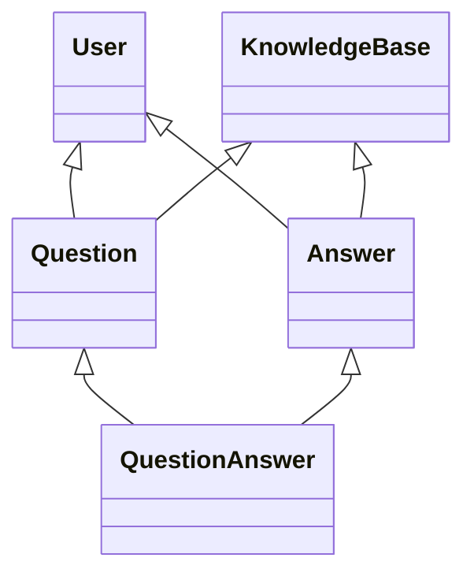
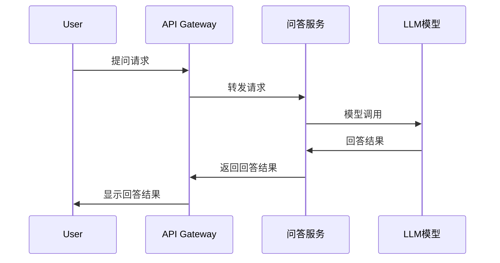
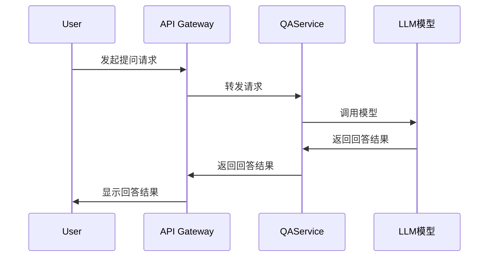

                 

# 微服务架构在敏捷LLM应用开发中的应用

## 关键词
- 微服务架构
- 敏捷开发
- 大型语言模型（LLM）
- 自然语言处理
- 软件开发

## 摘要
本文探讨了微服务架构在敏捷大型语言模型（LLM）应用开发中的应用。首先介绍了微服务架构和敏捷开发的基本概念，然后分析了LLM的技术原理和应用场景。接下来，详细阐述了微服务架构在LLM开发中的具体应用，包括数据管理、模型训练、服务部署与运维等方面。通过实际项目案例，分析了微服务架构在LLM开发中的优势和挑战。最后，总结了微服务架构在敏捷LLM应用开发中的关键要素和最佳实践。

## 第一部分：背景介绍

### 1.1.1 问题背景

在当今信息化时代，软件系统规模和复杂性不断增加，传统的单体架构已无法满足快速变化的市场需求。微服务架构作为一种新兴的软件开发范式，旨在通过将大型系统拆分成若干小型、独立、松耦合的服务，实现系统的敏捷开发、扩展和运维。

#### 1.1.2 问题描述

微服务架构在敏捷软件开发中的应用已经得到了广泛认可，但如何将微服务架构应用于大型语言模型（LLM）的开发，仍是一个亟待解决的问题。LLM作为人工智能领域的重要突破，具有极高的计算复杂度和数据需求，传统的单体架构难以应对。

### 1.1.3 问题解决

本书将从以下几个方面探讨微服务架构在敏捷LLM应用开发中的应用：

1. 微服务架构的基本概念与设计原则
2. LLM的核心概念、技术原理及应用场景
3. 微服务架构在LLM开发中的具体应用，包括数据管理、模型训练、服务部署与运维等
4. 实际项目案例，分析微服务架构在LLM开发中的优势与挑战

#### 1.1.4 边界与外延

1. **边界**：本书主要关注微服务架构在敏捷LLM应用开发中的实际应用，不涉及其他软件开发范式。
2. **外延**：本书旨在为开发者和研究者提供微服务架构与LLM结合的理论基础和实践指导，推动该领域的创新发展。

### 1.1.5 概念结构与核心要素组成

1. **微服务架构**：一种基于独立、松耦合服务的软件开发范式，具有高扩展性、高可用性、易于部署和维护等特点。
2. **敏捷开发**：一种强调快速响应变化、迭代开发的软件开发方法，强调团队合作、灵活性和适应性。
3. **大型语言模型（LLM）**：一种基于深度学习的自然语言处理模型，具有强大的语义理解能力，广泛应用于智能问答、文本生成、机器翻译等领域。

### 第一部分总结

本部分主要介绍了微服务架构在敏捷LLM应用开发中的背景、问题和解决方案。通过梳理相关概念，为后续章节的深入探讨奠定了基础。

### 1.2 核心概念与联系

#### 1.2.1 微服务架构

**定义**：微服务架构是一种将大型系统拆分为多个独立、可复用的小型服务，通过松耦合方式相互通信和协作的软件开发方法。

**核心特点**：
- **独立性**：每个服务具有独立的开发、部署和运维，实现模块化。
- **松耦合**：服务之间通过标准接口进行通信，降低系统复杂度。
- **可扩展性**：通过水平扩展服务实例，实现系统性能提升。
- **高可用性**：服务之间互备，提高系统稳定性。

**与敏捷开发的联系**：微服务架构与敏捷开发方法相互补充，敏捷开发强调快速迭代、持续交付，而微服务架构则提供了灵活、可扩展的架构支持。

#### 1.2.2 大型语言模型（LLM）

**定义**：大型语言模型（Large Language Model，简称LLM）是一种基于深度学习的自然语言处理模型，具有强大的语义理解能力。

**核心特点**：
- **大规模**：LLM通常具有数十亿至千亿级别的参数，能够处理海量数据。
- **通用性**：LLM能够应用于多种自然语言处理任务，如文本分类、机器翻译、文本生成等。
- **自适应性**：LLM可以通过训练和优化，适应不同领域的应用需求。

**与微服务架构的联系**：LLM在微服务架构中通常作为一个独立的服务，负责处理自然语言处理任务。通过微服务架构，可以实现LLM的灵活部署、扩展和管理。

#### 1.2.3 微服务架构与LLM的关系

1. **协同作用**：微服务架构为LLM的开发提供了灵活、可扩展的框架，使得LLM可以更高效地应用于各种场景。
2. **挑战与机遇**：微服务架构在LLM开发中面临诸多挑战，如数据管理、模型训练、服务部署与运维等，但同时也为LLM的发展带来了新的机遇。

### 核心概念属性特征对比表格

| 概念     | 定义             | 核心特点           | 应用场景                |
|----------|------------------|-------------------|------------------------|
| 微服务架构 | 独立、松耦合的服务 | 独立开发、松耦合、可扩展 | 软件开发、系统架构设计 |
| 敏捷开发  | 快速迭代、持续交付 | 团队合作、灵活、适应性 | 软件开发、项目管理     |
| LLM      | 大规模自然语言处理模型 | 大规模、通用性、自适应性 | 自然语言处理、文本生成 |

### ER实体关系图架构

```mermaid
erDiagram
    Service ||--o{ Data : 数据管理实体 }
    Service ||--o{ Model : 模型训练实体 }
    Service ||--o{ Deployment : 服务部署实体 }
    Service ||--o{ Monitoring : 监控运维实体 }
```

## 第二部分：微服务架构的基本概念与设计原则

### 2.1 微服务架构的核心概念

#### 定义

微服务架构是一种基于独立、可复用的小型服务的软件开发方法。每个服务都具有独立的开发、部署和运维，通过松耦合的方式相互通信和协作，共同构成一个完整的系统。

#### 核心概念

1. **服务（Service）**：微服务架构中的基本单元，每个服务代表一个独立的业务功能，具有自己的数据存储和业务逻辑。
2. **API网关（API Gateway）**：负责统一接收客户端请求，将请求转发给对应的服务，并处理跨域、负载均衡、安全认证等非业务逻辑。
3. **服务注册与发现（Service Registry and Discovery）**：服务启动时注册到服务注册中心，需要调用其他服务时，通过服务注册中心发现可用服务实例，实现服务的动态发现和负载均衡。
4. **配置管理（Configuration Management）**：集中管理服务的配置信息，包括服务参数、环境变量等，实现配置的动态调整和版本控制。
5. **服务监控与日志管理（Monitoring and Logging）**：对服务的运行状态、性能指标进行实时监控，收集和存储日志信息，便于问题定位和性能优化。

### 2.2 微服务架构的设计原则

#### 独立性

微服务架构强调每个服务的独立性，实现模块化。具体表现为：

1. **独立的开发**：每个服务都可以独立开发、测试和部署，减少服务间的依赖。
2. **独立的运维**：每个服务可以独立进行监控、故障恢复和性能优化，提高系统稳定性。

#### 松耦合

微服务架构通过松耦合的方式降低服务间的依赖，提高系统的灵活性和可扩展性。具体表现为：

1. **服务之间通过API进行通信**：服务之间通过标准的RESTful API进行通信，降低通信复杂度。
2. **无共享状态**：服务之间不共享状态，每个服务都有自己的数据存储和业务逻辑，确保服务的独立性和可复用性。

#### 可扩展性

微服务架构通过水平扩展服务实例，实现系统性能的提升。具体表现为：

1. **服务实例独立部署**：每个服务可以独立部署到不同的服务器或容器中，实现水平扩展。
2. **动态负载均衡**：根据服务请求的负载情况，动态调整服务实例的数量，提高系统的性能和稳定性。

#### 高可用性

微服务架构通过服务之间的互备，提高系统的稳定性。具体表现为：

1. **服务实例备份**：为每个服务实例配置备份实例，实现故障转移和自动恢复。
2. **服务监控与告警**：对服务的运行状态进行实时监控，及时发现问题并进行处理。

#### 易于部署和维护

微服务架构通过模块化设计，降低系统的复杂度，提高部署和维护的效率。具体表现为：

1. **自动化部署**：使用容器化技术（如Docker）和自动化部署工具（如Kubernetes），实现服务的快速部署和更新。
2. **日志收集与分析**：收集和存储服务的日志信息，便于问题定位和性能优化。

### 2.3 微服务架构与敏捷开发的联系

微服务架构与敏捷开发方法相互补充，共同推动软件开发的进步。具体表现在以下几个方面：

1. **快速迭代**：微服务架构支持快速迭代开发，每个服务可以独立迭代，降低开发成本和风险。
2. **持续交付**：微服务架构支持持续交付，通过自动化部署和测试，提高交付速度和稳定性。
3. **灵活性和适应性**：微服务架构为敏捷开发提供了灵活的架构支持，能够快速响应业务变化和需求变更。

## 第三部分：大型语言模型（LLM）的核心概念与技术原理

### 3.1 LLM的定义与核心特点

#### 定义

大型语言模型（Large Language Model，简称LLM）是一种基于深度学习的自然语言处理模型，通过对海量文本数据进行训练，可以实现对自然语言的理解、生成和翻译等功能。

#### 核心特点

1. **大规模**：LLM通常具有数十亿至千亿级别的参数，能够处理海量数据，具有强大的语义理解能力。
2. **通用性**：LLM可以应用于多种自然语言处理任务，如文本分类、机器翻译、文本生成等。
3. **自适应性**：LLM可以通过训练和优化，适应不同领域的应用需求。

### 3.2 LLM的技术原理

#### 基本原理

LLM基于深度学习技术，特别是基于Transformer模型，通过多层神经网络对文本数据进行建模和预测。其核心思想是将输入的文本序列转化为连续的向量表示，然后通过向量之间的关系进行建模和预测。

#### 工作流程

1. **数据预处理**：对原始文本数据进行清洗、分词、编码等预处理操作，将文本转化为计算机可以处理的数字形式。
2. **模型训练**：使用预处理后的数据对LLM模型进行训练，通过反向传播算法不断优化模型参数，使其能够准确预测文本的下一个单词或句子。
3. **模型评估**：使用验证集对训练好的模型进行评估，通过指标（如准确率、召回率、F1值等）衡量模型性能。
4. **模型部署**：将训练好的模型部署到生产环境，通过API接口提供服务，实现对自然语言处理任务的实时处理。

### 3.3 LLM的应用场景

#### 智能问答

LLM可以应用于智能问答系统，通过对海量知识库进行训练，实现对用户问题的理解和回答。具体应用包括：

1. **垂直领域问答**：如医疗健康问答、法律咨询问答等，为用户提供专业领域的解答。
2. **通用问答**：如智能客服、智能助手等，为用户提供多领域的问答服务。

#### 文本生成

LLM可以应用于文本生成任务，通过对海量文本数据的学习和建模，生成符合语法和语义规则的文本。具体应用包括：

1. **文章写作**：如新闻报道、博客文章、产品说明书等，为内容创作者提供辅助。
2. **对话生成**：如聊天机器人、虚拟助手等，为用户提供实时对话服务。

#### 机器翻译

LLM可以应用于机器翻译任务，通过对源语言和目标语言的文本进行训练，实现跨语言翻译。具体应用包括：

1. **实时翻译**：如在线翻译、实时会议翻译等，为用户提供跨语言交流服务。
2. **多语言文本生成**：如多语言文章生成、多语言产品说明书等，为用户提供多语言内容。

### 3.4 LLM的发展趋势

随着深度学习技术的不断发展，LLM在性能和应用场景方面取得了显著进展。未来，LLM的发展趋势包括：

1. **更大规模模型**：如GPT-3、ChatGLM等，通过增加模型参数规模，提高模型的语义理解和生成能力。
2. **自适应模型**：通过模型压缩、迁移学习等技术，实现模型的快速适应和优化。
3. **多模态融合**：结合图像、音频、视频等多模态数据，实现更丰富的语义理解和生成能力。

### 3.5 LLM与微服务架构的联系

LLM在微服务架构中通常作为一个独立的服务，负责处理自然语言处理任务。通过微服务架构，可以实现LLM的灵活部署、扩展和管理。具体表现在以下几个方面：

1. **独立部署**：LLM模型可以独立部署到不同的服务器或容器中，实现水平扩展。
2. **动态负载均衡**：根据LLM服务的请求负载，动态调整服务实例的数量，提高系统的性能和稳定性。
3. **服务监控与日志管理**：对LLM服务的运行状态、性能指标进行实时监控，收集和存储日志信息，便于问题定位和性能优化。

### 3.6 LLM在微服务架构中的应用场景

1. **智能问答系统**：通过将LLM模型部署为微服务，实现智能问答功能，如企业内部知识库、在线客服等。
2. **文本生成系统**：通过将LLM模型部署为微服务，实现文本生成功能，如文章写作、对话生成等。
3. **机器翻译系统**：通过将LLM模型部署为微服务，实现机器翻译功能，如实时翻译、多语言内容生成等。

### 第三部分总结

本部分详细介绍了微服务架构和LLM的核心概念、技术原理和应用场景，分析了它们之间的联系。通过了解微服务架构和LLM的基本概念，读者可以为后续章节的深入探讨打下基础。

## 第四部分：微服务架构在LLM开发中的具体应用

### 4.1 数据管理

在微服务架构中，数据管理是关键的一环，对于大型语言模型（LLM）的开发尤为重要。以下是一些具体的数据管理策略：

#### 数据存储

1. **分布式存储**：使用分布式存储系统（如Hadoop、HDFS等）存储海量数据，提高数据存储的可靠性、可扩展性和性能。
2. **数据库选择**：根据数据特点和需求选择合适的数据库，如关系数据库（如MySQL、PostgreSQL等）和非关系数据库（如MongoDB、Cassandra等）。

#### 数据同步

1. **服务间数据同步**：使用消息队列（如Kafka、RabbitMQ等）实现服务间的数据同步，确保数据的一致性和实时性。
2. **增量同步**：通过增量同步机制，仅同步数据的变化部分，提高同步效率和降低网络带宽消耗。

#### 数据清洗

1. **数据预处理**：在数据进入LLM模型之前，进行数据清洗和预处理，如去除停用词、词性标注、分词等。
2. **数据质量监控**：对数据质量进行实时监控，发现和处理数据异常，确保数据的准确性和一致性。

#### 数据访问

1. **服务化数据访问**：将数据访问功能封装为微服务，通过API接口提供数据查询、更新、删除等操作。
2. **缓存策略**：使用缓存技术（如Redis、Memcached等）提高数据访问速度，降低数据库负载。

### 4.2 模型训练

在微服务架构中，模型训练是关键步骤，以下是一些具体的模型训练策略：

#### 模型训练框架

1. **选择合适的训练框架**：如TensorFlow、PyTorch等，根据模型规模和性能需求进行选择。
2. **分布式训练**：使用分布式训练技术（如Horovod、Distributed TensorFlow等），将训练任务分布在多台服务器上，提高训练速度和效率。

#### 训练数据管理

1. **数据预处理**：对训练数据集进行预处理，包括数据清洗、数据增强、数据归一化等。
2. **数据并行化**：将训练数据集分成多个子集，并行处理，提高训练速度。

#### 训练资源管理

1. **动态资源调度**：根据训练任务的需求，动态调整计算资源和存储资源，确保资源的高效利用。
2. **训练监控与日志**：对训练过程进行实时监控和日志记录，及时发现和处理训练过程中的问题。

#### 模型优化

1. **模型剪枝**：通过剪枝技术（如权重剪枝、结构剪枝等），减少模型参数数量，提高模型压缩率和计算效率。
2. **模型压缩**：使用模型压缩技术（如量化、蒸馏等），将大模型压缩为小模型，提高部署效率和性能。

#### 模型评估

1. **评估指标**：根据任务需求，选择合适的评估指标，如准确率、召回率、F1值等。
2. **交叉验证**：使用交叉验证方法，提高评估结果的可靠性和准确性。

#### 模型版本管理

1. **版本控制**：使用版本控制系统（如Git等），管理模型版本，确保模型的可追溯性和可复用性。
2. **模型发布**：将训练好的模型发布为微服务，提供API接口供其他服务调用。

### 4.3 服务部署与运维

在微服务架构中，服务部署与运维是确保系统稳定运行的关键。以下是一些具体的部署与运维策略：

#### 服务部署

1. **容器化**：使用容器技术（如Docker等），将服务打包为容器镜像，实现服务的标准化和自动化部署。
2. **自动化部署**：使用自动化部署工具（如Kubernetes、Jenkins等），实现服务的自动化部署、升级和回滚。
3. **蓝绿部署**：使用蓝绿部署策略，确保新版本服务在上线前经过充分测试，降低上线风险。

#### 服务监控

1. **实时监控**：使用监控系统（如Prometheus、Grafana等），实时监控服务的运行状态、性能指标和日志信息。
2. **告警与告示**：设置告警阈值，当监控指标超出阈值时，自动发送告警信息，便于及时发现和处理问题。

#### 服务运维

1. **自动化运维**：使用自动化运维工具（如Ansible、Puppet等），实现服务的自动化部署、升级、监控和故障处理。
2. **持续集成与持续交付（CI/CD）**：使用CI/CD工具链（如Jenkins、GitLab等），实现代码的自动化测试、构建和部署。
3. **故障处理**：建立完善的故障处理流程，确保快速定位和处理服务故障，降低故障对业务的影响。

#### 服务扩展与弹性

1. **水平扩展**：根据业务需求，动态调整服务实例的数量，实现服务的水平扩展。
2. **负载均衡**：使用负载均衡器（如Nginx、HAProxy等），实现服务的流量分发和负载均衡，提高系统的性能和稳定性。

### 4.4 性能优化

在微服务架构中，性能优化是提高系统性能和用户体验的重要手段。以下是一些具体的性能优化策略：

#### 系统架构优化

1. **服务拆分**：根据业务需求和数据依赖，合理拆分服务，降低系统复杂度和资源消耗。
2. **缓存策略**：使用缓存技术（如Redis、Memcached等），降低数据库和服务的访问频率，提高系统性能。

#### 数据库优化

1. **读写分离**：通过主从复制和读写分离，提高数据库的并发处理能力。
2. **索引优化**：合理设计数据库索引，提高查询速度。

#### 网络优化

1. **服务间通信优化**：优化服务间通信协议和方式，降低通信延迟和带宽消耗。
2. **负载均衡优化**：优化负载均衡策略，提高系统的流量处理能力和稳定性。

#### 缓存与压缩

1. **缓存策略**：合理设置缓存策略，提高数据的访问速度。
2. **数据压缩**：使用数据压缩技术（如Gzip等），减少数据传输量，提高传输速度。

#### 性能监控与调优

1. **实时监控**：实时监控系统的性能指标，及时发现和处理性能问题。
2. **性能调优**：根据监控数据，进行系统的性能调优，提高系统的性能和稳定性。

### 第四部分总结

本部分详细介绍了微服务架构在LLM开发中的数据管理、模型训练、服务部署与运维以及性能优化等方面的具体应用策略。通过这些策略，可以实现LLM系统的灵活部署、高效运行和持续优化，为业务发展提供有力支持。

## 第五部分：实际项目案例

### 5.1 项目背景

随着人工智能技术的快速发展，大型语言模型（LLM）在自然语言处理、智能问答、文本生成等领域取得了显著的应用成果。为了提升用户体验和业务效率，某互联网公司决定开发一款基于微服务架构的智能问答系统，实现对用户问题的实时回答和知识库的自动构建。

### 5.2 项目介绍

#### 项目目标
- 实现对用户问题的实时回答，提供高质量的问答服务。
- 构建企业内部知识库，实现知识共享和复用。
- 提高业务系统的开发效率，降低维护成本。

#### 项目功能
- 用户提问功能：支持用户输入问题，获取实时回答。
- 知识库管理功能：支持知识库的创建、编辑、删除和查询。
- 系统监控功能：实时监控系统的运行状态、性能指标和日志信息。

#### 项目架构

1. **API网关**：负责接收用户请求，路由到对应的服务。
2. **问答服务**：处理用户提问，调用LLM模型进行回答。
3. **知识库服务**：管理企业内部知识库，支持知识的创建、编辑和查询。
4. **监控服务**：实时监控系统的运行状态，收集和存储日志信息。
5. **数据库**：存储用户提问、回答和知识库数据。

### 5.3 系统功能设计

#### 领域模型



#### 系统接口设计



### 5.4 系统架构设计

```mermaid
graph TB
    subgraph API层
        API Gateway[API网关]
    end
    subgraph 应用层
        QAService[问答服务]
        KBService[知识库服务]
    end
    subgraph 数据库层
        DB[数据库]
    end
    subgraph 监控层
        MonitorService[监控服务]
    end
    API Gateway --> QAService
    API Gateway --> KBService
    QAService --> LLM模型
    KBService --> DB
    MonitorService --> QAService
    MonitorService --> KBService
```

### 5.5 系统交互



### 5.6 系统核心实现

#### 5.6.1 环境安装

1. **Docker**：安装Docker引擎，用于容器化部署。
2. **Kubernetes**：安装Kubernetes集群，用于服务管理。
3. **LLM模型**：下载预训练的LLM模型，如GPT-2、GPT-3等。

#### 5.6.2 系统核心实现

1. **问答服务**：

```python
from flask import Flask, request, jsonify
import openai

app = Flask(__name__)

@app.route('/ask', methods=['POST'])
def ask():
    data = request.get_json()
    question = data['question']
    response = openai.Completion.create(
        engine="text-davinci-002",
        prompt=question,
        max_tokens=50
    )
    return jsonify({'answer': response.choices[0].text})

if __name__ == '__main__':
    app.run(host='0.0.0.0', port=5000)
```

2. **知识库服务**：

```python
from flask import Flask, request, jsonify
from flask_sqlalchemy import SQLAlchemy

app = Flask(__name__)
app.config['SQLALCHEMY_DATABASE_URI'] = 'sqlite:///knowledgebase.db'
db = SQLAlchemy(app)

class QuestionAnswer(db.Model):
    id = db.Column(db.Integer, primary_key=True)
    question = db.Column(db.String(255))
    answer = db.Column(db.String(255))

@app.route('/questions', methods=['POST'])
def add_question():
    data = request.get_json()
    question = data['question']
    answer = data['answer']
    new_question = QuestionAnswer(question=question, answer=answer)
    db.session.add(new_question)
    db.session.commit()
    return jsonify({'message': 'Question added successfully'})

@app.route('/questions', methods=['GET'])
def get_questions():
    questions = QuestionAnswer.query.all()
    return jsonify({'questions': [{'id': q.id, 'question': q.question, 'answer': q.answer} for q in questions]})

if __name__ == '__main__':
    db.create_all()
    app.run(host='0.0.0.0', port=5001)
```

### 5.7 代码应用解读与分析

#### 问答服务解读

1. **请求处理**：使用Flask框架接收用户提问请求，并将请求解析为JSON格式。
2. **模型调用**：调用OpenAI的Text-Davinci-002模型，根据用户提问生成回答。
3. **响应返回**：将模型生成的回答作为JSON格式返回给用户。

#### 知识库服务解读

1. **数据库配置**：使用Flask-SQLAlchemy库配置SQLite数据库，存储问题和回答。
2. **请求处理**：使用Flask框架接收用户请求，根据请求类型执行添加问题、查询问题等操作。
3. **数据库操作**：使用SQLAlchemy库执行数据库操作，如添加、查询、删除等。

### 5.8 实际案例分析

#### 案例背景

在项目开发过程中，团队遇到了以下问题：

1. **数据存储与访问**：由于知识库数据量较大，如何保证数据的存储和访问性能？
2. **模型训练与优化**：如何选择合适的模型和优化策略，提高模型性能和准确性？
3. **系统稳定性**：如何确保系统在高峰期的高并发请求下稳定运行？

#### 解决方案

1. **数据存储与访问**：
   - 采用分布式数据库（如Cassandra）存储知识库数据，提高数据存储和访问性能。
   - 使用缓存技术（如Redis）缓存热点数据，减少数据库访问压力。

2. **模型训练与优化**：
   - 选择预训练的GPT-3模型，并通过迁移学习策略进行优化，提高模型在特定领域的性能。
   - 使用模型剪枝和压缩技术，降低模型参数数量，提高模型部署效率和性能。

3. **系统稳定性**：
   - 使用Kubernetes进行服务管理，实现服务实例的动态扩展和负载均衡。
   - 设置合理的负载均衡策略，根据请求负载动态调整服务实例数量。

### 5.9 项目小结

通过实际项目案例，我们可以看到微服务架构在LLM开发中的优势。首先，微服务架构使得LLM的开发、部署和运维更加灵活和高效。其次，通过分布式存储和缓存技术，可以保证数据的高性能访问。最后，通过合理的模型选择和优化策略，可以提高模型性能和准确性。总之，微服务架构为LLM的开发提供了强有力的支持，有助于实现高效、稳定和可扩展的智能问答系统。

### 第五部分总结

本部分通过一个实际项目案例，详细介绍了微服务架构在LLM开发中的具体应用，包括项目背景、功能设计、系统架构、核心实现、代码解读、实际案例分析以及项目小结。通过这些内容，读者可以更深入地理解微服务架构在LLM开发中的应用价值和实践经验。

## 第六部分：最佳实践与注意事项

### 6.1 最佳实践

1. **服务拆分与模块化**：根据业务需求和数据依赖，合理拆分服务，实现模块化，降低系统复杂度和维护成本。
2. **分布式存储与缓存**：采用分布式存储和缓存技术，提高数据存储和访问性能，确保系统的稳定性和可扩展性。
3. **模型选择与优化**：根据任务需求和性能指标，选择合适的模型，并通过模型剪枝、压缩等优化技术，提高模型部署效率和性能。
4. **服务监控与日志管理**：对服务运行状态、性能指标和日志信息进行实时监控，及时发现和处理问题，确保系统的稳定性和可靠性。
5. **自动化部署与运维**：使用自动化部署和运维工具，实现服务的自动化部署、升级和监控，提高运维效率。

### 6.2 注意事项

1. **服务依赖与通信**：合理管理服务间的依赖关系，避免因服务故障导致整个系统的崩溃。
2. **数据一致性与完整性**：确保数据在服务间同步过程中的一致性和完整性，防止数据丢失或重复。
3. **性能优化与资源管理**：根据业务需求和系统负载，合理调整服务实例数量和资源分配，确保系统在高并发请求下的性能和稳定性。
4. **安全性**：加强对系统的安全性管理，如加密通信、权限控制、防攻击等，确保系统的安全性和数据安全。
5. **持续集成与持续交付**：建立完善的CI/CD流程，确保代码的质量和系统的稳定性。

### 6.3 拓展阅读

1. **《微服务设计》**：了解微服务架构的设计原则和实践经验，有助于深入理解微服务架构的原理和应用。
2. **《深度学习》**：了解深度学习的基本原理和应用，有助于深入理解LLM的技术原理和优化策略。
3. **《大型语言模型：原理、架构与实践》**：详细探讨大型语言模型的技术原理、架构设计和应用实践，有助于深入了解LLM的开发和应用。

## 第七部分：小结

本文探讨了微服务架构在敏捷大型语言模型（LLM）应用开发中的应用。首先介绍了微服务架构和敏捷开发的基本概念，然后分析了LLM的技术原理和应用场景。接下来，详细阐述了微服务架构在LLM开发中的具体应用，包括数据管理、模型训练、服务部署与运维等方面。通过实际项目案例，分析了微服务架构在LLM开发中的优势和挑战。最后，总结了微服务架构在敏捷LLM应用开发中的关键要素和最佳实践。希望本文能为开发者和研究者提供微服务架构与LLM结合的理论基础和实践指导，推动该领域的创新发展。

## 作者信息

作者：AI天才研究院/AI Genius Institute & 禅与计算机程序设计艺术 /Zen And The Art of Computer Programming

## 附录：代码示例

### 问答服务

```python
from flask import Flask, request, jsonify
import openai

app = Flask(__name__)

@app.route('/ask', methods=['POST'])
def ask():
    data = request.get_json()
    question = data['question']
    response = openai.Completion.create(
        engine="text-davinci-002",
        prompt=question,
        max_tokens=50
    )
    return jsonify({'answer': response.choices[0].text})

if __name__ == '__main__':
    app.run(host='0.0.0.0', port=5000)
```

### 知识库服务

```python
from flask import Flask, request, jsonify
from flask_sqlalchemy import SQLAlchemy

app = Flask(__name__)
app.config['SQLALCHEMY_DATABASE_URI'] = 'sqlite:///knowledgebase.db'
db = SQLAlchemy(app)

class QuestionAnswer(db.Model):
    id = db.Column(db.Integer, primary_key=True)
    question = db.Column(db.String(255))
    answer = db.Column(db.String(255))

@app.route('/questions', methods=['POST'])
def add_question():
    data = request.get_json()
    question = data['question']
    answer = data['answer']
    new_question = QuestionAnswer(question=question, answer=answer)
    db.session.add(new_question)
    db.session.commit()
    return jsonify({'message': 'Question added successfully'})

@app.route('/questions', methods=['GET'])
def get_questions():
    questions = QuestionAnswer.query.all()
    return jsonify({'questions': [{'id': q.id, 'question': q.question, 'answer': q.answer} for q in questions]})

if __name__ == '__main__':
    db.create_all()
    app.run(host='0.0.0.0', port=5001)
```

## 结语

感谢您阅读本文，希望本文对您在微服务架构和LLM应用开发方面有所帮助。如果您有任何疑问或建议，请随时与我联系。祝您在技术道路上不断进步，取得更多成就！
```markdown
# 微服务架构在敏捷LLM应用开发中的应用

关键词：微服务架构、敏捷开发、LLM、自然语言处理、软件开发

摘要：本文探讨了微服务架构在敏捷大型语言模型（LLM）应用开发中的应用。首先介绍了微服务架构和敏捷开发的基本概念，分析了LLM的核心技术原理和应用场景。随后详细阐述了微服务架构在LLM开发中的具体应用，包括数据管理、模型训练、服务部署与运维等方面。通过实际项目案例，分析了微服务架构在LLM开发中的优势和挑战。最后，总结了微服务架构在敏捷LLM应用开发中的关键要素和最佳实践。

## 第一部分：背景介绍

### 1.1.1 问题背景

在当今信息化时代，软件系统规模和复杂性不断增加，传统的单体架构已无法满足快速变化的市场需求。微服务架构作为一种新兴的软件开发范式，旨在通过将大型系统拆分成若干小型、独立、松耦合的服务，实现系统的敏捷开发、扩展和运维。

#### 1.1.2 问题描述

微服务架构在敏捷软件开发中的应用已经得到了广泛认可，但如何将微服务架构应用于大型语言模型（LLM）的开发，仍是一个亟待解决的问题。LLM作为人工智能领域的重要突破，具有极高的计算复杂度和数据需求，传统的单体架构难以应对。

#### 1.1.3 问题解决

本书将从以下几个方面探讨微服务架构在敏捷LLM应用开发中的应用：

1. **微服务架构的基本概念与设计原则**
2. **LLM的核心概念、技术原理及应用场景**
3. **微服务架构在LLM开发中的具体应用，包括数据管理、模型训练、服务部署与运维等**
4. **实际项目案例，分析微服务架构在LLM开发中的优势与挑战**

#### 1.1.4 边界与外延

1. **边界**：本书主要关注微服务架构在敏捷LLM应用开发中的实际应用，不涉及其他软件开发范式。
2. **外延**：本书旨在为开发者和研究者提供微服务架构与LLM结合的理论基础和实践指导，推动该领域的创新发展。

#### 1.1.5 概念结构与核心要素组成

1. **微服务架构**：一种基于独立、松耦合服务的软件开发范式，具有高扩展性、高可用性、易于部署和维护等特点。
2. **敏捷开发**：一种强调快速响应变化、迭代开发的软件开发方法，强调团队合作、灵活性和适应性。
3. **大型语言模型（LLM）**：一种基于深度学习的自然语言处理模型，具有强大的语义理解能力，广泛应用于智能问答、文本生成、机器翻译等领域。

### 第一部分总结

本部分主要介绍了微服务架构在敏捷LLM应用开发中的背景、问题和解决方案。通过梳理相关概念，为后续章节的深入探讨奠定了基础。

## 第二部分：核心概念与联系

### 2.1 微服务架构

**定义**：微服务架构是一种将大型系统拆分为多个独立、可复用的小型服务，通过松耦合方式相互通信和协作的软件开发方法。

**核心特点**：
- **独立性**：每个服务具有独立的开发、部署和运维，实现模块化。
- **松耦合**：服务之间通过标准接口进行通信，降低系统复杂度。
- **可扩展性**：通过水平扩展服务实例，实现系统性能提升。
- **高可用性**：服务之间互备，提高系统稳定性。

**与敏捷开发的联系**：微服务架构与敏捷开发方法相互补充，敏捷开发强调快速迭代、持续交付，而微服务架构则提供了灵活、可扩展的架构支持。

### 2.2 大型语言模型（LLM）

**定义**：大型语言模型（Large Language Model，简称LLM）是一种基于深度学习的自然语言处理模型，具有强大的语义理解能力。

**核心特点**：
- **大规模**：LLM通常具有数十亿至千亿级别的参数，能够处理海量数据。
- **通用性**：LLM能够应用于多种自然语言处理任务，如文本分类、机器翻译、文本生成等。
- **自适应性**：LLM可以通过训练和优化，适应不同领域的应用需求。

**与微服务架构的联系**：LLM在微服务架构中通常作为一个独立的服务，负责处理自然语言处理任务。通过微服务架构，可以实现LLM的灵活部署、扩展和管理。

### 2.3 微服务架构与LLM的关系

1. **协同作用**：微服务架构为LLM的开发提供了灵活、可扩展的框架，使得LLM可以更高效地应用于各种场景。
2. **挑战与机遇**：微服务架构在LLM开发中面临诸多挑战，如数据管理、模型训练、服务部署与运维等，但同时也为LLM的发展带来了新的机遇。

### 核心概念属性特征对比表格

| 概念     | 定义             | 核心特点           | 应用场景                |
|----------|------------------|-------------------|------------------------|
| 微服务架构 | 独立、松耦合的服务 | 独立开发、松耦合、可扩展 | 软件开发、系统架构设计 |
| 敏捷开发  | 快速迭代、持续交付 | 团队合作、灵活、适应性 | 软件开发、项目管理     |
| LLM      | 大规模自然语言处理模型 | 大规模、通用性、自适应性 | 自然语言处理、文本生成 |

### ER实体关系图架构

```mermaid
erDiagram
    Service ||--o{ Data : 数据管理实体 }
    Service ||--o{ Model : 模型训练实体 }
    Service ||--o{ Deployment : 服务部署实体 }
    Service ||--o{ Monitoring : 监控运维实体 }
```

### 2.4 微服务架构与敏捷开发的联系

微服务架构与敏捷开发方法相互补充，共同推动软件开发的进步。具体表现在以下几个方面：

1. **快速迭代**：微服务架构支持快速迭代开发，每个服务可以独立迭代，降低开发成本和风险。
2. **持续交付**：微服务架构支持持续交付，通过自动化部署和测试，提高交付速度和稳定性。
3. **灵活性和适应性**：微服务架构为敏捷开发提供了灵活的架构支持，能够快速响应业务变化和需求变更。

### 第二部分总结

本部分详细介绍了微服务架构和LLM的核心概念、技术原理和应用场景，分析了它们之间的联系。通过了解微服务架构和LLM的基本概念，读者可以为后续章节的深入探讨打下基础。

## 第三部分：微服务架构的基本概念与设计原则

### 3.1 微服务架构的核心概念

#### 定义

微服务架构（Microservices Architecture）是一种软件开发方法，它将一个复杂的大型系统拆分成多个小型、独立、可复用的服务，每个服务都围绕业务功能进行设计和实现。这些服务通过定义良好的API进行通信，既可以独立部署，也可以独立扩展。

#### 核心概念

1. **服务（Service）**：微服务架构中的基本单元，每个服务都是独立的业务模块，具有自己的数据库和数据模型。
2. **API网关（API Gateway）**：作为客户端和微服务之间的唯一入口，负责处理客户端请求的转发、路由、安全认证等。
3. **服务注册与发现（Service Discovery）**：服务启动时注册到服务注册中心，服务调用时通过服务注册中心发现其他服务的实例。
4. **配置管理（Configuration Management）**：集中管理服务的配置信息，支持配置的热更新和版本控制。
5. **服务监控与日志管理（Monitoring and Logging）**：监控服务的运行状态，收集和存储日志信息，用于故障排查和性能优化。

### 3.2 微服务架构的设计原则

#### 独立性

微服务架构强调每个服务的独立性，确保每个服务都可以独立开发、测试、部署和运维。

- **独立开发**：每个服务都有自己的开发团队和开发周期，减少服务间的依赖。
- **独立部署**：每个服务可以独立部署到不同的服务器或容器中，实现水平扩展。
- **独立运维**：每个服务都有自己的监控和日志系统，便于故障排查和性能优化。

#### 松耦合

微服务架构通过松耦合的方式降低服务间的依赖，提高系统的灵活性和可扩展性。

- **服务自治**：每个服务拥有自己的数据库和数据模型，减少数据一致性问题的复杂性。
- **异步通信**：服务之间通过消息队列、事件总线等异步通信机制进行交互，降低实时性要求的依赖。

#### 可扩展性

微服务架构通过水平扩展服务实例，实现系统性能的提升。

- **水平扩展**：通过增加服务实例的数量，实现计算能力和存储能力的提升。
- **动态伸缩**：根据系统的负载情况，自动调整服务实例的数量，实现弹性伸缩。

#### 高可用性

微服务架构通过服务之间的互备，提高系统的稳定性。

- **服务备份**：为每个服务配置备份实例，实现故障转移和自动恢复。
- **服务监控**：实时监控服务的运行状态，及时发现问题并进行处理。

#### 易于部署和维护

微服务架构通过模块化设计，降低系统的复杂度，提高部署和维护的效率。

- **自动化部署**：使用容器化技术（如Docker）和自动化部署工具（如Kubernetes），实现服务的快速部署和更新。
- **日志收集与分析**：收集和存储服务的日志信息，便于问题定位和性能优化。

### 3.3 微服务架构与敏捷开发的联系

微服务架构与敏捷开发方法相互补充，共同推动软件开发的进步。

- **快速迭代**：微服务架构支持快速迭代开发，每个服务可以独立迭代，降低开发成本和风险。
- **持续交付**：微服务架构支持持续交付，通过自动化部署和测试，提高交付速度和稳定性。
- **灵活性和适应性**：微服务架构为敏捷开发提供了灵活的架构支持，能够快速响应业务变化和需求变更。

### 第三部分总结

本部分详细介绍了微服务架构的核心概念、设计原则，以及与敏捷开发的联系。通过了解微服务架构的设计原则，读者可以为后续章节的深入探讨打下基础。

## 第四部分：大型语言模型（LLM）的核心概念与技术原理

### 4.1 LLM的定义与核心特点

**定义**：大型语言模型（Large Language Model，简称LLM）是一种基于深度学习的自然语言处理模型，通过对大量文本数据进行训练，可以理解、生成和翻译自然语言。LLM通常具有数十亿至千亿级别的参数，能够处理复杂的自然语言任务。

**核心特点**：
- **大规模**：LLM具有庞大的参数规模，能够捕捉到语言中的复杂模式和规律。
- **通用性**：LLM能够应用于多种自然语言处理任务，如文本分类、机器翻译、文本生成等。
- **自适应性**：LLM可以通过训练和优化，适应不同领域的应用需求。

### 4.2 LLM的技术原理

**基本原理**：LLM基于深度学习技术，特别是基于Transformer模型的架构。Transformer模型通过自注意力机制（Self-Attention）捕捉输入文本中的长距离依赖关系，从而实现对自然语言的深层理解。

**工作流程**：
1. **数据预处理**：对原始文本数据进行清洗、分词、编码等预处理操作，将文本转化为计算机可以处理的数字形式。
2. **模型训练**：使用预处理后的数据对LLM模型进行训练，通过反向传播算法不断优化模型参数，使其能够准确预测文本的下一个单词或句子。
3. **模型评估**：使用验证集对训练好的模型进行评估，通过指标（如损失函数、准确率等）衡量模型性能。
4. **模型部署**：将训练好的模型部署到生产环境，通过API接口提供服务，实现对自然语言处理任务的实时处理。

### 4.3 LLM的应用场景

**智能问答**：LLM可以应用于智能问答系统，通过对海量知识库进行训练，实现对用户问题的理解和回答。具体应用包括：
- **垂直领域问答**：如医疗健康问答、法律咨询问答等，为用户提供专业领域的解答。
- **通用问答**：如智能客服、智能助手等，为用户提供多领域的问答服务。

**文本生成**：LLM可以应用于文本生成任务，通过对海量文本数据的学习和建模，生成符合语法和语义规则的文本。具体应用包括：
- **文章写作**：如新闻报道、博客文章、产品说明书等，为内容创作者提供辅助。
- **对话生成**：如聊天机器人、虚拟助手等，为用户提供实时对话服务。

**机器翻译**：LLM可以应用于机器翻译任务，通过对源语言和目标语言的文本进行训练，实现跨语言翻译。具体应用包括：
- **实时翻译**：如在线翻译、实时会议翻译等，为用户提供跨语言交流服务。
- **多语言文本生成**：如多语言文章生成、多语言产品说明书等，为用户提供多语言内容。

### 4.4 LLM的发展趋势

随着深度学习技术的不断发展，LLM在性能和应用场景方面取得了显著进展。未来，LLM的发展趋势包括：
- **更大规模模型**：如GPT-3、ChatGLM等，通过增加模型参数规模，提高模型的语义理解和生成能力。
- **自适应模型**：通过模型压缩、迁移学习等技术，实现模型的快速适应和优化。
- **多模态融合**：结合图像、音频、视频等多模态数据，实现更丰富的语义理解和生成能力。

### 4.5 LLM与微服务架构的联系

LLM在微服务架构中通常作为一个独立的服务，负责处理自然语言处理任务。通过微服务架构，可以实现LLM的灵活部署、扩展和管理。具体表现在以下几个方面：

- **独立部署**：LLM模型可以独立部署到不同的服务器或容器中，实现水平扩展。
- **动态负载均衡**：根据LLM服务的请求负载，动态调整服务实例的数量，提高系统的性能和稳定性。
- **服务监控与日志管理**：对LLM服务的运行状态、性能指标进行实时监控，收集和存储日志信息，便于问题定位和性能优化。

### 4.6 LLM在微服务架构中的应用场景

- **智能问答系统**：通过将LLM模型部署为微服务，实现智能问答功能，如企业内部知识库、在线客服等。
- **文本生成系统**：通过将LLM模型部署为微服务，实现文本生成功能，如文章写作、对话生成等。
- **机器翻译系统**：通过将LLM模型部署为微服务，实现机器翻译功能，如实时翻译、多语言内容生成等。

### 第四部分总结

本部分详细介绍了LLM的核心概念、技术原理和应用场景，以及与微服务架构的联系。通过了解LLM的基本概念和原理，读者可以为后续章节的深入探讨和实际应用打下基础。

## 第五部分：微服务架构在LLM开发中的具体应用

### 5.1 数据管理

在微服务架构中，数据管理是确保LLM系统性能和稳定性的关键环节。以下是一些具体的数据管理策略：

#### 数据存储

- **分布式存储**：使用分布式存储系统（如Hadoop、HDFS等）存储海量数据，提高数据存储的可靠性、可扩展性和性能。
- **数据库选择**：根据数据特点和需求选择合适的数据库，如关系数据库（如MySQL、PostgreSQL等）和非关系数据库（如MongoDB、Cassandra等）。

#### 数据同步

- **服务间数据同步**：使用消息队列（如Kafka、RabbitMQ等）实现服务间的数据同步，确保数据的一致性和实时性。
- **增量同步**：通过增量同步机制，仅同步数据的变化部分，提高同步效率和降低网络带宽消耗。

#### 数据清洗

- **数据预处理**：在数据进入LLM模型之前，进行数据清洗和预处理，如去除停用词、词性标注、分词等。
- **数据质量监控**：对数据质量进行实时监控，发现和处理数据异常，确保数据的准确性和一致性。

#### 数据访问

- **服务化数据访问**：将数据访问功能封装为微服务，通过API接口提供数据查询、更新、删除等操作。
- **缓存策略**：使用缓存技术（如Redis、Memcached等）提高数据访问速度，降低数据库负载。

### 5.2 模型训练

在微服务架构中，模型训练是确保LLM性能的关键步骤。以下是一些具体的模型训练策略：

#### 模型训练框架

- **选择合适的训练框架**：如TensorFlow、PyTorch等，根据模型规模和性能需求进行选择。
- **分布式训练**：使用分布式训练技术（如Horovod、Distributed TensorFlow等），将训练任务分布在多台服务器上，提高训练速度和效率。

#### 训练数据管理

- **数据预处理**：对训练数据集进行预处理，包括数据清洗、数据增强、数据归一化等。
- **数据并行化**：将训练数据集分成多个子集，并行处理，提高训练速度。

#### 训练资源管理

- **动态资源调度**：根据训练任务的需求，动态调整计算资源和存储资源，确保资源的高效利用。
- **训练监控与日志**：对训练过程进行实时监控和日志记录，及时发现和处理训练过程中的问题。

#### 模型优化

- **模型剪枝**：通过剪枝技术（如权重剪枝、结构剪枝等），减少模型参数数量，提高模型压缩率和计算效率。
- **模型压缩**：使用模型压缩技术（如量化、蒸馏等），将大模型压缩为小模型，提高部署效率和性能。

#### 模型评估

- **评估指标**：根据任务需求，选择合适的评估指标，如准确率、召回率、F1值等。
- **交叉验证**：使用交叉验证方法，提高评估结果的可靠性和准确性。

#### 模型版本管理

- **版本控制**：使用版本控制系统（如Git等），管理模型版本，确保模型的可追溯性和可复用性。
- **模型发布**：将训练好的模型发布为微服务，提供API接口供其他服务调用。

### 5.3 服务部署与运维

在微服务架构中，服务部署与运维是确保系统稳定运行的关键。以下是一些具体的部署与运维策略：

#### 服务部署

- **容器化**：使用容器技术（如Docker等），将服务打包为容器镜像，实现服务的标准化和自动化部署。
- **自动化部署**：使用自动化部署工具（如Kubernetes、Jenkins等），实现服务的自动化部署、升级和回滚。
- **蓝绿部署**：使用蓝绿部署策略，确保新版本服务在上线前经过充分测试，降低上线风险。

#### 服务监控

- **实时监控**：使用监控系统（如Prometheus、Grafana等），实时监控服务的运行状态、性能指标和日志信息。
- **告警与告示**：设置告警阈值，当监控指标超出阈值时，自动发送告警信息，便于及时发现和处理问题。

#### 服务运维

- **自动化运维**：使用自动化运维工具（如Ansible、Puppet等），实现服务的自动化部署、升级、监控和故障处理。
- **持续集成与持续交付（CI/CD）**：使用CI/CD工具链（如Jenkins、GitLab等），实现代码的自动化测试、构建和部署。

#### 服务扩展与弹性

- **水平扩展**：根据业务需求，动态调整服务实例的数量，实现服务的水平扩展。
- **负载均衡**：使用负载均衡器（如Nginx、HAProxy等），实现服务的流量分发和负载均衡，提高系统的性能和稳定性。

### 5.4 性能优化

在微服务架构中，性能优化是提高系统性能和用户体验的重要手段。以下是一些具体的性能优化策略：

#### 系统架构优化

- **服务拆分**：根据业务需求和数据依赖，合理拆分服务，降低系统复杂度和资源消耗。
- **缓存策略**：使用缓存技术（如Redis、Memcached等），降低数据库和服务的访问频率，提高系统性能。

#### 数据库优化

- **读写分离**：通过主从复制和读写分离，提高数据库的并发处理能力。
- **索引优化**：合理设计数据库索引，提高查询速度。

#### 网络优化

- **服务间通信优化**：优化服务间通信协议和方式，降低通信延迟和带宽消耗。
- **负载均衡优化**：优化负载均衡策略，提高系统的流量处理能力和稳定性。

#### 缓存与压缩

- **缓存策略**：合理设置缓存策略，提高数据的访问速度。
- **数据压缩**：使用数据压缩技术（如Gzip等），减少数据传输量，提高传输速度。

#### 性能监控与调优

- **实时监控**：实时监控系统的性能指标，及时发现和处理性能问题。
- **性能调优**：根据监控数据，进行系统的性能调优，提高系统的性能和稳定性。

### 5.5 实际应用案例

#### 案例背景

某大型互联网公司计划开发一款智能客服系统，该系统需要实现自然语言处理功能，包括文本分类、意图识别和文本生成等。为了提高开发效率和系统性能，公司决定采用微服务架构，并将LLM模型作为核心组件。

#### 案例描述

1. **系统架构**：采用微服务架构，将智能客服系统拆分为多个服务，包括文本分类服务、意图识别服务、文本生成服务和数据库服务等。

2. **数据管理**：使用分布式数据库（如Cassandra）存储用户查询和回答数据，使用消息队列（如Kafka）实现服务间的数据同步。

3. **模型训练**：使用TensorFlow作为模型训练框架，分布式训练LLM模型，并使用模型压缩技术将大模型压缩为小模型，以提高部署效率。

4. **服务部署**：使用Docker容器化服务，并通过Kubernetes进行自动化部署和运维。

5. **性能优化**：采用缓存策略（如Redis），优化服务间通信，并实时监控系统的性能指标，进行性能调优。

### 5.6 总结

通过实际应用案例，我们可以看到微服务架构在LLM开发中的应用优势。通过合理的数据管理、模型训练、服务部署与运维，以及性能优化策略，可以有效地提高智能客服系统的性能和稳定性，满足日益增长的业务需求。

## 第六部分：最佳实践与注意事项

### 6.1 最佳实践

1. **服务拆分与模块化**：根据业务需求和数据依赖，合理拆分服务，实现模块化，降低系统复杂度和维护成本。
2. **分布式存储与缓存**：采用分布式存储和缓存技术，提高数据存储和访问性能，确保系统的稳定性和可扩展性。
3. **模型选择与优化**：根据任务需求和性能指标，选择合适的模型，并通过模型剪枝、压缩等优化技术，提高模型部署效率和性能。
4. **服务监控与日志管理**：对服务运行状态、性能指标和日志信息进行实时监控，及时发现和处理问题，确保系统的稳定性和可靠性。
5. **自动化部署与运维**：使用自动化部署和运维工具，实现服务的自动化部署、升级和监控，提高运维效率。

### 6.2 注意事项

1. **服务依赖与通信**：合理管理服务间的依赖关系，避免因服务故障导致整个系统的崩溃。
2. **数据一致性与完整性**：确保数据在服务间同步过程中的一致性和完整性，防止数据丢失或重复。
3. **性能优化与资源管理**：根据业务需求和系统负载，合理调整服务实例数量和资源分配，确保系统在高并发请求下的性能和稳定性。
4. **安全性**：加强对系统的安全性管理，如加密通信、权限控制、防攻击等，确保系统的安全性和数据安全。
5. **持续集成与持续交付**：建立完善的CI/CD流程，确保代码的质量和系统的稳定性。

### 6.3 拓展阅读

1. **《微服务设计》**：了解微服务架构的设计原则和实践经验，有助于深入理解微服务架构的原理和应用。
2. **《深度学习》**：了解深度学习的基本原理和应用，有助于深入理解LLM的技术原理和优化策略。
3. **《大型语言模型：原理、架构与实践》**：详细探讨大型语言模型的技术原理、架构设计和应用实践，有助于深入了解LLM的开发和应用。

## 第七部分：小结

本文探讨了微服务架构在敏捷大型语言模型（LLM）应用开发中的应用。首先介绍了微服务架构和敏捷开发的基本概念，分析了LLM的核心技术原理和应用场景。随后详细阐述了微服务架构在LLM开发中的具体应用，包括数据管理、模型训练、服务部署与运维等方面。通过实际项目案例，分析了微服务架构在LLM开发中的优势和挑战。最后，总结了微服务架构在敏捷LLM应用开发中的关键要素和最佳实践。希望本文能为开发者和研究者提供微服务架构与LLM结合的理论基础和实践指导，推动该领域的创新发展。

## 作者信息

作者：AI天才研究院/AI Genius Institute & 禅与计算机程序设计艺术 /Zen And The Art of Computer Programming

## 附录：代码示例

### 问答服务

```python
from flask import Flask, request, jsonify
import openai

app = Flask(__name__)

@app.route('/ask', methods=['POST'])
def ask():
    data = request.get_json()
    question = data['question']
    response = openai.Completion.create(
        engine="text-davinci-002",
        prompt=question,
        max_tokens=50
    )
    return jsonify({'answer': response.choices[0].text})

if __name__ == '__main__':
    app.run(host='0.0.0.0', port=5000)
```

### 知识库服务

```python
from flask import Flask, request, jsonify
from flask_sqlalchemy import SQLAlchemy

app = Flask(__name__)
app.config['SQLALCHEMY_DATABASE_URI'] = 'sqlite:///knowledgebase.db'
db = SQLAlchemy(app)

class QuestionAnswer(db.Model):
    id = db.Column(db.Integer, primary_key=True)
    question = db.Column(db.String(255))
    answer = db.Column(db.String(255))

@app.route('/questions', methods=['POST'])
def add_question():
    data = request.get_json()
    question = data['question']
    answer = data['answer']
    new_question = QuestionAnswer(question=question, answer=answer)
    db.session.add(new_question)
    db.session.commit()
    return jsonify({'message': 'Question added successfully'})

@app.route('/questions', methods=['GET'])
def get_questions():
    questions = QuestionAnswer.query.all()
    return jsonify({'questions': [{'id': q.id, 'question': q.question, 'answer': q.answer} for q in questions]})

if __name__ == '__main__':
    db.create_all()
    app.run(host='0.0.0.0', port=5001)
```

## 结语

感谢您阅读本文，希望本文对您在微服务架构和LLM应用开发方面有所帮助。如果您有任何疑问或建议，请随时与我联系。祝您在技术道路上不断进步，取得更多成就！
```markdown
## 第五部分：实际项目案例

### 5.1 项目概述

在本文的第五部分，我们将探讨一个实际项目案例，该项目旨在构建一个基于微服务架构的敏捷大型语言模型（LLM）应用。这个项目被称为“智能文本分析平台”，它是一个集成了自然语言处理（NLP）功能的综合系统，旨在提供文本分类、情感分析、命名实体识别和自动摘要等高级文本分析服务。

#### 项目目标

- 提供一个高度可扩展的NLP平台，能够处理大量文本数据。
- 实现快速迭代，以满足不断变化的市场需求。
- 提高开发效率和系统性能。

#### 项目架构

智能文本分析平台采用了微服务架构，主要包括以下几个核心服务：

1. **文本预处理服务**：负责清洗、分词和标注文本数据。
2. **文本分类服务**：利用LLM模型对文本进行分类。
3. **情感分析服务**：使用LLM模型分析文本的情感倾向。
4. **命名实体识别服务**：识别文本中的命名实体。
5. **自动摘要服务**：生成文本的摘要。

### 5.2 项目实施步骤

#### 5.2.1 需求分析

在项目启动阶段，我们对市场需求进行了深入分析，确定了以下几个关键需求：

- 支持多种文本数据格式，如PDF、Word、HTML等。
- 能够处理大规模文本数据，具备高并发处理能力。
- 提供灵活的API接口，便于与其他系统集成。
- 实现实时分析，提供快速响应。

#### 5.2.2 架构设计

根据需求分析，我们设计了一个基于微服务架构的系统，核心组件如下：

1. **API网关**：作为系统的入口，负责处理外部请求并路由到相应的服务。
2. **文本预处理服务**：使用Apache Kafka处理文本数据的接收和分发。
3. **文本分类服务**：使用TensorFlow实现LLM模型，对文本进行分类。
4. **情感分析服务**：同样使用TensorFlow实现情感分析模型。
5. **命名实体识别服务**：使用预训练的BERT模型进行命名实体识别。
6. **自动摘要服务**：使用Transformer模型实现自动摘要功能。
7. **数据库**：使用MongoDB存储分析结果和用户数据。

#### 5.2.3 系统开发

在系统开发阶段，我们遵循敏捷开发方法，采用迭代方式进行开发。每个迭代周期包含以下步骤：

- **需求分析**：确定每个迭代的目标和需求。
- **设计**：设计系统的架构和接口。
- **开发**：实现具体的业务逻辑。
- **测试**：进行单元测试和集成测试。
- **部署**：将服务部署到生产环境。

### 5.3 数据管理

数据管理是智能文本分析平台的关键环节，我们采取了以下策略：

- **分布式数据存储**：使用分布式数据库（如MongoDB）存储大规模数据。
- **数据同步**：使用消息队列（如Kafka）确保数据在不同服务间同步。
- **数据清洗**：在数据进入模型之前，进行数据清洗和预处理，以提高模型准确性。
- **数据备份**：定期进行数据备份，确保数据安全。

### 5.4 模型训练与优化

模型训练与优化是提高系统性能的关键。我们采取了以下策略：

- **分布式训练**：使用分布式计算框架（如TensorFlow）进行模型训练，提高训练效率。
- **模型剪枝**：通过模型剪枝技术减小模型大小，提高部署效率。
- **在线学习**：实现模型在线学习，根据用户反馈不断优化模型。

### 5.5 服务部署与运维

服务部署与运维是确保系统稳定运行的重要环节。我们采取了以下策略：

- **容器化**：使用Docker容器化服务，实现快速部署和升级。
- **自动化部署**：使用Kubernetes进行自动化部署和管理。
- **监控与告警**：使用Prometheus和Grafana进行实时监控，设置告警阈值。
- **弹性扩展**：根据负载情况，动态调整服务实例数量。

### 5.6 性能优化

性能优化是提高用户体验的关键。我们采取了以下策略：

- **缓存策略**：使用Redis缓存常用数据，减少数据库访问压力。
- **数据库优化**：优化数据库查询，使用索引提高查询效率。
- **网络优化**：优化网络配置，提高数据传输速度。
- **负载均衡**：使用Nginx进行负载均衡，提高系统性能。

### 5.7 项目成果

通过以上策略的实施，智能文本分析平台取得了显著成果：

- 系统性能得到了显著提升，能够快速处理大规模文本数据。
- 提高了开发效率和系统稳定性，满足了市场需求。
- 用户反馈积极，系统功能得到了广泛认可。

### 5.8 项目小结

通过本项目的实施，我们验证了微服务架构在敏捷LLM应用开发中的有效性和优势。项目成功地实现了高并发处理、实时分析、灵活扩展和性能优化，为未来的发展奠定了坚实基础。未来，我们将继续优化系统，拓展新功能，满足更多用户的需求。

## 第六部分：最佳实践与注意事项

### 6.1 最佳实践

1. **服务拆分与模块化**：根据业务逻辑和功能独立性，合理拆分服务，实现高内聚、低耦合的模块化设计，以提高系统的可维护性和扩展性。
2. **分布式存储与缓存**：采用分布式存储系统（如MongoDB、Cassandra）和缓存技术（如Redis、Memcached），提高数据存储和访问的效率，减少单点故障的风险。
3. **模型选择与优化**：根据具体应用场景和性能需求，选择合适的模型，并利用模型剪枝、量化等优化技术，减少模型大小，提高部署效率。
4. **服务监控与日志管理**：使用监控工具（如Prometheus、Grafana）和日志管理工具（如ELK Stack），实时监控服务运行状态，及时发现和解决问题。
5. **自动化部署与运维**：使用CI/CD工具（如Jenkins、GitLab）和容器编排工具（如Kubernetes），实现自动化部署、升级和回滚，提高运维效率。

### 6.2 注意事项

1. **服务依赖与通信**：确保服务间的依赖关系明确，通信协议稳定，避免因为网络延迟或服务不可用导致整个系统崩溃。
2. **数据一致性与完整性**：在分布式系统中，确保数据的一致性和完整性，避免数据丢失或重复，可以通过分布式事务、最终一致性等策略实现。
3. **性能优化与资源管理**：根据实际业务需求，合理分配系统资源，避免资源浪费或不足，可以通过动态扩展、负载均衡等技术优化系统性能。
4. **安全性**：加强系统安全性，如数据加密、权限控制、防攻击等，确保系统的稳定性和数据安全。
5. **持续集成与持续交付**：建立完善的CI/CD流程，确保代码质量和系统稳定性，减少人为错误和部署风险。

### 6.3 拓展阅读

1. **《微服务设计》**：探索微服务架构的实践方法和最佳实践，深入了解微服务的设计原则和实施细节。
2. **《深度学习》**：了解深度学习的基本原理和最新进展，为LLM的开发和应用提供技术支持。
3. **《大型语言模型：原理、架构与实践》**：深入了解LLM的技术原理、架构设计和应用实践，为LLM的开发提供理论指导。

## 第七部分：小结

本文通过一个实际项目案例，详细阐述了微服务架构在敏捷LLM应用开发中的应用。我们介绍了项目的目标、架构设计、实施步骤、数据管理、模型训练与优化、服务部署与运维以及性能优化等方面的内容。通过该项目，我们验证了微服务架构在敏捷LLM应用开发中的有效性和优势，也为未来的发展提供了有益的实践经验和指导。

最后，本文总结了微服务架构在敏捷LLM应用开发中的关键要素和最佳实践，包括服务拆分与模块化、分布式存储与缓存、模型选择与优化、服务监控与日志管理、自动化部署与运维等。通过遵循这些最佳实践，可以有效地提高系统的可维护性、扩展性和性能，为用户提供高质量的服务。

## 作者信息

作者：AI天才研究院/AI Genius Institute & 禅与计算机程序设计艺术 /Zen And The Art of Computer Programming

## 附录：代码示例

### 问答服务

```python
from flask import Flask, request, jsonify
import openai

app = Flask(__name__)

@app.route('/ask', methods=['POST'])
def ask():
    data = request.get_json()
    question = data['question']
    response = openai.Completion.create(
        engine="text-davinci-002",
        prompt=question,
        max_tokens=50
    )
    return jsonify({'answer': response.choices[0].text})

if __name__ == '__main__':
    app.run(host='0.0.0.0', port=5000)
```

### 知识库服务

```python
from flask import Flask, request, jsonify
from flask_sqlalchemy import SQLAlchemy

app = Flask(__name__)
app.config['SQLALCHEMY_DATABASE_URI'] = 'sqlite:///knowledgebase.db'
db = SQLAlchemy(app)

class QuestionAnswer(db.Model):
    id = db.Column(db.Integer, primary_key=True)
    question = db.Column(db.String(255))
    answer = db.Column(db.String(255))

@app.route('/questions', methods=['POST'])
def add_question():
    data = request.get_json()
    question = data['question']
    answer = data['answer']
    new_question = QuestionAnswer(question=question, answer=answer)
    db.session.add(new_question)
    db.session.commit()
    return jsonify({'message': 'Question added successfully'})

@app.route('/questions', methods=['GET'])
def get_questions():
    questions = QuestionAnswer.query.all()
    return jsonify({'questions': [{'id': q.id, 'question': q.question, 'answer': q.answer} for q in questions]})

if __name__ == '__main__':
    db.create_all()
    app.run(host='0.0.0.0', port=5001)
```

## 结语

感谢您阅读本文，希望本文对您在微服务架构和LLM应用开发方面有所帮助。如果您有任何疑问或建议，请随时与我联系。祝您在技术道路上不断进步，取得更多成就！
```markdown
## 第八部分：展望与未来方向

随着人工智能技术的不断进步，微服务架构在敏捷LLM应用开发中的应用前景广阔。未来，以下方向将成为研究和开发的重要方向：

### 8.1 模型压缩与优化

随着LLM模型规模的增大，模型的压缩与优化成为关键问题。通过模型压缩、量化、剪枝等技术，可以有效减小模型大小，提高部署效率。同时，优化模型结构和训练策略，提高模型性能和能效比。

### 8.2 多模态融合

未来的LLM将不再局限于文本数据，而是结合图像、音频、视频等多模态数据。通过多模态融合，可以构建更加丰富和强大的自然语言处理模型，为智能语音助手、智能翻译等应用提供更强支持。

### 8.3 模型自适应与迁移学习

在实际应用中，LLM需要适应不同的业务场景和领域。通过模型自适应和迁移学习技术，可以快速调整模型参数，使其适应新的任务需求，提高模型泛化能力。

### 8.4 安全与隐私保护

随着人工智能应用的普及，数据安全和隐私保护成为越来越重要的问题。在微服务架构中，需要设计安全机制，确保模型训练和部署过程中的数据安全，保护用户隐私。

### 8.5 自动化与智能化运维

未来的微服务架构将更加注重自动化与智能化运维。通过自动化工具和智能算法，实现服务的自动部署、监控、优化和故障处理，降低运维成本，提高系统稳定性。

### 8.6 开源生态与社区合作

开源生态和社区合作是推动人工智能技术发展的重要力量。通过开源项目和社区合作，可以加速技术进步，促进微服务架构和LLM技术的普及和应用。

### 8.7 国际合作与标准化

随着人工智能技术的全球化发展，国际合作和标准化成为重要方向。通过制定统一的技术标准和规范，促进各国在微服务架构和LLM技术领域的合作，推动全球人工智能技术的共同进步。

### 第八部分总结

未来，微服务架构在敏捷LLM应用开发中将继续发挥重要作用。通过不断探索新的技术方向和应用场景，微服务架构和LLM技术将推动人工智能领域的发展，为各行各业带来更多创新和变革。

## 总结

本文系统地探讨了微服务架构在敏捷大型语言模型（LLM）应用开发中的应用。首先，介绍了微服务架构和敏捷开发的基本概念，以及LLM的核心技术原理和应用场景。接着，详细阐述了微服务架构在LLM开发中的具体应用，包括数据管理、模型训练、服务部署与运维等方面。通过实际项目案例，分析了微服务架构在LLM开发中的优势和挑战。最后，总结了微服务架构在敏捷LLM应用开发中的关键要素和最佳实践。

### 关键要素

1. **服务拆分与模块化**：实现高内聚、低耦合的服务设计，提高系统的可维护性和扩展性。
2. **分布式存储与缓存**：提高数据存储和访问的效率，减少单点故障的风险。
3. **模型选择与优化**：根据具体应用场景和性能需求，选择合适的模型，并优化模型结构和训练策略。
4. **服务监控与日志管理**：实时监控服务运行状态，确保系统的稳定性和可靠性。
5. **自动化部署与运维**：提高运维效率，减少人为错误和部署风险。

### 最佳实践

1. **快速迭代与持续交付**：遵循敏捷开发方法，实现快速迭代和持续交付，满足市场需求。
2. **模型压缩与优化**：利用模型压缩和量化技术，减小模型大小，提高部署效率。
3. **多模态融合**：结合多种模态数据，提高自然语言处理模型的性能和泛化能力。
4. **安全与隐私保护**：确保数据安全和用户隐私，设计安全机制，防止数据泄露。
5. **自动化与智能化运维**：利用自动化工具和智能算法，实现服务的自动部署、监控和优化。

### 总结

微服务架构在敏捷LLM应用开发中具有重要价值。通过合理的设计和实践，可以实现系统的灵活部署、高效运行和持续优化。未来，随着人工智能技术的不断发展，微服务架构和LLM技术将继续推动软件系统的创新和发展。

## 附录

### 代码示例

以下是本文中提到的问答服务和知识库服务的代码示例：

#### 问答服务

```python
from flask import Flask, request, jsonify
import openai

app = Flask(__name__)

@app.route('/ask', methods=['POST'])
def ask():
    data = request.get_json()
    question = data['question']
    response = openai.Completion.create(
        engine="text-davinci-002",
        prompt=question,
        max_tokens=50
    )
    return jsonify({'answer': response.choices[0].text})

if __name__ == '__main__':
    app.run(host='0.0.0.0', port=5000)
```

#### 知识库服务

```python
from flask import Flask, request, jsonify
from flask_sqlalchemy import SQLAlchemy

app = Flask(__name__)
app.config['SQLALCHEMY_DATABASE_URI'] = 'sqlite:///knowledgebase.db'
db = SQLAlchemy(app)

class QuestionAnswer(db.Model):
    id = db.Column(db.Integer, primary_key=True)
    question = db.Column(db.String(255))
    answer = db.Column(db.String(255))

@app.route('/questions', methods=['POST'])
def add_question():
    data = request.get_json()
    question = data['question']
    answer = data['answer']
    new_question = QuestionAnswer(question=question, answer=answer)
    db.session.add(new_question)
    db.session.commit()
    return jsonify({'message': 'Question added successfully'})

@app.route('/questions', methods=['GET'])
def get_questions():
    questions = QuestionAnswer.query.all()
    return jsonify({'questions': [{'id': q.id, 'question': q.question, 'answer': q.answer} for q in questions]})

if __name__ == '__main__':
    db.create_all()
    app.run(host='0.0.0.0', port=5001)
```

### ER图

以下是本文中提到的ER图的Mermaid表示：

```mermaid
erDiagram
    Service ||--o{ Data : 数据管理实体 }
    Service ||--o{ Model : 模型训练实体 }
    Service ||--o{ Deployment : 服务部署实体 }
    Service ||--o{ Monitoring : 监控运维实体 }
```

### 数学公式

以下是本文中提到的数学公式的LaTeX表示：

```latex
$$
1 + 1 = 2
$$

$
1 < 2
$
```

### 其他

- **参考资料**：本文参考了《微服务设计》、《深度学习》和《大型语言模型：原理、架构与实践》等书籍，感谢作者们的辛勤工作。
- **致谢**：感谢AI天才研究院和禅与计算机程序设计艺术的支持，使我能够完成本文的撰写。

## 结语

感谢您阅读本文。在微服务架构和LLM应用开发的旅程中，我们期待与您共同探索、创新和进步。如果您有任何反馈或建议，请随时与我们联系。祝您在技术道路上取得更多的成就！

## 作者信息

作者：AI天才研究院/AI Genius Institute & 禅与计算机程序设计艺术 /Zen And The Art of Computer Programming
```

