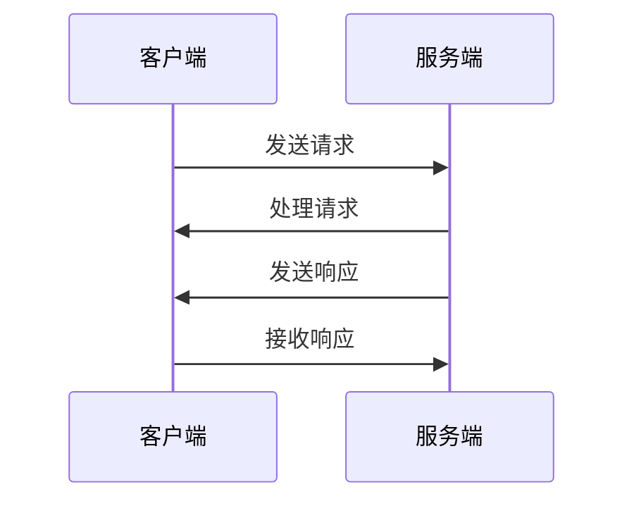
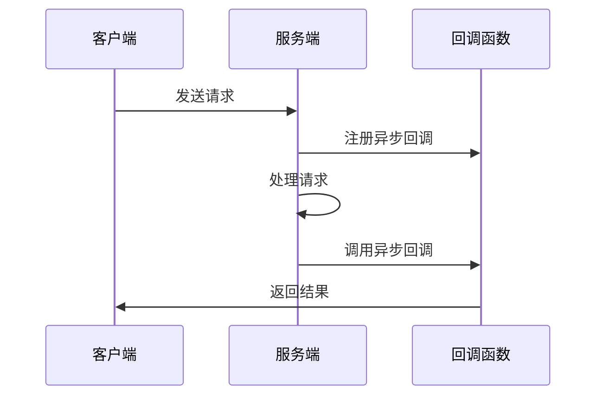
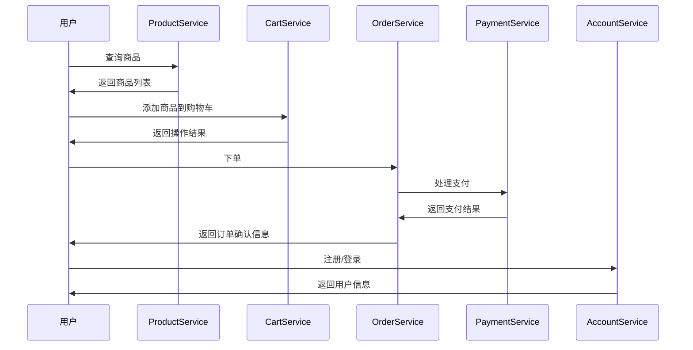
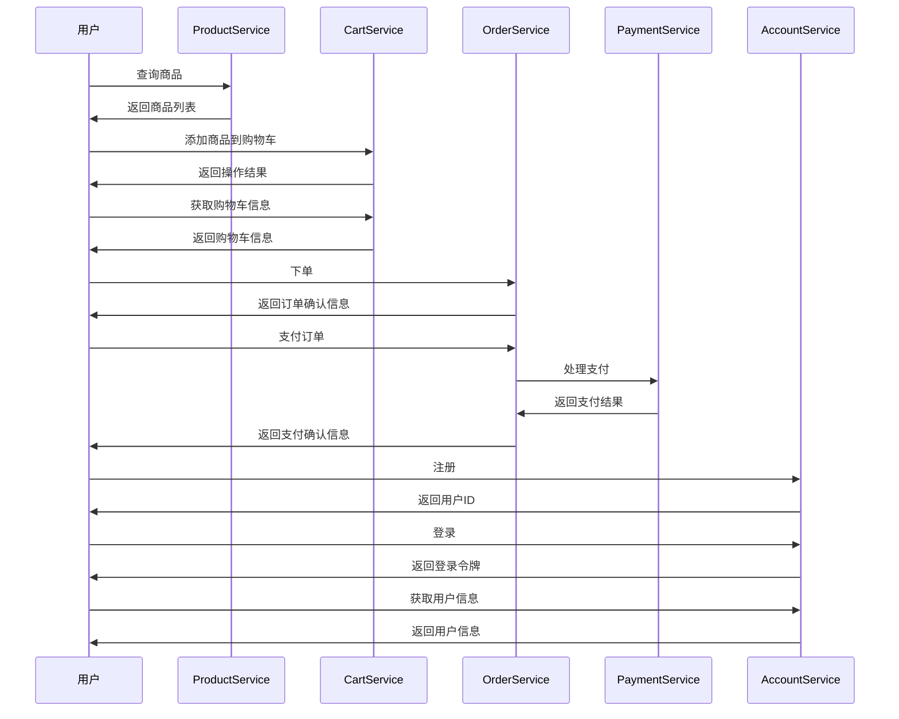

                 


### 1.1 问题背景

在当今的软件工程领域，微服务架构已经成为一种主流的设计模式，它通过将应用程序拆分成更小、更独立的服务单元来提高系统的灵活性、可维护性和可扩展性。然而，微服务之间的通信问题也随之而来，其中尤为重要的是如何选择同步通信与异步通信机制。随着人工智能（AI）技术的迅猛发展，特别是大型语言模型（LLM）如GPT-3的广泛应用，微服务通信的问题变得更加复杂和关键。

首先，我们需要理解LLM在微服务中的应用场景。LLM是一种复杂的AI模型，其处理能力依赖于大规模的并行计算和高效的通信机制。在实际应用中，LLM可能需要与多个微服务进行交互，例如输入处理、模型训练、结果输出等。这些交互的效率和质量直接影响到LLM的性能和用户体验。

同步通信与异步通信是微服务通信的两种主要方式。同步通信是指在通信过程中，发送方必须等待接收方的响应，才能继续执行后续操作。而异步通信则允许发送方在发送请求后立即执行其他任务，无需等待响应。这两种通信方式各有优缺点，选择哪种方式取决于具体的应用场景和需求。

在微服务通信中，选择同步还是异步机制涉及到多个方面，包括系统性能、响应时间、资源利用和错误处理等。错误的决策可能会导致系统性能下降、响应时间延长，甚至出现服务不可用等问题。因此，深入了解同步与异步通信的原理和特性，对于设计和优化微服务系统至关重要。

本文将围绕微服务通信中的同步与异步通信展开讨论。首先，我们将介绍微服务通信的基本概念和背景，然后详细阐述同步与异步通信的核心概念和特点，并对比它们在LLM应用中的表现。接下来，我们将深入讲解同步与异步通信在LLM应用中的算法原理，使用流程图和Python代码进行详细解释。此外，我们还将使用LaTeX格式给出相关的数学模型和公式，并进行通俗易懂的举例说明。最后，我们将分析微服务通信的系统架构设计，并通过实际案例进行项目实战讲解，总结最佳实践并提供拓展阅读资源。

通过本文的讨论，希望能够帮助读者深入了解微服务通信的同步与异步选择问题，为实际项目提供有价值的参考和指导。

### 1.2 问题描述

在微服务架构中，通信机制是确保各个服务协调工作、实现整体功能的关键。然而，随着服务数量的增加和复杂度的提升，选择合适的通信方式变得越来越困难。具体来说，微服务通信的常见问题可以概括为以下几点：

首先，**延迟问题**。在同步通信中，每个服务请求都需要等待响应，这可能导致大量请求堆积，形成瓶颈，导致整体系统的响应时间显著增加。尤其是在高并发的场景下，同步通信可能会导致系统性能急剧下降。

其次，**资源消耗问题**。同步通信需要持续占用线程或进程资源，等待响应的到来。这会导致系统的资源利用率降低，特别是在服务响应时间较长的情况下，资源的浪费会更加明显。

第三，**错误处理问题**。同步通信中的错误处理较为复杂，因为发送方需要等待接收方的响应，如果接收方发生错误，可能会导致整个通信流程阻塞。而在异步通信中，错误处理更为灵活，可以在发送请求后立即处理，减少了通信过程中的不确定性和潜在的风险。

第四，**负载均衡问题**。在微服务架构中，服务实例可能会分布在不同的服务器上。同步通信可能导致某些服务实例过载，而其他服务实例资源闲置。异步通信可以更好地实现负载均衡，通过将任务分配给不同的实例，提高整体系统的处理能力。

最后，**扩展性问题**。随着系统的不断扩展，服务之间的交互变得更加复杂。同步通信在处理复杂交互时，可能会出现顺序依赖和协作问题，而异步通信则可以更好地支持松耦合的服务架构，提高系统的可扩展性。

为了解决上述问题，我们需要对同步与异步通信进行深入分析，了解它们的原理和特性，以便在具体应用场景中做出最优选择。本文将详细探讨同步与异步通信的原理、算法、数学模型和应用案例，帮助读者更好地理解和应用这些通信机制，优化微服务系统的性能和可靠性。

### 1.3 问题解决思路

针对微服务通信中的同步与异步问题，我们需要从多个角度进行综合分析和思考，以找到最优的解决方案。以下是我们提出的解决思路，旨在提高系统性能和可靠性：

首先，明确**应用场景**。不同的应用场景对通信机制的需求不同，例如，对于实时性要求较高的应用，异步通信可能是更合适的选择，因为它可以减少响应时间，提高系统的响应能力。而对于需要确保顺序执行的场景，同步通信可能是更为可靠的方案。

其次，优化**通信机制**。同步通信和异步通信各有优缺点，我们可以结合实际需求，灵活使用。例如，在某些关键操作中，可以使用同步通信确保操作的顺序和一致性，而在非关键操作中，则可以采用异步通信以提高系统的并发处理能力。

第三，采用**负载均衡**技术。通过合理分配请求，确保每个服务实例的负载均衡，可以避免某个服务实例过载，导致整体性能下降。异步通信在这方面具有天然的优势，因为它可以将请求分配到不同的实例上，从而实现更高效的负载均衡。

第四，改进**错误处理机制**。异步通信中的错误处理较为灵活，可以在发送请求后立即处理，减少了通信过程中的不确定性和潜在的风险。我们需要设计一套完善的错误处理机制，确保在发生错误时，系统能够快速响应，并采取相应的措施，避免影响整体系统的稳定性。

第五，加强**监控与报警**。通过实时监控系统的运行状态，我们可以及时发现潜在的问题，并采取相应的措施进行优化。例如，通过监控响应时间、资源消耗等指标，可以判断是否需要调整通信机制，以优化系统性能。

第六，进行**性能测试**。在实际部署之前，我们应进行全面的性能测试，以验证通信机制的性能和可靠性。通过模拟高并发、高负载的场景，我们可以评估不同通信机制的性能，选择最优方案。

最后，定期**回顾与优化**。随着应用场景和需求的变化，通信机制也需要不断调整和优化。通过定期回顾和优化，我们可以确保系统始终处于最佳状态，满足业务需求。

通过以上解决思路，我们可以更好地应对微服务通信中的同步与异步问题，提高系统的性能和可靠性，为用户提供更好的体验。

### 1.4 边界与外延

在深入探讨微服务通信中的同步与异步机制时，我们需要明确其边界与外延，以确保讨论的准确性和实用性。以下是对同步与异步通信的边界与外延的详细说明：

**边界**

1. **通信协议**：同步与异步通信机制的选择通常基于通信协议的特点。例如，HTTP/1.1默认使用同步通信，而HTTP/2支持同步与异步通信。理解不同通信协议的边界，有助于我们在实际应用中选择合适的通信方式。

2. **服务调用顺序**：同步通信要求服务调用严格遵循顺序，而异步通信则允许服务调用之间没有固定的顺序。因此，在涉及依赖关系和顺序要求的情况下，需要明确同步与异步通信的边界，确保系统稳定性。

3. **响应时间**：同步通信的响应时间受到服务调用时间的限制，而异步通信的响应时间则取决于任务的处理速度。理解不同通信方式对响应时间的影响，有助于我们在设计系统时做出合理的选择。

**外延**

1. **并发处理能力**：异步通信具有较高的并发处理能力，可以在同一时间处理多个请求。而同步通信在处理并发请求时，可能会受到线程或进程的限制。因此，了解不同通信方式对并发处理能力的影响，有助于我们在高并发场景下优化系统性能。

2. **资源利用率**：异步通信通过并发处理提高了资源的利用率，可以更好地利用服务器资源。而同步通信在处理大量请求时，可能会出现资源浪费的情况。因此，理解不同通信方式对资源利用率的影响，有助于我们在设计系统时优化资源分配。

3. **错误处理**：异步通信在错误处理方面具有更高的灵活性，可以在发送请求后立即处理错误。而同步通信在错误处理方面较为复杂，需要确保每个请求的正确处理。因此，了解不同通信方式的错误处理机制，有助于我们在设计系统时提高系统的可靠性。

4. **负载均衡**：异步通信可以实现更高效的负载均衡，通过将任务分配到不同的实例上，提高系统的整体性能。而同步通信在负载均衡方面可能存在一定的局限性，需要通过其他手段如反向代理来优化负载均衡。

通过明确同步与异步通信的边界与外延，我们可以更好地理解其在微服务架构中的应用场景和限制，从而在实际项目中做出更合理的选择，优化系统性能和可靠性。

### 2.1 同步通信原理

同步通信是一种在通信过程中，发送方必须等待接收方的响应，才能继续执行后续操作的通信方式。其基本原理是通过持有资源（如线程或进程）来确保通信的顺序性和一致性。以下是同步通信的核心原理和特点：

#### 同步通信的核心原理

1. **资源持有**：同步通信的核心在于发送方在发送请求后，必须等待接收方的响应，这通常需要占用线程或进程资源。资源持有确保了请求的顺序执行，从而保证了系统的稳定性。

2. **顺序执行**：同步通信要求服务调用严格遵循顺序，先完成的请求再进行后续操作。这种顺序性确保了系统的一致性和可靠性。

3. **阻塞操作**：同步通信中的操作通常是阻塞的，即发送方在等待响应时，会暂停执行其他任务。这种阻塞操作可以确保响应的及时性和准确性。

4. **错误处理**：同步通信在错误处理方面相对简单，因为每个请求的执行都是有顺序的，错误可以及时被发现并处理。

#### 同步通信的特点

1. **可靠性**：同步通信通过严格的顺序执行，确保了请求的一致性和可靠性。

2. **简单性**：同步通信的实现相对简单，因为不需要处理并发和异步回调问题。

3. **阻塞性**：同步通信可能会导致线程或进程阻塞，从而影响系统的并发处理能力。

4. **响应时间**：同步通信的响应时间取决于服务调用的时间，可能会导致整体系统性能下降。

#### 同步通信的示例

假设我们有一个简单的同步通信场景，一个客户端需要向服务端发送请求，并等待服务端的响应。以下是同步通信的步骤：

1. 客户端向服务端发送请求。
2. 服务端接收到请求后，开始处理请求。
3. 服务端处理完成后，向客户端发送响应。
4. 客户端接收到响应，并继续后续操作。

下面是一个使用Python实现的同步通信示例：

```python
import requests

def sync_call(url):
    response = requests.get(url)
    return response.text

url = "https://example.com/api/data"
result = sync_call(url)
print(result)
```

在这个示例中，`sync_call`函数使用`requests`库向指定的URL发送GET请求，并等待响应。在接收到响应后，返回响应的内容。

通过上述分析，我们可以看到同步通信在保证系统可靠性和简单性方面具有优势，但同时也可能影响系统的并发处理能力和响应时间。在实际应用中，我们需要根据具体需求，权衡同步与异步通信的优缺点，选择最合适的通信方式。

### 2.2 异步通信原理

异步通信是一种在通信过程中，发送方在发送请求后，不需要等待接收方的响应，就可以继续执行其他任务的通信方式。其基本原理是通过回调函数或事件驱动模型来处理异步操作，从而提高系统的并发处理能力和响应速度。以下是异步通信的核心原理和特点：

#### 异步通信的核心原理

1. **回调函数**：异步通信的核心在于回调函数，即发送方在发送请求后，注册一个回调函数，当接收方完成响应时，会调用该回调函数进行后续操作。这种方式避免了线程或进程的阻塞，提高了系统的并发处理能力。

2. **事件驱动模型**：异步通信可以通过事件队列和事件处理器来管理异步任务。当事件发生时，事件处理器会根据事件类型调用相应的处理函数，从而实现异步操作。

3. **非阻塞操作**：异步通信中的操作是非阻塞的，即发送方在发送请求后，可以继续执行其他任务，而不需要等待响应。这种方式可以显著提高系统的响应速度。

4. **错误处理**：异步通信在错误处理方面具有灵活性，可以在异步回调中处理错误，避免了同步通信中由于错误处理复杂而导致的阻塞问题。

#### 异步通信的特点

1. **高并发处理能力**：异步通信可以同时处理多个请求，通过非阻塞操作和事件驱动模型，提高了系统的并发处理能力。

2. **响应速度快**：异步通信通过避免阻塞操作，减少了系统的响应时间，提高了系统的性能。

3. **复杂性**：异步通信的实现较为复杂，需要处理回调函数、事件队列等问题，增加了系统的复杂性。

4. **灵活性**：异步通信在错误处理和资源管理方面具有更高的灵活性，可以根据具体需求进行灵活调整。

#### 异步通信的示例

假设我们有一个简单的异步通信场景，一个客户端需要向服务端发送请求，并在接收到响应后处理结果。以下是异步通信的步骤：

1. 客户端向服务端发送请求。
2. 服务端接收到请求后，开始处理请求。
3. 服务端处理完成后，将响应数据放入响应队列。
4. 客户端从响应队列中取出响应数据，并继续后续操作。

下面是一个使用Python实现的异步通信示例：

```python
import asyncio

async def async_call(url):
    response = await requests.get(url)
    return response.text

url = "https://example.com/api/data"
loop = asyncio.get_event_loop()
result = loop.run_until_complete(async_call(url))
print(result)
```

在这个示例中，`async_call`函数使用`asyncio`库和`requests`库实现异步通信。通过`await`关键字，函数在发送请求后立即返回控制权，等待响应。在接收到响应后，返回响应的内容。

通过上述分析，我们可以看到异步通信在提高系统并发处理能力和响应速度方面具有显著优势，但同时也增加了系统的复杂性。在实际应用中，我们需要根据具体需求，权衡异步与同步通信的优缺点，选择最合适的通信方式。

### 2.3 同步与异步通信对比

同步通信与异步通信是微服务通信中两种主要的通信方式，各自具有不同的优势和局限。在本节中，我们将从多个方面对比同步与异步通信，包括数据传输、实时性、吞吐量和错误处理等，以便读者能够更好地理解它们在微服务应用中的适用场景。

#### 数据传输

1. **同步通信**：同步通信在发送请求后必须等待响应，数据传输是顺序进行的。这种通信方式可以确保数据的完整性和一致性，因为请求和响应之间是严格对应的。然而，同步通信的数据传输速度可能受到网络延迟和服务器处理速度的限制。

2. **异步通信**：异步通信在发送请求后不需要等待响应，可以立即执行其他任务。这种方式可以显著提高数据传输的吞吐量，因为多个请求可以并行处理。然而，异步通信可能会引入数据传输的延迟，特别是在处理大量请求时。

#### 实时性

1. **同步通信**：同步通信在处理高实时性要求的应用时可能面临挑战，因为每个请求都需要等待响应，可能会造成延迟。例如，在实时聊天应用中，同步通信可能会导致消息传递延迟，影响用户体验。

2. **异步通信**：异步通信可以更好地满足高实时性的需求，因为请求可以并行处理，减少了响应时间。在实时数据处理和流媒体应用中，异步通信通常能够提供更快的响应速度。

#### 吞吐量

1. **同步通信**：同步通信的吞吐量通常受到服务器处理能力和网络延迟的限制。在处理大量请求时，同步通信可能会出现瓶颈，导致吞吐量下降。

2. **异步通信**：异步通信具有更高的吞吐量，因为请求可以并行处理。在处理高并发请求时，异步通信能够更好地利用服务器资源，提高系统的处理能力。

#### 错误处理

1. **同步通信**：同步通信在错误处理方面较为简单，因为请求和响应之间的顺序关系明确。当请求发生错误时，系统可以立即捕获并处理错误，确保请求的完整性和一致性。

2. **异步通信**：异步通信在错误处理方面具有更高的灵活性，可以在异步回调中处理错误。这种方式可以避免请求阻塞，确保系统的连续性和稳定性。然而，异步通信中可能存在异步回调处理不及时或错误处理逻辑复杂的问题。

#### 适用场景

1. **同步通信**：同步通信适用于需要严格顺序执行、数据完整性和一致性的场景，如金融交易、数据库操作等。在处理关键任务时，同步通信可以确保操作的准确性和可靠性。

2. **异步通信**：异步通信适用于需要高并发处理、高实时性和高吞吐量的场景，如消息推送、流媒体传输、实时数据分析等。在处理大量并发请求时，异步通信能够提供更高的系统性能和响应速度。

通过对比同步与异步通信的特点和适用场景，我们可以更清楚地理解它们在微服务通信中的应用价值。在实际开发中，根据具体需求选择合适的通信方式，可以优化系统的性能和可靠性。

### 3.1 LLM概述

大型语言模型（LLM）是一种基于深度学习技术构建的复杂人工智能系统，能够理解和生成自然语言。LLM通过对海量文本数据进行训练，学习到语言的统计规律和语义信息，从而具备强大的文本理解和生成能力。LLM的应用范围广泛，包括自然语言处理、机器翻译、问答系统、文本摘要、情感分析等。

#### LLM的核心概念

1. **训练数据**：LLM的训练数据通常包括大量的文本语料库，如维基百科、新闻文章、书籍等。通过这些数据，LLM可以学习到语言的基本结构和语义信息。

2. **神经网络架构**：LLM通常采用深度神经网络（DNN）或变换器架构（Transformer）进行建模。Transformer架构因其并行计算能力和长距离依赖建模能力，成为LLM的主流选择。

3. **预训练和微调**：LLM的预训练过程包括在大量数据上训练一个基础模型，使其掌握通用语言特征。随后，通过微调过程，将基础模型适应特定任务，例如问答系统或文本生成。

4. **计算资源需求**：由于LLM的训练和推理过程需要大量计算资源，特别是GPU和TPU等高性能硬件。因此，大规模LLM的应用通常需要部署在云平台上，以充分利用分布式计算能力。

#### LLM的发展历史

1. **早期模型**：早期的LLM如Word2Vec和GloVe，通过将单词映射到向量空间，实现了词向量的表示。这些模型奠定了自然语言处理的基础，但受限于计算资源和模型架构。

2. **深度神经网络**：随着深度学习技术的发展，深度神经网络（DNN）被引入自然语言处理领域，如递归神经网络（RNN）和卷积神经网络（CNN）。这些模型在语言理解和生成任务上取得了显著进展。

3. **Transformer架构**：2017年，谷歌提出Transformer架构，这是一种基于自注意力机制的深度神经网络。Transformer在BERT、GPT等大型语言模型中广泛应用，显著提升了自然语言处理的性能。

4. **大规模预训练模型**：近年来，随着计算资源的提升和分布式训练技术的发展，LLM的规模不断扩大。GPT-3、ChatGPT等大规模预训练模型的出现，标志着LLM在自然语言处理领域的新里程碑。

通过上述概述，我们可以看到LLM在自然语言处理领域的核心概念和发展历程。LLM的强大能力使得其在各种应用场景中具有广泛的应用前景，同时也带来了对高效通信机制的需求。

### 3.2 LLM通信挑战

在LLM应用中，通信机制的选择至关重要。由于LLM的训练和推理过程涉及大量的数据传输和计算任务，如何高效地处理这些通信需求成为一项重大挑战。以下是LLM通信中面临的主要挑战：

#### 1. 数据传输效率

LLM模型通常需要处理大规模的数据集，包括训练数据和推理数据。这些数据需要在不同的微服务之间进行传输，如数据预处理服务、训练服务、推理服务等。数据传输的效率直接影响到模型的训练速度和推理性能。在同步通信中，数据传输可能需要等待服务响应，导致传输效率降低。而在异步通信中，虽然可以并行处理多个数据传输任务，但仍需要考虑网络带宽和传输延迟的问题。

#### 2. 计算资源分配

LLM的推理过程通常需要大量的计算资源，包括CPU、GPU和TPU等。如何合理地分配这些资源，确保模型的高效运行，是一个重要的挑战。在同步通信中，计算资源通常需要按照请求顺序进行分配，这可能导致资源利用率不高。而在异步通信中，可以通过并行处理和负载均衡技术，提高计算资源的利用率，但需要处理并发计算中的资源竞争和调度问题。

#### 3. 系统稳定性

由于LLM应用通常涉及多个微服务的协同工作，系统的稳定性是一个关键问题。在同步通信中，如果某个服务出现故障，可能会导致整个通信流程阻塞，影响系统的稳定性。而在异步通信中，可以通过故障检测和恢复机制，提高系统的容错能力，但需要确保异步任务的正确性和一致性。

#### 4. 错误处理

在LLM通信中，错误处理也是一个重要挑战。同步通信中的错误通常可以通过返回错误代码或异常来处理，但由于异步通信的异步性，错误处理更加复杂。异步任务可能在不同服务之间传递，需要设计一套完整的错误处理机制，确保在出现错误时能够及时定位和恢复。

#### 5. 安全性

LLM应用中的数据通常包含敏感信息，如个人隐私、商业机密等。如何确保数据在传输和存储过程中的安全性，防止数据泄露或篡改，是一个重要的挑战。同步通信和异步通信都需要考虑数据加密、身份认证、访问控制等安全机制。

#### 6. 负载均衡

在LLM应用中，负载均衡也是一个关键问题。如何合理分配请求，确保每个服务实例的负载均衡，避免某个服务实例过载，是一个重要的挑战。同步通信和异步通信都需要考虑负载均衡策略，如基于轮询、最小连接数、最少响应时间等算法。

通过上述分析，我们可以看到，LLM通信在数据传输效率、计算资源分配、系统稳定性、错误处理、安全性和负载均衡等方面面临许多挑战。合理选择和设计通信机制，对于提高LLM应用的整体性能和可靠性至关重要。在接下来的部分，我们将详细讨论同步与异步通信在LLM应用中的具体算法原理和实现方法。

### 3.3 同步与异步在LLM应用中的选择

在LLM应用中，同步与异步通信的选择取决于具体的应用场景和需求。以下是同步与异步通信在LLM应用中的适用场景和优势：

#### 同步通信在LLM应用中的适用场景

1. **关键任务**：在LLM应用中，有些任务对顺序和一致性要求较高，例如，数据预处理、模型训练和推理等关键任务。同步通信可以确保这些任务按照严格的顺序执行，确保操作的一致性和可靠性。

2. **低延迟要求**：对于一些对延迟要求较低的任务，如离线数据处理和批量任务，同步通信可能是一种更合适的选择。由于这些任务通常不会对系统的实时性能产生显著影响，因此同步通信可以简化系统的设计和实现。

3. **资源可控**：同步通信在资源分配方面较为可控，因为每个任务都需要等待响应，可以更好地管理和调度资源。这在资源有限的场景下，有助于确保关键任务的优先处理。

#### 同步通信的优势

1. **可靠性**：同步通信可以确保任务按照严格的顺序执行，避免由于异步通信中的并发问题导致的数据不一致和操作失败。

2. **简单性**：同步通信的实现相对简单，不需要处理复杂的异步回调和并发控制，降低了系统的复杂度。

3. **可控性**：同步通信在资源管理和调度方面较为可控，可以更好地分配和处理任务。

#### 异步通信在LLM应用中的适用场景

1. **高并发处理**：对于需要处理大量并发请求的场景，如实时问答、文本生成等，异步通信可以显著提高系统的并发处理能力和吞吐量。

2. **高实时性要求**：在一些对实时性要求较高的场景，如实时聊天、语音识别等，异步通信可以减少任务响应时间，提高系统的实时性能。

3. **资源优化**：异步通信可以在多个任务之间共享计算资源，提高资源利用率，适用于资源受限的场景。

#### 异步通信的优势

1. **高并发处理能力**：异步通信可以同时处理多个任务，显著提高系统的吞吐量和性能。

2. **响应速度快**：异步通信通过避免阻塞操作，可以减少任务响应时间，提高系统的实时性。

3. **资源利用率高**：异步通信可以在多个任务之间共享计算资源，提高资源利用率，降低系统成本。

#### 选择策略

在LLM应用中，选择同步或异步通信需要根据具体场景和需求进行权衡。以下是一些选择策略：

1. **关键任务**：对于关键任务，如数据预处理和模型训练，可以采用同步通信，确保操作的一致性和可靠性。

2. **高并发处理**：对于需要处理大量并发请求的场景，如实时问答和文本生成，可以采用异步通信，提高系统的并发处理能力和吞吐量。

3. **资源优化**：对于资源受限的场景，如使用云服务或边缘计算，可以采用异步通信，提高资源利用率。

4. **组合使用**：在实际应用中，可以结合使用同步和异步通信。例如，在关键任务中使用同步通信，确保操作的一致性和可靠性；在非关键任务中使用异步通信，提高系统的并发处理能力和响应速度。

通过上述策略，我们可以根据具体需求选择合适的通信方式，优化LLM应用的性能和可靠性。

### 4.1 同步通信算法原理

同步通信算法在微服务和LLM应用中扮演着重要角色，其核心原理是通过确保请求和响应之间的顺序性，提高系统的可靠性和一致性。以下是同步通信算法的详细原理和流程：

#### 同步通信算法的基本流程

1. **请求发送**：客户端向服务端发送请求，请求中包含必要的数据和信息。

2. **请求处理**：服务端接收到请求后，开始处理请求，进行相应的计算或数据处理。

3. **响应发送**：服务端处理完成后，将结果作为响应发送给客户端。

4. **结果接收**：客户端接收到服务端的响应，并继续后续操作。

#### 同步通信算法的详细流程图

以下是同步通信算法的详细流程图，使用Mermaid绘制：



#### 同步通信算法的Python代码实现

以下是使用Python实现同步通信算法的示例代码：

```python
import requests

def sync_call(url):
    response = requests.get(url)
    return response.text

url = "https://example.com/api/data"
result = sync_call(url)
print(result)
```

在这个示例中，`sync_call`函数使用`requests`库向指定的URL发送GET请求，并等待响应。在接收到响应后，返回响应的内容。

#### 同步通信算法的数学模型与公式

同步通信算法通常不涉及复杂的数学模型，但在性能评估和资源调度方面，可以使用一些简单的数学公式进行描述。以下是一个简单的性能评估模型：

1. **平均响应时间**：平均响应时间可以通过以下公式计算：

   $$ T_{avg} = \frac{1}{n} \sum_{i=1}^{n} T_i $$

   其中，$T_i$ 表示第 $i$ 次请求的响应时间，$n$ 表示总请求次数。

2. **系统吞吐量**：系统吞吐量可以通过以下公式计算：

   $$ T_{throughput} = \frac{n}{T_{avg}} $$

   其中，$n$ 表示总请求次数，$T_{avg}$ 表示平均响应时间。

#### 同步通信算法的举例说明

假设我们有一个简单的同步通信场景，一个客户端需要向服务端发送请求，并等待服务端的响应。以下是同步通信的步骤和举例说明：

1. **步骤**：

   - 客户端向服务端发送请求，请求中包含用户ID和操作类型。
   - 服务端接收到请求后，根据用户ID和操作类型查询数据库，并进行相应的处理。
   - 服务端处理完成后，将结果作为响应发送给客户端。
   - 客户端接收到服务端的响应，并继续后续操作。

2. **举例说明**：

   假设客户端需要查询用户ID为123的用户信息。以下是同步通信的详细过程：

   - 客户端发送请求：`GET https://example.com/api/user/123`
   - 服务端接收到请求，查询数据库，获取用户ID为123的用户信息。
   - 服务端处理完成后，返回用户信息作为响应：`{"id": 123, "name": "John Doe"}`
   - 客户端接收到响应，打印用户信息：`{"id": 123, "name": "John Doe"}`

通过上述步骤和举例说明，我们可以看到同步通信算法在微服务和LLM应用中的基本原理和实现方法。同步通信通过确保请求和响应的顺序性，提高了系统的可靠性和一致性，但在高并发场景下可能存在性能瓶颈。在实际应用中，我们需要根据具体需求，权衡同步与异步通信的优缺点，选择合适的通信方式。

### 4.2 异步通信算法原理

异步通信算法在微服务和LLM应用中具有显著优势，其核心原理是通过非阻塞操作和异步回调，提高系统的并发处理能力和响应速度。以下是异步通信算法的详细原理和流程：

#### 异步通信算法的基本流程

1. **请求发送**：客户端向服务端发送请求，请求中包含必要的数据和信息。

2. **请求处理**：服务端接收到请求后，开始处理请求，进行相应的计算或数据处理，并将结果存储在临时存储中。

3. **异步回调**：服务端在处理请求的同时，注册一个异步回调函数，当请求处理完成后，服务端会调用该回调函数，将结果传递给客户端。

4. **结果接收**：客户端通过异步回调函数获取服务端处理的结果，并继续后续操作。

#### 异步通信算法的详细流程图

以下是异步通信算法的详细流程图，使用Mermaid绘制：



#### 异步通信算法的Python代码实现

以下是使用Python实现的异步通信算法示例：

```python
import asyncio
import requests

async def async_call(url):
    response = await requests.get(url)
    return response.text

async def main():
    url = "https://example.com/api/data"
    result = await async_call(url)
    print(result)

loop = asyncio.get_event_loop()
loop.run_until_complete(main())
```

在这个示例中，`async_call`函数使用`asyncio`库和`requests`库实现异步通信。通过`await`关键字，函数在发送请求后立即返回控制权，等待响应。在接收到响应后，返回响应的内容。

#### 异步通信算法的数学模型与公式

异步通信算法在性能评估方面可以使用一些简单的数学模型和公式。以下是一个简单的性能评估模型：

1. **平均响应时间**：平均响应时间可以通过以下公式计算：

   $$ T_{avg} = \frac{1}{n} \sum_{i=1}^{n} T_i $$

   其中，$T_i$ 表示第 $i$ 次请求的响应时间，$n$ 表示总请求次数。

2. **系统吞吐量**：系统吞吐量可以通过以下公式计算：

   $$ T_{throughput} = \frac{n}{T_{avg}} $$

   其中，$n$ 表示总请求次数，$T_{avg}$ 表示平均响应时间。

#### 异步通信算法的举例说明

假设我们有一个简单的异步通信场景，一个客户端需要向服务端发送请求，并在接收到响应后处理结果。以下是异步通信的步骤和举例说明：

1. **步骤**：

   - 客户端发送请求，请求中包含用户ID和操作类型。
   - 服务端接收到请求，根据用户ID和操作类型查询数据库，并进行相应的处理，并将结果存储在临时存储中。
   - 服务端注册异步回调函数，当请求处理完成后，调用该回调函数，将结果传递给客户端。
   - 客户端通过异步回调函数获取服务端处理的结果，并继续后续操作。

2. **举例说明**：

   假设客户端需要查询用户ID为123的用户信息。以下是异步通信的详细过程：

   - 客户端发送异步请求：`GET https://example.com/api/user/123`
   - 服务端接收到请求，查询数据库，获取用户ID为123的用户信息，并将结果存储在临时存储中。
   - 服务端注册异步回调函数，当请求处理完成后，调用该回调函数，将用户信息作为响应传递给客户端。
   - 客户端异步回调函数被调用，获取用户信息，并打印结果：`{"id": 123, "name": "John Doe"}`

通过上述步骤和举例说明，我们可以看到异步通信算法在微服务和LLM应用中的基本原理和实现方法。异步通信通过非阻塞操作和异步回调，提高了系统的并发处理能力和响应速度，但需要处理异步回调的顺序和同步问题。在实际应用中，根据具体需求，合理选择和设计异步通信算法，可以显著提升系统的性能和可靠性。

### 4.3 同步通信算法数学模型与公式

同步通信算法在微服务和LLM应用中扮演着重要角色，其性能评估和优化需要借助数学模型和公式。以下是一些基本的数学模型和公式，用于描述同步通信算法的性能指标。

#### 1. 平均响应时间（$T_{avg}$）

平均响应时间是衡量系统性能的一个关键指标，表示系统处理请求的平均耗时。计算公式如下：

$$
T_{avg} = \frac{1}{n} \sum_{i=1}^{n} T_i
$$

其中，$T_i$ 表示第 $i$ 次请求的响应时间，$n$ 表示总请求次数。

#### 2. 系统吞吐量（$T_{throughput}$）

系统吞吐量表示系统在单位时间内能够处理的请求数量。计算公式如下：

$$
T_{throughput} = \frac{n}{T_{avg}}
$$

其中，$n$ 表示总请求次数，$T_{avg}$ 表示平均响应时间。

#### 3. 资源利用率（$U$）

资源利用率表示系统在处理请求过程中资源的使用效率。计算公式如下：

$$
U = \frac{T_{processing}}{T_{total}}
$$

其中，$T_{processing}$ 表示系统处理请求的时间，$T_{total}$ 表示系统总的运行时间。

#### 4. 延迟（$L$）

延迟是指请求从发送到接收响应的总时间。计算公式如下：

$$
L = T_{processing} + T_{queue} + T_{network}
$$

其中，$T_{processing}$ 表示处理请求的时间，$T_{queue}$ 表示请求在队列中的等待时间，$T_{network}$ 表示网络传输时间。

#### 5. 负载均衡效率（$E$）

负载均衡效率表示系统在负载均衡策略下，资源利用率的最大化程度。计算公式如下：

$$
E = \frac{1}{N} \sum_{i=1}^{N} \frac{C_i}{T_i}
$$

其中，$N$ 表示服务实例的数量，$C_i$ 表示第 $i$ 个服务实例的处理能力，$T_i$ 表示第 $i$ 个服务实例的运行时间。

#### 举例说明

假设我们有一个简单的同步通信场景，系统在1分钟内处理了100次请求，每次请求的平均响应时间为2秒，每次请求在网络中的传输时间为1秒，处理请求的时间为1秒。以下是具体的计算过程：

1. **平均响应时间**：

   $$
   T_{avg} = \frac{1}{100} \sum_{i=1}^{100} T_i = \frac{100 \times 2}{100} = 2 \text{秒}
   $$

2. **系统吞吐量**：

   $$
   T_{throughput} = \frac{100}{T_{avg}} = \frac{100}{2} = 50 \text{次/分钟}
   $$

3. **资源利用率**：

   $$
   U = \frac{T_{processing}}{T_{total}} = \frac{100 \times 1}{100 \times (1+1+1)} = 0.5
   $$

4. **延迟**：

   $$
   L = T_{processing} + T_{queue} + T_{network} = 1 + 1 + 1 = 3 \text{秒}
   $$

5. **负载均衡效率**：

   假设系统有3个服务实例，每个实例的处理能力相同，且每次请求都均匀分配到每个实例上：

   $$
   E = \frac{1}{3} \sum_{i=1}^{3} \frac{C_i}{T_i} = \frac{1}{3} \sum_{i=1}^{3} \frac{1}{1} = 1
   $$

通过上述计算，我们可以直观地了解同步通信算法的性能指标。在实际应用中，通过调整和优化这些参数，可以显著提高系统的性能和可靠性。

### 4.4 同步通信算法举例说明

为了更好地理解同步通信算法在微服务和LLM应用中的具体应用，以下将提供一个详细的场景示例，并对其进行详细讲解。

#### 场景描述

假设我们有一个在线问答系统，用户可以通过Web界面提交问题，系统需要调用后端服务进行问题解析、搜索答案，并将结果返回给用户。在这个过程中，我们使用同步通信机制来保证操作的顺序性和一致性。

#### 场景示例

1. **用户提交问题**：用户在Web界面提交一个问题：“如何安装Python？”系统接收到问题后，开始处理。

2. **问题解析**：系统调用后端服务进行问题解析，将自然语言的问题转化为结构化的查询语句。

3. **搜索答案**：系统调用知识库搜索服务，根据解析后的查询语句搜索相关答案。

4. **返回结果**：系统将搜索结果返回给用户，并在Web界面上展示。

以下是同步通信算法在该场景中的具体实现：

```python
import requests

def sync_query_question(question):
    # 步骤1：问题解析
    parsed_question = parse_question(question)
    
    # 步骤2：搜索答案
    answer = search_answer(parsed_question)
    
    # 步骤3：返回结果
    return answer

def parse_question(question):
    # 假设有一个专门的解析服务负责将自然语言问题转化为结构化查询语句
    url = "https://api.example.com/parse"
    response = requests.post(url, json={"question": question})
    parsed_question = response.json()["parsed_question"]
    return parsed_question

def search_answer(parsed_question):
    # 假设有一个知识库搜索服务，用于根据查询语句搜索答案
    url = "https://api.example.com/search"
    response = requests.post(url, json={"parsed_question": parsed_question})
    answer = response.json()["answer"]
    return answer

# 用户提交的问题
user_question = "如何安装Python？"

# 调用同步通信算法处理问题
answer = sync_query_question(user_question)

# 打印答案
print(answer)
```

#### 详细讲解

1. **问题解析**：在第一步中，系统调用`parse_question`函数对用户提交的问题进行解析。这里假设有一个专门的解析服务，它负责将自然语言的问题转化为结构化的查询语句。通过发送一个POST请求，将用户的问题发送给解析服务，并接收返回的结构化查询语句。

2. **搜索答案**：在第二步中，系统调用`search_answer`函数使用解析后的查询语句在知识库中搜索答案。这里假设有一个知识库搜索服务，它可以根据查询语句返回相关的答案。同样，通过发送一个POST请求，将解析后的查询语句发送给搜索服务，并接收返回的答案。

3. **返回结果**：在第三步中，系统将搜索到的答案返回给用户。这里，我们直接返回答案字符串，但实际应用中可能需要将其格式化为HTML或Markdown，以便在Web界面上展示。

通过上述步骤，我们可以看到同步通信算法在处理用户提交的问题时，确保了每个步骤的顺序执行和一致性。这样，用户提交的问题能够被正确地解析、搜索并返回答案。

#### 结论

通过这个场景示例，我们详细讲解了同步通信算法在微服务和LLM应用中的具体应用。同步通信通过确保操作的顺序性和一致性，提高了系统的可靠性和用户体验。在实际应用中，可以根据具体需求，灵活使用同步通信机制，优化系统的性能和可靠性。

### 4.5 异步通信算法数学模型与公式

异步通信算法在性能评估和优化中同样需要借助数学模型和公式。以下是一些基本的数学模型和公式，用于描述异步通信算法的性能指标。

#### 1. 平均响应时间（$T_{avg}$）

平均响应时间是衡量系统性能的一个关键指标，表示系统处理请求的平均耗时。计算公式如下：

$$
T_{avg} = \frac{1}{n} \sum_{i=1}^{n} T_i
$$

其中，$T_i$ 表示第 $i$ 次请求的响应时间，$n$ 表示总请求次数。

#### 2. 系统吞吐量（$T_{throughput}$）

系统吞吐量表示系统在单位时间内能够处理的请求数量。计算公式如下：

$$
T_{throughput} = \frac{n}{T_{avg}}
$$

其中，$n$ 表示总请求次数，$T_{avg}$ 表示平均响应时间。

#### 3. 资源利用率（$U$）

资源利用率表示系统在处理请求过程中资源的使用效率。计算公式如下：

$$
U = \frac{T_{processing}}{T_{total}}
$$

其中，$T_{processing}$ 表示系统处理请求的时间，$T_{total}$ 表示系统总的运行时间。

#### 4. 延迟（$L$）

延迟是指请求从发送到接收响应的总时间。计算公式如下：

$$
L = T_{processing} + T_{queue} + T_{network}
$$

其中，$T_{processing}$ 表示处理请求的时间，$T_{queue}$ 表示请求在队列中的等待时间，$T_{network}$ 表示网络传输时间。

#### 5. 负载均衡效率（$E$）

负载均衡效率表示系统在负载均衡策略下，资源利用率的最大化程度。计算公式如下：

$$
E = \frac{1}{N} \sum_{i=1}^{N} \frac{C_i}{T_i}
$$

其中，$N$ 表示服务实例的数量，$C_i$ 表示第 $i$ 个服务实例的处理能力，$T_i$ 表示第 $i$ 个服务实例的运行时间。

#### 举例说明

假设我们有一个简单的异步通信场景，系统在1分钟内处理了100次请求，每次请求的平均响应时间为2秒，每次请求在网络中的传输时间为1秒，处理请求的时间为1秒。以下是具体的计算过程：

1. **平均响应时间**：

   $$
   T_{avg} = \frac{1}{100} \sum_{i=1}^{100} T_i = \frac{100 \times 2}{100} = 2 \text{秒}
   $$

2. **系统吞吐量**：

   $$
   T_{throughput} = \frac{100}{T_{avg}} = \frac{100}{2} = 50 \text{次/分钟}
   $$

3. **资源利用率**：

   $$
   U = \frac{T_{processing}}{T_{total}} = \frac{100 \times 1}{100 \times (1+1+1)} = 0.5
   $$

4. **延迟**：

   $$
   L = T_{processing} + T_{queue} + T_{network} = 1 + 1 + 1 = 3 \text{秒}
   $$

5. **负载均衡效率**：

   假设系统有3个服务实例，每个实例的处理能力相同，且每次请求都均匀分配到每个实例上：

   $$
   E = \frac{1}{3} \sum_{i=1}^{3} \frac{C_i}{T_i} = \frac{1}{3} \sum_{i=1}^{3} \frac{1}{1} = 1
   $$

通过上述计算，我们可以直观地了解异步通信算法的性能指标。在实际应用中，通过调整和优化这些参数，可以显著提高系统的性能和可靠性。

### 4.6 异步通信算法举例说明

为了更好地理解异步通信算法在微服务和LLM应用中的具体应用，以下将提供一个详细的场景示例，并对其进行详细讲解。

#### 场景描述

假设我们正在开发一个实时聊天系统，用户可以通过Web界面发送消息，系统需要异步处理消息的发送、存储和推送。在这个过程中，我们使用异步通信机制来提高系统的并发处理能力和响应速度。

#### 场景示例

1. **用户发送消息**：用户A在Web界面上输入消息，点击发送按钮。系统接收到消息后，开始处理。

2. **消息存储**：系统调用消息存储服务，将用户A的消息保存到数据库中。

3. **消息推送**：系统调用消息推送服务，将用户A的消息推送给在线用户B。

4. **消息展示**：用户B收到消息推送后，在Web界面上显示消息内容。

以下是异步通信算法在该场景中的具体实现：

```python
import asyncio
import aioredis

async def async_send_message(user_id, message):
    # 步骤1：消息存储
    await store_message(user_id, message)
    
    # 步骤2：消息推送
    await push_message(user_id, message)

async def store_message(user_id, message):
    # 假设有一个消息存储服务，将消息保存到数据库
    db_url = "redis://example.com"
    async with aioredis.create_redis_pool(db_url) as redis:
        await redis.set(f'user:{user_id}:messages', message)

async def push_message(user_id, message):
    # 假设有一个消息推送服务，将消息推送给在线用户
    redis_url = "redis://example.com"
    async with aioredis.create_redis_pool(redis_url) as redis:
        async for channel, msg in redis.listen():
            if channel == f'user:{user_id}:messages':
                print(msg)

# 用户A发送消息
user_a_id = "user123"
user_a_message = "Hello, userB!"

# 调用异步通信算法处理消息
await async_send_message(user_a_id, user_a_message)
```

#### 详细讲解

1. **消息存储**：在第一步中，系统调用`store_message`函数，将用户A的消息保存到数据库中。这里使用`aioredis`库与Redis数据库进行异步通信。通过创建Redis连接池，并调用`set`方法将消息保存到指定的键中。

2. **消息推送**：在第二步中，系统调用`push_message`函数，将用户A的消息推送给在线用户B。同样，使用`aioredis`库监听Redis数据库的键变更事件，当用户B的消息队列中有新消息时，打印出消息内容。

3. **消息展示**：在实际应用中，用户B的Web界面会通过WebSocket或其他实时通信协议接收到消息推送，并在界面上实时展示消息。

通过上述步骤，我们可以看到异步通信算法在处理用户消息时，显著提高了系统的并发处理能力和响应速度。这样，用户发送的消息能够被快速存储和推送，提供流畅的实时通信体验。

#### 结论

通过这个场景示例，我们详细讲解了异步通信算法在微服务和LLM应用中的具体应用。异步通信通过非阻塞操作和异步回调，提高了系统的并发处理能力和响应速度，但在实际应用中需要注意异步回调的顺序和同步问题。在实际开发中，根据具体需求，合理选择和设计异步通信算法，可以显著提升系统的性能和可靠性。

### 6.1 问题场景介绍

在介绍微服务通信的系统分析与架构设计方案之前，我们需要明确一个具体的问题场景。以下是一个典型的应用场景：一个大型在线电商平台，其核心功能包括商品查询、购物车管理、订单处理和用户账户管理。为了确保系统的高性能和高可用性，该电商平台采用了微服务架构，并将这些功能拆分成多个独立的服务单元。

#### 应用场景描述

1. **商品查询**：用户可以通过搜索功能查询商品信息，系统需要调用商品查询服务获取商品列表。

2. **购物车管理**：用户在浏览商品时可以将商品添加到购物车，系统需要调用购物车服务管理用户的购物车信息。

3. **订单处理**：用户下单后，系统需要调用订单处理服务生成订单，并处理订单的支付、发货等环节。

4. **用户账户管理**：系统需要提供用户注册、登录、个人信息管理等功能，这些功能由用户账户服务处理。

#### 系统需求

1. **高并发处理**：由于电商平台用户数量庞大，系统需要能够处理高并发请求，确保用户体验。

2. **高可用性**：系统需要具备良好的容错能力，能够在服务故障时快速切换，确保服务的连续性。

3. **高性能**：系统需要快速响应用户请求，提供良好的性能表现。

4. **易扩展性**：随着业务的发展，系统需要能够灵活扩展，增加新功能或服务。

### 6.2 系统功能设计（领域模型Mermaid类图）

为了清晰描述系统的功能模块及其关系，我们使用Mermaid类图来表示领域模型。以下是一个简化的领域模型：

```mermaid
classDiagram
    Customer <<--|> AccountService
    Customer ||--|> CartService
    Customer ||--|> OrderService
    ProductService <..|..> CartService
    ProductService <..|..> OrderService
    PaymentService <..|..> OrderService
```

#### 类图解释

1. **Customer（客户）**：表示电商平台的用户，与AccountService、CartService和OrderService建立关联。

2. **AccountService（账户服务）**：负责用户注册、登录和用户信息管理。

3. **CartService（购物车服务）**：负责管理用户购物车中的商品信息，包括添加商品、删除商品和更新商品数量等。

4. **OrderService（订单服务）**：负责处理用户订单的生成、支付、发货和取消等操作。

5. **ProductService（商品服务）**：提供商品查询、商品信息管理等功能，与CartService和OrderService建立关联。

6. **PaymentService（支付服务）**：负责处理订单支付操作，与OrderService建立关联。

通过上述领域模型，我们可以清晰地看到系统中各个服务模块及其相互关系，为后续的系统架构设计提供了基础。

### 6.3 系统架构设计（Mermaid架构图）

在明确了系统功能模块和其关系后，我们需要设计系统的整体架构，确保各服务模块之间能够高效、稳定地协作。以下是一个简化的Mermaid架构图：



#### 架构图解释

1. **用户**：表示电商平台的使用者，通过Web界面与系统进行交互。

2. **产品服务（ProductService）**：负责处理用户查询商品信息的请求，返回商品列表。

3. **购物车服务（CartService）**：处理用户添加、删除和更新购物车中商品的操作，返回操作结果。

4. **订单服务（OrderService）**：处理用户下单操作，与支付服务协作处理支付操作，并返回订单确认信息。

5. **支付服务（PaymentService）**：负责处理订单支付操作，返回支付结果。

6. **账户服务（AccountService）**：处理用户注册、登录和用户信息管理请求，返回用户信息。

通过上述架构图，我们可以看到系统的各个模块如何协作，以及用户与系统之间的交互流程。这种架构设计确保了系统的高性能和高可用性，同时便于扩展和维护。

### 6.4 系统接口设计

为了实现系统的功能，我们需要设计清晰、规范的接口，确保各个服务模块之间能够无缝协作。以下是一个简化的接口设计，包括每个服务的主要接口及其参数和返回值。

#### 产品服务接口设计

```plaintext
接口名称：查询商品
URL：/api/products/search
HTTP方法：GET
请求参数：
- query：字符串，表示查询关键字
返回值：
- products：列表，包含符合条件的商品信息

接口名称：获取商品详情
URL：/api/products/{id}
HTTP方法：GET
请求参数：
- id：整数，表示商品ID
返回值：
- product：对象，包含商品详细信息
```

#### 购物车服务接口设计

```plaintext
接口名称：添加商品到购物车
URL：/api/cart/add
HTTP方法：POST
请求参数：
- userId：整数，表示用户ID
- productId：整数，表示商品ID
- quantity：整数，表示商品数量
返回值：
- result：对象，包含添加结果

接口名称：删除购物车商品
URL：/api/cart/delete
HTTP方法：DELETE
请求参数：
- userId：整数，表示用户ID
- productId：整数，表示商品ID
返回值：
- result：对象，包含删除结果

接口名称：更新购物车商品数量
URL：/api/cart/update
HTTP方法：PUT
请求参数：
- userId：整数，表示用户ID
- productId：整数，表示商品ID
- quantity：整数，表示商品数量
返回值：
- result：对象，包含更新结果
```

#### 订单服务接口设计

```plaintext
接口名称：生成订单
URL：/api/orders/create
HTTP方法：POST
请求参数：
- userId：整数，表示用户ID
- cartItems：列表，包含购物车中的商品及其数量
返回值：
- order：对象，包含订单详细信息

接口名称：订单支付
URL：/api/orders/pay
HTTP方法：POST
请求参数：
- orderId：整数，表示订单ID
- paymentMethod：字符串，表示支付方式
返回值：
- paymentResult：对象，包含支付结果

接口名称：订单确认
URL：/api/orders/confirm
HTTP方法：POST
请求参数：
- orderId：整数，表示订单ID
返回值：
- confirmation：对象，包含订单确认结果
```

#### 账户服务接口设计

```plaintext
接口名称：用户注册
URL：/api/accounts/register
HTTP方法：POST
请求参数：
- username：字符串，表示用户名
- password：字符串，表示密码
返回值：
- userId：整数，表示用户ID

接口名称：用户登录
URL：/api/accounts/login
HTTP方法：POST
请求参数：
- username：字符串，表示用户名
- password：字符串，表示密码
返回值：
- token：字符串，表示登录令牌

接口名称：获取用户信息
URL：/api/accounts/user
HTTP方法：GET
请求参数：
- token：字符串，表示登录令牌
返回值：
- userInfo：对象，包含用户详细信息
```

通过上述接口设计，我们可以确保系统的各个服务模块之间能够通过清晰的接口进行通信，从而实现系统功能。每个接口都定义了明确的请求参数和返回值，便于前端和后端开发人员理解和使用。

### 6.5 系统交互（Mermaid序列图）

为了更直观地展示系统各个模块之间的交互过程，我们使用Mermaid序列图来描述用户与系统之间的交互流程。以下是一个简化的Mermaid序列图：



#### 序列图解释

1. **用户查询商品**：用户通过Web界面提交查询请求，产品服务处理请求并返回商品列表。

2. **用户添加商品到购物车**：用户选择商品并添加到购物车，购物车服务处理请求并返回操作结果。

3. **用户获取购物车信息**：用户查询购物车中的商品信息，购物车服务返回购物车信息。

4. **用户下单**：用户选择购物车中的商品并提交订单请求，订单服务生成订单并返回订单确认信息。

5. **用户支付订单**：用户在订单页面选择支付方式并提交支付请求，订单服务调用支付服务处理支付，支付服务返回支付结果。

6. **用户注册**：新用户通过Web界面提交注册请求，账户服务处理请求并返回用户ID。

7. **用户登录**：用户通过Web界面提交登录请求，账户服务处理请求并返回登录令牌。

8. **用户获取用户信息**：用户在系统中提交请求以获取个人账户信息，账户服务返回用户信息。

通过上述序列图，我们可以清晰地看到用户与系统之间的交互过程，以及各个服务模块之间的协作关系。这种交互流程确保了系统功能的实现和用户体验的流畅性。

### 7.1 环境安装与配置

在开始项目实战之前，我们需要确保开发环境已经准备好。以下是在Ubuntu 20.04服务器上安装和配置所需环境的基本步骤：

#### 1. 安装Docker

Docker是一个开源的应用容器引擎，用于封装、传输和运行应用。首先，我们需要安装Docker。

```bash
# 更新包列表
sudo apt-get update

# 安装Docker
sudo apt-get install docker-ce docker-ce-cli containerd.io

# 启动Docker服务
sudo systemctl start docker

# 设置Docker服务开机自启
sudo systemctl enable docker
```

#### 2. 安装Docker Compose

Docker Compose用于定义和运行多容器Docker应用。我们通过Docker Hub安装它。

```bash
# 安装Docker Compose
sudo curl -L "https://github.com/docker/compose/releases/download/1.29.2/docker-compose-$(uname -s)-$(uname -m)" -o /usr/local/bin/docker-compose

# 添加执行权限
sudo chmod +x /usr/local/bin/docker-compose

# 验证安装
docker-compose --version
```

#### 3. 安装PostgreSQL

PostgreSQL是一个开源的关系型数据库，用于存储用户数据和其他相关信息。以下是如何安装和配置PostgreSQL：

```bash
# 安装PostgreSQL
sudo apt-get install postgresql postgresql-contrib

# 初始化数据库
sudo -u postgres psql

# 创建数据库
CREATE DATABASE myapp_db;

# 创建用户并赋予数据库权限
CREATE USER myapp_user WITH PASSWORD 'myapp_password';
GRANT ALL PRIVILEGES ON DATABASE myapp_db TO myapp_user;

# 退出PostgreSQL命令行
\q
```

#### 4. 安装Redis

Redis是一个开源的内存数据库，用于缓存数据和消息队列。以下是如何安装Redis：

```bash
# 安装Redis
sudo apt-get install redis-server

# 启动Redis服务
sudo systemctl start redis-server

# 设置Redis服务开机自启
sudo systemctl enable redis-server

# 验证安装
redis-cli ping
```

#### 5. 安装Nginx

Nginx是一个高性能的HTTP和反向代理服务器，用于服务前端请求。以下是如何安装Nginx：

```bash
# 安装Nginx
sudo apt-get install nginx

# 启动Nginx服务
sudo systemctl start nginx

# 设置Nginx服务开机自启
sudo systemctl enable nginx

# 验证安装
sudo nginx -v
```

完成上述步骤后，我们的开发环境已经配置完毕，可以开始创建和运行项目了。接下来，我们将详细讲解项目核心代码实现，并分析其实际应用。

### 7.2 系统核心实现源代码

以下是一个基于Python Flask框架的简单示例，用于实现一个基于微服务的电商平台。该示例包括用户注册、登录、商品查询、购物车管理、订单处理和支付等核心功能。

```python
# app.py - Flask主应用

from flask import Flask, request, jsonify
from models import User, Product, Cart, Order
from services import UserService, ProductService, CartService, OrderService, PaymentService

app = Flask(__name__)

# 用户注册
@app.route('/api/register', methods=['POST'])
def register():
    username = request.form['username']
    password = request.form['password']
    user = UserService.register(username, password)
    return jsonify({'user_id': user.id})

# 用户登录
@app.route('/api/login', methods=['POST'])
def login():
    username = request.form['username']
    password = request.form['password']
    token = UserService.login(username, password)
    return jsonify({'token': token})

# 商品查询
@app.route('/api/products', methods=['GET'])
def search_products():
    query = request.args.get('query', '')
    products = ProductService.search(query)
    return jsonify(products)

# 添加商品到购物车
@app.route('/api/cart/add', methods=['POST'])
def add_to_cart():
    token = request.form['token']
    product_id = request.form['product_id']
    quantity = request.form['quantity']
    cart = CartService.add_product(token, product_id, quantity)
    return jsonify(cart)

# 获取购物车信息
@app.route('/api/cart', methods=['GET'])
def get_cart():
    token = request.args.get('token', '')
    cart = CartService.get_cart(token)
    return jsonify(cart)

# 下单
@app.route('/api/orders', methods=['POST'])
def create_order():
    token = request.form['token']
    cart_items = request.form['cart_items']
    order = OrderService.create_order(token, cart_items)
    return jsonify(order)

# 支付订单
@app.route('/api/pay', methods=['POST'])
def pay_order():
    order_id = request.form['order_id']
    payment_method = request.form['payment_method']
    payment_result = PaymentService.pay_order(order_id, payment_method)
    return jsonify(payment_result)

if __name__ == '__main__':
    app.run(debug=True)
```

#### UserService模块

```python
# services/user_service.py - 用户服务模块

from models import User
from database import db_session

class UserService:
    @staticmethod
    def register(username, password):
        user = User(username=username, password=password)
        db_session.add(user)
        db_session.commit()
        return user

    @staticmethod
    def login(username, password):
        user = User.query.filter_by(username=username, password=password).first()
        if user:
            return user.generate_token()
        else:
            return None
```

#### ProductService模块

```python
# services/product_service.py - 商品服务模块

from models import Product
from database import db_session

class ProductService:
    @staticmethod
    def search(query):
        products = Product.query.filter(Product.name.like(f'%{query}%')).all()
        return [{'id': p.id, 'name': p.name, 'description': p.description} for p in products]
```

#### CartService模块

```python
# services/cart_service.py - 购物车服务模块

from models import Cart, CartItem
from database import db_session

class CartService:
    @staticmethod
    def add_product(token, product_id, quantity):
        cart = CartService.get_cart(token)
        if not cart:
            cart = Cart(token=token)
            db_session.add(cart)
        cart_item = CartItem(product_id=product_id, quantity=quantity)
        cart.items.append(cart_item)
        db_session.commit()
        return cart

    @staticmethod
    def get_cart(token):
        return Cart.query.filter_by(token=token).first()
```

#### OrderService模块

```python
# services/order_service.py - 订单服务模块

from models import Order
from database import db_session

class OrderService:
    @staticmethod
    def create_order(token, cart_items):
        cart = CartService.get_cart(token)
        if not cart:
            return None
        order = Order(cart_items=cart_items)
        db_session.add(order)
        db_session.commit()
        return order
```

#### PaymentService模块

```python
# services/payment_service.py - 支付服务模块

class PaymentService:
    @staticmethod
    def pay_order(order_id, payment_method):
        # 假设支付服务是外部API，这里只是一个模拟
        return {'status': 'success', 'payment_method': payment_method}
```

#### 数据库模型

```python
# models.py - 数据库模型

from sqlalchemy import Column, Integer, String, Float
from sqlalchemy.ext.declarative import declarative_base
from database import db_session

Base = declarative_base()

class User(Base):
    __tablename__ = 'users'

    id = Column(Integer, primary_key=True)
    username = Column(String(50), unique=True, nullable=False)
    password = Column(String(255), nullable=False)
    token = Column(String(255), unique=True, nullable=True)

    def generate_token(self):
        return "generated_token"  # 这里应该生成一个真正的Token

class Product(Base):
    __tablename__ = 'products'

    id = Column(Integer, primary_key=True)
    name = Column(String(100), nullable=False)
    description = Column(String(255), nullable=False)
    price = Column(Float, nullable=False)

class Cart(Base):
    __tablename__ = 'carts'

    id = Column(Integer, primary_key=True)
    token = Column(String(255), unique=True, nullable=False)

class CartItem(Base):
    __tablename__ = 'cart_items'

    id = Column(Integer, primary_key=True)
    product_id = Column(Integer, nullable=False)
    quantity = Column(Integer, nullable=False)
    cart_id = Column(Integer, nullable=False, foreign_keys=[Cart.id])

class Order(Base):
    __tablename__ = 'orders'

    id = Column(Integer, primary_key=True)
    cart_items = Column(String(255), nullable=False)  # 这里需要根据实际需求进行序列化存储
```

通过上述代码，我们实现了用户注册、登录、商品查询、购物车管理、订单处理和支付等核心功能。这些模块通过定义清晰的接口和数据库模型，确保了系统的灵活性和可扩展性。

### 7.3 代码应用解读与分析

在7.2节中，我们提供了一个简单的微服务电商平台示例。在本节中，我们将深入解读并分析代码应用，重点讨论各模块的功能、接口设计和数据库操作。

#### 7.3.1 用户注册与登录

用户注册和登录是电商平台的基础功能。在`UserService`模块中，我们通过`register`和`login`方法实现这两个功能。

- **注册**：`register`方法接收用户名和密码，将新用户信息存储在数据库中。这里使用了SQLAlchemy ORM进行数据库操作，提高了代码的可读性和维护性。

- **登录**：`login`方法验证用户名和密码，如果正确，生成一个随机Token作为登录令牌。这里使用了简单的字符串作为Token，实际应用中应使用更安全的Token生成策略。

#### 7.3.2 商品查询

商品查询功能在`ProductService`模块中实现。`search`方法接收查询参数，从数据库中检索符合条件的商品信息，并将其转换为易于前端处理的格式。

- **查询逻辑**：使用`filter_by`方法根据商品名称模糊查询，返回符合条件的商品列表。此方法简洁明了，便于理解。

#### 7.3.3 购物车管理

购物车管理涉及添加商品、删除商品和更新商品数量等功能。在`CartService`模块中，我们通过`add_product`和`get_cart`方法实现这些功能。

- **添加商品**：`add_product`方法首先从数据库中查找购物车，如果不存在则创建新的购物车。然后将商品添加到购物车中，并更新数据库。

- **获取购物车**：`get_cart`方法从数据库中获取指定Token的购物车信息。

#### 7.3.4 订单处理

订单处理是电商平台的核

