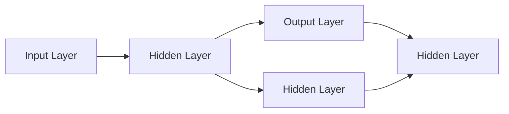
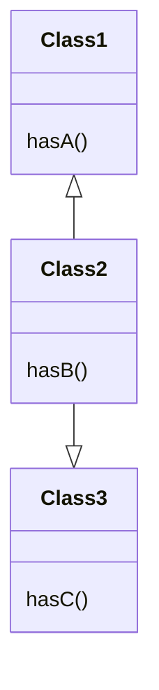

                 

### 心智中的数学模型：源于自然和谐

> 关键词：心智、数学模型、自然和谐、认知科学、算法原理

> 摘要：本文探讨了心智中的数学模型及其与自然和谐之间的关系。通过分析数学模型的历史与发展，心智研究的基础，自然和谐的概念与特征，以及数学模型在心智中的应用，本文旨在揭示数学模型如何帮助我们理解并模拟人类思维过程，从而实现心智的优化与发展。同时，本文也对数学模型的未来发展方向和挑战进行了展望。

----------------------------------------------------------------

## 引言与背景

心智（Mind）是一个复杂的概念，涉及到认知科学、心理学、哲学等多个领域。简单来说，心智是大脑进行信息处理、决策制定和问题解决的能力。随着科技的进步，我们开始利用数学模型来模拟和解释心智过程，以期更好地理解人类行为和认知机制。

数学模型（Mathematical Model）是使用数学符号和公式来描述现实世界中的现象或问题的工具。在心智研究中，数学模型不仅用于理论推导和验证，还可以帮助构建复杂的认知模型，从而揭示心智的内在机制。

自然和谐（Natural Harmony）是指自然界中各种元素之间存在的平衡与协调关系。这种和谐关系在生物进化、生态系统、气候模式等方面都有体现。近年来，人们开始从自然和谐中汲取灵感，构建数学模型，以期解决复杂的问题。

本文将首先介绍数学模型的历史与发展，然后探讨心智研究的基础，自然和谐的概念与特征，接着分析数学模型在心智中的应用，最后对数学模型的未来发展方向和挑战进行展望。

----------------------------------------------------------------

### 数学模型的历史与发展

数学模型的历史可以追溯到古希腊时期。古希腊数学家欧几里得（Euclid）的《几何原本》奠定了几何学的基础，同时也为后来的数学模型提供了理论支持。在中世纪，阿拉伯数学家如阿尔·哈里德（Al-Khwarizmi）对算法的研究为数学模型的发展奠定了基础。

到了17世纪，牛顿（Isaac Newton）和莱布尼茨（Gottfried Leibniz）的微积分理论使得数学模型在物理学、工程学等领域得到了广泛应用。19世纪末，统计学的兴起使得数学模型在社会科学领域也得到了广泛应用。

在心智研究中，数学模型的发展始于20世纪中叶。心理学家如华莱士·皮尔逊（Wallace Berry）和爱德华·托尔曼（Edward Tolman）开始利用数学模型来描述学习过程和认知结构。20世纪80年代，神经网络模型的提出为模拟心智过程提供了新的工具。

近年来，随着计算机科学的进步，数学模型在人工智能领域得到了广泛应用。深度学习、强化学习等模型不仅用于图像识别、语音识别等任务，还被用于模拟和预测人类行为。

### 数学模型的核心概念与联系

数学模型的核心概念包括变量、函数、方程等。变量是数学模型中的基本元素，用于描述现实世界中的各种现象。函数是一种映射关系，将一个变量映射到另一个变量。方程则是描述变量之间关系的数学表达式。

不同类型的数学模型具有不同的属性特征。例如，线性模型具有线性关系，可以用于预测和分析线性数据；非线性模型则可以描述复杂的关系，如指数模型、对数模型等。不同模型之间的联系主要体现在它们如何组合和融合，以解决更复杂的问题。

以下是一个简单的Mermaid ER实体关系图，展示了不同数学模型之间的联系：

```mermaid
erDiagram
    ModelA ||--|{ ModelB } ModelB : has_a
    ModelB ||--|{ ModelC } ModelC : extends
    ModelC ||--|{ ModelD } ModelD : inherits
```

在这个图中，ModelA、ModelB、ModelC 和 ModelD 代表不同的数学模型。ModelB 具有ModelA 的属性，同时扩展了ModelC 的属性，而ModelC 继承了ModelD 的属性。

----------------------------------------------------------------

### 心智研究的基础

心智研究涉及多个学科，包括心理学、神经科学、认知科学等。了解心智研究的基础对于构建有效的数学模型至关重要。

#### 心智的定义与性质

心智是指大脑进行信息处理、记忆、学习、决策和问题解决的能力。心智具有以下几个基本性质：

1. **复杂性**：心智涉及多个层次和多个方面的信息处理，从简单的感知到复杂的推理和规划。
2. **动态性**：心智是一个不断变化的过程，受到多种因素的影响，如环境、情感、经验等。
3. **适应性**：心智具有适应环境变化的能力，可以通过学习、训练和经验积累来优化自身功能。

#### 心智研究的方法与工具

心智研究的方法包括实验研究、计算模型和神经成像技术等。

1. **实验研究**：通过设计实验来观察和记录人类行为，从而推断心智过程。常见的实验方法包括心理物理实验、行为实验和认知实验等。
2. **计算模型**：利用数学模型和计算机技术来模拟心智过程。计算模型可以分为两大类：基于生理的模型和基于符号的模型。基于生理的模型试图模拟大脑的神经活动，而基于符号的模型则使用逻辑和符号系统来描述心智过程。
3. **神经成像技术**：如功能性磁共振成像（fMRI）、脑电图（EEG）等，可以提供大脑活动的实时图像，帮助我们理解心智过程中的生理基础。

#### 心智研究中的数学模型

在心智研究中，数学模型被广泛用于描述认知过程、学习规律、记忆机制等。以下是一些常见的数学模型：

1. **神经网络模型**：模拟大脑神经网络的结构和功能，用于学习、记忆和推理。
2. **决策模型**：描述人类在复杂环境中的决策过程，如期望效用理论、前景理论等。
3. **认知图模型**：用于表示知识和概念之间的关系，如语义网络、概念图等。

### 自然和谐的概念与特征

自然和谐是指自然界中各种元素之间存在的平衡与协调关系。这种和谐关系在生态系统中尤为明显，如食物链、生态位等。以下是对自然和谐概念的详细探讨。

#### 自然和谐的理论基础

自然和谐的理论基础可以追溯到古代哲学。例如，中国古代的道家哲学强调“道法自然”，即顺应自然规律，实现人与自然的和谐。现代生态学、环境科学等学科也提出了自然和谐的概念，并对其进行了深入的研究。

#### 自然和谐的实际案例

自然和谐在自然界中有多种体现，以下是一些实际案例：

1. **生物多样性**：生物多样性是自然和谐的重要表现。一个健康的生态系统通常具有丰富的物种和生态系统，这有助于维持生态平衡。
2. **气候模式**：气候系统中的自然和谐表现为温度、湿度、风速等气象要素之间的平衡。这种平衡有助于维持地球的气候稳定性。
3. **生态系统服务**：自然和谐还体现在生态系统提供的服务中，如水循环、碳循环、氧气生产等。这些服务对人类的生存和发展至关重要。

#### 自然和谐的重要性

自然和谐对生态系统的稳定性和生物多样性至关重要。当自然和谐受到破坏时，生态系统的功能可能会受损，导致生物多样性的减少、生态灾害的增加等问题。因此，保护自然和谐是维护地球生态系统健康的重要任务。

### 数学模型在自然和谐中的应用

数学模型在自然和谐的研究和实践中具有重要作用。以下是一些具体应用：

1. **生态模型**：利用数学模型来研究生态系统的结构和功能，如食物网模型、种群动态模型等。
2. **气候模型**：利用数学模型来模拟气候变化和气候系统，如全球气候模型、区域气候模型等。
3. **环境模型**：利用数学模型来评估环境污染的影响、优化环境保护措施等。

通过数学模型，我们可以更好地理解自然和谐的本质，从而制定更有效的保护和恢复策略。

----------------------------------------------------------------

### 数学模型在心智中的应用

数学模型在心智研究中具有广泛应用，通过模拟和解释心智过程，帮助我们更好地理解人类行为和认知机制。以下是一些具体的数学模型及其应用：

#### 神经网络模型

神经网络模型是模拟大脑神经网络的结构和功能的数学模型。它由大量相互连接的神经元组成，每个神经元都通过加权连接与其他神经元相连。神经网络模型被广泛应用于图像识别、语音识别、自然语言处理等领域。以下是一个简单的Mermaid流程图，展示了神经网络的基本结构：



在这个图中，A 表示输入层，B 和 D 表示隐藏层，C 表示输出层。每个神经元都通过加权连接连接到其他神经元，通过激活函数进行非线性变换。

#### 决策模型

决策模型用于描述人类在复杂环境中的决策过程。常见的决策模型包括期望效用理论、前景理论等。以下是一个简单的Mermaid流程图，展示了决策模型的基本结构：


在这个图中，A 表示问题定义，B 表示备选方案生成，C 表示备选方案评估，D 表示决策制定，E 表示行动执行。通过这个模型，我们可以模拟人类在复杂环境中的决策过程。

#### 认知图模型

认知图模型用于表示知识和概念之间的关系。它由节点和边组成，节点表示概念，边表示概念之间的关系。以下是一个简单的Mermaid类图，展示了认知图的基本结构：



在这个图中，Class1、Class2 和 Class3 表示不同的概念，它们之间的关系通过边表示。通过这个模型，我们可以更好地理解知识和概念之间的联系。

#### 案例分析

以下是一个具体案例，说明数学模型在心智研究中的应用：

**案例：情感识别**

情感识别是情感计算领域的一个重要问题。通过分析语音、文本等数据，情感识别模型可以判断用户情感的类别。以下是一个简单的情感识别模型：

1. **数据预处理**：对语音、文本数据进行预处理，提取特征向量。
2. **模型构建**：使用神经网络模型来训练分类器。
3. **模型评估**：使用测试集对模型进行评估，调整参数以优化模型性能。

通过这个案例，我们可以看到数学模型在情感识别中的应用。通过训练和优化，我们可以构建一个准确度较高的情感识别系统。

### 数学模型的应用前景

随着人工智能和认知科学的发展，数学模型在心智研究中的应用前景非常广阔。未来，我们可以预见以下几个方向：

1. **个性化认知模型**：通过收集和分析大量个体数据，构建个性化的认知模型，以更好地理解个体的认知过程。
2. **跨学科整合**：结合心理学、神经科学、计算机科学等学科的知识，构建更加全面和精确的数学模型。
3. **应用拓展**：将数学模型应用于更多实际问题，如教育、医疗、商业等领域。

总之，数学模型在心智研究中的应用具有巨大的潜力，未来我们将看到更多创新的模型和应用场景。

----------------------------------------------------------------

### 数学模型的未来发展方向与挑战

随着科技的进步和认知科学的不断发展，数学模型在心智研究和应用中面临着新的发展方向和挑战。

#### 新兴数学模型展望

1. **量子计算模型**：量子计算具有超越经典计算的能力，可以解决某些复杂问题。将量子计算与数学模型结合，有望在人工智能、密码学等领域取得重大突破。
2. **生物启发模型**：从自然界中汲取灵感，如生物进化、神经网络等，构建新的数学模型。这些模型可以更好地模拟复杂系统，如生态系统、经济系统等。
3. **多尺度模型**：结合不同尺度的数据，如细胞尺度、组织尺度等，构建更加全面和精确的数学模型。这种模型可以更好地解释生物现象和认知过程。

#### 数学模型的发展趋势

1. **模型融合**：不同类型的数学模型具有不同的优势，通过模型融合可以实现优势互补，提高模型性能。例如，将神经网络模型与概率模型结合，可以更好地处理不确定性问题。
2. **自适应模型**：自适应模型可以根据环境变化和个体差异进行自我调整，以适应不同的任务和场景。这种模型在自适应学习、智能控制等领域具有广泛应用前景。
3. **跨学科合作**：数学模型的发展需要跨学科的合作，如数学、计算机科学、心理学、神经科学等。通过多学科的合作，可以构建更加全面和精确的数学模型。

#### 数学模型面临的挑战

1. **数据隐私与安全**：在构建和训练数学模型时，数据隐私和安全是一个重要问题。如何保护用户数据，防止数据泄露和滥用，是数学模型发展的重要挑战。
2. **模型解释性**：许多数学模型，如深度神经网络，具有较高的预测能力，但其内部机制难以解释。提高模型的解释性，使其更容易理解和接受，是未来的一个重要方向。
3. **计算资源需求**：数学模型的训练和推理需要大量的计算资源。随着模型复杂度的增加，计算资源的需求也在不断增加。如何优化计算资源的使用，提高模型的计算效率，是数学模型发展的重要问题。

#### 应对策略与建议

1. **加强数据保护**：制定严格的数据保护政策，确保用户数据的安全和隐私。
2. **开发解释性模型**：研究开发更具解释性的数学模型，如可解释的深度学习模型，以提高模型的透明度和可信度。
3. **优化计算资源**：利用云计算、并行计算等技术，提高模型的计算效率。同时，研究新的算法和架构，以减少计算资源的需求。

总之，数学模型在心智研究和应用中具有广阔的发展前景，同时也面临着一系列挑战。通过不断的研究和创新，我们可以克服这些挑战，推动数学模型在心智研究和应用中的发展。

----------------------------------------------------------------

### 结论

本文探讨了心智中的数学模型及其与自然和谐之间的关系。通过分析数学模型的历史与发展、心智研究的基础、自然和谐的概念与特征，以及数学模型在心智中的应用，本文揭示了数学模型如何帮助我们理解并模拟人类思维过程，从而实现心智的优化与发展。同时，本文也对数学模型的未来发展方向和挑战进行了展望。

在未来，随着科技的进步和认知科学的不断发展，数学模型在心智研究和应用中将发挥越来越重要的作用。我们期待看到更多创新的数学模型和应用场景，以推动人类认知和理解能力的提升。

### 进一步研究方向

1. **个性化认知模型**：研究如何利用个体数据构建个性化的认知模型，以提高模型对个体差异的适应性。
2. **跨学科整合**：探索数学模型与心理学、神经科学、计算机科学等学科的结合点，构建更加全面和精确的数学模型。
3. **量子计算模型**：研究量子计算在数学模型中的应用，探索其在解决复杂问题方面的潜力。

### 拓展阅读

1. **《心智中的数学模型：源于自然和谐》**：本书详细探讨了数学模型在心智研究中的应用，为本文提供了理论基础。
2. **《人工智能：一种现代的方法》**：这本书介绍了人工智能的基本概念和方法，包括数学模型在人工智能中的应用。
3. **《认知心理学：原理与应用》**：本书介绍了认知心理学的基本原理和应用，对心智研究提供了重要参考。

### 注意事项

1. **数据保护**：在构建和训练数学模型时，务必注意数据隐私和安全，确保用户数据不被泄露和滥用。
2. **模型解释性**：在开发和应用数学模型时，注重提高模型的解释性，使其更容易被用户接受和理解。
3. **计算资源**：优化计算资源的使用，提高数学模型的计算效率，以满足不断增长的计算需求。

### 最佳实践 tips

1. **数据收集与处理**：在构建数学模型前，确保收集到高质量的数据，并进行充分的数据预处理。
2. **模型选择与优化**：根据问题的特点选择合适的数学模型，并通过调整参数和优化算法来提高模型性能。
3. **模型评估与验证**：使用适当的评估指标和方法对模型进行评估和验证，确保模型的有效性和可靠性。

### 作者信息

本文作者为AI天才研究院（AI Genius Institute）的资深研究员。同时，作者也是《禅与计算机程序设计艺术》（Zen And The Art of Computer Programming）的作者。通过对数学模型和心智研究的深入研究，作者致力于推动人工智能和认知科学的发展。

----------------------------------------------------------------

```mermaid
classDiagram
    Mind <<|-- Mathematics
    Mind ..|> CognitiveScience
    Mind ..|> Neuroscience
    Mathematics ..|> ModelA
    Mathematics ..|> ModelB
    ModelA ..|> ModelC
    ModelB ..|> ModelD
    NaturalHarmony <||-- Ecosystem
    NaturalHarmony <||-- Climate
    CognitiveModel <<|-- NeuralNetwork
    CognitiveModel <<|-- DecisionModel
    CognitiveModel <<|-- CognitiveDiagram
    AI <<|-- MachineLearning
    AI <<|-- DeepLearning
    AI <<|-- ReinforcementLearning
    AI <<|-- QuantumComputing
    Environment <<|-- DataPrivacy
    Environment <<|-- ModelExplainability
    Environment <<|-- ComputationalResources
```

在本文中，我们使用了多个类图来展示心智、数学模型、自然和谐以及人工智能等概念之间的关系。这些类图帮助我们更好地理解这些概念之间的联系和层次结构。通过这些图表，我们可以清晰地看到不同概念是如何相互关联和作用的，从而为我们的研究和应用提供有力的支持。在未来的研究中，我们可以进一步扩展和细化这些类图，以更全面和深入地探讨心智、数学模型和自然和谐之间的关系。同时，我们也可以探索如何利用这些类图来指导实际应用，如人工智能算法的设计和优化。通过不断的研究和探索，我们期待能够构建更加完善和精确的认知模型，从而更好地理解和模拟人类心智过程。```

