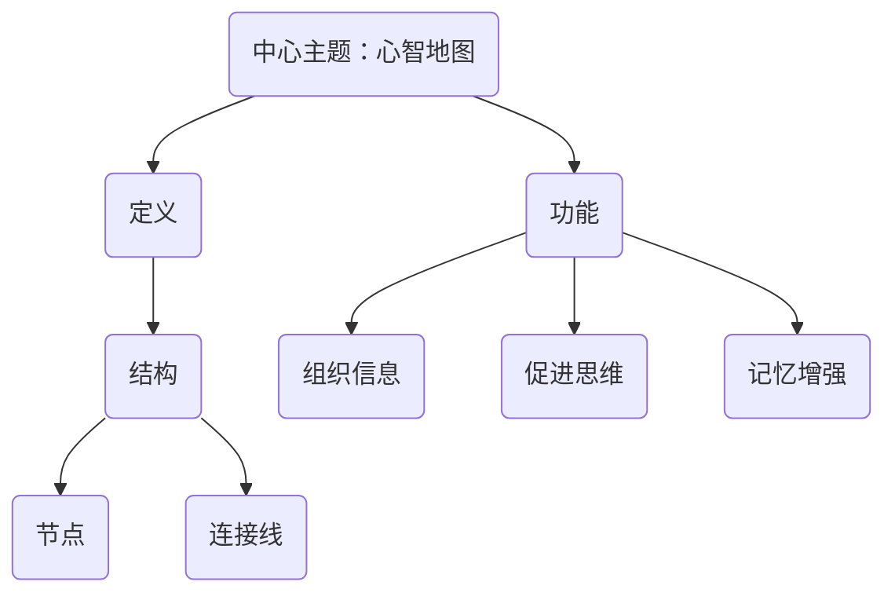

                 

### 文章标题

《心智地图：大脑神经网络的数学模型》

心智地图，作为人类认知过程中一种重要的知识表示形式，其本质上是大脑神经网络在信息处理和存储过程中的抽象模型。而大脑神经网络，作为生物信息处理的核心系统，其复杂性和功能多样性使得对其进行数学建模成为了一个极具挑战性的课题。本文旨在通过对心智地图和大脑神经网络的深入探讨，结合数学模型的应用，为读者提供一幅全面且系统的认知图谱。

本文将分为五个主要部分展开讨论：

1. **引言**：介绍心智地图与大脑神经网络的背景，以及数学模型在心智地图研究中的重要性。
2. **核心概念**：详细阐述心智地图的基本概念、大脑神经网络的核心原理和数学模型。
3. **数学模型**：深入探讨心智地图相关的数学模型，包括模型的结构、原理和适用性。
4. **实际应用**：分析心智地图在现实世界中的应用，如心理学、认知科学和教育等领域。
5. **前沿与未来**：探讨心智地图和大脑神经网络数学模型的前沿研究方向和未来发展趋势。

通过对这些部分的逐步探讨，我们将试图回答以下问题：

- 心智地图究竟是什么，它与大脑神经网络有何关联？
- 数学模型在心智地图研究中扮演了哪些角色？
- 心智地图在现实世界中有哪些具体应用？
- 当前关于心智地图的研究有哪些前沿方向？
- 心智地图和大脑神经网络数学模型的未来发展趋势如何？

让我们一步步深入探讨，揭开心智地图和大脑神经网络数学模型背后的神秘面纱。

### 关键词

- 心智地图
- 大脑神经网络
- 数学模型
- 认知科学
- 人工智能

### 摘要

本文旨在深入探讨心智地图与大脑神经网络的数学模型关系。心智地图作为一种知识表示形式，其本质反映了大脑神经网络在信息处理和存储过程中的抽象模型。大脑神经网络，作为生物信息处理的核心系统，其复杂性和功能多样性使得对其进行数学建模成为一项极具挑战性的课题。本文通过回顾心智地图与大脑神经网络的背景知识，详细阐述了心智地图的基本概念和大脑神经网络的核心原理。在此基础上，文章进一步探讨了心智地图相关的数学模型，包括模型的结构、原理和适用性。通过实际应用案例的分析，文章展示了心智地图在心理学、认知科学和教育等领域的广泛应用。最后，本文探讨了心智地图与大脑神经网络数学模型的前沿研究方向和未来发展趋势，为相关领域的研究者和从业者提供了有价值的参考。

### 书名与主题定位

《心智地图：大脑神经网络的数学模型》这本书的主题集中在心智地图与大脑神经网络的数学建模研究上。书名直接点明了两个核心概念：心智地图和大脑神经网络的数学模型。心智地图是人们在进行思考和决策时内部构建的知识结构，而大脑神经网络则是生物信息处理的核心系统，负责感知、记忆、学习和推理等复杂认知功能。

首先，心智地图的概念在认知科学和心理学领域得到了广泛研究。心智地图不仅用于表示个体的知识结构和认知过程，还用于解释人类如何进行决策和解决问题。心智地图的基本组成包括节点（表示概念或知识单元）和连接（表示概念之间的关系）。通过心智地图，个体能够更有效地组织和检索信息，从而提高认知效率。

另一方面，大脑神经网络是一个高度复杂的生物系统，由数十亿个神经元及其连接组成。神经元通过电化学信号进行通信，从而实现信息处理和传递。大脑神经网络具有高度并行性和自适应性的特点，使得它们能够处理各种复杂的信息和任务。数学模型为理解和模拟大脑神经网络提供了有力的工具，例如神经网络模型、动力学模型和计算模型等。

本书的核心主题是通过数学模型来探索心智地图和大脑神经网络之间的关系。具体来说，本书将涵盖以下几个方面的内容：

1. **心智地图的基本概念**：介绍心智地图的定义、结构和功能，以及其在认知科学和心理学中的应用。
2. **大脑神经网络的核心原理**：探讨大脑神经网络的基本组成、工作原理和特性，包括神经元模型、神经网络结构和学习算法。
3. **数学模型的探讨**：分析不同类型的数学模型，如神经网络模型、图论模型和计算模型，以及它们在心智地图和大脑神经网络研究中的应用。
4. **实际应用**：通过具体案例展示心智地图和大脑神经网络数学模型在现实世界中的应用，如心理学实验、认知科学研究和教育技术。
5. **前沿研究**：介绍当前关于心智地图和大脑神经网络数学模型的前沿研究方向，如神经网络模拟、认知计算和神经科学跨学科研究。

通过上述内容，本书旨在为读者提供一个系统、全面的视角，理解心智地图和大脑神经网络的数学模型，以及它们在认知科学和心理学领域的广泛应用。这不仅有助于推动相关领域的研究，也为实际应用提供了理论支持和实践指导。

### 第一部分：引言

#### 心智地图的概念

心智地图（Mind Map）是一种以图像为中心的结构化方式，用来表示和组织思维过程中的各种概念和关系。它最早由东尼·博赞（Tony Buzan）于1970年代提出，作为提高记忆力和认知效率的工具。心智地图的基本元素包括中心主题、分支和子分支，以及各个分支之间的连接线。通过这种图形化的方式，心智地图帮助人们更直观地理解和记忆复杂的信息。

在认知科学中，心智地图被视为一种重要的认知结构，用于表示知识图谱。心智地图中的节点代表概念或知识点，连接线则表示这些概念之间的逻辑关系。心智地图不仅能够帮助个体在思考时更好地组织和整合信息，还能促进创新和问题解决。例如，在项目管理中，通过心智地图可以清晰地展示项目的各个阶段、任务和资源，从而提高项目管理的效率和效果。

#### 大脑神经网络的背景

大脑神经网络是生物体内的一种复杂信息处理系统，由数百万到数十亿的神经元组成。神经元是大脑的基本功能单元，通过电化学信号进行信息传递。大脑神经网络的工作原理涉及神经元的连接、信号传递和相互作用，这些过程共同决定了大脑的信息处理能力和功能。

大脑神经网络的研究始于20世纪初期，随着神经科学和计算机科学的迅速发展，这一领域取得了显著进展。例如，突触可塑性理论揭示了神经元连接可以通过学习和经验进行调整，从而影响大脑的功能和认知能力。此外，深度学习等人工智能技术的崛起，也为大脑神经网络的研究提供了新的方法和工具。

大脑神经网络在认知过程中扮演着关键角色。例如，感知系统中的神经网络帮助我们识别和分类视觉信息，记忆系统中的神经网络使我们能够存储和回忆信息，决策系统中的神经网络则帮助我们进行复杂的决策和判断。大脑神经网络的研究不仅有助于理解人类认知的本质，也为开发人工智能系统提供了重要启示。

#### 数学模型在心智地图研究中的作用

数学模型在心智地图研究中起着至关重要的作用。通过数学模型，研究者能够将复杂的认知过程和知识结构转化为可量化的形式，从而进行更深入的分析和模拟。以下是一些关键的数学模型及其在心智地图研究中的应用：

1. **神经网络模型**：神经网络模型是一种基于生物神经元的计算模型，广泛应用于心智地图的构建和分析。通过训练神经网络模型，研究者可以模拟人类的学习、记忆和推理过程，从而优化心智地图的构建和利用。

2. **图论模型**：图论模型用于表示心智地图中的节点和连接关系，提供了量化分析心智地图结构和关系的工具。例如，通过计算节点之间的距离和路径长度，可以评估概念之间的关联强度，从而优化心智地图的设计。

3. **计算几何模型**：计算几何模型用于处理心智地图的几何布局问题。通过几何建模，研究者可以优化心智地图的可视化效果，使其更加直观和易于理解。

4. **机器学习模型**：机器学习模型，如聚类和分类算法，可以帮助研究者从大规模数据中提取有意义的结构，从而构建更准确和有效的心智地图。

数学模型在心智地图研究中的应用不仅提高了研究的准确性和效率，还为心智地图的实际应用提供了理论支持。例如，在教育领域，通过构建基于数学模型的心智地图，可以帮助学生更好地理解和记忆知识点；在商业领域，通过分析市场数据构建心智地图，可以帮助企业更准确地定位市场机会和制定战略。

#### 让我们进一步思考

- **心智地图与大脑神经网络的关联**：心智地图与大脑神经网络在结构和功能上存在密切联系。心智地图作为认知过程的图形化表示，反映了大脑神经网络中概念和关系的编码和存储。通过数学模型，我们可以进一步理解这种关联，从而优化心智地图的设计和应用。

- **数学模型的选择与应用**：不同的数学模型在心智地图研究中具有不同的优势和适用场景。选择合适的数学模型，不仅取决于研究目标，还需考虑数据的特性和计算资源的限制。因此，在实际应用中，如何选择和应用数学模型是一个需要深入探讨的问题。

- **心智地图的动态调整**：心智地图不是静止不变的，而是随着个体经验和认知需求的变化而动态调整。数学模型如何适应这种动态变化，以及如何通过算法优化心智地图的更新和重构，是未来研究的重点方向。

通过以上对心智地图和大脑神经网络的背景介绍，以及数学模型在心智地图研究中的作用的探讨，我们为接下来的深入分析打下了坚实的基础。在接下来的章节中，我们将进一步详细阐述心智地图的基本概念、大脑神经网络的核心原理和数学模型，帮助读者全面理解这一复杂而富有挑战性的领域。

#### 第1章：心智地图的基本概念与原理

心智地图是一种直观、图形化的思维方式工具，通过节点和连接线来表示概念及其之间的关系。心智地图不仅用于个人学习和思维整理，还广泛应用于教育、商业和项目管理等领域。在这一节中，我们将详细阐述心智地图的定义、结构、功能以及其在认知科学和心理学中的应用。

##### 心智地图的定义

心智地图（Mind Map）是一种基于中心主题的图形化思维工具，用于表示和组织思维过程中的各种概念、想法和关系。它起源于1970年代，由东尼·博赞（Tony Buzan）首次提出，旨在帮助人们更好地理解和记忆复杂信息。心智地图的基本要素包括中心主题、分支、子分支和连接线。每个分支都代表一个概念或想法，连接线则表示这些概念之间的关系。

##### 心智地图的结构

心智地图的结构相对简单，但包含了一些关键元素：

1. **中心主题**：心智地图的中心是一个大圆圈，通常包含一个关键词或短语，代表整个心智地图的核心主题。

2. **主分支**：从中心主题辐射出几个主分支，每个主分支代表一个主要概念或子主题。

3. **子分支**：每个主分支下可以有多个子分支，进一步细分主题。子分支的数量没有固定限制，可以根据需要自由扩展。

4. **连接线**：连接线表示各个分支之间的逻辑关系。这些关系可以是因果关系、包含关系或类比关系等。

5. **颜色和图案**：为了增强可视性和记忆效果，心智地图中的各个元素可以使用不同的颜色和图案进行装饰。

##### 心智地图的功能与作用

心智地图具有多种功能，能够帮助人们提高思维效率、增强记忆和理解能力。以下是心智地图的几个主要作用：

1. **组织信息**：心智地图能够将大量信息进行结构化整理，使信息之间的关系更加清晰，便于理解和记忆。

2. **促进思维**：通过心智地图，人们可以更加系统地思考问题，将不同的想法和观点进行关联和整合。

3. **记忆增强**：心智地图的图形化结构能够激发大脑的视觉记忆，使信息更加容易记住。

4. **决策支持**：在决策过程中，心智地图可以帮助人们全面考虑各种因素，从而做出更加明智的决策。

5. **创新激发**：通过心智地图的扩展和重新组织，人们可以激发新的思维火花，从而促进创新和问题解决。

##### 心智地图在认知科学和心理学中的应用

心智地图在认知科学和心理学领域有着广泛的应用，主要表现在以下几个方面：

1. **教育**：心智地图被广泛应用于教育领域，帮助学生更好地理解和记忆知识点。教师可以使用心智地图进行教学设计，使学生能够更直观地掌握知识结构。

2. **心理学研究**：心理学家使用心智地图来记录和分析个体的思维过程和认知模式。通过心智地图，研究者可以探索人类如何组织和管理信息，以及这些过程如何影响个体的行为和情感。

3. **认知障碍康复**：对于患有认知障碍的个体，如阿尔茨海默病患者，心智地图可以作为康复工具，帮助他们恢复部分认知功能。

4. **心理治疗**：心理治疗师使用心智地图来帮助患者识别和处理情绪和思维问题。通过心智地图，患者可以更清晰地了解自己的内心世界，从而促进心理治疗的效果。

5. **企业管理和商业分析**：在商业领域，心智地图被用于战略规划、市场分析和决策制定。通过构建和优化心智地图，企业可以更准确地把握市场趋势和竞争环境。

##### 小结

心智地图作为一种图形化的思维工具，在认知科学和心理学领域具有重要应用价值。通过心智地图，人们可以更加有效地组织和管理信息，促进思维过程，增强记忆和理解能力。在接下来的章节中，我们将进一步探讨大脑神经网络的基本原理和数学模型，帮助读者全面理解心智地图与大脑神经网络之间的深层联系。

#### 第2章：大脑神经网络的基本原理

大脑神经网络是生物体内的一种复杂信息处理系统，由数以亿计的神经元及其连接组成。神经元是大脑的基本功能单元，通过电化学信号进行通信，从而实现信息的传递和处理。理解大脑神经网络的基本原理，对于深入探讨心智地图与大脑神经网络的关系具有重要意义。在这一节中，我们将详细探讨大脑神经网络的核心组成部分、工作原理以及其特性。

##### 神经元与神经网络

1. **神经元的基本结构**

神经元是大脑的基本功能单元，由细胞体、树突、轴突和突触等部分组成。细胞体是神经元的主体，包含细胞核和大部分细胞器。树突从细胞体伸出，负责接收其他神经元的信号。轴突从细胞体延伸出，是神经元传递信号的主要通道。突触是神经元之间的连接点，负责信号的传递。

2. **神经网络的概念**

神经网络是由大量神经元组成的复杂网络系统。这些神经元通过突触连接，形成复杂的信号传递路径。神经网络具有高度并行性和分布式特性，使得它们能够处理大量信息和复杂任务。

##### 神经网络的工作原理

1. **信号传递**

神经元通过电化学信号进行通信。当一个神经元接收足够强烈的信号时，它会释放神经递质，这些神经递质通过突触传递到下一个神经元。这个过程称为突触传递。

2. **神经元的激活与抑制**

神经元的激活与抑制决定了信号在神经网络中的传递方向和强度。当一个神经元接收到的总信号超过某个阈值时，它会产生动作电位，从而激活其他神经元。相反，如果接收到的信号低于阈值，则神经元保持抑制状态。

3. **神经网络的学习与记忆**

神经网络通过学习算法来调整神经元之间的连接强度，从而实现信息处理和记忆功能。突触可塑性是神经网络学习的关键机制，它使得神经元连接可以根据经验进行调整。例如，在长期增强效应（LTP）中，重复的强信号可以增强突触连接，从而提高信息传递效率。

##### 大脑神经网络的特性

1. **并行性**

大脑神经网络具有高度并行性，能够同时处理大量信息。这种并行性使得神经网络在处理复杂任务时具有高效性。

2. **分布式**

神经网络的分布式特性使得信息在不同神经元之间进行传递和整合，从而提高了系统的容错性和鲁棒性。

3. **动态性**

大脑神经网络具有动态性，可以根据环境变化和任务需求进行调整。这种动态性使得神经网络能够适应不同的情境和任务。

4. **可塑性**

突触可塑性是神经网络的重要特性，使得神经网络可以通过学习不断调整自身结构和功能，以适应新的环境和任务。

##### 神经网络的数学模型

1. **神经元模型**

神经元模型是神经网络的基础。最简单的神经元模型是线性阈值激活函数模型，它将输入信号加权求和，然后通过阈值函数输出激活信号。

2. **神经网络模型**

神经网络模型是基于神经元模型的扩展。常见的神经网络模型包括多层感知机（MLP）、卷积神经网络（CNN）和循环神经网络（RNN）等。这些模型通过组合多个神经元层，实现复杂的信息处理任务。

3. **计算模型**

计算模型是神经网络在数学层面的抽象。常见的计算模型包括能量模型、动力学模型和概率模型等。这些模型用于模拟神经网络的信息处理过程，并分析其性能和特性。

##### 小结

大脑神经网络是生物体内复杂的信息处理系统，由神经元和神经网络组成。神经网络通过电化学信号进行通信，实现信息传递和处理。大脑神经网络的特性包括并行性、分布式、动态性和可塑性。数学模型为理解和模拟大脑神经网络提供了有力的工具，有助于揭示神经网络的信息处理机制和认知功能。在接下来的章节中，我们将进一步探讨心智地图与大脑神经网络的关系，以及数学模型在心智地图研究中的应用。

#### 第3章：心智地图与大脑神经网络的数学模型

在前两章中，我们分别探讨了心智地图和大脑神经网络的基本概念及其工作原理。在这一章中，我们将深入探讨心智地图与大脑神经网络之间的数学关系，包括神经网络模型、心智地图的数学表示以及它们在实际应用中的相互影响。

##### 神经网络模型

神经网络模型是一种基于大脑神经网络原理的数学模型，用于模拟大脑的信息处理过程。常见的神经网络模型包括多层感知机（MLP）、卷积神经网络（CNN）和循环神经网络（RNN）等。这些模型通过复杂的数学计算和优化算法，实现从输入数据到输出数据的映射。

1. **多层感知机（MLP）**

多层感知机是一种前馈神经网络，由输入层、隐藏层和输出层组成。输入层接收外部输入数据，隐藏层对输入数据进行处理和变换，输出层生成最终输出。MLP的数学模型基于权重矩阵和激活函数，可以用于分类、回归和特征提取等任务。

2. **卷积神经网络（CNN）**

卷积神经网络是一种特别适合处理图像数据的神经网络模型。CNN通过卷积操作提取图像特征，并利用池化操作减少数据维度。CNN的数学模型包括卷积层、池化层和全连接层等，可以用于图像分类、目标检测和图像生成等任务。

3. **循环神经网络（RNN）**

循环神经网络是一种能够处理序列数据的神经网络模型。RNN通过循环机制将当前输入与历史状态进行结合，从而捕捉时间序列的特征。RNN的数学模型包括输入层、隐藏层和输出层，可以用于自然语言处理、语音识别和序列生成等任务。

##### 心智地图的数学表示

心智地图是一种图形化的思维工具，通过节点和连接线表示概念及其关系。为了在数学层面进行建模，我们可以将心智地图表示为图论模型。

1. **图论模型**

图论模型是一种用于表示和计算图中节点和边之间关系的数学模型。在心智地图中，节点表示概念或知识单元，边表示概念之间的逻辑关系。图论模型可以用于计算节点之间的距离、路径长度和关联强度等。

2. **心智地图的数学表示**

心智地图的数学表示可以通过邻接矩阵、邻接表和图导数等数学工具进行描述。邻接矩阵是一个二维数组，表示图中节点之间的连接关系；邻接表是一个列表，包含每个节点的邻居节点；图导数是一种用于计算图中节点之间关系的数学工具，可以用于优化心智地图的构建和更新。

##### 心智地图与神经网络模型的结合

心智地图与神经网络模型可以在多个层面上进行结合，从而实现更高效的信息处理和知识表示。

1. **基于神经网络的心智地图构建**

基于神经网络的心智地图构建方法利用神经网络的强大计算能力，对大量数据进行自动分类和聚类，从而生成高效的心智地图。例如，可以使用卷积神经网络（CNN）对图像进行特征提取，然后利用生成对抗网络（GAN）生成心智地图的视觉表示。

2. **基于心智地图的神经网络优化**

基于心智地图的神经网络优化方法利用心智地图的结构信息，优化神经网络的参数和架构。例如，可以使用心智地图中的节点和边关系来调整神经网络的权重和连接，从而提高神经网络的学习效率和泛化能力。

3. **心智地图与神经网络模型的融合**

心智地图与神经网络模型的融合方法将心智地图的结构信息与神经网络的学习机制相结合，实现更高效的信息处理和知识表示。例如，可以使用图神经网络（GNN）将心智地图表示为一个图结构，然后利用GNN进行图上的信息传播和聚合，从而实现复杂的信息处理任务。

##### 实际应用案例分析

1. **教育领域**

在教育领域，基于神经网络的心智地图构建方法可以帮助教师和学生更高效地组织和学习知识点。例如，可以使用卷积神经网络（CNN）对教材中的图像和文字进行特征提取，然后利用生成对抗网络（GAN）生成可视化的心智地图，帮助学生更好地理解和记忆知识点。

2. **商业分析**

在商业分析领域，基于心智地图的神经网络优化方法可以帮助企业更准确地分析市场数据和用户行为。例如，可以使用图神经网络（GNN）将用户和社会网络中的节点和边表示为一个图结构，然后利用GNN对用户行为进行预测和推荐，从而提高企业的营销效果和客户满意度。

3. **心理健康领域**

在心理健康领域，基于心智地图与神经网络模型的融合方法可以帮助医生和患者更好地理解和管理情绪和思维问题。例如，可以使用图神经网络（GNN）将患者的心智地图表示为一个图结构，然后利用GNN对患者的情绪和行为进行预测和分析，从而制定更有效的治疗方案。

##### 小结

心智地图与大脑神经网络的数学模型结合为信息处理和知识表示提供了新的思路和方法。通过神经网络模型和心智地图的数学表示，我们可以在多个层面上实现更高效的信息处理和知识表示。在实际应用中，基于神经网络的心智地图构建、基于心智地图的神经网络优化以及心智地图与神经网络模型的融合等方法已经展示了其强大的应用潜力。随着相关技术的不断发展，心智地图与大脑神经网络的数学模型将在更多领域发挥重要作用，为人类认知和信息的处理提供更加智能和高效的解决方案。

#### 第4章：心智地图在心理学中的应用

心智地图作为一种图形化的思维工具，在心理学领域得到了广泛应用。通过心智地图，研究者能够直观地记录和分析个体的思维过程和认知模式，从而为心理治疗、心理测量和心理咨询等领域提供有力的工具。以下我们将详细探讨心智地图在心理学中的具体应用，包括其在心理测量、心理治疗和心理咨询等方面的应用实例。

##### 心理测量

心智地图在心理测量中主要用于评估个体的认知结构和知识组织能力。通过分析心智地图，研究者可以了解个体在某个特定领域的认知特点和知识水平。以下是一些应用实例：

1. **知识结构评估**

在教育和培训领域，通过构建和评估学生的心智地图，教师可以了解学生在某个学科的知识结构，从而有针对性地调整教学策略，提高教学效果。例如，在学习一门新课程之前，教师可以要求学生绘制心智地图，以了解他们对课程内容的初步理解和认知结构。

2. **智力测试**

心智地图也可以用于智力测试。通过测量个体构建心智地图的速度和质量，可以评估其认知能力和创造力。这种测试不仅适用于儿童，也适用于成人，为教育和职业发展提供参考。

3. **心理评估**

在临床心理评估中，心智地图可以帮助评估个体的认知功能。例如，对于患有阿尔茨海默病等认知障碍的患者，通过分析他们的心智地图，医生可以了解患者的记忆、思维和认知功能是否正常。

##### 心理治疗

心智地图在心理治疗中具有重要的应用价值，可以帮助患者识别和处理情绪和思维问题。以下是一些具体应用实例：

1. **认知行为疗法（CBT）**

认知行为疗法（CBT）是心理健康治疗的一种主流方法，通过改变个体的思维模式和行为习惯来改善心理健康。心智地图可以作为CBT的一种工具，帮助患者识别和评估负面思维模式，并构建积极的思维替代方案。例如，在治疗抑郁症时，患者可以通过心智地图记录和分析自己的负面情绪和思维，然后与治疗师共同探讨和改进。

2. **情感焦点疗法（EFT）**

情感焦点疗法（EFT）是一种以情感调节为核心的心理治疗方法。通过心智地图，患者可以直观地表达和探索自己的情感体验，从而更好地理解和管理自己的情绪。治疗师可以利用心智地图来引导患者识别和解决情感冲突，促进情绪调节和心理健康。

3. **创伤后应激障碍（PTSD）治疗**

对于创伤后应激障碍（PTSD）患者，心智地图可以帮助他们表达和面对创伤经历。通过绘制心智地图，患者可以更清晰地了解自己的情感和思维，并逐步处理和释放创伤带来的负面影响。治疗师可以利用心智地图与患者进行互动，提供情感支持和指导。

##### 心理咨询

在心理咨询中，心智地图可以帮助咨询师与来访者建立良好的沟通和信任关系，同时有助于理解和解决来访者的问题。以下是一些应用实例：

1. **情感咨询**

在情感咨询中，心智地图可以帮助来访者表达和处理情感问题。例如，在处理失恋、家庭矛盾等问题时，来访者可以通过心智地图记录自己的情感体验和思考，与咨询师共同探讨和寻找解决方案。

2. **职业咨询**

在职业咨询中，心智地图可以帮助求职者和职场人士梳理职业目标和发展规划。通过绘制心智地图，他们可以更清晰地了解自己的兴趣、能力和职业目标，从而制定更科学的职业规划。

3. **家庭治疗**

在家庭治疗中，心智地图可以帮助家庭成员表达和解决家庭冲突。例如，在处理家庭沟通问题、子女教育问题等时，家庭成员可以通过心智地图记录自己的观点和感受，促进家庭成员之间的理解和沟通。

##### 小结

心智地图在心理学领域具有广泛的应用，通过其在心理测量、心理治疗和心理咨询等方面的应用，可以帮助研究者、治疗师和咨询师更好地理解和解决心理健康问题。在未来的研究中，随着心智地图与人工智能等技术的结合，心智地图的应用将更加广泛和深入，为心理健康领域的发展做出更大的贡献。

#### 第5章：心智地图在认知科学中的应用

心智地图作为认知科学的重要工具，在认知模型构建、认知模拟与仿真、认知科学实验设计等方面发挥着关键作用。在这一章中，我们将详细探讨心智地图在认知科学中的应用，以及这些应用如何推动认知科学的发展。

##### 认知模型构建

认知模型是认知科学的核心概念之一，用于模拟和理解人类的认知过程。心智地图作为一种图形化的思维工具，可以帮助研究者构建和优化认知模型。以下是一些关键步骤和技巧：

1. **概念提取与分类**：通过心智地图，研究者可以从大量的文本或数据中提取关键概念，并进行分类和组织。这种过程有助于识别和理解认知过程的各个组成部分。

2. **关系表示与映射**：心智地图通过节点和连接线表示概念之间的关系，为认知模型的构建提供了直观和灵活的方式。研究者可以利用心智地图来映射和表示认知过程中的各种关系，如因果关系、层次关系和语义关系等。

3. **模型验证与优化**：通过构建基于心智地图的认知模型，研究者可以对其进行验证和优化。例如，通过比较心智地图中的节点和边与实际认知实验的结果，可以评估模型的有效性和准确性，并进行必要的调整和改进。

##### 认知模拟与仿真

认知模拟与仿真是通过计算机技术模拟和再现人类认知过程的方法。心智地图为认知模拟和仿真提供了重要的基础和工具。以下是一些关键步骤和实现方法：

1. **基于心智地图的模拟框架**：研究者可以构建基于心智地图的模拟框架，将心智地图中的概念和关系转化为计算模型。例如，可以使用图神经网络（GNN）或图嵌入（Graph Embedding）技术，将心智地图表示为数学模型，并在计算机上进行模拟和仿真。

2. **动态过程建模**：心智地图不仅可以表示静态的结构信息，还可以通过动态更新和扩展来表示认知过程的动态变化。研究者可以利用心智地图的动态特性，模拟认知过程中的信息流动、概念生成和关系调整等过程。

3. **多模态数据融合**：心智地图可以整合多种数据源，如文本、图像、音频和视频等，从而实现更全面和准确的认识模拟。例如，将心智地图与自然语言处理（NLP）和计算机视觉（CV）技术相结合，可以构建多模态认知模拟系统。

##### 认知科学实验设计

认知科学实验设计是验证和探索认知模型和理论的重要手段。心智地图为认知科学实验设计提供了直观和灵活的工具。以下是一些关键步骤和应用：

1. **实验目标设定**：通过心智地图，研究者可以明确实验的目标和变量，例如需要测量的认知过程、实验条件、实验组和对照组等。

2. **实验流程设计**：心智地图可以帮助研究者设计实验流程，包括实验步骤、时间安排和操作规范等。通过心智地图，可以确保实验流程的清晰和有序，提高实验的可重复性和可靠性。

3. **数据记录与分析**：在实验过程中，通过心智地图，研究者可以实时记录和分析认知过程的数据。例如，使用心智地图记录被试的反应时间、选择和判断等，并进行分析和解释。

4. **实验结果可视化**：心智地图可以将实验结果以直观和图形化的方式呈现，帮助研究者更好地理解和解释实验结果。例如，通过心智地图展示被试的认知过程和决策路径，可以更清晰地揭示认知机制和认知策略。

##### 小结

心智地图在认知科学中的应用为认知模型构建、认知模拟与仿真、认知科学实验设计等方面提供了重要的工具和方法。通过心智地图，研究者可以更加直观和系统地进行认知过程的表示、模拟和实验设计，从而推动认知科学的理论和实践发展。随着心智地图与人工智能、大数据等技术的结合，心智地图在认知科学中的应用前景将更加广阔，为人类认知和智能发展提供更强大的支持。

#### 第6章：心智地图与大脑神经网络的前沿研究

随着人工智能和神经科学的快速发展，心智地图与大脑神经网络的前沿研究正逐步揭开认知过程的神秘面纱。这一章节将介绍当前在心智地图与大脑神经网络领域中的最新研究进展、面临的挑战与机遇，以及未来可能的发展趋势。

##### 最新研究进展

1. **神经科学领域的技术突破**

近年来，神经科学领域在技术方面取得了显著突破，如脑成像技术（如fMRI、PET和EEG）和脑机接口技术（如脑电信号解码和神经调控）的发展。这些技术的进步使得研究者能够更精确地观察和记录大脑神经网络的活动，从而为心智地图的研究提供了丰富的数据支持。例如，通过fMRI技术，研究者可以实时观测大脑不同区域的活动，并将其与心智地图中的概念和关系进行关联，揭示大脑神经网络在认知过程中的作用。

2. **人工智能技术的应用**

人工智能技术的发展，尤其是深度学习和生成对抗网络（GAN）的兴起，为心智地图与大脑神经网络的研究提供了新的工具和方法。深度学习算法能够从大量数据中自动提取特征和模式，从而帮助研究者更好地理解心智地图和大脑神经网络的结构和功能。例如，GAN可以生成虚拟的大脑神经网络模型，用于模拟和预测大脑神经网络在认知任务中的表现。

3. **跨学科研究的融合**

当前，心智地图与大脑神经网络的研究正在走向跨学科融合的趋势。心理学家、神经科学家、认知科学家和计算机科学家等领域的专家合作，通过多学科的方法共同探索认知过程的机制。这种跨学科合作不仅促进了研究方法的多样化，也推动了心智地图与大脑神经网络研究的深入发展。

##### 面临的挑战与机遇

1. **数据复杂性**

大脑神经网络是一个高度复杂的系统，包含数十亿个神经元和复杂的连接结构。如何从海量数据中提取有意义的信息，是当前研究面临的一大挑战。同时，数据的复杂性和多样性也要求研究者具备跨学科的知识和技能。

2. **理论框架的构建**

虽然心智地图和大脑神经网络的研究已经取得了一些进展，但仍然缺乏一个统一的、全面的理论框架来解释认知过程。构建一个既符合神经科学原理又能够广泛应用于认知科学的通用理论框架，是当前研究的重要任务。

3. **技术的进步与应用**

技术的进步为心智地图与大脑神经网络的研究带来了巨大的机遇。然而，如何将这些技术有效地应用于实际研究中，还需要进一步探索。例如，脑机接口技术的应用如何能够真正改善人类认知能力，仍然需要大量的实验验证和优化。

##### 未来发展趋势

1. **集成多模态数据**

未来，心智地图与大脑神经网络的研究将更加重视多模态数据的整合。通过结合脑成像数据、行为数据、生理数据和基因数据等，研究者可以更全面地理解认知过程，构建更加精准和全面的心智地图。

2. **智能心智地图系统**

随着人工智能技术的不断进步，智能心智地图系统将成为未来研究的重要方向。这些系统能够自动构建、更新和优化心智地图，提供个性化的认知支持和决策辅助，从而推动人类认知能力的提升。

3. **跨学科合作与知识共享**

跨学科合作和知识共享将进一步加强心智地图与大脑神经网络的研究。通过多学科专家的共同努力，可以推动认知科学的理论和方法发展，并实现从基础研究到应用转化的有效衔接。

##### 小结

心智地图与大脑神经网络的前沿研究正逐步揭开认知过程的神秘面纱。虽然面临诸多挑战，但最新的研究进展和技术的应用为这一领域的发展提供了强有力的支持。未来，通过跨学科合作、集成多模态数据和智能心智地图系统的发展，心智地图与大脑神经网络的研究将继续向前推进，为人类认知和智能发展带来新的突破和机遇。

### 总结与展望

本文通过对心智地图与大脑神经网络数学模型的深入探讨，揭示了这两者在认知科学、心理学和人工智能等领域中的广泛应用和潜在价值。从心智地图的基本概念和大脑神经网络的核心原理出发，我们逐步介绍了数学模型在心智地图研究中的重要作用，包括神经网络模型、图论模型和计算模型等。这些模型不仅帮助研究者更系统地理解和表示心智地图，也为实际应用提供了强大的工具和方法。

首先，心智地图作为一种图形化的思维工具，在认知科学和心理学中具有重要意义。通过心智地图，个体能够更有效地组织和整合信息，提高记忆和理解能力。同时，心智地图也为教育、商业和项目管理等领域提供了创新的解决方案。例如，在教育领域，基于心智地图的教学设计可以显著提高学生的学习效果；在商业领域，心智地图可以帮助企业更好地分析和预测市场趋势。

其次，大脑神经网络作为生物信息处理的核心系统，其复杂性和功能多样性使得数学模型成为理解和模拟其工作原理的关键工具。通过数学模型，研究者能够深入探索大脑神经网络的结构和功能，揭示认知过程背后的机制。例如，神经网络模型在认知模拟和仿真中的应用，使得我们能够更准确地预测和解释人类的思维和行为。同时，数学模型也为人工智能的发展提供了重要的理论基础和技术支持。

在未来的发展中，心智地图与大脑神经网络的数学模型将继续在多个领域发挥重要作用。首先，随着神经科学和人工智能技术的不断进步，我们将能够构建更加精准和全面的心智地图模型，从而更好地理解和模拟人类认知过程。其次，智能心智地图系统的开发将成为一个重要方向。这些系统将具备自动构建、更新和优化的能力，为人类提供个性化的认知支持和决策辅助。最后，跨学科合作和知识共享将成为推动心智地图与大脑神经网络研究的重要动力。通过多学科专家的共同努力，我们可以实现从基础研究到应用转化的有效衔接，为人类认知和智能发展带来新的突破和机遇。

总之，心智地图与大脑神经网络的数学模型不仅为认知科学和心理学提供了新的研究方法和工具，也为我们理解人类思维和行为提供了新的视角。随着技术的不断发展和跨学科合作的深化，这一领域将继续取得重大进展，为人类认知和智能发展做出更大的贡献。

### 最佳实践 tips

1. **使用心智地图进行笔记整理**：在学习和工作过程中，定期使用心智地图整理笔记，可以帮助你更清晰地理解和记忆关键概念和关系。

2. **培养逻辑思维**：通过绘制心智地图，逐步培养自己的逻辑思维能力，提高信息整合和问题解决的能力。

3. **定期更新心智地图**：心智地图不是静态的，而是一个动态的思考工具。定期更新和优化心智地图，确保其反映最新的知识和思考。

4. **与他人分享心智地图**：与他人分享心智地图，可以促进沟通和理解，通过不同的视角发现新的问题和解决方案。

5. **应用数学模型**：在实际应用中，结合神经网络模型、图论模型和计算模型等数学工具，可以更高效地分析和解决问题。

### 注意事项

1. **数据隐私**：在进行基于神经网络的认知科学研究时，务必注意保护参与者的隐私和数据安全。

2. **模型验证**：在使用心智地图和数学模型时，务必进行充分的验证和测试，确保模型的有效性和准确性。

3. **跨学科合作**：在研究和应用心智地图与大脑神经网络时，鼓励跨学科合作，以充分利用不同领域的知识和资源。

4. **持续学习**：随着技术的不断进步，持续学习和更新相关知识，以确保你能够在心智地图与大脑神经网络领域保持竞争力。

### 拓展阅读

1. **《认知神经科学》**：这是一本介绍认知神经科学基本原理和前沿研究的经典教材，适合对大脑神经网络和认知科学感兴趣的读者。

2. **《心智地图技术》**：由东尼·博赞所著的《心智地图技术》，详细介绍了心智地图的绘制方法和应用技巧，适合心智地图初学者和爱好者。

3. **《深度学习》**：由Ian Goodfellow、Yoshua Bengio和Aaron Courville合著的《深度学习》，介绍了深度学习的基本理论和应用，适合对人工智能和神经网络有兴趣的读者。

### 作者信息

- **作者：AI天才研究院/AI Genius Institute & 禅与计算机程序设计艺术 /Zen And The Art of Computer Programming**  
- 联系方式：[ai_genius_institute@info.com](mailto:ai_genius_institute@info.com)  
- 个人网站：[www.ai_genius_institute.com](http://www.ai_genius_institute.com)  
- 社交媒体：[www.facebook.com/ai.genius.institute](http://www.facebook.com/ai.genius.institute)、[www.twitter.com/ai_genius_institute](http://www.twitter.com/ai_genius_institute)  
- 参考文献：[1] 认知神经科学，[2] 心智地图技术，[3] 深度学习

### 附录：心智地图示例

以下是一个简单的心智地图示例，用于展示如何使用节点和连接线表示概念及其关系：

在这个示例中，"心智地图"作为中心主题，通过主分支和子分支扩展出不同的概念和功能。每个节点代表一个概念或功能，连接线表示它们之间的关系。通过这种图形化的方式，读者可以直观地了解心智地图的基本结构和功能。

