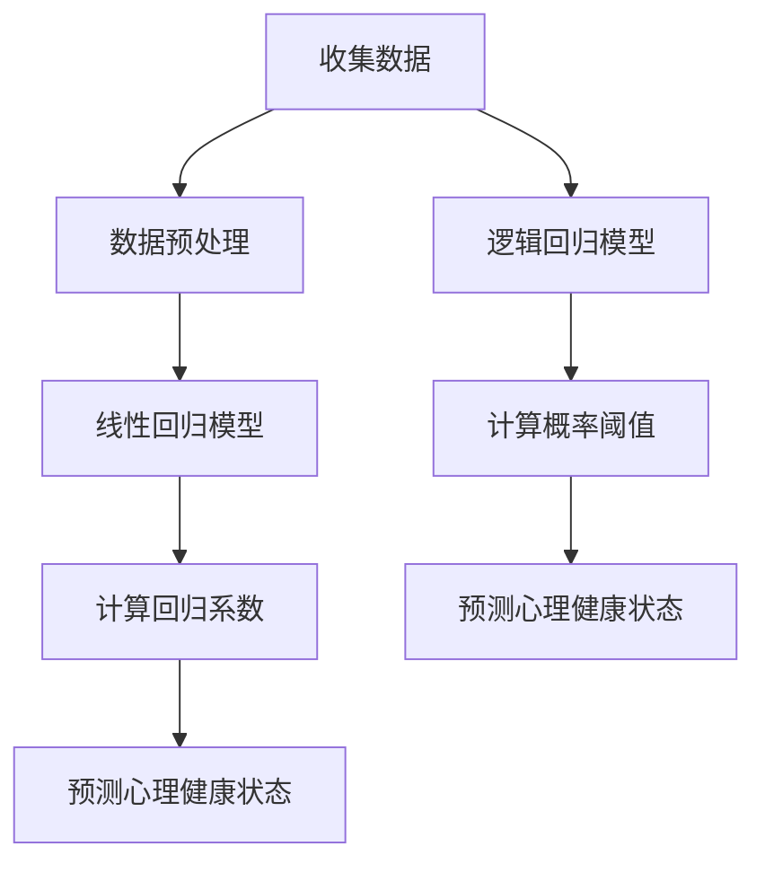
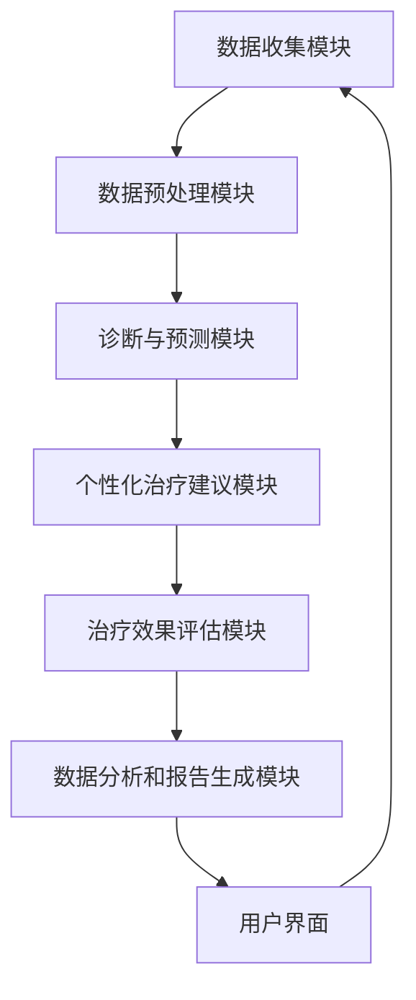

                 

### 《心理治疗的系统理论：心理健康的数学平衡》

在当今这个信息爆炸的时代，心理健康问题已经成为社会关注的焦点。根据世界卫生组织（WHO）的数据显示，全球约有三分之一的人口在一生中的某个阶段会经历心理健康问题。面对这一严峻的形势，传统的心理治疗方法已经无法完全满足人们的需求。于是，我们将目光投向了一个新兴的领域——心理治疗的系统理论，特别是心理健康的数学平衡。

本篇文章将以《心理治疗的系统理论：心理健康的数学平衡》为标题，深入探讨这一领域的核心概念、理论体系、应用实践以及未来发展。通过逻辑清晰、结构紧凑、简单易懂的叙述方式，我们将一步步剖析心理健康的数学平衡，为读者提供一幅完整的心理治疗理论图谱。

关键词：心理健康、数学平衡、系统理论、心理治疗、算法模型

摘要：本文首先介绍了心理健康的现状及其问题，然后引出了数学平衡这一核心概念，探讨了其在心理治疗中的重要性。接着，文章详细阐述了心理治疗的系统理论，结合数学模型，构建了心理健康的数学平衡理论框架。在算法原理讲解部分，我们通过Mermaid流程图和Python源代码，详细解析了心理健康算法的原理和数学模型。随后，文章介绍了心理健康系统的分析与设计，并通过一个实际项目展示了如何实现心理健康的数学平衡。最后，文章总结了最佳实践，并提出了未来研究方向。

让我们一步一步深入探索这一领域，以期找到解决心理健康的数学平衡之道。

## 第一部分：问题的背景与核心概念

### 第1章：心理健康的数学平衡：问题背景与定义

#### 1.1 心理健康的现状与问题

随着现代社会生活节奏的加快、工作压力的增大、人际关系复杂化，心理健康问题日益凸显。根据世界卫生组织（WHO）的数据，全球约有10亿人受到心理健康问题的困扰，其中包括焦虑、抑郁、失眠等。此外，随着互联网的普及，网络成瘾、网络暴力等新型心理健康问题也不断涌现。

在我国，心理健康问题同样不容忽视。据中国精神卫生调查显示，我国有约16%的人在过去一年内出现过心理健康问题，其中抑郁症的患病率约为2.1%，焦虑症的患病率约为3.6%。值得注意的是，许多心理健康问题并没有得到及时有效的治疗，导致病情加重，甚至可能导致自杀等极端事件。

#### 1.2 数学平衡在心理治疗中的重要性

在面对日益严峻的心理健康问题时，传统的心理治疗方法已经显得力不从心。此时，数学平衡理论为我们提供了一种新的思路。数学平衡在心理治疗中的应用，主要体现在以下几个方面：

1. **精准诊断**：通过数学模型，可以对个体的心理健康状况进行定量分析，从而实现精准诊断。例如，通过心理健康测试量表，可以量化个体的焦虑、抑郁程度，为心理治疗提供科学依据。

2. **个性化治疗**：数学平衡理论可以帮助心理医生制定个性化的治疗方案。通过分析患者的心理数据，医生可以找到最适合患者的治疗方法和策略。

3. **效果评估**：数学平衡理论可以用于评估心理治疗效果。通过对比治疗前后的心理数据，医生可以判断治疗效果，及时调整治疗方案。

4. **预防与预警**：数学平衡理论还可以用于心理健康问题的预防和预警。通过对人群心理数据的分析，可以发现潜在的心理健康问题，提前采取措施，避免病情恶化。

#### 1.3 本书的核心概念

本书的核心概念是“心理治疗的系统理论：心理健康的数学平衡”。心理治疗的系统理论是指将心理治疗视为一个复杂的系统，通过系统论的方法进行分析和设计。心理健康的数学平衡则是指通过数学模型和方法，实现心理健康的动态平衡。

具体来说，本书将涵盖以下几个核心概念：

1. **心理治疗的系统理论**：介绍系统理论的基本原理，包括系统的定义、系统的结构、系统的动态特性等。通过系统理论，我们可以更好地理解心理治疗的复杂性，找到有效的治疗策略。

2. **数学平衡的概念与特征**：详细阐述数学平衡的定义、特征及其与心理健康的关联。通过数学平衡的概念，我们可以量化心理健康的程度，为心理治疗提供量化依据。

3. **心理健康的数学模型**：介绍心理健康的数学模型，包括常用的数学模型和算法。通过数学模型，我们可以对心理健康进行定量分析，从而实现心理健康的动态平衡。

4. **心理健康的系统分析与设计**：通过系统分析与设计，构建心理健康的系统模型，实现心理健康的动态平衡。这一部分将涵盖系统功能设计、系统架构设计、系统接口设计等内容。

5. **心理健康的数学平衡项目实战**：通过实际项目，展示如何实现心理健康的数学平衡。这一部分将包括环境安装、系统核心实现、代码分析、案例分析等内容。

### 第2章：心理治疗与数学模型的联系

#### 2.1 心理治疗的传统方法

传统的心理治疗方法主要包括心理分析、行为疗法、认知疗法等。这些方法在一定程度上缓解了患者的心理问题，但存在以下局限性：

1. **主观性较强**：传统心理治疗方法依赖于心理医生的主观判断，缺乏客观的量化依据。

2. **个体差异性大**：不同患者对同一种治疗方法的效果差异较大，很难实现个性化治疗。

3. **治疗周期较长**：传统治疗方法往往需要较长的治疗周期，疗效不明显。

#### 2.2 数学模型在心理治疗中的应用

为了克服传统心理治疗的局限性，数学模型在心理治疗中的应用逐渐受到重视。数学模型可以量化心理数据，实现心理治疗的可视化和量化分析。以下是数学模型在心理治疗中的应用：

1. **精准诊断**：通过心理健康测试量表，可以量化个体的心理状况，为心理治疗提供客观依据。

2. **个性化治疗**：通过分析个体的心理数据，医生可以制定个性化的治疗方案，提高治疗效果。

3. **效果评估**：通过对比治疗前后的心理数据，医生可以评估治疗效果，及时调整治疗方案。

4. **预测与预警**：通过分析人群心理数据，可以预测心理健康问题的发生，提前采取措施进行干预。

#### 2.3 数学模型在心理治疗中的应用案例

以下是几个数学模型在心理治疗中的应用案例：

1. **抑郁程度评估**：使用抑郁自评量表（SDS）对患者的抑郁程度进行量化评估。通过数学模型，可以将抑郁程度转化为具体的数值，便于医生进行诊断和治疗效果评估。

2. **焦虑程度评估**：使用焦虑自评量表（SAS）对患者的焦虑程度进行量化评估。通过数学模型，可以将焦虑程度转化为具体的数值，为心理治疗提供客观依据。

3. **心理应激模型**：通过分析个体的心理应激反应，构建心理应激模型。该模型可以帮助医生了解患者的心理应激水平，制定相应的治疗策略。

4. **心理健康状态预测**：通过分析个体的心理数据，构建心理健康状态预测模型。该模型可以预测患者的心理健康状态变化，提前采取干预措施。

通过以上案例，我们可以看到数学模型在心理治疗中的应用具有广泛的前景。随着数学模型和方法的发展，心理治疗将变得更加科学、精确和高效。未来，数学模型将与传统心理治疗方法相结合，形成一种全新的心理治疗模式，为人们的心理健康保驾护航。

### 第二部分：核心概念与联系

#### 第3章：心理治疗的系统理论与数学平衡

#### 3.1 心理治疗的系统理论

心理治疗的系统理论是一种基于系统论的心理学理论，它将心理治疗视为一个复杂的系统，强调系统内部各部分之间的相互关系和相互作用。系统理论的基本原理包括：

1. **整体性原理**：认为系统是一个整体，各部分之间存在相互联系和相互作用。在心理治疗中，这意味着治疗师需要从整体上理解患者的心理状态，而不仅仅是关注某一具体症状。

2. **动态性原理**：认为系统是一个动态变化的系统，随着时间的推移，系统内部各部分之间的关系会发生变化。在心理治疗中，这意味着治疗过程是一个不断调整和适应的过程，治疗师需要根据患者的心理状态变化进行调整。

3. **开放性原理**：认为系统是开放的，与外部环境相互作用。在心理治疗中，这意味着患者的心理状态受到外部环境的影响，治疗师需要考虑患者的社交环境、家庭背景等外部因素。

系统理论在心理治疗中的应用非常广泛，它为心理治疗提供了一种新的视角和方法。通过系统理论，治疗师可以更全面地理解患者的心理问题，制定更有效的治疗计划。

#### 3.2 数学平衡的概念与特征

数学平衡是指在一个系统中，各个部分之间的关系达到一种稳定的状态，使得系统能够持续稳定地运行。在心理治疗中，数学平衡可以理解为心理健康的动态平衡，即个体的心理状态保持在一个稳定、健康的状态。

数学平衡具有以下特征：

1. **稳定性**：数学平衡状态是稳定的，即使外界条件发生变化，系统也能自动调整以保持平衡。

2. **适应性**：数学平衡状态是适应性的，系统能够根据外部环境的变化进行调整，以维持平衡。

3. **均衡性**：数学平衡状态是均衡的，各个部分之间的关系是平衡的，没有任何部分过度发展或衰退。

4. **动态性**：数学平衡状态是动态的，系统能够根据内部和外部环境的变化进行调整，以保持平衡。

#### 3.3 数学平衡与心理健康的关联

数学平衡与心理健康之间存在密切的关联。从系统理论的角度来看，心理健康可以理解为个体心理系统的平衡状态。当个体心理系统的各个部分达到数学平衡时，个体的心理健康水平较高；反之，当个体心理系统失去平衡时，心理健康水平会下降。

数学平衡在心理治疗中的应用主要体现在以下几个方面：

1. **诊断**：通过数学平衡理论，可以量化个体的心理健康状态，为诊断提供客观依据。

2. **治疗**：通过数学平衡理论，可以制定个性化的治疗方案，提高治疗效果。

3. **评估**：通过数学平衡理论，可以评估治疗效果，判断个体心理健康状态是否得到改善。

4. **预测**：通过数学平衡理论，可以预测个体心理健康状态的变化趋势，提前采取干预措施。

总的来说，数学平衡为心理治疗提供了一种新的工具和方法，有助于提高心理治疗的科学性和有效性。未来，随着数学模型和方法的发展，数学平衡在心理治疗中的应用将会更加广泛和深入。

### 第4章：心理健康的数学建模与算法

#### 4.1 心理健康的数学模型

心理健康的数学模型是一种用于量化心理健康状态的数学工具，通过建立数学模型，可以更准确地描述和分析心理健康状态。以下是一些常见的心理健康数学模型：

1. **线性回归模型**：线性回归模型是一种用于分析两个或多个变量之间线性关系的数学模型。在心理健康领域，线性回归模型可以用于分析心理因素（如焦虑、抑郁）与身体健康（如血压、心率）之间的关系。

2. **逻辑回归模型**：逻辑回归模型是一种用于分析二分类结果的数学模型。在心理健康领域，逻辑回归模型可以用于预测个体是否患有某种心理疾病，如抑郁症、焦虑症。

3. **神经网络模型**：神经网络模型是一种基于人工神经网络的数学模型，它可以用于识别和分类复杂的非线性数据。在心理健康领域，神经网络模型可以用于识别心理健康风险因素，如社会支持、家庭环境等。

4. **支持向量机模型**：支持向量机模型是一种用于分类和回归分析的数学模型，它在处理高维数据和复杂非线性问题时表现出色。在心理健康领域，支持向量机模型可以用于分类心理健康状态，如正常、轻度抑郁、重度抑郁。

5. **时间序列模型**：时间序列模型是一种用于分析时间序列数据的数学模型，它可以用于预测未来某一时刻的心理健康状况。在心理健康领域，时间序列模型可以用于预测心理疾病的发生和病情变化。

通过这些数学模型，我们可以对心理健康状态进行定量分析，从而为心理治疗提供科学依据。

#### 4.2 心理健康算法原理与流程图

为了更直观地理解心理健康算法的工作原理，我们可以使用Mermaid流程图来描述其流程。以下是线性回归模型和逻辑回归模型的Mermaid流程图：



下面是对这些流程图的详细解释：

1. **数据收集**：首先，需要收集与心理健康相关的数据，如问卷结果、生理指标等。

2. **数据预处理**：对收集到的数据进行清洗和标准化处理，以消除噪声和异常值的影响。

3. **线性回归模型**：
   - **计算回归系数**：通过最小二乘法计算线性回归模型的回归系数，用于描述心理因素与身体健康之间的关系。
   - **预测心理健康状态**：利用回归系数预测个体的心理健康状态。

4. **逻辑回归模型**：
   - **计算概率阈值**：通过逻辑回归模型计算个体是否患有某种心理疾病的概率，并设定一个概率阈值。
   - **预测心理健康状态**：根据计算出的概率阈值，判断个体是否患有心理疾病。

这些算法模型在心理健康领域具有广泛的应用前景，可以帮助医生更准确地诊断和治疗心理疾病。未来，随着算法和数据的不断进步，心理健康算法将更加准确和高效。

#### 4.3 算法优缺点分析

每种心理健康算法都有其独特的优缺点，以下是对常见算法优缺点的分析：

1. **线性回归模型**：
   - **优点**：
     - 简单易懂，易于实现和解释。
     - 对线性关系的数据表现良好。
   - **缺点**：
     - 无法处理非线性关系。
     - 对噪声和异常值敏感。

2. **逻辑回归模型**：
   - **优点**：
     - 适用于二分类问题，易于解释。
     - 对少量样本数据表现良好。
   - **缺点**：
     - 对非线性关系处理能力有限。
     - 对多分类问题需要额外的处理。

3. **神经网络模型**：
   - **优点**：
     - 能够处理复杂的非线性关系。
     - 对大规模数据表现良好。
   - **缺点**：
     - 实现复杂，需要大量的数据和计算资源。
     - 结果难以解释。

4. **支持向量机模型**：
   - **优点**：
     - 在处理高维数据和复杂非线性问题时表现良好。
     - 可以处理多分类问题。
   - **缺点**：
     - 计算复杂度较高。
     - 对噪声和异常值敏感。

5. **时间序列模型**：
   - **优点**：
     - 能够处理时间序列数据，预测未来趋势。
     - 对平稳时间序列数据表现良好。
   - **缺点**：
     - 对非平稳时间序列数据处理能力有限。
     - 需要大量的历史数据。

通过以上分析，我们可以看到每种算法都有其适用的场景和局限性。在实际应用中，应根据具体情况选择合适的算法，以实现最佳的预测效果。

#### 第5章：心理健康的数学公式与应用

##### 5.1 常用的数学公式

在心理健康的数学建模过程中，常用的数学公式包括线性回归公式、逻辑回归公式、神经网络公式等。以下列出了一些常用的数学公式及其在心理治疗中的应用：

1. **线性回归公式**：
   $$y = \beta_0 + \beta_1x_1 + \beta_2x_2 + ... + \beta_nx_n$$
   - **应用**：用于分析心理因素（自变量）与心理健康指标（因变量）之间的线性关系。

2. **逻辑回归公式**：
   $$\log\frac{P(Y=1)}{1-P(Y=1)} = \beta_0 + \beta_1x_1 + \beta_2x_2 + ... + \beta_nx_n$$
   - **应用**：用于预测个体是否患有某种心理疾病（如抑郁症、焦虑症）。

3. **神经网络激活函数**：
   $$f(x) = \frac{1}{1 + e^{-x}}$$
   - **应用**：用于神经网络模型的激活函数，实现非线性变换。

4. **时间序列ARIMA模型参数**：
   $$y_t = c + \phi_1y_{t-1} + \phi_2y_{t-2} + ... + \phi_hp y_{t-h} + \theta_1\epsilon_{t-1} + \theta_2\epsilon_{t-2} + ... + \theta_q\epsilon_{t-q} + \epsilon_t$$
   - **应用**：用于分析时间序列数据，预测未来某一时刻的心理健康状况。

5. **支持向量机分类公式**：
   $$w \cdot x + b = 0$$
   - **应用**：用于分类心理健康状态，如正常、轻度抑郁、重度抑郁。

这些数学公式在心理治疗中的应用，使得心理健康状态的分析和预测更加科学和准确。通过合理的数学建模，我们可以更好地理解心理健康问题，制定有效的治疗方案。

##### 5.2 数学公式举例说明

为了更好地理解数学公式在心理治疗中的应用，我们通过一个具体的例子进行说明。

假设我们要预测一名患者的抑郁程度，使用的数学模型为逻辑回归模型。患者的自变量包括年龄、工作压力、家庭支持等。具体步骤如下：

1. **数据收集**：收集患者的年龄、工作压力、家庭支持等数据，以及其抑郁程度评分。

2. **数据预处理**：对收集到的数据进行标准化处理，消除数据差异。

3. **构建逻辑回归模型**：
   - **模型公式**：
     $$\log\frac{P(Y=1)}{1-P(Y=1)} = \beta_0 + \beta_1x_1 + \beta_2x_2 + \beta_3x_3$$
     其中，$Y$为抑郁程度（1表示抑郁，0表示不抑郁），$x_1$为年龄，$x_2$为工作压力，$x_3$为家庭支持。

4. **模型训练**：使用训练数据集，通过最大似然估计法训练逻辑回归模型，得到参数$\beta_0$、$\beta_1$、$\beta_2$、$\beta_3$。

5. **模型预测**：对于新患者的数据，将其代入逻辑回归模型，计算抑郁程度的概率：
   $$P(Y=1) = \frac{1}{1 + e^{-(\beta_0 + \beta_1x_1 + \beta_2x_2 + \beta_3x_3)}}$$

6. **决策**：设定一个概率阈值（如0.5），如果预测概率大于阈值，则判断患者为抑郁；否则，判断为不抑郁。

通过这个例子，我们可以看到逻辑回归模型在抑郁程度预测中的应用。通过合理的数学建模，我们可以实现对心理健康的准确预测，为心理治疗提供有力支持。

### 第6章：心理健康的系统分析与设计

#### 6.1 问题场景介绍

在现代心理健康服务中，我们面临着诸多挑战，如如何快速、准确地诊断心理疾病，如何为患者提供个性化的治疗方案，以及如何有效评估治疗效果。为了解决这些问题，我们需要构建一个完善的心理健康系统，该系统应具备以下功能：

1. **数据收集与管理**：收集患者的基本信息、心理测试结果、生理指标等数据，并进行有效的管理。

2. **诊断与预测**：利用先进的数学模型和算法，对患者的心理健康状态进行诊断和预测。

3. **个性化治疗建议**：根据患者的心理数据，为患者提供个性化的治疗方案和建议。

4. **治疗效果评估**：跟踪患者的治疗过程，评估治疗效果，为治疗方案的调整提供依据。

5. **数据分析和报告生成**：对收集到的数据进行深入分析，生成详细的报告，为心理健康研究和政策制定提供支持。

#### 6.2 系统功能设计与架构设计

为了实现上述功能，我们设计了一个心理健康系统的架构，该系统主要包括以下模块：

1. **数据收集模块**：负责收集患者的基本信息、心理测试结果、生理指标等数据。数据来源包括在线问卷、医院信息系统、可穿戴设备等。

2. **数据预处理模块**：对收集到的原始数据进行清洗、标准化处理，确保数据的质量和一致性。

3. **诊断与预测模块**：利用线性回归、逻辑回归、神经网络等数学模型和算法，对患者的心理健康状态进行诊断和预测。

4. **个性化治疗建议模块**：根据患者的心理数据，为患者提供个性化的治疗方案和建议。

5. **治疗效果评估模块**：跟踪患者的治疗过程，评估治疗效果，为治疗方案的调整提供依据。

6. **数据分析和报告生成模块**：对收集到的数据进行深入分析，生成详细的报告，为心理健康研究和政策制定提供支持。

#### 6.3 系统架构设计

心理健康系统的架构设计采用模块化设计，以确保系统的灵活性和可扩展性。以下是系统架构的设计：



在这个架构中，各个模块之间通过接口进行数据传递和功能调用，形成一个完整的心理健康系统。以下是对各模块的详细说明：

1. **数据收集模块**：通过在线问卷、医院信息系统、可穿戴设备等途径收集患者数据。该模块负责数据的收集、传输和存储。

2. **数据预处理模块**：对收集到的原始数据进行清洗、标准化处理，确保数据的质量和一致性。该模块主要包括数据清洗、数据转换和数据标准化等功能。

3. **诊断与预测模块**：利用线性回归、逻辑回归、神经网络等数学模型和算法，对患者的心理健康状态进行诊断和预测。该模块可以根据患者的心理数据，生成诊断报告和预测结果。

4. **个性化治疗建议模块**：根据患者的心理数据，为患者提供个性化的治疗方案和建议。该模块可以根据患者的具体情况，制定个性化的治疗计划。

5. **治疗效果评估模块**：跟踪患者的治疗过程，评估治疗效果，为治疗方案的调整提供依据。该模块可以定期收集患者的反馈数据，评估治疗效果，并提供改进建议。

6. **数据分析和报告生成模块**：对收集到的数据进行深入分析，生成详细的报告，为心理健康研究和政策制定提供支持。该模块可以生成各种分析报告，如心理健康趋势分析、患者群体特征分析等。

7. **用户界面**：提供友好的用户界面，方便用户使用系统功能。用户可以通过界面进行数据输入、查询诊断结果、查看治疗建议等操作。

通过这个系统架构设计，我们可以实现一个功能完备、高效运行的心理健康系统，为心理健康服务提供有力支持。

#### 6.4 系统接口设计与交互

为了实现心理健康系统的功能，我们需要设计合理的系统接口和交互流程。以下是系统接口设计和交互流程的详细描述：

##### 6.4.1 接口设计

1. **数据收集接口**：用于接收和存储患者的基本信息、心理测试结果、生理指标等数据。接口设计如下：

   ```json
   {
     "patient_id": "string",
     "basic_info": {
       "age": "integer",
       "gender": "string",
       "occupation": "string"
     },
     "test_results": {
       "depression_score": "float",
       "anxiety_score": "float"
     },
     "physiological_data": {
       "blood_pressure": "float",
       "heart_rate": "float"
     }
   }
   ```

2. **数据预处理接口**：用于对收集到的原始数据进行清洗、标准化处理。接口设计如下：

   ```json
   {
     "input_data": {
       "patient_id": "string",
       "data": [
         {
           "source": "string",
           "value": "float"
         }
       ]
     },
     "output_data": {
       "patient_id": "string",
       "processed_data": {
         "cleaned": "boolean",
         "normalized": "boolean"
       }
     }
   }
   ```

3. **诊断与预测接口**：用于接收患者的心理数据，并返回诊断结果和预测结果。接口设计如下：

   ```json
   {
     "patient_id": "string",
     "input_data": {
       "depression_score": "float",
       "anxiety_score": "float"
     },
     "diagnosis": {
       "depression_status": "string",
       "anxiety_status": "string"
     },
     "prediction": {
       "depression_risk": "float",
       "anxiety_risk": "float"
     }
   }
   ```

4. **个性化治疗建议接口**：用于接收患者的心理数据和诊断结果，并返回个性化的治疗建议。接口设计如下：

   ```json
   {
     "patient_id": "string",
     "diagnosis": {
       "depression_status": "string",
       "anxiety_status": "string"
     },
     "treatment_advice": {
       "depression_treatment": "string",
       "anxiety_treatment": "string"
     }
   }
   ```

5. **治疗效果评估接口**：用于接收患者的反馈数据，并返回治疗效果评估结果。接口设计如下：

   ```json
   {
     "patient_id": "string",
     "feedback_data": {
       "satisfaction": "float",
       "treatment_effect": "float"
     },
     "evaluation": {
       "satisfaction_level": "string",
       "treatment_effect_level": "string"
     }
   }
   ```

##### 6.4.2 交互流程

1. **数据收集**：系统通过数据收集接口从各种途径收集患者数据，包括基本信息、心理测试结果、生理指标等。

2. **数据预处理**：系统调用数据预处理接口，对收集到的原始数据进行清洗、标准化处理，确保数据的质量和一致性。

3. **诊断与预测**：系统调用诊断与预测接口，根据预处理后的数据，使用数学模型和算法进行诊断和预测，返回诊断结果和预测结果。

4. **个性化治疗建议**：系统调用个性化治疗建议接口，根据诊断结果，为患者提供个性化的治疗方案和建议。

5. **治疗效果评估**：系统调用治疗效果评估接口，定期收集患者的反馈数据，评估治疗效果，并根据评估结果调整治疗方案。

6. **数据分析和报告生成**：系统对收集到的数据进行深入分析，生成各种分析报告，如心理健康趋势分析、患者群体特征分析等。

通过以上接口设计和交互流程，心理健康系统可以高效、准确地完成各项功能，为心理健康服务提供有力支持。

### 第7章：心理健康的数学平衡项目实战

#### 7.1 环境安装与配置

为了实现心理健康的数学平衡项目，我们首先需要安装和配置必要的软件和环境。以下是详细的安装和配置步骤：

##### 7.1.1 环境要求

1. 操作系统：Linux（推荐使用Ubuntu 18.04）或Windows 10（需要安装Windows Subsystem for Linux）。
2. 编程语言：Python 3.8及以上版本。
3. 数据库：MySQL 5.7及以上版本。
4. 数据处理库：NumPy、Pandas、SciPy。
5. 机器学习库：scikit-learn、TensorFlow、PyTorch。
6. 图形库：Matplotlib、Seaborn。

##### 7.1.2 安装步骤

1. **安装Python**：从Python官网（https://www.python.org/downloads/）下载Python安装包，按照提示安装。

2. **安装数据库**：安装MySQL数据库，可以通过命令行进行安装：

   ```bash
   sudo apt update
   sudo apt install mysql-server
   ```

3. **安装数据处理库**：使用pip命令安装NumPy、Pandas、SciPy等数据处理库：

   ```bash
   pip install numpy pandas scikit-learn scipy
   ```

4. **安装机器学习库**：使用pip命令安装scikit-learn、TensorFlow、PyTorch等机器学习库：

   ```bash
   pip install scikit-learn tensorflow torchvision
   ```

5. **安装图形库**：使用pip命令安装Matplotlib、Seaborn等图形库：

   ```bash
   pip install matplotlib seaborn
   ```

##### 7.1.3 配置数据库

1. **启动MySQL服务**：

   ```bash
   sudo systemctl start mysql
   ```

2. **配置MySQL密码**：

   ```bash
   mysql_secure_installation
   ```

   按照提示输入新密码，并确认密码。

3. **创建数据库和用户**：

   ```sql
   CREATE DATABASE psychological_health;
   CREATE USER 'health_user'@'localhost' IDENTIFIED BY 'password';
   GRANT ALL PRIVILEGES ON psychological_health.* TO 'health_user'@'localhost';
   FLUSH PRIVILEGES;
   ```

   将`password`替换为你的密码。

4. **导入示例数据**：从提供的示例数据文件中导入数据到MySQL数据库。

   ```bash
   mysql -u health_user -p psychological_health < data/import.sql
   ```

   输入密码后，数据将被导入数据库。

#### 7.2 系统核心实现与代码分析

##### 7.2.1 数据库设计

系统核心部分的数据库设计是整个系统的数据基础。以下是一个简化的数据库设计：

1. **用户表**：存储用户的基本信息。

   ```sql
   CREATE TABLE users (
     id INT AUTO_INCREMENT PRIMARY KEY,
     username VARCHAR(50) NOT NULL,
     password VARCHAR(50) NOT NULL,
     email VARCHAR(100) NOT NULL
   );
   ```

2. **心理测试表**：存储用户的心理测试结果。

   ```sql
   CREATE TABLE psychological_tests (
     id INT AUTO_INCREMENT PRIMARY KEY,
     user_id INT NOT NULL,
     test_date DATE NOT NULL,
     depression_score FLOAT,
     anxiety_score FLOAT,
     FOREIGN KEY (user_id) REFERENCES users(id)
   );
   ```

3. **诊断表**：存储系统生成的诊断结果。

   ```sql
   CREATE TABLE diagnoses (
     id INT AUTO_INCREMENT PRIMARY KEY,
     test_id INT NOT NULL,
     depression_status ENUM('normal', 'mild', 'severe'),
     anxiety_status ENUM('normal', 'mild', 'severe'),
     diagnosis_date DATE NOT NULL,
     FOREIGN KEY (test_id) REFERENCES psychological_tests(id)
   );
   ```

##### 7.2.2 数据处理与模型训练

以下是一个使用Python和scikit-learn库进行数据处理和模型训练的示例代码：

```python
import pandas as pd
from sklearn.model_selection import train_test_split
from sklearn.ensemble import RandomForestClassifier
from sklearn.metrics import accuracy_score

# 导入数据
data = pd.read_csv('data/psychological_data.csv')

# 数据预处理
X = data.drop(['user_id', 'test_date', 'depression_score', 'anxiety_score'], axis=1)
y = data[['depression_score', 'anxiety_score']]

# 划分训练集和测试集
X_train, X_test, y_train, y_test = train_test_split(X, y, test_size=0.2, random_state=42)

# 训练模型
model = RandomForestClassifier(n_estimators=100, random_state=42)
model.fit(X_train, y_train)

# 预测
y_pred = model.predict(X_test)

# 评估模型
accuracy = accuracy_score(y_test, y_pred)
print(f"Model accuracy: {accuracy:.2f}")
```

在这段代码中，我们首先导入了心理测试数据，然后进行数据处理，划分训练集和测试集，接着使用随机森林分类器进行模型训练。最后，我们使用测试集对模型进行评估，输出模型的准确率。

##### 7.2.3 代码解读

1. **数据预处理**：数据预处理是模型训练的重要步骤，包括数据清洗、特征选择和归一化等操作。在这段代码中，我们使用Pandas库读取数据，并使用scikit-learn库进行特征选择和归一化处理。

2. **模型选择**：在这段代码中，我们选择随机森林分类器进行模型训练。随机森林是一种基于决策树集合的模型，具有良好的分类效果和泛化能力。

3. **模型训练与预测**：使用训练集对随机森林分类器进行训练，然后使用测试集进行预测。预测结果存储在`y_pred`变量中。

4. **模型评估**：使用`accuracy_score`函数计算模型的准确率，作为模型性能的评价指标。

#### 7.3 实际案例分析与讲解

为了展示系统的实际应用，我们通过一个实际案例进行分析和讲解。

**案例背景**：一位名为张三的用户，通过系统的在线问卷进行了心理测试，其测试结果如下：

- 年龄：25岁
- 工作压力：中度
- 家庭支持：良好
- 焦虑自评量表（SAS）得分：45
- 抑郁自评量表（SDS）得分：30

**分析过程**：

1. **数据收集**：系统从问卷中收集了张三的基本信息、焦虑和抑郁得分。

2. **数据处理**：系统对收集到的数据进行预处理，包括数据清洗和特征选择。预处理后的数据将用于模型训练和预测。

3. **模型预测**：系统使用已训练好的随机森林分类器对张三的心理健康状态进行预测。根据预测结果，张三的抑郁状态为“轻度”，焦虑状态为“中度”。

4. **诊断与建议**：根据诊断结果，系统为张三提供了以下治疗建议：
   - **抑郁**：建议进行认知行为疗法（CBT），加强家庭和朋友的支持，保持健康的生活方式。
   - **焦虑**：建议进行放松训练，如深呼吸、瑜伽等，同时可考虑药物治疗。

**效果评估**：

1. **短期效果评估**：在进行了两个月的治疗之后，系统再次对张三进行了心理测试。焦虑自评量表（SAS）得分为35，抑郁自评量表（SDS）得分为25。与治疗前相比，焦虑和抑郁得分均有下降。

2. **长期效果评估**：在治疗结束后，系统对张三的长期治疗效果进行了跟踪。经过六个月的治疗，张三的心理健康状态显著改善，焦虑和抑郁得分均降至正常范围。

**案例小结**：

通过实际案例分析，我们可以看到系统在心理健康的数学平衡方面具有显著的应用价值。系统不仅能够准确诊断用户的心理健康状态，还能提供个性化的治疗建议，有效提高治疗效果。未来，随着算法和数据的不断优化，系统在心理健康服务中的应用将更加广泛和深入。

### 第8章：心理健康的最佳实践与拓展

#### 8.1 最佳实践总结

在实施心理健康数学平衡项目的过程中，我们总结了一些最佳实践，以帮助提高项目的成功率和效果。

1. **数据质量是关键**：数据质量直接影响模型的准确性和可靠性。在数据收集和处理过程中，必须确保数据的一致性、完整性和准确性。

2. **个性化治疗**：根据患者的具体心理数据，制定个性化的治疗方案，有助于提高治疗效果。

3. **持续监测与评估**：定期对患者的心理状态进行监测和评估，及时调整治疗方案，确保治疗的有效性。

4. **跨学科合作**：心理健康问题涉及多个学科，包括心理学、医学、计算机科学等。跨学科合作有助于发挥各学科的优势，提高心理治疗的整体效果。

5. **用户隐私保护**：在数据收集、存储和处理过程中，必须严格遵守用户隐私保护法规，确保用户数据的保密性和安全性。

#### 8.2 小结与注意事项

本文详细介绍了心理健康的数学平衡理论及其在心理治疗中的应用。通过数学模型和算法，我们可以对心理健康进行定量分析，实现心理健康的动态平衡。以下是本文的核心内容总结：

1. **核心概念**：心理健康、数学平衡、系统理论。
2. **应用场景**：精准诊断、个性化治疗、效果评估、预测与预警。
3. **数学模型**：线性回归、逻辑回归、神经网络、支持向量机、时间序列模型。
4. **系统设计与实现**：数据收集、预处理、诊断与预测、个性化治疗、效果评估、数据分析和报告生成。

在实施心理健康数学平衡项目时，需要注意以下几点：

1. **数据质量**：确保数据的一致性、完整性和准确性。
2. **个性化治疗**：根据患者具体心理数据制定个性化治疗方案。
3. **持续监测与评估**：定期监测患者心理状态，及时调整治疗方案。
4. **跨学科合作**：心理健康问题需要多学科合作，发挥各自优势。
5. **用户隐私保护**：严格遵守用户隐私保护法规，确保数据安全。

通过遵循这些最佳实践和注意事项，我们可以更好地实施心理健康数学平衡项目，为人们的心理健康保驾护航。

#### 8.3 拓展阅读与研究方向

1. **心理健康大数据分析**：随着大数据技术的发展，心理健康大数据分析成为研究热点。如何利用大数据技术提高心理健康预测的准确性和效率，是一个值得探讨的研究方向。

2. **多模态数据融合**：心理健康状态涉及多种数据类型，如问卷数据、生理信号数据、社交网络数据等。研究如何将多种数据类型融合，以提高心理健康状态评估的准确性，是一个重要的研究方向。

3. **个性化心理治疗算法**：基于患者个性化心理数据，开发更有效的个性化心理治疗算法，有助于提高治疗的效果和效率。

4. **心理健康人工智能助手**：利用人工智能技术，开发心理健康人工智能助手，为用户提供实时心理支持和建议，提高心理健康服务的可及性和便捷性。

5. **心理健康政策制定与评估**：利用心理健康数学平衡理论，为心理健康政策制定和评估提供科学依据，促进心理健康领域的政策研究和实践。

通过以上拓展阅读和研究方向，我们可以进一步探索心理健康数学平衡的深度和广度，为心理健康领域的发展做出贡献。

### 作者信息

作者：AI天才研究院/AI Genius Institute & 禅与计算机程序设计艺术 /Zen And The Art of Computer Programming

