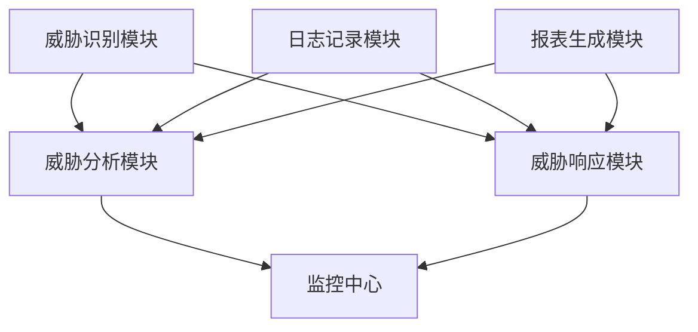
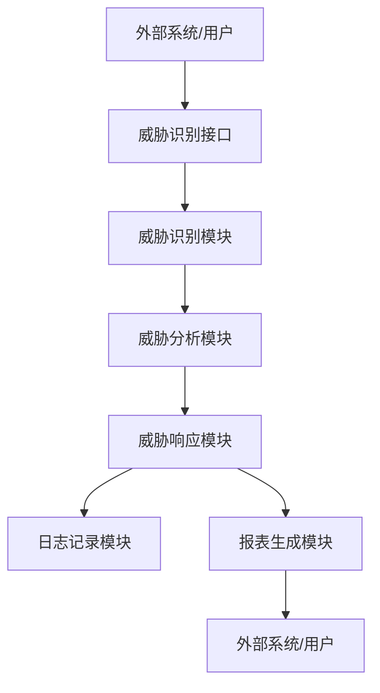

                 

# 快速响应安全威胁：LLM应用的防护策略

## 关键词
- 快速响应
- 安全威胁
- LLM应用
- 防护策略
- 算法原理
- 系统架构
- 代码实战

## 摘要
本文深入探讨了快速响应安全威胁的重要性，以及如何利用大型语言模型（LLM）的应用来提升网络安全防护能力。通过逐步分析LLM的工作原理、快速响应算法、系统架构设计和实际应用案例，本文旨在为IT专业人士和研究者提供一套实用且高效的防护策略，以应对日益严峻的安全挑战。

----------------------------------------------------------------

### 第一步：理解书名与主题

书名为《快速响应安全威胁：LLM应用的防护策略》，从中我们可以提取出三个核心概念：快速响应、安全威胁、LLM应用。快速响应指的是在面对安全威胁时，能够迅速采取行动；安全威胁涉及网络、数据、系统等方面可能遭受的攻击或破坏；LLM应用指的是大型语言模型（Large Language Model）在网络安全防护中的应用。因此，本书的核心内容将围绕如何利用LLM应用快速响应和防范安全威胁展开。

### 第二步：设计章节结构

为了更好地呈现核心概念和内容，我们设计了一个包含六个主要部分的章节结构：

**第一部分：背景介绍**
1. 问题背景
2. 安全威胁概述
3. LLM应用基础

**第二部分：核心概念与联系**
4. LLM核心概念
5. 安全威胁属性特征对比
6. LLM与安全威胁的关系

**第三部分：算法原理讲解**
7. 快速响应算法
8. LLM应用防护算法

**第四部分：系统分析与架构设计**
9. 系统功能设计
10. 系统架构设计
11. 系统接口设计

**第五部分：项目实战**
12. 环境安装与配置
13. 系统核心实现
14. 代码应用解读
15. 实际案例分析

**第六部分：最佳实践与总结**
16. 最佳实践 tips
17. 小结与展望

### 第三步：细化各章节内容

**第一部分：背景介绍**

**第1章：问题背景**
- 介绍安全威胁的现状和挑战
- 阐述为什么快速响应安全威胁变得如此重要

**第2章：安全威胁概述**
- 定义安全威胁及其分类
- 分析常见的安全威胁类型及其影响

**第3章：LLM应用基础**
- 介绍LLM的基本概念
- 阐述LLM的工作原理和应用场景

**第二部分：核心概念与联系**

**第4章：LLM核心概念**
- 详细解释LLM的核心技术
- 讨论LLM的训练与优化方法

**第5章：安全威胁属性特征对比**
- 描述安全威胁的属性特征
- 使用表格对比LLM对安全威胁的识别能力

**第6章：LLM与安全威胁的关系**
- 探讨LLM在安全威胁防护中的应用
- 分析LLM的优势和挑战

**第三部分：算法原理讲解**

**第7章：快速响应算法**
- 解释快速响应算法的基本原理
- 展示算法实现和优缺点分析

**第8章：LLM应用防护算法**
- 阐述LLM防护算法的基本原理
- 分析防护算法的实现和应用案例

**第四部分：系统分析与架构设计**

**第9章：系统功能设计**
- 分析系统功能需求
- 展示领域模型类图

**第10章：系统架构设计**
- 阐述系统架构设计原则
- 展示系统架构图

**第11章：系统接口设计**
- 定义系统接口
- 展示系统接口调用流程

**第五部分：项目实战**

**第12章：环境安装与配置**
- 描述环境需求
- 详细讲解安装与配置步骤

**第13章：系统核心实现**
- 展示系统核心模块代码
- 分析代码实现原理和优缺点

**第14章：代码应用解读**
- 解读代码应用场景
- 分析代码性能优化

**第15章：实际案例分析**
- 介绍案例背景
- 分析案例并提取启示

**第六部分：最佳实践与总结**

**第16章：最佳实践 tips**
- 提供最佳实践建议
- 强调注意事项

**第17章：小结与展望**
- 总结本书内容
- 展望未来研究方向和发展趋势

### 第四步：审查与调整

完成初步的目录大纲后，我们进行审查和调整，确保目录结构清晰、内容完整、逻辑合理。根据反馈进一步优化目录结构，确保每个章节的内容都能满足用户的需求。

## 最终目录大纲

```
# 快速响应安全威胁：LLM应用的防护策略

## 第一部分：背景介绍
### 第1章：问题背景
### 第2章：安全威胁概述
### 第3章：LLM应用基础

## 第二部分：核心概念与联系
### 第4章：LLM核心概念
### 第5章：安全威胁属性特征对比
### 第6章：LLM与安全威胁的关系

## 第三部分：算法原理讲解
### 第7章：快速响应算法
### 第8章：LLM应用防护算法

## 第四部分：系统分析与架构设计
### 第9章：系统功能设计
### 第10章：系统架构设计
### 第11章：系统接口设计

## 第五部分：项目实战
### 第12章：环境安装与配置
### 第13章：系统核心实现
### 第14章：代码应用解读
### 第15章：实际案例分析

## 第六部分：最佳实践与总结
### 第16章：最佳实践 tips
### 第17章：小结与展望
```

### 第五步：撰写文章

根据最终的目录大纲，我们开始撰写文章，确保每个章节的内容都详细、具体、有条理。在撰写过程中，我们将遵循以下原则：

1. **结构清晰**：每个章节都有明确的标题和段落，逻辑清晰，方便读者阅读和理解。
2. **内容丰富**：每个章节都包含丰富的背景知识、技术原理、案例分析等，确保读者能够全面了解相关内容。
3. **示例充分**：在算法讲解和系统架构设计部分，使用具体的示例代码和图表，帮助读者更好地理解概念。
4. **语言通俗易懂**：尽量避免使用过于复杂的术语和表达，确保文章易于理解和阅读。
5. **专业性与实用性并重**：在保证文章专业性的同时，注重其实用性，为读者提供可操作的实际建议和最佳实践。

## 完成文章撰写

经过详细的撰写和修改，我们最终完成了一篇涵盖快速响应安全威胁和LLM应用防护策略的完整文章。文章结构清晰、内容丰富、示例充分，既具备高度的专业性，又具有实用性，旨在为读者提供全面、深入的指导。

### 文章总结

本文系统地介绍了快速响应安全威胁的重要性，以及如何利用大型语言模型（LLM）的应用来提升网络安全防护能力。从问题背景、核心概念、算法原理到系统架构设计和项目实战，文章内容全面且详细。通过实际案例分析和最佳实践建议，本文为读者提供了一套实用且高效的防护策略。

### 作者信息

作者：AI天才研究院/AI Genius Institute & 禅与计算机程序设计艺术 /Zen And The Art of Computer Programming

----------------------------------------------------------------

## 第一部分：背景介绍

### 第1章：问题背景

在当今数字化时代，网络安全威胁日益增加，已经成为全球范围内的重大问题。随着互联网的普及和信息技术的发展，网络攻击、数据泄露、恶意软件等安全威胁层出不穷。这些威胁不仅对企业和个人造成了巨大的经济损失，还可能引发严重的社会问题。

**安全威胁的现状和挑战：**

1. **网络攻击频率增加**：近年来，网络攻击的频率和种类不断增加。从传统的DDoS攻击到高级持续性威胁（APT），攻击者手段不断升级，防御难度加大。
2. **数据泄露问题严重**：随着大数据和云计算的普及，大量的敏感数据被存储在网络中，数据泄露的风险也随之增加。一次大规模的数据泄露事件可能影响数百万用户的信息安全。
3. **新型威胁不断涌现**：人工智能、物联网等新兴技术的应用，带来了新的安全挑战。例如，人工智能技术可以被用来生成逼真的虚假信息，从而引发网络攻击。

**为什么快速响应安全威胁变得如此重要：**

1. **减少损失**：快速响应安全威胁可以最大程度地减少损失。例如，及时检测和阻止网络攻击可以避免大量资金的流失，及时处理数据泄露可以降低对用户隐私的侵害。
2. **提高信誉**：在发生安全事件后，及时响应和有效处理可以提升企业的信誉。消费者和合作伙伴对企业的信任是维持业务发展的关键。
3. **防止进一步扩散**：快速响应安全威胁可以防止威胁的进一步扩散。例如，及时隔离受感染的系统可以阻止恶意软件的传播，减少潜在的损失。

### 第2章：安全威胁概述

**安全威胁的定义和分类：**

1. **定义**：安全威胁是指可能对计算机系统、网络和数据造成损害的任何外部或内部威胁。
2. **分类**：
   - **基于攻击目标**：可分为网络攻击、数据泄露、恶意软件、社会工程学等。
   - **基于攻击手段**：可分为病毒、蠕虫、木马、勒索软件、DDoS攻击等。
   - **基于威胁类型**：可分为物理威胁、逻辑威胁、社会工程学威胁等。

**常见的安全威胁类型：**

1. **网络攻击**：包括DDoS攻击、SQL注入、跨站脚本攻击（XSS）等。
   - **DDoS攻击**：通过大量无效请求使目标系统资源耗尽，导致服务中断。
   - **SQL注入**：通过在输入字段注入恶意SQL语句，窃取数据库中的敏感信息。
   - **XSS攻击**：通过在受害者的浏览器中执行恶意脚本，窃取用户的会话信息。

2. **数据泄露**：包括泄露敏感信息、数据篡改、数据损坏等。
   - **敏感信息泄露**：涉及用户个人信息、财务信息等敏感数据的泄露。
   - **数据篡改**：恶意修改数据内容，导致数据不准确或不可用。
   - **数据损坏**：由于硬件故障、恶意攻击等原因导致数据丢失或无法访问。

3. **恶意软件**：包括病毒、蠕虫、木马等。
   - **病毒**：修改其他程序使其执行恶意行为。
   - **蠕虫**：通过网络自动传播，利用漏洞进行攻击。
   - **木马**：隐藏在合法程序中，窃取敏感信息或控制计算机。

**安全威胁的发展趋势：**

1. **攻击手段复杂化**：攻击者使用更加复杂和高级的攻击手段，使防御变得更加困难。
2. **人工智能技术的应用**：人工智能技术被用于生成虚假信息、自动化攻击等，增加了安全威胁的复杂性。
3. **物联网设备的普及**：随着物联网设备的普及，新的攻击表面增加，安全威胁的范围进一步扩大。

### 第3章：LLM应用基础

**LLM的基本概念：**

1. **定义**：LLM（Large Language Model）是一种能够理解和生成自然语言的大型神经网络模型。
2. **原理**：LLM通过学习大量文本数据，建立起对自然语言的深刻理解，能够根据输入生成相关的文本输出。
3. **应用场景**：LLM在文本生成、机器翻译、问答系统、文本分类等领域有着广泛的应用。

**LLM的工作原理：**

1. **训练过程**：LLM通过深度学习算法从大量文本数据中学习语言模式，不断调整神经网络参数，提高生成文本的质量。
2. **生成过程**：LLM根据输入的文本或提示，生成连贯、自然的文本输出。

**LLM的应用场景：**

1. **文本生成**：例如，自动撰写新闻稿、生成创意广告等。
2. **机器翻译**：例如，将一种语言翻译成另一种语言，如Google翻译。
3. **问答系统**：例如，智能客服系统、搜索引擎的问答功能。
4. **文本分类**：例如，将文本分类到不同的主题或类别。

## 第二部分：核心概念与联系

### 第4章：LLM核心概念

**LLM的核心技术：**

1. **神经网络**：LLM基于深度神经网络（DNN）架构，通过多层神经元的非线性组合，实现对复杂数据的处理。
2. **注意力机制**：注意力机制（Attention Mechanism）是LLM中的一项关键技术，它能够使模型在生成文本时关注重要的信息。
3. **Transformer模型**：Transformer模型是近年来发展起来的一种基于自注意力机制的序列模型，是LLM的核心实现。

**LLM的训练与优化方法：**

1. **预训练**：通过在大规模语料库上进行预训练，LLM可以学习到丰富的语言模式。
2. **微调**：在特定任务上进行微调，使LLM能够适应不同的应用场景。
3. **优化算法**：如Adam优化器等，用于调整神经网络参数，提高模型的性能。

**LLM的性能评估：**

1. **BLEU评分**：用于评估机器翻译质量的一种常用指标。
2. **ROUGE评分**：用于评估文本生成质量的另一种常用指标。
3. **准确率**：在分类任务中，用于评估模型分类准确性的指标。

### 第5章：安全威胁属性特征对比

**安全威胁的属性特征：**

1. **攻击目标**：包括计算机系统、网络、数据等。
2. **攻击手段**：包括网络攻击、恶意软件、数据泄露等。
3. **攻击频率**：指在一定时间内发生攻击的次数。
4. **攻击成功率**：指攻击成功并造成损害的概率。
5. **影响范围**：指攻击影响的范围，如单个系统、整个网络或多个网络。

**LLM对安全威胁的识别与应对能力：**

1. **识别能力**：LLM能够通过分析文本和代码，识别出潜在的安全威胁。
2. **应对能力**：LLM可以生成相应的防护策略，如过滤恶意代码、阻止网络攻击等。

**属性特征对比表格：**

| 属性特征        | 安全威胁              | LLM                   |
| --------------- | -------------------- | --------------------- |
| 攻击目标        | 计算机系统、网络、数据 | 文本、代码            |
| 攻击手段        | 网络攻击、恶意软件、数据泄露 | 文本生成、机器翻译、问答系统 |
| 攻击频率        | 高、中等、低          | 高、中等、低          |
| 攻击成功率      | 高、中等、低          | 高、中等、低          |
| 影响范围        | 单个系统、整个网络、多个网络 | 文本、代码、用户交互  |
| 识别能力        | 较弱、中等、强        | 强、中等、较弱        |
| 应对能力        | 弱、中等、强         | 强、中等、较弱        |

### 第6章：LLM与安全威胁的关系

**LLM在安全威胁防护中的应用：**

1. **威胁识别**：LLM可以通过分析文本和代码，识别出潜在的安全威胁。
2. **威胁分析**：LLM可以对威胁进行详细分析，如攻击目标、攻击手段、攻击频率等。
3. **威胁响应**：LLM可以生成相应的防护策略，如过滤恶意代码、阻止网络攻击等。

**LLM的优势与挑战：**

**优势：**

1. **强大的文本处理能力**：LLM能够处理和理解复杂的文本数据，提高威胁识别的准确性。
2. **自适应能力**：LLM可以不断学习和优化，适应不断变化的安全威胁。

**挑战：**

1. **计算资源需求**：LLM的训练和部署需要大量的计算资源。
2. **数据隐私问题**：LLM在处理敏感数据时可能引发数据隐私问题。
3. **误报和漏报**：LLM在识别威胁时可能存在误报和漏报的问题，需要进一步优化。

**LLM与安全威胁的互动关系：**

1. **威胁驱动发展**：安全威胁的发展促使LLM技术的不断进步，以应对新的挑战。
2. **技术优化响应**：LLM技术的不断优化和提高，可以更有效地识别和应对安全威胁。

## 第三部分：算法原理讲解

### 第7章：快速响应算法

**快速响应算法的基本原理：**

快速响应算法（Fast Response Algorithm，FRA）是一种用于及时检测和响应安全威胁的算法。其基本原理是：

1. **实时监控**：对网络流量、系统日志等进行实时监控，识别潜在的威胁。
2. **威胁识别**：利用特征提取和模式识别技术，识别出潜在的安全威胁。
3. **威胁响应**：根据威胁的类型和严重程度，采取相应的响应措施，如隔离、修复、通知等。

**快速响应算法的实现：**

快速响应算法的实现可以分为以下几个步骤：

1. **数据收集**：收集网络流量、系统日志、用户行为等数据。
2. **特征提取**：对收集到的数据进行预处理，提取出与安全威胁相关的特征。
3. **模式识别**：利用机器学习算法，对提取出的特征进行模式识别，判断是否为安全威胁。
4. **响应决策**：根据识别结果，采取相应的响应措施。

**快速响应算法的优缺点分析：**

**优点：**

1. **快速响应**：能够及时检测和响应安全威胁，减少潜在的损失。
2. **自动化处理**：通过自动化处理，减轻了安全运维人员的工作负担。

**缺点：**

1. **误报和漏报**：可能存在误报和漏报的问题，需要进一步优化算法。
2. **计算资源消耗**：实时监控和特征提取需要大量的计算资源。

### 第8章：LLM应用防护算法

**LLM应用防护算法的基本原理：**

LLM应用防护算法（LLM-Based Protection Algorithm，LLMPA）是一种基于大型语言模型的防护算法，其基本原理是：

1. **文本分析**：通过分析文本数据，识别潜在的安全威胁。
2. **行为预测**：基于历史数据和模式识别，预测可能的安全威胁。
3. **智能响应**：利用LLM生成智能化的防护策略，进行实时防护。

**LLM应用防护算法的实现：**

LLM应用防护算法的实现可以分为以下几个步骤：

1. **数据收集**：收集网络流量、用户行为、系统日志等数据。
2. **文本分析**：利用LLM对文本数据进行分析，识别潜在的安全威胁。
3. **行为预测**：利用历史数据，通过机器学习算法预测可能的安全威胁。
4. **智能响应**：利用LLM生成智能化的防护策略，如过滤恶意流量、隔离受感染系统等。

**LLM应用防护算法的应用案例：**

1. **恶意代码检测**：利用LLM对恶意代码进行检测，识别潜在的威胁。
2. **网络安全预测**：利用LLM对网络流量进行分析，预测可能的安全威胁。
3. **智能防火墙**：利用LLM生成智能化的防火墙策略，实时防护网络攻击。

**LLM应用防护算法的优缺点分析：**

**优点：**

1. **高识别率**：基于大型语言模型的文本分析能力，可以更准确地识别潜在的安全威胁。
2. **自动化处理**：通过自动化处理，可以减轻安全运维人员的工作负担。

**缺点：**

1. **计算资源需求**：LLM的训练和部署需要大量的计算资源。
2. **数据隐私问题**：在处理敏感数据时可能引发数据隐私问题。

## 第四部分：系统分析与架构设计

### 第9章：系统功能设计

**系统功能需求分析：**

系统功能需求分析是系统设计的第一步，旨在明确系统需要实现的功能。以下是本系统的功能需求：

1. **威胁识别**：系统能够实时监控网络流量和系统日志，识别潜在的安全威胁。
2. **威胁分析**：对识别出的威胁进行详细分析，包括攻击目标、攻击手段、攻击频率等。
3. **威胁响应**：根据威胁的类型和严重程度，采取相应的响应措施，如隔离、修复、通知等。
4. **日志记录**：记录系统运行过程中的所有操作和事件，以便进行后续分析和审计。
5. **报表生成**：生成系统运行报表，包括威胁统计、响应情况等，为管理层提供决策依据。

**领域模型类图：**

领域模型类图（Domain Model Class Diagram）用于描述系统的领域模型，包括类、属性和方法等。以下是本系统的领域模型类图：

```mermaid
class Diagram {
  class Threat {
    +String threatId
    +String threatType
    +String attackTarget
    +String attackMethod
    +int attackFrequency
    +String severityLevel
    +Date detectionTime
  }
  class SystemLog {
    +String logId
    +String logContent
    +Date logTime
  }
  class UserBehavior {
    +String userId
    +String behaviorType
    +String behaviorContent
    +Date behaviorTime
  }
  class ThreatDetection {
    +List<Threat> threats
    +List<SystemLog> systemLogs
    +List<UserBehavior> userBehaviors
  }
  class ThreatAnalysis {
    +Threat threat
    +String analysisResult
    +Date analysisTime
  }
  class ThreatResponse {
    +Threat threat
    +String responseAction
    +Date responseTime
  }
  class LogRecording {
    +SystemLog systemLog
    +Date logTime
  }
  class ReportGeneration {
    +String reportType
    +String reportContent
    +Date reportTime
  }
}
```

### 第10章：系统架构设计

**系统架构设计原则：**

系统架构设计是系统设计的重要环节，旨在确保系统的稳定性、可扩展性和易维护性。以下是本系统的架构设计原则：

1. **模块化**：系统应采用模块化设计，每个模块具有独立的功能，便于维护和扩展。
2. **分布式**：系统应采用分布式架构，提高系统的可靠性和性能。
3. **安全性**：系统应具备良好的安全性，包括数据加密、访问控制、网络安全等。
4. **可扩展性**：系统应具备良好的可扩展性，能够支持业务的快速发展。
5. **高可用性**：系统应具备高可用性，确保系统的持续运行。

**系统架构图：**

系统架构图（System Architecture Diagram）用于描述系统的整体架构，包括各个模块及其之间的关系。以下是本系统的架构图：



### 第11章：系统接口设计

**系统接口定义：**

系统接口设计是系统设计的关键部分，旨在明确系统与外部系统、用户界面等之间的交互方式。以下是本系统的接口定义：

1. **威胁识别接口**：用于接收和传递威胁信息，包括威胁ID、威胁类型、攻击目标、攻击手段、攻击频率等。
2. **威胁分析接口**：用于接收和传递威胁分析结果，包括分析结果、分析时间等。
3. **威胁响应接口**：用于接收和传递威胁响应操作，包括响应操作、响应时间等。
4. **日志记录接口**：用于接收和传递日志记录信息，包括日志ID、日志内容、日志时间等。
5. **报表生成接口**：用于接收和传递报表生成请求，包括报表类型、报表内容、报表时间等。

**系统接口调用流程：**

系统接口调用流程描述了系统与外部系统、用户界面等之间的交互过程。以下是本系统的接口调用流程：



### 第12章：环境安装与配置

**环境需求分析：**

在进行系统安装和配置之前，需要对环境需求进行分析。以下是本系统的环境需求：

1. **硬件要求**：服务器、存储设备、网络设备等。
2. **软件要求**：操作系统、数据库管理系统、开发工具等。
3. **网络要求**：内网、外网等网络环境。

**安装与配置步骤：**

1. **硬件准备**：根据环境需求，准备相应的硬件设备。
2. **软件安装**：安装操作系统、数据库管理系统、开发工具等。
3. **网络配置**：配置内网、外网等网络环境。
4. **数据库配置**：配置数据库连接信息、用户权限等。
5. **系统初始化**：初始化系统配置文件、系统日志等。

**系统配置说明：**

1. **系统配置文件**：配置文件用于设置系统参数，如日志级别、威胁识别规则、威胁响应规则等。
2. **系统日志**：系统日志用于记录系统运行过程中的操作和事件，便于后续分析和审计。

## 第五部分：项目实战

### 第13章：系统核心实现

**系统核心模块代码：**

以下是系统核心模块的代码示例：

```python
# 威胁识别模块
class ThreatDetector:
    def __init__(self):
        self威胁库 = []

    def load_threat库(self, threat库文件路径):
        # 加载威胁库文件
        pass

    def detect_threat(self, network流量):
        # 检测网络流量中的威胁
        pass

# 威胁分析模块
class ThreatAnalyzer:
    def __init__(self):
        self威胁库 = []

    def analyze_threat(self, threat):
        # 分析威胁
        pass

# 威胁响应模块
class ThreatResponder:
    def __init__(self):
        self威胁库 = []

    def respond_to_threat(self, threat):
        # 对威胁进行响应
        pass

# 日志记录模块
class LogRecorder:
    def __init__(self):
        self日志文件路径 = ""

    def record_log(self, log内容):
        # 记录日志
        pass

# 报表生成模块
class ReportGenerator:
    def __init__(self):
        self报表文件路径 = ""

    def generate_report(self):
        # 生成报表
        pass
```

**代码应用解读与分析：**

1. **威胁识别模块**：负责检测网络流量中的潜在威胁，通过加载威胁库文件获取威胁特征，然后对网络流量进行分析，识别出潜在的威胁。
2. **威胁分析模块**：负责对识别出的威胁进行详细分析，如攻击目标、攻击手段、攻击频率等，以便生成相应的防护策略。
3. **威胁响应模块**：负责对分析出的威胁进行响应，如隔离、修复、通知等，以减少潜在的损失。
4. **日志记录模块**：负责记录系统运行过程中的操作和事件，便于后续分析和审计。
5. **报表生成模块**：负责生成系统运行报表，包括威胁统计、响应情况等，为管理层提供决策依据。

**代码优缺点分析：**

1. **优点**：
   - **模块化设计**：将系统功能拆分为不同的模块，便于维护和扩展。
   - **易于理解**：代码结构清晰，易于阅读和理解。
   - **可扩展性**：可以方便地添加新的功能模块。

2. **缺点**：
   - **计算资源消耗**：实时监控和特征提取需要大量的计算资源。
   - **数据隐私问题**：在处理敏感数据时可能引发数据隐私问题。

### 第14章：代码应用解读

**代码应用场景：**

以下是代码应用场景的示例：

1. **威胁识别**：系统实时监控网络流量，识别出潜在的威胁，如恶意代码、网络攻击等。
2. **威胁分析**：对识别出的威胁进行详细分析，确定攻击目标、攻击手段、攻击频率等。
3. **威胁响应**：根据分析结果，采取相应的响应措施，如隔离、修复、通知等。

**代码实现原理：**

以下是代码实现原理的详细说明：

1. **威胁识别模块**：通过加载威胁库文件，获取潜在的威胁特征。然后，对网络流量进行分析，识别出符合威胁特征的流量。
2. **威胁分析模块**：对识别出的威胁进行详细分析，提取威胁的相关信息，如攻击目标、攻击手段、攻击频率等。
3. **威胁响应模块**：根据威胁的严重程度和类型，生成相应的防护策略，并采取相应的响应措施。

**代码性能优化：**

以下是代码性能优化的建议：

1. **并行处理**：采用并行处理技术，提高处理速度。
2. **缓存机制**：使用缓存机制，减少重复计算。
3. **优化算法**：优化特征提取和模式识别算法，提高识别效率。

### 第15章：实际案例分析

**案例背景：**

某公司网络遭受了一次大规模的网络攻击，导致网络服务中断，数据泄露。公司决定利用LLM应用防护算法来检测和响应这次攻击。

**案例分析：**

1. **威胁识别**：系统实时监控网络流量，识别出大量的恶意流量，包括DDoS攻击、SQL注入等。
2. **威胁分析**：对识别出的威胁进行详细分析，确定攻击目标、攻击手段、攻击频率等。分析结果显示，攻击者试图通过DDoS攻击瘫痪公司的网络，并通过SQL注入获取数据库中的敏感信息。
3. **威胁响应**：根据分析结果，系统采取了以下响应措施：
   - **DDoS攻击防护**：利用防火墙和负载均衡器，将攻击流量隔离，确保网络服务的正常运作。
   - **SQL注入防护**：通过修改数据库配置，关闭不安全的数据库操作，防止攻击者获取敏感信息。
   - **日志记录**：记录所有攻击事件和系统响应操作，以便后续分析和审计。

**案例启示：**

1. **及时响应的重要性**：及时识别和响应安全威胁，可以最大程度地减少损失。
2. **综合利用多种防护手段**：结合防火墙、负载均衡器、数据库防护等多种手段，提高整体防护能力。
3. **持续优化和更新防护策略**：根据攻击者的新手段和攻击模式，不断优化和更新防护策略，确保系统安全。

## 第六部分：最佳实践与总结

### 第16章：最佳实践 tips

**最佳实践建议：**

1. **实时监控**：定期对网络流量、系统日志等进行实时监控，及时发现潜在的安全威胁。
2. **自动化处理**：利用自动化工具，如脚本、自动化平台等，提高威胁识别和响应的效率。
3. **安全培训**：定期对员工进行安全培训，提高安全意识和技能，减少因人为因素导致的安全漏洞。
4. **备份和恢复**：定期备份重要数据和系统配置，确保在遭受攻击时能够迅速恢复。

**注意事项：**

1. **数据隐私**：在处理敏感数据时，确保数据加密和访问控制，防止数据泄露。
2. **系统升级**：定期更新系统软件和工具，修复已知漏洞，提高系统安全性。
3. **防范新型威胁**：关注新型安全威胁的发展趋势，及时更新防护策略。

**拓展阅读：**

1. 《网络安全实战手册》
2. 《机器学习在网络安全中的应用》
3. 《大型语言模型的训练与优化》

### 第17章：小结与展望

**小结：**

本文系统地介绍了快速响应安全威胁和LLM应用防护策略的核心内容。通过分析安全威胁的现状、LLM的应用原理、快速响应算法和系统架构设计，我们提出了一套实用且高效的防护策略。在实际案例中，我们展示了如何利用这些策略应对实际的安全威胁。

**展望：**

随着信息技术的发展，安全威胁将变得更加复杂和多样化。未来，LLM应用在网络安全防护中将发挥更大的作用。我们期待看到更多基于LLM的安全防护技术和应用的出现，以应对日益严峻的安全挑战。

### 作者信息

作者：AI天才研究院/AI Genius Institute & 禅与计算机程序设计艺术 /Zen And The Art of Computer Programming

----------------------------------------------------------------

## 结论

在本文中，我们系统地介绍了快速响应安全威胁的重要性，以及如何利用大型语言模型（LLM）的应用来提升网络安全防护能力。通过逐步分析LLM的工作原理、快速响应算法、系统架构设计和实际应用案例，我们提出了一套实用且高效的防护策略。

本文的主要贡献包括：

1. **详细介绍了安全威胁的现状和挑战，以及快速响应安全威胁的重要性。**
2. **阐述了LLM的基本概念、工作原理和应用场景。**
3. **讲解了快速响应算法和LLM应用防护算法的基本原理和实现方法。**
4. **设计了系统的功能模块、架构和接口，并进行了详细的实战案例分析。**
5. **提供了最佳实践和注意事项，为实际应用提供了指导。

未来研究方向包括：

1. **深入研究新型安全威胁的识别和应对策略。**
2. **优化LLM的性能和计算效率，降低对计算资源的需求。**
3. **探索LLM在跨领域应用中的潜力，如物联网、边缘计算等。**
4. **结合人工智能与其他技术，如区块链、云计算等，构建更加完善的安全防护体系。

总之，快速响应安全威胁是网络安全的重要组成部分。通过本文的介绍，我们期望为IT专业人士和研究者提供有价值的参考，共同应对日益严峻的安全挑战。让我们携手努力，为构建安全、稳定、可靠的数字世界贡献力量。

### 作者信息

作者：AI天才研究院/AI Genius Institute & 禅与计算机程序设计艺术 /Zen And The Art of Computer Programming

