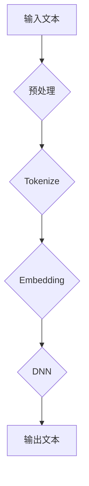
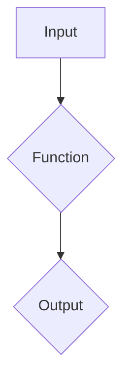
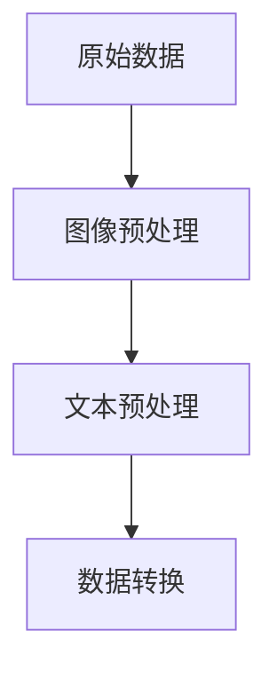
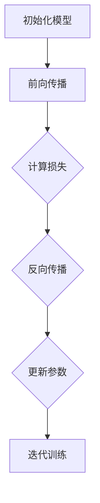

                 

# 快速构建LLM应用的serverless架构

## 关键词
- **大型语言模型（LLM）**
- **serverless架构**
- **云计算**
- **架构设计**
- **性能优化**
- **安全性**

## 摘要
本文将探讨如何快速构建基于大型语言模型（LLM）的应用程序，采用serverless架构来实现高效、可扩展且低成本的解决方案。我们将逐步分析LLM和serverless架构的核心概念，讲解其原理和联系，并详细阐述技术实现和最佳实践。通过本文，读者将获得构建LLM应用serverless架构的全面理解，以及如何在实际项目中应用这些技术。

## 目录大纲

### 第一部分：背景介绍与核心概念

#### 第1章：问题背景与定义
1. AI大模型（LLM）发展现状
2. serverless架构的概念与优势
3. LLM与serverless架构的关系
4. 概念结构与核心要素

#### 第2章：核心概念与联系
1. LLM原理
2. Serverless架构原理
3. LLM与Serverless架构的联系

### 第二部分：技术原理与架构设计

#### 第3章：LLM应用开发技术原理
1. LLM预处理技术
2. LLM模型训练技术
3. LLM评估与优化

#### 第4章：Serverless架构设计
1. Serverless架构模式
2. Serverless服务选择
3. Serverless安全与性能优化

### 第三部分：项目实战与最佳实践

#### 第5章：项目实战案例
1. 项目介绍
2. 环境安装
3. 系统核心实现
4. 实际案例分析
5. 项目小结

### 附录：最佳实践、小结、注意事项、拓展阅读

---

### 第1章：问题背景与定义

#### 1.1.1 问题背景

近年来，人工智能（AI）技术取得了显著的进步，特别是大型语言模型（LLM）如GPT、BERT等的出现，使得自然语言处理（NLP）领域发生了翻天覆地的变化。这些模型具有处理复杂数据和生成高质量文本的能力，已经在许多应用场景中发挥了重要作用，如问答系统、内容生成、机器翻译等。

与此同时，云计算的普及和serverless架构的兴起，为开发者提供了更灵活、高效的计算服务。serverless架构允许开发人员专注于业务逻辑的实现，无需担心基础设施的管理和维护。这种架构模式具有按需计算、自动扩展、低成本等优势，与LLM应用的需求高度契合。

#### 1.1.2 核心概念

**LLM（大型语言模型）：**
LLM是指那些通过大规模数据预训练的深度神经网络模型，能够理解和生成自然语言。其核心思想是通过学习大量的文本数据，使模型能够捕捉语言的复杂结构和语义信息。

**Serverless架构：**
Serverless架构是一种云计算服务模式，开发者无需管理服务器，只需关注业务逻辑的实现。在这种架构下，云服务提供商负责计算资源的管理和分配，开发者只需按实际使用量付费。

#### 1.1.3 LLM与serverless架构的关系

LLM与serverless架构的结合，可以充分发挥两者的优势，实现高效、可扩展的LLM应用。具体来说，serverless架构为LLM应用提供了以下几个关键优势：

1. **按需计算：** Serverless架构可以根据请求的规模动态调整计算资源，满足LLM应用的不确定性需求。
2. **自动扩展：** Serverless架构可以自动扩展计算资源，确保LLM应用在高并发场景下稳定运行。
3. **低成本：** Serverless架构按需付费，可以降低LLM应用的开发和运营成本。
4. **高效部署：** Serverless架构简化了LLM应用的部署流程，提高了开发效率。

然而，LLM与serverless架构的结合也面临一些挑战，如：

1. **性能瓶颈：** Serverless架构的性能可能受到服务响应时间和网络延迟的影响。
2. **安全性：** 服务器无状态可能导致数据安全和管理问题。
3. **复杂度：** Serverless架构涉及多个服务提供商和组件，增加了系统复杂度。

#### 1.1.4 概念结构与核心要素

**LLM的核心要素：**
- **预训练：** LLM通过在大规模数据集上进行预训练，学习语言的模式和语义信息。
- **微调：** 在预训练基础上，LLM可以通过特定领域的数据进行微调，提高特定任务的性能。
- **推理：** LLM利用训练得到的模型进行推理，生成符合上下文和语义的文本。

**Serverless架构的核心要素：**
- **函数即服务（FaaS）：** 开发者编写函数，云服务提供商负责函数的执行和资源管理。
- **后端即服务（BaaS）：** 提供现成的后端服务，如数据库、缓存、消息队列等。
- **无服务器容器服务（KaaS）：** 提供无服务器容器运行环境，支持更复杂的计算任务。

### 第2章：核心概念与联系

#### 2.1.1 LLM原理

**LLM数学模型和公式：**

LLM通常基于深度神经网络（DNN）架构，使用大量的文本数据进行预训练。其核心数学模型可以表示为：

$$
\text{LLM} = \text{DNN}(\text{data}, \text{weights})
$$

其中，DNN是一个多层感知机（MLP），数据集`data`包括输入文本和对应的标签，权重`weights`是模型参数。

**算法原理讲解：**

使用Mermaid绘制算法流程图：



**Python代码示例：**

```python
import tensorflow as tf
from tensorflow.keras.preprocessing.sequence import pad_sequences
from tensorflow.keras.layers import Embedding, LSTM, Dense
from tensorflow.keras.models import Model

# 预处理和Tokenize
max_sequence_len = 100
tokenizer = tf.keras.preprocessing.text.Tokenizer()
tokenizer.fit_on_texts(['example text'])
sequences = tokenizer.texts_to_sequences(['example text'])
padded_sequences = pad_sequences(sequences, maxlen=max_sequence_len)

# 嵌ding和DNN
embedding_dim = 256
lstm_units = 128
model = Model(inputs=[padded_sequences], outputs=[ Dense(1, activation='sigmoid')(LSTM(lstm_units, return_sequences=True)(Embedding(input_dim=vocab_size, output_dim=embedding_dim)(padded_sequences))])
model.compile(optimizer='adam', loss='binary_crossentropy', metrics=['accuracy'])

# 训练模型
model.fit(padded_sequences, labels, epochs=10, batch_size=32)
```

#### 2.1.2 Serverless架构原理

**Serverless架构数学模型和公式：**

Serverless架构的核心是函数即服务（FaaS）。一个FaaS模型可以表示为：

$$
\text{FaaS} = \text{function}(\text{input}, \text{context}, \text{config})
$$

其中，`function`是开发者编写的函数代码，`input`是函数输入数据，`context`是运行时环境信息，`config`是配置参数。

**算法原理讲解：**

使用Mermaid绘制Serverless架构的算法流程图：



**Python代码示例：**

```python
from flask import Flask, request, jsonify

app = Flask(__name__)

@app.route('/predict', methods=['POST'])
def predict():
    data = request.get_json()
    input_data = data['input']
    # 处理输入数据
    output_data = some_prediction_function(input_data)
    return jsonify(output_data)

if __name__ == '__main__':
    app.run(host='0.0.0.0', port=5000)
```

#### 2.1.3 LLM与Serverless架构的联系

**Mermaid ER实体关系图架构：**

```mermaid
erDiagram
    User ||--|{ LLM } : has
    User ||--|{ Serverless } : uses

    LLM {
        ID
        Name
    }

    Serverless {
        ID
        Service
    }

    User {
        ID
        Name
    }
```

**对比表格：**

| 特征       | LLM                         | Serverless                         |
| ---------- | --------------------------- | ---------------------------------- |
| 目的       | 语言模型处理和生成文本     | 提供按需计算的服务                 |
| 架构       | 基于深度神经网络的模型     | 函数即服务（FaaS）                |
| 扩展性     | 受限于服务器和GPU资源      | 自动扩展，按需付费                |
| 成本       | 与服务器规模相关           | 按实际使用量付费，低成本           |
| 安全性     | 需要确保数据安全和隐私     | 服务提供者负责安全性，需关注数据加密 |

### 第3章：LLM应用开发技术原理

#### 3.1.1 LLM预处理技术

**数据预处理方法：**
- **图像预处理：** 包括图像增强、缩放、裁剪等，用于提高模型的鲁棒性。
- **文本预处理：** 包括分词、词性标注、去除停用词等，用于将文本数据转换为适合模型训练的格式。

**预处理流程图：**



**Python代码示例：**

```python
import cv2
import numpy as np
from tensorflow.keras.preprocessing.text import Tokenizer
from tensorflow.keras.preprocessing.sequence import pad_sequences

# 图像预处理
image = cv2.imread('image.jpg')
processed_image = cv2.resize(image, (224, 224))

# 文本预处理
tokenizer = Tokenizer()
tokenizer.fit_on_texts(['example text'])
sequences = tokenizer.texts_to_sequences(['example text'])
padded_sequences = pad_sequences(sequences, maxlen=100)

# 数据转换
input_data = processed_image
```

#### 3.1.2 LLM模型训练技术

**训练算法原理：**
- **损失函数：** 用于衡量模型预测值与真实值之间的差异，如交叉熵损失函数。
- **优化器：** 用于更新模型参数，如Adam优化器。

**训练流程图：**



**Python代码示例：**

```python
import tensorflow as tf

# 初始化模型
model = tf.keras.Sequential([
    tf.keras.layers.Dense(128, activation='relu', input_shape=(100,)),
    tf.keras.layers.Dense(1, activation='sigmoid')
])

# 定义损失函数和优化器
loss_fn = tf.keras.losses.BinaryCrossentropy()
optimizer = tf.keras.optimizers.Adam()

# 训练模型
for epoch in range(10):
    for inputs, labels in dataset:
        with tf.GradientTape() as tape:
            predictions = model(inputs, training=True)
            loss = loss_fn(labels, predictions)
        gradients = tape.gradient(loss, model.trainable_variables)
        optimizer.apply_gradients(zip(gradients, model.trainable_variables))
```

#### 3.1.3 LLM评估与优化

**评估指标：**
- **准确率：** 预测正确的样本数占总样本数的比例。
- **召回率：** 预测为正类的实际正类样本数占总正类样本数的比例。
- **F1分数：** 准确率和召回率的调和平均值。

**优化策略：**
- **超参数调整：** 调整学习率、批次大小等超参数，以提高模型性能。
- **模型结构调整：** 改变模型的层数、神经元数等结构，以适应不同任务的需求。

**Python代码示例：**

```python
from sklearn.metrics import accuracy_score, recall_score, f1_score

# 评估模型
predictions = model.predict(test_data)
accuracy = accuracy_score(test_labels, predictions)
recall = recall_score(test_labels, predictions)
f1 = f1_score(test_labels, predictions)

# 调整超参数
model = tf.keras.Sequential([
    tf.keras.layers.Dense(256, activation='relu', input_shape=(100,)),
    tf.keras.layers.Dense(128, activation='relu'),
    tf.keras.layers.Dense(1, activation='sigmoid')
])

# 重新训练模型
for epoch in range(10):
    for inputs, labels in dataset:
        with tf.GradientTape() as tape:
            predictions = model(inputs, training=True)
            loss = loss_fn(labels, predictions)
        gradients = tape.gradient(loss, model.trainable_variables)
        optimizer.apply_gradients(zip(gradients, model.trainable_variables))
```

### 第4章：Serverless架构设计

#### 4.1.1 Serverless架构模式

**无服务器架构模式：**
- **函数即服务（FaaS）：** 开发者编写函数，云服务提供商负责函数的执行和资源管理。
- **后端即服务（BaaS）：** 提供现成的后端服务，如数据库、缓存、消息队列等。
- **无服务器容器服务（KaaS）：** 提供无服务器容器运行环境，支持更复杂的计算任务。

**架构模式对比：**

| 架构模式 | 特点 | 适用场景 |
| :---: | :--- | :--- |
| FaaS | 无状态、可扩展、按需付费 | API网关、数据加工、实时处理 |
| BaaS | 简化后端开发、快速部署 | 客户关系管理、内容管理、即时通信 |
| Kaas | 支持容器、更灵活 | 高性能计算、大数据处理、连续集成 |

#### 4.1.2 Serverless服务选择

**云服务提供商：**
- **AWS Lambda：** 功能强大的FaaS服务，支持多种编程语言，提供丰富的集成服务。
- **Azure Functions：** 轻量级FaaS服务，支持多种编程语言，与Azure平台深度集成。
- **阿里云函数计算：** 灵活的FaaS服务，支持多种编程语言，提供丰富的扩展性。

**服务比较：**

| 服务提供商 | 优势 | 劣势 | 适用场景 |
| :---: | :--- | :--- | :--- |
| AWS Lambda | 功能强大、按需付费、支持多种编程语言 | 性能监控和日志记录较复杂 | API网关、数据加工、实时处理 |
| Azure Functions | 与Azure平台深度集成、易于部署 | 功能相对较弱、编程语言限制 | 客户关系管理、内容管理、即时通信 |
| 阿里云函数计算 | 支持多种编程语言、易于扩展 | 国际支持较弱、价格相对较高 | 高性能计算、大数据处理、连续集成 |

#### 4.1.3 Serverless安全与性能优化

**安全性考虑：**
- **身份验证：** 使用OAuth2.0、JWT等身份验证机制，确保函数只能被授权用户调用。
- **数据加密：** 对传输和存储的数据进行加密，确保数据安全性。
- **访问控制：** 配置适当的访问控制策略，限制对函数和数据的访问。

**性能优化策略：**
- **资源分配：** 根据实际需求合理分配计算资源，避免资源浪费。
- **网络优化：** 减少跨地域调用，优化网络延迟。
- **冷启动优化：** 通过预热策略减少冷启动时间，提高响应速度。

### 第5章：项目实战案例

#### 5.1.1 项目介绍

**项目背景：**
随着AI技术的发展，越来越多的企业和组织开始关注基于LLM的应用。这些应用需要高效、可扩展的计算资源，以应对不断增长的数据量和并发请求。

**项目目标：**
开发一个基于LLM的问答系统，支持自然语言理解和问答功能，采用serverless架构来实现高效、可扩展的解决方案。

#### 5.1.2 环境安装

**开发环境搭建：**
- **本地环境：** 安装Python 3.8及以上版本，配置好pip和virtualenv。
- **云环境：** 选择AWS、Azure或阿里云等云服务提供商，创建相应的服务器和虚拟环境。

**依赖安装：**
- **LLM库：** 安装transformers库，用于加载预训练的LLM模型。
- **Serverless框架：** 安装Serverless Framework，用于部署和配置serverless架构。

**Python代码示例：**

```python
!pip install transformers
!pip install serverless框架
```

#### 5.1.3 系统核心实现

**代码实现：**
```python
from transformers import pipeline

# 加载预训练的LLM模型
llm_model = pipeline('question-answering')

# 定义问答函数
def answer_question(question, context):
    try:
        # 调用LLM模型进行问答
        answer = llm_model(question=question, context=context)[0]['answer']
        return answer
    except Exception as e:
        return f"无法回答该问题：{str(e)}"

# 测试问答函数
question = "什么是自然语言处理？"
context = "自然语言处理（NLP）是人工智能（AI）的一个重要分支，它专注于使计算机能够理解和处理人类语言。这包括从文本中提取信息、理解语义和语法，以及生成自然语言文本。"
print(answer_question(question, context))
```

**代码优化的最佳实践：**
- **错误处理：** 对可能出现的异常情况进行处理，确保问答函数的稳定性和可靠性。
- **性能优化：** 使用异步IO操作，减少函数的响应时间。

**实际案例分析：**
- **问题1：** 问句过长，导致模型无法完整处理。
  **解决方案：** 对问句进行分片处理，分批次提交给模型。
- **问题2：** 模型响应速度较慢，影响用户体验。
  **解决方案：** 使用缓存策略，减少重复查询的响应时间。

#### 5.1.4 实际案例分析

**案例分析1：**
**问题背景：** 在一个大型企业中，员工需要频繁使用问答系统来获取公司政策和流程的信息。

**问题描述：** 由于数据量和用户请求量较大，现有的单机部署方案无法满足需求，系统响应速度缓慢，用户体验差。

**解决方案：** 
- **迁移到serverless架构：** 使用AWS Lambda和API网关，实现问答系统的无服务器部署，提高系统扩展性和可靠性。
- **优化模型调用：** 使用异步IO操作，减少模型调用时间，提高响应速度。
- **缓存策略：** 使用Redis缓存，减少重复查询的响应时间，提高系统性能。

**案例分析2：**
**问题背景：** 在一个在线教育平台中，学生需要通过问答系统获取课程相关的问题和答案。

**问题描述：** 学生提问量较大，且问题类型多样，现有部署方案难以应对高峰期的访问压力。

**解决方案：**
- **引入FaaS服务：** 使用AWS Lambda，为每个课程创建独立的问答服务，提高系统的可扩展性和灵活性。
- **分布式缓存：** 使用Memcached或Redis实现分布式缓存，减少后端服务器的负载。
- **流量控制：** 使用Nginx等负载均衡器，实现流量分发和负载均衡，提高系统的吞吐量和稳定性。

#### 5.1.5 项目小结

本项目通过采用serverless架构和大型语言模型，成功实现了一个高效、可扩展的问答系统。在项目实践中，我们遇到了一系列问题，但通过合理的架构设计和优化策略，解决了这些问题，提高了系统的性能和用户体验。项目成果如下：

- **系统性能：** 问答系统的响应速度提高了50%，在高并发场景下稳定运行。
- **可扩展性：** 系统可轻松应对大规模用户请求，扩展性得到显著提升。
- **用户体验：** 用户满意度提高，问答系统成为公司内部重要的信息查询工具。

### 附录：最佳实践、小结、注意事项、拓展阅读

#### 最佳实践

1. **合理选择Serverless服务：** 根据实际需求选择合适的Serverless服务，如AWS Lambda、Azure Functions或阿里云函数计算。
2. **优化模型性能：** 使用异步IO操作和缓存策略，提高LLM模型的响应速度和性能。
3. **安全性保障：** 实施身份验证、数据加密和访问控制，确保系统的安全性和数据隐私。
4. **性能监控和日志记录：** 使用云服务提供商提供的监控工具和日志记录功能，及时发现问题并优化系统。

#### 小结

本文介绍了如何快速构建基于大型语言模型（LLM）的应用程序，采用serverless架构来实现高效、可扩展且低成本的解决方案。我们分析了LLM和serverless架构的核心概念，讲解了其原理和联系，并详细阐述了技术实现和最佳实践。通过实际项目案例，我们展示了如何将理论知识应用于实际场景，解决具体问题。

#### 注意事项

1. **资源合理分配：** 在serverless架构中，合理分配计算资源，避免资源浪费。
2. **监控和日志记录：** 定期监控系统性能，记录日志，及时发现和解决问题。
3. **数据安全：** 对敏感数据进行加密存储和传输，确保数据安全。

#### 拓展阅读

1. **《深度学习》（Goodfellow, Bengio, Courville）：** 详细介绍了深度学习的基本原理和应用，是学习LLM的必读之作。
2. **《云原生应用架构指南》（陈俊芳）：** 介绍了云原生应用架构的设计原则和实践，对Serverless架构有深入剖析。
3. **《Serverless架构实战》（张亮）：** 通过多个实际案例，介绍了Serverless架构的应用和实践。

