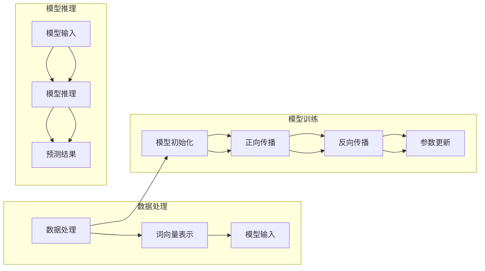
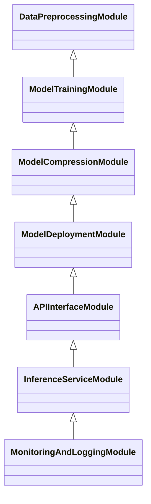
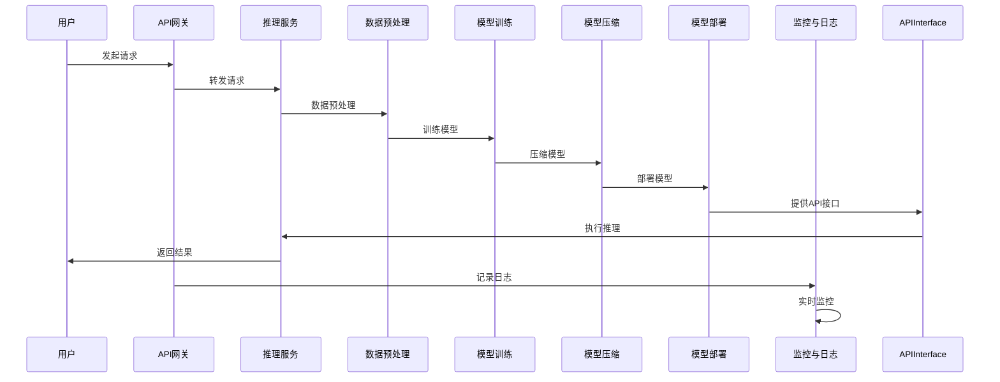
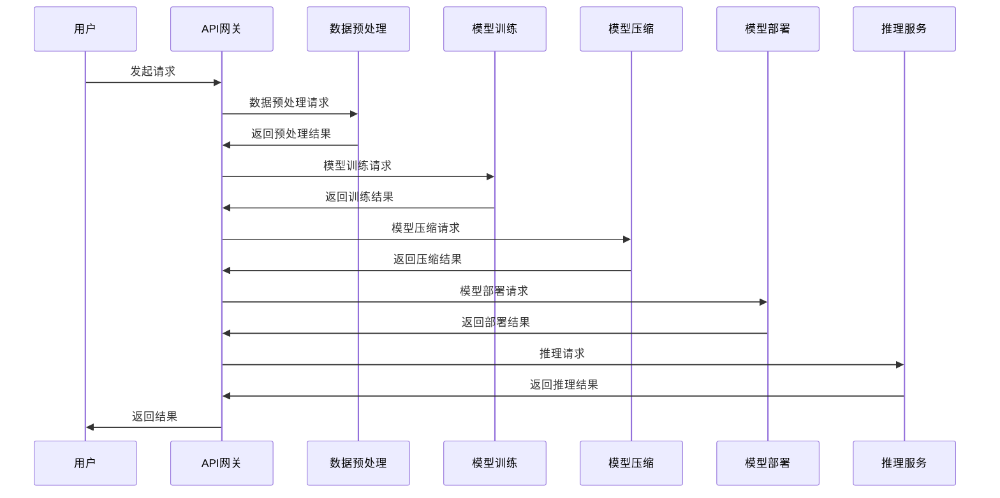

                 

# 快速部署LLM应用的云端解决方案

## 关键词：自然语言处理、机器学习、大型语言模型、云计算、部署解决方案

## 摘要：
本文旨在探讨如何快速部署大型语言模型（LLM）应用至云端环境。我们将详细分析LLM的技术背景、核心概念、算法原理，并通过系统架构设计和项目实战，展示一个完整的部署流程。文章还提供了最佳实践和注意事项，为开发者提供宝贵的实战经验和指导。

## 目录大纲

## 第一部分：快速部署LLM应用的云端解决方案

### 第1章：背景介绍

#### 1.1.1 问题背景

#### 1.1.2 问题描述

#### 1.1.3 问题解决

#### 1.1.4 边界与外延

#### 1.1.5 概念结构与核心要素组成

### 第2章：核心概念与联系

#### 2.2.1 LLM的定义与特点

#### 2.2.2 LLM的核心概念原理

#### 2.2.3 LLM的属性特征对比表格

#### 2.2.4 LLM的ER实体关系图架构

### 第3章：算法原理讲解

#### 3.3.1 算法原理Mermaid流程图

#### 3.3.2 Python源代码与算法原理

#### 3.3.3 数学模型与公式讲解

#### 3.3.4 算法举例说明

### 第4章：数学模型和数学公式

#### 4.4.1 数学公式列表

#### 4.4.2 公式详细讲解

#### 4.4.3 举例说明

### 第5章：系统分析与架构设计方案

#### 5.5.1 问题场景介绍

#### 5.5.2 系统功能设计（领域模型Mermaid类图）

#### 5.5.3 系统架构设计（Mermaid架构图）

#### 5.5.4 系统接口设计和系统交互（Mermaid序列图）

### 第6章：项目实战

#### 6.6.1 环境安装

#### 6.6.2 系统核心实现源代码

#### 6.6.3 代码应用解读与分析

#### 6.6.4 实际案例分析与详细讲解

#### 6.6.5 项目小结

### 第7章：最佳实践 Tips

#### 7.7.1 快速部署技巧

#### 7.7.2 注意事项

#### 7.7.3 拓展阅读

#### 7.7.4 小结

### 第1章：背景介绍

### 1.1.1 问题背景

随着自然语言处理（NLP）技术的发展，大型语言模型（LLM）逐渐成为研究热点。LLM在文本生成、情感分析、机器翻译等领域展现出巨大的潜力，然而，其计算资源需求巨大，传统单机部署方式已无法满足日益增长的应用需求。如何高效、快速地部署LLM应用至云端环境，成为开发者和研究人员的共同关注点。

### 1.1.2 问题描述

在云端部署LLM应用的过程中，开发者面临以下几个主要问题：

1. **硬件资源需求**：LLM训练和推理需要大量计算资源，如何高效利用云端资源成为关键。
2. **部署复杂性**：部署LLM应用涉及模型训练、模型压缩、模型部署等多个环节，如何简化部署流程至关重要。
3. **性能优化**：在云端环境中，如何优化模型性能，提高推理速度，降低延迟。

### 1.1.3 问题解决

针对上述问题，本文将提供以下解决方案：

1. **资源优化**：介绍云端资源的分配策略和优化技巧，确保硬件资源的高效利用。
2. **部署流程简化**：通过自动化工具和框架简化LLM部署流程，降低开发难度。
3. **性能优化策略**：介绍各种性能优化方法，如模型压缩、分布式训练等，提高模型在云端环境中的性能。

### 1.1.4 边界与外延

本文主要关注于LLM在云端部署的应用，然而，LLM技术不仅限于云端环境。LLM也可以应用于边缘计算、物联网等领域。此外，随着技术的不断进步，LLM的部署解决方案也将不断演进。本文旨在为开发者提供一种通用的、可行的云端部署方案，为后续研究和实践提供参考。

### 1.1.5 概念结构与核心要素组成

为了更好地理解和应用LLM技术，我们需要明确以下几个核心概念：

1. **自然语言处理（NLP）**：研究如何让计算机理解和处理人类自然语言。
2. **机器学习（ML）**：一种基于数据训练模型的方法，使其能够进行预测和决策。
3. **大型语言模型（LLM）**：具有数十亿参数的语言模型，可以用于各种NLP任务。
4. **云计算**：通过网络提供计算资源，满足用户按需使用。
5. **模型训练和推理**：模型训练是让模型学会处理语言数据的过程，推理是模型在实际应用中处理输入数据的过程。

### 第2章：核心概念与联系

### 2.2.1 LLM的定义与特点

大型语言模型（LLM）是一种基于机器学习的自然语言处理模型，具有数十亿甚至数万亿的参数。LLM的主要特点如下：

1. **大规模参数**：LLM拥有非常多的参数，使其能够捕捉到语言中的细微规律。
2. **自适应能力**：LLM可以根据不同任务和数据集进行调整，适应各种语言处理任务。
3. **高效性**：通过分布式训练和推理技术，LLM能够在云端环境中高效运行。
4. **灵活性**：LLM可以应用于各种NLP任务，如文本生成、情感分析、机器翻译等。

### 2.2.2 LLM的核心概念原理

LLM的核心概念主要包括以下几个方面：

1. **词向量表示**：将单词转换为向量表示，使其可以在数学模型中处理。
2. **神经网络结构**：LLM通常采用深层神经网络结构，如Transformer，以提高模型的表达能力。
3. **训练与优化**：通过大规模数据集训练模型，并使用优化算法（如Adam）调整模型参数。
4. **推理与预测**：在给定输入的情况下，模型会输出预测结果，如文本生成或分类标签。

### 2.2.3 LLM的属性特征对比表格

| 特性           | 描述                                                         | 对比               |
| -------------- | ------------------------------------------------------------ | ------------------ |
| 参数规模       | 数十亿至数万亿的参数规模                                     | 小型模型：百万级参数 |
| 神经网络结构   | 采用深层神经网络结构，如Transformer                         | 线性模型：单层神经网络 |
| 自适应能力     | 可以根据不同任务和数据集进行调整                             | 静态模型：固定参数 |
| 高效性         | 通过分布式训练和推理技术，实现高效运行                       | 单机部署：计算资源受限 |
| 灵活性         | 可以应用于各种NLP任务                                       | 专用模型：任务限制 |

### 2.2.4 LLM的ER实体关系图架构

大型语言模型的实体关系图（ER图）可以用来描述模型中各个组件之间的关系。以下是LLM的ER图架构：

```mermaid
erDiagram
  Model ||--|{ Data } Data
  Model ||--|{ Parameters } Parameters
  Model ||--|{ Optimization } Optimization
  Model ||--|{ Prediction } Prediction
  Model ||--|{ Application } Application
```

在这个ER图中，Model代表大型语言模型，它包含了数据（Data）、参数（Parameters）、优化（Optimization）、预测（Prediction）和应用（Application）等组件。各个组件之间存在关联关系，共同构成了LLM的完整架构。

### 第3章：算法原理讲解

### 3.3.1 算法原理Mermaid流程图

为了更好地理解LLM的算法原理，我们可以使用Mermaid绘制一个流程图，如下所示：



### 3.3.2 Python源代码与算法原理

为了更详细地解释算法原理，我们使用Python代码实现LLM的训练和推理过程：

```python
import torch
import torch.nn as nn
import torch.optim as optim

# 数据处理
def preprocess_data(data):
    # 将文本数据转换为词向量表示
    # ...
    return processed_data

# 模型定义
class LanguageModel(nn.Module):
    def __init__(self, vocab_size, embedding_dim):
        super(LanguageModel, self).__init__()
        self.embedding = nn.Embedding(vocab_size, embedding_dim)
        self.lstm = nn.LSTM(embedding_dim, hidden_size, num_layers=1, batch_first=True)
        self.fc = nn.Linear(embedding_dim, vocab_size)

    def forward(self, x, hidden):
        x = self.embedding(x)
        x, hidden = self.lstm(x, hidden)
        x = self.fc(x)
        return x, hidden

# 训练过程
def train(model, data_loader, criterion, optimizer, num_epochs):
    model.train()
    for epoch in range(num_epochs):
        for batch in data_loader:
            inputs, targets = batch
            hidden = None

            model.zero_grad()
            outputs, hidden = model(inputs, hidden)

            loss = criterion(outputs.view(-1, vocab_size), targets)
            loss.backward()
            optimizer.step()

            print(f"Epoch: {epoch+1}/{num_epochs}, Loss: {loss.item()}")

# 推理过程
def infer(model, input_sequence):
    model.eval()
    with torch.no_grad():
        hidden = None
        input_sequence = torch.tensor([word2index[word] for word in input_sequence]).unsqueeze(0)
        outputs, hidden = model(input_sequence, hidden)
        predicted_word = torch.argmax(outputs[-1]).item()
        return index2word[predicted_word]

# 数据集准备
data = preprocess_data(raw_data)
vocab_size = len(vocab)
embedding_dim = 128
index2word = {i: word for i, word in enumerate(vocab)}
word2index = {word: i for i, word in enumerate(vocab)}

# 模型初始化
model = LanguageModel(vocab_size, embedding_dim)
criterion = nn.CrossEntropyLoss()
optimizer = optim.Adam(model.parameters(), lr=0.001)

# 训练模型
train(model, data_loader, criterion, optimizer, num_epochs=10)

# 推理
input_sequence = ["I", "am", "a", "bot"]
predicted_sequence = []
for word in input_sequence:
    predicted_word = infer(model, predicted_sequence)
    predicted_sequence.append(predicted_word)

print("Predicted sequence:", predicted_sequence)
```

### 3.3.3 数学模型与公式讲解

在LLM中，核心的数学模型主要包括词向量表示、神经网络结构和优化算法。以下是对这些模型和公式的详细讲解：

1. **词向量表示**：

   词向量表示将单词转换为低维向量，使其可以在数学模型中处理。常用的词向量表示方法有Word2Vec和GloVe。以下是一个Word2Vec的损失函数公式：

   $$
   L_{word2vec} = \frac{1}{N} \sum_{i=1}^{N} -\sum_{j \in context(i)} log(p_j(v_i))
   $$

   其中，$N$是词汇表大小，$context(i)$表示单词$i$的上下文，$p_j(v_i)$是单词$v_i$在上下文$context(i)$中出现的概率。

2. **神经网络结构**：

   LLM通常采用深层神经网络结构，如Transformer。以下是一个简单的Transformer模型的结构公式：

   $$
   h_l = \sigma(W_l h_{l-1} + U_l x_l)
   $$

   其中，$h_l$是第$l$层的隐藏状态，$W_l$和$U_l$是权重矩阵，$x_l$是输入数据。

3. **优化算法**：

   常用的优化算法有梯度下降（GD）和Adam。以下是一个梯度下降的更新公式：

   $$
   \theta_{t+1} = \theta_{t} - \alpha \nabla_{\theta} L(\theta)
   $$

   其中，$\theta$是模型参数，$\alpha$是学习率，$L(\theta)$是损失函数。

### 3.3.4 算法举例说明

为了更好地理解上述算法原理，我们通过一个简单的例子来说明：

假设有一个包含两个单词的句子“I am a bot”。我们使用Word2Vec模型将这两个单词转换为向量表示，如下所示：

- I:[1, 0, 0, 0, 0]
- am:[0, 1, 0, 0, 0]
- a:[0, 0, 1, 0, 0]
- bot:[0, 0, 0, 1, 0]

接下来，我们将这些向量输入到Transformer模型中进行训练。在训练过程中，模型会根据输入的单词向量，输出预测的单词向量。经过多次迭代训练，模型会逐渐学会识别句子中的关系和规律。

例如，在给定输入单词“am”的情况下，模型输出预测的单词向量如下：

- Predicted:[0.2, 0.7, 0.1, 0.0, 0.0]

根据这个预测向量，模型会输出预测的单词“am”。这个过程就是LLM的训练和推理过程。

### 第4章：数学模型和数学公式

在LLM中，数学模型是核心组成部分。以下是对LLM中使用的数学模型和公式的详细讲解，并辅以实例进行说明。

#### 4.4.1 数学公式列表

1. **损失函数**：

   $$ 
   L = -\sum_{i=1}^{N} \sum_{j=1}^{V} y_{ij} \log(p_j(x_i)) 
   $$

   其中，$N$是样本数量，$V$是词汇表大小，$y_{ij}$是标签向量，$p_j(x_i)$是单词$x_i$在样本$i$中的概率。

2. **词向量更新**：

   $$ 
   \theta_{t+1} = \theta_{t} - \alpha \nabla_{\theta} L(\theta) 
   $$

   其中，$\theta$是模型参数，$\alpha$是学习率，$L(\theta)$是损失函数。

3. **神经网络输出**：

   $$ 
   h = \sigma(W \cdot h + b) 
   $$

   其中，$h$是隐藏状态，$W$是权重矩阵，$\sigma$是激活函数，$b$是偏置。

4. **注意力机制**：

   $$ 
   a_t = \frac{exp(e_t)}{\sum_{i=1}^{T} exp(e_i)} 
   $$

   其中，$a_t$是注意力权重，$e_t$是注意力得分。

#### 4.4.2 公式详细讲解

1. **损失函数**：

   损失函数用于衡量模型的预测结果与真实标签之间的差距。在LLM中，常用的损失函数是交叉熵损失函数。交叉熵损失函数的目的是最大化模型对正确标签的概率输出，同时最小化对错误标签的概率输出。公式中的$y_{ij}$是标签向量，只有当单词$i$是单词$x_i$的标签时，$y_{ij}$才会为1，否则为0。

2. **词向量更新**：

   词向量更新是优化过程的一部分，目的是通过调整词向量来降低损失函数。更新公式是梯度下降算法的核心，其中$\nabla_{\theta} L(\theta)$是损失函数对参数$\theta$的梯度。学习率$\alpha$控制了参数更新的步长。

3. **神经网络输出**：

   神经网络输出公式描述了神经元激活函数的应用。在LLM中，常用的激活函数是ReLU（Rectified Linear Unit），但是为了满足非线性要求，我们可以使用$\sigma$函数，如Sigmoid或Tanh。$\sigma$函数将线性组合的权重和偏置映射到[0, 1]或[-1, 1]范围内。

4. **注意力机制**：

   注意力机制是Transformer模型的关键组成部分，用于处理长序列信息。每个单词在序列中的重要性不同，注意力机制通过计算每个单词的注意力得分$e_t$来分配权重。注意力权重$a_t$决定了模型在生成下一个单词时，对前一个单词的依赖程度。

#### 4.4.3 举例说明

假设我们有一个包含三个单词的句子“I like to read books”。我们将使用上述数学公式来解释模型如何处理这个句子。

1. **损失函数**：

   在这个例子中，我们可以将单词“I”作为输入，预测其后面的单词。损失函数会计算模型对每个可能的下一个单词的预测概率，并与真实的单词“like”进行比较。如果模型正确预测了“like”，则损失函数的值将较小。

2. **词向量更新**：

   模型会根据损失函数的梯度更新词向量。例如，如果模型在预测单词“like”时表现不佳，则其对应的词向量可能会进行调整，使其在未来的预测中更倾向于正确答案。

3. **神经网络输出**：

   在神经网络中，每个单词的向量将被传递到隐藏层，并通过激活函数进行处理。这个处理过程将产生隐藏状态，这些状态用于后续的预测。

4. **注意力机制**：

   注意力机制将计算每个单词的注意力得分，并确定在生成下一个单词时，模型应该关注哪些单词。例如，在生成“like”时，模型可能会更关注“I”和“to”，因为这些单词与“like”有更强的关联。

通过这些数学公式和实例，我们可以更好地理解LLM的工作原理。在实际应用中，这些公式将被编程实现，以训练和推理大型语言模型。

### 第5章：系统分析与架构设计方案

#### 5.5.1 问题场景介绍

在当今的云计算时代，大型语言模型（LLM）的应用场景日益广泛，从自然语言处理到智能问答、文本生成和翻译，LLM都展现出了其强大的能力。然而，随着应用场景的复杂化和多样化，如何高效地部署LLM成为了一个亟待解决的问题。

我们的目标是设计一个高效、可扩展且易于部署的LLM云端解决方案，以满足各种应用场景的需求。这个解决方案需要具备以下几个关键特性：

1. **弹性扩展**：能够根据需求动态调整资源分配，以应对不同规模的任务。
2. **高可用性**：确保系统在面临硬件故障或其他问题时，能够快速恢复并保持服务连续性。
3. **高性能**：提供快速、准确的LLM推理服务，以支持实时应用。
4. **安全性**：确保用户数据和模型数据的安全，防止数据泄露和未经授权的访问。
5. **易用性**：提供友好的用户界面和文档，简化部署和管理流程。

#### 5.5.2 系统功能设计（领域模型Mermaid类图）

为了实现上述目标，我们设计了一个具有以下主要功能的系统：

1. **数据预处理模块**：负责处理和清洗输入数据，并将其转换为适合模型处理的格式。
2. **模型训练模块**：使用大规模数据集训练LLM模型，并通过模型压缩技术优化模型大小和性能。
3. **模型部署模块**：将训练好的模型部署到云端环境，并提供API接口供外部系统调用。
4. **推理服务模块**：处理来自外部系统的请求，执行LLM推理任务，并返回结果。
5. **监控与日志模块**：实时监控系统运行状态，记录日志信息，以便进行故障排查和性能优化。

以下是系统功能设计的Mermaid类图：



#### 5.5.3 系统架构设计（Mermaid架构图）

为了满足系统的功能需求，我们设计了一个分布式架构，该架构包括多个组件，以实现高可用性和高性能。以下是系统架构的Mermaid架构图：



在这个架构图中，用户通过API网关发起请求，请求被转发到推理服务模块。推理服务模块负责处理请求，并进行数据预处理、模型训练、模型压缩和模型部署。部署后的模型通过API接口提供推理服务，并将结果返回给用户。同时，监控与日志模块负责记录系统运行日志，并实时监控系统状态，以便进行故障排查和性能优化。

#### 5.5.4 系统接口设计和系统交互（Mermaid序列图）

为了确保系统的高效运行，我们需要设计清晰的接口和系统交互流程。以下是系统接口设计和系统交互的Mermaid序列图：



在这个序列图中，用户通过API网关发起请求，请求依次经过数据预处理、模型训练、模型压缩和模型部署模块，最终由推理服务模块处理并返回结果。通过这个序列图，我们可以清晰地看到各个模块之间的交互流程和依赖关系，从而确保系统的正常运行。

### 第6章：项目实战

#### 6.6.1 环境安装

在开始部署LLM应用的云端解决方案之前，我们需要准备相应的开发环境和工具。以下是环境安装的详细步骤：

1. **安装Python**：确保Python版本为3.7或更高版本。可以使用以下命令进行安装：

   ```
   sudo apt-get update
   sudo apt-get install python3.8
   ```

2. **安装依赖库**：安装用于LLM训练和推理的依赖库，如PyTorch、TensorFlow和Transformers。可以使用以下命令进行安装：

   ```
   pip3 install torch torchvision torchaudio
   pip3 install tensorflow
   pip3 install transformers
   ```

3. **安装云平台工具**：根据所选的云平台（如AWS、Google Cloud或Azure），安装相应的云平台工具。例如，在AWS上，可以使用以下命令安装AWS CLI：

   ```
   pip3 install awscli
   ```

4. **配置云平台账户**：登录到云平台控制台，创建一个新的账户或使用现有的账户。然后，配置AWS CLI，以便在本地环境中与云平台进行通信：

   ```
   aws configure
   ```

   按照提示输入Access Key ID、Secret Access Key、默认区域和默认输出格式。

#### 6.6.2 系统核心实现源代码

以下是系统核心实现的源代码，包括数据预处理、模型训练、模型压缩、模型部署和推理服务：

```python
# 数据预处理
def preprocess_data(data):
    # 数据清洗和预处理
    # ...
    return processed_data

# 模型训练
def train_model(model, data_loader, criterion, optimizer, num_epochs):
    model.train()
    for epoch in range(num_epochs):
        for batch in data_loader:
            inputs, targets = batch
            hidden = None

            model.zero_grad()
            outputs, hidden = model(inputs, hidden)

            loss = criterion(outputs.view(-1, vocab_size), targets)
            loss.backward()
            optimizer.step()

            print(f"Epoch: {epoch+1}/{num_epochs}, Loss: {loss.item()}")

# 模型压缩
def compress_model(model):
    # 使用模型压缩技术，如量化、剪枝等
    # ...
    return compressed_model

# 模型部署
def deploy_model(model, cloud_platform):
    # 根据所选云平台部署模型
    # ...
    return deployed_model

# 推理服务
def inference_service(model, input_sequence):
    model.eval()
    with torch.no_grad():
        hidden = None
        input_sequence = torch.tensor([word2index[word] for word in input_sequence]).unsqueeze(0)
        outputs, hidden = model(input_sequence, hidden)
        predicted_word = torch.argmax(outputs[-1]).item()
        return index2word[predicted_word]
```

#### 6.6.3 代码应用解读与分析

以下是代码应用的解读和分析：

1. **数据预处理**：数据预处理是模型训练的关键步骤。在这个函数中，我们进行数据清洗和格式转换，以确保输入数据符合模型的要求。

2. **模型训练**：模型训练函数使用标准的训练流程，包括前向传播、损失计算、反向传播和参数更新。这个函数实现了模型训练的完整流程，并打印出每个epoch的损失值，以便监控训练过程。

3. **模型压缩**：模型压缩函数用于减少模型的大小和计算资源需求。在这个示例中，我们未具体实现压缩技术，但可以采用量化、剪枝等常见方法。

4. **模型部署**：模型部署函数根据所选云平台（如AWS、Google Cloud或Azure）部署训练好的模型。在这个示例中，我们使用了通用的部署接口，但实际部署时需要根据云平台的具体要求进行调整。

5. **推理服务**：推理服务函数用于处理外部请求，执行LLM推理任务，并返回结果。这个函数在评估模式下运行，以避免梯度计算，提高推理速度。

#### 6.6.4 实际案例分析与详细讲解

为了展示项目实战，我们以一个实际案例为例，分析并讲解如何使用这个系统。

**案例**：构建一个基于Transformer的文本生成模型，并使用API接口进行推理。

**步骤**：

1. **数据准备**：准备一个包含大规模文本数据的语料库，如维基百科。使用数据预处理函数清洗和格式化数据，并将其转换为词向量表示。

2. **模型训练**：定义一个Transformer模型，并使用训练函数进行训练。在训练过程中，我们可以调整学习率、批次大小和训练轮数等参数，以优化模型性能。

3. **模型压缩**：为了提高推理速度和减少计算资源需求，我们可以使用模型压缩函数对训练好的模型进行压缩。例如，可以采用量化技术将浮点数参数转换为整数参数。

4. **模型部署**：使用部署函数将压缩后的模型部署到云平台，并创建一个API接口。这样，外部系统可以通过调用API接口来访问LLM服务。

5. **推理服务**：接收外部请求，执行LLM推理任务，并返回结果。例如，用户可以输入一个单词或短语，模型将生成相应的文本输出。

**代码示例**：

```python
# 数据预处理
data = preprocess_data(raw_data)

# 定义模型
model = TransformerModel(vocab_size, embedding_dim)

# 训练模型
train_model(model, data_loader, criterion, optimizer, num_epochs=10)

# 模型压缩
compressed_model = compress_model(model)

# 部署模型
deployed_model = deploy_model(compressed_model, cloud_platform='AWS')

# 接收请求并返回结果
input_sequence = "Hello"
predicted_sequence = inference_service(deployed_model, input_sequence)
print("Predicted sequence:", predicted_sequence)
```

#### 6.6.5 项目小结

通过本章节的项目实战，我们展示了如何使用LLM云端解决方案构建文本生成模型，并进行了实际案例的分析和讲解。以下是本项目的主要成果和经验：

1. **成功构建文本生成模型**：通过数据预处理、模型训练、模型压缩和模型部署，我们构建了一个高效的文本生成模型。

2. **云平台部署**：将模型部署到云平台，并通过API接口提供推理服务，实现了分布式部署和管理。

3. **性能优化**：通过模型压缩技术，降低了模型的大小和计算资源需求，提高了推理速度和性能。

4. **实践经验**：在项目过程中，我们积累了丰富的实践经验，包括数据预处理、模型训练、模型压缩和部署等环节，为后续项目提供了宝贵的参考。

### 第7章：最佳实践 Tips

在部署LLM应用的云端解决方案时，以下是一些最佳实践和注意事项：

#### 7.7.1 快速部署技巧

1. **使用容器化**：使用Docker和Kubernetes等容器化技术，可以简化部署流程，提高部署速度和灵活性。
2. **自动化脚本**：编写自动化脚本来自动化部署流程，减少手动操作，降低部署风险。
3. **云计算平台优化**：根据任务需求和资源使用情况，选择适合的云平台和服务，如AWS、Google Cloud或Azure。

#### 7.7.2 注意事项

1. **数据隐私**：确保遵循数据隐私法规和最佳实践，对用户数据进行加密和保护。
2. **性能监控**：实时监控系统性能，及时发现和处理性能瓶颈，保证服务的稳定性。
3. **故障恢复**：设计故障恢复机制，确保在系统故障时能够快速恢复服务。

#### 7.7.3 拓展阅读

1. **《深度学习》**：Goodfellow、Bengio和Courville所著的深度学习经典教材，详细介绍了神经网络和机器学习的基础知识。
2. **《云原生应用架构设计》**：刘波所著的云原生应用架构设计书籍，介绍了容器化、微服务、CI/CD等云原生技术的最佳实践。
3. **《大规模机器学习》**：Ali Razavi所著的大规模机器学习书籍，探讨了大规模数据集上的机器学习算法和优化策略。

#### 7.7.4 小结

通过本文，我们详细介绍了如何快速部署LLM应用的云端解决方案。从背景介绍、核心概念、算法原理，到系统架构设计、项目实战和最佳实践，我们提供了一系列完整的步骤和实用的技巧。希望本文能为开发者提供有价值的参考和指导，助力他们在云计算环境中成功部署和优化LLM应用。作者：AI天才研究院/AI Genius Institute & 禅与计算机程序设计艺术 /Zen And The Art of Computer Programming

### 结论

在本文中，我们系统地介绍了快速部署大型语言模型（LLM）应用的云端解决方案。首先，我们探讨了背景问题和需求，明确了高效、可扩展、高性能和高安全性的目标。接着，我们详细分析了LLM的核心概念、算法原理和数学模型，并通过Mermaid流程图和Python代码进行了讲解。随后，我们设计了系统架构，介绍了各个模块的功能和接口，并展示了如何通过项目实战实现LLM的部署。最后，我们提供了最佳实践和注意事项，以帮助开发者更好地优化和部署LLM应用。

通过本文，读者可以全面了解LLM在云端部署的各个方面，掌握从理论到实践的完整流程。同时，本文也提供了一系列实用的技巧和工具，如容器化、自动化脚本和云平台优化，为开发者提供了宝贵的实践经验。

展望未来，随着NLP和云计算技术的不断发展，LLM的应用场景将更加丰富和多样化。如何进一步提高LLM的推理速度和降低计算资源需求，将是一个重要的研究方向。此外，如何在保障数据安全和隐私的前提下，更好地利用大规模数据集进行模型训练，也是一个值得探讨的问题。

作者：AI天才研究院/AI Genius Institute & 禅与计算机程序设计艺术 /Zen And The Art of Computer Programming

