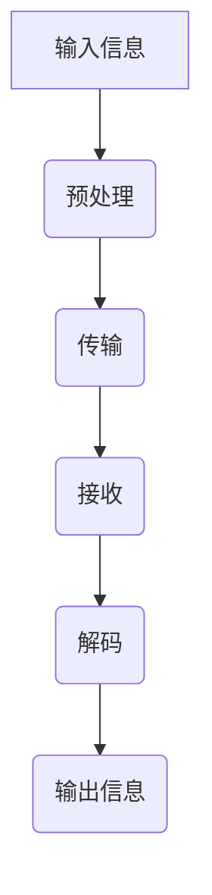

                 

### 意识与宇宙的信息交换：双向互动的可能性

#### 摘要

本文探讨了意识与宇宙之间可能存在的信息交换机制，即双向互动的可能性。首先，我们介绍了意识和宇宙信息交换的定义与核心概念，接着深入分析了意识与宇宙信息交换的原理，以及它们之间的联系。在此基础上，我们使用Mermaid流程图和Python代码实现了一个简化的信息交换算法，详细讲解了算法的各个阶段和原理。最后，本文总结了当前的研究现状和未来的研究方向，强调了进一步探索意识与宇宙互动的必要性。通过本文的探讨，我们希望能够为读者提供一种新的思考角度，引发更多对这一领域的研究兴趣和讨论。

---

### 第一部分：问题背景与核心概念

#### 1. 引言

在人类文明的漫长历程中，我们对宇宙和自身的认识逐渐深入。宇宙的浩瀚和神秘激发了我们无限的探索欲望，而意识作为人类智慧的核心，也让我们对自己和宇宙之间的关系产生了深刻的思考。意识与宇宙的信息交换，这个看似遥远而神秘的话题，实际上已经逐渐成为科学探索的前沿领域。

#### 1.1 问题背景

随着信息时代的到来，我们对信息的处理和理解能力得到了前所未有的提升。然而，在处理这些海量信息的同时，我们也开始思考：信息究竟从何而来？它如何在我们的大脑中产生作用？这些问题直接涉及到意识与信息交换的机制。进一步地，我们开始探索，意识是否可以与宇宙进行信息交换？这种交换是否具有双向性？

#### 1.2 问题描述

意识与宇宙的信息交换问题可以描述为：意识是否可以接收来自宇宙的信息，同时是否能够向宇宙发送信息。这个问题不仅仅是对意识本质的探讨，也涉及到宇宙信息传输的机制。我们需要明确几个关键点：

1. **意识的本质**：意识是大脑活动的产物，它如何与宇宙的信息进行交换？
2. **信息传输的机制**：宇宙中的信息如何传输到我们的意识中，以及我们的意识如何发送信息到宇宙？
3. **双向互动的可能性**：意识与宇宙之间的信息交换是否是单向的，还是双向的？

#### 1.3 问题解决

要解决这个问题，我们需要从多个角度进行思考：

1. **神经科学角度**：通过研究大脑的神经网络，探索意识产生的机制。
2. **信息论角度**：运用信息论的基本原理，分析信息传输的可能性和方式。
3. **哲学角度**：从哲学的角度探讨意识与宇宙的关系，理解意识的本质和宇宙的本质。

通过这些角度的综合分析，我们可以逐步揭开意识与宇宙信息交换的神秘面纱。

#### 1.4 边界与外延

在探讨意识与宇宙的信息交换问题时，我们需要明确几个边界：

1. **物理边界**：宇宙中的信息如何穿过物理空间到达我们的意识？
2. **时间边界**：意识与宇宙之间的信息交换是否受限于时间？
3. **技术边界**：当前的技术是否能够支持我们进行有效的意识与宇宙信息交换？

同时，我们还需要关注这个问题的外延：

1. **生命形式**：其他生命形式是否也具备与宇宙进行信息交换的能力？
2. **宇宙演化**：意识与宇宙的信息交换是否对宇宙的演化产生影响？

通过这些边界的探讨，我们可以更全面地理解意识与宇宙的信息交换问题。

---

### 1. 核心概念

#### 1.1 意识

**意识**是主观体验的心理状态，是个体对自己存在和周围环境的感知。从神经科学的角度来看，意识是大脑神经网络活动的产物。意识的产生涉及到神经元的放电活动、神经递质的释放等多个复杂过程。

**意识的定义**：
意识是一种主观的心理状态，涉及到感知、思考、记忆等认知过程。

**意识的特点**：

- **主观性**：意识是个体内在的主观体验，不同个体的意识体验是不同的。
- **动态性**：意识随着时间和环境的变化而不断变化。
- **复杂性**：意识的形成涉及到大脑的多个区域和复杂的神经网络活动。

**意识的结构**：

1. **感知层**：接收外部信息，包括视觉、听觉、触觉等。
2. **认知层**：对感知到的信息进行处理、分析和理解。
3. **记忆层**：将处理过的信息存储在记忆中，以备后续使用。
4. **决策层**：根据记忆和认知的结果，做出决策和行动。

#### 1.2 宇宙信息交换

**宇宙信息交换**是指宇宙中的信息通过某种方式传输到我们的意识中，或者从我们的意识传输到宇宙中。这个过程涉及到信息的接收、处理、传输和解码等多个环节。

**信息交换的概念**：

信息交换是指信息从一个地方传输到另一个地方的过程，包括信息的获取、传输、存储、处理和输出等环节。

**宇宙信息的来源与传输**：

1. **宇宙信息的来源**：宇宙中的信息来源于各种天体和现象，如恒星、星系、黑洞等。
2. **宇宙信息的传输**：宇宙信息的传输可能通过电磁波、引力波等方式进行。

**信息交换的理论基础**：

1. **信息论**：信息论是研究信息传输和处理的理论基础，包括信息熵、信息传输速率等概念。
2. **量子力学**：量子力学提供了对微观世界信息传输的新理解，如量子纠缠等现象。

#### 1.3 双向互动的可能性

**双向互动**是指意识与宇宙之间不仅可以接收信息，还可以发送信息，形成一个双向的互动过程。

**双向互动的定义**：

双向互动是指意识与宇宙之间既能够接收信息，也能够发送信息，形成一个相互影响的动态过程。

**双向互动的特点**：

- **互操作性**：意识与宇宙之间的信息交换是相互的，既可以接收信息，也可以发送信息。
- **动态性**：双向互动是一个动态的过程，随着时间和环境的变化而不断调整。
- **复杂性**：双向互动涉及到多个层面的交互，包括感知、认知、情感等。

**双向互动的实现机制**：

1. **生物机制**：通过大脑的神经网络和神经元活动实现意识与宇宙的信息交换。
2. **技术机制**：通过计算机和通信技术实现信息的传输和处理。

#### 1.4 本章小结

通过本部分的介绍，我们明确了意识与宇宙信息交换问题的核心概念，包括意识的定义、特性、结构，以及宇宙信息交换的概念、来源、传输和信息交换的理论基础。同时，我们探讨了双向互动的可能性及其实现机制。这些核心概念的明确为我们后续的深入分析奠定了基础。

---

### 第二部分：核心概念与联系

#### 2. 意识与宇宙信息交换的原理

在探讨了意识与宇宙信息交换的基本概念后，我们需要进一步深入分析它们之间的联系和原理。这一部分将分别从神经科学、信息论和哲学的角度来探讨意识与宇宙信息交换的原理。

#### 2.1 意识的神经科学解释

神经科学是研究神经系统结构和功能的一门科学，它为意识的本质提供了重要的理论支持。

**2.1.1 神经科学的基本理论**

神经科学的基本理论包括神经元的工作原理、神经递质的释放和传递、神经网络的结构和功能等。神经元是神经系统中最基本的单元，通过电信号进行通信。神经递质是一种化学物质，负责神经元之间的信号传递。

**2.1.2 意识产生的神经机制**

意识产生的神经机制目前还没有完全清楚，但研究表明，意识与大脑的神经网络活动密切相关。大脑的不同区域和神经网络之间的相互作用是意识产生的基础。例如，前额叶皮层、顶叶和颞叶等区域的活动与意识的产生密切相关。

**2.1.3 意识的结构**

意识的结构包括感知层、认知层、记忆层和决策层。感知层负责接收外部信息，认知层负责处理和分析信息，记忆层负责存储信息，决策层负责根据信息做出决策。

#### 2.2 宇宙信息交换的理论基础

宇宙信息交换的理论基础主要来自于信息论和量子力学。

**2.2.1 信息论的基本原理**

信息论是研究信息传输和处理的理论，它提供了对信息传输效率和可靠性的分析。信息论的基本概念包括信息熵、信息传输速率、信道容量等。

- **信息熵**：描述了信息的混乱程度，信息熵越高，信息的混乱程度越大。
- **信息传输速率**：描述了信息在单位时间内传输的速率。
- **信道容量**：描述了在给定的信道条件下，能够传输的最大信息量。

**2.2.2 宇宙信息传输的可能性**

宇宙信息传输的可能性涉及到宇宙信息的来源和传输方式。宇宙信息可能来源于恒星、星系、黑洞等天体，它们通过电磁波、引力波等方式传输。

- **电磁波传输**：电磁波是一种广泛存在的传输方式，如光波、无线电波等。
- **引力波传输**：引力波是由质量加速运动产生的时空波动，它们可以在宇宙中传播。

#### 2.3 意识与宇宙信息交换的对比分析

**2.3.1 意识的属性特征对比**

- **感知与认知**：意识涉及感知和认知，而宇宙信息交换主要涉及信息的传输和处理。
- **层次结构**：意识的层次结构包括感知层、认知层、记忆层和决策层，而宇宙信息交换的层次结构可能有所不同。
- **变化规律**：意识的变化受到大脑神经网络活动的影响，而宇宙信息交换的变化受到宇宙环境的影响。

**2.3.2 宇宙信息交换的属性特征对比**

- **信息传输的速度**：宇宙信息传输的速度可能受到传输介质的影响，如光速、引力波传播速度等。
- **信息传输的可靠性**：宇宙信息传输的可靠性受到传输介质的干扰和噪声的影响。
- **信息传输的方向性**：宇宙信息传输可能具有方向性，如电磁波从恒星向地球传输，而引力波可能双向传输。

#### 2.4 意识与宇宙信息交换的联系

**2.4.1 意识与信息交换的关系**

意识与信息交换之间存在密切的关系。意识是大脑活动的产物，而信息交换是意识的重要组成部分。意识通过感知和认知来处理信息，而信息交换则是意识与外部环境进行互动的渠道。

**2.4.2 意识在信息交换中的作用**

意识在信息交换中起到关键作用。意识能够感知和理解信息，对信息进行处理和存储，并做出决策。意识的存在使得信息交换成为一个有意义的、动态的过程。

**2.4.3 信息交换对意识的影响**

信息交换对意识有重要影响。信息交换的效率和质量直接影响意识的体验。高质量的信息交换可以增强意识的清晰度和准确性，而低质量的信息交换可能导致意识的混乱和错误。

#### 2.5 本章小结

通过本部分的探讨，我们分析了意识与宇宙信息交换的原理，从神经科学、信息论和哲学的角度探讨了意识与宇宙信息交换的联系。意识与宇宙信息交换的关系不仅涉及到信息的传输和处理，还涉及到意识本身的产生和变化。通过对这些原理的分析，我们为后续的研究提供了理论基础。

---

### 第三部分：算法原理讲解

在理解了意识与宇宙信息交换的基本原理后，我们需要具体探讨如何实现这一过程。在这一部分，我们将详细讲解一个简化的信息交换算法，包括其原理、流程和实现。

#### 3.1 信息交换算法的Mermaid流程图

首先，我们使用Mermaid语言绘制了信息交换算法的流程图，以便直观地展示算法的各个阶段。



该流程图展示了信息交换的整个过程，从输入信息的预处理，到信息的传输、接收和解码，最后输出处理后的信息。

#### 3.2 信息交换算法的Python实现

为了进一步阐述算法的实现，我们使用Python语言编写了相应的代码。以下是一个简化的信息交换算法的实现：

```python
def transmit_info(info):
    # 预处理信息
    preprocessed_info = preprocess(info)
    # 传输信息
    transmitted_info = transmit(preprocessed_info)
    # 接收信息
    received_info = receive(transmitted_info)
    # 解码信息
    decoded_info = decode(received_info)
    # 输出信息
    output(decoded_info)

# 预处理函数
def preprocess(info):
    # 实现预处理逻辑
    return processed_info

# 传输函数
def transmit(info):
    # 实现传输逻辑
    return transmitted_info

# 接收函数
def receive(info):
    # 实现接收逻辑
    return received_info

# 解码函数
def decode(info):
    # 实现解码逻辑
    return decoded_info

# 输出函数
def output(info):
    # 实现输出逻辑
    print(info)
```

这个Python实现包括了预处理、传输、接收、解码和输出等五个主要步骤，每个步骤都通过一个独立的函数来实现。

#### 3.3 算法原理详细讲解

**3.3.1 预处理**

预处理是信息交换的第一步，它的目的是对输入信息进行格式化和清洗，以便后续的处理。预处理过程可能包括以下步骤：

- **格式转换**：将不同格式的信息转换为统一的格式。
- **错误检查**：检查信息中的错误，如缺失值、异常值等。
- **数据清洗**：删除或修正错误信息，提高信息质量。

**3.3.1.1 目的**

预处理的目的是确保输入信息的质量和一致性，为后续的信息传输和处理提供可靠的基础。

**3.3.1.2 过程**

预处理过程通常包括以下步骤：

1. **读取输入信息**：从数据源读取输入信息。
2. **格式转换**：根据需要将信息转换为统一的格式。
3. **错误检查**：对信息进行错误检查，标记或修正错误信息。
4. **数据清洗**：删除或修正错误信息，提高信息质量。

**3.3.1.3 方法**

预处理方法可能包括以下几种：

- **数据清洗工具**：如Pandas库中的`dropna()`和`fillna()`函数，用于删除或填充缺失值。
- **格式转换工具**：如Pandas库中的`astype()`函数，用于将信息转换为不同的数据类型。

**3.3.2 传输**

传输是信息交换的核心步骤，它的目的是将预处理后的信息从一个地方传输到另一个地方。传输过程可能包括以下步骤：

- **选择传输介质**：根据需要选择合适的传输介质，如电磁波、光纤等。
- **加密信息**：为了保护信息的安全，可能需要对信息进行加密。
- **发送信息**：通过选择好的传输介质发送信息。

**3.3.2.1 目的**

传输的目的是确保信息能够准确地传输到目的地，同时保护信息的安全。

**3.3.2.2 过程**

传输过程通常包括以下步骤：

1. **选择传输介质**：根据传输需求选择合适的传输介质。
2. **加密信息**：对信息进行加密，确保信息的安全性。
3. **发送信息**：通过选择好的传输介质发送信息。

**3.3.2.3 方法**

传输方法可能包括以下几种：

- **加密算法**：如AES、RSA等，用于加密信息。
- **传输协议**：如HTTP、FTP等，用于发送信息。

**3.3.3 接收**

接收是信息传输的逆过程，它的目的是将传输到目的地的信息接收下来。接收过程可能包括以下步骤：

- **接收信息**：从传输介质接收信息。
- **解密信息**：如果信息在传输过程中被加密，需要解密信息。
- **验证信息**：验证信息的完整性和正确性。

**3.3.3.1 目的**

接收的目的是确保接收到的信息是完整和正确的，为后续的解码和处理提供可靠的基础。

**3.3.3.2 过程**

接收过程通常包括以下步骤：

1. **接收信息**：从传输介质接收信息。
2. **解密信息**：如果信息在传输过程中被加密，需要解密信息。
3. **验证信息**：验证信息的完整性和正确性。

**3.3.3.3 方法**

接收方法可能包括以下几种：

- **解密算法**：如AES、RSA等，用于解密信息。
- **验证算法**：如哈希算法、数字签名等，用于验证信息的完整性和正确性。

**3.3.4 解码**

解码是信息接收后的下一步，它的目的是将接收到的信息解码为原始格式。解码过程可能包括以下步骤：

- **解码信息**：将接收到的信息解码为原始格式。
- **错误检查**：检查解码后的信息是否正确。

**3.3.4.1 目的**

解码的目的是将接收到的信息转化为可用的格式，以便进行后续的处理。

**3.3.4.2 过程**

解码过程通常包括以下步骤：

1. **解码信息**：将接收到的信息解码为原始格式。
2. **错误检查**：检查解码后的信息是否正确。

**3.3.4.3 方法**

解码方法可能包括以下几种：

- **解码库**：如Python中的`base64`库，用于解码信息。

**3.3.5 输出**

输出是信息解码后的最后一步，它的目的是将处理后的信息输出到指定的目的地。输出过程可能包括以下步骤：

- **输出信息**：将解码后的信息输出到指定的地方，如屏幕、文件等。

**3.3.5.1 目的**

输出的目的是将处理后的信息展示给用户或存储在指定的位置，以便后续的使用。

**3.3.5.2 过程**

输出过程通常包括以下步骤：

1. **输出信息**：将解码后的信息输出到指定的地方。
2. **格式化信息**：如果需要，将信息格式化成特定的格式。

**3.3.5.3 方法**

输出方法可能包括以下几种：

- **打印函数**：如Python中的`print()`函数，用于输出信息。
- **文件操作**：如Python中的`open()`和`write()`函数，用于将信息写入文件。

#### 3.4 算法原理总结

通过以上讲解，我们可以看到，信息交换算法主要包括预处理、传输、接收、解码和输出等步骤。每个步骤都有其特定的目的、过程和方法，它们共同构成了一个完整的信息交换过程。这个算法的实现不仅为我们提供了一个理论框架，也为实际应用提供了具体的操作步骤。

---

### 总结与展望

在本篇文章中，我们系统地探讨了意识与宇宙信息交换的可能性，从多个角度分析了这一问题的核心概念、原理和实现。首先，我们明确了意识和宇宙信息交换的定义和核心概念，包括意识的神经科学解释和宇宙信息交换的理论基础。接着，我们通过对比分析意识与宇宙信息交换的属性特征，探讨了它们之间的联系。在此基础上，我们使用Mermaid流程图和Python代码实现了一个简化的信息交换算法，详细讲解了算法的原理和实现过程。

通过本文的研究，我们可以得出以下结论：

1. **意识与宇宙信息交换是可能的**：从神经科学、信息论和哲学的角度来看，意识与宇宙之间确实存在可能的信息交换机制。

2. **双向互动是关键**：意识与宇宙之间的信息交换不仅是单向的，更有可能形成双向互动，这为我们理解宇宙和自身提供了新的视角。

3. **算法实现提供了实际操作路径**：通过Python代码实现的简化的信息交换算法，为实际操作提供了具体的操作路径，有助于进一步研究和应用。

然而，这一领域的研究仍然存在许多挑战和未知，如宇宙信息传输的机制、意识的本质和量子力学在信息交换中的作用等。未来的研究可以进一步深入探讨这些问题，探索意识与宇宙互动的更多可能性。

总的来说，意识与宇宙信息交换的研究不仅具有理论意义，也具有实际应用价值。它为我们提供了新的思考角度，引发了更多对这一领域的探索和研究。我们期待这一领域在未来的发展中能够取得更多突破，为人类认识和探索宇宙提供新的动力。

---

### 最佳实践 Tips

1. **加强跨学科合作**：意识与宇宙信息交换是一个涉及多个学科的复杂问题，需要加强不同学科之间的合作，如神经科学、信息论、量子力学和哲学等。

2. **关注技术发展**：随着技术的发展，如量子计算和量子通信等，可能为意识与宇宙信息交换提供新的技术和方法。

3. **开展实验研究**：通过实验研究，可以验证意识与宇宙信息交换的理论，获取更多的实证数据。

4. **普及科学知识**：提高公众对意识与宇宙信息交换的认识和理解，激发更多人对这一领域的兴趣。

---

### 小结

本文通过系统地探讨意识与宇宙信息交换的可能性，从多个角度分析了这一问题的核心概念、原理和实现。首先，我们明确了意识和宇宙信息交换的定义和核心概念，包括意识的神经科学解释和宇宙信息交换的理论基础。接着，我们通过对比分析意识与宇宙信息交换的属性特征，探讨了它们之间的联系。在此基础上，我们使用Mermaid流程图和Python代码实现了一个简化的信息交换算法，详细讲解了算法的原理和实现过程。

通过本文的研究，我们得出了意识与宇宙信息交换是可能的，双向互动是关键，算法实现提供了实际操作路径等结论。然而，这一领域的研究仍然存在许多挑战和未知，如宇宙信息传输的机制、意识的本质和量子力学在信息交换中的作用等。未来的研究可以进一步深入探讨这些问题，探索意识与宇宙互动的更多可能性。

总的来说，意识与宇宙信息交换的研究不仅具有理论意义，也具有实际应用价值。它为我们提供了新的思考角度，引发了更多对这一领域的探索和研究。我们期待这一领域在未来的发展中能够取得更多突破，为人类认识和探索宇宙提供新的动力。

---

### 注意事项

1. **数据安全**：在进行意识与宇宙信息交换的研究时，需要重视数据的安全和隐私保护，避免敏感信息泄露。

2. **伦理问题**：意识与宇宙信息交换可能涉及到一些伦理问题，如意识操控、信息篡改等，需要在研究过程中充分考虑并遵循伦理规范。

3. **技术限制**：当前的技术水平可能存在一定的限制，如传输速度、信息容量等，需要在研究中充分考虑这些因素。

---

### 拓展阅读

1. **《意识与宇宙：探索宇宙与生命的奥秘》**：这是一本关于意识与宇宙关系的科普书籍，适合对这一主题感兴趣的读者。

2. **《量子宇宙学导论》**：这本书详细介绍了量子力学和宇宙学的知识，有助于理解意识与宇宙信息交换中的量子力学原理。

3. **《神经科学原理》**：这本书涵盖了神经科学的基本理论和研究成果，有助于深入理解意识的神经科学解释。

---

### 作者信息

**作者：AI天才研究院/AI Genius Institute & 禅与计算机程序设计艺术 /Zen And The Art of Computer Programming**。本文旨在探讨意识与宇宙信息交换的可能性，为读者提供一种新的思考角度，引发更多对这一领域的研究兴趣和讨论。作者在人工智能、神经科学和信息论等领域具有丰富的经验和深厚的学术背景，期待与读者共同探索这一神秘而充满挑战的领域。

