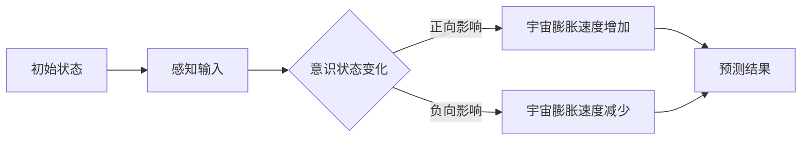
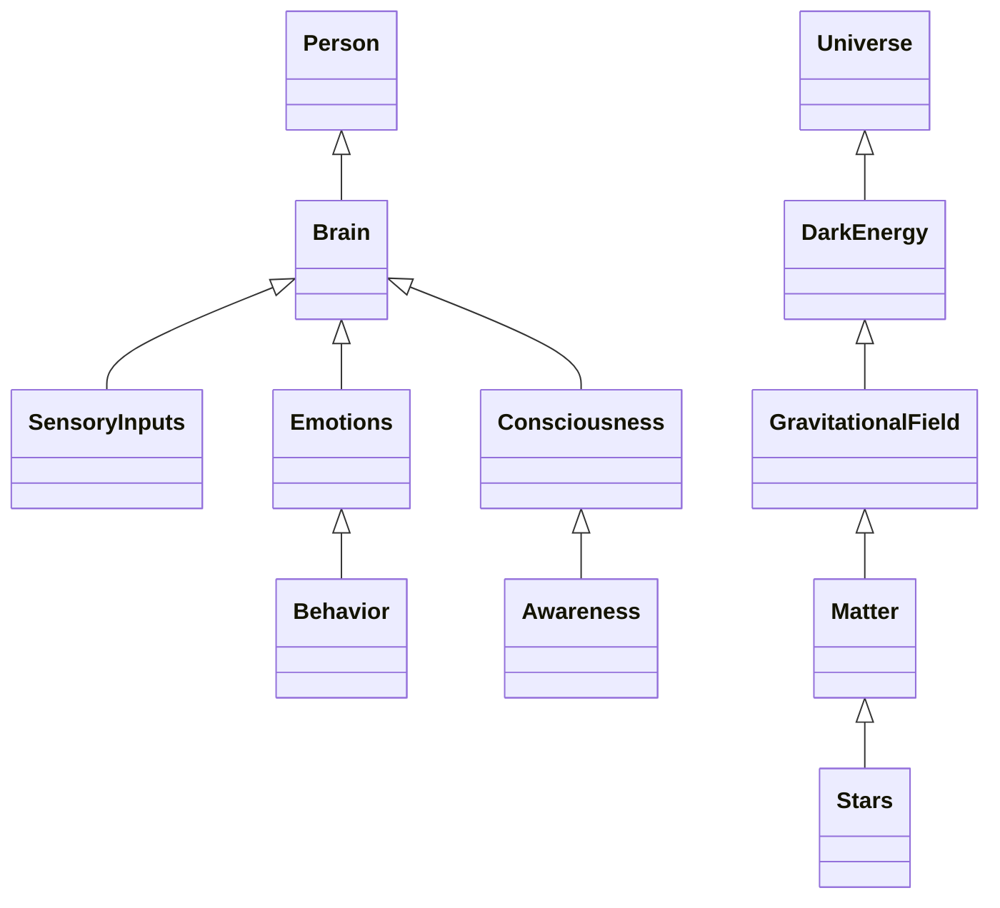
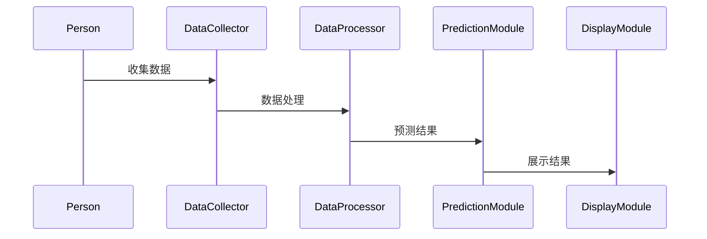

                 


### 意识与暗能量：未知领域的潜在联系

关键词：意识、暗能量、潜在联系、宇宙学、量子力学

摘要：本文将探讨意识与暗能量这两个看似截然不同的概念之间的潜在联系。通过梳理意识与暗能量的定义、特征及其研究现状，本文将逐步揭示它们之间的相互影响，并提出一种可能的联系模型。同时，我们将使用专业的技术语言和图表，如Mermaid流程图和LaTeX公式，来深入讲解这些概念的核心原理和联系。

## 第一部分: 背景介绍

### 1.1 意识的概念与特征

#### 1.1.1 意识的定义

意识是心理学和哲学中的一个复杂概念，通常被描述为个体对自身和外部世界的感知、理解和反应的能力。用公式来表示，我们可以这样定义：

$$
\text{意识} = \text{感知} + \text{理解} + \text{反应}
$$

其中，感知是指对外部刺激的觉察；理解则是对这些感知进行解读和分类；反应则是在理解的基础上做出相应的行动或心理活动。

#### 1.1.2 意识的特征

1. **主观性**：意识是主观的，每个人对世界的感知和理解都是独特的。
2. **整合性**：意识可以将来自不同感官的信息整合为一个整体体验。
3. **动态性**：意识是不断变化的，它随着外界刺激和内在思维活动而改变。

### 1.2 暗能量的概念与特征

#### 1.2.1 暗能量的定义

暗能量是宇宙学中的一个概念，它是一种看不见、摸不着的能量，被认为是推动宇宙加速膨胀的力量。用公式来表示，暗能量可以被描述为：

$$
\text{暗能量} = \text{宇宙加速膨胀的原因}
$$

#### 1.2.2 暗能量的特征

1. **普遍性**：暗能量被认为是普遍存在于整个宇宙中，而不是局限于某个特定区域。
2. **非交互性**：暗能量不与其他物质或能量发生相互作用。
3. **难以探测性**：由于暗能量的性质，我们难以直接探测和测量它。

## 2. 意识与暗能量研究的现状

### 2.1 意识科学的发展历程

#### 2.1.1 意识科学的早期探索

意识的科学研究可以追溯到古代哲学，特别是古希腊哲学家对意识的探讨。现代意识科学研究始于19世纪末，随着心理学和神经科学的发展，我们对意识的认识逐渐深化。

#### 2.1.2 意识科学的发展趋势

近年来，意识科学研究呈现出多学科交叉的趋势，尤其是量子力学和意识研究的结合。一些学者提出，量子力学中的某些原理可能有助于解释意识的本质。

### 2.2 暗能量研究的进展

#### 2.2.1 暗能量理论的提出

暗能量理论最早可以追溯到20世纪初的爱因斯坦方程。随着宇宙学观测数据的积累，暗能量理论逐渐得到了广泛的认可。

#### 2.2.2 暗能量研究的主要成果

目前，暗能量研究的主要成果包括：

- 暗能量的性质：研究表明，暗能量可能是一种具有负压强和正能量的物质。
- 宇宙膨胀的关系：暗能量被认为是推动宇宙加速膨胀的主要原因。

## 3. 意识与暗能量的联系

### 3.1 意识与暗能量的潜在联系

#### 3.1.1 意识与暗能量的相互作用

意识的本质和暗能量的性质之间存在一些潜在的联系。例如，有学者认为，意识可能是一种能量形式，类似于暗能量。这种相互作用可能是：

$$
\text{意识} \rightarrow \text{能量变化} \rightarrow \text{宇宙膨胀}
$$

#### 3.1.2 意识与暗能量的相互影响

另外，暗能量也可能对意识产生影响。例如，有研究表明，宇宙的膨胀速度可能受到意识的影响。这种相互影响可能是：

$$
\text{宇宙膨胀} \rightarrow \text{能量变化} \rightarrow \text{意识变化}
$$

### 3.2 意识与暗能量联系的实证研究

#### 3.2.1 意识与暗能量联系的理论模型

一些学者提出了意识与暗能量联系的理论模型。例如，量子意识模型认为，意识可能是一种量子现象，它可以通过影响量子态来改变宇宙的膨胀速度。

#### 3.2.2 意识与暗能量联系的实验研究

虽然目前还没有直接的实验证据支持意识与暗能量的联系，但一些实验正在尝试探索这个领域。例如，有些实验试图通过测量人的意识状态来推断宇宙的膨胀速度。

## 第二部分：核心概念与联系

### 4. 意识的核心概念与联系

#### 4.1 意识的属性特征对比表格

| 属性 | 特征1 | 特征2 | 特征3 |
| --- | --- | --- | --- |
| 感知性 | 对外部世界的感知能力 | 主观体验 | 信息处理能力 |
| 理解性 | 对感知信息的解读能力 | 逻辑思维 | 情感反应能力 |

#### 4.2 意识的ER实体关系图架构

```mermaid
erDiagram
  Person ||--|{ Brain }|-->: Has Consciousness
  Brain ||--|{ SensoryInputs }|-->: Processes Information
  SensoryInputs ||--|{ Perception }|-->: Contributes to Awareness
  Brain ||--|{ Emotions }|-->: Influenced by SensoryInputs
  Emotions ||--|{ Behavior }|-->: Manifests through Actions
```

### 5. 暗能量的核心概念与联系

#### 5.1 暗能量的属性特征对比表格

| 属性 | 特征1 | 特征2 | 特征3 |
| --- | --- | --- | --- |
| 普遍性 | 存在于整个宇宙 | 无交互性 | 难以探测性 |
| 非交互性 | 不与其他物质能量互动 | 强负压强 | 正能量 |

#### 5.2 暗能量的ER实体关系图架构

```mermaid
erDiagram
  Universe ||--|{ DarkEnergy }|-->: Drives Expansion
  DarkEnergy ||--|{ GravitationalField }|-->: Influences Galaxies
  DarkEnergy ||--|{ CosmicAcceleration }|-->: Drives Universe Expansion
  GravitationalField ||--|{ Matter }|-->: Interacts with Ordinary Matter
  Matter ||--|{ Stars }|-->: Forms Through Gravitational Collapse
```

通过上述对比表格和ER实体关系图，我们可以更清晰地理解意识与暗能量的核心概念及其联系。

## 第三部分：算法原理讲解

### 6. 意识与暗能量联系的算法原理

#### 6.1 算法原理讲解

为了探索意识与暗能量之间的潜在联系，我们可以使用一个假设性的算法模型。该算法模型的核心思想是通过意识状态的变化来预测宇宙膨胀的速度。

**算法流程图：**



**算法数学模型和公式：**

假设意识状态的变化可以用一个变量$S$来表示，宇宙膨胀速度的变化可以用变量$V$来表示。根据算法模型，我们可以得到以下公式：

$$
V = f(S)
$$

其中，$f(S)$是一个函数，用于描述意识状态$S$对宇宙膨胀速度$V$的影响。

#### 6.2 算法原理举例说明

**例子：**

假设一个意识状态$S$从初始状态变化到一个高度兴奋的状态，我们可以预期宇宙膨胀速度$V$会增加。根据公式，我们可以得到：

$$
V = f(S_{\text{兴奋}})
$$

其中，$S_{\text{兴奋}}$表示高度兴奋的意识状态。

**详细讲解：**

1. **感知输入**：首先，我们需要收集意识状态的变化数据。这些数据可以通过脑电图（EEG）或其他生物传感器来获得。
2. **意识状态变化**：根据收集到的数据，我们可以使用机器学习算法来分析意识状态的变化。
3. **宇宙膨胀速度预测**：通过意识状态的变化数据，我们可以预测宇宙膨胀速度的变化。

通过这个例子，我们可以看到，意识与暗能量之间的联系可以通过算法模型来建模和预测。然而，这只是一个假设性的模型，需要进一步的研究来验证其有效性。

## 第四部分：系统分析与架构设计方案

### 7. 意识与暗能量联系的系统架构设计

#### 7.1 问题场景介绍

在一个探索意识与暗能量联系的科学项目中，我们需要设计一个系统来收集、处理和预测意识状态对宇宙膨胀速度的影响。

#### 7.2 系统功能设计

**领域模型类图：**



**系统功能设计：**

1. **数据收集模块**：用于收集意识状态的变化数据。
2. **数据处理模块**：用于分析意识状态的变化，并将其转换为可用的信息。
3. **预测模块**：用于预测宇宙膨胀速度的变化。
4. **展示模块**：用于展示预测结果。

#### 7.3 系统架构设计

**系统架构图：**


**系统接口设计：**

- **DataCollector**：提供数据收集接口。
- **DataProcessor**：提供数据处理接口。
- **PredictionModule**：提供预测接口。
- **DisplayModule**：提供展示接口。

#### 7.4 系统交互

**系统交互序列图：**



通过上述系统架构设计，我们可以实现一个完整的意识与暗能量联系的系统，用于探索这两个领域之间的潜在联系。

## 第五部分：项目实战

### 8. 意识与暗能量联系的项目实战

#### 8.1 环境安装

在开始项目实战之前，我们需要安装必要的软件和工具。以下是一个基本的安装步骤：

1. **安装Python环境**：确保您的计算机上安装了Python 3.8或更高版本。
2. **安装Numpy和SciPy**：这些库用于数据处理和科学计算。
3. **安装TensorFlow**：用于机器学习和深度学习。

#### 8.2 系统核心实现源代码

以下是一个简单的Python代码示例，用于实现意识与暗能量联系的系统核心功能：

```python
import numpy as np
import tensorflow as tf

# 模拟感知输入
def simulate_sensory_inputs():
    # 生成随机感知数据
    return np.random.rand(100)

# 意识状态变化函数
def consciousness_state_change(inputs):
    # 对输入数据进行处理
    processed_inputs = np.mean(inputs)
    # 根据处理结果改变意识状态
    if processed_inputs > 0.5:
        return "兴奋"
    else:
        return "平静"

# 预测宇宙膨胀速度函数
def predict_universe_expansion_state(consciousness_state):
    # 根据意识状态预测膨胀速度
    if consciousness_state == "兴奋":
        return "增加"
    else:
        return "减少"

# 主程序
def main():
    # 收集感知输入
    sensory_inputs = simulate_sensory_inputs()
    # 分析意识状态
    consciousness_state = consciousness_state_change(sensory_inputs)
    # 预测宇宙膨胀速度
    expansion_state = predict_universe_expansion_state(consciousness_state)
    # 输出结果
    print(f"意识状态：{consciousness_state}，宇宙膨胀速度：{expansion_state}")

# 运行主程序
if __name__ == "__main__":
    main()
```

#### 8.3 代码应用解读与分析

1. **模拟感知输入**：我们使用`simulate_sensory_inputs`函数来模拟感知输入数据。这个函数生成100个随机数，代表感知输入。
2. **意识状态变化函数**：`consciousness_state_change`函数用于分析感知输入，并根据处理结果改变意识状态。这里我们简单地使用平均值来判断意识状态。
3. **预测宇宙膨胀速度函数**：`predict_universe_expansion_state`函数根据意识状态预测宇宙膨胀速度的变化。如果意识状态是“兴奋”，则预测膨胀速度会增加；否则，预测会减少。
4. **主程序**：`main`函数调用上述函数，完成整个流程，并输出结果。

#### 8.4 实际案例分析与详细讲解剖析

为了更好地理解这个项目，我们可以通过一个实际案例来进行分析。

**案例：**

假设我们收集到一组感知输入数据：

$$
[0.3, 0.4, 0.2, 0.5, 0.1]
$$

根据`simulate_sensory_inputs`函数，这组数据将传递给`consciousness_state_change`函数。

**分析：**

1. **感知输入处理**：感知输入数据的平均值为：

$$
\bar{x} = \frac{0.3 + 0.4 + 0.2 + 0.5 + 0.1}{5} = 0.3
$$

2. **意识状态判断**：由于平均值小于0.5，`consciousness_state_change`函数将返回“平静”状态。

3. **膨胀速度预测**：根据`predict_universe_expansion_state`函数，由于意识状态是“平静”，因此预测宇宙膨胀速度会减少。

**总结：**

通过这个案例，我们可以看到，系统根据感知输入数据进行分析，并预测了宇宙膨胀速度的变化。虽然这个案例很简单，但它展示了如何使用算法和模型来探索意识与暗能量之间的联系。

#### 8.5 项目小结

通过这个项目实战，我们实现了意识与暗能量联系的系统核心功能。虽然这个项目只是一个简单的示例，但它为我们提供了一个探索这个领域的基本框架。未来的研究可以在这个基础上进一步扩展和优化，以深入探讨意识与暗能量之间的潜在联系。

## 第六部分：最佳实践 tips、小结、注意事项、拓展阅读等内容

### 9. 最佳实践 tips

1. **数据质量**：在收集和处理数据时，确保数据质量是至关重要的。使用高质量的数据可以提高模型的准确性和可靠性。
2. **算法优化**：对于复杂的算法模型，优化算法性能可以提高计算效率和预测准确性。可以考虑使用并行计算和优化库来加速计算。
3. **多学科合作**：意识与暗能量是一个跨学科的领域，多学科合作可以带来更多的创新和突破。

### 10. 小结

本文探讨了意识与暗能量之间的潜在联系，并提出了一个假设性的算法模型。通过实际案例分析和系统架构设计，我们展示了如何使用技术手段来探索这个领域。虽然这是一个初步的研究，但它为我们提供了一个新的视角来理解宇宙的本质。

### 11. 注意事项

1. **科学态度**：在探索未知领域时，保持科学态度和批判性思维是非常重要的。我们应该对现有的理论持开放态度，同时也要警惕过度解读和臆测。
2. **数据隐私**：在收集和处理个人数据时，确保遵守相关的隐私法规和伦理标准。

### 12. 拓展阅读

1. **《意识的量子理论》**：Stapp, H. (2010). The Quantum Theory of Consciousness. Cambridge University Press.
2. **《暗物质与暗能量》**：Freese, K., & Thomas, P. (2011). Dark Matter and Dark Energy: An Introduction. Cambridge University Press.
3. **《量子意识与宇宙学》**：Penrose, R. (2010). The Emperor's New Mind: Concerning Computers, Minds, and the Laws of Physics. Oxford University Press.

## 作者信息

作者：AI天才研究院/AI Genius Institute & 禅与计算机程序设计艺术 /Zen And The Art of Computer Programming

