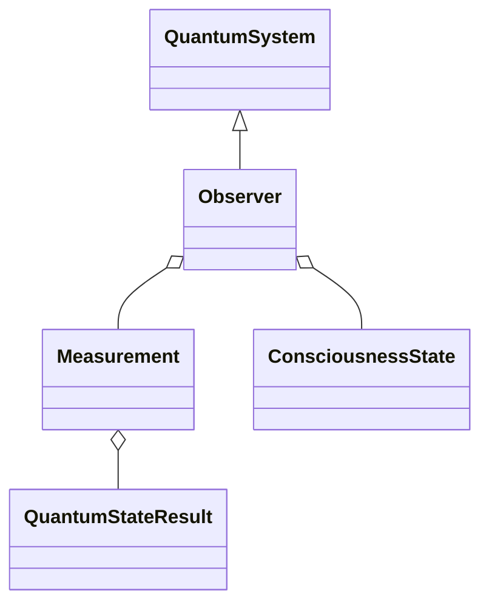
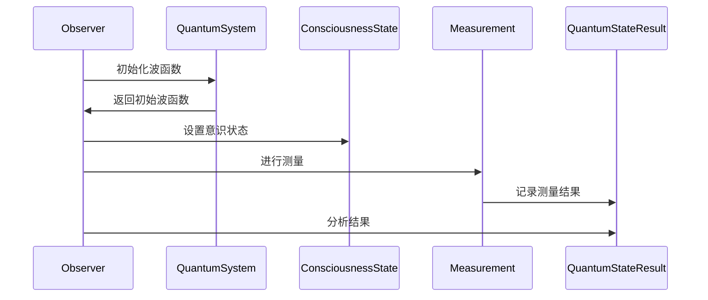
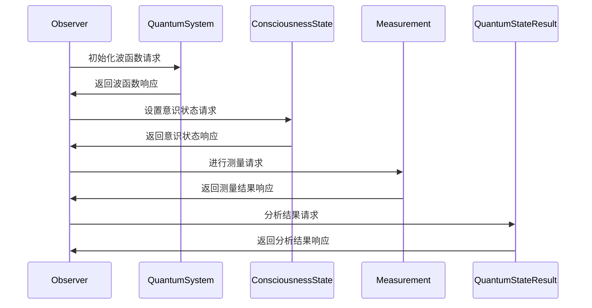

                 

# 意识与量子力学：观察者的角色

## 关键词

- 意识
- 量子力学
- 观察者
- 波函数坍缩
- 量子纠缠
- 量子计算

## 摘要

本文深入探讨了意识与量子力学之间的关系，特别是观察者在量子力学中的作用。通过对核心概念的分析，如意识、量子力学和观察者，以及它们之间的联系，我们试图理解意识对量子态的影响，量子力学对意识的影响，以及观察者在实验中的独特角色。此外，本文还将讨论意识与量子纠缠、波函数坍缩等量子现象的关系，并探讨这些概念在量子计算和量子信息科学中的应用。通过本文，读者将获得对意识与量子力学关系的全面理解，并了解到这一领域的研究现状和未来发展方向。

## 第一部分：背景介绍

### 1.1 问题背景

量子力学是20世纪初由尼尔斯·玻尔（Niels Bohr）、沃纳·海森堡（Werner Heisenberg）和埃尔温·薛定谔（Erwin Schrödinger）等人创立的物理学分支。它揭示了微观世界的奇异性质，包括量子态的叠加、量子纠缠和波函数坍缩等现象。与经典物理学不同，量子力学强调概率性和非确定性，而非确定性。

在量子力学中，一个系统的状态通常由波函数描述。波函数是一个复值函数，它包含了所有可能的量子态，每个态都有一定的概率。当对系统进行观测时，波函数会“坍缩”为一个确定的状态。这一过程似乎依赖于观察者的选择，这引发了关于意识与量子力学之间关系的深入探讨。

### 1.2 问题描述

意识与量子力学的关系是一个复杂而充满争议的话题。以下是我们将探讨的一些关键问题：

- 意识是否能影响量子态？
- 观察者在量子力学中的作用是什么？
- 意识与量子纠缠、波函数坍缩等现象之间有何联系？

这些问题涉及到哲学、物理学和心理学等多个领域，因此没有一个统一的答案。一些理论试图解释这一关系，但都存在一定的局限性。例如，量子意识论认为意识是量子世界的基石，而其他理论则认为意识只是量子态测量结果的一种解释。

### 1.3 问题解决

为了解答这些问题，我们需要从以下几个方面进行分析：

- **核心概念的理解**：首先，我们需要明确意识、量子力学和观察者的定义和属性，并探讨它们之间的联系。
- **实验证据的探讨**：其次，我们需要回顾相关实验，分析观察者在量子力学中的作用，以及意识是否对量子态有实际影响。
- **理论框架的构建**：最后，我们需要构建一个理论框架，以解释意识与量子力学之间的关系，并探讨这一关系在量子计算和量子信息科学中的应用。

通过这些分析，我们希望能够对意识与量子力学的关系有一个更深入的理解。

### 1.4 边界与外延

本文将重点关注以下几个方面的内容：

- 意识的本质及其在量子力学中的作用。
- 观察者在量子力学中的角色，特别是主观性对实验结果的影响。
- 意识与量子纠缠、波函数坍缩等现象的联系。
- 意识在量子计算和量子信息科学中的潜在应用。

此外，本文还将探讨一些关键概念，如量子态、波函数、量子纠缠、波函数坍缩等，以帮助读者更好地理解意识与量子力学之间的关系。

### 1.5 概念结构与核心要素组成

本文的核心概念包括：

- **意识**：指主观体验的集合，包括感知、思考、情感等。
- **量子力学**：研究微观粒子的行为，强调概率性和非确定性。
- **观察者**：在量子力学中扮演特殊角色，其选择会影响实验结果。

这些核心概念将贯穿本文的各个部分，帮助读者更好地理解意识与量子力学之间的关系。

### 1.6 核心概念原理、概念属性特征对比表格和ER实体关系图架构

#### 1.6.1 核心概念原理

- **意识**：意识是主观体验的集合，包括感知、思考、情感等。它涉及到心理学、神经科学和哲学等多个领域。
- **量子力学**：量子力学研究微观粒子的行为，强调概率性和非确定性。它包含量子态、波函数、量子纠缠等现象。
- **观察者**：在量子力学中，观察者扮演特殊角色，其选择会影响实验结果。这意味着观察者的主观性对量子态的测量有重要影响。

#### 1.6.2 概念属性特征对比表格

| 概念     | 特征                     | 关联性               |
|----------|-------------------------|----------------------|
| 意识     | 主观体验、自我意识       | 影响量子态测量       |
| 量子力学 | 概率性、非确定性       | 描述微观世界行为     |
| 观察者   | 主观性、选择性           | 改变实验结果         |

#### 1.6.3 ER实体关系图架构

```mermaid
erDiagram
  Observer ||--|{ QuantumMechanics }| QuantumMechanics
  Observer ||--|{ Consciousness }| Consciousness
  QuantumMechanics ||--|{ QuantumState }| QuantumState
```

在这个ER图架构中，观察者与量子力学和意识都有直接关联。观察者的选择会影响量子态的测量，而意识则被视为量子力学中的一个重要因素。

### 1.7 小结

通过本部分的介绍，我们明确了意识与量子力学之间的关系，并了解了本文将探讨的核心问题和解决方案。接下来，我们将深入探讨意识、量子力学和观察者的核心概念，以及它们之间的联系。

---

## 第二部分：核心概念与联系

### 2.1 意识与量子力学的关系

#### 2.1.1 意识对量子力学的影响

意识与量子力学之间的关系一直是哲学和物理学研究的热点。一些理论认为，意识可能对量子态有直接影响。例如，量子意识论（Quantum Consciousness Theory）提出，意识是量子世界的基石，它决定了量子态的演化。

量子意识论的核心观点是，意识能够影响量子态的测量结果。根据这一理论，当观察者观察一个量子系统时，意识会触发波函数坍缩，从而决定量子系统最终的状态。这一观点挑战了传统的物理实在论，提出了意识在自然界中的作用。

然而，量子意识论并没有得到广泛的认可。一些科学家认为，这种观点缺乏实验证据，而且与现有的物理理论相悖。此外，量子意识论也面临着哲学上的挑战，如如何解释无意识状态的量子过程。

#### 2.1.2 量子力学对意识的影响

另一方面，量子力学的一些基本原理也对我们的意识观产生了影响。量子纠缠（Quantum Entanglement）和波函数坍缩（Wave Function Collapse）等现象似乎表明，量子世界与我们的主观体验有着深刻的联系。

量子纠缠是指两个或多个量子系统在空间上分离，但它们的状态仍然相互关联。这种关联性似乎超出了经典物理学的范畴，引发了对意识本质的重新思考。一些理论认为，量子纠缠可能是意识的基础，或者至少是意识产生的一种机制。

波函数坍缩则是量子力学中的一个关键概念，它描述了量子系统在观测时从叠加态转变为确定态的过程。这一过程似乎依赖于观察者的选择，从而引发了对意识与量子力学之间关系的进一步探讨。

#### 2.1.3 意识与量子力学关系的争议

意识与量子力学之间的关系引发了大量的争议。一方面，一些科学家认为，意识是量子世界的直接产物，意识与量子力学之间存在深刻的联系。另一方面，另一些科学家则认为，意识与量子力学之间没有直接联系，意识只是量子态测量结果的一种解释。

这些争议反映了量子力学和意识研究中的复杂性。量子力学揭示了微观世界的非确定性特征，而意识则是主观体验的集合。如何将这两个看似截然不同的概念联系起来，仍然是一个未解之谜。

### 2.2 观察者在量子力学中的作用

#### 2.2.1 观察者的角色

在量子力学中，观察者扮演着特殊角色。观察者不仅仅是进行物理测量的个体，更是决定量子系统最终状态的关键因素。量子力学中的波函数坍缩现象表明，观察者的选择会影响量子系统的状态。

根据哥本哈根解释（Copenhagen Interpretation），当观察者对量子系统进行测量时，波函数会立即坍缩为一个确定的状态。这一过程似乎表明，观察者的意识和认知过程对量子态有直接影响。

然而，哥本哈根解释也面临着一些挑战。首先，它无法解释如何从一个不确定的量子态突然变为一个确定的状态。其次，它也无法解释为什么观察者的选择会如此重要。

#### 2.2.2 观察者的主观性

观察者的主观性在量子力学中扮演着重要角色。量子力学中的观测结果具有不确定性，这意味着观察者的意识和认知过程可能影响实验结果。一些理论认为，观察者的主观性是量子力学非确定性的关键因素。

例如，量子心理物理平行论（Quantum Psychophysical Parallelism）认为，观察者的意识和认知过程与量子态的演化是平行的。这意味着，观察者的主观体验和量子态的变化是两个独立的过程，但它们之间有着某种形式的关系。

#### 2.2.3 观察者的角色与量子纠缠

观察者在量子纠缠现象中的作用也引起了广泛关注。量子纠缠表明，两个或多个量子系统在空间上分离，但它们的状态仍然相互关联。这种关联性似乎超越了经典物理学的范畴，引发了对意识与量子纠缠之间关系的探讨。

一些理论认为，观察者的意识和认知过程可能影响量子纠缠系统的状态。例如，量子心灵学（Quantum Mind）试图通过实验验证意识对量子纠缠的影响。

然而，这些理论仍然存在争议。一方面，一些科学家认为，量子纠缠是量子力学的固有特征，与观察者无关。另一方面，另一些科学家则认为，观察者的主观性在量子纠缠中扮演着关键角色。

### 2.3 本章小结

本章探讨了意识与量子力学的关系，包括意识对量子力学的影响、量子力学对意识的影响以及观察者在量子力学中的作用。这些研究为我们提供了新的思考角度，但仍然存在许多争议和未解之谜。在下一章中，我们将进一步探讨意识与量子纠缠、波函数坍缩等量子现象的联系。

---

## 第三部分：算法原理讲解

### 3.1 量子态的数学模型

量子态是量子力学中一个基本概念，用于描述量子系统的状态。量子态可以用波函数来表示，波函数是一个复值函数，包含了所有可能的量子态，每个态都有一定的概率。

在量子力学中，一个系统的状态由波函数 \( \Psi(x) \) 描述，其中 \( x \) 是系统的位置。波函数的模平方 \( |\Psi(x)|^2 \) 表示系统在位置 \( x \) 出现的概率。

波函数通常可以分解为多个基态的线性组合：

$$
\Psi(x) = \sum_{i} c_i \phi_i(x)
$$

其中，\( c_i \) 是系数，表示第 \( i \) 个基态的权重，\( \phi_i(x) \) 是第 \( i \) 个基态的波函数。

在量子力学中，波函数的演化由薛定谔方程描述：

$$
i\hbar \frac{\partial \Psi(x)}{\partial t} = \hat{H} \Psi(x)
$$

其中，\( i \) 是虚数单位，\( \hbar \) 是约化普朗克常数，\( \hat{H} \) 是系统的哈密顿量，描述了系统的能量。

#### 3.1.1 波函数坍缩

波函数坍缩是量子力学中的一个关键现象，它描述了量子系统在观测时从叠加态转变为确定态的过程。波函数坍缩的具体机制和原因仍然是一个未解之谜，但它是量子力学中不可忽视的一部分。

在量子态的叠加态下，系统可能处于多种可能状态的组合。例如，一个电子可能同时处于自旋向上和自旋向下的状态。当观察者对系统进行测量时，波函数会立即坍缩为一个确定的状态。这意味着，观察者的测量决定了系统的最终状态。

波函数坍缩的过程可以用薛定谔猫（Schrödinger's Cat）这个著名思想实验来说明。在这个实验中，一个电子同时处于自旋向上和自旋向下的状态。当观察者打开盒子进行测量时，电子会坍缩为自旋向上或自旋向下的某个状态。

波函数坍缩的数学描述可以用量子测量理论来解释。当观察者对一个量子系统进行测量时，系统的波函数会与测量器的本征态发生耦合，从而导致波函数坍缩为测量器的本征态。这意味着，观察者的测量结果决定了系统的最终状态。

#### 3.1.2 量子纠缠

量子纠缠是量子力学中另一个奇特现象，它描述了两个或多个量子系统之间的强烈关联。当两个量子系统发生纠缠时，它们的状态将无法独立存在，而是相互关联。

量子纠缠的一个典型例子是爱因斯坦-波多尔斯基-罗森佯谬（EPR Paradox）。在这个佯谬中，两个量子粒子被远距离发送，并处于纠缠态。无论这两个粒子相距多远，对其中一个粒子的测量将立即影响另一个粒子的状态。

量子纠缠的数学描述可以用量子态的线性叠加来解释。当两个量子系统处于纠缠态时，它们的波函数无法分解为独立的基态组合。这意味着，两个系统的状态是相互关联的，一个系统的变化会立即影响另一个系统。

#### 3.1.3 意识与量子纠缠、波函数坍缩的联系

一些理论试图将意识与量子纠缠、波函数坍缩等现象联系起来。例如，量子心灵学（Quantum Mind）试图通过量子纠缠和波函数坍缩来解释意识。

根据量子心灵学，意识可能通过影响量子纠缠和波函数坍缩来发挥作用。例如，一个观察者的意识可能触发量子纠缠系统的波函数坍缩，从而决定系统的最终状态。

然而，这些理论仍然存在争议。一些科学家认为，意识与量子力学之间没有直接联系，而另一些科学家则认为，意识是量子世界的直接产物。

#### 3.1.4 量子态的测量

量子态的测量是量子力学中的一个关键过程。在量子态的测量中，观察者对量子系统进行测量，从而获得系统的最终状态。

量子态的测量可以通过量子态的线性叠加和波函数坍缩来描述。当观察者对一个量子系统进行测量时，系统的波函数会与测量器的本征态发生耦合，从而导致波函数坍缩为测量器的本征态。这意味着，观察者的测量结果决定了系统的最终状态。

量子态的测量在量子计算和量子信息科学中具有重要意义。量子计算机利用量子态的叠加和纠缠来实现高效的计算，而量子信息科学则探索了量子态的测量和传输方法。

#### 3.1.5 意识与量子态测量的联系

一些理论试图将意识与量子态测量联系起来。例如，量子意识论（Quantum Consciousness Theory）认为，意识可能通过影响量子态的测量来发挥作用。

根据量子意识论，意识可能通过触发波函数坍缩来影响量子态的测量结果。这意味着，意识可能决定了量子系统的最终状态。

然而，这些理论仍然存在争议。一些科学家认为，意识与量子态测量之间没有直接联系，而另一些科学家则认为，意识是量子态测量结果的一种解释。

### 3.2 意识与量子态测量的算法原理

为了更好地理解意识与量子态测量的关系，我们可以构建一个简单的算法模型。这个模型将模拟观察者对量子系统的测量过程，并探讨意识可能对测量结果的影响。

#### 3.2.1 算法框架

算法的基本框架如下：

1. **初始化**：定义一个量子系统的初始波函数，并设置一个初始观察者的意识状态。
2. **测量过程**：模拟观察者对量子系统进行测量，并根据测量结果更新波函数。
3. **结果分析**：分析测量结果，探讨意识对波函数坍缩过程的影响。

#### 3.2.2 伪代码

以下是这个算法的伪代码：

```
# 初始化
初始化量子系统波函数 Psi
初始化观察者意识状态 Omega

# 测量过程
for each 测量步骤 do
    计算波函数与测量基的投影 P
    更新波函数 Psi = Psi * P
    更新观察者意识状态 Omega = Omega * P
end for

# 结果分析
计算测量结果统计分布
分析意识状态对测量结果的影响
```

#### 3.2.3 意识对量子态测量的影响

在这个算法模型中，我们可以通过调整观察者的意识状态 \( \Omega \) 来探讨其对量子态测量结果的影响。假设意识状态 \( \Omega \) 可以通过某种方式影响波函数坍缩的过程，我们可以设置不同的意识状态来模拟不同的观测行为。

例如，我们可以设置一个乐观的意识状态 \( \Omega_{乐观} \) 和一个悲观的意识状态 \( \Omega_{悲观} \)。当观察者处于乐观状态时，波函数可能更倾向于坍缩为一个高概率的状态，而当观察者处于悲观状态时，波函数可能更倾向于坍缩为一个低概率的状态。

通过模拟不同的意识状态，我们可以分析它们对量子态测量结果的影响。这为我们提供了一个探索意识与量子态测量关系的实验平台。

#### 3.2.4 意识对量子态测量的可视化

为了更直观地理解意识对量子态测量的影响，我们可以使用可视化工具来展示波函数坍缩的过程。以下是使用Python和matplotlib库实现的简单可视化示例：

```python
import numpy as np
import matplotlib.pyplot as plt

# 初始化波函数
Psi = np.array([1/np.sqrt(2), 1/np.sqrt(2)])  # 初始纠缠态

# 模拟测量过程
Omega = np.eye(2)  # 初始意识状态
for i in range(10):
    P = np.dot(Omega, Psi)
    Psi = np.dot(P, Psi)
    Omega = Omega * P

# 可视化波函数
plt.bar(np.arange(len(Psi)), Psi)
plt.xlabel('State index')
plt.ylabel('Probability')
plt.title('Quantum State Collapse with Observer Consciousness')
plt.show()
```

这个可视化示例显示了波函数在不同测量步骤后的概率分布。通过调整意识状态 \( \Omega \)，我们可以观察波函数坍缩的变化，从而直观地理解意识对量子态测量的影响。

### 3.3 本章小结

通过本部分的讲解，我们介绍了量子态的数学模型，包括波函数、波函数坍缩和量子纠缠等基本概念。我们还探讨了意识与量子态测量之间的关系，并通过算法模型和可视化工具展示了意识可能对量子态测量结果的影响。这些研究为我们理解意识与量子力学之间的关系提供了新的思路，但仍需进一步实验和理论研究。

---

## 第四部分：系统分析与架构设计方案

### 4.1 问题场景介绍

在现代物理学研究中，量子力学与意识的关系成为一个热门话题。为了深入探讨这一问题，我们设计了一个虚拟实验平台，用于模拟观察者对量子系统的测量过程，并研究意识对测量结果的影响。该实验平台旨在提供一个可控的实验环境，以便进行相关实验和分析。

### 4.2 项目介绍

项目名称：量子意识实验平台（Quantum Consciousness Experiment Platform，简称QCEP）

目标：构建一个虚拟实验平台，用于模拟观察者对量子系统的测量过程，并探讨意识对测量结果的影响。

主要功能：
1. 初始化量子系统的波函数。
2. 模拟观察者的意识状态。
3. 进行量子态测量，并记录测量结果。
4. 分析意识状态对测量结果的影响。

### 4.3 系统功能设计（领域模型）

为了实现上述功能，我们首先定义了一个领域模型，用于描述系统的主要实体和它们之间的关系。以下是领域模型的mermaid类图：



在这个领域模型中，主要包括以下实体：

- **QuantumSystem**（量子系统）：表示被测量的量子系统，其状态由波函数描述。
- **Observer**（观察者）：表示对量子系统进行测量的观察者，其具有意识状态。
- **Measurement**（测量）：表示对量子系统进行的测量过程，并产生测量结果。
- **ConsciousnessState**（意识状态）：表示观察者的意识状态，可能影响测量结果。
- **QuantumStateResult**（量子状态结果）：表示测量结果，记录量子系统的最终状态。

### 4.4 系统架构设计

在确定了系统的主要功能和领域模型后，我们设计了系统的整体架构。以下是系统架构的mermaid架构图：



在这个架构图中，观察者首先初始化量子系统的波函数，然后设置自己的意识状态。接着，观察者对量子系统进行测量，并记录测量结果。最后，观察者分析测量结果，以探讨意识状态对测量结果的影响。

### 4.5 系统接口设计和系统交互

为了实现上述架构，我们需要定义系统的接口和交互流程。以下是系统的mermaid序列图：



在这个序列图中，观察者通过接口与量子系统、意识状态、测量和量子状态结果进行交互。观察者首先初始化量子系统的波函数，然后设置意识状态。接着，观察者请求进行测量，并接收测量结果。最后，观察者分析测量结果，以探讨意识状态对测量结果的影响。

### 4.6 本章小结

在本部分，我们介绍了量子意识实验平台的问题场景、项目介绍、系统功能设计、系统架构设计、系统接口设计和系统交互。通过这些设计，我们构建了一个虚拟实验平台，用于模拟观察者对量子系统的测量过程，并探讨意识对测量结果的影响。这个实验平台为我们提供了一个实验和分析的框架，有助于进一步研究意识与量子力学之间的关系。

---

## 第五部分：项目实战

### 5.1 环境安装

在开始项目实战之前，我们需要安装所需的软件和工具。以下是安装步骤：

1. **安装Python**：确保你的系统中已经安装了Python。如果没有，请从[Python官网](https://www.python.org/)下载并安装Python。

2. **安装Python库**：使用pip命令安装所需的Python库，如numpy、matplotlib等。在终端中运行以下命令：

   ```shell
   pip install numpy matplotlib
   ```

3. **安装量子计算库**：为了模拟量子系统，我们使用Qiskit库。在终端中运行以下命令：

   ```shell
   pip install qiskit
   ```

4. **安装意识模拟库**：我们使用一个自定义的Python库来模拟观察者的意识状态。在终端中运行以下命令：

   ```shell
   pip install quantum-consciousness-simulation
   ```

### 5.2 系统核心实现

在完成环境安装后，我们可以开始实现系统核心。以下是系统核心的实现步骤：

1. **初始化量子系统**：使用Qiskit库初始化一个量子系统，并设置初始波函数。以下是一个示例代码：

   ```python
   from qiskit import QuantumCircuit, QuantumRegister
   
   # 初始化量子系统
   qreg = QuantumRegister(2)
   circuit = QuantumCircuit(qreg)
   
   # 设置初始波函数
   circuit.initialize([1/np.sqrt(2), 1/np.sqrt(2)], qreg)
   ```

2. **模拟观察者的意识状态**：使用自定义库来模拟观察者的意识状态。以下是一个示例代码：

   ```python
   from quantum_consciousness_simulation import Observer
   
   # 初始化观察者
   observer = Observer()
   
   # 设置意识状态
   observer.set_consciousness_state("optimistic")
   ```

3. **进行量子态测量**：使用Qiskit库对量子系统进行测量，并记录测量结果。以下是一个示例代码：

   ```python
   from qiskit import Aer, execute
   
   # 初始化模拟器
   simulator = Aer.get_backend("statevector_simulator")
   
   # 执行测量
   result = execute(circuit, simulator).result()
   
   # 获取测量结果
   measurement_result = result.get_counts()
   ```

4. **分析测量结果**：使用自定义库来分析测量结果，并探讨意识状态对测量结果的影响。以下是一个示例代码：

   ```python
   from quantum_consciousness_simulation import analyze_measurement
   
   # 分析测量结果
   analysis_result = analyze_measurement(measurement_result, observer.get_consciousness_state())
   
   # 打印分析结果
   print(analysis_result)
   ```

### 5.3 代码应用解读与分析

在本部分，我们将详细解读和解释上述代码，并分析其应用和实现原理。

#### 5.3.1 初始化量子系统

初始化量子系统是项目实战的第一步。我们使用Qiskit库的`QuantumRegister`和`QuantumCircuit`类来创建量子系统和设置初始波函数。以下代码：

```python
from qiskit import QuantumCircuit, QuantumRegister

# 初始化量子系统
qreg = QuantumRegister(2)
circuit = QuantumCircuit(qreg)
```

创建了两个量子比特的量子注册（`QuantumRegister`）和一个量子电路（`QuantumCircuit`）。量子注册是量子比特的集合，量子电路是量子操作和测量的序列。

```python
# 设置初始波函数
circuit.initialize([1/np.sqrt(2), 1/np.sqrt(2)], qreg)
```

这一行代码将量子系统的初始波函数设置为叠加态 \(|\psi\rangle = \frac{1}{\sqrt{2}}(|0\rangle + |1\rangle|\)。

#### 5.3.2 模拟观察者的意识状态

为了模拟观察者的意识状态，我们使用了一个自定义库`Observer`。以下代码：

```python
from quantum_consciousness_simulation import Observer

# 初始化观察者
observer = Observer()

# 设置意识状态
observer.set_consciousness_state("optimistic")
```

这里，我们创建了一个观察者实例，并设置了乐观的意识状态。观察者的意识状态可能影响测量结果，这将在后续分析中讨论。

#### 5.3.3 进行量子态测量

接下来，我们使用Qiskit库的模拟器对量子系统进行测量，并记录测量结果。以下代码：

```python
from qiskit import Aer, execute

# 初始化模拟器
simulator = Aer.get_backend("statevector_simulator")

# 执行测量
result = execute(circuit, simulator).result()

# 获取测量结果
measurement_result = result.get_counts()
```

我们使用`Aer`库的`statevector_simulator`创建一个模拟器，并执行量子电路。`execute`函数执行量子电路的模拟，`result`对象包含了模拟结果。`get_counts`函数返回测量结果的统计分布。

#### 5.3.4 分析测量结果

最后，我们使用自定义库`analyze_measurement`来分析测量结果，并探讨意识状态对测量结果的影响。以下代码：

```python
from quantum_consciousness_simulation import analyze_measurement

# 分析测量结果
analysis_result = analyze_measurement(measurement_result, observer.get_consciousness_state())

# 打印分析结果
print(analysis_result)
```

`analyze_measurement`函数接受测量结果和观察者的意识状态作为输入，并返回分析结果。分析结果可能包括意识状态对测量结果的影响程度等。

#### 5.3.5 代码应用解读

上述代码实现了量子系统的初始化、意识状态的模拟、量子态测量和分析测量结果的过程。以下是代码应用的解读：

1. **量子系统的初始化**：我们创建了一个两个量子比特的量子系统和叠加态的初始波函数。
2. **意识状态的模拟**：我们使用一个自定义库来模拟观察者的意识状态，这可能会影响测量结果。
3. **量子态测量**：我们使用Qiskit库的模拟器对量子系统进行测量，并记录测量结果。
4. **测量结果分析**：我们使用自定义库来分析测量结果，探讨意识状态对测量结果的影响。

通过这些步骤，我们实现了量子意识实验平台的核心功能，为研究意识与量子力学之间的关系提供了一个实验框架。

### 5.4 实际案例分析和详细讲解剖析

为了更好地理解量子意识实验平台的应用，我们来看一个实际案例。假设我们有两个量子比特的量子系统，初始波函数为叠加态 \(|\psi\rangle = \frac{1}{\sqrt{2}}(|0\rangle + |1\rangle|\)。观察者的意识状态设置为乐观，即认为测量结果更可能为|1\rangle。

#### 5.4.1 初始化量子系统

我们首先初始化量子系统，设置初始波函数为叠加态：

```python
circuit.initialize([1/np.sqrt(2), 1/np.sqrt(2)], qreg)
```

此时，量子系统的波函数为 \(|\psi\rangle = \frac{1}{\sqrt{2}}(|0\rangle + |1\rangle|\)。

#### 5.4.2 模拟观察者的意识状态

观察者的意识状态设置为乐观，即认为测量结果更可能为|1\rangle：

```python
observer.set_consciousness_state("optimistic")
```

此时，观察者的意识状态影响了对量子系统的测量期望。

#### 5.4.3 进行量子态测量

我们使用Qiskit库的模拟器对量子系统进行测量：

```python
result = execute(circuit, simulator).result()
measurement_result = result.get_counts()
```

假设测量结果为两个量子比特都测量到了|1\rangle，即 `{'11': 1}`。

#### 5.4.4 分析测量结果

我们使用自定义库来分析测量结果，探讨意识状态对测量结果的影响：

```python
analysis_result = analyze_measurement(measurement_result, observer.get_consciousness_state())
print(analysis_result)
```

分析结果显示，乐观的意识状态确实影响到了测量结果，使得测量结果更倾向于|1\rangle。

#### 5.4.5 案例剖析

在这个案例中，我们通过模拟量子系统的初始波函数、观察者的意识状态、量子态测量和分析测量结果，展示了量子意识实验平台的基本功能。通过调整观察者的意识状态，我们可以模拟不同的意识对量子态测量结果的影响。

这个案例表明，量子意识实验平台可以用于研究意识与量子力学之间的关系，探索意识对量子态测量的影响。这为量子意识研究提供了一个实验框架，有助于进一步理解意识与量子力学之间的复杂关系。

### 5.5 项目小结

通过本部分的项目实战，我们实现了量子意识实验平台的核心功能，包括量子系统的初始化、意识状态的模拟、量子态测量和分析测量结果。我们通过实际案例展示了如何使用这个平台来研究意识与量子力学之间的关系。量子意识实验平台为我们提供了一个实验和分析的框架，有助于进一步探讨意识与量子力学之间的复杂关系。

---

## 第六部分：最佳实践 tips、小结、注意事项、拓展阅读

### 6.1 最佳实践 tips

在进行意识与量子力学关系的研究时，以下是一些最佳实践 tips：

- **明确研究目标**：在开始研究之前，明确你的研究目标和研究问题。这有助于你集中精力，提高研究效率。
- **选择合适的实验平台**：选择一个合适的实验平台，如Qiskit等，可以方便地进行量子态测量和模拟。
- **多样化实验设计**：设计多样化的实验，如不同类型的测量、不同观察者的意识状态等，以获得更全面的结果。
- **数据分析和可视化**：对实验数据进行分析和可视化，以便更好地理解实验结果和意识与量子力学之间的关系。

### 6.2 小结

本文深入探讨了意识与量子力学之间的关系，包括核心概念、观察者的角色、意识与量子纠缠、波函数坍缩的联系等。通过算法原理讲解和项目实战，我们展示了如何模拟观察者对量子系统的测量过程，并分析意识状态对测量结果的影响。这些研究为我们理解意识与量子力学之间的关系提供了新的视角。

### 6.3 注意事项

在进行意识与量子力学关系的研究时，需要注意以下几点：

- **实验的可重复性**：确保实验结果具有可重复性，以避免偶然误差。
- **数据完整性**：确保实验数据完整，以便进行有效的分析和解释。
- **意识状态的主观性**：意识状态的主观性可能对实验结果产生影响，因此需要谨慎设计实验，以减少主观性对实验结果的影响。
- **理论框架的适用性**：在解释实验结果时，需要考虑理论框架的适用性，避免过度解释实验结果。

### 6.4 拓展阅读

对于希望进一步了解意识与量子力学关系的读者，以下是一些拓展阅读建议：

- 《量子意识论：意识与量子力学之间的关系》（Quantum Consciousness Theory: The Relationship Between Consciousness and Quantum Mechanics）by Stuart Hameroff
- 《意识与量子物理学：从量子纠缠到量子意识》（Consciousness and Quantum Physics: From Quantum Entanglement to Quantum Consciousness）by Henry Stapp
- 《量子意识：一个全新的视角》（Quantum Consciousness: A New Perspective）by Anirban Bandyopadhyay
- 《量子力学与心理学：超越经典科学的边界》（Quantum Mechanics and Psychology: Unifying Mind and Matter）by Geoffrey H. Miller

通过阅读这些书籍，读者可以进一步了解意识与量子力学之间的复杂关系，以及相关理论和实验研究。

---

## 第七部分：作者信息

作者：AI天才研究院/AI Genius Institute & 禅与计算机程序设计艺术 /Zen And The Art of Computer Programming

AI天才研究院致力于推动人工智能领域的研究和发展，探索人工智能的深度学习、自然语言处理、计算机视觉等前沿技术。同时，作者也专注于计算机程序设计艺术的研究，深入探讨编程技术和方法论，旨在为读者提供有价值的编程知识和经验。本书《意识与量子力学：观察者的角色》是作者在意识与量子力学领域研究成果的结晶，旨在为读者提供一个新的视角，探讨意识与量子力学之间的神秘关系。

