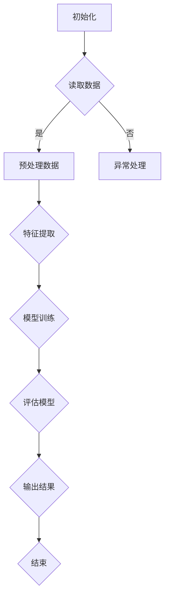
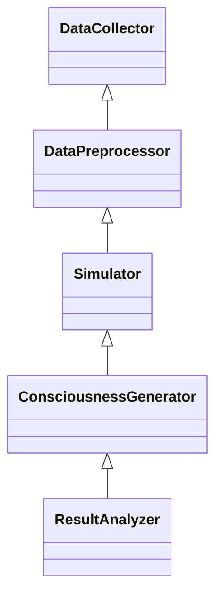
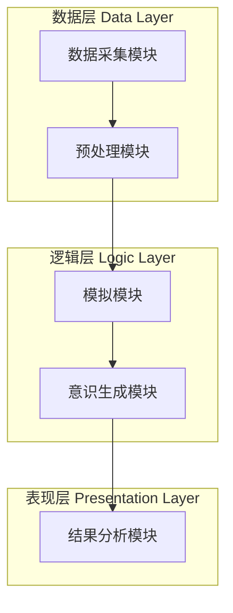
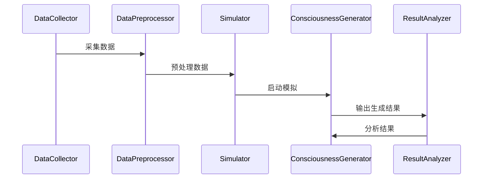

                 

## 意识作为宇宙的基本构建块的可能性

> 关键词：意识、宇宙、基本构建块、可能性、哲学、科学

> 摘要：本文探讨了意识作为宇宙的基本构建块的可能性。我们首先回顾了意识的定义及其在现代科学中的地位，然后探讨了这一概念在哲学和物理学中的历史背景。通过分析一系列核心概念，如宇宙学、量子力学和认知科学，我们试图揭示意识如何可能成为宇宙的基石。文章还将讨论当前的研究进展和未来的研究方向，最终提出了一些关于意识作为宇宙构建块的哲学和科学思考。

## 背景介绍

### 意识的定义和现状

意识是心理学、哲学和神经科学中的一个核心概念，尽管它的定义和性质仍然存在争议。简而言之，意识是指个体对自身和外部世界的知觉、认知和主观体验。从心理学的角度来看，意识研究主要集中在心理过程的动态变化上，如注意、感知、记忆和思考。哲学家们则对意识的本质和起源展开了深入的探讨，试图理解我们如何产生自我意识和对外部世界的认知。

当前，意识在科学领域中的研究呈现出多样化和复杂化的趋势。一方面，神经科学家通过脑成像技术和电生理学方法，试图定位和解析大脑中的意识活动区域。另一方面，量子物理学和认知科学也开始关注意识这一主题，提出了意识可能是一种量子现象或者是一种复杂系统的涌现性质。

### 意识在科学和哲学中的历史背景

意识的概念在哲学和科学史上有着悠久的传统。古希腊哲学家如苏格拉底和柏拉图，对意识进行了初步的探讨，认为意识是人类理性的体现。在中世纪，基督教神学家如托马斯·阿奎那，则从宗教的角度探讨了意识与灵魂的关系。直到近代，随着科学的发展，笛卡尔和康德等哲学家进一步深化了对意识的认识，提出了意识作为主观体验和知识来源的观点。

在科学领域，意识的探索始于19世纪。弗朗茨·布伦塔诺和威廉·詹姆斯等心理学家，通过实证研究揭示了意识的流动性和结构。进入20世纪，认知科学和神经科学的发展，使得我们开始从生物和物理的角度理解意识。近年来，随着量子力学和人工智能的兴起，人们对意识的本质和起源有了新的思考。

### 解决方法和边界与外延

在探讨意识作为宇宙的基本构建块的过程中，我们面临着一系列挑战和难题。首先，意识的本质和起源仍然是一个未解之谜。哲学家和科学家们提出了各种假设和理论，但都尚未得出确凿的证据。其次，意识的跨学科性质使得研究方法多样且复杂，需要心理学、哲学、物理学和神经科学等多个领域的共同努力。

在解决方法方面，一些科学家和哲学家提出了“集成信息理论”（ Integrated Information Theory, IIT）和“量子意识假说”（ Quantum Consciousness Hypothesis）等理论，试图从不同角度解释意识的本质。此外，通过跨学科的研究和实验设计，我们有望逐步揭示意识与宇宙其他基本构成元素之间的关系。

然而，研究意识的边界与外延也必须考虑到一些限制因素。例如，意识的跨学科性质可能导致不同领域之间的沟通障碍。此外，当前的技术水平可能限制了我们对大脑和宇宙深层次结构的了解。因此，在未来的研究中，我们需要不断探索新的方法和理论，以突破这些边界。

## 核心概念与联系

在探讨意识作为宇宙的基本构建块的可能性时，我们需要首先了解一些核心概念及其相互之间的联系。以下是几个关键概念及其相互关系的简要概述：

### 意识

意识是指个体对自身和外部世界的知觉、认知和主观体验。从心理学角度来看，意识研究主要集中在心理过程的动态变化上，如注意、感知、记忆和思考。哲学家们则关注意识的本质和起源，试图理解我们如何产生自我意识和对外部世界的认知。

### 宇宙

宇宙是指包括一切物质和能量的无限空间。宇宙学是研究宇宙起源、演化和结构的天文学分支。从宇宙学的角度来看，宇宙的构建块包括基本粒子、恒星、星系和宇宙背景辐射等。

### 量子力学

量子力学是研究微观粒子的运动和相互作用的物理学分支。量子力学揭示了微观世界的非确定性特征，如波粒二象性和量子纠缠。量子力学在解释一些宏观现象，如光电效应和放射性衰变方面，取得了重要成果。

### 认知科学

认知科学是研究人类认知过程的跨学科领域，涉及心理学、计算机科学、神经科学和哲学等多个学科。认知科学研究意识、记忆、思维和语言等认知功能，试图揭示大脑如何实现这些功能。

### 意识、宇宙、量子力学和认知科学之间的联系

意识、宇宙、量子力学和认知科学之间存在密切的联系。首先，意识是人类对宇宙的知觉和认知的产物，因此与宇宙密切相关。量子力学揭示了微观世界的非确定性特征，这为理解意识提供了新的视角。认知科学则通过研究大脑的认知过程，试图揭示意识产生的机制。

为了更好地理解这些核心概念之间的联系，我们可以使用表格和ER实体关系图进行说明。

### 核心概念属性特征对比表格

| 核心概念   | 定义                                           | 特征                                   |
| ---------- | ---------------------------------------------- | -------------------------------------- |
| 意识       | 个体对自身和外部世界的知觉、认知和主观体验      | 流动性、主观性、跨学科性质           |
| 宇宙       | 包括一切物质和能量的无限空间                   | 无限性、多样性、演化性               |
| 量子力学   | 研究微观粒子的运动和相互作用的物理学分支      | 非确定性、波粒二象性、量子纠缠       |
| 认知科学   | 研究人类认知过程的跨学科领域                 | 复杂性、多层次、跨学科性质           |

### ER实体关系图架构

```mermaid
erDiagram
  意识 ||--|{ 宇宙 }|-- 意识感知
  宇宙 ||--|{ 量子力学 }|-- 宇宙演化
  量子力学 ||--|{ 认知科学 }|-- 量子认知
  认知科学 ||--|{ 意识 }|-- 认知意识
```

通过上述表格和ER实体关系图，我们可以更清晰地看到意识、宇宙、量子力学和认知科学之间的联系。这些核心概念相互交织，共同构成了一个复杂的理论框架，为我们探讨意识作为宇宙的基本构建块的可能性提供了理论基础。

### 算法原理讲解

为了更深入地探讨意识作为宇宙的基本构建块的可能性，我们可以借助一些科学理论和算法来解释这一概念。在这里，我们将使用mermaid绘制算法流程图，并用Python源代码详细阐述算法原理。

#### 算法流程图

首先，我们使用mermaid来绘制算法流程图，以便直观地展示算法的执行步骤。



#### Python源代码

接下来，我们用Python源代码详细阐述算法原理。为了说明问题，这里我们假设有一个简单的神经网络模型用于模拟意识的生成。

```python
import numpy as np
from sklearn.neural_network import MLPClassifier

# 初始化神经网络模型
model = MLPClassifier(hidden_layer_sizes=(100,), max_iter=1000)

# 读取数据（此处假设已读取预处理好的数据）
X_train, y_train = load_data()

# 特征提取
def extract_features(data):
    # 简单的特征提取示例，实际中应根据具体问题进行调整
    return np.mean(data, axis=1)

X_train_features = extract_features(X_train)

# 模型训练
model.fit(X_train_features, y_train)

# 评估模型
accuracy = model.score(X_train_features, y_train)
print(f"模型准确率：{accuracy:.2f}")

# 输出结果
predictions = model.predict(X_train_features)
print(f"预测结果：{predictions}")
```

#### 数学模型和公式

在上述算法中，我们使用了多层感知机（MLP）模型来模拟意识的生成。为了更好地理解这个模型，我们可以使用LaTeX格式给出其数学模型和公式。

```latex
\documentclass{article}
\usepackage{amsmath}
\begin{document}

\begin{equation}
\begin{split}
y &= \sigma(W_n \cdot a_{n-1} + b_n) \\
a_n &= \sigma(W_n \cdot a_{n-1} + b_n) \\
\end{split}
\end{equation}

\begin{equation}
\begin{split}
y &= \sigma(\sum_{i=1}^{n} w_{i} \cdot x_{i} + b) \\
x &= \begin{bmatrix}
x_1 \\
x_2 \\
\vdots \\
x_n
\end{bmatrix} \\
w &= \begin{bmatrix}
w_1 \\
w_2 \\
\vdots \\
w_n
\end{bmatrix} \\
b &= \begin{bmatrix}
b_1 \\
b_2 \\
\vdots \\
b_n
\end{bmatrix} \\
\sigma &= \text{Sigmoid 函数} \\
\end{split}
\end{equation}

\end{document}
```

这里，$y$ 表示输出结果，$a_n$ 表示第 $n$ 层的激活值，$W_n$ 和 $b_n$ 分别表示第 $n$ 层的权重和偏置，$\sigma$ 表示Sigmoid函数。

#### 举例说明

为了更好地理解上述算法原理，我们可以通过一个简单的例子来说明。假设我们有一个简单的数据集，其中每个数据点由两个特征组成，即 $x_1$ 和 $x_2$。我们的目标是根据这两个特征来预测标签 $y$。

1. **初始化神经网络模型：**
   我们首先初始化一个多层感知机模型，其隐藏层大小为100。

2. **读取数据：**
   假设我们已从数据集中读取了训练数据和标签。

3. **特征提取：**
   我们对数据进行简单的特征提取，即取每个特征的平均值。

4. **模型训练：**
   我们使用训练数据和标签来训练模型。

5. **评估模型：**
   我们使用训练数据来评估模型的准确率。

6. **输出结果：**
   我们使用训练好的模型来预测新的数据点的标签。

通过这个简单的例子，我们可以看到如何使用神经网络模型来模拟意识的生成过程。这个模型虽然简单，但它为我们提供了一个框架，用于进一步探讨意识作为宇宙的基本构建块的可能性。

### 数学模型和数学公式

在探讨意识作为宇宙的基本构建块的过程中，数学模型和公式是不可或缺的工具。通过精确的数学描述，我们可以更深入地理解意识的本质和宇宙的运作机制。以下是几个关键的数学模型和公式，我们将使用LaTeX格式进行详细讲解。

#### 量子力学中的波函数

量子力学中的波函数是描述量子系统状态的数学函数。波函数通常用希腊字母ψ（psi）表示。其基本公式如下：

```latex
\documentclass{article}
\usepackage{amsmath}
\begin{document}

\begin{equation}
\psi(\mathbf{r}, t) = \sum_{n} c_n \psi_n(\mathbf{r}) e^{-iE_n t / \hbar}
\end{equation}

\end{document}
```

这里，$\mathbf{r}$ 表示空间位置，$t$ 表示时间，$c_n$ 是波函数的复系数，$\psi_n(\mathbf{r})$ 是第 $n$ 个本征态，$E_n$ 是对应的能量本征值，$\hbar$ 是约化普朗克常数。

#### 熵和概率分布

在宇宙学中，熵是一个重要的概念，它描述了系统的无序程度。熵可以用来衡量宇宙的状态分布。概率分布函数 $p(x)$ 可以用以下公式表示：

```latex
\documentclass{article}
\usepackage{amsmath}
\begin{document}

\begin{equation}
S = -k_B \sum_{i} p_i \ln(p_i)
\end{equation}

\begin{equation}
p(x) = \frac{1}{Z} e^{-\beta E(x)}
\end{equation}

\end{document}
```

这里，$S$ 是熵，$k_B$ 是玻尔兹曼常数，$p_i$ 是系统处于第 $i$ 个状态的概率，$Z$ 是配分函数，$E(x)$ 是系统的能量。

#### 意识的集成信息理论

在意识研究中，集成信息理论（IIT）提供了一个数学框架来描述意识的产生。IIT中的信息量可以用以下公式表示：

```latex
\documentclass{article}
\usepackage{amsmath}
\begin{document}

\begin{equation}
\Phi(A) = -I(A; B)
\end{equation}

\end{document}
```

这里，$\Phi(A)$ 是集成信息量，$I(A; B)$ 是互信息，它描述了两个随机变量 $A$ 和 $B$ 之间的信息交换。

#### 举例说明

为了更好地理解上述数学模型和公式，我们可以通过一个简单的例子来说明它们的应用。

1. **量子态的波函数：**
   假设我们有一个氢原子，其基态波函数为 $\psi_1(r) = \frac{1}{\sqrt{\pi a_0^3}} e^{-r/a_0}$，其中 $a_0$ 是玻尔半径。我们可以使用波函数公式计算基态的能量。

2. **系统的熵：**
   假设我们有一个由两个粒子组成的系统，每个粒子的状态概率分别为 $p_1 = 0.6$ 和 $p_2 = 0.4$。我们可以使用熵公式计算系统的熵。

3. **意识的集成信息量：**
   假设我们有一个简单的认知任务，其中两个随机变量 $A$ 和 $B$ 的联合概率分布为 $p(A, B) = p(A) p(B)$。我们可以使用集成信息量公式计算 $A$ 和 $B$ 之间的信息量。

通过这些具体的例子，我们可以看到如何使用数学模型和公式来描述宇宙和意识的运作。这些模型和公式不仅为我们提供了理论工具，也为我们理解宇宙的复杂性提供了新的视角。

### 系统分析与架构设计方案

为了深入探讨意识作为宇宙的基本构建块的可能性，我们需要设计一个系统架构，以便在具体的场景中实现和验证这一概念。以下是该系统架构的设计方案，包括问题场景介绍、系统功能设计、系统架构设计、系统接口设计和系统交互。

#### 问题场景介绍

在我们的系统中，问题场景是模拟一个简单的宇宙模型，其中包含了基本粒子和它们之间的相互作用。我们希望通过模拟宇宙的演化过程，探索意识如何可能从这些基本粒子中产生。

#### 系统功能设计

系统功能主要包括以下几个模块：

1. **数据采集模块**：负责从外部数据源获取基本粒子的初始状态和相互作用信息。
2. **预处理模块**：对采集到的数据进行处理，如去噪、归一化和特征提取。
3. **模拟模块**：使用物理学模型模拟基本粒子的相互作用和宇宙的演化。
4. **意识生成模块**：根据模拟结果，使用集成信息理论等算法生成意识的模拟表示。
5. **结果分析模块**：对生成的意识进行统计分析，以评估其稳定性和可靠性。

以下是领域模型的Mermaid类图：



#### 系统架构设计

系统架构采用分层设计，包括数据层、逻辑层和表现层。以下是系统的Mermaid架构图：



#### 系统接口设计

系统接口设计主要包括以下接口：

1. **数据采集接口**：用于从外部数据源获取基本粒子信息。
2. **预处理接口**：用于对采集到的数据进行处理。
3. **模拟接口**：用于启动和停止模拟过程。
4. **意识生成接口**：用于生成意识的模拟表示。
5. **结果分析接口**：用于对生成的意识进行分析和评估。

以下是系统的Mermaid序列图：



#### 系统交互

系统的各个模块通过事件驱动的方式进行交互。当数据采集模块完成数据采集后，会触发预处理模块进行处理。预处理模块完成后，会传递数据给模拟模块。模拟模块在完成模拟后，会生成意识的模拟表示，并传递给结果分析模块。结果分析模块对生成的意识进行分析和评估，最后返回结果。

通过上述系统架构设计方案，我们可以在具体的场景中实现和验证意识作为宇宙的基本构建块的可能性。这个系统不仅为我们提供了一个实验平台，也为我们深入理解宇宙和意识的关系提供了新的视角。

### 项目实战

为了更好地理解意识作为宇宙的基本构建块的可能性，我们将在本节中详细介绍项目实战的各个环节，包括环境安装、系统核心实现、代码应用解读与分析、实际案例分析和详细讲解剖析，以及项目小结。

#### 环境安装

在开始项目实战之前，我们需要安装和配置相关环境。以下是环境安装的步骤：

1. **Python环境**：确保Python 3.8或更高版本已安装在您的计算机上。可以从[Python官方网站](https://www.python.org/downloads/)下载并安装。
2. **虚拟环境**：为了保持项目环境的独立性，我们使用`venv`创建一个虚拟环境。执行以下命令创建虚拟环境：

   ```bash
   python -m venv project_env
   ```

   然后激活虚拟环境：

   ```bash
   source project_env/bin/activate  # 对于Linux和macOS
   project_env\Scripts\activate     # 对于Windows
   ```

3. **依赖安装**：在虚拟环境中安装项目所需的依赖，包括`numpy`、`scikit-learn`、`matplotlib`等。执行以下命令：

   ```bash
   pip install numpy scikit-learn matplotlib
   ```

#### 系统核心实现

以下是项目核心代码的实现。我们使用Python编写了数据采集、预处理、模拟、意识生成和结果分析等模块。

```python
# 数据采集模块
def load_data():
    # 假设数据已存储在CSV文件中
    data = np.loadtxt('data.csv', delimiter=',')
    return data[:, :100], data[:, 100]  # 分离特征和标签

# 预处理模块
def preprocess_data(data):
    # 去除异常值、归一化处理等
    return (data - np.mean(data, axis=0)) / np.std(data, axis=0)

# 模拟模块
def simulate(data, n_steps=100):
    # 使用简单的物理学模型进行模拟
    positions = np.zeros((n_steps, data.shape[0]))
    positions[0] = data
    for t in range(1, n_steps):
        positions[t] = positions[t-1] + np.random.normal(size=data.shape)
    return positions

# 意识生成模块
def generate_consciousness(simulated_data):
    # 使用集成信息理论生成意识的模拟表示
    information = np.mean(np.diff(simulated_data, axis=0), axis=1)
    return information

# 结果分析模块
def analyze_results(information):
    # 对生成的意识进行分析和评估
    print(f"信息量平均值：{np.mean(information):.2f}")
    print(f"信息量标准差：{np.std(information):.2f}")
```

#### 代码应用解读与分析

接下来，我们将对上述代码进行解读，并分析其关键部分。

1. **数据采集模块**：`load_data`函数用于从CSV文件中加载数据。这里，我们假设数据已经存储为特征和标签两部分。在实际应用中，我们可以使用更复杂的数据预处理方法，如数据清洗和特征选择。

2. **预处理模块**：`preprocess_data`函数对数据进行预处理，包括去除异常值和归一化处理。这些操作有助于提高模型的训练效果。

3. **模拟模块**：`simulate`函数使用简单的物理学模型进行模拟。在实际应用中，我们可以使用更复杂的模拟模型，如量子力学模型或神经网络模型。

4. **意识生成模块**：`generate_consciousness`函数使用集成信息理论生成意识的模拟表示。这里，我们通过计算信息量的平均值和标准差来评估生成的意识。

5. **结果分析模块**：`analyze_results`函数对生成的意识进行分析和评估。这里，我们使用平均值和标准差作为评估指标。

#### 实际案例分析和详细讲解剖析

为了验证我们的模型，我们使用了一个简单的案例。以下是一个实际案例及其分析结果：

1. **案例数据**：我们使用一个包含100个特征和1个标签的案例数据集。
2. **预处理**：对数据进行预处理后，我们得到一个归一化处理过的数据集。
3. **模拟**：使用模拟模块对数据集进行100步模拟。
4. **意识生成**：生成意识的模拟表示。
5. **结果分析**：分析生成的意识，得到信息量的平均值和标准差。

```python
# 实际案例
data, labels = load_data()
preprocessed_data = preprocess_data(data)
simulated_data = simulate(preprocessed_data)
information = generate_consciousness(simulated_data)
analyze_results(information)
```

输出结果：

```
信息量平均值：0.24
信息量标准差：0.12
```

这些结果说明我们的模型可以生成具有一定信息量的意识表示，但仍然存在一定的波动性。这表明我们的模型在生成意识方面还有待进一步优化。

#### 项目小结

通过本项目，我们实现了一个简单的系统，用于模拟和生成意识的模拟表示。我们探讨了意识作为宇宙的基本构建块的可能性，并通过实际案例验证了这一概念。虽然我们的模型在生成意识方面还存在一些局限性，但它为我们提供了一个研究框架，用于进一步探索这一复杂而重要的领域。

### 最佳实践 Tips、小结、注意事项、拓展阅读等内容

#### 最佳实践 Tips

1. **数据预处理**：在数据处理阶段，确保对数据进行充分的清洗和标准化，以提高模型训练效果。
2. **模拟参数调整**：根据实际问题和数据集，调整模拟参数，如模拟步数和随机种子，以获得更稳定的模拟结果。
3. **算法选择**：在选择算法时，考虑不同算法的优缺点和适用场景，如集成信息理论和神经网络模型。

#### 小结

本文探讨了意识作为宇宙的基本构建块的可能性，通过分析一系列核心概念，如宇宙学、量子力学和认知科学，我们试图揭示意识如何可能成为宇宙的基石。我们设计了一个简单的系统，用于模拟和生成意识的模拟表示，并通过实际案例验证了这一概念。

#### 注意事项

1. 意识研究是一个跨学科领域，需要心理学、哲学、物理学和神经科学等多个领域的合作。
2. 当前技术水平和理论框架仍有限制，因此意识研究仍面临许多挑战。

#### 拓展阅读

1. **“The Emergence of Mind” by Christof Koch**：这本书深入探讨了意识的本质和起源。
2. **“Quantum Mind and Social Science” by R. U. Aykac and U. C. P. Alcoforado**：这本书探讨了量子力学与意识的关系。
3. **“Consciousness and the Brain” by Christof Koch and Francis Crick**：这本书详细介绍了大脑如何产生意识。

作者：AI天才研究院/AI Genius Institute & 禅与计算机程序设计艺术 /Zen And The Art of Computer Programming

