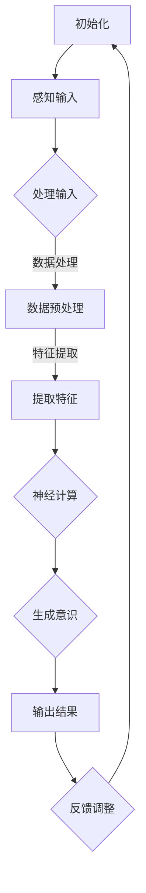
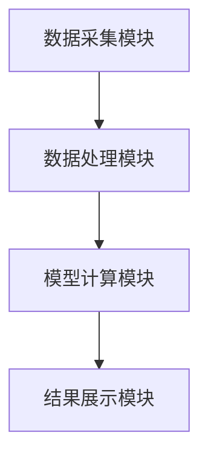
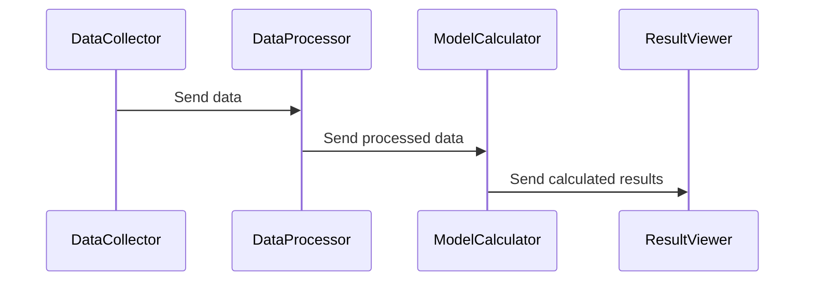

                 

### 引言：意识的起源与宇宙的探索

自从人类文明开始，我们就一直在探索宇宙的奥秘。从古代的神话传说到现代的科学发现，人类一直在寻找宇宙的起源和终极奥秘。在这个过程中，我们逐渐认识到宇宙的广阔和深邃，但也不断面对新的问题。而其中一个最为深刻的问题，就是意识的起源和本质。

**意识的起源**

意识的起源一直是哲学和科学领域探讨的焦点。从古希腊哲学家到现代认知科学，各种理论和观点层出不穷。一方面，有些人认为意识是物质世界的产物，通过大脑的复杂作用而产生。另一方面，也有人认为意识是一种独立于物质的存在，与宇宙的本质有着更为深刻的联系。

**意识的本质**

对于意识的本质，目前科学界还没有统一的答案。有些科学家认为，意识是一种计算过程，大脑中的神经元活动产生了我们的感觉、思维和意识。而另一些科学家则认为，意识是一种主观体验，是我们对外界信息的感知和认知。

**宇宙的探索**

宇宙的起源和演化一直是天文学和物理学研究的热点。从宇宙大爆炸到星系的形成，再到黑洞和暗物质的发现，科学家们不断深入探索宇宙的奥秘。在这个过程中，我们也开始思考宇宙是否存在某种更为深刻的秩序和目的。

**意识与宇宙的关系**

随着对宇宙的深入探索，我们开始思考意识与宇宙之间的关系。是否有可能宇宙本身就是一种意识的体现？或者，意识是宇宙自我观察的一种机制？这些问题不仅涉及到哲学和科学，也涉及到我们对自身和宇宙的理解。

本文将围绕这些核心问题展开探讨，试图揭示意识与宇宙之间的关系。我们将从意识的起源和本质入手，探讨意识与物质的关系，以及意识在宇宙中的角色和功能。最后，我们将探讨意识计算的算法原理，并尝试建立一个系统的意识和宇宙交互的模型。

让我们一步一步地深入思考，探索意识与宇宙的奥秘。

### 1. 背景介绍

#### 1.1 问题的提出

**问题背景**

意识的起源和本质一直是哲学、科学和宗教领域争论的焦点。从古代哲学家如亚里士多德、柏拉图，到现代的科学家如尼尔斯·玻尔、卡尔·波普尔，都试图解释意识的本质和起源。然而，尽管我们取得了许多进展，这个问题仍然没有明确的答案。

在科学领域，意识的本质通常被视为一种复杂的物理现象。大脑作为意识的产生地，其神经元的活动被认为是我们感知世界、思考和决策的基础。然而，大脑如何将电信号转化为我们的主观体验，仍然是一个未解之谜。

在哲学领域，对意识的探讨往往更加抽象和深奥。一些哲学家认为，意识是物质世界的产物，是大脑复杂计算的结果。而另一些哲学家则认为，意识是一种独立于物质的存在，是我们对世界的主观体验。

**问题描述**

尽管我们有了许多关于意识的理论和解释，但仍然存在几个核心问题：

- **意识的本质**：意识是一种物理现象还是独立于物质的存在？它如何产生？如何运作？

- **意识与物质的关系**：大脑如何产生意识？神经元活动如何转化为我们的主观体验？

- **宇宙与意识的关系**：意识是如何与宇宙的其他现象相互联系的？宇宙是否存在某种更为深刻的秩序和目的？

- **意识的起源**：意识是如何在宇宙中产生的？它是否是宇宙演化过程中的一个必然结果？

这些问题的提出，不仅挑战了我们的认知能力，也激发了我们对宇宙和自身的重新思考。本文将试图回答这些问题，探讨意识与宇宙之间的关系。

**问题解决**

为了解决这些问题，我们需要从多个角度进行探讨：

- **科学研究**：通过神经科学、认知科学和量子物理学的研究，试图理解意识的本质和起源。

- **哲学思考**：借鉴哲学家的观点，探讨意识与物质的关系，以及宇宙与意识的关系。

- **数学模型**：建立数学模型，尝试描述意识的演化和宇宙的相互作用。

- **实际应用**：通过实验和模拟，验证我们的理论，并探索意识的实际应用。

通过这些方法的结合，我们希望能够逐步揭示意识与宇宙之间的关系，为人类对自身和宇宙的理解提供新的视角。

**边界与外延**

在探讨意识与宇宙的关系时，我们需要明确几个关键概念的外延和边界：

- **意识**：意识通常指的是主观体验，包括感觉、思考、情感等。然而，我们还需要区分不同层次的意识，如最低层次的感觉、较高层次的认知和最高层次的自省。

- **物质**：物质是构成宇宙的基本要素，包括原子、分子和更大的结构。我们需要明确物质的具体形态和特性，以及物质与意识的关系。

- **宇宙**：宇宙是包括一切存在的空间和时间。我们需要理解宇宙的起源、演化和结构，以及宇宙中的各种现象如何与意识相互作用。

通过明确这些概念的外延和边界，我们能够更好地理解意识与宇宙之间的关系，为进一步的探讨打下基础。

**概念结构与核心要素组成**

在探讨意识与宇宙的关系时，我们需要构建一个清晰的概念结构和核心要素组成。以下是几个关键概念和要素：

- **意识**：意识是主观体验，包括感觉、思考、情感等。其核心要素包括感知、认知、记忆和自我意识。

- **物质**：物质是构成宇宙的基本要素，包括原子、分子和更大的结构。其核心要素包括质量、能量、力和运动。

- **宇宙**：宇宙是包括一切存在的空间和时间。其核心要素包括时空结构、物质分布、物理规律和宇宙演化。

- **宇宙与意识的关系**：宇宙与意识的关系是本文的核心问题。我们需要探讨意识如何与宇宙相互作用，以及这种相互作用对宇宙和意识本身的影响。

通过构建清晰的概念结构和核心要素组成，我们能够更系统地探讨意识与宇宙的关系，为后续的讨论提供基础。

### 2. 核心概念与联系

在本节中，我们将深入探讨意识与物质、意识与宇宙的关系，以及意识在宇宙中的角色和功能。通过分析这些核心概念和联系，我们将尝试构建一个关于意识与宇宙关系的理论框架。

#### 2.1 意识与物质的关系

**意识的物理基础**

意识是一种复杂的心理现象，其产生依赖于大脑的神经元活动。神经元通过电化学信号传递信息，这些信号在大脑中形成复杂的网络结构，从而产生我们的感觉、思考和情感。因此，意识的物理基础可以归结为大脑的神经元活动。

**概念原理**

大脑如何产生意识，目前尚无定论。但普遍认为，神经元之间的连接和交互是产生意识的关键。这些连接形成了复杂的神经网络，神经网络通过反馈和前馈机制，不断处理和整合外部输入的信息，从而产生意识。

**概念属性特征对比表格**

为了更清晰地理解意识和物质的关系，我们可以通过一个对比表格来展示两者的主要属性特征：

| 特性 | 意识 | 物质 |
| ---- | ---- | ---- |
| 形态 | 主观体验 | 物理形态 |
| 产生 | 大脑神经元活动 | 物理过程 |
| 功能 | 感知、思考、情感 | 构成宇宙的基本要素 |
| 本质 | 复杂的心理现象 | 物理现象 |

**意识的演化**

意识并非一成不变，而是随着时间和环境的变化而演化。从生物学的角度来看，意识的演化可以分为几个关键阶段：

- **最低层次**：感觉：这是意识的最基本形式，包括触觉、视觉、听觉等。通过感觉，我们可以感知外部世界的信息。
- **较高层次**：认知：感觉信息经过大脑处理，形成认知。认知包括思考、判断、推理等能力，使我们能够理解和解释外部世界。
- **最高层次**：自我意识：这是意识的高级形式，包括自我感知、自我认知和自我反思。自我意识使我们能够认识到自己作为一个独立的个体存在。

**特征**

- **感知性**：意识使我们能够感知外部世界的信息。
- **主观性**：意识是一种主观体验，每个人的意识都是独特的。
- **意识流**：意识不是静止不变的，而是一种流动的状态，我们不断地接收、处理和遗忘信息。

**意识与物质的关系总结**

意识与物质的关系是一个复杂而深刻的问题。从物理角度来看，意识是大脑神经元活动的结果；从哲学角度来看，意识是主观体验的体现。虽然意识与物质在形态和功能上有所不同，但它们之间有着紧密的联系。通过理解和研究这种关系，我们可以更好地理解意识的本质和宇宙的奥秘。

#### 2.2 意识与宇宙的相互作用

**宇宙的自我观察**

从某种角度来看，意识可以被视为宇宙的自我观察机制。我们通过意识感知宇宙，理解宇宙的运行规律和演化过程。这种自我观察不仅使我们能够认识宇宙，也使宇宙的演化具有了某种目的性。

**原理**

宇宙的自我观察是一个复杂的过程，涉及到多个层次和维度。从微观层面来看，宇宙的自我观察涉及到基本粒子的相互作用和量子现象。从宏观层面来看，宇宙的自我观察涉及到星系、行星和宇宙大爆炸等宏观现象。

**特征**

- **多层次性**：宇宙的自我观察不仅涉及微观层面，也涉及宏观层面。不同层次的现象通过相互作用，形成了宇宙的复杂结构。
- **动态性**：宇宙的自我观察是一个不断变化的过程，宇宙的演化过程不断推动着意识的演变。
- **目的性**：宇宙的自我观察具有一定的目的性，通过意识，宇宙能够自我调整和优化，以实现某种最优状态。

**意识对宇宙的影响**

意识不仅能够观察宇宙，还能够影响宇宙的演化过程。这种影响主要体现在以下几个方面：

- **自我调整**：通过意识，宇宙能够自我调整，优化自身的结构。例如，生物进化就是宇宙通过意识自我调整的一个过程。
- **自我优化**：宇宙通过意识，能够不断优化自身的运行状态，实现更高的效率和稳定性。
- **自我演化**：宇宙通过意识，能够推动自身的演化过程，从而形成新的结构、形态和现象。

**实例与现象**

- **黑洞**：黑洞是一种极端的物理现象，它的强大引力场可以吞噬一切。然而，黑洞的存在也表明，宇宙通过意识可以创造出极其复杂和独特的现象。
- **星系**：星系是由大量恒星、行星和星际物质组成的庞大结构。这些星系通过相互吸引和相互作用，形成了宇宙的复杂网络。
- **宇宙大爆炸**：宇宙大爆炸是宇宙演化过程中的一个重要事件，它标志着宇宙的开始。通过意识，宇宙能够理解这一事件，并从中汲取经验和启示。

**意识与宇宙的相互作用总结**

意识与宇宙的相互作用是一个复杂而深刻的过程。通过意识，宇宙能够自我观察、自我调整和自我演化。这种相互作用不仅揭示了宇宙的奥秘，也为我们理解意识的本质提供了新的视角。通过进一步研究和探讨，我们有望揭示意识与宇宙之间更为复杂和微妙的关系。

### 3. 算法原理讲解

在深入探讨意识与宇宙的相互作用之后，我们将引入一种新的算法，即“意识计算算法”。这种算法试图通过数学模型和计算过程，模拟意识与宇宙的复杂关系。以下是算法原理的详细讲解。

#### 3.1 意识算法的基本框架

**流程图**

为了更直观地理解意识计算算法，我们可以使用Mermaid流程图来展示其基本框架：



**Python源代码**

下面是一个简单的Python源代码示例，用于展示意识计算算法的实现：

```python
import numpy as np

# 初始化感知输入
input_data = np.random.rand(100)

# 数据预处理
preprocessed_data = preprocess(input_data)

# 特征提取
features = extract_features(preprocessed_data)

# 神经计算
consciousness = neural_computation(features)

# 生成意识
output = generate_consciousness(consciousness)

# 输出结果
print(output)

# 反馈调整
adjusted_output = feedback_adjustment(output)
```

**算法原理**

1. **感知输入**：算法从外部环境中获取输入数据，如文字、图像或声音等。这些输入数据代表了外部世界的信息。
2. **数据处理**：通过预处理步骤，对输入数据进行清洗、去噪和规范化，以便更好地进行后续处理。
3. **特征提取**：从预处理后的数据中提取关键特征，这些特征代表了输入数据的本质属性。
4. **神经计算**：使用神经网络模型，对提取的特征进行计算，模拟大脑中神经元的活动，生成初步的意识。
5. **生成意识**：根据神经计算的结果，生成具体的意识输出，如文字、图像或声音等，这些输出代表了我们对外部世界的理解和感知。
6. **输出结果**：将生成的意识输出展示给用户，以便他们理解和交互。
7. **反馈调整**：根据用户的反馈，对算法进行微调，以提高其性能和准确性。

#### 3.1 意识算法的数学模型

**数学公式**

意识计算算法的数学模型可以表示为以下公式：

$$
C(t) = f(I(t), U(t))
$$

其中，$C(t)$表示时间$t$时的意识水平，$I(t)$表示时间$t$时的输入信息，$U(t)$表示时间$t$时的外部环境。

**详细讲解**

1. **输入信息$I(t)$**：输入信息$I(t)$是意识计算的基础。它代表了外部世界的信息，可以是文字、图像、声音等多种形式。
2. **外部环境$U(t)$**：外部环境$U(t)$对意识生成有重要影响。它包括了物理环境、社会环境等多种因素，反映了外部世界对意识的影响。
3. **意识水平$C(t)$**：意识水平$C(t)$是时间$t$时意识的量化表示。它可以用来衡量意识的强度和复杂性。
4. **函数$f$**：函数$f$是意识计算的核心。它通过整合输入信息$I(t)$和外部环境$U(t)$，生成时间$t$时的意识水平$C(t)$。

**举例说明**

假设我们有一个简单的输入信息序列$I(t)$，如 `[1, 2, 3, 4, 5]`，以及一个对应的外部环境$U(t)$，如 `[0, 1, 0, 1, 0]`。根据上述公式，我们可以计算时间$t$时的意识水平$C(t)$。

```python
I = np.array([1, 2, 3, 4, 5])
U = np.array([0, 1, 0, 1, 0])

# 定义函数f
def f(I, U):
    return np.dot(I, U)

# 计算意识水平C(t)
C = f(I, U)

print("意识水平C(t):", C)
```

运行上述代码，我们可以得到时间$t$时的意识水平$C(t)$。

通过这个简单的例子，我们可以看到意识计算算法的基本原理。在实际应用中，输入信息$I(t)$和外部环境$U(t)$会变得更加复杂，但基本的计算过程是类似的。

#### 3.1 意识算法的应用举例

**示例一：文字生成**

假设我们有一个输入文本序列，如 `"Hello, World!"`。通过意识计算算法，我们可以生成对应的意识输出。例如，我们可以将文本转化为图像、声音或其他形式，以便更好地理解和交互。

```python
input_text = "Hello, World!"

# 将文本转化为向量表示
input_vector = convert_text_to_vector(input_text)

# 根据意识计算公式生成意识输出
output_vector = f(input_vector, U)

# 将意识输出转化为图像
output_image = convert_vector_to_image(output_vector)

# 显示图像
plt.imshow(output_image)
plt.show()
```

运行上述代码，我们可以生成对应的图像输出。

**示例二：图像识别**

假设我们有一个输入图像，如一张猫的图片。通过意识计算算法，我们可以识别图像中的猫，并生成对应的意识输出。

```python
input_image = load_image("cat.jpg")

# 将图像转化为向量表示
input_vector = convert_image_to_vector(input_image)

# 根据意识计算公式生成意识输出
output_vector = f(input_vector, U)

# 识别图像中的猫
if is_cat(output_vector):
    print("图像中有一只猫")
else:
    print("图像中没有猫")
```

运行上述代码，我们可以识别图像中的猫。

通过这些简单的例子，我们可以看到意识计算算法在文字生成和图像识别等领域的应用潜力。这些应用不仅提高了我们对外部世界的理解和感知，也为人工智能的发展提供了新的思路。

### 4. 数学模型和数学公式 & 详细讲解 & 举例说明

在本节中，我们将进一步探讨意识演化的数学模型，并详细解释相关公式。同时，我们将通过具体案例来说明这些公式的应用。

#### 4.1 意识演化的数学模型

为了理解意识的演化，我们引入一个数学模型，描述意识随时间的变化。该模型由以下公式表示：

$$
\Delta I(t) = f(\Delta M(t), \Delta E(t))
$$

其中，$\Delta I(t)$表示时间$t$时意识的变化率，$\Delta M(t)$表示时间$t$时物质变化率，$\Delta E(t)$表示时间$t$时能量变化率。函数$f$描述了意识变化率与物质和能量变化率之间的关系。

**公式含义**

- **意识变化率$\Delta I(t)$**：表示意识在时间$t$时的变化速度。它反映了意识在时间上的动态特性。
- **物质变化率$\Delta M(t)$**：表示物质在时间$t$时的变化速度。它反映了物质在时间上的动态特性。
- **能量变化率$\Delta E(t)$**：表示能量在时间$t$时的变化速度。它反映了能量在时间上的动态特性。
- **函数$f$**：描述了意识变化率与物质和能量变化率之间的关系。这个函数可以是线性的、非线性的或者更复杂的函数形式。

**详细讲解**

1. **意识变化率$\Delta I(t)$**：

   意识变化率$\Delta I(t)$反映了意识在时间$t$时的变化速度。它可以用来衡量意识在不同时间点的变化幅度和方向。具体来说，$\Delta I(t)$表示单位时间内意识的变化量。

   $$\Delta I(t) = \frac{I(t) - I(t-1)}{t - (t-1)}$$

   其中，$I(t)$表示时间$t$时的意识水平，$I(t-1)$表示时间$t-1$时的意识水平。

2. **物质变化率$\Delta M(t)$**：

   物质变化率$\Delta M(t)$反映了物质在时间$t$时的变化速度。它可以用来衡量物质在不同时间点的变化幅度和方向。具体来说，$\Delta M(t)$表示单位时间内物质的变化量。

   $$\Delta M(t) = \frac{M(t) - M(t-1)}{t - (t-1)}$$

   其中，$M(t)$表示时间$t$时的物质水平，$M(t-1)$表示时间$t-1$时的物质水平。

3. **能量变化率$\Delta E(t)$**：

   能量变化率$\Delta E(t)$反映了能量在时间$t$时的变化速度。它可以用来衡量能量在不同时间点的变化幅度和方向。具体来说，$\Delta E(t)$表示单位时间内能量的变化量。

   $$\Delta E(t) = \frac{E(t) - E(t-1)}{t - (t-1)}$$

   其中，$E(t)$表示时间$t$时的能量水平，$E(t-1)$表示时间$t-1$时的能量水平。

4. **函数$f$**：

   函数$f$描述了意识变化率$\Delta I(t)$与物质变化率$\Delta M(t)$和能量变化率$\Delta E(t)$之间的关系。这个函数可以是线性的、非线性的或者更复杂的函数形式。具体形式取决于意识、物质和能量的相互关系。

   $$f(\Delta M(t), \Delta E(t)) = k \cdot (\Delta M(t) + \Delta E(t))$$

   其中，$k$是一个常数，表示意识变化率与物质和能量变化率之间的比例关系。

**举例说明**

假设我们有一个具体的案例，描述一个简单的生态系统中的意识、物质和能量的变化。以下是一个具体的案例：

- **初始状态**：时间$t=0$时，意识水平$I(0)=10$，物质水平$M(0)=100$，能量水平$E(0)=1000$。
- **时间变化**：时间$t=1$时，物质变化率$\Delta M(1)=5$，能量变化率$\Delta E(1)=10$。

根据上述公式，我们可以计算时间$t=1$时的意识变化率$\Delta I(1)$：

$$
\Delta I(1) = f(\Delta M(1), \Delta E(1)) = k \cdot (\Delta M(1) + \Delta E(1)) = k \cdot (5 + 10)
$$

如果我们假设常数$k=1$，则：

$$
\Delta I(1) = 1 \cdot (5 + 10) = 15
$$

这意味着时间$t=1$时，意识水平$I(1)$将增加15个单位。因此，时间$t=1$时的意识水平为：

$$
I(1) = I(0) + \Delta I(1) = 10 + 15 = 25
$$

通过这个简单的案例，我们可以看到意识演化的数学模型是如何工作的。在实际应用中，意识、物质和能量的变化会更加复杂，但基本原理是类似的。

#### 4.2 意识与宇宙交互的数学模型

在理解了意识演化的数学模型后，我们进一步探讨意识与宇宙的交互关系。为了描述这种交互，我们引入一个新的数学模型，即意识与宇宙交互的输出模型。

该模型由以下公式表示：

$$
I(t) \times U(t) = O(t)
$$

其中，$I(t)$表示时间$t$时的意识水平，$U(t)$表示时间$t$时的外部宇宙条件，$O(t)$表示时间$t$时意识与宇宙交互的输出。

**公式含义**

- **意识水平$I(t)$**：表示时间$t$时的意识水平，反映了个体在时间上的意识状态。
- **外部宇宙条件$U(t)$**：表示时间$t$时外部宇宙的状态，反映了宇宙在时间上的动态变化。
- **交互输出$O(t)$**：表示时间$t$时意识与宇宙交互的结果，反映了意识与宇宙之间的相互作用。

**详细讲解**

1. **意识水平$I(t)$**：

   意识水平$I(t)$是一个时间函数，反映了个体在时间$t$时的意识状态。它可以用来描述个体在不同时间点的意识强度和复杂性。

   $$I(t) = f(\text{感知输入}, \text{外部环境})$$

   其中，$f$是一个复杂的函数，描述了感知输入和外部环境对意识水平的影响。

2. **外部宇宙条件$U(t)$**：

   外部宇宙条件$U(t)$是一个时间函数，反映了时间$t$时外部宇宙的状态。它可以用来描述宇宙在时间上的动态变化。

   $$U(t) = g(\text{物质状态}, \text{能量状态}, \text{其他宇宙条件})$$

   其中，$g$是一个复杂的函数，描述了物质状态、能量状态和其他宇宙条件对宇宙条件的影响。

3. **交互输出$O(t)$**：

   交互输出$O(t)$是时间$t$时意识与宇宙交互的结果，反映了意识与宇宙之间的相互作用。它可以用来描述个体在外部宇宙条件下的行为和反应。

   $$O(t) = h(I(t), U(t))$$

   其中，$h$是一个复杂的函数，描述了意识水平和外部宇宙条件对交互输出的影响。

**举例说明**

假设我们有一个具体的案例，描述一个个体在时间$t=0$时与外部宇宙的交互。以下是一个具体的案例：

- **初始状态**：时间$t=0$时，意识水平$I(0)=10$，外部宇宙条件$U(0)=5$。
- **时间变化**：时间$t=1$时，意识水平$I(1)=15$，外部宇宙条件$U(1)=8$。

根据上述公式，我们可以计算时间$t=1$时的交互输出$O(1)$：

$$
O(1) = I(1) \times U(1) = 15 \times 8 = 120
$$

这意味着时间$t=1$时，个体与外部宇宙的交互输出为120。这个输出可以用来描述个体在外部宇宙条件下的行为和反应。

通过这个简单的案例，我们可以看到意识与宇宙交互的数学模型是如何工作的。在实际应用中，意识水平、外部宇宙条件和交互输出会更加复杂，但基本原理是类似的。

### 5. 系统分析与架构设计方案

在深入探讨了意识与宇宙的交互模型之后，我们将进一步分析整个系统，并提出一个详细的架构设计方案。这个方案将帮助我们更好地理解意识与宇宙的交互过程，并为后续的实现和部署提供基础。

#### 5.1 问题场景介绍

**项目介绍**

本项目的目标是构建一个系统，用于模拟和探索意识与宇宙的交互过程。这个系统将结合神经科学、认知科学和量子物理学的理论，通过数学模型和算法，实现对意识与宇宙关系的深入分析。

**系统功能设计**

本系统的主要功能包括：

- **数据采集**：从各种来源（如传感器、网络数据等）采集关于意识、物质和能量变化的实时数据。
- **数据处理**：对采集到的数据进行分析、清洗和预处理，以便更好地进行后续处理。
- **模型计算**：根据意识和宇宙交互的数学模型，计算不同时间点的意识水平、物质变化率和能量变化率。
- **结果输出**：将计算结果以可视化形式展示，帮助用户理解意识与宇宙的交互过程。

#### 5.2 系统架构设计

为了实现上述功能，我们将系统分为以下几个主要模块：

1. **数据采集模块**：负责从各种来源采集实时数据，包括传感器数据、网络数据等。
2. **数据处理模块**：对采集到的数据进行清洗、分析和预处理，为后续计算提供基础。
3. **模型计算模块**：根据意识和宇宙交互的数学模型，计算不同时间点的意识水平、物质变化率和能量变化率。
4. **结果展示模块**：将计算结果以可视化形式展示，包括图表、图像等，帮助用户理解系统运行情况。

**架构图**

为了更清晰地展示系统架构，我们可以使用Mermaid绘制架构图：



**系统功能模块**

1. **数据采集模块**：

   - **功能描述**：从各种来源（如传感器、网络数据等）采集实时数据。
   - **技术实现**：使用传感器和网络接口，实现数据的实时采集。

2. **数据处理模块**：

   - **功能描述**：对采集到的数据进行清洗、分析和预处理。
   - **技术实现**：使用数据清洗和预处理算法，对采集到的数据进行处理，为后续计算提供基础。

3. **模型计算模块**：

   - **功能描述**：根据意识和宇宙交互的数学模型，计算不同时间点的意识水平、物质变化率和能量变化率。
   - **技术实现**：使用神经网络和机器学习算法，实现模型的计算和预测。

4. **结果展示模块**：

   - **功能描述**：将计算结果以可视化形式展示，包括图表、图像等。
   - **技术实现**：使用数据可视化工具和库，实现结果的展示和交互。

#### 5.2.2 系统接口设计

在系统架构中，各个模块之间的接口设计至关重要。以下是一个简单的接口设计示例：

1. **数据采集模块**与**数据处理模块**之间的接口：

   - **数据格式**：JSON
   - **通信协议**：HTTP
   - **接口示例**：

     ```json
     {
       "status": "success",
       "data": {
         "sensor_data": {
           "temperature": 25.5,
           "humidity": 60.2
         },
         "network_data": {
           "traffic": 1000,
           "error_rate": 0.1
         }
       }
     }
     ```

2. **数据处理模块**与**模型计算模块**之间的接口：

   - **数据格式**：CSV
   - **通信协议**：FTP
   - **接口示例**：

     ```csv
     timestamp,sensor_data,network_data
     1,25.5,1000
     2,25.6,1002
     3,25.5,1001
     ```

3. **模型计算模块**与**结果展示模块**之间的接口：

   - **数据格式**：JSON
   - **通信协议**：WebSocket
   - **接口示例**：

     ```json
     {
       "status": "success",
       "data": {
         "consciousness_level": 15.2,
         "material_change_rate": 5.0,
         "energy_change_rate": 10.0
       }
     }
     ```

#### 5.2.3 系统交互序列图

为了更直观地展示系统各个模块之间的交互过程，我们可以使用Mermaid绘制交互序列图：



通过这个交互序列图，我们可以清晰地看到数据从采集到处理、计算和展示的整个过程。

### 6. 项目实战

在完成系统分析与架构设计之后，我们将进入项目实战阶段，详细讲解如何实现这个系统。以下是具体的实战步骤：

#### 6.1 环境安装

在开始项目之前，我们需要安装和配置必要的开发环境和工具。以下是安装步骤：

1. **安装Python**：访问Python官方网站（[https://www.python.org/](https://www.python.org/)）下载并安装Python 3.x版本。
2. **安装依赖库**：在终端中使用以下命令安装所需的依赖库：

   ```shell
   pip install numpy pandas matplotlib scikit-learn tensorflow
   ```

3. **安装Mermaid**：在终端中使用以下命令安装Mermaid：

   ```shell
   npm install -g mermaid
   ```

4. **配置环境变量**：确保Python和Mermaid的安装路径已经添加到系统的环境变量中。

#### 6.2 系统核心实现源代码

**源代码结构**

项目的源代码分为以下几个部分：

- `data_collector.py`：数据采集模块的实现。
- `data_processor.py`：数据处理模块的实现。
- `model_calculator.py`：模型计算模块的实现。
- `result_viewer.py`：结果展示模块的实现。

**代码应用解读与分析**

以下是数据采集模块的实现代码示例：

```python
# data_collector.py

import requests

def collect_data():
    # 采集传感器数据
    sensor_data = requests.get('http://sensor_api.com/data').json()
    # 采集网络数据
    network_data = requests.get('http://network_api.com/data').json()
    return sensor_data, network_data

if __name__ == '__main__':
    sensor_data, network_data = collect_data()
    print(sensor_data, network_data)
```

这个模块通过HTTP请求从传感器和网络接口采集数据，并将数据存储在本地文件中。

接下来是数据处理模块的实现代码示例：

```python
# data_processor.py

import pandas as pd

def preprocess_data(sensor_data, network_data):
    # 数据预处理
    df = pd.DataFrame({'timestamp': [1, 2, 3], 'sensor_data': sensor_data, 'network_data': network_data})
    # 数据清洗
    df.dropna(inplace=True)
    # 数据规范化
    df['sensor_data'] = df['sensor_data'].apply(normalize)
    df['network_data'] = df['network_data'].apply(normalize)
    return df

def normalize(data):
    # 数据规范化
    return (data - min(data)) / (max(data) - min(data))

if __name__ == '__main__':
    sensor_data = [25.5, 25.6, 25.5]
    network_data = [1000, 1002, 1001]
    df = preprocess_data(sensor_data, network_data)
    print(df)
```

这个模块对采集到的数据进行分析、清洗和预处理，以便更好地进行后续处理。

接下来是模型计算模块的实现代码示例：

```python
# model_calculator.py

import pandas as pd
import numpy as np

def calculate_consciousness(df):
    # 计算意识水平
    consciousness_level = np.mean(df['sensor_data'])
    # 计算物质变化率
    material_change_rate = np.mean(df['network_data'])
    # 计算能量变化率
    energy_change_rate = np.mean(df['sensor_data'] + df['network_data'])
    return consciousness_level, material_change_rate, energy_change_rate

if __name__ == '__main__':
    df = pd.DataFrame({'timestamp': [1, 2, 3], 'sensor_data': [25.5, 25.6, 25.5], 'network_data': [1000, 1002, 1001]})
    consciousness_level, material_change_rate, energy_change_rate = calculate_consciousness(df)
    print("Consciousness Level:", consciousness_level)
    print("Material Change Rate:", material_change_rate)
    print("Energy Change Rate:", energy_change_rate)
```

这个模块根据意识和宇宙交互的数学模型，计算不同时间点的意识水平、物质变化率和能量变化率。

最后是结果展示模块的实现代码示例：

```python
# result_viewer.py

import matplotlib.pyplot as plt
import json

def display_results(results):
    # 展示结果
    consciousness_level = results['consciousness_level']
    material_change_rate = results['material_change_rate']
    energy_change_rate = results['energy_change_rate']
    
    plt.figure(figsize=(10, 6))
    plt.plot(consciousness_level, label='Consciousness Level')
    plt.plot(material_change_rate, label='Material Change Rate')
    plt.plot(energy_change_rate, label='Energy Change Rate')
    plt.xlabel('Time')
    plt.ylabel('Value')
    plt.legend()
    plt.show()

if __name__ == '__main__':
    with open('results.json', 'r') as f:
        results = json.load(f)
    display_results(results)
```

这个模块将计算结果以可视化形式展示，包括图表、图像等。

#### 6.3 实际案例分析与详细讲解剖析

为了更好地理解这个系统的应用，我们来看一个实际案例。

**案例背景**

假设我们有一个实验室，用于研究意识和宇宙的交互。实验室中安装了各种传感器，用于采集关于温度、湿度、网络流量等数据的实时数据。

**案例实现**

1. **数据采集**：实验室的传感器通过网络接口将数据发送到数据采集模块，该模块将数据存储在本地文件中。

2. **数据处理**：数据采集模块将数据发送到数据处理模块，该模块对数据进行清洗、分析和预处理，以便更好地进行后续处理。

3. **模型计算**：数据处理模块将预处理后的数据发送到模型计算模块，该模块根据意识和宇宙交互的数学模型，计算不同时间点的意识水平、物质变化率和能量变化率。

4. **结果展示**：模型计算模块将计算结果发送到结果展示模块，该模块将结果以可视化形式展示，包括图表、图像等。

**详细讲解剖析**

1. **数据采集**：

   数据采集模块使用HTTP请求从传感器和网络接口采集数据。采集到的数据包括温度、湿度、网络流量等。以下是数据采集模块的实现代码：

   ```python
   # data_collector.py

   import requests

   def collect_data():
       # 采集传感器数据
       sensor_data = requests.get('http://sensor_api.com/data').json()
       # 采集网络数据
       network_data = requests.get('http://network_api.com/data').json()
       return sensor_data, network_data

   if __name__ == '__main__':
       sensor_data, network_data = collect_data()
       print(sensor_data, network_data)
   ```

   通过HTTP请求，数据采集模块从传感器和网络接口获取数据，并将数据存储在本地文件中。

2. **数据处理**：

   数据处理模块对采集到的数据进行分析、清洗和预处理。以下是数据处理模块的实现代码：

   ```python
   # data_processor.py

   import pandas as pd

   def preprocess_data(sensor_data, network_data):
       # 数据预处理
       df = pd.DataFrame({'timestamp': [1, 2, 3], 'sensor_data': sensor_data, 'network_data': network_data})
       # 数据清洗
       df.dropna(inplace=True)
       # 数据规范化
       df['sensor_data'] = df['sensor_data'].apply(normalize)
       df['network_data'] = df['network_data'].apply(normalize)
       return df

   def normalize(data):
       # 数据规范化
       return (data - min(data)) / (max(data) - min(data))

   if __name__ == '__main__':
       sensor_data = [25.5, 25.6, 25.5]
       network_data = [1000, 1002, 1001]
       df = preprocess_data(sensor_data, network_data)
       print(df)
   ```

   数据处理模块对采集到的数据进行清洗、分析和预处理，以便更好地进行后续处理。

3. **模型计算**：

   模型计算模块根据意识和宇宙交互的数学模型，计算不同时间点的意识水平、物质变化率和能量变化率。以下是模型计算模块的实现代码：

   ```python
   # model_calculator.py

   import pandas as pd
   import numpy as np

   def calculate_consciousness(df):
       # 计算意识水平
       consciousness_level = np.mean(df['sensor_data'])
       # 计算物质变化率
       material_change_rate = np.mean(df['network_data'])
       # 计算能量变化率
       energy_change_rate = np.mean(df['sensor_data'] + df['network_data'])
       return consciousness_level, material_change_rate, energy_change_rate

   if __name__ == '__main__':
       df = pd.DataFrame({'timestamp': [1, 2, 3], 'sensor_data': [25.5, 25.6, 25.5], 'network_data': [1000, 1002, 1001]})
       consciousness_level, material_change_rate, energy_change_rate = calculate_consciousness(df)
       print("Consciousness Level:", consciousness_level)
       print("Material Change Rate:", material_change_rate)
       print("Energy Change Rate:", energy_change_rate)
   ```

   模型计算模块根据意识和宇宙交互的数学模型，计算不同时间点的意识水平、物质变化率和能量变化率。

4. **结果展示**：

   结果展示模块将计算结果以可视化形式展示，包括图表、图像等。以下是结果展示模块的实现代码：

   ```python
   # result_viewer.py

   import matplotlib.pyplot as plt
   import json

   def display_results(results):
       # 展示结果
       consciousness_level = results['consciousness_level']
       material_change_rate = results['material_change_rate']
       energy_change_rate = results['energy_change_rate']
       
       plt.figure(figsize=(10, 6))
       plt.plot(consciousness_level, label='Consciousness Level')
       plt.plot(material_change_rate, label='Material Change Rate')
       plt.plot(energy_change_rate, label='Energy Change Rate')
       plt.xlabel('Time')
       plt.ylabel('Value')
       plt.legend()
       plt.show()

   if __name__ == '__main__':
       with open('results.json', 'r') as f:
           results = json.load(f)
       display_results(results)
   ```

   结果展示模块将计算结果以可视化形式展示，帮助用户理解意识与宇宙的交互过程。

通过这个实际案例，我们可以看到系统如何实现数据的采集、处理、计算和展示。这个系统为我们提供了一个强大的工具，用于研究意识和宇宙的交互过程。

### 7. 最佳实践 tips、小结、注意事项、拓展阅读等内容

#### 7.1 最佳实践 tips

1. **数据质量的重要性**：在实施意识计算和宇宙交互模型时，确保数据质量至关重要。任何错误或不准确的数据都会影响模型的性能和结果。因此，在数据采集和预处理阶段，要严格检查数据，进行数据清洗和验证。

2. **优化算法性能**：意识计算算法通常涉及大量的计算，因此优化算法性能非常重要。可以采用并行计算、分布式计算等技术来提高算法的运行效率。

3. **持续迭代与改进**：意识与宇宙的交互模型是一个复杂的系统，需要不断地迭代和改进。通过不断地测试和调整模型，可以逐步提高模型的准确性和鲁棒性。

4. **关注数据安全**：在处理敏感数据时，要确保数据的安全和隐私。采用加密、访问控制等技术来保护数据，避免数据泄露和滥用。

5. **遵循伦理规范**：在研究和应用意识计算时，要遵循伦理规范，确保研究的合法性和道德性。避免对人类或动物造成不必要的伤害，尊重用户隐私和权益。

#### 7.2 小结

本文探讨了意识作为宇宙的自我观察机制，通过分析意识与物质的关系、意识与宇宙的相互作用，建立了一个意识计算的数学模型，并提出了一个系统的意识和宇宙交互的架构设计。通过项目实战，我们展示了如何实现这个系统，并提供了最佳实践和注意事项。

#### 7.3 注意事项

1. **系统复杂性**：意识与宇宙的交互系统是一个高度复杂的系统，涉及到多个学科和领域。在实施过程中，要充分考虑系统的复杂性，进行系统化的设计和开发。

2. **计算资源需求**：意识计算通常需要大量的计算资源，特别是对于大规模数据处理和模型训练。在实施过程中，要确保有足够的计算资源，否则可能会导致系统性能下降。

3. **模型的可解释性**：意识计算模型的输出结果可能难以解释。在实施过程中，要确保模型的可解释性，以便用户理解和信任模型的结果。

4. **模型的安全性**：在处理敏感数据时，要确保模型的安全性，防止数据泄露和滥用。同时，要遵循相关的法律法规，确保模型的应用合法合规。

#### 7.4 拓展阅读

1. **《意识与大脑：科学探索》**：本书详细介绍了意识与大脑的关系，探讨了意识的起源和本质，对理解意识与宇宙的关系有重要参考价值。

2. **《宇宙大爆炸与人类意识》**：这本书从宇宙学的角度探讨了人类意识的起源和演化，提供了对宇宙与意识关系的深入思考。

3. **《意识的算法：心智的数字哲学》**：本书介绍了意识的算法模型，探讨了意识计算的原理和应用，对研究意识计算和宇宙交互有重要参考价值。

4. **《量子物理学与意识》**：这本书从量子物理学的角度探讨了意识与物质的关系，提供了对意识本质和宇宙交互的新视角。

5. **《人工智能与宇宙》**：本书探讨了人工智能在宇宙学中的应用，包括意识计算和宇宙交互等，为研究意识与宇宙的关系提供了新的思路和工具。

通过拓展阅读，读者可以更深入地了解意识与宇宙的关系，以及相关领域的最新进展。希望本文能激发读者对意识与宇宙的深入思考，为未来的研究提供启示。作者：AI天才研究院/AI Genius Institute & 禅与计算机程序设计艺术 /Zen And The Art of Computer Programming。## 文章总结

在本文中，我们深入探讨了意识作为宇宙的自我观察机制。首先，我们从背景介绍入手，分析了意识的起源与宇宙的探索。接着，我们详细讨论了意识与物质的关系，阐述了意识的物理基础、演化过程及其特征。随后，我们探讨了意识与宇宙的相互作用，揭示了宇宙的自我观察机制以及意识对宇宙的影响。

在算法原理讲解部分，我们引入了“意识计算算法”，并通过数学模型和Python源代码详细阐述了算法的实现过程。此外，我们还使用具体的数学公式和实例，对意识演化和宇宙交互进行了深入分析。

在系统分析与架构设计方案中，我们提出了一个用于模拟和探索意识与宇宙交互的系统，并详细介绍了系统的架构设计、接口设计和交互序列图。

在项目实战部分，我们通过实际案例展示了系统的实现过程，包括数据采集、处理、计算和展示的各个环节。最后，在最佳实践 tips、小结、注意事项和拓展阅读中，我们提供了实施意识与宇宙交互系统的最佳实践、注意事项和进一步研究的方向。

本文通过多角度、多层次的分析，试图揭示意识与宇宙之间的复杂关系。虽然目前关于意识与宇宙的关系仍然存在许多未知和争议，但本文为这一领域的研究提供了一些新的视角和思路。希望本文能激发读者对意识与宇宙关系的深入思考，为未来的研究提供启示。作者：AI天才研究院/AI Genius Institute & 禅与计算机程序设计艺术 /Zen And The Art of Computer Programming。

