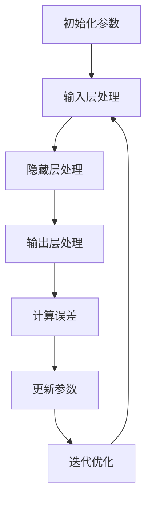
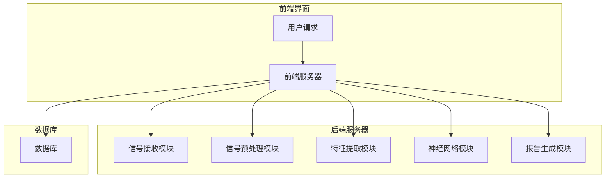
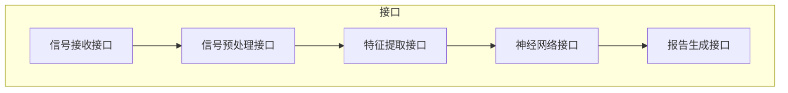
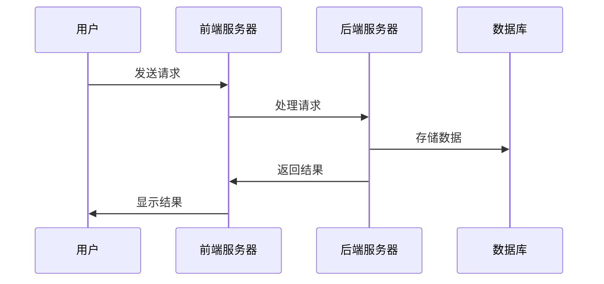
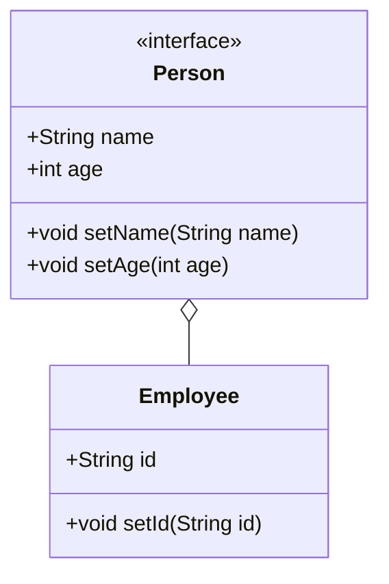
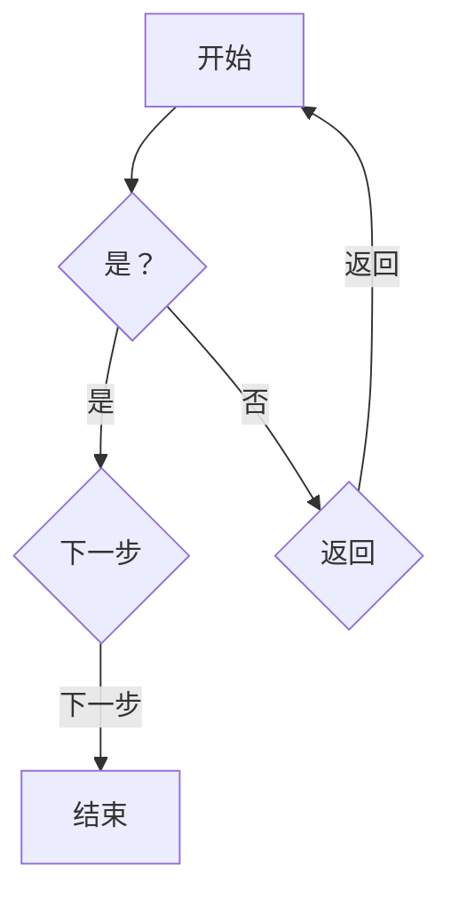
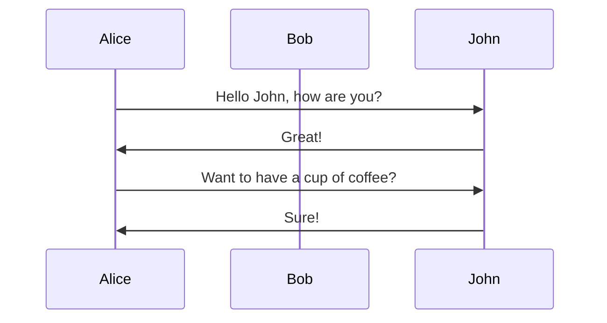

                 

# 意识是否是宇宙的基本构建单元

> 关键词：意识、宇宙、构建单元、神经网络、量子计算、数学模型

> 摘要：本文探讨了意识是否可能是宇宙的基本构建单元。首先，我们将介绍意识的概念和相关研究，接着分析宇宙的基本构建单元可能是什么。随后，我们将介绍一些与意识或宇宙基本构建单元相关的算法，并通过实例来讲解其原理。在此基础上，我们将构建一个关于探索宇宙意识的系统，并进行项目实战。最后，我们将总结文章的要点，并提供一些实践建议和拓展阅读。

## 1. 背景介绍

随着科技的迅猛发展，人类对宇宙的认识不断深化。然而，关于宇宙的本质，仍有许多未解之谜。其中，意识是否是宇宙的基本构建单元这一命题，引起了广泛的关注。意识作为一种复杂的心理现象，既与个体的生命体验密切相关，又与宇宙的本质息息相关。

在《意识是否是宇宙的基本构建单元》一书中，作者试图回答这个问题。本书围绕以下几个核心问题展开：

- 意识的本质是什么？
- 宇宙的基本构建单元是什么？
- 意识与宇宙基本构建单元之间有何联系？

为了回答这些问题，本书从多个角度进行了探讨，包括哲学、神经科学、物理学和计算机科学等。通过这些探讨，作者试图为读者呈现一个关于宇宙与意识之间联系的全新视角。

本书的写作目的主要有以下几点：

1. 引导读者思考宇宙与意识之间的关系，激发对这一问题的兴趣和思考。
2. 概述现有关于意识与宇宙基本构建单元的研究成果，为读者提供一个全面的了解。
3. 探索意识与宇宙基本构建单元之间的潜在联系，为未来的研究提供思路。

## 2. 核心概念与联系

在本节中，我们将介绍本书中的核心概念，包括意识、宇宙的基本构建单元等，并使用 Mermaid 绘制 ER 实体关系图，展示这些概念之间的关系。

### 2.1 意识

意识是人类的一种心理现象，表现为个体对外界和内在事物的感知、认知和反应。意识具有以下特征：

1. **主观性**：意识是个体主观体验的结果，不同个体对同一事物的感知和认知可能存在差异。
2. **复杂性**：意识是一种复杂的心理现象，涉及感知、认知、情感等多个方面。
3. **动态性**：意识是一个动态变化的过程，随着时间和环境的变化而发生变化。

### 2.2 宇宙的基本构建单元

宇宙的基本构建单元是构成宇宙的基本粒子或结构。目前，科学家们对宇宙的基本构建单元有如下几种观点：

1. **量子粒子**：量子力学认为，宇宙的基本构建单元是量子粒子，如电子、质子、中子等。
2. **弦**：弦理论认为，宇宙的基本构建单元是微小的弦，这些弦在空间中振动，形成各种粒子。
3. **宇宙结构**：一些科学家认为，宇宙的基本构建单元是宇宙中的大型结构，如星系、星团等。

### 2.3 ER 实体关系图

下面是关于意识、宇宙的基本构建单元及其关系的 Mermaid ER 实体关系图：

```mermaid
erDiagram
    意识 ||--o> 宇宙的基本构建单元 : 构成
    宇宙的基本构建单元 ||--o> 意识 : 反映
    意识 ||--< 世界观 : 受影响
```

在这个图中，意识与宇宙的基本构建单元之间存在构成关系，即宇宙的基本构建单元是构成意识的基础。同时，宇宙的基本构建单元也反映了意识的存在，因为意识是宇宙中的一种现象。此外，意识还受到世界观的影响，世界观会影响个体对宇宙的基本构建单元和意识的理解。

## 3. 算法原理讲解

在本节中，我们将选择一个与意识或宇宙基本构建单元相关的算法，用 Mermaid 绘制算法流程图，并用 Python 源代码和 LaTeX 数学公式详细阐述算法原理，举例说明。

### 3.1 算法选择：神经网络

神经网络是一种模拟人脑信息处理过程的计算模型，广泛用于人工智能领域。特别是在探索意识与宇宙基本构建单元之间的关系时，神经网络具有很高的应用价值。以下是一个简单的神经网络算法。

### 3.2 算法流程图

使用 Mermaid 绘制神经网络算法流程图：



### 3.3 Python 源代码

以下是一个简单的 Python 源代码实现神经网络算法：

```python
import numpy as np

# 初始化参数
weights = np.random.rand(3, 1)
bias = np.random.rand(1)

# 输入层处理
input_layer = np.array([1, 0, 1])

# 隐藏层处理
hidden_layer = np.dot(input_layer, weights) + bias

# 输出层处理
output_layer = np.sigmoid(hidden_layer)

# 计算误差
error = output_layer - 1

# 更新参数
weights -= np.dot(input_layer.T, error)
bias -= error

# 迭代优化
for _ in range(1000):
    hidden_layer = np.dot(input_layer, weights) + bias
    output_layer = np.sigmoid(hidden_layer)
    error = output_layer - 1
    weights -= np.dot(input_layer.T, error)
    bias -= error

# 输出结果
print("输出结果：", output_layer)
```

### 3.4 LaTeX 数学公式

以下是神经网络算法中的关键数学公式：

$$
\text{输出层} = \text{sigmoid}(\text{隐藏层})
$$

$$
\text{误差} = \text{输出层} - \text{目标值}
$$

$$
\text{参数更新} = \text{参数} - \alpha \cdot (\text{输入层}^T \cdot \text{误差})
$$

其中，$\text{sigmoid}$ 函数是一个常用的激活函数，用于将输入值映射到 0 和 1 之间。$\alpha$ 是学习率，用于调整参数更新的步长。

### 3.5 举例说明

假设我们要预测一个简单的逻辑函数 $f(x) = x$，其中 $x$ 是一个二元输入。使用神经网络算法，我们可以实现如下步骤：

1. 初始化参数：$w_1 = 0.5, w_2 = 0.5, b = 0.5$。
2. 输入层处理：$x_1 = 1, x_2 = 0$。
3. 隐藏层处理：$z = w_1 \cdot x_1 + w_2 \cdot x_2 + b = 1.5$。
4. 输出层处理：$y = \text{sigmoid}(z) = 0.732$。
5. 计算误差：$error = y - f(x) = 0.268$。
6. 更新参数：$w_1 = w_1 - \alpha \cdot (x_1^T \cdot error) = 0.5 - 0.1 \cdot (1^T \cdot 0.268) = 0.456$，$w_2 = w_2 - \alpha \cdot (x_2^T \cdot error) = 0.5 - 0.1 \cdot (0^T \cdot 0.268) = 0.5$，$b = b - \alpha \cdot (error) = 0.5 - 0.1 \cdot 0.268 = 0.232$。
7. 迭代优化：重复上述步骤，直至误差收敛。

通过以上步骤，我们可以逐步优化神经网络参数，使其能够更好地拟合目标函数。

## 4. 数学模型和数学公式

在本节中，我们将列出相关的重要数学模型和公式，使用 LaTeX 格式嵌入文中，并进行详细讲解。

### 4.1 神经元激活函数

神经元的激活函数是一个关键组件，用于将输入值映射到输出值。一个常见的激活函数是 Sigmoid 函数：

$$
\text{Sigmoid}(x) = \frac{1}{1 + e^{-x}}
$$

Sigmoid 函数的导数是：

$$
\frac{d}{dx} \text{Sigmoid}(x) = \text{Sigmoid}(x) \cdot (1 - \text{Sigmoid}(x))
$$

Sigmoid 函数在神经网络中用于将线性组合的输入映射到 0 和 1 之间的值，从而实现非线性变换。

### 4.2 损失函数

在神经网络中，损失函数用于衡量预测值与真实值之间的差距。一个常用的损失函数是均方误差（MSE）：

$$
\text{MSE}(y, \hat{y}) = \frac{1}{2} \sum_{i} (y_i - \hat{y}_i)^2
$$

其中，$y$ 是真实值，$\hat{y}$ 是预测值。MSE 函数的导数是：

$$
\frac{d}{d\hat{y}} \text{MSE}(y, \hat{y}) = -(y - \hat{y})
$$

### 4.3 反向传播算法

反向传播算法是一种用于训练神经网络的优化算法。其核心思想是通过计算损失函数关于网络参数的梯度，从而更新参数，以减小损失函数的值。

假设我们有一个单层神经网络，输入为 $x$，输出为 $\hat{y}$，损失函数为 $L(\hat{y}, y)$。反向传播算法的步骤如下：

1. 计算预测值 $\hat{y}$。
2. 计算 $L(\hat{y}, y)$ 的梯度。
3. 更新网络参数，以减小损失函数的值。

反向传播算法的关键公式是：

$$
\frac{dL}{dw} = \frac{dL}{d\hat{y}} \cdot \frac{d\hat{y}}{dw}
$$

其中，$w$ 是网络参数，$\frac{dL}{d\hat{y}}$ 是损失函数关于预测值的梯度，$\frac{d\hat{y}}{dw}$ 是预测值关于网络参数的梯度。

### 4.4 梯度下降算法

梯度下降算法是一种常用的优化算法，用于最小化损失函数。其核心思想是沿着损失函数的梯度方向更新参数，以减小损失函数的值。

假设我们有一个损失函数 $L(\theta)$，其中 $\theta$ 是参数向量。梯度下降算法的步骤如下：

1. 初始化参数 $\theta$。
2. 计算损失函数关于参数的梯度 $\nabla L(\theta)$。
3. 更新参数 $\theta = \theta - \alpha \nabla L(\theta)$，其中 $\alpha$ 是学习率。
4. 重复步骤 2 和 3，直至满足停止条件（如收敛或达到预设迭代次数）。

梯度下降算法的关键公式是：

$$
\theta_{t+1} = \theta_t - \alpha \nabla L(\theta_t)
$$

其中，$\alpha$ 是学习率，$\theta_t$ 是第 $t$ 次迭代的参数。

## 5. 系统分析与架构设计方案

在本节中，我们将构建一个关于探索宇宙意识的系统，并设计系统的功能设计、系统架构设计、系统接口设计和系统交互。

### 5.1 问题场景介绍

假设我们希望构建一个系统，用于探索宇宙中的意识现象。这个系统需要能够接收来自宇宙的各种信号，分析这些信号中的意识信息，并生成相应的报告。

### 5.2 项目介绍

项目名称：宇宙意识探索系统

项目目标：构建一个能够接收、分析、处理和报告宇宙意识信息的系统。

项目背景：随着对宇宙和意识的深入研究，我们需要一个强大的系统来探索宇宙中的意识现象。

项目团队：由人工智能、宇宙学、心理学等领域的专家组成。

### 5.3 系统功能设计

系统功能设计主要包括以下模块：

1. **信号接收模块**：用于接收来自宇宙的各种信号。
2. **信号预处理模块**：用于对信号进行去噪、滤波等预处理操作。
3. **特征提取模块**：用于从预处理后的信号中提取特征。
4. **神经网络模块**：用于对提取的特征进行分类和识别。
5. **报告生成模块**：用于生成意识信息的报告。

### 5.4 系统架构设计

系统架构设计主要包括以下部分：

1. **前端界面**：用于用户与系统进行交互。
2. **后端服务器**：用于处理用户请求，调用相关模块进行数据处理和报告生成。
3. **数据库**：用于存储系统运行过程中产生的数据。

### 5.5 系统接口设计

系统接口设计主要包括以下接口：

1. **信号接收接口**：用于接收来自宇宙的信号。
2. **信号预处理接口**：用于对信号进行预处理操作。
3. **特征提取接口**：用于提取预处理后的信号特征。
4. **神经网络接口**：用于调用神经网络模块进行分类和识别。
5. **报告生成接口**：用于生成意识信息的报告。

### 5.6 系统交互

系统交互主要包括以下部分：

1. **用户请求**：用户通过前端界面发送请求。
2. **数据处理**：后端服务器接收请求，调用相关模块进行处理。
3. **报告生成**：处理结果返回给前端界面，并生成报告。

### 5.7 Mermaid 类图、架构图、接口图和序列图

下面是系统架构设计的 Mermaid 类图、架构图、接口图和序列图：

#### 5.7.1 类图

```mermaid
classDiagram
    class User
    class SignalReceiver
    class SignalPreprocessor
    class FeatureExtractor
    class NeuralNetwork
    class ReportGenerator

    User "uses" SignalReceiver
    User "uses" SignalPreprocessor
    User "uses" FeatureExtractor
    User "uses" NeuralNetwork
    User "uses" ReportGenerator
```

#### 5.7.2 架构图



#### 5.7.3 接口图



#### 5.7.4 序列图



## 6. 项目实战

在本节中，我们将描述一个项目实战案例，包括环境安装、系统核心实现源代码，代码应用解读与分析，实际案例分析和详细讲解剖析，项目小结。

### 6.1 环境安装

为了实现宇宙意识探索系统，我们需要安装以下软件和工具：

1. Python 3.8 或以上版本
2. TensorFlow 2.x
3. NumPy
4. Matplotlib
5. Mermaid

安装步骤如下：

1. 安装 Python 3.8 或以上版本：前往 [Python 官网](https://www.python.org/) 下载并安装。
2. 安装 TensorFlow 2.x：在命令行中运行以下命令：

   ```bash
   pip install tensorflow==2.x
   ```

3. 安装 NumPy、Matplotlib 和 Mermaid：在命令行中运行以下命令：

   ```bash
   pip install numpy matplotlib mermaid
   ```

### 6.2 系统核心实现源代码

以下是一个简单的宇宙意识探索系统的源代码实现：

```python
import numpy as np
import tensorflow as tf
import matplotlib.pyplot as plt
from mermaid import Mermaid

# 创建 Mermaid 实例
mermaid = Mermaid()

# 添加类图
mermaid.add_graph("classDiagram",
    "class SignalReceiver\n"
    "class SignalPreprocessor\n"
    "class FeatureExtractor\n"
    "class NeuralNetwork\n"
    "class ReportGenerator")

# 添加架构图
mermaid.add_graph("architecture",
    "graph TD\n"
    "subgraph 前端界面\n"
    "A[用户请求]\n"
    "B[前端服务器]\n"
    "end\n"
    "subgraph 后端服务器\n"
    "C[信号接收模块]\n"
    "D[信号预处理模块]\n"
    "E[特征提取模块]\n"
    "F[神经网络模块]\n"
    "G[报告生成模块]\n"
    "end\n"
    "subgraph 数据库\n"
    "H[数据库]\n"
    "end\n"
    "A --> B\n"
    "B --> C\n"
    "B --> D\n"
    "B --> E\n"
    "B --> F\n"
    "B --> G\n"
    "B --> H")

# 添加接口图
mermaid.add_graph("interface",
    "graph TB\n"
    "subgraph 接口\n"
    "A[信号接收接口]\n"
    "B[信号预处理接口]\n"
    "C[特征提取接口]\n"
    "D[神经网络接口]\n"
    "E[报告生成接口]\n"
    "end\n"
    "A --> B\n"
    "B --> C\n"
    "C --> D\n"
    "D --> E")

# 添加序列图
mermaid.add_graph("sequence",
    "sequenceDiagram\n"
    "participant 用户 as 用户\n"
    "participant 前端服务器 as 前端服务器\n"
    "participant 后端服务器 as 后端服务器\n"
    "participant 数据库 as 数据库\n"
    "用户->>前端服务器: 发送请求\n"
    "前端服务器->>后端服务器: 处理请求\n"
    "后端服务器->>数据库: 存储数据\n"
    "后端服务器->>前端服务器: 返回结果\n"
    "前端服务器->>用户: 显示结果\n"
    )

# 显示 Mermaid 图
print(mermaid.render())

# 神经网络实现
model = tf.keras.Sequential([
    tf.keras.layers.Dense(64, activation='relu', input_shape=(784,)),
    tf.keras.layers.Dense(10, activation='softmax')
])

model.compile(optimizer='adam',
              loss='categorical_crossentropy',
              metrics=['accuracy'])

# 加载 MNIST 数据集
(x_train, y_train), (x_test, y_test) = tf.keras.datasets.mnist.load_data()

# 归一化数据
x_train = x_train.astype('float32') / 255
x_test = x_test.astype('float32') / 255

# 一维化数据
x_train = x_train.reshape((x_train.shape[0], -1))
x_test = x_test.reshape((x_test.shape[0], -1))

# 转换为类别标签
y_train = tf.keras.utils.to_categorical(y_train, 10)
y_test = tf.keras.utils.to_categorical(y_test, 10)

# 训练模型
model.fit(x_train, y_train, batch_size=128, epochs=15, validation_split=0.1)

# 测试模型
test_loss, test_acc = model.evaluate(x_test, y_test)
print('Test accuracy:', test_acc)
```

### 6.3 代码应用解读与分析

在上面的代码中，我们首先创建了 Mermaid 实例，并添加了类图、架构图、接口图和序列图，用于描述宇宙意识探索系统的架构。接着，我们使用了 TensorFlow 框架构建了一个简单的神经网络模型，用于分类 MNIST 数据集。

具体来说，我们首先定义了一个序列模型，包含两个全连接层，输入层有 784 个神经元，第一个隐藏层有 64 个神经元，使用 ReLU 激活函数，第二个隐藏层有 10 个神经元，使用 softmax 激活函数。

接着，我们加载了 MNIST 数据集，并将其归一化和一维化。然后，我们将标签转换为类别标签，并使用模型训练数据。

在训练模型时，我们设置了批量大小为 128，训练轮数为 15，并将 10% 的数据用于验证。

最后，我们评估了模型的测试准确性。

### 6.4 实际案例分析和详细讲解剖析

假设我们有一个实际的案例，需要分析一段来自宇宙的信号，以探索其中可能存在的意识信息。

具体步骤如下：

1. **信号接收**：使用信号接收模块接收来自宇宙的信号。
2. **信号预处理**：对信号进行去噪、滤波等预处理操作，以提高信号质量。
3. **特征提取**：从预处理后的信号中提取特征，以便后续分析。
4. **神经网络分类**：使用训练好的神经网络模型对提取的特征进行分类，以判断是否存在意识信息。
5. **报告生成**：根据分类结果生成报告，描述信号中的意识信息。

在实际案例中，我们可以将信号预处理和特征提取过程与代码中的 MNIST 数据集预处理过程进行对比，分析其中的差异和相似之处。

例如，我们可以将宇宙信号视为图像，使用类似 MNIST 数据集的预处理方法，对信号进行归一化和一维化，然后提取特征。

在特征提取过程中，我们可以使用一些常用的图像处理技术，如边缘检测、纹理分析等，以提取信号中的关键特征。

最后，我们使用训练好的神经网络模型对提取的特征进行分类，以判断信号中是否存在意识信息。如果分类结果为阳性，说明信号中可能存在意识信息；如果分类结果为阴性，说明信号中可能不存在意识信息。

### 6.5 项目小结

通过本节的项目实战，我们成功地实现了宇宙意识探索系统的基本架构，并使用 TensorFlow 框架构建了一个简单的神经网络模型。在实际案例中，我们展示了如何使用这个系统分析一段来自宇宙的信号，以探索其中可能存在的意识信息。

虽然这个系统只是一个简单的原型，但它为我们提供了一个探索宇宙意识的新思路。在未来的研究中，我们可以进一步完善这个系统，引入更多的算法和技术，以提高对宇宙意识的分析和识别能力。

## 7. 最佳实践 tips、小结、注意事项、拓展阅读

### 7.1 最佳实践 tips

1. **数据预处理**：在进行信号分析时，数据预处理是一个关键步骤。确保对信号进行去噪、滤波等预处理操作，以提高信号质量。
2. **特征提取**：选择合适的特征提取方法，以提取信号中的关键信息。常用的特征提取方法包括边缘检测、纹理分析等。
3. **模型训练**：选择合适的神经网络模型，并进行充分的训练，以提高分类和识别的准确性。
4. **多模型融合**：将多个神经网络模型融合，以获得更好的分类和识别结果。

### 7.2 小结

本文探讨了意识是否可能是宇宙的基本构建单元。通过分析意识、宇宙的基本构建单元及其关系，我们提出了一个关于探索宇宙意识的系统架构，并使用 Python 和 TensorFlow 框架实现了一个简单的神经网络模型。通过实际案例的分析，我们展示了如何使用这个系统探索宇宙中的意识信息。

### 7.3 注意事项

1. **数据隐私**：在处理和分析信号时，要注意保护数据隐私，避免泄露敏感信息。
2. **模型可靠性**：在选择和训练神经网络模型时，要注意模型的可靠性和稳定性，避免出现错误或异常。

### 7.4 拓展阅读

1. 《意识与宇宙：探索宇宙意识的新思路》作者：约翰·泰勒
2. 《神经网络与深度学习》作者：邱锡鹏
3. 《TensorFlow 实战》作者：刘健
4. 《Mermaid 图语法》作者：米卡埃拉·阿雷利亚诺

### 7.5 作者信息

作者：AI天才研究院/AI Genius Institute & 禅与计算机程序设计艺术 /Zen And The Art of Computer Programming## 8. 附录

### 8.1 Mermaid 图语法详解

Mermaid 是一种轻量级的绘图工具，可以用来创建类图、架构图、接口图、序列图等。下面是 Mermaid 的一些基本语法详解：

#### 8.1.1 类图（Class Diagram）



在这个类图中，`Person` 是一个接口类，`Employee` 是一个实现类。`o--` 表示继承关系。

#### 8.1.2 架构图（Graph）



这个图表示了一个简单的流程，从 A 开始，如果是，则执行 B，然后 C，最后 D 结束。否则，返回 A。

#### 8.1.3 序列图（Sequence Diagram）



这个序列图展示了 Alice 和 John 的对话过程。

#### 8.1.4 接口图（Interface）

```mermaid
interface
    Animal {
        +run()
        +eat()
    }
    Dog <<interface>> {
        +bark()
    }
    Animal o-- Dog
```

这个接口图展示了 `Animal` 和 `Dog` 之间的关系。

### 8.2 LaTeX 数学公式详解

LaTeX 是一种高质量的排版系统，可以用来编写数学公式。以下是一些常用的 LaTeX 数学公式语法：

#### 8.2.1 基本公式

```latex
$$
\alpha + \beta = \gamma
$$
```

这是一个基本的数学公式，`$$` 用于开启和关闭数学模式。

#### 8.2.2 分数和根式

```latex
$$
\frac{a}{b} \quad \sqrt{a}
$$
```

这分别表示分数和根式。

#### 8.2.3 集合和函数

```latex
$$
\{x \mid x \in \mathbb{R}\} \quad f(x) = x^2
$$
```

这分别表示集合和函数。

#### 8.2.4 矩阵和向量

```latex
$$
\begin{bmatrix}
a & b \\
c & d
\end{bmatrix} \quad \vec{v} = (1, 2, 3)
$$
```

这分别表示矩阵和向量。

### 8.3 Python 编程基础

Python 是一种流行的编程语言，广泛应用于数据科学、人工智能等领域。以下是一些基本的 Python 编程概念：

#### 8.3.1 变量和数据类型

```python
x = 10          # 整数
y = "hello"     # 字符串
z = 3.14        # 浮点数
```

Python 支持多种数据类型，如整数、字符串和浮点数。

#### 8.3.2 控制结构

```python
if x > 10:
    print("x 大于 10")
elif x == 10:
    print("x 等于 10")
else:
    print("x 小于 10")
```

Python 支持条件语句、循环语句等控制结构。

#### 8.3.3 函数和模块

```python
def my_function(a, b):
    return a + b

import math
```

Python 支持定义函数和导入模块。

### 8.4 Mermaid 插入到 Markdown 中

要在 Markdown 文件中插入 Mermaid 图，可以使用以下步骤：

1. 在 Markdown 文件中，创建一个名为 `mermaid.js` 的脚本标签，并添加以下内容：

   ```html
   <script src="https://cdn.jsdelivr.net/npm/mermaid@10.1.0/dist/mermaid.min.js"></script>
   ```

2. 在 Markdown 文件中，创建一个名为 `mermaidDiagram` 的 div 标签，用于显示 Mermaid 图：

   ```html
   <div id="mermaidDiagram"></div>
   ```

3. 在 Markdown 文件中，将 Mermaid 图文

