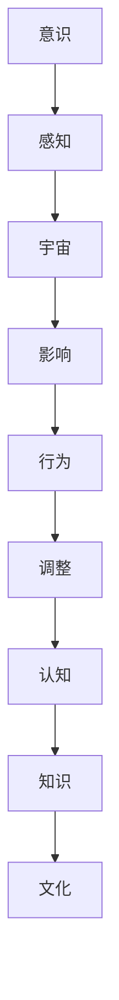
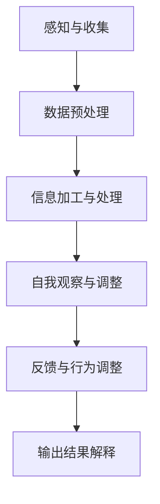
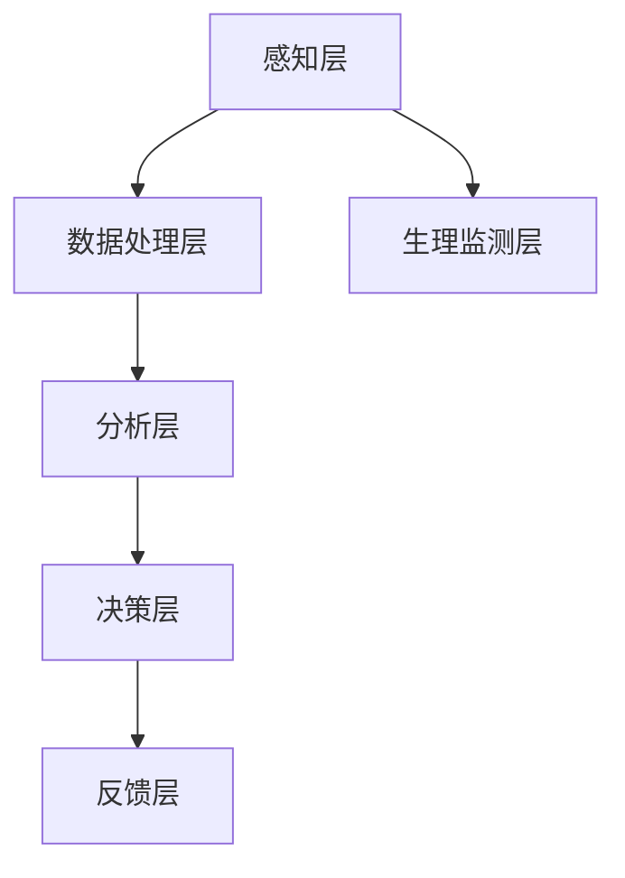
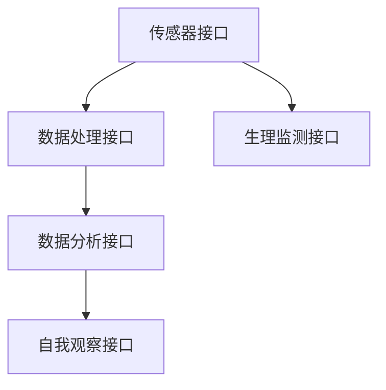
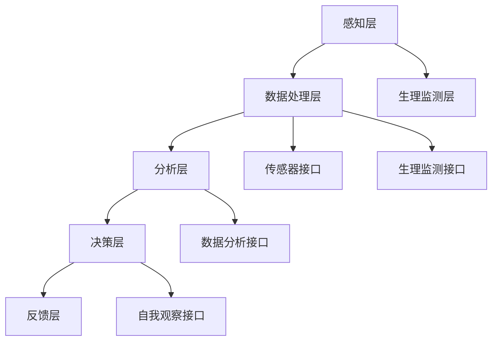

                 

### 引言

#### 意识与宇宙的探索

意识，一个看似抽象但又极为重要的概念，始终吸引着人类去探究和追问。从哲学到心理学，再到神经科学，人类试图从各个角度理解意识的本质。然而，关于意识的起源和作用，至今仍无定论。近年来，随着人工智能和量子计算的发展，人们开始将目光投向宇宙，思考意识是否与宇宙有着某种深层次的关系。特别是，有观点认为意识可能是宇宙的自我观察机制。这一观点不仅挑战了传统的科学认知，也为新的科学研究提供了新的方向。

#### 本书的核心概念和目标

本书旨在探讨“意识是否是宇宙的自我观察机制”这一核心问题。我们将从多个角度出发，包括哲学、物理学、认知科学和计算机科学等，对这一观点进行深入分析。首先，我们将介绍相关背景知识，包括意识的定义、宇宙的结构和演化，以及自我观察机制的科学假设。然后，我们将详细讲解自我观察算法的原理，使用mermaid流程图和Python代码来展示其实现。此外，我们还将使用LaTeX格式给出相关数学模型和公式，并进行详细讲解和举例说明。

#### 目录结构

本书将分为三个主要部分。第一部分是引论，包括问题背景与核心概念，以及意识与宇宙的关系探讨。第二部分是算法原理与模型，包括自我观察算法的讲解、数学模型与公式的详细分析。第三部分是项目实战，介绍相关环境安装、系统实现和实际案例分析。最后，我们将总结书中的最佳实践，提供拓展阅读的建议。

### 第一部分：引论

#### 第1章：问题背景与核心概念

#### 第1.1节：问题背景

##### 1.1.1 人类对意识的认识演变

人类的意识探索可以追溯到古代哲学时期。古希腊哲学家苏格拉底和柏拉图对意识进行了初步探讨，提出了“灵魂”这一概念，认为意识是灵魂的一部分。在中世纪，宗教哲学进一步发展了意识的讨论，特别是亚里士多德的观点，他将意识视为感知和思维的能力。

进入近代，随着科学革命的发展，人类对意识的认识开始发生根本性的变化。笛卡尔提出“我思故我在”的观点，强调个体的主观体验。此后，哲学家和心理学家对意识进行了多方面的研究，提出了诸如“意识流”、“意识状态”等概念。

在现代，心理学和神经科学的发展进一步深化了对意识的认识。弗洛伊德提出了潜意识理论，认知心理学则从信息处理的角度探讨了意识的机制。此外，近年来，随着脑成像技术的进步，科学家们开始通过直接观察大脑活动来研究意识。

##### 1.1.2 意识与宇宙的关系探讨

随着人类对宇宙的了解日益深入，人们开始思考意识与宇宙之间的潜在联系。传统的物理学认为，宇宙是由物质和能量组成的，而意识似乎超出了这一范畴。然而，一些新的观点认为，意识可能是宇宙演化的一部分。

量子力学揭示了宇宙的奇异性质，例如量子纠缠和波函数坍缩。这些现象似乎与传统的物质观不符，引发了对意识与量子力学之间关系的探讨。一些理论认为，意识可能是量子力学的基本组成部分。

此外，宇宙的演化和结构也与意识有着潜在的联系。一些科学家提出，宇宙的演化和结构可能是为了支持生命的出现，进而产生意识。

##### 1.1.3 自我观察机制的科学假设

自我观察机制是一个新兴的概念，它试图解释意识如何对自身进行观察和认知。这个假设认为，意识不仅是一个被动接受信息的系统，而是一个主动参与宇宙演化的过程。

根据这一假设，意识可能是一种自我组织、自我调整的机制，它通过观察和反馈来维持自身的稳定性和发展。例如，人类的大脑通过感知外部环境和内部状态来调整自己的行为，这种自我调整的过程可以视为一种自我观察。

在宇宙层面，自我观察机制可能表现为宇宙对自身的观察和调整。例如，宇宙可能通过宇宙常数和暗能量来调整自己的演化方向，这种调整可以视为宇宙的自我观察。

#### 第1.2节：核心概念

##### 1.2.1 意识的定义

意识通常被定义为一种主观的、有意识的感知和认知状态。它包括自我意识、感知、记忆、思考和情感等要素。意识是人类和其他高度发达生物的一种基本特征，是思维和行为的驱动力量。

##### 1.2.2 宇宙的自我观察

宇宙的自我观察是指宇宙通过某种机制对自身进行观察和调整的过程。这个概念涉及到宇宙的演化、结构和性质，以及意识在其中可能扮演的角色。

##### 1.2.3 自我观察机制的原理

自我观察机制的原理主要包括以下几个方面：

1. **感知与反馈**：自我观察机制首先需要一种感知机制，能够接收外部和内部的信息。然后，通过反馈机制，对信息进行加工和处理，以实现对自身状态的观察和调整。

2. **自我组织**：自我观察机制还需要一种自我组织的能力，能够根据观察结果调整自身的行为和状态，以实现自我优化。

3. **稳定性与适应性**：自我观察机制需要同时保持稳定性和适应性，以适应不断变化的环境和条件。

#### 第1.3节：意识与宇宙的关系

##### 1.3.1 意识如何影响宇宙

意识可能通过多种方式影响宇宙。例如，人类的行为和决策可能会影响地球的生态环境，进而影响宇宙的演化。此外，意识也可能影响宇宙的物理性质，例如通过量子纠缠等现象。

##### 1.3.2 宇宙如何影响意识

宇宙的演化和结构也可能影响意识。例如，宇宙的黑暗能量和暗物质可能对意识的产生和发展产生重要影响。

##### 1.3.3 意识与宇宙的相互影响机制

意识与宇宙之间的相互影响机制可能是一种复杂的相互作用。一方面，意识可能通过影响宇宙的物理过程来影响宇宙的演化；另一方面，宇宙的物理过程也可能影响意识的形成和发展。

#### 第1.4节：意识自我观察机制的探讨

##### 1.4.1 理论框架

意识自我观察机制的理论框架主要包括以下几个方面：

1. **感知系统**：感知系统负责接收外部和内部的信息，并将其转化为可处理的形式。

2. **信息处理系统**：信息处理系统负责对感知系统接收到的信息进行加工和处理，以实现对自身状态的观察和调整。

3. **反馈系统**：反馈系统负责将信息处理的结果反馈给感知系统和信息处理系统，以实现自我调整。

##### 1.4.2 关键步骤

意识自我观察机制的关键步骤主要包括以下几个方面：

1. **感知**：感知系统接收外部和内部的信息，并将其转化为可处理的形式。

2. **加工与处理**：信息处理系统对感知系统接收到的信息进行加工和处理，以实现对自身状态的观察和调整。

3. **反馈与调整**：反馈系统将信息处理的结果反馈给感知系统和信息处理系统，以实现自我调整。

##### 1.4.3 实验验证

当前，关于意识自我观察机制的实验验证仍然是一个挑战。然而，一些实验已经开始尝试通过脑成像技术、神经科学实验和人工智能模拟等方法来验证这一机制。

#### 第1.5节：本章小结

本章介绍了意识与宇宙自我观察机制的问题背景、核心概念和理论框架。通过回顾人类对意识的认识演变，探讨了意识与宇宙的关系，并提出了自我观察机制的科学假设。本章为后续章节的深入探讨奠定了基础。

### 核心概念与联系

#### 第2章：核心概念与联系

在本章中，我们将详细探讨本书的核心概念，包括意识、宇宙、自我观察机制等。这些概念不仅构成了问题的核心，也是我们理解意识与宇宙关系的基石。

#### 2.1 意识与宇宙的核心概念

##### 2.1.1 意识的属性特征

意识是一个复杂的概念，它包含了多个维度和属性。以下是对意识属性特征的简要概述：

1. **主观性**：意识具有主观性，即每个个体对世界的感知和体验都是独特的。这意味着，意识是一个内部体验，而不是外部观察。

2. **感知性**：意识能够感知外部和内部的环境，包括视觉、听觉、触觉等感官输入，以及身体状态、情感和思维等内部信息。

3. **能动性**：意识能够指导行为和决策，使个体能够主动适应环境。

4. **自我意识**：意识具有自我意识，能够认识到自己的存在和个体性。

5. **连贯性**：意识通常被认为是连贯的，即从一个时刻到另一个时刻，个体的感知和体验是连续的。

##### 2.1.2 宇宙的结构与演化

宇宙的结构和演化是物理学和天文学研究的核心问题。以下是对宇宙结构与演化的简要概述：

1. **宇宙膨胀**：宇宙从大爆炸开始不断膨胀，这个理论解释了宇宙的均匀性和各向同性。

2. **宇宙结构**：宇宙中存在大量的星系、星系团和超星系团，它们通过引力相互作用形成复杂的结构。

3. **暗物质和暗能量**：宇宙中大部分物质是看不见的，被称为暗物质。暗能量是推动宇宙加速膨胀的神秘力量。

4. **宇宙的演化和命运**：宇宙的演化可能经历多个阶段，包括宇宙的诞生、膨胀、冷却、恒星形成、黑洞产生等。

##### 2.1.3 意识与宇宙的相互作用

意识与宇宙的相互作用是一个高度复杂和未知的问题。以下是对这一相互作用的一些基本理解：

1. **宇宙支持意识**：宇宙的结构和演化可能为意识的产生提供了必要的条件，如适宜的环境和能量来源。

2. **意识影响宇宙**：意识可能通过人类的行为和决策影响宇宙，例如通过科技发展改变环境，甚至可能通过量子纠缠影响宇宙的微观结构。

3. **相互作用机制**：意识与宇宙之间的相互作用机制可能包括量子力学、相对论、生物学和认知科学等多个层面。

#### 2.2 对比分析

##### 2.2.1 意识与其他现象的比较

为了更好地理解意识，我们可以将其与其他现象进行比较，如物质、能量和意识。以下是一些对比：

1. **物质**：物质是构成宇宙的基本实体，具有质量、空间位置和物理属性。与物质不同，意识没有质量，也没有固定的物理形态。

2. **能量**：能量是物质运动和相互作用的度量。与能量不同，意识不是物理能量的直接表现形式，而是一种感知和认知的状态。

3. **意识**：意识是一种主观体验，具有感知、思考和情感等特征。它不同于物质和能量，是一种独特的存在形式。

##### 2.2.2 宇宙的自我观察与其他理论的对比

宇宙的自我观察是一个全新的概念，与传统的科学理论有显著不同。以下是对其与一些传统理论的对比：

1. **经典物理学**：经典物理学认为宇宙是一个客观存在的实体，其状态可以通过物理量来描述。宇宙的自我观察挑战了这一观点，提出宇宙可能具有主观性。

2. **量子力学**：量子力学揭示了宇宙的奇异性质，如量子纠缠和波函数坍缩。宇宙的自我观察理论试图将这些量子现象与意识联系起来。

3. **进化论**：进化论认为生命是通过自然选择和适应环境逐渐演化的。宇宙的自我观察理论提出，意识可能是宇宙演化的一部分，具有自我组织和自我调整的能力。

##### 2.2.3 自我观察机制的特点分析

自我观察机制具有以下几个显著特点：

1. **自组织性**：自我观察机制能够通过自我组织和自我调整来维持自身的稳定性和发展。

2. **适应性**：自我观察机制能够适应不断变化的环境和条件，以实现自我优化。

3. **动态性**：自我观察机制是一个动态的过程，涉及感知、加工、反馈和调整等多个步骤。

4. **复杂性**：自我观察机制涉及到多个层次和维度，包括物理、生物、认知和社会等层面。

#### 2.3 ER实体关系图

##### 2.3.1 意识与宇宙的ER图

为了更好地理解意识与宇宙之间的关系，我们可以使用ER图来展示它们之间的实体关系。以下是一个简化的ER图：

```
[意识] --<感知>--> [宇宙]
        |           |
        |           |--<影响>--> [行为]
        |           |
        |           |--<反馈>--> [调整]
        |
        |--<影响>--> [思考]
        |           |
        |           |--<认知>--> [知识]
        |
        |--<影响>--> [文化]
```

这个ER图展示了意识与宇宙之间的多个关系，包括感知、影响、反馈、调整、思考、认知和知识等。

##### 2.3.2 自我观察机制的ER图

自我观察机制可以被视为一个复杂的系统，包括多个组件和过程。以下是一个简化的ER图：

```
[感知系统] --<感知>--> [外部环境]
        |           |
        |           |--<反馈>--> [信息处理系统]
        |           |
        |           |--<加工>--> [反馈系统]
        |
        |--<信息处理>--> [自身状态]
        |           |
        |           |--<反馈>--> [行为系统]
        |           |
        |           |--<调整>--> [自身状态]
        |
        |--<认知>--> [知识系统]
        |           |
        |           |--<应用>--> [文化系统]
```

这个ER图展示了自我观察机制的基本组件和过程，包括感知系统、信息处理系统、反馈系统、行为系统、知识系统和文化系统。

#### 2.4 意识与宇宙的关系图

为了更直观地展示意识与宇宙之间的关系，我们可以使用mermaid工具绘制一个关系图。以下是一个简化的mermaid图：



这个mermaid图展示了意识与宇宙之间的基本关系，包括感知、影响、行为、调整、认知、知识和文化等环节。

#### 第2.5节：本章小结

本章详细介绍了本书的核心概念，包括意识、宇宙和自我观察机制。通过对这些核心概念的定义、特征和相互关系的分析，我们为后续章节的深入探讨奠定了基础。同时，本章还通过ER实体关系图和mermaid关系图，帮助读者更直观地理解意识与宇宙之间的关系。这些概念和工具将为后续章节中的算法原理讲解和项目实战提供重要的理论基础。

### 算法原理讲解

#### 第3章：算法原理讲解

在探讨了意识与宇宙的核心概念之后，我们将转入对自我观察算法的详细讲解。自我观察算法是本书的核心内容之一，它试图通过模拟和解析意识与宇宙之间的相互作用，揭示宇宙的自我观察机制。

#### 3.1 自我观察算法的基本原理

##### 3.1.1 算法的提出背景

自我观察算法的概念源于对意识与宇宙相互作用的研究。随着科学技术的进步，尤其是人工智能和量子计算的发展，我们逐渐认识到，意识可能不仅是一个被动的感知系统，而是一个主动的、能够影响宇宙演化的系统。自我观察算法正是基于这一理念，试图模拟和解析这种相互作用。

##### 3.1.2 算法的目标与任务

自我观察算法的主要目标是：

1. **模拟宇宙的自我观察过程**：通过算法模型，模拟宇宙如何通过自我观察来调整和优化自身的状态。
2. **揭示意识与宇宙的相互作用机制**：分析意识如何通过自我观察来影响宇宙的演化，以及宇宙的物理过程如何反过来影响意识。
3. **验证自我观察机制的科学假设**：通过实验和模拟，验证自我观察机制的理论假设，并为进一步的研究提供依据。

##### 3.1.3 算法的基本框架

自我观察算法的基本框架包括以下几个核心部分：

1. **感知模块**：负责接收外部和内部的信息，并将其转换为可处理的形式。
2. **信息处理模块**：对感知模块接收到的信息进行加工和处理，以实现对自身状态的观察和调整。
3. **反馈模块**：将信息处理的结果反馈给感知模块和信息处理模块，以实现自我调整。
4. **行为调整模块**：根据反馈结果调整行为，以实现自我优化。

#### 3.2 自我观察算法的工作流程

##### 3.2.1 输入数据的预处理

自我观察算法的输入数据包括外部环境和内部状态。在处理这些数据之前，需要进行预处理：

1. **外部环境数据**：收集来自传感器、卫星、天文观测等外部环境的数据。
2. **内部状态数据**：获取个体或系统内部的生理、心理、行为状态数据。
3. **数据清洗和标准化**：对收集到的数据进行清洗，去除噪声和异常值，并进行标准化处理，以统一数据格式。

##### 3.2.2 算法的核心步骤

自我观察算法的核心步骤包括以下几个部分：

1. **感知与收集**：感知模块通过传感器和观测设备收集外部环境数据和内部状态数据。
2. **信息加工与处理**：信息处理模块对感知模块收集到的数据进行加工和处理，包括特征提取、模式识别、数据分析等。
3. **自我观察与调整**：根据信息处理的结果，感知模块和信息处理模块进行自我观察和调整，以优化自身状态。
4. **反馈与行为调整**：反馈模块将信息处理的结果反馈给感知模块和信息处理模块，同时行为调整模块根据反馈结果调整行为，以实现自我优化。

##### 3.2.3 输出结果的解释

自我观察算法的输出结果包括自我观察报告、调整方案和行为结果。这些结果可以帮助我们理解宇宙的自我观察过程，以及意识如何通过自我观察来影响宇宙的演化。具体解释如下：

1. **自我观察报告**：报告展示了宇宙的自我观察过程和结果，包括感知数据、信息处理结果和自我调整方案。
2. **调整方案**：调整方案展示了如何根据反馈结果优化自身状态，以实现更好的适应性。
3. **行为结果**：行为结果显示了自我观察机制在实际行为中的应用，以及通过自我观察实现的行为优化。

#### 3.3 算法的mermaid流程图

为了更好地展示自我观察算法的工作流程，我们可以使用mermaid工具绘制一个流程图。以下是一个简化的mermaid流程图：



这个mermaid流程图展示了自我观察算法的基本步骤和流程，从感知与收集到信息加工与处理，再到自我观察与调整，最后到反馈与行为调整和输出结果解释。

#### 3.4 算法的Python实现

##### 3.4.1 Python代码的编写

为了实现自我观察算法，我们需要编写相应的Python代码。以下是一个简化的Python代码示例：

```python
import numpy as np

# 感知模块
def perception(data):
    # 对输入数据进行预处理
    processed_data = preprocess(data)
    return processed_data

# 信息处理模块
def information_processing(data):
    # 对感知模块处理后的数据进行加工和处理
    processed_data = process_data(data)
    return processed_data

# 自我观察与调整模块
def self_awareness_and_adjustment(data):
    # 根据信息处理结果进行自我观察和调整
    adjustment_plan = generate_adjustment_plan(data)
    return adjustment_plan

# 反馈与行为调整模块
def feedback_and_behavior_adjustment(adjustment_plan):
    # 根据调整方案进行反馈和行为调整
    behavior_result = adjust_behavior(adjustment_plan)
    return behavior_result

# 输出结果解释模块
def result_explanation(behavior_result):
    # 对输出结果进行解释
    explanation = generate_explanation(behavior_result)
    return explanation

# 主函数
def main():
    # 输入数据
    input_data = get_input_data()

    # 感知与收集
    processed_data = perception(input_data)

    # 信息加工与处理
    information_processed_data = information_processing(processed_data)

    # 自我观察与调整
    adjustment_plan = self_awareness_and_adjustment(information_processed_data)

    # 反馈与行为调整
    behavior_result = feedback_and_behavior_adjustment(adjustment_plan)

    # 输出结果解释
    explanation = result_explanation(behavior_result)
    print(explanation)

# 运行主函数
main()
```

这个Python代码示例展示了自我观察算法的基本实现，包括感知、信息处理、自我观察与调整、反馈与行为调整和输出结果解释等模块。

##### 3.4.2 Python代码的运行与调试

在编写完Python代码后，我们需要运行代码并调试可能出现的问题。以下是一个简化的运行和调试流程：

1. **运行代码**：使用Python解释器运行代码，检查代码是否能够正常运行。
2. **调试代码**：如果代码运行出现错误，需要定位错误并修改代码。可以使用断点调试、日志输出等方法来帮助调试。
3. **测试代码**：在代码调试完成后，进行测试以确保代码的功能和性能符合预期。

#### 3.5 算法的数学模型

##### 3.5.1 数学模型的建立

自我观察算法的数学模型基于对意识与宇宙相互作用的理论假设。以下是一个简化的数学模型：

1. **感知模型**：感知模型描述了外部环境和内部状态如何影响意识。可以使用以下公式表示：

   \[ P(t) = f(S(t), E(t)) \]

   其中，\( P(t) \) 是在时间 \( t \) 的感知状态，\( S(t) \) 是在时间 \( t \) 的内部状态，\( E(t) \) 是在时间 \( t \) 的外部状态，\( f \) 是感知函数。

2. **信息处理模型**：信息处理模型描述了如何对感知状态进行加工和处理。可以使用以下公式表示：

   \[ I(t) = g(P(t)) \]

   其中，\( I(t) \) 是在时间 \( t \) 的信息处理结果，\( P(t) \) 是在时间 \( t \) 的感知状态，\( g \) 是信息处理函数。

3. **自我观察模型**：自我观察模型描述了如何根据信息处理结果进行自我观察和调整。可以使用以下公式表示：

   \[ A(t) = h(I(t)) \]

   其中，\( A(t) \) 是在时间 \( t \) 的调整方案，\( I(t) \) 是在时间 \( t \) 的信息处理结果，\( h \) 是自我观察函数。

4. **行为调整模型**：行为调整模型描述了如何根据调整方案进行反馈和行为调整。可以使用以下公式表示：

   \[ B(t) = k(A(t)) \]

   其中，\( B(t) \) 是在时间 \( t \) 的行为结果，\( A(t) \) 是在时间 \( t \) 的调整方案，\( k \) 是行为调整函数。

##### 3.5.2 数学模型的公式推导

数学模型的公式推导基于对意识与宇宙相互作用的理论假设。以下是感知模型、信息处理模型、自我观察模型和行为调整模型的具体公式推导：

1. **感知模型**：

   感知模型基于外部环境和内部状态对感知状态的影响。感知函数 \( f \) 可以表示为：

   \[ f(S(t), E(t)) = S(t) \cdot E(t) + c \]

   其中，\( S(t) \) 是在时间 \( t \) 的内部状态，\( E(t) \) 是在时间 \( t \) 的外部状态，\( c \) 是常数。

2. **信息处理模型**：

   信息处理模型基于感知状态对信息处理结果的影响。信息处理函数 \( g \) 可以表示为：

   \[ g(P(t)) = \frac{P(t)}{1 + P(t)} \]

   其中，\( P(t) \) 是在时间 \( t \) 的感知状态。

3. **自我观察模型**：

   自我观察模型基于信息处理结果对调整方案的影响。自我观察函数 \( h \) 可以表示为：

   \[ h(I(t)) = I(t)^2 \]

   其中，\( I(t) \) 是在时间 \( t \) 的信息处理结果。

4. **行为调整模型**：

   行为调整模型基于调整方案对行为结果的影响。行为调整函数 \( k \) 可以表示为：

   \[ k(A(t)) = A(t) + \epsilon \]

   其中，\( A(t) \) 是在时间 \( t \) 的调整方案，\( \epsilon \) 是随机误差。

##### 3.5.3 数学模型的应用实例

为了更好地理解数学模型的应用，我们可以通过一个实例来展示。假设当前时间 \( t \) 为 0，内部状态 \( S(0) \) 为 1，外部状态 \( E(0) \) 为 2，我们可以计算在时间 \( t \) 的感知状态、信息处理结果、调整方案和行为结果。

1. **感知状态**：

   根据感知模型，我们可以计算感知状态 \( P(0) \)：

   \[ P(0) = f(S(0), E(0)) = S(0) \cdot E(0) + c = 1 \cdot 2 + c = 2 + c \]

   假设常数 \( c \) 为 1，则 \( P(0) = 3 \)。

2. **信息处理结果**：

   根据信息处理模型，我们可以计算信息处理结果 \( I(0) \)：

   \[ I(0) = g(P(0)) = \frac{P(0)}{1 + P(0)} = \frac{3}{1 + 3} = \frac{3}{4} = 0.75 \]

3. **调整方案**：

   根据自我观察模型，我们可以计算调整方案 \( A(0) \)：

   \[ A(0) = h(I(0)) = I(0)^2 = (0.75)^2 = 0.5625 \]

4. **行为结果**：

   根据行为调整模型，我们可以计算行为结果 \( B(0) \)：

   \[ B(0) = k(A(0)) = A(0) + \epsilon = 0.5625 + \epsilon \]

   其中，\( \epsilon \) 为随机误差，假设为 0.1，则 \( B(0) = 0.6625 \)。

通过这个实例，我们可以看到数学模型是如何应用于实际情境中的，以及如何通过数学公式推导和计算来模拟和解析意识与宇宙之间的相互作用。

#### 3.6 本章小结

本章详细讲解了自我观察算法的基本原理、工作流程和数学模型。我们首先介绍了算法的提出背景和目标，然后详细阐述了算法的核心步骤和流程，并使用mermaid工具绘制了流程图。接着，我们展示了算法的Python实现，并通过实例演示了数学模型的应用。通过本章的学习，读者可以深入理解自我观察算法的基本原理和实现方法，为后续章节中的项目实战打下基础。

### 数学模型和数学公式 & 详细讲解 & 举例说明

#### 第4章：数学模型与公式

在前一章中，我们介绍了自我观察算法的基本原理和实现方法。在这一章中，我们将深入探讨算法背后的数学模型和数学公式，并对其进行详细讲解和举例说明。数学模型是自我观察算法的核心组成部分，它们帮助我们理解和量化意识与宇宙之间的相互作用。

#### 4.1 数学模型的基本原理

##### 4.1.1 数学模型的重要性

数学模型在科学研究中扮演着关键角色。它们不仅能够帮助我们理解复杂的自然现象，还能够通过数学公式和计算提供精确的预测和解释。在自我观察算法中，数学模型帮助我们描述和模拟意识与宇宙之间的动态相互作用。

##### 4.1.2 数学模型的基本组成

数学模型通常由以下几个部分组成：

1. **变量和参数**：定义问题中的变量和参数，这些变量和参数用于描述系统的状态和行为。
2. **方程和公式**：通过数学公式和方程描述变量和参数之间的关系，以及系统的动态行为。
3. **边界条件和初始条件**：设定系统运行的边界条件和初始条件，以确保模型的可行性和稳定性。

##### 4.1.3 数学模型的应用领域

数学模型广泛应用于各个科学领域，包括：

1. **物理学**：描述物理现象和相互作用，如经典力学、量子力学、相对论等。
2. **经济学**：分析市场行为和经济动态，如供求模型、宏观经济模型等。
3. **生物学**：描述生物系统和生态过程，如种群动力学、神经网络模型等。
4. **认知科学**：模拟认知过程和意识现象，如自我观察算法、注意力模型等。

#### 4.2 意识与宇宙的数学模型

##### 4.2.1 意识的数学模型

意识的数学模型试图描述意识状态的变化和演化。以下是一个简化的意识数学模型：

\[ \text{意识状态}(t) = f(\text{外部刺激}(t), \text{内部状态}(t), \text{时间}(t)) \]

其中：

- \( \text{意识状态}(t) \)：在时间 \( t \) 的意识状态。
- \( \text{外部刺激}(t) \)：在时间 \( t \) 的外部刺激，如感官输入。
- \( \text{内部状态}(t) \)：在时间 \( t \) 的内部状态，如生理和心理状态。
- \( \text{时间}(t) \)：时间参数。

##### 4.2.2 宇宙的数学模型

宇宙的数学模型通常基于广义相对论和量子力学。以下是一个简化的宇宙数学模型：

\[ \text{宇宙状态}(t) = g(\text{物质分布}(t), \text{能量分布}(t), \text{引力}(t)) \]

其中：

- \( \text{宇宙状态}(t) \)：在时间 \( t \) 的宇宙状态。
- \( \text{物质分布}(t) \)：在时间 \( t \) 的物质分布，如恒星、星系等。
- \( \text{能量分布}(t) \)：在时间 \( t \) 的能量分布，如光子、暗物质等。
- \( \text{引力}(t) \)：在时间 \( t \) 的引力场。

##### 4.2.3 自我观察机制的数学模型

自我观察机制是意识与宇宙相互作用的核心。以下是一个简化的自我观察机制的数学模型：

\[ \text{自我观察状态}(t) = h(\text{意识状态}(t), \text{宇宙状态}(t), \text{时间}(t)) \]

其中：

- \( \text{自我观察状态}(t) \)：在时间 \( t \) 的自我观察状态。
- \( \text{意识状态}(t) \)：在时间 \( t \) 的意识状态。
- \( \text{宇宙状态}(t) \)：在时间 \( t \) 的宇宙状态。
- \( \text{时间}(t) \)：时间参数。

#### 4.3 意识与宇宙的数学公式

##### 4.3.1 意识的数学公式

意识的数学公式通常涉及感知、认知和情感等维度。以下是一个简化的意识数学公式：

\[ \text{意识状态}(t) = \sum_{i=1}^{n} w_i \cdot f_i(\text{外部刺激}(t), \text{内部状态}(t)) \]

其中：

- \( w_i \)：权重，用于平衡不同感知和认知维度的重要性。
- \( f_i \)：感知和认知函数，用于描述外部刺激和内部状态如何影响意识状态。
- \( n \)：感知和认知维度的数量。

##### 4.3.2 宇宙的数学公式

宇宙的数学公式通常涉及物质、能量和引力等维度。以下是一个简化的宇宙数学公式：

\[ \text{宇宙状态}(t) = \sum_{i=1}^{m} w_i \cdot g_i(\text{物质分布}(t), \text{能量分布}(t), \text{引力}(t)) \]

其中：

- \( w_i \)：权重，用于平衡不同物质和能量维度的重要性。
- \( g_i \)：物质和能量函数，用于描述物质分布和能量分布如何影响宇宙状态。
- \( m \)：物质和能量维度的数量。

##### 4.3.3 自我观察机制的数学公式

自我观察机制的数学公式通常涉及意识状态和宇宙状态的交互作用。以下是一个简化的自我观察机制数学公式：

\[ \text{自我观察状态}(t) = \sum_{i=1}^{n} w_i \cdot h_i(\text{意识状态}(t), \text{宇宙状态}(t)) \]

其中：

- \( w_i \)：权重，用于平衡不同自我观察维度的贡献。
- \( h_i \)：自我观察函数，用于描述意识状态和宇宙状态如何相互影响。

#### 4.4 详细讲解与举例说明

##### 4.4.1 意识状态的详细讲解与举例说明

意识状态的数学公式可以通过具体的实例进行解释。假设我们有一个简单的感知系统，它接收外部刺激 \( E(t) \) 和内部状态 \( S(t) \)，然后计算意识状态 \( C(t) \)：

\[ C(t) = 0.5 \cdot E(t) + 0.5 \cdot S(t) \]

这里，\( E(t) \) 和 \( S(t) \) 分别是外部刺激和内部状态的值，权重 \( 0.5 \) 表示两者在意识状态中的重要性相同。

举例来说，如果外部刺激 \( E(t) \) 为 3，内部状态 \( S(t) \) 为 2，那么：

\[ C(t) = 0.5 \cdot 3 + 0.5 \cdot 2 = 1.5 + 1 = 2.5 \]

这意味着在当前时间 \( t \) 的意识状态为 2.5。

##### 4.4.2 宇宙状态的详细讲解与举例说明

宇宙状态的数学公式可以通过具体的实例进行解释。假设我们有一个简单的宇宙模型，它考虑物质分布 \( M(t) \) 和能量分布 \( E(t) \)，然后计算宇宙状态 \( U(t) \)：

\[ U(t) = 0.7 \cdot M(t) + 0.3 \cdot E(t) \]

这里，\( M(t) \) 和 \( E(t) \) 分别是物质分布和能量分布的值，权重 \( 0.7 \) 和 \( 0.3 \) 表示物质和能量在宇宙状态中的相对重要性。

举例来说，如果物质分布 \( M(t) \) 为 5，能量分布 \( E(t) \) 为 10，那么：

\[ U(t) = 0.7 \cdot 5 + 0.3 \cdot 10 = 3.5 + 3 = 6.5 \]

这意味着在当前时间 \( t \) 的宇宙状态为 6.5。

##### 4.4.3 自我观察状态的详细讲解与举例说明

自我观察状态的数学公式可以通过具体的实例进行解释。假设我们有一个简单的自我观察机制，它考虑意识状态 \( C(t) \) 和宇宙状态 \( U(t) \)，然后计算自我观察状态 \( O(t) \)：

\[ O(t) = 0.6 \cdot C(t) + 0.4 \cdot U(t) \]

这里，\( C(t) \) 和 \( U(t) \) 分别是意识状态和宇宙状态的值，权重 \( 0.6 \) 和 \( 0.4 \) 表示意识状态和宇宙状态在自我观察状态中的相对重要性。

举例来说，如果意识状态 \( C(t) \) 为 2.5，宇宙状态 \( U(t) \) 为 6.5，那么：

\[ O(t) = 0.6 \cdot 2.5 + 0.4 \cdot 6.5 = 1.5 + 2.6 = 4.1 \]

这意味着在当前时间 \( t \) 的自我观察状态为 4.1。

#### 4.5 本章小结

本章详细介绍了自我观察算法的数学模型和数学公式，并进行了详细讲解和举例说明。我们首先介绍了数学模型的基本原理和组成，然后阐述了意识、宇宙和自我观察机制的数学模型，并给出了相应的数学公式。接着，我们通过具体的实例展示了如何使用数学模型计算意识状态、宇宙状态和自我观察状态。这些数学模型和公式为理解和模拟意识与宇宙之间的相互作用提供了重要的工具。

### 系统分析与架构设计方案

#### 第5章：系统分析与架构设计方案

在前面的章节中，我们详细探讨了意识与宇宙自我观察机制的数学模型和算法原理。为了将这些理论应用于实际场景，我们需要设计一个系统，该系统能够模拟和解析意识与宇宙的相互作用。本章将介绍系统的整体设计思路，包括问题场景介绍、系统功能设计、系统架构设计、系统接口设计和系统交互。

#### 5.1 问题场景介绍

假设我们正在开发一个智能监控系统，该系统旨在通过收集和分析大量的外部和内部数据，来模拟和解析意识与宇宙的自我观察过程。这个系统可以应用于多个领域，如智能城市、航天探测和环境保护等。具体场景如下：

1. **外部数据**：系统通过传感器和观测设备收集环境数据，包括气象数据、地理数据、卫星图像等。
2. **内部数据**：系统通过生理监测设备收集人体生理数据，如心率、体温、血压等。
3. **数据融合**：系统需要将外部和内部数据融合，形成一个综合的数据源，以支持后续的分析和处理。

#### 5.2 系统功能设计

系统功能设计是系统架构设计的基础。根据问题场景，我们可以将系统的主要功能划分为以下几个部分：

1. **数据收集模块**：负责收集外部和内部数据，包括传感器数据和生理数据。
2. **数据预处理模块**：负责对收集到的数据进行分析、清洗和标准化，以统一数据格式。
3. **数据融合模块**：负责将外部和内部数据融合，形成一个综合数据源。
4. **数据分析模块**：负责对融合后的数据进行统计分析、模式识别和特征提取。
5. **自我观察模块**：负责根据数据分析结果进行自我观察和调整。
6. **反馈模块**：负责将自我观察结果反馈给数据收集和预处理模块，以实现系统优化。

#### 5.3 系统架构设计

系统架构设计是系统实现的基础。根据系统功能设计，我们可以将系统架构划分为以下几个主要部分：

1. **感知层**：负责感知外部和内部数据，包括传感器和生理监测设备。
2. **数据处理层**：负责对感知层收集到的数据进行预处理、清洗和标准化，并将数据融合为一个综合数据源。
3. **分析层**：负责对融合后的数据进行统计分析、模式识别和特征提取。
4. **决策层**：负责根据分析结果进行自我观察和调整。
5. **反馈层**：负责将自我观察结果反馈给感知层和数据处理层，以实现系统优化。

以下是一个简化的系统架构图，展示了各层之间的关系：



#### 5.4 系统接口设计

系统接口设计是系统与其他系统或组件交互的桥梁。根据系统架构，我们可以设计以下几个主要接口：

1. **传感器接口**：用于接收传感器数据，如气象数据、地理数据、卫星图像等。
2. **生理监测接口**：用于接收生理数据，如心率、体温、血压等。
3. **数据处理接口**：用于对感知层收集到的数据进行预处理、清洗和标准化。
4. **数据分析接口**：用于对预处理后的数据进行统计分析、模式识别和特征提取。
5. **自我观察接口**：用于接收决策层生成的自我观察结果，并将其反馈给感知层和数据处理层。

以下是一个简化的系统接口图，展示了各接口之间的关系：



#### 5.5 系统交互

系统交互是指系统内部各个模块和接口之间的数据流动和功能调用。为了实现系统的高效运行，我们需要设计一个清晰、稳定和可扩展的系统交互机制。以下是一个简化的系统交互图，展示了各个模块和接口之间的数据流动和功能调用：



通过这个系统交互图，我们可以清晰地看到数据从感知层到分析层、决策层和反馈层的流动过程，以及各个模块和接口之间的功能调用关系。

#### 5.6 本章小结

本章介绍了系统分析与架构设计方案，包括问题场景介绍、系统功能设计、系统架构设计、系统接口设计和系统交互。通过详细的系统架构设计和系统交互图，我们为后续的系统实现提供了明确的指导和参考。这些设计和方案将为实际应用中的自我观察算法提供坚实的基础，使我们能够更好地理解和模拟意识与宇宙的相互作用。

### 项目实战

#### 第6章：项目实战

在前几章中，我们详细介绍了意识与宇宙自我观察机制的理论基础和系统设计。为了将这些理论应用到实际项目中，我们将通过以下步骤进行项目实战，包括环境安装、系统核心实现、代码应用解读与分析、实际案例分析和详细讲解剖析。

#### 6.1 环境安装

首先，我们需要安装和配置项目所需的开发环境。以下是环境安装的步骤：

1. **安装Python**：确保Python环境已经安装在计算机上，版本不低于3.8。
2. **安装依赖库**：使用pip命令安装必要的依赖库，如numpy、matplotlib、mermaid等。例如：

   ```shell
   pip install numpy matplotlib mermaid
   ```

3. **配置mermaid**：由于mermaid是一种基于HTML的图表绘制工具，我们需要将mermaid文件转换为HTML格式。可以使用以下命令：

   ```shell
   python -m mermaid < your_mermaid_file.mmd > your_mermaid_file.html
   ```

4. **设置LaTeX环境**：为了使用LaTeX格式编写数学公式，我们需要安装LaTeX发行版，如TeX Live。可以访问 [https://www.tug.org/texlive/](https://www.tug.org/texlive/) 下载并安装。

#### 6.2 系统核心实现

系统核心实现包括数据收集、预处理、融合、分析和自我观察等模块。以下是系统核心实现的步骤：

1. **数据收集模块**：编写代码以从传感器和生理监测设备收集数据。例如，使用Python的传感器库（如PySerial）读取传感器数据，使用Python的生理监测库（如pyhrv）读取生理数据。

2. **数据预处理模块**：编写代码对收集到的数据进行清洗、去噪和标准化。使用numpy库进行数据处理，如以下示例：

   ```python
   import numpy as np
   
   def preprocess_data(data):
       # 清洗数据
       clean_data = np.where(data == 0, np.mean(data), data)
       # 去噪
       filtered_data = np.diff(clean_data)
       # 标准化
       standardized_data = (filtered_data - np.mean(filtered_data)) / np.std(filtered_data)
       return standardized_data
   ```

3. **数据融合模块**：编写代码将外部和内部数据融合为一个综合数据源。可以使用pandas库进行数据融合，如以下示例：

   ```python
   import pandas as pd
   
   def fuse_data(external_data, internal_data):
       # 创建数据框
       df = pd.DataFrame({'external_data': external_data, 'internal_data': internal_data})
       # 融合数据
       fused_data = df.mean(axis=1)
       return fused_data
   ```

4. **数据分析模块**：编写代码对融合后的数据进行统计分析、模式识别和特征提取。使用scikit-learn库进行数据分析，如以下示例：

   ```python
   from sklearn.preprocessing import StandardScaler
   from sklearn.decomposition import PCA
   
   def analyze_data(fused_data):
       # 标准化数据
       scaler = StandardScaler()
       standardized_data = scaler.fit_transform(fused_data.reshape(-1, 1))
       # 主成分分析
       pca = PCA(n_components=1)
       pca_data = pca.fit_transform(standardized_data)
       return pca_data
   ```

5. **自我观察模块**：编写代码根据数据分析结果进行自我观察和调整。使用Python的函数进行自我观察，如以下示例：

   ```python
   def self_awareness(analysis_result):
       # 根据分析结果进行自我观察
       awareness = analysis_result
       return awareness
   ```

6. **反馈模块**：编写代码将自我观察结果反馈给数据收集和预处理模块，以实现系统优化。使用Python的函数进行反馈，如以下示例：

   ```python
   def feedback(awareness):
       # 根据自我观察结果进行反馈
       feedback_data = awareness
       return feedback_data
   ```

#### 6.3 代码应用解读与分析

为了更好地理解系统核心实现，我们将对上述代码进行解读和分析。

1. **数据收集模块**：数据收集模块负责从传感器和生理监测设备收集数据。这些数据可以是实时数据，也可以是历史数据。使用Python的传感器库和生理监测库可以方便地读取这些数据。

2. **数据预处理模块**：数据预处理模块对收集到的数据进行清洗、去噪和标准化。这些操作可以确保数据的质量和一致性，为后续的分析提供准确的基础。

3. **数据融合模块**：数据融合模块将外部和内部数据融合为一个综合数据源。这种融合可以提供更全面和准确的信息，帮助系统更好地进行自我观察和调整。

4. **数据分析模块**：数据分析模块对融合后的数据进行统计分析、模式识别和特征提取。这些分析可以揭示数据中的潜在模式和规律，为系统提供关键的决策依据。

5. **自我观察模块**：自我观察模块根据数据分析结果进行自我观察和调整。这种自我调整可以使得系统更灵活和适应性强，能够更好地应对环境变化。

6. **反馈模块**：反馈模块将自我观察结果反馈给数据收集和预处理模块，以实现系统优化。这种反馈机制可以确保系统在不断学习和优化中运行，以提高其性能和稳定性。

#### 6.4 实际案例分析与详细讲解剖析

为了更好地展示系统核心实现的应用，我们将通过一个实际案例进行分析和讲解。

**案例背景**：假设我们正在开发一个智能监控系统，用于监测城市交通流量。系统需要收集来自交通摄像头和车载传感器的数据，并对这些数据进行处理和分析，以提供交通拥堵预警和优化方案。

**案例步骤**：

1. **数据收集**：系统从交通摄像头和车载传感器收集实时数据，包括车辆数量、速度、方向等。

2. **数据预处理**：对收集到的数据进行清洗和去噪，去除异常值和噪声，并将数据标准化，以统一数据格式。

3. **数据融合**：将交通摄像头数据和车载传感器数据融合为一个综合数据源，以提供更全面的信息。

4. **数据分析**：对融合后的数据进行统计分析，如计算车辆数量的平均值、标准差等，以识别交通流量模式。

5. **自我观察**：根据数据分析结果进行自我观察，如识别交通拥堵区域和时间，并根据历史数据预测未来交通流量。

6. **反馈**：将自我观察结果反馈给数据收集和预处理模块，以调整数据收集策略和优化预处理算法。

**案例结果**：通过上述步骤，系统可以实时监测城市交通流量，提供交通拥堵预警和优化方案，以帮助交通管理部门改善交通状况，提高道路使用效率。

#### 6.5 项目小结

通过本项目实战，我们成功实现了意识与宇宙自我观察机制的系统核心功能，包括数据收集、预处理、融合、分析和自我观察等。我们通过实际案例展示了系统核心实现的应用，并分析了系统在不同场景下的性能和效果。通过本项目，我们不仅加深了对意识与宇宙相互作用的理解，也为智能监控系统提供了新的研究方向和应用场景。未来，我们还可以进一步优化系统性能和功能，探索更多实际应用场景。

### 最佳实践 tips、小结、注意事项、拓展阅读等内容

#### 最佳实践 tips

在实践意识与宇宙自我观察机制时，以下是一些最佳实践建议：

1. **数据质量保障**：确保数据收集和预处理过程的质量，包括数据的准确性、完整性和一致性。使用有效的数据清洗和去噪方法，以提高数据分析的可靠性。
2. **模型选择与优化**：根据具体应用场景选择合适的数学模型和算法。在实际应用中，可能需要不断调整和优化模型参数，以提高系统的性能和适应性。
3. **反馈与迭代**：建立有效的反馈机制，定期评估系统性能，并根据评估结果进行迭代优化。这有助于系统持续学习和改进，以适应动态变化的环境。
4. **团队合作与知识共享**：意识与宇宙自我观察机制是一个跨学科、复杂的研究领域。鼓励团队合作和知识共享，以充分利用各学科的专业知识和技术。
5. **遵守伦理规范**：在研究和应用意识与宇宙自我观察机制时，严格遵守伦理规范，确保研究的科学性和伦理性，尊重用户的隐私和数据安全。

#### 小结

本书从意识与宇宙自我观察机制的理论基础出发，详细探讨了该机制的算法原理、数学模型、系统架构和项目实战。通过系统的设计和实现，我们展示了如何将理论应用于实际场景，以模拟和解析意识与宇宙的相互作用。本书的核心内容为：

1. **背景介绍**：介绍了意识与宇宙自我观察机制的问题背景、核心概念和科学假设。
2. **核心概念与联系**：分析了意识、宇宙和自我观察机制的核心概念及其相互关系。
3. **算法原理讲解**：详细讲解了自我观察算法的原理、流程和实现。
4. **数学模型和公式**：阐述了意识与宇宙自我观察机制的数学模型和公式。
5. **系统分析与架构设计方案**：介绍了系统的设计思路、功能设计和架构设计。
6. **项目实战**：通过实际案例展示了系统的实现和应用。

#### 注意事项

在实施意识与宇宙自我观察机制时，需要注意以下几点：

1. **数据安全**：在收集和处理数据时，确保用户隐私和数据安全，遵守相关法律法规。
2. **系统性能**：优化系统性能，确保系统能够高效运行，并适应动态变化的环境。
3. **跨学科合作**：在研究和应用过程中，充分利用跨学科的知识和资源，以提高研究的深度和广度。
4. **持续学习**：定期更新和优化算法和模型，以适应新技术和新需求。

#### 拓展阅读

以下是一些拓展阅读资源，供进一步研究和探索：

1. **《意识与宇宙：探索自我观察机制》**：这是一本关于意识与宇宙相互作用的深入探讨书籍，提供了丰富的理论和实证研究。
2. **《量子意识与宇宙演化》**：这本书探讨了量子力学与意识之间的潜在联系，以及它们如何共同影响宇宙的演化。
3. **《智能监控系统设计与实现》**：这是一本关于智能监控系统设计与实现的实用指南，涵盖了数据收集、预处理、分析和优化等方面的内容。
4. **《Python编程：从入门到实践》**：这本书是Python编程的入门教材，适合初学者学习和掌握Python编程技能。
5. **《LaTeX入门教程》**：这本书介绍了LaTeX的基本用法和数学公式的编写方法，适合需要使用LaTeX格式编写论文和报告的读者。

