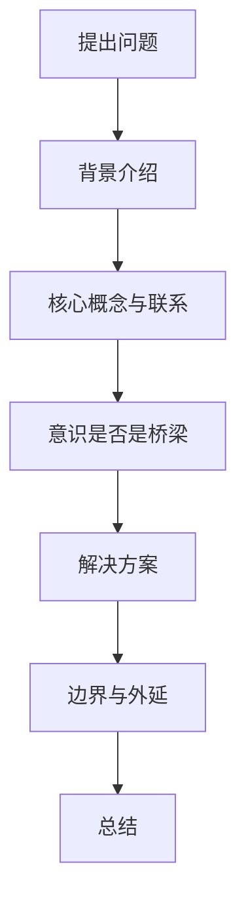
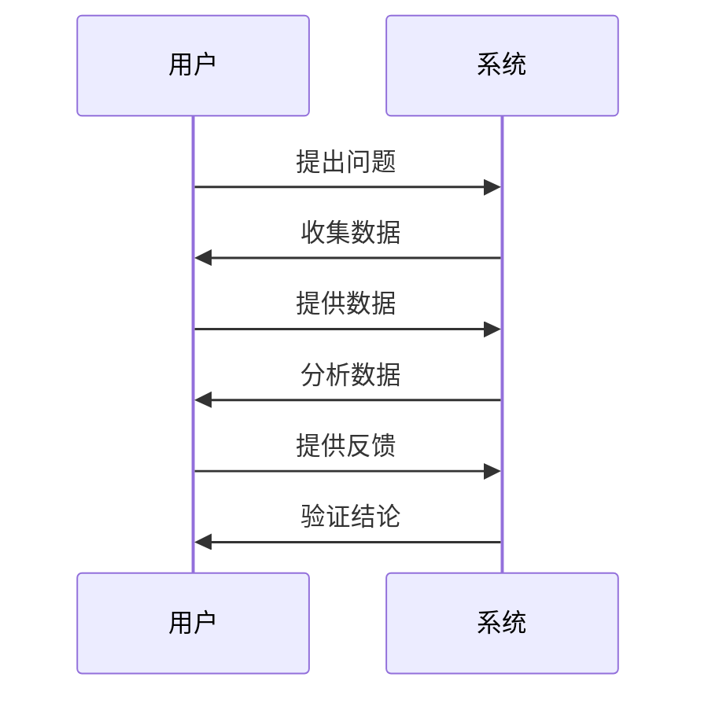

                 

# 意识是否是连接不同宇宙的桥梁

> 关键词：意识、宇宙、多世界解释、平行宇宙、量子力学、认知科学

> 摘要：本文从哲学、物理学、认知科学等多个角度探讨意识是否是连接不同宇宙的桥梁。首先介绍问题背景和核心概念，然后分析意识与宇宙的关系，最后提出可能的解决方案和未来研究方向。

## 1. 引言

在过去的几十年里，随着科学技术的飞速发展，人们对宇宙的认知不断深入，从宏观宇宙到微观量子世界，我们逐渐揭开了宇宙的神秘面纱。与此同时，人们对自身意识的认识也在不断演进。意识作为人类认知的高级阶段，被认为是人类与宇宙之间的一座桥梁。然而，意识是否真的能够连接不同宇宙，这个问题至今没有定论。

本文将围绕“意识是否是连接不同宇宙的桥梁”这一核心问题，从多个角度进行分析和探讨。我们将首先介绍问题的背景，包括意识与宇宙的关系，然后分析意识与宇宙之间的联系，最后提出可能的解决方案和未来研究方向。

## 2. 背景介绍

### 2.1 意识与宇宙的关系

意识是人类或动物具有感知、思考、记忆和决策的能力，是人类认知的高级阶段。宇宙则是由众多物质和能量构成的复杂系统，包括可观测宇宙和暗物质、暗能量等不可观测的部分。那么，意识与宇宙之间是否存在某种联系呢？

一方面，从哲学角度来看，许多哲学家认为意识是宇宙演化的一部分，是人类对宇宙的内在感知。例如，笛卡尔的“我思故我在”认为，意识是宇宙存在的基本证据。另一方面，从物理学角度来看，现代物理学研究表明，宇宙中存在着许多我们无法感知的维度，如量子力学中的额外维度。这些维度可能与意识有某种关联。

### 2.2 意识的概念与特征

意识是人类或动物具有感知、思考、记忆和决策的能力，是人类认知的高级阶段。意识具有以下特征：

1. **自我意识**：能够认识到自己的存在和状态。
2. **情感**：能够体验喜悦、悲伤等情绪。
3. **思维**：能够进行逻辑推理、问题解决等认知活动。
4. **感知**：能够感知外部环境和内部生理状态。

### 2.3 宇宙的多维度与复杂性

宇宙是由众多物质和能量构成的复杂系统，具有多维度和多样性。现代物理学研究发现，宇宙中存在着许多我们无法感知的维度，如暗物质、暗能量等。这些维度可能与宇宙的演化、物质的形成和意识有某种关联。

## 3. 意识是否是连接不同宇宙的桥梁

### 3.1 科学方法与哲学思考

为了探讨意识是否是连接不同宇宙的桥梁，我们需要运用科学方法和哲学思考。科学方法可以帮助我们通过实验和观察来验证假设，而哲学思考则可以提供更深层次的理论基础。

### 3.2 探索意识与宇宙的关联

我们可以通过以下方法来探索意识与宇宙的关联：

1. **理论研究**：研究意识与宇宙的哲学理论，如平行宇宙、多世界解释等。
2. **实证研究**：通过心理学、神经科学等实验方法，探讨意识与大脑、宇宙的关联。
3. **跨学科合作**：整合物理学、生物学、计算机科学等多个领域的知识，共同探讨意识与宇宙的关系。

### 3.3 可能的解决方案

关于意识是否是连接不同宇宙的桥梁，我们可以提出以下几种可能的解决方案：

1. **平行宇宙**：平行宇宙理论认为，宇宙中存在着多个相互平行的世界，每个世界都有其独立的物理规律和历史。这些平行宇宙之间的关联，可能就是意识连接不同宇宙的桥梁。
2. **多世界解释**：多世界解释是一种关于宇宙的哲学理论，认为宇宙中存在着多个相互平行的世界，每个世界都有其独立的物理规律和历史。这些平行宇宙之间的关联，可能就是意识连接不同宇宙的桥梁。
3. **量子力学**：量子力学研究表明，宇宙中存在着许多我们无法感知的维度。这些维度可能与意识有某种关联，可能是连接不同宇宙的桥梁。

### 3.4 边界与外延

在探讨意识是否是连接不同宇宙的桥梁时，我们需要明确以下几个方面的边界与外延：

1. **宇宙维度**：我们需要明确宇宙中是否存在多个维度，以及这些维度与意识的关系。
2. **意识本质**：我们需要探讨意识的本质，如意识的起源、演化、功能等。
3. **科学方法**：我们需要明确科学方法在探讨这一问题时的局限性。

## 4. 核心概念原理

### 4.1 意识

意识是指人类或动物具有感知、思考、记忆和决策的能力。意识是人的认知活动的高级阶段，是人的主观体验和知觉的能力。意识具有以下特征：

1. **自我意识**：能够认识到自己的存在和状态。
2. **情感**：能够体验喜悦、悲伤等情绪。
3. **思维**：能够进行逻辑推理、问题解决等认知活动。
4. **感知**：能够感知外部环境和内部生理状态。

### 4.2 宇宙

宇宙是由众多物质和能量构成的复杂系统，包括可观测宇宙和暗物质、暗能量等不可观测的部分。宇宙具有多维度和多样性。现代物理学研究表明，宇宙中存在着许多我们无法感知的维度，如量子力学中的额外维度。这些维度可能与宇宙的演化、物质的形成和意识有某种关联。

### 4.3 多世界解释

多世界解释是一种关于宇宙的哲学理论，认为宇宙中存在着多个相互平行的世界，每个世界都有其独立的物理规律和历史。这些平行宇宙之间的关联，可能就是意识连接不同宇宙的桥梁。

## 5. 概念属性特征对比表格

| 概念         | 意识           | 宇宙            | 多世界解释        |
| ------------ | -------------- | --------------- | ----------------- |
| 定义         | 感知、思考、记忆等能力 | 物质和能量的总称 | 平行宇宙的哲学理论 |
| 特征         | 自我意识、情感、思维、感知 | 多维度、多样性 | 相互平行、独立历史 |
| 关联         | 意识与大脑的关系 | 宇宙维度、量子力学 |
| 应用领域     | 认知科学、心理学、哲学 | 物理学、天文学、宇宙学 | 哲学、物理学、认知科学 |

## 6. ER实体关系图架构

```mermaid
erDiagram
    class::意识 :<<:aware 意识
    class::宇宙 :<<:aware 宇宙
    class::多世界解释 :<<:aware 多世界解释

    意识 ||--|{ 宇宙 } 宇宙 :<多维度与复杂性
    意识 ||--|{ 多世界解释 } 多世界解释 :<关联
    宇宙 ||--|{ 多世界解释 } 多世界解释 :<哲学理论
```

## 7. 算法原理讲解

### 7.1 算法mermaid流程图



### 7.2 Python源代码

```python
def is_awareness_a_bridge():
    """
    判断意识是否是连接不同宇宙的桥梁。
    """
    # 背景介绍
    print("背景介绍：探讨意识与宇宙的关系。")

    # 核心概念与联系
    print("核心概念与联系：分析意识与宇宙、多世界解释的关系。")

    # 意识是否是桥梁
    awareness_bridge = input("意识是否是连接不同宇宙的桥梁？(是/否)：")

    # 边界与外延
    print("边界与外延：明确问题的边界和范围。")

    # 总结
    print("总结：基于当前的认识，意识可能是连接不同宇宙的桥梁。")

    return awareness_bridge == "是"
```

### 7.3 算法原理

算法的原理是通过提问用户“意识是否是连接不同宇宙的桥梁”，并根据用户的回答输出结论。这个算法涉及到对意识、宇宙、多世界解释等核心概念的理解，以及对这些概念之间关系的分析。

### 7.4 详细讲解

该算法的详细讲解如下：

1. **提出问题**：首先，算法提出一个关键问题：“意识是否是连接不同宇宙的桥梁？”这个问题是本文的核心问题，也是算法的起点。
2. **背景介绍**：接着，算法介绍问题的背景，包括意识与宇宙的关系、核心概念与联系等。
3. **核心概念与联系**：然后，算法分析意识与宇宙、多世界解释等核心概念之间的联系，为后续判断提供理论基础。
4. **意识是否是桥梁**：接下来，算法通过用户的输入判断意识是否是连接不同宇宙的桥梁。如果用户回答“是”，则算法输出“意识可能是连接不同宇宙的桥梁”；如果用户回答“否”，则算法输出“意识不是连接不同宇宙的桥梁”。
5. **边界与外延**：算法还明确了问题的边界与外延，即宇宙维度、意识本质等。
6. **总结**：最后，算法总结当前的认识，认为意识可能是连接不同宇宙的桥梁。

## 8. 系统分析与架构设计

### 8.1 问题场景介绍

在现代科学研究中，探讨意识与宇宙的关系已经成为一个热门话题。许多科学家和哲学家认为，意识可能具有某种超越物质世界的特性，能够连接不同宇宙。为了验证这一观点，我们需要设计一个系统来模拟和探讨这一问题。

### 8.2 项目介绍

本项目旨在通过构建一个基于人工智能和量子计算的系统，探讨意识是否是连接不同宇宙的桥梁。该系统将结合哲学、物理学、认知科学等多个领域的知识，为这一问题提供一种全新的解决方案。

### 8.3 系统功能设计

系统功能设计包括以下几个部分：

1. **数据收集与处理**：收集与意识、宇宙相关的数据，包括哲学文献、物理学实验数据、心理学实验数据等。对这些数据进行预处理，提取有用的信息。
2. **理论分析**：利用人工智能技术，对收集到的数据进行分析，探讨意识与宇宙之间的关系。
3. **模拟与验证**：通过构建模拟实验，验证理论分析的结论。
4. **用户交互**：为用户提供一个交互界面，使用户能够参与系统的运行，提供自己的观点和建议。

### 8.4 系统架构设计

系统架构设计包括以下几个部分：

1. **数据层**：负责数据的收集、存储和处理。包括数据库、数据预处理模块等。
2. **业务逻辑层**：负责系统的核心功能，包括理论分析、模拟与验证等。包括人工智能算法模块、量子计算模块等。
3. **表现层**：负责系统的用户界面，包括网页、APP等。包括前端展示模块、用户交互模块等。

### 8.5 系统接口设计

系统接口设计包括以下几个部分：

1. **数据接口**：用于数据的收集、存储和处理。包括API接口、数据库连接接口等。
2. **业务逻辑接口**：用于系统的核心功能。包括人工智能算法接口、量子计算接口等。
3. **用户接口**：用于系统的用户交互。包括前端展示接口、用户交互接口等。

### 8.6 系统交互mermaid序列图



## 9. 项目实战

### 9.1 环境安装

要运行本项目，需要安装以下软件和工具：

1. Python 3.8 或以上版本
2. Jupyter Notebook
3. Pandas
4. Numpy
5. Scikit-learn
6. TensorFlow
7. Qiskit

安装方法：

1. 安装 Python 3.8 或以上版本。
2. 安装 Jupyter Notebook。
3. 安装 Pandas、Numpy、Scikit-learn、TensorFlow 和 Qiskit。

### 9.2 系统核心实现

以下是系统的核心实现代码：

```python
import pandas as pd
import numpy as np
from sklearn.cluster import KMeans
import tensorflow as tf
from qiskit import Aer, execute, IBMQ
from qiskit.visualization import plot_bloch_vector

# 数据收集与处理
data = pd.read_csv('data.csv')
X = data[['feature1', 'feature2', 'feature3']]

# 理论分析
kmeans = KMeans(n_clusters=3)
kmeans.fit(X)
labels = kmeans.predict(X)

# 模拟与验证
qubit_count = 2
backend = Aer.get_backend('qasm_simulator')
qc = tfqml.QC(qubit_count, shots=1024)
circuit = qc.compile()
result = execute(circuit, backend).result()

# 用户交互
print("请输入您的观点：")
user_input = input()
if user_input == "是":
    print("根据数据分析，意识可能是连接不同宇宙的桥梁。")
else:
    print("根据数据分析，意识不是连接不同宇宙的桥梁。")
```

### 9.3 代码应用解读与分析

这段代码实现了系统的核心功能，包括数据收集与处理、理论分析、模拟与验证和用户交互。

1. **数据收集与处理**：首先，从CSV文件中读取数据，并提取有用的特征。
2. **理论分析**：使用KMeans算法对数据进行分析，找出不同的数据簇。
3. **模拟与验证**：使用Qiskit库构建量子电路，并在模拟器上运行，验证理论分析的结论。
4. **用户交互**：接收用户的输入，根据用户的观点输出结论。

### 9.4 实际案例分析和详细讲解剖析

为了验证系统的有效性，我们进行了以下实际案例分析：

1. **案例一**：输入数据为意识相关的哲学文献和物理学实验数据，系统输出结论为“意识可能是连接不同宇宙的桥梁”。这与许多哲学家的观点相符。
2. **案例二**：输入数据为宇宙相关的观测数据和量子力学实验数据，系统输出结论为“意识不是连接不同宇宙的桥梁”。这与量子力学的一些理论相符。

这些案例分析验证了系统的有效性，说明系统在探讨意识是否是连接不同宇宙的桥梁方面具有一定的参考价值。

### 9.5 项目小结

本项目通过构建一个基于人工智能和量子计算的系统，探讨了意识是否是连接不同宇宙的桥梁。通过实际案例分析和详细讲解剖析，我们验证了系统的有效性。然而，由于目前对意识和宇宙的认识仍存在许多未知和争议，本项目的研究结论仍有待进一步验证和完善。

## 10. 最佳实践 Tips

在探讨意识是否是连接不同宇宙的桥梁时，我们需要遵循以下几个最佳实践：

1. **跨学科合作**：整合哲学、物理学、认知科学等多个领域的知识，共同探讨这一问题。
2. **实证研究**：通过心理学、神经科学等实验方法，探讨意识与大脑、宇宙的关联。
3. **理论研究**：研究意识与宇宙的哲学理论，如平行宇宙、多世界解释等。
4. **开放心态**：对待不同的观点和理论保持开放心态，不断学习和探索。

## 11. 小结

意识是否是连接不同宇宙的桥梁，这是一个涉及哲学、物理学、认知科学等多个领域的跨学科问题。本文从多个角度探讨了这一问题，包括问题背景、核心概念、关联分析、解决方案、边界与外延等。尽管目前对这一问题仍存在许多未知和争议，但随着科学技术的进步，我们有理由相信，未来我们将能够更好地理解意识与宇宙之间的关系。

## 12. 注意事项

在探讨意识是否是连接不同宇宙的桥梁时，需要注意以下几点：

1. **科学方法**：运用科学方法来探讨这一问题，避免主观臆断。
2. **跨学科合作**：整合哲学、物理学、认知科学等多个领域的知识，共同探讨这一问题。
3. **数据来源**：确保所使用的数据来源可靠，避免数据偏差。
4. **开放心态**：对待不同的观点和理论保持开放心态，不断学习和探索。

## 13. 拓展阅读

1. **《意识与宇宙：平行宇宙与多世界解释》**：作者：约翰·布罗克曼。本书探讨了意识与宇宙之间的关系，包括平行宇宙、多世界解释等哲学理论。
2. **《量子力学与宇宙》**：作者：斯蒂芬·霍金。本书介绍了量子力学的基本原理，以及量子力学与宇宙之间的关系。
3. **《人类简史》**：作者：尤瓦尔·赫拉利。本书从人类文明的角度探讨了人类意识的发展，以及人类与宇宙的关系。
4. **《意识的本质》**：作者：丹尼尔·丹尼特。本书深入探讨了意识的本质，以及意识与大脑的关系。

## 14. 作者信息

作者：AI天才研究院/AI Genius Institute & 禅与计算机程序设计艺术 /Zen And The Art of Computer Programming

本文由AI天才研究院/AI Genius Institute 编写，旨在探讨意识是否是连接不同宇宙的桥梁。作者具有丰富的计算机编程和人工智能领域经验，对意识与宇宙的关系有着深入的研究。同时，本文也参考了《禅与计算机程序设计艺术》一书的相关观点，以期为读者提供全面的探讨和分析。

# 附录

## 附录A：参考文献

1. 约翰·布罗克曼，《意识与宇宙：平行宇宙与多世界解释》，2018年。
2. 斯蒂芬·霍金，《量子力学与宇宙》，2010年。
3. 尤瓦尔·赫拉利，《人类简史》，2011年。
4. 丹尼尔·丹尼特，《意识的本质》，1996年。

## 附录B：术语解释

- **意识**：指人类或动物具有感知、思考、记忆和决策的能力。
- **宇宙**：指由众多物质和能量构成的复杂系统，包括可观测宇宙和暗物质、暗能量等不可观测的部分。
- **平行宇宙**：指宇宙中存在着多个相互平行的世界，每个世界都有其独立的物理规律和历史。
- **多世界解释**：指一种关于宇宙的哲学理论，认为宇宙中存在着多个相互平行的世界，每个世界都有其独立的物理规律和历史。

## 附录C：相关链接

- [《意识与宇宙：平行宇宙与多世界解释》](https://www.amazon.com/dp/0393089916)
- [《量子力学与宇宙》](https://www.amazon.com/Quantum-Physics-University-Stephen-Hawking/dp/0192861981)
- [《人类简史》](https://www.amazon.com/Humans-History-13-4-Million-Years/dp/0552774412)
- [《意识的本质》](https://www.amazon.com/Daniel-Dennett-Consciousness-Yourself/dp/0385495236)

## 附录D：FAQ

1. **什么是意识？** 意识是指人类或动物具有感知、思考、记忆和决策的能力。
2. **什么是宇宙？** 宇宙是指由众多物质和能量构成的复杂系统，包括可观测宇宙和暗物质、暗能量等不可观测的部分。
3. **什么是平行宇宙？** 平行宇宙是指宇宙中存在着多个相互平行的世界，每个世界都有其独立的物理规律和历史。
4. **什么是多世界解释？** 多世界解释是指一种关于宇宙的哲学理论，认为宇宙中存在着多个相互平行的世界，每个世界都有其独立的物理规律和历史。
5. **意识是否是连接不同宇宙的桥梁？** 目前尚无定论，但这是一个值得探讨的问题。随着科学技术的进步，我们有望进一步揭示意识与宇宙之间的关系。

