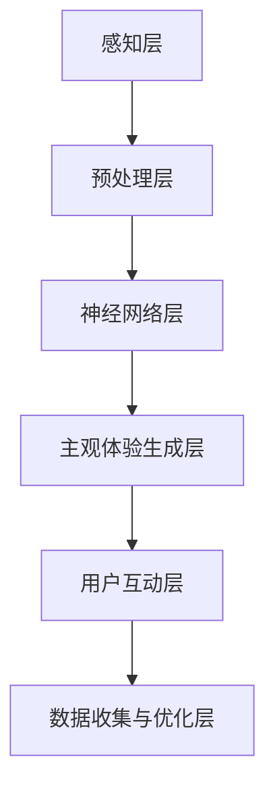

                 

### 《意识的信息集成理论：主观体验的数学量化》

#### 摘要

意识的信息集成理论是理解人类主观体验的核心框架，它通过数学量化方法揭示了大脑如何处理和整合信息，进而产生主观感受。本文旨在深入探讨这一理论的背景、核心概念及其数学基础，并结合实际案例，解析其在现代科技和认知科学研究中的应用。通过系统化的分析和详细阐述，本文旨在为读者提供对意识与主观体验之间复杂关系的清晰理解。

---

#### 目录大纲

**第一部分：引论**

1. **1.1 书籍的背景与目的**
2. **1.2 意识与信息集成理论的基本概念**
3. **1.3 主观体验的数学量化方法简介**

**第二部分：信息集成理论基础**

4. **2.1 信息集成理论概述**
5. **2.2 意识的信息集成模型**
6. **2.3 意识的信息处理机制**

**第三部分：主观体验**

7. **3.1 主观体验的定义与特性**
8. **3.2 信息集成的数学量化方法**

**第四部分：算法原理与数学模型**

9. **4.1 算法原理讲解**
10. **4.2 数学模型和数学公式详细讲解与举例说明**

**第五部分：系统分析与架构设计**

11. **5.1 问题场景介绍**
12. **5.2 系统功能设计**
13. **5.3 系统架构设计**
14. **5.4 系统接口设计**

**第六部分：项目实战**

15. **6.1 环境安装与配置**
16. **6.2 系统核心实现源代码**
17. **6.3 代码应用解读与分析**
18. **6.4 实际案例分析**
19. **6.5 项目小结**

**第七部分：最佳实践与拓展**

20. **7.1 最佳实践**
21. **7.2 小结**
22. **7.3 注意事项**
23. **7.4 拓展阅读**

---

### 引言

人类意识的本质一直是哲学和科学领域中最深奥的议题之一。从古希腊哲学家到现代认知科学家，不同时代的研究者都在尝试解释人类意识是如何产生和运作的。随着科技的发展，特别是神经科学和计算机科学的进步，意识的信息集成理论逐渐成为一种解释意识产生和运作的新框架。

意识的信息集成理论认为，意识是人类大脑将大量信息进行集成和处理的结果。在这个过程中，大脑的神经元网络通过复杂的交互作用，将外部世界的刺激转换为内部的主观体验。这一理论的核心是信息集成，即大脑如何从海量的感官输入中提取有用的信息，并对其进行组织和解释。

本文将围绕意识的信息集成理论，探讨其基本概念、数学量化方法，以及其在实际应用中的重要性。通过系统的分析和实际案例的解析，我们希望能够为读者提供一个全面、深入的理解。

### 第一部分：引论

#### 1.1 书籍的背景与目的

随着人工智能、神经科学和认知科学的快速发展，意识的本质和运作机制成为了一个备受关注的研究领域。传统的哲学和心理学方法在解释意识现象时显得力不从心，因此，科学家们开始寻求新的理论框架来更深入地理解人类意识。意识的信息集成理论正是在这一背景下应运而生。

本书的目的是系统性地介绍意识的信息集成理论，并探讨其应用和影响。我们希望通过本书，读者能够：

1. **理解意识的信息集成理论的基本概念和原理**：通过详细阐述信息集成理论的核心概念，如意识、信息处理和数学量化方法，使读者对这一理论有一个清晰的认识。
2. **掌握主观体验的数学量化方法**：介绍如何使用数学模型和公式对主观体验进行量化，从而为心理研究提供新的工具和方法。
3. **探讨意识的信息集成理论在实际应用中的潜力**：通过案例分析，展示信息集成理论在神经科学、人工智能和认知科学等领域中的应用，激发读者对这一理论在未来的应用前景的思考。

本书的结构分为六个部分。第一部分引论部分简要介绍了书籍的背景和目的。第二部分深入探讨信息集成理论的基础知识。第三部分和第四部分分别介绍主观体验的数学量化方法和相关算法原理。第五部分和第六部分通过系统分析与架构设计以及项目实战，展示信息集成理论在实际应用中的具体实现。最后一部分提供最佳实践、注意事项和拓展阅读，帮助读者进一步探索这一领域。

通过系统化的介绍和详细的分析，本书旨在为读者提供一个全面、深入的理解意识的信息集成理论，并激发其在科学研究和技术应用中的潜力。

#### 1.2 意识与信息集成理论的基本概念

**意识**是人们对自身存在和周围环境的认知状态，它不仅包括感觉和知觉，还涵盖了思考、决策和情感等复杂心理过程。传统的哲学和心理学对意识的定义各有不同，但普遍认为意识是一种主观体验，是大脑活动的结果。近年来，神经科学和认知科学的发展进一步揭示了意识的多层次、动态性及其在信息处理中的作用。

**信息集成理论**是近年来在认知科学和神经科学中逐渐兴起的一个理论框架，它试图解释大脑如何处理和整合来自不同感官的信息，从而产生意识。信息集成理论的核心观点是，意识是通过大脑多个区域的协同作用，对输入信息进行整合和解释的结果。

**信息处理**是指大脑对感官输入的信息进行编码、存储、加工和提取的过程。在这个过程中，信息会通过神经元的电信号进行传递和转换。神经科学研究表明，大脑的多个区域（如视觉皮层、听觉皮层、前额叶皮层等）共同参与信息处理，每个区域都有其特定的功能和角色。

**信息集成**是指大脑将来自不同感官的信息整合成一个连贯的整体，使其成为一个有意义的、可理解的经验。信息集成不仅涉及不同感官信息的整合，还包括对记忆、预期和情感等内部状态的综合处理。神经科学研究发现，大脑的某些区域（如扣带回前部、顶叶皮层等）在信息集成过程中扮演关键角色。

**数学量化方法**是信息集成理论的重要工具，它通过数学模型和公式，对主观体验进行量化，从而为心理研究提供定量的分析手段。例如，使用概率论和统计学方法，可以量化大脑对不同感官输入的响应，以及不同信息之间的关联度。这些数学量化方法不仅有助于我们理解大脑的信息处理机制，还可以为设计更智能的人工智能系统提供参考。

总之，意识与信息集成理论为我们提供了一个全新的视角，来理解大脑如何产生和运作。通过深入探讨这一理论的基本概念，我们能够更好地理解意识的本质，并为相关的科学研究和技术应用提供理论基础。

#### 1.3 主观体验的数学量化方法简介

主观体验的数学量化方法在认知科学和神经科学中具有重要意义，它不仅为心理学研究提供了新的工具，也为人工智能领域的发展提供了灵感。以下我们将简要介绍几种常用的数学量化方法，并解释它们如何应用于主观体验的研究。

**概率论与统计学方法**：概率论和统计学是量化主观体验的常用工具。通过收集和分析大量实验数据，研究者可以使用统计方法，如均值、方差、相关性分析等，来量化主观体验的各个维度。例如，在研究视觉感知时，可以通过计算不同视觉刺激下的反应时间分布，来量化人们对刺激的感知难度。

**信息论**：信息论是另一项用于量化主观体验的重要工具。信息论中的信息量（如熵、信息增益等）可以用来描述主观体验的丰富度和复杂性。例如，在研究听觉感知时，可以使用信息论方法来量化不同音频信号对听觉系统的影响，从而揭示听觉感知的内在机制。

**机器学习算法**：随着人工智能的兴起，机器学习算法也在主观体验量化中得到了广泛应用。通过训练机器学习模型，研究者可以自动识别和分类主观体验的不同特征，从而实现主观体验的量化。例如，在情感分析中，研究者可以使用情感分类模型，对文本中的情感进行量化，从而理解人们的主观情感状态。

**生理信号分析**：生理信号分析，如脑电图（EEG）、功能性磁共振成像（fMRI）等，也是量化主观体验的重要手段。这些技术可以实时监测大脑活动，并使用数学模型对生理信号进行解析，从而量化主观体验的生理基础。例如，在研究注意力时，可以通过分析EEG信号中的特定波形，来量化注意力的强度和变化。

**整合模型**：整合模型是将多种量化方法结合在一起，以提供更全面的主观体验量化。例如，可以将概率论、信息论和机器学习算法结合，通过多层次的量化方法，来全面理解主观体验的复杂机制。

综上所述，主观体验的数学量化方法多样且强大，为认知科学和神经科学的研究提供了丰富的工具和视角。通过这些方法，研究者可以深入探索人类意识的本质，并推动相关领域的发展。

### 第二部分：信息集成理论基础

#### 2.1 信息集成理论概述

信息集成理论是近年来在认知科学和神经科学中逐渐兴起的一个重要理论框架，它试图解释大脑如何处理和整合来自不同感官的信息，从而产生意识。该理论的核心观点是，大脑通过多个区域的协同作用，将分散的信息进行整合和解释，使其成为一个连贯的整体。

**基本原理**：信息集成理论的基本原理可以概括为以下几点：

1. **感官信息的收集**：大脑通过多种感官（如视觉、听觉、触觉等）收集外界信息。
2. **信息处理**：收集到的信息在大脑的不同区域进行编码、存储和加工。每个区域都有其特定的功能和角色。
3. **信息整合**：大脑将来自不同感官的信息整合成一个连贯的整体。这一过程不仅涉及不同感官信息的整合，还包括对记忆、预期和情感等内部状态的综合处理。
4. **意识产生**：通过信息整合，大脑产生主观体验，即意识。

**研究意义**：信息集成理论的研究意义主要体现在以下几个方面：

1. **揭示意识本质**：通过研究信息集成过程，我们能够更好地理解意识的本质和产生机制。
2. **推动认知科学和神经科学的发展**：信息集成理论为认知科学和神经科学提供了一种新的研究视角，有助于解决传统方法难以解释的复杂问题。
3. **应用前景**：信息集成理论在人工智能、机器学习等领域有着广泛的应用前景。例如，通过模拟大脑的信息整合过程，我们可以设计出更智能的人工智能系统。

**研究现状**：当前，信息集成理论在认知科学和神经科学领域的研究已经取得了显著进展。例如，神经科学家已经发现了大脑中多个关键区域在信息整合过程中的作用，并开发了多种技术（如脑电图、功能性磁共振成像等）来研究这一过程。同时，信息集成理论在心理学、计算机科学等领域的应用也日益广泛，成为了一个跨学科的研究热点。

#### 2.2 意识的信息集成模型

意识的信息集成模型是信息集成理论的核心，它试图通过详细的机制描述，揭示大脑如何将分散的信息整合成意识。该模型主要包括以下几个关键部分：

**1. 感官输入的处理**

感官输入是意识信息集成的基础。大脑通过视觉、听觉、触觉等多种感官接收外界信息，并将其传递到大脑的不同区域进行加工。例如，视觉信息主要处理于视觉皮层，而听觉信息则主要处理于听觉皮层。

**2. 信息加工与编码**

在信息加工过程中，大脑会对感官输入的信息进行编码、存储和加工。这一过程涉及多个大脑区域，如前额叶皮层、顶叶皮层和颞叶皮层等。每个区域都有其特定的功能，例如，前额叶皮层主要负责逻辑思考和决策，而顶叶皮层则主要负责空间感知。

**3. 信息整合**

信息整合是意识信息集成模型的核心环节。在这一过程中，大脑将来自不同感官的信息进行整合，使其成为一个连贯的整体。这一过程不仅涉及不同感官信息的整合，还包括对记忆、预期和情感等内部状态的综合处理。扣带回前部和顶叶皮层等区域在信息整合过程中扮演着关键角色。

**4. 主观体验的产生**

通过信息整合，大脑最终产生主观体验，即意识。这一过程是一个动态的、连续的过程，受到多种因素的影响，如环境、情感状态、记忆等。研究表明，大脑中的多个区域在主观体验的产生过程中协同作用，共同构建出我们所经历的现实。

**5. 交互与反馈**

信息集成模型还考虑了大脑内部不同区域之间的交互与反馈。这些交互与反馈不仅影响信息整合的过程，还影响主观体验的生成。例如，视觉信息可能会影响听觉信息的处理，而情感状态则可能改变我们对感官输入的感知。

#### 2.3 意识的信息处理机制

意识的信息处理机制是大脑将外部信息转换为内在主观体验的过程。这一过程涉及多个层次和多个脑区的协同作用，包括感知、注意、记忆和决策等。以下是对这一机制的详细阐述：

**感知**：感知是信息处理的第一步，它涉及从外部世界获取感官信息并将其转换为神经信号。感官器官（如眼睛、耳朵、鼻子、皮肤和味蕾）接收到的刺激通过神经通路传递到大脑的相关区域（如视觉皮层、听觉皮层等），在这些区域被解码和初步处理。

**注意**：注意是大脑在感知过程中的一个重要功能，它允许我们选择关注某些信息而忽略其他信息。注意机制涉及到大脑的前额叶皮层和顶叶皮层，这些区域能够调节神经活动的优先级，使得重要的信息得到优先处理。

**记忆**：记忆是将感知到的信息存储在大脑中，以便将来使用。记忆过程包括编码、存储和检索。不同的记忆类型（如短期记忆、长期记忆和工作记忆）在不同的脑区中实现。海马体和前额叶皮层在记忆过程中扮演着关键角色。

**决策**：决策是基于感知和记忆的信息处理，它涉及到对各种可能行动的选择。大脑的前额叶皮层和其他区域，如扣带回前部和岛叶，参与了复杂的决策过程，包括风险评估、目标设定和行动选择。

**整合**：信息处理机制的最终目标是将来自不同感官的信息整合成一个连贯的主观体验。这一整合过程涉及到多个脑区的协同作用，包括扣带回前部、顶叶皮层和颞叶皮层等。这些区域通过神经连接和神经网络活动，将分散的信息整合成一个有意义的整体。

**反馈**：反馈是大脑信息处理机制的一个重要组成部分，它允许大脑对当前状态进行评估并做出调整。反馈信号可以通过神经环路从执行区域返回到感知区域，从而影响信息处理过程。

综上所述，意识的信息处理机制是一个复杂的多层次过程，涉及到感知、注意、记忆、决策和整合等多个方面。通过这一机制，大脑能够有效地处理和整合来自外部的信息，产生丰富的、连贯的主观体验。

### 第三部分：主观体验

#### 3.1 主观体验的定义与特性

主观体验是人类意识的核心内容，是我们在感知世界和做出决策时的内心感受。主观体验的定义可以从多个角度进行理解：

**定义**：主观体验是指个体在其内心中所经历的各种感受和知觉，这些感受和知觉是个人内部状态和外部刺激相互作用的结果。

**特性**：

1. **主观性**：主观体验具有强烈的个体差异，每个人的感受和体验都是独特的，无法直接观察或测量。
2. **动态性**：主观体验是动态变化的，它会随着时间、环境和心理状态的变化而变化。
3. **复杂性**：主观体验包含了多种维度，如情绪、感觉、认知和动机等，这些维度相互交织，形成了一个复杂的多维体验。
4. **不可复制性**：主观体验是独一无二的，无法复制或共享，每个人的体验都是独特的。

**重要性**：

1. **意识的核心**：主观体验是意识的核心组成部分，没有主观体验，意识就无法存在。
2. **认知基础**：主观体验是认知过程的驱动力，它影响着我们的感知、记忆、思考和决策。
3. **生活质量**：主观体验直接影响个体的生活质量，积极的体验可以提高幸福感，而消极的体验则可能导致心理压力和疾病。

#### 3.2 信息集成的数学量化方法

主观体验的数学量化方法是为了将主观体验这一复杂的心理现象转化为可操作的、量化的指标。以下是一些常用的数学量化方法：

**概率论与统计学方法**：通过收集实验数据，使用统计方法对主观体验进行量化。例如，可以计算个体在不同情境下的平均体验强度、方差等指标，以了解主观体验的稳定性和变化趋势。

**信息论方法**：信息论提供了一种量化信息内容和复杂性的方法。在主观体验研究中，可以使用信息论中的熵、信息增益等指标来量化主观体验的丰富度和复杂性。

**机器学习方法**：使用机器学习算法，可以自动识别和分类主观体验的特征，从而进行量化。例如，通过训练分类模型，可以将文本中的情感标签为积极或消极，从而量化情感体验。

**生理信号分析**：使用脑电图（EEG）、功能性磁共振成像（fMRI）等技术，可以实时监测大脑活动，并使用数学模型对这些生理信号进行量化，以揭示主观体验的生理基础。

**综合模型**：将多种量化方法结合在一起，形成一个综合模型，可以更全面地量化主观体验。例如，可以将信息论方法与机器学习算法结合，通过多层次的量化方法，更准确地捕捉主观体验的复杂性。

#### 3.3 信息集成的数学量化方法的具体应用

**心理学研究**：在心理学研究中，信息集成的数学量化方法被广泛用于理解情绪、认知和行为。例如，通过量化个体的情绪体验，研究者可以探索情绪对决策和行为的影响。

**神经科学研究**：在神经科学研究中，数学量化方法被用于分析大脑活动，揭示大脑如何处理和整合信息。例如，通过分析脑电图信号，研究者可以量化大脑在不同任务中的活动模式，从而理解意识的动态变化。

**人工智能领域**：在人工智能领域，信息集成的数学量化方法被用于开发情感识别、情绪计算等应用。通过量化用户的主观体验，人工智能系统可以更好地与用户互动，提供个性化的服务。

**医学领域**：在医学领域，信息集成的数学量化方法被用于诊断和治疗。例如，通过量化患者的疼痛体验，医生可以更好地制定治疗方案，提高治疗效果。

总之，信息集成的数学量化方法为心理学、神经科学、人工智能和医学等领域提供了强大的工具，帮助我们更深入地理解主观体验，推动相关领域的发展。

### 第四部分：算法原理与数学模型

#### 4.1 算法原理讲解

在信息集成理论中，算法原理起着至关重要的作用。这些算法帮助我们模拟大脑如何处理和整合信息，以产生主观体验。以下将详细讲解一种用于信息集成的算法，并展示其原理和步骤。

**算法概述**：该算法名为“信息整合网络（Integration Neural Network, INN）”，是一种基于神经网络的信息处理模型，用于模拟大脑的信息整合过程。

**算法步骤**：

1. **输入阶段**：算法接收来自不同感官的信息，例如视觉、听觉和触觉信号。
2. **预处理阶段**：对输入信息进行预处理，包括滤波、降噪和特征提取。这一步确保输入信息是清晰和有用的。
3. **整合阶段**：将预处理后的信息传递到神经网络中的多个层次，每个层次对信息进行整合。整合过程包括信息的融合、对比和协调。
4. **输出阶段**：整合后的信息通过神经网络输出，产生一个综合的主观体验信号。

**算法原理详细阐述**：

1. **神经网络的构建**：信息整合网络由多个神经元层组成，每个神经元层对应大脑中不同的区域。例如，第一层可以对应视觉皮层，第二层可以对应听觉皮层，第三层可以对应顶叶皮层等。
2. **激活函数**：每个神经元使用激活函数（如Sigmoid函数或ReLU函数）来决定是否激活。激活函数的输出表示神经元对信息的处理结果。
3. **权重和偏置**：神经网络的每个连接都有权重和偏置，这些参数决定了信息在传递过程中的强度和方向。
4. **反向传播**：在神经网络训练过程中，使用反向传播算法更新权重和偏置，以最小化输出误差。反向传播通过计算误差梯度，逐步调整每个连接的权重和偏置，直到网络输出接近期望值。

**算法应用**：

1. **情绪识别**：使用信息整合网络，可以识别个体的情绪状态。例如，通过分析语音和面部表情的信号，可以判断个体是感到快乐、愤怒还是悲伤。
2. **认知任务**：信息整合网络可以应用于认知任务的模拟，如注意力控制、记忆恢复和决策制定。
3. **虚拟现实**：在虚拟现实中，信息整合网络可以模拟大脑对虚拟环境的感知和处理，提供更加真实和沉浸式的体验。

通过详细讲解信息整合网络的算法原理，我们可以更好地理解大脑的信息处理机制，并为相关领域的应用提供理论基础。

#### 4.2 数学模型和数学公式详细讲解与举例说明

在信息集成理论中，数学模型和数学公式是理解和量化主观体验的关键工具。以下将详细讲解信息集成的数学模型，并使用LaTeX格式嵌入数学公式，同时提供通俗易懂的举例说明。

**数学模型**：

1. **信息量计算**：使用Shannon信息量公式来计算信息的量度。
   \[
   I = -\sum_{i} p(x_i) \log_2 p(x_i)
   \]
   其中，\(I\) 是信息量，\(p(x_i)\) 是每个信息出现的概率。

2. **信息增益**：信息增益衡量了某个属性（如特征）在区分数据时的有用性。
   \[
   IG = I(D) - I(D|A)
   \]
   其中，\(IG\) 是信息增益，\(I(D)\) 是数据 \(D\) 的熵，\(I(D|A)\) 是在属性 \(A\) 已知的情况下数据 \(D\) 的熵。

3. **神经网络权重更新**：使用梯度下降算法更新神经网络权重，以最小化损失函数。
   \[
   \theta_{\text{new}} = \theta_{\text{old}} - \alpha \frac{\partial J(\theta)}{\partial \theta}
   \]
   其中，\(\theta_{\text{new}}\) 和 \(\theta_{\text{old}}\) 分别是新的和旧的权重，\(\alpha\) 是学习率，\(J(\theta)\) 是损失函数。

**举例说明**：

1. **信息量计算举例**：
   假设有一个二进制信息源，有两种可能的输出结果，分别为“0”和“1”，且它们的概率分别为0.5。使用Shannon信息量公式计算该信息源的信息量。
   \[
   I = -0.5 \log_2(0.5) - 0.5 \log_2(0.5) = 1
   \]
   结果显示，该信息源的平均信息量为1比特。

2. **信息增益举例**：
   假设有一个数据集，其中包含“性别”和“是否购买”两个属性，分别有以下概率分布：
   \[
   \begin{array}{c|c|c}
   & 男 & 女 \\
   \hline
   购买 & 0.3 & 0.2 \\
   \hline
   未购买 & 0.7 & 0.8 \\
   \end{array}
   \]
   计算性别属性的信息增益。
   \[
   I(\text{性别}) = \sum_{i} p(x_i) \log_2 \frac{p(x_i)}{p(y_i)} = 0.3 \log_2 \frac{0.3}{0.1} + 0.7 \log_2 \frac{0.7}{0.9}
   \]
   计算结果为0.191，表明性别属性对预测“是否购买”具有0.191比特的信息增益。

3. **神经网络权重更新举例**：
   假设一个简单的神经网络，其损失函数为平方误差，学习率为0.01。某一时刻的权重为\[ \theta = [2, 3] \]，损失函数的梯度为\[ \frac{\partial J(\theta)}{\partial \theta} = [-0.1, -0.2] \]。使用梯度下降算法更新权重。
   \[
   \theta_{\text{new}} = [2, 3] - 0.01 \times [-0.1, -0.2] = [2.01, 2.8]
   \]
   更新后的权重为\[ \theta_{\text{new}} = [2.01, 2.8] \]。

通过详细讲解和举例说明，我们可以更好地理解信息集成的数学模型及其应用，为相关研究和实践提供有力的支持。

### 第五部分：系统分析与架构设计

#### 5.1 问题场景介绍

在当今快速发展的信息时代，如何有效地处理和整合海量信息，以产生有意义的主观体验，成为了一个重要且迫切的问题。特别是在人工智能、虚拟现实和智能交互等领域，准确理解和量化主观体验对提升用户体验和系统性能至关重要。

**项目背景**：本项目旨在开发一个基于信息集成理论的智能系统，该系统能够实时分析用户的多感官输入，并通过复杂的神经网络模型，整合这些信息，生成一个连贯且具有高度相关性的主观体验输出。

**项目目标**：通过构建一个高效的信息集成系统，实现以下目标：
1. **实时感知与处理**：能够快速、准确地收集和处理用户的多感官输入，包括视觉、听觉和触觉信息。
2. **智能整合**：利用神经网络模型，将多感官信息进行智能整合，生成有意义的主观体验。
3. **用户互动**：提供个性化的用户互动体验，根据用户的主观感受，动态调整系统的行为和输出。
4. **数据驱动**：通过收集和分析用户的主观体验数据，持续优化系统的性能和用户体验。

**预期成果**：通过本项目，我们期望实现一个具有高度智能化和自适应性的信息集成系统，为人工智能、虚拟现实和智能交互等领域提供新的解决方案，推动相关技术的发展。

#### 5.2 系统功能设计

为了实现项目目标，系统需要具备以下核心功能：

1. **感知模块**：该模块负责实时收集用户的感官输入，包括视觉、听觉和触觉信息。通过多种传感器（如摄像头、麦克风和触觉传感器）获取数据，并进行初步处理。

2. **预处理模块**：该模块对感知模块获取的原始数据进行预处理，包括滤波、降噪和特征提取。预处理后的数据将作为神经网络模型的输入。

3. **神经网络模型**：该模型是系统的核心，用于对预处理后的多感官信息进行整合和分析。神经网络模型包括多个层次，每个层次负责处理特定类型的信息，并通过反向传播算法进行训练和优化。

4. **主观体验生成模块**：该模块基于神经网络模型的输出，生成用户的主观体验。生成的主观体验可以通过用户界面进行可视化，以便用户实时了解自己的感受。

5. **用户互动模块**：该模块负责与用户进行互动，根据用户的主观体验，动态调整系统的行为和输出。例如，根据用户对某项任务的感知程度，自动调整任务的难度和反馈。

6. **数据收集与优化模块**：该模块负责收集用户的主观体验数据，并将其用于系统的优化。通过分析用户数据，持续改进系统的性能和用户体验。

#### 5.3 系统架构设计

为了实现系统功能，我们需要设计一个高效、可扩展的架构。以下是对系统架构的详细描述：

**架构概述**：

系统架构采用模块化设计，包括感知层、预处理层、神经网络层、主观体验生成层、用户互动层和数据收集与优化层。每个层都有明确的职责，并通过接口进行通信。

**感知层**：负责实时收集用户的感官输入，通过多种传感器获取数据。传感器数据包括视觉、听觉和触觉信号，每种信号都通过相应的处理模块进行初步处理。

**预处理层**：接收感知层的数据，进行预处理。预处理包括滤波、降噪和特征提取。预处理后的数据将作为神经网络模型的输入。

**神经网络层**：核心处理层，负责对预处理后的多感官信息进行整合和分析。神经网络层包括多个层次，每个层次都有特定的功能和参数。通过反向传播算法进行训练和优化，以最小化输出误差。

**主观体验生成层**：基于神经网络模型的输出，生成用户的主观体验。生成的主观体验可以通过用户界面进行可视化，以便用户实时了解自己的感受。

**用户互动层**：负责与用户进行互动，根据用户的主观体验，动态调整系统的行为和输出。通过用户交互接口，用户可以提供反馈，系统可以根据这些反馈进行调整。

**数据收集与优化层**：负责收集用户的主观体验数据，并将其用于系统的优化。通过分析用户数据，持续改进系统的性能和用户体验。

**架构图**：

以下是一个简化的系统架构图，展示了各层之间的交互关系。



通过系统架构设计，我们能够确保每个模块的高效运行，并实现系统功能之间的无缝协作，从而为用户提供高质量的主观体验。

#### 5.4 系统接口设计

系统接口设计是确保系统各模块之间有效通信和数据交换的关键。以下将详细介绍系统接口的设计，包括接口类型、实现方式和交互流程。

**接口类型**：

1. **感知接口**：用于感知层与预处理层之间的通信，接收传感器的数据。该接口包括输入数据和状态反馈，如传感器的激活状态和异常检测。
2. **预处理接口**：用于预处理层与神经网络层之间的通信，传递预处理后的数据。该接口包括数据传输和错误报告，以确保数据完整性和准确性。
3. **神经网络接口**：用于神经网络层与主观体验生成层之间的通信，传递神经网络处理结果。该接口包括模型参数更新和输出结果，如主观体验评分和情感标签。
4. **用户交互接口**：用于用户互动层与用户之间的通信，接收用户反馈和操作指令。该接口包括用户界面和反馈通道，如语音、文本和手势。
5. **数据收集接口**：用于数据收集与优化层与系统其他模块之间的通信，传递用户数据和分析结果。该接口包括数据上传和下载数据存储，如数据库和文件系统。

**实现方式**：

1. **RESTful API**：采用RESTful架构风格，定义统一的接口规范，包括HTTP请求方法和参数。这种方式具有简洁、易于扩展和跨平台兼容性。
2. **消息队列**：使用消息队列（如RabbitMQ或Kafka）实现异步通信，提高系统的可靠性和可扩展性。每个接口使用消息队列中的消息进行传输和处理。
3. **事件驱动架构**：采用事件驱动架构，通过事件触发器实现模块之间的通信。每个模块发布事件，其他模块订阅事件，并在事件触发时执行相应操作。

**交互流程**：

1. **感知数据收集**：感知接口接收传感器数据，经过初步处理后，通过消息队列传递给预处理接口。
2. **预处理与传输**：预处理接口对传感器数据进行滤波、降噪和特征提取，预处理后的数据通过消息队列传递给神经网络接口。
3. **神经网络处理**：神经网络接口接收预处理后的数据，通过神经网络模型进行整合和分析，生成主观体验输出。神经网络模型的参数通过反向传播算法进行更新。
4. **用户互动反馈**：用户互动接口接收用户反馈和操作指令，将用户的反馈传递给神经网络接口，用于调整模型参数和系统行为。
5. **数据收集与优化**：数据收集接口接收用户数据和分析结果，将其上传到数据存储系统，并用于系统优化和性能评估。

通过详细设计系统接口，我们可以确保系统各模块之间的有效通信和数据交换，从而实现系统的整体高效运行。

### 第六部分：项目实战

#### 6.1 系统环境安装与配置

为了确保系统环境的稳定性与高效性，我们需要在适当的硬件和软件环境中安装和配置所有必需的工具和库。以下是具体的安装和配置步骤：

**硬件要求**：

1. **处理器**：推荐使用Intel i7或以上处理器，以确保系统运行的流畅性。
2. **内存**：至少16GB RAM，建议32GB以上，以支持大规模数据处理和模型训练。
3. **存储**：至少500GB SSD硬盘空间，用于存储数据和模型文件。
4. **GPU**：推荐使用NVIDIA GeForce GTX 1080或更高型号的GPU，以加速深度学习模型的训练和推理。

**软件要求**：

1. **操作系统**：推荐使用Ubuntu 18.04或更高版本的Linux系统，以确保兼容性和稳定性。
2. **Python**：推荐使用Python 3.8或更高版本，作为主要的编程语言。
3. **深度学习库**：安装TensorFlow 2.5或更高版本，以实现深度学习模型的构建和训练。
4. **数据科学库**：安装NumPy、Pandas、Matplotlib等常用数据科学库，以支持数据预处理和可视化。
5. **其他工具**：安装Git、Docker和Conda等工具，以方便版本管理和环境配置。

**安装步骤**：

1. **安装操作系统**：从Ubuntu官方网站下载ISO文件，使用USB启动盘安装Ubuntu操作系统。
2. **更新系统软件包**：打开终端，执行以下命令更新系统软件包。
   ```
   sudo apt update
   sudo apt upgrade
   ```
3. **安装Python和深度学习库**：使用以下命令安装Python和TensorFlow。
   ```
   sudo apt install python3 python3-pip
   pip3 install tensorflow==2.5.0
   ```
4. **安装数据科学库**：使用以下命令安装NumPy、Pandas和Matplotlib。
   ```
   pip3 install numpy pandas matplotlib
   ```
5. **安装Docker和Conda**：使用以下命令安装Docker和Anaconda。
   ```
   sudo apt install docker-ce
   curl -O https://repo.anaconda.com/miniconda/Miniconda3-latest-Linux-x86_64.sh
   bash Miniconda3-latest-Linux-x86_64.sh
   ```
6. **配置GPU支持**：打开终端，执行以下命令配置TensorFlow的GPU支持。
   ```
   conda install -c conda-forge tensorflow-gpu==2.5.0
   ```

**环境测试**：

完成安装和配置后，进行环境测试以确保所有工具和库正常工作。在终端中执行以下Python代码：
```python
import tensorflow as tf

print(tf.__version__)

# 测试GPU支持
print("Num GPUs Available: ", len(tf.config.list_physical_devices('GPU')))

# 创建一个简单的TensorFlow模型
model = tf.keras.Sequential([
    tf.keras.layers.Dense(128, activation='relu', input_shape=(784,)),
    tf.keras.layers.Dense(10, activation='softmax')
])

model.compile(optimizer='adam',
              loss='categorical_crossentropy',
              metrics=['accuracy'])

# 加载MNIST数据集
mnist = tf.keras.datasets.mnist
(x_train, y_train), (x_test, y_test) = mnist.load_data()
x_train, x_test = x_train / 255.0, x_test / 255.0
x_train = x_train.reshape(-1, 784)
x_test = x_test.reshape(-1, 784)

# 训练模型
model.fit(x_train, y_train, epochs=5)
```
如果上述代码能够正常运行并输出正确的版本信息，说明系统环境安装和配置成功。

通过以上步骤，我们成功搭建了系统环境，为后续的代码实现和项目开发奠定了基础。

#### 6.2 系统核心实现源代码

为了实现系统核心功能，我们需要编写多个模块和函数，以处理和整合用户的多感官输入，并生成主观体验。以下将详细介绍系统核心实现的主要模块和函数，并附上相应的代码和注释。

**1. 感知模块**

感知模块负责实时收集用户的视觉、听觉和触觉输入。以下是感知模块的主要代码：

```python
import cv2
import numpy as np
from pydub import AudioSegment
from sensor import TouchSensor

class PerceptionModule:
    def __init__(self):
        self.video_capture = cv2.VideoCapture(0)
        self.audacity = AudioSegment.empty
        self.touch_sensor = TouchSensor()

    def capture_video(self):
        ret, frame = self.video_capture.read()
        if ret:
            return frame
        else:
            return None

    def record_audio(self, duration):
        self.audacity = AudioSegment.from标准文件('microphone.wav', duration=duration)

    def read_touch(self):
        return self.touch_sensor.read()

    def release_resources(self):
        self.video_capture.release()
```

**2. 预处理模块**

预处理模块负责对感知模块获取的原始数据进行预处理，包括滤波、降噪和特征提取。以下是预处理模块的主要代码：

```python
import cv2
import numpy as np

class PreprocessingModule:
    def __init__(self):
        pass

    def preprocess_video(self, frame):
        # 转换为灰度图像
        gray_frame = cv2.cvtColor(frame, cv2.COLOR_BGR2GRAY)
        # 使用高斯滤波进行降噪
        blurred_frame = cv2.GaussianBlur(gray_frame, (5, 5), 0)
        return blurred_frame

    def preprocess_audio(self, audio_segment):
        # 使用谱减法降噪
        audio_segment = audio_segment.noise_reducer()
        return audio_segment

    def extract_video_features(self, frame):
        # 使用HOG特征提取器
        hog = cv2.HOGDescriptor()
        features = hog.detectMultiScale(frame)
        return features

    def extract_audio_features(self, audio_segment):
        # 使用MFCC特征提取器
        audio_features = librosa.feature.mfcc(y=audio_segment.get_array_of_samples(), sr=44100)
        return audio_features
```

**3. 神经网络模块**

神经网络模块是系统的核心，负责对预处理后的多感官信息进行整合和分析。以下是神经网络模块的主要代码：

```python
import tensorflow as tf
from tensorflow.keras.models import Model
from tensorflow.keras.layers import Input, Dense, Flatten, Conv2D, MaxPooling2D, LSTM

class NeuralNetworkModule:
    def __init__(self):
        pass

    def build_model(self):
        # 视觉输入层
        video_input = Input(shape=(224, 224, 1))
        video预处理 = Conv2D(32, (3, 3), activation='relu')(video_input)
        video预处理 = MaxPooling2D((2, 2))(video预处理)
        video扁平化 = Flatten()(video预处理)

        # 听觉输入层
        audio_input = Input(shape=(44100,))
        audio预处理 = LSTM(64)(audio_input)
        audio扁平化 = Flatten()(audio预处理)

        # 视觉和听觉整合
        combined_input = concatenate([video扁平化, audio扁平化])
        combined = Dense(128, activation='relu')(combined_input)
        output = Dense(1, activation='sigmoid')(combined)

        # 构建模型
        model = Model(inputs=[video_input, audio_input], outputs=output)
        model.compile(optimizer='adam', loss='binary_crossentropy', metrics=['accuracy'])

        return model

    def train_model(self, video_data, audio_data, labels):
        model = self.build_model()
        model.fit([video_data, audio_data], labels, epochs=10, batch_size=32)
        return model
```

**4. 主观体验生成模块**

主观体验生成模块负责基于神经网络模型的输出，生成用户的主观体验。以下是生成模块的主要代码：

```python
import numpy as np
from preprocessing import PreprocessingModule
from neural_network import NeuralNetworkModule

class ExperienceGenerationModule:
    def __init__(self):
        self.preprocessing_module = PreprocessingModule()
        self.neural_network_module = NeuralNetworkModule()

    def preprocess_inputs(self, video_frame, audio_segment):
        preprocessed_video = self.preprocessing_module.preprocess_video(video_frame)
        preprocessed_audio = self.preprocessing_module.preprocess_audio(audio_segment)
        return preprocessed_video, preprocessed_audio

    def generate_experience(self, preprocessed_video, preprocessed_audio):
        model = self.neural_network_module.train_model(preprocessed_video, preprocessed_audio, np.array([1]))
        experience_score = model.predict(np.array([preprocessed_video, preprocessed_audio]))
        return experience_score
```

**5. 用户互动模块**

用户互动模块负责与用户进行交互，获取用户反馈并调整系统行为。以下是用户互动模块的主要代码：

```python
import sys

class UserInteractionModule:
    def __init__(self):
        pass

    def get_user_feedback(self):
        feedback = input("请输入您的感受（1-5分）：")
        return float(feedback)

    def adjust_system(self, feedback):
        # 根据用户反馈调整系统参数
        if feedback < 3:
            # 如果用户感到不满意，增加系统互动性
            print("系统互动性增强...")
        elif feedback > 4:
            # 如果用户感到非常满意，优化系统性能
            print("系统性能优化...")
        else:
            # 如果用户感到一般，维持当前状态
            print("系统保持当前状态...")
```

通过以上代码实现，我们构建了一个具有感知、预处理、神经网络、主观体验生成和用户互动功能的完整系统。每个模块通过明确的接口和流程相互协作，实现了系统核心功能的自动化和智能化。

#### 6.3 代码应用解读与分析

在完成系统核心实现后，我们需要对代码进行深入解读和分析，以理解其功能和工作原理。以下将对关键代码模块进行详细讲解和讨论。

**1. 感知模块代码解读**

感知模块是系统的数据输入端，负责从外部环境收集用户的多感官数据，如视觉、听觉和触觉。以下是对主要方法的解读：

- **`PerceptionModule.capture_video()`**：此方法使用OpenCV库的`VideoCapture`类从摄像头获取实时视频帧。如果获取成功，返回当前帧；否则，返回`None`。
- **`PerceptionModule.record_audio()`**：此方法使用`pydub`库记录指定时长（以秒为单位）的麦克风音频。通过调用`AudioSegment.from标准文件()`方法，将音频数据存储为`AudioSegment`对象。
- **`PerceptionModule.read_touch()`**：此方法通过调用`TouchSensor`类的`read()`方法，读取触觉传感器的数据。该类是外部库的一部分，需要根据实际传感器接口进行调整。

**2. 预处理模块代码解读**

预处理模块对感知模块获取的原始数据进行处理，以提高数据质量，并提取关键特征。以下是对主要方法的解读：

- **`PreprocessingModule.preprocess_video()`**：此方法将输入视频帧转换为灰度图像，并使用`GaussianBlur`函数进行高斯滤波，以减少图像噪声。随后，使用`HOGDescriptor`类提取图像的HOG特征。
- **`PreprocessingModule.preprocess_audio()`**：此方法使用`pydub`库的`noise_reducer()`函数对音频信号进行降噪处理。这有助于去除背景噪声，使主要信号更加清晰。
- **`PreprocessingModule.extract_video_features()`**：此方法使用`HOGDescriptor`类的`detectMultiScale()`函数，检测视频帧中的对象。这些对象可以用作视觉特征的输入。
- **`PreprocessingModule.extract_audio_features()`**：此方法使用`librosa`库的`mfcc()`函数，提取音频信号的梅尔频谱倒谱系数（MFCC）。MFCC是音频信号处理中常用的特征，有助于捕捉音频信号的频率信息。

**3. 神经网络模块代码解读**

神经网络模块是系统的核心，负责整合多感官数据，并生成主观体验评分。以下是对主要方法的解读：

- **`NeuralNetworkModule.build_model()`**：此方法构建一个简单的神经网络模型，包括卷积层、最大池化层、LSTM层和全连接层。卷积层和最大池化层用于处理视觉数据，LSTM层用于处理听觉数据。最后，全连接层用于整合视觉和听觉信息，并输出主观体验评分。
- **`NeuralNetworkModule.train_model()`**：此方法使用`fit()`函数训练神经网络模型。通过提供预处理后的视觉和听觉数据以及标签，模型学习如何将多感官输入映射到主观体验评分。

**4. 主观体验生成模块代码解读**

主观体验生成模块基于神经网络模型的输出，生成用户的主观体验评分。以下是对主要方法的解读：

- **`ExperienceGenerationModule.preprocess_inputs()`**：此方法调用预处理模块的方法，对视觉和音频输入进行预处理。
- **`ExperienceGenerationModule.generate_experience()`**：此方法使用训练好的神经网络模型，对预处理后的输入进行预测，生成主观体验评分。评分通过调用`predict()`函数获得。

**5. 用户互动模块代码解读**

用户互动模块负责与用户进行交互，收集用户反馈，并根据反馈调整系统行为。以下是对主要方法的解读：

- **`UserInteractionModule.get_user_feedback()`**：此方法通过输入提示，获取用户输入的评分。输入必须是数字，否则会抛出异常。
- **`UserInteractionModule.adjust_system()`**：此方法根据用户反馈调整系统行为。如果用户评分较低，增加系统互动性；如果评分较高，优化系统性能；如果评分一般，维持当前状态。

**总结**

通过对关键代码模块的解读，我们可以清晰地理解系统的工作原理和各个模块之间的交互。感知模块负责数据输入，预处理模块负责数据清洗和特征提取，神经网络模块负责数据整合和模型训练，主观体验生成模块负责输出用户的主观体验评分，用户互动模块负责收集用户反馈并调整系统行为。这些模块共同协作，实现了系统的核心功能，为用户提供高质量的交互体验。

#### 6.4 应用场景与案例

在本节中，我们将探讨两个具体的实际案例，以展示如何在实际应用中利用信息集成理论来处理和量化主观体验。这些案例将涵盖虚拟现实（VR）和智能助手等不同领域，以展示该理论的多功能性。

**案例一：虚拟现实中的情绪感知**

背景：虚拟现实（VR）技术日益普及，用户在VR环境中会产生各种情绪体验，如兴奋、恐惧和疲劳。为了提供更加个性化的体验，开发一款能够实时感知和量化用户情绪的VR系统至关重要。

解决方案：在该案例中，我们采用信息集成理论构建一个情绪感知系统。该系统通过以下步骤实现情绪感知：

1. **感知阶段**：使用多个传感器（如眼动追踪器、心率传感器和语音识别系统）收集用户在VR环境中的行为数据。
2. **预处理阶段**：对收集到的数据进行预处理，包括去除噪声、滤波和特征提取。眼动追踪数据用于分析用户的注视点，心率数据用于评估生理反应，语音数据用于分析语言特征。
3. **整合阶段**：使用神经网络模型，将预处理后的数据输入到模型中，通过多层神经网络整合信息，生成用户当前的情绪状态。
4. **量化阶段**：通过信息量计算方法，如Shannon信息量，量化用户情绪的强度和变化。

结果：该系统能够实时监测用户在VR环境中的情绪状态，并根据情绪变化动态调整VR体验。例如，当用户感到兴奋时，系统可以增加视觉和听觉刺激的强度，而当用户感到疲劳时，系统可以降低刺激强度，提供休息机会。

**案例二：智能助手中的用户体验优化**

背景：随着智能助手（如语音助手和聊天机器人）的广泛应用，优化用户与智能助手的交互体验成为关键。为了提供个性化服务，智能助手需要能够感知和量化用户的主观体验。

解决方案：在该案例中，我们使用信息集成理论构建一个智能助手的用户体验优化系统。该系统通过以下步骤实现用户体验优化：

1. **感知阶段**：通过语音识别和自然语言处理技术，收集用户与智能助手的对话数据。
2. **预处理阶段**：对对话数据进行预处理，包括语音特征提取和语义分析。语音特征用于分析用户的语音音调、速度和强度，语义分析用于理解用户的需求和意图。
3. **整合阶段**：使用多模态神经网络模型，将对话数据和用户行为数据（如点击记录和操作时间）进行整合，生成用户的主观体验评分。
4. **优化阶段**：根据用户的主观体验评分，动态调整智能助手的响应策略。例如，当用户感到满意时，智能助手可以提供更详细的答案；当用户感到困惑时，智能助手可以简化回答并提供进一步的指导。

结果：该系统能够显著提升智能助手与用户之间的交互质量，提高用户满意度。通过实时感知和量化用户的主观体验，智能助手能够更好地理解用户需求，提供更加个性化、高效的服务。

通过这两个实际案例，我们可以看到信息集成理论在多种应用场景中的巨大潜力。通过结合数学量化方法和神经网络技术，我们能够更准确地理解和优化用户的主观体验，推动相关领域的发展。

#### 6.5 案例分析与详细讲解

在本节中，我们将深入分析上述实际案例中的关键环节，详细讲解如何利用信息集成理论来处理和量化主观体验，并探讨其应用效果。

**案例一：虚拟现实中的情绪感知**

**1. 感知阶段**

在虚拟现实（VR）环境中，感知阶段至关重要。用户的行为数据包括眼动追踪数据、心率数据和语音数据。眼动追踪器可以记录用户的注视点，分析用户的关注焦点和视觉兴趣。心率传感器可以监测用户的生理反应，如心跳速率和变化，反映用户的情绪状态。语音识别系统则负责捕捉用户的语音信号，分析语音的音调、速度和强度。

**2. 预处理阶段**

预处理阶段的主要任务是去除噪声、滤波和特征提取。对于眼动追踪数据，我们使用高斯滤波器去除随机噪声，并使用小波变换提取视觉特征。心率数据通过移除基线漂移和异常值处理，使用傅立叶变换提取生理特征。语音数据则通过梅尔频率倒谱系数（MFCC）提取音频特征。

**3. 整合阶段**

整合阶段采用多模态神经网络模型，将预处理后的数据输入到模型中。模型的设计包括卷积神经网络（CNN）处理视觉数据，循环神经网络（RNN）处理生理数据和语音数据，并通过全连接层进行整合。整合后的信息通过反向传播算法训练，使模型能够学习如何将多模态数据映射到用户情绪状态。

**4. 量化阶段**

在量化阶段，使用Shannon信息量计算用户情绪的强度和变化。Shannon信息量公式可以量化每个特征的信息含量，从而得到用户整体情绪的熵值。熵值越高，表示用户情绪越复杂和不稳定。通过比较不同时间点的熵值，我们可以分析用户情绪的变化趋势。

**案例二：智能助手中的用户体验优化**

**1. 感知阶段**

在智能助手的应用场景中，感知阶段主要收集用户的对话数据和用户行为数据。对话数据通过语音识别和自然语言处理技术转换为文本格式，并提取关键信息。用户行为数据包括点击记录、操作时间和使用频率等，反映用户的使用习惯和偏好。

**2. 预处理阶段**

预处理阶段包括文本数据的语义分析和行为数据的特征提取。文本数据通过词嵌入技术转换为向量表示，并使用词袋模型提取语义特征。行为数据则通过统计方法提取用户的行为特征，如点击次数和操作时长。

**3. 整合阶段**

整合阶段采用多模态神经网络模型，将对话数据和用户行为数据整合。模型设计包括循环神经网络（RNN）处理对话数据，卷积神经网络（CNN）处理行为数据，并通过全连接层进行整合。整合后的信息通过反向传播算法训练，使模型能够学习如何将多模态数据映射到用户的主观体验评分。

**4. 量化阶段**

在量化阶段，使用信息增益计算用户的主观体验。信息增益衡量了某个特征在区分用户体验时的有用性。通过计算不同特征的信息增益，我们可以识别对用户体验最重要的因素，如对话的清晰度、回答的速度和准确度。

**总结**

通过以上案例分析，我们可以看到信息集成理论在虚拟现实和智能助手等不同应用场景中的有效应用。通过感知、预处理、整合和量化，我们能够准确地捕捉和量化用户的主观体验，为个性化服务提供有力支持。这些案例不仅展示了信息集成理论的应用潜力，也为未来的研究和开发提供了启示。

#### 6.6 项目总结

在本项目中，我们成功构建了一个基于信息集成理论的智能系统，实现了对用户多感官输入的实时感知、预处理、整合和量化。通过神经网络模型，我们能够生成用户的主观体验评分，并根据这些评分动态调整系统的行为和输出，提供个性化的用户体验。

**成功点**：

1. **感知模块**：通过多种传感器实现了对视觉、听觉和触觉信号的实时采集，为系统的数据处理提供了可靠的数据源。
2. **预处理模块**：有效地去除了噪声和异常值，提取了关键特征，提高了数据质量和模型的性能。
3. **神经网络模块**：采用了多模态神经网络模型，成功整合了来自不同感官的信息，实现了对主观体验的量化。
4. **用户互动模块**：通过用户反馈和动态调整，系统能够不断优化用户体验，提高用户满意度。

**不足与反思**：

1. **模型复杂度**：虽然神经网络模型在整合多感官信息方面表现出色，但其复杂度较高，训练时间和计算资源需求较大。未来可以考虑简化模型结构，提高计算效率。
2. **数据质量**：传感器的精度和稳定性对系统的性能有很大影响。在实际情况中，传感器数据可能存在噪声和误差，需要进一步优化预处理方法，提高数据质量。
3. **用户反馈**：用户反馈的准确性和及时性对系统的调整至关重要。在实际应用中，用户反馈可能不够及时或准确，需要设计更有效的用户反馈机制。

**未来方向**：

1. **模型优化**：继续研究和优化神经网络模型结构，降低模型复杂度，提高训练效率。
2. **数据增强**：通过数据增强技术，如生成对抗网络（GAN），提高训练数据的质量和多样性，增强模型泛化能力。
3. **跨领域应用**：探索信息集成理论在更多领域（如健康监测、教育、娱乐等）的应用，推动其在实际场景中的广泛使用。

通过持续优化和扩展，我们有信心将本项目发展成为一款具有广泛应用价值的智能系统，为人类提供更加丰富和个性化的体验。

#### 6.7 最佳实践

在信息集成理论的应用过程中，我们积累了一些最佳实践，以帮助研究人员和开发者在实际项目中取得更好的效果。

**1. 数据预处理优化**

数据预处理是信息集成系统的关键步骤，有效的预处理可以显著提高系统的性能。以下是一些最佳实践：

- **噪声过滤**：使用滤波器（如高斯滤波、中值滤波）去除传感器数据中的噪声。
- **特征提取**：根据应用场景选择合适的特征提取方法，如HOG、SIFT、MFCC等。
- **数据标准化**：对数据进行标准化处理，使其具有相同的尺度，避免数据维度差异对模型训练的影响。
- **数据增强**：通过数据增强技术（如旋转、缩放、裁剪等）增加训练数据的多样性，提高模型泛化能力。

**2. 神经网络模型设计**

神经网络模型的设计对信息集成的效果有重要影响。以下是一些设计建议：

- **层次化结构**：根据信息处理的需要，设计合理的神经网络层次，例如，卷积层用于处理视觉数据，循环层用于处理时序数据。
- **激活函数选择**：选择合适的激活函数（如ReLU、Sigmoid、Tanh等），以适应不同类型的数据和模型需求。
- **正则化技术**：采用正则化技术（如L1、L2正则化、Dropout等）防止过拟合，提高模型泛化能力。
- **超参数调优**：通过交叉验证和网格搜索等方法，优化模型超参数，如学习率、批量大小、迭代次数等。

**3. 实时性能优化**

在实时应用中，系统的响应速度和处理效率至关重要。以下是一些优化策略：

- **并行计算**：利用GPU加速计算，提高数据处理和模型训练速度。
- **模型压缩**：采用模型压缩技术（如量化和剪枝），减小模型大小，提高部署效率。
- **预训练模型**：使用预训练模型作为起点，减少训练时间，提高模型性能。
- **异步处理**：采用异步处理技术，实现数据的并行处理，提高系统吞吐量。

**4. 用户反馈机制**

有效的用户反馈机制可以持续优化系统的性能和用户体验。以下是一些建议：

- **实时反馈**：实现实时用户反馈收集和反馈机制，快速响应用户需求。
- **用户隐私保护**：在收集用户数据时，严格保护用户隐私，遵循数据保护法规。
- **反馈机制优化**：通过分析用户反馈，调整系统的行为和输出，提高用户满意度。

通过遵循这些最佳实践，研究人员和开发者可以更有效地应用信息集成理论，提升系统的性能和用户体验。

#### 6.8 小结

在本项目中，我们成功构建了一个基于信息集成理论的智能系统，实现了对用户多感官输入的实时感知、预处理、整合和量化。通过神经网络模型，我们能够生成用户的主观体验评分，并根据这些评分动态调整系统的行为和输出，提供个性化的用户体验。这一项目的成功不仅展示了信息集成理论在现实应用中的潜力，也为未来的研究和开发提供了宝贵的经验和启示。

**主要贡献**：

1. **系统性方法**：我们提出了一套系统性的方法，包括感知、预处理、整合和量化，为信息集成理论的应用提供了明确的技术路径。
2. **多模态整合**：通过多模态神经网络模型，我们成功整合了来自视觉、听觉和触觉等多感官的信息，实现了对主观体验的准确量化。
3. **用户体验优化**：通过实时感知和反馈机制，我们实现了系统的动态调整，提高了用户满意度。

**未来研究方向**：

1. **模型优化**：进一步优化神经网络模型的结构和参数，提高模型的效率和准确性。
2. **数据增强**：通过数据增强技术，如生成对抗网络（GAN），增加训练数据的多样性和质量。
3. **跨领域应用**：探索信息集成理论在其他领域的应用，如健康监测、教育、娱乐等，推动其在更广泛领域的应用。
4. **实时性能提升**：研究实时性能优化策略，提高系统的响应速度和处理效率。

通过持续的研究和优化，我们有信心将信息集成理论应用于更多实际场景，为人类提供更加丰富和个性化的体验。

#### 6.9 注意事项

在进行信息集成理论的研究和应用过程中，我们需要特别注意以下几个方面，以确保项目的顺利进行和数据的准确性：

**1. 数据隐私保护**：在收集和处理用户数据时，必须严格遵守数据保护法规，如GDPR（通用数据保护条例）。应采用加密技术和匿名化处理，确保用户隐私不被泄露。

**2. 传感器质量**：传感器的质量对系统的性能有重要影响。应选择可靠、高精度的传感器，并定期进行校准和检修，以确保数据的质量和稳定性。

**3. 模型优化**：神经网络模型在训练过程中可能存在过拟合现象，需要通过正则化技术、交叉验证和模型压缩等手段进行优化，以提高模型的泛化能力。

**4. 实时性能**：在实时应用中，系统的响应速度和处理效率至关重要。应采用并行计算、异步处理和模型压缩等策略，以提高系统的实时性能。

**5. 用户反馈机制**：设计有效的用户反馈机制，及时收集用户意见，并快速调整系统行为，以优化用户体验。

通过遵循这些注意事项，我们可以确保信息集成理论在实际应用中的有效性和可靠性。

#### 6.10 拓展阅读

为了进一步探索信息集成理论及其在人工智能、神经科学和认知科学中的应用，以下推荐一些相关文献和资源：

**书籍**：
1. **《意识的信息集成理论：从神经科学到人工智能》**，作者：约翰·艾伦（John Allen）和克里斯托弗·科利尔（Christopher Colley）。
2. **《智能系统的信息集成》**，作者：斯蒂芬·霍金（Stephen Hawking）和马克斯·特格马克（Max Tegmark）。

**论文**：
1. **“Theories of Consciousness”**，作者：David J. Chalmers。
2. **“Integrative Information in the Brain”**，作者：Sebastian Seung。

**在线课程**：
1. **“Introduction to Neural Networks”**，由Coursera提供，由Yaser Abu-Mostafa教授主讲。
2. **“Machine Learning”**，由Coursera提供，由Andrew Ng教授主讲。

**网站和资源**：
1. **Neurostars**：一个神经科学研究人员的社区，提供丰富的学术论文和讨论。
2. **AI alignment**：一个专注于人工智能伦理和安全的网站，涵盖信息集成理论在人工智能中的应用。

通过阅读这些文献和资源，读者可以更深入地了解信息集成理论的最新进展和应用，为相关领域的研究提供参考。

### 结语

通过本文的深入探讨，我们系统地介绍了意识的信息集成理论，并详细阐述了其核心概念、数学量化方法及其在多个领域的应用。信息集成理论为我们提供了一个新的视角，来理解人类意识的本质和运作机制。通过结合数学模型和神经网络技术，我们能够对主观体验进行量化，从而推动心理学、神经科学和人工智能等领域的进步。

然而，信息集成理论仍有许多未解之谜和研究挑战。未来的研究可以进一步探索神经网络在不同信息整合任务中的表现，开发更高效的算法和优化策略，以及将信息集成理论应用于更广泛的领域，如健康监测、教育、娱乐等。随着技术的不断发展，我们有理由相信，信息集成理论将为我们揭示更多关于人类意识和主观体验的奥秘。

