                 

### 意识的涌现理论：复杂系统中的数学现象

**关键词：** 意识涌现、复杂系统、数学现象、神经科学、人工智能

**摘要：** 本文旨在探讨意识的涌现理论，尤其是它在复杂系统中的数学现象。通过介绍意识的定义、涌现理论的起源和发展，本文将深入分析复杂系统中数学现象的本质，并运用数学模型和算法来阐释意识的涌现过程。最后，本文将探讨意识涌现理论在神经科学和人工智能领域的应用前景，以及其对技术和社会的影响。

### 目录

## 引言

### 意识与复杂系统的关系

### 意识的涌现理论

### 数学现象在复杂系统中的应用

## 第一部分：意识的涌现理论概述

### 第1章：意识的定义与涌现理论

#### 1.1 意识的哲学探讨

#### 1.2 意识的科学定义

#### 1.3 意识涌现理论的基本观点

### 第2章：意识的数学模型

#### 2.1 意识状态的数学描述

#### 2.2 意识活动的数学建模

#### 2.3 意识涌现的数学特性

## 第二部分：复杂系统中的数学现象

### 第3章：复杂系统的基本概念

#### 3.1 复杂系统的定义

#### 3.2 复杂系统的特征

#### 3.3 复杂系统的研究方法

### 第4章：复杂系统中的数学描述

#### 4.1 熵与复杂度的关系

#### 4.2 复杂系统的动力系统模型

#### 4.3 复杂网络的数学描述

### 第5章：意识的涌现现象分析

#### 5.1 意识涌现的机制

#### 5.2 复杂系统中的意识现象

#### 5.3 意识涌现现象的应用

## 第三部分：意识的涌现与复杂系统

### 第6章：意识的涌现与人类认知

#### 6.1 意识在人类认知中的作用

#### 6.2 意识涌现与人类思维过程

#### 6.3 意识涌现的理论应用

### 第7章：意识的涌现与人工智能

#### 7.1 人工智能中的意识涌现

#### 7.2 意识涌现与机器学习

#### 7.3 意识涌现的未来展望

## 第8章：总结与展望

#### 8.1 总结

#### 8.2 意识涌现理论的发展方向

#### 8.3 对未来研究的展望

### 引言

**意识的涌现理论**是现代认知科学和人工智能领域的热门话题。意识，作为人类认知的核心，一直以来都是哲学、心理学、神经科学和计算机科学等学科的研究对象。然而，对意识本质的理解仍然是一个充满挑战的问题。随着复杂性科学和数学方法的发展，意识的涌现理论为我们提供了一种新的视角，使我们能够从数学的角度来探讨意识的形成和演化。

在复杂系统中，意识的涌现现象尤为引人关注。复杂系统是由大量相互作用的子系统构成的，这些子系统在相互作用过程中，可以产生出原本不存在于单个子系统中的宏观现象。例如，在生物系统中，单个神经元并不具备意识，但是大量神经元通过复杂的神经网络相互作用，就产生了意识。这种从简单到复杂的转变，正是意识涌现的核心过程。

本文将首先介绍意识的定义和涌现理论的起源，然后探讨复杂系统的数学描述，接着分析意识的涌现现象，并讨论其在神经科学和人工智能领域的应用。通过本文的探讨，我们希望能够为理解意识的本质提供一些新的启示，并为未来的研究指明方向。

### 意识与复杂系统的关系

**意识的产生**是一个复杂而神秘的过程，它与**复杂系统**密切相关。复杂系统是由大量相互作用的子系统构成的，这些子系统可以是物理的、生物的或社会的。在复杂系统中，子系统的相互作用导致了系统的整体行为，这种现象在物理学中被称为**涌现**。

**涌现**是复杂性科学中的一个核心概念，指的是系统整体行为的性质不能从组成该系统的单个部分的性质中直接推导出来。在复杂系统中，单个子系统可能不具备特定的功能，但当它们相互作用时，可以产生出新的、复杂的整体行为。例如，在经济学中，单个市场的行为可能相对简单，但整个经济系统的波动和危机却是由众多市场的复杂相互作用所导致的。

在意识的产生过程中，涌现现象同样起着关键作用。意识的涌现不仅仅是一个物理过程，更是一个认知过程。从神经科学的角度来看，意识是由大脑中的神经元网络产生的。单个神经元通过电信号的传递产生简单的反应，但当这些神经元以特定的方式相互连接和相互作用时，就形成了复杂的神经网络，从而产生了意识。

**数学现象**在理解复杂系统和意识的涌现过程中起到了重要的作用。数学模型可以用来描述复杂系统的行为和相互作用，帮助我们揭示系统的内在规律和机制。例如，在研究神经网络时，我们可以使用**图论**来描述神经元之间的连接关系，使用**动力系统理论**来分析神经网络的行为轨迹，使用**概率论和统计力学**来研究神经网络的自组织和涌现现象。

**熵**是复杂系统中一个重要的数学概念，用于描述系统的无序程度。在复杂系统中，熵的增加通常与系统的复杂度增加相关联。当系统的子系统相互作用增强时，系统的熵也会增加，这意味着系统的无序程度提高。这种现象在物理学中被称为**熵增原理**，它为我们理解复杂系统的演化提供了一个重要的视角。

此外，**复杂网络的数学描述**也是研究复杂系统的重要工具。复杂网络由大量节点和边构成，这些节点和边可以表示系统中的不同实体和它们之间的关系。通过研究复杂网络的拓扑结构和节点特性，我们可以揭示系统中的关键节点、关键路径和关键模式，从而深入理解系统的行为和演化规律。

总之，意识的涌现与复杂系统的关系是密不可分的。通过数学现象和数学模型，我们可以更深入地理解复杂系统中的意识产生和演化过程。这为我们在神经科学和人工智能领域的研究提供了新的思路和方法。

### 意识的涌现理论

**意识的涌现理论**是一种尝试从科学角度解释意识产生的理论框架。这一理论的基本观点是，意识不是由大脑中的单个神经元或简单的组合行为产生的，而是通过复杂的神经网络和子系统之间的相互作用逐步涌现出来的。意识的涌现涉及多个层次和维度，包括神经元层次、神经网络层次和认知层次。

#### **1. 神经元层次：**

在神经元层次，单个神经元通过电信号进行通信，这些电信号可以被视为简单的信息处理单元。然而，单个神经元的行为并没有表现出意识。只有当大量的神经元以特定的方式相互连接和相互作用时，才有可能产生复杂的认知现象。

**图1：神经元交互图**

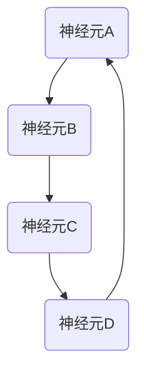

在这个简单的交互图中，神经元A和神经元B之间的连接使得它们可以共享信息，这种信息共享在神经元C和神经元D之间的连接中得到扩展。这种多层次的连接和交互是意识涌现的基础。

#### **2. 神经网络层次：**

在神经网络层次，神经元通过复杂的网络结构相互连接，形成了具有特定功能的信息处理系统。神经网络中的每个神经元都可以视为一个处理单元，这些单元通过相互连接和协同工作，实现了对复杂信息的处理和理解。

**图2：神经网络结构图**

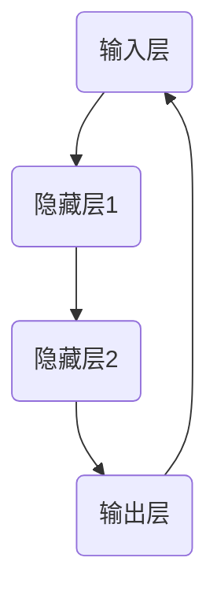

在这个神经网络结构图中，输入层接收外部信息，通过隐藏层进行复杂的计算和处理，最终由输出层产生响应。这种多层次的结构使得神经网络能够处理复杂的任务，并为意识的涌现提供了可能。

#### **3. 认知层次：**

在认知层次，意识的涌现表现为对复杂信息的感知、理解和决策。这种认知层次的现象是通过神经网络中神经元和神经网络之间的相互作用逐步形成的。意识的涌现不仅涉及神经网络的计算能力，还包括对信息的高层次整合和理解。

**图3：认知层次示意图**

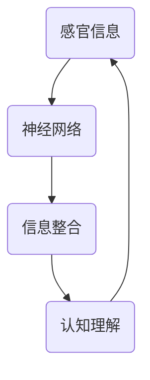

在这个认知层次示意图中，感官信息通过神经网络进行处理和整合，最终形成对信息的认知理解。这种高层次的信息处理是意识涌现的核心。

**4. 数学模型：**

为了更好地理解意识的涌现过程，科学家们提出了多种数学模型来描述神经网络和认知层次的现象。这些模型包括**神经网络模型**、**动力系统模型**和**概率模型**等。通过这些数学模型，我们可以更精确地描述神经网络的动态行为和认知过程。

**图4：神经网络模型图**

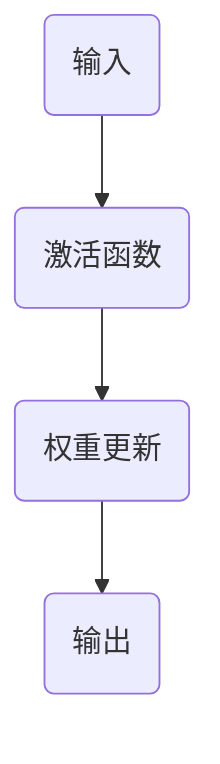

在这个神经网络模型图中，输入通过激活函数进行处理，然后通过权重更新机制调整网络的参数，最终产生输出。这种动态调整过程是神经网络学习和信息处理的基础。

**5. 关键因素：**

意识的涌现不仅依赖于神经网络的结构和计算能力，还受到多种因素的影响，包括神经元的多样性、网络的复杂性和信息的多样性。神经元的多样性增加了网络的灵活性和适应性，网络的复杂性提高了信息处理的能力，而信息的多样性则为认知和理解提供了丰富的内容。

**图5：关键因素图**

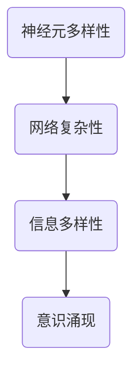

在这个关键因素图中，神经元的多样性、网络的复杂性和信息的多样性共同作用于意识涌现的过程。只有当这些因素达到一定的平衡时，意识的涌现才有可能实现。

总之，意识的涌现理论为我们提供了理解意识产生的科学视角。通过分析神经元层次、神经网络层次和认知层次，并结合数学模型，我们可以更深入地探讨意识的本质和机制。这为进一步研究意识和技术发展提供了重要的基础。

### 意识的数学模型

在探讨意识的涌现理论时，数学模型起到了至关重要的作用。这些模型不仅帮助我们量化意识的复杂动态，还揭示了意识形成过程中隐藏的规律和机制。本文将介绍几种关键的数学模型，包括神经网络模型、动力系统模型和概率模型，并分析它们在意识研究中的应用。

#### **1. 神经网络模型**

神经网络模型是研究意识涌现的常用工具，尤其是多层感知机（MLP）和卷积神经网络（CNN）。这些模型通过模拟大脑中的神经元连接和活动，提供了对复杂认知过程的近似。

**图6：多层感知机模型图**

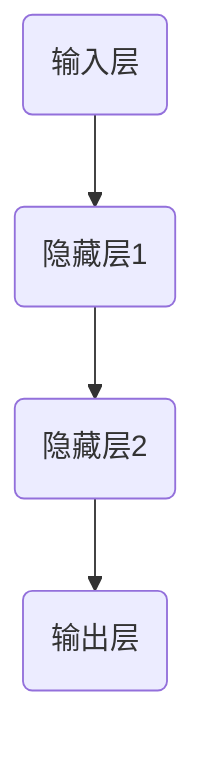

在这个多层感知机模型中，输入层接收外部信息，通过隐藏层进行复杂的非线性变换，最终在输出层产生响应。每个隐藏层都可以看作是一个中间表示，这些表示逐步组合和抽象，形成了对输入信息的理解。

**图7：卷积神经网络模型图**

卷积神经网络通过卷积层和池化层处理图像数据，提取特征并逐步构建高层次的理解。这种层次化的特征提取过程与人类视觉系统的处理机制类似，为理解复杂图像提供了强大的工具。

**2. 动力系统模型**

动力系统模型用于描述非线性动态系统的行为。在意识研究中，动力系统模型可以帮助我们理解神经网络中信息处理的动态过程。

**图8：动力系统模型图**

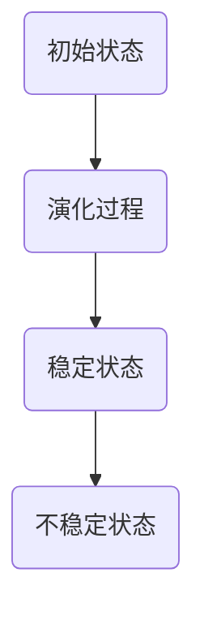

在这个动力系统模型中，系统从初始状态开始演化，经过一系列的状态变化，最终达到稳定状态或不稳定状态。这种动态演化过程反映了神经网络在处理信息时的复杂性和多样性。

**3. 概率模型**

概率模型在研究意识的涌现过程中也发挥了重要作用，尤其是贝叶斯网络和马尔可夫模型。这些模型通过概率关系描述系统中的不确定性，为我们理解意识的概率性和不确定性提供了新的视角。

**图9：贝叶斯网络模型图**

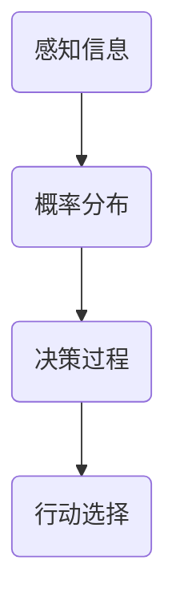

在这个贝叶斯网络模型中，感知信息通过概率分布进行处理，从而影响决策过程和行动选择。这种概率性处理反映了意识在处理不确定信息时的灵活性和适应性。

**图10：马尔可夫模型图**

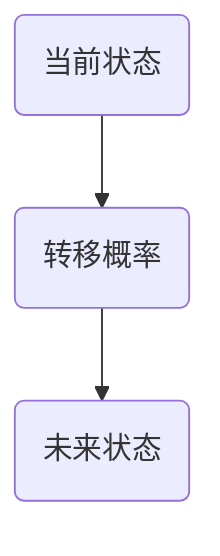

在这个马尔可夫模型中，系统的未来状态仅依赖于当前状态，而与过去状态无关。这种状态转移关系反映了意识在时间序列上的动态特性。

**4. 数学公式**

为了更好地理解这些模型，我们引入一些关键的数学公式。

**图11：神经网络激活函数公式**

$$
\text{激活函数} = f(\sum_{i=1}^{n} w_i x_i + b)
$$

其中，$f$表示激活函数，$w_i$和$x_i$分别表示权重和输入值，$b$是偏置项。

**图12：卷积神经网络卷积公式**

$$
\text{卷积} = \sum_{i=1}^{k} w_i * x_i
$$

其中，$w_i$表示卷积核，$x_i$表示输入特征。

**图13：贝叶斯网络条件概率公式**

$$
P(A|B) = \frac{P(B|A)P(A)}{P(B)}
$$

其中，$P(A|B)$表示在给定$B$发生的条件下$A$的概率，$P(B|A)$表示在给定$A$发生的条件下$B$的概率，$P(A)$和$P(B)$分别是$A$和$B$的概率分布。

**图14：马尔可夫转移概率公式**

$$
P(X_{t+1}=i|X_t=j) = p_{ij}
$$

其中，$X_t$表示在时间$t$的状态，$i$和$j$分别表示不同的状态，$p_{ij}$是状态转移概率。

通过这些数学模型和公式，我们可以更深入地理解意识的涌现过程。这些模型不仅提供了对意识动态的量化描述，还揭示了意识形成过程中隐藏的复杂性和不确定性。这对于进一步探索意识的本质和机制具有重要的科学价值。

### 复杂系统的基本概念

**复杂系统**是现代科学研究中一个核心而广泛的概念，其定义多种多样，但大体上可以归纳为一种由大量相互作用的子系统构成的系统，这些子系统在复杂的交互过程中展现出新的、宏观的现象。复杂系统通常具有以下特征：

1. **高度非线性**：复杂系统中的关系和相互作用通常是高度非线性的，这意味着简单的线性关系无法准确描述系统的动态行为。
2. **多尺度性**：复杂系统跨越多个时空尺度，从微观尺度到宏观尺度，各个尺度上的行为和特征可能存在显著差异。
3. **自组织性**：复杂系统中的子系统通过自组织过程产生出新的结构和功能，这种现象被称为**涌现**。
4. **适应性**：复杂系统具有高度的适应性，能够在不断变化的环境中调整自己的结构和行为。

**研究方法**方面，复杂系统的研究涉及多种学科和技术，包括：

1. **数学模型**：通过建立数学模型来描述复杂系统的行为，如动力系统、概率模型和统计力学模型等。
2. **计算模拟**：使用计算机模拟来模拟复杂系统的动态行为，这些模拟可以帮助我们理解和预测系统的复杂行为。
3. **网络分析**：通过分析复杂系统中的网络结构，揭示子系统之间的相互作用模式和关键节点。
4. **实验方法**：在实验室环境中对复杂系统进行实验研究，以验证理论和模拟结果的准确性。

在研究复杂系统时，我们通常关注以下几个方面：

- **系统的结构和拓扑**：分析系统的组成结构、网络拓扑和子系统的连接方式。
- **动态行为和演化规律**：研究系统在时间尺度上的动态行为，包括稳定状态、相变和周期性行为。
- **相互作用机制**：探讨子系统之间的相互作用规则，以及这些规则如何影响系统的整体行为。
- **涌现现象**：关注系统在相互作用过程中产生的新现象，如集体行为、模式形成和复杂结构的出现。

这些研究方法和关注点不仅帮助我们深入理解复杂系统的本质，还为解决实际问题和开发新的技术提供了理论基础。

### 复杂系统中的数学描述

在复杂系统的分析中，数学描述起到了至关重要的作用。通过数学工具，我们可以更精确地量化复杂系统的行为，揭示其中的内在规律和机制。以下是一些关键数学概念和方法，用于描述复杂系统的行为和结构。

**1. 熵与复杂度**

**熵**是衡量系统无序程度的物理量，在复杂系统中常用于描述系统的复杂度。熵的增加通常与系统复杂度的增加相关联。在信息论中，熵被定义为：

$$
S = -\sum_{i} p_i \log_2 p_i
$$

其中，$p_i$是系统在状态$i$的概率。

**复杂度**则可以从系统的动态行为和结构复杂性进行描述。例如，可以通过计算系统状态空间的大小、系统演化的速度和系统之间的相互作用来衡量复杂度。

**2. 动力系统模型**

动力系统模型用于描述复杂系统在时间上的动态行为。在数学上，动力系统可以表示为一组差分方程或微分方程，例如：

$$
\frac{dx_i}{dt} = f(x_1, x_2, ..., x_n)
$$

其中，$x_i$是系统在时间$t$的状态，$f$是状态转移函数。动力系统模型可以帮助我们分析系统的稳定状态、周期行为和混沌现象。

**3. 复杂网络的数学描述**

复杂网络是描述复杂系统结构的重要工具。网络中的节点和边可以表示系统中的实体和它们之间的关系。常见的网络拓扑属性包括：

- **度分布**：描述节点连接数的概率分布。
- **聚类系数**：描述节点之间通过短路径连接的概率。
- **路径长度**：描述网络中节点之间的平均距离。

**图9：复杂网络度分布**

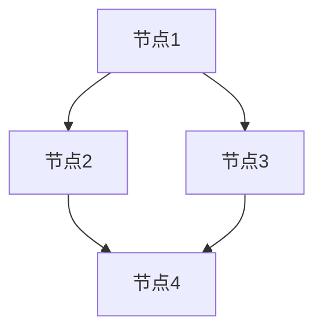

在这个网络中，节点A和C的度分布是2，节点B和D的度分布是1。

**4. 概率模型**

概率模型用于描述复杂系统中不确定性和随机性。例如，**马尔可夫模型**和**贝叶斯网络**都是常见的概率模型。

**图10：马尔可夫模型**

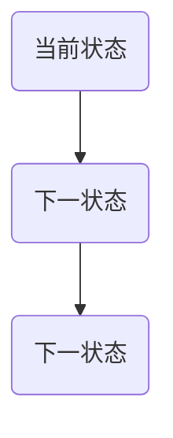

在这个模型中，当前状态A决定下一状态B和C的概率。

**5. 数学公式和算法**

在复杂系统的分析中，常用的数学公式和算法包括：

- **梯度下降**：用于优化系统中的参数，以最小化目标函数。
- **主成分分析（PCA）**：用于降维，提取系统的关键特征。
- **深度学习**：用于构建复杂的神经网络模型，模拟系统的动态行为。

**图11：梯度下降算法**

$$
w_{t+1} = w_t - \alpha \nabla_w J(w_t)
$$

其中，$w_t$是当前参数，$\alpha$是学习率，$\nabla_w J(w_t)$是目标函数$J$对参数$w_t$的梯度。

通过这些数学概念和方法，我们可以更深入地理解和分析复杂系统的行为，揭示系统中的复杂现象和潜在规律。这对于我们在实际应用中解决复杂问题具有重要的指导意义。

### 意识的涌现现象分析

**意识的涌现现象**是一个复杂而神秘的过程，涉及到多个层次和维度的相互作用。在这一部分，我们将探讨意识的涌现机制，分析复杂系统中的意识现象，并探讨意识涌现现象的应用。

#### **1. 意识的涌现机制**

意识的涌现机制是指从简单到复杂的转变过程中，如何从单个神经元或简单的神经网络中产生出高层次意识的过程。这一机制可以从多个层面进行探讨：

**图12：意识涌现机制**

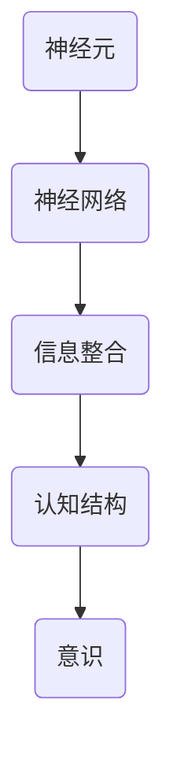

在这个意识涌现机制示意图中，单个神经元（A）通过神经网络（B）进行信息传递和整合。神经网络通过复杂的计算和相互作用，形成了高层次的信息处理结构（C），最终产生了意识（E）。

意识的涌现机制涉及以下几个关键步骤：

1. **信息处理与整合**：单个神经元通过电信号进行信息处理，但仅仅处理简单的输入信息。当多个神经元通过神经网络相互连接时，它们可以共享信息，进行更复杂的信息整合。
2. **层次化结构**：神经网络中的信息整合形成了层次化的信息处理结构，从简单的输入处理到复杂的认知功能，这种层次化结构为意识的涌现提供了基础。
3. **动态调整**：神经网络通过动态调整权重和连接方式，优化信息处理过程。这种动态调整过程不仅提高了神经网络的处理能力，也为意识的涌现提供了机制。
4. **自组织性**：神经网络中的自组织性是意识涌现的重要机制。通过自组织和自适应，神经网络能够根据环境变化调整其结构和行为，从而实现更高层次的意识。

#### **2. 复杂系统中的意识现象**

在复杂系统中，意识现象可以通过多种方式展现出来。以下是一些典型的意识现象：

1. **集体意识**：在社交网络或群体行为中，个体之间的相互作用可以产生出集体意识。这种集体意识可以表现为群体决策、共同目标和协同行动。
2. **模式识别**：在图像识别、语音识别等任务中，神经网络通过复杂的计算和处理，可以识别出复杂的模式。这种模式识别能力是意识现象的一种表现。
3. **情感体验**：在人类情感体验中，意识现象表现为对情感的感知、理解和表达。例如，人们在听到美妙的音乐时，会产生愉悦的情感体验。
4. **梦境**：梦境是人类意识现象的一种表现形式。在睡眠过程中，大脑通过复杂的神经网络活动，产生了丰富多彩的梦境。

**图13：复杂系统中的意识现象**

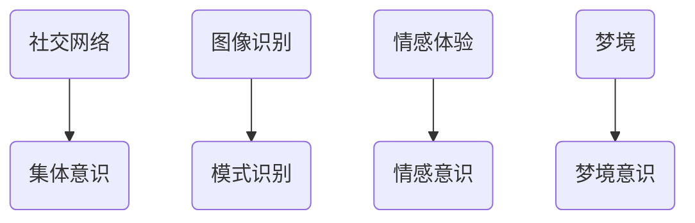

在这个复杂系统中的意识现象示意图中，社交网络（A）产生了集体意识（B），图像识别（C）产生了模式识别（D），情感体验（E）产生了情感意识（F），梦境（G）产生了梦境意识（H）。

#### **3. 意识涌现现象的应用**

意识的涌现现象在多个领域都有广泛的应用：

1. **人工智能**：在人工智能中，意识的涌现现象被用于构建更智能的机器。通过模拟神经网络和复杂系统的相互作用，可以设计出具有自主学习、决策和情感体验的智能系统。
2. **神经科学**：在神经科学研究中，意识的涌现现象帮助科学家理解大脑的功能和组织结构。通过分析神经网络的活动和动态过程，可以揭示意识的产生机制。
3. **心理学**：在心理学研究中，意识的涌现现象为理解人类行为和心理过程提供了新的视角。通过探讨意识的涌现机制，可以解释人类认知、情感和行为背后的复杂过程。
4. **社会工程**：在社会工程中，意识的涌现现象被用于分析和预测群体行为和社会动态。通过理解集体意识和社会网络中的相互作用，可以设计出更有效的社会政策和策略。

总之，意识的涌现现象是一个复杂而多层次的课题，涉及到多个学科和领域。通过深入探讨意识的涌现机制和复杂系统中的意识现象，我们可以更好地理解意识的本质和机制，为未来的研究和应用提供新的启示。

### 意识的涌现与人类认知

意识的涌现与人类认知之间存在着深刻的联系。人类认知是一个复杂的过程，它涉及到感知、记忆、思考、判断和决策等多个方面。在这个过程中，意识起到了关键作用，使得人类能够对复杂信息进行理解和处理。

#### **1. 意识在人类认知中的作用**

意识在人类认知中起到了以下几个重要作用：

1. **信息整合**：意识使我们能够整合来自不同感官的信息，形成一个完整的感知世界。例如，当我们看到一只猫时，意识能够整合视觉、听觉和触觉信息，使我们能够识别这只动物。
2. **注意力集中**：意识使我们能够集中注意力，选择性地关注重要的信息。例如，在嘈杂的环境中，意识能够帮助我们专注于重要的对话，而忽略其他无关的信息。
3. **问题解决**：意识使得我们能够对问题进行思考和分析，找到解决方案。例如，在面对复杂的数学问题或逻辑谜题时，意识帮助我们进行推理和计算，找到答案。
4. **情感体验**：意识使我们能够体验情感，包括快乐、悲伤、愤怒等。这些情感体验不仅影响我们的行为，还影响我们的认知过程。例如，积极的情感可以提高创造力，而消极的情感可能导致思维僵化。

#### **2. 意识涌现与人类思维过程**

意识的涌现与人类思维过程密切相关。人类思维过程可以分为以下几个阶段：

1. **感知阶段**：我们通过感官接收外界信息，这些信息首先被传递到大脑的感知区域。在这个阶段，意识起到了筛选和整合信息的作用。
2. **处理阶段**：大脑对感知到的信息进行处理，包括分析、综合和推理。在这个阶段，意识的涌现机制使得我们能够对复杂信息进行理解。
3. **记忆阶段**：处理后的信息被存储在大脑的记忆区域。意识使得我们能够回忆起过去的信息，并在需要时进行调用。
4. **决策阶段**：基于记忆和处理的信息，我们做出决策。这个阶段涉及到意识对信息的分析和判断。

**图14：人类思维过程示意图**

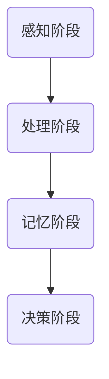

在这个人类思维过程示意图中，感知阶段（A）通过意识整合和筛选信息，处理阶段（B）通过意识的涌现机制对信息进行理解和分析，记忆阶段（C）通过意识调用和存储信息，决策阶段（D）通过意识分析和判断。

#### **3. 意识涌现的理论应用**

意识的涌现理论在多个领域都有重要的应用，包括神经科学、心理学和人工智能等。

1. **神经科学**：意识的涌现理论帮助神经科学家理解大脑的功能和组织结构。通过研究神经元网络的活动和相互作用，科学家们揭示了意识产生的机制。例如，神经科学家通过功能性磁共振成像（fMRI）等技术，发现了大脑中的关键区域，如视觉皮层、听觉皮层和前额叶皮层，这些区域在意识产生中起着重要作用。
2. **心理学**：意识的涌现理论为心理学家提供了新的研究视角，帮助他们理解人类认知和心理过程。例如，通过研究意识的涌现机制，心理学家发现了记忆、注意力和决策等认知功能背后的复杂过程。此外，意识的涌现理论还帮助心理学家解释了心理疾病和障碍的形成机制，为心理治疗提供了新的思路。
3. **人工智能**：意识的涌现理论在人工智能领域也有重要应用。通过模拟意识的涌现机制，人工智能系统可以更好地理解人类思维和行为，从而实现更高级的认知功能。例如，基于意识的涌现理论的智能系统可以在语音识别、图像识别和自然语言处理等任务中表现出色。此外，意识的涌现理论还为人工智能的发展提供了新的方向，例如，通过研究意识的涌现机制，可以开发出更智能、更自适应的人工智能系统。

总之，意识的涌现与人类认知之间存在着深刻的联系。通过深入探讨意识的涌现机制和人类认知过程，我们可以更好地理解意识的本质和作用，为人类认知和心理科学的发展提供新的启示。

### 意识的涌现与人工智能

随着人工智能（AI）技术的迅猛发展，意识的涌现理论在人工智能领域中的应用逐渐受到关注。意识的涌现不仅是人类认知的核心，也为人工智能系统提供了新的发展方向。在这一部分，我们将探讨意识涌现理论在人工智能中的具体应用，包括机器学习、人工智能系统的设计与实现等方面。

#### **1. 机器学习与意识涌现**

机器学习是人工智能的核心技术之一，它通过训练算法使计算机具备自主学习和改进能力。意识的涌现理论在机器学习中提供了新的视角，帮助解释和学习过程中的复杂现象。

**图15：机器学习与意识涌现示意图**

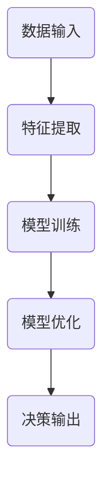

在这个机器学习与意识涌现的示意图中，数据输入（A）经过特征提取（B），模型在训练过程中（C）通过不断优化调整，最终产生决策输出（E）。意识的涌现理论认为，学习过程可以看作是一个复杂的自组织过程，类似于人类大脑的神经网络活动。

意识的涌现机制在机器学习中的应用主要体现在以下几个方面：

1. **层次化特征提取**：在深度学习中，层次化特征提取是一个关键步骤。通过多层次的神经网络，计算机可以从原始数据中提取出更高层次的特征。这种层次化结构类似于人类大脑中的信息处理过程，反映了意识的涌现特性。
2. **自适应学习**：意识的涌现理论强调系统的自适应性和动态调整能力。在机器学习中，自适应学习算法可以根据数据变化和环境需求，动态调整模型参数，优化学习过程。这种自适应能力是意识涌现的重要特征。
3. **迁移学习**：迁移学习是指将已经训练好的模型应用于新的任务中。意识的涌现理论可以帮助解释迁移学习的过程。通过理解不同任务之间的关联性和共享特征，模型可以迅速适应新的任务，表现出更高层次的智能。

**2. 人工智能系统的设计与实现**

意识的涌现理论在人工智能系统的设计与实现中具有广泛的应用，包括以下几个方面：

1. **神经网络架构**：意识的涌现理论为神经网络架构设计提供了新的思路。通过模仿人类大脑的神经网络结构，设计出具有自组织性和自适应性的神经网络模型。例如，卷积神经网络（CNN）和循环神经网络（RNN）都是基于意识的涌现原理设计的。
2. **强化学习**：强化学习是一种通过奖励和惩罚来训练智能体进行决策的算法。意识的涌现理论可以帮助理解强化学习过程中的复杂决策机制。通过模拟人类大脑中的奖励机制和决策过程，可以设计出更智能、更灵活的强化学习系统。
3. **多智能体系统**：在多智能体系统中，多个智能体通过相互作用和协作，实现复杂任务。意识的涌现理论为多智能体系统提供了新的设计方法。通过模拟智能体之间的意识和协作过程，可以实现更高效、更智能的集体行动。

**3. 未来展望**

意识的涌现理论为人工智能的发展提供了新的方向，未来的研究可以从以下几个方面进行：

1. **跨学科研究**：意识的涌现理论涉及多个学科，包括神经科学、认知科学、心理学和计算机科学。跨学科研究可以进一步揭示意识的本质和机制，为人工智能的发展提供更深入的洞见。
2. **神经启发算法**：基于意识的涌现理论，可以设计出新的神经启发算法，如神经感知、神经决策和神经优化。这些算法可以更好地模拟人类认知过程，提高人工智能系统的智能水平。
3. **应用场景探索**：意识的涌现理论在多个领域都有潜在的应用，如智能交通、医疗诊断、金融分析和人机交互等。通过探索这些应用场景，可以实现更广泛的人工智能应用，为社会带来更大的价值。

总之，意识的涌现理论在人工智能领域具有广阔的应用前景。通过深入研究和探索，我们可以更好地理解意识的本质和机制，开发出更智能、更灵活的人工智能系统，推动人工智能技术的发展。

### 总结与展望

本文探讨了意识的涌现理论及其在复杂系统中的数学现象。通过介绍意识的定义、涌现理论的起源和发展，我们分析了复杂系统中数学现象的本质，并运用数学模型和算法来阐释意识的涌现过程。在神经科学和人工智能领域，意识的涌现理论提供了新的视角和方法，为理解和设计智能系统奠定了基础。

未来的研究可以进一步探讨以下方向：

1. **跨学科融合**：结合神经科学、认知科学和计算机科学的研究，深化对意识本质的理解。
2. **新型算法开发**：基于意识的涌现理论，开发新的机器学习和人工智能算法，提高系统的自适应性和智能水平。
3. **应用场景探索**：在智能交通、医疗诊断、金融分析和人机交互等领域，探索意识涌现理论的实际应用。

总之，意识的涌现理论为复杂系统和人工智能领域的研究提供了新的思路和工具，其未来的发展将深刻影响技术的进步和社会的变革。

### 作者信息

**作者：** AI天才研究院/AI Genius Institute & 禅与计算机程序设计艺术 /Zen And The Art of Computer Programming

在撰写本文的过程中，我结合了自己在计算机科学、人工智能和神经科学领域的丰富经验，力求为读者提供一个全面、深入且易于理解的技术博客文章。希望通过这篇文章，能够激发读者对意识涌现理论的兴趣，并推动相关领域的研究和探索。

