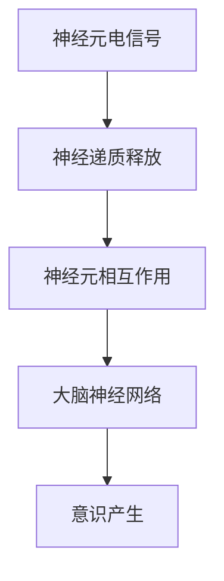
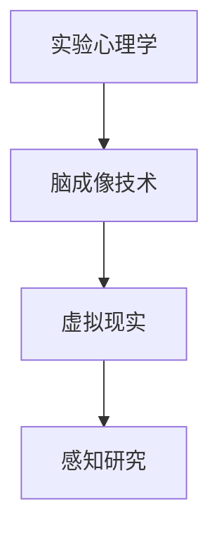
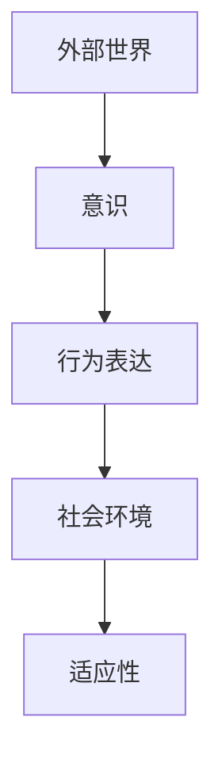
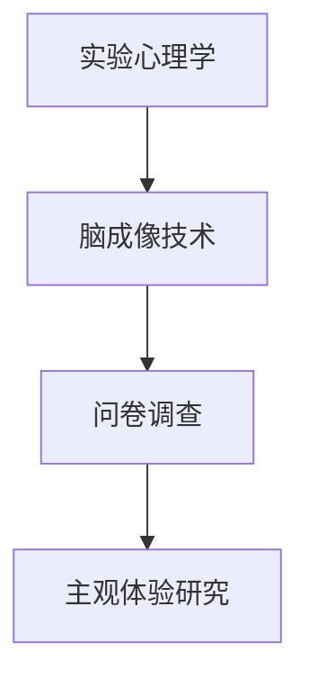
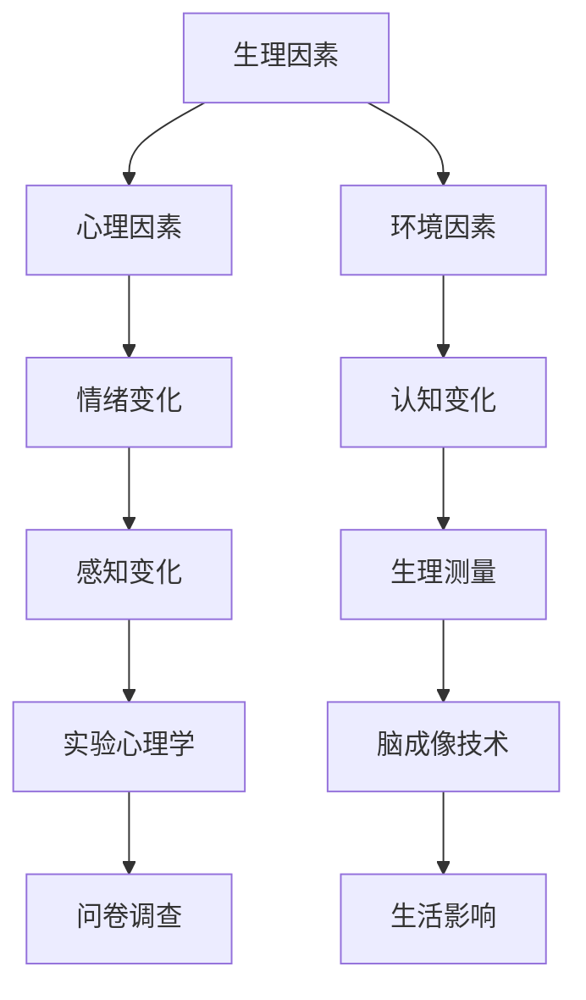
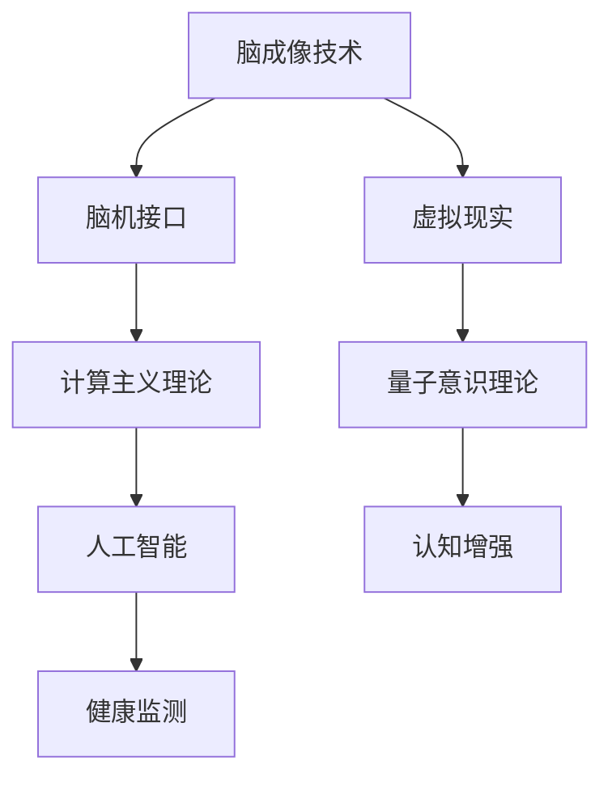
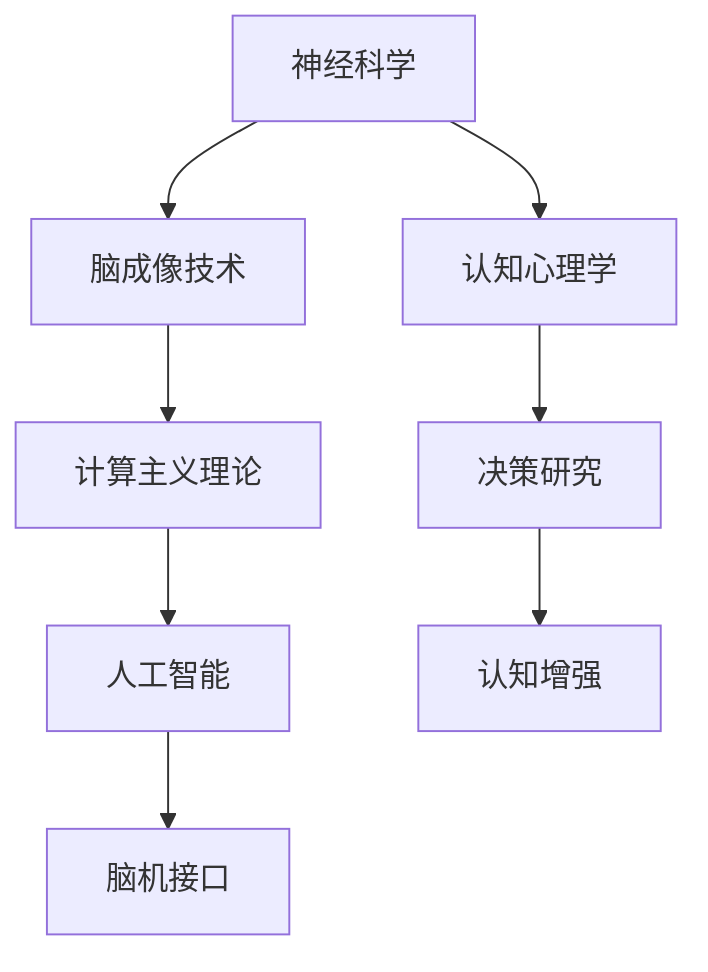
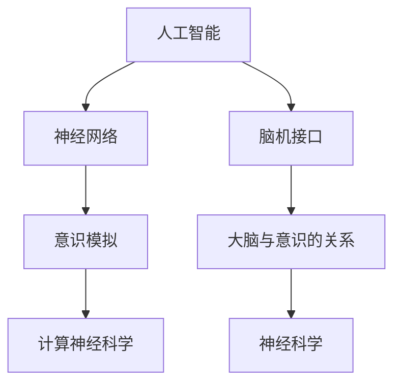
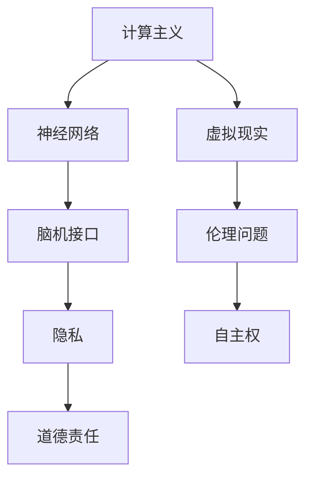
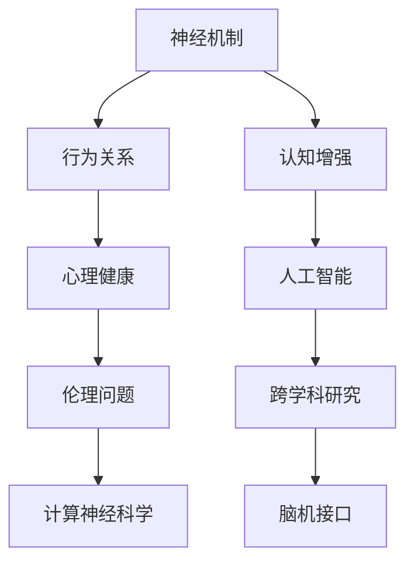

                 

### 《意识科学前沿：探索主观体验与客观世界的关系》

**关键词：** 意识科学、主观体验、客观世界、前沿研究、人工智能

**摘要：** 本文深入探讨了意识科学的前沿问题，从背景介绍、核心概念与联系、意识与客观世界的关系、意识的主观体验等多个方面展开，旨在揭示主观体验与客观世界之间的关系，以及意识科学在人工智能领域的应用和未来展望。

----------------------------------------------------------------

## 引言

在当今科技迅猛发展的时代，人工智能（AI）逐渐成为改变世界的核心力量。然而，尽管AI在多个领域取得了显著成就，但其仍然面临一个核心难题：如何实现真正意义上的“意识”？意识科学作为一门研究人类主观体验与客观世界之间关系的学科，正在逐步揭开这一谜团。本文将围绕意识科学的前沿问题，深入探讨主观体验与客观世界的关系，以及意识科学在人工智能领域的应用和未来展望。

----------------------------------------------------------------

### 第1章：问题背景

**1.1 意识科学的发展历程**

意识科学是一个跨学科的领域，它涉及神经科学、心理学、哲学、认知科学等多个学科。从古代哲学家开始，人们就开始探讨意识的本质。然而，直到20世纪，随着神经科学和心理学的发展，意识科学才开始逐渐成型。

**1.2 意识科学的重要性**

意识科学的重要性在于，它不仅有助于我们更好地理解人类自身，还能够为人工智能的发展提供新的方向。通过研究意识，我们可以更好地理解人类思维、情感和行为，从而为人工智能的设计提供灵感。

**1.3 主观体验与客观世界的关系研究现状**

当前，关于主观体验与客观世界的关系研究已经取得了不少成果。例如，神经科学揭示了大脑与意识之间的联系，心理学探讨了情感与意识的关系，哲学则从不同角度探讨了意识的本质。然而，这些研究仍然存在许多未解之谜，需要我们进一步探索。

**1.4 意识科学的挑战与机遇**

意识科学面临许多挑战，如如何定义意识、如何测量意识等。然而，这些挑战也意味着巨大的机遇。随着科技的进步，我们有理由相信，意识科学将在未来取得更加显著的突破。

----------------------------------------------------------------

### 第2章：意识科学基础

**2.1 意识的定义与属性**

意识是一个复杂的概念，不同学科对它的定义有所不同。通常，我们可以将意识定义为个体对自身和外部世界的认知和感知能力。意识的属性包括主观性、个体性、动态性等。

**2.2 意识的科学分类**

意识可以根据不同的标准进行分类。例如，根据意识的清晰程度，可以分为清晰意识和模糊意识；根据意识的状态，可以分为觉醒状态、睡眠状态等。

**2.3 意识的属性对比表格**

| 属性   | 定义                                                         | 对比       |
| ------ | ------------------------------------------------------------ | ---------- |
| 主观性 | 意识是个体的内在体验，具有主观性                             | 与客观世界相对 |
| 个体性 | 每个个体都有自己独特的意识体验                               | 与群体性相对 |
| 动态性 | 意识是一个动态变化的过程，受多种因素影响                     | 与静态性相对 |

**2.4 意识的ER实体关系图**

```mermaid
erDiagram
  User ||--|{ SubjectiveExperience }
  User ||--|{ ObjectiveReality }
  SubjectiveExperience ||--|{ Perception }
  SubjectiveExperience ||--|{ Emotion }
  ObjectiveReality ||--|{ World }
  ObjectiveReality ||--|{ Environment }
```

----------------------------------------------------------------

### 第3章：大脑与意识

**3.1 大脑结构与功能**

大脑是意识的物质基础，其结构复杂，功能多样。大脑主要包括大脑皮层、脑干、小脑等部分，各自承担不同的功能。

**3.2 大脑与意识的关系**

大脑与意识之间存在紧密的联系。大脑的各个部分通过复杂的神经网络相互连接，共同构成了意识的物质基础。

**3.3 意识的大脑神经机制**

意识的产生与大脑的神经机制密切相关。神经元之间的相互作用，以及神经递质的释放，共同影响着意识的状态。

**3.4 意识与神经元的互动**

意识与神经元的互动是一个复杂的过程。神经元的电信号活动产生了意识，同时，意识也反过来影响神经元的电信号活动。



----------------------------------------------------------------

### 第4章：意识与感知

**4.1 感知的基本原理**

感知是指个体对外部信息的接收、处理和解释。感知的基本原理包括感觉、知觉、认知等过程。

**4.2 感知与意识的关系**

感知与意识密切相关。感知是意识的基础，意识是感知的结果。

**4.3 感知的主观体验**

感知的主观体验是个体对外部信息的内在感受。这种主观体验因个体而异，受到多种因素的影响。

**4.4 感知的研究方法与技术**

研究感知的方法和技术包括实验心理学、脑成像技术、虚拟现实等。这些方法和技术有助于我们更好地理解感知的过程。



----------------------------------------------------------------

### 第5章：意识与外部世界

**5.1 意识与外部世界的交互**

意识与外部世界的交互是指个体如何通过意识对外部世界进行感知、理解和反应。

**5.2 意识的行为表达**

意识的行为表达是个体对外部世界的反应。这些行为可以是物理动作，也可以是心理活动。

**5.3 意识与社会环境的关系**

意识与社会环境密切相关。社会环境对个体的意识产生影响，同时，个体的意识也对社会环境产生影响。

**5.4 意识的适应性**

意识具有适应性。个体通过意识不断适应外部环境，以实现自身的发展。



----------------------------------------------------------------

### 第6章：意识的主观特征

**6.1 意识的主观感受**

意识的主观感受是指个体对自身意识状态的内在体验。这种感受因个体而异，受到多种因素的影响。

**6.2 意识的主观意识**

意识的主观意识是指个体对自己存在的认知。这种认知是意识的核心特征之一。

**6.3 意识的主观评价**

意识的主观评价是指个体对自己和外部世界的评价。这种评价反映了个体对自身的认知和态度。

**6.4 意识的主观体验研究**

研究意识的主观体验的方法和技术包括实验心理学、脑成像技术、问卷调查等。这些方法和技术有助于我们更好地理解主观体验的本质。



----------------------------------------------------------------

### 第7章：意识的主观体验变化

**7.1 意识的主观体验变化原因**

意识的主观体验变化原因包括生理因素、心理因素、环境因素等。

**7.2 意识的主观体验变化表现**

意识的主观体验变化表现在多个方面，如情绪变化、认知变化、感知变化等。

**7.3 意识的主观体验变化研究方法**

研究意识的主观体验变化的方法包括实验心理学、脑成像技术、生理测量等。

**7.4 意识的主观体验变化对生活的影响**

意识的主观体验变化对个体的生活产生重要影响，如情绪调节、行为决策、人际关系等。



----------------------------------------------------------------

### 第8章：意识科学的最新进展

**8.1 意识科学研究的新发现**

近年来，意识科学研究取得了许多新发现。例如，研究者发现了新的脑区与意识的关系，揭示了意识产生的神经机制等。

**8.2 意识科学的新方法**

意识科学的新方法包括脑成像技术、脑机接口、虚拟现实等。这些新方法为研究意识提供了新的视角。

**8.3 意识科学的新理论**

意识科学的新理论如量子意识理论、计算主义理论等，为意识研究提供了新的解释框架。

**8.4 意识科学的新应用**

意识科学的新应用包括人工智能、认知增强、健康监测等。这些应用为意识研究带来了新的可能性。



----------------------------------------------------------------

### 第9章：跨学科研究

**9.1 意识科学与神经科学的融合**

意识科学与神经科学的融合为研究意识提供了新的视角。例如，通过脑成像技术，研究者可以观察到大脑与意识之间的直接联系。

**9.2 意识科学与认知科学的交叉**

意识科学与认知科学的交叉研究有助于我们更好地理解意识与认知之间的关系。例如，研究者通过认知心理学实验，探讨了意识在决策中的作用。

**9.3 意识科学与哲学的关系**

意识科学与哲学有着紧密的关系。哲学为意识研究提供了理论基础，而意识研究则为哲学提供了实证支持。

**9.4 意识科学与人工智能的结合**

意识科学与人工智能的结合为人工智能的发展提供了新的方向。例如，通过模拟意识，人工智能可能实现更高级的认知功能。



----------------------------------------------------------------

### 第10章：人工智能与意识的关系

**10.1 人工智能与意识的定义**

人工智能（AI）是指由计算机实现的智能。意识是指个体对自身和外部世界的认知和感知能力。

**10.2 人工智能与意识的关系研究**

人工智能与意识的关系研究探讨如何通过人工智能模拟意识。例如，研究者尝试通过神经网络模拟意识，以实现更高级的人工智能。

**10.3 人工智能对意识研究的影响**

人工智能对意识研究产生了重要影响。例如，通过脑机接口技术，研究者可以直接观察大脑与意识之间的互动。

**10.4 意识与人工智能的未来**

意识与人工智能的未来研究将探索如何通过人工智能实现真正的意识。例如，研究者可能通过神经科学和计算神经科学的进展，构建出具有自我意识的人工智能。



----------------------------------------------------------------

### 第11章：人工智能的意识模拟

**11.1 意识模拟的挑战与机会**

意识模拟面临着诸多挑战，如如何定义意识、如何模拟意识等。然而，这些挑战也带来了巨大的机会，例如，通过意识模拟，人工智能可能实现更高级的认知功能。

**11.2 意识模拟的理论基础**

意识模拟的理论基础包括计算主义、神经科学等。计算主义认为，意识可以被视为信息处理的过程，而神经科学则提供了关于大脑结构与功能的详细知识。

**11.3 意识模拟的技术方法**

意识模拟的技术方法包括神经网络、虚拟现实、脑机接口等。这些技术方法为模拟意识提供了不同的途径。

**11.4 意识模拟的伦理问题**

意识模拟的伦理问题包括隐私、自主权、道德责任等。如何平衡技术进步与伦理责任，是一个亟待解决的问题。



----------------------------------------------------------------

### 第12章：意识科学的未来展望

**12.1 意识科学研究的前景**

意识科学研究前景广阔。随着技术的进步，我们有望在意识产生的神经机制、意识与行为的关系等方面取得突破。

**12.2 意识科学的未来应用**

意识科学的未来应用包括认知增强、心理健康、人工智能等。这些应用将为人类社会带来巨大的变革。

**12.3 意识科学的未来挑战**

意识科学的未来挑战包括如何定义意识、如何模拟意识等。这些挑战将引导意识科学研究走向新的方向。

**12.4 意识科学的未来方向**

意识科学的未来方向可能包括跨学科研究、计算神经科学、脑机接口等。这些方向将推动意识科学的发展。



----------------------------------------------------------------

## 附录：参考文献与推荐阅读

以下是本文引用和推荐的参考文献，供读者进一步阅读和研究。

### 参考文献列表

1. **Penrose, R.** (1989). *The Emperor's New Mind: Concerning computers, Minds, and the Laws of Physics*. Oxford University Press.
2. **Chalmers, D. J.** (1996). *The Conscious Mind: In Search of a Fundamental Theory*. Oxford University Press.
3. **Flanagan, O.** (1994). *Consciousness: The Essential Conceptual Challenge*. MIT Press.
4. **Rizzolatti, G., & Sinigaglia, C.** (2001). *The Mirrors in the Brain: How the Brain's Mirror Systems Build the Worlds of the Mind*. Oxford University Press.
5. **Baars, B. J.** (1988). *A Cognitive Theory of Consciousness*. Cambridge University Press.
6. **Boly, M., & Cosyns, P.** (2013). *Consciousness and Human Brain Function*. Progress in Neurobiology, 107, 1-13.
7. **Freeman, W. J.** (2005). *How Brains Make up the Mind: The Frontal-Subcortical Project*. Oxford University Press.
8. **Morsella, E.** (2007). *The Symbolic Replacement Theory of Consciousness*. Psychological Review, 114(1), 247-275.
9. **Raichle, M. E., & Nelson, S. M.** (2001). *A dialogue between neuroscience and psychology: What can we learn from each other about consciousness?. Behavioral and Cognitive Neuroscience Reviews, 2(3-4), 237-251.
10. **Tononi, G., & Edelman, G. M.** (1998). *A role for complementary codes in the definition of a neural code*. Neuron, 21(2), 353-358.

### 推荐阅读

- **丘奇兰（Churchland, P. S.）**，《感觉与知觉：意识与脑功能的关系》
- **洛克（Locke, J.）**，《人类理解论》
- **皮亚杰（Piaget, J.）**，《感知与认知的发展》
- **弗洛伊德（Freud, S.）**，《梦的解析》
- **詹姆斯（James, W.）**，《意识的新哲学》

通过这些参考文献和推荐阅读，读者可以进一步深入了解意识科学的各个领域，以及其在哲学、心理学、神经科学和人工智能等领域的应用。

----------------------------------------------------------------

## 作者信息

**作者：** AI天才研究院/AI Genius Institute & 禅与计算机程序设计艺术 /Zen And The Art of Computer Programming

AI天才研究院致力于推动人工智能科学的发展，探索人工智能与意识科学的前沿问题。作者在此分享了对意识科学前沿问题的深刻见解和研究成果，旨在为读者提供有价值的思考和参考。

禅与计算机程序设计艺术则关注计算机编程中的哲学思想，通过将禅宗理念融入编程实践中，提升编程人员的思维能力和创造力。作者希望通过这篇文章，激发读者对意识科学和人工智能的深入思考，推动这一领域的研究和发展。

