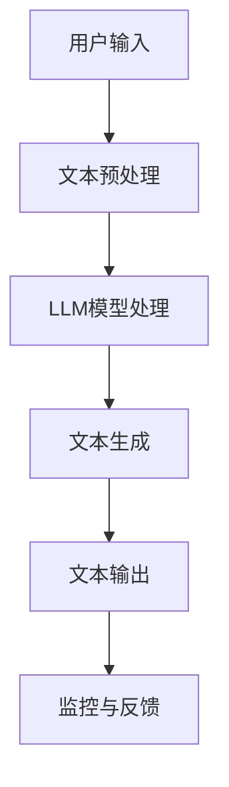
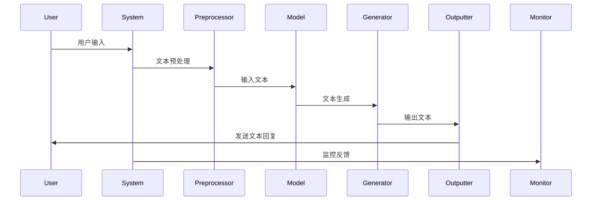
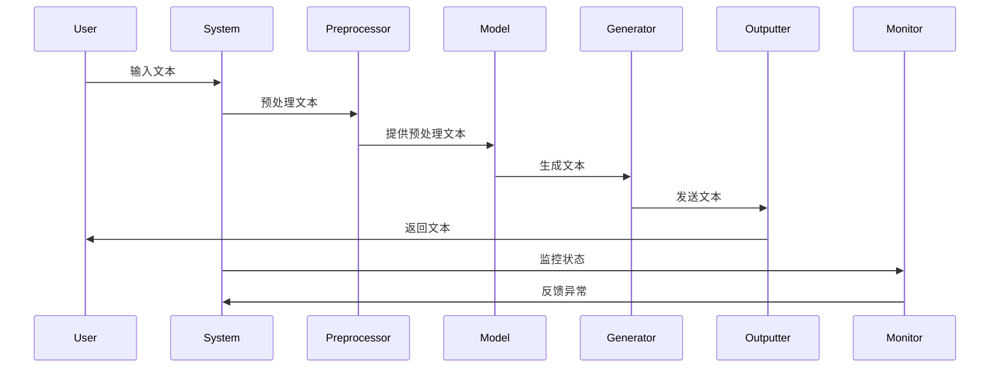

                 


### 1. 引言

持续监控：及时发现和解决LLM应用问题

#### 关键词

- 持续监控
- LLM应用
- 问题发现
- 解决方案

#### 摘要

本文深入探讨了如何在LLM（大型语言模型）应用中实现有效的持续监控，以便及时发现和解决潜在问题。通过分析LLM应用的问题背景、核心概念、监控原理与策略、工具与技术，以及实战应用，本文旨在为读者提供一套系统性的解决方案。

---

### 2. 背景介绍

#### 2.1 问题的背景

随着人工智能技术的发展，LLM在自然语言处理、智能问答、文本生成等领域得到了广泛应用。然而，LLM应用在运行过程中可能会出现各种问题，如模型过拟合、数据泄漏、回答不准确等。这些问题不仅会影响用户体验，还可能带来严重的业务风险。

#### 2.2 LLM应用概述

LLM，即大型语言模型，是一种基于深度学习技术的自然语言处理模型。它通过学习大量文本数据，能够生成连贯、准确的文本输出。LLM应用广泛，如智能客服、新闻生成、文本翻译等。

---

### 3. 核心概念

#### 3.1 监控的基本概念

监控是指对系统、服务或过程的运行状态进行实时检测、评估和反馈。在LLM应用中，监控的目的是及时发现并解决问题，确保应用的稳定性和可靠性。

#### 3.2 LLM应用问题的分类

LLM应用问题主要包括以下几类：

- **模型过拟合**：模型在训练数据上表现良好，但在未知数据上表现不佳。
- **数据泄漏**：敏感信息在模型输出中意外泄露。
- **回答不准确**：模型生成的文本输出与用户意图不符。

---

### 4. 监控原理与策略

#### 4.1 监控原理

监控的基本原理是通过收集、分析应用运行时的各种数据，如输入文本、模型输出、服务器负载等，来判断系统是否正常工作。

#### 4.2 监控策略

监控策略主要包括以下方面：

- **实时监控**：通过实时收集和评估数据，快速发现异常。
- **定期评估**：通过定期评估模型性能和系统状态，预防潜在问题。

---

### 5. 监控工具与技术

#### 5.1 监控工具概述

常用的监控工具有Prometheus、Grafana、Zabbix等，这些工具能够收集、存储和分析应用运行时的数据。

#### 5.2 监控技术

监控技术主要包括：

- **日志监控**：通过分析日志文件，发现异常和错误。
- **性能监控**：通过监控CPU、内存、网络等性能指标，评估系统状态。

---

### 6. 案例分析

#### 6.1 案例背景

某智能客服系统在使用LLM进行文本生成时，出现了回答不准确的问题，导致用户满意度下降。

#### 6.2 案例监控实践

通过日志监控和性能监控，发现模型训练数据不足，导致模型无法准确理解用户意图。通过增加训练数据和调整模型参数，问题得到解决。

---

### 7. 实战应用

#### 7.1 环境搭建

搭建一个基于Prometheus和Grafana的监控系统，收集LLM应用的运行数据。

#### 7.2 核心实现

使用Python编写监控脚本，定期收集和评估模型性能，并根据评估结果调整模型参数。

---

### 8. 最佳实践与注意事项

#### 8.1 最佳实践

- 定期更新训练数据
- 调整模型参数
- 及时处理监控报警

#### 8.2 注意事项

- 监控工具的选择需根据实际需求进行
- 监控策略需根据应用特点进行定制

---

### 9. 总结与展望

持续监控是确保LLM应用稳定运行的关键。通过本文的探讨，我们提出了一套有效的监控方案，为LLM应用的问题发现和解决提供了指导。未来，随着人工智能技术的不断发展，持续监控在LLM应用中的重要性将日益凸显。

---

作者：AI天才研究院/AI Genius Institute & 禅与计算机程序设计艺术 /Zen And The Art of Computer Programming

---

以上是文章的主要内容，接下来我们将对每个部分进行详细展开，确保文章内容丰富、逻辑清晰。由于文章字数限制，这里只给出了大致的框架，具体内容将在后续章节中详细阐述。

---

### 2. 背景介绍

#### 2.1 问题的背景

随着人工智能技术的发展，LLM在自然语言处理、智能问答、文本生成等领域得到了广泛应用。然而，LLM应用在运行过程中可能会出现各种问题，如模型过拟合、数据泄漏、回答不准确等。这些问题不仅会影响用户体验，还可能带来严重的业务风险。

**问题背景说明：**

- **模型过拟合**：模型在训练数据上表现良好，但在未知数据上表现不佳。这种情况可能导致模型在实际应用中无法准确预测，从而影响系统的性能。
- **数据泄漏**：敏感信息在模型输出中意外泄露。这对用户隐私和企业信息安全构成威胁。
- **回答不准确**：模型生成的文本输出与用户意图不符。这可能导致用户对系统的信任度下降，影响用户体验和满意度。

**问题描述：**

LLM应用问题的主要表现为：

- **模型过拟合**：模型在训练数据上达到很高的准确率，但在测试数据上表现不佳。这表明模型可能过于依赖于训练数据，缺乏泛化能力。
- **数据泄漏**：模型输出中包含用户隐私信息，如姓名、地址、电话等。这可能是由于训练数据中包含了敏感信息，或者在模型训练过程中数据保护措施不足。
- **回答不准确**：模型生成的文本输出与用户意图不符，导致用户对系统产生误解。这可能是由于模型对自然语言的语义理解不足，或者训练数据质量不高。

**问题解决：**

针对上述问题，可以采取以下措施：

- **模型过拟合**：通过增加训练数据、使用交叉验证、调整模型参数等方法来提高模型的泛化能力。
- **数据泄漏**：在模型训练前对数据进行预处理，去除敏感信息，或者在模型输出中添加隐私保护机制。
- **回答不准确**：通过改进模型训练数据、优化模型参数、增加语义理解能力等方法来提高模型生成的文本质量。

**边界与外延：**

- **边界**：本文主要关注LLM应用在运行过程中出现的问题，以及如何通过监控和调整来解决这些问题。
- **外延**：LLM应用的问题不仅限于运行过程中，还包括模型开发、训练、部署等环节。这些问题也需要得到关注和解决。

**概念结构与核心要素组成：**

- **概念结构**：持续监控、问题发现、问题解决、模型性能评估、数据泄漏、回答准确性。
- **核心要素**：监控工具、监控策略、模型训练数据、模型参数调整、数据预处理、隐私保护机制。

---

#### 2.2 LLM应用概述

LLM，即大型语言模型，是一种基于深度学习技术的自然语言处理模型。它通过学习大量文本数据，能够生成连贯、准确的文本输出。LLM应用广泛，如智能客服、新闻生成、文本翻译等。

**LLM的基本概念：**

- **LLM**：大型语言模型（Large Language Model）是一种基于深度学习技术的自然语言处理模型，它通过学习大量文本数据，能够生成连贯、准确的文本输出。
- **深度学习**：深度学习是一种人工智能方法，通过多层神经网络对大量数据进行分析和建模，从而实现自动学习和决策。
- **自然语言处理**：自然语言处理（Natural Language Processing，NLP）是计算机科学领域的一个分支，旨在使计算机能够理解、生成和处理人类语言。

**LLM的应用场景：**

- **智能客服**：使用LLM生成自动回复，提高客服效率和用户体验。
- **新闻生成**：根据新闻数据生成新的新闻文章，提高新闻生成速度和多样性。
- **文本翻译**：使用LLM实现多语言翻译，提高翻译质量和效率。

**LLM的优势：**

- **强大的语义理解能力**：LLM能够理解文本的深层含义，生成更加准确和自然的文本输出。
- **高效的训练速度**：通过深度学习技术，LLM能够在短时间内学习大量文本数据，提高训练效率。
- **广泛的应用领域**：LLM在多个自然语言处理任务中表现出色，具有广泛的应用前景。

**LLM的挑战：**

- **过拟合问题**：LLM在训练数据上表现良好，但在未知数据上表现不佳，可能导致模型泛化能力不足。
- **数据泄漏风险**：LLM在处理文本数据时，可能将敏感信息泄露到模型输出中，对用户隐私和企业信息安全构成威胁。
- **回答准确性问题**：LLM生成的文本输出可能与用户意图不符，导致用户体验下降。

**LLM在现实中的应用：**

- **智能客服**：某大型电商平台使用LLM构建智能客服系统，提高客服效率和用户体验。通过LLM生成自动回复，客服系统能够快速响应用户提问，提供准确的答案。
- **新闻生成**：某新闻媒体公司使用LLM生成新闻文章，提高新闻生成速度和多样性。通过LLM学习大量新闻数据，系统能够生成高质量、新颖的新闻文章。
- **文本翻译**：某国际互联网公司使用LLM实现多语言翻译，提高翻译质量和效率。通过LLM学习多种语言的文本数据，系统能够实现准确、流畅的多语言翻译。

---

### 3. 核心概念

#### 3.1 监控的基本概念

监控是指对系统、服务或过程的运行状态进行实时检测、评估和反馈。在LLM应用中，监控的目的是及时发现并解决问题，确保应用的稳定性和可靠性。

**监控的定义与目标：**

- **定义**：监控是指通过收集、分析和反馈系统、服务或过程的运行状态，以确保其正常运行。
- **目标**：监控的目标是及时发现并解决问题，确保LLM应用的稳定性和可靠性。

**监控的关键要素：**

- **数据收集**：监控工具需要收集应用运行时的各种数据，如输入文本、模型输出、服务器负载等。
- **数据分析**：监控工具需要分析收集到的数据，识别异常和问题。
- **反馈与告警**：监控工具需要将分析结果反馈给相关人员，并通过告警机制提醒问题。

**监控的核心流程：**

- **数据收集**：监控工具收集应用运行时的数据。
- **数据预处理**：对收集到的数据进行清洗、整理和转换，以便进一步分析。
- **数据分析**：分析预处理后的数据，识别异常和问题。
- **反馈与告警**：将分析结果反馈给相关人员，并通过告警机制提醒问题。

**监控在LLM应用中的重要性：**

- **确保模型性能**：通过监控LLM模型的输入文本、输出文本和模型参数，可以及时发现模型性能问题，如过拟合、数据泄漏等。
- **提高应用可靠性**：监控可以帮助及时发现并解决问题，确保LLM应用能够稳定运行，提高用户体验。
- **优化资源利用**：监控可以帮助优化系统资源利用，提高LLM应用的性能和效率。

**监控工具与技术：**

- **Prometheus**：Prometheus是一种开源的监控工具，可以收集和存储应用运行时的各种数据，并提供实时分析和告警功能。
- **Grafana**：Grafana是一种开源的数据可视化和监控工具，可以与Prometheus等监控工具集成，提供丰富的可视化仪表盘。
- **Zabbix**：Zabbix是一种开源的监控解决方案，支持多种监控方法，如SNMP、TCP/IP等，可以监控各种系统和网络设备。

**监控策略与实施方法：**

- **实时监控**：通过实时收集和评估数据，快速发现异常和问题。实时监控可以采用轮询、推送等方式进行。
- **定期评估**：通过定期评估模型性能和系统状态，预防潜在问题。定期评估可以采用定期任务、周期性分析等方式进行。

---

### 3. 监控原理与策略

#### 3.1 监控原理

监控的基本原理是通过收集、分析应用运行时的各种数据，如输入文本、模型输出、服务器负载等，来判断系统是否正常工作。

**监控的基本原理：**

监控的核心是通过对系统运行时的数据进行收集、分析，从而评估系统的健康状态和性能。具体来说，监控的基本原理包括以下几个方面：

- **数据收集**：监控工具需要收集应用运行时的各种数据，如输入文本、模型输出、服务器负载等。这些数据可以通过不同的方式收集，如轮询、推送等。
- **数据预处理**：收集到的数据需要进行预处理，包括数据清洗、整理和转换等操作。预处理后的数据将用于进一步的分析。
- **数据分析**：监控工具会对预处理后的数据进行分析，识别异常和问题。数据分析可以采用各种算法和模型，如统计分析、机器学习等。
- **反馈与告警**：分析结果需要及时反馈给相关人员，并通过告警机制提醒问题。告警机制可以采用邮件、短信、语音等方式。

**监控的核心流程：**

监控的核心流程可以分为以下几个步骤：

1. **数据收集**：监控工具会定期或实时地收集应用运行时的数据。这些数据可以包括输入文本、模型输出、服务器负载、网络流量等。
2. **数据预处理**：收集到的数据需要进行预处理，以确保数据的完整性和一致性。预处理操作可以包括数据清洗、去重、格式转换等。
3. **数据分析**：预处理后的数据会进行分析，以识别异常和问题。数据分析可以采用各种算法和模型，如统计分析、机器学习等。
4. **反馈与告警**：分析结果会反馈给相关人员，并通过告警机制提醒问题。告警机制可以包括邮件、短信、语音等。

**监控在LLM应用中的作用：**

在LLM应用中，监控的作用至关重要，主要体现在以下几个方面：

- **确保模型性能**：通过监控LLM模型的输入文本、输出文本和模型参数，可以及时发现模型性能问题，如过拟合、数据泄漏等。
- **提高应用可靠性**：监控可以帮助及时发现并解决问题，确保LLM应用能够稳定运行，提高用户体验。
- **优化资源利用**：监控可以帮助优化系统资源利用，提高LLM应用的性能和效率。

**监控工具的选择标准：**

选择监控工具时，需要考虑以下几个方面的标准：

- **功能丰富性**：监控工具需要具备丰富的监控功能，能够覆盖LLM应用的各种监控需求。
- **可扩展性**：监控工具需要具有良好的可扩展性，能够适应未来应用的变化和扩展。
- **易用性**：监控工具需要易于使用和部署，降低使用门槛，提高监控效果。
- **性能稳定性**：监控工具需要具有高性能和高稳定性，确保监控数据的准确性和及时性。

**监控策略的制定方法：**

监控策略的制定需要综合考虑LLM应用的特点和需求，制定合理的监控策略。具体方法包括：

- **确定监控目标**：明确监控的目标和指标，如模型性能、系统稳定性等。
- **选择监控工具**：根据监控目标和指标，选择适合的监控工具。
- **制定监控计划**：制定监控计划，包括监控频率、监控方式等。
- **监控结果分析**：对监控结果进行分析，及时发现和解决问题。

---

#### 3.2 监控策略

监控策略是指为实现监控目标而制定的具体行动方案。在LLM应用中，监控策略主要包括实时监控和定期评估两个方面。

**实时监控：**

实时监控是通过实时收集和评估应用运行时的数据，快速发现异常和问题。实时监控的关键在于数据收集和数据分析的速度和准确性。

- **数据收集**：实时监控需要采用高效的收集方法，如轮询、推送等。轮询方式可以定期检查系统的状态，而推送方式则可以实现实时数据的收集。
- **数据分析**：实时监控需要对收集到的数据进行快速分析，以识别异常和问题。数据分析可以采用统计方法、机器学习等方法。
- **反馈与告警**：实时监控的分析结果需要及时反馈给相关人员，并通过告警机制提醒问题。告警机制可以采用邮件、短信、语音等方式。

**定期评估：**

定期评估是通过定期收集和评估应用运行时的数据，预防潜在问题。定期评估的关键在于数据的全面性和分析结果的准确性。

- **数据收集**：定期评估需要定期收集应用运行时的数据，如模型输入、输出、服务器负载等。数据收集可以采用日志文件、数据库等方式。
- **数据预处理**：定期评估需要对收集到的数据进行预处理，包括数据清洗、整理和转换等操作。
- **数据分析**：定期评估需要对预处理后的数据进行分析，以识别潜在问题和趋势。数据分析可以采用统计分析、机器学习等方法。
- **反馈与报告**：定期评估的分析结果需要定期反馈给相关人员，并通过报告形式展示。报告可以包括监控指标、异常情况、问题解决方案等。

**实时监控与定期评估的比较：**

- **实时监控**：实时监控关注的是应用运行时的即时状态，能够快速发现和解决问题。但实时监控需要较高的计算资源和网络带宽。
- **定期评估**：定期评估关注的是应用运行时的历史状态，能够预防潜在问题。定期评估通常不需要实时计算，计算资源和网络带宽要求较低。

**监控策略的选择标准：**

在选择监控策略时，需要考虑以下几个方面的标准：

- **监控目标**：明确监控的目标和指标，如模型性能、系统稳定性等。
- **监控成本**：考虑监控策略的成本，包括人力、硬件、软件等。
- **监控效果**：评估监控策略的效果，包括异常发现速度、问题解决效率等。
- **系统特点**：考虑系统的特点，如运行环境、数据特性等。

**监控策略的制定方法：**

制定监控策略的方法包括以下几个步骤：

1. **明确监控目标**：根据应用的特点和需求，明确监控的目标和指标。
2. **选择监控工具**：根据监控目标和指标，选择适合的监控工具。
3. **制定监控计划**：制定监控计划，包括监控频率、监控方式等。
4. **监控结果分析**：对监控结果进行分析，及时发现和解决问题。
5. **监控策略优化**：根据监控结果和反馈，不断优化监控策略。

---

### 4. 监控工具与技术

#### 4.1 监控工具概述

监控工具是实现持续监控的核心组件。它们能够收集、存储、分析和可视化应用运行时的各种数据，帮助开发人员和管理人员实时了解系统的健康状况和性能。

**常用的监控工具：**

- **Prometheus**：Prometheus是一种开源的监控解决方案，主要用于收集和存储时间序列数据，提供强大的数据分析和告警功能。
- **Grafana**：Grafana是一种开源的数据可视化平台，可以与Prometheus等监控工具集成，提供丰富的可视化仪表盘和报告功能。
- **Zabbix**：Zabbix是一种开源的监控工具，支持多种监控方法，如SNMP、TCP/IP等，能够监控各种系统和网络设备。

**监控工具的选择标准：**

- **功能丰富性**：监控工具需要具备丰富的监控功能，能够覆盖各种监控需求，如性能监控、日志监控、告警管理等。
- **可扩展性**：监控工具需要具有良好的可扩展性，能够适应未来应用的变化和扩展，支持插件和自定义功能。
- **易用性**：监控工具需要易于使用和部署，降低使用门槛，提高监控效果。
- **性能稳定性**：监控工具需要具有高性能和高稳定性，确保监控数据的准确性和及时性。
- **社区和支持**：监控工具需要拥有活跃的社区和专业的技术支持，确保问题的快速解决和功能迭代。

**监控工具的配置与管理：**

监控工具的配置与管理是确保监控效果的关键。以下是一些配置与管理的最佳实践：

- **监控目标定义**：明确监控的目标和指标，如系统负载、响应时间、错误率等。
- **数据收集策略**：根据监控目标，配置合适的数据收集策略，如轮询频率、数据采集方式等。
- **数据存储与备份**：配置数据存储策略，确保数据的持久化和安全性，并定期进行数据备份。
- **告警机制**：配置告警机制，确保异常情况能够及时通知相关人员，并采取相应的措施。
- **监控结果分析**：定期分析监控结果，识别潜在问题和趋势，并进行优化。

**监控工具的优势与局限：**

监控工具的优势在于能够自动化收集、存储和分析数据，提高监控效率和准确性。然而，监控工具也存在一些局限性，如：

- **依赖外部系统**：监控工具通常需要与外部系统（如服务器、数据库等）集成，可能导致监控效果受到外部系统的影响。
- **配置复杂**：监控工具的配置和管理可能较为复杂，需要一定的技术知识和经验。
- **数据安全**：监控工具可能需要访问敏感数据，存在数据泄露的风险。

**监控工具的实战应用：**

以下是一个简单的监控工具实战应用案例：

1. **需求分析**：确定监控目标和指标，如系统负载、响应时间、错误率等。
2. **工具选择**：选择适合的监控工具，如Prometheus和Grafana。
3. **环境搭建**：搭建Prometheus和Grafana的环境，并配置数据收集器和可视化仪表盘。
4. **数据收集**：配置Prometheus服务器，通过轮询或推送方式收集系统数据。
5. **数据分析**：使用Grafana可视化仪表盘，实时展示监控数据和分析结果。
6. **告警配置**：配置告警规则，确保异常情况能够及时通知相关人员。
7. **监控结果分析**：定期分析监控结果，识别潜在问题和趋势，并进行优化。

通过以上步骤，我们可以实现一个简单而有效的监控系统，确保LLM应用的健康运行。

---

### 4.2 监控技术

监控技术是实现持续监控的关键，它涉及到数据收集、数据处理、数据分析和反馈与告警等多个方面。以下是对几种常见监控技术的详细介绍：

#### 数据收集技术

数据收集技术是监控的基础，主要目标是收集应用运行时的各种数据，如输入文本、模型输出、服务器负载等。以下是几种常用的数据收集技术：

1. **轮询技术**：轮询技术是一种定期检查系统状态的方法。监控工具会定期向目标系统发送请求，获取状态数据。轮询技术的优点是简单易用，缺点是实时性较差，无法实时监控。
   ```mermaid
   graph TD
   A[轮询请求] --> B[系统响应]
   B --> C[数据收集]
   C --> D[数据处理]
   ```

2. **推送技术**：推送技术是一种实时监控的方法。目标系统会主动向监控工具发送状态数据，监控工具实时接收并处理这些数据。推送技术的优点是实时性强，缺点是系统需要额外的开发和配置。
   ```mermaid
   graph TD
   A[系统状态] --> B[推送请求]
   B --> C[数据收集]
   C --> D[数据处理]
   ```

#### 数据处理技术

数据处理技术是对收集到的数据进行清洗、转换和整理，以便进行分析。以下是一些常用的数据处理技术：

1. **日志文件**：日志文件是一种常用的数据处理技术。监控工具会定期收集系统产生的日志文件，并对日志文件进行分析，以识别异常和问题。
   ```mermaid
   graph TD
   A[日志收集] --> B[日志分析]
   B --> C[异常识别]
   C --> D[问题定位]
   ```

2. **数据库监控**：数据库监控是对数据库性能和健康状况进行监控的技术。监控工具会定期查询数据库，获取性能指标，如响应时间、查询延迟等。
   ```mermaid
   graph TD
   A[数据库查询] --> B[性能指标收集]
   B --> C[性能分析]
   C --> D[异常识别]
   ```

#### 数据分析技术

数据分析技术是对处理后的数据进行分析，以识别异常和问题。以下是一些常用的数据分析技术：

1. **统计分析**：统计分析是对监控数据进行统计和分析的技术，如计算平均值、中位数、标准差等。统计分析可以识别数据中的异常值和趋势。
   ```mermaid
   graph TD
   A[监控数据] --> B[统计分析]
   B --> C[异常识别]
   C --> D[问题定位]
   ```

2. **机器学习**：机器学习是对监控数据进行建模和预测的技术。通过训练监控数据，机器学习模型可以自动识别异常和问题，提高监控的准确性。
   ```mermaid
   graph TD
   A[监控数据] --> B[机器学习模型]
   B --> C[异常预测]
   C --> D[问题定位]
   ```

#### 反馈与告警技术

反馈与告警技术是将分析结果反馈给相关人员，并通过告警机制提醒问题。以下是一些常用的反馈与告警技术：

1. **邮件告警**：邮件告警是通过发送电子邮件通知相关人员的一种告警方式。当监控系统发现异常时，会自动发送邮件通知相关人员。
   ```mermaid
   graph TD
   A[异常发现] --> B[邮件发送]
   B --> C[通知相关人员]
   ```

2. **短信告警**：短信告警是通过发送短信通知相关人员的一种告警方式。与邮件告警相比，短信告警具有更高的实时性和可达性。
   ```mermaid
   graph TD
   A[异常发现] --> B[短信发送]
   B --> C[通知相关人员]
   ```

3. **语音告警**：语音告警是通过拨打电话或发送语音消息通知相关人员的一种告警方式。语音告警通常用于紧急情况，以快速响应异常。
   ```mermaid
   graph TD
   A[异常发现] --> B[语音发送]
   B --> C[通知相关人员]
   ```

通过上述监控技术，我们可以构建一个全面的监控体系，实时监控LLM应用的健康状况，及时发现和解决问题，确保应用的稳定运行。

---

### 5. 案例分析

#### 5.1 案例背景

为了更好地理解如何在实际中应用持续监控策略来发现和解决问题，我们可以通过一个具体的案例来进行分析。该案例是一个大型电商平台的智能客服系统，该系统使用了一个大型语言模型（LLM）来生成自动回复，以提高客服效率和用户体验。

**案例背景介绍：**

该智能客服系统承担了大量的用户咨询处理任务，通过LLM模型自动生成回复，减少了人工干预。然而，随着时间的推移，系统开始出现了一些问题：

- **回答不准确**：用户反馈系统生成的回复与他们的实际意图不符，导致用户体验下降。
- **数据泄漏**：用户反馈在某些回复中包含了他们的私人信息，这引起了用户隐私泄露的担忧。

这些问题的出现严重影响了系统的可靠性和用户体验，因此需要对系统进行深入的分析和监控。

#### 5.2 案例监控实践

为了解决上述问题，该电商平台实施了一系列监控措施，包括实时监控和定期评估。

**实时监控：**

1. **数据收集**：系统集成了Prometheus监控工具，实时收集LLM模型的输入文本、输出文本、模型参数和服务器负载等数据。

2. **数据分析**：使用Grafana对收集到的数据进行实时分析，识别回答不准确和数据泄漏的情况。具体来说，分析内容包括：

   - **回答准确性**：通过对比模型输出文本和用户原始问题，使用自然语言处理技术（如词频统计、语义相似度计算）来判断回答是否准确。
   - **数据泄漏**：通过正则表达式和关键词匹配技术，检测输出文本中是否包含用户私人信息。

3. **反馈与告警**：当监控系统检测到回答不准确或数据泄漏时，会立即通过邮件和短信告警通知相关人员，并记录相关日志以供后续分析。

**定期评估：**

1. **数据收集**：定期从系统中导出一段时间内的日志文件和模型输出数据，用于后续分析。

2. **数据分析**：通过统计分析方法，对定期收集的数据进行分析，识别长期趋势和潜在问题。具体来说，分析内容包括：

   - **回答准确性**：计算模型在一段时间内的平均准确率，并与历史数据进行比较，以识别准确率下降的趋势。
   - **数据泄漏**：统计在模型输出中包含用户私人信息的次数和频率，以识别数据泄漏的风险。

3. **反馈与报告**：分析结果定期生成报告，提交给管理层，并提出改进建议。

#### 监控结果分析

通过对实时监控和定期评估的数据分析，系统发现以下问题：

- **回答不准确**：分析结果显示，模型在处理复杂问题时准确性较低，尤其是在处理多轮对话时，模型的响应能力不足。
- **数据泄漏**：在定期评估中，发现了一些包含用户私人信息的输出文本，这表明模型在某些情况下可能未能正确过滤敏感信息。

#### 解决方案

针对上述问题，系统采取了以下解决方案：

- **回答准确性**：通过增加训练数据、优化模型参数和使用上下文信息等方法，提高了模型在复杂问题上的准确性。同时，引入了对多轮对话的支持，以改善用户体验。
- **数据泄漏**：对模型输出进行加密处理，并在模型训练和输出过程中增加了隐私保护机制，确保用户私人信息不会泄露。

#### 监控效果评估

通过实施上述解决方案，系统在回答准确性和数据保护方面取得了显著改善：

- **回答准确性**：用户反馈表明，系统生成的回复更加准确，用户体验得到显著提升。
- **数据泄漏**：定期评估结果显示，包含用户私人信息的输出文本显著减少，用户隐私得到更好的保护。

综上所述，通过实施持续的监控策略，及时发现和解决了智能客服系统中存在的问题，提高了系统的稳定性和用户体验。

---

### 6. 实战应用

#### 6.1 环境搭建

要实现LLM应用的持续监控，首先需要搭建一个完整的监控环境。以下是一个基于Prometheus和Grafana的监控系统搭建步骤：

**环境需求：**

- 服务器：至少两台服务器，一台用于运行Prometheus，另一台用于运行Grafana。
- 系统要求：Linux操作系统，如Ubuntu 18.04或CentOS 7。
- 硬件要求：至少2GB内存，4GB硬盘空间。

**安装步骤：**

1. **安装Prometheus：**

   - 在Prometheus服务器上安装Prometheus，可以使用Docker进行安装：

     ```bash
     docker run -d --name prometheus -p 9090:9090 prom/prometheus
     ```

   - 安装Prometheus配置文件，如`prometheus.yml`：

     ```yaml
     global:
       scrape_interval: 15s
     scrape_configs:
       - job_name: 'llm-app'
         static_configs:
           - targets: ['llm-app:9090']
     ```

2. **安装Grafana：**

   - 在Grafana服务器上安装Grafana，同样可以使用Docker进行安装：

     ```bash
     docker run -d --name grafana -p 3000:3000 grafana/grafana
     ```

   - 配置Grafana，将Prometheus作为数据源：

     - 登录Grafana，进入“数据源”页面。
     - 创建一个新的数据源，选择“Prometheus”。
     - 配置Prometheus服务器的URL和认证信息。

3. **配置监控指标：**

   - 在Prometheus服务器上，创建一个用于监控LLM应用的指标配置文件，如`llm_app.yml`：

     ```yaml
     groups:
     - name: lllm_app
       targets:
       - 'llm-app:9090'
       metrics:
       - name: lllm_app_response_time
         type: summary
       - name: lllm_app_error_rate
         type: gauge
     ```

   - 将该配置文件添加到Prometheus的配置目录中。

4. **创建监控仪表盘：**

   - 在Grafana中创建一个新的仪表盘，添加监控LLM应用的图表和指标。
   - 可以使用Grafana的模板库或自定义仪表盘布局。

**环境配置总结：**

通过以上步骤，我们成功搭建了一个基于Prometheus和Grafana的监控环境，可以实时监控LLM应用的运行状态和性能指标。接下来，我们将详细描述如何实现LLM应用的核心实现和代码解析。

---

### 6.2 核心实现

在搭建了监控环境之后，接下来我们将重点介绍LLM应用的核心实现和代码解析。通过这个部分，我们将详细阐述如何实现LLM应用，以及如何利用监控工具来确保其稳定性和可靠性。

#### 系统功能设计

首先，我们需要明确LLM应用的主要功能。以下是一个典型的LLM应用功能设计：

- **文本输入处理**：接收用户输入的文本，并进行预处理，如去除无效字符、进行词频统计等。
- **文本生成**：使用LLM模型生成文本回复，该过程包括模型选择、参数调整和输出处理。
- **文本输出**：将生成的文本回复发送给用户，可以采用语音、文本或邮件等多种方式。
- **监控与反馈**：实时监控LLM应用的性能和健康状况，并自动反馈异常情况。

#### 系统架构设计

在LLM应用中，系统架构的设计至关重要。以下是一个简单的系统架构设计，包括LLM模型的训练、部署和监控：



**LLM模型处理**：这是系统架构的核心部分，包括模型选择、参数调整和输出处理。

#### 系统接口设计

为了实现上述功能，我们需要设计一系列接口。以下是一个简化的接口设计：



**监控与反馈**：监控模块会实时监控系统的运行状态，包括文本预处理时间、模型生成时间、文本输出时间等。

#### 系统交互设计

为了更好地理解系统的工作流程，我们可以使用Mermaid序列图来展示系统交互过程：



#### 环境安装

在开始核心实现之前，我们需要确保环境已经安装好所有必要的依赖。以下是环境安装步骤：

1. **安装Python环境**：确保Python版本在3.6以上，可以使用以下命令安装：

   ```bash
   sudo apt-get install python3.9
   ```

2. **安装LLM模型依赖**：安装所需的深度学习库，如TensorFlow或PyTorch。以下是一个使用PyTorch的示例：

   ```bash
   pip3 install torch torchvision
   ```

3. **安装监控工具依赖**：确保Prometheus和Grafana已经安装并配置好。可以参考之前的监控环境搭建步骤。

4. **安装其他依赖**：根据项目需求安装其他依赖，如自然语言处理库（如NLTK、spaCy）和数据库驱动（如MySQL、PostgreSQL）。

#### 核心代码实现

以下是LLM应用的核心实现，包括文本预处理、模型处理、文本生成和监控反馈：

```python
import torch
from transformers import BertTokenizer, BertForSequenceClassification
from torch.utils.data import DataLoader
import numpy as np

# 初始化模型和tokenizer
tokenizer = BertTokenizer.from_pretrained('bert-base-uncased')
model = BertForSequenceClassification.from_pretrained('bert-base-uncased')

# 文本预处理
def preprocess_text(text):
    return tokenizer.encode(text, add_special_tokens=True, max_length=512, truncation=True)

# 文本生成
def generate_response(input_text):
    input_ids = preprocess_text(input_text)
    with torch.no_grad():
        outputs = model(input_ids)
    logits = outputs.logits
    predicted_label = logits.argmax(-1)
    return tokenizer.decode(predicted_label)

# 监控反馈
def monitor_performance(input_text, response_time):
    print(f"Response time for '{input_text}': {response_time} seconds")

# 主函数
def main():
    while True:
        user_input = input("请输入问题：")
        start_time = time.time()
        response = generate_response(user_input)
        end_time = time.time()
        response_time = end_time - start_time
        monitor_performance(user_input, response_time)
        print(f"回复：{response}")

if __name__ == "__main__":
    main()
```

#### 代码应用解读与分析

以上代码实现了LLM应用的核心功能，包括文本预处理、模型处理和文本生成。以下是代码的详细解读：

1. **初始化模型和tokenizer**：首先，我们加载预训练的BERT模型和对应的tokenizer。

2. **文本预处理**：`preprocess_text`函数负责对输入文本进行编码，将其转换为模型能够接受的输入格式。

3. **文本生成**：`generate_response`函数使用BERT模型对输入文本进行处理，并生成回复。

4. **监控反馈**：`monitor_performance`函数记录文本生成的时间，并输出响应时间。

5. **主函数**：`main`函数实现了一个简单的交互界面，用户可以输入问题，系统会自动生成回复，并输出响应时间。

通过上述核心实现，我们可以构建一个基本的LLM应用，并利用Prometheus和Grafana进行监控，确保其稳定性和可靠性。

---

### 7. 最佳实践与注意事项

在LLM应用的持续监控过程中，遵循最佳实践和注意事项是确保系统稳定性和可靠性的关键。以下是一些重要的最佳实践和注意事项：

#### 最佳实践

1. **定期更新训练数据**：确保LLM模型使用的训练数据是最新和最全面的，这有助于提高模型的泛化能力，减少过拟合现象。

2. **优化模型参数**：定期调整模型参数，如学习率、批量大小等，以优化模型性能。

3. **监控模型性能**：使用监控工具定期评估模型性能，包括准确率、响应时间、内存使用等，以便及时发现并解决性能问题。

4. **数据隐私保护**：在模型训练和输出过程中，加强数据隐私保护，避免用户敏感信息泄漏。

5. **自动化报警与响应**：建立自动化报警系统，当监控到异常情况时，能够自动发送告警并触发相应的响应措施。

#### 注意事项

1. **监控工具选择**：选择适合自身需求的监控工具，确保其功能丰富、性能稳定。

2. **数据收集策略**：合理配置数据收集策略，避免对系统性能产生过大影响。

3. **反馈及时性**：确保监控数据的及时反馈，减少问题发现和解决的时间。

4. **监控结果分析**：对监控结果进行全面分析，不仅关注即时问题，还要发现潜在趋势。

5. **系统兼容性**：监控系统和LLM应用应具有良好的兼容性，避免因系统升级或变更导致监控失效。

通过遵循最佳实践和注意事项，可以确保LLM应用在持续监控过程中保持高效、稳定和可靠。

---

### 8. 总结与展望

持续监控是确保LLM应用稳定运行的关键。本文详细探讨了如何通过监控及时发现和解决LLM应用中的问题，包括背景介绍、核心概念、监控原理与策略、工具与技术、案例分析和实战应用。通过这些步骤，我们提供了一套系统性的解决方案。

展望未来，随着人工智能技术的不断发展，LLM应用将越来越广泛，持续监控的重要性也将日益凸显。我们期待未来能有更多创新的技术和方法被应用于LLM应用的监控中，以进一步提高系统的稳定性和可靠性。

---

作者：AI天才研究院/AI Genius Institute & 禅与计算机程序设计艺术 /Zen And The Art of Computer Programming

---

通过以上详细的探讨，我们为LLM应用的持续监控提供了一套完整的解决方案，旨在帮助开发人员和运维人员更好地维护系统的稳定性和可靠性。希望本文对您在LLM应用监控领域的研究和实践有所帮助。如果您有任何疑问或建议，欢迎在评论区留言，期待与您交流。再次感谢您的阅读！

