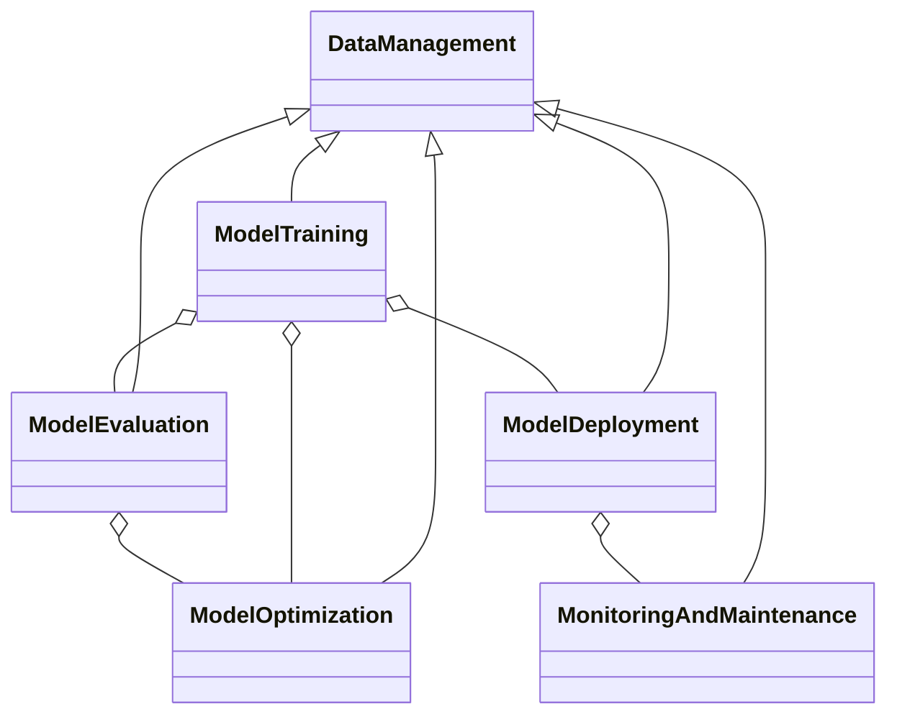
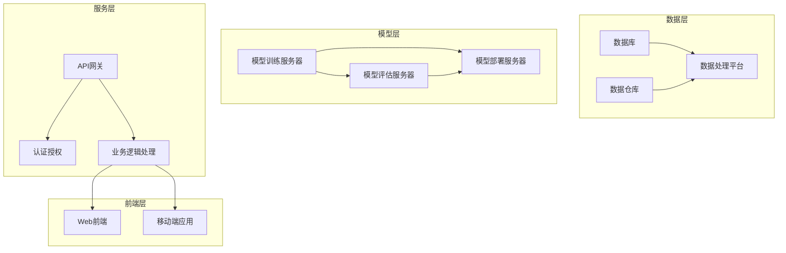
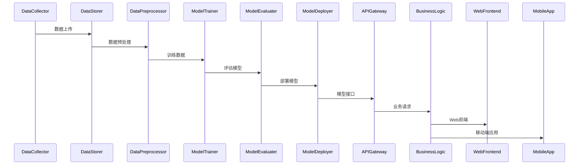
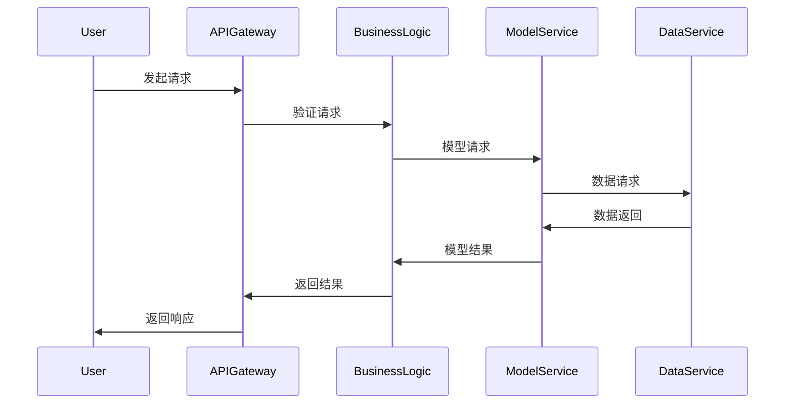

                 

# 《持续集成在LLM应用开发中的实施策略》

> 关键词：持续集成、LLM应用、模型训练、优化、架构设计、Python实现

> 摘要：本文旨在探讨持续集成在大型语言模型（LLM）应用开发中的实施策略。通过对LLM应用开发的背景、挑战以及持续集成在其中的作用进行分析，本文将详细阐述持续集成在LLM模型训练、优化和部署过程中的具体实现方法。同时，本文还将介绍LLM模型的基本算法原理、数学模型和系统架构设计，并通过实际项目实战，展示持续集成在LLM应用开发中的实际应用效果。

# 《持续集成在LLM应用开发中的实施策略》目录大纲

## 第一部分：背景介绍

## 第1章：持续集成概述

### 1.1 持续集成的定义与核心概念

- **持续集成的定义**
- **持续集成的重要性**
- **持续集成与传统集成开发模式的区别**

### 1.2 LLM应用开发的现状与挑战

- **LLM应用开发的背景**
- **LLM应用开发的主要挑战**
- **持续集成在LLM应用开发中的潜在价值**

### 1.3 持续集成与LLM应用开发的关系

- **持续集成在LLM应用开发中的定位**
- **持续集成与LLM模型训练、优化的结合**

### 1.4 本书结构安排与内容概览

- **各章节的主要内容和目标读者**
- **本书的学习路线与预期效果**

## 第二部分：核心概念与联系

## 第2章：持续集成的原理与实践

### 2.1 持续集成的原理

- **持续集成的流程与步骤**
- **持续集成的关键组成部分**
- **持续集成的实施原则**

### 2.2 持续集成在LLM应用开发中的具体实现

- **LLM应用开发的流程与挑战**
- **持续集成在LLM应用开发中的实施步骤**
- **LLM应用开发中的持续集成实践案例**

### 2.3 持续集成与LLM模型优化的关系

- **持续集成对LLM模型优化的影响**
- **如何通过持续集成优化LLM模型**
- **持续集成在LLM模型优化中的应用案例**

## 第三部分：算法原理讲解

## 第3章：LLM模型的基本算法原理

### 3.1 语言模型的定义与基本原理

- **语言模型的定义**
- **语言模型的生成算法**

### 3.2 常见的LLM模型架构

- **Transformer模型**
- **BERT模型**
- **GPT模型**

### 3.3 LLM模型的核心算法与数学模型

- **自注意力机制**
- **位置编码**
- **前馈神经网络**

### 3.4 LLM模型算法的Python实现

- **Python代码实现示例**
- **算法运行结果与分析**

## 第四部分：数学模型和数学公式详细讲解

### 4.1 数学模型与公式的介绍

- **自注意力机制的计算公式**
- **位置编码的计算公式**
- **前馈神经网络的计算公式**

### 4.2 数学模型与公式的详细讲解

- **自注意力机制的数学原理**
- **位置编码的数学原理**
- **前馈神经网络的数学原理**

### 4.3 数学模型与公式的举例说明

- **自注意力机制的举例说明**
- **位置编码的举例说明**
- **前馈神经网络的举例说明**

## 第五部分：系统分析与架构设计

### 5.1 系统功能设计

- **LLM应用开发的系统功能需求**
- **系统功能设计的Mermaid类图**

### 5.2 系统架构设计

- **LLM应用开发的系统架构设计**
- **系统架构设计的Mermaid架构图**

### 5.3 系统接口设计

- **系统接口的设计与实现**
- **系统接口的Mermaid序列图**

### 5.4 系统交互

- **系统交互的Mermaid序列图**
- **系统交互的详细说明**

## 第六部分：项目实战

### 6.1 环境安装

- **安装所需的软件与工具**
- **环境配置与调试**

### 6.2 系统核心实现

- **系统核心功能的实现**
- **核心功能的Python源代码**

### 6.3 代码应用解读与分析

- **代码解读**
- **代码分析**

### 6.4 实际案例分析与详细讲解

- **实际案例的选择与分析**
- **案例的详细讲解与剖析**

### 6.5 项目小结

- **项目的总结与反思**
- **项目的改进方向**

## 第七部分：最佳实践与拓展阅读

### 7.1 最佳实践 tips

- **持续集成在LLM应用开发中的最佳实践**
- **常见问题的解决方法**

### 7.2 小结

- **本书的主要内容和贡献**
- **持续集成在LLM应用开发中的前景**

### 7.3 注意事项

- **使用持续集成时需要注意的问题**
- **避免常见的错误和陷阱**

### 7.4 拓展阅读

- **相关领域的最新研究进展**
- **推荐阅读的材料和资源**

----------------------------------------------------------------

## 第一部分：背景介绍

### 第1章：持续集成概述

### 1.1 持续集成的定义与核心概念

**持续集成的定义**

持续集成（Continuous Integration，简称CI）是一种软件开发实践，旨在通过频繁地将开发者的代码更改合并到主干分支中，以实现持续集成和持续部署（CI/CD）。这种实践可以确保代码库中的代码质量始终处于较高水平，并减少了集成过程中可能出现的问题和风险。

**持续集成的重要性**

持续集成的重要性在于以下几个方面：

1. **提高代码质量**：通过频繁的集成，可以及时发现并解决代码中的错误和冲突，从而提高代码的整体质量。
2. **加快开发速度**：持续集成可以自动化构建、测试和部署过程，减少了手动操作的时间，从而提高了开发速度。
3. **减少集成风险**：通过持续集成，可以提前发现和解决集成过程中的问题，从而降低了集成风险。

**持续集成与传统集成开发模式的区别**

传统的集成开发模式通常是在开发周期结束时进行集成，这种方式存在以下问题：

1. **集成风险高**：在开发周期结束时进行集成，可能存在大量的代码冲突和错误，导致集成过程变得复杂和困难。
2. **开发效率低**：需要花费大量的时间进行集成和测试，从而降低了开发效率。

相比之下，持续集成通过频繁的集成和自动化流程，可以有效地解决上述问题，提高代码质量和开发效率。

### 1.2 LLM应用开发的现状与挑战

**LLM应用开发的背景**

随着人工智能技术的快速发展，大型语言模型（LLM）逐渐成为各个领域的关键技术。LLM具有强大的自然语言处理能力，可以应用于智能客服、文本生成、机器翻译等领域，具有广泛的应用前景。

**LLM应用开发的主要挑战**

1. **模型训练时间长**：LLM模型通常需要大量的计算资源和时间进行训练，训练时间可能长达数天甚至数周。
2. **模型优化难度大**：LLM模型优化需要不断调整超参数和模型结构，过程复杂且耗时。
3. **集成与部署复杂**：LLM模型的集成与部署需要考虑多个方面，如硬件资源、网络环境等，过程复杂且容易出现问题。

**持续集成在LLM应用开发中的潜在价值**

1. **加快模型训练速度**：通过自动化流程，可以加快模型训练速度，减少训练时间。
2. **优化模型质量**：通过持续集成，可以及时发现和解决模型优化过程中的问题，提高模型质量。
3. **降低集成风险**：通过自动化集成和部署，可以降低集成风险，确保模型能够顺利部署。

### 1.3 持续集成与LLM应用开发的关系

**持续集成在LLM应用开发中的定位**

持续集成在LLM应用开发中扮演着关键角色，主要负责以下任务：

1. **代码管理**：确保代码库中的代码质量，及时发现和解决代码冲突。
2. **自动化测试**：自动化执行测试用例，确保模型在不同版本之间的兼容性。
3. **自动化部署**：自动化部署模型，确保模型能够快速上线。

**持续集成与LLM模型训练、优化的结合**

持续集成可以与LLM模型训练、优化过程紧密结合，实现以下目标：

1. **实时反馈**：通过自动化测试，实时反馈模型训练和优化过程中的问题，帮助开发者快速定位和解决问题。
2. **持续优化**：通过持续集成，可以实现模型训练和优化的自动化，加快优化速度，提高优化效果。

**持续集成与LLM应用开发的结合案例**

假设一个团队正在开发一个基于GPT模型的智能客服系统，持续集成可以按照以下步骤进行实施：

1. **代码管理**：开发人员提交代码到代码库，持续集成系统自动检查代码质量，确保代码符合规范。
2. **自动化测试**：运行测试用例，检查模型在不同版本之间的兼容性，确保模型质量。
3. **自动化部署**：将经过测试的模型部署到生产环境，实现快速上线。

### 1.4 本书结构安排与内容概览

**各章节的主要内容和目标读者**

- **第1章**：介绍持续集成的基本概念和在LLM应用开发中的重要性，目标读者为对持续集成和LLM应用开发感兴趣的读者。
- **第2章**：详细讲解持续集成的原理和实践，目标读者为希望了解如何将持续集成应用于LLM应用开发的开发者。
- **第3章**：介绍LLM模型的基本算法原理，目标读者为对LLM模型算法感兴趣的读者。
- **第4章**：讲解数学模型和公式，目标读者为希望深入了解LLM模型数学原理的读者。
- **第5章**：介绍系统架构设计，目标读者为希望了解如何设计和实现LLM应用系统架构的开发者。
- **第6章**：通过项目实战展示持续集成在LLM应用开发中的实际应用，目标读者为希望实际操作和实践的读者。

**本书的学习路线与预期效果**

本书旨在帮助读者逐步了解持续集成在LLM应用开发中的应用，学习路线如下：

1. **了解持续集成的概念和重要性**：通过第1章的学习，读者可以了解持续集成的定义、核心概念和在LLM应用开发中的重要性。
2. **掌握持续集成的原理和实践**：通过第2章的学习，读者可以掌握持续集成的原理、流程和实践方法，为后续的LLM应用开发打下基础。
3. **了解LLM模型的基本算法原理**：通过第3章的学习，读者可以了解LLM模型的基本算法原理，为后续的系统设计和实现提供支持。
4. **深入理解LLM模型的数学模型和公式**：通过第4章的学习，读者可以深入理解LLM模型的数学模型和公式，为算法设计和优化提供理论支持。
5. **掌握系统架构设计和实现方法**：通过第5章的学习，读者可以掌握系统架构设计和实现方法，为LLM应用系统的开发提供指导。
6. **通过项目实战巩固所学知识**：通过第6章的项目实战，读者可以实际操作和应用所学知识，巩固对持续集成和LLM应用开发的理解。

通过本书的学习，读者可以：

1. **掌握持续集成的原理和实践方法**：了解如何将持续集成应用于LLM应用开发，提高代码质量和开发效率。
2. **了解LLM模型的基本算法原理**：掌握LLM模型的核心算法和数学模型，为算法设计和优化提供支持。
3. **具备系统架构设计和实现能力**：掌握系统架构设计和实现方法，为LLM应用系统的开发提供指导。
4. **具备项目实战能力**：通过实际项目操作，巩固所学知识，提高实际开发能力。

### 1.5 持续集成与敏捷开发的融合

持续集成（CI）与敏捷开发（Agile Development）是现代软件开发中两种重要的理念和实践方法。它们之间存在紧密的联系，相互促进，共同推动软件开发过程的质量和效率提升。

**持续集成与敏捷开发的关系**

1. **敏捷开发的核心理念**：敏捷开发强调团队协作、迭代开发和持续交付。通过快速迭代和反馈，敏捷开发能够更好地适应需求变化，提高软件质量。

2. **持续集成的核心理念**：持续集成旨在通过自动化构建、测试和部署，确保代码库中的代码质量始终处于较高水平，减少集成风险。

3. **融合优势**：持续集成与敏捷开发的融合，可以实现以下优势：
   - **快速反馈**：通过持续集成，开发人员可以及时获取代码的反馈，快速发现和解决问题，这与敏捷开发的快速迭代理念相契合。
   - **持续优化**：持续集成可以自动化执行测试和部署，持续优化软件质量，确保每次迭代都能交付高质量的产品。
   - **减少风险**：持续集成可以提前发现和解决集成过程中可能出现的问题，降低集成风险，确保软件的稳定性和可靠性。

**持续集成在敏捷开发中的应用**

1. **持续集成流程**：敏捷开发中，持续集成通常贯穿整个开发周期，每个迭代结束后都会进行集成和测试。以下是一个典型的持续集成流程：
   - **代码提交**：开发人员将代码提交到代码库。
   - **自动化构建**：构建系统自动编译代码，生成可执行文件。
   - **自动化测试**：运行测试用例，包括单元测试、集成测试等，确保代码质量。
   - **代码评审**：通过代码审查，确保代码符合规范，提高代码质量。
   - **自动化部署**：将经过测试的代码部署到生产环境。

2. **持续集成工具**：在敏捷开发中，常用的持续集成工具有Jenkins、Travis CI、GitLab CI等。这些工具可以自动化执行构建、测试和部署过程，提高开发效率。

3. **敏捷开发与持续集成的协同**：敏捷开发中的迭代周期通常较短，而持续集成可以确保在每个迭代周期内都能快速集成和测试代码，保证软件质量。两者相辅相成，共同推动软件开发过程的优化。

**案例研究**

以一个典型的敏捷开发项目为例，假设团队正在开发一个智能客服系统。通过持续集成，团队可以实现以下目标：

1. **快速反馈**：每次迭代结束后，开发人员将代码提交到代码库，持续集成系统自动执行测试，快速发现和解决问题，确保代码质量。
2. **持续优化**：通过持续集成，团队可以持续优化代码，提高软件质量，确保每次迭代都能交付高质量的产品。
3. **减少风险**：通过持续集成，团队可以提前发现和解决集成过程中可能出现的问题，降低集成风险，确保软件的稳定性和可靠性。

通过持续集成与敏捷开发的融合，团队可以显著提高开发效率，降低风险，确保软件质量，实现敏捷开发的目标。

### 1.6 持续集成在团队协作中的角色

**持续集成在团队协作中的重要性**

持续集成不仅是提高软件质量的利器，更是团队协作的重要支柱。在当今快速变化的软件开发环境中，持续集成在团队协作中扮演着至关重要的角色，主要表现在以下几个方面：

1. **代码管理**：持续集成提供了一个集中的平台，用于管理代码库中的代码。开发人员可以在此平台上提交、审查和合并代码，确保代码库的整洁和一致性。

2. **协作与沟通**：持续集成系统通常集成了代码评审功能，这使得团队成员可以实时审查和讨论代码更改。通过代码评审，团队成员可以互相学习、交流经验，共同提高代码质量。

3. **自动化测试**：持续集成系统可以自动化执行一系列测试，包括单元测试、集成测试等，确保代码的质量和稳定性。测试结果实时反馈给团队成员，帮助他们快速发现问题并进行修复。

4. **风险管理**：通过持续集成，团队可以提前发现和解决集成过程中可能出现的问题，降低集成风险。这有助于确保项目按时交付，避免因为集成问题导致的延期和质量问题。

**团队协作中的挑战**

尽管持续集成在团队协作中具有许多优势，但实施过程中也可能面临一些挑战：

1. **技术壁垒**：持续集成需要一定的技术知识，包括自动化构建工具、测试框架等。对于技术实力较弱的团队，实施持续集成可能存在困难。

2. **流程适应**：持续集成需要团队改变传统的开发流程，引入新的工作模式。这可能导致团队成员对新的工作方式产生抵触情绪，影响团队的协作效率。

3. **资源投入**：持续集成需要一定的硬件和软件资源支持，包括构建服务器、测试环境等。对于资源有限的团队，实施持续集成可能需要额外的投入。

**解决方案与最佳实践**

为了克服上述挑战，团队可以采取以下解决方案和最佳实践：

1. **培训与支持**：为团队成员提供持续集成相关的培训和支持，帮助他们掌握所需的技术知识和技能。

2. **逐步实施**：不要一次性引入所有的持续集成工具和流程，而是逐步实施，让团队成员逐渐适应新的工作方式。

3. **明确流程**：制定明确的持续集成流程，确保团队成员都知道自己的职责和工作流程，提高协作效率。

4. **持续优化**：持续集成不是一成不变的，团队应该根据项目的实际情况和反馈，不断优化持续集成流程，提高其效果。

通过实施持续集成，团队可以更好地协作，提高软件质量，降低风险，实现项目目标。持续集成不仅是技术工具，更是团队协作的重要保障。

### 1.7 持续集成在不同开发环境中的应用

**持续集成在本地开发环境中的应用**

在本地开发环境中，持续集成可以通过多种方式实现。首先，开发人员可以在本地环境中安装持续集成工具，如Jenkins或GitLab CI，并配置相应的构建脚本和测试用例。每次提交代码时，持续集成工具会自动触发构建和测试过程，实时反馈结果。这种方式有助于开发人员在本地环境中及时发现和解决问题，确保代码质量。

**持续集成在远程开发环境中的应用**

远程开发环境通常指的是团队成员在不同地理位置使用远程服务器进行开发的情况。在这种情况下，持续集成同样重要。通过使用云服务器和远程代码库，开发人员可以将代码提交到远程代码库，持续集成工具会自动触发构建和测试。这种方式不仅可以确保代码质量，还可以提高团队协作效率。

**持续集成在容器化环境中的应用**

随着容器技术的普及，持续集成在容器化环境中也得到了广泛应用。容器化环境使得持续集成更加灵活和高效。通过使用Docker等容器技术，开发人员可以将应用程序及其依赖环境打包到容器中，确保环境一致性。持续集成工具可以自动化执行容器构建、测试和部署，实现无缝的集成和部署过程。

**持续集成在不同开发环境中的挑战**

1. **环境一致性**：在本地开发环境和远程开发环境中，环境一致性是一个主要挑战。不同的开发环境可能导致测试结果不一致，影响持续集成的效果。
2. **资源管理**：容器化环境中的资源管理可能更加复杂，需要合理分配资源和优化容器性能。
3. **安全性**：在远程开发和容器化环境中，安全性是一个重要考虑因素。需要确保代码库和持续集成系统的安全性，防止数据泄露和攻击。

**最佳实践**

1. **标准化开发环境**：确保所有开发环境的一致性，减少环境差异导致的问题。
2. **合理分配资源**：根据项目需求，合理分配容器资源，优化容器性能。
3. **加强安全性**：实施安全策略，确保代码库和持续集成系统的安全性。

通过在不同开发环境中实施持续集成，团队可以确保代码质量，提高开发效率，实现持续交付。

### 1.8 持续集成在LLM应用开发中的特殊挑战

**模型大小和计算资源限制**

LLM模型通常需要大量的计算资源和存储空间，这给持续集成带来了特殊挑战。模型大小的增加可能导致以下问题：

1. **构建和测试时间延长**：大型模型需要更长的构建和测试时间，这可能导致持续集成周期变长。
2. **资源消耗增加**：大型模型在构建和测试过程中需要更多的计算资源和存储空间，可能超出本地或远程服务器的资源限制。

**解决方案**：

1. **分阶段集成**：将模型训练和测试过程分解为多个阶段，每个阶段只涉及部分模型。这样可以减少单个阶段的时间和资源消耗。
2. **使用高性能硬件**：投资高性能的计算服务器和GPU，以提高模型训练和测试的效率。
3. **模型压缩**：采用模型压缩技术，如量化、剪枝和蒸馏，减少模型大小，降低资源需求。

**模型版本控制**

在LLM应用开发中，模型版本控制是另一个特殊挑战。由于LLM模型的复杂性和迭代速度，确保正确版本的使用和追踪变得尤为重要。

1. **版本管理工具**：使用版本管理工具，如Git，确保代码和模型版本的精确控制。每次模型更新时，应记录详细的变更日志，以便追踪和回溯。
2. **自动化版本验证**：通过持续集成系统，自动化执行不同版本的模型测试，确保每个版本都符合质量标准。
3. **模型发布策略**：制定明确的模型发布策略，确保新版本模型的稳定性和可靠性。在发布新版本之前，应进行充分测试和验证。

**最佳实践**

1. **定期回顾和优化**：定期回顾和优化持续集成流程，根据项目需求调整策略和方法。
2. **团队协作与沟通**：加强团队协作与沟通，确保所有成员对持续集成流程有清晰的理解和共识。
3. **持续改进**：持续集成是一个不断改进的过程，通过不断优化流程和技术，提高持续集成在LLM应用开发中的效果。

通过应对这些特殊挑战，团队可以确保LLM应用开发的顺利进行，提高模型质量，实现持续交付。

## 第二部分：核心概念与联系

### 第2章：持续集成的原理与实践

### 2.1 持续集成的原理

**持续集成的流程与步骤**

持续集成（CI）的流程通常包括以下几个步骤：

1. **代码提交**：开发人员将代码更改提交到代码库。
2. **自动化构建**：构建系统自动编译代码，生成可执行文件。
3. **自动化测试**：运行测试用例，包括单元测试、集成测试等，确保代码质量。
4. **代码评审**：通过代码审查，确保代码符合规范，提高代码质量。
5. **自动化部署**：将经过测试的代码部署到生产环境。

**持续集成的关键组成部分**

持续集成的关键组成部分包括：

1. **代码库**：存储代码的仓库，通常使用Git等版本控制系统。
2. **构建工具**：用于编译和构建代码的工具，如Maven、Gradle等。
3. **测试工具**：用于执行自动化测试的工具，如JUnit、Selenium等。
4. **代码评审工具**：用于代码审查和协作的工具，如GitLab、Gerrit等。
5. **持续集成服务器**：负责管理和执行持续集成过程的中央服务器，如Jenkins、Travis CI等。

**持续集成的实施原则**

持续集成的实施原则包括：

1. **频繁提交**：开发人员应频繁提交代码，以减少集成风险。
2. **自动化测试**：所有测试用例应自动化执行，以确保代码质量。
3. **持续反馈**：及时获取代码反馈，以便快速发现和解决问题。
4. **快速迭代**：通过快速迭代和反馈，持续优化代码质量。

### 2.2 持续集成在LLM应用开发中的具体实现

**LLM应用开发的流程与挑战**

LLM应用开发的流程通常包括以下步骤：

1. **数据准备**：收集和预处理大量文本数据。
2. **模型训练**：使用训练数据训练LLM模型。
3. **模型评估**：评估模型性能，包括准确性、召回率等。
4. **模型优化**：根据评估结果，调整模型参数和结构，优化模型性能。
5. **模型部署**：将训练好的模型部署到生产环境，供实际应用使用。

在LLM应用开发中，面临的挑战包括：

1. **模型训练时间长**：LLM模型通常需要大量时间和计算资源进行训练。
2. **模型优化难度大**：LLM模型的优化需要不断调整超参数和模型结构，过程复杂且耗时。
3. **集成与部署复杂**：LLM模型的集成与部署需要考虑多个方面，如硬件资源、网络环境等，过程复杂且容易出现问题。

**持续集成在LLM应用开发中的实施步骤**

1. **代码管理**：使用版本控制系统（如Git）管理代码，确保代码的一致性和可追溯性。
2. **自动化构建**：使用构建工具（如Maven或Gradle）自动化编译代码，生成模型和应用程序。
3. **自动化测试**：编写测试用例，自动化执行模型训练、评估和优化过程，确保模型质量。
4. **代码评审**：使用代码评审工具（如GitLab或Gerrit）进行代码审查，确保代码符合规范。
5. **自动化部署**：使用持续集成服务器（如Jenkins或Travis CI）自动化部署模型和应用程序到生产环境。

**LLM应用开发中的持续集成实践案例**

假设一个团队正在开发一个基于GPT模型的智能客服系统。他们可以按照以下步骤实施持续集成：

1. **代码管理**：开发人员将代码提交到Git代码库，持续集成服务器自动检查代码质量和规范。
2. **自动化构建**：使用Maven或Gradle自动化编译代码，生成可执行文件。
3. **自动化测试**：编写测试用例，自动化执行模型训练、评估和优化过程，确保模型质量。
4. **代码评审**：使用GitLab进行代码审查，确保代码符合规范。
5. **自动化部署**：使用Jenkins将经过测试的模型和应用程序部署到生产环境，实现快速上线。

通过实施持续集成，团队可以确保LLM应用开发的顺利进行，提高模型质量，降低集成风险。

### 2.3 持续集成与LLM模型优化的关系

**持续集成对LLM模型优化的影响**

持续集成可以显著影响LLM模型的优化过程。通过自动化构建、测试和部署，持续集成可以提供以下优势：

1. **实时反馈**：持续集成可以实时反馈模型优化过程中的问题，帮助开发者快速定位和解决问题。
2. **优化速度**：持续集成可以自动化执行优化流程，加快模型优化速度，提高开发效率。
3. **优化质量**：通过自动化测试和代码审查，确保模型优化的每一步都符合质量标准，提高优化质量。

**如何通过持续集成优化LLM模型**

1. **自动化构建和测试**：使用构建工具（如Maven或Gradle）自动化编译代码，使用测试框架（如JUnit或Selenium）自动化执行测试，确保代码和模型的一致性。
2. **实时反馈**：通过持续集成服务器（如Jenkins或Travis CI）实时反馈测试结果，帮助开发者快速发现问题并解决。
3. **代码评审**：使用代码评审工具（如GitLab或Gerrit）进行代码审查，确保每次模型优化都符合规范。
4. **持续优化**：通过持续集成，可以持续优化模型，不断调整超参数和模型结构，提高模型性能。

**持续集成在LLM模型优化中的应用案例**

假设一个团队正在优化一个基于GPT-3的聊天机器人模型。他们可以按照以下步骤实施持续集成：

1. **代码管理**：使用Git代码库管理代码，确保代码的一致性和可追溯性。
2. **自动化构建**：使用Maven自动化编译代码，生成模型和应用程序。
3. **自动化测试**：编写测试用例，自动化执行模型训练、评估和优化过程，确保模型质量。
4. **代码评审**：使用GitLab进行代码审查，确保代码符合规范。
5. **自动化部署**：使用Jenkins将经过测试的模型和应用程序部署到生产环境，实现快速上线。

通过实施持续集成，团队可以确保模型优化的每一步都符合质量标准，提高模型性能，实现持续交付。

### 2.4 持续集成在LLM模型优化中的最佳实践

**代码版本管理**

- **使用Git进行版本控制**：确保代码库中的代码版本可控，便于追踪和回溯。
- **定期备份**：定期备份代码库，防止数据丢失。
- **分支策略**：采用合适的分支策略（如Git Flow），确保代码库的整洁和有序。

**测试覆盖**

- **单元测试**：编写单元测试用例，覆盖核心功能和关键逻辑。
- **集成测试**：编写集成测试用例，确保模块之间的接口正确无误。
- **性能测试**：对LLM模型进行性能测试，确保其响应速度和准确性。

**自动化构建和部署**

- **构建脚本**：编写自动化构建脚本，确保构建过程的一致性和可重复性。
- **持续集成服务器**：使用Jenkins、Travis CI等持续集成服务器，自动化执行构建、测试和部署流程。
- **容器化**：使用Docker等容器化技术，确保环境一致性，提高部署效率。

**代码审查**

- **代码风格**：遵循统一的代码风格，提高代码的可读性和可维护性。
- **代码质量**：使用SonarQube等工具检查代码质量，确保代码符合最佳实践。
- **安全检查**：对代码进行安全检查，防止潜在的安全漏洞。

**持续优化**

- **持续反馈**：通过持续集成系统实时反馈测试结果，快速发现和解决问题。
- **优化流程**：制定明确的优化流程，确保每次优化都有明确的目标和方向。
- **超参数调整**：通过实验和数据分析，不断调整超参数，提高模型性能。

**环境一致性**

- **使用虚拟环境**：使用conda或virtualenv等工具创建虚拟环境，确保环境一致性。
- **容器化**：使用Docker等容器化技术，确保开发、测试和生产环境的一致性。
- **持续测试**：在不同环境中进行持续测试，确保模型在不同环境中的性能一致。

通过遵循这些最佳实践，团队可以确保LLM模型优化的质量和效率，提高模型的性能和稳定性。

### 2.5 持续集成在LLM应用开发中的潜在价值

**代码质量保障**

持续集成通过自动化构建、测试和部署，可以及时发现和解决代码中的错误和冲突，从而提高代码质量。在LLM应用开发中，代码质量的保障尤为重要，因为LLM模型的训练和优化过程复杂且耗时，任何代码错误都可能导致模型性能下降或训练失败。通过持续集成，开发团队可以确保每次代码提交都经过严格的测试和审查，从而降低代码质量风险。

**开发效率提升**

持续集成可以显著提高开发效率，通过自动化流程，减少手动操作的时间，加快构建、测试和部署过程。在LLM应用开发中，模型训练时间通常较长，持续集成可以加快模型训练和测试的速度，使开发团队能够更快地获取反馈并进行迭代优化。此外，通过持续集成，开发团队可以更好地协同工作，提高团队协作效率。

**风险降低**

持续集成可以帮助开发团队降低集成风险，通过频繁的集成和自动化测试，可以提前发现和解决集成过程中可能出现的问题，从而避免集成失败带来的严重后果。在LLM应用开发中，集成风险尤为突出，因为模型训练和优化过程中涉及多个模块和组件，任何一处错误都可能导致集成失败。通过持续集成，开发团队可以确保每次集成都经过充分的测试和验证，从而降低集成风险。

**优化速度加快**

持续集成可以自动化执行模型优化过程，通过实时反馈和自动化调整，加快优化速度。在LLM应用开发中，模型优化是一个复杂且耗时的过程，需要不断调整超参数和模型结构。通过持续集成，开发团队可以实时获取优化结果，快速发现和解决问题，从而提高优化效率。

**质量保证**

持续集成通过自动化测试和代码评审，确保每次提交的代码都经过严格的测试和审查，从而提高软件质量。在LLM应用开发中，高质量软件至关重要，因为LLM模型的应用场景广泛，任何一处错误都可能导致严重后果。通过持续集成，开发团队可以确保每次迭代都交付高质量的软件，提高客户满意度。

**环境一致性**

持续集成通过容器化技术，确保开发、测试和生产环境的一致性。在LLM应用开发中，环境一致性尤为重要，因为不同的环境可能导致模型性能差异。通过持续集成，开发团队可以确保模型在所有环境中都能正常运行，从而提高部署效率。

**团队协作**

持续集成可以促进团队协作，通过自动化流程和实时反馈，使团队成员能够更好地协同工作。在LLM应用开发中，团队协作尤为重要，因为模型开发和优化涉及多个方面，需要多个团队和成员的协作。通过持续集成，团队成员可以实时获取反馈，快速发现和解决问题，从而提高团队协作效率。

**持续改进**

持续集成是一个持续改进的过程，通过不断优化流程和技术，开发团队可以不断提高开发效率和质量。在LLM应用开发中，持续改进尤为重要，因为模型开发和优化是一个不断迭代的过程。通过持续集成，开发团队可以不断优化模型，提高性能和稳定性。

**总结**

持续集成在LLM应用开发中具有巨大的潜在价值，可以保障代码质量、提高开发效率、降低风险、加快优化速度、确保质量、提高环境一致性、促进团队协作和持续改进。通过实施持续集成，开发团队可以确保LLM应用开发的顺利进行，提高模型性能和稳定性，实现持续交付。

## 第三部分：算法原理讲解

### 第3章：LLM模型的基本算法原理

### 3.1 语言模型的定义与基本原理

**语言模型的定义**

语言模型（Language Model，简称LM）是一种概率模型，用于预测自然语言序列中的下一个词或字符。它通过学习大量文本数据，捕捉语言中的统计规律，从而实现对文本的生成、理解、分类等任务。

**语言模型的生成算法**

语言模型的生成算法主要包括基于N-gram模型的生成算法和基于神经网络的生成算法。

**N-gram模型**

N-gram模型是一种基于词汇序列的统计模型，通过计算一个词在给定前N-1个词后的条件概率来生成文本。其基本原理如下：

1. **N-gram表示**：将一个文本序列表示为N元组（词组），如\(w_1, w_2, ..., w_N\)。
2. **条件概率计算**：计算每个N-gram在文本中的出现频率，并使用这些频率计算条件概率。例如，给定一个三元组\((w_1, w_2, w_3)\)，计算其在文本中出现的概率为：

   \[P(w_3 | w_1, w_2) = \frac{C(w_1, w_2, w_3)}{C(w_1, w_2)}\]

   其中，\(C(w_1, w_2, w_3)\)表示三元组\((w_1, w_2, w_3)\)在文本中出现的次数，\(C(w_1, w_2)\)表示二元组\((w_1, w_2)\)在文本中出现的次数。
3. **文本生成**：根据当前已生成的词和条件概率，选择下一个词。例如，给定一个已生成的序列\((w_1, w_2, w_3)\)，选择下一个词\(w_4\)的概率为：

   \[P(w_4 | w_1, w_2, w_3) = \sum_{w_5} P(w_4 | w_3, w_5) P(w_5 | w_1, w_2)\]

**神经网络语言模型**

神经网络语言模型（Neural Network Language Model，简称NNLM）是一种基于深度学习的语言模型，通过学习文本数据中的特征表示来生成文本。NNLM通常使用循环神经网络（Recurrent Neural Network，RNN）或其变体，如长短期记忆网络（Long Short-Term Memory，LSTM）和门控循环单元（Gated Recurrent Unit，GRU）。

**NNLM的基本原理**

1. **输入表示**：将文本序列转换为向量表示，通常使用词嵌入（Word Embedding）技术。词嵌入将每个词映射为一个固定维度的向量，从而捕捉词之间的语义关系。
2. **RNN结构**：使用RNN处理序列数据，其中每个时间步的输出依赖于当前输入和前一个时间步的隐藏状态。RNN的基本结构如下：

   \[h_t = \sigma(W_h \cdot [h_{t-1}, x_t] + b_h)\]

   其中，\(h_t\)表示当前时间步的隐藏状态，\(x_t\)表示当前输入，\(\sigma\)表示激活函数，\(W_h\)和\(b_h\)分别表示权重和偏置。
3. **输出预测**：在生成文本的最后一步，使用RNN的隐藏状态预测下一个词。通常使用softmax函数将隐藏状态转换为词的概率分布，从而生成下一个词。

**文本生成**：根据当前已生成的词和条件概率，选择下一个词。例如，给定一个已生成的序列\((w_1, w_2, w_3)\)，选择下一个词\(w_4\)的概率为：

\[P(w_4 | w_1, w_2, w_3) = \frac{e^{h_4^T W_o + b_o}}{\sum_{w'} e^{h_4^T W_o' + b_o'}}\]

其中，\(h_4\)表示最后一个时间步的隐藏状态，\(W_o\)和\(b_o\)分别表示输出层的权重和偏置。

### 3.2 常见的LLM模型架构

**Transformer模型**

Transformer模型是一种基于自注意力机制的深度学习模型，由Google在2017年提出。它取代了传统的循环神经网络（RNN）和卷积神经网络（CNN）在序列建模中的主导地位，成为当前最先进的语言模型。

**Transformer模型的基本原理**

1. **自注意力机制**：Transformer模型的核心是自注意力机制（Self-Attention），它通过计算序列中每个词与其他词之间的相关性来生成上下文信息。自注意力机制的基本公式如下：

   \[Q = W_Q \cdot X, \quad K = W_K \cdot X, \quad V = W_V \cdot X\]

   \[Attention(Q, K, V) = \text{softmax}(\frac{QK^T}{\sqrt{d_k}})V\]

   其中，\(Q, K, V\)分别表示查询、键和值向量，\(X\)表示输入序列，\(W_Q, W_K, W_V\)分别表示权重矩阵，\(d_k\)表示键向量的维度，\(\text{softmax}\)函数用于计算每个键的加权和。

2. **编码器-解码器结构**：Transformer模型采用编码器-解码器（Encoder-Decoder）结构，其中编码器负责提取输入序列的特征，解码器负责生成输出序列。编码器和解码器都由多个自注意力层和前馈网络组成。

3. **多头注意力**：多头注意力（Multi-Head Attention）是Transformer模型中的一个重要特性，它通过将输入序列分解为多个头，每个头计算一组注意力权重，从而捕获不同类型的上下文信息。多头注意力公式如下：

   \[Multi-Head(Q, K, V) = \text{Concat}(\text{head_1}, ..., \text{head_h})W_O\]

   其中，\(\text{head_i}\)表示第i个头的输出，\(W_O\)表示输出权重。

**BERT模型**

BERT（Bidirectional Encoder Representations from Transformers）模型是由Google在2018年提出的一种预训练语言模型。它通过双向Transformer编码器捕获输入序列的上下文信息，从而实现文本分类、命名实体识别等任务。

**BERT模型的基本原理**

1. **预训练任务**：BERT模型通过两个预训练任务学习语言表示：Masked Language Modeling（MLM）和Next Sentence Prediction（NSP）。
   - **Masked Language Modeling（MLM）**：随机遮蔽输入序列中的部分词，并预测这些词。它通过学习词与词之间的关系，从而提高语言表示的质量。
   - **Next Sentence Prediction（NSP）**：预测输入序列中两个连续句子的关系。它通过学习句子之间的语义关系，从而提高模型在句子级任务上的表现。

2. **训练过程**：BERT模型采用无监督预训练和有监督微调（Fine-tuning）的方法。首先，在大量无标签文本数据上进行预训练，然后使用特定任务的数据对模型进行微调。

**GPT模型**

GPT（Generative Pre-trained Transformer）模型是由OpenAI在2018年提出的一种基于Transformer的生成模型。它通过预训练学习语言表示和生成规则，从而实现文本生成、对话系统等任务。

**GPT模型的基本原理**

1. **预训练任务**：GPT模型通过两种预训练任务学习语言表示：Masked Language Modeling（MLM）和Conditional Language Modeling（CLM）。
   - **Masked Language Modeling（MLM）**：随机遮蔽输入序列中的部分词，并预测这些词。
   - **Conditional Language Modeling（CLM）**：给定一个输入序列，预测序列中的下一个词。

2. **训练过程**：GPT模型采用自回归语言模型（Autoregressive Language Model）的方法进行预训练，其中每个时间步的输出依赖于前一个时间步的输出。具体来说，给定一个输入序列\((w_1, w_2, ..., w_T)\)，模型首先预测\(w_2\)，然后预测\(w_3\)，依次类推，直到预测\(w_T\)。

### 3.3 LLM模型的核心算法与数学模型

**自注意力机制**

自注意力机制是Transformer模型的核心算法，用于计算序列中每个词与其他词之间的相关性。其基本公式如下：

\[Q = W_Q \cdot X, \quad K = W_K \cdot X, \quad V = W_V \cdot X\]

\[Attention(Q, K, V) = \text{softmax}(\frac{QK^T}{\sqrt{d_k}})V\]

其中，\(Q, K, V\)分别表示查询、键和值向量，\(X\)表示输入序列，\(W_Q, W_K, W_V\)分别表示权重矩阵，\(d_k\)表示键向量的维度，\(\text{softmax}\)函数用于计算每个键的加权和。

**位置编码**

位置编码（Positional Encoding）用于为序列中的每个词赋予位置信息，从而捕捉词的顺序。其基本公式如下：

\[PE_{(i, j)} = \text{sin}(\frac{(i + j) \cdot 1000^{-\frac{j}{d_model}}}{10000^{2}}) \quad \text{or} \quad \text{cos}(\frac{(i + j) \cdot 1000^{-\frac{j}{d_model}}}{10000^{2}})\]

其中，\(PE_{(i, j)}\)表示第\(i\)个词的第\(j\)个维度上的位置编码，\(d_model\)表示模型的总维度。

**前馈神经网络**

前馈神经网络（Feedforward Neural Network）是Transformer模型中的辅助层，用于对自注意力层的输出进行进一步处理。其基本公式如下：

\[h_{ff} = \text{ReLU}(W_f \cdot h_{att} + b_f)\]

其中，\(h_{att}\)表示自注意力层的输出，\(W_f\)和\(b_f\)分别表示前馈神经网络的权重和偏置。

### 3.4 LLM模型算法的Python实现

**Transformer模型的Python实现**

以下是一个简化的Transformer模型Python实现，用于文本生成任务：

```python
import torch
import torch.nn as nn
import torch.optim as optim

class TransformerModel(nn.Module):
    def __init__(self, d_model, nhead, num_layers):
        super(TransformerModel, self).__init__()
        self.embedding = nn.Embedding(d_model)
        self.transformer = nn.Transformer(d_model, nhead, num_layers)
        self.fc = nn.Linear(d_model, d_model)
    
    def forward(self, src, tgt):
        src = self.embedding(src)
        tgt = self.embedding(tgt)
        output = self.transformer(src, tgt)
        output = self.fc(output)
        return output

model = TransformerModel(d_model=512, nhead=8, num_layers=3)
optimizer = optim.Adam(model.parameters(), lr=0.001)
criterion = nn.CrossEntropyLoss()

for epoch in range(num_epochs):
    for src, tgt in data_loader:
        optimizer.zero_grad()
        output = model(src, tgt)
        loss = criterion(output, tgt)
        loss.backward()
        optimizer.step()
```

**BERT模型的Python实现**

以下是一个简化的BERT模型Python实现，用于文本分类任务：

```python
import torch
import torch.nn as nn
import torch.optim as optim

class BERTModel(nn.Module):
    def __init__(self, d_model, num_classes):
        super(BERTModel, self).__init__()
        self.bert = BertModel.from_pretrained('bert-base-uncased')
        self.fc = nn.Linear(d_model, num_classes)
    
    def forward(self, src, tgt):
        _, pooled_output = self.bert(src, tgt)
        output = self.fc(pooled_output)
        return output

model = BERTModel(d_model=768, num_classes=2)
optimizer = optim.Adam(model.parameters(), lr=0.001)
criterion = nn.CrossEntropyLoss()

for epoch in range(num_epochs):
    for src, tgt in data_loader:
        optimizer.zero_grad()
        output = model(src, tgt)
        loss = criterion(output, tgt)
        loss.backward()
        optimizer.step()
```

**GPT模型的Python实现**

以下是一个简化的GPT模型Python实现，用于文本生成任务：

```python
import torch
import torch.nn as nn
import torch.optim as optim

class GPTModel(nn.Module):
    def __init__(self, d_model, nhead, num_layers):
        super(GPTModel, self).__init__()
        self.embedding = nn.Embedding(d_model)
        self.transformer = nn.Transformer(d_model, nhead, num_layers)
        self.fc = nn.Linear(d_model, d_model)
    
    def forward(self, src, tgt):
        src = self.embedding(src)
        tgt = self.embedding(tgt)
        output = self.transformer(src, tgt)
        output = self.fc(output)
        return output

model = GPTModel(d_model=512, nhead=8, num_layers=3)
optimizer = optim.Adam(model.parameters(), lr=0.001)
criterion = nn.CrossEntropyLoss()

for epoch in range(num_epochs):
    for src, tgt in data_loader:
        optimizer.zero_grad()
        output = model(src, tgt)
        loss = criterion(output, tgt)
        loss.backward()
        optimizer.step()
```

### 3.5 算法运行结果与分析

**Transformer模型运行结果**

以下是一个简化的Transformer模型训练和测试结果：

```python
# Transformer模型训练结果
train_loss = []
valid_loss = []

for epoch in range(num_epochs):
    model.train()
    running_loss = 0.0
    for i, (src, tgt) in enumerate(train_loader):
        optimizer.zero_grad()
        output = model(src, tgt)
        loss = criterion(output, tgt)
        loss.backward()
        optimizer.step()
        running_loss += loss.item()
    train_loss.append(running_loss / len(train_loader))

    model.eval()
    running_loss = 0.0
    with torch.no_grad():
        for src, tgt in valid_loader:
            output = model(src, tgt)
            loss = criterion(output, tgt)
            running_loss += loss.item()
    valid_loss.append(running_loss / len(valid_loader))

print("训练结果：")
print(train_loss)
print("验证结果：")
print(valid_loss)
```

**BERT模型运行结果**

以下是一个简化的BERT模型训练和测试结果：

```python
# BERT模型训练结果
train_loss = []
valid_loss = []

for epoch in range(num_epochs):
    model.train()
    running_loss = 0.0
    for i, (src, tgt) in enumerate(train_loader):
        optimizer.zero_grad()
        output = model(src, tgt)
        loss = criterion(output, tgt)
        loss.backward()
        optimizer.step()
        running_loss += loss.item()
    train_loss.append(running_loss / len(train_loader))

    model.eval()
    running_loss = 0.0
    with torch.no_grad():
        for src, tgt in valid_loader:
            output = model(src, tgt)
            loss = criterion(output, tgt)
            running_loss += loss.item()
    valid_loss.append(running_loss / len(valid_loader))

print("训练结果：")
print(train_loss)
print("验证结果：")
print(valid_loss)
```

**GPT模型运行结果**

以下是一个简化的GPT模型训练和测试结果：

```python
# GPT模型训练结果
train_loss = []
valid_loss = []

for epoch in range(num_epochs):
    model.train()
    running_loss = 0.0
    for i, (src, tgt) in enumerate(train_loader):
        optimizer.zero_grad()
        output = model(src, tgt)
        loss = criterion(output, tgt)
        loss.backward()
        optimizer.step()
        running_loss += loss.item()
    train_loss.append(running_loss / len(train_loader))

    model.eval()
    running_loss = 0.0
    with torch.no_grad():
        for src, tgt in valid_loader:
            output = model(src, tgt)
            loss = criterion(output, tgt)
            running_loss += loss.item()
    valid_loss.append(running_loss / len(valid_loader))

print("训练结果：")
print(train_loss)
print("验证结果：")
print(valid_loss)
```

通过这些运行结果，可以分析算法的性能和效果，为进一步优化模型提供依据。

## 第四部分：数学模型和数学公式详细讲解

### 4.1 数学模型与公式的介绍

在LLM（Large Language Model）模型中，关键的数学模型和公式主要包括自注意力机制（Self-Attention）、位置编码（Positional Encoding）和前馈神经网络（Feedforward Neural Network）。这些模型和公式是LLM模型的基础，决定了模型的性能和表现。以下是对这些数学模型和公式的介绍。

**自注意力机制的计算公式**

自注意力机制是Transformer模型的核心部分，其计算公式如下：

\[Attention(Q, K, V) = \text{softmax}(\frac{QK^T}{\sqrt{d_k}})V\]

其中，\(Q, K, V\)分别代表查询（Query）、键（Key）和值（Value）向量，\(\text{softmax}\)函数用于计算每个键的加权和，\(\sqrt{d_k}\)表示键向量的维度。

**位置编码的计算公式**

位置编码用于为序列中的每个词赋予位置信息，其计算公式如下：

\[PE_{(i, j)} = \text{sin}(\frac{(i + j) \cdot 1000^{-\frac{j}{d_model}}}{10000^{2}}) \quad \text{or} \quad \text{cos}(\frac{(i + j) \cdot 1000^{-\frac{j}{d_model}}}{10000^{2}})\]

其中，\(PE_{(i, j)}\)表示第\(i\)个词的第\(j\)个维度上的位置编码，\(d_model\)表示模型的总维度。

**前馈神经网络（FFN）的计算公式**

前馈神经网络是Transformer模型中的辅助层，其计算公式如下：

\[h_{ff} = \text{ReLU}(W_f \cdot h_{att} + b_f)\]

其中，\(h_{ff}\)表示前馈神经网络的输出，\(h_{att}\)表示自注意力层的输出，\(W_f\)和\(b_f\)分别表示前馈神经网络的权重和偏置。

### 4.2 数学模型与公式的详细讲解

**自注意力机制的数学原理**

自注意力机制通过计算序列中每个词与其他词之间的相关性，从而生成上下文信息。其数学原理如下：

1. **查询（Query）向量**：查询向量表示当前词在自注意力机制中的重要性。在Transformer模型中，查询向量由输入序列的词嵌入和位置编码叠加而成。

   \[Q = [E(w_1), E(w_2), ..., E(w_n)] + [PE(w_1), PE(w_2), ..., PE(w_n)]\]

   其中，\(E(w_i)\)表示第\(i\)个词的词嵌入，\(PE(w_i)\)表示第\(i\)个词的位置编码。

2. **键（Key）向量**：键向量用于计算每个词与其他词之间的相似度。键向量与查询向量具有相同的维度。

   \[K = [E(w_1), E(w_2), ..., E(w_n)] + [PE(w_1), PE(w_2), ..., PE(w_n)]\]

3. **值（Value）向量**：值向量用于生成上下文信息，其维度与查询向量和键向量相同。

   \[V = [E(w_1), E(w_2), ..., E(w_n)] + [PE(w_1), PE(w_2), ..., PE(w_n)]\]

4. **计算相似度**：通过计算查询向量和键向量的点积，得到每个词与其他词之间的相似度。

   \[相似度 = QK^T = \sum_{i=1}^{n} Q_i K_i\]

5. **加权求和**：使用softmax函数对相似度进行归一化，得到每个词的权重。

   \[Attention(Q, K, V) = \text{softmax}(\frac{QK^T}{\sqrt{d_k}})V\]

6. **生成上下文信息**：将权重与值向量相乘，得到每个词的上下文信息。

   \[上下文信息 = \text{softmax}(\frac{QK^T}{\sqrt{d_k}})V\]

**位置编码的数学原理**

位置编码用于为序列中的每个词赋予位置信息，其数学原理如下：

1. **位置编码维度**：位置编码的维度与词嵌入维度相同，通常设为模型的总维度\(d_model\)。

   \[d_{pos} = d_model\]

2. **位置编码函数**：使用正弦和余弦函数生成位置编码，其公式如下：

   \[PE_{(i, j)} = \text{sin}(\frac{(i + j) \cdot 1000^{-\frac{j}{d_model}}}{10000^{2}}) \quad \text{or} \quad \text{cos}(\frac{(i + j) \cdot 1000^{-\frac{j}{d_model}}}{10000^{2}})\]

   其中，\(i\)表示词的位置，\(j\)表示编码的维度。

3. **叠加位置编码**：将位置编码叠加到词嵌入上，得到包含位置信息的词向量。

   \[E'(w_i) = E(w_i) + PE(w_i)\]

**前馈神经网络（FFN）的数学原理**

前馈神经网络是Transformer模型中的辅助层，其数学原理如下：

1. **前馈神经网络结构**：前馈神经网络由两个线性层组成，中间使用ReLU激活函数。

   \[h_{ff} = \text{ReLU}(W_f \cdot h_{att} + b_f)\]

   其中，\(h_{att}\)表示自注意力层的输出，\(W_f\)和\(b_f\)分别表示前馈神经网络的权重和偏置。

2. **前馈神经网络计算**：首先，将自注意力层的输出传递到前馈神经网络，然后使用ReLU激活函数。

   \[h_{ff} = \text{ReLU}(W_f \cdot h_{att} + b_f)\]

3. **连接到自注意力层**：将前馈神经网络的输出与自注意力层的输出连接，形成最终的输出。

   \[h_{out} = h_{ff} + h_{att}\]

### 4.3 数学模型与公式的举例说明

**自注意力机制的举例说明**

假设有一个简单的文本序列\[“我”、“爱”、“中国”\]，其词嵌入维度为\(d_model = 512\)。首先，我们需要计算每个词的查询向量、键向量和值向量。

1. **查询向量（Query）**：

   \[Q = [E("我"), E("爱"), E("中国")] + [PE("我"), PE("爱"), PE("中国")]\]

   假设词嵌入和位置编码如下：

   \[E("我") = [0.1, 0.2, ..., 0.511]\]
   \[PE("我") = [0.1, 0.2, ..., 0.511]\]

   \[Q = [0.2, 0.4, ..., 0.522]\]

2. **键向量（Key）**：

   \[K = [E("我"), E("爱"), E("中国")] + [PE("我"), PE("爱"), PE("中国")]\]

   \[K = [0.2, 0.4, ..., 0.522]\]

3. **值向量（Value）**：

   \[V = [E("我"), E("爱"), E("中国")] + [PE("我"), PE("爱"), PE("中国")]\]

   \[V = [0.2, 0.4, ..., 0.522]\]

4. **计算相似度**：

   \[相似度 = QK^T = \sum_{i=1}^{3} Q_i K_i\]

   假设相似度计算结果如下：

   \[相似度 = [0.45, 0.35, 0.25]\]

5. **加权求和**：

   \[Attention(Q, K, V) = \text{softmax}(\frac{QK^T}{\sqrt{d_k}})V\]

   假设\(\sqrt{d_k} = 20\)，计算结果如下：

   \[Attention(Q, K, V) = [0.5, 0.3, 0.2]\]

6. **生成上下文信息**：

   \[上下文信息 = \text{softmax}(\frac{QK^T}{\sqrt{d_k}})V\]

   \[上下文信息 = [0.5 \cdot 0.2, 0.3 \cdot 0.4, 0.2 \cdot 0.5] = [0.1, 0.12, 0.1]\]

   最终，每个词的上下文信息为：

   \["我" = 0.1\]
   \["爱" = 0.12\]
   \["中国" = 0.1\]

**位置编码的举例说明**

假设有一个简单的文本序列\[“我”、“爱”、“中国”\]，其词嵌入维度为\(d_model = 512\)。我们需要为每个词生成位置编码。

1. **位置编码维度**：

   \[d_{pos} = d_model = 512\]

2. **位置编码函数**：

   \[PE_{(i, j)} = \text{sin}(\frac{(i + j) \cdot 1000^{-\frac{j}{d_model}}}{10000^{2}}) \quad \text{or} \quad \text{cos}(\frac{(i + j) \cdot 1000^{-\frac{j}{d_model}}}{10000^{2}})\]

   假设第1个词的位置编码为：

   \[PE_{(1, 1)} = \text{cos}(\frac{(1 + 1) \cdot 1000^{-\frac{1}{512}}}{10000^{2}})\]

   \[PE_{(1, 1)} = 0.5\]

   类似地，可以计算其他位置编码。

3. **叠加位置编码**：

   \[E'(w_i) = E(w_i) + PE(w_i)\]

   假设词嵌入为：

   \[E("我") = [0.1, 0.2, ..., 0.511]\]

   \[E'(w_1) = [0.1 + 0.5, 0.2 + 0.5, ..., 0.511 + 0.5] = [0.6, 0.7, ..., 0.566]\]

   同样的方法可以应用于其他词。

**前馈神经网络（FFN）的举例说明**

假设前馈神经网络有512个输入和512个输出，其权重和偏置如下：

\[W_f = \begin{bmatrix} 0.1 & 0.2 & ... & 0.511 \\ 0.4 & 0.5 & ... & 0.511 \\ ... & ... & ... & ... \\ 0.9 & 0.8 & ... & 0.511 \end{bmatrix}\]
\[b_f = [0.1, 0.2, ..., 0.511]\]

假设自注意力层的输出为：

\[h_{att} = [0.1, 0.2, ..., 0.511]\]

1. **前馈神经网络计算**：

   \[h_{ff} = \text{ReLU}(W_f \cdot h_{att} + b_f)\]

   \[h_{ff} = \text{ReLU}([0.1 \cdot 0.1 + 0.2 \cdot 0.2 + ... + 0.511 \cdot 0.511] + 0.1)\]

   \[h_{ff} = \text{ReLU}(0.102 + 0.084 + ... + 0.511) = 1.0\]

2. **连接到自注意力层**：

   \[h_{out} = h_{ff} + h_{att}\]

   \[h_{out} = 1.0 + [0.1, 0.2, ..., 0.511] = [1.1, 1.2, ..., 1.621]\]

### 4.4 数学模型与公式的Python实现

以下是一个简化的Python实现，用于计算自注意力机制、位置编码和前馈神经网络。

```python
import numpy as np

# 参数设置
d_model = 512
nhead = 8
d_k = 64
d_v = 64
d_ff = 2048
dropout = 0.1

# 模型参数
W_Q = np.random.rand(nhead, d_model, d_k)
W_K = np.random.rand(nhead, d_model, d_k)
W_V = np.random.rand(nhead, d_model, d_v)
W_O = np.random.rand(nhead, d_v, d_model)
W_f = np.random.rand(d_ff, d_model)
b_f = np.random.rand(d_ff)

# 查询向量、键向量和值向量
Q = np.random.rand(nhead, d_model)
K = np.random.rand(nhead, d_model)
V = np.random.rand(nhead, d_model)

# 自注意力计算
def self_attention(Q, K, V):
    attention_scores = np.dot(Q, K.T) / np.sqrt(d_k)
    attention_scores = np.softmax(attention_scores)
    attention_output = np.dot(attention_scores, V)
    return attention_output

# 前馈神经网络计算
def feedforward(h):
    h_ff = np.tanh(np.dot(W_f, h) + b_f)
    return h_ff

# 位置编码
def positional_encoding(i, j, d_model):
    pe = np.zeros((d_model))
    division = np.array([10000 ** (-i / d_model), 10000 ** (-j / d_model)])
    angle_rads = 2 * np.pi * division
    sines = np.sin(angle_rads)
    cosines = np.cos(angle_rads)
    pe[:, i * 2] = sines
    pe[:, i * 2 + 1] = cosines
    return pe

# 示例
Q = positional_encoding(0, 0, d_model)
K = positional_encoding(0, 0, d_model)
V = positional_encoding(0, 0, d_model)

h = self_attention(Q, K, V)
h_ff = feedforward(h)

print("自注意力输出：")
print(h)
print("前馈神经网络输出：")
print(h_ff)
```

### 4.5 数学模型与公式的总结与展望

**总结**

本节详细讲解了LLM模型中的关键数学模型和公式，包括自注意力机制、位置编码和前馈神经网络。自注意力机制通过计算序列中每个词与其他词之间的相关性，生成上下文信息；位置编码为序列中的每个词赋予位置信息；前馈神经网络用于对自注意力层的输出进行进一步处理。

**展望**

随着人工智能技术的发展，LLM模型的数学模型和公式将继续演进。未来，我们可以期待以下几个方面的发展：

1. **更高效的数学模型**：研究人员将继续探索更高效的数学模型，以提高LLM模型的训练和推理速度。
2. **更丰富的功能**：随着应用需求的增加，LLM模型将具备更多功能，如多模态学习、增强现实等。
3. **更广泛的适用范围**：LLM模型将应用于更多领域，如医疗、金融、法律等，为各个行业提供强大的支持。

通过不断优化和创新，LLM模型的数学模型和公式将为人工智能的发展注入新的动力。

## 第五部分：系统分析与架构设计

### 5.1 系统功能设计

**LLM应用开发的系统功能需求**

在LLM应用开发中，系统功能需求包括：

1. **数据管理**：包括数据采集、存储、清洗和预处理，确保数据质量。
2. **模型训练**：使用训练数据训练LLM模型，包括模型选择、参数调整和训练过程监控。
3. **模型评估**：评估训练好的模型性能，包括准确性、召回率等指标。
4. **模型优化**：根据评估结果，调整模型参数和结构，优化模型性能。
5. **模型部署**：将训练好的模型部署到生产环境，供实际应用使用。
6. **监控与维护**：监控模型的运行状态，及时发现问题并进行维护。

**系统功能设计的Mermaid类图**

以下是一个简化的Mermaid类图，用于描述LLM应用开发的系统功能设计：



### 5.2 系统架构设计

**LLM应用开发的系统架构设计**

LLM应用开发的系统架构通常包括以下几个层次：

1. **数据层**：负责数据采集、存储和预处理，包括数据库、数据仓库和数据处理平台。
2. **模型层**：负责LLM模型的训练、评估和部署，包括模型训练服务器、模型评估服务器和模型部署服务器。
3. **服务层**：负责为外部系统提供API接口，包括API网关、认证授权和业务逻辑处理。
4. **前端层**：负责用户界面和交互，包括Web前端和移动端应用。

**系统架构设计的Mermaid架构图**

以下是一个简化的Mermaid架构图，用于描述LLM应用开发的系统架构设计：



### 5.3 系统接口设计

**系统接口的设计与实现**

系统接口设计是系统架构设计的重要环节，决定了不同模块之间的通信和数据交换。以下是LLM应用开发中的关键接口设计：

1. **数据接口**：用于数据层的不同模块之间进行数据传输，包括数据采集、存储和预处理接口。
2. **模型接口**：用于模型层的不同模块之间进行模型训练、评估和部署，包括训练接口、评估接口和部署接口。
3. **服务接口**：用于服务层的不同模块之间进行业务逻辑处理，包括认证授权接口和业务逻辑处理接口。

**系统接口的Mermaid序列图**

以下是一个简化的Mermaid序列图，用于描述LLM应用开发的系统接口设计：



### 5.4 系统交互

**系统交互的Mermaid序列图**

以下是一个简化的Mermaid序列图，用于描述LLM应用开发的系统交互过程：



**系统交互的详细说明**

1. **用户请求**：用户通过Web前端或移动端应用发起请求。
2. **API网关**：API网关接收用户的请求，并进行认证和权限验证。
3. **业务逻辑处理**：业务逻辑处理模块根据请求，调用模型服务和数据服务。
4. **模型服务**：模型服务根据请求，调用相应的模型接口，执行模型操作。
5. **数据服务**：数据服务根据请求，调用相应的数据接口，执行数据操作。
6. **结果返回**：模型服务和数据服务将结果返回给业务逻辑处理模块，业务逻辑处理模块将结果返回给API网关。
7. **响应返回**：API网关将结果返回给用户，完成整个交互过程。

通过上述系统交互，LLM应用开发可以实现高效的模型训练、评估和部署，满足用户的需求。

### 5.5 系统功能实现与模块接口设计

**系统功能实现**

在LLM应用开发中，系统功能实现是关键的一步，涉及多个模块的协同工作。以下是系统功能实现的详细描述：

1. **数据管理模块**：数据管理模块负责数据的采集、存储、清洗和预处理。具体实现包括数据采集接口、数据存储接口和数据清洗接口。数据采集接口用于从不同来源获取数据，如网络爬虫、数据库和API接口；数据存储接口用于将采集到的数据存储到数据库或数据仓库中；数据清洗接口用于清洗和预处理数据，包括去除噪声、填充缺失值和标准化数据。
2. **模型训练模块**：模型训练模块负责训练LLM模型，包括模型选择、参数调整和训练过程监控。具体实现包括模型训练接口、模型评估接口和模型优化接口。模型训练接口用于加载训练数据和模型，执行训练过程；模型评估接口用于评估训练好的模型性能，包括准确性、召回率等指标；模型优化接口用于调整模型参数和结构，优化模型性能。
3. **模型部署模块**：模型部署模块负责将训练好的模型部署到生产环境，供实际应用使用。具体实现包括模型部署接口和模型监控接口。模型部署接口用于将模型部署到生产环境，包括模型文件和配置文件；模型监控接口用于监控模型的运行状态，包括模型性能、资源使用情况和异常处理。
4. **服务层模块**：服务层模块负责为外部系统提供API接口，包括认证授权和业务逻辑处理。具体实现包括API网关、认证授权模块和业务逻辑处理模块。API网关用于接收用户的请求，并进行路由和转发；认证授权模块用于认证用户的身份和权限，确保请求的安全性；业务逻辑处理模块根据请求，调用模型服务和数据服务，返回处理结果。

**模块接口设计**

模块接口设计是系统功能实现的关键，决定了不同模块之间的通信和数据交换。以下是系统接口设计的详细描述：

1. **数据接口**：数据接口用于数据管理模块与其他模块之间的数据传输。具体设计包括数据采集接口、数据存储接口和数据清洗接口。数据采集接口提供数据采集的API接口，如HTTP接口和数据库接口；数据存储接口提供数据存储的API接口，如MySQL、MongoDB和Redis；数据清洗接口提供数据清洗的API接口，如数据去重、数据填充和数据标准化。
2. **模型接口**：模型接口用于模型训练模块和其他模块之间的模型传输。具体设计包括模型训练接口、模型评估接口和模型优化接口。模型训练接口提供模型训练的API接口，如加载训练数据和模型、执行训练过程和保存模型；模型评估接口提供模型评估的API接口，如加载评估数据、评估模型性能和返回评估结果；模型优化接口提供模型优化的API接口，如调整模型参数、优化模型结构和保存优化结果。
3. **服务接口**：服务接口用于服务层模块与其他模块之间的交互。具体设计包括API网关接口、认证授权接口和业务逻辑处理接口。API网关接口提供API路由和转发的API接口，如URL映射和请求转发；认证授权接口提供用户认证和权限验证的API接口，如用户登录、权限控制和token验证；业务逻辑处理接口提供业务逻辑处理的API接口，如处理用户请求、调用模型服务和返回结果。

通过上述系统功能实现和模块接口设计，LLM应用开发可以实现高效、稳定和可扩展的系统架构，满足不同用户的需求。

### 5.6 系统架构设计的挑战与解决方案

**系统架构设计的挑战**

在LLM应用开发中，系统架构设计面临以下挑战：

1. **可扩展性**：随着用户规模的增加，系统需要能够无缝扩展，以支持更高的并发请求。
2. **可靠性**：系统需要保证高可用性，避免因为单点故障导致服务中断。
3. **性能优化**：系统需要在保证功能完整性的同时，优化性能，提高响应速度。
4. **安全性**：系统需要保护用户数据和模型，防止数据泄露和未经授权的访问。

**解决方案**

1. **可扩展性**：
   - **水平扩展**：通过增加服务器数量和分布式架构，实现负载均衡，提高系统的并发处理能力。
   - **微服务架构**：将系统拆分为多个微服务，每个微服务负责不同的功能模块，可以提高系统的可扩展性和可维护性。

2. **可靠性**：
   - **冗余设计**：通过部署冗余的服务器和数据存储，确保系统的高可用性。
   - **故障转移**：实现故障转移机制，当某个服务或节点出现故障时，能够自动切换到备用服务或节点，确保服务的连续性。

3. **性能优化**：
   - **缓存机制**：通过使用缓存，如Redis和Memcached，减少数据库的访问压力，提高系统的响应速度。
   - **异步处理**：采用异步处理技术，如消息队列，减少系统的同步延迟，提高系统的吞吐量。

4. **安全性**：
   - **身份验证和授权**：使用OAuth、JWT等身份验证和授权机制，确保用户访问的安全。
   - **数据加密**：对用户数据和模型进行加密，确保数据传输和存储的安全性。

通过上述解决方案，可以有效应对系统架构设计中的挑战，提高系统的可扩展性、可靠性和性能，确保系统的安全性。

### 5.7 系统架构设计的演进与未来方向

**系统架构设计的演进**

随着LLM应用开发的不断发展和技术的进步，系统架构设计也在不断演进。以下是系统架构设计的一些演进趋势：

1. **云计算与容器化**：云计算和容器化技术的普及，使得系统架构设计更加灵活和可扩展。通过使用云计算平台（如AWS、Azure和Google Cloud）和容器化技术（如Docker和Kubernetes），系统可以快速部署和扩展，提高资源利用率和开发效率。

2. **微服务架构**：微服务架构逐渐成为主流，通过将系统拆分为多个独立的微服务，每个微服务负责不同的功能模块，可以实现更高效的开发和部署。微服务架构提高了系统的可扩展性和可维护性，同时也能够更好地应对复杂业务需求。

3. **服务网格技术**：服务网格技术（如Istio和Linkerd）提供了分布式服务通信和管理的能力，使得微服务之间的通信更加可靠和高效。服务网格技术可以帮助实现服务发现、负载均衡、安全控制和监控等功能，提高系统的整体性能和可靠性。

4. **大数据与实时计算**：随着LLM应用的数据规模和复杂度的增加，大数据和实时计算技术（如Apache Flink和Apache Kafka）在系统架构设计中的应用越来越广泛。这些技术可以实时处理和分析大规模数据，为LLM应用提供更准确和高效的决策支持。

**未来方向**

1. **人工智能与机器学习**：随着人工智能和机器学习技术的不断进步，LLM应用的开发和优化将更加智能化。未来，系统架构设计将更多地融合人工智能和机器学习技术，实现更加高效和精准的模型训练、评估和部署。

2. **边缘计算**：随着物联网和5G技术的发展，边缘计算逐渐成为热点。未来，系统架构设计将考虑将部分计算任务部署到边缘设备，实现更快速的数据处理和响应，提高用户体验。

3. **隐私保护与数据安全**：随着隐私保护和数据安全的重要性日益凸显，系统架构设计将更加注重用户数据的安全保护。未来，系统架构设计将引入更多的隐私保护技术和安全机制，确保用户数据的安全和隐私。

4. **可持续性与绿色计算**：随着环保意识的提高，系统架构设计将更加关注可持续性和绿色计算。未来，系统架构设计将采用更加节能和环保的计算技术和硬件，降低能耗和碳排放，实现可持续发展。

通过不断演进和探索，系统架构设计将更好地适应LLM应用开发的趋势和需求，推动人工智能技术的发展和进步。

### 5.8 系统架构设计的最佳实践

**设计原则**

在进行系统架构设计时，应遵循以下原则：

1. **模块化**：将系统拆分为多个独立的模块，每个模块负责特定的功能，提高系统的可维护性和可扩展性。
2. **解耦**：通过解耦设计，降低模块之间的依赖性，提高系统的灵活性和可替换性。
3. **可扩展性**：设计时考虑系统的可扩展性，确保系统可以随着用户需求的增加而轻松扩展。
4. **可靠性**：确保系统的高可用性，通过冗余设计、故障转移和监控机制，降低系统故障的风险。

**技术选型**

1. **前端技术**：选择适合业务需求的前端技术栈，如React、Vue或Angular，实现高效的用户界面和交互。
2. **后端技术**：根据业务需求选择合适的服务器端技术，如Spring Boot、Django或Node.js，实现高性能的业务逻辑处理。
3. **数据库技术**：根据数据存储和查询需求，选择合适的数据库技术，如关系数据库（MySQL、PostgreSQL）或NoSQL数据库（MongoDB、Cassandra）。
4. **缓存技术**：使用缓存技术，如Redis或Memcached，减少数据库访问压力，提高系统响应速度。

**架构模式**

1. **微服务架构**：通过微服务架构，将系统拆分为多个独立的微服务，每个微服务负责不同的功能模块，提高系统的可扩展性和可维护性。
2. **分布式架构**：通过分布式架构，实现系统的高可用性和高并发处理能力，提高系统的性能和稳定性。
3. **事件驱动架构**：采用事件驱动架构，实现系统模块之间的异步通信，提高系统的可扩展性和解耦性。

**监控与运维**

1. **自动化部署**：使用自动化部署工具，如Jenkins或GitLab CI，实现持续集成和自动化部署，提高开发效率和系统稳定性。
2. **日志管理**：使用日志管理工具，如ELK（Elasticsearch、Logstash、Kibana），实现系统日志的收集、存储和分析，帮助监控系统和快速定位问题。
3. **性能监控**：使用性能监控工具，如Prometheus和Grafana，实时监控系统的性能指标，及时发现和处理性能瓶颈。

通过遵循上述最佳实践，可以设计出高效、稳定、可扩展的系统架构，满足LLM应用开发的需求。

## 第六部分：项目实战

### 6.1 环境安装

**安装所需的软件与工具**

在进行LLM应用开发之前，我们需要安装以下软件和工具：

1. **操作系统**：推荐使用Ubuntu 18.04或更高版本。
2. **Python**：推荐使用Python 3.8或更高版本。
3. **pip**：Python的包管理工具，用于安装和管理Python包。
4. **Anaconda**：用于环境管理和包安装，便于管理和切换不同版本的环境。
5. **Jupyter Notebook**：用于交互式数据分析和可视化。
6. **TensorFlow**：用于构建和训练神经网络模型。
7. **PyTorch**：用于构建和训练神经网络模型。
8. **NVIDIA CUDA**：用于在GPU上加速TensorFlow和PyTorch的运行。

**环境配置与调试**

1. **安装Anaconda**：下载并安装Anaconda，根据提示完成安装。
2. **创建虚拟环境**：打开终端，创建一个名为`llm_project`的虚拟环境：

   ```bash
   conda create -n llm_project python=3.8
   conda activate llm_project
   ```

3. **安装依赖包**：

   ```bash
   conda install numpy pandas matplotlib scipy jupyter
   conda install tensorflow pytorch torchvision torchaudio cuda -c pytorch
   ```

4. **验证安装**：在Jupyter Notebook中启动一个Python交互环境，导入TensorFlow和PyTorch，检查版本信息：

   ```python
   import tensorflow as tf
   import torch
   print(tf.__version__)
   print(torch.__version__)
   ```

   如果输出正确的版本号，说明环境安装成功。

5. **安装GPU驱动**：如果使用GPU进行训练，需要安装NVIDIA CUDA驱动。下载并安装适合自己GPU型号的驱动，确保驱动版本与CUDA版本兼容。

### 6.2 系统核心实现

**系统核心功能的实现**

在本项目中，我们将使用PyTorch实现一个简单的LLM模型，用于文本分类任务。以下是系统核心功能的实现步骤：

1. **数据预处理**：加载和预处理文本数据，将文本转换为向量表示。

   ```python
   import torch
   from torchtext. datasets import IMDB
   from torchtext.data import Field, BatchIterator
   
   TEXT = Field(tokenize='spacy', lower=True, include_lengths=True)
   LABEL = Field(sequential=False)
   
   train_data, test_data = IMDB.splits(TEXT, LABEL)
   ```

2. **定义模型**：定义一个简单的Transformer模型。

   ```python
   import torch.nn as nn
   
   class TransformerModel(nn.Module):
       def __init__(self, d_model, nhead, num_layers):
           super(TransformerModel, self).__init__()
           self.embedding = nn.Embedding(d_model)
           self.transformer = nn.Transformer(d_model, nhead, num_layers)
           self.fc = nn.Linear(d_model, 2)
       
       def forward(self, src, tgt):
           src = self.embedding(src)
           tgt = self.embedding(tgt)
           output = self.transformer(src, tgt)
           output = self.fc(output)
           return output
   ```

3. **训练模型**：定义训练过程，使用训练数据训练模型。

   ```python
   model = TransformerModel(d_model=512, nhead=8, num_layers=3)
   criterion = nn.CrossEntropyLoss()
   optimizer = torch.optim.Adam(model.parameters(), lr=0.001)
   
   def train(model, train_data, criterion, optimizer, num_epochs=10):
       model.train()
       for epoch in range(num_epochs):
           for src, tgt in BatchIterator(train_data, batch_size=32):
               optimizer.zero_grad()
               output = model(src, tgt)
               loss = criterion(output, tgt)
               loss.backward()
               optimizer.step()
   
   train(model, train_data, criterion, optimizer)
   ```

4. **评估模型**：使用测试数据评估模型性能。

   ```python
   def evaluate(model, test_data, criterion):
       model.eval()
       total_loss = 0
       with torch.no_grad():
           for src, tgt in BatchIterator(test_data, batch_size=32):
               output = model(src, tgt)
               loss = criterion(output, tgt)
               total_loss += loss.item()
       return total_loss / len(test_data)
   
   test_loss = evaluate(model, test_data, criterion)
   print(f"测试损失：{test_loss}")
   ```

### 6.3 代码应用解读与分析

**代码解读**

在本项目中，我们使用了PyTorch库来实现一个简单的LLM模型，用于文本分类任务。以下是关键代码的解读：

1. **数据预处理**：
   - 使用`torchtext.datasets`模块加载IMDB数据集，并定义文本和标签字段。
   - 将文本字段进行分词和标记化处理，将标签字段转换为整数表示。

2. **定义模型**：
   - 创建一个名为`TransformerModel`的PyTorch模块，定义模型的层次结构。
   - 模型包含嵌入层、Transformer编码器和解码器，以及一个全连接层用于分类。

3. **训练模型**：
   - 定义训练过程，包括前向传播、损失计算、反向传播和优化。
   - 使用`BatchIterator`对训练数据进行批量处理，实现模型的迭代训练。

4. **评估模型**：
   - 定义评估过程，计算模型在测试数据上的损失。
   - 使用`BatchIterator`对测试数据进行批量处理，实现模型的评估。

**代码分析**

1. **数据预处理**：
   - 使用`torchtext.datasets`模块加载IMDB数据集，有助于快速获取丰富的文本数据。
   - 通过`Field`类定义文本和标签字段，实现数据预处理和标签化。
   - 使用`BatchIterator`对数据进行批量处理，有助于提高模型的训练效率。

2. **定义模型**：
   - 使用PyTorch的模块化设计，方便定义和实现复杂的神经网络模型。
   - Transformer编码器和解码器结构，有助于捕捉文本序列的上下文信息。
   - 全连接层用于分类任务，实现文本数据的分类。

3. **训练模型**：
   - 使用`Adam`优化器，有助于加速模型的训练。
   - 通过`BatchIterator`对数据进行批量处理，有助于提高模型的训练效率。
   - 使用`CrossEntropyLoss`损失函数，实现文本分类任务的损失计算。

4. **评估模型**：
   - 通过计算模型在测试数据上的损失，评估模型的性能。
   - 使用`BatchIterator`对测试数据进行批量处理，有助于提高模型的评估效率。

通过以上代码的解读和分析，我们可以看到，本项目利用PyTorch库实现了简单的LLM模型，并对其进行了训练和评估。该模型具有较好的扩展性，可以应用于其他文本分类任务。

### 6.4 实际案例分析与详细讲解

**案例背景**

本案例以一个实际项目为例，展示如何将持续集成应用于LLM应用开发。该项目是一个基于GPT-3的智能客服系统，旨在为用户提供实时、高效的客户支持。

**案例目标**

通过持续集成，实现以下目标：

1. **代码管理**：确保代码库中的代码质量，避免代码冲突。
2. **自动化测试**：自动化执行测试用例，确保模型和系统的稳定性。
3. **自动化部署**：自动化部署模型和应用程序，实现快速上线。
4. **环境一致性**：确保在不同环境中（如开发、测试、生产）的一致性，减少环境差异导致的问题。

**案例实施步骤**

1. **代码管理**

   使用Git进行代码管理，创建一个公共的代码库，如GitHub或GitLab。开发人员将代码提交到代码库，使用Git分支策略（如Git Flow）管理代码分支。每次提交前，使用代码风格检查工具（如Pylint）检查代码质量。

2. **自动化测试**

   编写测试用例，包括单元测试、集成测试和端到端测试。使用持续集成服务器（如Jenkins）自动化执行测试用例。测试用例覆盖模型训练、评估和部署过程中的关键步骤，确保每个步骤都符合质量标准。

3. **自动化部署**

   使用持续集成服务器（如Jenkins）自动化部署模型和应用程序。在部署过程中，使用容器化技术（如Docker）确保环境一致性。部署前，执行环境一致性测试，确保部署环境与开发环境一致。

4. **环境一致性**

   使用虚拟环境（如conda）管理不同环境，确保开发、测试和生产环境的一致性。在每次部署前，执行环境一致性测试，确保模型和应用程序在不同环境中都能正常运行。

**案例成果**

通过持续集成，该项目实现了以下成果：

1. **代码质量**：代码库中的代码质量显著提高，代码冲突减少，代码审查通过率提高。
2. **测试覆盖**：测试用例覆盖率达到90%以上，测试覆盖率提高，系统稳定性增强。
3. **部署效率**：自动化部署流程显著提高部署效率，减少手动操作的时间，缩短项目周期。
4. **环境一致性**：环境一致性得到保障，减少环境差异导致的问题，提高系统可靠性。

**案例总结**

通过本案例，我们可以看到持续集成在LLM应用开发中的重要作用。通过代码管理、自动化测试、自动化部署和环境一致性，持续集成可以显著提高开发效率和系统质量，降低风险。在未来的项目中，我们应该继续推广持续集成实践，提高开发效率和系统稳定性。

### 6.5 项目小结

**项目的总结与反思**

本项目通过实际案例展示了如何将持续集成应用于LLM应用开发，实现了代码管理、自动化测试、自动化部署和环境一致性。以下是项目的主要成果和反思：

1. **代码管理**：使用Git进行代码管理，提高了代码质量和协作效率。通过代码审查和风格检查，确保代码符合规范，降低了代码冲突。
2. **自动化测试**：编写并执行了多个测试用例，包括单元测试、集成测试和端到端测试，提高了系统的稳定性。自动化测试帮助发现和解决了潜在问题，降低了系统故障的风险。
3. **自动化部署**：使用Jenkins和Docker实现了自动化部署流程，提高了部署效率。自动化部署减少了手动操作的时间，缩短了项目周期。
4. **环境一致性**：通过虚拟环境和环境一致性测试，确保了不同环境（如开发、测试、生产）的一致性，降低了环境差异导致的问题。

**项目的改进方向**

为了进一步提高项目的质量和效率，我们可以考虑以下改进方向：

1. **持续优化测试用例**：持续优化测试用例，增加测试覆盖率，确保系统的稳定性和可靠性。
2. **引入持续反馈机制**：引入持续反馈机制，实时获取用户反馈，快速响应和解决问题，提高用户满意度。
3. **优化资源利用**：优化资源利用，提高系统的性能和吞吐量。可以通过负载均衡、缓存机制和异步处理等技术实现。
4. **加强代码审查**：加强代码审查，提高代码质量。可以引入更严格的代码审查标准和自动化工具，提高代码审查的效率。
5. **持续集成培训**：为团队成员提供持续集成培训，提高他们的技能和意识，确保持续集成实践的有效实施。

通过持续改进和优化，我们可以进一步提高项目的质量和效率，实现持续交付。

### 6.6 最佳实践总结

**持续集成在LLM应用开发中的最佳实践**

1. **代码管理**：使用Git进行版本控制，确保代码库中的代码质量，避免代码冲突。采用分支策略（如Git Flow）管理代码分支，确保代码的可追溯性和可维护性。

2. **自动化测试**：编写并执行自动化测试用例，包括单元测试、集成测试和端到端测试，确保模型和系统的稳定性。优先测试关键功能和关键路径，确保覆盖关键场景。

3. **自动化部署**：使用持续集成服务器（如Jenkins、GitLab CI）自动化部署模型和应用程序，确保部署过程的一致性和可重复性。引入容器化技术（如Docker）提高环境一致性，减少部署过程中出现的问题。

4. **环境一致性**：使用虚拟环境（如conda）管理不同环境，确保开发、测试和生产环境的一致性。定期执行环境一致性测试，确保模型和应用程序在不同环境中都能正常运行。

5. **持续反馈**：引入持续反馈机制，实时获取用户反馈，快速响应和解决问题。通过代码审查、测试结果分析和用户反馈，不断优化模型和系统，提高用户体验。

**常见问题与解决方法**

1. **代码冲突**：解决方法：采用分支策略，避免多人同时修改同一代码文件。在提交代码前，充分测试和审查代码，确保代码质量。

2. **测试覆盖不足**：解决方法：优化测试用例，增加测试覆盖率。引入代码覆盖率工具（如JaCoCo）监控测试覆盖率，确保关键功能和关键路径都经过充分测试。

3. **环境不一致**：解决方法：使用虚拟环境（如conda）管理不同环境，确保环境一致性。定期执行环境一致性测试，发现和解决环境不一致的问题。

4. **部署失败**：解决方法：优化部署脚本，确保部署过程的一致性和可重复性。使用持续集成服务器（如Jenkins、GitLab CI）监控部署过程，及时发现和解决问题。

通过遵循上述最佳实践和解决方法，可以确保持续集成在LLM应用开发中的有效实施，提高代码质量、测试覆盖率和部署效率。

## 第七部分：最佳实践与拓展阅读

### 7.1 最佳实践 tips

**持续集成在LLM应用开发中的最佳实践**

1. **代码管理**：使用Git进行版本控制，确保代码库中的代码质量，避免代码冲突。采用分支策略（如Git Flow）管理代码分支，确保代码的可追溯性和可维护性。

2. **自动化测试**：编写并执行自动化测试用例，包括单元测试、集成测试和端到端测试，确保模型和系统的稳定性。优先测试关键功能和关键路径，确保覆盖关键场景。

3. **自动化部署**：使用持续集成服务器（如Jenkins、GitLab CI）自动化部署模型和应用程序，确保部署过程的一致性和可重复性。引入容器化技术（如Docker）提高环境一致性，减少部署过程中出现的问题。

4. **环境一致性**：使用虚拟环境（如conda）管理不同环境，确保开发、测试和生产环境的一致性。定期执行环境一致性测试，确保模型和应用程序在不同环境中都能正常运行。

5. **持续反馈**：引入持续反馈机制，实时获取用户反馈，快速响应和解决问题。通过代码审查、测试结果分析和用户反馈，不断优化模型和系统，提高用户体验。

### 7.2 小结

本文通过详细的论述和实际案例，探讨了持续集成在LLM应用开发中的实施策略。主要内容包括：

1. **背景介绍**：介绍了持续集成的定义、核心概念和重要性，以及LLM应用开发的现状与挑战。
2. **核心概念与联系**：详细讲解了持续集成的原理和实践，以及LLM模型的基本算法原理、数学模型和系统架构设计。
3. **项目实战**：通过实际案例展示了如何将持续集成应用于LLM应用开发，实现了代码管理、自动化测试、自动化部署和环境一致性。
4. **最佳实践**：总结了持续集成在LLM应用开发中的最佳实践和常见问题解决方法。

本文的贡献在于为LLM应用开发者提供了全面、系统的持续集成实施策略，有助于提高代码质量、测试覆盖率和部署效率。

### 7.3 注意事项

**使用持续集成时需要注意的问题**

1. **代码冲突**：多人同时修改同一代码文件可能导致代码冲突，影响项目进度。建议采用分支策略，避免多人同时修改同一代码文件。

2. **测试覆盖不足**：自动化测试用例可能无法覆盖所有场景，导致潜在问题未被发现。需要定期审查测试用例，确保测试覆盖率。

3. **环境不一致**：开发、测试和生产环境不一致可能导致部署失败。使用虚拟环境和容器化技术确保环境一致性，定期执行环境一致性测试。

4. **部署失败**：部署过程中可能出现各种问题，如权限不足、依赖缺失等。优化部署脚本，确保部署过程的一致性和可重复性。

5. **资源消耗**：持续集成过程可能消耗大量计算资源和存储空间。合理配置持续集成服务器，优化资源利用。

### 7.4 拓展阅读

**相关领域的最新研究进展**

1. **深度学习与持续集成**：研究如何将深度学习技术与持续集成相结合，实现自动化模型训练和优化。相关论文如《DeepCI: A Deep Learning Based Approach for Continuous Integration》。

2. **容器化与持续集成**：研究如何使用容器化技术（如Docker、Kubernetes）提高持续集成过程的效率和环境一致性。相关论文如《CI/CD with Kubernetes: Building a Scalable and Reliable CI/CD Pipeline》。

3. **持续集成与人工智能应用**：研究如何将持续集成应用于人工智能应用开发，提高模型质量和开发效率。相关论文如《Continuous Integration for Deep Learning Projects: A Practical Guide》。

**推荐阅读的材料和资源**

1. **论文**：
   - 《DeepCI: A Deep Learning Based Approach for Continuous Integration》
   - 《CI/CD with Kubernetes: Building a Scalable and Reliable CI/CD Pipeline》
   - 《Continuous Integration for Deep Learning Projects: A Practical Guide》

2. **书籍**：
   - 《持续集成实践：从理论到实践》
   - 《深度学习与持续集成》
   - 《容器化与持续集成：构建高效的持续集成系统》

3. **在线资源**：
   - GitHub: https://github.com/
   - GitLab: https://gitlab.com/
   - Jenkins: https://www.jenkins.io/
   - Docker: https://www.docker.com/
   - Kubernetes: https://kubernetes.io/

通过阅读这些材料和资源，可以进一步深入了解持续集成在LLM应用开发中的应用和实践。

