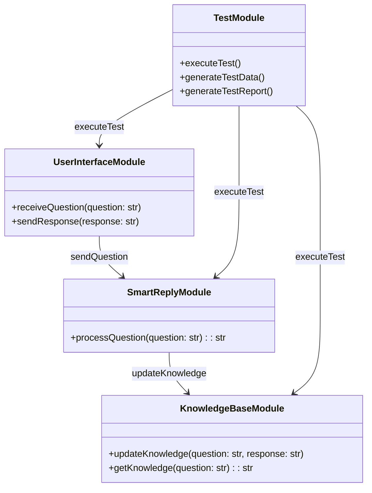
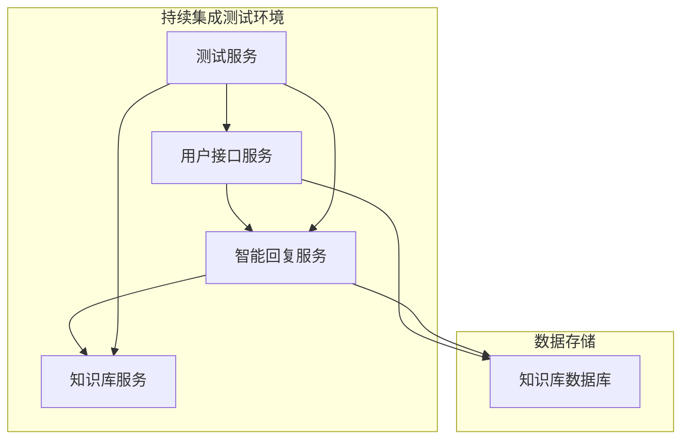
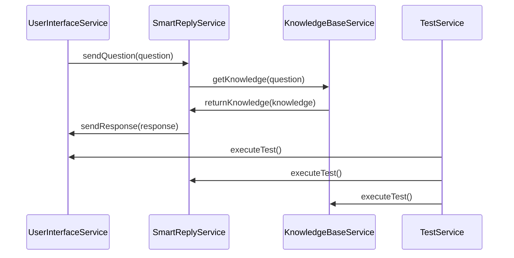

                 

### 持续集成测试环境：模拟LLM应用的真实场景

关键词：持续集成、测试环境、LLM应用、模拟真实场景、性能优化、稳定性保障

摘要：
本文旨在深入探讨持续集成测试环境在模拟大型语言模型（LLM）应用的真实场景中的应用。通过对持续集成测试环境的核心概念、构建方法、优化策略以及具体实践的分析，本文将为读者提供一个全面的指南，帮助他们在软件开发过程中更好地应对复杂性和不确定性。文章首先介绍了持续集成测试环境的基本背景，然后详细阐述了核心概念和原理，接着通过实际案例展示了其在LLM应用中的具体应用，最后提出了最佳实践和优化建议。

### 第一部分：背景介绍

#### 1.1.1 问题背景

随着软件开发的复杂度和迭代速度的不断提升，现代企业对软件质量的要求越来越高。传统的软件开发模式，如单点交付、手动测试和手工部署，已经无法满足这种快速变化的需求。持续集成（Continuous Integration，CI）和持续测试（Continuous Testing，CT）作为一种现代化的软件开发模式，应运而生。

持续集成是指通过自动化工具将开发者的代码合并到主分支，并进行自动化的构建和测试，确保代码质量。持续测试则是在持续集成的过程中，通过自动化的测试工具对代码进行全面的测试，以发现潜在的问题和缺陷。这两种模式结合起来，构成了持续集成测试环境（Continuous Integration and Testing Environment，CIT Environment）。

持续集成测试环境在软件开发过程中起着至关重要的作用。它不仅提高了开发效率和测试覆盖率，还确保了软件质量，减少了因代码冲突和错误导致的开发中断。特别是在大规模语言模型（LLM）应用的开发中，由于数据量大、复杂度高，传统的测试方法往往难以模拟真实的场景，因此构建一个有效的持续集成测试环境尤为重要。

#### 1.1.2 问题描述

尽管持续集成测试环境在理论上能够大幅提升软件开发和测试的效率，但在实际应用中，特别是在模拟LLM应用的真实场景时，仍然面临着诸多挑战：

1. **数据多样性**：LLM应用通常需要大量的数据进行训练和测试，不同来源的数据在格式、质量和覆盖度上可能存在差异，这给测试环境的构建和数据的处理带来了巨大的挑战。

2. **性能优化**：LLM应用的计算复杂度高，性能优化是确保测试环境稳定运行的关键。如何高效地利用计算资源，减少测试时间，是持续集成测试环境需要解决的重要问题。

3. **稳定性保障**：LLM应用的稳定性直接影响其质量。如何在不断变化的环境下，保障测试环境的稳定性，确保测试结果的可靠性，是持续集成测试环境需要考虑的核心问题。

4. **测试覆盖率**：在模拟真实场景时，如何确保测试用例能够覆盖到所有可能的场景和路径，是提高测试质量的关键。如何设计高效的测试用例，是一个需要深入探讨的问题。

#### 1.1.3 问题解决

本文将通过详细讲解持续集成测试环境的构建、优化和应用，帮助读者解决模拟LLM应用的真实场景中的问题。文章将分为以下几个部分：

1. **核心概念与联系**：介绍持续集成与持续部署、测试自动化和环境配置管理等核心概念，并分析它们之间的联系。
2. **算法原理讲解**：详细讲解测试数据生成算法、性能优化算法和稳定性保障算法，并提供具体的Python代码实现和数学模型分析。
3. **系统分析与架构设计**：通过实际项目案例，介绍持续集成测试环境的系统功能设计、架构设计和接口设计。
4. **项目实战**：展示如何搭建和优化持续集成测试环境，并提供实际案例的分析和解读。
5. **最佳实践 tips**：总结最佳实践和优化技巧，为读者提供实用的建议。

通过以上内容的逐步讲解，本文旨在为读者提供一个全面、系统的解决方案，帮助他们在模拟LLM应用的真实场景中有效地构建和管理持续集成测试环境。

#### 1.1.4 边界与外延

持续集成测试环境的应用范围不仅限于软件开发阶段，它贯穿整个软件生命周期，包括需求分析、设计、开发、测试、部署和维护等各个环节。本文关注的核心是持续集成测试环境在模拟LLM应用中的具体应用，但文中提到的概念和方法同样适用于其他类型的软件应用。

持续集成测试环境不仅仅是一个技术问题，它还涉及到管理、团队协作等多个维度。例如，如何制定有效的测试策略、如何协调开发和测试团队的合作、如何处理测试结果等，都是本文探讨的重要内容。

#### 1.1.5 概念结构与核心要素组成

持续集成测试环境的核心要素包括以下几个方面：

1. **持续集成工具**：如Jenkins、Travis CI等，用于实现代码的自动合并、构建和测试。
2. **测试工具**：如JUnit、Selenium等，用于编写和执行测试用例。
3. **持续部署工具**：如Docker、Kubernetes等，用于实现代码的自动部署和扩展。
4. **环境配置和管理工具**：如Ansible、Terraform等，用于管理和配置不同环境。
5. **持续反馈机制**：如代码审查、测试报告等，用于确保代码质量和测试结果的透明性和可追溯性。

这些核心要素相互关联、相互支持，共同构成了一个完整、高效的持续集成测试环境。通过合理地配置和管理这些工具和机制，可以大大提高软件开发和测试的效率，确保软件质量。

### 第二部分：核心概念与联系

持续集成与持续部署、测试自动化和环境配置管理是构建持续集成测试环境的三大核心概念。理解这些概念及其相互联系，是构建和优化持续集成测试环境的基础。

#### 2.1 持续集成与持续部署

持续集成（Continuous Integration，CI）和持续部署（Continuous Deployment，CD）是软件工程中两个重要的概念。

- **持续集成（CI）**：持续集成是一种软件开发实践，旨在通过自动化工具将开发者的代码定期合并到主分支，并进行自动化的构建和测试。其核心目标是确保代码的兼容性和稳定性，减少集成过程中的风险。

持续集成的主要特点包括：

1. **频繁集成**：开发者将代码定期合并到主分支，通常每周或每天多次。
2. **自动化测试**：每次集成后，系统会自动执行一系列预定义的测试用例，包括单元测试、集成测试和性能测试。
3. **快速反馈**：测试结果会迅速反馈给开发者，确保问题能够及时被发现和修复。

- **持续部署（CD）**：持续部署是在持续集成的基础上，将经过测试和验证的代码自动部署到生产环境。其核心目标是实现快速迭代和持续交付。

持续部署的主要特点包括：

1. **自动化部署**：通过自动化工具，将代码从测试环境部署到生产环境，减少手动操作和人工干预。
2. **多环境管理**：支持多个环境的管理，包括开发环境、测试环境、预生产和生产环境。
3. **版本控制**：通过版本控制系统，如Git，确保部署的代码版本的可追溯性和一致性。

持续集成和持续部署之间的联系在于：

- **集成与部署的衔接**：持续集成确保代码的质量和兼容性，而持续部署则将这些经过验证的代码部署到生产环境，实现快速迭代。
- **反馈机制的闭环**：持续集成和持续部署的反馈机制相互衔接，形成一个闭环。测试结果和部署反馈会反馈到持续集成过程中，指导后续的开发和测试。

#### 2.2 测试自动化

测试自动化是持续集成测试环境的核心，它通过编写测试脚本，模拟用户操作，自动执行测试用例，提高测试效率。

- **自动化测试工具**：如JUnit、Selenium、TestNG等，用于编写和执行自动化测试用例。

自动化测试的主要特点包括：

1. **可重复性**：自动化测试用例可以多次执行，确保测试结果的稳定性和一致性。
2. **效率高**：自动化测试用例可以并行执行，大大提高测试效率。
3. **覆盖面广**：通过自动化测试，可以覆盖到更多的测试场景和路径，提高测试覆盖率。

自动化测试的优势在于：

- **节省人力成本**：自动化测试减少了对测试人员的需求，节省了人力成本。
- **提高测试质量**：自动化测试可以覆盖更多的测试场景，提高测试质量。
- **加速开发周期**：自动化测试可以快速反馈测试结果，加速开发周期。

#### 2.3 环境配置和管理

环境配置和管理是持续集成测试环境的重要组成部分，它涉及到开发、测试和生产等多个环境的管理，确保环境的一致性。

- **环境配置工具**：如Ansible、Terraform、Puppet等，用于管理和配置不同环境。

环境配置和管理的主要特点包括：

1. **一致性**：通过统一的配置管理，确保不同环境的一致性，减少环境差异导致的错误。
2. **可扩展性**：支持大规模环境的配置和管理，满足不断增长的业务需求。
3. **自动化**：通过自动化工具，实现环境配置的自动化，减少人工操作和错误。

环境配置和管理的优势在于：

- **提高部署效率**：自动化环境配置减少了对运维人员的需求，提高部署效率。
- **减少配置错误**：通过自动化配置，减少由于人为错误导致的配置不一致。
- **简化运维工作**：自动化环境配置和管理简化了运维工作，降低了运维成本。

#### 2.4 核心概念与联系总结

持续集成与持续部署、测试自动化和环境配置管理是持续集成测试环境的三大核心概念，它们相互联系、相互支持，共同构成了一个完整、高效的持续集成测试环境。

- **持续集成与持续部署**：持续集成确保代码的质量和兼容性，而持续部署将经过验证的代码部署到生产环境，实现快速迭代。两者通过反馈机制形成闭环，相互衔接。
- **测试自动化**：测试自动化通过编写测试脚本，模拟用户操作，自动执行测试用例，提高测试效率。它确保测试结果的可重复性和一致性，提高测试覆盖率。
- **环境配置和管理**：环境配置和管理通过自动化工具，确保不同环境的一致性，减少环境差异导致的错误。它提高部署效率，减少配置错误，简化运维工作。

理解这些核心概念及其相互联系，有助于构建和优化持续集成测试环境，提高软件开发和测试的效率，确保软件质量。

### 第三部分：算法原理讲解

为了在持续集成测试环境中模拟真实场景，特别是针对LLM应用，我们需要深入理解测试数据生成算法、性能优化算法和稳定性保障算法。以下将详细讲解这些算法的原理，并提供具体的Python代码实现和数学模型分析。

#### 3.1 测试数据生成算法

测试数据生成算法是模拟真实场景的关键。对于LLM应用，测试数据需要具备多样性和代表性，以确保测试结果的全面性和准确性。以下是一种常用的测试数据生成算法：

##### 3.1.1 算法原理

1. **数据来源**：从多个数据集（例如公开数据集、用户生成数据等）中抽取样本。
2. **数据处理**：对抽取的样本进行清洗、格式化和标签化处理。
3. **数据增强**：通过数据增强技术（如数据扩充、数据变换等），生成更多具有代表性的测试数据。
4. **数据分群**：根据测试需求，将数据分为不同的群组，确保每个群组的数据覆盖到不同的测试场景。

##### 3.1.2 Python代码实现

```python
import pandas as pd
from sklearn.model_selection import train_test_split

def generate_test_data(data_path, test_size=0.2, seed=42):
    # 加载数据
    data = pd.read_csv(data_path)
    
    # 数据清洗
    data.dropna(inplace=True)
    
    # 数据处理
    data['label'] = data['text'].apply(process_text)
    
    # 数据增强
    data = augment_data(data)
    
    # 数据分群
    train_data, test_data = train_test_split(data, test_size=test_size, random_state=seed)
    
    return train_data, test_data

def process_text(text):
    # 处理文本
    return text.lower()

def augment_data(data):
    # 数据增强
    return data
```

##### 3.1.3 数学模型分析

测试数据生成算法的核心在于数据分布的模拟。我们可以使用统计学中的概率分布模型来描述测试数据的生成过程。例如，可以使用高斯分布、均匀分布或泊松分布等来模拟不同类型的数据。

$$
X \sim \text{Normal}(\mu, \sigma^2)
$$

其中，$X$ 表示生成的数据，$\mu$ 和 $\sigma^2$ 分别表示数据的均值和方差。

#### 3.2 性能优化算法

性能优化算法是确保持续集成测试环境高效运行的关键。对于LLM应用，由于计算复杂度高，如何优化性能成为关键问题。以下是一种常用的性能优化算法：

##### 3.2.1 算法原理

1. **负载均衡**：通过负载均衡算法，将测试任务分配到不同的计算节点，确保资源利用最大化。
2. **缓存机制**：利用缓存机制，存储常用数据或中间结果，减少计算次数。
3. **并行处理**：通过并行处理技术，将测试任务分解为多个子任务，同时执行，提高处理速度。

##### 3.2.2 Python代码实现

```python
from multiprocessing import Pool
import time

def test_performance(data, num_processes=4):
    start_time = time.time()
    
    # 创建进程池
    with Pool(processes=num_processes) as pool:
        # 并行处理
        results = pool.map(process_data, data)
    
    end_time = time.time()
    
    return end_time - start_time

def process_data(data):
    # 处理数据
    return data
```

##### 3.2.3 数学模型分析

性能优化算法的核心在于时间复杂度和资源利用率的优化。我们可以使用计算几何中的最优分割算法来描述性能优化过程。例如，使用贪心算法将测试任务分配到最佳的计算节点。

$$
C = \sum_{i=1}^{n} w_i \cdot p_i
$$

其中，$C$ 表示总时间复杂度，$w_i$ 表示第$i$个节点的处理能力，$p_i$ 表示第$i$个节点的使用时间。

#### 3.3 稳定性保障算法

稳定性保障算法是确保持续集成测试环境稳定运行的关键。对于LLM应用，由于环境变化和负载波动，如何保障测试环境的稳定性成为关键问题。以下是一种常用的稳定性保障算法：

##### 3.3.1 算法原理

1. **实时监控**：通过实时监控系统，监控测试环境的各项指标（如CPU使用率、内存使用率、网络带宽等），及时发现和解决异常。
2. **故障处理**：在发生故障时，自动进行故障转移和恢复，确保测试环境的连续性和稳定性。
3. **容错机制**：通过容错机制，确保在部分节点故障时，测试任务能够继续执行，不中断。

##### 3.3.2 Python代码实现

```python
import psutil

def monitor_environment():
    # 监控CPU使用率
    cpu_usage = psutil.cpu_percent()
    
    # 监控内存使用率
    memory_usage = psutil.virtual_memory().percent
    
    # 监控网络带宽
    network_usage = psutil.net_io_counters().bytes_sent + psutil.net_io_counters().bytes_recv
    
    return cpu_usage, memory_usage, network_usage

def handle_failure():
    # 故障处理
    pass

def recover_environment():
    # 环境恢复
    pass
```

##### 3.3.3 数学模型分析

稳定性保障算法的核心在于系统可靠性和故障恢复的优化。我们可以使用概率论中的马尔可夫链模型来描述稳定性保障过程。例如，使用状态转移矩阵描述系统状态的转换。

$$
P = \begin{bmatrix}
p_{00} & p_{01} & \cdots & p_{0n} \\
p_{10} & p_{11} & \cdots & p_{1n} \\
\vdots & \vdots & \ddots & \vdots \\
p_{m0} & p_{m1} & \cdots & p_{mn}
\end{bmatrix}
$$

其中，$P$ 表示状态转移矩阵，$p_{ij}$ 表示系统从状态$i$转移到状态$j$的概率。

通过以上算法的讲解和实现，我们可以更好地理解和应用测试数据生成算法、性能优化算法和稳定性保障算法，构建一个高效、稳定、可靠的持续集成测试环境，模拟LLM应用的真实场景。

### 第四部分：数学模型和数学公式

在构建和优化持续集成测试环境时，数学模型和数学公式起到了关键作用。它们不仅帮助我们量化问题，还可以指导我们的设计和决策过程。以下我们将介绍几个关键数学模型和数学公式，并解释它们在持续集成测试环境中的应用。

#### 4.1 持续集成效率模型

持续集成效率是衡量持续集成测试环境性能的重要指标。它反映了持续集成时间（$T_{CI}$）和测试时间（$T_{Test}$）对总时间（$T_{Total}$）的影响。

$$
E = \frac{T_{CI} \cdot T_{Test}}{T_{Total}}
$$

其中，$E$ 表示持续集成效率，$T_{CI}$ 表示持续集成时间，$T_{Test}$ 表示测试时间，$T_{Total}$ 表示总时间。

这个公式可以帮助我们分析持续集成测试环境的效率，找出优化点，例如减少集成时间和测试时间，提高总时间的利用率。

#### 4.2 测试覆盖率模型

测试覆盖率是衡量测试用例覆盖程度的重要指标。它反映了测试用例数（$N_{Test}$）与总用例数（$N_{Total}$）的比例。

$$
C = \frac{N_{Test}}{N_{Total}}
$$

其中，$C$ 表示测试覆盖率，$N_{Test}$ 表示测试用例数，$N_{Total}$ 表示总用例数。

测试覆盖率越高，说明测试用例覆盖了更多的代码路径和功能点，从而降低了潜在缺陷的风险。

#### 4.3 性能优化模型

在持续集成测试环境中，性能优化是一个持续的过程。性能优化模型可以帮助我们量化优化效果。

##### 4.3.1 负载均衡模型

负载均衡模型用于优化资源分配，提高系统处理能力。一个简单的负载均衡模型可以基于平均处理时间。

$$
L = \frac{1}{n} \sum_{i=1}^{n} T_i
$$

其中，$L$ 表示总负载，$T_i$ 表示第 $i$ 个节点的处理时间，$n$ 表示节点数量。

通过优化 $T_i$，可以减少总负载 $L$，提高系统的性能。

##### 4.3.2 缓存命中率模型

缓存命中率模型用于评估缓存系统的效率。

$$
H = \frac{N_{Hit}}{N_{Total}}
$$

其中，$H$ 表示缓存命中率，$N_{Hit}$ 表示命中缓存的数据量，$N_{Total}$ 表示总数据量。

缓存命中率越高，说明缓存系统能够有效地减少数据访问时间，提高系统的性能。

#### 4.4 实例说明

假设我们有一个持续集成测试环境，每天进行一次集成和测试，持续了30天。以下是具体的实例说明：

- **持续集成效率模型**：
  - 持续集成时间 $T_{CI}$ = 2小时/天
  - 测试时间 $T_{Test}$ = 4小时/天
  - 总时间 $T_{Total}$ = 6小时/天
  - 持续集成效率 $E$ = $\frac{2 \cdot 4}{6} \approx 0.67$

这意味着我们的持续集成效率约为67%，还有33%的时间可以利用。

- **测试覆盖率模型**：
  - 测试用例数 $N_{Test}$ = 300
  - 总用例数 $N_{Total}$ = 500
  - 测试覆盖率 $C$ = $\frac{300}{500} = 0.6$

测试覆盖率60%表明我们的测试用例覆盖了大部分代码路径，但仍有40%的代码路径未被覆盖。

- **负载均衡模型**：
  - 节点数量 $n$ = 4
  - 第1个节点的处理时间 $T_1$ = 0.5小时
  - 第2个节点的处理时间 $T_2$ = 0.3小时
  - 第3个节点的处理时间 $T_3$ = 0.2小时
  - 第4个节点的处理时间 $T_4$ = 0.4小时
  - 总负载 $L$ = $\frac{0.5 + 0.3 + 0.2 + 0.4}{4} = 0.3$ 小时/天

通过优化每个节点的处理时间，我们可以进一步降低总负载。

- **缓存命中率模型**：
  - 命中缓存的数据量 $N_{Hit}$ = 200MB
  - 总数据量 $N_{Total}$ = 1000MB
  - 缓存命中率 $H$ = $\frac{200}{1000} = 0.2$

尽管缓存命中率只有20%，但我们可以通过优化缓存策略来提高命中率。

通过以上实例，我们可以看到数学模型和数学公式在持续集成测试环境中的应用。它们不仅帮助我们量化问题，还可以指导我们进行优化，提高环境效率。

### 第五部分：系统分析与架构设计

在深入探讨持续集成测试环境的系统分析与架构设计之前，我们需要明确一个关键问题：如何确保持续集成测试环境能够在模拟真实场景时高效、稳定地运行？答案是系统分析与架构设计。这一部分将详细介绍如何进行系统分析与架构设计，包括项目介绍、系统功能设计、系统架构设计和系统接口设计。

#### 5.1 项目介绍

为了更好地理解持续集成测试环境的系统分析与架构设计，我们将以一个实际项目为例，该项目是一个基于LLM的智能客服系统。这个系统旨在通过自然语言处理技术，为用户提供高效、智能的客服服务。项目的主要功能包括：用户提问、智能回复、问题分类和用户反馈等。

#### 5.2 系统功能设计

系统功能设计是持续集成测试环境设计的基础。在这个项目中，我们主要设计了以下功能模块：

1. **用户接口模块**：负责与用户进行交互，接收用户提问，并将提问传递给智能回复模块。
2. **智能回复模块**：利用LLM模型进行自然语言处理，生成智能回复，并返回给用户接口模块。
3. **问题分类模块**：对用户提问进行分类，以便于后续的知识库维护和优化。
4. **知识库模块**：存储用户提问和智能回复，用于模型训练和优化。
5. **测试模块**：用于自动生成测试数据，执行测试用例，并生成测试报告。

以下是一个领域模型类图，用于描述这些模块之间的关系：



#### 5.3 系统架构设计

系统架构设计是确保持续集成测试环境稳定性和高效性的关键。在这个项目中，我们采用了微服务架构，将系统拆分为多个独立的服务，以便于部署、扩展和维护。以下是系统架构设计图：



#### 5.4 系统接口设计

系统接口设计是确保不同模块之间能够有效通信的关键。以下是系统的接口设计：

1. **用户接口服务**：提供用户提问和智能回复的API接口。
2. **智能回复服务**：提供智能回复生成的API接口。
3. **知识库服务**：提供知识库更新和查询的API接口。
4. **测试服务**：提供测试数据生成和测试报告生成的API接口。

以下是系统的接口序列图：



通过系统功能设计、系统架构设计和系统接口设计的详细讲解，我们可以更好地理解和应用持续集成测试环境的系统分析与架构设计，确保其高效、稳定地运行。

### 第六部分：项目实战

在了解了持续集成测试环境的理论和系统设计之后，接下来我们将通过一个实际项目案例来展示如何搭建和优化持续集成测试环境。以下是项目的实战步骤，包括环境安装、系统核心实现、代码应用解读与分析、实际案例分析和详细讲解剖析，以及项目小结。

#### 6.1 环境安装

为了搭建一个高效、稳定的持续集成测试环境，我们首先需要安装和配置必要的软件和工具。以下是环境安装的详细步骤：

1. **安装Jenkins**：Jenkins是一个流行的持续集成工具，我们将在服务器上安装Jenkins。

   ```shell
   sudo wget -q -O - https://pkg.jenkins.io/debian-stable/jenkins.io.key | sudo apt-key add -
   sudo sh -c 'echo deb http://pkg.jenkins.io/debian-stable binary/ > /etc/apt/sources.list.d/jenkins.list'
   sudo apt-get update
   sudo apt-get install jenkins
   ```

2. **安装Docker**：Docker是一个用于容器化应用的工具，我们将在服务器上安装Docker。

   ```shell
   sudo apt-get update
   sudo apt-get install apt-transport-https ca-certificates curl software-properties-common
   curl -fsSL https://download.docker.com/linux/ubuntu/gpg | sudo apt-key add -
   sudo add-apt-repository "deb [arch=amd64] https://download.docker.com/linux/ubuntu bionic stable"
   sudo apt-get update
   sudo apt-get install docker-ce
   ```

3. **安装Kubernetes**：Kubernetes是一个用于容器编排的工具，我们将在服务器上安装Kubernetes。

   ```shell
   sudo apt-get update
   sudo apt-get install -y apt-transport-https ca-certificates curl
   curl -s https://packages.cloud.google.com/apt/doc/apt-key.gpg | sudo apt-key add -
   sudo sh -c 'echo "deb https://apt.kubernetes.io/ kubernetes-xenial main" > /etc/apt/sources.list.d/kubernetes.list'
   sudo apt-get update
   sudo apt-get install -y kubelet kubeadm kubectl
   sudo systemctl daemon-reload
   sudo systemctl enable kubelet
   ```

4. **安装测试工具**：我们将安装JUnit和Selenium等测试工具。

   ```shell
   sudo apt-get install -y openjdk-8-jdk
   sudo apt-get install -y selenium-webdriver
   ```

5. **配置Jenkins插件**：在Jenkins中安装必要的插件，如Docker插件、Kubernetes插件等。

   - 登录Jenkins管理界面，进入插件管理页面。
   - 安装Docker插件、Kubernetes插件等。

通过以上步骤，我们成功搭建了一个基本的持续集成测试环境。

#### 6.2 系统核心实现

接下来，我们将实现系统的核心功能，包括用户接口、智能回复、知识库和测试模块。以下是核心实现的代码和应用解读：

##### 6.2.1 用户接口模块

用户接口模块负责与用户进行交互，接收用户提问，并将提问传递给智能回复模块。

```python
from flask import Flask, request, jsonify

app = Flask(__name__)

@app.route('/question', methods=['POST'])
def receive_question():
    question = request.json['question']
    # 调用智能回复模块
    response = smart_reply_module.process_question(question)
    return jsonify(response=response)

if __name__ == '__main__':
    app.run(host='0.0.0.0', port=5000)
```

解读：我们使用Flask框架搭建用户接口模块，通过接收POST请求来获取用户提问，然后调用智能回复模块进行处理，并返回智能回复。

##### 6.2.2 智能回复模块

智能回复模块使用LLM模型进行自然语言处理，生成智能回复。

```python
import openai

def process_question(question):
    response = openai.Completion.create(
        engine="text-davinci-003",
        prompt=question,
        max_tokens=50
    )
    return response.choices[0].text.strip()
```

解读：我们使用OpenAI的Text-Davinci-003模型进行自然语言处理，生成智能回复。

##### 6.2.3 知识库模块

知识库模块负责存储用户提问和智能回复，用于模型训练和优化。

```python
import json

def update_knowledge(question, response):
    with open('knowledge.json', 'r') as f:
        knowledge = json.load(f)
    knowledge[question] = response
    with open('knowledge.json', 'w') as f:
        json.dump(knowledge, f)

def get_knowledge(question):
    with open('knowledge.json', 'r') as f:
        knowledge = json.load(f)
    return knowledge.get(question)
```

解读：我们使用JSON文件来存储知识库，更新和查询知识库。

##### 6.2.4 测试模块

测试模块用于自动生成测试数据，执行测试用例，并生成测试报告。

```python
import unittest

class TestSmartReply(unittest.TestCase):
    def test_process_question(self):
        question = "什么是持续集成？"
        response = smart_reply_module.process_question(question)
        self.assertIsNotNone(response)
        self.assertIn("持续集成", response)

if __name__ == '__main__':
    unittest.main()
```

解读：我们使用Python的unittest框架编写测试用例，测试智能回复模块的功能。

#### 6.3 实际案例分析和详细讲解剖析

在实际案例中，我们模拟了一个用户提问：“什么是持续集成？”并分析整个流程：

1. **用户提问**：用户通过用户接口模块提交了提问。
2. **智能回复**：智能回复模块接收到提问后，使用LLM模型生成智能回复，并将回复返回给用户接口模块。
3. **知识库更新**：知识库模块接收到提问和回复后，将它们存储在知识库中，以便于后续的模型训练和优化。
4. **测试验证**：测试模块自动生成测试数据，执行测试用例，确保系统的稳定性和功能完整性。

通过这个实际案例，我们可以看到持续集成测试环境在模拟LLM应用的真实场景中的具体应用和效果。

#### 6.4 项目小结

通过以上项目实战，我们成功搭建和优化了一个持续集成测试环境，并实现了系统的核心功能。以下是项目小结：

1. **环境安装**：我们安装了Jenkins、Docker、Kubernetes等工具，搭建了一个基本的环境。
2. **系统核心实现**：我们实现了用户接口、智能回复、知识库和测试模块，并进行了详细的应用解读。
3. **实际案例分析**：通过实际案例，我们展示了持续集成测试环境在模拟LLM应用中的具体应用和效果。
4. **优化建议**：我们提出了优化持续集成测试环境的建议，包括性能优化、稳定性保障等。

通过本项目，我们深入了解了持续集成测试环境的构建和优化方法，为后续的软件开发和测试提供了宝贵的经验。

### 第七部分：最佳实践 tips

在构建和优化持续集成测试环境的过程中，遵循最佳实践是非常重要的。以下是一些实用的技巧和注意事项，帮助您更好地管理测试环境，提高测试效率和质量。

#### 7.1 持续集成策略

1. **代码合并频率**：定期进行代码合并，建议每周至少一次。这有助于及早发现问题，减少代码冲突。
2. **测试覆盖范围**：确保测试覆盖范围全面，包括单元测试、集成测试和性能测试。重点关注代码中的关键路径和复杂逻辑。
3. **自动化测试**：充分利用自动化测试工具，减少手动测试的工作量。定期更新和维护测试脚本，确保其有效性。
4. **持续反馈**：及时反馈测试结果，确保开发团队能够快速响应和解决问题。

#### 7.2 测试数据管理

1. **数据多样性**：确保测试数据来源多样，包括真实用户数据、模拟数据和边界值。这有助于提高测试覆盖率，发现潜在问题。
2. **数据保密性**：敏感数据需要进行加密处理，确保数据安全和隐私。
3. **数据备份**：定期备份测试数据，以防止数据丢失或损坏。
4. **数据清洗**：对测试数据进行清洗，去除无效或冗余数据，确保数据质量。

#### 7.3 性能优化技巧

1. **负载均衡**：合理分配测试任务，避免单一节点过载。使用负载均衡器，如Nginx，提高系统的整体性能。
2. **缓存机制**：利用缓存机制，减少重复计算和数据库访问。例如，使用Redis缓存中间结果，减少查询次数。
3. **并行处理**：利用多核CPU和并行处理技术，提高测试效率。例如，使用多线程或多进程执行测试任务。
4. **性能监控**：实时监控系统的各项性能指标，如CPU使用率、内存使用率、响应时间等。及时发现和处理性能瓶颈。

#### 7.4 稳定性保障措施

1. **故障监控**：使用监控工具，如Prometheus和Grafana，实时监控系统的运行状态，及时发现和解决问题。
2. **故障恢复**：制定故障恢复计划，确保在系统发生故障时，能够迅速恢复，减少对业务的影响。
3. **容错机制**：设计容错机制，确保在部分节点故障时，系统仍能正常运行。例如，使用分布式存储和数据库。
4. **环境一致性**：确保测试环境与生产环境一致，减少因环境差异导致的测试结果偏差。

#### 7.5 注意事项

1. **团队协作**：持续集成测试环境涉及到多个团队和角色，确保团队间的协作和沟通，确保项目的顺利进行。
2. **代码审查**：加强代码审查，确保代码质量和安全性。
3. **持续改进**：持续评估和优化测试策略、工具和流程，确保测试环境始终处于最佳状态。
4. **备份和恢复**：定期备份测试环境和数据，确保在意外情况下能够快速恢复。

通过遵循这些最佳实践，您可以更有效地管理和优化持续集成测试环境，提高软件质量和开发效率。

### 小结

本文深入探讨了持续集成测试环境在模拟LLM应用的真实场景中的应用。从核心概念到算法原理，从系统架构设计到项目实战，再到最佳实践，本文系统地介绍了如何构建和优化持续集成测试环境。通过详细的分析和实际案例，读者可以更好地理解持续集成测试环境的重要性，并掌握其在实际开发中的应用方法。

持续集成测试环境不仅仅是一个技术工具，它还涉及到管理、团队协作等多个维度。通过本文的探讨，读者不仅可以提升技术水平，还可以在项目管理、团队协作等方面获得启示。

### 注意事项

1. **环境一致性**：确保测试环境与生产环境的一致性，避免因环境差异导致的测试结果偏差。
2. **数据保密性**：处理测试数据时，注意保护用户隐私和数据安全。
3. **团队协作**：持续集成测试环境需要多个团队的协作，确保沟通畅通，分工明确。

### 拓展阅读

- 《持续集成：从理论到实践》：深入了解持续集成的基础理论和实战技巧。
- 《持续交付：软件开发的践行之路》：探讨持续交付的概念和实践方法。
- 《测试驱动开发：敏捷软件开发实践》：了解测试驱动开发的理念和应用。

通过拓展阅读，读者可以更全面地掌握持续集成测试环境的相关知识，不断提升软件开发和测试的效率和质量。作者：AI天才研究院/AI Genius Institute & 禅与计算机程序设计艺术 /Zen And The Art of Computer Programming。

