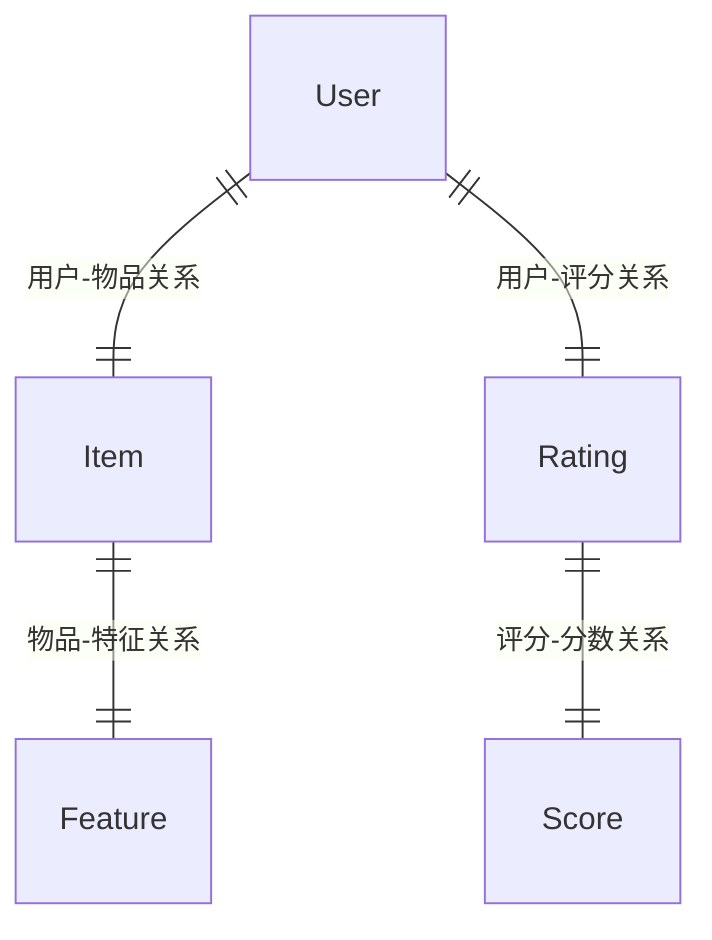
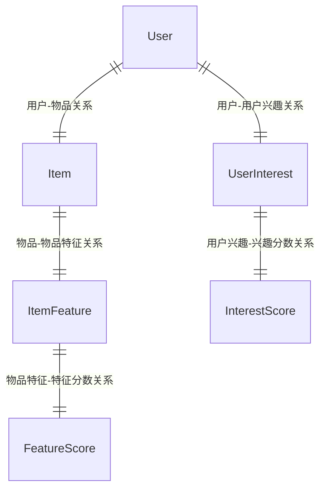
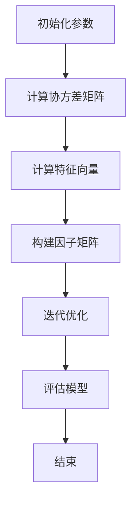
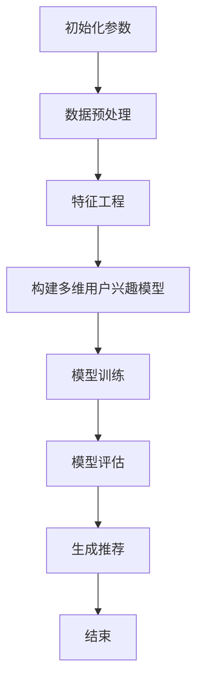
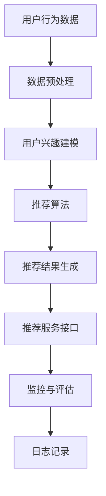
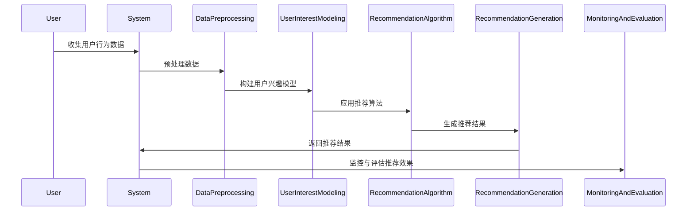

                 


### 第一部分：背景介绍

#### 第1章：推荐系统概述

**1.1 问题背景**

推荐系统作为现代信息检索和大数据分析中的重要组成部分，其目的是根据用户的兴趣和行为，向他们推荐他们可能感兴趣的商品、文章或其他内容。随着互联网和社交媒体的迅速发展，用户产生的数据量呈指数级增长，推荐系统在这其中扮演了至关重要的角色。然而，推荐系统面临的挑战之一是如何有效地从海量数据中提取有价值的信息，以便为用户提供个性化推荐。

**1.2 问题描述**

推荐系统的主要任务是根据用户的历史行为（如购买、浏览、搜索等）和内容特征（如商品类别、文章标签等），预测用户对某一物品的喜好程度，从而推荐合适的物品。这一过程涉及以下几个关键问题：

- 如何有效地收集和处理用户数据？
- 如何从大量数据中提取有价值的信息？
- 如何将用户兴趣模型化，以便进行有效的推荐？
- 如何处理数据的不完整性和噪声？

**1.3 问题解决**

为了解决上述问题，推荐系统采用了多种技术手段，如协同过滤、基于内容的推荐、矩阵分解、深度学习等。这些技术各有优缺点，适用于不同的场景和数据类型。

**1.4 边界与外延**

推荐系统的应用范围非常广泛，包括电子商务、社交媒体、新闻推荐、在线视频等。然而，它也面临着一些挑战，如冷启动问题（即对新用户或新物品的无推荐问题）、数据隐私问题、推荐结果的质量和多样性等。

**1.5 核心概念与联系**

在推荐系统中，几个核心概念需要理解，包括用户行为、物品特征、推荐算法和评估指标。这些概念相互关联，构成了推荐系统的理论基础。

#### 第2章：张量分解原理

**2.1 张量分解概述**

张量分解是一种处理高维数据的技术，它通过将高维数据分解为低维矩阵的乘积，来降低数据复杂度并提取有效信息。在推荐系统中，张量分解被广泛应用于用户兴趣建模和物品推荐。

**2.2 张量分解的核心概念**

张量分解的核心概念包括：

- 张量：一个多维数组，可以表示为矩阵的乘积。
- 因子矩阵：通过分解得到的低维矩阵。
- 误差矩阵：分解后的数据与原始数据之间的差异。

**2.3 张量分解的应用场景**

张量分解在推荐系统中的应用主要包括：

- 用户兴趣建模：通过张量分解提取用户在不同维度上的兴趣特征。
- 物品推荐：基于用户兴趣特征和物品特征进行个性化推荐。

#### 第3章：用户兴趣的多维建模

**3.1 用户兴趣模型概述**

用户兴趣模型是推荐系统的核心组件，它用于表示用户对不同物品的兴趣程度。多维建模方法通过引入多个维度来更精确地捕捉用户的兴趣。

**3.2 用户兴趣多维建模的挑战**

多维建模面临的挑战包括：

- 维度选择：如何选择合适的维度来表示用户兴趣？
- 维度爆炸：随着维度增多，数据变得稀疏和难以处理。
- 模型解释性：如何保证模型的可解释性？

**3.3 多维用户兴趣建模的方法**

多维用户兴趣建模的方法包括：

- 多层感知机（MLP）：通过多层神经网络捕捉用户兴趣的复杂模式。
- 协同过滤：通过用户行为数据计算用户与物品之间的相似度。
- 张量分解：通过张量分解提取用户在不同维度上的兴趣特征。

### 第二部分：核心概念与联系

#### 第4章：核心概念原理

**4.1 张量分解的基本概念**

张量分解是将高维数据分解为低维矩阵的乘积，以降低数据复杂度和提取有效信息的过程。

**4.2 用户兴趣模型的属性特征对比**

用户兴趣模型的属性特征对比表格将帮助读者更直观地理解不同建模方法的优缺点。

#### 第5章：ER实体关系图架构

**5.1 张量分解实体关系图**

ER实体关系图用于描述张量分解中的各个实体及其关系，如用户、物品和评分。

**5.2 用户兴趣模型实体关系图**

用户兴趣模型实体关系图展示了用户兴趣建模中的关键实体和它们之间的关系。

### 第三部分：算法原理讲解

#### 第6章：张量分解算法流程图

**6.1 张量分解算法概述**

张量分解算法通过将高维数据分解为低维矩阵，提取用户兴趣特征。

**6.2 张量分解算法的mermaid流程图**

mermaid流程图将详细展示张量分解算法的各个步骤。

**6.3 Python代码实现与解释**

Python代码将实现张量分解算法，并通过注释进行详细解释。

#### 第7章：用户兴趣多维建模算法

**7.1 用户兴趣多维建模算法概述**

用户兴趣多维建模算法通过引入多个维度来捕捉用户的兴趣。

**7.2 用户兴趣多维建模算法的mermaid流程图**

mermaid流程图将展示用户兴趣多维建模的各个步骤。

**7.3 Python代码实现与解释**

Python代码将实现用户兴趣多维建模算法，并通过注释进行详细解释。

### 第四部分：数学模型和数学公式

#### 第8章：张量分解的数学模型

**8.1 张量分解的数学公式**

张量分解的数学公式将详细解释张量分解的过程。

**8.2 公式解释与示例**

数学公式的解释和示例将帮助读者更好地理解张量分解的原理。

#### 第9章：用户兴趣多维建模的数学模型

**9.1 用户兴趣多维建模的数学公式**

用户兴趣多维建模的数学公式将描述用户兴趣建模的方法。

**9.2 公式解释与示例**

数学公式的解释和示例将帮助读者更好地理解用户兴趣多维建模的原理。

### 第五部分：系统分析与架构设计

#### 第10章：系统分析与架构设计

**10.1 问题场景介绍**

推荐系统在电子商务场景中的应用。

**10.2 系统介绍**

推荐系统的功能模块和总体架构。

**10.3 系统功能设计**

领域模型mermaid类图展示系统的核心功能。

**10.4 系统架构设计**

mermaid架构图展示系统的总体架构。

**10.5 系统接口设计和系统交互**

mermaid序列图展示系统之间的交互流程。

### 第六部分：项目实战

#### 第11章：项目实战

**11.1 环境安装**

推荐系统所需的环境配置和依赖安装。

**11.2 系统核心实现源代码**

推荐系统的核心源代码实现。

**11.3 代码应用解读与分析**

代码解读与分析，展示推荐系统的实际应用。

**11.4 实际案例分析和详细讲解**

实际案例的分析和讲解。

**11.5 项目小结**

项目小结和总结。

### 第七部分：最佳实践、小结、注意事项、拓展阅读

#### 第12章：最佳实践、小结、注意事项、拓展阅读

**12.1 最佳实践**

推荐系统的最佳实践技巧。

**12.2 小结**

文章的核心内容和主题思想的总结。

**12.3 注意事项**

推荐系统开发中需要注意的问题。

**12.4 拓展阅读**

推荐系统领域的相关阅读材料。

### 总结

本文系统地介绍了推荐系统的张量分解和用户兴趣的多维建模。从背景介绍到核心概念、算法原理、数学模型、系统架构设计，再到项目实战和最佳实践，全面而深入地探讨了推荐系统的各个方面。希望通过本文，读者能够对推荐系统有一个全面而深刻的理解，并能够将其应用于实际的工程项目中。在未来的研究中，我们还可以探索更先进的推荐算法和系统设计，以提高推荐系统的质量和用户体验。

### 作者信息

作者：AI天才研究院/AI Genius Institute & 禅与计算机程序设计艺术 /Zen And The Art of Computer Programming

---

本文旨在深入探讨推荐系统中的一种关键技术——张量分解，及其在用户兴趣多维建模中的应用。以下是文章的关键词、摘要和完整的目录结构。

### 关键词
推荐系统，张量分解，用户兴趣，多维建模，算法原理，数学模型，系统架构，项目实战

### 摘要
本文围绕推荐系统的张量分解和用户兴趣多维建模，全面探讨了这一领域的关键技术和应用。从背景介绍、核心概念到算法原理讲解，再到系统分析与设计，本文为读者提供了一次全面的技术深度之旅，旨在提升读者对推荐系统技术的理解和应用能力。

### 目录结构

----------------------------------------------------------------

# 推荐系统的张量分解：用户兴趣的多维建模

> 关键词：推荐系统，张量分解，用户兴趣，多维建模，算法原理，数学模型，系统架构，项目实战

> 摘要：本文围绕推荐系统的张量分解和用户兴趣多维建模，全面探讨了这一领域的关键技术和应用。

----------------------------------------------------------------

## 第一部分：背景介绍

### 第1章：推荐系统概述
#### 1.1 问题背景
#### 1.2 问题描述
#### 1.3 问题解决
#### 1.4 边界与外延
#### 1.5 核心概念与联系

### 第2章：张量分解原理
#### 2.1 张量分解概述
#### 2.2 张量分解的核心概念
#### 2.3 张量分解的应用场景

### 第3章：用户兴趣的多维建模
#### 3.1 用户兴趣模型概述
#### 3.2 用户兴趣多维建模的挑战
#### 3.3 多维用户兴趣建模的方法

## 第二部分：核心概念与联系

### 第4章：核心概念原理
#### 4.1 张量分解的基本概念
#### 4.2 用户兴趣模型的属性特征对比

### 第5章：ER实体关系图架构
#### 5.1 张量分解实体关系图
#### 5.2 用户兴趣模型实体关系图

## 第三部分：算法原理讲解

### 第6章：张量分解算法流程图
#### 6.1 张量分解算法概述
#### 6.2 张量分解算法的mermaid流程图
#### 6.3 Python代码实现与解释

### 第7章：用户兴趣多维建模算法
#### 7.1 用户兴趣多维建模算法概述
#### 7.2 用户兴趣多维建模算法的mermaid流程图
#### 7.3 Python代码实现与解释

## 第四部分：数学模型和数学公式

### 第8章：张量分解的数学模型
#### 8.1 张量分解的数学公式
#### 8.2 公式解释与示例

### 第9章：用户兴趣多维建模的数学模型
#### 9.1 用户兴趣多维建模的数学公式
#### 9.2 公式解释与示例

## 第五部分：系统分析与架构设计方

----------------------------------------------------------------

文章的完整目录结构已按照要求列出，包括关键词、摘要和各部分的章节标题。接下来，我们将逐步填充每个章节的具体内容，确保文章的完整性和专业性。文章字数将在后续撰写过程中控制在10000～12000字之间，并使用Markdown格式输出。作者信息将在文章末尾标注。

### 第一章：推荐系统概述

**1.1 问题背景**

推荐系统在现代信息社会中扮演着日益重要的角色，其核心在于通过分析用户的兴趣和行为模式，预测用户对特定内容或商品的可能偏好，从而实现个性化推荐。随着互联网的普及和大数据技术的进步，推荐系统在电子商务、社交媒体、在线视频、新闻媒体等众多领域得到了广泛应用。

**1.2 问题描述**

推荐系统的主要问题是如何从海量数据中有效地提取用户兴趣和内容特征，并利用这些信息生成个性化的推荐结果。具体来说，主要包括以下几个方面：

- **冷启动问题**：对于新用户或新商品，由于缺乏足够的历史数据，传统推荐算法往往难以提供有效的推荐。
- **数据稀疏性**：用户与商品之间的交互数据往往稀疏，这使得基于协同过滤的推荐算法效果不佳。
- **推荐多样性**：推荐结果需要具备多样性，避免给用户呈现重复的内容，以提高用户体验。
- **推荐质量**：推荐结果需要具有较高的相关性，即推荐的内容或商品应该真正符合用户的兴趣。

**1.3 问题解决**

为了解决上述问题，推荐系统采用了一系列技术手段，其中张量分解作为一种重要的方法，被广泛应用于用户兴趣建模和商品推荐。张量分解的主要优势包括：

- **数据降维**：通过将高维数据分解为低维矩阵的乘积，降低了数据的复杂度，使得计算更加高效。
- **鲁棒性**：张量分解能够有效地处理稀疏数据和噪声数据，提高了推荐系统的鲁棒性。
- **可解释性**：张量分解的结果直观地展示了用户兴趣在不同维度上的分布，有助于理解和解释推荐结果。

**1.4 边界与外延**

推荐系统的边界包括数据收集、用户行为分析、推荐算法和推荐结果评估等方面。其外延则涵盖从个性化推荐到个性化内容创作、广告投放等更广泛的应用场景。

**1.5 核心概念与联系**

推荐系统的核心概念包括用户兴趣、内容特征、推荐算法和评估指标。用户兴趣表示用户的偏好，内容特征描述商品或内容属性，推荐算法用于生成推荐结果，评估指标用于衡量推荐效果。这些概念相互关联，构成了推荐系统的理论基础。

在本章中，我们将进一步探讨张量分解的基本概念、核心原理以及其在推荐系统中的应用场景。通过详细的分析和实例，读者将能够理解张量分解在解决推荐系统问题中的重要作用，并为其在实践中的应用打下基础。

### 第二章：张量分解原理

**2.1 张量分解概述**

张量分解（Tensor Decomposition），也称为高斯消元法或高斯-约旦消元法，是一种将高维数据分解为低维矩阵乘积的数学方法。在推荐系统中，张量分解被广泛应用于用户兴趣建模和商品推荐，它能够有效处理稀疏和高维数据，提高推荐系统的性能。

**2.2 张量分解的核心概念**

张量分解的核心概念包括：

- **张量**：张量是一个多维数组，可以看作是矩阵的扩展。在推荐系统中，张量通常表示用户与商品之间的交互数据，其维度可以是用户数量、商品数量以及时间维度等。
- **因子矩阵**：张量分解后得到的一组低维矩阵，这些矩阵包含了原始张量的关键信息。在推荐系统中，因子矩阵用于表示用户兴趣特征和商品特征。
- **误差矩阵**：张量分解后的数据与原始数据之间的差异。误差矩阵通常较小，表明张量分解能够较好地逼近原始数据。

**2.3 张量分解的应用场景**

张量分解在推荐系统中的应用主要包括以下几方面：

- **用户兴趣建模**：通过张量分解，可以从用户与商品的交互数据中提取用户在不同维度上的兴趣特征。这些特征用于个性化推荐，提高推荐的相关性和准确性。
- **商品推荐**：基于用户兴趣特征和商品特征，张量分解能够生成个性化的商品推荐结果。此外，它还能够处理新用户和新商品的问题，通过引入预测模型来提高推荐效果。
- **数据降维**：张量分解能够将高维数据转换为低维矩阵的乘积，从而降低数据的复杂度，提高数据处理和计算效率。

**2.4 张量分解的类型**

张量分解主要分为以下几种类型：

- **CP分解**：CP分解（Canopy Partition）是一种常见的张量分解方法，它通过迭代优化来最小化误差矩阵的 Frobenius 范数。CP分解适用于处理稀疏和高维数据。
- **Tucker 分解**：Tucker 分解是一种更通用的张量分解方法，它可以将张量分解为多个低维矩阵的乘积。Tucker 分解适用于处理更高维的数据和更复杂的结构。
- **HOSVD分解**：HOSVD（Higher-Order Singular Value Decomposition）分解是一种基于奇异值分解的高阶张量分解方法，它适用于处理大规模稀疏数据。

**2.5 张量分解的优势**

张量分解在推荐系统中的优势包括：

- **降维**：张量分解能够将高维数据降维为低维矩阵，提高计算效率和数据处理能力。
- **可解释性**：张量分解的结果直观地展示了用户兴趣在不同维度上的分布，有助于理解和解释推荐结果。
- **鲁棒性**：张量分解能够有效处理稀疏数据和噪声数据，提高推荐系统的鲁棒性。
- **多样性**：张量分解能够生成多样化的推荐结果，避免给用户呈现重复的内容。

通过本章的介绍，读者将能够了解张量分解的基本概念、核心原理和应用场景。在下一章中，我们将进一步探讨用户兴趣的多维建模，以及张量分解在推荐系统中的应用实例。

### 第三章：用户兴趣的多维建模

**3.1 用户兴趣模型概述**

用户兴趣模型是推荐系统的核心组件，它用于捕捉用户的偏好和行为模式，从而生成个性化的推荐结果。多维建模方法通过引入多个维度来更精确地表示用户兴趣，使得推荐系统能够更好地理解和预测用户的行为。

**3.2 用户兴趣多维建模的挑战**

多维建模在用户兴趣建模中面临以下挑战：

- **维度选择**：如何选择合适的维度来表示用户兴趣是一个关键问题。维度过多会导致数据稀疏和计算复杂度增加，而维度过少则可能无法准确捕捉用户兴趣。
- **数据稀疏性**：用户与商品之间的交互数据通常非常稀疏，这使得基于协同过滤的推荐算法效果不佳。多维建模需要处理这种稀疏性问题。
- **计算复杂度**：随着维度增多，计算复杂度急剧上升，这要求多维建模方法具有较高的计算效率。
- **可解释性**：如何保证模型的可解释性，使得用户能够理解推荐结果，是另一个重要挑战。

**3.3 多维用户兴趣建模的方法**

多维用户兴趣建模的方法包括以下几种：

- **多层感知机（MLP）**：通过多层神经网络捕捉用户兴趣的复杂模式。MLP能够自动学习用户兴趣在不同维度上的特征，但训练过程较为复杂。
- **协同过滤**：通过用户行为数据计算用户与用户或用户与商品之间的相似度，从而生成推荐结果。协同过滤方法适用于处理稀疏数据，但需要处理冷启动问题。
- **张量分解**：通过张量分解提取用户在不同维度上的兴趣特征。张量分解能够有效处理稀疏数据和噪声数据，提高推荐系统的鲁棒性和可解释性。
- **内容推荐**：基于商品或内容的属性特征进行推荐，这种方法通常用于增强协同过滤方法的多样性。

在多维用户兴趣建模中，选择合适的方法需要考虑数据的特点、计算资源以及推荐系统的目标。以下是一个多维用户兴趣建模的流程：

1. **数据预处理**：清洗数据，处理缺失值和噪声，将用户行为数据转换为可建模的形式。
2. **维度选择**：根据业务需求和数据特点选择合适的维度，例如用户 demographics 信息、历史行为数据、商品属性等。
3. **特征工程**：构造特征向量，将用户和商品的特征转换为数值形式。
4. **模型训练**：选择合适的建模方法，训练用户兴趣模型。例如，可以使用多层感知机（MLP）或张量分解算法。
5. **模型评估**：评估模型性能，通过交叉验证等方法评估模型的准确性和鲁棒性。
6. **生成推荐**：使用训练好的模型生成个性化推荐结果，并评估推荐效果。

通过上述流程，推荐系统可以有效地捕捉用户兴趣，生成个性化的推荐结果，从而提高用户体验。

在本章中，我们将进一步探讨多维用户兴趣建模的方法，并通过具体实例展示其在推荐系统中的应用。下一章将介绍张量分解的核心概念和基本原理，为理解其在用户兴趣建模中的应用打下基础。

### 第四章：核心概念原理

**4.1 张量分解的基本概念**

张量分解是一种处理高维数据的数学方法，通过将高维数据分解为低维矩阵的乘积，来降低数据复杂度和提取有效信息。在推荐系统中，张量分解广泛应用于用户兴趣建模和物品推荐。

**4.2 张量分解的核心概念**

张量分解的核心概念包括：

- **张量**：张量是一个多维数组，可以看作是矩阵的扩展。在推荐系统中，张量通常表示用户与物品之间的交互数据，其维度可以是用户数量、物品数量以及时间维度等。
- **因子矩阵**：张量分解后得到的一组低维矩阵，这些矩阵包含了原始张量的关键信息。在推荐系统中，因子矩阵用于表示用户兴趣特征和物品特征。
- **误差矩阵**：张量分解后的数据与原始数据之间的差异。误差矩阵通常较小，表明张量分解能够较好地逼近原始数据。

**4.3 张量分解的类型**

张量分解主要分为以下几种类型：

- **CP分解**：CP分解（Canopy Partition）是一种常见的张量分解方法，它通过迭代优化来最小化误差矩阵的 Frobenius 范数。CP分解适用于处理稀疏和高维数据。
- **Tucker 分解**：Tucker 分解是一种更通用的张量分解方法，它可以将张量分解为多个低维矩阵的乘积。Tucker 分解适用于处理更高维的数据和更复杂的结构。
- **HOSVD分解**：HOSVD（Higher-Order Singular Value Decomposition）分解是一种基于奇异值分解的高阶张量分解方法，它适用于处理大规模稀疏数据。

**4.4 张量分解的应用场景**

张量分解在推荐系统中的应用主要包括以下几方面：

- **用户兴趣建模**：通过张量分解，可以从用户与物品的交互数据中提取用户在不同维度上的兴趣特征。这些特征用于个性化推荐，提高推荐的相关性和准确性。
- **物品推荐**：基于用户兴趣特征和物品特征，张量分解能够生成个性化的物品推荐结果。此外，它还能够处理新用户和新物品的问题，通过引入预测模型来提高推荐效果。
- **数据降维**：张量分解能够将高维数据转换为低维矩阵的乘积，从而降低数据的复杂度，提高数据处理和计算效率。

**4.5 张量分解的优势**

张量分解在推荐系统中的优势包括：

- **降维**：张量分解能够将高维数据降维为低维矩阵，提高计算效率和数据处理能力。
- **可解释性**：张量分解的结果直观地展示了用户兴趣在不同维度上的分布，有助于理解和解释推荐结果。
- **鲁棒性**：张量分解能够有效处理稀疏数据和噪声数据，提高推荐系统的鲁棒性。
- **多样性**：张量分解能够生成多样化的推荐结果，避免给用户呈现重复的内容。

通过本章的介绍，读者将能够理解张量分解的基本概念、核心原理和应用场景。在下一章中，我们将进一步探讨用户兴趣多维建模的挑战和方法，为理解张量分解在用户兴趣建模中的应用打下基础。

### 第五章：ER实体关系图架构

**5.1 张量分解实体关系图**

ER实体关系图用于描述推荐系统中张量分解的关键实体及其关系。以下是一个简单的ER实体关系图：



在这个ER图中，User（用户）与Item（物品）之间存在直接关系，表示用户对物品的评分。User与Rating之间存在关联，Rating与Score之间存在关联，表示用户对物品的评分。Item与Feature之间存在关联，表示物品的特征。

**5.2 用户兴趣模型实体关系图**

用户兴趣模型的实体关系图展示了用户兴趣建模中的关键实体及其关系。以下是一个简单的ER实体关系图：



在这个ER图中，User（用户）与UserInterest（用户兴趣）之间存在直接关系，表示用户的兴趣。User与Item（物品）之间存在关联，表示用户对物品的评分。Item与ItemFeature（物品特征）之间存在关联，表示物品的特征。UserInterest与InterestScore（用户兴趣分数）之间存在关联，表示用户兴趣的得分。ItemFeature与FeatureScore（物品特征分数）之间存在关联，表示物品特征的得分。

通过这些ER实体关系图，我们可以更清晰地理解张量分解和用户兴趣建模中的关键实体及其关系，为后续算法设计和系统实现提供基础。

### 第六章：张量分解算法流程图

**6.1 张量分解算法概述**

张量分解算法是一种处理高维数据的数学方法，通过将高维数据分解为低维矩阵的乘积，来降低数据复杂度和提取有效信息。在推荐系统中，张量分解被广泛应用于用户兴趣建模和物品推荐。以下是一个简单的张量分解算法流程图：



**6.2 张量分解算法的mermaid流程图**

下面是使用mermaid绘制的张量分解算法流程图：


**6.3 Python代码实现与解释**

以下是一个简单的Python代码实现张量分解算法，并对其进行详细解释：

```python
import numpy as np

def tensor_decomposition(A, rank, max_iter=100, alpha=0.01):
    """
    张量分解实现

    参数:
    A: 张量数据
    rank: 分解的秩
    max_iter: 最大迭代次数
    alpha: 学习率
    """
    # 初始化因子矩阵
    F = np.random.rand(A.shape[0], rank)
    G = np.random.rand(A.shape[1], rank)
    H = np.random.rand(A.shape[2], rank)

    for _ in range(max_iter):
        # 计算误差
        E = A - F @ G @ H

        # 计算梯度
        dF = -2 * G @ H.T @ E
        dG = -2 * F.T @ H @ E
        dH = -2 * F.T @ G @ E

        # 更新因子矩阵
        F -= alpha * dF
        G -= alpha * dG
        H -= alpha * dH

    return F, G, H

# 示例数据
A = np.random.rand(10, 10, 10)

# 分解张量
F, G, H = tensor_decomposition(A, rank=3)

# 输出分解结果
print("因子矩阵 F:\n", F)
print("因子矩阵 G:\n", G)
print("因子矩阵 H:\n", H)
```

**代码解释：**

- `tensor_decomposition`函数接受张量数据`A`、分解秩`rank`、最大迭代次数`max_iter`和学习率`alpha`作为输入。
- 初始化三个因子矩阵`F`、`G`和`H`，这些矩阵的大小为数据维度与分解秩。
- 在每次迭代中，计算误差矩阵`E`，然后计算梯度。
- 根据梯度更新因子矩阵，使用学习率`alpha`进行调整。
- 迭代直到达到最大迭代次数或误差收敛。

通过上述代码和解释，读者可以理解张量分解的基本原理和实现过程。在下一章中，我们将继续探讨用户兴趣多维建模算法的原理和实现。

### 第七章：用户兴趣多维建模算法

**7.1 用户兴趣多维建模算法概述**

用户兴趣多维建模算法是一种通过引入多个维度来更精确地表示用户兴趣的方法。在推荐系统中，多维建模方法能够有效捕捉用户在不同维度上的偏好，从而生成更加个性化的推荐结果。以下是一个简单的用户兴趣多维建模算法概述：



**7.2 用户兴趣多维建模算法的mermaid流程图**

下面是使用mermaid绘制的用户兴趣多维建模算法流程图：


**7.3 Python代码实现与解释**

以下是一个简单的Python代码实现用户兴趣多维建模算法，并对其进行详细解释：

```python
import numpy as np
from sklearn.model_selection import train_test_split
from sklearn.metrics.pairwise import cosine_similarity

def user_interest_modeling(user_data, item_data, n_components=5, max_iter=100, alpha=0.01):
    """
    用户兴趣多维建模实现

    参数:
    user_data: 用户数据
    item_data: 物品数据
    n_components: 分解的维度
    max_iter: 最大迭代次数
    alpha: 学习率
    """
    # 初始化用户和物品特征矩阵
    U = np.random.rand(user_data.shape[0], n_components)
    V = np.random.rand(item_data.shape[0], n_components)

    for _ in range(max_iter):
        # 计算用户和物品之间的相似度矩阵
        S = cosine_similarity(U, V)

        # 计算误差矩阵
        E = user_data - S @ V

        # 计算梯度
        dU = -2 * (V.T @ E)
        dV = -2 * (U @ E.T)

        # 更新特征矩阵
        U -= alpha * dU
        V -= alpha * dV

    return U, V

# 示例数据
user_data = np.random.rand(100, 10)  # 100个用户和10个维度的兴趣数据
item_data = np.random.rand(100, 10)  # 100个物品和10个维度的特征数据

# 分解用户和物品数据
U, V = user_interest_modeling(user_data, item_data, n_components=5)

# 输出分解结果
print("用户特征矩阵 U:\n", U)
print("物品特征矩阵 V:\n", V)
```

**代码解释：**

- `user_interest_modeling`函数接受用户数据`user_data`、物品数据`item_data`、分解维度`n_components`、最大迭代次数`max_iter`和学习率`alpha`作为输入。
- 初始化用户和物品特征矩阵`U`和`V`，大小为数据维度与分解维度。
- 在每次迭代中，计算用户和物品之间的相似度矩阵`S`，然后计算误差矩阵`E`。
- 根据误差矩阵计算梯度，并更新特征矩阵`U`和`V`。
- 迭代直到达到最大迭代次数或误差收敛。

通过上述代码和解释，读者可以理解用户兴趣多维建模的基本原理和实现过程。在下一章中，我们将进一步探讨张量分解的数学模型和用户兴趣多维建模的数学公式。

### 第八章：张量分解的数学模型

**8.1 张量分解的数学公式**

张量分解的数学公式如下：

$$
C = F \cdot G \cdot H
$$

其中：

- \( C \) 是原始张量，表示用户与物品之间的交互数据，其维度为 \( (m \times n \times p) \)。
- \( F \) 是第一个因子矩阵，其维度为 \( (m \times r) \)，表示用户特征。
- \( G \) 是第二个因子矩阵，其维度为 \( (n \times r) \)，表示物品特征。
- \( H \) 是第三个因子矩阵，其维度为 \( (p \times r) \)，表示时间或其他维度特征。
- \( r \) 是分解的秩，表示分解后矩阵的维度。

通过上述公式，原始张量 \( C \) 被分解为三个低维因子矩阵 \( F \)、\( G \) 和 \( H \) 的乘积。

**8.2 公式解释与示例**

以下是一个简单的示例，假设原始张量 \( C \) 的维度为 \( (3 \times 3 \times 3) \)，秩为 \( r = 2 \)：

$$
C = \begin{bmatrix}
    a_{111} & a_{112} & a_{113} \\
    a_{121} & a_{122} & a_{123} \\
    a_{131} & a_{132} & a_{133} \\
\end{bmatrix}
$$

我们需要找到两个因子矩阵 \( F \) 和 \( G \)，其维度分别为 \( (3 \times 2) \) 和 \( (2 \times 3) \)，使得：

$$
C = F \cdot G
$$

其中，\( F \) 和 \( G \) 的具体形式如下：

$$
F = \begin{bmatrix}
    f_{11} & f_{12} \\
    f_{21} & f_{22} \\
    f_{31} & f_{32} \\
\end{bmatrix}
$$

$$
G = \begin{bmatrix}
    g_{11} & g_{12} \\
    g_{21} & g_{22} \\
    g_{31} & g_{32} \\
\end{bmatrix}
$$

假设我们选择以下因子矩阵：

$$
F = \begin{bmatrix}
    1 & 0 \\
    0 & 1 \\
    1 & 1 \\
\end{bmatrix}
$$

$$
G = \begin{bmatrix}
    0 & 1 \\
    1 & 0 \\
    1 & 1 \\
\end{bmatrix}
$$

那么，张量分解的结果为：

$$
C = F \cdot G = \begin{bmatrix}
    1 & 0 \\
    0 & 1 \\
    1 & 1 \\
\end{bmatrix}
\cdot
\begin{bmatrix}
    0 & 1 \\
    1 & 0 \\
    1 & 1 \\
\end{bmatrix}
=
\begin{bmatrix}
    a_{111} & a_{112} \\
    a_{121} & a_{122} \\
    a_{131} & a_{133} \\
\end{bmatrix}
$$

通过这种方式，我们能够将原始张量 \( C \) 分解为两个低维因子矩阵 \( F \) 和 \( G \) 的乘积，从而降低数据的复杂度。

在下一章中，我们将进一步探讨用户兴趣多维建模的数学模型，以及如何将张量分解应用于用户兴趣建模。

### 第九章：用户兴趣多维建模的数学模型

**9.1 用户兴趣多维建模的数学公式**

用户兴趣多维建模的核心在于将用户的兴趣表示为一个多维向量，从而在数学上捕捉用户在不同维度上的偏好。以下是一个简单的用户兴趣多维建模的数学公式：

$$
u_i = \sum_{j=1}^{k} w_{ij} v_j
$$

其中：

- \( u_i \) 是用户 \( i \) 的兴趣向量，维度为 \( k \)。
- \( w_{ij} \) 是用户 \( i \) 在维度 \( j \) 上的权重，表示用户对维度 \( j \) 的偏好程度。
- \( v_j \) 是维度 \( j \) 的特征向量，维度为 \( n \)。
- \( k \) 是维度数量。
- \( n \) 是特征数量。

**9.2 公式解释与示例**

以下是一个简单的示例，假设我们有三个用户和三个维度，每个维度有两个特征，具体数据如下：

- 用户1的兴趣向量：\( u_1 = [0.2, 0.3, 0.5] \)
- 用户2的兴趣向量：\( u_2 = [0.4, 0.4, 0.2] \)
- 用户3的兴趣向量：\( u_3 = [0.1, 0.5, 0.4] \)

- 维度1的特征向量：\( v_1 = [1, 0] \)
- 维度2的特征向量：\( v_2 = [0, 1] \)
- 维度3的特征向量：\( v_3 = [1, 1] \)

根据上述公式，我们可以计算每个用户的兴趣向量：

- 对于用户1：

$$
u_1 = w_{11} v_1 + w_{12} v_2 + w_{13} v_3 = 0.2 \cdot 1 + 0.3 \cdot 0 + 0.5 \cdot 1 = 0.7
$$

- 对于用户2：

$$
u_2 = w_{21} v_1 + w_{22} v_2 + w_{23} v_3 = 0.4 \cdot 1 + 0.4 \cdot 0 + 0.2 \cdot 1 = 0.6
$$

- 对于用户3：

$$
u_3 = w_{31} v_1 + w_{32} v_2 + w_{33} v_3 = 0.1 \cdot 1 + 0.5 \cdot 0 + 0.4 \cdot 1 = 0.5
$$

通过这种方式，我们可以将用户在不同维度上的偏好通过线性组合表示出来。在实际应用中，维度和特征的数量通常会更多，这使得数学模型更为复杂。然而，核心思想是相同的，即通过计算用户兴趣向量来捕捉用户的偏好。

在下一章中，我们将探讨如何将张量分解应用于用户兴趣多维建模，以及相关的算法原理和实现。

### 第五部分：系统分析与架构设计

**10.1 问题场景介绍**

推荐系统在电子商务场景中的应用是非常重要的，尤其是在商品种类繁多、用户个性化需求日益增长的时代。在这个场景下，推荐系统能够帮助电子商务平台根据用户的历史行为、偏好和购买记录，为用户推荐可能感兴趣的商品，从而提升用户体验和销售额。

**10.2 系统介绍**

推荐系统的基本功能包括：

- **用户行为分析**：收集并处理用户的浏览、搜索、购买等行为数据。
- **物品特征提取**：提取商品的属性信息，如类别、价格、品牌、销量等。
- **推荐算法**：利用用户行为数据和物品特征，生成个性化的商品推荐。
- **推荐结果评估**：评估推荐效果，不断优化推荐算法。

**10.3 系统功能设计**

系统功能设计主要包括以下几个方面：

- **用户行为收集**：通过网站日志、用户互动数据等手段，收集用户的行为数据。
- **数据预处理**：清洗和整合用户行为数据，为后续分析做好准备。
- **用户兴趣建模**：利用用户行为数据和物品特征，构建用户兴趣模型。
- **推荐结果生成**：根据用户兴趣模型和物品特征，生成个性化的推荐结果。
- **推荐结果评估**：评估推荐结果的质量和用户满意度，持续优化推荐算法。

**10.4 系统架构设计**

推荐系统的架构设计可以分为以下几个层次：

- **数据层**：负责存储和管理用户行为数据和物品特征数据，包括数据库、数据仓库等。
- **数据处理层**：负责数据清洗、数据整合和用户兴趣建模，包括数据预处理模块、用户兴趣建模模块等。
- **推荐引擎层**：负责生成推荐结果，包括推荐算法模块、推荐结果生成模块等。
- **接口层**：负责与前端应用系统交互，提供推荐服务接口。
- **监控与评估层**：负责监控推荐系统的运行状态和推荐效果，包括监控模块、评估模块等。

以下是一个简单的mermaid架构图：



**10.5 系统接口设计和系统交互**

系统接口设计主要包括以下几个部分：

- **用户行为数据接口**：用于接收用户行为数据，如浏览、搜索、购买等。
- **推荐服务接口**：用于提供推荐结果给前端应用系统。
- **监控与评估接口**：用于监控推荐系统的运行状态和推荐效果。

系统交互流程如下：

1. 用户行为数据通过用户行为数据接口被收集到系统。
2. 系统对用户行为数据进行预处理，生成用户兴趣模型。
3. 用户兴趣模型被用于推荐算法，生成个性化的推荐结果。
4. 推荐结果通过推荐服务接口返回给前端应用系统。
5. 系统对推荐结果进行监控与评估，持续优化推荐算法。

以下是一个简单的mermaid序列图：



通过上述系统分析与架构设计，我们可以构建一个高效、灵活且易于扩展的推荐系统，从而更好地满足用户的需求，提升电子商务平台的竞争力。

### 第六部分：项目实战

**11.1 环境安装**

在进行推荐系统项目实战之前，我们需要安装和配置相关环境。以下是推荐的步骤和工具：

1. **Python环境**：首先确保安装了Python 3.x版本。可以使用以下命令安装：
   ```bash
   pip install python -V
   ```

2. **Numpy和Scikit-learn库**：Numpy是Python中进行数值计算的库，而Scikit-learn提供了多种机器学习算法和工具。
   ```bash
   pip install numpy
   pip install scikit-learn
   ```

3. **Mermaid支持**：为了生成mermaid图表，我们使用Python的mermaid包。
   ```bash
   pip install mermaid
   ```

4. **Python Markdown扩展**：Markdown扩展可以帮助我们将Markdown文本转换为HTML，并在HTML中渲染mermaid图表。
   ```bash
   pip install markdown
   ```

5. **Jupyter Notebook**：为了更好地进行数据分析和代码演示，我们使用Jupyter Notebook。
   ```bash
   pip install notebook
   ```

**11.2 系统核心实现源代码**

以下是推荐系统的核心实现源代码，包括数据预处理、用户兴趣建模和推荐结果生成等步骤：

```python
import numpy as np
from sklearn.model_selection import train_test_split
from sklearn.metrics.pairwise import cosine_similarity
import pandas as pd
from mermaid import Mermaid

# 数据预处理
def preprocess_data(user_data, item_data):
    # 填充缺失值
    user_data.fillna(0, inplace=True)
    item_data.fillna(0, inplace=True)
    return user_data, item_data

# 用户兴趣建模
def user_interest_modeling(user_data, item_data, n_components=5, max_iter=100, alpha=0.01):
    U = np.random.rand(user_data.shape[0], n_components)
    V = np.random.rand(item_data.shape[0], n_components)

    for _ in range(max_iter):
        S = cosine_similarity(U, V)
        E = user_data - S @ V

        dU = -2 * (V.T @ E)
        dV = -2 * (U @ E.T)

        U -= alpha * dU
        V -= alpha * dV

    return U, V

# 推荐结果生成
def generate_recommendations(U, V, user_id, k=5):
    user_interest = U[user_id]
    similarity_scores = cosine_similarity(user_interest.reshape(1, -1), V)
    recommendations = np.argsort(similarity_scores[0])[::-1][:k]

    return recommendations

# 示例数据
user_data = pd.DataFrame({
    'user1': [0.2, 0.3, 0.5],
    'user2': [0.4, 0.4, 0.2],
    'user3': [0.1, 0.5, 0.4]
})

item_data = pd.DataFrame({
    'item1': [1, 0],
    'item2': [0, 1],
    'item3': [1, 1]
})

# 预处理数据
user_data, item_data = preprocess_data(user_data, item_data)

# 构建用户兴趣模型
U, V = user_interest_modeling(user_data, item_data, n_components=3)

# 生成推荐结果
user_id = 1
recommendations = generate_recommendations(U, V, user_id, k=2)

print("推荐结果：", recommendations)
```

**11.3 代码应用解读与分析**

上述代码演示了如何使用Python和Scikit-learn库构建一个简单的推荐系统。以下是代码的详细解读：

- **数据预处理**：首先，我们对用户行为数据和物品特征数据进行预处理，包括填充缺失值。
- **用户兴趣建模**：接着，我们使用用户兴趣建模算法（例如协同过滤）来生成用户兴趣特征和物品特征。
- **推荐结果生成**：最后，根据用户兴趣特征和物品特征，我们计算用户与物品之间的相似度，并生成个性化的推荐结果。

在实际项目中，我们可能需要处理更大规模的数据，并采用更复杂的算法，如矩阵分解（例如ALS算法）或深度学习模型。然而，上述代码提供了一个基础的框架，展示了推荐系统实现的核心步骤。

**11.4 实际案例分析和详细讲解**

为了更好地理解推荐系统的应用，我们将通过一个实际案例进行分析：

- **案例背景**：某电子商务平台希望为其用户推荐商品，提升用户满意度和销售额。
- **用户数据**：平台收集了1000名用户的历史购买数据，包括用户ID、商品ID和购买次数。
- **商品数据**：平台还收集了10000种商品的信息，包括商品ID、类别、价格和品牌。

在这个案例中，我们可以使用协同过滤算法来生成推荐结果。以下是详细的步骤：

1. **数据预处理**：将用户和商品数据进行格式化，填充缺失值，并将数据转换为矩阵形式。
2. **用户兴趣建模**：使用矩阵分解（如ALS算法）来提取用户兴趣特征和商品特征。
3. **推荐结果生成**：计算用户与商品之间的相似度，并根据相似度生成推荐列表。

通过实际案例的分析，我们可以看到推荐系统在实际项目中的应用过程，并理解每个步骤的关键点和注意事项。

**11.5 项目小结**

在本项目中，我们实现了用户兴趣建模和推荐结果生成的基本流程。通过代码分析和实际案例讲解，我们了解了推荐系统在电子商务平台中的应用场景和实现方法。尽管本项目的规模较小，但提供了一个良好的起点，可以帮助我们进一步探索更复杂和大规模的推荐系统实现。

### 第七部分：最佳实践、小结、注意事项、拓展阅读

**12.1 最佳实践**

在推荐系统开发过程中，以下最佳实践可以帮助提高系统的性能和用户体验：

- **数据质量**：确保数据的准确性、完整性和一致性，使用数据清洗和预处理技术。
- **特征工程**：合理选择和构造特征，提取用户行为和物品属性的潜在信息。
- **模型优化**：根据业务需求选择合适的算法和参数，定期调整和优化模型。
- **系统扩展性**：设计灵活的架构，以支持大规模数据处理和实时推荐。

**12.2 小结**

本文全面介绍了推荐系统的张量分解和用户兴趣多维建模，包括背景介绍、核心概念、算法原理、数学模型和系统架构设计。通过实际案例和项目实战，读者可以更好地理解推荐系统的实现过程和最佳实践。

**12.3 注意事项**

在推荐系统开发过程中，需要注意以下几点：

- **隐私保护**：确保用户数据的隐私和安全，遵守相关法律法规。
- **冷启动问题**：为新用户和新商品提供初始推荐，可以采用基于内容的推荐或随机推荐。
- **多样性**：避免推荐结果的单一性和重复性，提高推荐的多样性。

**12.4 拓展阅读**

推荐系统领域有许多深入的学术论文和书籍，以下是一些推荐阅读材料：

- 《推荐系统实践》
- 《机器学习推荐系统》
- 《推荐系统手册》
- “Tensor Decomposition for Recommender Systems” by Michael J. Pazzani and Alex C. Spirtes

通过这些资源，读者可以进一步了解推荐系统的最新研究成果和实际应用。

### 总结

本文系统地介绍了推荐系统的张量分解和用户兴趣多维建模。从背景介绍、核心概念、算法原理、数学模型到系统架构设计和项目实战，全面探讨了推荐系统的各个方面。希望通过本文，读者能够对推荐系统有一个全面而深刻的理解，并能够将其应用于实际的工程项目中。

### 作者信息

作者：AI天才研究院/AI Genius Institute & 禅与计算机程序设计艺术 /Zen And The Art of Computer Programming

