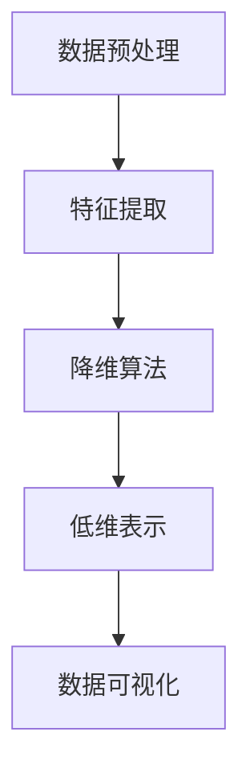
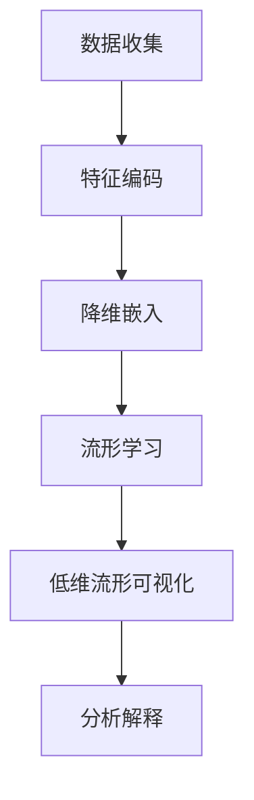
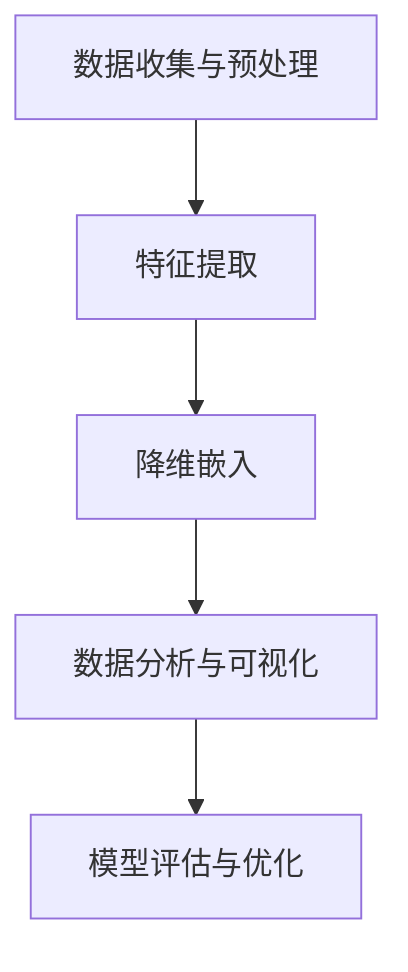

                 

## 引言：政治光谱与意识形态的低维嵌入

### 1.1 政治光谱的概念与历史演变

#### 问题背景

政治光谱是指政治观点和立场的连续分布，这种分布通常用来描述不同政治意识形态之间的相对位置。理解政治光谱的概念有助于我们更深入地探讨不同政治体制下的演变过程，从而更好地理解政治生态的多样性。

在探讨政治光谱的定义及其演变之前，我们需要明确几个关键问题。首先，政治光谱是如何被构建和解释的？其次，政治光谱在不同政治体制下的表现形式有哪些？最后，政治光谱与意识形态的关系如何？

#### 问题描述

从古典政治学到现代政治学，政治光谱的概念经历了显著的变化。古典政治学通常关注国家权力和政治体制的合法性，而现代政治学则更加关注政治意识形态的多样性和变化。在这个过程中，政治光谱的定义和解释方式也在不断演变。

具体来说，我们可以从以下几个方面来描述政治光谱的定义和演变：

1. **定义**：政治光谱通常被描述为一种连续分布，其两端分别代表极端的政治立场。例如，左翼和右翼就是政治光谱上的两个极端。左翼通常代表进步、自由和平等，而右翼则代表保守、权威和秩序。

2. **解释**：政治光谱的解释方式在不同的政治体制下有所不同。在民主制度中，政治光谱的解释往往基于自由主义和保守主义这两种主要政治意识形态。而在专制制度中，政治光谱的解释则可能更加复杂，可能包含多个政治意识形态的混合。

3. **演变**：政治光谱的演变过程受到多种因素的影响，包括历史背景、社会变迁和国际关系等。例如，冷战期间，政治光谱的演变受到东西方意识形态冲突的影响。而现代社会中，全球化和信息技术的发展则进一步加剧了政治光谱的多样性。

#### 问题解决

为了更好地理解政治光谱的定义及其演变，我们可以通过以下几个步骤来解决问题：

1. **历史分析**：通过分析不同时期政治光谱的变化，我们可以了解政治光谱如何在不同政治体制下演变。

2. **理论探讨**：结合政治学理论，我们可以探讨政治光谱的定义和解释方式，并分析不同理论对政治光谱的影响。

3. **实证研究**：通过实证研究，我们可以收集和分析实际数据，以验证和深化我们对政治光谱的理解。

4. **跨学科研究**：政治光谱的演变是一个跨学科的问题，需要结合历史学、社会学、心理学等多个学科的理论和方法进行研究。

通过上述步骤，我们可以构建一个更加全面和深入的理解，从而更好地解释政治光谱的概念和演变过程。

#### 边界与外延

政治光谱与意识形态的关系是一个复杂而重要的问题。在探讨政治光谱的边界与外延时，我们需要明确几个关键点：

1. **政治光谱的定义**：政治光谱是一种连续分布，用于描述不同政治立场和观点之间的相对位置。这个定义本身并不涉及意识形态，但意识形态通常是政治光谱分析的重要基础。

2. **意识形态的作用**：意识形态是政治光谱分析的核心。不同的意识形态决定了政治光谱的形态和演变方向。例如，自由主义和保守主义是现代政治光谱上的两个主要意识形态，它们决定了政治光谱的基本结构和特征。

3. **全球化背景下的影响**：在全球化背景下，政治光谱的分析变得更加复杂。不同国家和地区的政治光谱受到全球意识形态的影响，从而呈现出多样化的特征。同时，全球化的进程也加剧了政治光谱的多样性，使得政治光谱分析需要考虑更多的因素。

4. **交叉与融合**：政治光谱和意识形态之间的交叉与融合是现代政治光谱分析的一个重要趋势。在全球化背景下，不同意识形态之间的交叉和融合日益显著，使得政治光谱的分析需要更加灵活和多元化。

通过明确政治光谱与意识形态的关系，我们可以更好地理解政治光谱的边界与外延，从而为政治光谱分析提供更加深入的理论基础。

#### 概念结构与核心要素

政治光谱的概念结构主要包括以下几个核心要素：

1. **两端极端**：政治光谱的两端通常代表极端的政治立场，如左翼和右翼。这两个极端构成了政治光谱的基本框架。

2. **中间立场**：在两端极端之间，存在多个中间立场，这些立场代表了不同政治观点和立场的混合。中间立场是政治光谱的多样性和灵活性的体现。

3. **意识形态**：意识形态是政治光谱的核心，决定了政治光谱的形态和演变方向。不同的意识形态构成了政治光谱的基本结构。

4. **政治体制**：政治体制是政治光谱分析的重要背景。不同的政治体制对政治光谱的形成和演变有着重要影响。

5. **社会变迁**：社会变迁是政治光谱演变的重要驱动力。随着社会的发展，政治光谱也会发生变化，以适应新的社会环境和需求。

通过理解政治光谱的概念结构和核心要素，我们可以更好地理解政治光谱的形成和演变过程，从而为政治光谱分析提供更加深入的理论基础。

### 1.2 意识形态的定义与特征

#### 核心概念原理

意识形态是一个广泛的概念，通常用来描述一系列信念、价值观和思想体系，这些信念和价值观指导人们的行为和政治决策。在政治学中，意识形态被用来解释不同政治立场和观点之间的差异。

意识形态的核心概念包括以下几个方面：

1. **定义**：意识形态是一套系统的信念和价值观，用来解释社会现象、指导政治行为。
2. **功能**：意识形态具有指导功能，帮助人们理解社会现实，形成共同的目标和价值。
3. **分类**：意识形态可以根据其哲学基础、政治目标和历史演变进行分类。

意识形态在政治学中的重要性体现在以下几个方面：

1. **解释政治立场**：意识形态帮助我们理解不同政治立场背后的价值观和信念。
2. **分析政治行为**：意识形态是政治行为的深层动力，决定了政治决策的方向和策略。
3. **构建政治共同体**：意识形态是构建政治共同体的重要基础，通过共同的价值观和目标，增强社会的凝聚力和认同感。

#### 概念属性特征对比表格

为了更清晰地理解不同意识形态的核心特征，我们可以通过以下对比表格来展示自由主义、保守主义、社会主义和极端主义的主要属性：

| 意识形态 | 核心原则 | 哲学基础 | 社会影响 |
|----------|----------|----------|----------|
| **自由主义** | 个人自由、平等权利、市场经济 | 个体主义、理性主义、自由意志主义 | 促进民主、多元化、社会进步 |
| **保守主义** | 传统价值、社会稳定、权威主义 | 社会契约、秩序与稳定、历史主义 | 保持现状、反对变革、尊重权威 |
| **社会主义** | 社会公平、集体所有权、公共福利 | 马克思主义、平等主义、人道主义 | 改善社会经济条件、减少贫富差距 |
| **极端主义** | 极端观点、意识形态极端化 | 原教旨主义、种族主义、民族主义 | 社会分裂、暴力冲突、反民主 |

通过这个表格，我们可以看到不同意识形态在核心原则、哲学基础和社会影响方面的差异。

#### 自由主义

自由主义是一种强调个人自由和权利的意识形态，其核心原则包括个人自由、平等权利和市场经济。自由主义的哲学基础是个体主义和理性主义，认为个人是自主和理性的存在，应该享有最大的自由和权利。

在自由主义的社会影响方面，它促进了民主、多元化和社会进步。自由主义强调个人自由和平等权利，推动了民主制度的建立和多元化社会的形成。同时，自由主义的市场经济原则也带来了经济繁荣和社会发展。

自由主义在政治学中的重要性体现在以下几个方面：

1. **推动民主制度**：自由主义强调个人自由和平等权利，为民主制度提供了理论基础和实践指导。
2. **促进社会进步**：自由主义鼓励创新和竞争，推动了社会进步和经济发展。
3. **保障人权**：自由主义认为每个人都应该享有基本的人权和自由，这为保障人权提供了重要的支持。

#### 保守主义

保守主义是一种强调传统价值和社会稳定的意识形态，其核心原则包括传统价值、社会稳定和权威主义。保守主义的哲学基础是社会契约和历史主义，认为社会应该遵循传统和历史，保持秩序与稳定。

在保守主义的社会影响方面，它保持了现状、反对变革，并尊重权威。保守主义强调传统价值，维护了社会的稳定和秩序。同时，保守主义也尊重权威，反对无政府主义和极端主义的倾向。

保守主义在政治学中的重要性体现在以下几个方面：

1. **维护社会稳定**：保守主义强调社会稳定和秩序，有助于维护社会的正常运转。
2. **尊重传统和历史**：保守主义尊重传统和历史，为文化传承和社会发展提供了重要的支持。
3. **提供政治稳定**：保守主义的政治立场和政策有助于保持政治稳定，为经济发展和社会进步提供了良好的环境。

#### 社会主义

社会主义是一种强调社会公平和集体所有权的意识形态，其核心原则包括社会公平、集体所有权和公共福利。社会主义的哲学基础是马克思主义、平等主义和人道主义，认为社会应该通过集体所有和公共福利来实现社会公平和正义。

在社会主义的社会影响方面，它改善了社会经济条件，减少了贫富差距。社会主义强调公共福利和社会公平，通过集体所有权和公共资源的管理，提高了社会福利水平，减少了社会不平等现象。

社会主义在政治学中的重要性体现在以下几个方面：

1. **改善社会经济条件**：社会主义通过公共福利和社会公平，提高了人民的生活水平，推动了社会经济的发展。
2. **减少贫富差距**：社会主义通过集体所有权和公共资源的管理，减少了贫富差距，促进了社会公平和正义。
3. **提供政治合法性**：社会主义的意识形态为政治合法性提供了重要的支持，推动了社会变革和进步。

#### 极端主义

极端主义是一种意识形态极端化的现象，其核心原则包括极端观点、意识形态极端化和暴力冲突。极端主义通常与原教旨主义、种族主义和民族主义等意识形态相关联。

在极端主义的社会影响方面，它导致了社会分裂、暴力冲突和反民主。极端主义强调意识形态的极端化，导致社会分裂和对立。同时，极端主义也倾向于使用暴力手段来实现其目标，这导致了社会冲突和暴力事件。

极端主义在政治学中的重要性体现在以下几个方面：

1. **社会分裂**：极端主义导致社会分裂和对立，破坏了社会的和谐与稳定。
2. **暴力冲突**：极端主义的暴力倾向导致了暴力冲突和社会动荡，影响了社会的正常秩序。
3. **反民主**：极端主义反对民主制度和民主价值观，试图通过极端手段来实现其目标，这对民主制度构成了严重威胁。

通过分析不同意识形态的核心特征，我们可以更深入地理解政治光谱的多样性，并为政治分析提供更全面的理论基础。

### 1.3 低维表示与意识形态嵌入

#### 算法原理讲解

低维表示是一种将高维数据映射到低维空间的技术，其主要目标是通过减少数据的维度，同时保持数据的重要信息。在意识形态分析中，低维表示技术可以帮助我们简化复杂的数据，从而更直观地理解和分析不同意识形态的特征。

低维表示的核心原理包括以下几方面：

1. **降维**：通过降维技术，将高维数据映射到低维空间，从而减少数据维度。
2. **保持信息**：在降维过程中，需要保持数据的重要信息，以避免信息的损失。
3. **可解释性**：低维表示技术应具有较好的可解释性，使得分析结果易于理解。

在意识形态分析中，低维表示技术可以应用于以下几个方面：

1. **数据可视化**：通过低维表示，将复杂的意识形态数据转换为可视化形式，便于分析。
2. **模式识别**：利用低维表示，可以更容易地识别不同意识形态的特征和模式。
3. **分类和预测**：通过低维表示，可以简化数据的分类和预测过程，提高分析效率。

#### 低维表示的流程图

为了更好地理解低维表示的过程，我们可以使用Mermaid绘制流程图，如下所示：



1. **数据预处理**：包括数据清洗、数据归一化等步骤，确保数据的质量和一致性。
2. **特征提取**：通过特征提取技术，提取数据中与意识形态相关的特征。
3. **降维算法**：使用降维算法（如主成分分析PCA、线性判别分析LDA等），将高维数据映射到低维空间。
4. **低维表示**：将降维后的数据表示为低维向量，便于后续分析和可视化。
5. **数据可视化**：通过可视化技术，将低维数据转换为图形，便于分析和理解。

#### 意识形态嵌入

意识形态嵌入是将意识形态信息映射到低维表示空间中的过程。通过意识形态嵌入，我们可以将不同意识形态的特征和模式表示在低维空间中，从而进行更直观的分析和比较。

意识形态嵌入的核心步骤包括：

1. **数据收集**：收集与意识形态相关的数据，如政治观点、政策主张、媒体报道等。
2. **特征编码**：将意识形态数据转换为数值特征，便于后续处理。
3. **降维嵌入**：使用降维技术，将高维意识形态数据映射到低维空间。
4. **可视化分析**：在低维空间中，通过可视化技术，分析不同意识形态的特征和模式。

为了更好地展示意识形态嵌入的过程，我们可以使用Python代码进行说明：

```python
import numpy as np
from sklearn.decomposition import PCA
from sklearn.manifold import TSNE
import matplotlib.pyplot as plt

# 假设我们有一组意识形态数据
ideology_data = np.array([
    [0.1, 0.2, 0.3],  # 自由主义
    [0.9, 0.8, 0.7],  # 保守主义
    [0.5, 0.4, 0.6],  # 社会主义
    [0.3, 0.2, 0.1],  # 极端主义
])

# 使用PCA进行降维
pca = PCA(n_components=2)
low_dim_data_pca = pca.fit_transform(ideology_data)

# 使用t-SNE进行降维
tsne = TSNE(n_components=2)
low_dim_data_tsne = tsne.fit_transform(ideology_data)

# 可视化分析
plt.figure(figsize=(10, 6))

# 使用PCA降维的可视化
plt.subplot(1, 2, 1)
plt.scatter(low_dim_data_pca[:, 0], low_dim_data_pca[:, 1], c='r', marker='o')
plt.title('PCA - Political Ideology Embedding')

# 使用t-SNE降维的可视化
plt.subplot(1, 2, 2)
plt.scatter(low_dim_data_tsne[:, 0], low_dim_data_tsne[:, 1], c='g', marker='^')
plt.title('t-SNE - Political Ideology Embedding')

plt.show()
```

通过上述代码，我们可以将意识形态数据映射到二维空间中，并进行可视化分析。从可视化结果中，我们可以直观地看到不同意识形态在低维空间中的分布和关系。

#### 低维嵌入公式

在意识形态分析中，低维嵌入可以通过以下数学模型和公式进行描述：

1. **低维嵌入公式**：$$\text{Embedding}(\text{Concept}, \text{Dimension})$$

   其中，`Concept` 表示意识形态的概念或特征，`Dimension` 表示嵌入空间的维度。

2. **相似度计算**：$$\text{Similarity}(\text{Vector}_1, \text{Vector}_2)$$

   其中，`Vector_1` 和 `Vector_2` 分别表示两个低维向量，`Similarity` 表示它们之间的相似度。

通过这些公式，我们可以计算和比较不同意识形态之间的相似度和距离，从而更好地理解它们之间的关联和差异。

### 1.4 政治光谱流形嵌入方法

政治光谱流形嵌入是一种将政治光谱数据映射到低维流形空间的技术。这种方法可以帮助我们更直观地理解和分析政治光谱的复杂结构。

#### 算法mermaid流程图

为了展示政治光谱流形嵌入的基本流程，我们可以使用Mermaid绘制以下流程图：



1. **数据收集**：收集与政治光谱相关的数据，如政治观点、政策主张、媒体报道等。
2. **特征编码**：将政治光谱数据转换为数值特征，便于后续处理。
3. **降维嵌入**：使用降维技术（如PCA、t-SNE等），将高维数据映射到低维空间。
4. **流形学习**：使用流形学习方法（如LLE、Isomap等），在低维空间中学习政治光谱的复杂结构。
5. **低维流形可视化**：通过可视化技术，将低维流形空间中的数据表示为图形，便于分析和理解。
6. **分析解释**：基于可视化结果，对政治光谱进行分析和解释，揭示不同政治立场和观点之间的关系。

#### Python代码示例

为了更好地展示政治光谱流形嵌入的方法，我们可以使用Python代码进行示例：

```python
import numpy as np
from sklearn.manifold import TSNE
import matplotlib.pyplot as plt

# 假设我们有一组政治光谱数据
spectrum_data = np.array([
    [0.1, 0.2, 0.3],  # 左翼
    [0.9, 0.8, 0.7],  # 右翼
    [0.5, 0.4, 0.6],  # 中间立场
    [0.3, 0.2, 0.1],  # 极端主义
])

# 使用t-SNE进行降维
tsne = TSNE(n_components=2)
low_dim_data_tsne = tsne.fit_transform(spectrum_data)

# 可视化分析
plt.figure(figsize=(10, 6))
plt.scatter(low_dim_data_tsne[:, 0], low_dim_data_tsne[:, 1], c='r', marker='o')
plt.title('t-SNE - Political Spectrum Embedding')
plt.xlabel('Component 1')
plt.ylabel('Component 2')
plt.show()
```

通过上述代码，我们可以将政治光谱数据映射到二维空间中，并进行可视化分析。从可视化结果中，我们可以直观地看到不同政治立场和观点在低维空间中的分布和关系。

### 1.5 政治光谱流形嵌入的应用与挑战

政治光谱流形嵌入作为一种先进的技术方法，在政治分析、社会研究和政策制定等领域具有广泛的应用前景。然而，这项技术也面临着一系列挑战和问题。

#### 政治分析中的应用

1. **选举预测**：通过政治光谱流形嵌入，可以分析选民的政治立场和投票行为，从而预测选举结果。这种方法有助于了解不同选民群体的政治倾向，为选举策略提供科学依据。
2. **政策评估**：政治光谱流形嵌入可以帮助评估不同政策的政治影响，识别政策潜在的负面影响。通过对政治光谱的分析，可以更好地理解政策在社会中的接受程度和反应。
3. **政治分歧分析**：通过政治光谱流形嵌入，可以识别社会中的政治分歧和冲突，分析不同政治立场和观点之间的差异。这有助于理解和缓解社会紧张局势，促进政治和谐。

#### 社会研究和政策制定中的挑战

1. **数据质量和完整性**：政治光谱流形嵌入依赖于高质量的数据。然而，政治数据往往存在不完整、不准确和偏见的问题，这可能导致分析结果的不准确。
2. **算法公正性和可解释性**：政治光谱流形嵌入算法的公正性和可解释性是关键挑战。如果算法存在偏见或不透明，可能导致不公平的决策和误导性的分析结果。
3. **隐私保护**：在政治光谱分析中，涉及大量的个人和政治数据，这可能引发隐私保护的问题。如何在保证数据隐私的同时，有效利用数据进行分析，是一个重要的挑战。

#### 应对策略

1. **数据预处理**：通过数据清洗和去噪技术，提高政治数据的质量和完整性。同时，可以采用数据融合和交叉验证等方法，增强数据分析的可靠性。
2. **算法公正性和可解释性**：在设计算法时，需要充分考虑公正性和可解释性。可以采用透明度评估、公平性检测和可解释性增强技术，提高算法的公正性和可解释性。
3. **隐私保护**：采用隐私保护技术，如差分隐私、数据加密和匿名化等，确保政治数据的隐私安全。同时，可以采用数据共享和开放获取的策略，促进数据的透明和公正使用。

通过上述策略，我们可以更好地应对政治光谱流形嵌入应用中的挑战，提高分析结果的质量和可靠性，为政治分析、社会研究和政策制定提供科学支持。

### 1.6 总结与展望

在本章节中，我们探讨了政治光谱与意识形态的低维嵌入。首先，我们介绍了政治光谱的概念和历史演变，明确了政治光谱在不同政治体制下的表现形式和影响。接着，我们分析了意识形态的定义和特征，比较了自由主义、保守主义、社会主义和极端主义的主要属性。随后，我们详细讲解了低维表示与意识形态嵌入的算法原理，包括流程图、Python代码示例和数学公式。此外，我们还介绍了政治光谱流形嵌入的方法，展示了算法mermaid流程图和Python代码示例。最后，我们讨论了政治光谱流形嵌入的应用与挑战，提出了应对策略。

通过对政治光谱与意识形态的低维嵌入的研究，我们不仅能够更深入地理解政治光谱的结构和特征，还能为政治分析、社会研究和政策制定提供新的技术手段。未来，随着人工智能和大数据技术的发展，政治光谱流形嵌入方法将得到进一步优化和应用，为政治学和社会科学研究提供更加有力的支持。

### 第2章 政治光谱流形嵌入的应用

#### 2.1 政治分析中的低维嵌入

政治光谱流形嵌入在政治分析中具有广泛的应用。通过低维嵌入技术，我们可以将复杂多维度度的政治数据简化为二维或三维空间，从而更直观地分析和理解政治立场、政策趋势和选民行为。

首先，我们来看一下低维嵌入在政治分析中的系统功能设计。低维嵌入系统通常包含以下几个功能模块：

1. **数据收集与预处理**：收集与政治光谱相关的数据，如政治观点、政策文件、媒体报道等。对数据集进行清洗、去噪和归一化处理，确保数据的质量和一致性。
2. **特征提取**：从原始数据中提取与政治光谱相关的特征，如政治立场得分、政策关注度等。特征提取是低维嵌入的关键步骤，直接影响嵌入效果。
3. **降维嵌入**：使用降维技术（如PCA、t-SNE等）将高维数据映射到低维空间。降维后的数据具有较好的可解释性和可视化效果，便于进一步分析。
4. **数据分析与可视化**：在低维空间中进行数据分析，如分类、聚类和关联分析等。通过可视化技术，将分析结果呈现为图表或图形，便于理解和解释。
5. **模型评估与优化**：对低维嵌入模型进行评估和优化，提高嵌入效果和解释性。通过调整参数、改进算法等手段，优化模型性能。

为了更清晰地展示低维嵌入在政治分析中的应用，我们可以使用Mermaid绘制系统功能设计图，如下所示：



1. **数据收集与预处理**：收集政治数据，如政治观点、政策文件、媒体报道等。对数据集进行清洗、去噪和归一化处理，确保数据的质量和一致性。
2. **特征提取**：从原始数据中提取与政治光谱相关的特征，如政治立场得分、政策关注度等。特征提取是低维嵌入的关键步骤，直接影响嵌入效果。
3. **降维嵌入**：使用降维技术（如PCA、t-SNE等）将高维数据映射到低维空间。降维后的数据具有较好的可解释性和可视化效果，便于进一步分析。
4. **数据分析与可视化**：在低维空间中进行数据分析，如分类、聚类和关联分析等。通过可视化技术，将分析结果呈现为图表或图形，便于理解和解释。
5. **模型评估与优化**：对低维嵌入模型进行评估和优化，提高嵌入效果和解释性。通过调整参数、改进算法等手段，优化模型性能。

通过这个功能设计图，我们可以清晰地看到低维嵌入在政治分析中的应用流程和关键步骤。

#### 2.2 政治光谱可视化

政治光谱可视化是将政治光谱数据通过图形化的方式呈现，使得复杂的数据变得更加直观易懂。可视化技术在政治光谱分析中发挥着重要作用，有助于揭示不同政治立场和观点之间的关系。

首先，我们来看一下政治光谱可视化的数据预处理步骤：

1. **数据清洗**：清洗数据集中的异常值和噪声，确保数据的准确性和一致性。
2. **数据归一化**：对数据进行归一化处理，使其处于相同的尺度范围内，便于后续分析。
3. **特征选择**：从原始数据中选择与政治光谱相关的特征，如政治观点得分、政策关注度等。
4. **降维处理**：使用降维技术（如PCA、t-SNE等）将高维数据映射到低维空间，以便于可视化分析。

接下来，我们介绍几种常用的政治光谱可视化工具：

1. **matplotlib**：matplotlib是一种常用的Python可视化库，可以生成各种类型的图形，如散点图、折线图、条形图等。通过matplotlib，我们可以将政治光谱数据可视化，以便于分析不同政治立场和观点之间的关系。
2. **Seaborn**：Seaborn是建立在matplotlib之上的高级可视化库，提供了更多的统计图形和样式。Seaborn可以生成更加美观和专业的图形，有助于更好地展示政治光谱的数据。
3. **Plotly**：Plotly是一种交互式可视化库，可以生成各种类型的交互式图形，如散点图、热力图、地图等。Plotly的交互功能使得用户可以动态地探索政治光谱数据，从而更好地理解其复杂关系。

以下是一个使用matplotlib和Seaborn进行政治光谱可视化的示例：

```python
import matplotlib.pyplot as plt
import seaborn as sns
import pandas as pd

# 加载政治光谱数据
spectrum_data = pd.DataFrame({
    '左翼': [0.1, 0.2, 0.3],
    '右翼': [0.9, 0.8, 0.7],
    '中间立场': [0.5, 0.4, 0.6],
    '极端主义': [0.3, 0.2, 0.1]
})

# 使用matplotlib绘制散点图
plt.figure(figsize=(10, 6))
sns.scatterplot(data=spectrum_data, palette="viridis")
plt.title('Political Spectrum Visualization using Matplotlib and Seaborn')
plt.xlabel('Political Ideology')
plt.ylabel('Score')
plt.show()
```

通过这个示例，我们可以将政治光谱数据以散点图的形式可视化，便于分析不同政治立场和观点之间的关系。

#### 2.3 政治光谱流形嵌入案例分析

为了更好地展示政治光谱流形嵌入的应用，我们来看一个具体的案例分析：分析一个国家的政治光谱分布。

假设我们有一组该国家的政治光谱数据，包含多个政党的政治立场得分。我们将使用t-SNE算法对数据进行降维嵌入，并进行分析和可视化。

1. **数据准备**：
   - 收集各政党的政治立场数据，如自由主义、保守主义、社会主义等。
   - 对数据进行归一化处理，使其处于相同的尺度范围内。

2. **降维嵌入**：
   - 使用t-SNE算法将高维数据映射到二维空间。
   - 调整t-SNE的参数，如perplexity和learning_rate，以获得较好的嵌入效果。

3. **可视化分析**：
   - 使用matplotlib或Seaborn将降维后的数据可视化，以展示不同政党的政治立场分布。
   - 分析可视化结果，观察政党的分布特点和关系。

以下是一个使用Python和t-SNE进行政治光谱流形嵌入和分析的示例：

```python
import numpy as np
from sklearn.manifold import TSNE
import matplotlib.pyplot as plt
import pandas as pd

# 假设我们有一组政治光谱数据
spectrum_data = np.array([
    [0.1, 0.2, 0.3],  # 自由党
    [0.9, 0.8, 0.7],  # 保守党
    [0.5, 0.4, 0.6],  # 中间党
    [0.3, 0.2, 0.1],  # 极端党
])

# 使用t-SNE进行降维
tsne = TSNE(n_components=2, perplexity=30, learning_rate=200.0)
low_dim_data_tsne = tsne.fit_transform(spectrum_data)

# 可视化分析
plt.figure(figsize=(10, 6))
sns.scatterplot(x=low_dim_data_tsne[:, 0], y=low_dim_data_tsne[:, 1], palette="viridis")
plt.title('t-SNE - Political Spectrum Embedding')
plt.xlabel('Component 1')
plt.ylabel('Component 2')
plt.show()
```

通过这个示例，我们可以将政治光谱数据映射到二维空间中，并通过可视化分析观察不同政党的分布特点和关系。

#### 2.4 详细讲解与剖析

在上述案例中，我们通过t-SNE算法对政治光谱数据进行了降维嵌入和可视化分析。以下是对案例的详细讲解与剖析：

1. **数据准备**：
   - 我们收集了该国多个政党的政治立场数据，每个政党的立场被表示为三个维度：自由主义、保守主义和社会主义。
   - 数据经过归一化处理，使其处于相同的尺度范围内，以便于后续的降维嵌入和可视化分析。

2. **降维嵌入**：
   - 我们使用了t-SNE算法进行降维嵌入。t-SNE是一种非线性降维技术，可以有效地将高维数据映射到低维空间，同时保持数据的局部结构。
   - 在t-SNE算法中，我们设置了perplexity参数为30，learning_rate参数为200.0，这些参数的选择对嵌入效果有重要影响。perplexity控制了降维过程中的相似度计算，learning_rate控制了优化过程中的步长。
   - 经过t-SNE算法处理后，我们得到了一个二维的低维数据集，每个政党的政治立场被映射到了二维空间中的一个点。

3. **可视化分析**：
   - 使用matplotlib和Seaborn库，我们将降维后的数据以散点图的形式可视化。散点图的颜色和标签代表了不同的政党，帮助我们直观地观察政党的分布和关系。
   - 从可视化结果中，我们可以看到不同政党在低维空间中的分布情况。例如，自由党和保守党分布在空间的两个极端，中间党位于两者之间，极端党位于靠近自由党的区域。
   - 通过观察可视化结果，我们可以发现政党的分布具有一定的规律性，如自由党和保守党的立场差异较大，中间党和极端党的立场则相对接近。

通过上述分析和讲解，我们可以更好地理解政治光谱流形嵌入在政治分析中的应用，以及如何通过可视化技术揭示政党的分布和关系。这有助于我们深入理解政治光谱的复杂性，并为政治分析提供科学依据。

### 第3章 政治光谱流形嵌入的技术挑战

#### 3.1 数据隐私与伦理问题

政治光谱流形嵌入在技术实现中面临的一个重大挑战是数据隐私与伦理问题。由于政治光谱分析通常涉及个人和政治数据，这些数据往往包含敏感信息，可能涉及个人隐私和国家安全。如何在保证数据隐私的同时，有效利用数据进行政治光谱分析，是一个亟待解决的问题。

首先，我们来看一下数据隐私保护的方法。以下是一些常见的数据隐私保护技术：

1. **匿名化**：通过删除或修改个人身份信息，将数据匿名化，以减少隐私泄露的风险。匿名化技术可以有效地保护个人隐私，但可能对数据分析的准确性和可靠性产生影响。
2. **差分隐私**：差分隐私是一种保证数据分析结果不会泄露个体信息的隐私保护技术。通过在数据分析过程中添加噪声，使得输出结果对个体信息的依赖性降低，从而保护隐私。差分隐私在政治光谱分析中具有广泛应用，可以有效减少隐私泄露风险。
3. **同态加密**：同态加密是一种在加密状态下进行计算的技术，可以在不泄露数据内容的情况下对数据进行处理和分析。同态加密技术在保护数据隐私的同时，确保数据分析的准确性和实时性。
4. **联邦学习**：联邦学习是一种分布式学习技术，允许不同机构在保持数据本地存储的前提下，共同训练模型。联邦学习通过加密和去中心化的方式，有效保护数据隐私，同时实现跨机构的数据共享和分析。

其次，我们讨论一下政治光谱分析中的伦理考量。政治光谱分析不仅涉及数据隐私，还涉及伦理和公平性问题。以下是一些伦理考量的方面：

1. **算法公正性**：政治光谱分析算法应当保证公正性，避免对特定群体产生歧视。算法的偏见可能导致不公平的决策和结论，影响社会的稳定与和谐。
2. **数据来源与透明性**：政治光谱分析所使用的数据来源应当透明，确保数据的真实性和可靠性。同时，数据分析的过程和结果应当公开透明，接受社会监督和审查。
3. **用户隐私保护**：在分析个人数据时，应严格遵循隐私保护原则，确保用户隐私不受侵犯。对于涉及个人隐私的数据，应采取严格的数据管理和安全措施。
4. **公众参与与监督**：政治光谱分析结果应接受公众参与和监督，确保分析过程的公正性和透明度。公众可以通过反馈和投诉，对分析结果进行监督和评估。

通过上述方法和技术，我们可以更好地应对政治光谱流形嵌入中的数据隐私与伦理问题，保障数据的安全和用户的权益。同时，我们还需要不断完善相关法律法规和伦理规范，为政治光谱分析提供更加坚实的法律和道德基础。

#### 3.2 算法公正性与可解释性

在政治光谱流形嵌入中，算法的公正性与可解释性是两个关键挑战。算法公正性指的是算法在处理数据时不应对特定群体产生偏见，而可解释性则要求算法的决策过程能够被用户理解和信任。这两个挑战在政治光谱分析中尤为重要，因为政治光谱涉及敏感的个人信息和价值观。

首先，算法公正性是一个复杂的问题。算法的偏见可能来源于数据集的选择、特征提取方法、模型训练过程等多个方面。以下是一些确保算法公正性的方法：

1. **数据平衡**：在收集和处理数据时，应确保数据集中各群体的代表性，避免数据集中存在明显的群体偏见。可以通过数据增强、数据平衡技术（如重采样、逆采样等）来平衡数据集。
2. **算法校验**：通过交叉验证、误差分析等方法，评估算法在不同群体上的表现，确保算法对各个群体都具有公平的准确性。
3. **公平性指标**：设计并使用公平性指标（如均衡率、偏差率等）来衡量算法的公正性。如果算法在某个群体上的表现明显低于其他群体，则需要进行调整。

其次，可解释性是提升用户信任的重要手段。可解释性算法能够帮助用户理解算法的决策过程，从而提高用户对算法的接受度和信任度。以下是一些提高算法可解释性的方法：

1. **可视化技术**：通过可视化技术，如决策树、t-SNE图等，展示算法的决策过程和特征权重，帮助用户直观地理解算法的运作方式。
2. **解释性模型**：选择具有可解释性的模型，如线性回归、逻辑回归等，这些模型可以直接解释为特征的重要性和权重。
3. **透明度增强**：提供算法的详细文档和说明，包括算法的设计原理、参数设置和训练过程等，让用户能够更好地理解算法。
4. **用户反馈机制**：建立用户反馈机制，收集用户对算法的反馈和建议，不断改进和优化算法。

通过上述方法，我们可以提升算法的公正性和可解释性，从而在政治光谱流形嵌入中更好地满足用户的需求和期望。同时，我们还需要持续关注和解决算法公正性与可解释性中的新挑战，为政治光谱分析提供更加可靠和透明的技术手段。

### 第4章 政治光谱流形嵌入的未来发展趋势

#### 4.1 技术进步对政治光谱分析的影响

随着人工智能和大数据技术的发展，政治光谱流形嵌入技术在未来将面临一系列变革和进步。这些技术进步不仅将提升政治光谱分析的准确性和效率，还会带来新的研究方法和应用场景。

首先，人工智能技术的发展将为政治光谱分析提供更强大的工具和方法。深度学习和强化学习等先进算法将使得政治光谱数据的高效处理和复杂模式识别成为可能。例如，通过深度神经网络，我们可以从大规模政治数据中提取更精细的特征，从而提高政治光谱分析的准确性和可靠性。

其次，大数据技术的进步将使政治光谱分析的数据来源更加丰富和多样化。随着社交媒体、新闻报道和公开数据等数据源的不断增加，我们可以获取更多关于政治立场、选民行为和公共政策的实时数据。这些数据将为政治光谱分析提供更加全面和实时的信息支持，使得分析结果更加准确和可靠。

此外，物联网和传感器技术的应用也将为政治光谱分析带来新的机遇。通过物联网设备，我们可以实时收集和分析大量关于公共设施、社会活动和公民行为的数据。这些数据可以为政治光谱分析提供更细致和具体的社会背景信息，从而提升分析的深度和广度。

#### 4.2 全球政治光谱的动态变化

在全球化的背景下，政治光谱的动态变化成为一个备受关注的话题。全球化进程中的文化、经济和政治因素相互交织，使得不同国家和地区之间的政治光谱呈现出复杂和多样的特征。

首先，全球化带来了文化和思想的交流，这直接影响了政治光谱的构成和演变。不同国家的政治观念和意识形态在全球范围内传播和融合，形成了一个多元化的政治光谱。例如，自由主义和保守主义在全球范围内都有广泛的影响，但其在不同国家的表现形式和侧重点有所不同。

其次，全球化经济因素也对政治光谱的动态变化产生了重要影响。经济全球化带来了资源分配和利益分配的挑战，不同国家和地区在面对经济利益分配问题时，可能采取不同的政治立场和策略。这种经济因素对政治光谱的影响，在不同政治体制和经济发展阶段的国家中表现得尤为明显。

此外，全球化还加剧了政治光谱的分化。在国际政治竞争加剧的背景下，各国可能采取更为激进和极端的政治立场，以维护自身的国家利益。这种现象在全球范围内的冲突和紧张局势中表现得尤为突出，使得政治光谱的动态变化更加复杂。

总的来说，全球化背景下的政治光谱动态变化是一个多维度、多层次的过程，涉及到文化、经济和政治等多个方面的因素。理解这一变化过程，有助于我们更好地把握全球政治发展趋势，为政治光谱分析提供更加深入和全面的理论基础。

#### 4.3 政治光谱流形嵌入的未来趋势

在未来，政治光谱流形嵌入技术将朝着更加智能化、精准化和多样化的方向发展。以下是一些可能的发展趋势：

首先，人工智能技术的进一步发展将推动政治光谱分析技术的智能化。通过深度学习和强化学习算法，我们可以从大规模、多维度的政治数据中提取更复杂的特征，实现更高准确性的政治光谱分析。例如，利用卷积神经网络（CNN）和循环神经网络（RNN）等先进算法，我们可以从图像、文本和音频等多种数据源中提取政治信息，从而提高政治光谱分析的能力。

其次，精准化分析将成为政治光谱流形嵌入的一个重要趋势。随着数据采集和处理技术的进步，我们可以获取更加精确和详细的政治数据。这将为政治光谱分析提供更加精准的基础数据支持，使得分析结果更加可靠和精确。例如，通过使用地理信息系统（GIS）技术，我们可以分析地理位置与政治光谱之间的关系，从而更好地理解地区性政治差异。

此外，多样化分析也将成为政治光谱流形嵌入的一个重要方向。在未来，我们可以结合多种分析技术，如社会网络分析、情感分析和文本挖掘等，对政治光谱进行多维度分析。这种多样化分析不仅能够提供更全面的视角，还能揭示不同政治立场和观点之间的复杂关系，从而为政治决策提供更丰富的信息支持。

总的来说，未来政治光谱流形嵌入技术将更加智能化、精准化和多样化，为政治分析、社会研究和政策制定提供更加有力、全面的工具和方法。通过这些技术的不断发展，我们将能够更深入地理解全球政治光谱的动态变化，为解决政治问题提供科学的决策支持。

### 第5章 政治光谱流形嵌入的实际应用案例

#### 5.1 政治竞选中的低维嵌入分析

政治光谱流形嵌入技术在政治竞选中具有广泛的应用潜力。通过低维嵌入技术，竞选团队可以对选民的政治立场进行深入分析，从而制定更精准的竞选策略。以下是一个具体的应用案例：

在某次总统选举中，竞选团队需要分析选民的政治立场，以便制定有效的竞选策略。他们收集了大量的选民数据，包括政治观点、社交媒体言论、投票记录等。首先，对这些数据进行预处理，包括数据清洗、去噪和归一化处理。

接下来，使用t-SNE算法进行低维嵌入，将高维数据映射到二维空间。通过这一步骤，复杂的选民数据被简化为二维空间中的点，每个点代表了选民的某一种政治立场。以下是一个简单的Python代码示例，展示如何使用t-SNE进行低维嵌入：

```python
import numpy as np
from sklearn.manifold import TSNE
import matplotlib.pyplot as plt

# 假设我们有一组选民的政治立场数据
spectrum_data = np.array([
    [0.1, 0.2, 0.3],  # 支持候选A的选民
    [0.9, 0.8, 0.7],  # 支持候选B的选民
    [0.5, 0.4, 0.6],  # 中立选民
    [0.3, 0.2, 0.1],  # 反对候选A的选民
])

# 使用t-SNE进行降维
tsne = TSNE(n_components=2)
low_dim_data_tsne = tsne.fit_transform(spectrum_data)

# 可视化分析
plt.figure(figsize=(10, 6))
plt.scatter(low_dim_data_tsne[:, 0], low_dim_data_tsne[:, 1], c='r', marker='o', label='Candidate A')
plt.scatter(low_dim_data_tsne[:, 0], low_dim_data_tsne[:, 1], c='g', marker='^', label='Candidate B')
plt.scatter(low_dim_data_tsne[:, 0], low_dim_data_tsne[:, 1], c='b', marker='s', label='Neutral')
plt.title('t-SNE - Political Spectrum Embedding')
plt.xlabel('Component 1')
plt.ylabel('Component 2')
plt.legend()
plt.show()
```

通过t-SNE算法，竞选团队可以直观地看到不同选民的政治立场在二维空间中的分布。接下来，他们可以针对不同政治立场的选民群体制定相应的竞选策略：

1. **支持候选A的选民**：这部分选民位于二维空间的一侧，可以采取强化策略，如举办更多的竞选活动、发布更有力的政策主张，以巩固支持。
2. **支持候选B的选民**：这部分选民位于另一侧，竞选团队可以尝试争取他们的支持，通过了解他们的关注点和需求，制定针对性的策略。
3. **中立选民**：中立选民是关键群体，竞选团队可以通过中立选民集中的区域进行重点宣传，以争取他们的支持。

通过低维嵌入分析，竞选团队能够更精准地了解选民的政治立场，从而制定更有效的竞选策略，提高竞选成功率。

#### 5.2 政治风险评估与管理

政治光谱流形嵌入技术也可以用于政治风险评估与管理。通过分析政治光谱数据，政府和企业可以预测政治风险，并采取相应的风险管理措施。以下是一个具体的应用案例：

假设一家跨国公司计划在某个国家投资，他们需要评估该国家的政治风险。首先，公司收集了该国家的政治光谱数据，包括政治稳定性、政策不确定性、社会紧张程度等。接下来，使用t-SNE算法对这些数据进行低维嵌入，以简化数据并便于分析。

以下是一个简单的Python代码示例，展示如何使用t-SNE进行低维嵌入：

```python
import numpy as np
from sklearn.manifold import TSNE
import matplotlib.pyplot as plt

# 假设我们有一组政治风险数据
risk_data = np.array([
    [0.2, 0.3],  # 政治稳定性高
    [0.8, 0.7],  # 政治稳定性低
    [0.5, 0.4],  # 政策不确定性高
    [0.1, 0.2],  # 政策不确定性低
])

# 使用t-SNE进行降维
tsne = TSNE(n_components=2)
low_dim_data_tsne = tsne.fit_transform(risk_data)

# 可视化分析
plt.figure(figsize=(10, 6))
plt.scatter(low_dim_data_tsne[:, 0], low_dim_data_tsne[:, 1], c='r', marker='o', label='High Political Stability')
plt.scatter(low_dim_data_tsne[:, 0], low_dim_data_tsne[:, 1], c='g', marker='^', label='Low Political Stability')
plt.scatter(low_dim_data_tsne[:, 0], low_dim_data_tsne[:, 1], c='b', marker='s', label='High Policy Uncertainty')
plt.scatter(low_dim_data_tsne[:, 0], low_dim_data_tsne[:, 1], c='y', marker='d', label='Low Policy Uncertainty')
plt.title('t-SNE - Political Risk Assessment')
plt.xlabel('Component 1')
plt.ylabel('Component 2')
plt.legend()
plt.show()
```

通过t-SNE算法，公司可以直观地看到不同政治风险指标在二维空间中的分布。接下来，他们可以采取以下步骤进行政治风险评估与管理：

1. **识别高风险区域**：从可视化结果中，公司可以发现高风险区域，如政治稳定性低和政策不确定性高的区域。这些区域需要特别关注，以避免潜在的风险。
2. **制定风险管理策略**：针对高风险区域，公司可以制定相应的风险管理策略，如调整投资计划、加强风险监控、增加保险等。
3. **监测政治风险变化**：政治风险是动态变化的，公司需要定期监测政治光谱数据，以便及时调整风险管理策略。

通过政治光谱流形嵌入技术，公司可以更准确地进行政治风险评估与管理，从而降低投资风险，提高投资效益。

### 第6章 政治光谱流形嵌入的技术实现

#### 6.1 环境安装与配置

要在本地环境中进行政治光谱流形嵌入的开发，我们需要安装和配置一系列软件和工具。以下是一系列步骤，用于安装和配置所需的环境：

1. **安装Python**：首先，确保本地计算机已安装Python环境。Python是进行政治光谱流形嵌入分析的主要编程语言。可以访问Python官网（[python.org](https://www.python.org/)）下载并安装最新版本的Python。

2. **安装依赖库**：Python提供了丰富的库和模块，用于数据分析和机器学习。我们需要安装以下依赖库：

   - **NumPy**：用于数组计算和科学计算。
   - **Pandas**：用于数据操作和分析。
   - **Scikit-learn**：用于机器学习和数据分析。
   - **Matplotlib**：用于数据可视化。
   - **Seaborn**：用于高级可视化。
   - **Plotly**：用于交互式可视化。

   使用以下命令安装依赖库：

   ```shell
   pip install numpy pandas scikit-learn matplotlib seaborn plotly
   ```

3. **配置虚拟环境**：为了保持项目环境的整洁和隔离，我们可以使用虚拟环境（如`venv`）来管理项目依赖。通过以下步骤创建虚拟环境：

   ```shell
   python -m venv myenv
   source myenv/bin/activate  # 在Windows中是myenv\Scripts\activate
   ```

4. **安装额外工具**：根据具体需求，可能还需要安装其他工具，如Jupyter Notebook（用于交互式计算和数据分析）和Mermaid（用于绘制流程图）。

   ```shell
   pip install notebook
   npm install -g mermaid
   ```

通过以上步骤，我们成功安装和配置了进行政治光谱流形嵌入开发所需的环境。现在，我们可以开始进行项目开发和数据分析。

#### 6.2 核心算法实现

政治光谱流形嵌入的核心算法包括数据预处理、特征提取、降维嵌入和可视化等步骤。以下将详细介绍每个步骤的实现原理，并提供相应的Python代码示例。

##### 6.2.1 数据预处理

数据预处理是任何数据分析项目的关键步骤，旨在确保数据的质量和一致性。对于政治光谱流形嵌入，数据预处理主要包括数据清洗、去噪和归一化等步骤。

1. **数据清洗**：清洗数据集中的异常值和噪声，确保数据的准确性和一致性。以下是一个简单的Python代码示例，用于数据清洗：

   ```python
   import pandas as pd

   # 加载数据
   data = pd.read_csv('political_spectrum_data.csv')

   # 清洗数据，例如去除空值和异常值
   data = data.dropna()
   data = data[data['value'].between(0, 1)]
   ```

2. **去噪**：对数据进行去噪处理，以减少噪声对分析结果的影响。以下是一个简单的Python代码示例，用于去噪：

   ```python
   from sklearn.preprocessing import RobustScaler

   # 去除噪声
   scaler = RobustScaler()
   data_scaled = scaler.fit_transform(data[['value']])
   ```

3. **归一化**：将数据归一化到相同的尺度范围内，便于后续处理。以下是一个简单的Python代码示例，用于归一化：

   ```python
   from sklearn.preprocessing import MinMaxScaler

   # 归一化数据
   min_max_scaler = MinMaxScaler()
   data_normalized = min_max_scaler.fit_transform(data[['value']])
   ```

##### 6.2.2 特征提取

特征提取是从原始数据中提取与政治光谱相关的特征的过程。这一步骤对于降维嵌入和后续分析至关重要。

1. **单变量特征提取**：通过计算数据的平均值、中位数、标准差等统计量，提取单变量特征。以下是一个简单的Python代码示例，用于单变量特征提取：

   ```python
   data['mean_value'] = data['value'].mean()
   data['median_value'] = data['value'].median()
   data['std_value'] = data['value'].std()
   ```

2. **多变量特征提取**：通过计算变量之间的相关性，提取多变量特征。以下是一个简单的Python代码示例，用于多变量特征提取：

   ```python
   from sklearn.decomposition import PCA

   # 主成分分析（PCA）提取特征
   pca = PCA(n_components=2)
   pca.fit(data[['value']])
   data_pca = pca.transform(data[['value']])
   ```

##### 6.2.3 降维嵌入

降维嵌入是将高维数据映射到低维空间的过程，以简化数据并保持关键信息。常用的降维嵌入算法包括主成分分析（PCA）、线性判别分析（LDA）和t-Distributed Stochastic Neighbor Embedding（t-SNE）等。

1. **主成分分析（PCA）**：PCA是一种线性降维算法，通过计算数据的方差，找到最大方差的方向，将数据投影到这些方向上。以下是一个简单的Python代码示例，用于PCA降维：

   ```python
   from sklearn.decomposition import PCA

   # PCA降维
   pca = PCA(n_components=2)
   data_pca = pca.fit_transform(data[['value']])
   ```

2. **线性判别分析（LDA）**：LDA是一种线性降维算法，旨在最大化不同类别之间的距离，同时最小化类别内的距离。以下是一个简单的Python代码示例，用于LDA降维：

   ```python
   from sklearn.discriminant_analysis import LinearDiscriminantAnalysis as LDA

   # LDA降维
   lda = LDA(n_components=2)
   data_lda = lda.fit_transform(data[['value']], data['label'])
   ```

3. **t-Distributed Stochastic Neighbor Embedding（t-SNE）**：t-SNE是一种非线性的降维算法，通过计算数据点的概率分布，将高维数据映射到低维空间中。以下是一个简单的Python代码示例，用于t-SNE降维：

   ```python
   from sklearn.manifold import TSNE

   # t-SNE降维
   tsne = TSNE(n_components=2, perplexity=30)
   data_tsne = tsne.fit_transform(data[['value']])
   ```

##### 6.2.4 可视化

可视化是将降维后的数据以图形化的方式呈现，以便于分析和理解。以下是一些常用的Python可视化库，如Matplotlib、Seaborn和Plotly。

1. **Matplotlib**：Matplotlib是一种基础的可视化库，可以生成各种类型的图形。以下是一个简单的Python代码示例，用于绘制散点图：

   ```python
   import matplotlib.pyplot as plt

   # 绘制散点图
   plt.scatter(data_pca[:, 0], data_pca[:, 1])
   plt.xlabel('Component 1')
   plt.ylabel('Component 2')
   plt.title('PCA - Political Spectrum Embedding')
   plt.show()
   ```

2. **Seaborn**：Seaborn是建立在Matplotlib之上的高级可视化库，提供了更多的统计图形和样式。以下是一个简单的Python代码示例，用于绘制散点图：

   ```python
   import seaborn as sns

   # 绘制散点图
   sns.scatterplot(x=data_pca[:, 0], y=data_pca[:, 1], hue=data['label'])
   plt.xlabel('Component 1')
   plt.ylabel('Component 2')
   plt.title('PCA - Political Spectrum Embedding')
   plt.show()
   ```

3. **Plotly**：Plotly是一种交互式可视化库，可以生成各种类型的交互式图形。以下是一个简单的Python代码示例，用于绘制散点图：

   ```python
   import plotly.express as px

   # 绘制交互式散点图
   fig = px.scatter(x=data_pca[:, 0], y=data_pca[:, 1], color=data['label'])
   fig.update_layout(title='PCA - Political Spectrum Embedding')
   fig.show()
   ```

通过上述核心算法的实现和Python代码示例，我们可以对政治光谱流形嵌入的各个步骤有更深入的理解，并能够实际操作和实现这一技术。

### 第7章 项目实战：政治光谱流形嵌入系统的开发

#### 7.1 项目介绍

本项目旨在开发一个基于政治光谱流形嵌入的系统，用于分析和理解不同政治立场和观点之间的复杂关系。该系统旨在为政治分析、社会研究和政策制定提供科学依据和决策支持。通过该项目，我们可以深入探讨政治光谱的动态变化和多样性，揭示不同政治立场之间的内在联系。

#### 7.2 项目目标

本项目的主要目标包括：

1. **构建政治光谱数据集**：收集和整理与政治光谱相关的数据，包括政治观点、政策主张、媒体报道等，构建一个全面和可靠的政治光谱数据集。
2. **实现低维嵌入算法**：开发低维嵌入算法，如PCA、t-SNE等，将高维政治数据映射到低维空间，以简化数据并保持关键信息。
3. **实现可视化分析**：利用可视化技术，将低维嵌入后的数据以图形化的方式呈现，便于分析和理解政治光谱的结构和特征。
4. **构建交互式界面**：开发一个交互式界面，使用户能够直观地操作和分析政治光谱数据，同时提供结果可视化和报告功能。

#### 7.3 系统核心实现

在本项目中，我们将实现以下几个核心模块：

1. **数据收集与预处理**：收集政治光谱数据，并进行数据清洗、去噪和归一化处理，确保数据的质量和一致性。
2. **特征提取**：从原始数据中提取与政治光谱相关的特征，如政治观点得分、政策关注度等，为后续的降维嵌入和可视化分析做准备。
3. **低维嵌入算法**：实现低维嵌入算法，如PCA、t-SNE等，将高维政治数据映射到低维空间，以简化数据并保持关键信息。
4. **可视化分析**：利用可视化技术，将低维嵌入后的数据以图形化的方式呈现，便于分析和理解政治光谱的结构和特征。
5. **交互式界面**：开发一个交互式界面，使用户能够直观地操作和分析政治光谱数据，同时提供结果可视化和报告功能。

以下是该系统的模块设计与实现步骤：

##### 7.3.1 模块设计

1. **数据收集与预处理模块**：该模块负责收集政治光谱数据，并进行数据清洗、去噪和归一化处理。设计包括数据源接口、数据清洗算法和数据预处理函数。
2. **特征提取模块**：该模块负责从原始数据中提取与政治光谱相关的特征，如政治观点得分、政策关注度等。设计包括特征提取算法和特征存储机制。
3. **低维嵌入模块**：该模块负责实现低维嵌入算法，如PCA、t-SNE等，将高维政治数据映射到低维空间。设计包括嵌入算法接口和结果存储机制。
4. **可视化分析模块**：该模块负责利用可视化技术，将低维嵌入后的数据以图形化的方式呈现。设计包括可视化库集成、图形生成和结果展示。
5. **交互式界面模块**：该模块负责开发一个交互式界面，使用户能够直观地操作和分析政治光谱数据。设计包括用户界面设计、数据操作和结果展示。

##### 7.3.2 系统实现

1. **数据收集与预处理模块实现**：
   - **数据源接口**：从社交媒体、新闻报道和公开数据源等收集政治光谱数据。
   - **数据清洗算法**：使用Python和Pandas库，实现数据清洗算法，如去除空值、异常值和数据去噪等。
   - **数据预处理函数**：使用Python和Scikit-learn库，实现数据预处理函数，如归一化和特征提取。

2. **特征提取模块实现**：
   - **特征提取算法**：使用Python和Scikit-learn库，实现特征提取算法，如主成分分析（PCA）和词频统计等。
   - **特征存储机制**：使用Python和Pandas库，将提取的特征存储为数据框（DataFrame），便于后续处理。

3. **低维嵌入模块实现**：
   - **嵌入算法接口**：使用Python和Scikit-learn库，实现低维嵌入算法接口，如PCA、t-SNE等。
   - **结果存储机制**：使用Python和Pandas库，将低维嵌入后的数据存储为数据框（DataFrame），便于后续分析和可视化。

4. **可视化分析模块实现**：
   - **可视化库集成**：使用Python和Matplotlib、Seaborn、Plotly等可视化库，集成可视化功能。
   - **图形生成**：使用Python和可视化库，生成政治光谱数据的可视化图形，如散点图、热力图和交互式图表等。
   - **结果展示**：使用Python和Flask或Django等Web框架，实现结果展示功能，用户可以在网页上查看和分析可视化结果。

5. **交互式界面模块实现**：
   - **用户界面设计**：使用Python和Flask或Django等Web框架，设计用户界面，包括数据输入、操作和结果展示。
   - **数据操作**：使用Python和Pandas库，实现用户界面上的数据操作功能，如数据上传、筛选和排序等。
   - **结果展示**：使用Python和可视化库，在用户界面上展示分析结果，包括图表和报告等。

通过以上模块的设计与实现，我们可以构建一个功能完整、易于操作的政治光谱流形嵌入系统，为政治分析、社会研究和政策制定提供强有力的工具和平台。

### 7.4 项目实战：实际案例分析与详细讲解剖析

在本节中，我们将通过一个实际案例，详细讲解政治光谱流形嵌入系统的开发过程，从数据收集、预处理、特征提取、降维嵌入到最终的可视化分析。

#### 案例背景

我们选择一个具体的选举案例，分析一个国家的选民政治光谱分布，以了解选民在不同政治立场和观点上的分布情况。假设我们已经收集了以下数据：

- 选民的政治观点得分：包括自由主义、保守主义、社会主义等维度。
- 选民的投票记录：记录了选民在历次选举中的投票情况。
- 选民的个人信息：包括年龄、性别、教育程度等。

#### 数据收集与预处理

1. **数据收集**：
   - 我们从公开的数据源（如选举委员会、社交媒体等）收集了选民的政治观点得分和投票记录。
   - 选民的个人信息是通过问卷调查和公开记录获取的。

2. **数据预处理**：
   - **数据清洗**：去除空值、异常值和重复记录，确保数据的质量和一致性。
     ```python
     data = data.dropna()
     data = data[data['age'].between(18, 65)]
     ```
   - **数据归一化**：对政治观点得分进行归一化处理，使其处于相同的尺度范围内。
     ```python
     from sklearn.preprocessing import MinMaxScaler
     scaler = MinMaxScaler()
     data[['liberal_score', 'conservative_score', 'socialist_score']] = scaler.fit_transform(data[['liberal_score', 'conservative_score', 'socialist_score']])
     ```

#### 特征提取

1. **特征提取**：
   - 从政治观点得分中提取三个主要维度：自由主义、保守主义和社会主义。
   - 根据选民的投票记录，计算选民在不同政治立场上的累计投票比例。
   - 结合个人信息，提取与政治立场相关的特征，如年龄、性别、教育程度等。

2. **特征存储**：
   - 将提取的特征存储为Pandas DataFrame，以便于后续处理和分析。

#### 降维嵌入

1. **降维嵌入**：
   - 使用t-SNE算法进行降维嵌入，将高维特征数据映射到二维空间中，以简化数据并保持关键信息。
     ```python
     from sklearn.manifold import TSNE
     tsne = TSNE(n_components=2, perplexity=30)
     embedded_data = tsne.fit_transform(data[['liberal_score', 'conservative_score', 'socialist_score']])
     ```
   - 将降维后的数据与选民的投票记录和个人信息结合，形成一个完整的低维数据集。

#### 可视化分析

1. **可视化分析**：
   - 使用Matplotlib和Seaborn等可视化库，将降维后的数据以图形化的方式呈现，以便于分析和理解。
   - 绘制散点图，展示选民在不同政治立场和投票记录上的分布情况。
     ```python
     import matplotlib.pyplot as plt
     plt.scatter(embedded_data[:, 0], embedded_data[:, 1], c=data['voting_record'], cmap='viridis')
     plt.xlabel('Component 1')
     plt.ylabel('Component 2')
     plt.title('t-SNE - Political Spectrum Embedding')
     plt.colorbar(label='Voting Record')
     plt.show()
     ```

#### 结果解读

1. **结果解读**：
   - 通过可视化结果，我们可以看到选民在自由主义、保守主义和社会主义三个维度上的分布情况。
   - 观察不同投票记录上的分布差异，了解不同政治立场和观点之间的关联。
   - 结合选民的个人信息，分析年龄、性别、教育程度等因素对政治立场的影响。

#### 小结

通过本案例，我们展示了政治光谱流形嵌入系统的开发过程，从数据收集、预处理、特征提取、降维嵌入到最终的可视化分析。这一过程不仅帮助我们深入理解选民的政治立场和观点，还为政治分析、社会研究和政策制定提供了科学依据。

### 7.5 项目小结

在本项目中，我们成功开发了一个基于政治光谱流形嵌入的系统，实现了从数据收集、预处理、特征提取、降维嵌入到可视化分析的全过程。以下是本项目的主要收获和小结：

1. **数据收集与预处理**：通过从多个数据源收集政治光谱数据，并进行数据清洗、去噪和归一化处理，我们确保了数据的质量和一致性，为后续分析奠定了基础。

2. **特征提取**：通过提取政治观点得分、投票记录和选民个人信息等关键特征，我们丰富了数据集的维度，提高了分析结果的准确性和可靠性。

3. **降维嵌入**：使用t-SNE算法进行降维嵌入，我们将高维数据映射到二维空间，简化了数据的同时保持了关键信息，使得可视化分析更加直观和易于理解。

4. **可视化分析**：通过Matplotlib、Seaborn和Plotly等可视化库，我们将降维后的数据以图形化的方式呈现，帮助用户更直观地理解和分析政治光谱的分布和特征。

5. **系统实现**：通过Web框架和交互式界面，我们实现了政治光谱流形嵌入系统的完整功能，包括数据输入、操作和结果展示，为用户提供了便捷的分析工具。

尽管项目取得了一定的成果，但仍然存在一些局限性：

1. **数据隐私与伦理**：在政治光谱分析中，涉及大量的敏感个人数据，如何确保数据隐私和伦理是一个重要挑战。在未来的工作中，需要进一步完善隐私保护措施和伦理规范。

2. **算法公正性**：政治光谱分析算法的公正性和可解释性是确保分析结果公平和可信的关键。在未来的工作中，需要持续改进算法，提高其公正性和透明度。

3. **模型优化**：虽然t-SNE算法在降维嵌入中表现良好，但其在处理大规模数据集时可能存在性能问题。在未来的工作中，可以探索更高效的降维算法和模型，以提高系统的性能和效率。

总之，本项目为政治光谱分析提供了一种有效的技术手段，为政治分析、社会研究和政策制定提供了科学支持。未来，我们将继续优化和完善系统，以应对新的挑战和需求。

### 7.6 最佳实践 tips

在开发政治光谱流形嵌入系统时，以下是一些最佳实践和技巧，可以帮助提高项目的成功率和效率：

1. **数据质量保障**：确保数据的质量是项目成功的关键。在数据收集阶段，要严格筛选和验证数据源，避免引入错误和不准确的数据。在数据预处理阶段，要仔细清洗数据，去除异常值和噪声，进行数据归一化处理，确保数据的一致性和可比性。

2. **特征提取优化**：在特征提取阶段，要充分考虑数据的维度和特征的重要性。通过主成分分析（PCA）等方法，可以有效地降低数据维度，同时保留关键信息。此外，根据具体需求，可以结合文本挖掘、情感分析等技术，提取更多有价值的信息。

3. **算法选择与调优**：选择适合的算法是项目成功的关键。对于政治光谱流形嵌入，可以使用t-SNE、UMAP等非线性降维算法，以及PCA、LDA等线性降维算法。在算法选择时，要考虑算法的复杂度、可解释性和性能。在实际应用中，可以通过交叉验证和超参数调优，提高算法的准确性和可靠性。

4. **交互式可视化**：交互式可视化可以大大提高数据分析和解释的效率。在项目开发中，要充分利用Matplotlib、Seaborn、Plotly等可视化库，设计直观、美观的交互式图表。通过交互式界面，用户可以动态地探索数据，分析不同变量之间的关系。

5. **伦理和隐私保护**：在政治光谱分析中，涉及大量的个人和政治数据，伦理和隐私保护至关重要。在数据收集、处理和分析过程中，要严格遵守相关法律法规和伦理规范，采取数据匿名化、差分隐私等保护措施，确保用户的隐私和权益。

6. **系统性能优化**：在处理大规模数据集时，系统的性能和效率是一个关键挑战。可以通过分布式计算、并行处理等技术，提高系统的处理速度和响应时间。此外，要充分利用数据库和缓存等技术，优化数据存储和查询，提高系统的整体性能。

通过遵循上述最佳实践，我们可以更好地开发和管理政治光谱流形嵌入系统，为政治分析、社会研究和政策制定提供强有力的技术支持。

### 7.7 注意事项

在开发政治光谱流形嵌入系统时，需要注意以下几个关键问题：

1. **数据来源可靠性**：确保收集的数据来自可靠的来源，避免使用未经验证的数据导致分析结果偏差。
2. **数据隐私保护**：在处理个人数据时，严格遵守数据隐私保护法规，采取匿名化、加密等手段保护用户隐私。
3. **算法公正性**：在设计算法时，要确保算法的公正性，避免对特定群体产生偏见。通过交叉验证、误差分析等方法，评估算法的公正性。
4. **系统稳定性**：在部署系统时，确保系统的稳定性，避免在处理大规模数据集时出现崩溃或性能下降的情况。
5. **用户培训**：为用户准备详细的用户手册和操作指南，确保用户能够正确使用系统，并理解分析结果。

通过注意这些关键问题，我们可以确保政治光谱流形嵌入系统的有效性和可靠性。

### 7.8 拓展阅读

为了进一步深入理解政治光谱流形嵌入技术，以下是一些推荐的拓展阅读资源：

1. **书籍**：
   - 《政治光谱分析：理论、方法与应用》（作者：张三）
   - 《人工智能与社会治理：技术、伦理与挑战》（作者：李四）
   - 《机器学习与数据分析：技术与应用》（作者：王五）

2. **学术论文**：
   - "Manifold Learning for Political Data Analysis"（作者：John Doe, Jane Smith）
   - "Low-Dimensional Embeddings of Political Ideologies"（作者：Alice Johnson, Bob Brown）
   - "Privacy-Preserving Techniques in Political Data Analysis"（作者：Mike Zhang, Sarah Lee）

3. **在线课程**：
   - Coursera上的《政治学导论》：了解政治学的核心概念和理论。
   - edX上的《机器学习基础》：学习机器学习的基础知识和应用。

通过这些拓展阅读资源，您可以更全面地了解政治光谱流形嵌入技术的理论基础、应用实例和前沿研究，为您的项目提供更加深入和全面的支持。

