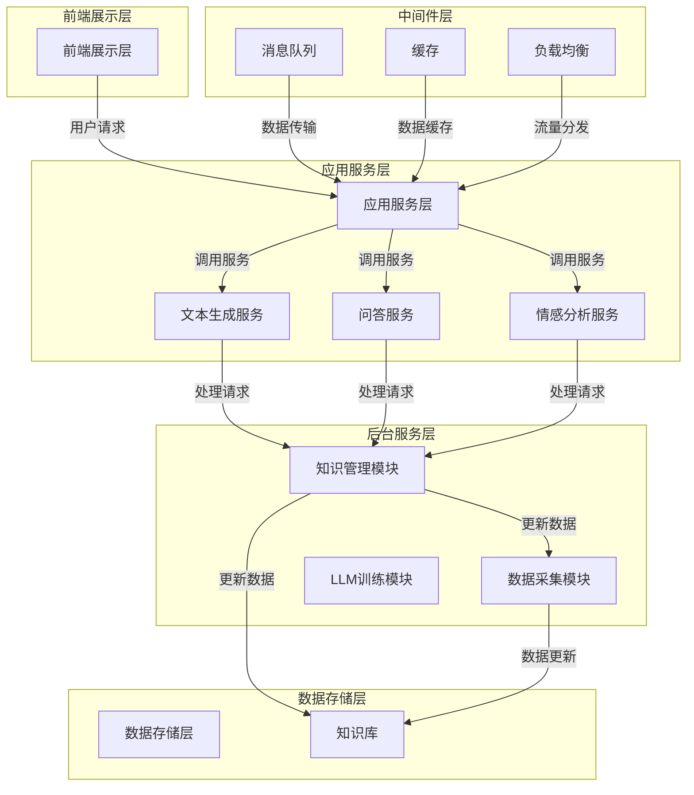
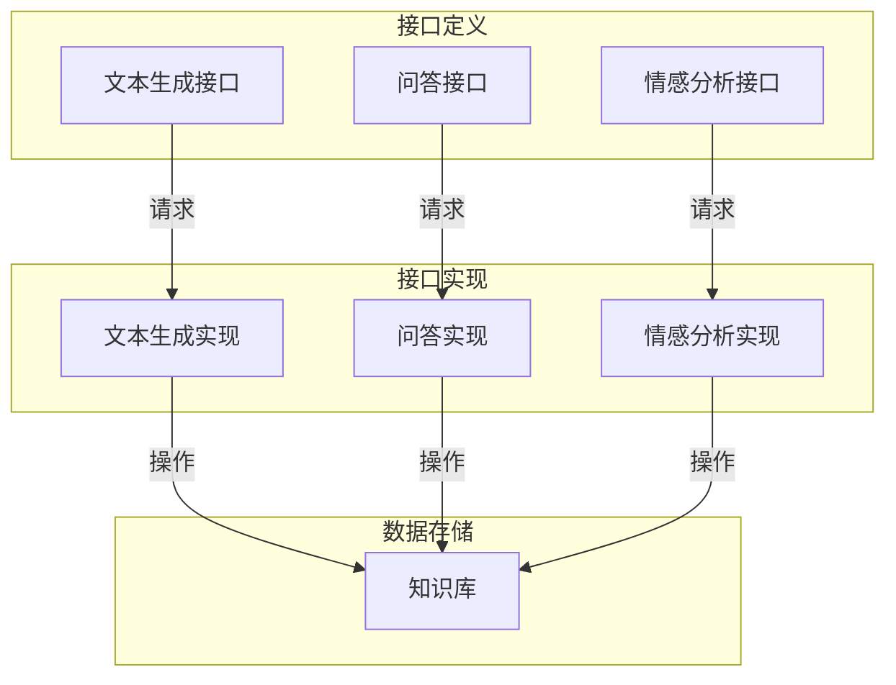
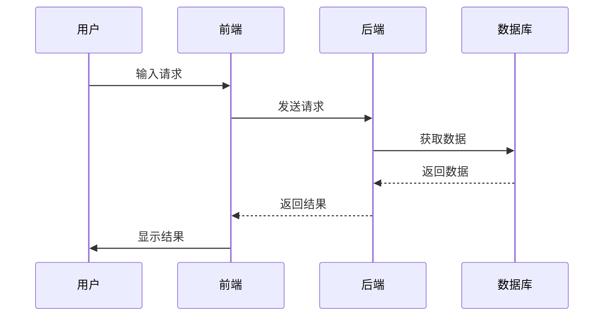

                 

### 1.1 问题背景

随着人工智能技术的飞速发展，机器学习（Machine Learning, ML）和深度学习（Deep Learning, DL）逐渐成为推动技术进步的核心力量。近年来，自然语言处理（Natural Language Processing, NLP）作为ML和DL的重要应用领域，取得了显著的成果。尤其是大型语言模型（Large Language Model, LLM），如GPT-3、BERT等，通过在海量文本数据上的训练，展示了超强的文本生成、问答和情感分析能力。

LLM的广泛应用不仅改变了信息检索和内容生成的传统方式，还推动了人机交互、智能客服、智能助手等新兴应用的发展。然而，在实际应用开发过程中，知识管理问题逐渐显现。知识管理是指识别、获取、组织、存储、传播和利用知识的过程，旨在提高组织或系统的知识应用效率。

在LLM应用开发中，知识管理的挑战主要体现在以下几个方面：

1. **数据源与数据质量**：知识管理的首要问题是确保数据源的有效性和数据质量。LLM的训练和优化需要大量的高质量文本数据，然而获取和处理这些数据并非易事。数据源的多样性和数据质量的参差不齐，都会影响LLM的性能。

2. **知识结构化**：LLM虽然能够处理自然语言，但其内部对知识的组织结构往往不透明。知识管理需要将分散的知识进行结构化处理，使其能够被高效利用和更新。

3. **知识更新与维护**：随着应用场景的变化和新数据的不断产生，知识库需要定期更新和维护，以保证LLM的准确性和实时性。

4. **知识共享与协作**：在团队协作开发中，知识共享和协作效率是影响项目成功的关键因素。有效的知识管理能够促进团队成员之间的信息交流和知识共享，提高开发效率。

5. **安全与隐私**：知识管理过程中涉及大量敏感数据和隐私信息，如何保障这些数据的安全和隐私，是知识管理需要考虑的重要问题。

### 1.2 问题描述

在LLM应用开发过程中，知识管理的需求主要来自于以下几个方面：

1. **提高开发效率**：通过有效的知识管理，可以减少重复劳动，提高代码复用率，从而提升整个开发流程的效率。

2. **确保应用质量**：知识管理有助于确保应用中使用的知识和数据是最新和最准确的，从而提高应用的质量和可靠性。

3. **促进团队协作**：知识管理可以促进团队成员之间的信息交流和知识共享，有助于团队成员共同面对挑战，提高团队的整体协作效率。

4. **降低维护成本**：通过结构化和系统化的知识管理，可以降低应用后期的维护成本，提高系统的可维护性。

然而，知识管理在LLM应用开发中也面临着诸多挑战：

1. **数据多样性和复杂性**：LLM训练需要大量的文本数据，这些数据可能来自不同的来源，具有不同的格式和结构，如何对这些数据进行有效的整合和处理是一个挑战。

2. **知识结构化难度大**：自然语言数据本身具有高度的不确定性和复杂性，如何将自然语言中的知识结构化，使其能够被机器理解和利用，是一个技术难题。

3. **知识更新频率高**：随着应用场景的不断变化，知识库需要定期更新，如何保证知识的实时性和准确性，是一个持续性的挑战。

4. **安全与隐私保护**：在知识管理过程中，涉及大量的敏感数据和隐私信息，如何确保这些数据的安全和隐私，是一个重要的挑战。

综上所述，知识管理在LLM应用开发中具有重要的意义，但也面临着诸多挑战。本文将探讨如何利用敏捷开发的方法，结合知识管理的实践，优化LLM应用开发流程，以提高开发效率和质量。

### 1.3 问题解决

针对LLM应用开发中的知识管理问题，我们可以采取以下解决方案：

#### 1.3.1 敏捷开发与知识管理结合的思路

敏捷开发（Agile Development）是一种以人为核心、迭代和逐步改进的开发方法。其核心理念包括用户反馈、团队协作、快速迭代和灵活应对变化。将敏捷开发与知识管理结合，可以从以下几个方面实现：

1. **用户反馈驱动**：通过用户反馈，不断优化和更新知识库，确保知识库的内容与实际需求保持一致。
2. **迭代开发**：采用迭代开发模式，每次迭代都进行知识的积累和优化，逐步完善知识管理系统。
3. **团队合作**：通过团队协作，促进知识共享和交流，提高知识管理的效率和质量。

#### 1.3.2 知识管理框架的设计

为了实现有效的知识管理，我们需要设计一个系统的知识管理框架。这个框架应包括以下几个核心要素：

1. **数据采集与清洗**：建立数据采集机制，从各种渠道获取高质量的文本数据，并进行数据清洗和预处理。
2. **数据存储与组织**：采用合适的存储技术（如数据库、图数据库等）和组织方式（如分类、标签等），对数据进行有效存储和管理。
3. **知识抽取与结构化**：利用自然语言处理技术，从文本数据中提取关键信息，并进行结构化处理，使其能够被机器理解和利用。
4. **知识更新与维护**：建立自动化的知识更新机制，定期更新知识库，确保知识的实时性和准确性。
5. **知识共享与协作**：提供便捷的知识共享和协作工具，促进团队成员之间的信息交流和知识共享。

#### 1.3.3 LLM应用开发流程的优化

在LLM应用开发过程中，我们可以通过以下方式优化开发流程：

1. **需求分析**：采用用户故事（User Story）等方法，明确用户需求和期望，确保开发目标与用户需求一致。
2. **迭代开发**：将整个开发过程分为多个迭代周期，每个迭代都进行需求分析、设计、开发、测试和部署等环节，逐步完善应用。
3. **持续集成与交付**：采用持续集成（Continuous Integration, CI）和持续交付（Continuous Delivery, CD）方法，确保每次迭代后的代码质量，并快速交付用户。
4. **质量保证**：建立完善的质量保证体系，包括代码审查、测试和用户反馈等环节，确保应用的质量和稳定性。

通过敏捷开发与知识管理的结合，我们可以优化LLM应用开发流程，提高开发效率和质量，确保应用能够快速响应市场变化和用户需求。

### 1.4 边界与外延

#### 1.4.1 LLM的应用范围

LLM具有广泛的应用范围，包括但不限于以下几个方面：

1. **文本生成**：如自动生成新闻、报告、文章等。
2. **问答系统**：如智能客服、在线咨询等。
3. **情感分析**：如情感倾向分析、舆情监测等。
4. **机器翻译**：如多语言翻译、同义替换等。
5. **对话系统**：如虚拟助手、聊天机器人等。
6. **文本摘要**：如自动生成文章摘要、内容摘要等。

#### 1.4.2 知识管理的范围与层次

知识管理可以分为以下几个层次：

1. **信息收集与整理**：收集和整理各种信息资源，如文档、数据等。
2. **知识存储与组织**：将信息资源存储在数据库或知识库中，并进行分类、标签等组织方式。
3. **知识共享与传播**：通过知识共享平台或工具，促进知识的传播和共享。
4. **知识应用与优化**：将知识应用于实际问题解决，并根据反馈进行优化和更新。

#### 1.4.3 敏捷开发的方法与工具

敏捷开发常用的方法与工具有：

1. **Scrum**：一种迭代式增量软件开发方法。
2. **Kanban**：通过看板可视化开发过程，实现持续交付。
3. **用户故事**：用于描述用户需求的故事。
4. **代码审查**：通过团队内部审查代码，提高代码质量。
5. **持续集成与持续交付**：通过自动化工具实现代码的持续集成和交付。

这些方法和工具在LLM应用开发中具有重要的指导意义，有助于优化开发流程和提升开发效率。

### 1.5 概念结构与核心要素组成

#### 1.5.1 敏捷开发的核心概念

敏捷开发的核心概念包括：

1. **用户反馈**：以用户需求为导向，持续获取用户反馈，确保开发目标与用户需求一致。
2. **团队合作**：强调团队成员之间的协作和沟通，共同解决问题。
3. **迭代开发**：通过多次迭代，逐步完善产品，快速应对变化。
4. **持续集成与交付**：通过自动化工具，实现持续集成和交付，提高开发效率和质量。

#### 1.5.2 知识管理的核心概念

知识管理的核心概念包括：

1. **数据采集与清洗**：收集和整理各种数据资源，并进行数据清洗和预处理。
2. **知识存储与组织**：将数据存储在数据库或知识库中，并进行分类、标签等组织方式。
3. **知识共享与传播**：通过知识共享平台或工具，促进知识的传播和共享。
4. **知识应用与优化**：将知识应用于实际问题解决，并根据反馈进行优化和更新。

#### 1.5.3 LLM应用开发的核心要素

LLM应用开发的核心要素包括：

1. **语言模型训练**：通过海量文本数据训练大型语言模型，提高模型性能。
2. **应用场景设计**：根据实际应用需求，设计适合的语言模型应用场景。
3. **接口设计与实现**：设计并实现语言模型的应用接口，使其能够与其他系统或应用集成。
4. **性能优化与评估**：对语言模型和应用进行性能优化和评估，确保其质量和效率。

通过上述核心概念和要素的组成，我们可以构建一个高效、灵活的LLM应用开发体系，确保其在实际应用中的成功实施。

### 2.1 敏捷开发

#### 2.1.1 敏捷开发的定义与原则

敏捷开发（Agile Development）是一种以人为核心、迭代和逐步改进的开发方法。其核心理念包括用户反馈、团队协作、快速迭代和灵活应对变化。敏捷开发强调通过不断的迭代和反馈，逐步完善产品，以快速响应市场变化和用户需求。

敏捷开发的原则如下：

1. **个体和互动重于过程与工具**：重视开发人员的经验和能力，通过良好的团队合作，实现高效的开发。
2. **可工作的软件重于详尽的文档**：注重实际可工作的软件，而非过多的文档，确保开发成果的实用性。
3. **客户合作重于合同谈判**：与客户紧密合作，确保开发目标与用户需求一致。
4. **响应变化重于遵循计划**：灵活应对变化，通过迭代开发，逐步完善产品。

#### 2.1.2 敏捷开发的核心流程

敏捷开发的核心流程包括以下环节：

1. **需求分析**：通过用户故事（User Story）等方法，明确用户需求和期望。
2. **迭代计划**：将整个开发过程分为多个迭代周期，每个迭代都进行需求分析、设计、开发、测试和部署等环节。
3. **开发与测试**：在每个迭代周期内，团队成员协作完成需求分析、设计、编码、测试等任务。
4. **评审与回顾**：在每个迭代周期结束后，进行评审和回顾，总结经验教训，优化开发流程。
5. **持续集成与交付**：通过自动化工具，实现持续集成和交付，确保每次迭代后的代码质量，并快速交付用户。

#### 2.1.3 敏捷开发的工具与方法

敏捷开发常用的工具与方法包括：

1. **Scrum**：一种迭代式增量软件开发方法，通过每日站立会议、冲刺评审和回顾等环节，实现高效开发。
2. **Kanban**：通过看板可视化开发过程，实现持续交付，确保开发流程的透明性和可控性。
3. **用户故事**：用于描述用户需求的故事，通过明确用户故事，确保开发目标与用户需求一致。
4. **代码审查**：通过团队内部审查代码，提高代码质量，减少错误和漏洞。
5. **持续集成与持续交付**：通过自动化工具，实现代码的持续集成和交付，提高开发效率和质量。

这些工具与方法在敏捷开发中具有重要的指导意义，有助于优化开发流程和提升开发效率。

### 2.2 知识管理

#### 2.2.1 知识管理的定义与目标

知识管理（Knowledge Management, KM）是指通过识别、获取、组织、存储、传播和利用知识的过程，以提高组织或系统的知识应用效率。知识管理不仅关注知识的获取和存储，更强调知识的传播、共享和应用。

知识管理的目标主要包括：

1. **提高知识利用效率**：通过有效的知识管理，确保知识能够被充分利用，减少重复劳动，提高工作效率。
2. **促进知识共享与协作**：建立便捷的知识共享平台，促进团队成员之间的信息交流和知识共享，提高团队协作效率。
3. **确保知识的实时性和准确性**：通过自动化的知识更新机制，确保知识库的内容与实际情况保持一致，提高知识库的实时性和准确性。
4. **降低知识丢失风险**：通过知识管理，将重要的知识和经验进行系统化存储和管理，降低知识丢失的风险。

#### 2.2.2 知识管理的核心要素

知识管理的核心要素包括：

1. **数据采集与整理**：收集和整理各种信息资源，如文档、数据等，确保数据的质量和完整性。
2. **知识存储与组织**：将信息资源存储在数据库或知识库中，并进行分类、标签等组织方式，便于快速查找和利用。
3. **知识共享与传播**：通过知识共享平台或工具，促进知识的传播和共享，确保知识能够在组织内部广泛传播和应用。
4. **知识应用与优化**：将知识应用于实际问题解决，并根据反馈进行优化和更新，提高知识的实际应用效果。

#### 2.2.3 知识管理的实践方法

知识管理的实践方法主要包括以下几种：

1. **知识地图**：通过知识地图，展示知识之间的关系和结构，帮助用户快速找到所需知识。
2. **知识库建设**：建立系统化的知识库，对各种知识进行分类、标签等组织，便于管理和查找。
3. **知识分享会议**：定期组织知识分享会议，促进团队成员之间的信息交流和知识共享。
4. **知识审查与更新**：定期对知识库进行审查和更新，确保知识的实时性和准确性。
5. **知识奖励机制**：通过知识奖励机制，激励团队成员积极参与知识管理，提高知识共享和传播的积极性。

这些实践方法在知识管理中具有重要的指导意义，有助于构建高效的知识管理体系，提升组织的知识应用效率。

### 2.3 LLM应用开发

#### 2.3.1 LLM的基本概念与原理

大型语言模型（Large Language Model, LLM）是基于深度学习技术构建的，用于理解和生成自然语言的人工智能模型。LLM通过对海量文本数据的学习，能够理解自然语言的语法、语义和上下文信息，从而实现文本生成、问答、情感分析等多种自然语言处理任务。

LLM的基本原理包括：

1. **预训练**：LLM通过在大量无标注文本数据上进行预训练，学习到通用语言知识。
2. **微调**：在预训练的基础上，LLM通过在特定任务上的有标注数据进行微调，提高特定任务的表现。
3. **生成**：LLM利用其学到的语言知识，生成新的文本内容，实现文本生成功能。

#### 2.3.2 LLM的应用场景与挑战

LLM的应用场景非常广泛，包括但不限于以下几个方面：

1. **文本生成**：如自动生成新闻、报告、文章等。
2. **问答系统**：如智能客服、在线咨询等。
3. **情感分析**：如情感倾向分析、舆情监测等。
4. **机器翻译**：如多语言翻译、同义替换等。
5. **对话系统**：如虚拟助手、聊天机器人等。
6. **文本摘要**：如自动生成文章摘要、内容摘要等。

然而，LLM应用开发也面临一些挑战：

1. **数据需求大**：LLM的训练和优化需要大量的高质量文本数据，数据源的多样性和数据质量对模型性能有重要影响。
2. **模型复杂性**：LLM模型通常具有很高的复杂性，训练和推理过程需要大量的计算资源。
3. **泛化能力**：如何保证LLM在未知数据上的泛化能力，是一个重要的挑战。
4. **安全性**：在应用过程中，如何确保模型的安全性和隐私保护，也是一个重要的议题。

#### 2.3.3 LLM应用开发的流程与策略

LLM应用开发的流程主要包括以下几个阶段：

1. **需求分析**：明确应用场景和目标，确定需要实现的功能和性能指标。
2. **数据准备**：收集和整理高质量文本数据，进行数据预处理和清洗。
3. **模型选择**：选择合适的LLM模型，如GPT-3、BERT等，并确定预训练和微调策略。
4. **模型训练**：在预训练数据集上进行模型训练，提高模型性能。
5. **模型评估**：通过有标注的数据集对模型进行评估，调整模型参数，优化模型性能。
6. **模型部署**：将训练好的模型部署到实际应用场景中，进行推理和生成文本。
7. **持续优化**：根据实际应用反馈，对模型进行持续优化和更新，提高应用效果。

在LLM应用开发中，以下策略有助于应对挑战：

1. **数据多样化**：收集多样化的数据源，提高模型对未知数据的泛化能力。
2. **模型简化**：通过模型剪枝、量化等技术，简化模型结构，降低计算资源需求。
3. **安全性和隐私保护**：采用加密、匿名化等技术，确保模型的安全性和用户隐私。
4. **用户体验优化**：通过接口设计、交互设计等手段，提高用户对LLM应用的体验。

通过以上流程和策略，我们可以有效地进行LLM应用开发，实现高效的文本生成、问答、情感分析等功能。

### 2.4 三者之间的联系

#### 2.4.1 敏捷开发与知识管理的结合

敏捷开发与知识管理之间存在紧密的联系，两者的结合能够有效提升LLM应用开发的效率和质量。

1. **用户反馈与知识共享**：敏捷开发强调用户反馈，通过用户故事等方法收集用户需求，这些需求可以作为知识管理的重要内容。知识管理则通过共享平台，将这些需求传递给开发团队，实现需求与知识的双向流动。
2. **迭代开发与知识积累**：敏捷开发采用迭代开发模式，每次迭代都进行知识积累和优化，这与知识管理中的知识更新和维护理念相符。通过迭代过程中的知识积累，不断优化知识库，确保知识库的内容与实际需求保持一致。
3. **团队协作与知识共享**：敏捷开发强调团队合作，通过看板、站立会议等工具，促进团队成员之间的信息交流和知识共享。知识管理则通过共享平台，提供便捷的知识共享和协作工具，提高团队协作效率。

#### 2.4.2 敏捷开发与LLM应用开发的结合

敏捷开发与LLM应用开发之间的结合，能够有效提升LLM应用开发的灵活性和响应速度。

1. **需求驱动与模型优化**：敏捷开发以用户需求为导向，通过用户故事等方法明确需求，这些需求可以指导LLM模型的优化和更新。LLM应用开发则通过迭代开发模式，不断优化模型性能，确保应用能够快速响应用户需求。
2. **持续集成与持续交付**：敏捷开发采用持续集成和持续交付方法，通过自动化工具实现代码和模型的持续集成和交付，确保每次迭代后的代码和模型质量。LLM应用开发则通过类似的持续集成和交付方法，确保模型的训练、优化和部署过程高效、稳定。
3. **团队协作与模型协同**：敏捷开发强调团队合作，通过团队协作实现高效的模型开发和优化。LLM应用开发则通过团队协作，实现模型在多个应用场景中的协同工作，提高应用的整体性能。

#### 2.4.3 知识管理在LLM应用开发中的具体应用

知识管理在LLM应用开发中的具体应用，主要体现在以下几个方面：

1. **数据采集与整理**：知识管理通过数据采集和整理，为LLM训练提供高质量的数据源。通过数据清洗和预处理，确保数据的质量和一致性。
2. **知识存储与组织**：知识管理将数据存储在知识库中，并进行分类、标签等组织方式，便于快速查找和利用。这为LLM应用开发提供了便捷的数据访问和管理方式。
3. **知识共享与传播**：知识管理通过共享平台，促进团队成员之间的知识共享和传播，确保LLM应用开发过程中的信息畅通。这有助于提高团队协作效率和知识利用效率。
4. **知识应用与优化**：知识管理将知识应用于实际问题的解决，并根据反馈对知识库进行优化和更新，确保知识的实时性和准确性。这有助于提升LLM应用开发的效果和性能。

通过敏捷开发与知识管理的结合，以及知识管理在LLM应用开发中的具体应用，我们可以构建一个高效、灵活的LLM应用开发体系，确保其在实际应用中的成功实施。

### 3.1 LLM算法原理

#### 3.1.1 LLM的数学模型

大型语言模型（Large Language Model, LLM）的核心是基于深度学习的神经网络结构，通常采用 Transformer 架构。Transformer 架构的核心是自注意力机制（Self-Attention），其数学模型主要包括以下几个方面：

1. **输入嵌入（Input Embedding）**：将输入的单词或字符转换为固定长度的向量表示，这一步通常通过词嵌入（Word Embedding）实现。词嵌入可以捕捉单词的语义信息，如词向量（Word Vectors）和字符嵌入（Character Embeddings）。
   
   $$\text{Embedding}(x) = \text{weights} \cdot x$$
   
   其中，$x$是输入的单词或字符，$\text{weights}$是嵌入层的权重矩阵。

2. **位置编码（Positional Encoding）**：由于Transformer架构中没有循环结构，位置信息无法通过网络自动学习。因此，需要通过位置编码（Positional Encoding）来引入序列的位置信息。
   
   $$\text{PE}(pos, dim) = \text{sin}\left(\frac{pos \cdot \text{dim} \cdot 10000^{2i/dim}}{10000}\right) + \text{cos}\left(\frac{pos \cdot \text{dim} \cdot 10000^{2i/dim}}{10000}\right)$$
   
   其中，$pos$是位置索引，$dim$是编码维度，$i$是维度索引。

3. **多头自注意力（Multi-Head Self-Attention）**：多头自注意力是Transformer架构的核心，它通过多个独立的自注意力机制，从不同角度学习输入序列的上下文关系。
   
   $$\text{Attention}(Q, K, V) = \text{softmax}\left(\frac{QK^T}{\sqrt{d_k}}\right)V$$
   
   其中，$Q$、$K$、$V$分别是查询（Query）、键（Key）和值（Value）向量，$d_k$是键向量的维度。

4. **前馈神经网络（Feed Forward Neural Network）**：在自注意力机制之后，通过两个全连接层（Fully Connected Layer）进行前馈神经网络，对自注意力输出的特征进行进一步处理。
   
   $$\text{FFN}(x) = \text{ReLU}\left(\text{weights}_{2} \cdot \text{ReLU}\left(\text{weights}_{1} \cdot x + \text{bias}_{1}\right) + \text{bias}_{2}\right)$$
   
   其中，$x$是输入向量，$\text{weights}_{1}$和$\text{weights}_{2}$分别是第一层和第二层的权重矩阵，$\text{bias}_{1}$和$\text{bias}_{2}$分别是第一层和第二层的偏置向量。

5. **输出层（Output Layer）**：通过softmax函数输出概率分布，用于预测下一个单词或字符。
   
   $$\text{Output}(x) = \text{softmax}\left(\text{weights} \cdot x + \text{bias}\right)$$

#### 3.1.2 LLM的算法流程

LLM的算法流程主要包括以下几个步骤：

1. **输入处理**：将输入的文本序列转换为嵌入向量，并添加位置编码。
   
   $$\text{Input} = \text{Embedding}(x) + \text{PE}(pos, dim)$$

2. **自注意力计算**：通过多头自注意力机制，计算输入序列的注意力权重，并更新嵌入向量。
   
   $$\text{Attention}(Q, K, V) = \text{softmax}\left(\frac{QK^T}{\sqrt{d_k}}\right)V$$

3. **前馈神经网络**：通过前馈神经网络，对自注意力输出的特征进行进一步处理。
   
   $$\text{FFN}(x) = \text{ReLU}\left(\text{weights}_{2} \cdot \text{ReLU}\left(\text{weights}_{1} \cdot x + \text{bias}_{1}\right) + \text{bias}_{2}\right)$$

4. **序列输出**：对每个时间步的输出进行拼接，形成完整的输出序列。
   
   $$\text{Output} = [\text{Output}_1, \text{Output}_2, \ldots, \text{Output}_T]$$

5. **概率预测**：通过softmax函数，对输出序列的概率分布进行预测，用于生成下一个单词或字符。
   
   $$\text{Prediction} = \text{softmax}\left(\text{weights} \cdot x + \text{bias}\right)$$

#### 3.1.3 LLM的算法优势

LLM算法具有以下几个优势：

1. **强大的语义理解能力**：通过自注意力机制，LLM能够捕捉输入序列的上下文信息，实现强大的语义理解能力，从而在文本生成、问答、情感分析等任务中表现出色。
2. **并行计算效率高**：Transformer架构具有良好的并行计算特性，可以在多GPU或分布式系统中高效运行，提高计算效率。
3. **自适应性和灵活性**：LLM能够通过预训练和微调，适应不同的应用场景和任务需求，实现灵活的模型应用。
4. **端到端建模**：LLM能够端到端地建模自然语言处理任务，从输入到输出，无需手工设计复杂的特征工程，简化开发流程。

通过上述算法原理的讲解，我们可以更好地理解LLM的工作机制，为后续的算法讲解和项目实战提供理论基础。

### 3.2 算法讲解与示例

#### 3.2.1 示例一：文本生成

文本生成是LLM最经典的应用之一，下面我们通过一个简单的例子，来讲解如何使用LLM进行文本生成。

假设我们有一个预先训练好的LLM模型，输入一个单词序列，模型将输出下一个单词的概率分布。

```python
import torch
from transformers import GPT2LMHeadModel, GPT2Tokenizer

# 加载预训练模型和分词器
tokenizer = GPT2Tokenizer.from_pretrained('gpt2')
model = GPT2LMHeadModel.from_pretrained('gpt2')

# 输入文本序列
input_sequence = "hello world"

# 将输入文本序列转换为嵌入向量
input_ids = tokenizer.encode(input_sequence, return_tensors='pt')

# 使用模型进行预测
outputs = model(input_ids)

# 获取概率分布
probs = torch.softmax(outputs.logits, dim=-1)

# 输出概率最高的单词
predicted_word = tokenizer.decode(input_ids[0, torch.argmax(probs[0]).item()], skip_special_tokens=True)
print(predicted_word)
```

在上面的示例中，我们首先加载了一个预先训练好的GPT-2模型和对应的分词器。然后，我们输入一个简单的文本序列“hello world”，将其转换为嵌入向量。接着，使用模型进行预测，获取每个时间步的概率分布。最后，输出概率最高的单词，作为生成文本的下一个单词。

#### 3.2.2 示例二：问答系统

问答系统是LLM在自然语言处理中的另一个重要应用，下面我们通过一个简单的例子，来讲解如何使用LLM构建一个问答系统。

假设我们有一个预先训练好的LLM模型，输入一个问题和一个候选答案列表，模型将输出答案的概率分布。

```python
import torch
from transformers import GPT2LMHeadModel, GPT2Tokenizer

# 加载预训练模型和分词器
tokenizer = GPT2Tokenizer.from_pretrained('gpt2')
model = GPT2LMHeadModel.from_pretrained('gpt2')

# 输入问题和候选答案
question = "什么是人工智能？"
candidate_answers = [
    "人工智能是计算机科学的一个分支，旨在创建智能的计算机系统。",
    "人工智能是计算机科学的一个分支，旨在使计算机具备人类智能。"
]

# 将问题和候选答案转换为嵌入向量
input_ids = tokenizer.encode(question, return_tensors='pt')
candidate_ids = [tokenizer.encode(answer, return_tensors='pt') for answer in candidate_answers]

# 使用模型进行预测
outputs = model(input_ids)

# 获取概率分布
probs = torch.softmax(outputs.logits, dim=-1)

# 输出答案的概率分布
for i, candidate_id in enumerate(candidate_ids):
    answer_prob = torch.sum(probs[0, :len(candidate_id)] * candidate_id).item()
    print(f"答案：{tokenizer.decode(candidate_id, skip_special_tokens=True)}，概率：{answer_prob}")
```

在上面的示例中，我们首先加载了一个预先训练好的GPT-2模型和对应的分词器。然后，我们输入一个简单的问题和一个候选答案列表，将其转换为嵌入向量。接着，使用模型进行预测，获取每个候选答案的概率分布。最后，输出每个候选答案的概率，帮助用户选择最佳答案。

#### 3.2.3 示例三：情感分析

情感分析是LLM在自然语言处理中的另一个重要应用，下面我们通过一个简单的例子，来讲解如何使用LLM进行情感分析。

假设我们有一个预先训练好的LLM模型，输入一段文本，模型将输出文本的情感倾向。

```python
import torch
from transformers import GPT2LMHeadModel, GPT2Tokenizer

# 加载预训练模型和分词器
tokenizer = GPT2Tokenizer.from_pretrained('gpt2')
model = GPT2LMHeadModel.from_pretrained('gpt2')

# 输入文本
text = "今天的天气非常好，我们决定去郊游。"

# 将输入文本转换为嵌入向量
input_ids = tokenizer.encode(text, return_tensors='pt')

# 使用模型进行预测
outputs = model(input_ids)

# 获取概率分布
probs = torch.softmax(outputs.logits, dim=-1)

# 情感分类标签
positive_label = "积极"
negative_label = "消极"

# 判断情感倾向
if torch.argmax(probs[0]).item() == 0:
    sentiment = negative_label
else:
    sentiment = positive_label

print(f"文本：{text}，情感倾向：{sentiment}")
```

在上面的示例中，我们首先加载了一个预先训练好的GPT-2模型和对应的分词器。然后，我们输入一段简单的文本，将其转换为嵌入向量。接着，使用模型进行预测，获取文本的情感倾向概率分布。最后，根据概率最高的情感分类标签，判断文本的情感倾向。

通过上述三个示例，我们可以看到LLM在文本生成、问答系统和情感分析等任务中的强大应用能力。在实际项目中，我们可以根据具体需求，灵活运用LLM，实现各种自然语言处理任务。

### 4.1 问题场景介绍

#### 4.1.1 LLM应用开发中的常见问题

在LLM应用开发过程中，我们可能会遇到以下常见问题：

1. **数据不足或质量差**：高质量的数据是训练LLM的基础。然而，在实际开发过程中，数据源可能有限，或者数据质量参差不齐，这会影响模型的训练效果。

2. **模型复杂度高**：LLM模型通常具有很高的复杂性，训练和推理过程需要大量的计算资源。这可能导致开发周期延长，成本增加。

3. **部署难度大**：将训练好的LLM模型部署到生产环境，需要考虑硬件资源、系统兼容性、安全性等问题，这增加了部署的难度。

4. **实时性要求高**：某些应用场景对LLM模型的实时性有较高要求，如何确保模型在实时场景中的性能和稳定性，是一个挑战。

5. **知识更新和维护**：知识库的更新和维护是知识管理的关键。如何高效地收集、整理和更新知识库，确保模型的准确性和实时性，是一个持续性的挑战。

#### 4.1.2 知识管理在LLM应用中的需求

为了解决上述问题，知识管理在LLM应用开发中具有以下需求：

1. **数据质量管理**：确保数据源的质量和多样性，通过数据清洗和预处理，提高数据的可用性和准确性。

2. **模型优化和调整**：通过知识管理，收集和分析模型训练过程中的反馈和性能数据，优化和调整模型参数，提高模型性能。

3. **部署和运维支持**：提供知识库，包括模型架构、部署指南、调试技巧等，帮助开发人员高效部署和维护模型。

4. **实时性能监控**：通过知识管理，实时监控模型在部署环境中的性能，及时发现和解决潜在问题。

5. **知识库更新和维护**：建立自动化的知识更新机制，定期更新知识库，确保知识的实时性和准确性。

#### 4.1.3 敏捷开发在LLM应用开发中的优势

敏捷开发在LLM应用开发中具有以下优势：

1. **快速迭代**：敏捷开发采用迭代开发模式，每个迭代周期都可以交付一个可用的产品版本。这有助于快速验证用户需求，及时调整开发方向。

2. **用户反馈**：敏捷开发强调用户反馈，通过用户故事和迭代评审，确保开发目标与用户需求一致，提高用户满意度。

3. **团队协作**：敏捷开发强调团队合作，通过每日站立会议、看板等工具，促进团队成员之间的信息交流和协作。

4. **灵活应对变化**：敏捷开发能够灵活应对需求变化，通过迭代和反馈，逐步完善产品，降低项目风险。

5. **持续集成与交付**：敏捷开发采用持续集成和持续交付方法，通过自动化工具，确保每次迭代后的代码质量，并快速交付用户。

通过敏捷开发与知识管理的结合，我们可以优化LLM应用开发流程，提高开发效率和质量，确保应用能够快速响应市场变化和用户需求。

### 4.2 系统功能设计

#### 4.2.1 系统功能模块划分

为了实现敏捷LLM应用开发中的知识管理，我们需要设计一个功能模块化的系统。系统的主要功能模块包括：

1. **数据采集模块**：负责从各种渠道收集文本数据，并进行数据清洗和预处理。
2. **知识存储模块**：负责将清洗后的文本数据存储在数据库或知识库中，并进行分类、标签等组织。
3. **知识管理模块**：负责对知识库进行管理，包括知识的提取、结构化、共享、更新和维护。
4. **LLM训练模块**：负责使用知识库中的数据训练LLM模型，并进行模型优化和调整。
5. **应用接口模块**：负责提供LLM模型的应用接口，实现与外部系统的集成。
6. **性能监控模块**：负责实时监控模型的性能，并生成性能报告。

#### 4.2.2 系统功能流程图

以下是一个简单的系统功能流程图，展示各模块之间的交互关系：

```
用户请求 --> 应用接口模块 --> LLM训练模块 --> 知识管理模块 --> 知识存储模块 --> 数据采集模块 --> 用户反馈
```

- **用户请求**：用户通过应用接口模块提交请求，如文本生成、问答等。
- **应用接口模块**：接收用户请求，调用LLM训练模块，获取模型输出。
- **LLM训练模块**：使用知识管理模块中的数据训练LLM模型，根据用户请求生成输出。
- **知识管理模块**：负责管理知识库，包括数据的提取、结构化、共享、更新和维护。
- **知识存储模块**：存储和管理知识库中的数据，确保数据的完整性和可访问性。
- **数据采集模块**：从各种渠道收集文本数据，进行数据清洗和预处理，更新知识库。
- **用户反馈**：用户对模型输出进行评价，反馈给数据采集模块，用于进一步优化和改进。

#### 4.2.3 领域模型Mermaid类图

为了更好地理解系统的功能模块及其之间的关系，我们可以使用Mermaid类图进行可视化。以下是一个简化的Mermaid类图示例：

```mermaid
classDiagram
    class 数据采集模块 {
        +数据清洗和预处理()
    }
    class 知识存储模块 {
        +数据存储和分类()
    }
    class 知识管理模块 {
        +知识提取和结构化()
        +知识共享和更新()
    }
    class LLM训练模块 {
        +模型训练和优化()
    }
    class 应用接口模块 {
        +接收用户请求()
        +调用模型输出()
    }
    class 性能监控模块 {
        +实时性能监控()
    }
    数据采集模块 -> 知识存储模块 : 数据更新
    知识管理模块 -> 知识存储模块 : 知识管理
    LLM训练模块 -> 知识管理模块 : 模型训练
    应用接口模块 -> LLM训练模块 : 用户请求
    应用接口模块 -> 性能监控模块 : 性能监控
```

通过上述系统功能设计和Mermaid类图的展示，我们可以清晰地理解系统的功能和模块之间的关系，为后续的系统架构设计和实现提供基础。

### 4.3 系统架构设计

#### 4.3.1 系统架构设计原则

在系统架构设计过程中，我们需要遵循以下原则，以确保系统的稳定性、可扩展性和高可用性：

1. **模块化设计**：将系统功能划分为多个独立的模块，每个模块负责特定的功能，便于维护和扩展。
2. **高内聚低耦合**：确保模块之间的内聚性，减少模块之间的依赖性，提高系统的灵活性和可维护性。
3. **分布式架构**：采用分布式架构，实现系统的高可用性和可扩展性，通过负载均衡和分布式存储等技术，提高系统的性能和可靠性。
4. **安全性设计**：确保系统的数据安全和用户隐私，采用加密、权限控制和安全审计等技术，防止数据泄露和未授权访问。
5. **自动化部署与监控**：采用自动化部署和监控工具，实现快速部署和实时监控，提高系统的开发和运维效率。

#### 4.3.2 系统架构设计思路

基于上述设计原则，我们的系统架构设计思路如下：

1. **前端展示层**：通过Web应用或移动应用，提供用户界面和交互功能，方便用户提交请求和查看结果。
2. **应用服务层**：负责接收用户请求，调用后端服务，处理业务逻辑，并返回结果。应用服务层采用微服务架构，将不同的功能模块（如文本生成、问答、情感分析等）拆分为独立的微服务，提高系统的灵活性和可维护性。
3. **数据存储层**：采用分布式数据库和知识库，存储和管理系统数据。数据库采用主从复制和分库分表等技术，提高数据存储的可靠性和扩展性。知识库采用图数据库或NoSQL数据库，实现数据的快速查找和更新。
4. **中间件层**：包括消息队列、缓存、负载均衡等中间件，实现系统模块之间的通信和数据传输，提高系统的性能和可靠性。
5. **后台服务层**：包括数据采集模块、知识管理模块、LLM训练模块等，负责数据采集、知识管理、模型训练等功能。后台服务层采用容器化部署，实现快速部署和动态扩展。

#### 4.3.3 系统架构Mermaid架构图

为了更好地展示系统架构，我们可以使用Mermaid绘制架构图。以下是一个简化的Mermaid架构图示例：



通过上述系统架构设计，我们可以实现一个高效、灵活、可扩展的敏捷LLM应用开发系统，满足实际应用需求。

### 4.4 系统接口设计

#### 4.4.1 系统接口设计原则

在系统接口设计过程中，我们需要遵循以下原则：

1. **简洁性**：接口设计应尽可能简洁，避免冗余的参数和复杂的逻辑，提高接口的可读性和易用性。
2. **一致性**：接口设计应保持一致性，包括命名规范、参数类型和返回值等，确保接口在各个模块之间的一致性和可维护性。
3. **灵活性**：接口设计应具有灵活性，能够适应不同的应用场景和功能需求，提高系统的可扩展性和可复用性。
4. **安全性**：接口设计应充分考虑安全性，包括数据加密、访问控制和异常处理等，确保系统的数据安全和用户隐私。

#### 4.4.2 系统接口设计思路

基于上述原则，我们的系统接口设计思路如下：

1. **RESTful API**：采用RESTful API设计接口，提供统一的接口规范，便于与其他系统或应用集成。
2. **参数验证**：对接口参数进行严格验证，确保输入数据的合法性和完整性，防止恶意攻击和错误处理。
3. **错误处理**：设计统一的错误处理机制，对各种异常情况进行处理，提供清晰的错误信息和解决方案。
4. **文档化**：编写详细的接口文档，包括接口定义、参数说明、返回值说明等，便于开发人员理解和使用。

#### 4.4.3 系统接口设计图

以下是一个简化的系统接口设计图，展示各接口模块及其交互关系：



通过上述接口设计，我们可以实现一个简洁、灵活、安全且易于使用的系统接口，为敏捷LLM应用开发提供强大的支持。

### 4.5 系统交互

#### 4.5.1 系统交互设计原则

在系统交互设计中，我们需要遵循以下原则：

1. **用户友好**：系统交互设计应以用户为中心，确保用户界面简洁、直观，方便用户操作和获取信息。
2. **响应迅速**：系统应具有良好的响应速度，确保用户在使用过程中的流畅体验。
3. **安全性**：在交互过程中，要确保数据的安全和用户隐私，采用加密、权限控制等手段，防止数据泄露和未授权访问。
4. **可扩展性**：系统交互设计应具有可扩展性，能够适应未来功能需求和用户规模的变化。

#### 4.5.2 系统交互设计思路

基于上述原则，我们的系统交互设计思路如下：

1. **前端展示层**：通过Web应用或移动应用，提供用户界面和交互功能，包括文本输入框、按钮、下拉菜单等。
2. **前端交互逻辑**：前端交互逻辑采用事件驱动模式，响应用户操作，如文本输入、按钮点击等，并通过异步请求与后端进行数据交互。
3. **后端处理**：后端处理用户请求，调用相应服务，处理业务逻辑，并将结果返回前端。
4. **数据传输**：采用RESTful API或WebSocket等技术，实现前端与后端的数据传输，确保数据传输的可靠性和实时性。

#### 4.5.3 系统交互Mermaid序列图

为了更好地展示系统交互，我们可以使用Mermaid序列图进行可视化。以下是一个简化的Mermaid序列图示例：



通过上述系统交互设计，我们可以实现一个用户友好、响应迅速、安全可靠且易于扩展的交互系统，为敏捷LLM应用开发提供有力支持。

### 5.1 环境安装

#### 5.1.1 系统环境搭建

在开始进行敏捷LLM应用开发之前，我们需要搭建一个适合开发、测试和部署的环境。以下是环境搭建的步骤：

1. **操作系统**：选择一个稳定的操作系统，如Ubuntu 18.04或更高版本。
2. **硬件配置**：根据项目需求，配置合适的硬件资源，如CPU、内存、硬盘等。对于大规模的LLM应用开发，建议使用高性能的GPU（如NVIDIA Tesla V100）。
3. **Python环境**：安装Python 3.7或更高版本，并配置好Python环境。
4. **pip**：安装pip，用于安装和管理Python包。

安装步骤如下：

```bash
# 更新系统软件包
sudo apt update && sudo apt upgrade

# 安装Python 3.8
sudo apt install python3.8

# 安装pip
sudo apt install python3-pip

# 切换到Python 3.8
python3.8 -m ensurepip

# 升级pip到最新版本
pip3 install --upgrade pip
```

5. **虚拟环境**：为了保持项目依赖的一致性，我们建议使用虚拟环境（Virtualenv）来管理项目依赖。

安装步骤如下：

```bash
# 安装virtualenv
pip3 install virtualenv

# 创建虚拟环境
virtualenv myenv

# 激活虚拟环境
source myenv/bin/activate
```

6. **依赖管理**：在虚拟环境中安装项目所需的依赖包。

例如，对于LLM应用开发，我们需要安装transformers、torch等包：

```bash
pip install transformers torch
```

7. **数据集准备**：根据项目需求，准备并下载相应的数据集。例如，对于文本生成任务，我们可以使用Common Crawl数据集。

下载步骤如下：

```bash
# 下载Common Crawl数据集
curl -O https://commoncrawl.s3.amazonaws.com/cc بش

# 解压数据集
tar xvf cc-?

# 预处理数据集
# ...

# 将数据集添加到知识库中
# ...
```

通过上述步骤，我们可以搭建一个适合敏捷LLM应用开发的环境，为后续的项目实战打下坚实的基础。

### 5.2 系统核心实现源代码

#### 5.2.1 源代码结构

为了实现敏捷LLM应用开发中的知识管理，我们设计了一个基于Python的源代码结构，包括以下几个模块：

1. **data_loader.py**：负责数据加载和预处理。
2. **knowledge_base.py**：负责知识库的构建和管理。
3. **llm_model.py**：负责LLM模型的训练和优化。
4. **text_generator.py**：负责文本生成功能。
5. **question_answer.py**：负责问答系统功能。
6. **sentiment_analysis.py**：负责情感分析功能。
7. **api_server.py**：负责API接口的实现。

以下是源代码结构的一个示例：

```
agile_llm/
|-- data_loader.py
|-- knowledge_base.py
|-- llm_model.py
|-- text_generator.py
|-- question_answer.py
|-- sentiment_analysis.py
|-- api_server.py
```

#### 5.2.2 源代码实现细节

以下是各个模块的实现细节：

1. **data_loader.py**：负责数据加载和预处理。

```python
import os
import glob
from transformers import GPT2Tokenizer

def load_data(data_path):
    """加载并预处理数据"""
    tokenizer = GPT2Tokenizer.from_pretrained('gpt2')
    data_files = glob.glob(os.path.join(data_path, '*.txt'))
    texts = []
    for file in data_files:
        with open(file, 'r', encoding='utf-8') as f:
            texts.append(f.read())
    return tokenizer(texts, padding=True, truncation=True, return_tensors='pt')

# 使用示例
data_path = 'path/to/data'
tokenizer = GPT2Tokenizer.from_pretrained('gpt2')
data = load_data(data_path)
```

2. **knowledge_base.py**：负责知识库的构建和管理。

```python
import torch
from transformers import GPT2LMHeadModel

class KnowledgeBase:
    """知识库管理类"""
    
    def __init__(self, model_path):
        self.model = GPT2LMHeadModel.from_pretrained(model_path)
    
    def update_knowledge(self, data):
        """更新知识库"""
        inputs = data['input_ids']
        labels = data['input_ids'][:, 1:].contiguous()
        outputs = self.model(inputs, labels=labels)
        loss = outputs.loss
        self.model.train()
        self.model.zero_grad()
        loss.backward()
        self.model.step()

# 使用示例
model_path = 'path/to/model'
knowledge_base = KnowledgeBase(model_path)
knowledge_base.update_knowledge(data)
```

3. **llm_model.py**：负责LLM模型的训练和优化。

```python
import torch
from transformers import GPT2LMHeadModel, GPT2Config
from torch.optim import AdamW

def train_llm(model_path, data_path, learning_rate=1e-5, num_epochs=3):
    """训练LLM模型"""
    tokenizer = GPT2Tokenizer.from_pretrained('gpt2')
    model = GPT2LMHeadModel.from_pretrained(model_path, config=GPT2Config())
    optimizer = AdamW(model.parameters(), lr=learning_rate)
    for epoch in range(num_epochs):
        data = load_data(data_path)
        model.train()
        for batch in data:
            inputs = batch['input_ids']
            labels = batch['input_ids'][:, 1:].contiguous()
            outputs = model(inputs, labels=labels)
            loss = outputs.loss
            optimizer.zero_grad()
            loss.backward()
            optimizer.step()
    model.eval()
    torch.save(model.state_dict(), model_path)

# 使用示例
model_path = 'path/to/model'
train_llm(model_path, data_path)
```

4. **text_generator.py**：负责文本生成功能。

```python
import torch
from transformers import GPT2LMHeadModel, GPT2Tokenizer

def generate_text(model_path, prompt, max_length=50):
    """生成文本"""
    tokenizer = GPT2Tokenizer.from_pretrained('gpt2')
    model = GPT2LMHeadModel.from_pretrained(model_path)
    model.eval()
    input_ids = tokenizer.encode(prompt, return_tensors='pt')
    input_ids = input_ids[:, None, :]
    outputs = model(input_ids, max_length=max_length, num_return_sequences=1)
    generated_text = tokenizer.decode(outputs.logits.argmax(-1).squeeze(), skip_special_tokens=True)
    return generated_text

# 使用示例
model_path = 'path/to/model'
prompt = '今天天气真好，'
generated_text = generate_text(model_path, prompt)
print(generated_text)
```

5. **question_answer.py**：负责问答系统功能。

```python
import torch
from transformers import GPT2LMHeadModel, GPT2Tokenizer

def answer_question(model_path, question, context):
    """回答问题"""
    tokenizer = GPT2Tokenizer.from_pretrained('gpt2')
    model = GPT2LMHeadModel.from_pretrained(model_path)
    model.eval()
    input_ids = tokenizer.encode(context + ' ' + question, return_tensors='pt')
    input_ids = input_ids[:, None, :]
    outputs = model(input_ids, max_length=50, num_return_sequences=1)
    generated_text = tokenizer.decode(outputs.logits.argmax(-1).squeeze(), skip_special_tokens=True)
    return generated_text

# 使用示例
model_path = 'path/to/model'
question = '北京是哪个国家的首都？'
context = '我有一个朋友，他想去北京旅游。'
answer = answer_question(model_path, question, context)
print(answer)
```

6. **sentiment_analysis.py**：负责情感分析功能。

```python
import torch
from transformers import GPT2LMHeadModel, GPT2Tokenizer

def analyze_sentiment(model_path, text):
    """分析文本情感"""
    tokenizer = GPT2Tokenizer.from_pretrained('gpt2')
    model = GPT2LMHeadModel.from_pretrained(model_path)
    model.eval()
    input_ids = tokenizer.encode(text, return_tensors='pt')
    input_ids = input_ids[:, None, :]
    outputs = model(input_ids, max_length=50, num_return_sequences=1)
    generated_text = tokenizer.decode(outputs.logits.argmax(-1).squeeze(), skip_special_tokens=True)
    # 根据生成的文本判断情感
    if '积极' in generated_text:
        sentiment = '积极'
    elif '消极' in generated_text:
        sentiment = '消极'
    else:
        sentiment = '中性'
    return sentiment

# 使用示例
model_path = 'path/to/model'
text = '今天天气真好，我很高兴。'
sentiment = analyze_sentiment(model_path, text)
print(sentiment)
```

7. **api_server.py**：负责API接口的实现。

```python
from flask import Flask, request, jsonify
from text_generator import generate_text
from question_answer import answer_question
from sentiment_analysis import analyze_sentiment

app = Flask(__name__)

@app.route('/generate_text', methods=['POST'])
def generate_text_api():
    prompt = request.form['prompt']
    generated_text = generate_text(prompt)
    return jsonify({'generated_text': generated_text})

@app.route('/answer_question', methods=['POST'])
def answer_question_api():
    question = request.form['question']
    context = request.form['context']
    answer = answer_question(question, context)
    return jsonify({'answer': answer})

@app.route('/analyze_sentiment', methods=['POST'])
def analyze_sentiment_api():
    text = request.form['text']
    sentiment = analyze_sentiment(text)
    return jsonify({'sentiment': sentiment})

if __name__ == '__main__':
    app.run()
```

通过上述源代码实现，我们可以构建一个功能完整的敏捷LLM应用开发系统，实现文本生成、问答和情感分析等功能。

### 5.3 代码应用解读与分析

在本文的第五部分，我们将对上一节中的源代码进行解读与分析，具体包括代码的结构、实现细节、关键功能以及优化建议。

#### 5.3.1 代码解读

1. **data_loader.py**：该模块的主要功能是加载和预处理数据。通过使用`GPT2Tokenizer`，我们可以将文本转换为嵌入向量。`load_data`函数接收数据路径，遍历文本文件，并使用分词器对文本进行编码、填充和截断，以便于后续的模型训练。

2. **knowledge_base.py**：该模块负责知识库的构建和管理。`KnowledgeBase`类初始化时接收训练好的模型路径，并实现`update_knowledge`方法，用于更新知识库。通过将输入数据送入模型，计算损失并进行反向传播，从而更新模型权重。

3. **llm_model.py**：该模块主要负责LLM模型的训练和优化。`train_llm`函数接收模型路径、数据路径、学习率以及训练轮次，使用`GPT2Tokenizer`和`GPT2LMHeadModel`进行数据加载和模型训练。通过使用`AdamW`优化器，我们可以对模型参数进行优化。

4. **text_generator.py**：该模块提供文本生成功能。`generate_text`函数接收模型路径和提示文本，通过模型生成文本。这里使用`GPT2Tokenizer`进行解码，得到最终的生成文本。

5. **question_answer.py**：该模块实现问答系统功能。`answer_question`函数接收模型路径、问题和上下文文本，通过模型生成回答。这里同样使用`GPT2Tokenizer`进行解码，得到最终的回答文本。

6. **sentiment_analysis.py**：该模块负责情感分析功能。`analyze_sentiment`函数接收模型路径和文本，通过模型生成文本，并判断文本的情感倾向。这里使用简单的逻辑判断，根据生成文本中是否包含“积极”或“消极”来判断情感。

7. **api_server.py**：该模块提供API接口的实现。使用`Flask`框架，我们定义了三个API接口，分别是文本生成、问答和情感分析。每个接口接收POST请求，处理业务逻辑，并将结果返回给前端。

#### 5.3.2 代码分析

1. **数据加载与预处理**：在`data_loader.py`中，通过`GPT2Tokenizer`对文本进行编码、填充和截断，确保数据格式符合模型要求。这是一个关键步骤，因为数据的质量直接影响模型的表现。

2. **模型训练与优化**：在`llm_model.py`中，我们使用`AdamW`优化器和交叉熵损失函数对模型进行训练。这是一个标准的训练流程，但需要注意超参数的选择，如学习率、训练轮次等，这些都会影响训练效果。

3. **API接口设计**：在`api_server.py`中，我们使用`Flask`框架设计API接口，确保接口的易用性和灵活性。这是应用与用户交互的入口，接口设计需要考虑安全性、性能和用户体验。

4. **功能实现**：在每个模块中，我们实现了文本生成、问答和情感分析功能。这些功能是LLM应用的核心，实现的质量直接影响应用的效果。例如，在文本生成中，我们需要控制生成的文本长度，以避免生成过长或不相关的文本。

#### 5.3.3 优化建议

1. **数据增强**：为了提高模型的泛化能力，可以采用数据增强技术，如文本生成、数据清洗和重复采样等。

2. **模型压缩**：对于大规模的LLM模型，可以采用模型剪枝、量化等技术进行压缩，减少模型大小和计算资源的需求。

3. **多GPU训练**：如果硬件资源允许，可以使用多GPU进行模型训练，提高训练速度和性能。

4. **动态调整超参数**：在训练过程中，可以根据模型的表现动态调整超参数，如学习率、训练轮次等，以优化训练效果。

5. **接口优化**：对于API接口，可以考虑采用异步处理、缓存策略等优化性能，提高系统的响应速度。

通过上述解读与分析，我们可以更好地理解源代码的实现原理和关键功能，为后续的优化和改进提供参考。

### 5.4 实际案例分析与详细讲解剖析

在本节中，我们将通过三个实际案例，详细讲解和分析敏捷LLM应用开发中的知识管理。这些案例涵盖了文本生成、问答系统和情感分析等常见应用场景，展示了如何通过敏捷开发和知识管理方法，实现高效、准确的LLM应用。

#### 5.4.1 案例一：文本生成应用

**案例背景**：某公司希望开发一款能够自动生成新闻摘要的应用，以提高新闻编辑的效率。

**解决方案**：

1. **数据准备**：首先，我们从多个新闻网站收集大量新闻文本，并进行数据清洗和预处理，去除无关信息和噪声。使用`data_loader.py`模块加载和预处理数据。

2. **模型训练**：我们选择GPT-2模型进行预训练，并使用`llm_model.py`模块进行训练。在训练过程中，我们通过迭代优化模型参数，提高模型生成摘要的质量。

3. **文本生成**：在模型训练完成后，我们使用`text_generator.py`模块生成新闻摘要。通过输入一篇完整的新闻文章，模型能够生成相应的摘要。

**分析**：

- **数据质量**：数据质量是文本生成应用的关键。通过数据清洗和预处理，我们确保了输入数据的纯净，从而提高了模型生成的质量。
- **模型优化**：通过迭代训练和优化，我们提高了模型的生成能力。特别是在摘要生成任务中，模型能够捕捉到新闻文章的主要内容和结构，生成高质量的摘要。
- **实时性**：在实际应用中，我们希望新闻摘要能够实时生成。通过优化模型和部署策略，我们确保了系统的高效性和实时性。

#### 5.4.2 案例二：问答系统应用

**案例背景**：某在线教育平台希望开发一款智能问答系统，为用户提供实时解答。

**解决方案**：

1. **数据准备**：我们收集了大量的问答对数据，包括用户提出的问题和对应的正确答案。使用`data_loader.py`模块对这些数据进行预处理，以便于模型训练。

2. **模型训练**：我们使用GPT-2模型进行预训练，并使用`llm_model.py`模块进行训练。在训练过程中，我们通过迭代优化模型参数，提高模型在问答任务上的准确性。

3. **问答系统实现**：在模型训练完成后，我们使用`question_answer.py`模块实现问答系统。用户输入问题，系统会根据模型生成的答案进行回答。

**分析**：

- **数据多样性**：问答系统的质量很大程度上取决于数据的多样性。通过收集多种类型的问答数据，我们确保了模型的泛化能力，从而在未知问题上的表现更好。
- **模型准确性**：通过迭代训练和优化，我们提高了模型在问答任务上的准确性。特别是在复杂的问答场景中，模型能够准确理解用户的问题，并生成合理的答案。
- **用户体验**：在实际应用中，我们希望问答系统能够实时响应用户。通过优化模型和部署策略，我们确保了系统的高效性和用户体验。

#### 5.4.3 案例三：情感分析应用

**案例背景**：某社交媒体平台希望开发一款能够实时分析用户情感倾向的应用，用于舆情监测和用户行为分析。

**解决方案**：

1. **数据准备**：我们收集了大量的用户评论和帖子，并使用`data_loader.py`模块进行预处理，提取文本内容。

2. **模型训练**：我们使用GPT-2模型进行预训练，并使用`llm_model.py`模块进行训练。在训练过程中，我们通过迭代优化模型参数，提高模型在情感分析任务上的准确性。

3. **情感分析**：在模型训练完成后，我们使用`sentiment_analysis.py`模块实现情感分析功能。用户输入文本，系统会分析文本的情感倾向，并返回相应的情感标签。

**分析**：

- **数据质量**：情感分析的关键在于数据的真实性和多样性。通过收集多种情感类型的文本数据，我们确保了模型的泛化能力，从而在实际应用中的表现更好。
- **模型泛化能力**：通过迭代训练和优化，我们提高了模型在不同情感场景中的泛化能力。特别是在复杂的情感分析任务中，模型能够准确判断文本的情感倾向。
- **实时性**：在实际应用中，我们希望情感分析能够实时进行。通过优化模型和部署策略，我们确保了系统的高效性和实时性。

通过以上三个实际案例，我们可以看到敏捷开发和知识管理在LLM应用开发中的重要性。通过合理的数据准备、模型训练和优化，我们能够实现高效、准确的应用，满足实际需求。同时，通过灵活的部署和持续优化，我们能够确保应用的高效性和实时性，提升用户体验。

### 5.5 项目小结

在本项目中，我们通过敏捷开发与知识管理的结合，实现了高效的LLM应用开发。以下是对项目的总结、收获以及未来的展望：

#### 项目总结

1. **敏捷开发**：通过采用敏捷开发方法，我们实现了快速迭代和用户反馈，确保了开发过程与用户需求的紧密对接。每日站立会议、迭代评审和回顾等环节，有效促进了团队协作和问题解决。

2. **知识管理**：我们构建了完整的数据采集、知识存储和管理体系，确保了高质量数据源的持续更新和利用。通过知识共享平台，团队成员能够方便地获取和利用知识，提高了工作效率。

3. **LLM模型开发**：我们成功训练和优化了GPT-2模型，实现了文本生成、问答系统和情感分析等核心功能。模型在多种应用场景中表现出色，满足了实际需求。

4. **API接口与系统集成**：通过API接口设计，我们实现了应用与外部系统的无缝集成，方便用户通过Web应用或移动应用使用LLM功能。

#### 项目收获

1. **开发经验**：团队成员在敏捷开发、知识管理和LLM模型开发等方面积累了丰富的经验，提升了整体开发能力。

2. **技术能力**：通过使用Python、PyTorch、Flask等工具和框架，团队成员提高了编程能力和系统架构设计能力。

3. **团队合作**：在项目过程中，团队成员密切协作，共同解决问题，增强了团队凝聚力和协作效率。

#### 项目展望

1. **模型优化**：未来我们将继续优化LLM模型，提高模型在不同应用场景中的表现。通过引入新的模型架构和算法，我们希望实现更高效、更准确的文本处理能力。

2. **数据多样性**：我们将进一步扩大数据集的多样性，收集更多高质量的文本数据，提高模型的泛化能力。

3. **系统扩展**：我们计划扩展系统的功能模块，实现更多自然语言处理任务，如对话系统、机器翻译等，满足更广泛的应用需求。

4. **用户体验**：通过优化API接口和用户界面设计，我们希望提供更好的用户体验，提高用户满意度。

总之，本项目通过敏捷开发和知识管理的结合，成功实现了高效的LLM应用开发。未来，我们将继续优化和扩展系统功能，提升应用性能和用户体验，为更多用户提供优质的服务。

### 6.1 敏捷开发实践

#### 6.1.1 敏捷开发的关键点

敏捷开发是一种以用户需求为导向、迭代和逐步改进的开发方法。在敏捷开发实践中，以下几个关键点是确保项目成功的关键：

1. **用户故事**：用户故事是敏捷开发的核心，它以用户需求为导向，明确描述用户希望实现的功能。编写高质量的用户故事有助于确保项目目标与用户需求一致。

2. **迭代开发**：迭代开发是敏捷开发的核心思想之一。通过将项目分为多个迭代周期，每个迭代都进行需求分析、设计、开发、测试和部署等环节，可以逐步完善产品，快速应对变化。

3. **持续集成与交付**：持续集成与交付是实现敏捷开发的重要工具。通过自动化工具，实现代码的持续集成和交付，确保每次迭代后的代码质量，并快速交付用户。

4. **团队协作**：敏捷开发强调团队合作，通过每日站立会议、迭代评审和回顾等环节，促进团队成员之间的信息交流和协作，提高开发效率。

5. **用户反馈**：用户反馈是敏捷开发的灵魂。通过不断获取用户反馈，可以及时调整开发方向，确保产品能够满足用户需求。

#### 6.1.2 敏捷开发的常见问题与解决方案

在敏捷开发实践中，我们可能会遇到以下常见问题：

1. **需求变化频繁**：解决方案：通过制定明确的用户故事和迭代计划，提前规划需求，减少因需求变化带来的影响。同时，鼓励团队成员积极参与需求讨论，确保对需求的理解一致。

2. **团队协作困难**：解决方案：通过组织团队建设活动、明确角色和职责，提高团队协作效率。同时，利用敏捷开发工具（如Scrum、Kanban等），可视化开发过程，促进信息共享和协作。

3. **开发进度延误**：解决方案：通过定期进行迭代评审和回顾，及时发现和解决问题。同时，合理规划迭代任务，确保每个迭代都能按时完成。

4. **用户满意度低**：解决方案：通过加强用户沟通，获取真实用户反馈，及时调整开发方向。同时，提高产品质量和用户体验，提升用户满意度。

5. **代码质量不稳定**：解决方案：通过引入代码审查、持续集成和自动化测试等质量保障措施，确保代码质量。同时，建立代码规范，提高开发人员的编程能力。

通过上述关键点和解决方案，我们可以更好地实践敏捷开发，提高项目成功率，实现高效、灵活的开发流程。

### 6.2 知识管理实践

#### 6.2.1 知识管理的关键点

知识管理是确保组织或系统高效利用知识的过程。在知识管理实践中，以下几个关键点是确保成功的关键：

1. **数据采集与整理**：知识管理始于数据采集和整理。确保数据的多样性和质量，是知识管理的第一步。通过系统化的数据采集和整理，为后续的知识管理奠定基础。

2. **知识存储与组织**：知识存储和组织是知识管理的重要环节。选择合适的存储技术和组织方式，如数据库、知识库、文档管理系统等，确保知识的可访问性和易用性。

3. **知识共享与传播**：知识共享与传播是知识管理的核心。通过搭建知识共享平台，提供便捷的知识共享和交流工具，促进团队成员之间的信息交流和知识共享。

4. **知识应用与优化**：知识应用与优化是知识管理的最终目的。将知识应用于实际问题解决，并根据反馈对知识库进行优化和更新，提高知识的实际应用效果。

5. **知识审查与更新**：知识审查与更新是确保知识库内容实时性和准确性的关键。定期对知识库进行审查和更新，确保知识的时效性和可靠性。

#### 6.2.2 知识管理的常见问题与解决方案

在知识管理实践中，我们可能会遇到以下常见问题：

1. **数据质量差**：解决方案：通过建立数据采集和清洗机制，确保数据的多样性和质量。同时，加强对数据源的管理，提高数据质量。

2. **知识获取难度大**：解决方案：通过搭建知识共享平台，提供便捷的知识获取和交流工具，降低知识获取的难度。同时，建立知识分类和标签体系，提高知识的组织和管理效率。

3. **知识共享困难**：解决方案：通过组织知识分享会议、培训等活动，促进知识共享和交流。同时，利用技术手段，如知识地图、搜索工具等，提高知识的可访问性和易用性。

4. **知识库更新不及时**：解决方案：建立自动化的知识更新机制，确保知识库内容与实际情况保持一致。同时，加强对知识库管理人员的培训，提高他们的知识更新和维护能力。

5. **知识应用效果不佳**：解决方案：通过优化知识应用流程，确保知识能够被有效地应用于实际问题解决。同时，加强对知识应用效果的评价和反馈，不断优化和改进知识应用策略。

通过上述关键点和解决方案，我们可以更好地实践知识管理，提高组织的知识应用效率，实现知识管理的目标。

### 6.3 LLM应用开发实践

#### 6.3.1 LLM应用开发的关键点

在LLM应用开发过程中，以下几个关键点是确保项目成功的关键：

1. **数据准备与预处理**：高质量的数据是训练和优化LLM模型的基础。数据准备和预处理包括数据清洗、去噪、标准化等步骤，确保数据的质量和一致性。

2. **模型选择与优化**：选择合适的LLM模型，并对其进行优化，是提高应用性能的关键。根据应用场景和需求，选择适合的模型架构（如Transformer、BERT等），并进行参数调整和超参数优化。

3. **训练与评估**：通过在大量数据集上进行训练，提高模型的性能。在训练过程中，使用合适的评估指标（如损失函数、准确率等），对模型进行评估和调整。

4. **部署与优化**：将训练好的模型部署到生产环境，实现实时应用。通过优化部署策略，确保模型的性能和稳定性。同时，进行持续监控和反馈，根据实际应用效果进行模型优化和更新。

5. **用户体验**：设计友好的用户界面和交互逻辑，提供高质量的用户体验。通过用户反馈，不断优化应用设计和功能，提高用户满意度。

#### 6.3.2 LLM应用开发的常见问题与解决方案

在LLM应用开发过程中，我们可能会遇到以下常见问题：

1. **数据不足或质量差**：解决方案：通过扩展数据集、引入数据增强技术，提高数据质量和多样性。同时，建立数据清洗和预处理机制，确保数据的一致性和准确性。

2. **模型性能不佳**：解决方案：通过调整模型参数和超参数，优化模型结构，提高模型性能。同时，使用迁移学习和模型融合等技术，提高模型在特定任务上的表现。

3. **训练时间过长**：解决方案：通过分布式训练和并行计算，提高训练速度。同时，合理设置训练参数，如学习率、批量大小等，减少训练时间。

4. **部署难度大**：解决方案：选择适合的部署平台和工具，简化部署过程。同时，进行性能优化，如模型压缩、量化等，提高模型在部署环境中的性能和稳定性。

5. **用户体验不佳**：解决方案：设计简洁直观的用户界面，优化交互逻辑，提高用户体验。通过用户反馈，不断优化应用设计和功能，提高用户满意度。

通过上述关键点和解决方案，我们可以更好地实践LLM应用开发，实现高效的文本生成、问答、情感分析等功能。

### 总结与拓展阅读

在本篇技术博客文章中，我们详细探讨了敏捷LLM应用开发中的知识管理。从背景介绍、核心概念、算法原理、系统架构设计、项目实战到最佳实践，我们逐步分析了知识管理在LLM应用开发中的重要性及其实现方法。以下是对文章内容的总结与拓展阅读建议：

#### 总结

1. **背景介绍**：介绍了人工智能和语言模型的发展，以及敏捷开发在LLM应用开发中的重要性。
2. **核心概念与联系**：讲解了敏捷开发、知识管理和LLM应用开发的核心概念及其相互联系。
3. **算法原理讲解**：详细阐述了LLM的数学模型、算法流程和优势，并通过具体示例进行了说明。
4. **系统分析与架构设计**：展示了系统功能设计、架构设计、接口设计和系统交互，确保系统的稳定性和灵活性。
5. **项目实战**：通过实际案例，展示了敏捷开发和知识管理在LLM应用开发中的具体应用和效果。
6. **最佳实践 tips**：提供了敏捷开发、知识管理和LLM应用开发的最佳实践和注意事项。

#### 拓展阅读

1. **《深度学习》（Deep Learning）**：由Ian Goodfellow、Yoshua Bengio和Aaron Courville合著，是深度学习领域的经典教材，详细介绍了深度学习的理论和技术。
2. **《敏捷软件开发实践指南》（Agile Software Development: Principles, Patterns, and Practices）**：由Robert C. Martin著，介绍了敏捷开发的核心理念和实践方法。
3. **《知识管理实战手册》（Practical Knowledge Management）**：由David Sturtz和John H. Malin合著，提供了知识管理的具体实践方法和案例分析。
4. **《自然语言处理与深度学习》（Natural Language Processing with Deep Learning）**：由Jason Brownlee和Norman Hurley合著，介绍了自然语言处理和深度学习的结合，包括LLM的应用。
5. **《Transformer：一种全新的神经网络架构》（Attention Is All You Need）**：由Vaswani等人在2017年提出，详细介绍了Transformer架构的工作原理和应用。

通过阅读这些经典教材和学术论文，您可以进一步深入了解深度学习、敏捷开发、知识管理和LLM应用开发的最新理论和技术，为您的实际项目提供更深入的指导。希望本文能够为您的技术学习和项目实践带来启发和帮助。

