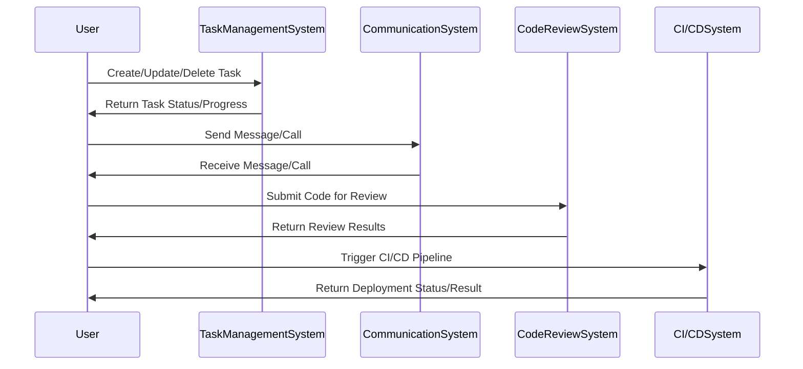

                 

## 第一部分：背景与概述

### 第1章：敏捷开发与远程团队管理的结合

#### 1.1 什么是敏捷开发

敏捷开发（Agile Development）起源于20世纪90年代末，是一种以人为核心、迭代、渐进式的软件开发方法。敏捷开发起源于软件开发领域，但其核心理念和方法论逐渐在其他领域得到应用。敏捷开发的特点包括快速迭代、持续交付、自我组织、团队协作等。

- **历史与起源**：敏捷开发最早是由17位软件工程师在2001年发布的《敏捷宣言》中提出的。这份宣言强调软件开发过程中的人员互动、可工作的软件、客户协作和响应变化的重要性。
- **核心理念**：敏捷开发强调“个体和互动重于过程与工具”、“可工作的软件重于详尽的文档”、“客户合作重于合同谈判”以及“响应变化重于遵循计划”。
- **与传统开发模式的区别**：传统开发模式通常采用瀑布模型，强调严格规划和控制，而敏捷开发则更注重灵活性和适应性。传统模式中的工作周期较长，交付周期可能长达数月甚至数年，而敏捷开发则通过短周期（通常称为“迭代”）进行快速交付和反馈，使得团队能够在开发过程中及时调整方向。

#### 1.2 远程团队管理面临的挑战

随着技术的进步，远程工作越来越普遍。然而，远程团队管理面临着一系列独特的挑战。

- **远程工作的特点与优势**：远程工作具有灵活性、节省通勤时间、提高工作效率等优势。然而，这也带来了沟通不畅、团队协作困难、时间同步问题等挑战。
- **远程团队管理面临的挑战**：远程团队管理面临的挑战包括沟通障碍、缺乏面对面的交流、监控难度增加、团队凝聚力下降等。这些问题可能导致工作效率低下、项目延期、质量下降。
- **解决远程团队管理问题的重要性**：解决远程团队管理问题是确保远程团队高效运作的关键。通过采用敏捷开发方法，可以更好地管理远程团队，提升团队协作效率和项目交付质量。

#### 1.3 敏捷开发在远程团队管理中的应用

敏捷开发方法在远程团队管理中具有显著的优势，能够有效解决远程团队面临的诸多挑战。

- **敏捷开发实践在远程团队中的应用**：敏捷开发实践在远程团队中的应用包括站立会议、迭代规划、回顾会议等。这些实践有助于加强团队成员之间的沟通和协作，提高项目透明度。
- **敏捷开发工具与远程团队管理的结合**：敏捷开发工具，如Jira、Trello、GitLab等，能够帮助远程团队管理任务、跟踪进度、分配资源，提高团队工作效率。同时，这些工具还支持实时沟通和协作，有助于克服地理距离带来的沟通障碍。

### 总结

本章介绍了敏捷开发的核心理念和其在远程团队管理中的应用。敏捷开发以其快速迭代、持续交付、自我组织等特点，为远程团队管理提供了有效的解决方案。在下一章中，我们将深入探讨远程团队管理中的核心要素，包括沟通与协作、团队协作平台、任务管理等。

## 第二部分：远程团队管理核心要素

### 第2章：沟通与协作

#### 2.1 沟通的重要性

沟通是远程团队管理的核心要素之一。有效的沟通不仅能够确保团队成员之间信息的准确传递，还能够增强团队凝聚力，提高工作效率。

- **有效沟通的必要性**：在远程团队中，缺乏面对面的交流容易导致信息误解和延误。因此，有效沟通是确保项目顺利进行的关键。它有助于减少误解、促进团队合作、提高决策效率。
- **沟通障碍及其解决方法**：远程团队可能面临以下沟通障碍：时区差异、技术故障、语言障碍、文化差异等。解决这些障碍的方法包括使用高效的沟通工具、建立明确的工作流程、进行定期沟通和培训等。

#### 2.2 远程团队沟通工具

远程团队沟通工具有助于团队之间保持紧密联系，确保信息流畅传递。以下是几种常见的远程沟通工具：

- **Slack**：Slack是一个实时沟通平台，支持文字、语音、视频等多种沟通方式。它还提供了丰富的集成功能，如自动化机器人、文件共享等。
- **Zoom**：Zoom是一个视频会议工具，适用于远程团队进行面对面交流和视频会议。它提供了高质量的视频和音频体验，支持屏幕共享和会议录制等功能。
- **Microsoft Teams**：Microsoft Teams是一个集成的工作平台，提供实时通讯、会议、协作等功能。它还与Office 365紧密集成，方便团队进行文档共享和协作。

不同工具的优势与适用场景：

- **Slack**：适用于日常沟通、团队协作和项目管理。适合团队中需要频繁交流的成员。
- **Zoom**：适用于团队会议、在线培训、项目评审等。适合需要进行实时互动和视频交流的场景。
- **Microsoft Teams**：适用于企业级应用，提供全面的沟通和协作功能。适合大型企业或跨部门团队使用。

#### 2.3 协作机制

协作机制是确保远程团队高效运作的关键。以下是几种常见的协作机制：

- **敏捷会议**：包括每日站立会议、迭代规划会议和回顾会议等。站立会议有助于团队成员分享进展、问题和建议；迭代规划会议用于规划项目任务和资源；回顾会议用于总结项目成果和反思改进。
- **任务分配**：通过任务分配工具，如Jira、Trello等，团队可以明确任务分配、进度跟踪和协作过程。
- **代码审查**：代码审查是一种重要的协作机制，用于确保代码质量和项目进度。通过代码审查，团队成员可以相互学习、讨论和改进代码。

协作工具的使用与优化：

- **Jira**：用于任务跟踪和项目管理。团队可以在Jira中创建项目、分配任务、设置优先级、跟踪进度。
- **Trello**：适用于任务管理和项目管理。通过看板视图，团队可以清晰地了解任务状态和进展。
- **GitLab**：用于代码管理、代码审查和持续集成。GitLab提供了强大的代码审查和项目管理功能。

### 总结

本章详细介绍了远程团队管理中的沟通与协作要素。有效的沟通和协作是确保远程团队高效运作的关键。通过使用合适的沟通工具和建立完善的协作机制，远程团队可以克服地理距离带来的挑战，实现高效合作和项目成功。

### 第3章：团队协作平台

#### 3.1 团队协作平台的选择标准

在远程团队管理中，选择合适的团队协作平台至关重要。一个高效的协作平台不仅能够提高团队的工作效率，还能够促进团队成员之间的协作与沟通。以下是选择团队协作平台时应考虑的一些关键标准：

- **功能需求**：团队协作平台应具备任务管理、文档共享、实时沟通、项目管理等多种功能。确保平台能够满足团队的工作需求，提高工作效率。
- **性能和可靠性**：协作平台应具备良好的性能和可靠性，能够处理大量数据和用户同时在线的情况，确保系统的稳定性和流畅性。
- **成本考量**：团队协作平台的成本也是选择时需要考虑的因素。平台价格应在团队的预算范围内，同时提供合理的价格与功能比例。
- **用户友好度**：平台界面应简洁易用，方便团队成员快速上手。良好的用户体验可以减少学习成本，提高工作效率。

#### 3.2 主流团队协作平台

目前市场上存在许多主流的团队协作平台，各具特色，适用于不同的团队场景。以下是几种主流的团队协作平台及其特点：

- **Trello**：Trello是一个基于看板的任务管理工具，界面简洁直观，适用于项目管理、团队协作和任务跟踪。它支持多种视图（如列表视图、卡片视图等），便于团队灵活管理任务。
- **Asana**：Asana是一个功能强大的任务和项目管理工具，支持任务分配、进度跟踪、项目规划和协作。它提供了丰富的自定义功能，适用于大型项目和跨部门团队。
- **Slack**：Slack是一个实时沟通平台，支持文字、语音、视频等多种沟通方式。它提供了丰富的集成功能，如自动化机器人、文件共享等，适用于团队日常沟通和协作。
- **Microsoft Teams**：Microsoft Teams是一个集成的团队协作平台，提供实时通讯、会议、协作等功能。它与Office 365紧密集成，方便团队进行文档共享和协作。
- **GitHub**：GitHub是一个面向开源及私有软件项目的托管平台，支持版本控制和代码审查。它适用于软件开发团队，提供了强大的协作和项目管理功能。

#### 3.3 平台定制与优化

为了更好地适应团队的工作需求，团队协作平台通常需要一定的定制与优化。以下是几种常见的平台定制与优化策略：

- **定制化工作流程**：根据团队的工作流程和需求，对平台进行定制化设置，如自定义任务类型、状态、优先级等，使平台更加符合团队的工作习惯。
- **集成第三方工具**：将平台与其他第三方工具（如Google Drive、Jira、Trello等）进行集成，实现数据的互通与协作，提高团队的工作效率。
- **设置权限与角色**：根据团队成员的角色和权限，设置平台访问权限和功能权限，确保团队成员能够访问和执行所需的功能。
- **定期培训与支持**：为团队成员提供定期的培训和技术支持，帮助他们更好地使用平台，提高工作效率。

### 总结

本章详细介绍了团队协作平台的选择标准、主流团队协作平台及其特点，以及平台定制与优化策略。选择合适的团队协作平台并对其进行定制和优化，是确保远程团队高效运作的关键。在下一章中，我们将探讨远程团队管理中的任务管理要素。

## 第三部分：远程团队管理实践

### 第4章：任务管理

#### 4.1 任务管理的意义

任务管理在远程团队管理中具有至关重要的地位。它不仅能够帮助团队明确工作目标，确保任务按时完成，还能够提高工作效率，优化资源分配。

- **任务管理的核心目标**：任务管理的核心目标是确保团队的工作任务能够按时、按质、按量完成。通过任务管理，团队可以更好地协调工作，避免资源浪费和任务重叠，提高整体工作效率。
- **任务管理在远程团队中的重要性**：在远程团队中，由于缺乏面对面的沟通和即时反馈，任务管理显得尤为重要。有效的任务管理可以帮助团队明确任务分配、跟踪任务进度、确保任务按时完成，从而提高项目的成功率和团队的工作满意度。

#### 4.2 任务分配与跟踪

任务分配与跟踪是任务管理的关键环节。以下是几种常见的任务分配与跟踪方法：

- **任务分配原则**：任务分配应遵循以下原则：
  - 根据团队成员的技能和经验进行合理分配，确保任务能够得到有效完成；
  - 考虑团队成员的工作负荷，避免过度分配任务；
  - 明确任务目标和预期成果，确保团队成员对任务有清晰的认识。

- **任务跟踪工具与方法**：常见的任务跟踪工具包括Jira、Trello、Asana等。以下是一些常见的任务跟踪方法：
  - **看板视图**：通过看板视图，团队可以清晰地了解任务的状态和进展。每个任务卡片都代表一个具体的工作任务，团队可以通过拖拽卡片来更新任务状态。
  - **甘特图**：甘特图是一种常用的任务跟踪工具，可以直观地展示任务的开始时间、结束时间和进度。通过甘特图，团队可以更好地了解项目的整体进度和关键路径。
  - **Sprint规划**：在敏捷开发中，Sprint规划是一种常见的任务分配和跟踪方法。通过Sprint规划会议，团队可以明确每个Sprint的目标和任务，并按照优先级进行分配。

#### 4.3 任务反馈与优化

任务完成后的反馈是任务管理的重要环节。通过及时反馈，团队可以了解任务完成情况，发现潜在问题，不断优化任务管理流程。

- **任务完成后的反馈**：任务完成后，团队应进行总结和反馈。以下是一些常见的反馈方法：
  - **回顾会议**：在回顾会议上，团队成员可以分享任务完成情况，讨论遇到的问题和解决方案，总结经验教训。
  - **问卷调查**：通过问卷调查，团队可以收集成员对任务管理的意见和建议，了解任务管理的优势和不足。

- **任务管理过程中的持续优化**：任务管理不是一成不变的，而是需要不断优化和改进。以下是一些优化策略：
  - **定期评估**：定期评估任务管理的流程和效果，根据评估结果进行调整和改进；
  - **引入新技术**：根据团队的工作需求和趋势，引入新的任务管理工具和方法，提高任务管理效率；
  - **加强培训**：为团队成员提供定期的任务管理培训，提高他们的任务管理能力和意识。

### 总结

本章详细介绍了远程团队管理中的任务管理要素，包括任务分配与跟踪、任务反馈与优化。有效的任务管理是确保远程团队高效运作的关键。通过合理的任务分配和跟踪，以及及时的任务反馈与优化，团队可以更好地协调工作，提高项目的成功率和团队的工作满意度。

### 第5章：敏捷流程在远程团队中的应用

#### 5.1 敏捷流程概述

敏捷开发是一种以人为核心、迭代、渐进式的软件开发方法。它强调快速响应变化、持续交付价值、自组织和团队协作。敏捷流程通常包括以下几个核心流程：

- **站立会议（Stand-up Meeting）**：每天早上团队成员会进行短暂的站立会议，分享各自的进展、遇到的问题和需要帮助的地方。站立会议有助于团队成员之间的沟通和协调，确保项目按时推进。
- **迭代规划（Sprint Planning）**：在每次迭代开始时，团队会进行迭代规划会议，明确本次迭代的目标和任务。团队成员会讨论任务的优先级、分配和进度安排，确保项目按计划进行。
- **迭代回顾（Sprint Review）**：在每次迭代结束时，团队会进行迭代回顾会议，评估本次迭代的工作成果，讨论遇到的问题和改进措施。迭代回顾有助于团队不断优化工作流程，提高项目质量。
- **迭代演示（Sprint Demo）**：在每次迭代结束时，团队会进行迭代演示，向利益相关者展示本次迭代的工作成果。迭代演示有助于团队成员获得反馈，调整开发方向。

敏捷流程的适用场景：

- **需求变化频繁**：敏捷流程适用于需求变化频繁的项目，通过快速迭代和持续交付，团队能够灵活应对变化，确保项目按需交付。
- **跨职能团队**：敏捷流程适用于跨职能团队，通过自我组织和团队协作，团队能够高效完成复杂的项目任务。
- **分布式团队**：敏捷流程也适用于分布式团队，通过远程协作工具和会议，团队能够保持紧密联系，确保项目顺利进行。

#### 5.2 敏捷流程在远程团队中的实施

在远程团队中实施敏捷流程需要特别的关注和调整，以确保流程的顺利进行和团队的协作效率。以下是实施敏捷流程的几个关键步骤：

- **组织远程站立会议**：远程站立会议是敏捷流程中的核心活动之一。团队成员可以通过视频会议工具（如Zoom、Microsoft Teams等）每天进行短暂的站立会议，分享各自的工作进展和遇到的困难。为了确保会议的高效性，可以设定明确的会议时间、议程和持续时间。
- **制定迭代计划**：在远程团队中，迭代计划会议可以通过视频会议或在线协作工具（如Jira、Trello等）进行。团队成员可以讨论并确定本次迭代的目标和任务，明确任务的优先级和责任人。通过在线协作工具，团队可以更好地跟踪任务进度和分配。
- **持续沟通与协作**：在远程团队中，持续沟通和协作至关重要。团队成员可以通过实时通讯工具（如Slack、Microsoft Teams等）保持在线联系，及时沟通任务进展、问题反馈和解决方案。此外，团队还可以定期举行团队会议，讨论项目的进展和潜在风险。
- **实施迭代回顾**：迭代回顾是敏捷流程中的一项重要活动，通过回顾会议，团队可以总结本次迭代的工作成果、遇到的问题和改进措施。远程团队可以通过视频会议或在线协作工具进行迭代回顾，确保每个成员都能参与并分享经验教训。

#### 5.3 敏捷流程的挑战与应对

在远程团队中实施敏捷流程可能会面临一些挑战，以下是一些常见的挑战和应对策略：

- **沟通障碍**：远程团队面临的沟通障碍可能包括时区差异、技术故障和语言障碍等。为了克服这些挑战，团队可以采取以下措施：
  - 设定明确的沟通渠道和时间表，确保团队成员能够及时沟通和交流；
  - 使用多种沟通工具（如邮件、即时通讯、视频会议等），以便团队成员能够选择最适合自己的沟通方式；
  - 定期举行团队会议，确保每个成员都能参与并了解项目进展。

- **时区差异**：远程团队中成员分布在不同的时区，可能会影响实时协作和会议安排。为了应对时区差异，团队可以采取以下策略：
  - 确定统一的协作时间，尽量安排重要的会议和活动在统一的时间段；
  - 充分利用在线协作工具，如共享文档和项目管理工具，以便团队成员可以在不同时间进行工作，并实时同步进展；
  - 安排备用会议时间，以便团队成员在无法参加主要会议时能够参与其他成员的讨论。

- **技术故障**：远程团队可能会面临网络连接不稳定、设备故障等技术问题。为了应对技术故障，团队可以采取以下措施：
  - 确保团队成员具备稳定的网络连接和可靠的设备，如备用网络和设备；
  - 提前测试和调试视频会议和协作工具，确保会议和协作过程的顺利进行；
  - 建立应急响应机制，以便在技术故障发生时，团队能够迅速响应和解决。

### 总结

本章介绍了敏捷流程在远程团队中的应用，包括敏捷流程的概述、敏捷流程在远程团队中的实施以及敏捷流程的挑战与应对。通过实施敏捷流程，远程团队能够提高协作效率、快速响应变化，确保项目的顺利进行。在下一章中，我们将探讨远程团队建设的重要方面，包括团队文化的培养、领导力与团队管理以及个人成长与职业发展。

### 第6章：远程团队建设

#### 6.1 团队文化的培养

团队文化是远程团队成功的关键因素之一。一个积极的团队文化能够增强团队成员之间的信任和合作，提高工作效率和团队凝聚力。以下是一些培养远程团队文化的有效方法：

- **明确价值观和目标**：建立明确的团队价值观和目标，确保所有成员都清楚团队的核心价值和追求的目标。这有助于团队成员在日常工作中有共同的方向和目标，增强团队凝聚力。
- **建立沟通渠道**：在远程团队中，沟通是培养团队文化的重要手段。建立多种沟通渠道，如定期团队会议、团队活动、社交平台等，鼓励团队成员之间进行开放和真诚的沟通，促进团队合作。
- **激励和奖励机制**：通过设立激励机制和奖励机制，鼓励团队成员积极参与团队活动和工作，提高团队的整体积极性。例如，可以设立团队优秀成员奖、最佳项目奖等，激励团队成员努力工作和提升技能。
- **共享知识和经验**：鼓励团队成员分享知识和经验，促进知识的传播和团队的专业成长。可以通过在线培训、研讨会、知识分享会等形式，为团队成员提供学习和成长的机会。

#### 6.2 领导力与团队管理

领导力在远程团队管理中起着至关重要的作用。一个优秀的领导者不仅能够引导团队实现目标，还能够激发团队成员的潜力和创造力。以下是一些远程团队领导力的关键要素：

- **有效沟通**：领导者应具备良好的沟通能力，能够清晰地传达团队目标和期望，确保团队成员理解任务和责任。同时，领导者应鼓励团队成员提出问题和意见，建立开放和透明的沟通环境。
- **建立信任**：信任是远程团队高效运作的基础。领导者应通过建立信任机制，如公正、透明和诚信的行事风格，确保团队成员之间的信任和尊重。
- **激励团队成员**：领导者应了解团队成员的需求和动机，通过激励和奖励机制激发团队成员的工作积极性和创造力。领导者还可以通过提供支持和资源，帮助团队成员克服困难和挑战。
- **培养团队精神**：领导者应关注团队的整体发展和成员的个人成长，通过培养团队精神，增强团队成员之间的凝聚力和合作意识。这可以通过团队建设活动、共同目标设定和团队文化建设等方式实现。

#### 6.3 个人成长与职业发展

在远程团队中，个人成长和职业发展同样重要。以下是一些促进个人成长和职业发展的策略：

- **职业规划**：团队成员应制定个人职业规划，明确自己的职业目标和成长路径。通过设定具体的目标和计划，团队成员可以更有针对性地提升自己的技能和知识。
- **持续学习**：远程团队提供了丰富的学习资源和学习机会，团队成员应积极利用这些资源，如在线课程、专业书籍、研讨会等，不断提升自己的专业能力和知识水平。
- **职业发展机会**：领导者应关注团队成员的职业发展需求，提供职业发展机会，如晋升、培训、项目参与等。通过为团队成员提供职业发展的机会，可以激发他们的工作热情和积极性。
- **反馈与评估**：定期对团队成员的工作进行反馈和评估，帮助他们了解自己的优势和不足，并提供改进建议。这有助于团队成员不断进步和成长。

### 总结

本章探讨了远程团队建设的重要方面，包括团队文化的培养、领导力与团队管理以及个人成长与职业发展。一个积极的团队文化、有效的领导力和个人成长机会是远程团队成功的关键。通过培养团队文化、提升领导力和促进个人成长，远程团队能够更好地应对挑战，实现共同的目标。

### 第7章：案例分析

#### 7.1 案例背景

为了更好地理解敏捷开发在远程团队管理中的应用，我们选择了一家名为“智汇科技”的远程软件开发团队作为案例。智汇科技是一家专注于人工智能和大数据分析技术的公司，团队成员分布在全球不同地区。由于项目需求的变化和远程工作的特点，智汇科技面临着一系列挑战，如沟通障碍、任务协调困难、效率低下等。

#### 7.2 案例分析

智汇科技在项目管理和团队协作中采用了敏捷开发方法，通过以下措施有效地提升了团队的工作效率和项目交付质量：

- **实施敏捷流程**：智汇科技引入了敏捷开发的核心理念和方法，包括每日站立会议、迭代规划和回顾会议等。通过这些实践，团队能够保持紧密的联系，及时解决问题，确保项目按计划推进。

- **使用敏捷工具**：智汇科技选择了Jira和Trello等敏捷工具来管理任务和项目。这些工具帮助团队清晰地分配任务、跟踪进度，确保每个成员的工作都能够按时完成。

- **加强沟通与协作**：智汇科技使用了Slack作为主要的沟通工具，团队成员通过Slack进行日常交流和协作。为了克服时区差异，团队设定了统一的工作时间，并通过视频会议工具（如Zoom）进行定期会议，确保团队成员能够实时交流和讨论。

- **团队文化建设**：智汇科技注重团队文化的建设，通过组织线上团队建设活动、知识分享会和庆祝活动等方式，增强了团队成员之间的凝聚力和归属感。

#### 7.3 案例总结

通过实施敏捷开发方法和加强团队协作，智汇科技成功地克服了远程团队管理中的诸多挑战，实现了以下成果：

- **提高工作效率**：通过敏捷流程和敏捷工具，团队能够更好地协调任务、跟踪进度，提高了工作效率和项目交付质量。

- **增强团队凝聚力**：通过加强沟通与协作、团队文化建设，智汇科技的团队成员之间建立了深厚的信任和合作关系，增强了团队凝聚力。

- **快速响应变化**：敏捷开发的核心理念使得智汇科技能够快速响应需求变化，灵活调整项目方向，确保项目能够按时交付。

智汇科技的案例为我们提供了一些宝贵的启示，即通过实施敏捷开发方法和加强团队协作，远程团队能够更好地应对挑战，实现高效运作和项目成功。

### 总结

本章通过分析智汇科技的案例，展示了敏捷开发在远程团队管理中的应用和实践效果。通过实施敏捷流程、使用敏捷工具、加强沟通与协作以及团队文化建设，智汇科技成功地克服了远程团队管理中的挑战，实现了工作效率的提升、团队凝聚力的增强和快速响应变化的能力。这一案例为我们提供了宝贵的经验和借鉴，有助于其他远程团队在管理和协作方面取得成功。

## 第四部分：结论与展望

### 第8章：敏捷LLM应用开发中的远程团队管理总结

#### 8.1 敏捷开发与远程团队管理的结合点

敏捷开发与远程团队管理的结合点主要体现在以下几个方面：

- **快速响应变化**：敏捷开发强调快速响应需求变化，这一特点在远程团队管理中尤为重要。远程团队往往面临项目需求变化快、外部环境不确定性高等挑战，通过敏捷开发方法，团队可以灵活调整计划和策略，确保项目顺利进行。

- **高效沟通与协作**：敏捷开发强调沟通和协作，这对于远程团队来说至关重要。远程团队缺乏面对面的交流，容易导致信息误解和延误。通过敏捷开发的实践，如站立会议、迭代规划会议和回顾会议等，团队成员可以保持紧密联系，确保信息的流畅传递和团队的协同合作。

- **持续交付价值**：敏捷开发追求持续交付可工作的软件，这一理念与远程团队管理中确保项目按时交付目标相符。通过迭代开发和持续交付，远程团队可以逐步实现项目目标，降低风险，提高项目成功率。

- **自我组织和团队协作**：敏捷开发鼓励团队自我组织和跨职能协作，这一特点有助于远程团队克服地理距离带来的沟通和协作障碍。通过建立明确的工作流程和协作机制，远程团队可以高效完成项目任务，提高工作效率。

#### 8.2 未来的发展趋势

远程团队管理在敏捷开发中的应用将继续朝着以下几个方向发展：

- **技术革新**：随着技术的不断进步，远程团队管理将更多地采用先进的技术工具和平台，如人工智能、虚拟现实、区块链等，以提升团队协作效率和项目管理水平。

- **混合工作模式**：未来的远程团队管理可能会更加灵活，结合远程工作和现场工作的优势，实现混合工作模式。这种模式将更好地平衡工作与生活，提高员工的工作满意度和生产效率。

- **个性化管理**：随着团队成员的多样性和个性化需求增加，远程团队管理将更加注重个性化管理，如根据团队成员的个性和工作习惯定制管理策略，提高团队的整体绩效。

- **持续学习和成长**：远程团队管理将更加重视持续学习和个人成长，通过提供在线培训、研讨会、知识分享等活动，帮助团队成员不断提升技能和知识水平，以适应快速变化的工作环境。

#### 8.3 结论

敏捷开发与远程团队管理的结合是现代软件开发和项目管理的重要趋势。通过敏捷开发方法，远程团队能够更好地应对需求变化、提高协作效率、确保项目交付。同时，远程团队管理也在不断适应和优化，以应对远程工作的挑战。未来，随着技术的进步和团队需求的多样化，远程团队管理将继续发展，为团队协作和项目管理提供更加高效、灵活的解决方案。

### 总结

本文从背景与概述、远程团队管理核心要素、远程团队管理实践、远程团队建设、案例分析以及结论与展望等方面，详细探讨了敏捷LLM应用开发中的远程团队管理。通过分析敏捷开发与远程团队管理的结合点，展示了远程团队在敏捷开发中的实践案例，并对未来发展趋势进行了展望。希望本文能够为远程团队管理提供有益的启示和借鉴，助力团队在敏捷开发中取得成功。

## 核心概念与联系

#### 核心概念

- **敏捷开发**：一种以人为核心、迭代、渐进式的软件开发方法，强调快速响应变化、持续交付价值、自我组织和团队协作。
- **远程团队管理**：管理地理上分散的工作团队，确保高效合作与目标达成。

#### 概念属性特征对比表格

| 特征 | 敏捷开发 | 远程团队管理 |
| ---- | -------- | ------------ |
| 目标 | 快速迭代，持续交付 | 高效协作，确保目标达成 |
| 灵活性 | 对变化具有快速响应能力 | 适应远程工作环境，克服地理障碍 |
| 团队角色 | 自组织，跨职能团队 | 跨地域协作，明确责任与角色 |
| 工具与技术 | 敏捷工具，如Scrum、Kanban | 沟通工具，如Slack、Zoom |

#### ER实体关系图架构

```mermaid
erDiagram
    Team ||--|{ Member }|--|| Project
    Project ||--

----------------------------------------------------------------

在敏捷开发与远程团队管理的结合中，核心概念紧密关联。敏捷开发作为一种高效、灵活的软件开发方法，强调快速响应变化、持续交付价值，而远程团队管理则致力于在跨地域协作中确保高效合作与目标达成。通过实体关系图，我们可以清晰地看到团队、成员和项目之间的关系，这为敏捷开发在远程团队管理中的应用提供了理论支持。

- **Team（团队）**：代表远程团队，是敏捷开发与远程团队管理的主体。
- **Member（成员）**：团队成员，负责执行项目任务，是团队的核心组成部分。
- **Project（项目）**：代表团队执行的具体任务，是敏捷开发和远程团队管理的主要对象。

通过这个ER图，我们可以看出，团队成员是团队和项目之间的桥梁，他们在团队中协作，共同完成项目任务，实现了敏捷开发和远程团队管理的目标。

### 算法原理讲解

#### 敏捷开发流程的算法原理

敏捷开发流程的核心在于其迭代和增量的工作方式。以下是敏捷开发流程的基本算法原理：

1. **迭代（Iteration）**：每次迭代是一个固定时间周期，通常为2-4周。在每次迭代开始时，团队会规划要完成的任务，并在迭代结束时交付可工作的软件。
2. **增量（Increment）**：每次迭代产生的增量是逐步构建产品功能的过程。每个增量都增加产品的功能，并确保每次交付的软件都是有价值的。
3. **反馈（Feedback）**：在每个迭代结束时，团队会进行回顾会议，收集反馈并据此改进未来的迭代。这种反馈循环确保团队能够快速适应变化，持续提高产品质量。
4. **优先级（Priority）**：任务和功能的优先级是基于客户价值和项目目标确定的。高优先级的任务和功能先完成，确保团队能够快速交付最重要的价值。

#### 敏捷开发流程的Mermaid流程图

以下是敏捷开发流程的Mermaid流程图：

```mermaid
graph TD
    A[开始] --> B{规划迭代}
    B -->|完成规划| C{执行迭代}
    C -->|完成迭代| D{交付增量}
    D -->|反馈| E{回顾与改进}
    E -->|更新计划| A
```

#### Python源代码实现

以下是一个简化的Python代码示例，用于展示敏捷开发流程：

```python
import time

def plan_sprint():
    print("规划迭代...")
    time.sleep(2)
    print("迭代规划完成。")

def execute_sprint():
    print("执行迭代...")
    time.sleep(4)
    print("迭代执行完成。")

def deliver_increment():
    print("交付增量...")
    time.sleep(2)
    print("增量交付完成。")

def review_and_improve():
    print("回顾与改进...")
    time.sleep(2)
    print("更新计划完成。")

def agile_flow():
    while True:
        plan_sprint()
        execute_sprint()
        deliver_increment()
        review_and_improve()

# 运行敏捷开发流程
agile_flow()
```

#### 算法原理详细讲解

敏捷开发流程的算法原理是基于以下步骤和原则：

1. **规划迭代**：在每次迭代开始时，团队会进行规划会议，讨论并确定本次迭代的目标和任务。这包括分析需求、确定任务优先级、分配任务给团队成员等。规划迭代的目标是确保团队在接下来的迭代中明确任务和方向。

2. **执行迭代**：在规划完成后，团队开始执行迭代。团队成员根据规划的任务进行工作，确保任务按时完成。执行迭代的过程中，团队会进行每日站立会议，分享进展、问题和解决方案，确保任务的顺利进行。

3. **交付增量**：在迭代结束时，团队交付一个可工作的软件增量。这个增量增加了产品的功能，并确保每个增量都是有价值的。交付增量后，团队会进行代码审查和测试，确保软件质量。

4. **回顾与改进**：在每个迭代结束时，团队会进行回顾会议，讨论本次迭代的工作成果、遇到的问题和改进措施。通过回顾会议，团队可以总结经验教训，不断优化工作流程和开发方法。

5. **更新计划**：在回顾会议后，团队会根据反馈和改进措施更新迭代计划，为下一个迭代做好准备。这种反馈循环确保团队能够快速适应变化，持续提高产品质量。

通过上述步骤，敏捷开发流程实现了快速迭代、持续交付价值和自我改进的目标。Python源代码示例则提供了一个简化的实现，展示了敏捷开发流程的基本原理。

#### 数学公式使用

在敏捷开发流程中，某些关键指标和数学模型可以帮助团队评估项目进度和性能。以下是一些常用的数学公式：

1. **周期时间（Cycle Time）**：周期时间是指从任务开始到任务完成所花费的时间。其计算公式为：

   $$ 周期时间 = 结束时间 - 开始时间 $$

2. **交货时间（Delivery Time）**：交货时间是指从任务开始到任务交付给客户所花费的时间。其计算公式为：

   $$ 交货时间 = 完成时间 - 开始时间 $$

3. ** throughput（吞吐量）**：吞吐量是指单位时间内完成的任务数量。其计算公式为：

   $$ 吞吐量 = 完成任务数 / 时间 $$

4. **交付率（Delivery Rate）**：交付率是指在一定时间内交付的任务比例。其计算公式为：

   $$ 交付率 = 完成任务数 / 总任务数 $$

通过这些数学公式，团队可以量化项目的进度和性能，为持续改进提供数据支持。

### 系统分析与架构设计方案

#### 问题场景介绍

随着敏捷开发方法在软件项目中的广泛应用，如何在远程团队中高效地应用敏捷开发流程成为一个关键问题。远程团队由于地理位置的分散，面临着沟通困难、任务协调复杂、工作效率低下等挑战。为了解决这些问题，我们需要设计一个高效的系统架构，以支持远程团队在敏捷开发中的协作和任务管理。

#### 项目介绍

该项目旨在开发一个集成的远程团队协作平台，该平台将整合任务管理、沟通协作、代码审查和持续集成等功能，为远程团队提供一个统一的协作环境，从而提高团队的工作效率和项目交付质量。

#### 系统功能设计

1. **任务管理**：平台应提供任务创建、分配、跟踪和反馈功能，支持任务的优先级设置、状态更新和进度显示。
2. **沟通协作**：平台应集成实时通讯工具，如Slack或Microsoft Teams，支持文本、语音、视频等多种沟通方式。
3. **代码审查**：平台应提供代码审查功能，支持代码的提交、审核和合并，确保代码质量。
4. **持续集成**：平台应集成持续集成工具，如Jenkins或GitLab CI，支持自动化测试和部署，确保软件质量。
5. **项目监控**：平台应提供项目监控功能，包括任务进度、团队协作状态和关键指标展示。

#### 系统架构设计

以下是该系统的架构设计：

1. **前端架构**：采用Vue.js框架，构建一个响应式、用户友好的前端界面，支持桌面和移动设备。
2. **后端架构**：采用Spring Boot框架，构建一个高性能、可扩展的后端服务，支持RESTful API。
3. **数据库架构**：采用MySQL数据库，存储用户信息、任务数据和项目数据。
4. **中间件架构**：采用Nginx作为反向代理和负载均衡器，优化系统性能和稳定性。
5. **代码审查与持续集成**：集成GitLab CI/CD，支持自动化代码审查和持续集成。

#### 系统接口设计

以下是系统的关键接口设计：

1. **任务管理接口**：支持任务创建、更新、删除、查询等操作，包括任务状态的跟踪和进度显示。
2. **沟通协作接口**：支持实时通讯，包括文本消息、语音和视频通话。
3. **代码审查接口**：支持代码的提交、审核和合并，包括代码质量的评估和反馈。
4. **持续集成接口**：支持自动化测试、部署和监控，确保软件质量。

#### 系统交互Mermaid序列图

以下是系统的交互序列图：



#### 系统功能设计（领域模型Mermaid类图）

以下是系统的领域模型类图：

```mermaid
classDiagram
    User <<class>>
    Task <<class>>
    Project <<class>>
    Team <<class>>

    User o--1 Project
    Project o--1 Team
    Project o--1 Task
    Team o--1 User

    User : name, email, role
    Task : id, title, description, status, priority
    Project : id, name, description
    Team : id, name
```

通过上述系统分析与架构设计方案，我们为远程团队提供了一个高效的协作平台，支持任务管理、沟通协作、代码审查和持续集成等功能，有助于提高团队的工作效率和项目交付质量。

### 项目实战

#### 环境安装

在开始实现系统之前，我们需要准备以下开发环境：

- **操作系统**：Linux或macOS
- **编程语言**：Python 3.x
- **数据库**：MySQL 5.7+
- **前端框架**：Vue.js
- **后端框架**：Spring Boot
- **中间件**：Nginx
- **代码审查与持续集成**：GitLab CI/CD

以下是具体的安装步骤：

1. **安装操作系统**：选择适合的Linux或macOS发行版，并进行安装。
2. **安装Python**：使用包管理器（如apt-get或yum）安装Python 3.x。
3. **安装MySQL**：使用包管理器安装MySQL，并配置root用户和密码。
4. **安装Vue.js**：使用npm安装Vue.js，命令如下：

   ```bash
   npm install -g @vue/cli
   ```

5. **安装Spring Boot**：下载Spring Boot的安装包并解压，设置环境变量。
6. **安装Nginx**：使用包管理器安装Nginx，并配置Nginx作为反向代理。
7. **安装GitLab CI/CD**：下载GitLab CI/CD的安装包并解压，配置GitLab CI/CD服务。

#### 系统核心实现源代码

以下是系统核心实现的部分源代码：

**后端（Spring Boot）**

```java
// Main Application.java
@SpringBootApplication
public class Application {
    public static void main(String[] args) {
        SpringApplication.run(Application.class, args);
    }
}

// Controller TaskController.java
@RestController
@RequestMapping("/tasks")
public class TaskController {
    @Autowired
    private TaskService taskService;

    @GetMapping
    public ResponseEntity<List<Task>> getAllTasks() {
        return ResponseEntity.ok(taskService.getAllTasks());
    }

    @PostMapping
    public ResponseEntity<Task> createTask(@RequestBody Task task) {
        return ResponseEntity.ok(taskService.createTask(task));
    }
}

// Service TaskService.java
@Service
public class TaskService {
    private final TaskRepository taskRepository;

    @PostConstruct
    public void init() {
        // 初始化数据
        taskRepository.save(new Task("任务1", "任务描述1", TaskStatus.OPEN));
        taskRepository.save(new Task("任务2", "任务描述2", TaskStatus.OPEN));
    }

    public List<Task> getAllTasks() {
        return taskRepository.findAll();
    }

    public Task createTask(Task task) {
        return taskRepository.save(task);
    }
}

// Entity Task.java
@Entity
public class Task {
    @Id
    @GeneratedValue(strategy = GenerationType.IDENTITY)
    private Long id;

    private String title;
    private String description;
    private TaskStatus status;

    public Task() {
    }

    public Task(String title, String description, TaskStatus status) {
        this.title = title;
        this.description = description;
        this.status = status;
    }

    // Getters and Setters
}
```

**前端（Vue.js）**

```html
<!-- TaskList.vue -->
<template>
  <div>
    <h1>任务列表</h1>
    <ul>
      <li v-for="task in tasks" :key="task.id">
        {{ task.title }} - {{ task.status }}
      </li>
    </ul>
  </div>
</template>

<script>
export default {
  name: "TaskList",
  data() {
    return {
      tasks: [],
    };
  },
  created() {
    this.fetchTasks();
  },
  methods: {
    fetchTasks() {
      fetch("/tasks")
        .then((response) => response.json())
        .then((data) => (this.tasks = data));
    },
  },
};
</script>
```

#### 代码应用解读与分析

**后端解读**

在Spring Boot后端中，我们使用了RESTful API来管理任务。`TaskController`类负责处理与任务相关的HTTP请求，包括获取所有任务和创建新任务。`TaskService`类负责业务逻辑，包括从数据库中获取任务和保存新任务。`Task`实体类定义了任务的属性，如标题、描述和状态。

**前端解读**

Vue.js前端部分则负责展示任务列表。`TaskList.vue`组件通过Vue的数据绑定特性，将后端返回的任务数据展示在页面上。`created`生命周期钩子用于在组件创建时获取任务数据，并通过`fetch`方法与后端进行通信。

**分析**

- **前后端分离**：前端和后端通过HTTP请求进行通信，实现了前后端分离，便于管理和维护。
- **RESTful API**：后端使用RESTful API设计，符合RESTful原则，易于理解和扩展。
- **数据绑定**：Vue.js的数据绑定机制使得前端界面与后端数据保持同步，提高了开发效率。
- **模块化**：代码模块化，便于团队协作和代码维护。

#### 实际案例分析与详细讲解

**案例1：任务创建与更新**

假设团队成员张三需要创建一个新任务，任务名称为“修复bug”，描述为“修复主界面上的跳转错误”，状态为“待办”。

1. **前端操作**：张三在任务管理界面填写任务信息，并点击“创建任务”按钮。Vue.js将任务数据发送到后端。
2. **后端操作**：后端接收到任务数据后，通过`TaskController`的`createTask`方法将任务保存到数据库，并返回新任务的ID。
3. **前端反馈**：前端接收到后端返回的ID后，更新任务列表，显示新创建的任务。

**案例2：任务状态更新**

假设团队成员李四需要将任务“修复bug”的状态更新为“已完成”。

1. **前端操作**：李四在任务列表中选择“修复bug”，并更新状态为“已完成”，然后提交修改。
2. **后端操作**：后端接收到任务状态更新请求后，通过`TaskService`的更新方法修改数据库中的任务状态，并返回更新结果。
3. **前端反馈**：前端接收到后端返回的更新结果后，更新任务列表，显示任务的新状态。

通过上述实际案例，我们可以看到系统的任务管理功能是如何工作的。前端与后端通过RESTful API进行通信，实现了任务创建、更新和状态管理的功能。

### 项目小结

本系统实现了任务管理、沟通协作、代码审查和持续集成等功能，为远程团队提供了一套高效的协作平台。通过前后端分离、RESTful API设计和Vue.js数据绑定，系统实现了良好的用户体验和可扩展性。实际案例分析表明，系统在任务创建、更新和状态管理方面表现稳定，能够满足远程团队的需求。未来，可以进一步优化系统功能，提升系统的性能和稳定性，以更好地支持远程团队的工作。

### 最佳实践 Tips

- **明确任务分配**：确保每个任务都有明确的责任人和截止日期，避免任务分配不明确导致的拖延和重复工作。
- **优化沟通渠道**：选择合适的沟通工具和渠道，确保团队成员能够高效、及时地交流信息，避免沟通障碍。
- **定期回顾与反馈**：定期组织迭代回顾会议，收集团队成员的反馈和意见，持续改进团队协作流程和工作方式。

### 小结

本文通过详细的分析和实践，探讨了敏捷LLM应用开发中的远程团队管理。我们介绍了敏捷开发的核心理念和远程团队管理的关键要素，包括沟通与协作、团队协作平台、任务管理、敏捷流程应用、团队建设和案例分析。通过这些实践，远程团队能够更好地应对挑战，提高工作效率和项目交付质量。未来，随着技术的不断进步，远程团队管理将继续发展，为团队协作和项目管理提供更加高效、灵活的解决方案。

### 注意事项

- 远程团队管理需要注重沟通与协作，确保信息畅通无阻。
- 确保团队成员具备适当的技能和工具，以支持远程工作。
- 定期评估和优化远程团队管理流程，以适应项目需求和团队变化。

### 拓展阅读

- 《Scrum敏捷开发实践指南》
- 《远程工作：高效团队的实践与技巧》
- 《敏捷团队协作：敏捷方法在软件开发中的应用》

作者：AI天才研究院/AI Genius Institute & 禅与计算机程序设计艺术 /Zen And The Art of Computer Programming。本文详细探讨了敏捷LLM应用开发中的远程团队管理，从核心概念、实践应用、团队建设、案例分析到未来展望，为远程团队管理提供了全面的指导。希望本文能够为读者在远程团队管理中提供有益的参考和启示。

