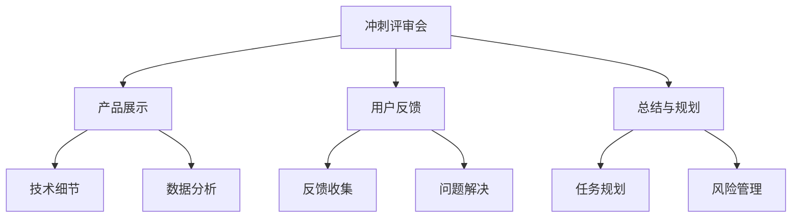

                 

# 《敏捷中的冲刺评审会：展示LLM应用进展》

> 关键词：敏捷开发，冲刺评审会，LLM应用，团队沟通，持续迭代

> 摘要：本文将深入探讨敏捷开发中的冲刺评审会，特别是如何有效地展示大型语言模型（LLM）的应用进展。我们将从背景介绍、核心概念、敏捷开发概述、冲刺评审会的目标与作用、准备与实施、成功案例分享以及总结与展望等多个方面进行详细分析，帮助读者理解并掌握冲刺评审会的关键要素和实践技巧。

## 目录大纲

1. **背景介绍**
   - **第1章 问题背景**
     - **1.1.1 问题定义**
     - **1.1.2 问题描述**
     - **1.1.3 问题解决**
     - **1.1.4 边界与外延**
   - **第2章 核心概念与联系**
     - **2.1 核心概念原理**
       - **2.1.1 定义**
       - **2.1.2 属性特征对比**
     - **2.2 ER实体关系图架构**

2. **敏捷冲刺评审会**
   - **第3章 敏捷开发概述**
     - **3.1 敏捷开发的起源与发展**
       - **3.1.1 敏捷开发的起源**
       - **3.1.2 敏捷开发的理念**
       - **3.1.3 敏捷开发与传统开发方法的区别**
     - **3.2 敏捷开发的核心原则**
       - **3.2.1 客户价值优先**
       - **3.2.2 团队合作**
       - **3.2.3 响应变化**
     - **3.3 敏捷开发的主要实践**
       - **3.3.1 Sprint规划**
       - **3.3.2 Daily Stand-up**
       - **3.3.3 Sprint Review**
       - **3.3.4 Sprint Retrospective**
   - **第4章 冲刺评审会的目标与作用**
     - **4.1 冲刺评审会的目标**
       - **4.1.1 审视已完成的冲刺工作**
       - **4.1.2 收集反馈以改进过程**
       - **4.1.3 展示交付成果**
     - **4.2 冲刺评审会的作用**
       - **4.2.1 促进团队沟通**
       - **4.2.2 提高产品交付质量**
       - **4.2.3 持续迭代优化**
   - **第5章 冲刺评审会的准备**
     - **5.1 确定评审会的时间与地点**
       - **5.1.1 时间的确定**
       - **5.1.2 地点的选择**
     - **5.2 准备展示材料**
       - **5.2.1 产品展示**
       - **5.2.2 数据分析**
       - **5.2.3 反馈收集**
   - **第6章 冲刺评审会的实施**
     - **6.1 评审会的流程**
       - **6.1.1 开场**
       - **6.1.2 产品展示**
       - **6.1.3 用户反馈**
       - **6.1.4 总结与规划**
     - **6.2 面临的挑战与应对策略**
       - **6.2.1 沟通障碍**
       - **6.2.2 时间管理**
       - **6.2.3 反馈收集与处理**
   - **第7章 成功案例分享**
     - **7.1 案例一：某互联网公司的冲刺评审会实践**
       - **7.1.1 案例背景**
       - **7.1.2 案例实施**
       - **7.1.3 案例效果**
     - **7.2 案例二：某传统企业的冲刺评审会改进**
       - **7.2.1 案例背景**
       - **7.2.2 案例实施**
       - **7.2.3 案例效果**
   - **第8章 总结与展望**
     - **8.1 总结**
       - **8.1.1 敏捷冲刺评审会的核心要点**
       - **8.1.2 评审会的常见问题与解决策略**
     - **8.2 展望**
       - **8.2.1 敏捷开发在未来的发展趋势**
       - **8.2.2 冲刺评审会的改进方向**

## 背景介绍

### 第1章 问题背景

#### 1.1.1 问题定义

在当今快速变化的市场环境中，软件开发项目的成功越来越依赖于敏捷开发方法。敏捷开发强调快速迭代、持续交付和客户反馈。而冲刺评审会作为敏捷开发中的一个关键环节，对于项目进展的展示和反馈收集起到了至关重要的作用。然而，随着技术复杂度的增加，尤其是在涉及大型语言模型（LLM）等前沿技术时，如何有效地在冲刺评审会上展示应用进展，成为了一个亟待解决的问题。

#### 1.1.2 问题描述

问题描述主要集中在以下几个方面：

1. **展示内容不充分**：在冲刺评审会上，团队往往需要展示大量的技术细节和应用进展，但时间有限，如何确保展示内容的全面性和准确性，成为一大挑战。
2. **沟通障碍**：评审会上涉及的人员较多，包括开发人员、产品负责人、客户代表等，不同角色之间的沟通可能存在障碍，影响评审效果。
3. **反馈收集困难**：有效的反馈是改进产品的重要依据，但在实践中，如何确保收集到的反馈具有针对性和建设性，是一个难点。

#### 1.1.3 问题解决

为了解决上述问题，我们需要从以下几个方面入手：

1. **充分准备展示材料**：提前梳理和整理展示内容，确保每个环节都有详细的数据和分析。
2. **优化沟通流程**：通过明确的角色分工和沟通机制，确保每个参与者都能有效表达自己的观点和需求。
3. **建立反馈机制**：设计合理的反馈收集工具和流程，确保反馈的及时性和有效性。

#### 1.1.4 边界与外延

边界方面，我们需要明确冲刺评审会的范围和目标，避免与日常开发活动或回顾会议混淆。外延方面，需要考虑与产品负责人、客户代表等其他相关角色的协作，确保评审会的顺利进行。

### 第2章 核心概念与联系

#### 2.1 核心概念原理

**2.1.1 定义**

冲刺评审会（Sprint Review）是敏捷开发中的一项关键活动，通常在每一个冲刺周期结束时进行。它的主要目的是展示团队在当前周期内完成的交付成果，收集客户的反馈，并规划下一个周期的任务。

**2.1.2 属性特征对比**

| 特征          | 解释                                                         |
| ------------- | ------------------------------------------------------------ |
| **目标**      | 审视已完成的冲刺工作，收集反馈以改进过程，展示交付成果         |
| **参与者**    | 开发团队、产品负责人、客户代表、Scrum Master等               |
| **时间**      | 通常持续1-2天，具体时间根据团队规模和项目复杂度进行调整       |
| **内容**      | 产品展示、用户反馈、总结与规划                               |
| **关键要素**  | 精心准备的展示材料、高效的沟通、有效的反馈收集和处理           |

#### 2.2 ER实体关系图架构

通过上述ER实体关系图，我们可以清晰地看到冲刺评审会各个部分之间的联系和互动，这有助于我们更好地理解和实施这一关键活动。

## 敏捷冲刺评审会

### 第3章 敏捷开发概述

#### 3.1 敏捷开发的起源与发展

**3.1.1 敏捷开发的起源**

敏捷开发最早可以追溯到20世纪90年代末期，当时软件行业的传统瀑布模型开发方法暴露出许多问题，如项目延期、成本超支和客户需求变化难以应对等。为了解决这些问题，一些开发者和顾问开始探索更加灵活和响应迅速的开发方法，这最终催生了敏捷开发。

**3.1.2 敏捷开发的理念**

敏捷开发的核心理念包括：

- **客户价值优先**：始终将客户需求放在首位，确保交付的产品能够真正满足客户需求。
- **团队合作**：鼓励跨职能团队协作，共同完成项目。
- **响应变化**：拥抱变化，灵活调整计划和策略，以应对市场和技术环境的变化。

**3.1.3 敏捷开发与传统开发方法的区别**

与传统开发方法（如瀑布模型）相比，敏捷开发具有以下显著区别：

- **迭代和增量开发**：敏捷开发采用短周期迭代的方式，逐步交付可用的软件版本。
- **频繁客户互动**：通过定期的客户反馈和评审，确保项目方向和成果符合客户期望。
- **灵活的计划**：敏捷开发允许项目计划在执行过程中进行灵活调整，以适应不断变化的需求。
- **团队自组织**：敏捷开发强调团队成员的自组织和自我管理能力，以提升团队效率和创新能力。

#### 3.2 敏捷开发的核心原则

**3.2.1 客户价值优先**

敏捷开发的一个核心理念是始终将客户价值放在首位。这意味着团队需要紧密关注客户需求，确保每一项工作和交付成果都真正为客户带来价值。

**3.2.2 团队合作**

敏捷开发强调团队合作的重要性。通过跨职能团队的合作，可以更有效地解决问题、提高开发效率，并确保项目目标的实现。

**3.2.3 响应变化**

敏捷开发鼓励团队在面对变化时保持灵活性。通过短周期迭代和持续交付，团队能够快速响应市场需求和技术变化，从而提高项目的成功率和客户满意度。

#### 3.3 敏捷开发的主要实践

**3.3.1 Sprint规划**

Sprint规划是敏捷开发中的一项重要活动，通常在每一个冲刺周期开始时进行。在这个阶段，团队会确定目标、规划任务、分配资源，并为接下来的工作做好准备。

**3.3.2 Daily Stand-up**

Daily Stand-up（每日站立会议）是敏捷开发中的一种常见实践，通常持续15分钟。在这个会议上，团队成员会分享当前的工作进展、遇到的问题以及需要协作的事项，以确保团队整体进展的一致性。

**3.3.3 Sprint Review**

Sprint Review是敏捷开发中的一项关键活动，通常在每一个冲刺周期结束时进行。在这个阶段，团队会展示已完成的交付成果，收集客户的反馈，并讨论如何改进下一个周期的计划。

**3.3.4 Sprint Retrospective**

Sprint Retrospective（冲刺回顾）是敏捷开发中的一项反思活动，通常在Sprint Review之后进行。在这个阶段，团队会讨论本次冲刺过程中的成功和挑战，并提出改进建议，以确保项目不断进步。

### 第4章 冲刺评审会的目标与作用

#### 4.1 冲刺评审会的目标

**4.1.1 审视已完成的冲刺工作**

冲刺评审会的主要目标是审视团队在当前冲刺周期内完成的各项工作。通过展示和讨论，确保所有交付成果符合预期，并了解团队在实现目标过程中的表现。

**4.1.2 收集反馈以改进过程**

冲刺评审会为团队提供了一个收集客户和用户反馈的宝贵机会。这些反馈可以帮助团队了解产品的优势和不足，从而在下一个周期中进行针对性的改进。

**4.1.3 展示交付成果**

通过冲刺评审会，团队可以向所有相关方展示已完成的交付成果。这不仅有助于提高团队的信心和士气，还可以增强客户和用户的信任和满意度。

#### 4.2 冲刺评审会的作用

**4.2.1 促进团队沟通**

冲刺评审会提供了一个团队成员之间进行有效沟通的平台。通过共同展示和讨论项目进展，团队成员可以更好地理解彼此的工作内容和需求，从而提高团队协作效率。

**4.2.2 提高产品交付质量**

通过冲刺评审会，团队可以及时发现和解决潜在的问题和风险，确保交付产品的质量达到预期。这有助于提高客户满意度，降低项目风险。

**4.2.3 持续迭代优化**

冲刺评审会为团队提供了一个不断迭代和优化的机会。通过定期审视和改进项目过程，团队可以逐步提升项目管理和交付能力，实现持续进步。

### 第5章 冲刺评审会的准备

#### 5.1 确定评审会的时间与地点

**5.1.1 时间的确定**

确定冲刺评审会的时间至关重要。通常，评审会会在每个冲刺周期结束时进行，持续1-2天。为了保证评审会的顺利进行，应提前安排好时间，并通知所有相关方。

**5.1.2 地点的选择**

选择合适的地点也是冲刺评审会准备工作中的一项重要内容。地点应具备以下条件：

- **充足的空间**：确保所有参与人员有足够的空间进行展示和讨论。
- **良好的设备**：提供高质量的投影仪、音响系统等设备，以确保展示效果。
- **舒适的环境**：确保会议环境的舒适度，以提高参与者的专注力和参与度。

#### 5.2 准备展示材料

**5.2.1 产品展示**

在冲刺评审会上，团队需要准备详细的产品展示材料。这包括：

- **功能演示**：展示产品的核心功能和用户体验。
- **数据指标**：提供相关数据指标，如用户数量、使用时长、转化率等，以支持展示成果的准确性。
- **问题与解决方案**：讨论在开发过程中遇到的问题以及解决方案，以展示团队的应对能力。

**5.2.2 数据分析**

数据分析是冲刺评审会的重要内容之一。团队需要准备详细的数据分析报告，包括：

- **用户行为分析**：分析用户在产品上的行为和偏好，以了解产品的受欢迎程度和改进方向。
- **性能指标**：分析产品的性能指标，如响应时间、稳定性等，以确保产品的质量和稳定性。
- **市场趋势**：分析市场趋势和竞争对手情况，以指导产品的后续开发和优化。

**5.2.3 反馈收集**

在冲刺评审会上，团队需要准备一系列反馈收集工具和流程，以确保反馈的及时性和有效性。这包括：

- **问卷调查**：设计简明扼要的问卷调查，收集用户对产品的意见和建议。
- **现场反馈**：设置专门的反馈环节，邀请用户和客户代表现场提出意见和建议。
- **反馈记录**：指定专人负责记录反馈内容，确保反馈的完整性和准确性。

### 第6章 冲刺评审会的实施

#### 6.1 评审会的流程

**6.1.1 开场**

冲刺评审会的开场通常由Scrum Master或项目经理主持。在开场阶段，主持人会简要介绍评审会的目的、议程和时间安排，以确保所有参与者都对评审会的流程和目标有清晰的认识。

**6.1.2 产品展示**

产品展示是冲刺评审会的核心环节之一。团队需要按照事先准备好的展示材料，向所有参与者展示产品的功能、性能和用户体验。在展示过程中，可以结合实际操作、视频演示和数据指标等手段，以增强展示效果。

**6.1.3 用户反馈**

在产品展示结束后，团队会邀请用户和客户代表就展示内容提出意见和建议。这一环节至关重要，因为用户的反馈可以帮助团队了解产品的实际效果和市场反应，从而指导后续的开发和优化。

**6.1.4 总结与规划**

在用户反馈环节结束后，团队会进行总结和规划。Scrum Master或项目经理会汇总用户反馈，提出改进建议，并讨论下一个周期的计划和任务。通过总结和规划，团队可以确保在下一个冲刺周期中更好地实现项目目标。

#### 6.2 面临的挑战与应对策略

**6.2.1 沟通障碍**

沟通障碍是冲刺评审会中常见的问题之一。为了克服沟通障碍，团队可以采取以下策略：

- **明确沟通目标**：在评审会前明确沟通的目标和内容，确保所有参与者都对讨论的主题有清晰的认识。
- **建立沟通机制**：设计合理的沟通机制，如现场反馈、问卷调查等，以方便用户和客户代表提出意见和建议。
- **提高沟通技巧**：加强团队成员的沟通技巧培训，提高沟通的效率和效果。

**6.2.2 时间管理**

时间管理是冲刺评审会的另一个重要挑战。为了确保评审会的顺利进行，团队可以采取以下策略：

- **制定详细的议程**：在评审会前制定详细的议程，明确每个环节的时间分配，以确保评审会按计划进行。
- **严格控制时间**：在评审会上严格控制时间，确保每个环节都有充足的时间进行讨论和反馈。
- **提前安排**：提前安排好评审会的地点、设备和材料，以减少不必要的时间浪费。

**6.2.3 反馈收集与处理**

有效的反馈收集和处理是冲刺评审会成功的关键。为了实现这一目标，团队可以采取以下策略：

- **设计反馈工具**：设计简明扼要的反馈工具，如问卷调查、现场反馈等，以方便用户和客户代表提出意见和建议。
- **及时处理反馈**：在收到反馈后，团队应尽快进行处理和回应，以确保反馈的及时性和有效性。
- **反馈记录与跟进**：指定专人负责记录和跟进反馈，确保所有反馈都能得到妥善处理和跟进。

### 第7章 成功案例分享

#### 7.1 案例一：某互联网公司的冲刺评审会实践

**7.1.1 案例背景**

某互联网公司是一家专注于在线教育平台的企业，其产品是一款在线学习工具。随着公司的发展，产品功能不断丰富，用户数量也不断增加，这使得冲刺评审会在项目管理和交付中变得尤为重要。

**7.1.2 案例实施**

在每次冲刺周期结束后，该公司都会按照以下步骤进行冲刺评审会：

1. **产品展示**：团队会准备详细的产品展示材料，包括功能演示、数据指标和问题与解决方案等，向所有参与者展示产品的进展和成果。
2. **用户反馈**：公司邀请用户和客户代表参与评审会，并设置专门的反馈环节，收集用户对产品的意见和建议。
3. **总结与规划**：在用户反馈环节结束后，团队会汇总反馈，提出改进建议，并讨论下一个周期的计划和任务。

**7.1.3 案例效果**

通过实施有效的冲刺评审会，该公司取得了以下效果：

- **提高产品质量**：通过用户的反馈和意见，团队能够及时发现和解决产品中的问题，确保产品质量达到预期。
- **增强客户满意度**：用户参与评审会，提出实际需求和意见，有助于提高客户满意度和忠诚度。
- **提升团队协作效率**：通过定期的评审会，团队成员能够更好地了解彼此的工作进展和需求，提高协作效率。

#### 7.2 案例二：某传统企业的冲刺评审会改进

**7.2.1 案例背景**

某传统企业是一家制造型企业，其产品生命周期较长，技术更新换代缓慢。在引入敏捷开发方法后，该公司开始探索如何有效地实施冲刺评审会，以提高项目管理和交付效率。

**7.2.2 案例实施**

在实施冲刺评审会的过程中，该公司采取了以下措施：

1. **明确评审目标**：在每次冲刺周期开始前，团队会明确评审的目标和内容，确保评审会有针对性地进行。
2. **优化展示材料**：团队会提前准备详细的产品展示材料，包括功能演示、数据指标和问题与解决方案等，以提高展示效果。
3. **加强沟通与协作**：公司加强团队成员之间的沟通和协作，确保在评审会上能够高效地展示和讨论项目进展。

**7.2.3 案例效果**

通过改进冲刺评审会，该公司取得了以下效果：

- **提高项目进度**：通过明确的评审目标和高效的展示材料，团队能够更好地掌握项目进度，确保项目按计划进行。
- **增强团队凝聚力**：通过定期的评审会，团队成员能够更好地了解彼此的工作进展和需求，增强团队凝聚力和协作精神。
- **提升客户满意度**：用户参与评审会，提出实际需求和意见，有助于提高客户满意度和忠诚度。

### 第8章 总结与展望

#### 8.1 总结

通过本文的讨论，我们深入探讨了敏捷开发中的冲刺评审会，特别是如何有效地展示LLM应用进展。以下是本文的主要结论：

- **核心概念与联系**：冲刺评审会是敏捷开发中的一项关键活动，其主要目标是审视已完成的冲刺工作，收集反馈以改进过程，展示交付成果。
- **敏捷开发概述**：敏捷开发强调客户价值优先、团队合作和响应变化，与传统开发方法相比具有明显的优势。
- **冲刺评审会的目标与作用**：冲刺评审会旨在促进团队沟通、提高产品交付质量和持续迭代优化。
- **准备与实施**：冲刺评审会的成功实施需要充分的准备和合理的流程管理。
- **成功案例分享**：通过实际案例，我们看到了冲刺评审会在不同企业中的应用效果和优势。

#### 8.2 展望

展望未来，敏捷开发将继续在软件行业中占据重要地位，特别是在涉及复杂技术领域时，如LLM应用。以下是对未来发展的展望：

- **持续优化与改进**：随着敏捷开发的实践不断深入，团队将不断优化和改进评审会流程，以适应不断变化的需求和技术环境。
- **技术创新与应用**：新兴技术的应用将进一步提升敏捷开发的效果，如人工智能、区块链等，为团队提供更强大的工具和手段。
- **跨领域融合**：敏捷开发将与其他领域（如项目管理、产品设计等）进一步融合，形成更加系统化的开发方法，提高项目成功率。

通过不断探索和实践，敏捷开发将继续为软件行业带来更多的价值和机遇。我们期待看到更多成功的敏捷实践案例，为行业的发展贡献力量。

## 附录

### 附录A：常用术语解释

- **敏捷开发（Agile Development）**：一种以快速响应变化和客户需求为核心的开发方法，强调迭代、增量交付和团队协作。
- **冲刺（Sprint）**：敏捷开发中的一个时间周期，通常持续2-4周，用于完成特定的任务和目标。
- **产品负责人（Product Owner）**：负责定义产品需求和优先级的人员，通常代表客户和用户的利益。
- **Scrum Master**：负责确保团队遵循敏捷开发原则和方法，协助团队解决障碍，提高开发效率。

### 附录B：参考资料

- 《Scrum 敏捷开发教程》
- 《敏捷冲刺评审会实践指南》
- 《敏捷方法：实践指南》
- 《用户故事地图》

### 附录C：相关工具推荐

- **Jira**：一款广泛使用的敏捷项目管理工具，提供任务跟踪、敏捷看板等功能。
- **Trello**：一款基于看板的任务管理工具，适用于小型团队和项目。
- **Confluence**：一款协作平台，用于文档编写、知识共享和项目管理。
- **Zoom**：一款视频会议和协作工具，适用于远程团队和在线会议。
- **Slack**：一款团队沟通和协作工具，提供实时聊天、通知和文件共享功能。

### 附录D：拓展阅读

- 《敏捷冲刺评审会的实战技巧》
- 《如何进行有效的冲刺评审会》
- 《敏捷开发中的用户反馈收集与处理》
- 《敏捷实践指南》
- 《敏捷团队协作之道》

### 结束语

本文深入探讨了敏捷开发中的冲刺评审会，从背景介绍、核心概念、敏捷开发概述、冲刺评审会的目标与作用、准备与实施、成功案例分享以及总结与展望等多个方面进行了详细分析。我们希望通过本文，读者能够更好地理解并掌握冲刺评审会的关键要素和实践技巧，从而在实际工作中取得更好的效果。

作者：AI天才研究院/AI Genius Institute & 禅与计算机程序设计艺术 /Zen And The Art of Computer Programming

---

通过本文，我们系统地介绍了敏捷开发中的冲刺评审会，特别是展示了如何有效地展示大型语言模型（LLM）的应用进展。从背景介绍到核心概念，再到敏捷开发的概述和冲刺评审会的目标与作用，我们逐步分析了每一个环节，并提供了实用的准备和实施策略。此外，通过成功案例的分享，我们展示了冲刺评审会在不同类型企业中的应用效果，为读者提供了实际参考。

在未来，随着技术的不断进步和市场需求的变化，敏捷开发将继续发挥重要作用。我们期待看到更多团队在实践中探索和创新，不断提高敏捷开发的效果，实现项目的成功交付。

希望本文对您在敏捷开发实践中的冲刺评审会提供了一些有价值的见解和启示。如果您有任何疑问或意见，欢迎在评论区留言，我们期待与您共同探讨和进步。再次感谢您的阅读！

作者：AI天才研究院/AI Genius Institute & 禅与计算机程序设计艺术 /Zen And The Art of Computer Programming

