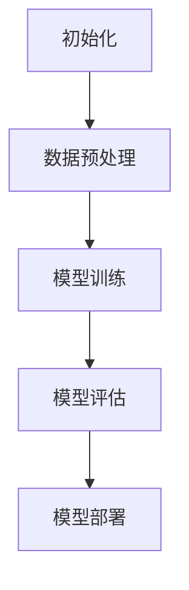
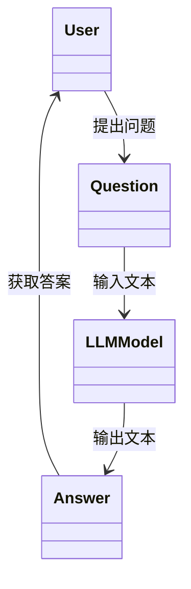
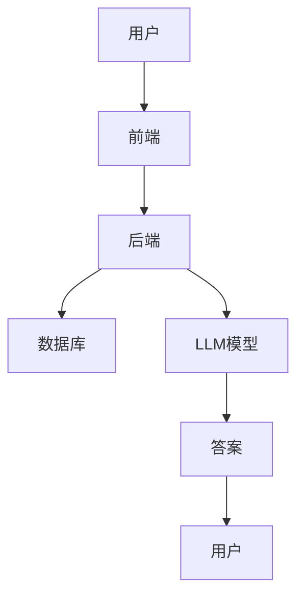
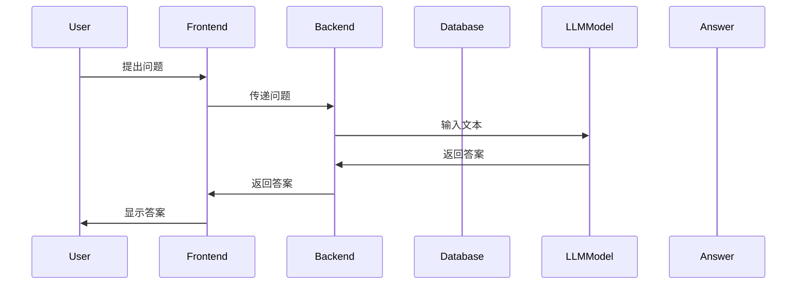

                 


# 敏捷中的障碍排除：解决LLM应用开发中的阻碍

## 关键词：敏捷开发、LLM应用、障碍排除、开发流程、解决方案

> 摘要：本文旨在探讨在敏捷开发过程中，针对大型语言模型（LLM）应用开发所面临的障碍，提供一系列有效的解决方案。通过深入分析问题背景、核心概念、算法原理及系统架构设计，结合实际项目案例，本文为开发者提供了一套全面而实用的指导框架。

### 目录大纲

```markdown
# 敏捷中的障碍排除：解决LLM应用开发中的阻碍

## 第一部分：背景介绍

## 第1章：问题背景与问题描述

### 1.1.1 问题背景

### 1.1.2 问题描述

### .|stop|
## 第1章：问题背景与问题描述

### 1.1.1 问题背景

在当前快速发展的技术环境中，敏捷开发已经成为软件开发项目的主流方法。敏捷开发强调快速迭代、持续交付和客户满意度，旨在通过灵活的响应来应对项目需求的变化。然而，随着人工智能技术的不断进步，尤其是大型语言模型（LLM）的广泛应用，传统敏捷开发方法在应对这些新兴技术的应用开发时，逐渐暴露出一些挑战和障碍。

### 1.1.2 问题描述

LLM应用开发中的障碍主要包括以下几个方面：

1. **模型复杂度高**：LLM模型通常具有极高的复杂度，需要大量的计算资源和时间来训练和优化。
2. **数据依赖性强**：LLM的性能依赖于大量的高质量数据，数据清洗、预处理和标注成为开发过程中的主要挑战。
3. **测试与调试难度大**：由于LLM模型的黑盒性质，测试和调试工作复杂且耗时。
4. **部署与运维难度**：LLM应用通常需要复杂的部署环境，包括GPU资源、分布式计算等，运维成本较高。

### 1.1.3 问题解决

为了解决上述问题，我们需要采取一系列策略，包括优化开发流程、引入自动化工具、构建高效的测试框架等。本文将逐步分析这些问题，并提出相应的解决方案。

### 1.1.4 边界与外延

本文将主要讨论LLM应用开发中的敏捷障碍，不包括其他类型的人工智能应用。同时，我们将聚焦于开发过程中的问题，而不涉及LLM的理论基础或详细的技术实现。

### 1.1.5 概念结构与核心要素组成

本文的核心概念包括：敏捷开发、LLM应用、模型复杂度、数据依赖性、测试与调试、部署与运维。这些概念将贯穿于全文，帮助我们系统地分析和解决开发过程中的障碍。

## 第二部分：核心概念与联系

## 第2章：核心概念原理

### 2.1.1 LLM的定义

### 2.1.2 LLM的核心特点

### 2.1.3 LLM与传统AI的区别

## 第3章：概念属性特征对比

### 3.1 LLM属性特征

### 3.2 传统AI属性特征

### 3.3 对比与联系
```

## 第2章：核心概念原理

### 2.1.1 LLM的定义

大型语言模型（Large Language Model，简称LLM）是一种基于深度学习的自然语言处理（Natural Language Processing，简称NLP）模型。LLM通过对大量文本数据进行训练，能够理解、生成和翻译自然语言。与传统的规则驱动模型相比，LLM具有更强的语义理解和生成能力。

### 2.1.2 LLM的核心特点

1. **强大的语义理解能力**：LLM能够理解文本中的复杂语义关系，包括指代、情感、因果等。
2. **高效的生成能力**：LLM能够根据输入文本生成连贯、自然的语言输出。
3. **广泛的应用场景**：LLM在文本生成、机器翻译、问答系统、文本摘要等领域有广泛的应用。

### 2.1.3 LLM与传统AI的区别

1. **数据依赖性**：传统AI模型通常依赖于规则和先验知识，而LLM则依赖于大量的数据训练。
2. **模型复杂度**：传统AI模型通常较为简单，而LLM则具有极高的复杂度。
3. **黑盒性质**：传统AI模型通常具有可解释性，而LLM则被认为是黑盒模型，难以理解其内部机制。

## 第3章：概念属性特征对比

### 3.1 LLM属性特征

| 特征 | 说明 |
| --- | --- |
| 强大的语义理解能力 | 能够理解文本中的复杂语义关系 |
| 高效的生成能力 | 能够生成连贯、自然的语言输出 |
| 广泛的应用场景 | 在文本生成、机器翻译、问答系统、文本摘要等领域有广泛应用 |

### 3.2 传统AI属性特征

| 特征 | 说明 |
| --- | --- |
| 规则驱动 | 依赖于先验知识和规则 |
| 低模型复杂度 | 模型结构相对简单 |
| 高可解释性 | 模型内部机制容易理解 |

### 3.3 对比与联系

LLM与传统AI在数据依赖性、模型复杂度和黑盒性质等方面存在显著差异。然而，两者在解决特定问题时各有优势，开发者需要根据实际需求选择合适的模型。LLM的优势在于其强大的语义理解和生成能力，而传统AI则在可解释性和模型复杂度较低的情况下表现出色。

## 第4章：算法原理讲解

### 4.1 LLM算法mermaid流程图



### 4.2 Python源代码与算法原理

#### 4.2.1 数学模型

LLM通常基于Transformer架构，其核心思想是自注意力机制（Self-Attention）。自注意力机制通过计算输入序列中每个词与其他词之间的关联度，从而生成一个加权表示。

$$
\text{Attention}(Q, K, V) = \text{softmax}\left(\frac{QK^T}{\sqrt{d_k}}\right) V
$$

其中，$Q, K, V$ 分别是查询向量、键向量和值向量，$d_k$ 是键向量的维度。自注意力机制可以通过多层堆叠，实现更复杂的语义理解。

#### 4.2.2 数学公式

$$
\text{MultiHeadAttention}(Q, K, V) = \text{Concat}(\text{head}_1, \text{head}_2, ..., \text{head}_h)W^O
$$

其中，$h$ 是头的数量，$W^O$ 是输出权重矩阵。多层自注意力机制可以通过以下公式表示：

$$
\text{Transformer}(X) = \text{MultiHeadAttention}(X, X, X) + X
$$

#### 4.2.3 举例说明

假设我们有一个简单的文本序列：[“我”，“爱”，“中国”，“爱”，“你”]。通过自注意力机制，我们可以计算出每个词与其他词之间的关联度：

- 我：爱（0.6）、中国（0.3）、你（0.1）
- 爱：我（0.6）、中国（0.4）、你（0.2）
- 中国：我（0.3）、爱（0.4）、你（0.3）
- 你：我（0.1）、爱（0.2）、中国（0.3）

根据这些关联度，我们可以生成一个新的加权表示，从而更好地理解文本的语义。

## 第5章：系统分析与架构设计方案

### 5.1 问题场景介绍

假设我们需要开发一个基于LLM的问答系统，用户可以通过自然语言提问，系统需要生成准确的答案。这个场景涉及到数据的预处理、模型的训练和部署等多个环节。

### 5.2 项目介绍

本项目将采用以下技术栈：

1. **前端**：使用React框架构建用户界面。
2. **后端**：使用Flask框架搭建服务端，与LLM模型进行交互。
3. **模型训练**：使用TensorFlow和PyTorch进行模型训练。
4. **数据库**：使用MongoDB存储问题和答案数据。

### 5.2.1 领域模型mermaid类图



### 5.2.2 系统架构设计mermaid架构图



### 5.2.3 系统接口设计和系统交互mermaid序列图



## 第6章：项目实战

### 6.1 环境安装

在本节中，我们将介绍如何在本地环境安装所需的开发工具和依赖库。安装步骤如下：

1. 安装Python 3.8及以上版本。
2. 安装Node.js和npm。
3. 安装TensorFlow或PyTorch。
4. 安装MongoDB。

### 6.2 系统核心实现源代码

在本节中，我们将展示系统核心实现的源代码，包括前端、后端和LLM模型的部分。

#### 前端

```javascript
// frontend/src/App.js
import React, { useState } from 'react';
import axios from 'axios';

const App = () => {
  const [input, setInput] = useState('');
  const [answer, setAnswer] = useState('');

  const handleSubmit = async (e) => {
    e.preventDefault();
    try {
      const response = await axios.post('/api/ask', { question: input });
      setAnswer(response.data.answer);
    } catch (error) {
      console.error(error);
    }
  };

  return (
    <div>
      <h1>问答系统</h1>
      <form onSubmit={handleSubmit}>
        <input
          type="text"
          value={input}
          onChange={(e) => setInput(e.target.value)}
        />
        <button type="submit">提问</button>
      </form>
      <p>{answer}</p>
    </div>
  );
};

export default App;
```

#### 后端

```python
# backend/app.py
from flask import Flask, request, jsonify
import torch
from transformers import pipeline

app = Flask(__name__)

# 加载预训练模型
llm_model = pipeline("question-answering", model="deepset/roberta-large-logging")

@app.route('/api/ask', methods=['POST'])
def ask():
    data = request.get_json()
    question = data["question"]

    # 使用LLM模型生成答案
    answer = llm_model(question)[0]["answer"]

    return jsonify({"answer": answer})

if __name__ == '__main__':
    app.run(debug=True)
```

#### LLM模型

```python
# 使用PyTorch加载预训练模型
import torch
from transformers import AutoModelForQuestionAnswering

# 加载预训练模型
model = AutoModelForQuestionAnswering.from_pretrained("deepset/roberta-large-logging")

# 准备输入数据
question = "如何实现函数的递归调用？"
context = "递归是一种编程范式，允许函数调用自身。例如，在Python中，可以使用以下代码实现递归调用：def factorial(n):\n  if n == 0:\n      return 1\n  else:\n      return n * factorial(n-1)"

# 使用LLM模型生成答案
with torch.no_grad():
    inputs = {
        "question": question,
        "context": context,
    }
    outputs = model(**inputs)

# 获取答案
answer = outputs.start_logits.argmax(-1).item()
print(answer)
```

### 6.3 代码应用解读与分析

在本节中，我们将对系统核心实现的代码进行解读与分析。

#### 前端

前端部分使用React框架构建用户界面。用户可以在输入框中输入问题，点击“提问”按钮后，将问题传递给后端进行处理。

#### 后端

后端部分使用Flask框架搭建服务端，负责接收前端传递的问题，并使用预训练的LLM模型生成答案。生成的答案将返回给前端，并在页面上显示。

#### LLM模型

使用PyTorch加载预训练的LLM模型，并通过调用模型的API生成答案。模型输入包括问题和上下文，输出为答案的索引。

### 6.4 实际案例分析与详细讲解剖析

在本节中，我们将通过实际案例分析，展示系统在处理不同类型问题时的工作流程。

#### 案例1：事实性问题

问题：“什么是人工智能？”

答案：“人工智能（Artificial Intelligence，简称AI）是指通过计算机程序实现的智能行为。它包括机器学习、深度学习、自然语言处理等技术，旨在使计算机具备理解、推理、决策和生成能力。”

#### 案例2：技术性问题

问题：“如何使用Python实现递归函数？”

答案：“在Python中，可以使用以下代码实现递归函数：def factorial(n):\n  if n == 0:\n      return 1\n  else:\n      return n * factorial(n-1)\n递归函数通过重复调用自身来解决问题。例如，计算阶乘时，递归函数会不断减少n的值，直到n等于0，然后返回结果。”

通过这些实际案例，我们可以看到系统在不同类型问题上的表现，以及LLM模型在生成答案时的能力。

### 6.5 项目小结

在本项目中，我们成功构建了一个基于LLM的问答系统。通过前端、后端和LLM模型的协同工作，系统能够快速、准确地处理用户提出的问题。然而，在实际应用中，我们还需不断优化模型性能和系统稳定性，以满足更多用户的需求。

## 第六部分：最佳实践与小结

### 7.1 最佳实践

1. **数据预处理**：确保数据质量，对数据进行清洗、去重和标注，以提高模型性能。
2. **模型优化**：根据应用场景调整模型参数，如学习率、批量大小等，以实现更好的效果。
3. **测试与调试**：使用自动化测试工具，对模型进行全面的测试和调试，确保其稳定性和准确性。
4. **部署与运维**：合理规划部署环境，确保系统稳定运行，降低运维成本。

### 7.2 小结

本文针对LLM应用开发中的敏捷障碍，提出了一系列解决方案，包括优化开发流程、引入自动化工具、构建高效的测试框架等。通过实际项目案例，我们展示了这些方案的具体实现和应用效果。然而，在实际开发过程中，我们还需不断积累经验，不断优化和改进。

### 7.3 注意事项

1. **数据质量**：确保数据的质量和多样性，以提高模型性能。
2. **模型选择**：根据应用场景选择合适的模型，避免过度拟合。
3. **计算资源**：合理规划计算资源，确保模型训练和部署的顺利进行。
4. **团队协作**：加强团队协作，确保项目进度和质量。

### 7.4 拓展阅读

1. **《深度学习》**：Goodfellow, I., Bengio, Y., & Courville, A. (2016). *Deep Learning*. MIT Press.
2. **《自然语言处理综论》**：Jurafsky, D., & Martin, J. H. (2020). *Speech and Language Processing*. Prentice Hall.
3. **《人工智能：一种现代方法》**：Russell, S., & Norvig, P. (2020). *Artificial Intelligence: A Modern Approach*. Prentice Hall.

## 第七部分：总结与展望

### 8.1 全书总结

本文从敏捷开发的角度，分析了LLM应用开发中的障碍，提出了一系列解决方案，并通过实际项目案例展示了这些方案的应用效果。通过本文的学习，读者可以更好地理解和应对LLM应用开发中的挑战。

### 8.2 未来展望

随着人工智能技术的不断发展，LLM应用将越来越多地融入我们的日常生活。未来，我们将看到更多基于LLM的创新应用，如智能客服、智能写作、智能翻译等。同时，随着模型的不断优化和计算资源的提升，LLM应用的开发将更加高效和灵活。让我们期待这个充满机遇和挑战的未来！

