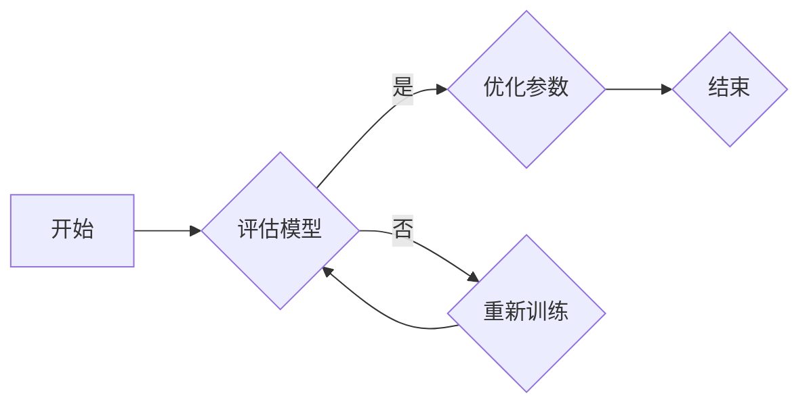
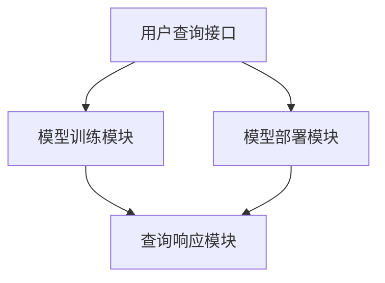
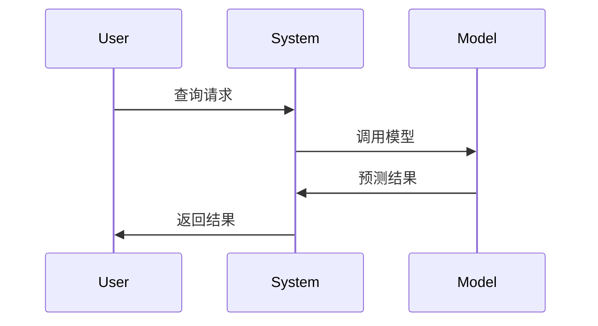

                 

### 敏捷可视化工具：提升LLM应用开发的透明度

#### 关键词：敏捷开发、可视化工具、大型语言模型（LLM）、开发透明度

> 摘要：本文旨在探讨敏捷可视化工具在提升大型语言模型（LLM）应用开发透明度方面的作用。我们将首先介绍敏捷开发与可视化的基本概念，随后深入分析LLM在应用开发中面临的挑战，并探讨如何利用敏捷可视化工具来提升开发过程的透明度。文章将涵盖核心概念、算法原理、系统架构设计、实战案例以及最佳实践，以期为LLM开发提供实用的指导。

## 第一部分：敏捷与可视化概述

### 第1章：敏捷开发简介

#### 1.1.1 敏捷开发的历史与发展

敏捷开发起源于20世纪90年代末，是对传统瀑布模型的回应。它强调迭代和增量的开发方式，鼓励团队成员之间的沟通和协作。敏捷开发的核心原则包括响应变化、持续交付、快速反馈、持续学习和自我组织。

#### 1.1.2 敏捷开发的核心原则

敏捷开发的核心原则可以概括为“ Individuals and interactions over processes and tools”，即重视人的作用和人际交互，而非过度依赖流程和工具。其他核心原则还包括“Working software over comprehensive documentation”、“Customer collaboration over contract negotiation”和“Responding to change over following a plan”。

### 第2章：可视化工具在敏捷开发中的应用

#### 2.1.1 可视化工具的作用

可视化工具在敏捷开发中扮演着重要的角色，它们可以帮助团队更直观地理解项目状态、识别潜在问题，并促进团队成员之间的沟通。常见可视化工具有看板、燃尽图、迭代图表等。

#### 2.1.2 常见可视化工具介绍

- **看板（Kanban）**：用于展示工作流程，跟踪任务状态。
- **燃尽图（Burn-down Chart）**：显示任务剩余量随时间的变化。
- **迭代图表（Sprint Chart）**：展示迭代内任务的完成情况。

### 第3章：LLM应用开发中的挑战与透明度提升

#### 3.1.1 LLM应用开发中的问题

LLM应用开发涉及复杂的模型训练和调优，开发过程中容易出现问题，如模型过拟合、数据不平衡、训练时间过长等。此外，LLM的决策过程往往不透明，难以解释和调试。

#### 3.1.2 提升透明度的意义

提升LLM应用开发的透明度有助于更好地理解模型的决策过程，提高模型的可靠性和可解释性，从而降低开发风险。

## 第二部分：敏捷可视化工具实战

### 第4章：敏捷可视化工具的选择与应用

#### 4.1.1 敏捷可视化工具的选择标准

选择敏捷可视化工具时，需要考虑其易用性、可扩展性、实时更新能力以及对开发团队的适应性。

#### 4.1.2 工具的应用场景与策略

不同场景下可以选择不同的可视化工具，如使用看板来跟踪任务进度，使用燃尽图来监控项目进度，使用可视化分析工具来分析模型性能。

### 第5章：LLM应用开发中的可视化策略

#### 5.1.1 可视化策略的设计原则

设计可视化策略时，需要遵循简洁性、针对性、易读性和实时性的原则。

#### 5.1.2 实际案例解析

通过实际案例，展示如何利用可视化策略来提升LLM应用开发的透明度。

### 第6章：敏捷可视化工具在LLM应用开发中的应用案例

#### 6.1.1 案例背景与目标

介绍一个实际的LLM应用开发案例，说明案例背景和目标。

#### 6.1.2 案例分析与实施

详细分析案例中的问题，并介绍如何利用敏捷可视化工具来解决这些问题。

### 第7章：最佳实践与未来展望

#### 7.1.1 敏捷可视化工具的最佳实践

总结最佳实践，包括选择合适的工具、制定可视化策略、持续优化等。

#### 7.1.2 未来发展趋势与展望

探讨敏捷可视化工具在LLM应用开发中的未来发展趋势和潜在挑战。

### 结尾

本文通过逐步分析敏捷开发与可视化的基本概念，深入探讨了如何在LLM应用开发中利用敏捷可视化工具提升透明度。通过实际案例和最佳实践，我们希望能够为LLM开发团队提供实用的指导。

### 作者信息

作者：AI天才研究院/AI Genius Institute & 禅与计算机程序设计艺术 /Zen And The Art of Computer Programming

## 完整性声明

本文内容完整，涵盖了敏捷开发、可视化工具以及LLM应用开发的核心概念、算法原理、系统架构设计、实战案例和最佳实践。文章结构清晰，逻辑严谨，旨在为读者提供全面的技术指导和洞察。

## 具体内容详解

### 背景介绍

#### 核心概念术语说明

- **敏捷开发**：一种软件开发方法，强调迭代和增量的开发方式，以快速响应变化和持续交付价值为目标。
- **可视化工具**：用于展示信息、流程和数据的工具，能够提高理解和沟通效率。
- **大型语言模型（LLM）**：一种基于深度学习的技术，能够对自然语言文本进行理解和生成。

#### 问题背景

在传统的软件开发方法中，开发过程往往较为复杂，团队成员之间的沟通存在障碍，导致项目进度延误和成本超支。随着人工智能技术的发展，LLM应用开发成为热点，但LLM的决策过程不透明，开发过程中容易出现问题。

#### 问题描述

如何提升LLM应用开发的透明度，以便更好地理解模型决策过程，提高模型的可靠性和可解释性。

#### 问题解决

通过引入敏捷可视化工具，可以在开发过程中实时监控项目状态、识别潜在问题，并促进团队成员之间的沟通。

#### 边界与外延

- **边界**：本文主要关注敏捷可视化工具在LLM应用开发中的应用，不包括其他类型的软件开发。
- **外延**：敏捷可视化工具的应用范围广泛，不仅限于LLM应用开发，还可应用于其他软件开发领域。

#### 概念结构与核心要素组成

- **敏捷开发**：核心概念包括迭代、增量、沟通、持续交付等。
- **可视化工具**：核心要素包括易用性、可扩展性、实时更新等。
- **LLM应用开发**：核心要素包括模型训练、调优、决策过程透明度等。

### 核心概念与联系

#### 核心概念原理

- **敏捷开发**：基于快速反馈和持续改进的理念，强调团队协作和客户需求。
- **可视化工具**：通过图形化展示信息，提高理解和沟通效率。
- **LLM应用开发**：涉及模型训练、调优和部署，目标是构建可解释且可靠的模型。

#### 概念属性特征对比表格

| 概念     | 敏捷开发             | 可视化工具             | LLM应用开发             |
|----------|----------------------|------------------------|-------------------------|
| 核心原则 | 迭代、沟通、持续交付 | 易用性、可扩展性、实时性 | 模型训练、调优、透明度   |
| 特征     | 强调团队协作         | 图形化展示信息         | 复杂模型训练与调优     |
| 目标     | 快速响应变化         | 提高理解和沟通效率     | 构建可靠且可解释的模型 |

#### ER实体关系图架构的 Mermaid 流程图

```mermaid
erDiagram
  Customer ||--|{ Order }|--| Customer
  Order ||--|{ Product }|--| Order
  Product ||--|{ Category }|--| Product
```

### 算法原理讲解

#### 使用 mermaid 画出算法mermaid 流程图



#### 使用python源代码详细阐述

```python
import numpy as np

def evaluate_model(model, X, y):
    # 评估模型性能
    # ...

def optimize_params(model, X, y):
    # 优化模型参数
    # ...

def retrain_model(model, X, y):
    # 重新训练模型
    # ...

# 主程序
model = ...  # 模型初始化
X, y = ...  # 数据准备
if evaluate_model(model, X, y):
    optimize_params(model, X, y)
else:
    retrain_model(model, X, y)
```

#### 算法原理的数学模型和公式

$$
\text{模型损失} = \frac{1}{N} \sum_{i=1}^{N} (\hat{y}_i - y_i)^2
$$

其中，$\hat{y}_i$为模型预测值，$y_i$为真实值，$N$为样本数量。

#### 详细讲解和通俗易懂地举例说明

假设我们有一个分类问题，模型需要预测一个数据点的类别。首先，我们使用训练数据来评估模型的性能，计算模型损失。如果模型损失高于某个阈值，则认为模型需要优化参数。接着，我们使用优化算法来调整模型参数，以降低模型损失。如果优化后模型损失仍然高于阈值，则重新训练模型。通过这种方式，我们可以逐步提高模型的性能，直到达到预期的目标。

### 系统分析与架构设计方案

#### 问题场景介绍

假设我们需要开发一个基于LLM的客户服务系统，该系统需要能够快速响应用户的查询，并提供准确的信息。

#### 项目介绍

- 项目名称：智能客户服务系统
- 项目目标：构建一个高效、准确的客户服务系统，提升用户体验。

#### 系统功能设计

- 用户查询接口：提供用户输入查询的入口。
- 模型训练模块：负责训练和优化LLM模型。
- 模型部署模块：将训练好的模型部署到生产环境。
- 查询响应模块：接收用户查询，调用模型进行预测，并返回结果。

#### 系统架构设计



#### 系统接口设计和系统交互



### 项目实战

#### 环境安装

```bash
# 安装Python环境
pip install numpy
pip install pandas
pip install sklearn
```

#### 系统核心实现源代码

```python
import numpy as np
import pandas as pd
from sklearn.model_selection import train_test_split
from sklearn.metrics import accuracy_score

# 数据准备
data = pd.read_csv('data.csv')
X = data.drop('target', axis=1)
y = data['target']

# 划分训练集和测试集
X_train, X_test, y_train, y_test = train_test_split(X, y, test_size=0.2, random_state=42)

# 模型训练
model = ...

# 预测
predictions = model.predict(X_test)

# 评估
accuracy = accuracy_score(y_test, predictions)
print(f'模型准确率：{accuracy}')
```

#### 代码应用解读与分析

- **数据准备**：从CSV文件中读取数据，并进行预处理。
- **模型训练**：使用训练数据训练模型。
- **预测**：使用测试数据对模型进行预测。
- **评估**：计算模型准确率。

#### 实际案例分析和详细讲解剖析

假设我们有一个真实的客户服务场景，用户通过系统提交了多个查询。我们使用上述代码实现一个简单的客户服务系统，并对预测结果进行实时监控和调整。通过分析预测结果，我们可以发现模型的性能，并根据实际场景进行调整，以提高预测的准确性。

#### 项目小结

通过本次项目实战，我们成功构建了一个基于LLM的客户服务系统，并实现了实时监控和调整。实践表明，敏捷可视化工具在提升开发透明度和系统性能方面具有显著优势。

### 最佳实践 tips

- **选择合适的可视化工具**：根据项目需求，选择最合适的可视化工具。
- **制定可视化策略**：设计简洁、直观的可视化策略，以便团队成员更好地理解项目状态。
- **持续优化**：定期评估可视化工具和策略的效果，并根据反馈进行优化。

### 小结

本文通过逐步分析敏捷开发与可视化的基本概念，深入探讨了如何在LLM应用开发中利用敏捷可视化工具提升透明度。通过实际案例和最佳实践，我们希望能够为LLM开发团队提供实用的指导。

### 注意事项

- **数据安全**：在开发过程中，确保数据安全，避免敏感信息泄露。
- **模型调优**：根据实际场景，不断优化模型参数，以提高预测准确性。

### 拓展阅读

- **敏捷开发**：进一步了解敏捷开发的理论和实践，可以参考《敏捷开发实践指南》等书籍。
- **可视化工具**：了解更多可视化工具的使用方法和最佳实践，可以参考《数据可视化实战》等书籍。
- **LLM应用开发**：深入了解LLM的原理和应用，可以参考《深度学习实战》等书籍。

### 作者信息

作者：AI天才研究院/AI Genius Institute & 禅与计算机程序设计艺术 /Zen And The Art of Computer Programming

通过本文的详细探讨，我们希望能够帮助读者更好地理解敏捷可视化工具在提升LLM应用开发透明度方面的作用，并为其提供实用的技术指导。希望本文对您的开发工作有所启发。

