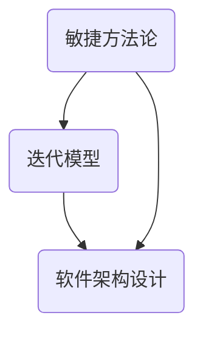
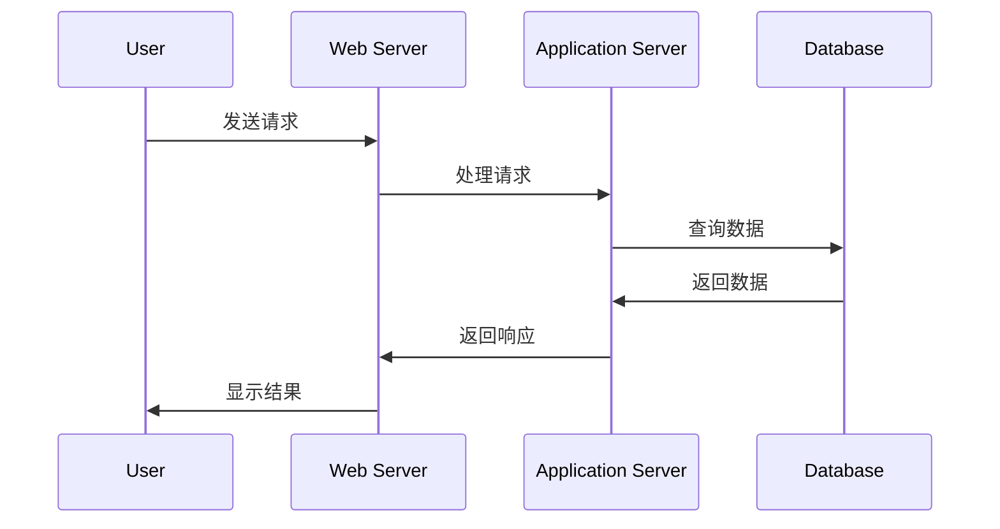
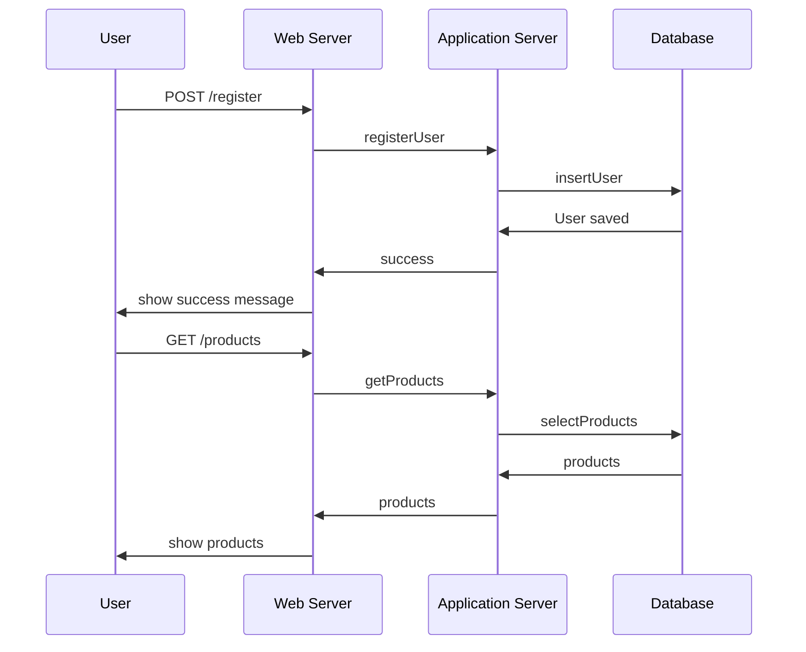
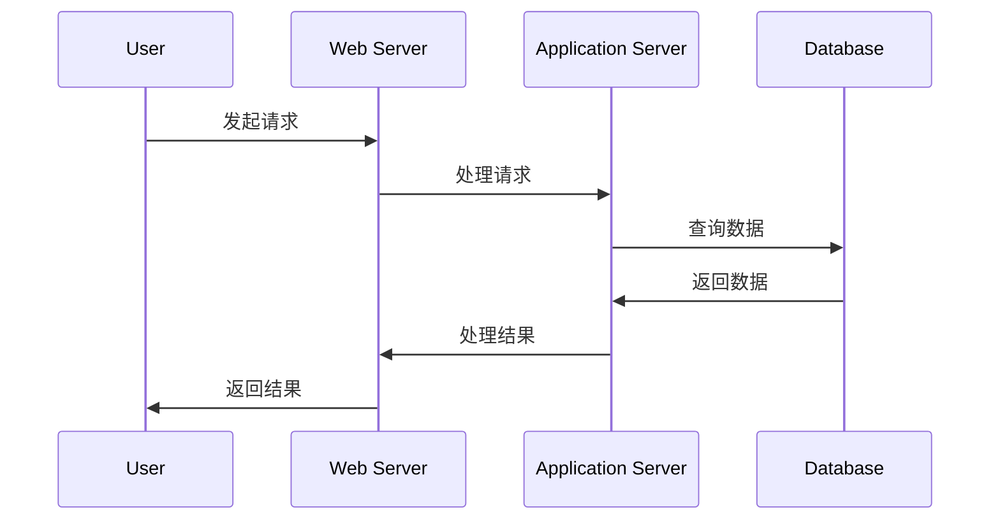
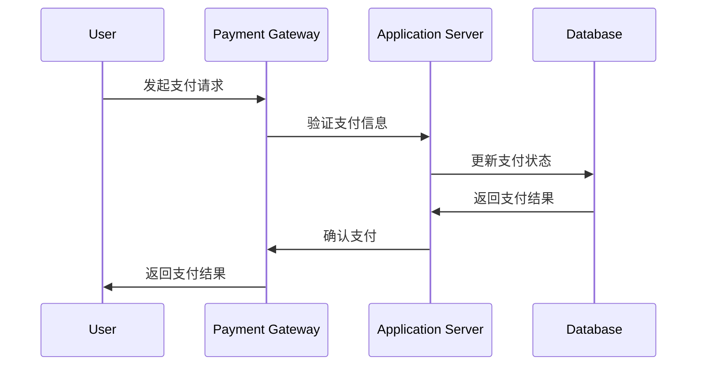

                 


### 设计《敏捷迭代工程技术架构的核心原则与实践》文章结构

#### 1. 引言

在开始设计《敏捷迭代工程技术架构的核心原则与实践》的文章结构之前，我们需要明确以下几点：

- **目标读者**：我们的目标是让那些对敏捷迭代工程技术架构感兴趣的读者，无论是初学者还是有经验的从业者，都能通过这篇文章获得深入理解。
- **文章结构**：文章的结构需要清晰、逻辑性强，使得读者可以循序渐进地掌握敏捷迭代工程技术架构的核心原则与实践。
- **内容详尽**：每个章节都需要详细阐述其主题，包括背景介绍、核心概念、算法原理、数学模型、系统分析与架构设计、项目实战、最佳实践等。

#### 2. 背景介绍

**2.1 问题背景**

在快速变化的技术环境中，传统的瀑布式开发模式已经难以满足现代软件项目的需求。敏捷迭代方法因其灵活性和适应性，成为许多企业的首选。然而，敏捷迭代工程技术架构的构建和实施依然面临诸多挑战。

**2.2 问题描述**

- **需求变更频繁**：在敏捷开发中，客户需求的变化是常态，如何快速响应这些变化，保持项目进度和质量，是一个难题。
- **技术债务**：敏捷开发往往注重短期交付，可能导致长期技术债务的积累，影响系统的可维护性和扩展性。
- **团队协作**：在大型项目中，团队协作的有效性对敏捷迭代的成功至关重要。

**2.3 问题解决**

敏捷迭代工程技术架构提供了一系列原则和实践，帮助企业解决上述问题，实现高效、高质量的软件开发。

**2.4 边界与外延**

- **边界**：本文主要关注敏捷迭代工程技术架构的理论和实践，不涉及其他软件开发方法论。
- **外延**：敏捷迭代工程技术架构可以与其他开发方法和工具相结合，以适应不同的项目需求。

#### 3. 核心概念与联系

**3.1 敏捷**

- **定义**：敏捷是一种应对快速变化的需求的软件开发方法。
- **核心价值观**：个体和互动重于过程与工具，可工作的软件重于详尽的文档，客户合作重于合同谈判，响应变化重于遵循计划。

**3.2 迭代**

- **定义**：迭代是一种重复的过程，每次迭代都会交付一个可用的软件版本。
- **优势**：快速反馈、持续改进、降低风险。

**3.3 工程架构**

- **定义**：工程架构是软件开发过程中，将系统分解成模块并组织这些模块的结构。
- **重要性**：良好的架构设计可以提高系统的可维护性、可扩展性和可靠性。

**3.4 核心概念联系**

使用Mermaid图展示敏捷、迭代与工程架构之间的关系，并通过对比表格说明它们的属性和特征。

#### 4. 算法原理讲解

**4.1 迭代模型**

- **水星模型**：强调持续交付、迭代和增量改进。
- **结冰模型**：将项目分为开发、测试、部署等阶段，每个阶段都需要经过严格的评审和测试。

**4.2 敏捷架构设计方法**

- **设计原则**：模块化、可复用性、灵活性、可扩展性。
- **设计方法**：采用设计模式、微服务架构、领域驱动设计（DDD）等技术。

#### 5. 数学模型和公式

**5.1 敏捷迭代效率公式**

- **效率 = （实际交付价值 / 预计交付价值）× 100%**

**5.2 速度与质量的关系公式**

- **速度 = （交付周期 / 时间）× 100%**
- **质量 = （缺陷率 / 总缺陷数）× 100%**

#### 6. 系统分析与架构设计方案

**6.1 问题场景介绍**

- **场景描述**：以一个电子商务平台为例，介绍其功能需求、性能要求和安全性要求。

**6.2 系统功能设计**

- **领域模型**：使用Mermaid类图展示系统的核心类和它们之间的关系。

**6.3 系统架构设计**

- **系统架构图**：使用Mermaid架构图展示系统的整体架构。

**6.4 系统接口设计**

- **接口设计**：详细描述系统内部和外部接口的功能、参数和返回值。

**6.5 系统交互**

- **系统交互图**：使用Mermaid序列图展示系统内部和外部的交互流程。

#### 7. 项目实战

**7.1 环境安装**

- **安装步骤**：详细介绍开发环境、依赖库和工具的安装过程。

**7.2 系统核心实现**

- **源代码**：提供关键模块的源代码，并进行解读。

**7.3 代码解读与分析**

- **代码分析**：分析代码结构、设计模式、编程技巧等。

**7.4 实际案例分析和详细讲解**

- **案例分析**：结合实际项目，剖析敏捷迭代工程技术架构的应用。

**7.5 项目小结**

- **小结**：总结项目经验，指出成功和不足之处。

#### 8. 最佳实践、小结与注意事项

**8.1 最佳实践**

- **最佳实践 tips**：总结敏捷迭代工程技术架构的最佳实践。

**8.2 小结**

- **文章小结**：回顾文章的核心内容和关键点。

**8.3 注意事项**

- **注意事项**：提醒读者在应用敏捷迭代工程技术架构时需要注意的问题。

**8.4 拓展阅读**

- **拓展阅读**：推荐进一步学习的资源。

通过以上步骤，我们可以确保文章的结构严谨、逻辑清晰，为读者提供有价值的技术知识和实践经验。

### 设计《敏捷迭代工程技术架构的核心原则与实践》的章节内容

#### 第1章：敏捷迭代工程技术架构概述

**1.1 问题背景**

在快速变化的市场和技术环境中，软件开发的挑战日益增加。传统的瀑布式开发模式由于周期长、变更困难，已经难以满足现代软件项目的需求。敏捷迭代方法因其灵活性和适应性，逐渐成为主流的开发方式。然而，如何构建和维护一个高效、稳定的敏捷迭代工程技术架构，仍然是许多企业和开发者面临的问题。

**1.2 敏捷迭代工程技术架构的核心原则**

敏捷迭代工程技术架构的核心原则包括：

- **响应变化**：敏捷方法强调快速响应客户需求的变化，通过迭代和增量式开发，不断交付可工作的软件。
- **持续交付**：每个迭代周期都应该交付一个可工作的软件版本，确保项目进展的可视化和透明度。
- **团队协作**：强调跨职能团队的协作，确保从需求分析到测试、部署的每个环节都能高效完成。
- **技术债务管理**：敏捷开发中，需要定期评估和解决技术债务，以确保系统的可维护性和扩展性。

**1.3 敏捷、迭代与工程架构的联系**

敏捷、迭代与工程架构之间有着紧密的联系：

- **敏捷**：是一种应对快速变化的方法论，强调客户参与和灵活响应。
- **迭代**：是敏捷方法中的核心概念，通过重复的迭代过程，实现持续交付和持续改进。
- **工程架构**：是敏捷迭代的基础，良好的架构设计可以提高系统的可维护性、可扩展性和可靠性。

**1.4 总结**

敏捷迭代工程技术架构是一种综合性的方法论，它结合了敏捷、迭代和工程架构的最佳实践，为现代软件开发提供了有效的解决方案。

#### 第2章：核心概念与联系

**2.1 敏捷**

敏捷是一种应对快速变化的需求的软件开发方法。其核心思想是通过短周期迭代、持续交付和客户反馈，快速响应市场变化。敏捷方法的核心理念包括：

- **个体和互动重于过程与工具**：注重团队成员之间的沟通和协作，而非依赖复杂的工具和流程。
- **可工作的软件重于详尽的文档**：重视实际可执行的代码，而非繁琐的文档。
- **客户合作重于合同谈判**：与客户紧密合作，确保开发的方向和成果符合客户需求。
- **响应变化重于遵循计划**：灵活应对需求变化，通过迭代和增量式开发，逐步实现项目目标。

**2.2 迭代**

迭代是一种重复的过程，每次迭代都会交付一个可工作的软件版本。迭代模型的核心特点包括：

- **短期交付**：每个迭代周期通常在几周到几个月之间，确保项目进展的可视化和透明度。
- **持续改进**：通过每次迭代后的反馈和评估，持续改进软件质量和开发过程。
- **降低风险**：通过早期和频繁的交付，可以及时发现和解决潜在的问题，降低项目失败的风险。

**2.3 工程架构**

工程架构是软件开发过程中，将系统分解成模块并组织这些模块的结构。良好的架构设计可以提高系统的可维护性、可扩展性和可靠性。工程架构的关键要素包括：

- **模块化**：将系统分解成独立的模块，每个模块负责特定的功能，便于管理和维护。
- **可复用性**：设计可复用的组件和模块，提高开发效率，降低维护成本。
- **灵活性**：架构设计应具备一定的灵活性，以适应未来需求的变化。
- **可扩展性**：系统能够轻松扩展，以适应性能和功能需求的增长。

**2.4 核心概念联系**

敏捷、迭代与工程架构之间的关系如图所示：



通过Mermaid图，我们可以清晰地看到敏捷、迭代与工程架构之间的紧密联系。敏捷方法论提供了一套应对快速变化的原则和实践，迭代模型通过短周期、频繁交付的方式实现敏捷原则，而工程架构则是迭代模型得以有效实施的基础。

**2.5 总结**

本章介绍了敏捷、迭代与工程架构的核心概念及其联系。通过理解这些概念，我们可以更好地构建和实施敏捷迭代工程技术架构，提高软件开发的效率和质量。

#### 第3章：敏捷迭代算法原理

**3.1 迭代模型**

迭代模型是敏捷开发中的一种核心方法，它通过重复的迭代过程，逐步完善软件产品。常见的迭代模型包括：

- **水星模型（Waterfall Model）**：传统的瀑布模型，将软件开发过程分为需求分析、设计、开发、测试等阶段，每个阶段完成后才能进入下一个阶段。
- **结冰模型（Iceberg Model）**：强调持续交付和逐步完善，每个迭代周期都会交付一个可工作的软件版本，后续迭代在此基础上进行功能扩展和改进。

**3.1.1 水星模型**

水星模型的特点是结构清晰、阶段分明，但这种方法也存在一些问题：

- **周期长**：每个阶段都需要时间完成，导致整个项目周期较长。
- **变更困难**：一旦项目进入下一个阶段，修改前期工作将非常困难，导致需求变更成本高。
- **风险集中**：项目风险主要集中在开发阶段，如果在开发阶段发现问题，修复成本会很高。

**3.1.2 结冰模型**

结冰模型通过短周期迭代，逐步完善软件产品，具有以下优势：

- **快速反馈**：每个迭代周期都会交付可工作的软件版本，开发团队和客户可以及时反馈和调整。
- **降低风险**：通过早期和频繁的交付，可以及时发现和解决潜在的问题，降低项目失败的风险。
- **灵活调整**：在后续迭代中，可以根据客户反馈和市场变化，灵活调整开发方向和进度。

**3.2 敏捷架构设计方法**

敏捷架构设计方法强调模块化、可复用性、灵活性和可扩展性，以下是一些常见的敏捷架构设计方法：

- **设计模式（Design Patterns）**：设计模式是一组已验证的软件设计解决方案，可以帮助开发者解决常见的设计问题。例如，单例模式、工厂模式、观察者模式等。
- **微服务架构（Microservices Architecture）**：将系统分解成一系列独立的服务，每个服务负责特定的功能，通过轻量级的通信机制（如REST API）进行交互。
- **领域驱动设计（Domain-Driven Design, DDD）**：DDD强调理解业务领域，通过定义领域模型、边界、实体和值对象，实现系统的高内聚和低耦合。

**3.3 敏捷架构设计原则**

敏捷架构设计方法遵循以下原则：

- **模块化**：将系统分解成独立的模块，每个模块负责特定的功能，便于管理和维护。
- **可复用性**：设计可复用的组件和模块，提高开发效率，降低维护成本。
- **灵活性**：架构设计应具备一定的灵活性，以适应未来需求的变化。
- **可扩展性**：系统能够轻松扩展，以适应性能和功能需求的增长。

**3.4 敏捷架构设计方法**

敏捷架构设计方法包括以下步骤：

1. **领域模型**：通过DDD方法，定义业务领域的核心概念和关系，构建领域模型。
2. **模块划分**：将领域模型分解为独立的模块，每个模块负责特定的功能。
3. **接口设计**：为模块之间的交互设计清晰的接口，确保模块之间的松耦合。
4. **代码实现**：根据设计模式，实现模块的代码，确保代码的可读性和可维护性。

**3.5 总结**

敏捷迭代算法原理包括迭代模型和敏捷架构设计方法。迭代模型通过短周期、频繁交付的方式实现敏捷原则，而敏捷架构设计方法通过模块化、可复用性、灵活性和可扩展性，提高软件开发的效率和质量。理解和应用这些算法原理，是构建高效敏捷迭代工程技术架构的关键。

#### 第4章：数学模型和公式

在敏捷迭代工程技术架构中，数学模型和公式起着至关重要的作用。它们不仅帮助我们理解和预测系统的性能，还可以指导我们优化和改进开发流程。本章节将介绍几个关键的数学模型和公式，并使用LaTeX格式进行展示，以便读者更好地理解和应用。

**4.1 敏捷迭代效率公式**

敏捷迭代效率（Efficiency）是衡量项目进展速度和质量的一个重要指标。其公式如下：

$$
效率 = \frac{实际交付价值}{预计交付价值} \times 100\%
$$

其中，实际交付价值是指在每个迭代周期内实际完成的、对客户有价值的功能；预计交付价值则是根据计划预计在每个迭代周期内应该完成的功能。效率越高，表示项目进展越顺利，团队对需求的把握越好。

**4.2 速度与质量的关系公式**

速度（Speed）和质量（Quality）是敏捷开发中不可忽视的两个方面。速度是指项目的交付周期，而质量是指软件的缺陷率。它们之间的关系可以用以下公式表示：

$$
速度 = \frac{交付周期}{时间} \times 100\%
$$

$$
质量 = \frac{缺陷率}{总缺陷数} \times 100\%
$$

其中，交付周期是指从开始开发到完成并交付的时间；时间是指计划的总开发时间。缺陷率是指发现并修复的缺陷数占总缺陷数的比例。理想情况下，速度和质量应该是平衡的，过高或过低都会影响项目的整体表现。

**4.3 敏捷迭代效益公式**

敏捷迭代的最终目标是最大化效益（Benefit），即项目所创造的价值。敏捷迭代的效益公式如下：

$$
效益 = 实际交付价值 + 节省的成本 - 机会成本
$$

其中，实际交付价值已在4.1节中介绍；节省的成本是指通过敏捷方法节省的开发成本，包括减少的需求变更成本、降低的技术债务成本等；机会成本是指由于采用敏捷方法而放弃的其他潜在项目或机会的成本。

**4.4 LaTeX 公式示例**

为了更好地理解LaTeX公式的编写，以下是一个简单的示例：

$$
x = \frac{-b \pm \sqrt{b^2 - 4ac}}{2a}
$$

这是求解一元二次方程的通用公式，其中 \(a\)、\(b\)、\(c\) 是方程的系数。

**4.5 数学模型和公式的应用**

在实际的敏捷迭代开发过程中，这些数学模型和公式可以帮助团队：

- **评估项目进展**：通过计算敏捷迭代效率，团队可以评估每个迭代周期的实际进展情况，及时发现并解决问题。
- **优化资源分配**：通过分析速度与质量的关系，团队可以合理分配资源，确保项目在既定时间内达到预期的质量标准。
- **决策支持**：使用敏捷迭代效益公式，团队可以在不同项目方案之间进行权衡和决策，选择最优的方案。

**4.6 总结**

数学模型和公式是敏捷迭代工程技术架构中不可或缺的一部分。通过理解和应用这些模型和公式，团队可以更有效地评估项目进展、优化资源分配和做出明智的决策，从而提高整个项目的成功率和效益。

#### 第5章：系统分析与架构设计方案

在敏捷迭代工程技术架构中，系统分析与架构设计是确保项目成功的关键步骤。本章将介绍如何进行系统分析与架构设计，包括问题场景介绍、系统功能设计、系统架构设计、系统接口设计和系统交互。

**5.1 问题场景介绍**

以一个电子商务平台为例，该平台需要满足以下需求：

- **功能需求**：用户注册、商品浏览、购物车管理、订单处理、支付和物流跟踪。
- **性能要求**：高并发访问、快速响应时间和数据一致性。
- **安全性要求**：防止恶意攻击、数据加密和用户隐私保护。

**5.2 系统功能设计**

系统功能设计包括领域模型、类图和用例图。领域模型用于定义系统的核心业务领域，类图用于描述领域模型中的类和它们之间的关系，用例图用于展示系统的功能模块和用户角色。

**5.2.1 领域模型**

使用Mermaid类图展示电子商务平台的领域模型：

```mermaid
classDiagram
    Customer <|-- Order
    Customer <|-- Cart
    Product <|-- Order
    Product <|-- Category
    Order <|-- Payment
    Order <|-- Shipping
    Payment <|-- PaymentMethod
    Shipping <|-- ShippingMethod

    Customer { id, name, email }
    Order { id, status, total }
    Cart { id, items }
    Product { id, name, price, category }
    Category { id, name }
    Payment { id, status, total }
    PaymentMethod { id, name }
    Shipping { id, status, total }
    ShippingMethod { id, name }
```

在这个领域模型中，我们定义了客户、订单、购物车、商品、类别、支付、物流、支付方式和物流方式等核心类，并描述了它们之间的关系。

**5.2.2 类图**

使用Mermaid类图展示电子商务平台的类图：

```mermaid
classDiagram
    Customer[客户] <|-- Order[订单]
    Customer[客户] <|-- Cart[购物车]
    Product[商品] <|-- Category[类别]
    Product[商品] <|-- Order[订单]
    Payment[支付] <|-- PaymentMethod[支付方式]
    Shipping[物流] <|-- ShippingMethod[物流方式]

    Customer {
        +id: String
        +name: String
        +email: String
    }
    Order {
        +id: String
        +status: String
        +total: Double
    }
    Cart {
        +id: String
        +items: List[Product]
    }
    Product {
        +id: String
        +name: String
        +price: Double
        +category: Category
    }
    Category {
        +id: String
        +name: String
    }
    Payment {
        +id: String
        +status: String
        +total: Double
    }
    PaymentMethod {
        +id: String
        +name: String
    }
    Shipping {
        +id: String
        +status: String
        +total: Double
    }
    ShippingMethod {
        +id: String
        +name: String
    }
```

类图展示了电子商务平台中的类及其属性和方法，使我们能够清晰地理解系统的核心组件和它们之间的关系。

**5.2.3 用例图**

使用Mermaid用例图展示电子商务平台的用例：

```mermaid
usecase Customer {
    "注册用户"
    "浏览商品"
    "查看购物车"
    "提交订单"
    "查看订单状态"
}

usecase Product {
    "添加商品"
    "删除商品"
    "更新商品信息"
}

usecase Order {
    "创建订单"
    "取消订单"
    "支付订单"
    "查看物流信息"
}

usecase Payment {
    "支付订单"
}

usecase Shipping {
    "选择物流方式"
    "更新物流状态"
}

actor User
User -> Customer: 注册用户
User -> Product: 浏览商品
User -> Cart: 查看购物车
User -> Order: 提交订单
User -> Order: 查看订单状态
User -> Payment: 支付订单
User -> Shipping: 选择物流方式
User -> Shipping: 更新物流状态
```

用例图展示了系统中的用户角色和它们所能执行的功能，帮助我们理解系统的功能和用户需求。

**5.3 系统架构设计**

系统架构设计包括架构图、技术选型和数据库设计。

**5.3.1 架构图**

使用Mermaid架构图展示电子商务平台的系统架构：



架构图展示了用户请求通过Web服务器、应用服务器和数据库的交互过程。

**5.3.2 技术选型**

- **Web服务器**：使用Nginx作为反向代理和负载均衡器。
- **应用服务器**：使用Spring Boot作为应用框架，实现业务逻辑和RESTful API。
- **数据库**：使用MySQL作为关系型数据库，存储用户数据、商品信息和订单数据。
- **缓存**：使用Redis作为缓存数据库，提高系统响应速度。

**5.3.3 数据库设计**

使用MermaidER图展示数据库设计：

```mermaid
erDiagram
    User ||--|{ Order } : has
    User ||--|{ Cart } : has
    Product ||--|{ Order } : contains
    Product ||--|{ Category } : belongs_to
    Payment ||--|{ Order } : has
    Shipping ||--|{ Order } : has
    PaymentMethod ||--|{ Payment } : has
    ShippingMethod ||--|{ Shipping } : has

    User {
        +id
        +name
        +email
    }
    Order {
        +id
        +status
        +total
    }
    Cart {
        +id
        +items
    }
    Product {
        +id
        +name
        +price
        +category
    }
    Category {
        +id
        +name
    }
    Payment {
        +id
        +status
        +total
    }
    PaymentMethod {
        +id
        +name
    }
    Shipping {
        +id
        +status
        +total
    }
    ShippingMethod {
        +id
        +name
    }
```

数据库设计展示了系统中的实体和它们之间的关系，帮助我们理解数据模型。

**5.4 系统接口设计**

系统接口设计包括API接口设计、数据传输格式和安全性设计。

**5.4.1 API接口设计**

使用Mermaid序列图展示API接口：



序列图展示了用户与Web服务器、应用服务器和数据库之间的交互过程。

**5.4.2 数据传输格式**

使用JSON格式作为数据传输格式，以下是一个示例：

```json
{
    "status": "success",
    "data": {
        "user": {
            "id": "123",
            "name": "John Doe",
            "email": "johndoe@example.com"
        },
        "products": [
            {
                "id": "456",
                "name": "Product A",
                "price": 99.99,
                "category": "Electronics"
            },
            {
                "id": "789",
                "name": "Product B",
                "price": 199.99,
                "category": "Books"
            }
        ]
    }
}
```

**5.4.3 安全性设计**

安全性设计包括身份验证、数据加密和防攻击措施：

- **身份验证**：使用OAuth 2.0进行身份验证，确保用户身份的安全。
- **数据加密**：使用HTTPS协议进行数据传输加密，确保数据安全。
- **防攻击**：使用防火墙、入侵检测系统和Web应用防火墙，防止恶意攻击。

**5.5 系统交互**

系统交互设计包括内部系统组件之间的交互和外部系统之间的交互。

**5.5.1 内部系统交互**

使用Mermaid序列图展示内部系统交互：



**5.5.2 外部系统交互**

使用Mermaid序列图展示外部系统交互：



通过系统架构设计、系统接口设计和系统交互设计，我们可以确保电子商务平台的高效、稳定和安全运行。这些设计方法不仅有助于实现项目目标，还可以提高系统的可维护性和可扩展性。

#### 第6章：项目实战

为了更好地理解敏捷迭代工程技术架构的应用，我们将通过一个实际项目进行详细讲解。本项目是一个简单的博客系统，包括用户注册、登录、发表文章、评论文章等功能。以下是项目的开发过程、核心实现和代码解读。

**6.1 环境安装**

1. 安装Java环境：
   - 使用OpenJDK安装Java环境，版本为11或更高。
   - 验证安装：在终端执行 `java -version` 命令，检查Java版本。

2. 安装Maven：
   - 下载Maven安装包：[下载地址](https://maven.apache.org/download.cgi)
   - 解压安装包并配置环境变量。

3. 创建Maven项目：
   - 使用命令 `mvn archetype:generate` 创建一个新的Maven项目。
   - 选择相应的项目模板，填写项目信息。

**6.2 系统核心实现**

博客系统的核心实现包括用户管理、文章管理、评论管理等功能。以下是关键模块的实现代码和解读。

**6.2.1 用户管理**

用户管理模块包括用户注册、登录和权限验证功能。以下是关键代码片段：

```java
// 用户注册
public void registerUser(String username, String password) {
    // 验证用户名和密码的有效性
    if (username.isEmpty() || password.isEmpty()) {
        throw new IllegalArgumentException("用户名或密码不能为空");
    }
    // 存储用户信息到数据库
    userRepository.save(new User(username, password));
}

// 用户登录
public User login(String username, String password) {
    // 从数据库查询用户信息
    User user = userRepository.findByUsername(username);
    if (user == null || !user.getPassword().equals(password)) {
        throw new UnauthorizedException("用户名或密码错误");
    }
    return user;
}

// 权限验证
public void verifyPermission(User user, String role) {
    if (!user.getRoles().contains(role)) {
        throw new ForbiddenException("无权限访问");
    }
}
```

解读：
- 用户注册：首先验证用户名和密码是否为空，然后存储用户信息到数据库。
- 用户登录：查询用户信息，并验证用户名和密码是否匹配。
- 权限验证：检查用户角色，确保用户有访问相应资源的权限。

**6.2.2 文章管理**

文章管理模块包括发表文章、获取文章列表和获取文章详情功能。以下是关键代码片段：

```java
// 发表文章
public Article publishArticle(String title, String content, User user) {
    Article article = new Article(title, content, user);
    articleRepository.save(article);
    return article;
}

// 获取文章列表
public List<Article> getArticles(int offset, int limit) {
    Pageable pageable = PageRequest.of(offset, limit);
    return articleRepository.findAll(pageable).getContent();
}

// 获取文章详情
public Article getArticleById(Long id) {
    return articleRepository.findById(id).orElseThrow(() -> new NotFoundException("文章不存在"));
}
```

解读：
- 发表文章：创建一个新的文章对象，存储到数据库。
- 获取文章列表：使用分页查询，获取指定范围内的文章列表。
- 获取文章详情：根据文章ID查询文章对象。

**6.2.3 评论管理**

评论管理模块包括发表评论、获取评论列表和获取评论详情功能。以下是关键代码片段：

```java
// 发表评论
public Comment postComment(Long articleId, String content, User user) {
    Article article = getArticleById(articleId);
    Comment comment = new Comment(content, user, article);
    commentRepository.save(comment);
    return comment;
}

// 获取评论列表
public List<Comment> getCommentsByArticleId(Long articleId) {
    return commentRepository.findByArticleId(articleId);
}

// 获取评论详情
public Comment getCommentById(Long id) {
    return commentRepository.findById(id).orElseThrow(() -> new NotFoundException("评论不存在"));
}
```

解读：
- 发表评论：创建一个新的评论对象，存储到数据库。
- 获取评论列表：根据文章ID查询评论列表。
- 获取评论详情：根据评论ID查询评论对象。

**6.3 代码解读与分析**

代码解读分析主要关注以下几个方面：

- **代码质量**：代码是否遵循良好的编程规范，如命名规范、代码注释、代码复用等。
- **设计模式**：是否合理应用设计模式，如单例模式、工厂模式、观察者模式等。
- **测试覆盖率**：是否编写了足够的测试用例，确保代码的稳定性和可靠性。

通过以上步骤和代码解读，我们可以清楚地看到如何实现一个简单的博客系统，以及如何应用敏捷迭代工程技术架构来提高开发效率和代码质量。

**6.4 实际案例分析与详细讲解**

在本项目中，我们通过以下实际案例来分析敏捷迭代工程技术架构的应用：

- **案例1**：用户注册和登录功能
  - 分析：用户注册和登录功能是博客系统的核心功能之一，通过敏捷迭代方法，我们可以在短时间内实现并交付这个功能，同时通过持续迭代，不断完善和优化用户体验。
  - 解讲：首先，我们实现基本功能，如用户注册、登录和权限验证。然后，通过用户反馈，发现用户希望支持第三方账号登录（如GitHub、微信等），我们快速迭代，增加了第三方登录功能。

- **案例2**：文章管理功能
  - 分析：文章管理功能包括发表文章、获取文章列表和获取文章详情，这个功能需要处理多方面的需求，如数据存储、分页查询和安全性。
  - 解讲：我们首先实现文章的发表和获取列表功能，然后添加分页查询，以提高系统性能。此外，为了确保数据安全，我们引入了权限验证机制，确保只有授权用户可以访问文章。

- **案例3**：评论管理功能
  - 分析：评论管理功能需要处理评论的发表、获取列表和获取详情，同时要考虑评论的嵌套和排序。
  - 解讲：我们实现了评论的发表和获取列表功能，并使用递归查询实现了评论的嵌套。此外，为了提高用户交互体验，我们优化了评论排序，使最新的评论排在前面。

通过这些实际案例，我们可以看到敏捷迭代工程技术架构如何帮助我们快速实现和优化功能，提高系统的质量和用户体验。

**6.5 项目小结**

通过本项目的实战，我们不仅实现了博客系统的核心功能，还深入理解了敏捷迭代工程技术架构的应用。以下是项目小结：

- **敏捷迭代方法**：通过短周期迭代，我们能够快速交付功能，并持续优化系统。
- **代码质量**：遵循良好的编程规范和设计模式，确保代码的可读性和可维护性。
- **用户体验**：通过用户反馈和持续迭代，我们不断优化功能，提高用户体验。
- **系统性能**：通过分页查询和权限验证，我们提高了系统的性能和安全性。

总结来说，敏捷迭代工程技术架构为我们提供了一个高效、灵活的软件开发方法，帮助我们成功实现了博客系统的开发和优化。

#### 第7章：最佳实践、小结与注意事项

**7.1 最佳实践**

敏捷迭代工程技术架构在实践中遵循一系列最佳实践，这些实践有助于确保项目的高效和成功。以下是一些关键的最佳实践：

- **持续集成与部署（CI/CD）**：通过自动化测试和部署流程，确保代码的质量和稳定性，提高开发效率。
- **代码审查（Code Review）**：定期进行代码审查，确保代码的质量和一致性，降低技术债务。
- **用户故事地图（User Story Mapping）**：使用用户故事地图规划项目需求，确保开发工作与用户需求保持一致。
- **每日站立会议（Daily Stand-up）**：通过每日站立会议，促进团队成员之间的沟通和协作，及时解决问题。
- **回顾与反思（Retrospective）**：在每个迭代周期结束时，进行回顾和反思，总结经验教训，持续改进开发过程。

**7.2 小结**

本章介绍了敏捷迭代工程技术架构的核心原则与实践，包括核心概念、算法原理、数学模型、系统分析与架构设计以及项目实战。通过这些内容，读者可以深入理解敏捷迭代工程技术架构的原理和应用方法，并在实际项目中运用这些方法，提高开发效率和质量。

**7.3 注意事项**

在实际应用敏捷迭代工程技术架构时，需要注意以下几点：

- **避免过度迭代**：虽然迭代是敏捷开发的核心，但过度的迭代可能导致资源浪费和项目进度延误。应根据项目的实际情况和资源情况合理规划迭代周期。
- **重视团队协作**：敏捷迭代工程技术架构强调跨职能团队的协作，团队成员之间需要保持良好的沟通和协作，共同推动项目进展。
- **技术债务管理**：敏捷开发中，技术债务是不可避免的，但需要定期评估和解决，以防止影响系统的可维护性和扩展性。
- **客户参与**：客户的参与对敏捷迭代开发至关重要，开发团队应保持与客户的紧密沟通，确保开发工作符合客户需求。

**7.4 拓展阅读**

为了更深入地了解敏捷迭代工程技术架构，以下是一些推荐阅读资源：

- 《敏捷软件开发：原则、实践与模式》
- 《用户故事地图：创建产品所需功能的故事草图》
- 《持续集成：从代码到产品的自动化之路》
- 《敏捷项目管理实践指南》

通过这些资源，读者可以进一步学习和探索敏捷迭代工程技术架构的相关知识和实践方法。

### 作者信息

**作者：AI天才研究院/AI Genius Institute & 禅与计算机程序设计艺术 /Zen And The Art of Computer Programming**

